# ASP.NET Core 中的依赖注入。

在第三章“介绍.NET Core 2.0 中的依赖注入”，我们专注于.NET Core，分析了该平台在依赖注入方面的可能性以及实现它的不同方式。在本章中，我们将继续分析 DI，但这次将专注于 ASP.NET Core 的实现以及当时为程序员提供的配置网站和其他相关功能的可能性，这些功能贯穿了整个生命周期。

理念是从命令行工具（CLI）开始，看看如何修改控制台应用程序并将其转换为 Web 应用程序，这样你可以更好地理解中间件的概念以及它在 ASP.NET Core 中的使用方式。

有了这些，我们将准备好分析 Visual Studio 2017 为 ASP.NET Core 应用程序提供的默认模板以及与 DI 相关的特定功能。

最后，我们将看看如何调整我们自己的服务以及如何通过依赖注入在注册选项、控制器和视图中使用它们。

总的来说，在本章中，我们将涵盖以下主题：

+   使用命令行工具构建 ASP.NET Core 应用程序。

+   ASP.NET Core 的中间件架构。

+   分析 Visual Studio 提供的默认模板。

+   ASP.NET 应用程序中 DI 的特性。定制服务。

注意官方文档网站使用与 Visual Studio 2017 提供的模板相同的代码。你可以在[`docs.microsoft.com/en-us/aspnet/core/tutorials/first-mvc-app/start-mvc`](https://docs.microsoft.com/en-us/aspnet/core/tutorials/first-mvc-app/start-mvc)找到它。

# 从命令行工具使用 ASP.NET Core。

一旦我们在我们的机器上安装了.NET Core 并（如果需要）更新到 2.0 版本，我们就可以从头开始使用命令行工具启动一个非常简单但具有说明性的网站，并看看我们如何通过几个步骤将这个最小的.NET Core 控制台应用程序转换为 ASP.NET Core 应用程序。

这个过程将帮助你理解 ASP.NET Core 带来的架构上的深刻变化，以及我们看到的某些 SOLID 原则是如何以各种方式应用于实现这一目标的。

因此，第一步应该是检查我们安装的.NET Core 版本，我们可以在命令行窗口中这样做（记住 Visual Studio 2017 在 Windows 菜单中安装了几个指向这些窗口的链接，并且开发者命令提示符已经定义了环境变量以适应程序员的 主要需求）。

如果你还没有安装.NET Core 命令行工具，请记住你可以在命令行/其他部分中的网站[`www.microsoft.com/net/download/core`](https://www.microsoft.com/net/download/core)进行单独安装，这允许你下载所有当前支持版本的安装程序。运行安装程序时，它应该看起来如下：

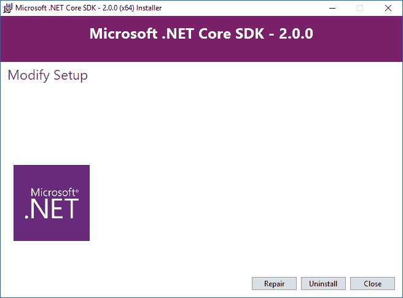

安装后，应该会在 `C:\Program Files\dotnet\sdk` 中出现一个名为 2.0 的新文件夹（或当时可用的最新版本）。

因此，我们可以使用 `dotnet -version` 和 `dotnet --info` 命令来检查当前版本的详细信息，并查看是否已安装版本 2.0：

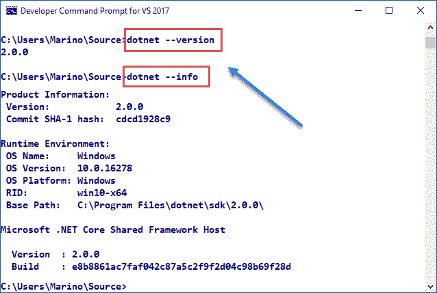

窗口将显示一些基本命令，例如 `--help` 和 `--version`。要检查最新版本可用的模板类型，只需输入 `dotnet new`（不带任何额外参数），你将看到一个类似于此的列表：

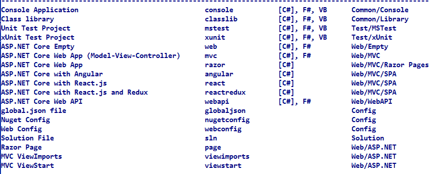

注意，第一次输入该命令时，它将解压缩一些文件（需要几秒钟），以最初填充你的本地包缓存。这只会发生一次，可以提高恢复速度并允许离线访问。

# 创建可能的最小应用程序

我们有 11 种默认的模板类型（你可以从 GitHub 安装额外的模板），针对多种项目类型，还有一个创建包含依赖文件夹中项目的 `.sln` 文件以及与配置和 Web/ASP.NET 解决方案相关的不同选项的解决方案选项。

要测试这个最新版本，在命令提示符中，创建一个新的文件夹，进入它，然后只需输入一个 `dotnet new console` 命令。这将创建两个文件，定义了 .NET Core 的最简单应用程序（控制台应用程序）。

在那一刻，你应该会看到一个 `program.cs` 文件和一个 `[NameOfDirectory].csproj` 文件，其中包含你的应用程序的依赖信息。

注意，之前的版本使用了一个 `project.json` 文件，其中包含相同的信息，但如果你用 V. Studio 2017 打开任何之前的项目，它将识别它并自动迁移。

`.csproj` 文件的内容包含一些基本的 XML 格式指令。

为了在这个初始演示中使用非常基本的资源，我将使用 Notepad++ 进行代码着色和一些其他编辑功能。

你应该在 `.csproj` 文件中看到以下内容：

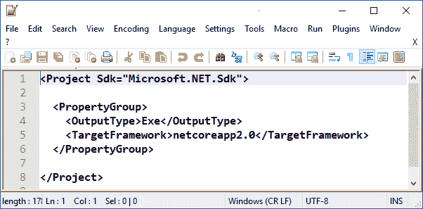

如你所见，这表明我们正在使用 .NET SDK，输出是一个 `exe` 文件，并且我们针对的是 NET Core 2.0。

我们的 `program.cs` 文件的内容如预期（与典型的控制台应用程序在经典 .NET Framework 中没有变化）：

```cs
    class Program 
   { 
      static void Main(string[] args) 
      { 
         Console.WriteLine("Hello World!"); 
      } 
   }  
```

但是，我们仍然需要下载依赖项，这是一个使用 `dotnet restore` 命令在所有其他选项之前执行的任务。发出该命令后，你会看到它下载所有必需的包，并且会出现一个新的 `obj` 目录。

就这样。你最终可以发出 `dotnet run` 命令，该命令会编译并执行应用程序，在控制台中显示预期的消息（没有新内容，我省略了输出）。

# 转换到 ASP .NET Core

现在，要将我们的应用程序更改为 ASP.NET Core 应用程序，首先要做的事情是安装名为 `Microsoft.AspNetCore` 的包。我们可以通过发出 `dotnet add package Microsoft.AspNetCore` 命令来完成此操作。

当我们这样做时，命令行工具将下载适当的包并相应地修改我们的 `.csproj` 文件，因此它也被包含在我们的解决方案中（在发出命令后查看 `csproj` 的新版本）：

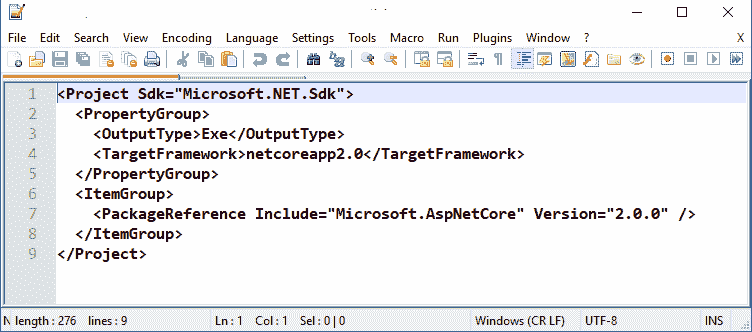

我们看到一个新的 `<ItemGroup>` 标签的存在，它指示要包含的引用及其已下载并添加到项目中的版本。

现在，我们已经准备好创建我们的网站了，它将以一个名为 `Startup.cs` 的类的形式出现（当然，只要你稍后进行配置，你可以将其命名为你想要的任何名称。这不是一个约定名称）。

在那个文件中，我们将引用创建网站所需的三个额外命名空间（尽管是一个基本的网站）：

+   `Microsoft.AspNetCore.Builder`：使用我们定义的 `config` 参数实际构建 Web 服务器

+   `Microsoft.AspNetCore.Hosting`：用于持有 Web 应用程序

+   `Microsoft.AspNetCore.Http`：用于所有 HTTP 相关活动

有这些引用后，我们需要添加一个名为 `Configure` 的方法（这是通过约定），我们将指示服务器启动时需要执行的最小操作。

在这里，我们将开始看到依赖注入（DI）的实际应用，因为这个非常基本的方法的形状如下：

```cs
    using Microsoft.AspNetCore.Builder; 
    using Microsoft.AspNetCore.Hosting; 
    using Microsoft.AspNetCore.Http; 

    namespace WebApplication1 
    { 
      public class Startup 
      { 
        public void Configure(IApplicationBuilder app, 
            IHostingEnvironment env) 
        { 
          if (env.IsDevelopment()) 
          { 
            app.UseDeveloperExceptionPage(); 
          } 
          app.Run(async (context) => 
          { 
            await context.Response.WriteAsync("This is a first
                  web app..."); 
          }); 
        } 
      } 
    } 
```

但是，在我们开始解释该文件的内部细节之前，让我们确保它能够正确编译，并且将我们的应用程序重定向到新的网站。

因此，我们将发出另一个 `dotnet restore` 命令，以便所有新的引用都正确定位，下一步将是修改我们的主入口点，创建一个新的使用刚刚创建的 `Startup` 类的 Web 宿主。

为了这个目的，新的 `Main()` 入口点将使用对 `Microsoft.AspNetCore.Hosting` 命名空间的引用，并定义以下内容：

```cs
    using Microsoft.AspNetCore; 
    using Microsoft.AspNetCore.Hosting; 

    namespace WebApplication1 
    { 
      public class Program 
      { 
        public static void Main(string[] args) 
        { 
            BuildWebHost(args).Run(); 
        } 

        public static IWebHost BuildWebHost(string[] args) => 
            WebHost.CreateDefaultBuilder(args) 
                .UseStartup<Startup>() 
                .Build(); 
      } 
    } 
```

最后，我们可以重复执行 `dotnet run` 命令，我们将看到两个不同的输出。在一侧的 CLI 环境中，我们将生成一个 Web 宿主并运行它（默认情况下，使用端口号 `5000`），在控制台输出中指示：

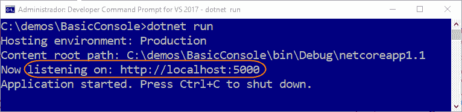

该宿主将持续运行并监听该端口，直到我们使用 *Ctrl* + *C* 停止它。现在，我们可以打开浏览器并输入 URL 以查看以下页面：

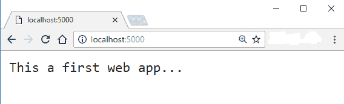

当然，那个页面不包含任何 HTML，只有我们命令服务器在接收到该端口的请求时发送给用户的文本。如果你想检查这一点，请查看源代码。

但是，在我们继续解释前面的代码之前，理解中间件的概念非常重要，它从 ASP.NET Core 一开始就存在。

# 中间件

当然，中间件指的是软件，但是指使用应用程序管道组装的软件，这种方式便于处理请求和响应。

显然，你可能想知道应用程序管道是什么。维基百科这样定义这些术语：“*在软件工程中，管道由一系列处理元素（进程、线程、协程、函数等）组成，排列得使得每个元素的输出是下一个元素的输入；名称是类比物理管道*”。

这些管道在许多软件语言中都很常见，甚至在现代构建中，如 JavaScript Promises，它们定义了异步管道以进行一系列调用，从而提高了执行控制。

管道的一个重要特性是，管道中的每个组件都可以决定是否将信息传递给下一个组件或直接返回，并且能够在调用该组件前后执行自定义操作。

在 ASP.NET Core 中，为了构建请求管道，我们使用委托来处理每个请求。而且，再次发现这个架构中存在一些 SOLID 原则。

每次需要配置这些委托之一时，你都会使用属于 `Use*`、`Run*` 和 `Map*` 方法家族的一个方法（它们是以这些前缀开始的预定义扩展方法集，每个都有特定的用途）。

这些方法与 `Configure` 方法通过依赖注入接收到的 `IApplicationBuilder` 对象相关联。以下图表直观地解释了这种结构（注意执行线程遵循黑色箭头）：

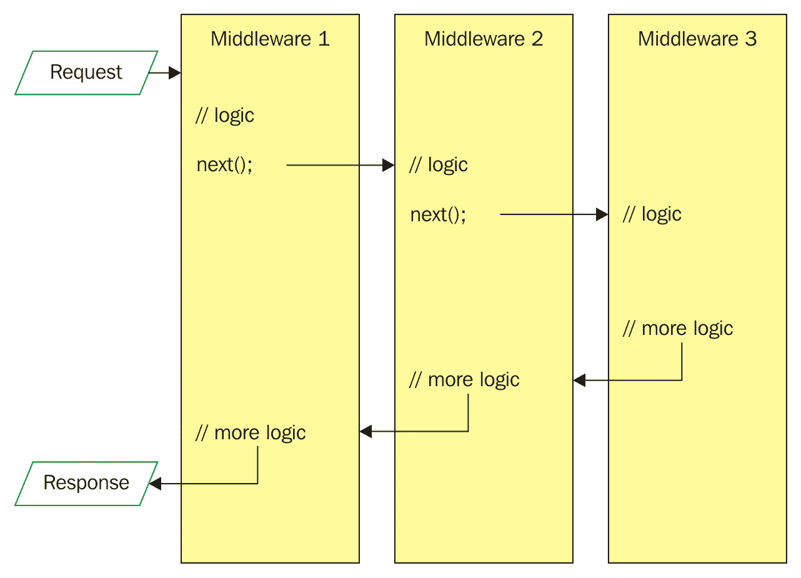

以这种方式，程序员完全负责继续将 `IApplicationBuilder` 对象传递给另一个中间件组件（注意对 `next()` 的调用）或避免任何其他调用，在这种情况下，它将返回到调用方法。

如果这些委托中的任何一个决定不将请求传递给下一个委托，那么就称为**短路**请求管道。这通常很方便，可以避免执行任何不必要的操作。

在异常处理委托的情况下，它们需要在管道的早期调用，以便它们可以捕获可能在序列中稍后发生的异常。

现在，让我们带着这些想法来解释之前的代码。

# Startup 类和依赖注入

因此，之前编写的 `Startup` 类是负责配置请求管道并处理所有发送到应用程序的请求的组件。

这个类是强制性的（尽管，如前所述，它可以有不同的名称），因为运行时会查找它内部的配置方面负责的方法，这包括服务。你可以将其视为通过第一个 SOLID 原则（SoC）实现独立配置的一种便捷方式。

与这种责任分离相关的有趣特性之一是，你可以根据环境（开发、生产等）定义不同的 **Startup** 类。适当的类将在运行时被选中。

这个类是以接受通过依赖注入提供的依赖项的方式定义的。例如，你可以声明 `IHostingEnvironment` 或 `ILoggerFactory` 类型的变量，以获得配置与托管或日志相关的不同功能的能力（记住在第三章中介绍 .Net Core 2.0 中的依赖注入）。

那么，在这个类中什么是必需的，什么是可选的？`Configure` 方法是必需的。无论类的名称是什么，运行时都会在其内部查找它，并调用它以确保应用所需的条件。

然而，`ConfigureServices()` 方法是可选的，但如果它存在，它将在初始过程中在 `Configure()` 之前被调用。以下图示说明了这个顺序：

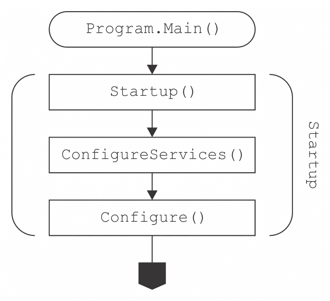

（图片来源：[`developer.telerik.com/featured/understanding-asp-net-core-initialization/`](http://developer.telerik.com/featured/understanding-asp-net-core-initialization/))

在进一步进行演示之前，让我们更详细地解释之前的代码。

# 代码解释

从 `Main()` 方法开始，在提到之前提到的 `Hosting` 子空间之后，我们通过调用 `WebHostBuilder` 类来构建一个新的网络服务器。这个类允许使用各种中间件组件和入口点条件来配置和构建网络服务器。

因此，在调用构造函数之后，我们管道了另外三个调用：

+   一个 `UseKestrel()` 方法，这是 Visual Studio 2017（以及 CLI）使用的默认轻量级开发服务器（我们稍后会解释这一点）

+   另一次调用 `UseStartup<Startup>()`，以指示服务器将在何处找到 `Configure()` 方法来启动其进程（记住类的名称无关紧要，只要它包含 `Kestrel` 初始查找的方法即可）

+   最后，还有一个 `Build()` 方法，它使用之前设置的值创建并初始化新的服务器

在所有这些准备就绪之后，最后一句话只是调用了 `Run()` 方法来启动进程。

在启动该进程时，`Configure` 方法被激活。它的唯一参数（在这种情况下）是 `IApplicationBuilder` 类型，并且，正如你所看到的，它通过依赖注入（我们的代码没有进行任何先前的引用或实例化）传递给这个方法。

因此，当创建服务器时，在通信过程中隐含的主要基本对象以这种方式提供服务，期望用户以后续调用其方法的形式提供所有所需的行为。

如果我们查看接口定义，这相当直观：

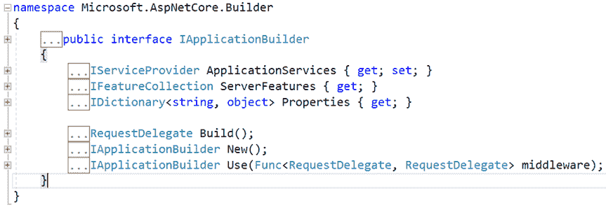

当`Configure`方法接收到`IApplicationBuilder`类的实例时，将提供一些额外的功能。如前所述，这些功能是通过扩展方法提供的，采用`Use*`、`Run*`和`Map*`方法的形式，这些方法帮助程序员在编码配置方面获得更多独立性和粒度。

注意以下截图如何显示不同的配置选项并建议使用中间件：

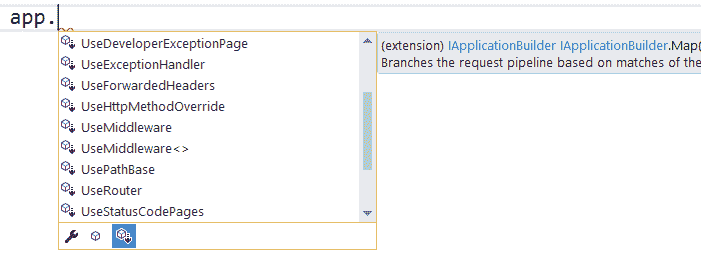

每种扩展方法都提供了一种调用隐式委托的方式。请注意，虽然`Use*`方法族在管道中隐式地多次调用`Next()`以继续进行（实际上这取决于其他功能），但`Run*`方法族停止了传播并短路了管道（因此，它不会调用下一个请求委托）。

此外，`Map*`方法族允许分支管道，执行返回该点的调用并相应地扩展功能。

# 新的 ASP.NET 服务器

让我们快速回顾一下在为 ASP.NET Core 编程时使用的服务器的一些重要方面，因为这是与这个新平台相关的主要变化之一。

首先，一个 ASP.NET Core 应用程序运行一个进程内的 HTTP 服务器实现。该实现正在监听 HTTP 请求，并将这些请求发送到名为`HttpContext`的对象中，该对象包含一组组合到其中的功能。

这个版本的 ASP.NET 提供了两种不同的服务器实现：`Kestrel`和`WebListener`。正如官方文档提醒我们的：

# Kestrel

`Kestrel`是一个基于`libuv`的跨平台 HTTP 服务器，`libuv`是一个跨平台的异步 I/O 库：

`libuv`被定义为一种多平台支持库，专注于异步 I/O。它最初是为 Node.js 开发的，但也被 Luvit、Julia、pyuv 和其他使用。

Kestrel 是包含在 ASP.NET 项目模板中的默认 Web 服务器。优点是，如果您的应用程序仅从内部网络接受请求，则可以单独使用它。

这是 Kestrel 默认场景的工作方案：

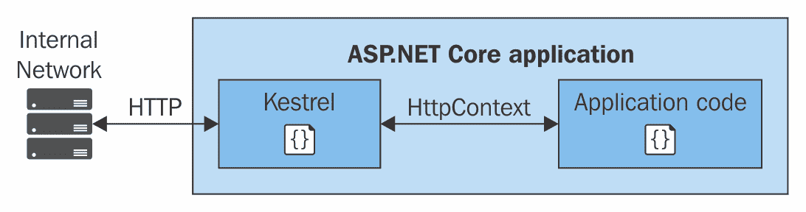

（图片来源：[`docs.microsoft.com/en-us/aspnet/core/fundamentals/servers/`](https://docs.microsoft.com/en-us/aspnet/core/fundamentals/servers/))

然而，如果您将应用程序暴露给互联网，将存在一些 Kestrel 未准备好应对的安全问题（它相对较新，并且还没有整个所需的安全资源集）。对于这些情况，建议的配置是使用反向代理服务器，例如 IIS、Apache 或 Nginx，以提供功能。

注意，正如文档所述，反向代理服务器*从互联网接收 HTTP 请求，并在进行一些初步处理后将其转发到 Kestrel*（请参阅以下截图）：

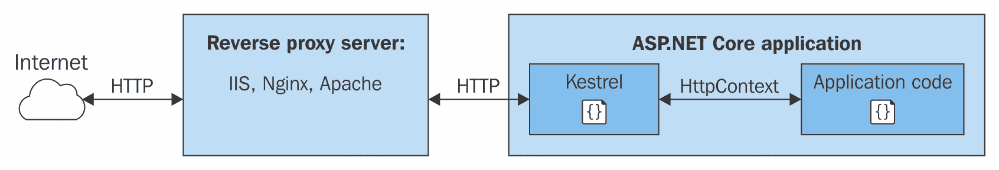

（图片来源：[`docs.microsoft.com/en-us/aspnet/core/fundamentals/servers/`](https://docs.microsoft.com/en-us/aspnet/core/fundamentals/servers/))

另一个重要的一点是，没有 Kestrel 或自定义服务器实现，您不能使用任何那些反向代理服务器。这是因为 ASP.NET Core 被设计为在其自己的进程中运行，以便它可以在各个平台上保持一致的行为。

我们可能面临的问题是我们可能遇到的是 IIS、Nginx 和 Apache 规定了它们自己的启动过程和环境。结果是，为了直接使用它们，应该适应每个的要求。

这样，Kestrel 赋予了 ASP.NET Core 以任何所需形式编码`Program`和`Startup`类的功能，以满足用户的需求，同时避免对具体、特定服务器的另一个依赖。这也是中间件在这个环境中如此重要的原因之一。

# WebListener

`WebListener`是一个基于`Http.Sys`内核驱动器的 Windows 专用 HTTP 服务器。它作为那些场景的替代方案，在这些场景中，将我们的应用程序暴露给互联网是强制性的，但我们不希望使用 IIS，如果出于某种原因不能这样做的话。

以下架构表示 WebListener 在类似之前 Kestrel 所展示的场景中的角色：

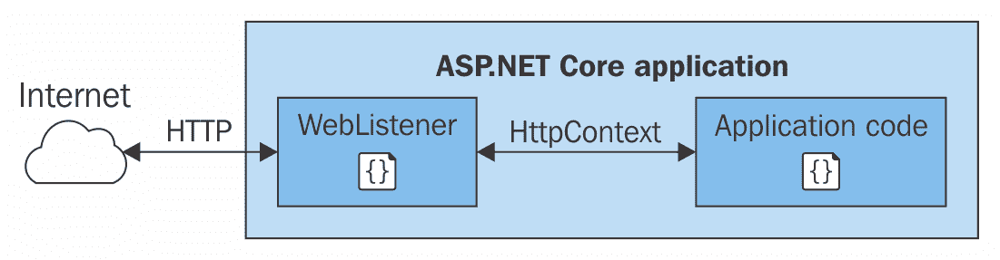

（图片来源：[`docs.microsoft.com/en-us/aspnet/core/fundamentals/servers/`](https://docs.microsoft.com/en-us/aspnet/core/fundamentals/servers/))

同样，如果您在内部网络中工作需要 Kestrel 不支持的一些功能，您可以使用 WebListener 进行相当类似的配置：

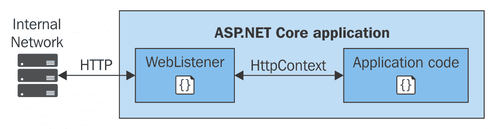

（图片来源：[`docs.microsoft.com/en-us/aspnet/core/fundamentals/servers/`](https://docs.microsoft.com/en-us/aspnet/core/fundamentals/servers/))

最后，请记住，对于内部网络场景，Kestrel 是推荐的，因为它提供了改进的性能。无论如何，如果您想了解更多关于 WebListener 提供的功能，官方文档可在[`docs.microsoft.com/en-us/aspnet/core/fundamentals/servers/weblistener`](https://docs.microsoft.com/en-us/aspnet/core/fundamentals/servers/weblistener)找到。

# 架构中的依赖倒置 - OWIN

还有可能创建自己的服务器实现，以与 ASP.NET Core 一起工作。**.NET 开放 Web 接口**（**OWIN**）是平台支持的第三种可能的实现。

在某些方面，OWIN 的实现也与依赖倒置原则相关。其主要目标是使 Web 应用程序与 Web 服务器解耦。

为了这个目的，它定义了创建中间件的标准方式，这些中间件可以在管道中使用，以配置和调整您的服务器。

# 分析默认模板

现在是时候打开 Visual Studio 2017（或安装了 ASP.NET Core 的 2015 版本）并查看它，并解释默认模板是如何工作的。

记住，ASP.NET Core 也可以使用经典的.NET Framework 执行，因此，当你创建一个新的 Web 项目时，你最初会被要求在三个主要选项之间进行选择：经典 ASP.NET、带有.NET Core 的 ASP.NET Core 和带有经典.NET Framework 的 ASP.NET Core：

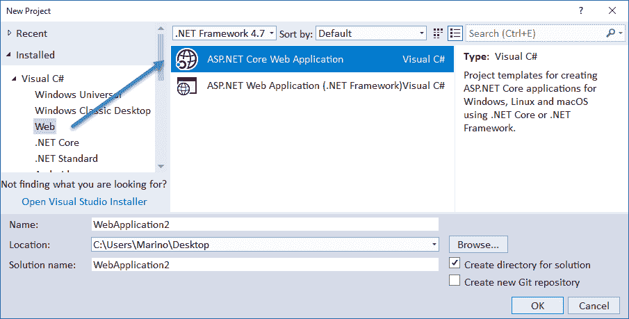

一旦选择，你将看到一个额外的选择窗口：空、Web API、Web 应用程序、Web 应用程序（模型-视图-控制器），以及为第三方库添加到 2.0 版本的一些新选项，包括 Angular、React.js 和 React.js 与 Redux。

在第一种情况下，我们现在使用的是创建一个具有最小配置的应用程序，以便能够使用 Kestrel 创建和运行一个 Web 服务器，并在浏览器中显示一些文本。它很简单，但允许我们更详细地了解它是如何完成的，并做出一些更改。

其他三个（Web API、Web 应用程序和 Web App MVC）与经典 ASP.NET 中的对应项相似，不同之处在于它们使用新的架构和配置文件。这样，我们将能够更好地欣赏从旧架构迁移到新架构所需的迁移过程。

你应该看到以下对话框：

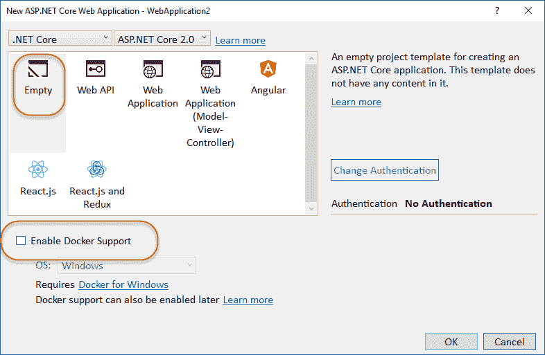

注意，你也可以像以前版本一样更改身份验证，并且有一个复选框允许启用 Docker 支持。

结果项目比我们之前做的基本演示要复杂一些，尽管基本组件是相同的。然而，在配置方面有一些显著的变化。

# 配置文件

一旦编译了应用程序并激活了解决方案资源管理器中的“查看所有文件”选项，你将注意到一些额外的配置文件，它们负责一些任务，例如在默认 URL 上启动浏览器。这些选项定义在`Properties`目录中可用的`launchSettings.json`文件内。

看一看也是相当说明性的：

```cs
    { 
      "iisSettings": { 
        "windowsAuthentication": false, 
        "anonymousAuthentication": true, 
        "iisExpress": { 
          "applicationUrl": "http://localhost:57539/", 
          "sslPort": 0 
        } 
      }, 
      "profiles": { 
        "IIS Express": { 
          "commandName": "IISExpress", 
          "launchBrowser": true, 
          "environmentVariables": { 
            "ASPNETCORE_ENVIRONMENT": "Development" 
          } 
        }, 
        "ASPNETCoreDemo1": { 
          "commandName": "Project", 
          "launchBrowser": true, 
          "environmentVariables": { 
           "ASPNETCORE_ENVIRONMENT": "Development" 
          }, 
          "applicationUrl": "http://localhost:57540" 
        } 
      } 
```

如你所见，这里应用了三个主要的配置区域：`iisSettings`，用于指示 IIS 行为，包括要使用的 URL，一个只包含一个`IISExpress`配置文件的`profiles`部分，表示应该启动一个浏览器，以及关于开发模式的提示，以及一个名为应用程序本身（`ASPNETCoreDemo1`）的最终配置，包含类似的信息。

当然，如果你深入到`\bin`或`\obj`目录，你会看到更多，例如带有额外信息的`ASPNETCoreDemo1.runtimeconfig.json`。最后，如果你检查`.csproj`文件，你也会看到一些添加项：

记住，在解决方案资源管理器的项目上下文菜单选项中，你现在有一个选项可以直接在 Visual Studio 2017 中打开它。

```cs
     <Project Sdk="Microsoft.NET.Sdk.Web"> 
     <PropertyGroup> 
      <TargetFramework>netcoreapp1.1</TargetFramework> 
     </PropertyGroup> 

     <ItemGroup> 
      <Folder Include="wwwroot\" /> 
    </ItemGroup> 
    <ItemGroup> 
      <PackageReference Include= "Microsoft.ApplicationInsights.AspNetCore" 
           Version="2.0.0" /> 
      <PackageReference Include="Microsoft.AspNetCore" Version="1.1.1" /> 
    </ItemGroup> 
    </Project> 
```

没有太多变化，但现在它表明了使用`wwwroot`文件夹，并添加了`ApplicationInsights`调用。显然，没有文件类型指示，因为默认情况下，编译的组件是一个 DLL。

# 入口点

让我们从`program.cs`开始。它的`main()`方法类似，但它包含新的中间件：

```cs
    public static void Main(string[] args)
    {
      var host = new WebHostBuilder()
      .UseKestrel()
      .UseContentRoot(Directory.GetCurrentDirectory())
      .UseIISIntegration()
      .UseStartup<Startup>()
      .UseApplicationInsights()
      .Build();
      host.Run();
    }
```

三大主要区别是：`UseContentRoot()`、`UseIISIntegration()`和`UseApplicationInsights()`。

`UseContentRoot(Directory.GetCurrentDirectory())`表示，当用户请求物理资源时，将搜索该目录。默认情况下，它将指向`wwwroot`目录。

`UseIISIntegration()`用于指示将使用 IIS 作为反向代理（如我们之前提到的），而`UseApplicationInsights()`则有助于监控和审计您的应用程序。

正如官方文档所述（[`github.com/Microsoft/ApplicationInsights-aspnetcore/wiki/Getting-Started-with-Application-Insights-for-ASP.NET-Core`](https://github.com/Microsoft/ApplicationInsights-aspnetcore/wiki/Getting-Started-with-Application-Insights-for-ASP.NET-Core)），它允许我们使用 Visual Studio Application Insights 监控您的实时 ASP.NET Core 应用程序。Application Insights 是一个可扩展的分析平台，它监控您的实时 Web 应用程序的性能和用法。通过您从应用程序在野外的性能和有效性获得的反馈，您可以在每个开发生命周期中做出明智的设计方向选择。

因此，我们有一个通过新的中间件加强的入口点，因此我们可以从开始使用 DI。让我们看看`Startup`类（配置）中它做了什么。

# 默认的 Startup 类

首先要注意的是`ConfigureServices`的存在（即使它是空的）。如图所示，它允许向我们的管道添加不同的服务，并将它们存储在`services`集合中。这将是我们注册我们自己的服务的地方。

还要注意，其中一些方法已经准备好添加具有不同生命周期配置的服务（`AddSingleton`、`AddScoped`和`AddTransient`）。稍后，我们将看到如何在此处添加服务，以便应用程序可以使用给定的功能，例如数据库访问等，使用它通过依赖注入接收到的`IServiceCollection`对象（请参阅以下截图）：

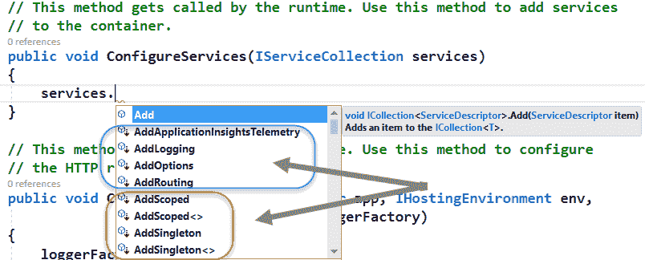

关于`Configure()`方法，这次它通过依赖注入（当然，当然是通过依赖注入），接收了三个类型的实例：`IApplicationBuilder`、`IHostingEnvironment`和`ILoggerFactory`，如下代码所示：

```cs
    // This method gets called by the runtime. Use this method to //
    // configure the HTTP request pipeline. 
    public void Configure(IApplicationBuilder app, 
       IHostingEnvironment env, ILoggerFactory loggerFactory) 
    { 
      loggerFactory.AddConsole(); 

      if (env.IsDevelopment()) 
      { 
        app.UseDeveloperExceptionPage(); 
      } 

      app.Run(async (context) => 
      { 
        await context.Response.WriteAsync("Hello World!"); 
      }); 
    } 
```

第一个在应用程序结束时使用，用于启动应用程序，这次使用`async/await`结构来保证正式的异步调用，返回一个字符串。

`ILoggerFactory` 的使用方式与我们在第三章，“.NET Core 2.0 中的依赖注入介绍”中所做的方式相似，用于配置将输出到控制台的消息。

最后，`IHostingEnvironment` 变量用于检查应用程序是否处于开发模式，如果是这样，则配置一个开发者异常页面，我们可以在其他地方定义它。

ASP.NET Core 区分了四种可能的开发模式：`development`、`production`、`staging` 和一个第四个 `environment` 模式，允许定义自己的模式。该值可以在 `Project/Properties/Debug` 窗口中配置，您现在可以添加不同的环境变量，就像您在下面的屏幕截图中所看到的那样：

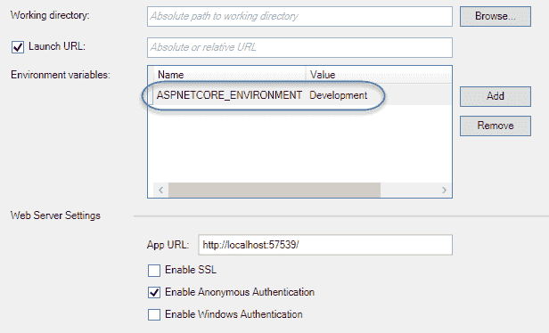

这些值由 `IHostingEnvironment` 对象读取，允许在应用程序启动过程之前插入操作。请注意，它不是一个单一值，而是一个集合，因此您可以添加所需的环境值，并使用该对象的方法来读取其中的一些是否为真。

您也可以使用类似 `ASPNETCORE_ENVIRONMENT="MyCompany"` 这样的方式来自定义并轻松检查这个值，就像您在下面的屏幕截图中所看到的那样，使用 `IsEnvironment()` 方法。

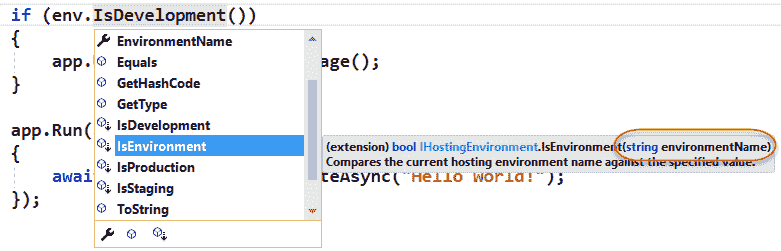

因此，如果我们将之前的 `development` 值更改为一个自定义值，例如 `PACKT`，我们可以在浏览器中用以下方式修改退出：

```cs
    app.Run(async (context) => 
    { 
       if (env.IsEnvironment("Packt")) 
       { 
        await context.Response.WriteAsync("We're in PACKT 
             development mode!"); 
       } 
       else await context.Response.WriteAsync("Hello World!"); 
    }); 
```

在这种情况下，输出将不同，因此我们可以自由配置任何内容，并将其与其他值混合，以获得完全定制、模式依赖的体验：

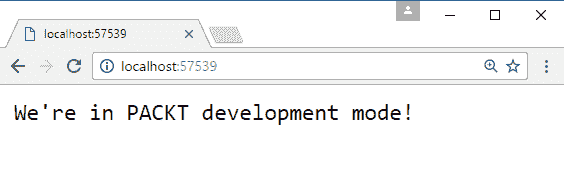

但是，关于依赖注入还有很多内容，我们将在接下来的几节中看到。

# ASP.NET Core 中的依赖注入

当然，这种行为得益于 ASP.NET Core 引擎内部存在一个依赖注入容器。官方文档非常清楚地说明了这一点：*如果给定类型已声明它有依赖项，并且容器已配置为提供依赖类型，它将在创建请求的实例时创建这些依赖项*。

以这种方式，容器管理一个对象的生命周期，避免了硬编码对象构造的需要。

除了其他内置实现之外，请记住 ASP.NET Core 提供了一个简单的依赖注入容器（我们在第三章，“.Net Core 2.0 中的依赖注入介绍”中已经测试过），它由 `IServiceProvider` 接口表示。

正如我们所提到的，在这个平台上使用该接口配置服务的位置是 `ConfigureServices` 方法，我们将在下一节中分析它。

# ASP.NET Core 提供的服务

通过依赖注入，ASP.NET Core 内部提供了相当多的服务。以下表格显示了这些服务及其生命周期的指示：

| **服务类型** | **生命周期** |
| --- | --- |
| `Microsoft.AspNetCore.Hosting.IHostingEnvironment` | 单例 |
| `Microsoft.Extensions.Logging.ILoggerFactory` | 单例 |
| `Microsoft.Extensions.Logging.ILogger<T>` | 单例 |
| `Microsoft.AspNetCore.Hosting.Builder.IApplicationBuilderFactory` | 请求范围 |
| `Microsoft.AspNetCore.Http.IHttpContextFactory` | 请求范围 |
| `Microsoft.Extensions.Options.IOptions<T>` | 单例 |
| `System.Diagnostics.DiagnosticSource` | 单例 |
| `System.Diagnostics.DiagnosticListener` | 单例 |
| `Microsoft.AspNetCore.Hosting.IStartupFilter` | 请求范围 |
| `Microsoft.Extensions.ObjectPool.ObjectPoolProvider` | 单例 |
| `Microsoft.Extensions.Options.IConfigureOptions<T>` | 请求范围 |
| `Microsoft.AspNetCore.Hosting.Server.IServer` | 单例 |
| `Microsoft.AspNetCore.Hosting.IStartup` | 单例 |
| `Microsoft.AspNetCore.Hosting.IApplicationLifetime` | 单例 |

如你所见，这是一个相当全面的选项列表，我们必须添加通过 `Run*`, `Use*` 和 `Map*` 方法注释中提到的“已安装”和“可用”的功能。

因此，我们可以区分两种方法类型，在这里：那些已经可用且可以随意包含的方法（在 `Program/Main` 中显示的），以及那些你可以自定义的方法（使用 `Startup` 类），无论是通过添加还是通过创建自己的类和接口并将它们添加到 `ConfigureServices` 初始过程中。

# 启动时可用服务的关联

总结来说，我们有几种方式可以通过依赖注入在 ASP.NET Core 2.0 中通过 Startup 类包含功能：

+   通过为 Startup 类创建自己的构造函数，该构造函数引用先前定义的映射接口 => 类

+   通过引用 `ConfigureServices` 方法中所需的服务

+   通过使用我们看到的 `Configure()` 方法的方式

如果你按照执行顺序考虑 `Startup` 的方法，以下服务可供使用：

+   构造函数：`IHostingEnvironment`, `ILoggerFactory`

+   `* 服务配置`: `IServiceCollection`

+   配置：`IApplicationBuilder`, `IHostingEnvironment`, `ILoggerFactory`, `IApplicationLifetime`

# 在 Web 应用程序模板中识别服务

Web 应用程序模板在展示服务和依赖注入的角色方面更为明显，因此我们将创建一个与经典 ASP.NET MVC 5 相当的项目，以便在经典 .NET Framework 中进行比较，从而识别这些功能。

一旦创建了一个这样的新项目，你可能会发现许多在先前版本中存在的元素：用于控制器和视图的文件夹，定义应用程序中不同视图的 Razor 文件等。

但是，现在我们已经看到了一些主要的变化，对关键文件的回顾是非常有启发性的。在 `Program/Main` 中没有变化，但我们在 `Startup` 类中会发现很多。引用（`using` 语句）与基本演示相同，所以我在这里省略了代码。

最有趣的部分在 `Startup` 类本身：

```cs
    public class Startup 
    { 
      public Startup(IHostingEnvironment env) 
      { 
        var builder = new ConfigurationBuilder() 
            .SetBasePath(env.ContentRootPath) 
            .AddJsonFile("appsettings.json", optional: false,  
                         reloadOnChange: true) 
          .AddJsonFile($"appsettings.{env.EnvironmentName}.json",  
                         optional: true) 
            .AddEnvironmentVariables(); 
        Configuration = builder.Build(); 
      }   

      public IConfigurationRoot Configuration { get; } 

      // This method gets called by the runtime. Use this method to  
      // add services to the container. 
      public void ConfigureServices(IServiceCollection services) 
      { 
        // Add framework services. 
        services.AddMvc(); 
      } 
```

到目前为止，默认模板只初始化 MVC 引擎，将其视为一个额外的服务，对用户来说完全是可选的。

接下来，我们将看到如何使用此方法注册和配置其他内置或自定义服务：

```cs
    // This method gets called by the runtime. Use this method to  
    // configure  the HTTP request pipeline. 
    public void Configure(IApplicationBuilder app,  
        IHostingEnvironment env, ILoggerFactory loggerFactory) 
    { 
        loggerFactory.AddConsole(Configuration.GetSection("Logging")); 
        loggerFactory.AddDebug(); 

        if (env.IsDevelopment()) 
        { 
            app.UseDeveloperExceptionPage(); 
            app.UseBrowserLink(); 
        } 
        else 
        { 
            app.UseExceptionHandler("/Home/Error"); 
        } 

        app.UseStaticFiles(); 

        app.UseMvc(routes => 
        { 
            routes.MapRoute( name: "default", 
                template:{controller=Home}/{action=Index}/{id?}"); 
        }); 
     } 
```

首先，我们现在有一个构造函数和一个只读私有属性（`Configuration`），其类型为 `IConfigurationRoot`。嗯，在构造函数末尾调用的 `builder.Build()` 方法就是这种类型，并提供了一种方便的方式来包含和访问从多个 `.json` 文件中加载的所有配置信息。

所有这些信息都在初始化过程的非常开始时收集，所以任何需要从外部读取的内容都在 `ConfigureServices` 和 `Configure` 调用之前准备好（参见以下截图显示加载后的 `Configuration` 值）：

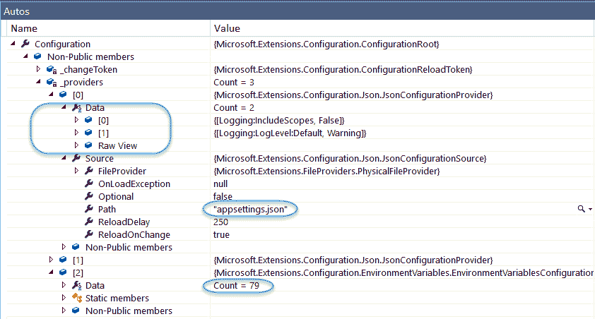

正如你所见，`ConfigurationBuilder` 类在构造函数的第一句话中被创建，并负责加载和读取所有这些 `.json` 文件的内容，并添加环境变量。这允许进一步访问任何 `json` 定义的值，以及使用外部信息调整应用程序的能力。

收集了所有这些信息后，`ConfigureServices` 方法出现并注册了一组服务，例如 MVC，通过添加 `UseMvc` 调用来实现（是的，它默认不可用，如果我们想使用该架构，必须显式将其添加到管道中）。

如你在这些示例中看到的，这个 ASP.NET 中间件，如 MVC，遵循使用单个 `Add*ServiceName*` 扩展方法来注册该功能所需的所有服务的约定。注意，这个调用只将服务添加到服务集合中，但它并没有配置它（这将在稍后进行）。

然后，`Configure()` 方法出现。它首先从 `Configuration` 对象（`Logging` 部分）中恢复信息，并添加了我们之前章节中看到的方式的调试功能。

接着是错误处理，通过检查我们是否处于开发模式或其他模式（它还启用了 `BrowserLink` 功能），然后继续调用 `UseStaticFiles()`，允许恢复和提供本地文件（正如你所猜到的，它也默认不可用）。

注意，这个功能可以被配置为指向服务器上的其他位置（相对请求路径）：

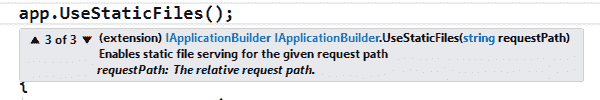

最后一步是通过调用 `UseMvc()` 配置 MVC 路由，其中提供了路由的配置。注意，与传统的 ASP.NET MVC 4/5 相比，您会在不同的文件中注册这些路由，这种方法是如何不同的。然而，语法是相似的，只是这次您通过 lambda 表达式定义它。

如您从代码中可以推断出的，第一个 lambda 参数是由依赖注入提供的，并且其类型为 `IRootBuilder`。查看 IDE 提供的 Intellisense 信息以检查此功能，如下面的截图所示：

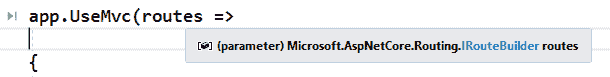

然后，默认路由被配置为指向 `HomeController` 类和 `Index` 动作方法，如果没有其他组合由请求提供（语法也略有简化）。

因此，我们通过 `Startup` 类的这次旅行得出的结论是，ASP.NET Core 及其 MVC 变体的最重要的架构方面是通过依赖注入提供的，并且开发者有责任以这种方式调整他们的应用程序，以便只包含/排除应用程序需要的部分，以最小化过载。

# 在 ASP.NET MVC 视图中使用依赖注入

史蒂夫·史密斯提出一个演示（[`ardalis.com/how-to-list-all-services-available-to-an-asp-net-core-app`](http://ardalis.com/how-to-list-all-services-available-to-an-asp-net-core-app)），它可以阐明在特定时刻可用的服务总数。

这给了我一个关于如何使用 MVC 获取所有可用服务的列表的另一个演示的想法，即在视图中包含 `Microsoft.Extensions.DependencyInjection` 命名空间。让我们从我们刚刚分析的默认模板开始，并进行适当的修改。

首先，如果我们想在 Web 应用程序模板的主菜单中集成列表作为新的选项，我们需要在 `_Layout.cshtml` 文件中添加一个新的链接，指向将显示所有服务的相应视图。这相当直接（注意，这里没有像上一个版本中的 `ActionLinks`）：

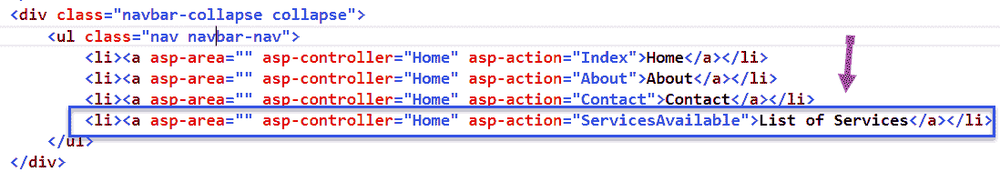

通过这一新行，我们创建了一个新的应用程序菜单元素和相应的视图（稍后命名为 `ServicesAvailable`），它将利用在 `_Layout.cshtml` 标题中加载的 Bootstrap 类来格式化输出并使其更易于阅读。

现在，如果我们考虑控制器（在这个例子中是 `HomeController`），我们可以添加一个新的动作方法，遵循其他方法的语法，使用 `ViewData` 对象将所需信息传递给我们的新视图。

我们需要的信息存储在 `Startup.cs` 中定义的 `IServiceCollection` 对象的实例中，我们希望使其对控制器可用，以便我们可以在以后将其分配给我们的 `ViewData` 传递者。

让我们回顾一下`Startup`，并进行一些更改（不多）。实际上，只需要以下这些：

```cs
    public static IServiceCollection _services { get; private set; } 
    public void ConfigureServices(IServiceCollection services) 
    { 
      // Add framework services. 
      services.AddMvc(); 
      _services = services; 
   } 
```

我们创建一个公共静态变量`_services`来保存所有服务，一旦配置完成，就将`services`变量分配给它，其唯一目的是从控制器中访问其内容。

现在，回到`HomeController`，我们可以添加一个新的控制器，代码如下：

```cs
    public IActionResult ServicesAvailable() 
    { 
      ViewData["Services"] = Startup._services; 
      return View(); 
    } 
```

通过这几行代码，我们的服务现在在控制器中可用，并且我们可以以非常简单的方式将它们传递给视图（注意这里没有数据模型，因为它只是一个简单的数据集合，而`ViewData`对象正好可以满足这个目的）。

最后一步将是添加`ServicesAvailable`视图。代码如下（我将从头部的解释开始）：

```cs
    @using Microsoft.Extensions.DependencyInjection; 
    @{ 
      ViewData["Title"] = "Services Available"; 
      var _services = @ViewData["Services"]; 
    } 
    <h2>@ViewData["Title"]</h2> 
    <h1>All Services</h1> 
```

首先，回想一下，当我们在一个视图中引用一个命名空间时，`using`语句不应属于一个代码块。相反，它将是一个以`@`符号为首的独立句子（我们需要`DependencyInjection`命名空间，以便将传递到`ViewData`对象中的信息转换为真正的`IServiceCollection`对象）。

接下来，我们在变量中恢复该信息（该变量将在整个视图中本地可用）。请注意，我使用的是`var`关键字而不是接口名称，因为否则编译器会报错。这样做更简单，并且可以在代码中稍后进行类型转换。

最后，我们将使用表格来展示`IServiceCollection`中的三个服务（在视图中称为`_services`）所保存的一些信息。注意，这里也使用了`as`运算符进行类型转换，以获取真正的`IServiceCollection`对象：

```cs
    <table class="table table-bordered"> 
    <thead> 
        <tr> 
            <th>Type</th> 
            <th>Lifetime</th> 
            <th>Instance</th> 
        </tr> 
    </thead> 
    <tbody> 
     @foreach (var svc in _services as IServiceCollection) 
     { 
       <tr> 
       <td>@svc.ServiceType.Name</td>           
        <td>@svc.Lifetime</td>            
        <td>@svc.ImplementationType?.Name</td> 
        </tr> 
     } 
    </tbody> 
    </table> 
```

就这样！现在我们可以启动应用程序并选择新的菜单元素*服务列表*。一个新视图将显示出来，其中包含一个相当长的服务列表，同时展示了我们如何在视图中使用`DependencyInjection`命名空间（或任何其他命名空间）（请参见以下截图）：

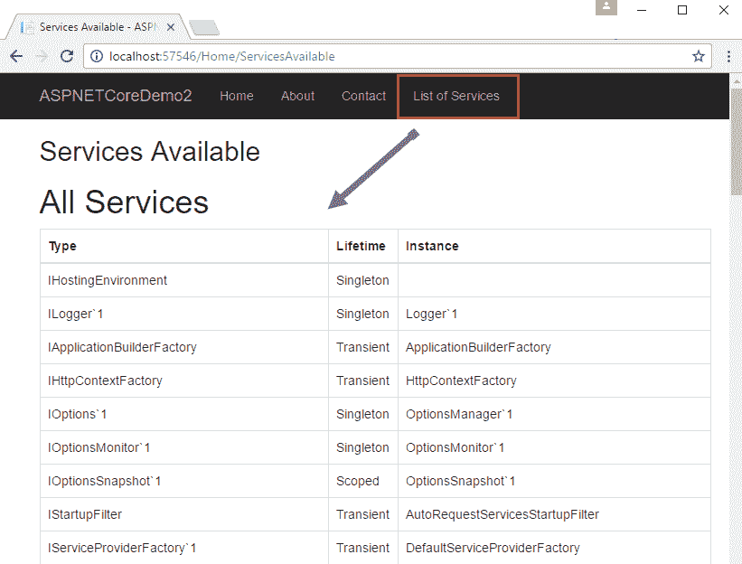

# 垃圾回收和自定义服务

与垃圾回收行为相关，ASP.NET MVC 自动化了一些操作，并将其他操作留给用户的判断。

主要规则如下：如果您在过程中注册了一个服务并调用了其构造函数，那么您有义务销毁该对象；否则，如果容器负责创建对象，它将调用实现的对象上的`Dispose()`。

在实践中，想象一下，我们有两个服务（`Service1`和`Service2`），它们位于一个文件夹（`Services`）中，并且这两个服务都实现了`Disposable`接口。为了简化这部分，我将代码折叠起来，所以我只显示理解这个想法的相关行（请参见以下截图）：

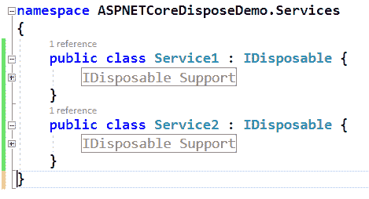

行为将根据每个服务的实例化而有所不同（我已经在每个情况下进行了注释，所以你会看到差异）：

```cs
    publicvoidConfigureServices(IServiceCollectionservices)
 {     // Add framework services
     services.AddMvc();
     // container will create the instance(s) of these types
     // and will dispose themservices
     AddScoped<Service1>();
     // Here, the container did not create instance (we do it)
     // so it will NOT dispose itservices
     AddSingleton(newService2());
 }
```

总的来说，这是一种管理服务垃圾回收相当方便的方法。

# 通过依赖注入使用自定义服务

使用这种架构，创建属于我们数据模型中的任何类，或者应用的其他任何部分，并将其准备好并可用于依赖注入，都是非常容易的，并且能够带来与之相关的所有优势。

例如，假设我们想在某个视图中添加一些装饰，形式为随机句子（比如关于程序员和软件工程师的句子），并且我们希望包含这些信息的类通过依赖注入被当作服务处理，这样我们就可以在应用的不同视图中使用这些内容。

我们可以将前一个示例中使用的类重命名为`ProgrammerSentenceSvc`和`EngineerSentenceSvc`，并添加一些非常简单的信息：一个`List<string>`的句子列表，稍后将在我们的控制器中使用这些句子随机检索几个句子并将它们传递给相应的视图。

因此，让我们修改我们的服务以保存所需的信息（我只是展示这些截图，以便专注于相关代码）：

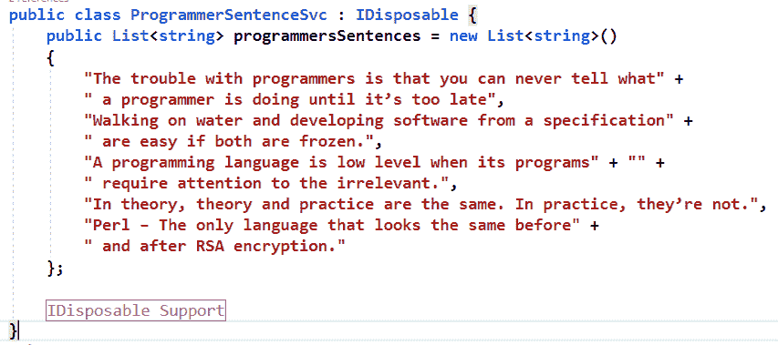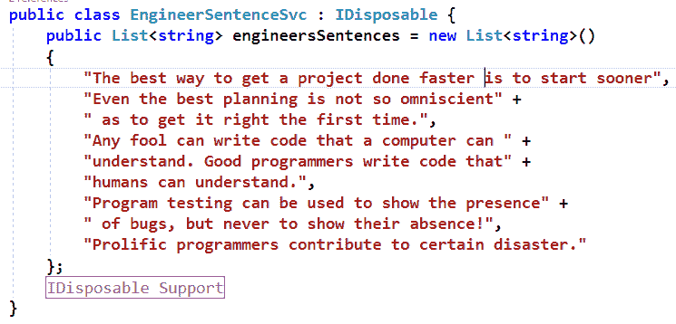

下一步将是通过`ConfigureServices`在`Startup`类中注册这些类，正如我们之前所看到的（我使用两种不同的语法只是为了展示）：

```cs
    publicvoidConfigureServices(IServiceCollectionservices)
 {    // Add framework services.
    services.AddMvc();
    // container will create the instance(s) of these types
    // and will dispose them
    services.AddScoped<ProgrammerSentenceSvc>();
    // Here, the container did not create instance (we do it)
    // so it will NOT dispose it
    services.AddSingleton(newEngineerSentenceSvc());
 }
```

这就是我们需要的，以便在任何一个控制器中都有我们的服务可用。所以，让我们回顾一下我们的`HomeController`，并添加以下操作方法（记住，我们必须通过`using ASPNETCoreDisposeDemo.Services;`来引用我们的服务命名空间）：

```cs
    publicIActionResultSentences(ProgrammerSentenceSvcsvc,
        EngineerSentenceSvcsvc2
     {
      Randomrnd = newRandom();ViewData["ProgSentence"] = 
          svc.programmersSentences[rnd.Next(1,5)];
      ViewData["EngSentence"] = svc2.engineersSentences[rnd.Next(1,5)];
      returnView();
     }
```

就这样！以这种方式注册的任何服务都通过依赖注入自动在控制器中可用，只需将其作为相应操作方法的参数引用即可。

最后一步是创建名为`Sentences`的视图来恢复信息并向用户展示：

```cs
    @{ViewData["Title"] = "Random sentences about programmers
       and engineers";
    }
     <h1>@ViewData["Title"].</h1>
     < hr />
     < h1 > Programmer's Sentence </ h1 >
     <h2>@ViewData["ProgSentence"]</h2>
     < h1 > Engineers' Sentence </ h1 >
     <h2>@ViewData["EngSentence"]</h2>
```

如果我们添加（就像之前一样），在默认菜单旁边添加一个指向此操作方法名称的新链接，我们将看到以下输出：

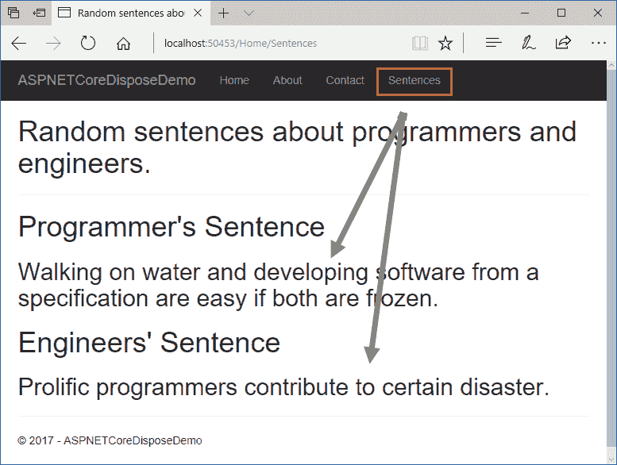

如您所见，输出是预期的，并且与 MVC 模型相比，应用程序的一般架构与之前的版本相当相似。

# 服务和数据管理

尽管数据管理不是本书的目标，但我想要提到，当在 ASP.NET Core MVC 应用程序中访问数据时，所提出的架构相对类似。

要测试这个功能并突出与依赖注入直接相关的那部分，请遵循初始说明在 [`docs.microsoft.com/en-us/ef/core/get-started/aspnetcore/existing-db`](https://docs.microsoft.com/en-us/ef/core/get-started/aspnetcore/existing-db)。这将创建一个使用 SQLLocalDb 的非常简单的数据库，名为 `Blogging`。它创建了一个 `Blogs` 表，并添加了三个记录，以便有一些数据可以操作。你还可以找到它提出的完整示例的链接，使用多种方法：数据库优先、新建数据库等。

我想在这里指出的是那些暗示在该解决方案中使用 DI 的代码片段。

在 `Models` 应用程序文件夹中，你可以找到基于该数据库的模型定义，其方式与使用经典 Entity Framework 搭建现有数据库时的常规结果相似。主要类继承自 `DbContext`，定义了指向现有实体的公共虚拟属性，并将 `DBContext` 实例命名为 `BloggingContext`。

因此，第一步是在 `ConfigureServices` 方法中注册这个上下文，它执行以下操作：

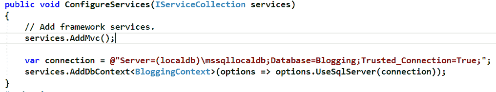

如你所见，连接字符串被直接定义，以便它指向新创建的数据库（`Blogging`）。

接下来，通过泛型方法 `AddDbContext<BlogginContext>` 向服务变量中添加了一个新条目。然后，通过将 `Action` 委托传递给方法，将那个 `DbContext` 连接到 `Blogging` 数据库，并允许它覆盖 `BloggingContext` 类的 `OnConfiguring` 方法。这样，实际的连接配置可以延迟到调用此方法时进行。

最后，`BloggingController` 类是如何访问这个 `BloggingContext` 的呢？通过构造函数中的依赖注入。它的操作方式与我们之前在示例中做的是类似的：

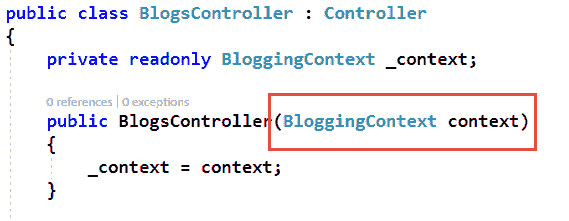

输出显示了加载到 `Blogs` 表中的三个条目，正如预期的那样，具有典型的 CRUD 选项，通过 Razor 视图展示信息，但同样有趣的是强调 DI 在这个架构中的作用（见以下截图）：

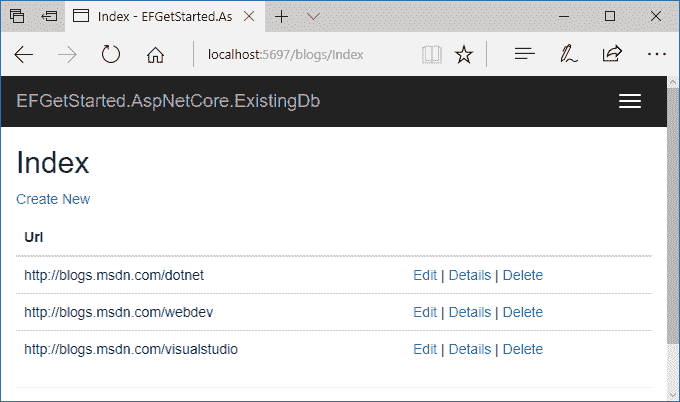

再次，你已经看到了在 .NET Core 相关平台，如 Entity Framework Core 中，DI 的存在。 

然而，还有一个我们还没有涉及到的有趣点。我们看到了如何在视图中引用 `DependencyInjection Namespace`，但我们实际上并没有使用 DI。让我们通过一个简单的示例来看看如何在视图中使用新的 `@inject` 指令。

# 在视图中使用依赖注入

为了完整性，我将解释一个简单的示例，说明如何在 Razor 视图中使用 DI。这是一个相当有趣的功能，它可以用来访问数据、服务相关的信息，甚至你自己的 Razor 辅助工具。

想法是创建另一个视图，使其能够访问与之前的`Services`视图相同的数据，但这次不涉及业务逻辑中的控制器。除此之外，我将创建一个 Razor 辅助器，以展示我们如何通过`@inject`指令完成这两项任务。

首先，在新的文件夹（`Helpers`）中，让我们创建一个简单的辅助器，提供某种信息（例如当前系统的时间）：

```cs
    namespaceASPNETCoreDisposeDemo.Helpers{
      publicclassDateTimeHelpers
      {
        publicDateTimeHelpers()
        {
          LocalTime = DateTime.Now.TimeOfDay.ToString();
        }
          publicstringLocalTime { get; privateset; }
      }
    }
```

在这个新服务到位后，我们需要像对`Sentences*`服务那样注册它。`ConfigureServices`方法的新版本将如下所示：

```cs
    publicvoidConfigureServices(IServiceCollectionservices)
    {
      // Add framework services.
      services.AddMvc();
      // container will create the instance(s) of these types
      // and will dispose them
      services.AddScoped<ProgrammerSentenceSvc>();
      // Here, the container did not create instance (we do it)
      // so it will NOT dispose it
      services.AddSingleton(newEngineerSentenceSvc());
      services.AddTransient<DateTimeHelpers>();
    }
```

在业务逻辑方面，我们需要的就这些，因为我们可以使用现有的服务，只是以不同的方式。所以，我将创建另一个名为`ServicesDI`的动作方法作为`HomeController`的一部分，并尝试复制之前的功能。

我们还可以使用`[Route("key")]`属性将 URL 查询重定向到这个动作方法。实际上，这比其他方法还要简单：

```cs
    [Route("SentencesDI")]publicIActionResultSentencesDI()
    {
       returnView();
    }
```

其余的编程逻辑将推迟到视图本身。因此，`SentencesDI`视图将需要引用与它将要使用的服务相关的命名空间，并声明任何所需的服务：

```cs
    @usingASPNETCoreDisposeDemo.Helpers
    @usingASPNETCoreDisposeDemo.Services
    @inject DateTimeHelpersTimeHelpers
    @inject ProgrammerSentenceSvcPSentences
    @inject EngineerSentenceSvcESentences
    @{
      Randomrnd = newRandom();
       ViewData["Title"] = "Random sentences obtained via
            Dependency Injection";
     }
     <h1>@ViewData["Title"]</h1>
     <h3>Local Time: @TimeHelpers.LocalTime</h3>
     < hr />
     < h2 > Programmer's Sentences (DI) </ h2 >
     <h3>@PSentences.programmersSentences[rnd.Next(1,5)]</h3>
     < h2 > Engineers' Sentences (DI) </ h2 >
     <h3>@ESentences.engineersSentences[rnd.Next(1,5)]</h3>
```

正如你所见，其余的代码相当直观。一旦服务注册并建立引用，我们可以使用`@inject`指令来指导 DI 容器关于我们的视图将要需要的资源。语法如下：

```cs
    @inject [Type] [Name/Alias]  
```

这样，任何与注入到视图中的服务相关的功能都可以访问服务内部的数据，而无需在控制器中处理它。你可能会说这某种程度上打破了 MVC 基础的架构，但在某些情况下，如果某些数据仅与特定视图相关，将其从控制器中分离出来可能是有趣的。

并且，你肯定会发现更多有用的可能性。顺便说一句，你可以在浏览器中输入`localhost:[port]/ServicesDI`来获取相应的输出：

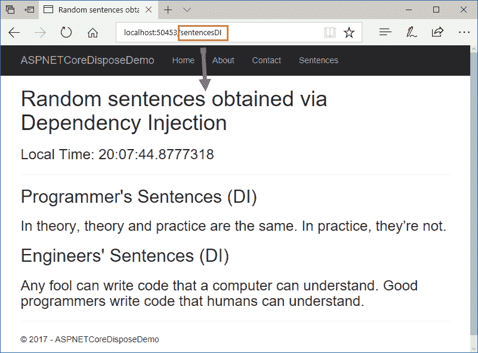

简而言之，这是与依赖注入相关的另一个功能，这次是在 Razor 视图中使用，我们可以在 ASP.NET Core 平台上使用它。

# 摘要

在本章中，我们专注于 ASP.NET Core 和依赖注入，分析了整个架构和配置过程是基于 ASP.NET Core 内部 DI 容器的。

我们还看到了如何从简单的控制台应用程序迁移到 ASP.NET Core 应用程序，以及如何调整开发和生产环境中不同的服务器。

然后，我们分析了 Visual Studio 2017 为 ASP.NET Core 应用程序提供的主要模板，并回顾了它们如何使用 DI 来配置和管理所需的信息和功能。

最后，我们看到了如何使用我们自己的自定义服务，并通过 DI 将它们集成到 ASP.NET Core 中，无论是在控制器中还是在 Razor 视图中。

在第五章，*对象组合*，我们将分析对象组合及其在 DI 环境中的应用。
