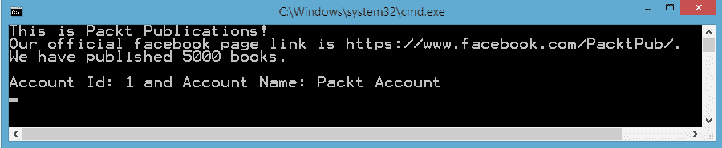
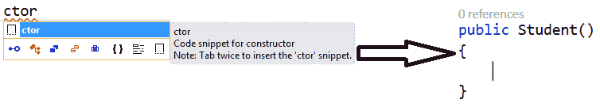
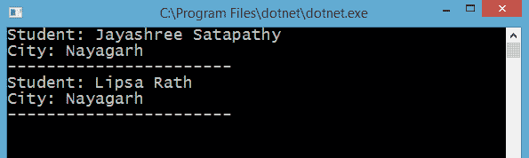
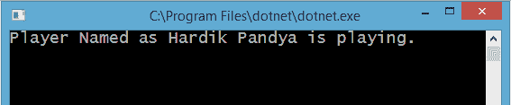
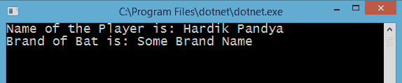
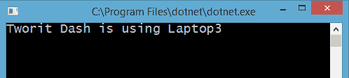
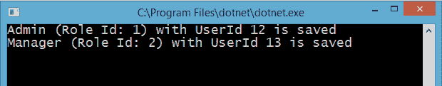
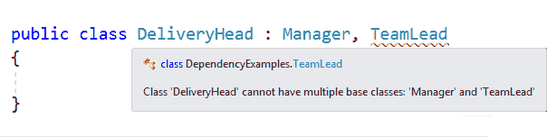
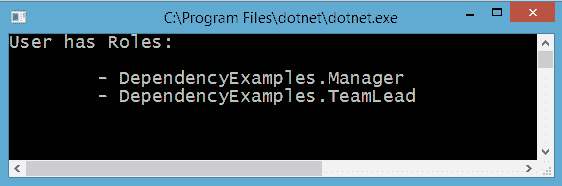
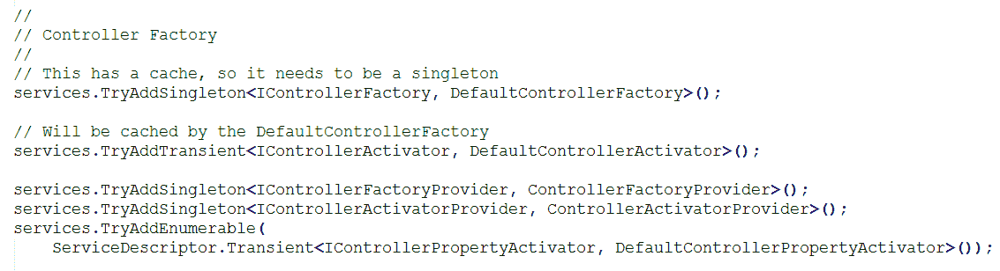

# 对象组合

在第四章，“ASP.NET Core 中的依赖注入”，我们了解了.NET Core 和 ASP.NET Core 的依赖注入以及默认 DI 容器。我们探讨了如何将 DI 应用于应用程序的不同组件，如控制器和视图。现在是时候深入探讨依赖注入背后的实际基础了。

在继续讨论主要主题之前，我们首先需要了解为什么我们要关心阅读这个主题。编程世界充满了对象及其交互。我们通过从我们为两个基本原因生成的类中获取帮助来实现某些解决方案或构建功能，这两个基本原因是**代码重用**和**可维护性**。

现在，你可能会问我为什么还要创建类！是的，我同意你的看法，除非你让我几天后修改代码。那时，即使是我也无法帮助你，因为那对我来说将是一场噩梦。你知道为什么吗？那是因为我可能不得不在我的新类中重复（你已经写过的）代码。

假设你有一个名为`Customer`的类，具有`CustomerId`、`FirstName`、`LastName`、`Email`、`MobileNumber`、`Address1`、`Address2`、`City`等属性。我介入并开始处理另一个实体，名为`Seller`，具有`SellerId`、`FirstName`、`LastName`、`Email`、`MobileNumber`、`Address1`、`Address2`、`City`等属性。

我认为你足够聪明，能够识别这个问题。我们可以看到那些被*斜体*标注的属性正在重复。解决这个问题的一个方法就是创建另一个类，比如命名为`User`的类，包含所有这些公共属性。然后，`Customer`和`Seller`类就变成了它的子类。这样，我们将实现一个简单的设计来处理未来的实体。我可以轻松地重用`User`类来创建其他子类，如果需要的话，这些子类将继承公共属性。

因此，这一章在帮助你掌握这些关系方面起着重要的作用。设计一个由更小、更灵活、可重用的类组成的复杂类是软件项目的一个基本部分，这将是本章的重点。以下是我们将要涵盖的关键主题：

+   关系

+   组合

+   聚合

+   关联

+   继承

+   组合优于继承

+   对象组合在依赖注入中的重要性

+   .NET Core 2.0 控制台和 MVC 应用中的对象组合

# 理解对象关系

让我们先通过考虑人类关系来尝试理解对象关系。这些例子可能不是最恰当的，但如果我们要学习对象关系，为什么不看看它呢？

+   你在你找到工作之前依赖你的父母

+   你有一个妻子和两个孩子

+   树上长着花朵和叶子

+   主板是计算机的一部分

所有这些关系都具有独特的特征。让我简化我的说法。你依赖于你的父母。然而，如果他们失业了，你不会死去。你会找到某种方法来应对这种情况。相反，如果一棵树死了，它的花朵和叶子最终也会死去。树与其部分之间的关系是紧密耦合的。一旦树获得生命（实例化），在很短的时间内，其部分也会苏醒。没有电脑的主板是没有用的。它只有在成为电脑的组成部分时才会发挥作用。

让我们考虑以下代码片段来理解类之间的关系：

```cs
    class Organisation
    {
      public Organisation() { }
      public string Name { get; set; }
      public string OfficialFacebookLink { get; set; }
    }

    class Packt : Organisation
    {
      public Packt() { }
      public int TotalBooksPublished { get; set; }

      public void PrintPacktInfo()
      {
        Console.WriteLine($"This is {Name}!\n" +
            $"Our official facebook page link is 
              {OfficialFacebookLink}.\n" +
            $"We have published {TotalBooksPublished} books.\n");

        Account account = new Account();
        account.PrintAcountInfo(1, "Packt Account");
      }
    }

    public class Account
    {
      public int AccountId { get; set; }
      public string AccountName { get; set; }

      public void PrintAcountInfo(int accId, string accName) 
      {
        Console.WriteLine("Account Id: " + accId + "
            and Account Name: " + accName);
      }
    }
```

我们有一个`Organisation`类，而`Packt`作为一个组织，从父类`Organisation`派生。这种关系表示为“是一个”关系，因为`Packt`是一个组织。`Account`是一个类，它可以成为`Packt`类的一部分。因此，`Packt`和`Account`之间存在另一种关系。这种关系的名称是“一部分”。**

注意`Packt`类内部的`PrintPacktInfo()`方法，它打印有关`Packt`的所有信息。然而，这还不是全部，因为你可以看到，在该方法内部生成了一个`Account`类实例，通过它我们能够打印出`Packt`的账户信息。

`Main`方法如下所示，我们创建一个`Packt`实例，并通过属性提供任何必要的详细信息，然后调用`PrintPacktInfo()`：

```cs
    static void Main(string[] args)
    {
      Packt packt = new Packt
      {
         Name = "Packt Publications",
         OfficialFacebookLink = "https://www.facebook.com/PacktPub/",
         TotalBooksPublished = 5000
      };

      packt.PrintPacktInfo(); // Prints the Account information.
      Console.ReadKey();
    }
```

代码产生以下输出：



从这个例子中，我们应该吸取的重要信息是`Packt`类对`Account`类的依赖方式。`依赖`是在`Packt`类内部生成的。

就像前面的例子一样，我们可以在编程中找到模式、关系和层次结构。让我们更详细地调查这些内容，并学习如何提高代码的可重用性和类的弹性。

# 对象组合

当我在谷歌搜索“词组成”时，首先看到的是：

某物成分或构成的本质；整体或混合物的构成方式。

现在很容易猜测对象组合是什么。对象集体混合自身以构成（成为）复杂对象的一部分。

一个简单的现实生活例子就是一辆车，其整个车身由不同类型的组件组成，如发动机、刹车、齿轮、电池、车门等。因此，这些部件实际上是汽车的构建块，并且由汽车制造商以非常创新的方式组合在一起。

同样，正如我们之前讨论的，上一节中`Packt`类方法内部的`Account`类引用，这在其之间生成了一种关系。我们可以将其视为一种依赖关系，因为我们不能在没有`Account`类实例的情况下执行`Packt`类的函数。显然，我们可以这样说，`Packt`对象通过`Account`实例的帮助来组合自身。

你是否注意到了第一段中括号内的短语*是*一部分？困惑！让我们再次讨论并掌握这个短语。换句话说，这个短语也可以表示为*有*，如果我从一个复杂对象的角度来构建这个句子。参考下面的行。

+   一台计算机*有一个*键盘。（键盘*是*计算机的一部分）

+   一辆车*有一个*引擎。（引擎*是*车的一部分）

现在已经很清楚了，正如你所见，这些复杂对象是如何由小对象组成，这些小对象就是对象组合的概念。

如你所知，不同的基本数据类型，如`int`、`string`、布尔值等，或者其他的类类型，可以被包装到一个结构或另一个类类型中，因此，类通常被认为是组合类型。

将这个概念应用到你的项目中最重要的好处是获得更容易管理的部分。这不仅减少了应用程序的复杂性，还帮助我们更快地编写代码。另一个明显的优势是代码重用，这导致错误更少，因为你将使用经过测试后已经验证的代码。

# 对象组合类型

对象组合有两种子类型，**组合**和**聚合**。让我们逐一讨论。

# 组合

组合是一种将对象绑定在一起的方式。一个对象可以包含另一个对象，无论是同一类还是另一类，作为构建块。

换句话说，在我们上一个例子中，`Packt`依赖于`Account`类来运行。实例是由`Packt`类创建的，给它生命，然后使用实例执行一些功能。你可以添加另一个类如`Packt`，并使用`Account`实例做同样的事情。因此，你试图组合对象以形成一个更复杂的对象，这使得我们可以通过一个复合对象执行所有组合/部分对象的行为（方法）。

以下是由对象及其成员或部分满足的关系，符合组合的条件。

+   **部分（成员）是对象（类）的组成部分**：正如我们已经讨论过的，部分或较小的类应该是较大复杂类的组成部分。例如，你的肾脏是你的身体的一部分。

+   **部分（成员）一次只能属于一个对象（类）**：如果较小的类在某个时期被引用到复杂类中，那么它不能同时是其他类的部分。例如，你的肾脏，它是你身体的一部分，不能同时是其他人身体的一部分。

+   **部分（成员）的存在由对象（类）管理**：对象负责组合关系中部分的存在。简单来说，部分在对象创建时被创建，在对象销毁时被销毁。这意味着对象以这种方式管理部分的生命周期，使得对象的使用者不需要介入。例如，当身体被创建时，肾脏也会被创建。当一个人的身体被销毁时，他们的肾脏也会被销毁。正因为如此，组合有时被称为**死亡关系**。

+   **部分（成员）不知道对象（类）的存在**：组合中的特定部分不知道整个对象的存在。你的肾脏不知道它是更大结构的一部分，但按预期工作。这被称为**单向关系**。例如，身体知道肾脏，但反之则不然。

如果你认为身体部分可以转移，那么成员类为什么不能，那么你的想法是对的。成员类也可以被转移。因此，新的更大的类现在成为了成员类的所有者，而成员类不再与之前的所有者相关，除非再次转移。

# 考虑一个例子

我们最喜欢的`Student`类：

```cs
    public class Student
    {
      private int Id { get; set; }
      private string Name { get; set; }
      private DateTime Dob { get; set; }
      private Address Address { get; set; }
      private ICollection<Book> Books { get; set; }

      public void PrintStudent()
      {
        Console.WriteLine("Student: " + Name);
        Console.WriteLine("City: " + Address.City + "");
        Console.WriteLine("-----------------------");
      }
    }
```

来吧，别这么惊讶，现在也请不要责怪我。我知道这看起来像是一个非常基础的课程，但这就是组合的本质，简而言之。你不信？好吧，让我用这个`Student`类来匹配这些关系：

+   **规则 1：复杂类的一部分**：你可以看到类成员具有不同的类型，例如`Integer`、`string`、`DateTime`、`Class`和`List<Class>`类型。`Integer`、`string`和`DateTime`是.NET Framework 中`System`命名空间内已经定义的数据类型，而`Address`和`Book`类是用户定义的类。所有这些都是复杂类`Student`的一部分。因此，第一个条件得到了满足。

+   **规则 2：成员应属于一个对象**：如果我创建一个`Student`类的实例，带有构造函数，那么这些成员在那个时刻只属于学生对象。它们不能成为另一个实例的成员。此外，成员是私有的，这阻止了它们被任何其他类使用。

```cs
        Student student = new Student(1, "Bhagirathi Panda", 
          new DateTime(1990, 4, 23));
```

构造函数看起来如下：

```cs
        public Student(int id, string name, DateTime dob)
        {
          Id = id;
          Name = name;
          Dob = dob;
        }
```

+   **规则 3：成员通过复杂类获得生命（死亡关系）**：正如你所见，成员在没有实例化`Student`类之前并不存在，当对象死亡时它们也会被销毁；这证明了我们的规则 3。

+   **规则 4：成员不知道复杂对象的存在（单向关系）：**成员非常听话。他们只存储分配给他们的任何值，甚至不关心是谁以及为什么分配给他们。复杂实例是他们的父级，但这些成员表现得像孤儿一样，不认识它。同样，我们不在乎他们在做什么，因为我们的规则 4 已经得到证明。

这里需要注意的另一件重要的事情是，复杂类可以有一个乘法成员，例如`List<Book> Books`。

你知道创建构造函数的快捷键吗？只需在你想创建构造函数的行中输入**ctor**，然后按两次*Tab*键。你会看到一个空构造函数块可供使用。此外，Visual Studio 的提示信息会告诉你如何处理这个命令：



# 组合的对比特性

部件是在组合类的创建过程中创建的。这意味着组合类负责创建。此外，部件的销毁取决于其创建者组合类的销毁。然而，规则是为了被打破的，这在组合的情况下也是如此。

考虑以下场景：

+   部件的创建被推迟到实际使用时。例如，我们的`Student`类不会创建书籍列表，直到用户或任何其他方法向它分配一些数据。

+   组合将销毁部件的责任分配给其他对象。我们已经知道这样一个名为**垃圾回收器（Garbage Collector）**的常规程序，它会定期管理未使用对象的销毁。

组合就像一个守护者，所有成员的关怀都由组合类承担。创建、分配和销毁；所有这些主要都是由组合类管理的。

# 子类为什么在组合（Composition）内部？

在编程过程中，你总是需要做出决定。如果你仔细分析我们的`Student`类，你会意识到一些事情。`Address`类的属性可以直接在`Student`类内部声明，而不是作为不同的实体声明。

所以，而不是以下内容：

```cs
    public class Student
    {
      // Other properties.

      int AddressId {get; set;}
      string City {get; set;}
      string State {get; set;}
      string Country {get; set;}
    }
```

我们就是这样做的。基本上，我们只是将地址属性分离到一个名为`Address`的容器类中。以下代码块展示了我们如何提取出`Address`类：

```cs
    public class Student
    {
      // Other properties.
      private Address Address { get; set; }
    }
    public class Address
    {
      public int AddressId { get; set; }
      public string City { get; set; }
      public string State { get; set; }
      public string Country { get; set; }

      // Constructor. Just initialising City for now.
      public Address(string city)
      {
        City = city;
      }
    }
```

这些是使用子类而不是直接将它们添加到组合类中的优点之一：

+   子类是独立的，简化了架构。代码看起来很容易理解。你从中获得的实际好处是在将来尝试对它做额外的事情时。假设，我告诉你为`Address`添加另一个成员街道。如果你直接在组合类中设计地址属性，那么你必须手动进入每个类并添加另一个成员。然而，在子类的情况下，你只需要将其添加到子类中，所有使用该子类的组合类将自动获得访问权限。

+   你将类分解成子类越多，它们就越具有可重用性。例如，地址类也可以在其他类中重用。它不再与组合紧密耦合。

+   由于引入了子类，组合类不再复杂。此外，子类可以在其中定义方法，这使得组合对象的生活变得简单。这是因为子类可以定义与其相关的函数，这些函数可以被组合类调用。例如，如果我们想获取完整的地址，我们可以在`Address`类中轻松地定义一个方法，该方法将使用所有地址属性返回一个字符串。因此，组合类不需要在`Address`相关的事情上做任何事情。

# 重要注意事项

考虑更好的设计，以便在不同实体之间分配责任，是困难的。但这并非不可能。当我们开始构建应用程序时，我们并不总是拥有完整的规格或意识到接下来可能发生什么。最终，当更多的规格出现时，我们面临问题，因为我们忽略了为某些常见用途构建子类。因此，你也会在许多类中看到不良和重复的代码，这些代码可以封装在子类中，并且可以轻松重用。

组合或主要类应该负责其设计的内容。`Student`类负责管理学生信息。毫无疑问，学生的地址是它应该处理的事情。但是，如果我们得到另一个实体，比如`Teacher`，它也有地址呢？我们必须在`Teacher`类内部重复相同的属性集来实现这一点。这不是代码异味吗！这就是你应该决定将`Address`相关的信息分离到另一个类的时候。

# 聚合

聚合是另一种类型的对象组合。让我们详细探讨这一点。

这是将现有对象组合成新对象的过程。起初，它看起来与组合相似。但事实上，它有区别。要成为聚合，复杂对象及其部分必须满足以下关系：

+   **部分（成员）是对象（类）的组成部分**：它与组合类似。这意味着较小的对象是复杂对象的一部分。例如，一个人有一个 Google Drive 文件夹。

+   **部分（成员）可以同时属于多个对象（类）**：与组合不同，这里的成员与类是独立的。它可能同时被其他类引用。例如，一个驱动器文件夹可以同时被许多用户共享。

+   **部分（成员）的存在不由对象（类）管理**：正如最后一点所述，成员与复杂类没有绑定，因此它的创建和销毁不由它管理。例如，所有与文件夹共享的人都没有创建它。除非他们被赋予管理员权限，否则他们不能删除文件夹。

+   **部分（成员）不知道对象（类）的存在**：成员不知道复杂对象是否存在，就像组合一样。例如，一个人不知道驱动器文件夹是否存在。

# 考虑一个例子

现在，我们将尝试修改在组合课程中展示的`Student`类。我这样做是因为那里有一个`Address`属性。看看构造函数是如何更新的，以便将地址作为参数：

```cs
    public Student(int id, string name, DateTime dob, Address address)
    {
        Id = id;
        Name = name;
        Dob = dob;
        Address = address;
    }
```

这对你来说并不陌生。让我们试着详细说明一下。我们只是将`Address`对象传递给构造函数，然后它被分配给复合类`Student`的`Address`属性。

下一个困惑是那么区别是什么？让我来解释。`Address`属性在复合类内部声明，其创建/销毁与其他成员一样。但在构造函数中，我们将其分配给一个外部的`Address`对象。这意味着复合类对该外部传入的对象没有任何控制权。

`Student`类的初始化也将按以下方式修改：

```cs
    static void Main(string[] args)
    {
      Address add = new Address("Dhenkanal");
      Student pallu = new Student(1, "Pallavi Praharaj", 
        new DateTime(1990, 6, 12), add);
    }
```

让我们分析一下这种变化如何被视为聚合。

+   **规则 1：部分（成员）是对象（类）的组成部分**：`Address`属性在`Student`类中被引用，因此它成为了一个部分。

+   **规则 2：部分（成员）可以同时属于多个对象（类）**：我向构造函数传递了一个`Address`对象，它在复合类内部被用于进一步操作。然而，对象`add`相当独立，因为它是由例程（如前述代码中的`Main`）创建的。让我允许它也被另一个`Student`使用：

```cs
        static void Main(string[] args)
        {
          Address add = new Address("Nayagarh");
          Student rinu = new Student(1, "Jayashree Satapathy", 
            new DateTime(1995, 11, 14), add);    
          Student gudy = new Student(2, "Lipsa Rath", 
            new DateTime(1995, 4, 23), add);

         rinu.PrintStudent();
         gudy.PrintStudent();
         Console.ReadKey();
       }
```

我知道你可能对它是否有效有所保留。以下是为你提供的输出：



很直接，不是吗！`Main`方法是创建者，因此它可以在其作用域内任何地方使用，直到它被它或垃圾收集器销毁。`add`对象被作为引用传递给两个学生。从这些事实中，我们可以推断出`Jayashree`和`Lipsa`是住在同一地址的两个学生。

+   **规则 3：部分（成员）的存在不由对象（类）管理**：因为它被包裹在`Main`方法中，组合对象无法销毁它。顺便说一下，它也没有创建它。是`Main`让它诞生的。

+   **规则 4：部分（成员）不知道对象（类）的存在**：`Address`对象对这些学生对象没有任何了解。它在`Main`块内部是自主的。

# 组合与聚合

现在我们已经探讨了这两种类型的对象组合，让我们看看它们之间的区别：

| **组合** | **聚合** |
| --- | --- |
| 通常包含内置类型成员变量管理成员的创建和销毁 | 通常包含超出组合类作用域的引用变量不管理成员的创建和销毁 |

虽然这些概念有如此微小但重要的区别，但它们仍然可以在组合类中混合使用。这意味着一个`Student`类，如果将其简单部分如`Id`、`Name`、`Address`等作为聚合，将被视为这两种概念的混合。

# 优缺点

在组合的情况下，你可以随心所欲地管理这些成员。然而，它们并不是独立的，你不能在其他地方使用它们。

而在聚合中，没有对成员生命周期的控制，如果你在创建后忘记销毁成员，它将成为内存泄漏的罪魁祸首。

虽然它们各自都有优点和缺点，但只是根据场景决定在哪里使用哪一个的问题。此外，你可以混合使用它们，做一些惊人的事情。例如，一些属性如`Id`、`Name`等仅在类内部使用，所以理想情况下我们不会在应用程序的任何地方重用这些属性。因此，如果你构建另一个包含所有这些属性的类，并在第一个类中引用（聚合），那就变得不必要了，因为其他类在第一个类之外没有这样的用途。

另一方面，当你确定某些属性可以打包成一个子类（`AddressId`、`Address`、`State`、`City`、`Country`等等），你可能在将来需要在代码的某个地方引用这个新的子类。最好是进行聚合。让调用者管理其生命周期。只需将其放入你的组合类中，按需使用，并忘记其管理。

# 其他重要关系

还有其他一些关系，你应该了解。除非你知道这些，否则你将无法可视化对象通常是如何相互协作的。

# 关联

到目前为止，我们已经完成了两种类型的对象组合：组合和聚合。只是为了确认我们处于同一页面上，对象组合用于将关系打包到一个复杂对象中，该对象由一个或多个更简单的对象（部分/成员）组成。

现在，我们将看看两种原本无关的对象之间的一种关系类型，称为**关联**。关联是两个无关对象之间的联系，它们必须满足以下条件：

+   **关联的对象（成员）与其他对象（类）无关**：这里将要关联的对象与对象无关。它不是像组合或聚合中那样成为复杂对象的一部分，而是本质上完全独立。例如，`Teacher`和`Student`是两个独立的对象，但它们不包含彼此。这些实体在上课时相互关联。

+   **关联的对象（成员）可以同时属于多个对象（类）**：像聚合一样，关联对象可以同时属于多个对象。例如，一个`Student`可以与许多教师相关联，反之亦然。

+   **关联的对象（成员）的存在不由另一个对象（类）管理**：这里所有聚合的对象都是独立的。每个人自己管理自己。例如，`Teacher`不会决定`Student`会做什么，`Student`也不会决定`Teacher`的行动应该是什么。

+   **关联的对象（成员）可能知道也可能不知道对象（类）的存在**：关联关系可能是单向的或双向的。这意味着两个关联的对象可能知道对方，也可能不知道。一旦我们看到了代码片段，我们将对此有更多的了解。例如，一个`Student`可能认识或不认识一个`Teacher`。

关联可以定义为*使用...a*关系。`Teacher`使用`Student`来授课。`Student`使用`Teacher`来澄清疑问。

# 示例

让我们以一个板球运动员和板为例。考虑以下内容：

```cs
    public class CricketPlayer
    {
      public string PlayerName { get; set; }

      public CricketPlayer(string name)
      {
        PlayerName = name;
      }

      public void Play(Bat bat)
      {
        bat.StartPlay(this);
      }

      public string GetPlayerName()
      {
        return PlayerName;
      }
    }

    public class Bat
    {
      public string BrandName { get; set; }

      public void StartPlay(CricketPlayer player)
      {
        // Do something with the player.
        Console.WriteLine("Player Named as " + player.PlayerName
           + " is playing.");
        Console.ReadLine();
      }

      public string GetBrandName()
      {
        return "Some Brand Name";
      }
    }
```

# 上述代码的解释

我们有两个不同的类，`CricketPlayer`和`Bat`。现在让我按照以下方式创建对象：

```cs
    var cPlayer = new CricketPlayer("Hardik Pandya");
    Bat bat = new Bat();

    cPlayer.Play(bat);
    bat.StartPlay(cPlayer);
```

输出如下所示：



`CricketPlayer`类内部的`Play`方法和`Bat`类内部的`StartPlay`方法是此时你应该关注的。两者都接受一个指向另一个类对象的引用参数。这种玩家和板之间的关系的关键点是共同的原因是开始比赛。

让我们看看这个关系遵循的规则。

+   **规则 1：关联的对象（成员）与其他对象（类）无关**：板与球员无关，球员与板也无关。但我们将逐步看到它们是如何相互关联的。

+   **规则 2：关联的对象（成员）可以同时属于多个对象（类）**：板可以被团队中的许多其他球员使用，而不仅仅是其中一个球员。

+   **规则 3：关联的对象（成员）的存在不由另一个对象（类）管理**：球员不负责管理球拍。它是在球员加入球队之前就创建的。同样，球拍也不会导致球员出生或死亡，除非球员用球拍打自己，这是不可能发生的。

+   **规则 4：关联的对象（成员）可能知道也可能不知道对象（类）的存在**：球员知道球拍，因为球拍作为参数传递给了`Play`方法。同样，球拍知道球员，因为它被传递给了`StartPlay`方法。

如果你稍微了解一点板球，你必须知道球员使用球拍来击球。这意味着它依赖于球拍对象。然而，球拍对象可以被团队中的任何一名击球手使用，这导致了`Bat`类中的`StartPlay`方法。显然，球拍对象需要与一个球员关联，这最终开始了比赛。

这两个对象相互依赖，以便开始比赛。它们仍然作为独立对象存在。假设你没有调用`Play`和`StartPlay`方法，什么都不会改变。代码将编译。这定义了它们为了共同目的而相互关联：

```cs
    CricketPlayer cPlayer = new CricketPlayer("Hardik Pandya");
    Bat bat = new Bat();

    //cPlayer.Play(bat);
    //bat.StartPlay(cPlayer);

    Console.WriteLine($"Name of the Player is: { 
        cPlayer.GetPlayerName() }");
    Console.WriteLine($"Brand of Bat is: { bat.GetBrandName() }");
```

在这里，我只是注释掉了代码以供玩耍。这并没有对对象产生影响，它们仍然存在。然后我使用它们来调用其他方法，如`GetPlayerName`和`GetBrandName`。



# 关联类型

我们已经对关联有所了解。然而，关联有不同的类型，了解它们对我们来说会很有帮助。

# 自反关联

当两个相同类型的对象相互关联时，这种关联被称为**自反关联**。让我们考虑一下`Medicine`类：

```cs
    public class Medicine
    {
      public string Name { get; set; }
      public Medicine AlternateMedicine { get; set; }

      public Medicine(string name, Medicine altMedicine)
      {
        Name = name;
        AlternateMedicine = altMedicine;
      }   
    }
```

在许多场景中，当我们有相同实体的依赖关系时，这非常有用。我们知道一种药物可能有一种替代药物，而这种替代药物又可能有另一种替代药物，依此类推。

# 间接关联

当关联通过其他方式形成，而不是直接在两个对象之间时，这种关联被称为**间接关联**。我们将通过以下示例来尝试理解这个概念：

```cs
    public class SoftwareEngineer
    {
        public string Name { get; set; }
        public int LaptopId { get; set; }

        public SoftwareEngineer(string name, int laptopId)
        {
                Name = name;
                LaptopId = laptopId;
        }
     }

     public class Laptop
     {
        public int LaptopId { get; set; }
        public string LaptopName { get; set; }

        public Laptop(int id, string name)
        {
           LaptopId = id;
           LaptopName = name;
        }
      }

      public class AvailableLaptops
      {
        public static List<Laptop> Laptops { get; set; }
        static AvailableLaptops()
        {
          Laptops = new List<Laptop>
          {
            new Laptop(1, "Laptop1"),
            new Laptop(2, "Laptop2"),
            new Laptop(3, "Laptop3"),
            new Laptop(4, "Laptop4"),
          };
        }

        public static Laptop GetLaptop(int id)
        {
          return Laptops.Find(l => l.LaptopId == id);
        }
      }
      static void Main(string[] args)
      {
        SoftwareEngineer softEng = new SoftwareEngineer("Tworit Dash", 3);
        // Get the Laptop object from AvailableLaptops class by id.
        Laptop usedLaptop = AvailableLaptops.GetLaptop(3);
        Console.WriteLine(softEng.Name + " is using " + 
          usedLaptop.LaptopName);
        Console.ReadLine();
      }
```

我们有两个类名为`SoftwareEngineer`和`Laptop`，它们应该相互关联。在这种情况下，我们试图通过一个静态类`AvailableLaptops`间接地将它们联系起来，这个类包含一个包含它们的`Id`和`Name`的`Laptop`对象列表。

让我们现在关注一下`Main`方法。一个`SoftwareEngineer`对象被实例化了（`Name Tworit Dash`，`LaptopId 3`）。我们需要打印他的名字和他正在使用的笔记本电脑名称。我们拥有`LaptopId`。如果你仔细查看`AvailableLaptops`类，你会发现一个静态方法`GetLaptop`，它接受`laptopId`作为参数，然后从它已有的列表中找到对应的笔记本电脑。

因此，`Laptop usedLaptop = AvailableLaptops.GetLaptop(3);` 将会获取到具有 ID `3` 和 `Name Laptop3` 的所需 `Laptop` 对象。现在，只需要打印工程师的名字和由静态类返回的笔记本电脑的名字：



这被称为 **间接关联**，因为关联是通过另一个类建立的，这个类可以与一个类交互，并将结果返回给请求从第一个类获取数据的另一个类。

为了总结这些关系，让我们快速回顾一下。

**组合：**

+   复杂类的一部分。

+   成员不能是多个类的部分。

+   成员由一个复杂的类创建和销毁。

+   单向：成员不知道复杂的对象。

+   *部分* 关系

**聚合：**

+   复杂类的一部分

+   成员可以是多个类的部分

+   成员既不是由一个复杂的类创建，也不是由一个复杂的类销毁

+   单向：成员不知道复杂的对象

+   *拥有* 关系

**关联：**

+   类之间没有关系，但在需要时相互需要

+   关联的成员或对象可以被多个对象使用

+   成员既不是由一个复杂的类创建，也不是由一个复杂的类销毁

+   单向或双向：对象可能知道或不了解彼此

+   *使用* 关系

# 组合优于继承

这个主题非常有趣，在许多网站和博客上都有讨论。正如主题标题所说 **组合优于继承**，我们需要通过识别问题来理解为什么它如此重要。从软件开发的开始就有一个更好的设计，将使可维护性和重用性更好。

继承和组合是面向对象概念的两个支柱。除非它们根据你的架构明智地使用，否则在开始向应用程序添加复杂性时，它们会在未来造成问题。

我们已经讨论了组合，现在，在我们转向讨论的主题之前，让我们先讨论继承。

# 继承

如其名所示，从某人那里获取或派生某些行为的行为被称为 **继承**。在编程世界中，当一个类从另一个类继承时，它就创建了一个继承。以下是一些基本示例：

+   一辆车 *是一种* 车辆。车辆具有某些行为，当它被建造时，这些行为会被车所获得。

+   一个矩形 *是一种* 形状。

+   一个 `HourlyEmployee` *是一个* 员工。一个 `MonthlyEmployee` *也是一个* 员工。

+   鸡肉咖喱 *是一种* 菜肴。

注意，它们都有一些共同点。那就是短语 *是*。继承被定义为一种 *是* 关系。

车是一种车辆，但它可能还配备了一个音乐系统，这不是车辆的一种常见行为。因此，派生或子类也可以有自己的行为。`HourlyEmployee` 和 `MonthlyEmployee` 是一家公司的员工，他们可以从公司分享许多福利。然而，他们的薪水并不相同。

# 用户类示例

让我们看看如何实现继承。

```cs
    public abstract class User
    {
        public int Id { get; set; }
        public int RoleId { get; set; }
        public string Name { get; set; }
        public string EmailId { get; set; }
        public string MobileNumber { get; set; }

        public int SaveUser(int userId)
        {
           // Database operation to save the user.
           return userId;
        }
      }

      public class Admin : User
      {
        public string CompanyDepartment { get; set; }
        public Admin()
        {
          RoleId = 1;
        }
      }

      public class Manager : User
      {
        public List<TeamLead> TeamLeads { get; set; }
        public Manager()
        {
          RoleId = 2;
        }
      }

      public class TeamLead : User
      {
        public List<string> Projects { get; set; }
        public TeamLead()
        {
          RoleId = 3;
        }
      }
```

在我们公司中，有不同类型的用户，例如`Admin`、`Manager`、`TeamLeads`、`HR`等。尽管这些实体是不同的，但它们有一些共同的属性。它们必须有一个`Id`、`RoleId`、`Name`、`EmailId`、`MobileNumber`等。

由于它们有共同的属性和行为，我们创建了一个抽象的基类`User`，其中包含了所有这些声明。我们不会实例化这个类，因此它通过使用抽象关键字被限制。每种类型的用户都将有一些操作。最简单的操作是`SaveUser()`，它在基类中定义，以便所有子类都可以使用。

在这个例子中，我们还在子类中声明了不同的属性。

考虑以下内容：

+   Admin--`public string CompanyDepartment { get; set; }`

+   Manager--`public List<TeamLead> TeamLeads { get; set; }`

+   TeamLead--`public List<string> Projects { get; set; }`

我们也可以在这些子类中定义针对它们的特定方法。当我们尝试创建对象，换句话说，创建一个`Admin`和一个`Manager`时，它看起来会像以下这样：

```cs
    static void Main(string[] args)
    {
        Admin admin = new Admin()
        {
          Id = 12
        };
        admin.SaveUser(admin.Id);

        Manager manager = new Manager
        {
          Id = 13
        };
        manager.SaveUser(manager.Id);
         Console.WriteLine("Admin (Role Id: {0}) with UserId {1} 
            is saved", admin.RoleId, admin.Id);
        Console.WriteLine("Manager (Role Id: {0}) with UserId {1}
            is saved", manager.RoleId, manager.Id);
    }
```

你可以看到我们正在创建每种类型的用户，然后将它们的 ID 发送到保存方法以进行进一步的数据库处理。`RoleId`在每种类型的`User`类的构造函数中分配。输出如下：



# 新用户类型

公司决定有一个新的员工类型，名为“配送经理”，他将拥有某些特权，但不是全部。这个角色将从`Manager`和`TeamLead`那里承担部分责任。

配送经理可以`CreateProject`（像 TeamLead 一样）和`AssignProjectToTeamLead`（像 Manager 一样）。在执行所有这些操作时，他/她还可以`SendNotificationToCto`，这是一个新方法。因此，这两个方法将包含不是直接从`Manager`和`TeamLead`类复制过来的额外代码：

**多重继承**是一种特定于语言的特性，它允许一个类继承多个父类的特性。这个特性可能会在设计上引入复杂性，而支持这种特性的语言也有它们自己处理此类场景的方式。C#、Java、Swift 等语言不支持多重继承，但它们允许实现多个协议，这些协议被称为**接口**。我只是想向你展示，我们必须采取一些替代方法来解决问题，而不是像上面那样从多个类中继承，因为 C#本身就不支持这种做法。

# 我们遇到的问题

Visual Studio 告诉我我不能这样编码，这实际上被称为多重继承。此外，当一家公司引入更多角色时，如果我们每个类中都有定义职责（方法），系统在管理上就会变得复杂。因为当我们需要混合特定用户角色的职责时，我们必须创建重复的代码，而这些代码本应该已经在某个类中编写过了。

为了解释我所说的，想象一个 `Car` 类，它被 `Toyota`、`BMW`、`Volkswagen` 等类继承。由于某种原因，我生气了，把 `Toyota` 和 `Volkswagen` 都带到了我的车间，然后从它们中创建了一个新的品牌。我将把它命名为 VolksTaditToy。请不要因为这个名字杀了我。

VolksTaditToy 现在结合了这两款汽车的功能。但在我的程序中，没有方法来处理它们。如果你在路上看到更多这样的汽车，请不要感到惊讶，因为在这个世界上，这样的傻瓜并不稀缺。渐渐地，你的程序将陷入无法逃脱的境地。

我们如何用继承的概念来编写这个类？不可能吧！让我们让我们的初始 `User` 问题成为可能。

# 解决这个问题的方案

组合在这里是我们的救星。让我们看看我们如何利用这种关系来解决这个问题。我们将引入一个 `Role` 类。显然！`Manager`、`TeamLead` 和 `DeliveryManager` 是员工扮演的不同角色：

```cs
    public class Role
    {
        public int RoleId { get; set; }
        public string RoleName { get; set; }
    }
```

现在所有的其他用户类型类都将从这个类派生：

```cs
    public class Admin : Role
    {
        public string CompanyDepartment { get; set; }
        public Admin()
        {
          RoleId = 1;
        }
    }

    public class Manager : Role
    {
        public List<TeamLead> TeamLeads { get; set; }
        public Manager()
        {
          RoleId = 2;
        }
    }
    public class TeamLead : Role
    {
        public List<string> Projects { get; set; }
        public TeamLead()
        {
          RoleId = 3;
        }
    }
    public class DeliveryHead : Role
    {
       public DeliveryHead()
        {
          RoleId = 4;
        }
    }
```

好吧，下一步是什么？剩下的类是 `User`。我们需要对其进行一些修改，如下所示：

```cs
    public class User
    {
        public int Id { get; set; }
        public List<Role> RoleIds { get; set; }
        public string Name { get; set; }
        public string EmailId { get; set; }
        public string MobileNumber { get; set; }

        public int SaveUser(int userId)
        {
           // Database operation to save the user.
           return userId;
        }
    }
```

第一个修改是移除抽象关键字，因为我们现在将创建这个类的对象。接下来是拥有一个属性 `public List<Role> RoleIds { get; set; }` 而不是 `public int RoleId { get; set; }`。我们这样做是为了允许给用户/员工分配多个角色。

观察，我们如何在以下主方法中创建具有多个角色的用户：

```cs
    static void Main(string[] args)
    {
        User deliveryManager = new User()
        {
            RoleIds = new List<Role>
            {
               new Manager(),
               new TeamLead()
            }
        };
        Console.WriteLine(string.Format("User has Roles:\n\n\t- 
           {0}", string.Join("\n\t- ", deliveryManager.RoleIds)));
    }
```

在创建 `DeliveryManager` 类型的 `User` 时，我们通过创建 `Manager` 和 `TeamLead` 类型的列表来给用户分配多个角色。由于它们继承自 `Role` 基类，所以 `RoleIds` 能够识别这些类型。

这段代码产生了以下输出：



我们得出结论，在许多这样的情况下，组合取代了继承。这意味着你在开始设计类时需要非常小心。否则，随着你的系统增长，未来的情况会变得更糟，你将陷入混乱。你绝对应该避免重复代码。当你看到你正在编写的东西之前已经编写过时，在继续之前停下来思考。尽可能在那个时刻进行规范化。

# 对象组合在依赖注入中的作用

现在我们已经理解了对象组合的概念，让我们分析一个实际的软件项目问题，以及如何使用对象组合来陷入困境。在这个过程中，我们将发现这个概念在 DI（依赖注入）环境中的重要性：

```cs
    class Mail
    {
      protected bool SendMail(string mailId, string message)
      {   
         // Logic to send an email
         return true;
      }
    }
    class Notification : Mail
    {
       void SendNotification(string mailId, string message)
       {
          SendMail(mailId, message);
       }
    }
```

因此，`Notification`类继承了`Mail`类，以便它可以调用`SendMail()`。这种结构本身并没有错，但将来可能会产生复杂性。

想象一下另一个用于`Sms`的类，其中我们可以有一个类似`SendSms()`的方法。在这种情况下，`Notification`类无法调用该方法，因为多重继承是不可能的。

为了解决这个问题，我们可以轻松地使用对象组合与依赖注入。让我们首先修改代码。如下所示：

```cs
    interface IMail
    {
        bool SendMail(string mailId, string message);
    }

    interface ISms
    {
        bool SendSms(string mobile, string message);
    }

    public class Mail : IMail
    {
       public bool SendMail(string mailId, string message)
       {
          // Logic to send an email
          Console.WriteLine("SendMail Called");
          return true;
       }
     }

     public class Sms : ISms
     {
        public bool SendSms(string mailId, string message)
        {
          // Logic to send a Sms
          Console.WriteLine("SendSms Called");
          return true;
        }
      }

      class Notification
      {
         private readonly IMail _mail;
         private readonly ISms _sms;

         public Notification(IMail mail, ISms sms)
         {
           _mail = mail;
           _sms = sms;
         }

        public void SendNotification(string mailId, string mobile,
           string message)
        {
           _mail.SendMail(mailId, message);
           _sms.SendSms(mobile, message);
        }
      }
```

`IEmail`和`ISms`是具有`SendMail()`和`SendSms()`方法的接口。接下来，我们需要在`Mail`和`Sms`类中实现这些接口。我们将在这些类实现的方法中编写我们的发送逻辑。

注意到`Notification`类，它没有继承任何类，而是引用了新的接口。然后在参数化构造函数中，我们有`IMail`和`ISms`作为参数。现在`SendNotification()`方法需要像`mailId`、`mobile`和`message`这样的必要细节来调用接口的方法。

那么优势在哪里呢？我们不是写了更多的代码吗？这里的关键点非常有趣。如果你查看实例化`Notification`类的代码，你会得到一些提示。让我们看看那个：

```cs
    static void Main(string[] args)
    {
        Notification notify = new Notification(new Mail(),
           new Sms());
        notify.SendNotification("taditdash@gmail.com", 
          "9132994288", "Hello Tadit!");
        Console.ReadLine();
    }
```

看到了提示吗？让我来解释一下。我们将`Mail`和`Sms`类的实例注入到`Notification`构造函数中，这些实例被分配给属性`_mail`和`_sms`。它会自动调用`Mail`和`Sms`类内部的方法。因此，我们使用`IMail`和`ISms`引用组合了`Notification`类。这就是对象组合与依赖注入出现的地方。

假设你在某个时间点想包含另一个用于邮件发送的类（比如`SmtpMail`），你只需编写一个实现相同`IMail`接口的类，并定义`SendMail`方法。就这样，完成了。不再需要让`Notification`类变得复杂。它将按预期工作。

```cs
    public class SmtpMail : IMail
    {
       public bool SendMail(string mailId, string message)
       {
          // Logic to send an email
          Console.WriteLine("SmtpMail Called");
          return true;
       }
    }
    static void Main(string[] args)
    {
        Notification notify = new Notification(new SmtpMail(),
            new Sms());
        notify.SendNotification("taditdash@gmail.com", 
           "9132994288", "Hello Tadit!");
        Console.ReadLine();
    }
```

正如你所见，我只是声明了新的类，并像`new SmtpMail()`一样注入对象，而不是在`Notification`类内部直接引用它。这就是唯一的改变。其余的将按预期工作，因为我已经注入了对象，而不是在`Notification`类内部直接引用它。

总结一下，以下是我们所取得的成果：

+   我们通过接口为具体依赖项引入了灵活性。

+   我们可以通过实现接口抽象轻松地插入新的具体类依赖项。

+   我们只需一次操作，就将`Notification`对象与依赖对象组合在一起。

+   我们将所有初始化代码移动到`Main`方法内部的一个地方。

当我说我们将初始化代码移动到一处时，那个位置被标记为应用程序的**组合根**。

# 组合根

组合根（Composition Root）组合了应用程序的所有独立模块。在运行时，对象组合是任何其他操作之前的第一件事。一旦对象图与依赖项连接，对象组合就完成了，然后与应用程序相关的组件可以接管。对象组合应该尽可能接近应用程序的入口点。

在.NET Core 2.0 控制台应用程序和 ASP.NET Core 2.0 MVC 应用程序中，入口点是相同的，都在`Program.cs`类的`Main`方法内部。.NET Core 2.0 控制台应用程序的`Main`方法很简洁，但另一方面，ASP.NET Core 2.0 MVC 在`Main`方法内部有一些启动代码。然而，我们通常在`ConfigureServices`方法中编写组合代码，这个方法可以在`Main`方法内部调用。

当你在 Visual Studio 2017 中执行 File | New | Project | .NET Core | Console App (.NET Core)时，你将在`Main`方法中看到以下内容：

```cs
    namespace PacktConsoleApp
    {
      class Program
      {
        static void Main(string[] args)
        {
 // We will do all Object Composition here directly or 
              calling a ConfigureServices method.
          Console.WriteLine("Hello World!");
        }
      }
    }
```

在 ASP.NET Core 2.0 MVC 应用程序的情况下，当你选择 File | New | Project | Web | ASP.NET Core Web Application（在下一个屏幕中，选择合适的模板）时，Web 应用程序模板会在`Program`类中生成`Main`方法，而`Startup`看起来如下所示：


我们在上一个章节中创建`Notification`对象的方式被称为**穷人版依赖注入（DI**）。而不是这样做，我们应该在该位置应用 DI 容器来组合和管理对象。

对象组合是 DI 的基本构建块，也是最容易理解的一个，因为我们已经通过许多例子知道了如何组合对象。现在，我们需要学习在框架能力的影响下，组合对象时会面临哪些挑战。这些问题与框架有关，与对象组合的概念无关。让我们在接下来的章节中找出答案。

# 组合.NET Core 2.0 控制台应用程序

在`Main`方法内部，我们可以轻松地使用内置的 DI 容器组合对象。如果你还记得，我们已经讨论过从容器初始化、将对象注册到容器、解析依赖项到最后从容器中释放组件，所有这些都应该在组合根内部发生，在这里被认为是`Main`方法。

考虑一个控制台应用程序中的`Main`方法示例：

```cs
    static void Main(string[] args)
    {
      // Setup container and register dependencies.
      var serviceProvider = new ServiceCollection()
      .AddTransient<IEmployeeService, EmployeeService>()
      .BuildServiceProvider();

      // Get the service instance from the container and 
      do actual operation.
      var emp = serviceProvider.GetService<IEmployeeService>();
      emp.HelloEmployee();

      Console.ReadKey();
    }
```

这段代码很简单，它利用了可用的扩展方法`Add***`来将依赖项注册到容器中。然后我们使用`GetService`方法通过接口获取实现类型。有了这个实例，我们就可以在应用程序中做任何我们想做的事情。

回想一下，组合根是我们应该进行所有与依赖管理相关的操作的地方。不建议在组合根或更具体地说在 `Main` 方法之外使用 `serviceProvider`。同样的规则也适用于 ASP.NET Core MVC。我们稍后会探讨这一点。

当然，你可以引入另一个方法，你可以将其命名为 `ConfigureServices`（如下所示）以获得更清晰的代码结构。你可以给方法起任何名字，但这个名字与我们在上一节中看到的 ASP.NET Core MVC 应用程序中专门用于依赖注入配置的方法的名称相似。新添加的方法如下代码片段所示：

```cs
    static void Main(string[] args)
    {
 ConfigureServices(new ServiceCollection());
      Console.ReadKey();
    }

    public static void ConfigureServices(IServiceCollection 
      serviceCollection)
    {
      // Setup container and register dependencies.
      var serviceProvider = serviceCollection
      .AddTransient<IEmployeeService, EmployeeService>()
      .BuildServiceProvider();

      // Get the service instance from the container and
         do actual operation.
      var emp = serviceProvider.GetService<IEmployeeService>();
      emp.HelloEmployee();
    }
```

注意，我们没有手动释放对象或容器。原因是释放会根据你决定的生存周期自动由 DI 容器处理。`AddTransient`、`AddSingleton` 和 `AddScoped` 是现成的方法，可以帮助执行不同类型的对象生存周期。我们将在 第六章 中更深入地探讨对象生存周期，*对象生存周期*。

# ASP.NET Core MVC 2.0 的对象组合

就像控制台应用程序一样，我们可以遵循相同的程序来处理 ASP.NET Core MVC 2.0 应用程序内部的依赖项。与控制台应用程序不同，在这个例子中，`Program.cs` 中的 `Main` 方法包含默认代码来初始化 MVC 应用程序并配置所需设置。它是从这个位置指示框架加载启动类的。`Main` 方法中的 `host` 执行 `Startup` 类的 `ConfigureServices` 方法。

ASP.NET Core MVC 被设计成支持依赖注入。但它并不强迫你总是应用依赖注入。为了处理 ASP.NET MVC 中的依赖项，我们可以采取穷人的 DI 方法来手动管理它们，或者利用内置/第三方 DI 容器的技术来注册、解析和释放依赖项。让我们深入探讨控制器初始化过程，看看是否能找到有用的东西。

MVC 的核心在于控制器。控制器处理请求，处理它们，并将响应返回给客户端。因此，控制器应该根据需要将责任委托给其他模块。这意味着控制器将引用其他类来完成某些任务。它将在操作方法内部使用 `new` 关键字来创建依赖对象，而我们可以通过使用 DI 容器轻松避免这一点。使用依赖注入技术，我们应该能够通过构造函数注入将依赖项注入到控制器中。

`IControllerFactory` 是 `Microsoft.AspNetCore.Mvc.Controllers` 命名空间中的一个接口，它使我们能够创建和释放控制器。该接口包含两个方法，如下所示：

```cs
    namespace Microsoft.AspNetCore.Mvc.Controllers
    {
      /// <summary>
      /// Provides methods for creation and disposal of controllers.
      /// </summary>
      public interface IControllerFactory
      {
        object CreateController(ControllerContext context);
        void ReleaseController(ControllerContext context,
         object controller);
      }
    }
```

ASP.NET Core MVC 2.0 内置了一个 `DefaultControlFactory`，它实现了这个接口。让我们看看源代码：

```cs
    namespace Microsoft.AspNetCore.Mvc.Controllers
    {
      /// <summary>
      /// Default implementation for <see cref="IControllerFactory"/>.
      /// </summary>
      public class DefaultControllerFactory : IControllerFactory
      {
        private readonly IControllerActivator _controllerActivator;
        private readonly IControllerPropertyActivator[]
            _propertyActivators;
 public DefaultControllerFactory(
 IControllerActivator controllerActivator,
 IEnumerable<IControllerPropertyActivator> propertyActivators)
            {
              if (controllerActivator == null)
              {
                throw new ArgumentNullException(nameof(
                 controllerActivator));
              }

              if (propertyActivators == null)
               {
                throw 
                  new ArgumentNullException(nameof(propertyActivators));
               }

               _controllerActivator = controllerActivator;
               _propertyActivators = propertyActivators.ToArray();
            }
            public virtual object CreateController
              (ControllerContext context)
            {
               // Codes removed just for book.
                   You can find codes in Github.
             }

             public virtual void ReleaseController(ControllerContext
               context, object controller)
            {
              // Codes removed just for book. You can
                  find codes in Github.
            }
      }
    }
```

`DefaultControllerFactory` 具有构造函数注入，用于提供 `ControllerActivator` 和 `PropertyActivators` 所需的依赖项。因此，这个工厂由激活器组成。就像一个工厂一样，还有一个名为 `IControllerActivator` 的 `Activator` 接口。分别有名为 `ControllerFactoryProvider` 和 `ControllerActivatorProvider` 的工厂和激活器提供者。

现在，最重要的部分。这些工厂的对象组合实际上是在 `MvcServiceCollectionExtensions` 类的 `AddMvcCore()` 方法中完成的，该方法位于 `namespace` `Microsoft.Extensions.DependencyInjection` 内。`namespace` 名称包含 `DependencyInjection`，这本身给我们一个提示，即我们肯定会进行一些注入来初始化这些激活器和工厂。让我们看看 `AddMvcCoreServices()` 方法（这是从 `AddMvcCore()` 调用的另一个方法）的快照，它负责组合所有用于控制器激活和初始化的必需依赖项：



您可以看到接口是如何注册为具体类的。此方法包含许多其他服务注册，用于控制器过程所需的全部后台工作。但我们对框架内部如何实现对象组合有了了解。

如果我们想要设计自己的自定义控制器工厂，我们也可以通过在此方法中注册所需的工厂和提供者来进行初始化。

# 摘要

本章探讨了编程中对象之间的重要关系。我们创建了非常基础的类，并试图掌握这些概念。然后，我们将注意力转向对象组合，以及它的类型、组合和聚合。

此外，我们还讨论了关联。通过代码示例和输出，我们看到了这些关系在编码中的重要性。

最后，我们通过一个示例介绍了继承。一旦我们完成了所有这些，我们就转向一个非常重要的说法：*组合优于继承*。这是开发者在将新需求应用于现有类结构时面临的一个实际问题。

然后，我们讨论了对象组合在依赖注入中扮演的重要角色。我们还看到了这种模式如何在 ASP.NET Core MVC 2.0 中遵循。

是时候看看对象是如何创建的，它们是如何生存的，然后又是如何被销毁的，在第六章，*对象生命周期*中。我们将对象生命周期与我们在这章中学到的知识联系起来。
