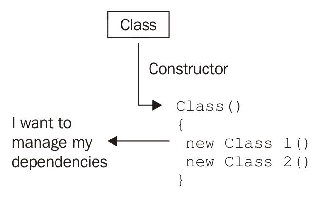
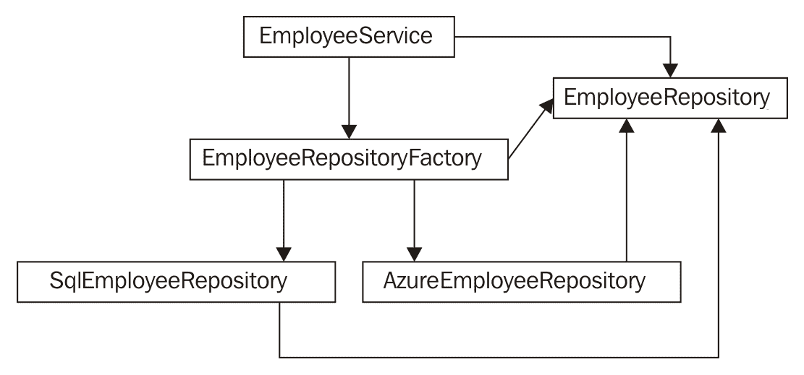
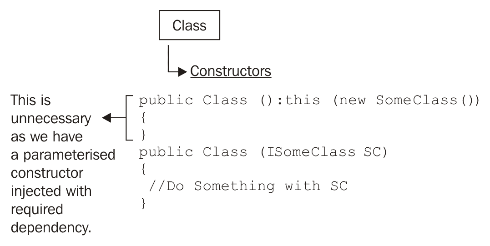
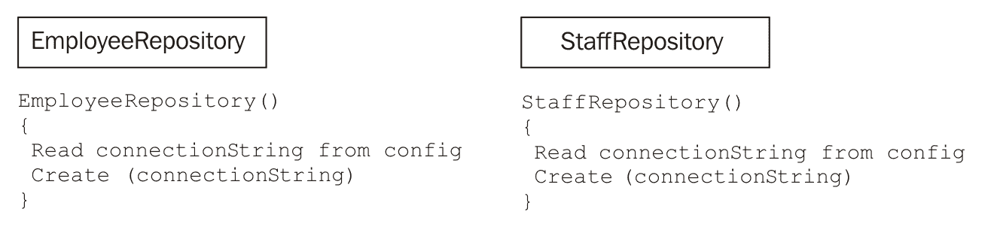
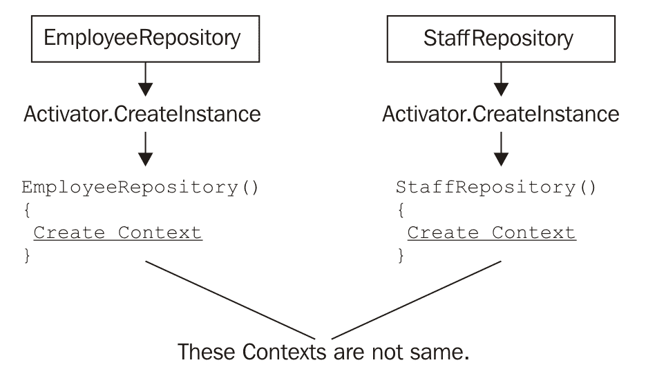
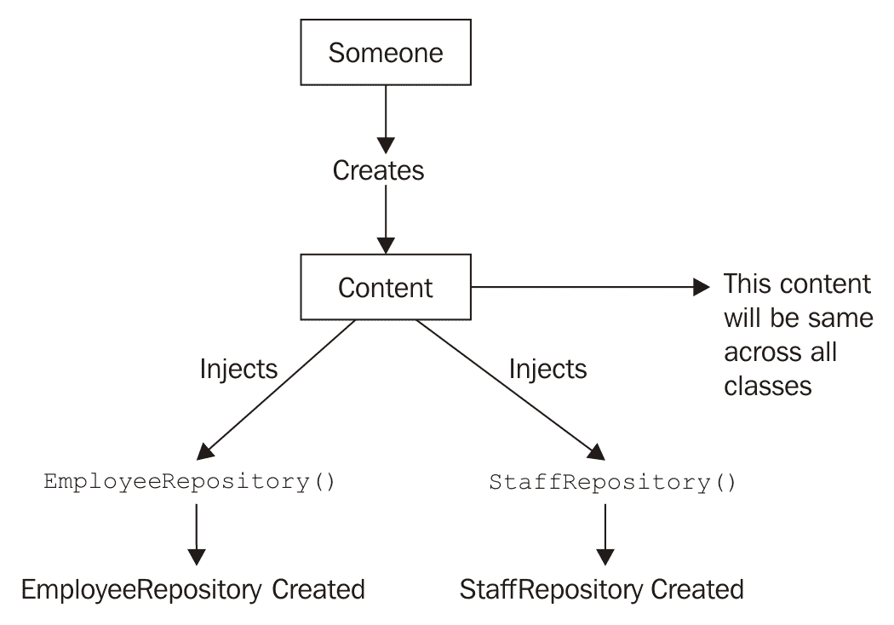
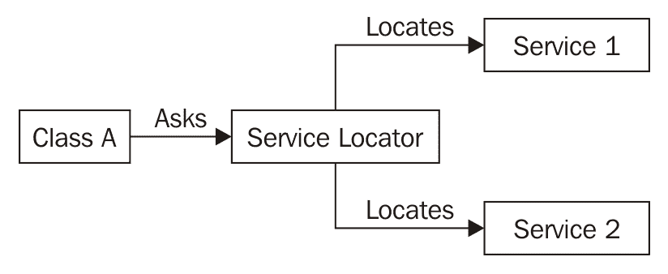
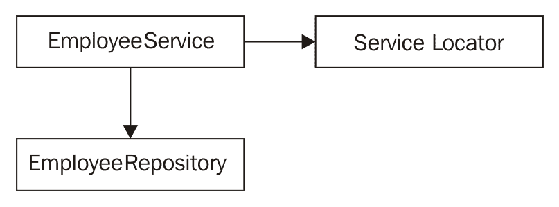

# 关于依赖注入的反模式和误解

模式向我们展示了实现依赖注入的正确方式。在上一章中，我们深入了解到了 DI 生态系统中每个模式的使用、它们的优点、缺点，以及何时选择哪一个。如果正确遵循这些模式，我们就能实现一个松耦合的架构，这将更容易进行单元测试。

然而，在应用这些模式时，我们通常忽视了一些原则，这可能导致我们未来遇到问题。这可能是由于对模式行为的无知，或者简单地由于懒惰。

到那时，一个模式变成了反模式，因为它没有解决问题；相反，它产生了更多的错误，维护变成了头疼的问题。

在阅读本章之后，如果你在项目中发现了反模式，请不要担心，因为我们将学习如何通过选择上一章中讨论的任何技术来将每个反模式重构为合适的模式。如果你直接来到这一章，我建议你首先完成上一章（其中详细介绍了你应该知道的关于依赖注入模式的全部内容），然后再继续前进。

在本章中，我们将通过示例讨论这样的场景，以了解模式如何表现为反模式。

本章我们将涵盖以下主题：

+   当 DI 成为反模式时

+   DI 反模式

+   在项目中识别反模式

+   反模式给应用带来的问题

+   每种反模式的解决方案和重构步骤

# 何时依赖注入成为反模式？

我们将探索在具有 DI 的项目中开发者遵循的反模式。然而，你有没有想过 DI 本身成为反模式的场景！是的，有时它可以成为反模式。以下列出了这些情况：

假设我们有一个控制器依赖于`Service`进行某些数据库操作。例如，`UsersController`需要一个`IUsersService`类型的依赖项来进行`User`表相关的操作。我们为依赖项配置了`UsersService`，并且它已经注册到容器中。现在，请稍微帮助自己，并问以下问题。

*你打算将依赖项更改为任何其他`IUsersService`* **的实现吗**？*如果你的答案是*否，那么请稍作思考。原因是，如果你不会通过代码或配置动态地更改依赖项的实现，那么依赖注入就不会发挥重要作用。例如，如果你将数据保存到数据库/XML/文本文件，你可能会有不同的实现，并且在某些条件下需要交换，那么依赖注入肯定会派上用场。但是，如果你只保存到数据库而没有其他操作，就没有必要添加额外的代码来注入依赖项。这样做没有太多意义。

*你一启动应用程序就需要依赖项吗？*依赖注入建议我们在一个称为组合根（Composition Root）的地方注册所有内容。然而，想象一下一个名为`CompanyService`的`Service`，它的实例只有在我想将`User`添加到公司时才需要。例如，看看以下代码：

```cs
    public IActionResult AddUser(UserModel userModel)
    {
      var user = _usersService.CreateUser(userModel);
      if (userModel.AddUserToCompany)
      {
        var companyService = new CompanyService();
        companyService.AssignUserToCompany(user);
      }
      return View();
    }
```

通常，我们公司有管理员负责管理用户记录。想象一下这样的场景，管理员登录后想要将一些用户分配给特定的公司。在这种情况下，有一个从名为`AddUserToCompany`的模型中来的`boolean`值。如果它是`true`，我们需要将用户分配给公司。这意味着懒加载实例化，看起来相当不错。

因此，在这里，它的意思是快速获取`CompanyService`实例并与之工作。然而，如果你选择了 DI，那么`CompanyService`实例将保留在容器中（因为你将其注册在组合根中），直到你实际上在代码中使用它，这通常不会发生。有时，如果登录的用户是普通用户而不是管理员，这种情况根本不会发生。

这只是一个简单的例子。你可以想象一个复杂的应用程序，这些类型的场景可能会在 DI 中产生不良影响。有时，懒加载比在容器中占用不必要的内存空间更好。

如果 DI 被不必要地选择或使用不当，它本身就会导致反模式。如果你永远不会为一种实现注入不同的依赖项，那么就没有必要使用 DI。现在让我们探索在使用项目中的 DI 时可能会遇到的反模式。

# 反模式

在实现依赖注入（DI）的项目中，可以发现四种主要的反模式，如下列出：

+   控制狂

+   恶魔注入

+   限制性构造

+   服务定位器

让我们分析每种类型，看看如何避免它们。

# 控制狂

控制狂与控制反转（Inversion of Control）相反。当一个类持有其依赖项并试图在没有他人干扰的情况下自己管理它们时，它将被标记为**控制狂**。

以下图表展示了控制狂的概览：



当我们说它试图自己管理依赖项时，我们指的是什么？记住在第六章，*对象生命周期*中，如果一个类想要管理一个依赖项，这意味着它想要实例化它，然后管理其生命周期，以及杀死或处理它。

实例化，是的，这是通过我们熟知的关键字`new`完成的。类使用`new`关键字在内部实例化每个依赖项，然后与对象一起工作，并通过`析构函数`或`终结器`来处理它们。因此，一旦这样做，它就创建了一个紧密耦合的系统。此外，它还使得单元测试变得困难。

该类要么自己创建对象，要么代表其他类执行此操作。让我们通过一个例子来理解这个场景：

```cs
    public class EmployeeService
    {
      private readonly EmployeeRepository repository;
      public EmployeeService()
      {
         string connectionString = "Read String from config";
         this.repository = new SqlEmployeeRepository(connectionString);
      }
    }
```

立即发挥作用的第一件事是`new SqlEmplyeeRepository()`。现在，这个服务与`SqlEmployeeRepository`紧密耦合。假设你想使用另一个仓库类来替代它，那么我们必须更改服务代码并重新编译。没有这样的插件点来说明“我提供给你这个仓库，请使用它”。

# 问题

为了解决这个问题，开发者可能会考虑不同的模式，这最终会使情况复杂化。我们可以看到以下类型的工厂被普遍使用：

+   具体工厂

+   抽象工厂

+   静态工厂

# 具体工厂

创建`EmployeeRepositoryFactory`是拥有一个`Create()`方法的另一个借口（以及一种懒惰的方法），这个方法将通过`new`关键字创建一个`SqlEmployeeRepository`实例：

```cs
    public class EmployeeRepositoryFactory
    {
      public EmployeeRepository Create()
      {
        string connectionString = "Read String from config";
        return new SqlEmployeeRepository(connectionString);
      }
    }
```

我们从`EmployeeService`中移除了这个块，但添加了另一个与之前非常相似的新类。然后我们可以这样使用工厂：

```cs
    public EmployeeService()
    {
      var employeeRepofactory = new EmployeeRepositoryFactory();
      this.repository = employeeRepofactory.Create();
    }
```

在`EmployeeService`构造函数中，我们使用`new`关键字获取工厂实例，然后调用`Create()`方法来获取`SqlEmployeeRepository`实例，并将其分配给`repository`变量。

我们是否实现了什么有用的东西？完全没有。我们只是在`Service`中添加了另一堆代码，以间接的方式（通过工厂）做了同样的事情（使用`new`关键字实例化）。基本上，工厂使用相同的`new`关键字来实例化`SqlEmployeeRepository`类。这正是我们想要避免的，但我们没有实现这一点。

# 抽象工厂

抽象工厂作为一个封装组件，封装了包括与其相关的依赖在内的复杂逻辑。因为它不完全允许消费者控制对象的生存周期，所以它可以从消费者那里转移控制权。

派生工厂负责创建和管理所需的仓库，而不是最初设计的工厂。考虑以下代码片段：

```cs
    public abstract class EmployeeRepositoryFactory
    {
        public abstract EmployeeRepository Create();
    }
```

这意味着我们试图隐藏将要服务的仓库是哪一个。我们试图通过隐藏实际提供的类型来实现松耦合。

为了分配`repository`变量，我们必须继承这个类并创建一个子类，返回`SqlEmployeeRepository`：

```cs
    public class SqlEmployeeService : EmployeeRepositoryFactory
    {
      public override EmployeeRepository Create()
      {
        string connectionString = "Read String from config";
        return new SqlEmployeeRepository(connectionString);
      }
    }
```

基本上，我们将`repository`的实例化与主服务解耦了。同样的问题再次出现。我们是否实现了什么有用的东西？我不这么认为。这是因为这种新的架构再次以在`EmployeeService`（使用`new`关键字）内部的一个实例化为代价：

```cs
    public EmployeeService()
    {
      var sqlEmployeeService = new SqlEmployeeService();
      this.repository = sqlEmployeeService.Create();
    }
```

虽然你能够通过将其抽象化来隐藏`SqlEmplyeeRepository`从工厂中，但你没有改变在`EmployeeService`构造函数内部处理事情的方式。你现在正在实例化`SqlEmployeeService`。

# 静态工厂

下一个方法是通过引入`static`模式来避免工厂实例化。考虑以下代码片段：

```cs
    public static class EmployeeRepositoryFactory
    {
      public static EmployeeRepository Create()
      {
        string connectionstring = "read string from config";
        return new SqlEmployeeRepository(connectionstring);
      }
    }
```

这将阻止我们创建一个对象并直接使用它。让我们看看如何：

```cs
    public EmployeeService()
   {
      repository = EmployeeRepositoryFactory.Create(); 
   }
```

哈雷！我们终于移除了`new`关键字。好吧，看起来我们完成了。哦，等等！我们仍然在`Create()`方法中使用`new`创建了`SqlEmployeeRepository`实例。但是，有一个简单的解决方案可以从`config`或类似的地方读取这种类型的存储库：

```cs
    public static EmployeeRepository Create()
    {
      var repository = "read from config";
      switch (repository)
      {
        case "sql":
            return EmployeeRepositoryFactory.CreateSql();
        case "azure":
            return EmployeeRepositoryFactory.CreateAzure();
        default:
            throw new InvalidOperationException("Invalid operation");
      }
    }
```

初看似乎很有希望，但实际上并非如此。所有类都变得紧密耦合。这如下面的图中所示：



`EmployeeService`依赖于`EmployeeRepositoryFactory`以获取`EmployeeRepository`实例，这意味着服务的客户端需要引用工厂、存储库以及`CreateSql()`和`CreateAzure()`返回的存储库类型，如`SqlEmployeeRepository`和`AzureEmployeeRepository`。

这些具体类之间产生了耦合，这不能产生灵活的设计，导致应用程序的后续程序员日子不好过。

# 解决方案

我们已经在上一章中探讨了模式。对于控制狂问题，构造函数注入是最合适的。考虑以下代码片段：

```cs
    public class EmployeeService
    {
      private readonly IEmployeeRepository repository;
      public EmployeeService(IEmployeeRepository repository)
      {
        this.repository = repository ?? throw new
          ArgumentNullException("repository");
      }
    }
```

这样，你抽象出了具体的存储库，并且通过构造函数插入了依赖。通过引入一个工厂类，可以进一步进行重构，该工厂类将负责生成存储库。

现在可以使用 DI 容器注册工厂接口或存储库接口，并按需解析，以便依赖项对服务可用。

控制狂是最常见的一种反模式，在项目中实现。当开发者在他们的项目中考虑使用 DI 时，他们有时会发现这很困难，并且他们被控制对象创建而不是其他组件为他们做这件事所吸引。如果他们只是忽略成为控制狂，并跟随 DI 流程，结果将会很棒。

下一个反模式是“混蛋注入”。然而，在进入那个之前，我们需要了解一种名为“穷人 DI”的手动依赖管理方法**Poor Man's DI**。

# 穷人 DI

穷人 DI；这个名字听起来非常有趣，不是吗！当你自己尝试在普通场合（否则可以称为组合根）处理依赖项的注册，而不是使用库（特别是 DI 容器）时，这种技术可以定义为穷人 DI。

# 方法

让我们通过一个快速的代码示例来看看如何实现。假设`EmployeeService`依赖于`EmployeeRepository`类型的依赖项，我们可以直接将其提供到构造函数中，如下所示：

```cs
    static void Main(string[] args)
    {
      EmployeeService empService = new 
         EmployeeService(new EmployeeRepository());
      Console.ReadKey();
    }
```

考虑这个控制台应用程序示例，其中 `EmployeeService` 在 `Main` 方法中实例化。它看起来简单而美观。但如果依赖项嵌套较深，则效果并不理想。

如果 `EmployeeRepository` 再次需要其他依赖项，然后又是另一个，依此类推，你可能会做到以下这样：

```cs
    EmployeeService empService = new 
      EmployeeService(new EmployeeRepository(new
      Cass1(new Class2(new Class3()))));
```

现在代码变得复杂且难以维护。然后你可能想要通过为每个类引入默认构造函数来在一定程度上简化这个结构。所以，以下是你为 `Service` 和 `Repository` 要做的事情：

```cs
    public class EmployeeService : IEmployeeService
    {
      private readonly IEmployeeRepository repository;
 // Default Constructor calls the parameterized one
      public EmployeeService() : this(new EmployeeRepository()) 
 {
 }
      public EmployeeService(IEmployeeRepository employeeRepository)
      {
         repository = employeeRepository;
      }
    }
    public class EmployeeRepository : IEmployeeRepository
    {
      private readonly ISomeClass class1;
 // Default constructor calls the parameterised one.
      public EmployeeRepository() : this(new Class1())
 {
 }
      public EmployeeRepository(ISomeClass someClass)
      {
        class1 = someClass;
      }
    }
```

你可以对所有嵌套的类做同样的事情。我们为所有类添加了默认构造函数；这些构造函数内部调用参数化构造函数，并带有默认依赖项实例。这肯定会减少代码。请看以下简化后的代码：

```cs
    static void Main(string[] args)
    {
      EmployeeService empService = new 
        EmployeeService(); // No Dependency passed here.
      Console.ReadKey();
    }
```

现在不需要将这些构造函数传递任何依赖项。此外，如果你传递了期望类型的任何依赖项，它也会正常工作，因为还存在参数化构造函数。这意味着我们得到了一个非常灵活的类结构，并且我们也减少了实例化。

# 问题

尽管我们试图使实例化灵活、可测试和简单，但我们没有意识到这种方法的以下缺点：

+   当我们执行 `new EmployeeRepository()` 时，在默认构造函数中创建了一个具体的引用。

+   默认依赖项实例与使用 `new` 操作符的所有类绑定在一起。但依赖注入技术的整个目的就是减少应用程序中的 `new` 关键字。

+   我们还违反了在注册所有依赖项时遵循的一个原则，即称为 Composition Root。现在，Composition Roots 在应用程序的所有类中到处都是。这是不好的。

+   想象一下有 10 个类使用相同的依赖项的情况；现在再次使用相同的 `new` 关键字实例化所有内容将非常麻烦。

+   你没有任何使用 `new` 关键字管理创建的依赖项生命周期的工具。你必须手动销毁一切，这在完整的应用程序中可能会变得头疼。此外，如果你想要重用单个实例，你必须小心处理。这可能会导致不一致的行为和错误的数据。

那么，我们如何处理这个问题呢？让我们来看看。

# 解决方案

显然，使用依赖注入容器来注册依赖项解决了问题。我们可以移除实际上与所需类型创建紧密耦合的默认构造函数：

+   与“穷人的依赖注入”不同，那里的依赖项注册被限制在一个地方，在这里你在这里和那里实例化具体的类。

+   在使用依赖注入容器在 Composition Root 内部进行注册时，我们可以利用该功能通过不同的配置选项来配置应用程序使用不同类型的依赖。

+   对于深层嵌套的依赖项，我们得到了更干净的代码。

+   要让许多类使用依赖项，只需将其注册到容器中，然后放松即可。

+   你可以按自己的意愿管理依赖项的生命周期。实例可以表现为`Singleton`、`Transient`或`Scoped`，具体取决于你的配置。

建议使用 DI 容器来注册和解析依赖项，而不是在组合根中手动管理它们。因此，默认构造函数方法被称为恶劣注入。在下一节中，我们将对此进行更多探讨。

# 恶劣注入

通常，类有多个构造函数。你可能会有这样的情况，在默认构造函数中从另一个组件引用了某个类。

下面的图示显示了如何一个类有两个构造函数：一个是默认的，另一个是参数化的。参数化构造函数处理注入并使`ISomeClass`实现可用于类操作。因此，创建`SomeClass`实例的默认构造函数变得不再必要：



# 问题

为了简单起见，让我们考虑同一个例子：`EmployeeService`，它需要一个仓库来工作：

```cs
    public class EmployeeService
    {
      private readonly IEmployeeRepository repository;
      // Default Constructor.
      public EmployeeService()
      {
         repository = CreateDefaultRepository();
      }

      // Constructor Injection can happen here.
      public EmployeeService(IEmployeeRepository repository)
      {
        if (repository == null)
        {
          throw new ArgumentNullException("repository");
        }
        this.repository = repository;
      }
      // Method creating a default repository.
      private static EmployeeRepository CreateDefaultRepository()
      {
        string connectionString = "Read String from config";
        return new SqlEmployeeRepository(connectionString);
      }
    }
```

存在一个默认构造函数，它通过创建一个`SqlEmployeeRepository`的实例来确保仓库的可用性。显然，默认仓库是从另一个组件中引用的，因为服务和仓库通常不会位于同一个组件中。这就是为什么默认构造函数可以被标记为**外部默认**。

当我们考虑只为了使服务在实例化后即可使用而设置一个默认仓库时，我们不知不觉中设计了一个服务和仓库之间紧密耦合的系统。

# 解决方案

恶劣注入之所以不好，仅仅是因为这个外部默认。此外，它可能依赖于我们甚至不需要在类中的某些东西。从前面的例子中可以看出，如果我们使用 DI 容器，它将自动将解析的依赖项连接到其他参数化构造函数。然而，如果我们有这种类型的默认构造函数，那么 DI 容器在选择目标时可能会感到困惑。只有一个构造函数用于注入确保与容器的顺畅操作。

当你遇到默认构造函数与外部默认产生耦合时，你可以考虑消除它，因为当你决定应用构造函数注入时。有一个构造函数用于 DI 就足够了，因为确保外部默认在服务请求时始终就绪是 DI 容器的责任。

当你重构代码并移除默认构造函数时，编译器可能会报错。在这种情况下，你需要将实例化代码移动到组合根。如果所引用的依赖项是*局部默认值*（它位于同一程序集内），那么我们仍然需要移除该构造函数，因为构造函数歧义会导致*自动装配*复杂性的增加。

如果你还记得，我们已经在第八章中讨论了局部默认值，*模式 - 依赖注入*。处理局部默认值的最简单方法就是引入*属性注入*。默认构造函数可以被转换为一个可写属性。

# 约束构造

接下来，还有一种类型的*反模式*，试图劫持构造函数。因此，开发者迫使依赖项的构造函数具有特定的签名，这导致了问题。背后的原因可能是为了通过外部配置文件定义依赖项以实现后期绑定。

后期绑定可以指从配置文件中读取存储库类型（存储库的派生类）和连接字符串以实例化某些存储库。

拥有后期绑定技术不仅有助于将代码与依赖项隔离，而且确保在配置更新时代码不会被重新编译。使用通用或应用程序根来定义所有依赖项不会暴露任何问题，但当我们想要更新依赖项时，重新编译是必须的：



# 问题

想象有两个在应用程序中使用的存储库`EmployeeRepository`和`StaffRepository`。它们都有构造函数，你将传递存储库类型和连接字符串给它们，以便使用这些参数创建存储库。这是不好的，因为你现在将从配置中获取存储库类型和连接字符串，如果`config`没有所需的键，可能会引发问题。

现在你已经从`config`中获取了存储库类型名称，你必须使用该名称创建一个`System.Type`实例：

```cs
    var employeeRepositoryTypeName = "Read from config"; 
      //SqlEmployeeRepository
    var connectionString = "Read from config";

    var employeeRepositoryType = Type.GetType(employeeRepositoryTypeName,
         true);
    var employeeRepository = Activator.CreateInstance(employeeRepositoryType,
       connectionString);
```

`Activator.CreateInstance`用于调用给定类型的构造函数。此方法中的第二个参数传递给第一个参数中提供的类型的构造函数。

假设`config`中的类型是`SqlEmployeeRepository`。基本上，它假设以下内容：

+   `SqlEmployeeRepository`继承自`EmployeeRepository`

+   实现应该包含一个可以接受连接字符串作为参数的构造函数

这些实际上就是约束。

从对象构建的角度来看，它可能看起来很完美，但也有一些缺点。例如，考虑使用相同依赖项（如单个上下文）构建存储库。使用 `Activator.CreateInstance`，我们可以无疑地创建指定类型的实例，在我们的例子中，这将创建 `EmployeeRepository` 和 `StaffRepository` 的实例。但我们无法将单个上下文分配给它们中的任何一个，因为每个人都会根据他们的构造函数创建他们自己的上下文。以下图表描述了我想要传达的内容：



只有当外部人员为它们中的每一个提供上下文，而不是它们自己创建上下文时，才能共享上下文：



在这种情况下，在类之间共享单个依赖项变得困难。将创建多个相同依赖项的实例，这是不必要的。这将消耗内存和资源。

在设计时应该仔细选择特定依赖项的单个实例。如果没有妥善处理，可能会对在不同线程中运行的应用程序产生不利影响。如果您还记得，我们已经在 第六章 中讨论了 Singleton Lifetime，*对象生命周期*，我们讨论了该模式的优点和用法。

可以将某人视为一个工厂，这是我们接下来将要探讨的。

# 解决方案

DI 容器在组合根处提供帮助，以克服这些困难并一次性解决所有依赖项。因此，注入可以发生，一切运行顺利。不需要为具有连接字符串的依赖项提供单独的构造函数。

即使没有 DI 容器，我们也可以以不同的方式制定我们的解决方案。当我们想到集中依赖项构建时，抽象工厂就派上用场了。

首先，工厂、服务和存储库应该位于不同的程序集中。这背后有一个强有力的原因。我们将很快探讨它。

在 ASP.NET 应用程序中，我们不会使用 `Activator.CreateInstance` 在 *Global asax* 内部创建每个依赖对象，而是将设计成不同的方式，这样就不需要每次想要使用不同类型的存储库时都重新编译应用程序。

我们将设计一个名为 `EmployeeServiceFactory` 的工厂，该工厂实现 `IEmployeeServiceFactory` 并使用特定的存储库。这个工厂将负责创建服务。`Service` 可能看起来像以下这样：

```cs
    public class EmployeeService : IEmployeeService
    {
      public EmployeeService(IEmployeeRepository repository)
      {
      }
    }
```

`EmployeeServiceFactory` 包含一个 `CreateService()` 方法来创建它所负责的服务（在本例中为 `EmployeeService`）。

将工厂与应用程序和 `DataAccess` 隔离是很重要的，以消除耦合。因此，工厂应该位于不同的程序集。

你可以在`.config`文件中存储工厂的合格类型名称。然后可以使用`Activator.CreateInstance`来创建`IEmployeeServiceFactory`实现（你将在配置中定义）的实例，因为它有一个默认构造函数：

```cs
    var employeeFactoryTypeName = "Read from config";
    var employeeFactoryType = Type.GetType(employeeFactoryTypeName, true);
    var employeeFactory = Activator.CreateInstance(employeeFactoryType);
```

现在有了`employeeFactory`，你可以调用`CreateService()`，这将通过相关的存储库`EmployeeRepository`返回`EmployeeService`实例。

如果你决定使用除`EmployeeRepository`之外的其他类型作为服务的依赖项，那么你可以更新`config`中的相关键。但在那之前，你需要向工厂程序集添加另一个工厂来实现`IEmployeeServiceFactory`并操作新的配置存储库。这样，你重新编译工厂程序集，而不需要重新编译应用程序，一切按预期工作。

# 服务定位器

如果你记得，在*控制狂*部分，我们讨论了静态工厂。通过某些修改，静态工厂可以表现得像服务定位器。正如其名所示，它将定位或找到你所需的服务：



*服务定位器*在许多情况下非常有用，这就是为什么开发者认为它是一个模式。但它有很多缺点。这就是为什么我们把它列在本章而不是上一章。

我不会阻止你使用这种技术，但我想揭示一些其优缺点。这肯定有助于你根据你的应用程序做出更好的设计决策。

定位器的一些显著特性包括以下内容：

+   *定位器*背后的重要逻辑是它允许依赖项或服务轻松地注入其中

+   当配置了服务或依赖项时，静态工厂通常被认为是*服务定位器*

+   服务定位器的配置可以在组合根处进行

+   服务定位器的配置可以通过代码或读取相关的配置设置来管理

依赖注入容器看起来像*服务定位器*。在 DI 上下文中，定位器或容器的主要职责是在其他操作开始之前解决依赖图。理想情况下，解决图应该只在组合根处发生，以实现正确的实现。问题开始于你直接在应用程序中使用定位器或容器请求依赖项或服务，而不是将它们注入到消费者中。在这种情况下，定位器将被标记为反模式。

定位器过程可以定义为如下：

1.  **在注册服务时，定位器将一个实例存储在字典中**：注册通常使用接口完成。你基本上告诉定位器一个接口及其具体实现。例如，你会说*如果请求`EmployeeService`则提供`EmployeeService`，如果需要`IStudentService`则提供`StudentService`*。

1.  **定位器接收请求以提供其接口注册的服务的一个实例**：所以，当你的应用程序中的某些代码想要与`Student`实体一起工作时，它会向定位器请求一个`IStudentInterface`实现。

1.  **定位器从存储的实例中搜索实例，然后将其返回给客户端**：正如你已经训练过的定位器，它将只通过检查所有存储的实例来返回请求的接口实现。

# 设计

一个简单的服务定位器可能类似于以下类：

```cs
    public static class ServiceLocator
    {
      static Dictionary<Type, object> servicesDictionary = 
        new Dictionary<Type, object>();
      public static void Register<T>(T service)
      {
         servicesDictionary[typeof(T)] = service;
      }
       public static T GetService<T>()
       {
         T instance = default(T);
         if (servicesDictionary.ContainsKey(typeof(T)) == true)
         {
            instance = (T)servicesDictionary[typeof(T)];
         }
         return instance;
       }
    }
```

`Register`方法将服务存储在字典中，`GetService`方法返回。我们可以使用定位器来获取特定类型的实例：

```cs
    public class EmployeeService : IEmployeeService
    {
      private readonly IEmployeeRepository repository;
      public EmployeeService()
      {
        this.repository = ServiceLocator.GetService<IEmployeeRepository>();
      }
     } 
```

如果你已经使用`Register`方法预先注册了服务，那么你可以从字典中获取它。

# 优点

当然，这个模式也有一些优点：

+   它通过更改注册代码来支持后期绑定。

+   它采用基于接口的程序，这样我们就可以并行开发代码，并且可以按照我们的要求替换模块。

+   可以实现关注点的分离。我们可以编写可维护的代码，尽管这并不容易。

不要被这些优势所迷惑。这可能看起来对你来说非常完美，但这种方法有很多缺点。

# 问题

服务定位器作为一个合适的模式；然而，你必须忍受以下问题：

# 代码可重用性

它阻碍了类的可重用性，因为依赖关系不再由定位器集中管理。它们可能通过定位器的`GetService`方法散布在整个类中：



`EmployeeService`现在依赖于`EmployeeRepository`和`ServiceLocator`。理想情况下，它应该只依赖于存储库来遵循 DI 原则。

由于这两个依赖项都存在，如果有人想要重用`EmployeeService`，那么他们必须引用这两个依赖项。如果`ServiceLocator`位于不同的程序集，那么还需要程序集引用，这会导致一个非常低效的设计。如果你说我这是一个紧密耦合的架构，你一定会同意我的观点。

此外，服务的消费者在实例化服务时无法识别依赖关系。这是因为定位器在构造函数或方法内部使用，而不是像 DI 策略那样公开：

```cs
    var empService = new EmployeeService();
```

现在你可能会争辩，开发者为什么要试图了解内部的内容，因为依赖关系是在默认构造函数内部处理的吗？但是如果你忘记将依赖关系注册到定位器中会发生什么？不要说你不会忘记。很可能发生这种情况，因为在你实例化类的时候，依赖关系的存在并不能通过构造函数来明确。因此，如果类没有告诉你它依赖于什么，你在寻找和注册它时就不会那么小心，这可能会导致意外的异常。

我知道你现在在想什么；显然，服务是一种控制狂，不是吗？它正在使用定位器来控制依赖项。

需求类（needy class）指的是依赖于他人的类。它不再遵循 DI，因为依赖项不是注入的；而是从定位器的`static`字典中获取的。

另一个问题是在开发者想要向已经采用定位器模式的类添加更多依赖项时可以清楚地识别出来。您要么遵循相同的原理引入更多依赖项，要么移除服务定位器模式并实现 DI。在这两种情况下，编译错误是肯定的。

由于所有上述原因，服务定位器被认为是一种反模式。让我们谈谈解决这种反模式的稳健解决方案。

# 解决方案

如同往常，构造函数注入（Constructor Injection）是最合适的选择，当我们决定重构服务定位器（Service Locator）代码时，首先想到的就是它。通过构造函数注入可以完全移除服务定位器。

# 重构步骤

在大多数情况下，定位器（Locator）在代码库的各个地方被用来获取依赖项的实例。按照以下步骤重构它以实现 DI：

1.  识别代码库中所有的定位器（Locator）调用。

1.  如果类中没有，引入一个成员变量来持有依赖项。

1.  将字段标记为`readonly`，这样它就不能在构造函数外部被修改。

1.  在构造函数内部使用定位器分配字段。现在定位器调用只在一个地方。

1.  为依赖项添加一个构造函数参数。

1.  从构造函数块中移除定位器，并直接将构造函数参数分配给`readonly`字段。

1.  识别对类的所有实例化调用，并将连接（wiring）移动到组合根（Composition Root）。

经过所有这些步骤后，使用构造函数注入模式（Constructor Injection Pattern）的相同`EmployeeService`可以被设计出来，如下所示：

```cs
    public class EmployeeService : IEmployeeService
    {
      private readonly IEmployeeRepository repository;
      public EmployeeService(IEmployeeRepository repository)
      {
        this.repository = repository;
      }
    }
```

现在服务要求其消费者提供一个`IEmployeeRepository`实现的依赖项，之前并没有发生这种情况。

# 摘要

最后一章介绍了实现依赖注入（DI）的方法。当我们没有正确实现模式时，我们的应用程序设计就会变得糟糕。我们了解到了在实现 DI 过程中经常犯的错误。

在继续讨论 DI 反模式之前，我们讨论了为什么以及何时我们可以将 DI 本身视为反模式！

然后我们继续前进，讨论了所有由对依赖注入（Dependency Injection）的误解引起的常见反模式。我们探讨了控制狂（Control Freak）、糟糕的注入（Bastard Injection）、约束构造（Constrained Construction）和（最重要的）服务定位器（Service Locator）。

控制狂（Control Freak）是最容易发现的。每当您看到任何类使用`new`关键字来实例化其依赖项时，这意味着它试图在没有外部模块控制的情况下管理它们。这是不好的，在 DI 生态系统中应该避免这样做。

这是其中最危险的一个，我们在重构时应该首先解决。其他模式比这个危害小，因为它对松耦合有直接影响。组合根（Composition Root）应该是实例化应用程序所需的一切的地方，然后通过注入，所有可能的依赖项都将可用。

恶魔注入（Bastard Injection）可以通过外部默认值（Foreign Defaults）观察到，从依赖注入（DI）的角度来看，这是不必要的。我们可以通过移除与外部默认值相关的代码，轻松地过渡到构造函数注入（Constructor Injection）。

另一方面，约束构造（Constrained Construction）通过对构造函数施加限制，通过从配置文件中获取类型来支持服务的后期绑定，这反过来又创建了紧密耦合。采用依赖注入容器（DI Container）或一个抽象工厂（Abstract Factory）将有助于消除这些限制。

最后但同样重要的是，我们讨论了服务定位器（Service Locator），这可以说是正确的设计模式。然而，我们探讨了它的优缺点，并得出结论，它是一个反模式。

如果你已经到达这个阶段，这意味着你现在已经掌握了实现依赖注入的方法以及要避免的事项。在下一章中，我们将讨论项目中更现实的问题以及如何处理这些问题。
