# 第十一章：最佳实践和其他相关技术

上一章非常有趣，因为我们探索了在不同框架中实现依赖注入，例如 TypeScript、ES2015 和 Angular 2。这是最后一章，我们将讨论在项目中实现依赖注入时证明是最好的编码和架构实践。

显然，当你学习新事物并尝试将其应用于你的应用程序时，兴奋可能会让你创建一个糟糕的架构。这最终会导致不良的实践，因为在你不知不觉中多次编码之后，它就变成了习惯。假设，你接到一个将用户详情保存到数据库的要求。你肯定会将详情发送到`服务层`方法，该方法反过来会连接到`数据访问层`方法以保存详情。如果你是新手并且不了解应用的架构，你首先会做的事情就是使用`new`关键字来实例化依赖项并直接调用方法。这样，我们就无法实现松散耦合的模块。然而，我们可以以这样的方式设计和设计应用和层，使得消费者无法通过任何方式产生耦合。我们将在本章中探讨这些技术。

因此，探索如何利用你刚刚学到的概念来达到最佳效果对你和你的应用来说非常重要。为此，有一些最佳实践你应该了解。依赖注入涉及对象组合、对象生命周期和拦截的整体处理，这些理想上应由 DI 容器管理。如果我们试图自己处理这些构建块而不是使用容器来管理依赖项，我们可能会得到一个糟糕的设计。

虽然我们可以选择一个 DI 容器，但根据容器设计并重构我们的代码以帮助容器与我们的类一起工作可能是一项错误的任务。

在本章中，我们将详细探讨这些点，以了解在项目引入 DI 时面临的实时问题。我们将学习避免 DI 中不良习惯的技术。

我们将讨论以下主题：

+   依赖注入中的最佳实践和建议

+   一些推荐的去除紧密耦合的技术

+   重构和实现遗留分层应用中的 DI

# 紧密耦合的系统

到目前为止，我们已经讨论了*在.NET Core 2.0 中的依赖注入（DI）、DI 的支柱、DI 模式、反模式以及在其他框架中的 DI*。对于依赖注入概念的新手来说，犯错误是很正常的。我们将在接下来的章节中看到更多这样的场景。在此之前，让我们分析一下你可能在 ASP.NET MVC 项目中更常遇到的情况。如果你没有遇到，可以询问你的同事和朋友。你肯定会看到这样的例子。

让我们看看一个没有实现 DI 的简单控制器，并学习如何重构它，使其遵循*控制反转（IoC）*的原则。

控制反转（IoC）原则是“不要调用我们，我们会调用你”。当一个类试图在其内部实例化另一个类时，它基本上与第二个类建立了耦合。现在第一个类的创建依赖于第二个类。

如果第二个类因为任何原因失败，我们将无法获取第一个类的实例，因为构造函数会出错：

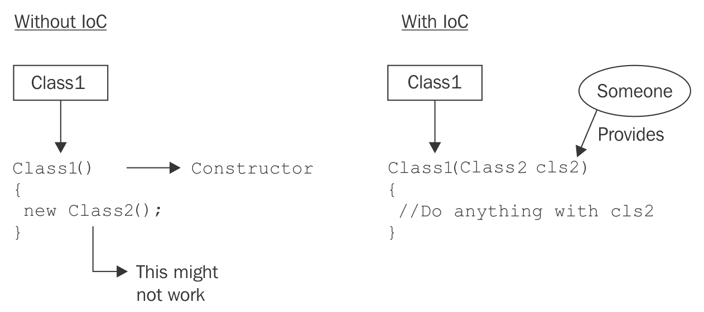

图中的**某人**可以是一个 IoC 容器。

如果你想深入理解这个概念，我强烈推荐 Shivprasad Koirala 先生的这篇文章。以下是链接--[`www.codeproject.com/Articles/29271/Design-pattern-Inversion-of-control-and-Dependency`](https://www.codeproject.com/Articles/29271/Design-pattern-Inversion-of-control-and-Dependency)。

# 问题

以下图表展示了我们现在将要做什么。我们将有一个**控制器**依赖于一个**服务**，而这个服务又依赖于一个**仓库**来获取数据：

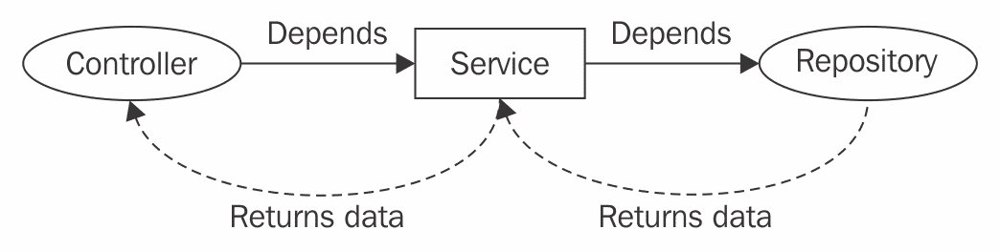

首先，让我们考虑一个简单的控制器以及它在项目中通常是如何实现的。以下是一个简单的`UsersController`，它有一个动作方法`Edit`：

```cs
    public class UsersController : Controller
    {
      public IActionResult Edit(int userId)
      {
        var usersService = new UsersService();
        return View(usersService.GetUser(userId));
      }
    } 
```

以下是从前面的代码块中可以得出的结论（更准确地说，是问题），：

+   `UsersController`使用`new`关键字实例化`UsersService`（创建一个具体类的实例）

+   `UsersController`与`UsersService`紧密耦合

就我们从前几章学到的知识而言，我们绝对应该避免前述的两个点。这会使单元测试变得困难。依赖注入（DI）原则鼓励我们利用组合根区域来注册所有必需的类/依赖（例如`UsersService`），然后使用 DI 容器来解析实例，而不是在需要时每次都使用`new`关键字。

接下来是`UsersService`，它可能看起来如下所示：

```cs
    public class UsersService
    {
      private readonly UsersRepository _usersRepository;
      public UsersService()
      {
        _usersRepository = new UsersRepository();
        // Concrete Class Dependency
      }
      public User GetUser(int userId) => _usersRepository.GetUser(userId);
    }
```

另一个具体的依赖项与`UsersRepository`相关。`UsersService`现在所做的与我们在控制器案例中看到的是同一类事情。在这个例子中，服务试图传递从仓库返回的数据。但在现实中，它可能做很多事情。这里的重要方面是我们如何在一个可能在未来构建复杂系统时变得更加复杂的类中管理我们的依赖关系。我们现在所做的练习只是指出问题，所以不要仅仅根据结构的简单性来判断。

仓库看起来可能如下所示：

```cs
    public class UsersRepository
    {
      public User GetUser(int userId) => new 
         DataContext().Users.SingleOrDefault(u => u.UserId == userId);
      // You can just return a demo user like: 
      // new User { UserId = 1, UserName = "Tadit" };
    }
```

以下图表解释了到目前为止所做的工作：

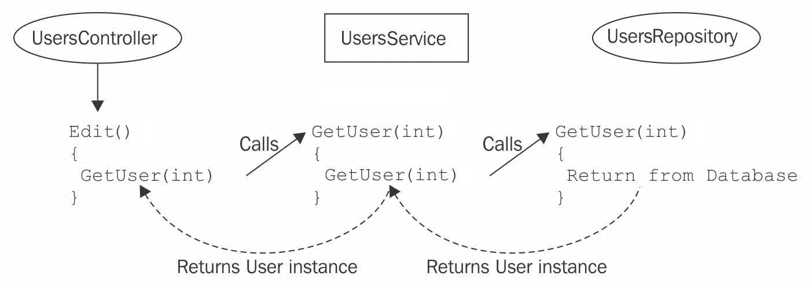

一切都到此为止。这是队列中的最后一个。它从`Users`表中获取数据并将其发送回客户端。这种架构是可行的，但存在一些缺点，这些缺点可能会随着你继续前进而变得更加严重：

+   单元测试并不容易，因为类之间紧密耦合。例如，`UsersController`依赖于`UsersService`，而`UsersService`又依赖于`UsersRepository`，最后，它处理数据库，而单元测试可能会因为数据库交互而失败。

+   如果这种架构增长并成为一个完整的应用程序，那么维护会变得困难，因为类被各种依赖关系缠绕，这些依赖关系难以识别和管理。

+   没有任何技术/方法可以轻松地修改依赖关系。假设我们想要实现一个名为`UsersNewService`的服务类，并希望使用它而不是`UsersService`。这将是一项繁琐的任务，因为我们必须识别`UsersService`的所有依赖关系，然后更改它们。

+   此外，具体服务引用可能在某些情况下失败，因为方法签名可能在不同类之间有所不同。例如，这两个服务类中的`GetUser`方法可能在签名上有所不同，这使得开发者的生活变得困难，因为你必须修改`GetUser`调用方法，包括服务引用更改。

这些缺陷不仅描述了一个架构不良的项目，而且成为开发者重构和维护的噩梦。

# 解决方案 - 使用依赖注入进行重构

正如我们所知，依赖倒置原则（Dependency Inversion Principle）表述如下：

+   高级模块不应该依赖于低级模块。两者都应该依赖于**抽象**。

+   抽象不应该依赖于细节。细节应该依赖于抽象。

因此，让我们设计接口以抽象出具体类。

从层次结构的最后一个开始，即仓库：

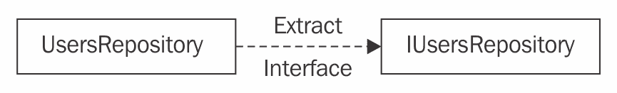

仓库的抽象看起来如下：

```cs
    public interface IUsersRepository
    {
      User GetUser(int userId);
    }
```

因此，`UsersRepository`将如下实现`IUsersRepository`：

```cs
    public class UsersRepository : IUsersRepository
    {
      public User GetUser(int userId)  => new 
        DataContext().Users.SingleOrDefault(u => u.UserId == userId);
      // You can just return a demo user like:
      // new User { UserId = 1, UserName = "Tadit" }; 
    }
```

# 接口提取

你知道从类中提取接口有多容易吗？使用 Visual Studio 非常容易且有效。让我们看看以下步骤：

1.  将鼠标悬停在具体类上；你会在左侧看到一个灯泡。

1.  点击它以打开下拉菜单。参见图示：

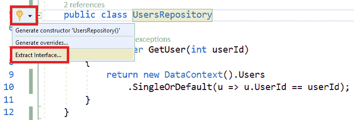

1.  选择`提取接口`。

1.  会弹出一个模态窗口，其中也列出了类的公共成员。参见以下截图：

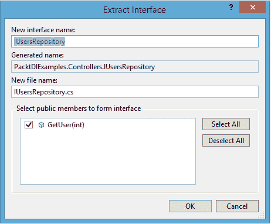

1.  点击“确定”。它将为您创建接口。

另一种提取接口的方法是，你可以写下接口名称，然后按*Ctrl* + *.*（点），这样就会出现选项气泡。你需要选择顶部两个选项之一来生成接口：

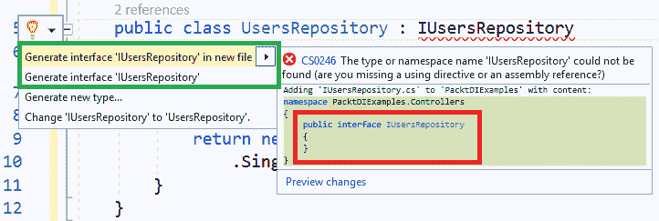

然而，与第一种方法相比，这里有一个区别；它用红色块标记了。如果你选择截图中所显示的任何 `Generate` 选项，它将创建一个带有空白块的接口块，其中没有任何代码（如红色块内所示）。然而，在第一种情况下，我们有选择将公共成员包含在接口中的机会。想象一下一个具有大量公共成员的大类。毫无疑问，正如之前所述，第一种方法在明显的原因下获胜。

好的。现在我们可以修改 `UsersService`，将其作为依赖项注入，而不是在构造函数中使用 `new` 关键字来实例化。`IUsersService` 接口可以设计成我们为仓库所做的那样，以便在控制器中使用，我们稍后会看到：

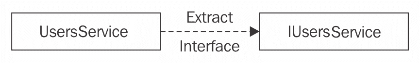

`IUsersService` 只是一个简单的接口，其中 `GetUser` 是一个公共成员：

```cs
  public interface IUsersService
  {
    User GetUser(int userId);
  }
```

现在可以修改 `UsersService` 以实现 `IUsersService`。可以使用构造函数注入模式来注入 `IUserRepository` 依赖项：

```cs
    public class UsersService : IUsersService // Abstraction
    {
 private readonly IUsersRepository _usersRepository;
 public UsersService(IUsersRepository 
         usersRepository) // Constructor Injection
 {
 _usersRepository = usersRepository;
 }
       public User GetUser(int userId) => _usersRepository.GetUser(userId);
    }
```

此更改将触发对控制器的修改；否则，编译器会报错。让我们让编译器高兴起来：

```cs
    public IActionResult Edit(int userId)
    {
 var usersService = new UsersService(new UsersRepository());
    return View(usersService.GetUser(userId));
    }
```

我们现在可以将仓库实例注入到控制器中的 `Edit` 动作服务中。

到目前为止，我们已经从架构中消除了一个具体引用，即来自 `UsersService` 类的引用。理解我们的目标是至关重要的。我们实际上是在尝试将每个依赖项放在一个地方，以便简化设计。因此，通过最小的更改，我们可以轻松地将不同类型的依赖项注入到系统中。

例如，我们的 `UsersService` 现在负责管理 `UsersRepository` 依赖项，而不是服务内部通过紧密耦合来管理它。

然而，我们还没有完成。我们还有一个明显的依赖项在控制器中，使用 `new` 关键字在 `Edit` 动作中实例化，那就是 `UsersService`。

重构后的可注入 `UsersController` 将如下所示：

```cs
    public class UsersController : Controller
    {
 private readonly IUsersService _usersService;
 public UsersController(IUsersService usersService) // 
        Constructor Injection
 {
 _usersService = usersService;
 } 
      public IActionResult Edit(int userId)
      {
 // We commented out the following line and used
        // private member _usersService instead.
        //var userService = new UsersService(new UsersRepository());
        return View(_usersService.GetUser(userId));
      }
    }
```

简单吧？构造函数注入再次拯救了我们，并允许我们注入服务，以便我们可以用于后续操作。

太棒了，现在我们移除了所有依赖项。继续运行应用程序：


不幸的是，它抛出了一个异常。这并不奇怪。框架期望控制器中的构造函数少一个参数，而我们不再有这个参数，然后它发现了一个接受 `IUsersService` 实现实例的参数化构造函数，而这个实例在应用程序的任何地方都没有提供。因此，异常被形成。

好吧，我知道你在想什么。添加一个参数更少或默认构造函数不会改变场景。相反，它会在浏览器中显示以下内容：

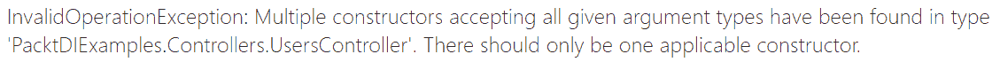

此外，依赖注入（DI）不推荐使用多个构造函数，所以这也不是一个选择。

在我们继续解决方案之前，让我总结一下到目前为止我们所做的工作。

+   我们为具体类创建了抽象

+   我们用带有抽象的构造函数注入替换了`new`关键字

+   在这个过程中，我们还修改了`UsersController`的默认构造函数，以注入`IUsersService`依赖

然而，我们遇到了异常。这是因为我们既没有实例化`IUsersService`接口的任何实现，也没有将其提供给构造函数。

为了使应用程序运行，我们还需要做两件事。那就是让编译器知道以下实现的细节：

+   `IUsersService`接口

+   `IUsersRepository`接口

这可以通过一个 IoC 容器来完成。既然我们使用的是.NET Core 2.0，让我们使用内置的容器并看看会发生什么。`Startup`类的`ConfigureServices`方法看起来如下：

```cs
    public void ConfigureServices(IServiceCollection services)
    {
    services.AddTransient<IUsersService, UsersService>()
            .AddTransient<IUsersRepository, UsersRepository>();
    services.AddMvc();
    }
```

现在让我们运行应用程序：

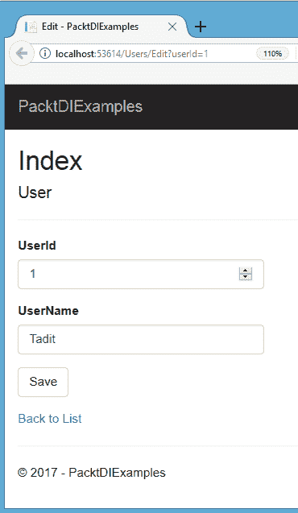

最后，它运行起来了。一切都很完美，我们在浏览器中得到了输出，多亏了.NET Core 的 DI 引擎，当然，也多亏了你在这本书中到目前为止所取得的进步。

我们在重构类以注入依赖而不是引用具体类方面做得非常出色，这些具体类效率低下且难以维护。尽管如此，紧耦合并没有完全消除。服务仍然向控制器返回数据库模型类`User`的实例。

想象一个三层架构，其中层可以是`ASP.NET MVC Web App Layer`、`Service/Business Layer`和`Data Access Layer`。如果一个开发者在表示层（`ASP.NET MVC Web App Layer`）直接使用模型类，这意味着它是紧密耦合的，并且不能在没有项目中的`Data Access Layer`引用的情况下生存。在下一节中，我们将看到这样的问题，并尝试将其重构为依赖注入。

# 分层架构

在一个典型的现代 ASP.NET MVC Web 应用程序中，你会找到一个三层架构，其中各个层相互独立且相互依赖，如下面的图所示：

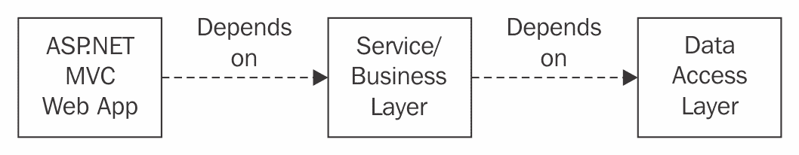

当我们说某个层依赖于另一个层时，这意味着依赖的那个层需要依赖对象的实例来执行某些操作。正如我们在上一节中看到的，要从数据库获取用户，控制器会要求服务从存储库中提供它。因此，我们可以很容易地将类分离并将它们作为组件或类库打包，从技术角度来说。

这意味着我的控制器仍然位于`UI Layer`或`Presentation Layer`，`Service Class`则创建另一个层，该层通过`Data Access Layer`类与数据库通信。现在，由于我们选择了依赖注入技术来管理依赖关系，因此 IoC 容器负责向`Service Layer`提供依赖的`Data Access Layer`对象，并向 UI 层提供`Service Layer`对象。最重要的是，它从每个层中接管了对象创建的控制权。

# 问题 - 再次是具体类的引用

我想你可能没有注意到上一节中的一个东西。我们尽可能地解耦了系统。但我们并没有完全实现松散耦合的架构。让我在下一段中解释。 

组合根是注册所有应用程序将使用的依赖项的地方。`Startup`类中的`ConfigureServices`方法就是依赖项注册的位置，正如我们所看到的：

```cs
    services.AddTransient<IUsersService, UsersService>()
    .AddTransient<IUsersRepository, UsersRepository>();
```

注意，当我们说，当需要`IUserService`依赖项时，取`UsersService`实例，当需要`IUsersRepository`时，取`UsersRepository`实例。所以，基本上，我们现在必须获取`Service Layer`和`Data Access Layer`的组件引用，才能在没有编译错误的情况下运行此代码。查看以下截图，它证明了我说的话：

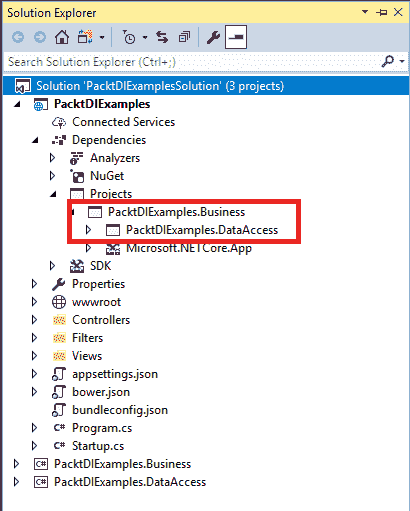

我们迄今为止设计的所有类都只是在这三个层次中分离出来。仓库位于`Data Access Layer`，而服务位于`Business Layer`内部。

很明显，你可以看到在 UI 层中存在一个`Business Layer`的引用。由于`Business Layer`有一个对`Data Access Layer`的引用，所以它自动传递到 UI 层。

因此，`Presentation Layer`现在可以访问`Service Layer`和`Data Access Layer`的各种实现。这实际上是一种非常糟糕的编码实践，因为我们试图完全违反分层架构的概念。层与层之间没有存在分离。此外，由于开发者可以直接通过引用访问具体的类实现，他们可能会滥用这些实现。这是绝对不可接受的。

# 商业层和数据访问层组件的滥用

在这里，我们将讨论作为开发者，我们如何通过直接引用层来滥用代码中的层。让我们尝试理解一些在这些组件中可能被滥用的场景，特别是在`UI Layer`中：

+   **直接访问业务层服务**：由于我们有`Business Layer`的引用，因此我们可以实例化它，然后调用`GetUser()`方法。我们需要一个`Repository`实例用于`Service`构造函数，这也可以很容易地提供。

```cs
    public IActionResult Edit(int userId)
    {
      UsersService service = new UsersService(new UsersRepository());
      return View(service.GetUser(userId));
    }
```

注意我们如何可以轻松地通过将`Repository`实例传递给其构造函数来实例化`UsersService`类。这意味着我们仍然喜欢使用`new`关键字。

+   **直接数据访问仓库访问**：当我们已经有了`数据访问`引用时，为什么还要通过`服务`呢？为什么不直接与仓库打交道来获取数据？这不是很酷吗！

```cs
    public IActionResult Edit(int userId)
    {
      UsersRepository repo = new UsersRepository();
      return View(repo.GetUser(userId));
    }
```

另一种`new`关键字的使用。

+   **直接数据层上下文访问**：更好的是以下方法，我们甚至不需要这些中间的`服务`或`仓库`实例。我们可以直接从上下文中获取数据：

```cs
        public IActionResult Edit(int userId)
        {
          return View(new DataContext()
           .Users
           .SingleOrDefault(u => u.UserId == userId)
          );
        }
```

`DataContext`可以在控制器操作中直接提供数据，如前述代码所示。

我们破坏了分层架构，模块也不再是独立的。相反，`业务层`和`数据访问层`现在与`UI 层`紧密耦合。这仅仅是因为我们不得不在`ConfigureServices`方法内部为接口注册具体的实现到服务集合中。为了进行依赖注入，我们需要这个注册步骤，这样我们就可以在需要时向容器请求依赖项。

现在，我们必须找到一种方法。让我们为这类问题找到一个最佳实践。

# 分层架构的最佳实践

记住，在使用依赖注入技术的同时，你可以做很多事情来改进架构和优化性能；然而，你不能从 ASP.NET MVP Web 应用的`bin`文件夹中移除程序集。你需要理解，问题在于`表示层`对`业务层`和`数据访问层`内部的不同具体实现访问；正如我们所见，当开发者试图玩弄层而不是正确使用它们时，这可能会造成灾难性的后果。

因此，我们需要找出一种方法来克服这种情况，不让`表示层`在受益于依赖注入的同时访问其他层的具体类。解决方案是 MEF。让我们在下一节中进一步探讨。

# 管理扩展性框架 (MEF)

在探索 MEF 之前，让我总结一下这个问题。

**紧密耦合**：在`ConfigureServices`方法中的`Startup`阶段，通过依赖注入在`UI 层`内部引用了具体的类。

因此，基本上，我们需要做一些自动化工作，这样我们就不依赖于其他层的具体类。这就是 MEF 发挥作用的地方。

MEF 是一个用于创建轻量级可扩展应用的库。借助 MEF，开发者可以轻松构建一个应用程序，自动将扩展绑定在一起，而无需任何配置。有关 MEF 的更多信息，请参阅[`docs.microsoft.com/en-us/dotnet/framework/mef/index`](https://docs.microsoft.com/en-us/dotnet/framework/mef/index)[.]。

我们不会深入探讨 MEF；您可以从我分享的先前的链接中了解。我们只需要了解我们如何用 MEF 解决我们的问题。例如，我们有一个 `Service` 类和一个 `Repository` 类，我们不想将其直接暴露给 UI 以供消费，就像我们在先前的代码片段中看到的那样。MEF 会为我们做这件事，通过拉取注册依赖项所需的类。

下面的图示展示了 MEF 在我们的应用中将扮演的角色：

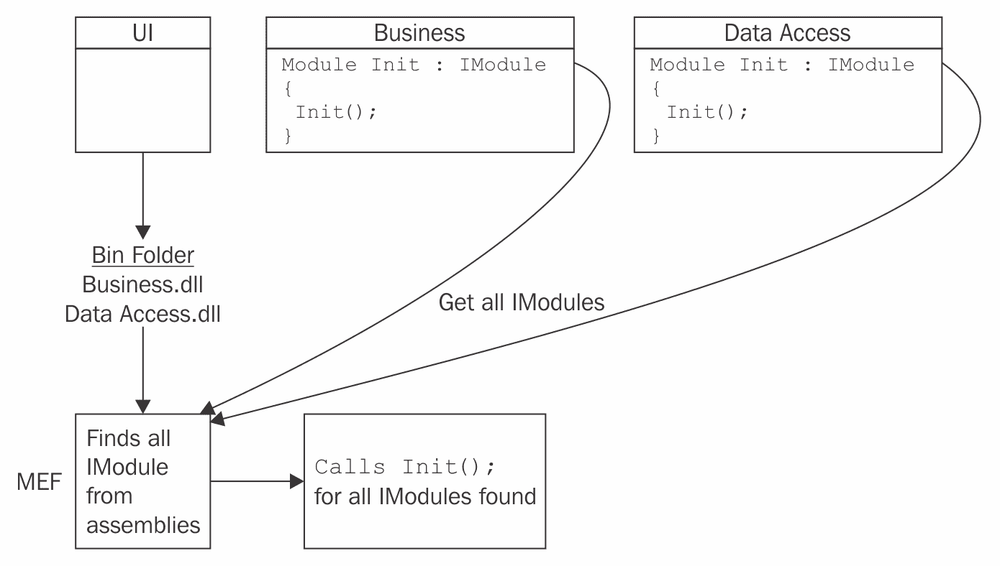

您可以看到，在每个层级中我们都有 `ModuleInit` 类，每个类都有一个 `Init()` 方法，并且这些类实现了一个名为 `IModule` 的通用接口。很明显，所有层级的 DLL 都将位于 ASP.NET MVC Web 项目的 `bin` 文件夹中。

现在是有趣的一幕。MEF 从应用的 `bin` 文件夹中获取所有程序集，然后执行以下操作：

1.  搜索 `IModule` 的实现。

1.  触发每个找到的模块的 `Init()` 方法。

在下一节中，我们将看到不同层级的代码以及 MEF 如何将松散耦合的模块带回来以优化架构。

# 层级和 MEF 实现

在深入代码之前，让我们首先分析一下层级。所以，这里有三个层级。

1.  **Web 应用层：** 包含 `Controller`、`View` 等。最重要的是，它有入口点 `Startup.cs`。

1.  **业务/服务层：** 包含 `Services`，其中我们可以包含我们的业务逻辑。

1.  **数据访问层：** 包含 `Contexts`、`DbSets` 和 `Repository`，用于从数据库中检索数据。

让我们快速查看一下 `Visual Studio 解决方案` 窗口：

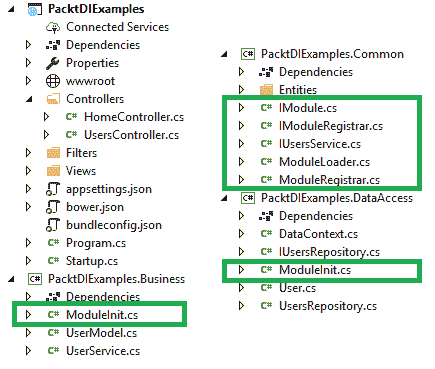

我们已经将我们的类组织到不同的层级中。有趣的是，我们引入了另一个名为 `Common Layer` 的层，其中我们放置了与 `Business Layer` 和 `Data Access Layer` 相关的所有通用代码。一个通用项目被 `Business Layer` 和 `Data Access Layer` 同时引用。

这段通用代码将帮助我们从与不同层级相关的程序集中获取依赖项，并将它们打包成一个（称为 `ModuleLoader`），这样 web 应用就可以通过调用一个方法来启动一切。让我们逐个理解每个部分。

# 引入 IUser

目标是从 UI 层移除对具体类的访问。我们开始将所有通用项移动到一个名为 `Common` 的中央层。当我们把 `IUsersService` 移到 `Common` 时，我们识别了一个 `GetUser` 方法，它实际上返回一个具体的 `User` 实例。此外，`Business Layer` 内的 `UserService` 也有相同的方法，因为它实现了 `IUsersService`。

以下代码展示了如何将 `GetUser` 方法的返回类型从 `User` 类型更新为 `IUser` 类型：

```cs
    public IUser GetUser(int userId) =>
          _usersRepository.GetUser(userId);
   // Return type is changed from User to IUser.
```

我们需要消除对`User`类的依赖，否则`Common Layer`又必须再次引用`Data Access Layer`，因为`User`类就位于那里，对于`Business Layer`引用`Data Access`的情况也是一样的。此外，`Common`被设计成可以被其他层引用，而不是在自身内部获取其他层的引用。它应该摆脱项目依赖。这一点很重要。

解决方案非常简单。在`Common/Entities/Users`目录中添加一个`IUser`接口，它将被用作`GetUser`方法的返回类型。因此，`UsersService`和`UsersRepository`中的`GetUser`可以返回`IUser`类型而不是`User`实例。现在我们可以轻松地消除`Data Access`与`Common Layer`的耦合。同样，`Data Access`与`Business Layer`的耦合。

下面的图示告诉我们，当我们使用`User`类时出了什么问题。在`Business Layer`中存在对`Common Layer`和`Data Access Layer`的引用：

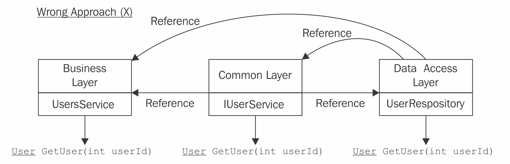

下面的方法使用接口`IUser`是正确的，它允许我们减少层的耦合：

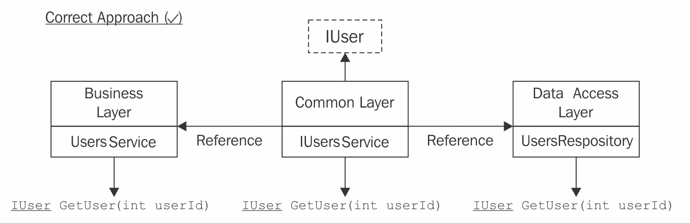

现在在`Common Layer`内部不再需要`Data Layer`的引用。相反，`Business Layer`和`Data Layer`依赖于`Common`，这正是我们的意图。

# IModuleRegistrar 接口

`IModuleRegistrar`接口负责将依赖项添加到服务集合中。基本上，实现此接口的类将有一个具有指定签名的`Add()`方法，该方法执行`Add***`（`AddTransient`/`AddScoped`/`AddSingleton`）方法的工作。

```cs
    using Microsoft.Extensions.DependencyInjection;
    using System;
    namespace PacktDIExamples.Common
    {
      public interface IModuleRegistrar
      {
        void Add(Type serviceType, Type implementationType,
           ServiceLifetime lifetime);
      }
    }
```

这是在`Common Layer`中实现的。

# ModuleRegistrar 类

`ModuleRegistrar`，该类实现了之前提到的接口，其结构大致如下。它基本上是一个内置 IoC 容器的包装器，用于注册依赖项：

```cs
    using Microsoft.Extensions.DependencyInjection;
    using System;

    namespace PacktDIExamples.Common
    {
      internal class ModuleRegistrar : IModuleRegistrar
      {
        private readonly IServiceCollection _serviceCollection;
        public ModuleRegistrar(IServiceCollection serviceCollection)
        {
            this._serviceCollection = serviceCollection;
        }

        public void Add(Type serviceType, Type implementationType,
            ServiceLifetime lifetime)
        {
            var descriptor = new ServiceDescriptor(serviceType, 
              implementationType, lifetime);
 this._serviceCollection.Add(descriptor);
        }
      }
    }
```

注意这个类的两个重要方面：

+   `IServiceCollection`被注入到构造函数中

+   使用`ServiceDescriptor`实例注入`IServiceCollection`，用于将依赖项添加到容器中

这个类是 Common 库的一部分。

**服务描述符**：`IServiceCollection`是服务描述符的集合。当创建服务描述符实例时，它可以提供关于服务或依赖项的完整信息。我们有不同的方法用于不同的生命周期，如`AddTransient`、`AddScoped`和`AddSingleton`来注册依赖项。然而，我们无法将所有三种方法都写在一个地方来管理依赖项。这就是服务描述符发挥作用的地方，它可以将生命周期作为参数，并可以直接使用`Add`方法将其添加到`ServiceCollection`中。

# IModule 接口

`IModule`是架构中的主要英雄，因为这是 Loader 首先使用的东西，用于识别需要从所有目标程序集中获取哪些模块。此接口公开一个方法，`Initialize()`，由 Loader 调用以将依赖项添加到容器中。考虑以下代码片段：

```cs
    namespace PacktDIExamples.Common
    {
      public interface IModule
      {
        void Initialize(IModuleRegistrar registrar);
      }
    }
```

此接口也位于通用库中。

# `ModuleInit`类

让我们看看前面的`IModule`接口如何在`Business Layer`中实现：

```cs
    using Microsoft.Extensions.DependencyInjection;
    using PacktDIExamples.Common;
    using System.Composition;

    namespace PacktDIExamples.Business
    {
 [Export(typeof(IModule))] // Will be used by MEF to
         fetch the class.
      public class ModuleInit : IModule
      {
        public void Initialize(IModuleRegistrar registrar) // Registrar
            injected.
        {
 registrar.Add(typeof(IUsersService), typeof(UsersService), ServiceLifetime.Transient);
           // Adds the UserService instance 
           // to the container with Transient Lifetime.
        }
      }
    } 
```

`ModuleInit`存在于`Business Layer`和`Data Access Layer`中。这个类帮助我们向每一层添加不同的依赖项，例如在`Business`中的`UsersService`和在`Data Access`中的`UsersRepository`。您可以看到`UserService`是如何在`Business Layer`中添加到注册器的。我正在跳过`Data Access Layer`中的`ModuleInit`。它只是在`Initialize`中更改了一行。以下代码可以在`Data Access Layer`的`ModuleInit`中添加以注册`UserRepository`依赖项：

```cs
    registrar.Add(typeof(IUsersRepository), typeof(UsersRepository),
      ServiceLifetime.Transient);
```

请注意最后第二个代码块中的粗体部分`([Export(typeof(IModule))])`，这非常重要。这是一个属性，它帮助 MEF 从指定的程序集中抓取具有`IModule`接口的`ModuleInit`类。然后它可以轻松调用`Initialize`以启动注册依赖项的过程。我们很快就会看到执行此任务的代码。

等等！这里有一个构造函数注入。那它是用来做什么的呢？实际上，注册依赖项的代码位于注册器内部，因此我们确实需要`IModuleRegistrar`依赖项来调用`Registrar`的`Add()`方法，以便注册所需的依赖项，例如在`Business Layer`中的`UsersService`。

检查依赖项注册过程中的控件流。通常流程如下：

`ModuleLoader` | `ModuleInit(IRegistrar)` | `ModuleRegistrar` | `Add()`（将依赖项添加到集合）：

以下图表通过讨论的可用层可视化了**模块加载器**的工作：

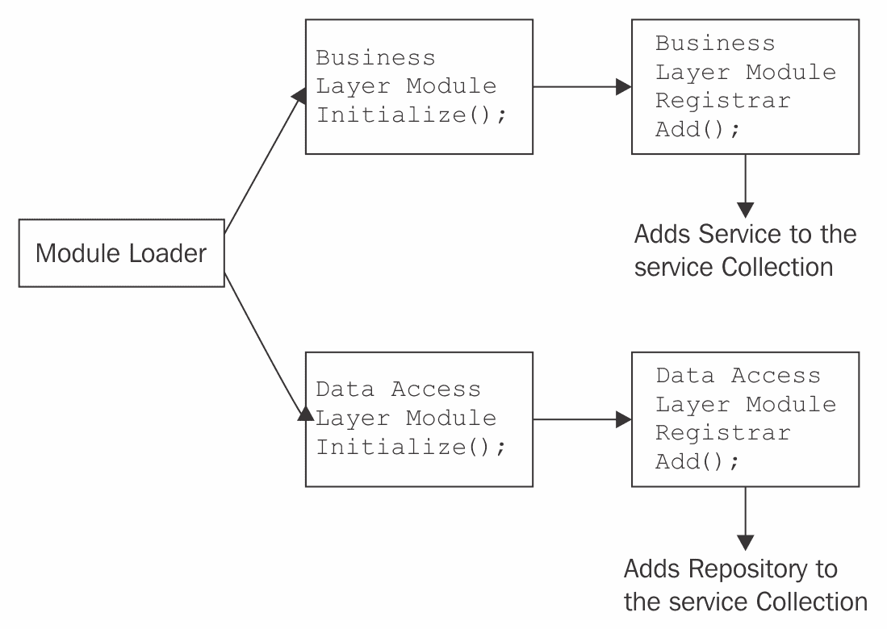

# 模块加载器类

要使用 MEF，我们需要一个名为`Microsoft.Composition`的 Nuget 包。这将`System.Composition`安装到项目中。您需要在`Common Layer`中添加此包。`ContainerConfiguration`是`System.Composition.Hosting`命名空间中的类，它组合所有程序集，并可以为我们提供一个容器，我们可以从中轻松提取所需的具体实现。

以下截图是在 NuGet 包管理器窗口中搜索时显示的`NuGet`包预览：


最后，但同样重要的是，是 `ModuleLoader`。我们至今所学的一切都由 Loader 管理，它是一个具有一个方法 `LoadContainer` 的静态类。此方法由我们的 MVC Web App `Startup` 调用以初始化依赖项注册过程。让我们先睹为快代码：

```cs
    namespace PacktDIExamples.Common
    {
     public static class ModuleLoader
     {
        public static void LoadContainer(IServiceCollection collection,
            string pattern)
        {
           // Gets the Assembly Location: The total path of the Web App
           assembly, which in our case is 
 "C:\\Users\\taditd\\Desktop\\Packt\\Codes\\PacktDIExamples\\
            PacktDIExamples\\bin\\Debug\\netcoreapp2.0\\
            PacktDIExamples.dll".
            var executableLocation = Assembly.GetEntryAssembly().Location;

            // Get all assemblies inside the location with a pattern
              from "bin\Debug\netcoreapp2.0".
            var assemblies = Directory
                .GetFiles(Path.GetDirectoryName(executableLocation),
                   pattern, SearchOption.AllDirectories)
                .Select(AssemblyLoadContext.Default.LoadFromAssemblyPath)
                .ToList();

            // Composes the assemblies.
            var configuration = new ContainerConfiguration()
               .WithAssemblies(assemblies);
            using (var container = configuration.CreateContainer())
            {
 // This is important. The following line extracts
             all the IModule implementations from the
             assemblies we fetched.
             IEnumerable<IModule> modules = container.GetExports<IModule&gt;();
             var registrar = new ModuleRegistrar(collection);

             foreach (IModule module in modules)
             {
              // Invoke Initialize for each module with the registrar
               as a dependency.
              module.Initialize(registrar);
             }
           }
          }
        }
     }
```

我在每个步骤上都添加了注释，这样你就可以轻松分析这些步骤了。这些步骤可以定义为以下内容：

1.  获取 `Web App 程序集位置`。由于我们将从这个 Web App 调用此方法，并且每个其他程序集都放置在那里，我们需要这个位置来查找其他程序集。

1.  查找在该特定位置存在的其他程序集。然而，我们需要我们应用中层的 DLL。因此，需要一个模式来识别层的程序集。根据我们的层，我们只需要找到所有以 PacktDIExamples 开头并以 `.dll` 结尾的程序集名称，因为层名称类似于 `PacktDIExamples.Business.dll` 和 `PacktDIExamples.DataAccess.dll`。因此，模式将是 `PacktDIExamples.*.dll`。我们将在稍后看到代码将此模式发送到 `LoadContainer`。你可以在调试时看到提取的模块，如下所示：

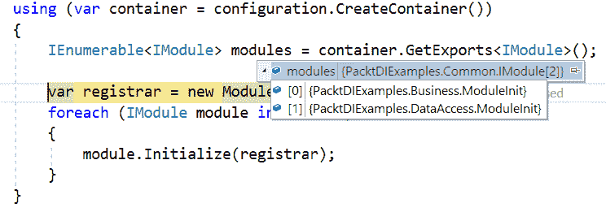

1.  使用 `ContainerConfiguration` 实例创建一个容器来保存所有程序集。

1.  现在 `container.GetExports<IModule>()` 用于从这些程序集中提取 `IModule` 实现

1.  使用注册实例作为依赖项为每个 `IModule` 实现执行 `Initialize` 方法，因为 `Registrar` 具有实际的 `Add` 方法，用于在 `ServiceCollection` 中进行依赖项注册。

我建议你在该方法中添加 `try...catch` 块来处理异常。由于空间限制，我没有发布 `try...catch` 块。我只是想展示 `ModuleLoader` 的核心逻辑。我还移除了占用大量空间的 `usings`，但你可以自己找出这些 `usings`；如果找不到，可以使用 Visual Studio。将鼠标悬停在红色行上，然后按照步骤进行，这些步骤将包括所需的库。

# 从 Web App 执行 ModuleLoader.LoaderContainer() 方法

这是最后一步，也是最简单的一步。看看我们如何在 `Startup` 内部从 Web App 调用此 Loader，如下所示：

```cs
    public void ConfigureServices(IServiceCollection services)
    {
      // Commented out codes because we now load dependencies from
          another layer.
      // services.AddTransient<IUsersService, UsersService>()
      //         .AddTransient<IUsersRepository, UsersRepository>();

      ModuleLoader.LoadContainer(services, "PacktDIExamples.*.dll");
      services.AddMvc();
    }
```

正如我提到的，我们需要发送一个模式来从 `bin/debug/netcoreapp2.0` 获取程序集名称；否则，它会获取所有程序集，这是不必要的。

注意，我们现在正在将服务发送到 `LoadContainer`。现在之前的依赖项注册代码已被注释，并且通过 `ModuleLoader.LoadContainer` 调用进行了优化。

# 我们使用 MEF 实现了什么？

如果你还没有意识到使用 MEF 重构分层架构的好处，请仔细查看以下带有解释的截图。

# 层被分隔

层与层之间紧密耦合，因为 UI 引用了`Business Layer`和`Data Access Layer`。现在在 MEF 之后，UI 不再与`Data Access Layer`绑定。然而，UI 有一个`Business Layer`程序集引用，如以下截图所示。但它在项目内部任何地方都没有被使用。它之所以存在，是因为程序集应该放在`bin`文件夹中，这样 MEF 模块在初始化时能够读取它，以便导出`IModule`实现。以下是在 MEF 实现前后项目依赖的快速比较：

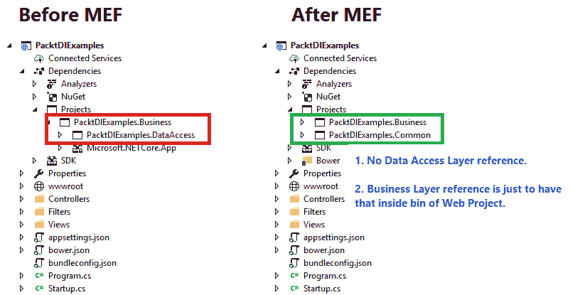

如果你尝试从 UI 中移除业务引用并运行应用程序，它将抛出异常，如下所示。这是显而易见的原因。除非你有引用，否则 MEF 无法提取`IUsersService`实现并将其注册到 DI 容器中，简单！

因此，问题发生在你点击控制器的那一刻，因为`IServiceCollection`上还没有注册任何内容：

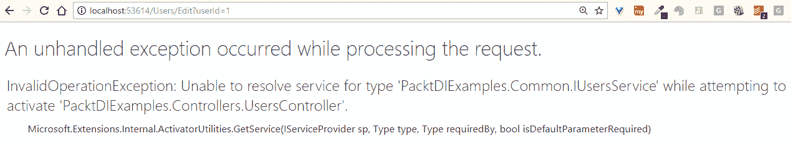

# 现在层内的所有类都是`internal`

我们可以将类的访问修饰符从`public`改为`internal`，这样它们就只能在程序集内部访问（这意味着只在 Layer 内部内部访问）：

>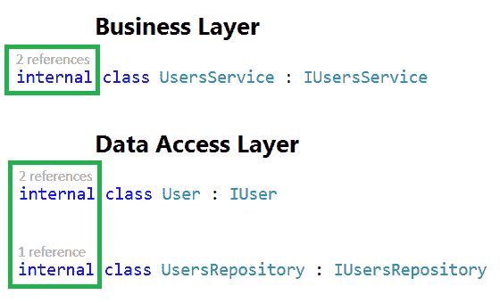

# UI 层内部不允许有具体的类实例化

在 MEF 实现之前，我们看到了如何在`Edit`操作方法内部直接引用`Data Access Layer`和`Business Layer`类。现在我们无法这样做，因为类不再可访问。

这可以从`UsersController`内部的编译错误中得到证明，如以下截图所示。注意工具提示预览，它表明`UsersService`不可用。因此，即使添加了引用，也限制了滥用其他层的类：

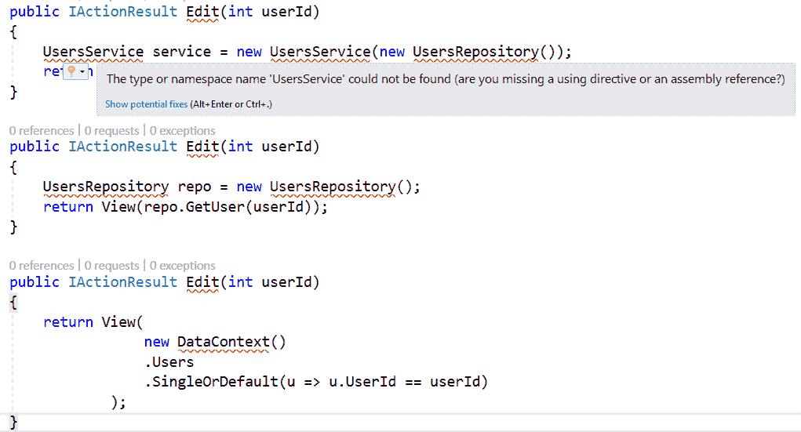

# 可以向架构中添加更多层

当未来为了优化或任何其他业务相关需求添加更多层时，该程序集可以简单地由 UI 引用；然后每个依赖项将自动注册到 IoC 容器中。记住，你需要有一个实现`IModule`接口的`ModuleInit`类来自动化这个过程。现在应用程序非常灵活，可以轻松地附加新模块，无需麻烦。

# 结论

大多数现代应用程序都遵循分层架构。拥有一种依赖注入技术来管理层内所需的依赖关系是我们应该遵循的。话虽如此，我们需要小心设计层。这是因为我们应用了 DI，认为它将解决类依赖的紧密耦合问题。然而，我们没有意识到层通过具体的依赖关系（如`User`实例的返回类型）相互连接。

*托管扩展性框架*为我们提供了一些简单的步骤，用于动态绑定来自不同层的依赖项，将它们打包成一个，然后将其注册到容器中，以便 UI 层的控制器进一步使用。

# 摘要

在学习了 DI 技术、模式、反模式等内容之后，我们仍然需要一些指导来处理 DI 发挥作用的实际场景。

我们探索了一些实时应用程序实例，其中 DI 可以帮助消除耦合并引入更清晰的依赖结构。

当开发者试图偷懒，直接在类中使用 `new` 操作符实例化所需的依赖项时，经常会看到紧密耦合的系统。请记住，`new` 是粘合剂。这不仅在你作为编码者时养成了一种不良习惯，而且也使得你的代码不可测试。单元测试变得困难。我们通过遵循 DI 技术学习了处理紧密耦合问题的技术。

然后，我们意识到在应用程序中分层是一种常见的方法。拥有 DI 一定会在长期内帮助我们处理分层系统。然而，分层方法中可能存在一些悬而未决的问题，需要解决。

MEF 是我们采用的技术，用于解决具有分层架构的一些问题。通过实现 MEF，业务或数据层实现可以被标记为内部，这样它们就不会暴露给其他层。此外，使用 DI 容器，关注点分离的分层架构规则可以保持完整。因此，层可以独立呼吸，不受任何干扰，并以一种方式装饰架构，使得新模块的引入变得非常顺畅。
