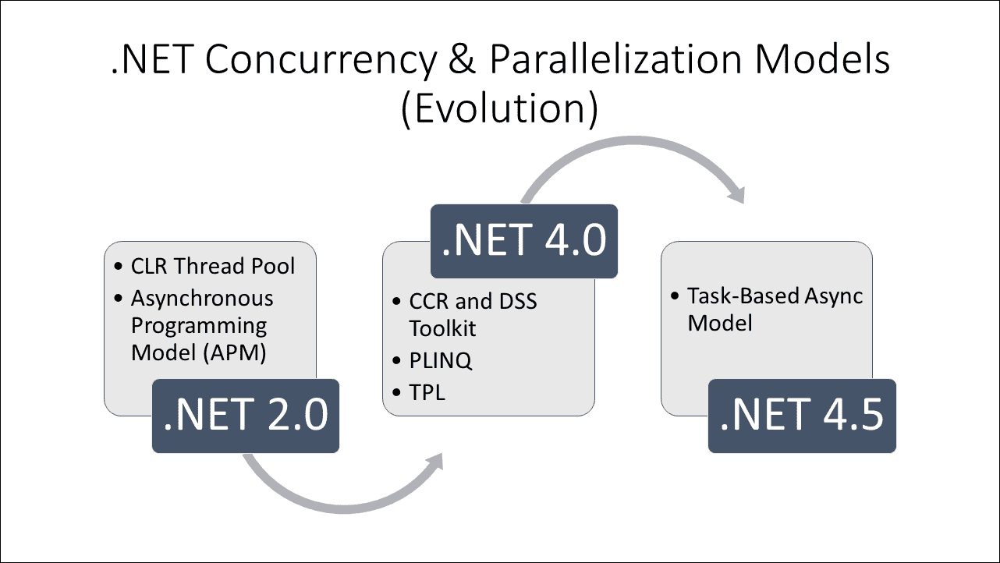
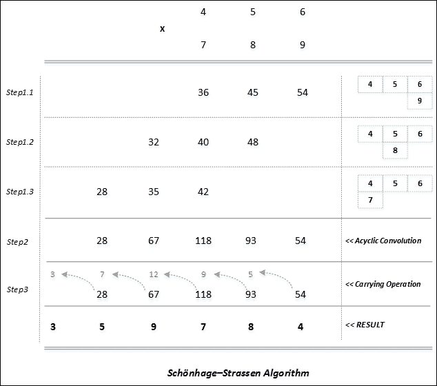
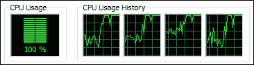
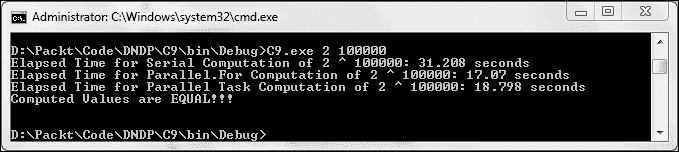
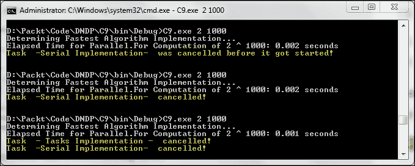

# 第八章 .NET 下的并发与并行编程

到目前为止，我们主要关注 GoF 设计模式。当目录出现时，计算世界主要是顺序的，这种偏见在目录中得到了体现。自 1994 年目录出版以来，世界发生了很大变化。由于 Java 和 C#编程语言的到来，语言级别的并发和并行性开始转向。处理器设计师认识到构建强大单核 CPU 的局限性，并开始关注多核 CPU。这给使用现有范式开发软件带来了自己的复杂性。即使是 C++这样的语言，也将并发委托给库，也在其最新版本 C++ 11/14 中增加了语言级别的并发特性。随着函数式编程特性进入面向对象的世界，编程景观发生了巨大变化。在本章中，你将学习使用 C#编程语言和.NET 平台特性编写并发和并行程序的一些技术。在本章中，我们将涵盖以下内容：

+   影响并发和并行化模型演变的因素

+   并发与并行

+   .NET 并行编程库

+   一些并行/并发谚语/习语

    +   令人尴尬的并行性

    +   Fork/join 并行性

    +   生产者/消费者范式

# 自由午餐的日子

著名的摩尔定律尽管在散热和达到纳米级以下制造工艺方面达到了时钟速度的限制，但仍在继续。CPU 设计师找到了一个聪明的解决方案来克服这个障碍——利用增加的芯片密度来水平扩展计算基础设施，而不是传统的垂直方式。这一原则在现代架构和设计中有深远的影响，其中应用程序的可扩展性（垂直和水平）与支持它们的底层基础设施具有自然弹性。结果是新一代 CPU 架构，包括超线程、多核和众核。开发者意识到“免费午餐”（仅仅通过时钟速度、执行优化和缓存利用传统的 CPU 性能提升，而无需更改他们的程序）已经结束，这并不算晚。Herb Sutter 在 Dr. Dobb's Journal 上发表了一篇有影响力的文章，标题恰为《免费午餐结束：软件向并发的根本转变》！

### 备注

这种认识，即软件是利用现有资源实现更多功能的瓶颈，标志着软件架构和设计领域一场新革命的开始。

这种新模型帮助消除了在建模现实世界问题场景中的许多不足。然而，我们（开发者）似乎开始为用交互并行而不是仅仅顺序和面向对象的方式来建模这个世界的大规模并发设计增添正义。普遍采用的并行化技术（主要被科学界用于进行令人尴尬的并行计算）——即与硬件线程关联的显式线程——是原始的且扩展性较差。很少有人具备（或者更确切地说，感到舒适）使用低级结构来利用多线程在他们的应用程序中的专业知识。这种状况促使我们创造更好的抽象和所需的 API 来编写下一代软件，这种软件将内在地利用并发和并行性，以实现更多功能。

# 赞助午餐日

微软的.NET **公共语言运行时**（**CLR**）通过托管线程池（大约在 2.0 版本时稳定）提供了帮助，这为在之上构建强大的基础层铺平了道路，随后并发和并行化模型得以发展。

### 注意

其中最值得注意的是**异步编程模型**（**APM**）、**并发和协调运行时**（**CCR**）、**去中心化软件服务**（**DSS**）、**并行 LINQ**（**PLINQ**）、**任务并行库**（**TPL**）以及基于任务的异步/等待模型。

某些功能结构和技术特性，如匿名方法、Lambda 表达式、扩展方法、匿名类型和**语言集成查询**（**LINQ**），是推动这一演变的催化剂。主要贡献者和专家包括 LINQ 的 Erik Meijer，.NET 多线程的 Joe Duffy 和 Jon Skeet，Stephen Toub，Ade Miller，Colin Campbell 和 Ralph Johnson，以及 CCR 的 Jeffrey Richter 和 George Chrysanthakopoulos。

在上述著名模型中，成熟并被今天推崇的主要有以下几点：

+   并发基于任务的异步/等待模型

+   **并行扩展**（**PFX**）包括 PLINQ 和 TPL 用于并行化



# 并发与并行

这两个关键结构经常被开发者混淆，并且需要清晰的解释。作者强烈认为，对这种区别的彻底理解是有效软件设计的关键，通过有效利用现有基础设施（处理器、核心、硬件和软件线程）来实现更多功能。让我们从 Go 编程语言（Go 语言的发明者）的经典定义开始，并尝试解码其含义。

|   | *并行化是同时执行多个任务（相关或不相关），而并发是关于同时处理很多事情。并发是关于结构；并行化是关于执行。并发提供了一种结构化解决方案的方法来解决可能（但不一定是）可并行化的问题。* |   |
| --- | --- | --- |
|   | --*Rob Pike* |

这清楚地阐述了这些结构之间的区别，并进一步说明了并发作为模型如何通过将程序分解成可以独立执行的部分来帮助结构化程序。并发设计模型的这种强大后果根据程序运行时或编译器基础设施可用的硬件支持来促进并行性。

### 注意

这进一步意味着 **一次编写，到处运行**。

这个模型让“免费午餐”的日子又回来了，其中并发程序可以通过利用并行化技术（大多数情况下是抽象的或在底层，并且依赖于执行这些程序的框架库或运行时）在多个核心上表现得更好。这可以非常清楚地理解为异步编程模型使用 `async` 和 `await` 的工作方式。这种模型通过将程序分解成可以独立执行的部分来帮助结构化程序。这些独立的部分成为 **任务**（TPL 的一部分），并可以同时执行，利用可用的硬件（核心和线程）。现在你看到了并行性如何成为并发模型的一个有趣的副作用。这由 TPL API 和 CLR 管理着（在并行化的程度方面，这决定了要利用多少核心以减少竞争），因此，开发者可以专注于将过程的核心分解（具有很少或没有共享状态）到独立的任务中，而不是陷入实现并发和并行化的低级结构（线程和同步）的纠缠中。API 已经非常智能地进化来支持这一点，从而使代码库非常具有表现力、声明性和可读性。

相反，如果你明确尝试利用基本的简单并行性（`Parallel.For` 和 PLINQ）来执行分解的任务，你很可能会阻塞你的线程，从而降低可扩展性和可用性（尤其是对于服务器端程序）。

|   | *不要阻塞你的线程，让异步 I/O 为你工作* |   |
| --- | --- | --- |
|   | --*Stephen Toub/Scott Hanselman* |

这是并发编程模型工作的基础原则。经典的例子是 Node.js，它凭借其固有的异步 I/O 支持，成为了一个备受瞩目的中间件和后端系统。再次强调，这种好处更多地体现在 I/O 和异步服务执行上，而不是长期运行的 CPU 密集型任务（这些任务通常会导致阻塞，进而引起线程饥饿）。这是一个经典的场景，当使用`Parallel.For`循环进行任务并行时，开发者会抱怨程序执行时间比串行实现更长。

再次强调，这些并不意味着在任务创建、线程和并行性方面不应该使用高级和低级构造。只要可扩展性和可用性不是首要任务，通过适当的分区策略，任务并行性可以非常有效地应用。这是因为这些库有效地在 CLR 线程之间平衡工作负载，以最小化竞争，并通过工作窃取最大化吞吐量。

当设计能够充分利用现有资源并实现扩展的有效算法时，这两种模型的结果是需要考虑的。我们将在接下来的章节中尝试说明这些内容。

# 并行编程的一些常见模式

现在我们已经了解了这两种模型带来的力量，我们需要警惕这种力量带来的责任。在并发和并行性方面，常见的滥用形式是全面的代码重构，这往往事倍功半。在这个范式下，模式变得更加相关，因为开发者正在推动计算硬件的极限。

|   | *种族问题、死锁、活锁、优先级反转、两步舞和锁车队通常在顺序世界中没有立足之地，避免这些问题使得质量模式变得更加重要* |   |
| --- | --- | --- |
|   | --*Stephen Toub* |

作者希望从建模/分解的角度来审视这个问题，并展示一些关键模式、数据结构和同步构造的适用性，以便帮助程序员充分利用并发和并行性。关于模式和原始构造的详细内容，作者强烈建议开发者阅读 Stephen Toub 的《并行编程模式》和 Joe Duffy 的《Windows 上的并发编程》。

## 令人尴尬或方便地并行

这是我们将要讨论的首要模式。能够利用这些模式的候选程序是那些可以轻易分解为具有很少或没有依赖关系的任务/操作的程序。这种独立性使得这些任务/操作的并行执行非常方便。我们将稍微偏离传统的例子（例如光线追踪和矩阵乘法），同时激发在创建算法时的冒险感和成就感，而这个算法在本质上是非常容易并行化的。

### 提示

我们将通过创建一个用于快速乘以大整数的 C#实现来阐述这个模式，即*Schönhage-Strassen*算法。

### 问题陈述

如指示，问题陈述在具有乘以大数的能力方面似乎很简单（让我们进一步提出天文数字），这些数甚至无法表示（64 位计算限制）。我们有意缩小了范围，仅限于一个操作（乘法）来概述这个模式。任何有兴趣的读者都可以继续实施其他操作，从而设计出自己的`BigInteger`版本，支持所有数学运算。

### 解决方案方法

让我们从概述乘以两个三位数序列（**456**和**789**）的算法开始：



Schönhage-Strassen 算法基本依赖于卷积定理，它提供了一种有效的方法来计算两个序列的循环卷积。

### 提示

作者在此处声明：循环卷积的计算并不是以最有效的方式进行。规定的步骤包括对每个序列进行**离散傅里叶变换**（**DFT**），然后逐元素相乘结果向量，最后进行**逆离散傅里叶变换**（**IDFT**）。相比之下，我们采用了一种简单且计算密集的算法方式。这导致在 Big-O 表示法中，对于两个*n*位数字的运行时位复杂度为 O(n²)。这里的核心思想是展示算法的内在并行性！

如上图所示，计算两个三位数序列乘积的算法包括三个主要步骤。我们将详细查看问题分解，并在步骤之间插入代码来展示这个模式在实际中的应用，利用一些.NET 并行化核心结构（特别是 TPL 中的`Parallel`类的`For`方法）。在这个过程中，你将了解如何有效地进行任务分解，考虑到你应用程序的算法和结构方面。

#### 步骤 1

我们将开始使用基于 10 位数字的长乘法来乘以两个数 456（序列-1）和 789（序列-2），不进行任何进位。这个乘法包括三个进一步的子步骤，如上图所示。

**步骤 1.1**

作为长乘法的一部分，我们将序列-2 中最不显著的数字（9）与序列-1 中的所有数字相乘，得到序列 36、45 和 54。

**步骤 1.2**

我们将序列-2 中下一个最不显著的数字（8）与序列-1 中的所有数字相乘，得到序列 32、40 和 48。

**步骤 1.3**

最后，我们将序列-2 中最显著的数字（7）与序列-1 中的所有数字相乘，得到序列 28、35 和 42。

#### 步骤 2

将相应的列元素（再次不带进位）相加，以获得序列 1 和 2 的循环/线性卷积序列（28、67、118、93、54）。

#### 步骤 3

执行最后一步：进行进位操作（例如，在最右列，保留 4，并将 5 加到包含 93 的列中）。在给定示例中，这得到了正确的产品，359,784。

以下是该算法的串行实现（为了清晰起见，它忠实于前面的步骤）：

```cs
    //----------------------------Abstract Factory
     public interface INumeric
     { 
         BigNumOperations Operations ();
     }
    //----------------------------Abstract Product
    public abstract class BigNumOperations
    { 
       public abstract string Multiply (string x, string y);
       public virtual string Multiply (
         string x,
         string y,
         CancellationToken ct,
         BlockingCollection<string> log)
       {
         return this.Multiply(x, y); 
       }
```

### 注意

在下面的`Power`方法中，我们将使用平方乘法算法，该算法依赖于以下事实：*x^y == (x*x)^(y/2)* 使用这个，我们将持续将指数（在这种情况下*y*）除以二，同时平方基数（在这种情况下*x*）。也就是说，为了找到 2¹¹ 的结果，我们将做[((2*2)*(2*2))*((2*2)*(2*2))] * [(2*2)] * [(2)]，或者简单地说，我们将做 2⁸ * 2² * 2¹。这个算法达到了 O(log n)的效率！

```cs
    public string Power (string number, int exponent) 
    { 
        int remainingEvenExp = exponent / 2; 
        int remainingOddExp = exponent % 2; 
        string result = number; 
        if (remainingEvenExp > 0) 
        { 
            string square = this.Multiply(number, number); 
            result = square; 
            if (remainingEvenExp > 1) 
            { 
                if (remainingOddExp == 1) 
                { 
                    result = this.Multiply( 
                        this.Power(square, remainingEvenExp), 
                        number); 
                } 
                else 
                { 
                    result = this.Power(square, remainingEvenExp); 
                } 
             } 
             else 
             { 
                if (remainingOddExp == 1) 
                { 
                    result = this.Multiply(square, number); 
                } 
             } 
         } 
         return result; 
    } 

     // Creates, Initializes and Returns a Jagged Array 

     public static int[][] CreateMatrix (int rows, int cols) 
     { 
        int[][] result = new int[rows][]; 
        for (int i = 0; i < rows; ++i) 
            result[i] = new int[cols]; 
        return result; 
     } 
   } 

    // ----------------------------Concrete Product-1 

    public class BigNumOperations1 : BigNumOperations 
    { 
        /// <summary> 
        /// Serial Implementation of Schönhage-Strassen Algorithm 
        /// <param name="x">String number Sequence-1</param> 
        /// <param name="y">String number Sequence-2</param> 
        /// <returns>String Equivalent Product Sequence</returns> 
        /// </summary> 

        public override string Multiply (string x, string y) 
        { 
            int n = x.Length; 
            int m = y.Length; 
            int prodDigits = n + m - 1; 
            int[] linearConvolution = new int[prodDigits]; 
            int[][] longMultiplication = CreateMatrix(m, prodDigits); 

            //----------------------------Step-1 

            for (int i = m - 1; i >= 0; i--) 
            { 
                int row = m - 1 - i; 
                int col = 0; 
                int iProduct; 
                for (int j = n - 1; j >= 0; j--) 
                { 
                    col = i + j; 
                    iProduct = (( int ) 
                      Char.GetNumericValue(y[i])) * 
                      (( int ) Char.GetNumericValue(x[j])); 
                    longMultiplication[row][col] = iProduct; 
                } 
            } 

            //----------------------------Step-2 

            for (int j = prodDigits - 1; j >= 0; j--) 
            { 
                int sum = 0; 
                for (int i = 0; i < m; i++) 
                { 
                    sum += longMultiplication[i][j]; 
                } 
                linearConvolution[j] = sum; 
            } 

            //----------------------------Step-3 

            int nextCarry = 0; 
            int[] product = new int[prodDigits]; 
            for (int i = (n + m - 2); i >= 0; i--) 
            { 
                linearConvolution[i] += nextCarry; 
                product[i] = linearConvolution[i] % 10; 
                nextCarry = linearConvolution[i] / 10; 
            } 
            return (nextCarry > 0 ? nextCarry.ToString() : "") + 
              new string 
              ( 
                  Array.ConvertAll<int, char> 
                  (product, c => Convert.ToChar(c + 0x30)) 
              ); 
        } 
    } 

    // Concrete Factory-1 

    public class BigNumber1 : INumeric 
    { 
      public BigNumOperations Operations() 
      { 
        return new BigNumOperations1(); 
      } 
    }
```

### 注意

如果你仔细检查代码，我们的算法中的步骤 1 和步骤 2 是令人尴尬的，或者说，方便地可并行化。下面是相同算法的等效无锁并行实现。这利用了 TPL `Parallel.For`并行化构造。

```cs
    // Concrete Product-2 

    public class BigNumOperations2 : BigNumOperations 
    { 
        public override string Multiply (string x, string y) 
        { 
          int n = x.Length; 
          int m = y.Length; 
          int prodDigits = n + m - 1; 
          int[] linearConvolution = new int[prodDigits]; 
          int[][] longMultiplication = CreateMatrix(m, prodDigits); 

          //----------------------------Step-1 

          Parallel.For(0, m, i => 
          { 
              int row = m - 1 - i; 
              int col = 0; 
              int iProduct; 
              for (int j = 0; j < n; j++) 
              { 
                  col = i + j; 
                  iProduct = (( int ) Char.GetNumericValue(y[i]))
                    * (( int ) Char.GetNumericValue(x[j])); 
                  longMultiplication[row][col] = iProduct; 
              } 
          }); 

          //----------------------------Step-2 

          Parallel.For(0, prodDigits, j => 
          { 
              int sum = 0; 
              for (int i = 0; i < m; i++) 
              { 
                  sum += longMultiplication[i][j]; 
              } 
              linearConvolution[j] = sum; 
          }); 

          //----------------------------Step-3 

          //Use code from Concrete Product-1 here... 
        }  
    } 

    // Concrete Factory-2 

    public class BigNumber2 : INumeric 
    { 
      public BigNumOperations Operations() 
      { 
        return new BigNumOperations2(); 
      } 
    }
```

### 注意

现在，为了真正理解我们从`Parallel.For`并行化构造中获得的杠杆作用，我们必须进行一个 CPU 密集型操作，这最好通过使用乘法算法来计算幂（而不是乘积）来实现。想象一下解决小麦和棋子问题，或者更多，比如说，2^(100,000)（作为 2³²的替代）的情况。已经应用了递归的分割征服策略来计算指数（抽象类/产品`BigNumOperations`中`Power`方法的默认实现，它进一步使用各自的核产品实现的覆盖，具体的`Multiply`方法）。

你真的能计算 2^(100,000)（考虑到我们的 64 位算术运算限制）吗？好吧，看看下面的调用代码和结果：

```cs
    public static void Power (string[] args) 
    { 
        var bigN1 = new BigNumber1(); 
        var bigN2 = new BigNumber2(); 
        var x = args[0]; 
        int y = Convert.ToInt32(args[1]); 

        var watch = Stopwatch.StartNew(); 
        var val1 = bigN1.Operations().Power(x, y); 

       Console.WriteLine(
         "Serial Computation of {0} ^ {1}: {2} seconds", 
          x, y, watch.ElapsedMilliseconds / 1000D); 

        watch = Stopwatch.StartNew(); 
        var val2 = bigN2.Operations().Power(x, y); 

        Console.WriteLine( 
          "Parallel Computation of {0} ^ {1}: {2} seconds", 
          x, y, watch.ElapsedMilliseconds / 1000D); 

        Console.WriteLine("Computed Values are {0}!!!",  
          val1.Equals(val2) ? "EQUAL" : "DIFFERENT"); 
    }
```


是的！！！它计算了这些值，并且并行实现的时间大约是串行实现的一半。

### 注意

这里的限定词，即时间减半，是相对的，将取决于核心和资源的可用性；它也会随着环境的不同而变化。

还可以看到，在并行执行的情况下，任务粒度似乎最大限度地利用了 CPU（包括所有可用核心）：



以下是对本实现中最佳实践和模式关键适用性的简要总结：

+   这是一个典型的案例，其中数据并行性（对许多数据元素/输入应用单个操作）被充分利用到核心，我们选择的并行化构造（`Parallel.For`）最适合这种情况。我们还可以利用同步原语`Barrier`（`System.Threading.Barrier`），它将使各种子任务能够在多个阶段/任务中协同并行工作。当阶段数量相对较多时，推荐使用`Barrier`。

+   选择一个无锁的任务数据结构（在这里，使用一个二维数组来捕获第 1 步中每个迭代的乘积序列）。如果你仔细观察操作（包括第 2 步），这些操作（读取/写入）是原子的。这使得并行化过程非常有效，因为没有同步惩罚（**锁**），而是资源无缝利用（`Parallel.For`提供的固有负载均衡）。最好让`Parallel.For`自行调整**并行度**（**DOP**），以利用所有可用的核心，从而防止由于线程饥饿或过度订阅而产生的副作用。最佳做法是指定`Parallel.For`的`ParallelOptions`使用`Environment.ProcessorCount`，以明确表示每个核心使用一个线程（并行化中的推荐做法）。在这种情况下，最大的限制是数组分配所需的内存。当超过 100,000 的幂时，你可能会遇到`OutOfMemory`异常（这又特定于这个算法及其所采用的相关数据结构）。

+   任务细粒度分区作为分解过程的一部分，使吞吐量（再次强调，这是一个需要通过仔细分析来达到的平衡；任何过度尝试都可能使性能摆锤摆向另一侧）。

+   选择字符串格式来表示非常大的数字。当然，你确实会承担数据转换的代价（在这种情况下，这是一个必要的恶）。你也可以为字符串类型创建一个扩展方法来支持这些大数操作（也许，还需要对合法数字进行验证）。

+   使用替代算法（反向长乘法；即，反转步骤 1.1 到 1.3），以利用仅向前（因为它的目的只是分区，与传统`for`循环中的步骤计数器不同）的并行循环分区计数器。重构你的算法比调整原本设计为串行运行的代码更好。

+   最后，利用抽象工厂 GoF 设计模式无缝地支持各种实现（在这种情况下，串行和并行）。

## 分叉/连接或主/工作模式

这是一个通常与任务并行性相关联的模式。当有可以同时运行的独立异步操作时，你可以暂时通过可以并行执行的任务分叉程序的控制流。然后你可以等待这些分叉的任务完成。

在 Microsoft® .NET Framework 中，任务是通过`System.Threading.Tasks`命名空间中的`Task`类实现的。与线程不同，使用`StartNew`方法分叉的新任务并不一定立即开始执行。它们由任务调度器内部管理，并在核心可用时按照 FIFO 方式（从工作队列中）运行。`Wait`（任务）和`WaitAll`（任务数组）方法确保了连接操作。

现在，如果你尝试将这个模式全面应用于我们的原始问题陈述（计算大数的幂），你会发现利用这个模式可以并行执行主要阶段（步骤 1、2 和 3）的任务（通过分叉任务），并且让阶段阻塞（在每个阶段内连接这些分叉的任务）来反映算法所倡导的顺序排列（步骤 1、2 和 3）。请看以下代码，它通过利用`System.Threading.Tasks`并发结构实现了 Schönhage-Strassen 算法的无锁并行实现：

```cs
    // Concrete Product-3 

    public class BigNumOperations3 : BigNumOperations 
    { 
        public override string Multiply (string x, string y,   
          CancellationToken ct, BlockingCollection<string> log) 
        { 
            int n = x.Length; 
            int m = y.Length; 
            int prodDigits = n + m - 1; 
            int[] linearConvolution = new int[prodDigits]; 
            int[][] longMultiplication = CreateMatrix(m, prodDigits); 

 var degreeOfParallelism = Environment.ProcessorCount; 
 var tasks = new Task[degreeOfParallelism]; 

            //----------------------------Step-1 

            for (int taskNumber = 0;  
              taskNumber < degreeOfParallelism;  
                taskNumber++) 
            { 
              int taskNumberCopy = taskNumber; 
              tasks[taskNumber] = Task.Factory.StartNew( 
                () => 
                { 
                    var max =  
                        m * (taskNumberCopy + 1) /  
                        degreeOfParallelism; 
                    var min =  
                        m * taskNumberCopy /  
                        degreeOfParallelism; 
                    for (int i = min; i < max; i++) 
                    { 
                        int row = m - 1 - i; 
                        int col = 0; 
                        int iProduct; 
                        for (int j = 0; j < n; j++) 
                        { 
                            col = i + j; 
                            iProduct =  
                                (( int ) Char 
                                .GetNumericValue(y[i])) * 
                                (( int ) Char 
                                .GetNumericValue(x[j])); 
                            longMultiplication[row][col] =  
                                iProduct; 
                        } 
                    } 
                }); 
        } 

        Task.WaitAll(tasks);        //Blocking Call 

        //----------------------------Step-2 

        for (int taskNumber = 0;  
            taskNumber < degreeOfParallelism;  
            taskNumber++) 
        { 
            int taskNumberCopy = taskNumber; 
            tasks[taskNumber] = Task.Factory.StartNew( 
                () => 
                { 
                    var max =  
                        prodDigits * (taskNumberCopy + 1) /  
                        degreeOfParallelism; 
                    var min =  
                        prodDigits * taskNumberCopy /  
                        degreeOfParallelism; 
                    for (int j = min; j < max; j++) 
                    { 
                        int sum = 0; 
                        for (int i = 0; i < m; i++) 
                        { 
                            sum += longMultiplication[i][j]; 
                        } 
                        linearConvolution[j] = sum; 
                    } 
                }); 
        } 

        Task.WaitAll(tasks);        //Blocking Call 

        //----------------------------Step-3 

        //Use code from Concrete Product-1 here... 

      } 
    } 

    // Concrete Factory-3 

    public class BigNumber3 : INumeric 
    { 
      public BigNumOperations Operations() 
      { 
        return new BigNumOperations3(); 
      } 
    }
```

与前面的代码一起的集体输出如下：



在前面的代码中，我们所做的是关于可用核心的显式宏范围分区，而不是在微范围分区中代替外循环的旋转。这是一个需要谨慎处理的策略，因为结果会随着你可用的资源而变化。经过深思熟虑的校准可以产生更高的吞吐量。在这种情况下，我们来到了下一个重要模式。

# 投射执行

现在我们已经看到了 Schönhage-Strassen 算法近三种不同的实现策略，我们如何进行深思熟虑的校准，并决定哪种策略是最佳的（既然我们已经了解到它与环境和相关资源有密切关系）？

### 注意

这正是这个重要模式真正帮助我们做出决策的地方，当无法避免地出现与预期结果偏差时，需要巧妙地解决这些问题。

我们将为这些策略中的每一个调度异步任务以执行，利用`Task`类的`WaitAny`方法等待其中一个操作完成（先完成的一个），并尝试取消所有其他操作。在智能学习方面，这可以定期进行，以持续校准和缓存你的策略以供大量消费。这是机器学习的一个方面，程序可以智能地适应筛选并使用有效的算法。请参阅以下代码，该代码包含在确定胜者后取消任务的选择项，通过计算出谁是最快的来工作：

```cs
    // Concrete Product-4 

    public class BigNumOperations4 : BigNumOperations 
    { 
        /// <summary> 
        /// Serial Cancellable Implementation of  
        /// Schönhage-Strassen Algorithm 
        /// <param name="x">String number Sequence-1</param> 
        /// <param name="y">String number Sequence-2</param> 
        /// <returns>String Equivalent Product Sequence</returns> 
        /// </summary> 

        public override string Multiply ( 
            string x,  
            string y,  
 CancellationToken ct, 
            BlockingCollection<string> log) 
        { 
 if (ct.IsCancellationRequested == true) 
            { 
 ct.ThrowIfCancellationRequested(); 
            } 
            //Use code from Concrete Product-1 here... 

            //----------------------------Step-1 

            for (int i = m - 1; i >= 0; i--) 
            { 
            //Use code from Concrete Product-1 here... 

                for (int j = n - 1; j >= 0; j--) 
                { 
 if (ct.IsCancellationRequested) 
                    { 
 ct.ThrowIfCancellationRequested(); 
                    } 

            //Use code from Concrete Product-1 here... 

                } 
            } 

            //----------------------------Step-2 

            for (int j = prodDigits - 1; j >= 0; j--) 
            { 
 if (ct.IsCancellationRequested) 
                { 
 ct.ThrowIfCancellationRequested(); 
                } 

                //Use code from Concrete Product-1 here... 
            } 

                //----------------------------Step-3 

            for (int i = (n + m - 2); i >= 0; i--) 
            { 
 if (ct.IsCancellationRequested) 
                { 
 ct.ThrowIfCancellationRequested(); 
                } 

                //Use code from Concrete Product-1 here... 
        } 
    }
```

### 注意

同样，具体产品 5 和 6 是基于产品 2 和 3 中使用的结构创建的。请参考配套网站上的相关代码部分以了解这些实现。

现在我们有了可以响应用户中断的可执行并行代码，让我们来了解如何进行推测性执行。

很有趣，或者更确切地说，这是一种艺术，我们如何能够控制这些结构。只是你需要看透你的算法，并确定分解如何帮助你获得对执行的更粗或更细的控制。一旦你进入任务并行化和并发的更精细复杂性，你会看到一些具有局限性的区域。你也会看到这些结构带来的抽象力量，并更好地欣赏那些需要加入以帮助你更好地控制程序的工具和钩子，而不是让**海森堡虫**困扰你的程序。让我们观察确定最快实现的输出：



尽管在所有三次试验中`Parallel.For`结构都成为了胜者。但这并不一定，因为结果取决于可用资源和算法的复杂性（从控制流和数据流的角度来看），这取决于提供的输入数据。这里发生了一些有趣的事情，这需要解释，并且因此将揭示某些行为背后的神秘面纱。记住，每件事都应该有一个解释（除非你不在控制之中，并且对你代码的行为一无所知）！

如果你想知道为什么串行实现被取消，在它开始之前，只发生了一次，这主要与机器的工作负载以及 CLR 线程池开始执行任务的优先级/顺序有关。此外，**任务实现 - 已取消**消息只出现一次的原因是`Console.WriteLine`会阻塞，直到输出被写入，因为它调用了底层流实例的`Write`方法；那些没有阻塞的会出现在控制台上。你还需要确保在所需的控制流点（分支、合并等）设置了令牌取消检测代码（`token.IsCancellationRequested`），以记录接近实时的取消，并通过`token.ThrowIfCancellationRequested`方法抛出`TaskCanceledException`（导致任务过渡到故障状态）。请检查代码中的高亮区域以理解这一点。

我们注意到的一个局限性是缺少控制台消息，这是我们需要克服的，因为，在程序执行期间捕获相关信息是一个重要的横向关注点，无论执行模型是同步还是异步。理想情况下，这项活动应该在不影响正常执行流程或造成任何性能惩罚（就阻塞调用而言）的情况下发生。异步 I/O 通常是日志库捕获信息（用户和系统驱动的）的标准选项。我们已经在第三章 *日志库*中处理了日志库，现在我们将看到如何在下一个模式中异步地传输数据和调用这些库。

另一个可以在此处利用的相关 GoF 模式是访问者模式，其中可以声明性地尝试新的算法策略实现，而不会向消费者淹没具体的产品。

## 生产者/消费者

这是一个可以从你开始为现实世界问题建模解决方案的那一刻起就很容易与之相关联的自然模式。它是如此直观，以至于人们可能无法欣赏它的优雅，然而很多时候我们却挣扎于与之相关的实现。

生产者生产消费者想要的东西是软件建模中的常见场景。这甚至可能发生在你的数据流的多级或阶段中。这在设计术语中是一个典型的流水线，并且需要在各个阶段之间进行良好的同步。流水线阶段之间的无缝交互需要一种规范的握手，我们不让消费者饿死，同时确保他们不会过度饱和。限制这种握手需要制定一个通信协议（发布-订阅模型、基于队列的模型等），这需要一些基本的并发结构（无论是数据结构还是同步原语）就位，而不是单独为它们布线。从.NET 4.0 开始，我们有了并发数据结构，包括`BlockingCollection<T>`、`ConcurrentBag<T>`、`ConcurrentDictionary<TKey, TValue>`、`ConcurrentQueue<T>`和`ConcurrentStack<T>`，这些数据结构通过抽象出同步痛点，为我们提供了足够的阻塞特性，以实现并发执行场景的无缝集成。

如果你真正审视我们的大数乘法算法，它也涉及一个流水线，分为三个阶段。唯一不同的是，我们的阶段不是并行的，而是串行的（这就是无论你有多少核心，你往往会达到阿姆达尔定律预测的收益递减点的所在）。此外，我们的数据结构（二维数组）为每个阶段的并发生产者提供了非阻塞的读写操作。

### 注意

流水线实现的性能纯粹取决于其各个阶段的性能，为了效率，我们需要为每个阶段提供一个并发模型（在我们的案例中已经实现）。

让我们看看基于生产者-消费者模型实现的非阻塞或异步日志记录，在投机执行的情况下。我们希望这样做主要是为了克服阻塞的限制和基于控制台的流写入（在生产中，你可以利用异步 I/O 进行文件或数据库写入）。

消费者的代码如下所示：

```cs
    /// <summary> 
    /// Adaptive Speculation for determining the best strategy 
    /// for your environment. Leveraging Task.WaitAny method 
    /// </summary> 
    /// <param name="args"></param> 

    public static void AdaptivePower (string[] args) 
    { 
        var bigN1 = new BigNumber4(); 
        var bigN2 = new BigNumber5(); 
        var bigN3 = new BigNumber6(); 

        var val1 = ""; 
        var val2 = ""; 
        var val3 = ""; 

        var x = args[0]; 
        int y = Convert.ToInt32(args[1]); 

        var tasks = new Task[3]; 
        var tokenSource = new CancellationTokenSource(); 
        var token = tokenSource.Token; 
 BlockingCollection<string> log = new BlockingCollection<string>(); 
        Stopwatch watch; 

        tasks[0] = Task.Factory.StartNew(() => 
        { 
            watch = Stopwatch.StartNew(); 
            val1 = bigN1.Operations() 
              .Power(x, y, token, log); 

            Console.WriteLine("Elapsed Time for Serial " + 
              "Computation of {0} ^ {1}: {2} seconds " + 
                ">> {3}", x, y, watch.ElapsedMilliseconds / 1000D, val1); 
        }, token); 

        tasks[1] = Task.Factory.StartNew(() => 
        { 
              watch = Stopwatch.StartNew(); 
              val2 = bigN2.Operations() 
                .Power(x, y, token, log); 

              Console.WriteLine("Elapsed Time for " + 
                "Parallel.For Computation of " + 
                  "{0} ^ {1}: {2} seconds >> {3}", x, y, 
                    watch.ElapsedMilliseconds / 1000D, val2); 
            }, token); 

        tasks[2] = Task.Factory.StartNew(() => 
        { 
              watch = Stopwatch.StartNew(); 
              val3 = bigN3.Operations() 
                .Power(x, y, token, log); 
              Console.WriteLine("Elapsed Time for Parallel " + 
                "Task Computation of {0} ^ {1}: {2} " + 
                  "seconds >> {3}", x, y,  
                    watch.ElapsedMilliseconds / 1000D, val3); 
        }, token); 

        Console.WriteLine("Determining Fastest Algorithm " 
          + "Implementation..."); 

        Task.WaitAny(tasks);    // Wait for fastest task to complete. 
        tokenSource.Cancel();   // Cancel all the other slower tasks. 

        try 
        { 
            Task.WaitAll(tasks); 
        } 
        catch (AggregateException ae) 
        { 
            ae.Flatten().Handle(e => e is OperationCanceledException); 
        } 
        finally 
        { 
            if (tokenSource != null) 
                tokenSource.Dispose(); 
            foreach (string logItem in log) 
            { 
 Console.WriteLine(logItem); 
            } 
            Console.WriteLine("Adaptive Speculation Complete!!!"); 
        } 
    }
```

在这里，你可以看到我们正在使用一个阻塞集合来记录日志。这需要作为另一个参数传递给实现，并且反过来收集所有的日志信息。

以下是对日志记录器（在相应的具体产品中处理）的示例代码：

```cs
    // Concrete Product-4 

    public class BigNumOperations4 : BigNumOperations 
    { 
      /// <summary> 
      /// Serial Cancellable & Loggable Implementation of  
      /// Schönhage-Strassen Algorithm 
      /// <param name="x">String number Sequence-1</param> 
      /// <param name="y">String number Sequence-2</param> 
      /// <returns>String Equivalent Product Sequence</returns> 
      /// </summary> 

      public override string Multiply (string x, string y,  
        CancellationToken ct, BlockingCollection<string> log) 
     { 
        if (ct.IsCancellationRequested == true) 
        { 
 log.Add("Serial Implementation Task was " + 
          "cancelled before it got started!"); 
          ct.ThrowIfCancellationRequested(); 
        } 
        //Use code from Concrete Product-1 here... 

        //----------------------------Step-1 

            for (int i = m - 1; i >= 0; i--) 
            { 
                //Use code from Concrete Product-1 here... 

                for (int j = n - 1; j >= 0; j--) 
                { 
                    if (ct.IsCancellationRequested) 
                    { 
 log.Add("Serial Implementation Step1 " +
 "was cancelled!"); 
                        ct.ThrowIfCancellationRequested(); 
                    } 

                    //Use code from Concrete Product-1 here... 

                } 
            } 

            //----------------------------Step-2 

            for (int j = prodDigits - 1; j >= 0; j--) 
            { 
                if (ct.IsCancellationRequested) 
                { 
 log.Add("Serial Implementation Step2 " + 
 "was cancelled!"); 
                    ct.ThrowIfCancellationRequested(); 
                } 

                //Use code from Concrete Product-1 here... 
            } 

            //----------------------------Step-3 

            for (int i = (n + m - 2); i >= 0; i--) 
            { 
                if (ct.IsCancellationRequested) 
                { 
 log.Add("Serial Implementation Step3 " +
 "was cancelled!"); 
                    ct.ThrowIfCancellationRequested(); 
                } 

                //Use code from Concrete Product-1 here... 
        } 
    }
```

因此，我们已经看到了一些在建模可并行运行的任务中扮演重要角色的关键模式。尽管叙述主要基于一个单一示例，但我们相信，作为一个开发者，你能够理解这些在实际问题场景中的应用。在覆盖范围方面，还有很多需要学习和原型设计。异常处理是一个独立的章节，尤其是在处理并发场景时，为了简洁起见，这部分内容被省略了。一片线程的海洋等待着你去探索。祝你一路顺风！

# 摘要

在本章中，我们仅仅触及了.NET 下并发和并行编程的表面。这个主题值得有一本专门的书来探讨。现在，你已经有了足够的学习背景，可以学习如何利用 C#编程语言的特征来编写高级软件，例如 LINQ、lambda 表达式、表达式树、扩展方法、async/await 等等。下一章将探讨如何利用这些工具来更好地管理状态问题。
