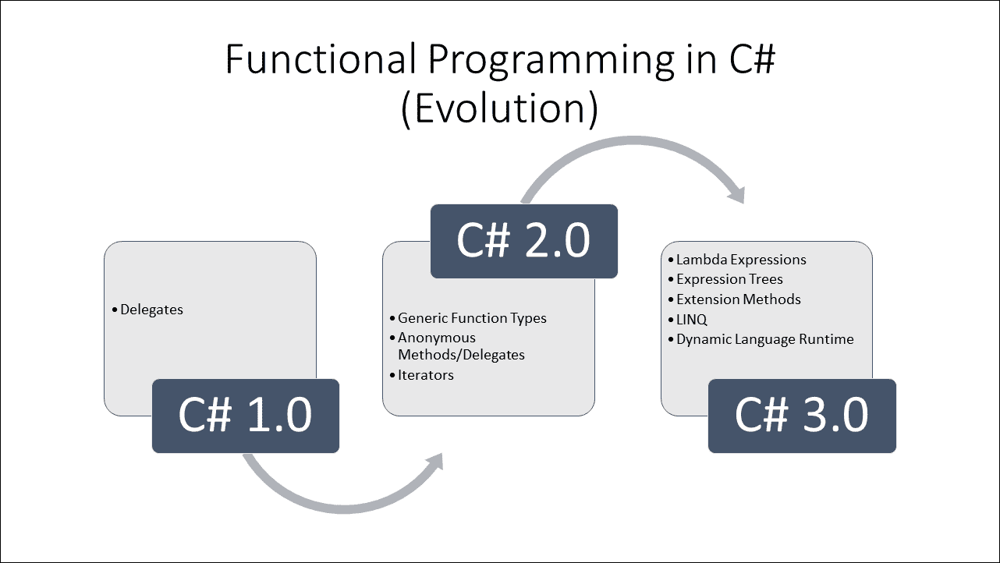
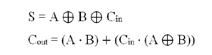

# 第九章：用于更好状态管理的函数式编程技术

在编写并发/并行代码时，在命令式程序中处理状态是困难的（你现在可能已经看到了这一点）。现代语言和平台借鉴了来自函数式编程社区的习惯和做法，以实现更好的状态管理和促进强大的并发模型。在本章中，我们将探讨这些做法，并通过代码示例尝试理解如何最好地利用这些特性（追求全面性将使本章内容扩展到整本书）以发挥我们的优势。我们还将看到 C#语言是如何演变成一种结合了命令式和函数式最佳特性的语言，以及如何帮助你将函数式思维应用于现实世界的场景。本章还将涵盖**语言集成查询**（**LINQ**）作为编写组合代码的机制。通过这次旅程，我们将揭示一些良好的设计实践，利用语言中的函数式结构（主要是 C#）。我们希望本章能作为一个入门工具包，为你提供一些技术和工具，以函数式方式处理编程任务。其中涉及的一些想法包括：

+   函数式

+   引用透明性

+   首类函数（也称为高阶函数）

+   拉姆达演算和匿名函数

+   柯里化和部分函数应用

+   LINQ 的工作原理简要概述

# 函数式

函数式编程是一种编程范式，它涉及算法组合，与数学函数评估处于同一层面。这意味着这些函数的输出将纯粹取决于提供的输入。此外，算法在创建输出所需的所有适用数据结构都是瞬时的，其生命周期在函数作用域内，从而有助于避免状态突变。它也是一种强大的声明式编程范式，它涉及利用表达式来代替过程式内联语句，以实现可读的代码。

# 引用透明性

让我们深入探讨一下，了解函数式编程的后果，正如前述章节中给出的定义所示。现在，当我们尝试将这两个世界（数学和命令式编程）中的函数联系起来时，我们看到一个强烈的差异，因为后者在源语言中使用命令来改变状态，从而引入了副作用（尽管从命令式编程的角度来看是可取的）。这违反了函数式编程的一个基本前提——引用透明性，即相同的表达式（在运行不同时间时）根据执行程序的状态产生不同的值。这影响了程序的可预测性，这绝对是不希望的。另一方面，数学世界中的纯函数（比如 *f*，一个没有这种副作用的功能）每次都会产生相同的结果 *f(x)*，其中 *x* 的值相同，比如 *sin(x)*。这种特性归因于软件行为中的幂等性（提供一致性）。现在你理解了这种特性为什么对函数式编程如此基本。

让我们通过观察两个函数来了解这一后果：一个是有副作用的引用不透明函数，另一个是引用透明函数：

```cs
    public class Counter  
    { 
      private int i = 0; 
      public int AddOneRO (int x) //Referentially Opaque 
      { 
        i += 1; 
        return x + i; 
      } 
      public int AddOneRT (int x) //Referentially Transparent 
      { 
        return x + 1; 
      } 
    } 

```

函数 `AddOneRT` 是引用透明的，这意味着如果 `x = y`，则 `AddOneRT (x) = AddOneRT (y)`。然而，对于 `AddOneRO` 我们不能说任何这样的话，因为它使用一个它修改的全局变量（`i`）。

### 注意

现在由于 `AddOneRO (x) <> AddOneRO (y)` 当 `x = y` 时，这进一步意味着 `AddOneRO (x) - AddOneRO (x) <> 0`，从而违反了基本的数学恒等式（`x - x = 0`）！

这在代码健壮性和通过记忆（缓存中间结果）、公共子表达式消除（纯表达式的结果可以替换重复评估，而不影响程序行为）、惰性评估或并行化等方式进行优化方面有重大影响。因此，为了从函数计算中获得这些后果的好处，需要努力使函数尽可能具有引用透明性（即，没有内存和 I/O 的副作用），就像数学函数一样。有了这一点，我们就来到了下一个重要的函数式编程特性，即函数成为一等公民。

# 一等函数与高阶函数

函数是函数式编程中的基本处理单元，由于它们可以被像任何其他值一样使用，因此函数可以被存储在变量、属性、对象和集合中。术语“一等函数”是由克里斯托弗·斯特雷奇创造的。

### 注意

高阶函数是那些可以接受其他函数作为参数或者返回函数作为结果的函数。

C# 支持高阶函数（包括命名和匿名），它们被当作具有函数类型的普通变量来处理。

## 函数类型

C# 提供了定义泛型函数和强类型委托的能力。委托类型携带函数原型的函数签名，其实例成为函数指针。因此，你可以操作一个函数变量，其函数方法签名与函数原型相匹配。

除了泛型函数类型之外，C# 2.0 引入了匿名方法/委托和迭代器（通过 `yield return` 语句，它允许你创建基于调用者需求/拉取的迭代器/延续方法，从而在不产生输入和输出序列的存储分配开销的情况下获得延迟执行的好处），这提供了更多的灵活性和组合能力。我们还可以使用 C# 提供的以下三种泛型函数类型：

+   一个接受多个类型参数并返回特定类型结果的函数：

```cs
        Func<T1, T2, . . . , Tn, TReturn>
```

+   一个接受多个类型参数并执行动作/但不返回任何结果的程序：

```cs
        Action<T1, T2, . . . , Tn>
```

+   一个接受多个类型参数并返回布尔结果的函数：

```cs
        Predicate<T1, T2, . . . , Tn>
```

你可以通过以下方式看到前面提到的函数类型在行动中的表现：

```cs
    public static IEnumerable<T> GenerateSequences<T> ( 
    int noOfElements, Func<T> generator) 
    { 
      for ( int i = 0; i < noOfElements; i++ ) 
      { 
        yield return generator(); 
      } 
    } 

    public static IEnumerable<TSource> Where<TSource> ( 
    IEnumerable<TSource> source, Predicate<TSource> predicate) 
    { 
      foreach ( TSource element in source ) 
      { 
        if ( predicate(element) ) 
          yield return element; 
      } 
    } 

```

使用匿名委托语法的客户端会像下面这样消耗前面的静态方法：

```cs
    int startEven = -2; 
    int startOdd = -1; 
    int increment = 2; 

    //To Generate first 1000 even numbers 
    IEnumerable<int> evenSequences = GenerateSequences<int> ( 
      1000, () => startEven += increment); 

    //To Generate first 1000 odd numbers 
    IEnumerable<int> oddSequences = GenerateSequences<int> ( 
      1000, () => startOdd += increment); 

```

### 注意

如你所见，这种延迟执行模型使你的算法使用的存储空间更少，并且比传统的命令式方法组合得更好。更重要的是，通过函数纯度，你将能够通过将不同的操作分配给不同的 CPU 核心来利用并行性，从而提高吞吐量。

现在是时候看看 C# 3.0 采纳的核心函数式编程概念了，即 lambda 表达式，它促进了函数式编程实践（几乎不需要了解其后果）在命令式世界中的广泛采用。

# 拉姆达（λ）演算

λ-演算是一种使用函数在抽象形式中表示计算的数学形式化方法。这为表示（函数抽象）和操作（函数应用）λ项提供了正式的符号和变换规则。这个形式化的关键是变量绑定和替换。**阿隆佐·丘奇**创建了λ-演算，试图证明数学逻辑。

λ-演算通过结合以下简化和概念为基于可计算函数的计算提供了一个简单的语义，这些函数基于 **丘奇-图灵** 假设（读者被敦促深入了解 λ-演算的历史、其动机和数学含义，以更好地欣赏这种形式化和其后果，而不仅仅是作为纯粹的消费者）：

## 匿名函数

这涉及到将函数视为匿名，不给予它们显式的名称。例如，考虑这个简单的 `static` 方法：

```cs
    public static int AddOperation (int x, int y) 
    { 
      return x + y; 
    } 

```

如果你重写前面的静态方法，对应的匿名委托表示法将在以下代码中突出显示：

```cs
    Func<int, int, int> AddOperation = delegate(int x, int y) 
    { 
      return x + y; 
    }; 

```

现在，相应的拉姆达表达式将是以下代码中突出显示的：

```cs
    Func<int, int, int> AddOperation = (x, y) => x + y; 

```

另一个遵循相同函数签名的拉姆达表达式，但引入了多态行为，如下所示：

```cs
    Func<string, string, string> ConcatOperation = (x, y) => x + y; 

```

现在，你可以看到拉姆达表达式遵循的正式语法，如前面给出的定义所述，这表明变量`x`和`y`被绑定到拉姆达项`x + y`。你刚刚见证了函数*f(x, y) = x + y*的拉姆达抽象。具有这种拉姆达抽象的函数定义（`AddOperation`和`ConcatOperation`）只是设置函数而不调用。在拉姆达演算的术语中，相对于前面的例子，应用将意味着将输入`x`和`y`应用于函数*f*。

拉姆达演算中的函数应用是通过**β-归约**（一个涉及将绑定变量替换到λ项中的连续归约过程，直到没有应用剩余为止）来实现的。拉姆达演算中的函数应用与命令式世界中的方法调用类似，但后果完全不同，你现在应该已经理解了。

## 闭包

如前所述，形式化的关键是变量绑定和替换。绑定变量是那些位于抽象作用域内的变量。其余的变量被称为自由（从特定抽象的上下文来看）。一个封闭的拉姆达表达式是一个没有自由变量的表达式。

### 注意

这里需要注意的是，一个变量被其最近的上层抽象所绑定，这意味着相对于一个抽象，一个自由变量最终会被绑定到层次结构中的更高抽象。而这个自由或未绑定的变量（及其相关的引用和值），在抽象的上下文中被捕获（即，词法作用域），构成了一个闭包（再次与那个抽象相关）。

```cs
    public static Func<int, Func<int, int>> sum =  
    x => y => x + y; 

```

上述代码清晰地展示了闭包的作用。在这里，闭包对象（由变量`x`及其目标方法构成）有助于在函数之间共享数据。以下代码片段清楚地展示了这种高阶`sum`函数（其中新函数被组合并返回）的使用：

```cs
    var add10 = sum(10); //Returns closure with 10 
    var add50 = sum(50); //Returns closure with 50 

    Console.WriteLine(add10(90));  //Returns 100 
    Console.WriteLine(add10(190)); //Returns 200 
    Console.WriteLine(add50(70));  //Returns 120 

```

## 柯里化和偏应用

偏应用和柯里化是两种不同的技术，但描述得比较宽松。它们是通过高阶函数的能力来实现的，其中它们的偏应用（针对一个或多个参数）返回新的函数（接受剩余的参数），其阶数（与原始函数相比）较低。

让我们理解一下柯里化与偏应用之间的区别。

### 注意

柯里化是λ演算的自然结果，其中函数仅使用单个输入。这种技术主要涉及将接受多个参数的函数评估（如任何实际函数）转换为一系列一次接受一个参数的函数评估。柯里化得名于哈斯克尔·柯里，他在戈特洛布·弗雷格和摩西·舒恩菲克尔的工作之后开发了它。

不多言，让我们看看这些功能在实际中的应用。

### 柯里化

让我们回到之前的例子：

```cs
    public static int AddOperation (int x, int y) 
    { 
      return x + y; 
    } 

```

现在这是一个简单实用的函数，我们通常都会用到。让我们看看它是如何巧妙地柯里化以生成一次接受一个参数的函数，同时利用核心函数进行函数应用的：

```cs
    public static Func<T1, Func<T2, TReturn>> Curry<T1, T2, TReturn> 
    (Func<T1, T2, TReturn> f) 
    { 
      return a => b => f(a, b); 
    } 

```

任何客户端都可以这样利用柯里化函数：

```cs
    var curriedSum = Curry<int, int, int>(AddOperation); 

    Console.WriteLine( "Sum: {0}", curriedSum(10)(90));
    //Prints Sum: 100 

```

还有另一种有趣的方式来柯里化函数；事实上，我们可以使用函数定义（在我们的例子中是委托）来柯里化任何任意函数。在这里，我们利用扩展方法（在 3.0 版本中引入的语言特性）为通用函数定义`Func<T1, T2, TReturn>`提供固有的柯里化能力：这意味着你可以将柯里化应用于任何具有此方法签名的函数。请看以下代码：

```cs
    public static Func<T1, Func<T2, TReturn>> Curry<T1, T2, TReturn> 
    (this Func<T1, T2, TReturn> f) 
    { 
      return a => b => f(a, b); 
    } 

```

高亮代码中的关键字`this`为您开启了扩展方法魔法（这本质上是用柯里化函数装饰了通用委托类型`Func<T1, T2, TReturn>`）。**哇**！我们终于为符合此定义的任何函数赋予了固有的柯里化能力。看看以下代码：

```cs
    Func<int, int, int> op = AddOperation; 
    var curriedSum = op.Curry<int, int, int>(); 

    Console.WriteLine( 
      "Sum: {0}",  
      curriedSum1(10)(90) 
    );                
    //Prints Sum: 100 

```

现在让我们在下面的多态函数中复制相同的功能：

```cs
    public static string ConcatOperation (string x, string y) 
    { 
      return x + y; 
    } 

    Func<string, string, string> op2 = ConcatOperation; 
    var curriedConcat = op2.Curry<string, string, string>(); 

    Console.WriteLine( 
      "Concatenation: {0}",  
      curriedConcat("Currying ")("Rocks!!!") 
    );                  
    //Prints "Concatenation: Currying Rocks!!!" 

```

你可以继续（如下一代码所示）创建更多的柯里化函数重载，以支持更多的函数定义（具有超过两个输入参数）：

```cs
    //Currying Extension Method that Supports 3 Input Parameters 

    public static Func<T1, Func<T2, Func<T3, TReturn>>>  
    Curry<T1, T2, T3, TReturn>  
    (this Func<T1, T2, T3, TReturn> f) 
    { 
      return a => b => c => f(a, b, c); 
    } 
    // Currying Extension Method that Supports 4 Input Parameters 

    public static Func<T1, Func<T2, Func<T3, Func<T4, TReturn>>>>  
      Curry<T1, T2, T3, T4, TReturn> 
      (this Func<T1, T2, T3, T4, TReturn> f) 
      { 
        return a => b => c => d => f(a, b, c, d); 
      } 

```

### 部分应用

现在让我们看看部分应用，它与柯里化截然不同，尽管对许多程序员来说非常令人困惑。

### 注意

部分应用（或部分函数应用）是λ演算的另一个结果，其中函数使用一组固定的输入。这种技术主要涉及将接受多个参数的函数评估（如任何实际函数）转换为接受固定数量参数的函数，进而产生另一个接受剩余参数的函数。

以下代码说明了这一切：

```cs
    public static string ConcatOperation(string a, string b, string c,  
    string d) 
    { 
      return a + b + c + d; 
    } 

    //Partial Application in functions that have 3 Input Parameters 

    public static Func<T2, T3, TReturn>  
    PartialApply<T1, T2, T3, TReturn> 
    (this Func<T1, T2, T3, TReturn> f, T1 arg1) 
    { 
      return (arg2, arg3) => f(arg1, arg2, arg3); 
    } 

    //Partial Application in functions that have 4 Input Parameters 

    public static Func<T2, T3, T4, TReturn>  
    PartialApply<T1, T2, T3, T4, TReturn> 
    (this Func<T1, T2, T3, T4, TReturn> f, T1 arg1) 
    { 
      return (arg2, arg3, arg4) => f(arg1, arg2, arg3, arg4); 
    } 

    //Sample code that illustrates usage 

    Func<string, string, string, string, string> op3 = ConcatOperation; 

    var partiallyAppliedConcat = op3\. 
    PartialApply<string, string, string, string, string> 
    ("Partial "); 

    Console.WriteLine( 
      "Concatenation: {0}",  
      partiallyAppliedConcat( 
        "Function ",  
        "Application ",  
        "Rocks!!!") 
      ); 
    //Prints "Concatenation: Partial Function Application Rocks!!!" 

```

### 应用柯里化和部分应用

让我们在实际的编程场景中看看这两个功能的实际应用。我们将关注的场景是一个经典的数学难题——在给定范围内确定毕达哥拉斯三元组。正如其名所示，毕达哥拉斯三元组是由满足毕达哥拉斯定理（*a² + b² = c²*）的数字组成的集合。找到这些三元组的传统方法如下所示：

```cs
    //The formula that confirms a Pythagorean Triplet 

    public static bool IsPythagoreanTriplet (int x, int y, int z) 
    { 
      return (x * x + y * y) == (z * z); 
    } 

    //Function that generates the triples within a given range based    
    //on the above formula. 

    public static IEnumerable<IEnumerable<int>>  
    PythagoreanTriples (int range) 
    { 
      Func<int, int, int, bool> formula = IsPythagoreanTriplet; 
      HashSet<string> capturedTriplets = new HashSet<string>(); 

      for (int a = 1; a < range; a++) 
      { 
        for (int b = 1; b < range; b++) 
        { 
          for (int c = 1; c < range; c++) 
          { 
            if (formula(a, b, c))      //Direct Evaluation 
            { 
              string keyPart1 = a.ToString(); 
              string keyPart2 = b.ToString(); 
              //This check filters the duplicate triplets 
              if (!capturedTriplets 
              .Contains(keyPart1 + ":" + keyPart2) 
              && 
              !capturedTriplets 
              .Contains(keyPart2 + ":" + keyPart1) 
              ) 
              { 
                capturedTriplets 
                .Add(keyPart1 + ":" + keyPart2); 
                yield return new List<int>() { a, b, c }; 
              } 
            } 
          } 
        } 
      } 
    } 

```

上述代码会连续产生在发现三元组时。这里暴力方法的一个有趣之处在于它返回重复项（例如-[3, 4, 5]和[4, 3, 5]，[6, 8, 10]和[8, 6, 10]，等等。与**HashSet**结合使用的过滤器（突出显示的代码）有助于消除这些重复项。

现在我们来看看利用柯里化函数的相同代码：

```cs
    public static IEnumerable<IEnumerable<int>>  
    PythagoreanTriplesCurried (int range) 
   { 
     Func<int, int, int, bool> formula = IsPythagoreanTriplet; 
 var cFormula = formula.Curry<int, int, int, bool>(); 
     HashSet<string> capturedTriplets = new HashSet<string>(); 

     for (int a = 1; a < range; a++) 
     { 
       for (int b = 1; b < range; b++) 
       { 
         for (int c = 1; c < range; c++) 
         { 
           if (cFormula(a)(b)(c))    //Curried Evaluation 
           { 
             // Use same code from PythagoreanTriples function
           } 
         } 
       } 
     } 
   } 

```

在这种情况下，基于证明勾股定理的公式创建了一个柯里化函数，该函数将依次接受`a`、`b`和`c`的有效输入，并在接收到最后一个参数时进行最终评估。

现在我们来检查在这个相同场景下部分应用的使用情况：

```cs
    public static IEnumerable<IEnumerable<int>>  
    PythagoreanTriplesPartiallyApplied (int range) 
    { 
      Func<int, int, int, bool> formula = IsPythagoreanTriplet; 
      HashSet<string> capturedTriplets = new HashSet<string>(); 

      for (int a = 1; a < range; a++) 
      { 
        var paFormula = formula 
        .PartialApply<int, int, int, bool>(a); 
        for (int b = 1; b < range; b++) 
        { 
          for (int c = 1; c < range; c++) 
          { 
            //Final Evaluation with remaining arguments 
            if (paFormula(b, c))     
            { 
              // Use same code from PythagoreanTriples function
            } 
          } 
        } 
      } 
    } 

```

现在，你可以清楚地看到柯里化和部分应用之间的区别。部分应用产生的结果成为闭包（被捕获），以便在柯里化方法中替代函数捕获。在部分应用的情况下，这种早期评估（*a²*和*b²*）将给后续迭代中的重用带来优势，而不是与柯里化相关的重复延迟评估。柯里化和部分应用的真实用途在于当输入异步生成以供大型计算函数消费时。你可以随着这些输入的生成而捕获或部分计算，并在获得最后一个输入时触发最终评估。另一个需要注意的是，部分应用可以接受多个参数（与这里显示的示例不同，它接受一个参数，就像柯里化一样）。一个典型的消费者客户端如下：

```cs
    Console.WriteLine("PythagoreanTriples within 50...."); 

    foreach (var triplets in PythagoreanTriplesPartiallyApplied(50)) 
    { 
      Console.WriteLine(string.Join(",", triplets.ToArray())); 
    } 
    Console.ReadLine(); 

```

因此，我们猜测从现在开始对这些两个概念不再有混淆！另一个冒险（如果你愿意；是的，我们向你挑战）是做以下事情：

+   优化这个算法（现在你知道有*range3*次迭代，当你超过 1,000 的范围时性能影响巨大）。

+   将过滤器操作作为 LINQ 消费者查询的一部分进行懒加载评估，这将产生重复项（最初没有使用 HashSet）。再次强调，实际上没有什么阻止你找到一种方法来生成不重复的三元组！

+   想出一个方法，在检测到三元组时永远生成它们（没有范围、循环或任何计算限制（例如 64 位有符号整数的最大值）的限制）。

## 表达式树

到现在为止，你已经看到了如何从 lambda 表达式（匿名函数）创建委托。你也可以选择创建表达式树类型。表达式树在编译器构建领域中类似于**抽象语法树（AST**），并且它们以树形数据结构体现代码，其中每个节点都表示为一个表达式。使用表达式树，你可以编译和运行代码，从而获得强大的动态修改可执行代码的能力。

|    | *表达式树也用于动态语言运行时（DLR），以提供动态语言和.NET Framework 之间的互操作性，并允许编译器编写器发出表达式树而不是微软中间语言（MSIL）。* |    |
| --- | --- | --- |
|    | --*MSDN* |

表达式树本质上是不可变的。我们只需要将 lambda 表达式赋值给类型为`Expression<TDelegate>`的变量，编译器就会发出表达式树的代码。.NET 框架提供了一个丰富的 API（在**System.Linq.Expressions 命名空间**下的表达式类），用于解析、创建和操作（当然，使用适当的树访问者重新创建）。该 API 支持大多数语言语法。

总的来说，这变成了一种非常强大的结构，可以用于代码/依赖注入、**领域特定语言**（**DSL**）的创建以及相关的语言翻译（在这种情况下，你所需要做的就是让你的动态语言**词法分析器**和**解析器**生成**抽象语法树**（**AST**），在我们的例子中，就是表达式树本身，而 DLR 会完成剩下的工作。在你开始下一次 DSL 冒险之前，不要犹豫！平台本身就有内在的支持！你终于理解了如何使用 lambda 表达式（一个匿名函数）来创建代表或表达式树类型。通过使用 lambda 表达式，你可以编写局部函数，这些函数可以作为参数传递或作为函数调用的返回值。

# 递归

递归对于任何有价值的程序员来说都不是陌生的特性。递归在函数式编程中被用来实现迭代/循环。递归函数调用自身，重复执行操作直到达到基本情况。基于尾调用的递归是一种常见现象。递归通常涉及向调用栈添加栈帧，从而增加栈的大小。在深度递归过程中，可能会耗尽栈空间。编译器会进行自己的优化（主要是尾调用优化/消除），以节省栈空间并提高吞吐量。但函数式世界（及其一等和高级函数）给了我们在递归函数中实现这些优化更多的灵活性。让我们通过以下阶乘示例来看看这是如何实现的：

```cs
    //Regular Recursion 

    Func<int, int> factorial = (n) => 
    { 
      Func<int, int> fIterator = null; //Work-around for "use of 
        unassigned variable" error! 
      fIterator = (m) =>  
        (m < 2) ? 1 : m * fIterator(m - 1); 
      return fIterator(n); 
    };
```

与经典示例不同，你看到递归是如何通过 lambda 表达式来使用的，这让你使用这些匿名函数作为高阶函数（它们是动态创建或作为参数传递的）。你还可以注意到包装函数的使用（在这个例子中是阶乘），它被直接调用，但不会递归自身，而是利用一个辅助函数（在这个例子中是`fIterator`）来进行实际的递归。

### 注意

包装函数对于执行参数验证、错误处理、记忆化等操作非常有用。

为了节省栈空间，我们可以选择一种称为尾递归的尾调用消除技术，如下所示：

```cs
    //Tail Call Elimination with Tail Recursion 

    Func<int, int> factorial = (n) => 
    { 
      Func<int, int, int> fIterator = null; 
      fIterator = (product, i) =>  
        (i < 2) ? product : fIterator(product * i, i - 1); 
      return fIterator(1, n); 
    };
```

在这种情况下，除了调用函数的地址外，不需要在栈或堆上保存任何状态，`fIterator`的调用栈帧被重用来存储中间结果。另一个需要注意的事项是累加器参数（在这种情况下是乘积）的添加。

尾递归可以通过另一种称为**跳跃**的技术来实现，其中函数通过`trampoline`函数调用，而不是函数直接相互调用。所有函数调用所需的有效负载（函数指针和参数）都提供给`trampoline`函数，然后它代表调用者进行调用。这确保了栈不会增长，迭代可以无限期地继续：

```cs
    //Tail Recursion with Trampolining 

    Func<int, int> factorial = (n) => 
    { 
      Func<int, int, int> trampoline = null; 
      Func<int, int, int> fIterator = (product, i) =>  
        (i < 2) ? product : trampoline(product * i, i - 1); 
      trampoline = (product, i) =>  
        fIterator(product * i, i - 1); 
      return trampoline(1, n); 
    }; 

```

以下图像展示了支持这些函数式编程特性所演变出的语言结构：



# 示例程序

现在我们已经详细地研究了核心函数式编程结构，是时候沉迷于强大的游戏（当然是通过代码）了。让我们学习如何通过一些硬核的示例程序来玩游戏。

## 拼写检查器

这受到了 Peter Norvig（前谷歌研究总监）关于*如何编写拼写检查器*的技术博客的启发。有趣的是，解决方案是如何构思的。该解决方案的核心采用了概率论，通过考虑用户错误（由于遗漏（删除）、字符位置错误（替换和交换）和插入）的形式，来找到长度为*n*的单词的所有可能的修正。

您可以参考 Peter Norvig 关于*如何编写拼写检查器*的技术博客，了解以下内容：

### 注意

对于长度为*n*的单词，将有*n*个删除，*n-1*个交换，*26n*个替换，以及*26(n+1)*个插入。

为了公平地确定修正，我们确实找到了所有可能的修正，这些修正距离为 1（`edits1`函数）和 2（`edits2`函数）。您将能够通过 LINQ 查询轻松地看到代码中给出的函数组合，这些查询会生成这些可能的修正。这展示了 lambda 表达式表达性和声明性力量的体现。

最重要的是，为了确保对如此庞大的集合（有意义的修正）进行正确的过滤，需要确定已知或有意义的单词是什么。为此，可以从 Project Gutenberg 的免费文本语料库中提供或创建（在我们的案例中）字典，以及来自 Wiktionary 和英国国家语料库的最频繁单词列表。文本被提取、连接并提供在文本文件`NSC_Training_Model.txt`中（您也可以直接从[`norvig.com/big.txt`](http://norvig.com/big.txt)获取此文件）。`known`函数为您进行此过滤。

现在，为了按推荐顺序确定更正列表，我们使用从语料库中创建的字典中已知更正的发生概率（因为它成为常用性的良好指示）。现在你知道了你的移动设备上的个性化拼写更正器是如何工作的了！（是的，你猜对了，它当然是基于你使用单词的顺序的可能更正列表的概率）。

作者鼓励读者访问网站([`norvig.com/spell-correct.html`](http://norvig.com/spell-correct.html))，并查看解决方案的详细解释。其中一位作者还在该网站上发布了他的 JavaScript 实现。

下面的`NorvigSpellChecker`函数根据指定的单词和计数（列表中的最大项数）返回可能的更正列表：

```cs
    public static IEnumerable<string> NorvigSpellChecker  
    (string word, int count) 
    { 
      var alphabets = @"abcdefghijklmnopqrstuvwxyz"; 
      var WORDS = new ConcurrentDictionary<string, int>(); 
      var trainingFile = @"D:\Packt\Code\NSC_Training_Model.txt"; 

      //Training Model Creation 

      var Train = Task.Factory.StartNew(() => 
      { 
        foreach (var line in File 
          .ReadLines(trainingFile) 
          .AsParallel())    //Parallel read 
        { 
          foreach (Match match in  
          Regex.Matches( 
            line,  
            @"([a-z]+)",     //Word detection 
            RegexOptions.IgnoreCase 
          ) 
          .AsParallel()) 
          { 
            WORDS.AddOrUpdate(    //Add detected word to dictionary
              match.Value,             
              0, 
              (k, v) => v + 1);   //Increment word count 
          } 
      } 
    }); 

    //All edits that are 1 edit away from word 

    Func<string, Task<IEnumerable<string>>> edits1 =  
    (tWord) => Task.Factory.StartNew(() => 
    { 
      return from i in Enumerable.Range(0, tWord.Length) 
      select new 
      { 
        part1 = tWord.Substring(0, i), 
        part2 = tWord.Substring(i) 
      }; //splits 
    }) 
    .ContinueWith(ant => 
    { 
      return (from splits in ant.Result 
      where splits.part2 != "" 
      select splits.part1 +  
      splits.part2 
      .Substring(1))                    //deletes 
      .Union(from splits in ant.Result 
      where splits.part2.Length > 1 
      select splits.part1 +  
      splits.part2[1] +  
      splits.part2[0] +  
      splits.part2 
      .Substring(2))                    //transposes 
      .Union(from splits in ant.Result 
      from c in alphabets 
      where splits.part2 != "" 
      select splits.part1 + c + splits.part2.Substring(1)) //replaces 
      .Union(from splits in ant.Result 
      from c in alphabets 
      select splits.part1 + c + splits.part2);             //inserts 
    }); 

    //All edits that are 2 edits away from word 

    Func<string, Task<IEnumerable<string>>> edits2 =  
    (tWord) => Task.Factory.StartNew(() => 
    { 
      return (from e1 in edits1(tWord).Result 
      from e2 in edits1(e1).Result 
      where WORDS.ContainsKey(e2) 
      select e2); 
    }); 

    //Returns the subset of words that appear in the  
    //dictionary of WORDS 

    Func<IEnumerable<string>, Task<IEnumerable<string>>> known =  
    (tWords) => Task.Factory.StartNew(() => 
    { 
      return (from e1 in tWords 
      where WORDS.ContainsKey(e1) 
      select e1); 
    }); 

    //Generate all possible spelling corrections for word 

    Func<string, Task<IEnumerable<string>>> candidates =  
    (tWord) => Task.Factory.StartNew(() => 
    { 
      List<string> tWords = new List<string>(); 
      tWords.Add(word); 
      return ((from e1 in known(tWords).Result 
      select e1) 
      .Union(from e2  
      in known(edits1(tWord).Result).Result 
      select e2) 
      .Union(from e3  
      in known(edits2(tWord).Result).Result 
      select e3) 
      .Union(from e4  
      in tWords 
      select e4)) 
      .Distinct(); 
    }); 

    //Returns most probable spelling correction for word in the  
    //order of their probability of occurrence in the corpus 

    Func<string, Task<IEnumerable<string>>> corrections =  
    (tWord) => Task.Factory.StartNew(() => 
    { 
      var N = (from x in WORDS 
      select x.Value) 
      .Sum(); 
      List<string> tWords = new List<string>(); 
      return (from e1 in candidates(tWord).Result 
        .OrderByDescending( 
          e1 => WORDS.ContainsKey(e1) ?  
          (float) WORDS[e1] / (float) N : 0) 
          select e1) 
      .Take(count); 
    }); 
    Task.WaitAll(Train);            //Ensures Training Model is Created! 
    return corrections(word).Result; 
  } 

```

在实现这个拼写检查器时，已经流畅地采用了带有 lambda 表达式的声明式编程风格。你可以看到算法是如何使用 LINQ 表达式组成的。在实现这个功能时，使用了闭包、并发和并行性（以 PLINQ 的形式）。这个拼写检查器的典型用户如下：

```cs
    static void SpellCheckerClient () 
    { 
      var corrections = NorvigSpellChecker("somthing", 10); 

      foreach (var correction in corrections) 
      { 
        Console.WriteLine(correction); 
      } 
      Console.WriteLine("Training Model Creation Complete! {0}",  
      corrections.Count()); 
    } 

```

我们敦促感兴趣的开发商探索进一步并行化算法/步骤的选项，并查看结果（至少从性能角度来看）。理解你手中的并行化构造（特别是 PLINQ 和 TPL）不仅仅是银弹将是一次有价值的旅程！

## 子集生成

这个问题在日常生活中我们接触到的各种 NP 完全问题上有经典的意义。以下展示了过程式和通用的串行实现：

```cs
    public static IEnumerable<IEnumerable<T>>  
    Subsets<T> (IEnumerable<T> inputSet) 
    { 
      T[] _input = inputSet.ToArray<T>(); 
      int _bitcount = _input.Length; 
      int _mask = Convert.ToInt32(Math.Pow(2.0d, _bitcount)); 
      int i = 0; 
      while (i < _mask) 
      { 
        List<T> _output = new List<T>(); 
        int j = 0; 
        while (j < _bitcount) 
        { 
          if ((i & (1 << j)) > 0) 
          { 
            _output.Add(_input[j]); 
          } 
          j++; 
        } 
        yield return _output.ToArray<T>(); 
        i++; 
      } 
    } 

```

如你所见，前面的算法利用布尔逻辑来确定唯一的集合。门可能的*ON（1）*状态决定了集合，我们只需要确定数组（其中包含需要确定集合的所有元素的完整列表）中元素的索引，该索引产生状态 1。

前一个实现的声明式等价形式已经通过 PLINQ 实现，如下所示：

```cs
    string[] names = { "a", "b", "c", "d", "e", "f" }; 

    var result = from i in Enumerable 
    .Range(0, Convert.ToInt32(Math.Pow(2.0d, names.Length))) 
    .AsParallel() 
    from j in Enumerable 
    .Range(0, names.Length) 
    .AsParallel() 
    let k = new 
    { 
      a = i, 
      b = names[j] 
    } 
    where ((i & (1 << j)) > 0) 
    orderby k.a 
    group k.b by k.a; 

```

现在，为了达到下一个层次，由于这个算法对`_mask`有限制（9,223,372,036,854,775,807 - 64 位有符号整数的最大值），即计算所有可能的组合，我们必须用另一个算法来替换它，该算法可以持续生成子集，而且永远如此。这是延迟执行和延续方法（由`yield return`关键字支持）的力量。让我们看看这个算法（再次优化了一些并行性，这对于大量生成集合来说变得很重要）。这也使用了布尔逻辑，但方式不同。它永远计算 1 位加法，在这种情况下使用全加器逻辑（因为结果位直接表示集合）：



这里所做的并行化是将每个 `overFlow` 的二进制加法进行分块（如代码所示）。例如，假设有三个元素，分别是 10、20 和 30。确定集合（包括分块）的过程将如下进行：

| **比特** | **块** | **结果集** |
| --- | --- | --- |
| 0 - 0 - 1 | 1 | [30] |
| 0 - 1 - 0 | 2 | [20] |
| 0 - 1 - 1 | 2 | [20, 30] |
| 1 - 0 - 0 | 3 | [10] |
| 1 - 0 - 1 | 3 | [10, 30] |
| 1 - 1 - 0 | 3 | [10, 20] |
| 1 - 1 - 1 | 3 | [10, 20, 30] |

初始的比特集（*0-0-0*）产生一个空集，在这里被忽略。溢出由高亮行表示，移动的比特用粗体表示。在四核计算机上观察到的吞吐量比串行实现快约三倍！如果你想知道为什么并行化被限制在一级，作者敦促你找出进一步并行化/优化的影响。这是一个 NP 完全问题，最终并行化需要*2n*个核心！将很有趣地看到这些集合如何应用于装箱算法：

```cs
    public static IEnumerable<IEnumerable<T>>  
    BigSubsetsP<T> (IEnumerable<T> inputSet) 
    { 
      T[] _input = inputSet.ToArray<T>(); 
      BlockingCollection<IEnumerable<T>> output = new  
      BlockingCollection<IEnumerable<T>>(boundedCapacity: 20); 
      int _bitcount = _input.Length; 
      BitArray bits = new BitArray(_bitcount); 
      BitArray _bitsIncrement = new BitArray(_bitcount); 
      _bitsIncrement.Set(0, true); 

      //Stage#1 [GENERATE] 

      var generate = Task.Factory.StartNew(() => 
      { 
        try 
        { 
          Parallel.For(0, _bitcount, 
          (chunkIndex) => 
          { 
            BitArray _bits = new BitArray(_bitcount); 
            bool overFlow = false; 
            _bits.Set(chunkIndex, true); 
            output.Add(new[] { _input[chunkIndex] }); 
            while (!overFlow) 
            { 
              List<T> _output = new List<T>(); 
              int j = 0; 
              bool a; 
              bool b; 
              bool cIN = false; 
              bool cOUT = false; 
              bool bSUM = false; 
              while (j <= chunkIndex) //Full-Adder Addition 
              { 
                a = _bits[j]; 
                b = _bitsIncrement[j]; 
                bSUM = a ^ b ^ cIN;   
                cOUT = (a & b) | (cIN & (a ^ b)); 
                _bits.Set(j, bSUM); 
                if (bSUM) 
                { 
                  _output.Add(_input[j]); 
                } 
                cIN = cOUT; 
                j++; 
              } 
              overFlow = cIN; 
              if (_output.Count > 0) 
              { 
                output.Add(_output.ToArray<T>()); 
              } 
              _output.Clear(); 
              _output = null; 
            } 
            _bits = null; 
          }); 
        } 
        finally 
        { 
          output.CompleteAdding(); 
        } 
      }); 

      //Stage#2 [CONCURRENT READ] 

      foreach (var subset in 
      output.GetConsumingEnumerable().AsParallel()) 
      { 
        yield return subset; 
      } 
      generate.Wait(); 
    } 

```

如果你在想这如何有助于解决装箱问题（当然，是使用更小的集合），请看下面给出的这个客户端，它生成了以下包装（重量分别为 3、1、1、2、2 和 1 千克）可以装入 5 千克容量的箱子中的各种方式。我们相信这为任何感兴趣的开发商打开了一扇可能性之窗：

```cs
    static void GenerateBoxingCombinations () 
    { 
      Console.WriteLine("All possible packages:"); 
      var watch = Stopwatch.StartNew(); 
      var resultSet = from subset in  
      Program4.BigSubsetsP<int>( 
        new List<int>() { 3, 1, 1, 2, 2, 1 }) 
      .AsParallel() 
      where subset.Sum() == 5 
      select subset; 
      foreach (var set in resultSet) 
      { 
        Console.WriteLine( 
          "SET >> {0} :: SUM >> {1}",  
          string.Join(",", set),  
          set.Sum()); 
      } 
      Console.WriteLine( 
        "Elapsed Time for Package set Generation : {0} seconds",    
        watch.ElapsedMilliseconds / 1000D); 
      } 

```

# LINQ 是如何工作的？

在我们结束这一章之前，我们想给你一个关于**语言集成查询**（**LINQ**）在底层如何工作的粗略概念，以图示的方式。正如我们所知，LINQ 是一种嵌入在多范式语言中的声明性语言。LINQ 的主要优势是与 C#丰富的类型系统的对齐。在语法上，LINQ 与 SQL 语言非常相似，评估模型与 SQL 引擎非常相似。作为一个例子，让我们探索一个 LINQ 查询，该查询通过查询 `Employee` 和 `Department` 表来检索有关一组员工的信息。查询返回一个匿名类型，包括员工姓名、部门名称和员工的地点。在这个特定的例子中，我们使用了理解语法：

```cs
    var empInfo = from emp in db.Employee
    join dept in db.Department
    on emp.deptid equals dept.nid
    select new
    {
      emp.Name,
      dept.Name,
      emp.Location
    };
```

在评估这个 LINQ 语句时，尽管文档中提到了外部序列和内部序列，但从图示的角度来看，将在 `Employee` 和 `Department` 表之间执行笛卡尔积（在数据库术语中称为交叉连接）。结果数据集将根据连接子句（`emp.deptid` 等于 `dept.nid`）进行筛选，从而产生另一个数据集。

然后，将执行一个投影操作（`select new { <data> }`）来创建一个新的匿名类型实例，并将其添加到集合中。匿名类型将由 C# 编译器在编译时合成。上面的示例使用了理解式语法，它将被 C# 编译器转换为 lambda 表达式语法，然后再生成代码。当我们评估理解式查询或混合模式查询时，C# 编译器将所有内容转换为 lambda 语法，然后再生成代码。LINQ 查询评估的核心算法是：

+   笛卡尔积（涉及的数据集）

+   限制或过滤（where 谓词）

+   排序

+   分组操作

+   投影（选择结果集中字段子集的技术名称）

要了解查询评估过程，可以查阅一本关于关系数据库理论的书籍，因为这个主题需要另一本书来详细阐述！LINQ 是随着 C# 语言的 3.0 版本一起引入的，语言的设计者向语言中引入了以下特性以促进 LINQ 的实现。它们是：

+   **Lambda 表达式和函数**：为了便于将谓词和转换作为参数传递给 LINQ 操作符函数

+   **扩展方法**：为了避免在嵌套 LINQ 操作符（将嵌套查询转换为流畅接口风格）时的语法混乱

+   **匿名类型**：允许开发者将数据集的内容投影到开发者事先未声明的类型

+   **类型推断**：这个特性是强制性的，因为程序员很难从 LINQ 操作中识别出结果类型

尽可能详细地理解本节所涵盖的内容。如果你能够简洁地理解这里所讨论的内容，这有助于提高作为开发者的能力。

# 摘要

函数式编程模型及其惯用用法有助于程序员在现代多核 CPU 架构中编写更好的代码。C# 编程语言和 .NET 平台将 FP 构造纳入语言中，以帮助以函数式方式编写某些类型的代码。熟练掌握 lambda 表达式和函数、类型推断、表达式树、LINQ 等特性，如果明智地混合 OOP 和 FP 代码，将有助于更好地构建我们的代码结构。将 OOP 和 FP 混合起来编写代码被称为对象/函数式编程，并且大多数现代语言如 C#、Scala、Java（从版本 8 开始）、Ruby 等都支持这种惯用用法。在下一章中，我们将使用对象/函数式编程实现一些 GoF 设计模式，并学习一些 OOP/FP 编程惯用用法，如 map/reduce。
