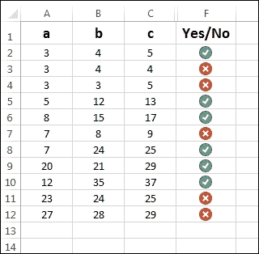
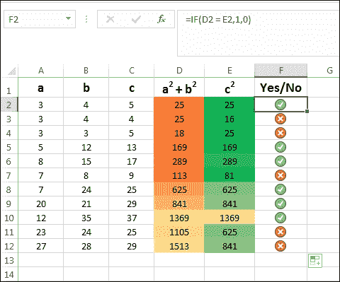
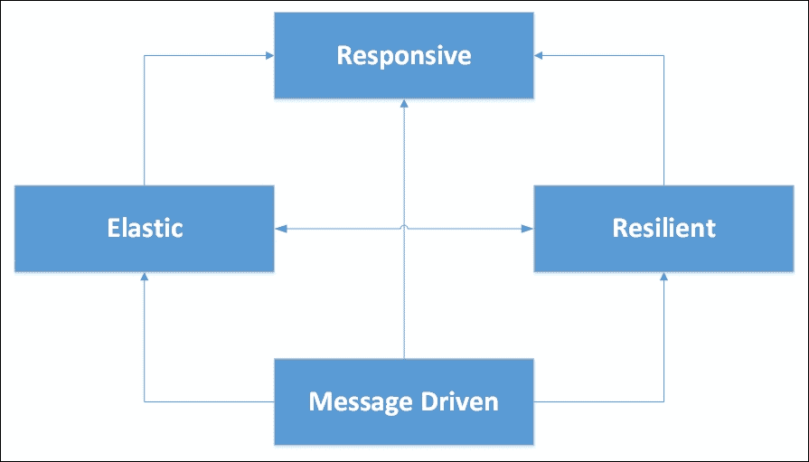
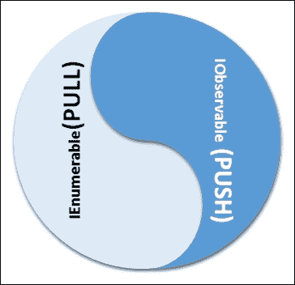
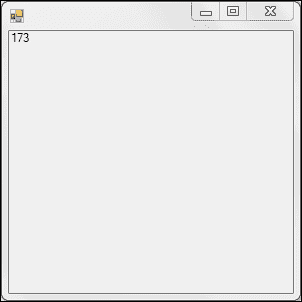

# 第十一章。什么是响应式编程？

到目前为止，我们已经看到了.NET 世界中并行和函数式编程结构如何帮助人们自然地组合算法/业务逻辑以及模型程序/数据流。这些范式有助于实现与现实世界紧密相关的软件系统。我们已经看到了数据结构及其在程序组合中的作用。我们还看到了保持数据结构（以面向对象的方式建模）与消耗它们的算法（作为纯函数组合建模）不同的好处（在并发和并行性方面）。为了进一步解开这个结，为了跟上不断增长的系统复杂性，出现了一场名为**响应式编程**的软件革命，它定义了如何从行为角度建模应用程序。在本章中，我们将通过一些示例来尝试解开这个概念，并了解这种编程范式如何成为一种自然延续，但更重要的是，成为一种统一模型，用于创建响应式系统。我们将探讨.NET **响应式扩展**（**Rx**）中可用的各种响应式编程结构（包括关键数据结构、接口和运算符）。到本章结束时，你将理解建模响应性是多么自然，这在多核、云、移动和 Web 规模系统的这个新世界中变得相当相关。

# 成为响应式

首先，让我们看看响应式编程的经典定义，并尝试理解这个模型带来的概念。这对于消除关于这个主题的任何误解很重要。

|   | *在计算机科学中，响应式编程是一种编程范式，它与其环境保持持续交互，但速度由环境决定，而不是程序本身决定。* |   |
| --- | --- | --- |
|   | --*Gèrard Berry* |

这意味着这种编程模型有助于，或者更确切地说，具有内在的能力来传播变化，而无需程序员显式地连接任何此类逻辑（传统方式，容易出错并使程序不一致；一些人的噩梦）。这意味着编程模型将是声明性的，并提供所需的结构（包括数据结构和接口）来捕获属性之间的关系，以确保通过数据流无缝传播或同步变化。

### 注意

真正推动这个模型的设计模式是观察者模式，其中订阅者和发布者之间的关系被声明性地建模。

让我们通过这个例子进一步理解。在典型的赋值语句（在命令式世界中），关系是隐式声明的（例如 *c² = a² + b²*，这是代表勾股定理的毕达哥拉斯方程），或者函数（在函数式编程世界中）是明确定义的，例如 *c = Compute Hypotenuse(a, b)*。另一方面，在反应式世界中，计算（*c* 的值）会自动使用新的边长值（*a* 和 *b*）进行。每当关系 *c² = a² + b²* 中的 *a* 和 *b* 的值发生变化时，计算会自动触发。这种行为被称为 **反应式**。您可以说这类似于事件驱动编程，但这里有一个非常明显的区别，您需要理解。

这种行为对于模拟并发现实世界系统非常重要，包括实时分析、具有反馈环的控制系统、电子电路和 **印刷电路板**（**PCB**）设计、规则引擎、状态机、模拟器等等。

# 电子表格 - 一个典型的例子

电子表格软件，如 Excel，帮助用户以特定程序的方式在单元格中输入值（例如-*A7*，*B6*，等等）。它们还允许您使用公式将计算嵌入为单元格的值（例如 *=$A7*$B6*）。每当 *A7* 或 *B6* 中的值发生变化时，结果公式将重新计算。实际上，这种变化会传播到引用了变化单元格的单元格中。这可以称为一种反应式计算。让我们看看在 Excel 上 Pythagorean 三重生成是如何实际操作的：



在前面的表格中，您可以看到列 **F** 指示（通过使用图标集的条件格式实现）*a*，*b* 和 *c* 是否是毕达哥拉斯三重组。

隐藏的列 **D** 和 **F** 独立计算 (*a² + b²*) 和 **c²** 的值，而列 **F** 只检查是否存在相等，以便显示潜在的匹配。所有这些当然都是使用公式完成的，并且单元格之间的变化会自动传播。

下面的截图说明了这一点：



这个例子应该能让你了解响应式编程是如何工作的，更有趣的是，我们将使用这个简单的例子来展示响应式编程之外的深远影响。这个电子表格程序优雅地模拟了**模型-视图-视图模型**（**MVVM**）模式，这是一个在 WPF、Silverlight 中大量使用，现在在大多数流行的 HTML UI 框架（基于 JS）中也广泛使用的架构模式。在这个例子中，模型将是列**A**和**B**（将每一行视为实体，将列视为实体属性）。视图模型将是列**D**和**E**（从模型属性派生出的属性）。而列**F**将是视图，它与视图模型绑定（任何视图模型的变化都会与视图同步；实际上，模型中的任何变化都会传播到视图模型，然后进一步传播到视图）。

# 响应式编程模型

简而言之，响应式编程就是使用异步数据流进行编程。通过对流应用各种操作，我们可以实现不同的计算目标。在响应式程序中的主要任务是无论数据的来源是什么，都将数据转换为流。在编写现代图形用户界面应用程序时，我们处理鼠标移动和点击事件。目前，大多数系统都会收到回调，并在事件发生时处理这些事件。大多数情况下，处理程序会在调用与事件相关的操作方法之前执行一系列过滤操作。

在这个特定的上下文中，响应式编程帮助我们将鼠标移动和点击事件聚合到一个集合中，并在通知处理程序逻辑之前对它们设置过滤器。这样，应用程序/处理程序逻辑就不会被无谓地执行。

流处理模型是众所周知的，并且对于应用程序开发者来说非常容易编码。几乎任何东西都可以转换成一个流。这些候选者包括消息、日志、属性、推特动态、博客文章、RSS 源等等。函数式编程技术非常适合处理流。像 C#这样的语言，由于其固有的函数式编程习惯语支持，成为编写响应式程序的自然选择。

响应式编程背后的基本思想是存在某些数据类型表示随时间变化的值。在这些编程范式中的这些数据类型（或更确切地说，数据序列）被表示为可观察的序列。涉及这些变化（时间依赖）值的计算将反过来具有随时间变化的值，并且需要异步接收通知（当依赖数据变化时）。还记得之前讨论过的电子表格应用程序吗？

# 功能响应式编程

大多数现代编程语言都支持函数式编程结构。例如，Map/Reduce、Filter、Fold 等函数式编程结构非常适合处理流数据。使用函数式编程结构编程异步数据流被称为函数式响应式编程。这种编程方式在开发者中越来越受欢迎。

FRP 程序可以分为**基于推**和**基于拉**两种。基于拉的系统等待请求者（或在我们的情况下，订阅者）的需求来推送数据流。这是一个经典案例，其中数据源被主动轮询以获取更多信息。这采用了迭代器模式，`IEnumerable <T>`/`IEnumerator <T>`接口专门为这种本质上是同步的场景设计（应用程序在拉取数据时可能会阻塞）。另一方面，基于推的系统通过信号网络聚合事件并执行计算。在这种情况下，与基于拉的系统不同，数据和相关的更新是由源（在这种情况下是可观察序列）直接传递给订阅者的。这种异步性是通过不阻塞订阅者，而是使其对变化做出反应来实现的。在这里，广泛使用了观察者模式，使用了`IObservable <T>`和`IObserver<T>`接口（这些接口作为.NET 框架 4.0 的一部分被引入）。正如你所看到的，在丰富的 UI 环境中采用这种推模式更有益，你不会希望在等待某些事件时阻塞主 UI 线程。这使得响应式程序变得理想，从而使得程序响应迅速。

## 响应式编程原则

响应式系统由具有反应性属性的小子系统组成。这是可能的，因为响应式应用程序应用了良好的设计原则来保持其组成部分的响应性。

根据响应式宣言，以下为响应式编程的四个原则：

+   **响应性**：响应式系统应按时间限制的方式对事件做出响应。这有助于系统的可用性和实用性。响应式系统可以帮助我们非常早期地检测异常，并可以保持良好的**服务质量**（**QoS**）。这对于具有**服务级别协议**（**SLA**）和**操作级别协议**（**OLA**）的系统非常重要。

+   **弹性**：即使在系统出现故障的情况下，响应式系统也应保持响应。通过仔细隔离子系统并确保故障不会传播到其他部分，可以在每个组件中包含故障。通过良好的模块化，我们可以通过替换失败的组件来恢复故障，而不会影响系统的其他模块。

+   **弹性**：反应式系统应该在不同的工作负载压力下保持响应。通过有效节流事件流和动态资源管理，我们可以编写能够处理不同工作负载的系统。

+   **消息驱动**：反应式系统依赖于基于异步消息的编程模型，通过保持松散耦合和位置透明性（在分布式系统中）来建立组件之间的严格边界。使用显式的消息传递有助于更好地管理负载，并通过节流提供弹性和显式的流控制。组件之间的非阻塞通信确保资源管理得到妥善处理。此外，系统故障可以以消息的形式传播。



# 微软的 Rx

Microsoft 推出了用于反应式编程的 **软件开发工具包**（**SDK**），它将其命名为 .NET Rx。根据他们的说法，Rx 扩展是一个用于使用可观察序列和 LINQ 风格查询操作来组合异步和基于事件的程序的统一库。他们描述的关键方面如下：

+   异步事件流

+   组合

+   可观察序列（流）

+   LINQ 风格查询

这些序列可以是文件内容、网络套接字、Web 服务响应、输入流等。Microsoft 为 Rx 提供了一个符号公式，即 *Rx = Observables + LINQ + Schedulers*。

## Rx 的关键数据结构

Microsoft Rx SDK 指定了一些关键数据类型，程序员可以利用这些类型来实现反应式程序。以下是一些关键类型：

+   `IObservable<T>`

+   `IObserver<T>`

+   `Subject<T>`

`IObserver` 和 `IObservable` 的签名如下：

```cs

    public interface IObserver<T> 
    { 
      void OnCompleted(); 
      void OnError(Exception exception); 
      void OnNext(T value); 
    }  

    public interface IObservable<T> 
    { 
      IDisposable Subscribe(IObserver<T> observer); 
    } 

```

## IEnumberable/IObservable 双重性

.NET 框架内置了对迭代器模式（通过 `IEnumerable<T>`）和观察者模式（通过 `IObservable<T>`）的支持。如果你仔细观察，这两个模式之间只有细微的差别。`IEnumerable<T>` 可以被认为是基于拉取的 `IObservable<T>` 的基于推送的等价物。实际上，它们是互为对方的对立面。当两个实体交换信息时，一个实体的拉取动作对应于另一个实体推送信息。这种双重性在以下图像中得到了说明：



让我们通过查看以下示例代码来理解这种双重性，这是一个偶数序列生成器：

```cs
    static void Main(string[] args) 
    { 
      int[] number_array = new int[] { 1,2,3,4,5,6,8}; 
      IEnumerable<int> number_sequence = number_array; 
      foreach (var n in number_sequence) 
        if (n % 2 == 0) 
          Console.WriteLine(n); 
    } 

```

我们将编写一个数字序列生成器来演示这些数据类型如何协同工作，将基于拉取的程序转换为 Rx 推送程序。首先，我们将编写一个用于后续使用的玩具实现 `IDisposable`：为了保持列表简洁，健壮性方面被赋予较低的优先级：

```cs
    class EmptyDisposable : IDisposable 
    { 
      internal Action action {get;  set;} 
      void IDisposable.Dispose() 
      { this.action(); } 
    } 

    class EvenNumberObservable : IObservable<int> 
    { 
      public EvenNumberObservable(IEnumerable<int> numbers) 
      { 
        this._numbers = numbers; 
      } 

      private IEnumerable<int> _numbers; 

      public IDisposable Subscribe(IObserver<int> observer) 
      { 
        foreach(int number in _numbers) 
        { 
          if (number%2 == 0 ) 
          observer.OnNext(number); 
        } 
        observer.OnCompleted(); 

        return new EmptyDisposable { action = () => { ;  } };  
      } 
    } 

    class SimpleObserver : IObserver<int> 
    { 
      public void OnNext(int value) {  Console.WriteLine(value);} 
      public void OnCompleted() { Console.WriteLine("Completed"); } 
      public void OnError(Exception ex){ 
      Console.WriteLine("An Error Encountered"); 
      throw ex; 
    } 
  }  

```

以下代码片段调用了前面的代码：

```cs
    static void Main(string[] args) 
    { 
      new EvenNumberObservable( 
      new[] { 1,2, 3, 4,6,7,8 }) 
      .Subscribe(new SimpleObserver()); 
      Console.ReadLine(); 
    } 

```

从先前的例子中，你可以看到如何从自然数的可观察序列中自然地订阅偶数。当检测到偶数时，系统将自动将值推送到观察者（订阅者）。代码为关键接口提供了显式实现，以便人们可以理解或推测底层实际发生了什么。

另一个例子是从底边、高边和斜边的可观察序列生成毕达哥拉斯三元组。我们已经看到了实现此目的的 **函数式** 代码，现在，让我们看看 **响应式** 等效（或者说，更好的一种）：

```cs
    void Main() 
    { 
      var result = 
        from i in Observable.Range(1, 100) 
        from j in Observable.Range(1, 100) 
        from k in Observable.Range(1, 100) 
        where k * k == i * i + j * j 
        select new { a = i, b = j, c = k };   

      // A Subscriber with 
      // A callback (Lambda) which prints value, 
      // A callback for Exception 
      // A callback for Completion  

      IDisposable subscription = result.Subscribe( 
      x => Console.WriteLine("OnNext: {0}", x),  
      ex => Console.WriteLine("OnError: {0}", ex.Message), 
      () => Console.WriteLine("OnCompleted")); 
    } 

```

# 将实体转换为流（`IObservable<T>`）

以下构造可以转换为序列源。`IObservable<T>` 可以从以下生成：

+   事件

+   代理

+   任务

+   `IEnumerable<T>`

+   异步编程模型

## 将事件转换为流

我们现在已经了解了如何将基于 `IEnumerable<T>` 的拉取程序转换为基于 `IObservable<T>`/`IObserver<T>` 的推送程序。在现实生活中，事件源并不像我们在先前的数字流示例中找到的那样简单。让我们看看我们如何可以通过一个小 WinForms 程序将 `MouseMove` 事件转换为流：

```cs
    static void Main()  
    { 
      var mylabel = new Label(); 
      var myform = new Form { Controls = { mylabel } }; 

      IObservable<EventPattern<MouseEventArgs>>  
      mousemove =  
      Observable. 
      FromEventPattern<MouseEventArgs>(myform, "MouseMove"); 

      mousemove.Subscribe( 
        (evt)=>{mylabel.Text = evt.EventArgs.X.ToString();}, 
        ()=>{}); 

      Application.Run(myform); 
    } 

```

请参见以下形式，它显示了鼠标位置：



## 流（序列）的减少

将数据转换为流的整体想法是应用函数式编程运算符，如 Reduce、Aggregate、Fold 等。这在从不断增长的数据堆中选择所需数据（以及以有效的方式）方面非常相关：

+   **过滤和分区运算符**：这些操作有助于将源序列减少到我们感兴趣的元素序列

+   **聚合运算符**：将源序列减少到只有一个元素的序列

+   **折叠运算符**：将源序列减少到单个标量值

Rx/LINQ 支持的一些常见序列/流运算符如下：

+   `Where`: 如其名所示，对于那些熟悉 LINQ 时代此运算符的人来说，它执行序列过滤的非常目的。如果我们重写先前的例子——提取/过滤偶数——它将声明性简化为如下：

    ```cs
            var evenNumbers = Observable.Range(0, 10) 
            .Where(i => i % 2 == 0) 
            .Subscribe(Console.WriteLine); 

    ```

+   在先前的例子中，输入是 0, 1, 2, 3, 4, 5, 6, 7, 8 和 9，输出将是 2, 4, 6 和 8。

+   `Skip`: 这有助于在序列中跳过 *n* 个项目。

+   `Take`: 这有助于在序列中获取 *n* 个项目（跳过其余部分）。

+   `SkipWhile`: 这有助于在序列中跳过项目（当满足某个条件时）。请注意，元素将被跳过，直到谓词评估为 `true`。在此之后，将返回所有其他项目。

+   `TakeWhile`: 这是 `SkipWhile` 的逆操作，有助于在序列中跳过项目（当满足某个条件时）。

+   `SkipUntil`: 这需要两个可观察序列，并继续跳过第一个序列中的所有值，直到第二个序列产生任何值。

+   `TakeUntil`: 再次，这需要两个可观察序列，并在第二个序列开始产生任何值时强制第一个序列完成。

+   `SkipLast`: 智能地排队元素，跳过最后 *n* 个元素，并返回其余部分。

+   `TakeLast`: 返回最后 *n* 个元素。

+   `Zip`: 将两个可观察序列合并为一个可观察序列。

## 流（序列）的检查

Rx 提供了一套操作符，可以帮助我们检查流的内容。其中一些如下：

+   `Any`: 这返回一个可观察序列（结果），返回一个值（`True` 或 `False`）并完成。`True` 表示源序列产生了一个导致结果序列产生 `True` 的值。另一方面，如果源序列在没有任何值的情况下完成，结果序列返回 `False`。

+   `All`: 这与 `Any` 的工作方式类似，除了结果序列在谓词评估为 `True` 时返回 `True`，反之亦然。

+   `Contains`: 这与 `All` 的行为相同，但有助于寻找特定值而不是符合谓词的值。

+   `ElementAt`: 这返回一个可观察序列（结果），返回源序列（由索引指定）中的值并完成。它使用基于 0 的索引。

## 流（序列）的聚合

Rx 提供了一系列操作符，帮助我们聚合流的内容。其中一些最重要的如下：

+   `Count`

+   `Min`, `Max`, `Average`, `Sum` (描述性统计)

+   `MinBy`, `MaxBy`, `GroupBy` (分区)

+   自定义聚合器和扫描

## 流（序列）的转换

我们的事件源产生的值不是我们可能想要的格式，我们需要对序列中的每个元素进行转换。最重要的函数转换是绑定，其中我们对序列的每个元素应用一个函数（形态），以产生一个新的序列。

在函数式编程术语中，可用的转换如下：

+   演化，将 `T` 转换为 `IObservable<T>`:

    +   `Unfold`

    +   `Generate`

+   递归归纳，将 `IObservable<T>` 转换为 `T`:

    +   `Fold`

    +   `Reduce`

    +   `Accumulate`

+   绑定，将 `IObservable<T>` 转换为 `IObservable<T>`:

    +   `Map`

    +   `SelectMany`

    +   `Projection`

    +   `Transform`

## 流（序列）的组合

我们从不同的数据源获取数据，需要组合流来进行处理。Rx 提供了一系列操作符，可以分组如下：

+   顺序连接：

    +   `Concat`: 如其名所示，结果序列将多个输入序列连接起来，而不交错它们

    +   `Repeat`: 创建一个序列，多次发出特定项

    +   `StartWith`: 在开始从源序列发出项之前，发出指定序列的项

+   并发序列：

    +   `Amb`：这个操作返回来自两个或更多源序列中的一个序列，该序列首先开始发出一个项或通知

    +   `Merge`：正如其名称所示，这个算子将多个序列合并为一个

    +   `Switch`：这个操作返回一个序列（来自两个或更多源序列），该序列发出最近发出的输入/源序列中的项

+   配对序列：

    +   `CombineLatest`：使用提供的函数结合每个参与输入序列最近发出的项，并发出该函数的返回值

    +   `Zip`：其行为类似于`CombineLatest`，但函数是按照严格的顺序（在结合参与输入序列的项方面）应用的

    +   `And`/`Then`/`When`：其行为与`Zip`非常相似，但在发出结果序列之前，使用某些中间数据结构（即模式和计划对象）作为结合输入序列的一部分

# 反应式编程的哲学

我们以大量关于反应式编程模型的详细描述开始了这一章。然后，我们展示了如何将基于`IEnumerable<T>`的序列生成器转换为基于`IObservable<T>`/`IObserver<T>`的推送程序。我们还演示了如何使用玩具程序将鼠标事件数据转换为流。本章的其余部分是关于可用于操作流或序列的工具。你了解了不同类型的流处理算子。需要查阅 Microsoft 关于 Rx 的文档来了解流处理器的具体细节。

这里的基本哲学可以总结如下：

+   将事件源的数据聚合到异步或同步流中。

+   使用数据源本身（在流消费者外部）可用的各种算子应用预处理方法。

+   通过应用函数转换技术，在数据源端点级别处理从数据源推送的结果流。我们可以组合流操作以产生复合操作。通过这样做，整个程序成为应用在流上的函数的线性链。如果数据流没有发生突变，则不需要补偿事务逻辑。

```cs
    try { 
      outstream =  f(g(h(immutablestream))); 
    } 
    catch {} 

```

从图示上看，前面的代码片段可以解释为我们可以对数据流应用一系列函数以产生输出流。由于在数据处理端点级别，输入流是不可变的，因此在捕获处理程序中不需要补偿事务。整个处理过程也可以轻松调试。

# 摘要

在本章中，你学习了（功能）响应式编程的概念基础，以及微软 Rx 如何帮助你使用调度器、可观察接口和 LINQ 来编写响应式程序。我们在这本书中避免了对 API 文档的介绍（因为考虑到本书的性质，这些内容已经详尽且重复）。我们强烈建议你参考 ReactiveX 网站([`reactivex.io/documentation/operators`](http://reactivex.io/documentation/operators))、MSDN、交互式 Rx 图示网站([`rxmarbles.com`](http://rxmarbles.com))以及 Lee Campbell 撰写的在线书籍《Rx 简介》(*Introduction to Rx*)([`www.introtorx.com`](http://www.introtorx.com))，以获取我们讨论的各种操作符的详细信息和使用示例。在接下来的章节中，我们将看到基于 C#和 JavaScript 的详细功能响应式程序示例。
