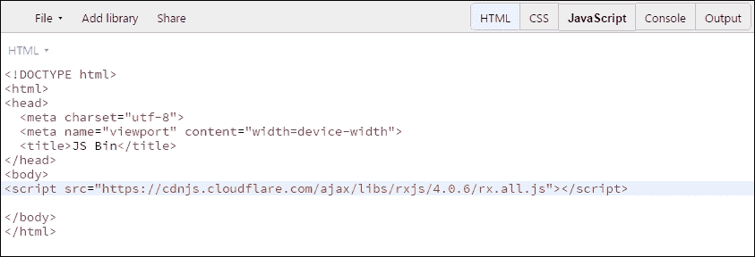
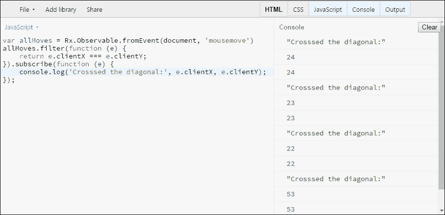
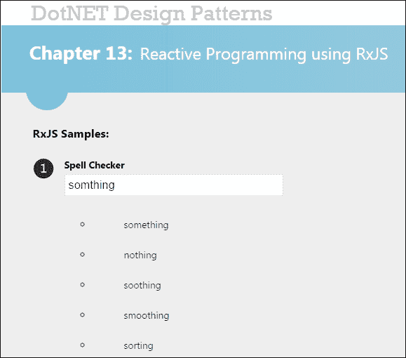

# 第十三章. 使用 RxJS 进行响应式编程

在上一章中，我们看到了 .NET **响应式扩展**（**Rx**）如何从可组合性、可扩展性和响应性方面帮助自然编程。我们看到了流如何使时间相关的自然状态管理成为可能。一些结构被详细处理了。更重要的是，我们看到了如何将响应式结构无缝集成到 MVVM 模式，通过视图模型层实现视图和模型之间的数据同步。现在，在这一章中，我们将深入探讨 **JavaScript 的响应式扩展库**（**RxJS**），并了解如何使用可观察集合编写异步和事件驱动程序。我们还将详细探讨一些有趣的用例及其使用 RxJS 的实现，以清楚地了解 RxJS 库是如何被利用来创建并发和响应式应用的。这将涵盖 Web 和 Windows 编程的响应式范围，到本章结束时，你将能够欣赏 JavaScript 的可能性，并通过对 RxJS 的初步了解来自信地利用它。本章包括以下内容：

+   JavaScript 执行上下文的复习

+   RxJS 与 YieldJS（作者创建的定制 JS 框架）的类比

+   RxJS 基础和形式主义的详细概述

+   展示 RxJS 动作的详细代码示例

# JavaScript 世界

回顾自己对 JavaScript 世界一些现状的理解是很重要的。最重要的方面是，该语言是单线程的，鉴于这一点，开发者编写异步代码的唯一选择是通过使用回调、承诺和事件。作为一名开发者，你应该熟悉 JS 的函数式编程方面（除了其固有的动态性质），包括闭包、高阶函数、匿名函数和扩展方法（增强类型）。我们也不能忽视语言核心本身所取得的进步，现在 Node.js 已经成为涉及异步 I/O 的严肃可扩展性的首选后端。在我们深入 RxJS 之前，让我们快速了解一下这些核心概念。

如我们所知（我们假设你也是），函数在 JavaScript 中是对象，并且它们是一等公民，这使得 JS 也是一种函数式编程语言（尽管它正式被分类为动态语言）。我们已经在 第十章 中讨论并看到了 *使用对象/函数式编程实现模式*（而且深入讨论），高阶函数以及闭包如何使你能够自然地组合程序，因为我们已经从第十章开始就一直在削弱 OOP 的墙。好吧，我们并不打算暗示 JS 是一个例外。

### 注意

JS 通过原型继承支持 OOP，与 C#中的经典继承相比。理解这一点对于了解类型如何被增强（类似于我们在 C#中使用的扩展方法）非常重要。

让我们看看一个高阶函数，它利用回调（另一个函数，通常用于通知和继续目的）：

```cs
    function onComplete(message) { 
      console.log(message); 
    } 

    function doSomething(onComplete) { 
      //Do what is needed here and then trigger onComplete 
      onComplete("Complete!"); 
    } 

    doSomething(onComplete); 

```

### 注意

在上述代码片段中，回调（`onComplete`）作为属性传递给一个函数（`doSomething`），从而使它（`doSomething`）成为一个高阶函数。

现在，让我们看看闭包的实际应用：

```cs
    function add(x) { 
      return function (y) { 
        return x + y; 
      }; 
    }; 

    var addTen = add(10); 
    console.log(addTen(5));     //Returns 15 
    console.log(add(2)(3));     //Returns 5 

```

在上述代码中，`add`是一个高阶函数（因为它可以被赋值给变量），而`x`在这个函数内部成为了一个闭包（词法闭包）（无论是否有嵌套/子函数）。相关的注释已经说明了结果。此外，您还可以看到在 JS 领域中匿名函数（在这种情况下，`add`函数内部的内部函数）是多么自然。如果您记得（从第九章，*更好的状态管理功能编程技术*），这也涉及到柯里化（功能编程世界中的一个重要概念，我们已经在详细处理过），这是一种将任何大于一元的函数分解为一系列函数评估（每次接受一个参数）的形式主义。

另一个需要理解的重要概念是在 JS 中增强类型。这提供了一种赋予类型能力的方法（就像我们在 C#中使用扩展方法的方式）。让我们快速看看它的强大之处，以下是一个示例，展示了如何在运行时动态地为函数（那些没有错误处理能力的函数）添加错误处理能力。你有没有想过这一点？

```cs
    Function.prototype.throws = function () { 
      var slice = Array.prototype.slice, 
        args = slice.apply(arguments), 
          errorMessage = args[0], 
            fn = this; 
      return function () { 
        try { 
 return fn.apply(null, args.slice(1)); 
        } 
        catch (e) { 
          console.log(errorMessage); 
          //Do what is needed apart from logging 
        } 
      } (); 
    }; 

```

上述代码本质上通过向其原型对象（基本对象）添加`throws`方法来增强一个函数对象。它巧妙地利用了 JS 语言中的一些巧妙特性（包括数组切片、`arguments`对象、使用闭包捕获函数上下文以及用于函数评估的`apply`方法）。如果您无法理解代码，我们建议您查阅相关资料。被故意抛出异常并应该优雅地退出函数评估的候选函数如下：

```cs
    function errorSimulator(a, b) { 
      console.log(a, b); 
      return (parseInt(RxJS,10));//This statement forces an error! 
    } 

```

以下代码（行 1）可以用作直接函数评估（行 2）的替代，其中程序会抛出一个运行时错误（ReferenceError: RxJS is not defined）并中断执行。需要注意的是，尽管使用了装饰器，这些函数仍然保留了 arity。这就是你将理解 arguments 对象和`apply`方法的相关性的地方。在这里，我们的装饰器假设了语义——即首先传递错误消息作为第一个参数，然后是函数参数，顺序完全相同！你可以在你的代码文件中通过查找和替换轻松实现这一点，不是吗？

```cs
    errorSimulator.throws("I have you!", 2, 0);  // line 1
    errorSimulator(2, 0);                        // line 2
```

我们猜测现在你已经掌握了在 JS 世界中事物是如何工作的。当我们继续探索使用 RxJS 进行响应式编程时，了解这些内容是非常重要的。

要尝试本章中的代码示例，请确保你已经设置了**Node.js**，并通过`npm`安装了 RxJS 依赖项，如下所示：

```cs
 npm install rx 
    rx@4.1.0 node_modules\rx 

```

# Rx 基础

虽然这可能听起来有些重复，但理解 Rx 的基础以及支配 Rx 的关键设计模式是非常重要的。作为一本关于模式和习惯用法的书，如果任何感兴趣的读者能从理解这些关键概念在宿主语言（在这种情况下是 JS）中的实现中受益，那将是非常令人欣慰的。

基于 Rx 工作的两个关键设计模式是**观察者**和**迭代器**模式。让我们快速看一下这些模式是如何实现的，然后推测或窥视 RxJS 的可能实现。这种方式的学习将真正有助于形成对核心概念的深入理解。而且，不妨透露一下，作者本人也尝试创建了一个 JS 库（在 GitHub 上以`YieldJS`命名，网址为[`shinexavier.github.io/YieldJS/`](http://shinexavier.github.io/YieldJS/)），尽管它是一个基于拉取的实现，但仍然提供了 RxJS 的基本功能。然而，需要注意的是，这个库从未打算被创建为一个 RxJS 克隆，而是为了在 ES 6.0 之前将 C#世界的**yield**（生成器）能力引入 JS。

### 注意

策略非常直接，因为语言 ES 5.0 没有内建的**yield**支持，你可能会需要一个生成器对象，它可以连续生成下一个计算值，同时提供正向迭代的选项。

关于这个库将赋予 JS 中的生成器函数以下能力的前述声明是非常有力的：

+   扩展生成器函数对象以具有正向迭代能力

+   接受一系列（无限）的迭代器方法，这些方法作为核心生成元素的后继方法

+   根据连续和有序（迭代过程中指定的顺序）的迭代函数评估，生成下一个有效的结果

+   通过仅在请求时提供计算值来支持延迟评估

当作者着手创建这个库的任务时，他们心中想的是什么？如果你仍然感到困惑，那是一个新颖的尝试，为任何生成器对象（在我们的例子中是函数）创建 JS 中的 LINQ 功能。以下代码展示了库实现的一部分，因为这有助于推理 RxJS 的可能实现：

```cs
    Function.prototype.getGenerator = function (setCount) { 
      "use strict"; 
      var fnGen = this, 
      numberOfElements = setCount, 
      slice = Array.prototype.slice, 
      gen = {}, 
      fnContexts = [], 
      yieldIndex = -1, 
      getFunctionContext = function (fnIndex, input) { 
        var fnContext = fnContexts[fnIndex]; 
        if (fnContext === undefined) { 
 fnContext = { 
"index": 0, 
"current": input, 
"outList": []
 }; 
          fnContexts[fnIndex] = fnContext; 
        } else { 
          fnContext.current = input; 
          fnContext.index += 1; 
        } 
        return fnContext; 
      }, 
      isYieldEmpty = function () { 
        return ((yieldIndex + 1) === numberOfElements); 
      }, 
      moveNext = function () { 
        var args = arguments, 
        yieldedResult = null, 
        core = function () { 
          var i, 
          result = null, 
          fn = null, 
          fnCtxt = null; 
          yieldIndex += 1; 
          result = fnGen.apply(null, []); 
          if (args.length > 0) { 
            for (i = 0; i < args.length; i += 1) { 
              fn = args[i]; 
              fnCtxt = getFunctionContext(i, result); 
 result = fn.call(null, fnCtxt); 
              if (result === null) { 
                break; 
              } else { 
                fnCtxt.outList.push(result); 
              } 
            } 
            if (result !== null) { 
              gen.current = result; 
            } 
          } else { 
            gen.current = result; 
          } 
          return result; 
        }; 
        while ((yieldedResult === null) && (!isYieldEmpty())) { 
          //Recursive call to find the next non-null value 
 yieldedResult = core(); 
        } 
        return (yieldedResult !== null) ? true : false; 
      }; 
 gen.current = null;
 gen.moveNext = moveNext; 
      return gen; 
    }; 

```

如前述代码所示，此实现的关键是状态对象 `fnContext`，它保存有关每个函数（在迭代期间提供）及其评估细节的信息。这对于迭代期间所需的持续操作至关重要。

如你所见，生成器将是一个方法，`getGenerator(numberOfElements)`，它增强任何生成器函数（通过接受要生成的元素数量）并具有以下接口：

+   **属性**：

    +   `current`: 在生成过程中返回当前元素。

+   **方法**：

    +   `moveNext`: 尝试根据生成器函数生成下一个元素，增加迭代指针，如果成功则返回 `true`。如果失败（主要是因为迭代指针指向生成器函数根据指定元素数量返回的最后一个元素），则返回 `false`。

从使用角度来看，请查看以下通用的序列生成器：

```cs
    function sequence(z) { 
      "use strict"; 
 var y = 0; 
      return function () { 
        y += z; 
        return y; 
      }; 
    } 

```

如你所见，它在序列初始化期间接受一个种子增量值，并返回一个实际函数（匿名），该函数可以被多次调用以生成种子序列。另一个关键点是累加器（在我们的例子中是 `y`），由于它的闭包属性，它保存了我们序列中的前一个项。现在，让我们看看我们的生成器是如何工作的：

```cs
    var a = sequence(1).getGenerator(10);
    //For generating the first 10     
    elements (1 through 10) 
    while (a.moveNext() { 
      console.log(a.current); 
    } 

```

现在，如果你真的仔细观察，前面的代码片段在创建一个用于操作序列（在生成时）以适应你需求的响应式库方面具有基本框架。这是通过使用迭代器方法完成的，这些方法有点像你的 LINQ 操作符。真正使其成为可能的是上下文对象，为每个迭代器函数创建。当我们查看下面显示的一些迭代器方法时，你会理解这一点（理想情况下，最终用户只需编写序列生成器，而这个迭代器方法库可以用于实时操作序列）。此外，一旦你理解了在函数评估期间提供的上下文对象如何用于编写更多的迭代器方法，这会变得更加令人兴奋，可能性似乎无穷无尽。上下文对象为创建各种有用的迭代器函数提供了以下属性：

+   `index`: 返回当前元素在迭代上下文中的索引

+   `current`: 返回迭代上下文中的当前元素

+   `outList`: 返回到该迭代点为止的累积输出集合/数组

使用方法如下：

```cs
    function square(context) { 
      "use strict"; 
      return (context.current * context.current); 
    } 

```

这是一种非常标准的转换运算符的使用，其中检索并操作序列中的`current`元素（在这种情况下是平方）：

```cs
    function unique(context) { 
      "use strict"; 
      return (context.outList.indexOf(context.current) < 0) ?       
      context.current : null; 
    } 

```

在前面的代码中，你可以清楚地看到如何利用`outList`属性生成唯一的序列！通常，这个属性在实现聚合运算符时非常有用：

```cs
    function filter(condition) { 
      "use strict"; 
      return function (context) { 
        return condition(context.current) ? context.current : null; 
      }; 
    } 

    function even(val) { 
      "use strict"; 
      return (val % 2 === 0); 
    } 

```

这里有一个有趣的场景，其中谓词函数（`even`）与迭代函数（`filter`）结合使用，以过滤满足特定条件的序列中的元素：

```cs
    function skip(count) { 
      "use strict"; 
      return function (context) { 
        return ((context.index % (count + 1)) === 0) ? context.current      
        : null; 
      }; 
    } 

```

最后，在这里你可以看到如何利用`index`属性跳过序列中的某些元素！

现在，为了看到整个过程的实际应用，请看以下示例用法：

```cs
    var a = sequence(1).getGenerator(10); 
 while(a.moveNext(skip(1), square)) { 
      console.log(a.current);    //Yields 1, 9, 25, 49, 81 
    } 

```

你现在明白了吗？你看到这两个迭代方法（在这种情况下是一个过滤和一个转换运算符）是如何优雅地以声明性方式组合的吗？它会在生成序列元素时链式调用这些运算符。这是反应性的（除了迭代时是拉取而不是传统的推）！你明白了吗？我们需要的只是一个回调函数传递给我们的生成器对象，这样它就会在序列中生成新元素时得到通知！我们将完全留给任何感兴趣的读者（取决于你是否喜欢成为 API 生产者或消费者）来尝试这个实现（你可以在 GitHub 上自由地分叉它），或者直接跳转到 RxJS 并开始从中受益。无论哪种方式，到现在为止，我们觉得你已经准备好了，并且有了与 RxJS 对抗的基础！

# RxJS 形式化

现在，与 YieldJS 不同，RxJS 是基于推的。在这里，订阅者会自动从发布者那里接收新值。订阅者或监听器用`observer`对象表示，发布者（推送/发布新值）用`Observable`对象表示。就像我们指定迭代方法（我们未来的运算符）来组合我们生成的序列一样，我们可以有效地对可观测序列中的所有元素执行相同的操作（转换、过滤等）。

## 可观测值和观察者

生成器成为我们的可观测值，而对这些序列感兴趣的回调函数成为观察者。话虽如此，创建`Observables`相当直接，正如我们在前面的章节中通过.NET 的响应式扩展所看到的。以下代码展示了这一切：

```cs
    var client = Rx.Observable.create(function (observer) { 
      observer.onNext('On Your Mark'); 
      observer.onNext('Get Set'); 
      observer.onNext('GO'); 
      observer.onCompleted(); 
    }); 

    client.subscribe( 
 function onNext(x) { console.log('Next: ' + x); }, 
 function onError(err) { console.log('Error: ' + err); }, 
 function onCompleted() { console.log('Completed'); } 
    ); 

```

上一段代码中的客户端是`observer`，它有三个重要的回调（突出显示），即`OnNext`、`OnError`和`OnCompleted`。

如预期的那样，它忠实地在控制台打印以下内容：

```cs
Next: On Your Mark
Next: Get Set
Next: GO
Completed

```

现在，让我们看看 RxJS 在处理核心语言构造时提供的一些关键桥梁。

## 来自数组的可观测值

让我们看看如何使用 RxJS 从数组创建可观测值：

```cs
    Rx.Observable 
 .from(['On Your Mark', 'Get Set', 'GO']) 
    .subscribe( 
      function (x) { console.log('Next: ' + x); }, 
      function (err) { console.log('Error:', err); }, 
      function () { console.log('Completed'); } 
    ); 

```

如前述代码所示，你可以看到`from`操作符在这里起到了作用，并且你得到的结果与之前相同！

## 事件的可观察性

同样，我们可以使用`fromEvent`操作符从事件创建可观察性。以下是一个可观察性，当鼠标指针在窗口中对角线穿过时，它会显示鼠标指针的坐标。由于这里需要 DOM 元素（文档和窗口），我们将使用**JSbin**沙盒来运行此代码：

```cs
    var allMoves = Rx.Observable.fromEvent(document, 'mousemove') 
    allMoves.subscribe(function (e) { 
 console.log(e.clientX, e.clientY);  
    }); 

    var movesCrossingDiagonal = allMoves.filter(function (e) { 
      return e.clientX === e.clientY; 
    }); 
    movesCrossingDiagonal.subscribe(function (e) { 
 console.log('Crossed the diagonal:', e.clientX, e.clientY); 
    }); 

```

如果你观察前面的代码，你会看到`allMoves`是主要的可观察序列，然后我们从`allMoves`中推导出下一个`movesCrossingDiagonal`序列。所有这些序列都是不可变的，我们只订阅那些感兴趣的序列（代码中突出显示的两个订阅者）。我们还看到了`filter`操作符的使用。请看以下在 JSbin 编辑器中执行的等效代码：



在前述截图中的 HTML 代码中，你可以看到包含了 Rx 库（你可以在 JSbin 中通过使用网络编辑器中显示的**添加库**选项来完成此操作）：



你将得到前述截图所示的结果，当你将鼠标移至输出窗口时（由于篇幅限制，此截图未显示）。

## 回调的可观察性

当涉及到异步和事件驱动编程时，从回调创建可观察性是必不可少的，它真正完成了可观察性所能提供的最终维度：

```cs
    // Load Node.js Filesystem module 
    var fs = require('fs'); 
    // Create an Observable from the watch method 
 var source = Rx.Observable.fromCallback(fs.watch)('./tmp', {  
    encoding: 'buffer' }); 
    // Create an Observer 
    var fsClient = Rx.Observer.create( 
      function (changes) { 
        console.log('Next: ', changes); 
      }, 
      function (err) { 
        console.log('Error: ', err); 
      }, 
      function () { 
        console.log('Completed'); 
      } 
    ); 
    var subscription = source.subscribe(fsClient); 

```

现在，假设你在`tmp`文件夹中有一个名为`alas.tmp`的文件，你修改了其内容并保存了它。观察者会立即通知这个变化，如下所示：

```cs
Next:  [ 'change', 'alas.tmp' ]
Completed

```

现在，如你所见，前述代码可以帮助你订阅文件系统监视器（在这种情况下是目录监视器）。但是有一个缺点！在我们接下来的章节中解决它之前，你能发现吗？

## 可观察性管道

记得我们之前用 YieldJS 做的链式操作吗？嗯，这正是`Observable`管道。如果你记得我们是如何在链式操作中逐滴传递状态（而不是在外部维护它），那么你就掌握了主动权。RxJS 提供了同样的功能，因为`Observable`管道是自包含的，状态从一个链式操作符流向另一个：

```cs
    Rx.Observable 
    .from([1, 2, 3, 4, 5, 6, 7, 8]) 
    .skip(4) 
    .map(function (val) { return val * val; }) 
    .subscribe(function (value) { 
      console.log('Next : ', value); 
    }); 

```

前述代码产生以下结果：

```cs
Next : 25
Next : 36
Next : 49
Next : 64

```

另一点需要注意的是，这个管道在评估方面（或者说，我们说的算法中的各个步骤）非常高效。通常情况下，每个操作符需要三个迭代/遍历（每个操作符），而现在我们只需一个迭代就能完成所有三个操作符的链式操作。我们在 YieldJS 中看到了这一点是如何明显实现的。此外，你还能享受到延迟评估的好处！务必查看其他可能对日常开发有帮助的操作符。

## 主题等

如我们在上一章中看到的，RxJS 中也有主题（那些实现了 `Observer` 和 `Observable` 类型的主题）。这使得它成为源和下游订阅者/观察者之间强大的中介（确切地说是一个代理对象）：

```cs
 var subject = new Rx.Subject(); 
    var source = Rx.Observable 
    .interval(1000) 
    .take(3); 
    source.subscribe(subject); 
    //Observer #1 
    var client1 = subject.subscribe( 
      function (changes) { 
        console.log('Client1 Next: ', changes); 
      }, 
      function (err) { 
        console.log('Client1 Error: ', err); 
      }, 
      function () { 
        console.log('Client1 Completed!'); 
      } 
    ); 
    //Observer #2 
    var client2 = subject.subscribe( 
      function (changes) { 
        console.log('Client2 Next: ', changes); 
      }, 
      function (err) { 
        console.log('Client2 Error: ', err); 
      }, 
      function () { 
        console.log('Client2 Completed!'); 
      } 
    ); 
    subject.onNext(5); 
    subject.onNext(15); 
    subject.onNext(20); 
    setTimeout(function () { 
      subject.onCompleted(); 
      client1.dispose(); 
      client2.dispose(); 
    }, 5000); 

```

执行上述代码后，可以看到以下输出：

```cs
Client1 Next: 15
Client2 Next: 15
Client1 Next: 20
Client2 Next: 20
Client1 Next: 0
Client2 Next: 0
Client1 Next: 1
Client2 Next: 1
Client1 Next: 2
Client2 Next: 2
Client1 Completed!
Client2 Completed!

```

这些是根据使用意图可以使用的某些专用主题：

+   `AsyncSubject`：表示异步操作的结果。它可以像 JS 中的 `promise` 对象一样使用。它缓存并只返回最后一个值，因此非常适合用于异步操作，包括 AJAX 调用、文件 I/O 等。

+   `BehaviorSubject`：它强制要求一个起始值，因此在任何异步操作中，包括 AJAX 调用、文件 I/O 等，使用占位符值初始化时非常理想。

+   `ReplaySubject`：根据指定的缓冲区大小缓存值，并将这些值重新发射给订阅者，无论他们何时订阅。

## 调度器

如我们之前所看到的，调度器是管理和处理并发的重要工具。在通知和订阅的并发模型选择方面，你拥有更多的控制权。你可以使用以下三个基本调度器：

+   **立即**：对于大多数操作符来说，这是事实上的默认设置，并且是同步的

+   **默认**：这是异步的，并在幕后使用事件循环（在 Node.js 的情况下使用 `nextTick`）、`setTimeout` 等。

+   **当前线程**：这同样是同步的，但在递归操作符（如 `repeat`）的情况下，它会排队执行

我们还有两个方便的操作符来帮助我们：

+   `observeOn`

+   `subscribeOn`

这两个都返回可观察实例，但通过接受调度器作为属性，提供了对并发的细粒度控制。

请务必查看 RxJS 参考，以更深入地了解这些内容（因为这些内容需要单独的一章来覆盖，而这并不是本书的真正目的）。现在我们已经研究了 RxJS 的一些核心形式化，让我们通过更多示例来探索 RxJS 的世界。

# RxJS 示例

我们怎么能不看到我们的拼写检查器在网页上的实际效果呢？为此，我们需要一个提供建议的 ASP.NET Web API。我们将直接重用我们之前的 `NorvigSpellCheckerModel` 类：

```cs
    using System; 
    using System.Collections.Generic; 
    using System.Linq; 
    using System.Net; 
    using System.Net.Http; 
    using System.Web.Http; 
 using SpellChecker; 

    namespace MvcApplication1.Controllers 
    { 
 public class SearchContext 
      { 
        public string Lookup { get; set; } 
        public int Count { get; set; } 
      } 
      public class ValuesController : ApiController 
      { 
        ISpellCheckerModel _spellChecker =      
        NorvigSpellCheckerModel.Instance; 
        // GET api/values 
        public IEnumerable<string> Get([FromUri] SearchContext      
        context) 
        { 
 return _spellChecker.SpellCheck(context.Lookup,        
          context.Count); 
        } 
      } 
    } 

```

在此前的代码中，已创建一个 `SearchContext` 类来传递 get API 的值！同时，对 `Global.asax.cs` 文件进行了一些小的修改，以适应 JSONP 响应（以下代码中突出显示）：

```cs
    protected void Application_Start() 
    { 
      AreaRegistration.RegisterAllAreas(); 
      WebApiConfig.Register(GlobalConfiguration.Configuration); 
      FilterConfig.RegisterGlobalFilters(GlobalFilters.Filters); 
      RouteConfig.RegisterRoutes(RouteTable.Routes); 
      BundleConfig.RegisterBundles(BundleTable.Bundles); 
 GlobalConfiguration.Configuration.Formatters.Insert(0, new    
      JsonpMediaTypeFormatter()); 
    } 

```

以下实用类，用于满足格式化需求，是必需的：

```cs
    public class JsonpMediaTypeFormatter : JsonMediaTypeFormatter 
    { 
      private string callbackQueryParameter; 

      public JsonpMediaTypeFormatter() 
      { 
        SupportedMediaTypes.Add(DefaultMediaType); 
        SupportedMediaTypes.Add(new      
        MediaTypeHeaderValue("text/javascript"));    
        MediaTypeMappings.Add(new UriPathExtensionMapping("jsonp",       
        DefaultMediaType)); 
      } 

      public string CallbackQueryParameter 
      { 
        get { return callbackQueryParameter ?? "callback"; } 
        set { callbackQueryParameter = value; } 
      } 

      public override Task WriteToStreamAsync(Type type, object value,    
      Stream stream, HttpContent content, TransportContext     
      transportContext) 
      { 
        string callback; 

        if (IsJsonpRequest(out callback)) 
        { 
          return Task.Factory.StartNew(() => 
          { 
            var writer = new StreamWriter(stream); 
            writer.Write(callback + "("); 
            writer.Flush(); 

            base.WriteToStreamAsync(type, value, stream, content,          
            transportContext).Wait(); 

            writer.Write(")"); 
            writer.Flush(); 
          }); 
        } 
        else{ 
          return base.WriteToStreamAsync(type, value, stream, content,        
          transportContext); 
        } 
      } 

      private bool IsJsonpRequest(out string callback) 
      { 
        callback = null; 

        if (HttpContext.Current.Request.HttpMethod != "GET") 
        return false; 

        callback = HttpContext.Current.Request.QueryString       
        [CallbackQueryParameter]; 

        return !string.IsNullOrEmpty(callback); 
      } 
    } 

```

现在我们来看看如何使用 RxJS 创建响应式的前端：

```cs
    <h3>RxJS Samples:</h3> 
    <ol class="round"> 
      <li class="one"> 
    <h5>Spell Checker</h5> 
    <script type="text/javascript" src="img/rx.lite.js">   
    </script>
    <script type="text/javascript" src="img/rx.dom.js">
    </script>
```

如此处所示，你需要以下两个 JS 文件：

```cs
    <script type="text/javascript"> 
      var textInput; 
      var throttledInput; 
      var suggestions; 
      var resultList; 

```

以下函数（`initialize`）在 DOM 加载完毕后立即被调用：

```cs
    function initialize() {
      textInput = document.querySelector('#textInput');
      console.log(textInput);
      throttledInput = Rx.DOM.keyup(textInput)
        .do(function (msg) {
          console.log(msg.key);
        })
        .pluck('target', 'value')
        .filter(function (text) {
          return text.length > 3;
        })
        .debounce(500)
        .distinctUntilChanged();
      suggestions = throttledInput.flatMapLatest(SpellChecker); 

```

在前面的代码中，我们通过以下方式进行了节流，以避免因请求过多而超载服务器：

+   将 keyup DOM 事件转换为可观察序列

+   专注于输入的值（这里的`pluck`操作符起到这个作用）

+   使用`filter`操作符查找具有三个以上字符的搜索项

+   使用 500 毫秒的超时时间来减缓用户输入（使用`debounce`操作符）

+   限制输入流中不同值的查找（使用`distinctUntilChanged`操作符）：

```cs
    resultList = document.getElementById('results'); 
 suggestions.subscribe( 
      function (data) { 
        var results = data.response; 
        clearSelector(resultList); 
        for (var i = 0; i < results.length; i++) { 
          resultList.appendChild(createLineItem(results[i])); 
        } 
      }, 
      function (e) { 
        clearSelector(resultList); 
        resultList.appendChild(createLineItem('Error: ' + e)); 
      } 
    ); 
  } 

```

此函数向 Web API 发起搜索，并返回一个可观察对象：

```cs
    function SpellChecker(term) { 
      var url = 'http://localhost:18679/api/values/?Lookup=' 
      + encodeURIComponent(term) +    
      '&Count=5&format=json&callback=JSONPCallback';
 return Rx.DOM.jsonpRequest(url); 
    } 

```

`clearSelector`和`createLineItem`函数是 DOM 操作的帮助函数，它们有助于显示：

```cs
    function clearSelector(element) { 
      while (element.firstChild) { 
        element.removeChild(element.firstChild); 
      } 
    } 

    function createLineItem(text) { 
      var li = document.createElement('li'); 
      li.innerHTML = text; 
      return li; 
    } 

 Rx.DOM.ready().subscribe(initialize); 
    </script> 
      <input id="textInput" type="text"/> 
      <ul id="results"></ul> 
      </li> 
    </ol> 

```

以下截图显示了示例输出：



因此，到目前为止，我们已经看到了如何订阅可观察序列（包括键盘事件和 AJAX 调用/响应）。

下一个我们将处理的示例是我们之前讨论内容的逻辑扩展。记得我们问你是否能在我们之前讨论的可观察对象从回调中讨论的文件监视器样本中找到不足之处？

## 实时文件监视器

早期版本会在检测到第一个变化时终止可观察序列，从而损害其连续检测变化的能力。这个修复的解决方案如下所示：

```cs
    var Rx = require('rx'); 
    // Load Node.js Filesystem module 
    var fs = require('fs'); 

 var disposable = Rx.Scheduler.default.scheduleRecursive( 
      0, 
      function (i, recurse) { 
        // Create an Observable from the watch method 
        var source = Rx.Observable
        .fromCallback(fs.watch)('./tmp', { encoding: 'buffer' }); 
        var subscription = source.subscribe( 
        function (changes) { 
          console.log('Next: ', i, changes); 
        }, 
        function (err) { 
          console.log('Error: ', err); 
        }, 
        function () { 
          console.log('Completed'); 
          ++i; 
 recurse(i); 
        }); 
      } 
    ); 

```

### 注意

如您在突出显示的代码中所见，对早期问题的修复是通过文件系统监视器组件在事件检测期间序列完成时（使用`onCompleted`指示）进行递归调度（使用`sceduleRecursive`操作符）。

以下结果表明我们的修复是有效的：

```cs
Next: 0 [ 'change', 'alas.tmp' ]
Completed
Next: 1 [ 'change', 'alas2.tmp' ]
Completed
Next: 2 [ 'change', 'anotherfile.tmp' ]
Completed

```

## 变化多端

这个样本在各个领域都有更广泛的影响，尤其是在物流领域。解决方案涉及找到给定一组货币面额的金额的所有变化集：

```cs
    // -------------------------Load RxJS module
    var Rx = require('rx');
    var calculateChange = function (denominations, amount) {
      'use strict';
      var changeSets = 0;
      var subject = new Rx.Subject();
      var changeSetClient = subject
          .do
          (
              function (denominationSet) {
                  console.log(
                      'Processing Denominations: ', 
                      denominationSet);
              }
           )
           .observeOn(Rx.Scheduler.default)
           .subscribe
           (
               function (denominationSet) {
                   printChangeSet(denominationSet);
               },
               function (err) {
                   console.log('Processing Error: ', err);
               },
               function () {
                   console.log('Processing Completed!');
                   changeSetClient.dispose();  //Disposal
                   subject.dispose();          //Disposal
               }
           );
```

如您在前面代码中所见，这里我们有一个全局函数（为了在全局范围内清楚地设置边界），它接受面额（在数组中）和金额作为两个独立的属性。现在，这里重要的是我们采用的策略，以使计算（或算法中的步骤）异步。为此，我们使用了默认调度器（`Rx.Scheduler.default`），它永远不会阻塞事件循环。如果您注意到了，资源清理是在`onCompleted`事件中完成的：

```cs
    //This function prints the applicable denomination sets
    var printChangeSet = function (denominationSet) { 
      var matchFactors = [], 
        findCombinationSet = function (denominationIndex,
          cumilativeSum) { 
          var transientSum = 0, 
              i = 1, 
              denomination = denominationSet[denominationIndex], 
                factorCount = denominationSet.length; 
          while (transientSum <= amount) { 
              //Pretty Printing 
              matchFactors[denominationIndex] = i.toString()
              + " x " + denomination.toString() + "c"; 
              transientSum = cumilativeSum + (denomination * i); 
              if ((denominationIndex + 1) === factorCount) { 
                  if (transientSum === amount) { 
                      changeSets += 1; 
                      console.log(
                        changeSets + ". " + matchFactors); 
                  } 
              } else { 
 findCombinationSet(denominationIndex + 1,
                       transientSum); 

                } 
                i += 1;
                //---------------------Pretty Printing END
          }
        };
      findCombinationSet(0, 0);
    };
```

`printChangeSet`函数再次创建一个局部作用域，并进一步使用`findCombinationSet`函数从可能的货币组合中筛选出适用的`changeSets`（基于可用的面额）。这里还有一个需要注意的重要事项是，对于涉及`findCombinationSet`函数的递归，我们通过传递累积的瞬态总和进行了尾调用优化（见突出显示的代码），从而消除了调用栈的增长：

```cs
    // This function computes the possible denomination sets 
    var generateChangeSets = function () { 
      var bitcount = denominations.length, 
        mask = Math.pow(2, bitcount), 
          i = 1, 
          j = 0, 
          k = 1, 
          denominationSet = null, 
          denominationSum = 0; 
      while (i < mask) { 
        j = 0; 
        denominationSet = []; 
        denominationSum = 0; 
        while (j < bitcount) { 
          if ((i & (k << j)) > 0) { 
            denominationSet.push(denominations[j]); 
            denominationSum += denominations[j]; 
          } 
          j += 1; 
        } 
        if (denominationSum <= amount) { 
 subject.onNext(denominationSet); 
        } 
        i += 1; 
      } 
 subject.onCompleted(); 
    }; 
    generateChangeSets(); 
  }; 

```

关于这个 `generateChangeSets` 函数，如果你猜对了。这是我们在第九章中看到的 C#子集生成代码的 JS 等价物，即《更好的状态管理功能编程技术》。因此，到现在你应该已经熟悉了这里使用的算法，以下是对其的解释：

1.  生成所有可能的子集（可能是面额组合）。

1.  尝试确定每种面额的可能计数。

1.  如果步骤 2 成功，则进行美观打印，如下面的输出所示 `calculateChange([1, 5, 10, 25], 25)`:

```cs
changeSetClient Processing Denominations: [ 1 ]
changeSetClient Processing Denominations: [ 5 ]
changeSetClient Processing Denominations: [ 1, 5 ]
changeSetClient Processing Denominations: [ 10 ]
changeSetClient Processing Denominations: [ 1, 10 ]
changeSetClient Processing Denominations: [ 5, 10 ]
changeSetClient Processing Denominations: [ 1, 5, 10 ]
changeSetClient Processing Denominations: [ 25 ]
1\. 25 x 1c
2\. 5 x 5c
3\. 5 x 1c,4 x 5c
4\. 10 x 1c,3 x 5c
5\. 15 x 1c,2 x 5c
6\. 20 x 1c,1 x 5c
7\. 5 x 1c,2 x 10c
8\. 15 x 1c,1 x 10c
9\. 1 x 5c,2 x 10c
10\. 3 x 5c,1 x 10c
11\. 5 x 1c,2 x 5c,1 x 10c
12\. 10 x 1c,1 x 5c,1 x 10c
13\. 1 x 25c
changeSetClient Processing Completed!

```

如果你没有注意到，控制台日志先于结果打印出来，这清楚地表明步骤 2 及以后的步骤是异步的！

# 摘要

到现在为止，你必须已经理解了如何使用响应式编程来模拟世界存在的方式。这个原则已经被应用于各种主流编程语言，正如像 Erik Meijer 这样的思想领袖认为这太自然了，无法表达和组合。在这个发现过程中，我们也非常幸运。我们相信，作为开发者，你们必须已经开始欣赏函数式和响应式编程的世界，而不仅仅是面向对象编程。在下一章中，我们将简要介绍一些书中未能涵盖的重要主题，例如多语言编程、**领域特定语言**（**DSLs**）、本体论和反模式。
