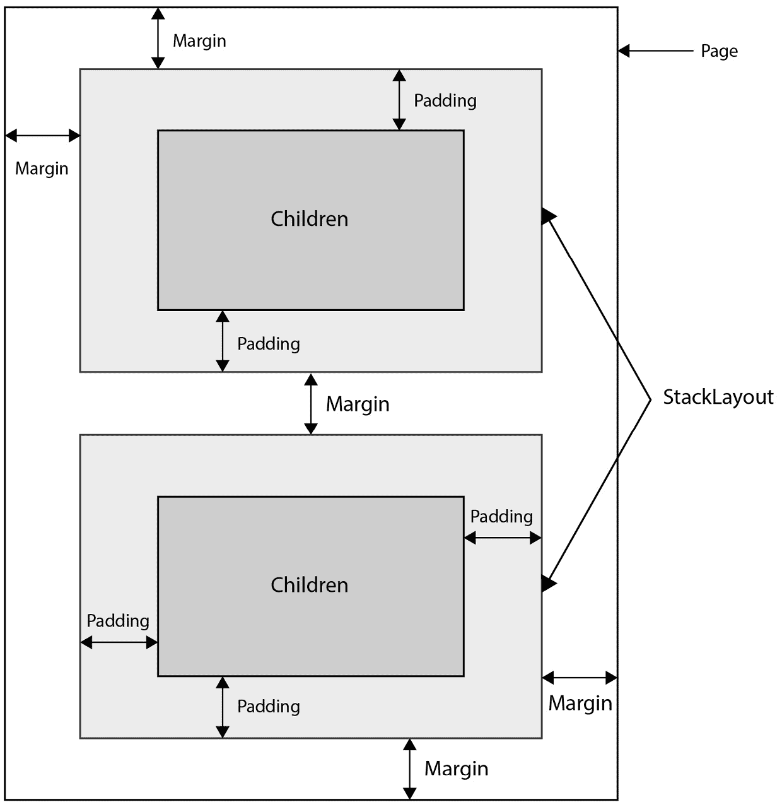
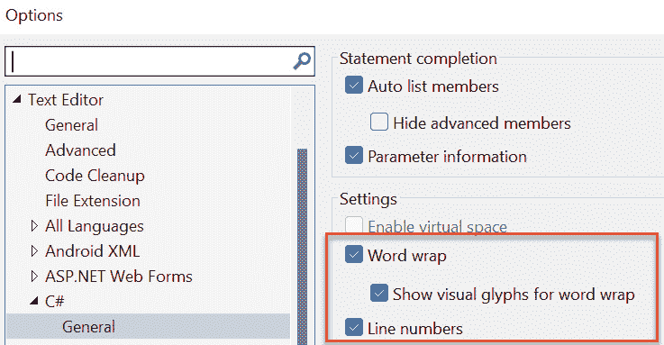
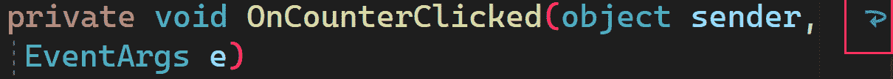
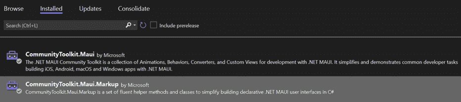

# 第三章：XAML 和 Fluent C#

在本章中，我们将探讨如何使用标记语言创建用户界面和 C# 逻辑来创建 .NET MAUI 应用程序。

.NET MAUI 程序通常用两种语言编写。一种是 C#，用于所有逻辑，另一种是 **XAML**（发音为 *zamel*，与 camel 同韵），用于布局和控制创建。正如你将看到的，使用 XAML 是可选的。你可以完全用 C# 创建布局和控制，但大多数人不会这样做。然而，这种情况可能正在改变（越来越多的 Microsoft Learn 文档展示了两种方法）。

你何时会选择使用 C#？

使用 C# 而不是 XAML 的原因有很多，最不重要的是你熟悉 C#，不想学习 XAML。然而，如果你这样做，你会发现阅读其他人的代码很困难，因为大多数现有的 `Xamarin.Forms`（.NET MAUI 的前身）应用程序都是用 XAML 编写的。

使用 C# 可以帮助在需要根据某些条件（例如运行时获取的数据类型）更改设计的情况下。但正如在 *第十一章* 中解释的，还有其他方法可以使用 XAML 来处理这种情况，*高级主题*。

本书将展示一些页面的 C#，但重点将放在 XAML 上。

所有 Microsoft 文档至少包含 XAML；只有部分是 C# 编写的，还有一些是 Fluent C#（我们将在本章后面讨论的话题）。几乎所有的 **Xamarin.Forms** 应用和示例都使用 XAML，仅此一点就值得学习。更重要的是，XAML 是一种高度表达性的声明性标记语言，它使得创建布局和控制变得即便不是容易，至少也是可管理的。

本章将涵盖以下主题：

+   理解 XAML 的结构

+   代码隐藏和事件处理器

+   探索布局选项

+   使用 C# 创建 UI

# 技术要求

要跟随本章内容，你需要以下条件：

+   Visual Studio 版本 17.5 或更高版本（最好更新到最新版本）

+   本章涉及到的源代码可以在 GitHub 仓库中找到：[`github.com/PacktPublishing/.NET-MAUI-for-C-Sharp-Developers/tree/XAMLAndCSharp`](https://github.com/PacktPublishing/.NET-MAUI-for-C-Sharp-Developers/tree/XAMLAndCSharp)

# 理解 XAML 的结构

XAML 文件具有 `.xaml` 扩展名，例如，`MainPage.xaml`，在默认程序中，如 *第一章* 所示。让我们检查这个文件，以探索 XAML 的布局和控件声明。

简要概述

本章将仅对创建 XAML 布局和控制进行初步介绍。*第四章* 和 *第五章* 将分别详细介绍控制和布局的细节。

用 XAML 编写的 .NET MAUI 页面将具有 `MyName.xaml` 的格式，并且与该页面相关联的后置代码页面（稍后解释）将具有 `MyName.xaml.cs` 的格式。

在 XAML 页面的顶部是一个声明，即该文件实际上是一个 XML 类型的文件。该声明必须位于每个 `.xaml` 文件的顶部。

有不同类型的页面（也称为视图）。最常见的是 `ContentPage`，在这里 `MainPage` 被创建为 `ContentPage`，如下所示：

```cs
<?xml version="1.0" encoding="utf-8" ?>
<ContentPage xmlns="http://schemas.microsoft.com/
  dotnet/2021/maui"
    xmlns:x="http://schemas.microsoft.com/winfx/2009/xaml"
       x:Class="ForgetMeNotDemo.View.MainPage">
```

作为 `ContentPage` 声明的一部分，我们识别了两个命名空间（`xmlns`）。第一个命名空间是无名的，用于 .NET MAUI 本身。第二个命名空间，名为 `x`，用于 XAML。

最后，这个 XAML 文件所属的类是 `ForgetMeNotDemo.View.MainPage`。

第一部分 (`ForgetMeNotDemo.View`) 是命名空间，而 `MainPage` 是类的名称。`View` 部分被添加以表示项目下的文件夹。

如前所述，每个 `.xaml` 页面都有一个相关的后置代码页面。您可以在后置代码中放置程序的逻辑，这就是我们将在本章中做的事情（在下一章中，我们将查看一个更适合测试的替代方案）。无论如何，后置代码中必须包含一些内容，您将在下一节中看到。

## 后置代码文件

每个 XAML 文件都有一个相关的后置代码页面，其名称为 `<pagename>.xaml.cs`。因此，这个页面的后置代码是 `MainPage.xaml.cs`。

后置代码文件通常（并且正确地）以类的名称命名（即，`MainPage` 类将在 `MainPage.xaml` 和 `MainPage.xaml.cs` 中）。命名空间在文件中明确声明，并应遵循文件夹结构。因此，如果命名空间是 `ForgetMeNotDemo`/`MainPage`，那么我们预计 `MainPage.cs` 将具有 `ForGetMeNotDemo` 命名空间：

```cs
namespace ForgetMeNotDemo.View;
public partial class MainPage : ContentPage
```

注意，这是一个部分类。在 .NET MAUI 中，所有 UI 类都被标记为部分。注意，该类表明它是 `ContentPage`，这与我们在 XAML 中看到的一致。

除了定义类之外，您还可以使用 XAML 来创建页面的布局，即元素之间相互关系的位置。XAML 提供了一系列布局选项，如下所述。

# 探索布局选项

返回到 `MainPage.xaml`，我们看到 `ContentPage` 下方的是 `ScrollView` 布局元素。这是一个布局，本质上表示 `ScrollView` 中包含的任何内容都可以（惊喜！）滚动。

布局包含其他布局和控制元素。它就像在 XML 中做的那样做，即使用开闭标签。以下是语法：

```cs
<ScrollView>
   // … layouts and controls
</ScrollView>
```

一个页面只能有一个元素。通常，这个元素是一个布局，由于布局可以包含其他布局和控制元素，因此可以创建整个层次结构。

`MainPage.xaml` 中的前四个元素（默认情况下）如下：

```cs
<ScrollView>  [1]
     <VerticalStackLayout  [2]
         Spacing="25"
         Padding="30,0"
         VerticalOptions="Center">
         <Image [3]
             Source="dotnet_bot.png"
             SemanticProperties.Description="Cute dot net
               bot waving hi to you!"
             HeightRequest="200"
             HorizontalOptions="Center" />
         <Label [4]
             Text="Hello, World!"
             SemanticProperties.HeadingLevel="Level1"
             FontSize="32"
             HorizontalOptions="Center" />
</ScrollView>
```

为什么这段代码与仓库中的代码不同？

之前的代码就是您从盒子里得到的内容。在本章中，我们将增强这段代码，仓库反映了章节结束时的最终版本。

让我们一次处理一个元素。我们已经讨论了第一个元素，`ScrollView`，所以让我们从下一个开始，也就是`VerticalStackLayout`。

## VerticalStackLayout

在`ScrollView`内部是`VerticalStackLayout`。正如其名所示，这个布局将东西堆叠在一起。在这里，我们为`VerticalStackLayout`定义了三个属性：`Spacing`，`Padding`和`VerticalOptions`。现在，`VerticalStackLayout`有数十个属性和方法。我们将在*第五章**，布局*中了解更多。

`Spacing`决定了包含的每个元素之间的垂直空间量。在这里，`Spacing`设置为`25` **设备无关单位**（**DIPs**）。使用 DIPs 意味着您可以定义一个设备（手机、Windows 等）的大小，并且它可以在所有其他设备上看起来如您所愿。至少理论上是这样的。正如一位好朋友曾经说过：“在理论上，理论和实践是相同的。但在实践中，它们永远不是。”

第二个属性是`Padding`。这是您控制控件位置和对齐方式的一种方法。第二种主要方式是使用`Margins`。这告诉您从最近的另一个元素（或从页面边缘）的距离，而`Padding`告诉您当前元素周围缓冲区的大小，如图*图 3.1*所示。1：



图 3.1 – Padding 和 Margin

`Padding`的格式是*左*，*上*，*右*，*下*。一个`Padding`值为（`20`,`10`,`5`,`0`）将在左边有`20` DIPs 的填充，顶部有`10`，右边有`5`，底部没有 DIPs。如果顶部和底部相同，它们可以合并。同样，对于左右也是如此。因此，正如我们在这里所看到的，`Padding = "30,0"`，这意味着左右将有`30`的填充，但顶部和底部没有填充。

`VerticalStackLayout`中的最后一个属性是`VerticalOptions`，它表示相对于其容器（在这种情况下，`ScrollView`）放置`VerticalStackLayout`的位置。这个选项基于一个枚举：

+   *居中*

+   *结束*

+   *填充*

+   *开始*

这个枚举与许多不同的布局和控制一起使用。目前，只需知道*Start*对于垂直布局意味着*顶部*，对于水平布局意味着*最左边*。同样，*End*对于水平布局意味着*最右边*，对于垂直布局意味着*底部*。我们将在本书的后面部分回到这些值。

## Image

页面的第三个元素是一个`Image`元素，在这种情况下，它有四个属性。第一个是源（在哪里找到图像）。第二个属性称为`SemanticProperties.Description`。**语义属性**被添加以帮助使用屏幕阅读器的用户。

您不能直接设置高度（它是只读的），但您可以设置`HeightRequest`，我们在这里将其设置为`200` DIPs。.NET MAUI 将尝试根据您在页面上的其他设置和可用空间提供该高度。最后，我们将`HorizontalOptions`设置为`Center`，以便在水平轴上居中图像。

## 标签

接下来，我们看到`Label`。在这种情况下，它也有四个属性。第一个是标签上要显示的文本。第二个属性，同样是为了屏幕阅读器，表示组织结构（在这里标签位于顶层）。第三个属性是`FontSize`。设置`FontSize`有几种方法，我们将在*第四章*中看到，但在这里我们使用 DIPs。最后，再次设置`HorizontalOptions`为`Center`。

如果您向下滚动页面，您会看到另一个`Label`和一个`Button`控件（它几乎可以做您所猜测的一切）。

在底部，您将看到`VerticalStackLayout`的关闭，然后是`ScrollView`的关闭，最后是`ContentPage`本身的关闭。

因此，XAML 提供了一种高度结构化的方法来描述布局。以下是完整的 XAML 页面：

```cs
<?xml version="1.0" encoding="utf-8" ?>
<ContentPage
    x:Class="ForgetMeNotDemo.MainPage"
    xmlns="http://schemas.microsoft.com/dotnet/2021/maui"
    xmlns:x="http://schemas.microsoft.com/winfx/2009/xaml">
    <ScrollView>
        <VerticalStackLayout
            Padding="30,0"
            Spacing="25"
            VerticalOptions="Center">
            <Image
                HeightRequest="200"
                HorizontalOptions="Center"
                SemanticProperties.Description="Cute dot
                  net bot waving hi to you!"
                Source="dotnet_bot.png" />
            <Label
                FontSize="32"
                HorizontalOptions="Center"
                SemanticProperties.HeadingLevel="Level1"
                Text="Hello, World!" />
            <Label
                FontSize="18"
                HorizontalOptions="Center"
                SemanticProperties.Description="
                      Welcome to dot net Multi platform
                        App U I"
                SemanticProperties.HeadingLevel="Level2"
                Text="Welcome to .NET Multi-platform
                  App UI" />
            <Button
                x:Name="CounterBtn"
                Clicked="OnCounterClicked"
                HorizontalOptions="Center"
                SemanticProperties.Hint="Counts the number
                  of times you click"
                Text="Click me" />
        </VerticalStackLayout>
    </ScrollView>
</ContentPage>
```

此页面通过声明`ContentPage`（最常见的页面类型）并定义页面的命名空间和名称（这将在代码后也反映出来）来打开。然后声明两个标准命名空间（使用`xmlns`），第一个用于.NET MAUI，第二个用于 XAML 标记。

我们看到`ScrollView`，在其中我们看到`VerticalStackLayout`，它被设置为使用填充和间距，并垂直居中。我们将随着我们的进展回顾这些属性。

`VerticalStackout`包含四个控件：一个图像，两个标签和一个按钮。每个控件都有自己的属性。您现在不必担心这些属性；它们将在稍后解释。这里的要点是布局可以包含布局和控件。它们像乌克兰娃娃一样堆叠，一个套一个（尽管控件不包含控件）。

备注

每个`ContentPage`只能有一个布局，但该布局可以包含其他布局（正如我们在这里看到的），因此这不是一个问题。

此外，请注意，由于打印页面的尺寸限制，一些文本将换行到下一行。

您甚至可以在 Visual Studio 中这样做，方法是转到**工具** | **选项** | **C#** | **常规**，并勾选**自动换行**复选框。如果您这样做，我建议您还勾选**显示自动换行视觉符号**，这会使阅读代码更容易。当您在那里时，您可能还想检查**行号**，这在追踪编译错误时非常有用。这些选项在*图 3.2*中显示。



图 3.2 – 设置自动换行和行号

现在，当你的代码行太宽而无法显示时，它将自动换行，你会在右侧看到一个小的箭头，表示该行已继续，如*图 3.3*所示。3*.



图 3.3 – Visual Studio 自动换行

当发生某些事件，例如用户点击按钮时，会引发一个事件。该事件在代码背后被处理，我们将在下一节中回顾。

事件与命令

从下一章开始，我们将停止使用事件，转而使用命令。命令在 ViewModel 中处理，这使得它们更容易测试。现在，为了方便起见，我们将处理事件，并在代码背后进行处理。

## 代码背后和事件处理器

我们在下面的`Button`控件列表中看到有一个`Clicked`属性，它指向`OnCounterClicked`方法：

```cs
<Button
  x:Name="CounterBtn"
  Clicked="OnCounterClicked"
  HorizontalOptions="Center"
  SemanticProperties.Hint="Counts the number of times you
    click"
  Text="Click me" />
```

此方法（`onCounterClicked`）位于代码背后文件，`MainPage.xaml.cs`中。所有`EventArgs`（或从`EventArgs`派生的类）。按照惯例，`EventArgs`参数被命名为`e`。

在我们的情况（以及大多数情况）中，我们并不关心发送者以及简单的`EventArgs`（如这里所用的），它是空的，仅作为提供额外信息的派生类的事件处理器的基类（因此你可能有一个从`EventArgs`派生的类型，它提供了事件处理器所需的信息）： 

```cs
private void OnCounterClicked(object sender, EventArgs e)
{
    count++;
    if (count == 1)
        CounterBtn.Text = $"Clicked {count} time";
    else
        CounterBtn.Text = $"Clicked {count} times";
    SemanticScreenReader.Announce(CounterBtn.Text);
}
```

事件处理器名称与 XAML 中识别的事件处理器匹配。

```cs
<Button
    Clicked="OnCounterClicked"
```

此处理器的任务仅在每个按钮被点击时更新按钮上的文本。最后，它使用`SemanticScreenReader Announce`方法再次显示该文本，以便屏幕阅读器：

计数实例字段在类的顶部声明：

```cs
public partial class MainPage : ContentPage
{
    private int count = 0;
    public MainPage()
    {
        InitializeComponent();
    }
```

InitializeComponent

注意，构造函数调用了`InitializeComponent`。这将在每个 XAML 文件的代码背后文件中成立。`InitializeComponent`的职责是初始化页面的所有元素。

当我们到达*第四章*时，你会看到我们试图最小化代码背后文件的 内容，主要是为了便于创建单元测试。到那时，我们将用命令替换我们的事件，但现在我们先不这么做。

虽然几乎所有 Microsoft 文档和现有的示例代码都使用 XAML 进行标记，但也可以使用 C#创建布局和视图。事实上，近年来，越来越多的 Microsoft 文档显示了这两种方法。

.NET MAUI Community Toolkit

本节需要您在上一章中添加的.NET MAUI 社区工具包。实际上，社区工具包是工具包集合的一部分，这些工具包是开源项目，并补充了.NET MAUI 发布版本中的内容。它们是由与微软开发者紧密合作的社区成员创建的。可以合理假设，许多社区工具包的功能将随着时间的推移正确迁移到.NET MAUI 中。我强烈建议您使用这些工具包，本书也是如此。

# 如果您能在 XAML 中做到，您就能在 C#中做到。

任何可以在 XAML 中声明的都可以在 C#中声明。包含是通过使用对象的`children`属性来管理的。事件处理程序必须在控件的一个实例上注册。也就是说，将为特定的按钮注册一个事件处理程序，正如您将在本例中看到的那样。

这里是我们在 XAML 中编写的代码转换为 C#：

```cs
using CommunityToolkit.Maui.Markup;    [1]
namespace ForgetMeNotDemo;
class MainPageCS : ContentPage
{
  private readonly Button counterBtn = new Button  [2]
  {
    Text = "Click Me",
    HorizontalOptions = LayoutOptions.Center,
  }.SemanticHint("Counts the number of times you click");
  public MainPageCS()
  {
    counterBtn.Clicked += OnCounterClicked;   [3]
    Content = new VerticalStackLayout    [4]
    {
      Spacing = 30,
      Padding = new Thickness(30, 0),
      VerticalOptions = LayoutOptions.Center,
      Children =   [5]
                {
                    new Image()
                    {
                        Source = "dotnet_bot.png",
                        HeightRequest = 200,
                        HorizontalOptions =
                          LayoutOptions.Center,
                    }.SemanticDescription("Cute dot net bot
                         waving hi to you!"), [6]
                    new Label()
                    {
                        Text="Hello, World",
                        FontSize=32,
                        HorizontalOptions =
                          LayoutOptions.Center,
                    }.SemanticHeadingLevel
                       (SemanticHeadingLevel.Level1),
                    new Label()
                    {
                        Text = "Welcome to .NET Multi-
                          platform App UI",
                        FontSize = 18,
                        HorizontalOptions =
                           LayoutOptions.Center,
                    }.SemanticHeadingLevel
                       (SemanticHeadingLevel.Level2)
                        .SemanticDescription(
                          "Welcome to dot net Multi
                            platform App UI"),
                    counterBtn, [7]
                }
    };
  }
  private int count = 0;
  private void OnCounterClicked(object sender, EventArgs e)
    [8]
  {
    count++;
    if (count == 1)
      counterBtn.Text = $"Clicked {count} time";
    else
      counterBtn.Text = $"Clicked {count} times";
    SemanticScreenReader.Announce(counterBtn.Text);
  }
}
```

让我们快速看一下如何连接这个新的`MainPage`。为了测试这个 C#版本，将`AppShell.xaml`中的`ShellContent`元素设置为指向您的新页面，如下所示：

```cs
<ShellContent
    Title="Home"
    ContentTemplate="{DataTemplate local:MainPageCS}"
    Route="MainPageCS" />
```

回到将 XAML 转换为 C#代码，让我们分析一下，以便更好地理解。这些数字指的是代码中括号内的数字：

1.  我们首先添加一个`using`语句用于`CommunityToolkit`。我们需要这个用于语义提示，这些提示被屏幕阅读器用于视力有限或无视力的人。虽然一个完成的项目应该为每个控件都有这些，但我们不会在这本书中使用它们以节省空间和混淆。

1.  我们想添加一个按钮，并且这个按钮需要一个事件处理程序（用于点击事件）。在这个例子中，`Clicked`事件的事件处理程序位于文件底部。为了向我们的按钮添加事件处理程序，我们必须首先定义`Button`。我们这样做是在构造函数之外，并设置其属性[2]。

1.  在构造函数的非常开始处，我们将事件处理程序方法分配给`Clicked`事件。正如所注，该事件处理程序方法位于文件底部，尽管当然它可以是（也许应该是）在它自己的文件中[3]。

1.  现在，我们已经准备好创建`VerticalStackLayout`以及其中包含的所有元素[4]。

1.  这些元素将位于堆叠布局的`Children`集合中[5]。

1.  注意，语义描述是通过流畅的语法附加到图像上的[6]。

1.  在添加了所有其他元素之后，我们就可以将按钮插入到堆叠布局的`Children`集合中[7]。

1.  我们将按钮的事件处理程序放在这个文件的底部，尽管您当然可以将其移动到不同的文件，可能是在不同的文件夹中。但是，如果您这样做，请记住为该命名空间添加一个`using`语句[8]。

关于注释的说明

在业界关于在 C# 代码中使用注释的问题上存在激烈的争议。我持一个非常极端的观点：代码应该几乎完全自解释。也就是说，如果您为变量、字段、方法等使用适当且描述性的名称，则不需要注释。我并不是一个狂热者；如果代码足够复杂，这里或那里的注释可以大有帮助，但注释会生锈，应该谨慎使用。因此，您会发现代码中注释很少，尽管我们将在接下来的段落中详细讲解代码。

我们工具集最近增加的功能是能够使用 Fluent C#，这可以使您的 C# 代码更加紧凑且易于阅读。

## C# 与 Fluent C#

除了使用 C# 创建您的页面外，还有一个新的（截至 2022 年冬季）**Community Toolkit** 用于 Fluent C#。这并不会改变基本方法，但可以使创建 C# 页面更加简洁且易于理解。

要使用此功能，您需要添加 `CommunityToolkit.Maui.Markup` NuGet 包。请参考以下图示：




图 3.4 – 从 NuGet 获取标记包

该项目是开源的，可以在 [`github.com/communitytoolkit/Maui.Markup`](https://github.com/communitytoolkit/Maui.Markup) 上检查（并扩展！）`ReadMe` 文件将帮助您入门，尽管我们也会在本书中介绍该材料。

您需要做的第一件事是更新 `MauiProgram.cs`，使用以下代码片段将工具包添加到构建器中：

```cs
public static MauiApp CreateMauiApp()
{
    var builder = MauiApp.CreateBuilder();
    builder
        .UseMauiApp<App>()
        .UseMauiCommunityToolkit()
        .UseMauiCommunityToolkitMarkup()
        .ConfigureFonts(fonts =>
        {
            fonts.AddFont("OpenSans-Regular.ttf", 
                "OpenSansRegular");
            fonts.AddFont("OpenSans-Semibold.ttf", 
                "OpenSansSemibold");
        });
```

您可以将 `UseMauiCommunityToolkitMarkup` 链接到 `UseMauiCommunityToolkit` 在构建器中[1]。

现在，您可以避免编写以下内容：

```cs
var entry = new Entry();
entry.WidthRequest = 400;
entry.HeightRequest = 40;
```

相反，您可以将其全部链接起来，只需写下这个：

```cs
new Entry().Size(200,40);
```

这使得代码更加简洁。

我将在整本书中提供 C# 和 Fluent C# 的示例；尽管如此，正如所提到的，我们将使用的主要标记语言是 XAML。

# 摘要

在本章中，我们研究了标记语言 XAML，它用于创建布局和控件。我们看到在 XAML 中可以完成的事情也可以在 C# 中完成，我们看到了有两种方式来编写 C#：传统的声明性方式和较新的流畅形式。

我们检查了一些重要的类（如 `Button`、`Label`、`Image` 等）以及如何在代码后端类中处理事件。我还暗示，在下一章中，代码后端的事件处理程序将被命令及其在 ViewModel 中的实现所取代。

在 *第四章* 中，我们将深入了解在 .NET MAUI 中编写应用程序的主要架构：**模型-视图-视图模型**（**MVVM**），我们将探讨数据绑定。然后我们将探索许多控件以及它们如何协同工作。

# 测验

1.  用一句话来说，XAML 是什么？

1.  XAML 用于什么？

1.  使用 XAML 的替代方案是什么？

1.  我们如何使用 C# 在一个布局内部嵌套另一个布局？

1.  什么是事件处理程序？

1.  如果在 XAML 中声明了一个事件，事件处理程序在哪里？

# 尝试一下

是时候开始编写代码了！

创建一个名为 `ForgetMeNotJesse` 的新项目（你可能想在放置我的名字的地方使用你自己的名字）。理想情况下，将该项目置于源代码管理之下（参见本章顶部章节的 *技术要求* 部分）。

使用 .NET MAUI 模板创建你的项目，使用本书编写时的最新版本 .NET（.NET 7）。

运行你的程序以确保一切设置正确。

修改 `MainPage`，以便点击按钮时，在按钮下方更新一个标签，显示点击次数（除了在按钮本身显示外）。

一旦页面按预期工作，创建一个新页面，并在 C# 中而不是在 XAML 中重新创建你的 `MainPage`。为了测试，请记住将 `AppShell.xaml` 中的 `ShellContent` 元素设置为指向你的新页面，如下所示：

```cs
<ShellContent
    Title="Home"
    ContentTemplate="{DataTemplate local:MainPageCS}"
    Route="MainPageCS" />
```

如果你在任何地方遇到困难，请从本书的仓库中拉取 XAML 和 C# 分支，并将该解决方案与你的解决方案进行比较。
