# MVVM 和控件

在 *第三章* 中，我们探讨了 .NET MAUI 的基础知识，但我们的代码位于与 XAML 文件关联的后台代码文件中。然而，现在是时候将我们的注意力转向 .NET MAUI 的共识架构了。

**模型-视图-视图模型** (**MVVM**) 不是一个工具或平台，而是一种架构。简单来说，它是一种组织代码和思考的方式，以优化 .NET MAUI 应用程序的创建并便于单元测试（参见 *第九章*）。

在最简单的形式中，MVVM 由三组文件组成，即三个命名空间，这本质上意味着三个文件夹（根据需要包含子文件夹）。依次来看，`Model` 是定义数据 *形状* 的类集合。这仅仅意味着表示数据的类被保存在模型中。

简单来说，`View` 是用户看到的页面。

`ViewModel` 是所有动作发生的地方。它是管理程序逻辑并包含在 `View` 中展示的 *属性* 的类集合。随着我们的深入，我们将探讨 **ViewModel** (**VM**) 属性。

在本章中，我们将探讨以下主题：

+   设置 MVVM

+   数据绑定

+   视图

+   XAML 与 C#

+   行为

+   弹出窗口和对话框

+   画笔

# 技术要求

对于本章，您需要 Visual Studio 的最新版本（任何版本）。

本书中的每一章都保存为一个分支。本章和下一章中显示的代码位于 [`github.com/PacktPublishing/.NET-MAUI-for-C-Sharp-Developers/tree/MVVMAndControls`](https://github.com/PacktPublishing/.NET-MAUI-for-C-Sharp-Developers/tree/MVVMAndControls) 分支中。如果您检查该分支，您将看到我们最终到达的位置，但如果您想查看一些中间步骤，只需检查对分支做出贡献的提交即可。然而，为了跟上进度，请从 [`github.com/PacktPublishing/.NET-MAUI-for-C-Sharp-Developers/tree/Navigation/tree/XAMLAndCSharp`](https://github.com/PacktPublishing/.NET-MAUI-for-C-Sharp-Developers/tree/Navigation/tree/XAMLAndCSharp) 分支作为起点。

# 为 MVVM 准备

MVVM 既是组织文件和文件夹的方式，也是一种架构方法。要开始使用 MVVM，我们将做两件事：

1.  创建文件夹。

1.  下载相关的社区工具包。

## 创建文件夹

我们将创建三个文件夹。在我告诉你这些文件夹的名称之前，我应该说明，关于确切命名它们的意见存在一些分歧。*表 4.1* 显示了文件夹名称及其替代方案：

| **我们将使用** **名称** | **替代方案 1** | **替代方案 2** |
| --- | --- | --- |
| `Model` | `Models` |  |
| `View` | `Views` | `Pages` |
| `ViewModel` | `ViewModels` |  |

表 4.1 – 文件夹命名

如你所见，关键的区别在于文件夹的名称是否应该使用复数，反映每个文件夹中将有多于一个文件的事实，或者使用单数（正如我们将做的），反映 Model-View-ViewModel 的名称。我想不出一个更不重要的争议，而且显然你选择什么只要保持一致就无关紧要。任意地，我们将使用前者。

因此，在你的项目中创建三个文件夹：`Model`、`View` 和 `ViewModel`，如图 *图 4**.1* 所示：

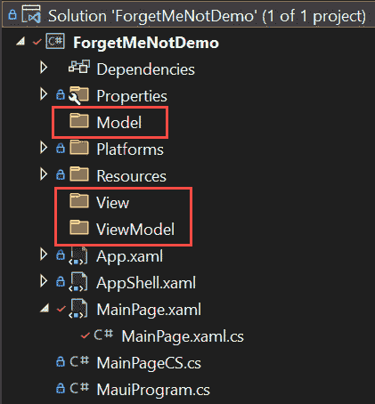

图 4.1 – MVVM 文件夹

`MainPage` 现在位置不正确。将 `MainPage.xaml` 拖到 `View` 文件夹（它将带其代码后置文件一起移动）。你需要修复 XAML 文件中的命名空间：

```cs
x:Class="ForgetMeNotDemo.View.MainPage"
```

在代码背后：

```cs
namespace ForgetMeNotDemo.View;
```

微软提供了由 .NET 社区创建但微软认可和支持的库，这些库不是 .NET MAUI 的一部分。这些社区工具包的大部分功能可能会迁移到 .NET MAUI 本身。

## MVVM 社区工具包

打开 `CommunityToolkit-MVVM` 并点击 **CommunityToolkit.MVVM**。这个出色的工具包将使使用 MVVM 的编程比其他方式更容易。见图 *图 4**.2*：

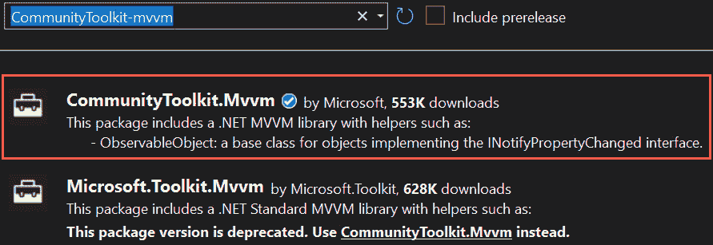

图 4.2 – 获取 NuGet 包

当我们谈到 *源代码生成器* 时，我们将回到如何使用此工具包。接下来，让我们看看一些视图。

## 探索视图

.NET MAUI 控件是一个泛称，用于页面、布局和视图。在本章中，我们将查看视图，而页面和布局将在下一章中回顾。在 *第七章* 中，我们将查看页面之间的导航。

视图与页面

从 MVVM 的角度来看，一个视图是一个页面。从 .NET MAUI 的角度来看，`View` 是一个控件。所以，为了让你完全困惑，一个视图由视图和布局组成。为了避免这种荒谬，我们将后者称为控件。一些框架将这些称为小部件。不时我会忘记，将这些控件称为视图，但上下文将清楚地表明我的意思。

.NET MAUI 控件是一个映射到每个目标平台上的本地控件的对象。因此，.NET MAUI 按钮映射到 iOS、Android、Macintosh 和 Windows 的本地按钮。

显示文本的主要方式是使用 `Label`。`Label` 的继承树如下：

`Object` > `BindableObject` > `Element` > `NavigableElement` >

`VisualElement` > `View` > `Label`

对象当然是 C# 中每个类的基类。我们现在暂时跳过 `BindableObject`，并将 `Element`、`NavigableElement` 和 `VisualElement` 一起分组为你在页面上可以看到的东西。这使我们回到了之前描述的 `View`，然后是 `Label` 本身。

在 `Label` 上最常用的属性是 `Text`。`Text` 是 `Label` 显示的内容，因此你可以编写以下内容：

```cs
<Label Text="Hello World" />
```

这创建了一个显示标志性问候语的标签。但你可以用 `Label` 做更多的事情，就像我们在上一章中看到的那样。

## Forget Me Not 标签

让我们在 Forget Me Not 的上下文中看看标签。我们已经有应用程序了，但它只是开箱即得。让我们修改这个第一页，为 Forget Me Not 创建初始页面。

请点击 `MainPage.xaml` 中的 `VerticalStackLayout`，这将折叠 `VerticalStackLayout` 并允许你一次性删除它，如图 *图 4.3* 所示：

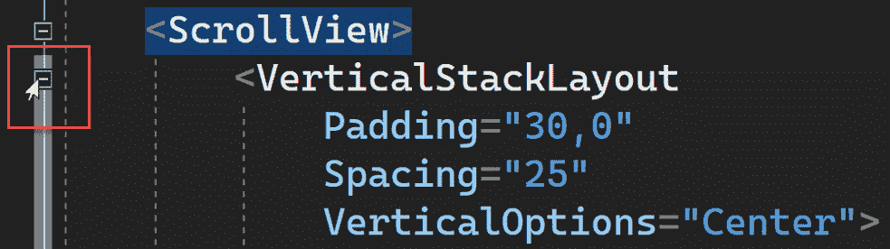

图 4.3 – 折叠的 VerticalStackLayout

接下来，转到代码后文件（`MainPage.xaml.cs`）并删除计数器和 `OnCounterClicked` 事件处理器。

清理完所有这些后，我们就可以开始添加新的代码了。我们需要一个可以放入标签的布局，所以让我们创建一个空的 `VerticalStackLayout`，并向其中添加一个显示 `Welcome to Forget Me Not` 的标签控制。

```cs
<VerticalStackLayout>
    <Label Text="Welcome to Forget Me Not"/>
</VerticalStackLayout>
```

我们已经准备好在此基础上构建了。让我们添加一些使 `Label` 看起来更好的更常见属性：

```cs
<VerticalStackLayout>
    <Label
        x:Name="HelloLabel"
        Margin="20"
        BackgroundColor="Red"
        FontAttributes="Bold"
        FontSize="Small"
        HorizontalOptions="Center"
        HorizontalTextAlignment="Center"
        Text="Welcome to Forget Me Not"
        TextColor="Yellow"
        VerticalTextAlignment="Center" />
</VerticalStackLayout>
```

我们将依次检查这些属性，但首先，*图 4.4* 显示了页面现在的样子：

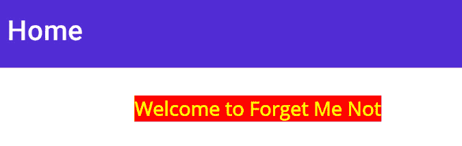

图 4.4 – Label

注意，标题（**主页**）是页面的一部分。我们关心的是下面的标签。

在我们检查 `Label` 的属性之前，让我们先看看是否可以使其看起来更美观一些，只需添加一点内边距：

```cs
<VerticalStackLayout>
    <Label
        BackgroundColor="Red"
        FontAttributes="Bold"
        FontSize="Small"
        HorizontalOptions="Center"
        HorizontalTextAlignment="Center"
        LineBreakMode="WordWrap"
        Margin="20"
        MaxLines="5"
        Padding="10"
        Text="Welcome to Forget Me Not"
        TextColor="Yellow"
        VerticalTextAlignment="Center"
        x:Name="HelloLabel" />
</VerticalStackLayout>
```

这就给出了如图 *图 4.5* 所示的页面。

XAML Styler

注意，属性排列得很好，并且按字母顺序排列。这是由于一个名为 XAML Styler 的（免费）工具造成的，您可以从 Visual Studio Marketplace 获取它（[`bit.ly/XAMLstyler`](https://bit.ly/XAMLstyler)）。

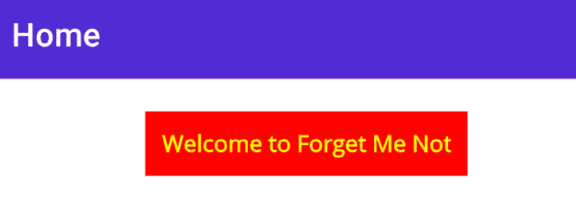

图 4.5 – 带有内边距的 Label

好多了。让我们逐行检查前面的代码。

大多数这些属性都是不言自明的。`BackgroundColor` 属性控制整个标签。在我们的例子中，我们将 `Padding` 属性（如 *第三章* 中所述）设置为 `10`；因此，红色在文本周围有 `10` 的内边距。

如您所见，我们使用 `FontAttributes` 属性将文本设置为 `Bold`。可能的属性是 `Bold`、`Italic` 和 `None`，其中 `None` 是默认值。

`FontSize` 可以输入设备无关的单位（例如，`FontSize = "20"`）或者输入以下枚举常量之一，如 `Micro`、`Small`、`Large` 等。

`HorizontalOptions` 和 `VerticalOptions` 将标签放置在页面上的相对位置。我们在上一章中提到了这一点。在 `HorizontalOptions` 的情况下，选择是 `Start`（最左边）、`Center`（中间）或 `End`（最右边）。

下一个属性是`LineBreakMode`，它与`MaxLines`属性一起使用。它们共同决定了标签可以支持多少行文本以及文本将在哪里换行。为了看到这一点，修改文本，使其说“*欢迎来到忘不了，非常高兴你在这里，没有你我们无法做到这一点，我们感激你的耐心。*”正如你在*图 4.6*中看到的那样，文本现在在多行中居中，并且每行都在单词边界处换行。

![图 4.6 – 多行标签

![img/Figure_4.6_B19723.jpg]

图 4.6 – 多行标签

如前所述，`Label`有数十个属性，虽然我们已经涵盖了最重要的属性，但你总是可以在 Microsoft Learn 上查找其他属性。在这种情况下，你需要查看的页面是[`bit.ly/MicrosoftLabel`](https://bit.ly/MicrosoftLabel)。

在 MVVM 模型中显示数据的关键是数据绑定，这使我们能够将视图和属性关联起来，然后允许.NET MAUI 在属性值变化时保持视图的更新。让我们继续探讨这一点。

# 数据绑定

.NET MAUI 最强大的功能之一是**数据绑定**，并且数据绑定与 MVVM 配合得非常好。想法是将数据（值）绑定到控件上。例如，我们可能有一个类，其中包含我们想要在标签上显示的文本，它被保存在一个公共属性中（你只能绑定到公共属性）。我们不需要从类中复制该文本到标签，我们只需告诉标签属性的名称。

公共属性将保存在`ViewModel`的类中。但我们必须回答这样一个问题：`View`如何知道在哪里查找属性？这通过设置`BindingContext`来处理。

让我们看看一个简单的例子。在`ViewModel`中创建一个名为`MainViewModel.cs`的新文件。

命名 ViewModel

最常见的命名约定是用单词*page*来命名页面，例如`MainPage`或`LoginPage`，但在`ViewModel`的名称中省略单词*page*，例如`MainViewModel`和`LoginViewModel`。所以，这就是我们在本书中要做的。

注意，其他程序员将使用`MainPageViewModel`这个名字。另一方面，有些人不使用单词*page*，而是使用*view*，例如`MainView`和`LoginView`。最重要的是你（和你的团队）要保持一致性，这样就可以轻松猜测和找到相关的页面和视图模型。

在继续之前，请注意 Visual Studio 已经将你的类放入了`ForgetMeNotDemo.ViewModel`命名空间（如果你将项目命名为`ForgetMeNot`，则命名空间将是`ForgetMeNot.ViewModel`）。这是基于`.cs`文件所在的文件夹。

确保类是公共的，并且被标记为`partial`。在.NET MAUI 中，所有绑定都是使用部分类完成的，这使得类的其余部分可以由内部处理和生成的部分类处理。

## 创建公共属性

我们现在想创建一个名为`FullName`的属性。

原始的做法看起来像这样：

```cs
private string fullName;
public string FullName
{
   get => fullName;
   set
   {
     fullName = value;
     OnPropertyChanged();
   }
}
```

然而，最好的方法是我们利用我们刚刚添加的 `NuGet` 包中的代码生成器。这些生成器通过使用属性来实现。在 `[ObservableObject]` 类声明上方添加一个属性，如下所示：

```cs
using CommunityToolkit.Mvvm.ComponentModel;
namespace ForgetMeNotDemo.ViewModel;
[ObservableObject]
public partial class MainViewModel
{
}
```

该属性将允许你生成属性。在每个属性上方，使用 `ObservableProperty` 属性：

```cs
[ObservableProperty]
  private string fullName;
```

这将导致 `NuGet` 包（无形中）生成大写公共属性及其 `OnPropertyChanged()` 方法调用，就像你亲自输入它们一样。

在我们查看如何设置 `FullName` 值之前，我们需要设置 `BindingContext`。

## 设置 `BindingContext`

`BindingContext` 告诉你的 `View` 从哪里获取其绑定数据。你可以通过多种方式设置它；最常见的是在 `View` 类的代码后文件中设置（在这种情况下，`MainPage.xaml.cs`）。首先，我们声明一个 `ViewModel` 的实例：

```cs
private MainViewModel vm = new MainViewModel();
Next, we assign the BindingContext to that instance in the
  constructor:
public MainPage()
{
  InitializeComponent();
  BindingContext = vm;
}
```

这是类的代码后：

```cs
public partial class MainPage : ContentPage
{
  private MainViewModel vm = new MainViewModel();
  public MainPage()
  {
    InitializeComponent();
    BindingContext = vm;
  }
}
```

接下来，我们将看到如何将值分配给 `ViewModel` 类的属性。

名称

我通常不喜欢名字的缩写。有一些罕见的例外，使用 `vm` 作为 `ViewModel` 的约定非常强烈，以至于我屈服于同伴压力。

## 将值分配给视图模型类的属性

你可以在 `ViewModel` 中、在 `ViewModel` 构造函数中或在 `OnAppearing` 方法的重写中分配你的字符串。`OnAppearing` 在 `View` 显示之前被调用，其外观如下（你将此放入代码后文件中）：

```cs
protected override void OnAppearing()
{
  base.OnAppearing();
  vm.FullName = "Jesse Liberty";
}
```

我们将在 *第七章* 中返回 `OnAppearing` 和其兄弟 `OnDisappearing` 方法。

InitializeComponent

`InitializeComponent` 必须在所有代码后文件的构造函数中。`InitializeComponent` 负责初始化页面上的所有控件。

## 实现绑定

你现在可以绑定 `FullName` 属性到 `Label`。在 XAML 中，将 `Label` 文本属性更改为以下内容：

```cs
Text="{Binding FullName}"
```

命名属性和字段

```cs
myMemberField), though there is no agreement at all as to whether member fields should be prepended with an underbar as in _myMemberField. We won’t use the underbar in this book, but feel free to do so as long, again, as you are consistent.
```

使用绑定关键字告诉 `Label` 从 `ViewModel` 中通过 `BindingContext` 设置的 `FullName` 属性获取其值。

你需要注意语法。它总是如下所示：开引号，开大括号，`Binding` 关键字，属性名，闭大括号，闭引号。好吧，我骗了你们。有时它可能更复杂，但这些元素总是存在的。

这个构造的结果是 `FullName` 的值被放置在标签的 `Text` 属性中，如图 *图 4**.7* 所示：

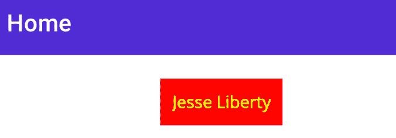

图 4.7 – 带有数据绑定文本的标签

MVVM 程序的一个显著特点是逻辑在 `ViewModel` 中，而不是在代码后文件中，我们将在下一节中探讨这一点。

## 视图模型与代码后

您可以将更多内容放入 `ViewModel`（而不是代码后文件），这样测试您的程序就会更容易（请参阅 *第九章* 中的单元测试）。一些 MVVM 粉丝认为除了对 `InitializeComponent` 的必需调用外，代码后文件中不应有任何内容。他们认为甚至设置 `ViewModel` 也应该在 XAML 中完成，以使代码后文件尽可能空。

我对这个持有更为中庸的观点。我经常在代码后文件中设置 `BindingContext`。我也会像您在讨论命令时看到的，将所有的事件处理都移出代码后文件。

```cs
LoginPage.xaml.cs:
public partial class LoginPage : ContentPage
{
    LoginViewModel vm = new LoginViewModel();
    public LoginPage()
    {
        BindingContext = vm;
        InitializeComponent();
    }
}
```

注意，这里的 `BindingContext` 在调用 `InitializeComponent` 之前已经设置。虽然在大多数情况下两者可以互换，但在初始化页面之前设置所有绑定通常是良好的实践。因此，我们将坚持这里所示的方法。

非常规代码后

有时候，在代码后文件中放置一个方法会容易得多。但是要小心。99% 的情况下，当您觉得在代码后文件中放置某物非常重要时，您实际上可以在 `ViewModel` 中实现它，这要好得多（再次，为了测试）。但如果您确实需要在代码后文件中放置某些内容，请不要感到难过，也不要让其他 .NET MAUI 程序员欺负您。

大多数应用程序的开发中心，人们所响应的部分，是 **用户界面**（**UI**）。在 .NET MAUI 中，UI 由布局中的视图组成。让我们将注意力转向最重要的视图。

# 视图

有许多控件用于显示和从用户获取数据。以下几节将介绍最常见和有用的控件，包括这里展示的：

+   图片

+   标签

+   按钮

+   图像按钮

+   输入文本

## 图片

您*可以*编写一个没有图片的 .NET MAUI 程序，但它可能看起来相当无聊。在 .NET MAUI 中管理图片比在 `Xamarin.Forms` 中要容易得多。现在，您不需要为 iOS 和 Android 的每个分辨率都准备一个图片，只需将一个图片放在资源文件夹中，.NET MAUI 就会为所有平台处理其余部分！

在这个例子中，我们将使用一个名为 `flower.png` 的图片，您可以从我们的 GitHub 仓库下载。如果您愿意的话，也可以使用您喜欢的任何图片。我们将把图片放在 `Resources` > `Images` 文件夹中。

当我们准备好显示它时，我们将使用 **图像视图**。以下是一个简单的示例：

```cs
<Image
    HeightRequest="200"
    HorizontalOptions="Center"
    Source="{Binding FavoriteFlower}" />
```

我只设置了三个属性，但它们完成了相当多的工作。`HeightRequest` 设置，正如您可能猜到的，页面中图片的高度（以设备无关的单位计，在这种情况下为 `200`）。我将其设置为居中。最重要的是，我已标识了源——即图片的名称。但不是将图片的名称锁定在 `View` 中，而是将其绑定到 `MainPageViewModel` 中的一个属性。

结果是 `MainPage` 现在看起来像 *图 4**.8*：

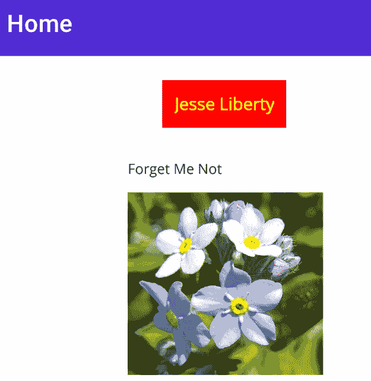

](img/Figure_4.8_B19723.jpg)

图 4.8 – 将源绑定到 ViewModel 中的属性

当然，还有许多其他属性可以设置。对我来说，一组最喜欢的属性是 `Rotation` 属性，它们可以在 *x*、*y* 和 *z* 轴上旋转。如果我将 `RotationX` 属性添加如下：

```cs
<Image
    HeightRequest="200"
    HorizontalOptions="Center"
    RotationX="45"
    Source="flower.png" />
```

图片旋转，如图 *图 4.9* 所示：

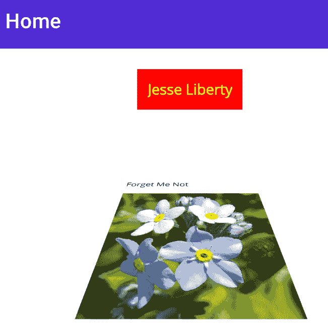

图 4.9 – RotationX=”45”

另一个有用的技巧是通过将 `Opacity` 设置为介于 `0` 和 `1` 之间的值来使图片半透明。*图 4.10* 展示了具有 `.25` 透明度的相同图片。我移除了 `StackLayout` 并用 `Grid` 取代了它。关于网格的更多内容将在下一章中介绍，但如果你只声明一个网格并将 `Label` 和 `Image` 放入其中，没有其他 `Grid` 属性，它们将一个叠在另一个上面：

```cs
<Grid>
    <Label
        BackgroundColor="Red"
        FontAttributes="Bold"
        FontSize="Small"
        HeightRequest="50"
        HorizontalOptions="Center"
        HorizontalTextAlignment="Center"
        LineBreakMode="WordWrap"
        Margin="20"
        MaxLines="5"
        Padding="10"
        Text="{Binding FullName}"
        TextColor="Yellow"
        VerticalTextAlignment="Center"
        x:Name="HelloLabel" />
    <Image
        HeightRequest="200"
        HorizontalOptions="Center"
        IsVisible="True"
        Opacity=".25"
        RotationX="45"
        Source="{Binding FavoriteFlower}"
        x:Name="BigFlower" />
</Grid>
```

*图 4.10* 展示了结果：

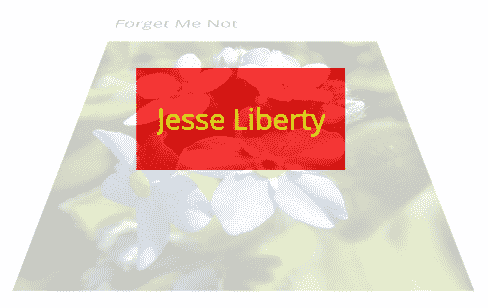

图 4.10 – 叠加和半透明效果

创造力的空间是无限的。

### 点击图片

许多人想要对图片做的关键事情之一就是点击它。这个问题的有两个解决方案。最简单的是使用一个按钮。

按钮可以有文本和许多其他属性，但最重要的是命令。命令告诉 `ViewModel` 当按钮被点击时应该做什么。

为了展示这是如何工作的，我将在我们的图片上添加一个新的属性 `IsVisible` 并将其设置为 `true`。只要它是 `true`，图片就是可见的。但，正如你可以想象的那样，将其设置为 `false` 使得大花朵不可见。不仅不可见，它还在页面上不占用任何空间，因此按钮将直接位于标签下方。

这里是 `Button` 的代码：

```cs
<Button
    Text="Click me"
    Command="{Binding ToggleFlowerVisibilityCommand}"/>
```

这是我能制作的 simplest 按钮了（我们将在稍后看看如何让它更好看）。这里的关键是 `Command` 参数。你可以通过 `Binding` 关键字知道 `ToggleFlowerVisibility` 将在 `ViewModel` 中。确实如此，但我们不是声明一个命令并将其指向一个方法，而是可以使用代码生成器来为我们做繁重的工作。

这里是修改后的 `MainViewModel`：

```cs
[ObservableObject]
public partial class MainViewModel
{
  [ObservableProperty] private bool flowerIsVisible = true;
    [1]
  [ObservableProperty] private string fullName;
  [ObservableProperty] private string favoriteFlower =
    "flower.png";
  [RelayCommand]  [2]
  private void ToggleFlowerVisibility()  [3]
  {
    FlowerIsVisible = !FlowerIsVisible;
  }
}
```

这是一个 *约定优于配置* 的例子 – `Button` 中的 `Command` 属性是 `ToggleFlowerVisibilityCommand`，但当你使用 `RelayCommand` [2] 实现它时，你将其命名为 `ToggleFlowerVisibility` [3]，省略了 `Command`。

注意，我们创建了一个 `FlowerIsVisible` [1] 作为 `ObservableProperty`，我们只需在每次点击时将其从 `true` 切换到 `false` 再切回即可。

## 按钮属性

就目前而言，按钮将显示为在每个平台上原生显示的样子。但这些按钮可能相当难看。我们可以通过接管它们的外观的大部分来使它们看起来更漂亮。

这里是我的 `Button` 的 XAML，虽然不美观，但将展示你可以用来控制按钮外观的一些属性：

```cs
<Button
     BackgroundColor="Red"
     BorderColor="Black"
     BorderWidth="2"
     Command="{Binding ToggleFlowerVisibilityCommand}"
     CornerRadius="20"
     FontSize="Small"
     HeightRequest="35"
     Padding="5"
     Text="Don't Click Me"
     TextColor="Yellow"
     WidthRequest="150" />
```

我们有三个之前没有见过的新的属性。第一个是 `BorderColor`，它与 `BorderWidth` 一起使用。这为按钮提供了一个边框。由于我们已将 `BackgroundColor` 设置为 `Red`，边框会突出显示。最后一个新属性是 `CornerRadius`，它为我们提供了对其他方形按钮角落的圆润处理。把这些都放在一起，你就得到了一个看起来像 *图 4.11* 的按钮：


图 4.11 – 一个看起来更好的按钮

为什么这个按钮仍然很丑？

我当然不是一个 UI 人员，所以我编写的页面通常相当丑陋，直到有人知道如何处理它们。这本书中的屏幕图像将反映出这种无能。

## ImageButton

有时，我们宁愿在按钮上放一个图片，而不是文字。有一个 `ImageButton` 控件，它结合了许多 `Image` 控件和 `Button` 控件的属性：

```cs
<ImageButton
    BorderColor="Black"
    BorderWidth="2"
    Command="{Binding ToggleFlowerVisibilityCommand}"
    MaximumHeightRequest="75"
    MaximumWidthRequest="75"
    Padding="5"
    Source="{Binding FavoriteFlower}" />
```

你可以看到它如何与 `Button` 控件相似。事实上，我保留了命令绑定和源绑定，所以我们最终在大的图片下面得到了一个小花的图片，但点击小的一个（`ImageButton`）会使大的一个（`Image`）变得不可见，然后又变得可见，以此类推。我会在 *图 4.12* 中展示它们都可见的样子，因为很难在纸上切换图片：

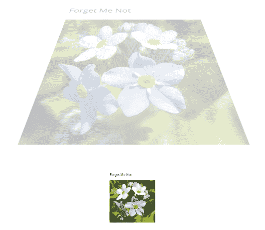

图 4.12 – ImageButton

## TapGestureRecognizer

处理在图片上点击的第二种方式是分配一个手势识别器。我们将分配的 `GestureRecognizer` 类型是 `TapGestureRecognizer`，它将识别图片本身被点击的情况。为了安全起见，我们将它设置为图片必须被双击。当发生这种情况时，图片会“噗！”地消失。

我们将移除 `ImageButton`，只保留 `Image`（和 `Label`）。这是我们的新 XAML 文件：

```cs
<?xml version="1.0" encoding="utf-8" ?>
<ContentPage
    BackgroundColor="White"
    x:Class="ForgetMeNotDemo.View.MainPage"
    xmlns="http://schemas.microsoft.com/dotnet/2021/maui"
    xmlns:x="http://schemas.microsoft.com/winfx/2009/xaml">
    <ScrollView>
        <VerticalStackLayout>
            <Label
                BackgroundColor="Red"
                FontAttributes="Bold"
                FontSize="Small"
                HeightRequest="50"
                HorizontalOptions="Center"
                HorizontalTextAlignment="Center"
                LineBreakMode="WordWrap"
                Margin="20"
                MaxLines="5"
                Padding="10"
                Text="{Binding FullName}"
                TextColor="Yellow"
                VerticalTextAlignment="Center"
                x:Name="HelloLabel" />
            <Image
                HeightRequest="200"
                HorizontalOptions="Center"
                IsVisible="{Binding FlowerIsVisible}" [1]
                Source="{Binding FavoriteFlower}"
                x:Name="BigFlower">
                <Image.GestureRecognizers>     [2]
                    <TapGestureRecognizer      [3]
                        Command="{Binding
                          ImageTappedCommand}" [4]
                        NumberOfTapsRequired="2" /> [5]
                </Image.GestureRecognizers>
            </Image>
        </VerticalStackLayout>
    </ScrollView>
</ContentPage>
```

我们在 [1] 处看到，图片最初是可见的。在 `Image` 的开头和结尾括号之间，我们添加了 `GestureRecognizer` [2]。在 `GestureRecognizer` 中，我们添加了 `TapGestureRecognizer` [3]，并且我们定义了 `ImageTappedCommand` [4]，就像我们处理其他命令一样。最后，我们声明，为了触发命令，用户必须双击 [5]。

这里是一个从 `ViewModel` 中 `RelayCommand` 的示例：

```cs
[RelayCommand]
private void ImageTapped()
{
  FlowerIsVisible = !FlowerIsVisible;
}
```

正如你所见，这个处理程序几乎与上一个相同。然而，这个处理程序不会按预期工作。在继续阅读之前，试着想想当我们双击图片（使其不可见）然后再次尝试这样做（使其可见）会发生什么。请慢慢来。我会在这里等待。

你可以通过回到 `Button` 或者在标签上放置一个 `GestureRecognizer` 来解决这个问题。

当你双击图片时，它确实会消失，因为 `IsVisible` 被设置为 `false`。然而，一旦它消失，它就消失了，并且没有东西可以点击来让它回来：

```cs
<Label
    BackgroundColor="Red"
    FontAttributes="Bold"
    FontSize="Small"
    HeightRequest="50"
    HorizontalOptions="Center"
    HorizontalTextAlignment="Center"
    LineBreakMode="WordWrap"
    Margin="20"
    MaxLines="5"
    Padding="10"
    Text="{Binding FullName}"
    TextColor="Yellow"
    VerticalTextAlignment="Center"
    x:Name="HelloLabel">
    <Label.GestureRecognizers>
        <TapGestureRecognizer Command="{Binding
          ImageTappedCommand}" />
    </Label.GestureRecognizers>
</Label>
```

这里有趣的是，`TapGestureRecognizer`命令指向相同的`RelayCommand`；它可以通过在图像上双击或单击标签来调用。

本节有两个要点：

+   `TapGestureRecognizer`允许您使任何控件可触摸，这可以非常强大。

+   一旦`View`不可见，它就不再在页面上。您可以通过代码背后的方式再次使其可见，但仅限于通过不同的控件（就像我们使用`ButtonImage`那样）。

在显示文本后，应用程序最重要的方面是能够从用户那里获取文本。为此，主要视图是`Entry`和`Editor`。让我们接下来看看它们。

## 输入文本

我们已经看了显示文本，现在让我们把注意力转向输入文本。有两个控件主要负责这一点：

1.  `Entry`: 用于输入一行文本

1.  `Editor`: 用于输入多行文本

这两个控件显然相关，但它们有不同的属性。`Entry`设计用于接受单行文本，而`Editor`处理多行输入。

要查看这些视图的工作情况，让我们为“忘记我”创建一个登录页面。

### 忘记我登录页面

我们一直在玩`MainPage`，但事实上，实际应用程序的`MainPage`非常简单：只是一个图像。登录页面更有趣。我们将对登录页面做一个初步的近似，这将使我们能够使用`Entry`和`Editor`控件，尽管我们将随着进程的发展而改进这个页面。

### 创建登录页面

第一个任务是创建登录页面。要做到这一点，请右键单击`LoginPage.xaml`，如图*图 4**.13*所示：

![Figure 4.13 – Add Item dialog box]

![Figure_4.13_B19723.jpg]

图 4.13 – Add Item 对话框

### XAML 与 C#

如果您希望使用 C#而不是 XAML 来创建登录页面的 UI，请选择**ContentPage (C#)**。我们将在本节中查看这两个，但让我们先从 XAML 版本开始。

检查 XAML 页面，其类设置为`ForgetMeNotDemo.View.LoginPage`，反映了命名空间（当我们创建位于`View`下的文件时，命名空间会自动生成）。XAML 还包括`VerticalStackLayout`，在其中，有`Label`。

快速看一下代码背后的文件。注意，已经为您创建了`namespace`，并且页面继承自`ContentPage`。

返回 XAML 页面，并在`VerticalScrollView`中删除`Label`。当应用程序完成时，它应该看起来像*图 4**.14*：

![Figure 4.14 – Login.XAML (top portion)]

![Figure_4.14_B19723.jpg]

图 4.14 – Login.XAML（顶部部分）

如您所见，我们有两个标签。每个标签的右侧都有一个输入框，输入框有占位文本。一旦您开始在输入框中键入，占位文本就会消失。

此外，还有三个按钮。为了正确布局，我们希望使用 `Grid`，但我们不会在*第六章*中介绍网格，*布局*。但这不是问题，因为它给了我们查看嵌套 `StackLayouts` 和使用 `HorizontalStackLayout` 的机会。

要开始，我们只需创建顶层。我们希望标签中的文本具有灵活性，并且我们希望捕获 `ViewModel` 中尚未创建的属性中的 *用户名* 输入。让我们现在就做。在 `LoginViewModel` 类上右键单击。

在 `LoginViewModel` 中添加用于用户名的 `ObservableProperty`：

```cs
namespace ForgetMeNotDemo.ViewModel
{
  [ObservableObject]
  internal partial class LoginViewModel
  {
    [ObservableProperty] private string name;
```

当用户在 `Entry` 控件中输入一个名字时，它将保存在这个属性中。

OneWay 和 TwoWay 绑定

控件可以是 `OneWay`，在这种情况下，控件从数据源（在这种情况下，属性）获取其值，但不能将其发送回去，或者 `TwoWay`，在这种情况下，控件从数据源获取数据，但也可以写回一个值。`Entry` 默认为 `TwoWay`。

我们已经准备好在 XAML 中的 `LoginPage` 创建顶层：

```cs
<?xml version="1.0" encoding="utf-8" ?>
<ContentPage
    Title="LoginPage"
    x:Class="ForgetMeNotDemo.View.LoginPage"
    xmlns="http://schemas.microsoft.com/dotnet/2021/maui"
    xmlns:x="http://schemas.microsoft.com/winfx/2009/xaml">
    <VerticalStackLayout>
        <HorizontalStackLayout WidthRequest="300">
            <Label
                FontSize="Medium"
                HorizontalOptions="Start"
                Margin="10,20,10,0"
                Text="User Name"
                VerticalOptions="Center"
                VerticalTextAlignment="Center" />
            <Entry
                HorizontalOptions="End"
                Placeholder="User Name"
                Text="{Binding Name}"
                WidthRequest="150" />
        </HorizontalStackLayout>
    </VerticalStackLayout>
</ContentPage>
```

我们在 `Entry` 上使用了三个属性：

1.  `HorizontalOptions`：这里我们将它设置为 `End`，这样 `Entry` 就会在行的最右边

1.  `PlaceHolder`：这是用户开始输入文本之前将显示的文本

1.  `Text`：我们将其绑定到 `ViewModel` 中的 `Name` 属性

看这个页面有一个问题：没有方法可以到达那里（目前还没有）。现在，而不是让程序在 `MainPage` 中打开，我们将让它打开到我们新的 `LoginPage`。为此，转到 `AppShell.xaml` 并将 `ShellContent` 改成这样：

```cs
<ShellContent
    Title="Home"
    ContentTemplate="{DataTemplate view1:LoginPage}"
    Route="LoginPage" />
```

我们将在*第七章*中讨论 Shell 和路由，但现在这将是可行的。

运行程序。如果你在 Android 设备或模拟器上运行它，它应该看起来大致像*图 4.15*：

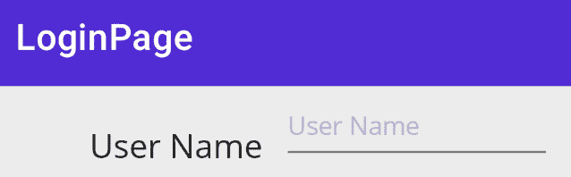

图 4.15 – LoginPage，第一次迭代

即使对我来说，这也不是很吸引人，但它确实展示了控件和布局。尝试在 **用户名** 输入框中输入。注意，占位符文本会立即消失。

我们需要一个方法来判断你输入的值是否真正绑定到 `Name` 属性。为此，让我们添加一个标签并将其绑定到 `Name` 属性。这样，当我们输入文本到输入框时，它将在 `Label` 中反映出来：

```cs
<?xml version="1.0" encoding="utf-8" ?>
<ContentPage
    Title="LoginPage"
    x:Class="ForgetMeNotDemo.View.LoginPage"
    xmlns="http://schemas.microsoft.com/dotnet/2021/maui"
    xmlns:x="http://schemas.microsoft.com/winfx/2009/xaml">
    <VerticalStackLayout>
        <HorizontalStackLayout WidthRequest="300">
            <Label
                FontSize="Medium"
                HorizontalOptions="Start"
                Margin="10,20,10,0"
                Text="User Name"
                VerticalOptions="Center"
                VerticalTextAlignment="Center" />
            <Entry
                HorizontalOptions="End"
                Placeholder="User Name"
                Text="{Binding Name}"
                WidthRequest="150" />
        </HorizontalStackLayout>
        <Label
            Margin="10,30,10,0"
            Text="{Binding Name}" />
    </VerticalStackLayout>
</ContentPage>
```

然而，在我们能够使其工作之前，我们必须设置 `BindingContext`，就像我们在 `MainPage` 上做的那样。打开 XAML 页面的代码隐藏文件，并将 `LoginViewModel` 设置为绑定上下文：

```cs
public partial class LoginPage : ContentPage
{
    LoginViewModel vm = new LoginViewModel();
public LoginPage()
    {
        BindingContext = vm;
        InitializeComponent();
    }
}
```

当我们运行这个程序并在输入框中输入文本时，文本将保存在 `ViewModel` 中的 `Name` 属性中。由于标签绑定到相同的属性，文本也会立即在那里显示，如*图 4.16*所示。16*：

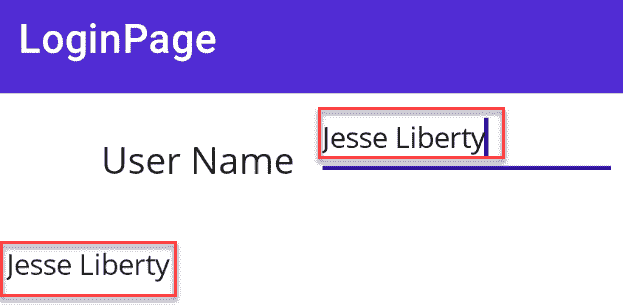

图 4.16 – 证明输入绑定到 Name 属性

现在我们知道它正在工作，删除标签。让我们为密码做同样的事情，就像我们对名字所做的那样，只是我们不想让任何人看到我们输入的密码。没问题，`Entry` 有一个 `boolean` 属性，`IsPassword`，我们将将其设置为 `True`：

```cs
<?xml version="1.0" encoding="utf-8" ?>
<ContentPage
    Title="LoginPage"
    x:Class="ForgetMeNotDemo.View.LoginPage"
    xmlns="http://schemas.microsoft.com/dotnet/2021/maui"
    xmlns:x="http://schemas.microsoft.com/winfx/2009/xaml">
    <VerticalStackLayout>
        <HorizontalStackLayout WidthRequest="300">
            <Label
                FontSize="Medium"
                HorizontalOptions="Start"
                Margin="10,20,10,0"
                Text="User Name"
                VerticalOptions="Center"
                VerticalTextAlignment="Center" />
            <Entry
                HorizontalOptions="End"
                Placeholder="User Name"
                Text="{Binding Name}"
                WidthRequest="150" />
        </HorizontalStackLayout>
        <HorizontalStackLayout WidthRequest="300">
            <Label
                FontSize="Medium"
                HorizontalOptions="Start"
                Margin="10,10,10,0"
                Text="Password"
                VerticalOptions="Center"
                VerticalTextAlignment="Center" />
            <Entry
                HorizontalOptions="End"
                Placeholder="Password"
                IsPassword="True"
                Text="{Binding Password}"
                WidthRequest="150" />
        </HorizontalStackLayout>
    </VerticalStackLayout>
</ContentPage>
```

在继续之前，请注意我们有一个 `VerticalStackLayout`，其中包含两个 `HorizontalStackLayouts`。这是一个不常见的布局，但当我们转向 `Grid` 时，我们将在外观上获得更多的控制。

此 XAML 的结果显示在 *图 4**.17* 中：

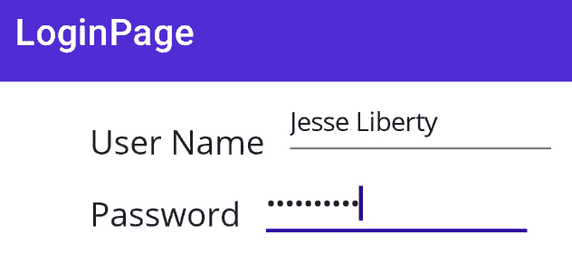

图 4.17 – 在 Entry 上使用密码布尔值

让我们通过添加三个按钮来完成这个页面的第一次迭代。现在我们只为一个（**提交**）分配一个命令：

```cs
<HorizontalStackLayout Margin="10,10,10,0">
    <Button
        BackgroundColor="Gray"
        Command="{Binding SubmitCommand}"
        Margin="5"
        Text="Submit" />
    <Button
        BackgroundColor="Gray"
        Margin="5"
        Text="Create Account" />
    <Button
        BackgroundColor="Gray"
        Margin="5"
        Text="Forgot Password" />
</HorizontalStackLayout>
```

结果显示在 *图 4**.18* 中：

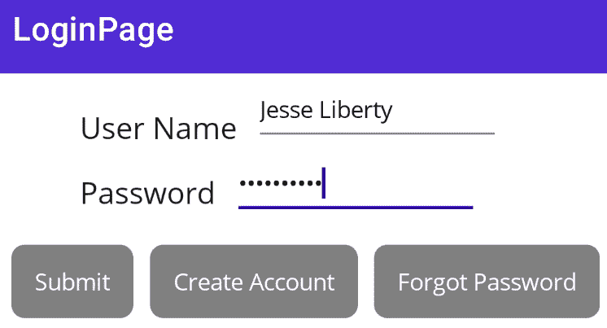

图 4.18 – 添加按钮

当你运行这个程序时，你可能注意到它运行得很好，除了点击 **提交** 没有做任何事情。这是因为我们命名了命令但从未实现它。我们将稍后进行操作。实际上，我们会长时间地推迟。我们将在到达 *第十一章*，*与 API 一起工作* 时处理真正的实现。

### 标题

你可能已经注意到页面有一个 **LoginPage** 标题。好消息是这是免费的（.NET MAUI 在我们创建页面时创建了它）。然而，在 **登录** 和 **页面** 之间有一个空格会更好。

在 XAML 页面的顶部是 `ContentPage` 的声明，并设置了第一个属性 `Title`。

```cs
<ContentPage
    Title="LoginPage"
```

只需插入缺失的空格，一切都会变得完美。

### 编辑器

将文本输入到应用程序中的第二种主要方式是使用 `Editor` 控件。与 `Entry` 类的主要区别在于 `Editor` 是为多行数据输入设计的。你可以对文本有相当大的控制，你将在下一个示例中看到。

让我们在登录页面添加一个编辑器。我们将设置它，使其仅在用户点击 **忘记密码** 时可见。我们将鼓励用户解释他们上次看到密码的确切位置以及为什么我们在告诉他们要确保密码安全时他们如此粗心。

重新打开 `LoginPage.xaml` 并在 `VerticalStackLayout` 中添加一个 `Editor`，位于最底部：

```cs
<Editor
    FontSize="Small"
    HeightRequest="300"
    IsTextPredictionEnabled="True"  [1]
    Margin="10"
    MaxLength="500"   [2]
    Placeholder="Explain yourself here (up to 500
      characters)"
    PlaceholderColor="Red" [3]
    Text="{Binding LostPasswordExcuse}"
    TextColor="Blue"  [4]
    VerticalTextAlignment="Center" [5]
    x:Name="LoginEditor" />
```

我在编辑器上使用了许多属性，其中一些是新的。

[1] `IsTextPredictionEnabled` 允许你的编辑器为用户提供文本以完成他们的句子。你无疑在处理 Gmail 和其他应用程序时已经看到了这一点。这实际上是默认的 `True`；你可能想在请求用户姓名或其他可能令人烦恼的预测条件下将其设置为 `False`。

[2] `MaxLength` 管理用户可以输入到编辑器中的字符数。

[3] `PlaceHolderColor` 允许你设置占位文本的颜色。

[4] 类似地，`TextColor` 设置用户输入文本的颜色。

[5] `VerticalTextAlignment` 设置文本在编辑器中的位置。

*图 4.19* 显示了用户在编辑器中输入任何内容之前 **登录页面** 的样子，而 *图 4.20* 显示了用户输入了几行文本后的样子：

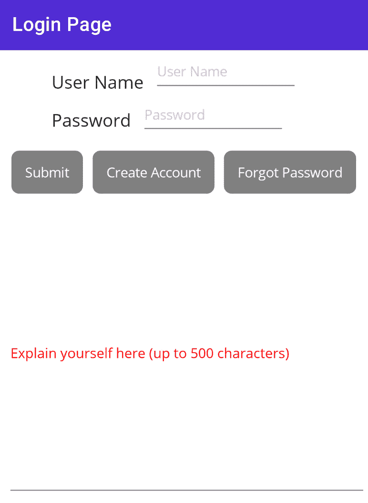

图 4.19 – 用户在编辑器中输入文本之前

你可以将你想要的文本输入到编辑器中，最多不超过你在控件声明中设置的任何最大值。

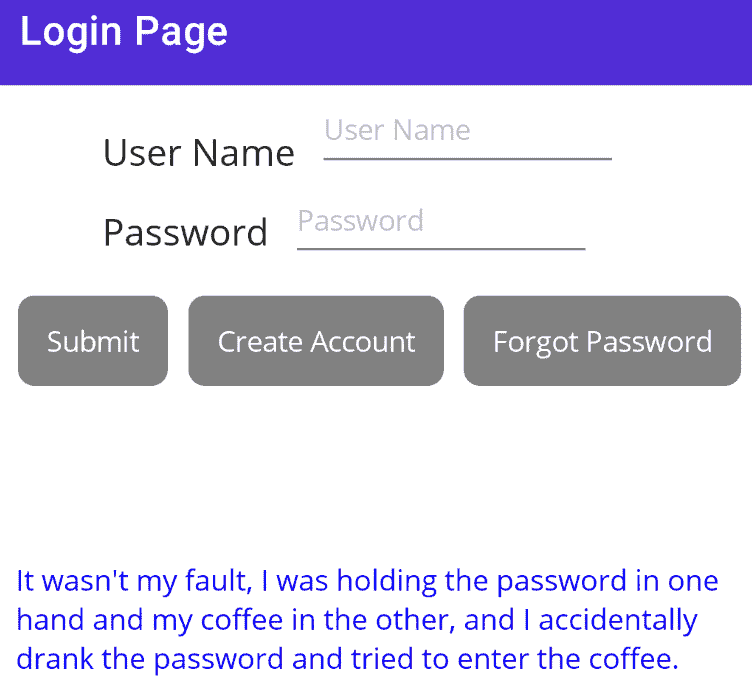

图 4.20 – 用户在编辑器中输入文本之后

虽然边距只设置为 `10`，但按钮和文本之间有很大的空间。这是因为我们将 `VerticalTextAlignment` 设置为 `Center`。如果我们将其更改为 `Start`，文本将移动到编辑器的顶部，如图 *图 4.21* 所示：

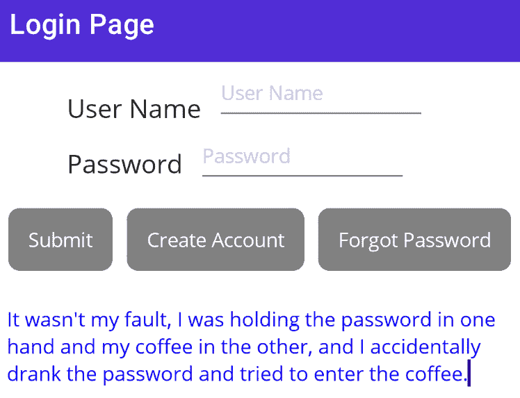

图 4.21 – 将编辑器中的文本移动到顶部（开始）位置

按钮本质上是依赖于事件的，但事件是在代码后文件中处理的，我们希望将所有逻辑都保留在 `ViewModel` 中。这个问题的答案是 `EventToCommand` 行为，我们将在下一节中考虑。

# 行为

`Editor` 控件有许多事件。这些事件可以通过代码后文件中的事件处理程序来处理，但正如之前解释的那样（以及解释），我们宁愿不这样做。因此，行为就出现了。

行为允许你在不创建子类的情况下向控件添加功能。它们 *附加* 行为。我们现在想要附加管理控制（`Editor`）中命令的能力，该控制没有命令。

.NET MAUI 社区工具包附带了许多行为，包括 `EventToCommandBehavior`。这个美妙的行为允许你将事件（本应在代码后文件中处理）转换为命令，该命令可以在 `ViewModel` 中处理。

我们想要更改 `Editor` 中的事件是 `OnEditorCompleted`，该事件在用户按下 *Enter* 键（或在 Windows 上，按下 *Tab* 键）时触发：

```cs
<Editor
    FontSize="Small"
    HeightRequest="300"
    IsTextPredictionEnabled="True"
    Margin="10"
    MaxLength="500"
    Placeholder="Explain yourself here (up to 500
        characters)"
    PlaceholderColor="Red"
    Text="{Binding LostPasswordExcuse}"
    TextColor="Blue"
    VerticalTextAlignment="Start"
    x:Name="LoginEditor">
    <Editor.Behaviors>
        <behaviors:EventToCommandBehavior
            EventName="Completed"
            Command="{Binding EditorCompletedCommand}" />
    </Editor.Behaviors>
</Editor>
```

语法让人联想到 `GestureRecognizers`，这并非巧合。想法是使控件能够拥有各种集合，并能够在 XAML 中声明这些集合。

当然，你可以在 C# 中声明相同的内容：

```cs
Var editor = new Editor();
var behavior = new EventToCommandBehavior
{
   EventName = nameof(Editor.Completed),
   Command= new EditorCompletedCommand()
};
```

如前所述，你可以在 XAML 中做任何事情，也可以在 C# 中做。

你在 `ViewModel` 中管理命令（无论你如何创建它），就像你管理任何其他命令一样。为了好玩，让我们在编辑器下方添加一个标签并将其绑定到 `LostPasswordExcuse`，但只有在用户按下 *Enter* 键时才显示。

`Login.xaml` 现在看起来是这样的：

```cs
<?xml version="1.0" encoding="utf-8" ?>
<ContentPage
    Title="Login Page"
    x:Class="ForgetMeNotDemo.View.LoginPage"
    xmlns="http://schemas.microsoft.com/dotnet/2021/maui"
    xmlns:behaviors="http://schemas.microsoft.com/dotnet/
        2022/maui/toolkit"
    xmlns:x="http://schemas.microsoft.com/winfx/2009/xaml">
    <VerticalStackLayout>
        <HorizontalStackLayout WidthRequest="300">
            <Label
                FontSize="Medium"
                HorizontalOptions="Start"
                Margin="10,20,10,0"
                Text="User Name"
                VerticalOptions="Center"
                VerticalTextAlignment="Center" />
            <Entry
                HorizontalOptions="End"
                Placeholder="User Name"
                Text="{Binding Name}"
                WidthRequest="150" />
        </HorizontalStackLayout>
        <HorizontalStackLayout WidthRequest="300">
            <Label
                FontSize="Medium"
                HorizontalOptions="Start"
                Margin="10,10,10,0"
                Text="Password"
                VerticalOptions="Center"
                VerticalTextAlignment="Center" />
            <Entry
                HorizontalOptions="End"
                IsPassword="True"
                Placeholder="Password"
                Text="{Binding Password}"
                WidthRequest="150" />
        </HorizontalStackLayout>
        <HorizontalStackLayout Margin="10,10,10,0">
            <Button
                BackgroundColor="Gray"
                Command="{Binding SubmitCommand}"
                Margin="5"
                Text="Submit" />
            <Button
                BackgroundColor="Gray"
                Margin="5"
                Text="Create Account" />
            <Button
                BackgroundColor="Gray"
                Margin="5"
                Text="Forgot Password" />
        </HorizontalStackLayout>
        <Editor
            FontSize="Small"
            HeightRequest="300"
            IsTextPredictionEnabled="True"
            Margin="10"
            MaxLength="5"
            Placeholder="Explain yourself here (up to 500
                characters)"
            PlaceholderColor="Red"
            Text="{Binding LostPasswordExcuse}"
            TextColor="Blue"
            VerticalTextAlignment="Start"
            x:Name="LoginEditor">
            <Editor.Behaviors>
                <behaviors:EventToCommandBehavior
                    EventName="Completed"
                    Command="{Binding EditorCompleted
                        Command}" />
            </Editor.Behaviors>
        </Editor>
        <Label
            FontSize="Small"
            IsVisible="{Binding EditorContentVisible}"
            LineBreakMode="WordWrap"
            Margin="10"
            Text="{Binding LostPasswordExcuse}"
            x:Name="EditorContents" />
    </VerticalStackLayout>
</ContentPage>
```

社区工具包为我们提供了一个在`ViewModel`中处理命令的更简单的方法。

# 弹出窗口和对话框

想要提醒用户某个条件或变化，或者从用户那里获取一些数据，使用警报，如图 4.22 所示并不罕见：

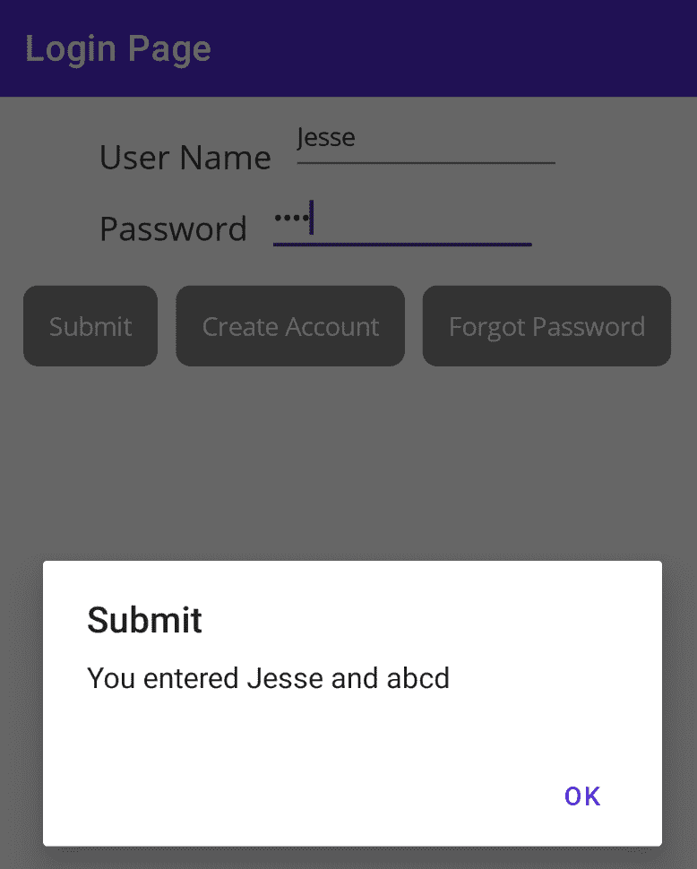

图 4.22 – 警告对话框

为了保持整洁，从`LoginPage.xaml`中删除编辑器和其关联的标签，并从`ViewModel`中删除构造函数和`ICommand`。在最终版本中我们不需要它们。

`DisplayAlert`对象只能从页面调用。稍后，你将看到如何在`ViewModel`中的按钮上处理`SubmitCommand`并发送消息到页面以显示警报。现在，让我们保持简单，将按钮的`SubmitCommand`更改为事件：

```cs
<Button
    BackgroundColor="Gray"
    Clicked="OnSubmit"
    Margin="5"
    Text="Submit" />
```

事件处理器放在代码后文件中。注意事件处理器的签名：

```cs
private async void OnSubmit(object sender, EventArgs e)
 {
   await DisplayAlert(
     "Submit",
     $"You entered {vm.Name} and {vm.Password}",
     "OK");
 }
```

图 4.22 中的对话框显示了数据，但没有与用户交互（除了告诉用户按**确定**关闭对话框）。然而，我们可以允许用户做出选择，并记录他们按下了哪个按钮。

事件处理器签名

`OnSubmit`想要是`async`，因为你想用`await`调用`DisplayAlert`。对于事件（仅限事件）`async`不是异步`Task`而是异步`void`。参数始终是`Object`类型和`EventArgs`或从`EventArgs`派生的类型。第一个通常命名为`sender`，因为这通常是引发事件的`View`。`EventArgs`是空的，作为传递到事件处理器的特定类型参数的基类。由于我们不会在最终代码中使用事件处理器，所以你不必太担心这一点。

在这里，我们只考虑了三种警报类型中的一种。让我们看看其他两种。

## 向用户展示选择

当我们处理这些时，让我们看看其他两种类型的警报。一种要求用户从两个选择中选择一个。我们暂时将其添加到`CreateAccount`按钮上。

让我们在`OnCreate`按钮上添加一个`clicked`事件：

```cs
<Button
    BackgroundColor="Gray"
    Clicked="OnCreate"
    Margin="5"
    Text="Create Account" />
```

为了有一个地方显示结果，让我们在关闭`HorizontalStackLayout`标签后添加一个标签：

```cs
<Label Text="Create account?" x:Name="CreateAccount" />
```

代码后文件包含事件处理器，它将更新我们的标签：

```cs
private async void OnCreate(object sender, EventArgs e)
{
  CreateAccount.Text = (await DisplayAlert(
    "Create?",
    "Did you want to create an account?",
    "Yes",
    "No")).ToString();
}
```

`DisplayAlert`返回一个布尔值，所以我们调用`ToString()`将其放置在`CreateAccount`标签的文本字段中。对话框显示在图 4.23 中：

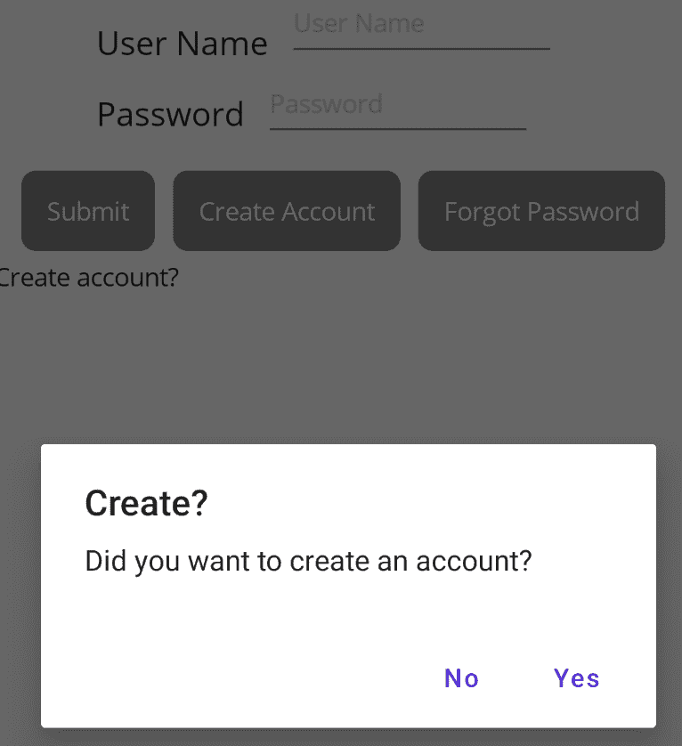

图 4.23 – 使用对话框提示选择

我们可以更进一步，向用户提供一系列选择。这通常被称为*向导*，因为它可以用来引导用户完成一系列操作。

## ActionSheet

对话框的第三种变体是`ActionSheet`。在这里我们可以提出多个选择，并允许用户选择一个。我们将将其附加到**忘记密码**按钮的事件处理器：

```cs
<Button
    BackgroundColor="Gray"
    Clicked="OnForgotPassword"
    Margin="5"
    Text="Forgot Password" />
```

这里是事件处理器：

```cs
private async void OnForgotPassword(object sender,
  EventArgs e)
{
  CreateAccount.Text = (await DisplayActionSheet(
    "How can we solve this?", [1]
    "Cancel",   [2]
    null,       [3]
    "Get new password",
    "Show me my hint",
    "Delete account"));
}
```

[1] 第一个参数是标题。

[2] 第二个参数是 **取消** 按钮的文本。

[3] 第三个参数是 `null` 的文本。

这后面跟着一个选择列表。*图 4**.24* 展示了运行时的样子：

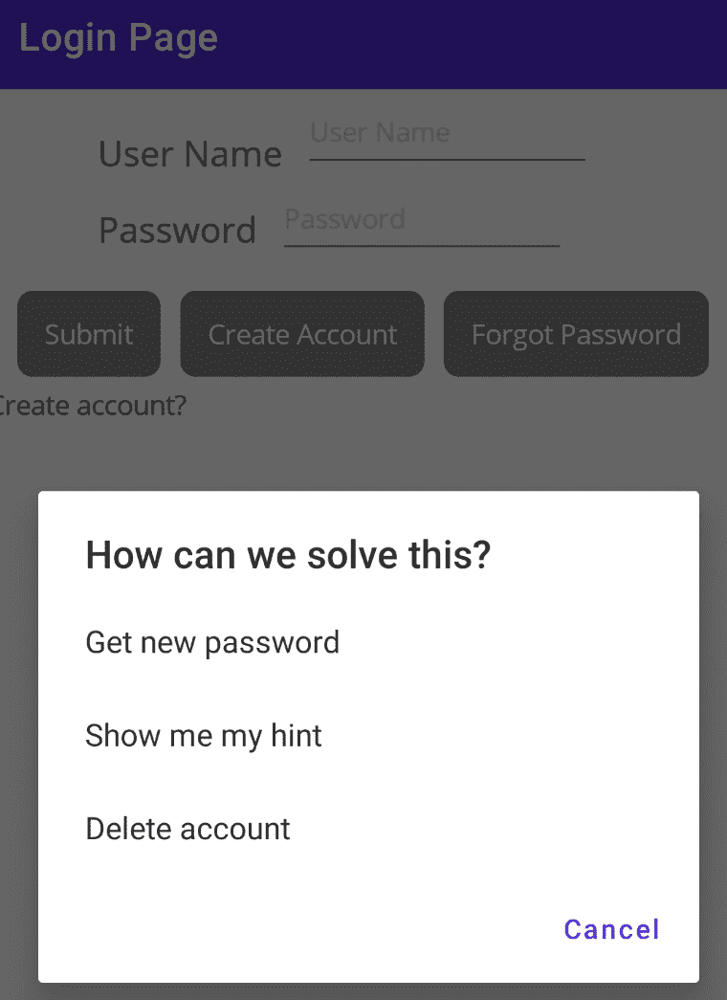

图 4.24 – 操作表

最后，有时我们希望允许用户输入自由格式数据。

## 显示提示

对话框的最后一个变体提供了一个提示，用户可以填写值。我们需要修改 `OnCreate` 的事件处理程序来展示这一点：

```cs
private async void OnCreate(object sender, EventArgs e)
{
  CreateAccount.Text = await DisplayPromptAsync(
    title:"New Account",
    message:"How old are you?",
    placeholder:"Please enter your age",
    keyboard:Keyboard.Numeric,
    accept: "OK",
    cancel: "Cancel");
}
```

在这个变体中，通常使用命名参数，因为有很多选项。*图 4**.25* 展示了它看起来是什么样子：

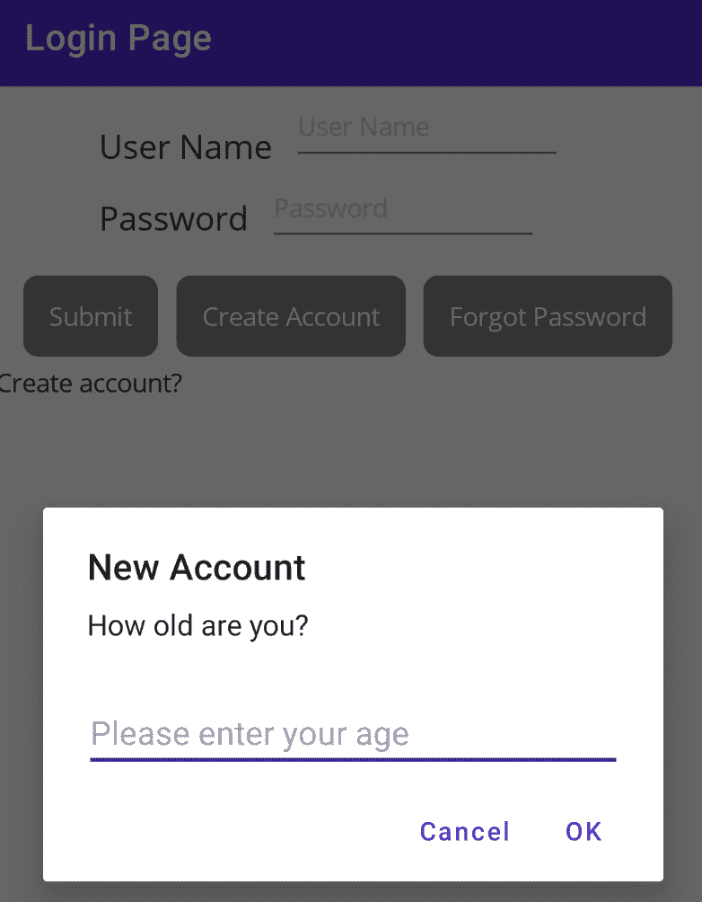

图 4.25 – 显示提示

## Toast

对话框的一个非常流行的替代方案是 *Toast* 视图。这是一个从页面底部弹出的弹出窗口（就像吐司从烤面包机中弹出一样），它显示其消息然后消失。

让我们再次修改 `OnCreate` 的处理程序，这次是为了显示一个吐司：

```cs
private async void OnCreate(object sender, EventArgs e)
{
    CancellationTokenSource = [1]
      new CancellationTokenSource();
    var message = "Your account was created";
    ToastDuration duration = ToastDuration.Short;  [2]
    var fontSize = 14;
    var toast = Toast.Make(message, duration, fontSize);
    await toast.Show(cancellationTokenSource.Token); [3]
}
```

当创建吐司时，您需要 `cancellationToken`。幸运的是，您可以从 `CancellationTokenSource` 对象的静态 `Token` 对象中实例化一个 [1] 和 [3]。

您可以使用 `ToastDuration` 枚举设置吐司显示的持续时间 [2]。选项有 `Long` 和 `Short`。

*图 4**.26* 展示了吐司：

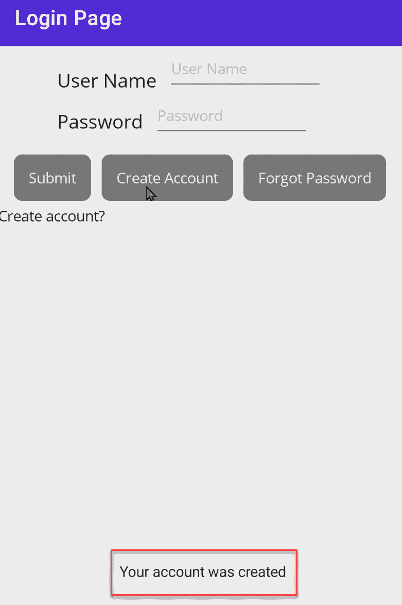

图 4.26 – Toast 弹出

## Snackbar

如果您需要更多控制吐司的外观，可以使用与之密切相关的 `Snackbar`。`Snackbar` 不仅有许多选项，而且它还有两个步骤。首先是显示吐司，其次是（可选的）动作——也就是说，当吐司被取消时，您想做什么？在这个例子中，我们将显示一个对话框。

选项的丰富性意味着事件处理程序比通常更广泛：

```cs
private async void OnCreate(object sender, EventArgs e)
{
  CancellationTokenSource =  [1]
    new CancellationTokenSource();
  var message = "Your account was created";  [2]
  var dismissalText = "Click Here to Close the SnackBar";
    [3]
  TimeSpan duration = TimeSpan.FromSeconds(10);  [4]
  Action = async () =>  [5]
    await DisplayAlert(
      "Snackbar Dismissed!",
      "The user has dismissed the snackbar",
      "OK");
  var snackbarOptions = new SnackbarOptions    [6]
  {
    BackgroundColor = Colors.Red,
    TextColor = Colors.Yellow,
    ActionButtonTextColor = Colors.Black,   [7]
    CornerRadius = new CornerRadius(20),
    Font = Microsoft.Maui.Font.SystemFontOfSize(14),
    ActionButtonFont = Microsoft.Maui.Font
      .SystemFontOfSize(14)
  };
  var snackbar = Snackbar.Make(
    message,
    action,
    dismissalText,
    duration,
    snackbarOptions);
  await snackbar.Show(cancellationTokenSource.Token);
}
```

[1] 我们首先创建 `CancellationTokenSource`，就像之前做的那样。

[2] 创建要显示在吐司中的消息。

[3] 添加一个可以点击以取消吐司的消息。

[4] 定义您希望吐司显示多长时间。您可以使用 `TimeSpan` 支持的任何时间单位（吐司可以显示几天！）。

[5] 当吐司被取消时，动作将发生。

[6] 这里是我们设置吐司特性的地方。

[7] 您可以独立设置吐司和取消文本的文字颜色。

*图 4**.27* 展示了在点击之前 `Snackbar` 的样子：

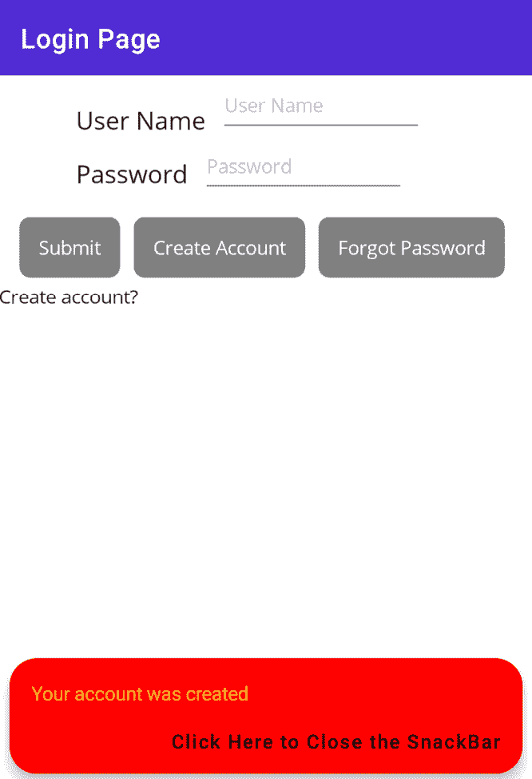

图 4.27 – Snackbar

用户点击 `SnackBar` 后消失，并触发动作；在这种情况下，对话框出现，如图 *图 4**.28* 所示：

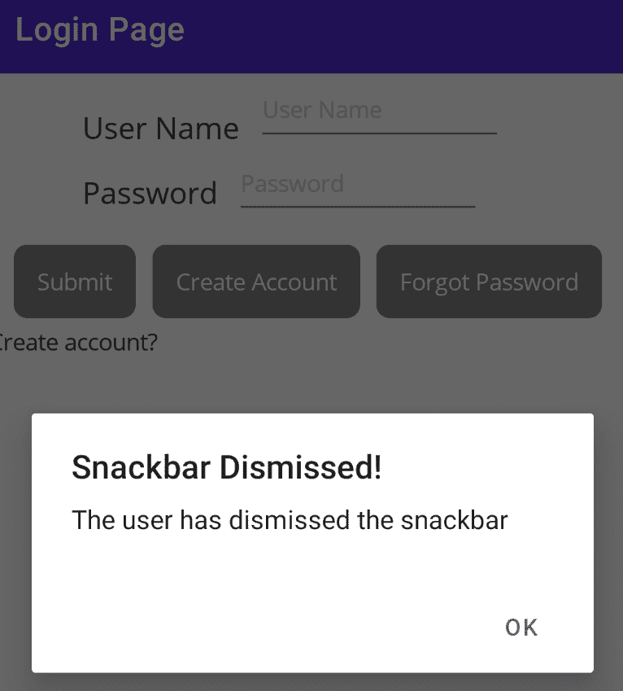

图 4.28 –Snackbar 取消后的动作

.NET MAUI 没有水平线控件，但我们可以将 `BoxView` 控件用作一个很好的替代品。

## BoxView

最简单的控件之一是 `BoxView`，它只是在页面上绘制一个框：

```cs
<BoxView
    Color="Red"
    CornerRadius="20"
    HeightRequest="125"
    WidthRequest="100" />
```

*图 4.29* 显示了 `BoxView` 控件：

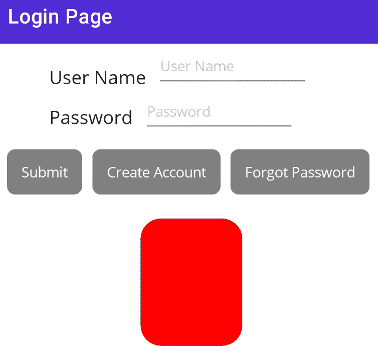

图 4.29 – 简单的 BoxView 控件

您可能会问这有什么好处？如果您将框的高度设置得非常小，宽度设置得非常大，您将得到一条很好的线条来分割您的页面。如果我们把以下内容放在 **Password** 输入之后，但在按钮之前，我们可以整洁地分割页面：

```cs
        <BoxView
            Color="Red"
            HeightRequest="2"
            Margin="0,20"
            WidthRequest="400" />
```

*图 4.30* 显示了这看起来是什么样子：

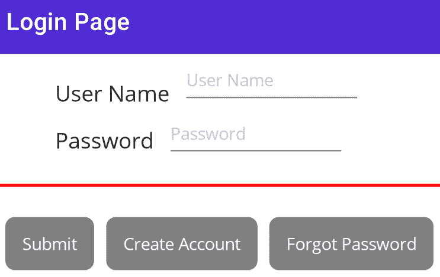

图 4.30 – 使用 BoxView 控件绘制线条

许多 UI 专家喜欢用边框来框定控件，可能还会使用 *阴影*。为此，您需要使用 `Frame` 控件。

## Frame

如果您想在另一个控件周围创建边框，您将需要使用 `Frame` 控件。`Frame` 允许您定义边框的颜色、`CornerRadius` 以及边框是否有阴影。让我们为 `Password` 输入字段创建一个边框：

```cs
<Frame
     BorderColor="Blue"
     CornerRadius="5">
     <Entry
         HorizontalOptions="End"
         IsPassword="True"
         Placeholder="Password"
         Text="{Binding Password}"
         WidthRequest="150" />
 </Frame>
```

*图 4.31* 显示了结果：

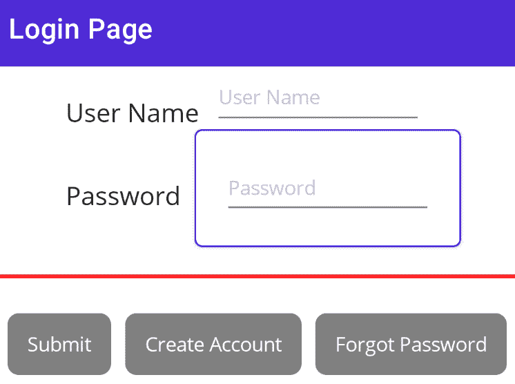

图 4.31 – 在密码输入周围添加边框

您可以通过使用画笔来控制 `BoxView` 控件和其他许多控件的颜色。

# Brushes

您可以使用画笔为任意数量的控件填充颜色。最容易看到这一功能的地方是使用 `BoxView` 控件，或者使用 `Frame`。

有三种类型的画笔，**实心**、**线性渐变**和**径向渐变**。让我们更详细地探讨它们。

## 实心画笔

实心画笔用于您想用一个单一的颜色填充控件时。通常，实心画笔是隐含在控件的 `BackgroundColor` 属性中的，就像我们在绘制 `BoxView` 控件时上面看到的。

## LinearGradientBrush

`LinearGradientBrush` 在称为渐变轴的线上绘制一个区域，其中包含两种或多种颜色的混合。您指定一个起点和一个终点，然后指定沿途的停止点（颜色切换的地方）。

起点和终点相对于绘制区域的边界，其中 `0,0` 是左上角（也是默认起点）和 `1,1` 是右下角（也是默认终点）。

为了说明这一点，我将把框架从密码周围移动到一个单独的空间：

```cs
<Frame
    BorderColor="Blue"
    CornerRadius="10"
    HasShadow="True"
    HeightRequest="100"
    WidthRequest="100">
    <Frame.Background>  [1]
        <LinearGradientBrush EndPoint="1,0"> [2]
            <GradientStop Color="Yellow" Offset="0.2" />
              [3]
            <GradientStop Color="Red" Offset="0.1" /> [4]
        </LinearGradientBrush>
    </Frame.Background>
</Frame>
```

[1] 在这里，我们在 `Frame` 上创建了一个 `Background` 属性。

[2] 在其中创建 `LinearGradientBrush`。

注意，我们指定了 `EndPoint` 但没有指定 `StartPoint`，因为我们使用了默认的 `StartPoint` `0,0`。通过从 `0,0` 到 `1,0`，我们创建了一个水平渐变。

[3] 我们将第一个 `GradientStop` 设置为 `0.2`。

[4] 我们将第二个 `GradientStop` 设置为 `0.1`，这使得黄色的数量大约是红色的两倍。

*图 4.32* 显示了结果：

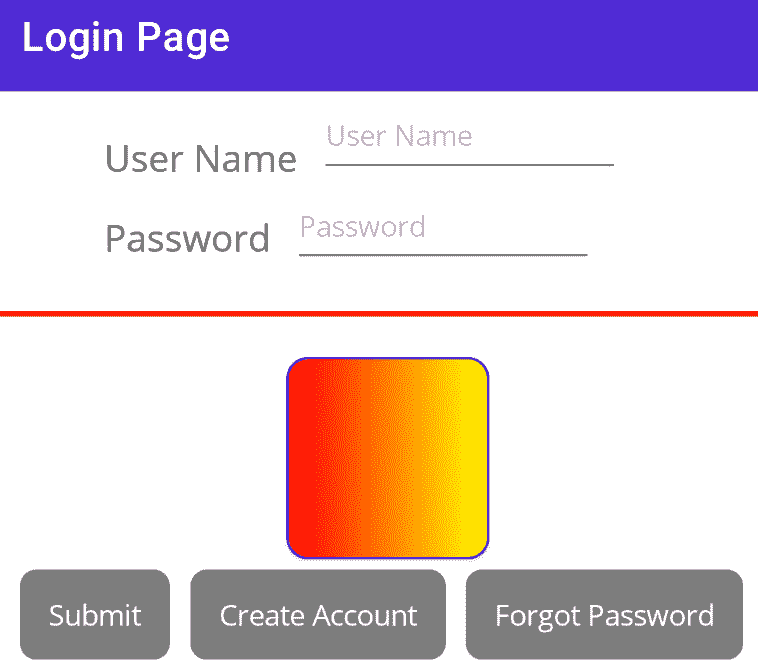

图 4.32 – LinearGradientBrush

渐变停止点

渐变停止点表示沿渐变向量的位置，范围从`0`到`1`。简而言之，这里显示的第一个渐变是渐变向量的二十分之一，第二个是十分之一。

渐变有两种类型：线性，如前一个示例所示，和径向，如以下所述。

## RadialGradientBrush

如果我们用`RadialGradientBrush`做同样的事情，我们的坐标从中心开始，默认为`0.5,0.5`，我们提供一个半径作为双精度值。默认值是`0.5`。让我们使用`RadialGradientBrush`重现之前显示的`LinearGradient`：

```cs
<Frame
    BorderColor="Blue"
    CornerRadius="10"
    HasShadow="True"
    HeightRequest="100"
    WidthRequest="100">
    <Frame.Background>
        <RadialGradientBrush>
            <GradientStop Color="Yellow" Offset="0.2" />
            <GradientStop Color="Red" Offset="0.1" />
        </RadialGradientBrush>
    </Frame.Background>
</Frame>
```

注意，我们没有指定中心或半径，因此我们使用默认值。*图 4**.33* 展示了结果：

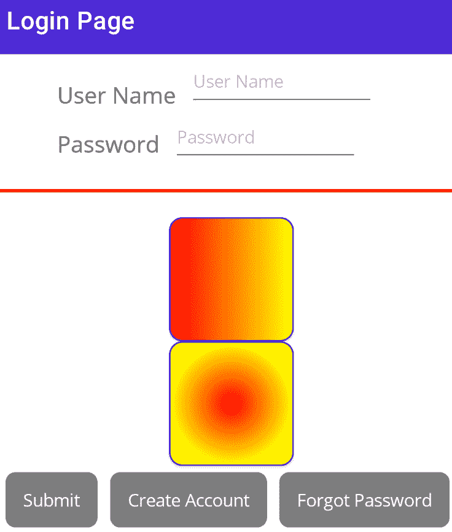

图 4.33 – RadialGradientBrush

通过这种方式，我们已经到达了非常重要的一章的结尾。

# 摘要

这是一章很长的内容，我们涵盖了众多内容，但如果您将其分解，真正的主题如下：

+   MVVM

+   `数据绑定`

+   控件

当然，控件是一个相当大的主题，我们还没有完成。在下一章中，我们将讨论布局，但我们也会讨论如何设置控件样式、动画控件等。

您 90%的时间都在使用 90%的功能

我并没有试图涵盖每个控件，也没有涵盖我们看到的控件的所有属性。那样会把这本书变成一本百科全书，我的目标是向您展示您日常使用的 90%的.NET MAUI。如果您发现您需要不同的属性或不同的控件，那么，这正是（出色的）文档的作用。只需访问[`bit.ly/Liberty-Maui`](https://bit.ly/Liberty-Maui)，或者询问谷歌或您当地的 AI 代理，您就能找到每一个角落和缝隙。

本章的主要收获是：

+   MVVM 是.NET MAUI 的基本架构。在 MVVM 中，`Model`是数据（我们尚未看到它的工作情况），`View`是 UI，`ViewModel`是所有逻辑的地方（或应该是）。我们在本章的大部分内容中打破了 MVVM，并将逻辑放在了代码-behind 文件中，但这只是为了方便，因为我们还没有讨论如何将数据放入和取出页面。

+   `数据绑定`是您将`ViewModel`连接到`View`的方式。而不是将`ViewModel`中的属性数据复制到`View`的字段中，您将这个控件绑定到属性上，当属性的值发生变化时，控件会自动更新。

+   有大量的控件可供您使用，并且每个控件都在所有支持的平台上以原生控件的形式显示：iOS、Android、Windows 和 macOS。它们被作为原生控件发出这一点非常重要。这不仅会使它们看起来正确，而且它们也会非常快。

+   您可以在 XAML 中声明的任何内容都可以在 C#中声明。

+   你可以控制每个控件的外观，使它们在每一个平台上看起来都一样——从颜色相同到看起来完全相同。这完全取决于你。这取决于你在每个控件上设置了多少属性。

# 问答

1.  MVVM 的优点是什么？

1.  你如何创建 `View` 类和 `ViewModel` 之间的连接，以便数据绑定能够工作？

1.  有哪些控件可以用于在表单中输入数据？

1.  最常见的用于显示数据的控件是什么？

1.  什么是 `SnackBar`？

# 你试试看

+   创建一个像表单一样的页面

+   提供一些提示、输入字段和按钮以接受输入

+   当用户填写字段并点击按钮时，显示一个确认吐司并在标签中显示他们的输入

+   添加一张图片，并且作为额外加分项，使图片可点击，点击时显示一个祝贺对话框和/或吐司（或者如果你有雄心，可以使用 `SnackBar`！）

+   随意混合使用额外的控件
