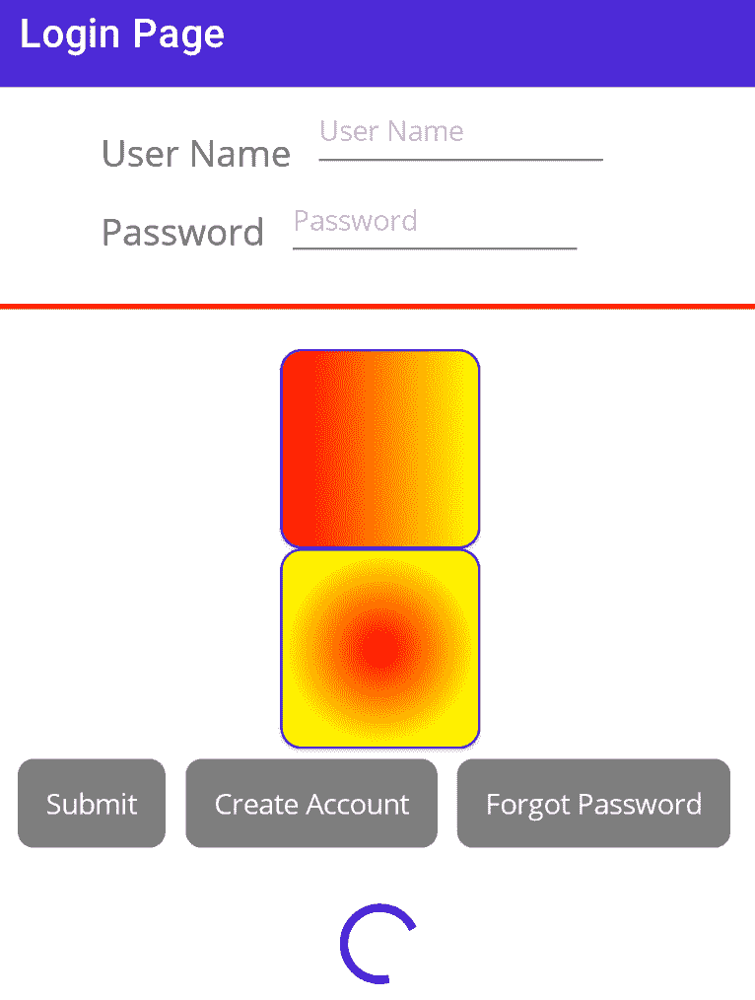
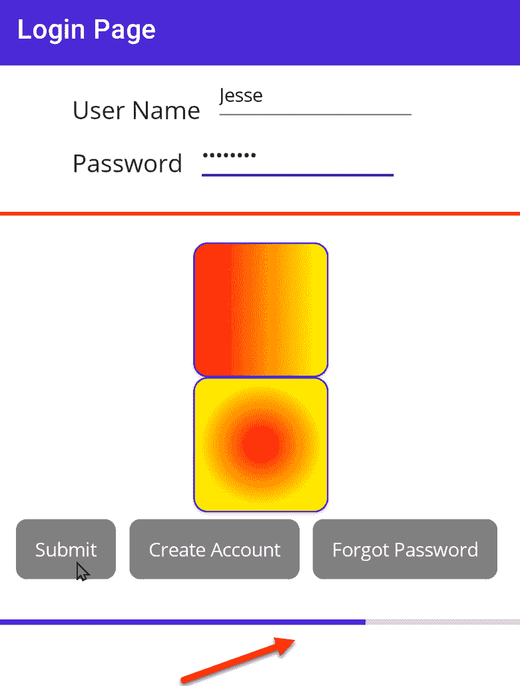
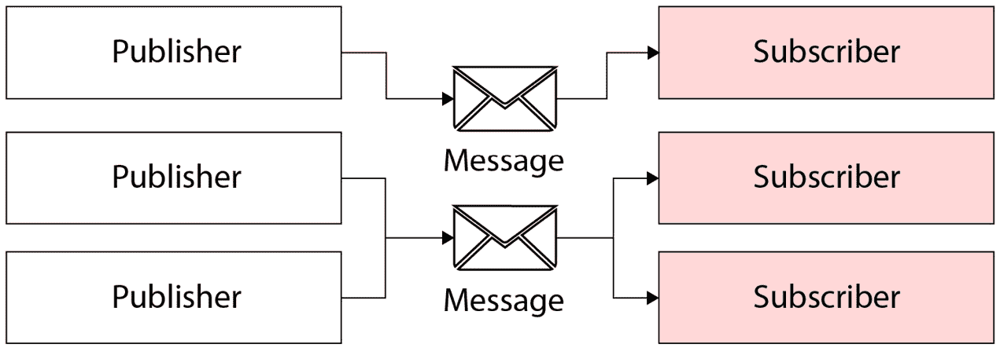
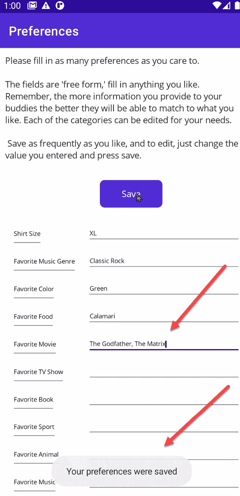
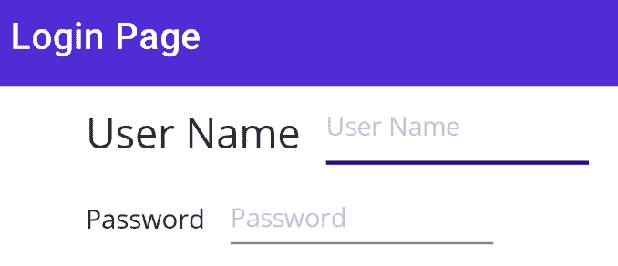

# 第五章：高级控件

在上一章中，我们探讨了多个控件及其事件和命令的处理方法。在本章中，我们将探讨使用命令和消息将逻辑移动到`ViewModel`中。然后，我们将继续介绍样式，这些样式可以让你轻松地为控件提供统一的外观。

一个良好设计的用户体验的关键特性是，当某件事需要超过一秒钟的时间时，你让用户知道应用程序正在处理中，这样就不会显得你的应用程序已经冻结。

在本章中，我们将涵盖以下主题：

+   保持用户对活动知情

+   将事件处理移动到`ViewModel`

+   发送和接收消息

+   显示集合

+   样式

# 技术要求

对于本章，你需要 Visual Studio。你可以在这里找到本章的源代码：[`github.com/PacktPublishing/.NET-MAUI-for-C-Sharp-Developers/tree/MVVMAndControls`](https://github.com/PacktPublishing/.NET-MAUI-for-C-Sharp-Developers/tree/MVVMAndControls)。如果你想继续学习，请继续你在*第四章*中正在工作的项目。

# 保持用户对活动知情

有两种方式让用户知道你的应用程序正在处理耗时操作：

+   `ActivityIndicator`

+   `ProgressBar`

`ActivityIndicator`基本上表示，“我在处理中，但不知道需要多长时间”，而`ProgressBar`表示，“我在处理中，已经完成了一半。”让我们更详细地探讨这两个控件。

## ActivityIndicator

我们首先将`ActivityIndicator`添加到登录页面中按钮下方：

```cs
<ActivityIndicator
    Color="Blue"
    IsRunning="{Binding ActivityIndicatorIsRunning}" />
```

注意，`IsRunning`属性绑定到了`ActivityIndicatorIsRunning`属性。该属性位于`LoginViewModel`中（你可能会记得我们将其设置为绑定上下文）：

```cs
[ObservableProperty] private bool activityIndicatorIsRunning   = true;
```

我将其默认值设置为`true`，因此当页面加载时活动指示器会运行。在创建账户后，让我们将其关闭：

```cs
private async void OnCreate(object sender, EventArgs e)
{
  CancellationTokenSource =
    new CancellationTokenSource();
  var message = "Your account was created";
  var dismissalText = "Click Here to Close the SnackBar";
  TimeSpan duration = TimeSpan.FromSeconds(10);
  Action  = async () =>
    await DisplayAlert(
      "Snackbar Dismissed!",
      "The user has dismissed the snackbar",
      "OK");
  var snackbarOptions = new SnackbarOptions
  {
    BackgroundColor = Colors.Red,
    TextColor = Colors.Yellow,
    ActionButtonTextColor = Colors.Black,
    CornerRadius = new CornerRadius(20),
    Font = Microsoft.Maui.Font.SystemFontOfSize(14),
    ActionButtonFont = Microsoft.Maui.Font
      .SystemFontOfSize(14)
  };
  var snackbar = Snackbar.Make(
    message,
    action,
    dismissalText,
    duration,
    snackbarOptions);
  await snackbar.Show(cancellationTokenSource.Token);
  vm.ActivityIndicatorIsRunning = false;
}
```

在创建页面代码中，除了添加最后一行之外，没有其他变化。在这里，我们进入`ViewModel`并设置`ActivityIndicatorIsRunning`属性为`false`。这应该会停止与`showActivityIndicator`属性绑定的`ActivityIndicator`。

结果看起来像*图 5.1*：



图 5.1 – ActivityIndicator

正在运行还是挂起？

注意，在某些情况下，你的程序可能会挂起，但活动指示器会继续旋转。这可能会给用户造成巨大的困惑和挫败感。避免这种问题的方法之一是设置一个计时器，如果任务在*n*秒内没有完成，你停止指示器，例如，显示一个错误对话框。当然，如果一切都已经挂起，你可能无法做到这一点，但通常，指示器也会冻结。

`ActivityIndicator` 很好，但它只告诉用户有事情在进行中，并没有说明它在任务中的进展程度。这正是 `ProgressBar` 的作用。

## ProgressBar

`ProgressBar` 将任务分成分数部分（例如，百分比）并显示已完成的部分（分数、百分比等）。我们都见过进度条：理想情况下，它们在屏幕上平滑移动；实际上，当它们跟踪的任务完成时，它们通常会断断续续地移动。

我们将创建一个进度条，但我们将模拟一个动作。也就是说，我们将根据时间而不是实际任务进度来推进条。尽管如此，`ProgressBar` 的工作原理将变得明显。

要开始，让我们在 `LoginPage.xaml` 中注释掉 `ActivityIndicator`，并用 `ProgressBar` 替换它：

```cs
<!--<ActivityIndicator
    Color="Blue"
    IsRunning="{Binding ActivityIndicatorIsRunning}" />-->
<ProgressBar
    ProgressColor="Blue"
    x:Name="LoginProgressBar" />
```

在这里，我们只声明了 `ProgressBar` 的两个属性：其颜色和名称。名称允许我们在代码背后引用该条。当然，我们通常会根据 `ViewModel` 中的数据更新 `ProgressBar`，但现在，就像我们之前做的那样，我们将在代码背后（`LoginPage.xaml.cs`）完成这项工作。

下面是当用户点击 **提交** 按钮时启动和推进进度条的代码：

```cs
private async void OnSubmit(object sender, EventArgs e)
{
  for (double i = 0.0; i < 1.0; i += 0.1)  [1]
  {
    await LoginProgressBar.ProgressTo(i, 500,
      Easing.Linear); [2]
  }
  await DisplayAlert(  [3]
    "Submit",
    $"You entered {vm.Name} and {vm.Password}",
    "OK");
}
```

[1] 我们将根据 `for` 循环中计数器变量（`i`）的值设置 `ProgressBar` 的值。`ProgressBar` 的值范围从 `0` 到 `1`，进度或分数的百分比或分数被测量为这两个数字之间的值。在这里，我们将计数器变量初始化为 `0.0`，直到它达到 `1.0` 值，我们以十分之一递增。

[2] 在 `for` 循环中，我们在 `ProgressBar` 上调用 `ProgressTo` 方法。该方法接受三个值：

1.  我们想要进展到的值

1.  到达该值所需的时间，以毫秒为单位

1.  Easing（见下一节）

[3] 当进度条完成时我们将采取的行动。

另一个相关的功能是 *Easing*，它指的是动作从开始到全速所需的速度。让我们更深入地看看这一点。

### Easing

*Easing* 指的是项目移动的模式。例如，火车不会突然从车站静止不动加速到每小时 75 英里；它会 *逐渐加速* 到最终速度。如果你绘制一个加速度图，它看起来像正弦波，而列举的两种 easing 值实际上是 `SineIn`（表示启动模式）和 `SineOut`（表示返回车站的模式）。

然而，在我们的情况下，我们希望进度条平滑且匀速移动，这正是 `easing.Linear` 所做的。

最终效果是进度条将在整个过程中进行动画。我们知道我们是以十分之一的速度从`0`移动到`1`，我们知道我们用半秒（500 毫秒）走完每十分之一；因此，我们知道从`0.0`（条上没有显示任何内容）到`1.0`（条完全填充了颜色）的整个旅程将花费五秒钟。

在`for`循环结束时，对话框将弹出，给出一个很好的模拟进度条所跟踪的任务完成情况。该进度的一个快照显示在*图 5.2*中：



](img/Figure_5.2_B19723.jpg)

图 5.2 – 进度条已完成大约 75%

为了方便和保持简单，我们一直在使用代码后端来处理事件。当然，如*第三章*中所述，使用命令而不是事件，并在`ViewModel`中处理它们是有很好的理由的。让我们看看这一点。

# 将事件处理移至 ViewModel

假设当按钮被按下时，我们想在`ViewModel`中处理这个事实，这是`ProgressBar`所偏好的。

当我们想要与`Clicked`事件交互并添加一个命令时，在`ViewModel`中处理事情会变得复杂。

```cs
<Button
    BackgroundColor="Gray"
    Command="{Binding SubmitCommand}"
    Margin="5"
    Text="Submit" />
```

我们将在`ViewModel`中创建`RelayCommand`来处理`Submit`命令：

```cs
[RelayCommand]
private async void Submit()
{
  for (var i = 0.0; i < 1.0; i += 0.1)
  {
    await LoginPage.LoginProgressBar.ProgressTo(i, 500,
      Easing.Linear); [1]
  }
  await Application.Current.MainPage.DisplayAlert(
     [2]
    "Submit",
    $"You entered {Name} and {Password}",
    "OK");
}
```

[1] 在`LoginPage`上访问`LoginProgressBar`（稍后会详细介绍如何做到这一点），并像之前看到的那样调用`ProgressTo`。

[2] 通过`Application`对象访问`MainPage`并调用`DisplayAlert`。

那么，我们如何在 UI 中访问`LoginProgressBar`呢？我们需要`LoginPage`的一个静态成员来实现这一点。我们将`LoginProgressBar`的声明从**可扩展应用程序标记语言**（**XAML**）中提取出来，并将其移动到代码后端：

```cs
public static ProgressBar LoginProgressBar;
```

我们需要确保在`LoginPage`的构造函数中初始化这一点：

```cs
public LoginPage()
{
  LoginProgressBar = new ProgressBar();
```

如果我们想在`ProgressBar`中添加它，就需要引用`StackLayout`，所以让我们按照以下方式命名：

```cs
<VerticalStackLayout x:Name="LoginStackLayout">
```

现在我们准备将`ProgressBar`添加到`StackLayout`的子元素中。这是完整的构造函数：

```cs
public LoginPage()
{
  LoginProgressBar = new ProgressBar();
  InitializeComponent();  [1]
  LoginStackLayout.Children.Add(LoginProgressBar); [2]
  BindingContext = vm;
}
```

[1] 注意到`InitializeComponent`在将`ProgressBar`添加到`StackLayout`的子元素之前调用。在调用此之前，`LoginStackLayout`将为 null。

[2] 通过在这里调用`Add`，将`LoginProgressBar`添加到 XAML 中创建的控件下面的`LoginStackLayout`。

哎？让我们一步一步来。

## 分解步骤

当你运行此程序，输入用户名和密码，然后点击**提交**时，以下是发生的事情的顺序：

1.  `ProgressBar`是在页面构造函数中添加到页面的。

1.  当你点击`SubmitCommand`时，会发送到`ViewModel`。

1.  `ViewModel`在`Submit`、`RelayCommand`中处理这一点。

1.  在`RelayCommand`中，它更新了（静态的）`LoginProgressBar`。

1.  然后它通过`MainPage`调用`DialogBox`，它通过`Application`对象可以访问。

这工作得很好，但有点繁琐。使用 `Application.Current.MainPage` 并不罕见，但我们为了访问 `ProgressBar` 而跳过的圈子是。解决这个问题的方法是使用 `Messaging`，我们将在下一节中介绍。

可见性

通常认为，`ViewModel` 不应看到视图的方面（正如这里所做的那样）。在下一个示例中，我们将隔离 VM 和视图。

# 发送和接收消息

而不是深入到 `View` 中，我们可以在 `ViewModel` 信号 `View` 何时显示对话框或其他 `View` 相关元素时。

例如，假设我们想在用户点击 `Command` 时显示 `Snackbar`（这更受欢迎，因为它将逻辑放入 `ViewModel`）。然后 `ViewModel` 可能会处理数据或执行其他任何需要做的事情，并通过发送相关消息来指示 `View` 显示 `Snackbar`。

这个想法是 `ViewModel` 发布一条消息，例如“任何订阅此消息的人，显示 `Snackbar`”，页面订阅此消息，因此在收到消息时显示 `Snackbar`。

在某些情况下，可能会有多个 **订阅者**。同样，在某些情况下，多个 **发布者** 可以发送相同的消息，如图 *5.3* 所示：



图 5.3 – 发布和订阅

消息中心

.NET MAUI 有一个内置的消息系统，但它已被弃用，转而使用 .NET Community Toolkit MVVM 中提供的 `WeakReferenceMessenger`，我们将在下一节中介绍。

## 开始使用 WeakReferenceMessenger

要设置此环境，首先创建一个将作为消息的类。你可以在 `View` 和 `ViewModel` 都能看到的任何地方创建此类。为了方便，我将它放在 `LoginPage` 类之上：

```cs
public partial class ConstructMessage {}
```

接下来，在 `LoginPage` 构造函数中，我们需要注册接收此类消息。一旦收到消息，你可能调用一个方法，或者你也可以使用 Lambda 表达式来完成这项工作。

要注册接收消息，请使用 `WeakReferenceMessenger` 的 `Register` 方法。以下是实现此目的的代码：

```cs
    WeakReferenceMessenger.Default.Register
      <ConstructMessage> (this, async ( m,e) =>
    {
             // …
     });
```

在大括号之间的是你在收到该消息时想要做的事情。我已经将我们在事件处理器中使用的事件处理代码移动到这里：

```cs
    WeakReferenceMessenger.Default.Register
      <ConstructMessage> (this, async ( m,e) =>
    {
      CancellationTokenSource =
        new CancellationTokenSource();
      var message = "Your account was created";
      var dismissalText = "Click Here to Close the
        SnackBar";
      TimeSpan duration = TimeSpan.FromSeconds(10);
      Action = async () =>
        await DisplayAlert(
          "Snackbar Dismissed!",
          message,
          "OK");
      var snackbarOptions = new SnackbarOptions
      {
        BackgroundColor = Colors.Red,
        TextColor = Colors.Yellow,
        ActionButtonTextColor = Colors.Black,
        CornerRadius = new CornerRadius(20),
        Font = Microsoft.Maui.Font.SystemFontOfSize(14),
        ActionButtonFont = Microsoft.Maui.Font
          .SystemFontOfSize(14)
      };
      var snackbar = Snackbar.Make(
        message,
        action,
        dismissalText,
        duration,
        snackbarOptions);
      await snackbar.Show(cancellationTokenSource.Token);
      vm.ActivityIndicatorIsRunning = false;
    });
```

现在，我们只需要修改 `LoginPage.xaml`，以便 `ViewModel` 而不是代码背后的事件处理器：

```cs
<Button
    BackgroundColor="Gray"
    Command="{Binding CreateCommand}"
    Margin="5"
    Text="Create Account" />
```

这将在 `ViewModel` 中调用创建中继方法

```cs
[RelayCommand]
private void Create()
{
  WeakReferenceMessenger.Default.Send(new CreateMessage());
}
```

`ViewModel` 调用 `Send` 方法，发送 `ConstructMessage` 实例作为信号给任何已注册的监听器采取某些行动。在发送该消息之前，`Create` 方法可能执行其他最好在 `ViewModel` 而不是代码背后完成的工作。

当我们需要的逻辑在 `ViewModel` 中执行的动作只能由 `View` 执行时，这是一种更干净的解耦 `ViewModel` 和 `View` 的方式。

`WeakReferenceMessenger` 也可以用来在 `ViewModel` 之间进行通信。

最后，它被称为 `WeakReferenceMessenger`，以区别于 `StrongReferenceMessenger`。`WeakReferenceMessenger` 的优势，以及它通常被选择的原因，是它管理自己的内存和清理，因此你不需要。

# 在 C# 中创建页面

在继续之前，为了强调在 XAML 中能做的事情在 C# 中也能做，这里展示了我们将要在 Forget Me Not (ForgetMeNotDemo) 中使用的 `LoginPage` 版本，该版本是用 C# 编写的（在仓库中，这个页面被称为 `LoginCS`）：

```cs
using CommunityToolkit.Maui.Markup;
using static CommunityToolkit.Maui.Markup.GridRowsColumns;
namespace ForgetMeNot.View
{
    class LoginCS : ContentPage
    {
        public LoginCS(LoginViewModel viewModel)  [1]
        {
            BindingContext = viewModel;
            var activity = new ActivityIndicator() [2]
            {
                HeightRequest = 50,
                Color = Color.FromRgb(0, 0, 0xF),
            };
            activity.IsEnabled = viewModel
              .ShowActivityIndicator; [3]
            Content = new VerticalStackLayout()
            {
                Children = [4]
                {
                    activity,
                    new Grid()  [5]
                    {
                        RowDefinitions = GridRowsColumns
                          .Rows.Define(
                            (Row.Username,Auto),
                            (Row.Password,Auto),
                            (Row.Buttons, Auto)
                            ),
                        ColumnDefinitions = GridRowsColumns
                          .Columns.Define(
                            (Column.Submit,Star),
                            (Column.Create, Star),
                            (Column.Forgot, Star)
                            ),
                        Children =
                        {
                            new Label()
                                .Text("User name")
                                .Row(Row.Username)
                                   .Column(0), [6]
                            new Entry()
                                .Placeholder("User name")
                                .Bind(Entry.TextProperty,
                                   nameof(LoginViewModel
                                     .LoginName))
                                .Row(Row.Username)
                                  .Column(1)
                                .ColumnSpan(2),
                            new Label()
                                .Text("Password")
                                .Row(Row.Password)
                                  .Column(0),
                            new Entry {IsPassword = true}
                                .Placeholder("Password")
                                .Bind(Entry.TextProperty,
                                 nameof(LoginViewModel
                                 .Password))
                                .Row(Row.Password)
                                  .Column(1)
                                .ColumnSpan(2),
                            new Button()
                                .Text("Submit")
                                .Row(Row.Buttons)
                                  .Column(Column.Submit)
                                .BindCommand(nameof
                                  (LoginViewModel
                                    .DoLoginCommand)),
                            new Button()
                                .Text("Create Account")
                                .Row(Row.Buttons)
                                  .Column(Column.Create)
                                .BindCommand(nameof
                                  (LoginViewModel
                                 .DoCreateAccountCommand)),
                            new Button()
                                .Text("Forgot Password")
                                .Row(Row.Buttons)
                                   .Column(Column.Forgot)
                                .BindCommand(nameof
                                (LoginViewModel
                                .ForgotPasswordCommand))
                        }
                    }
                }
            };
        }
    }
    enum Row
    {
        Username,
        Password,
        Buttons
    }
    enum Column
    {
        Submit,
        Create,
        Forgot
    }
}
```

[1] 我们首先声明一个类并给它 `LoginViewModel`。这是通过 *依赖注入* 实现的，这个主题在 *第九章* 中有详细讲解。

[2] `ActivityIndicator` 被实例化；它稍后将被添加到页面中。

[3] `ActivityIndicator` 的 `IsEnabled` 属性绑定到 `ViewModel` 中的一个属性。

[4] 我们通过向其 `Children` 集合中添加内容来添加到 `StackLayout`。

[5] 我们还没有介绍 `Grid`，但你可以看到它是一个具有行和列的布局。我们将在下一章更深入地探讨它。

[6] 在 `Grid` 中，每个单独的行和列都可以从 `枚举` 中获得一个名称，或者可以通过其零基索引来引用。

本节的关键要点是，你当然可以在 C# 中创建所有控件及其命令和属性，就像在 XAML 中一样。我将继续深入 C#，但恐怕这会让你疯狂，因为我要在两者中展示每种类型，所以再次强调，对于布局和控制，我们将主要关注 XAML – 这是 .NET MAUI 的标准方法。

# 显示集合

通常会有一个数据集合，并且希望将其以列表的形式显示出来，使用户能够选择一个或多个项目，然后对这些项目进行一些操作。在 .NET MAUI 中有几种方法可以做到这一点，但最常见（也是最好的）方法是使用 `CollectionView`。

要查看其工作情况，请检查 `Preferences.xaml` 以及其代码背后的 `Preferences.xaml.cs` 和 `ViewModel`，`PreferencesViewModel.cs`。在我们构建 Forget Me Not 的过程中，我们将广泛使用这个页面，但让我们先慢慢来。

我们的目标是创建一个包含用户偏好的列表（如衬衫尺寸、音乐类型等）。为此，我们将使用 `CollectionView`，当然，我们还需要一个可以查看的集合。完成后的页面将看起来像这样：

![图 5.4 – 偏好页面

![img/Figure_5.4_B19723.jpg]

图 5.4 – 偏好页面

而不是每行都是一个独特的对象，我们将创建一个可以重复显示的类型。在 `Model` 文件夹中创建一个 `Preference` 类：

```cs
namespace ForgetMeNotDemo.Model;
[ObservableObject]
public partial class Preference
{
    [ObservableProperty] private string preferencePrompt;
    [ObservableProperty] private string preferenceValue;
}
```

部分类

在 .NET MAUI 中，几乎所有类都是 *部分类* 以支持社区工具包的代码。

`Preference` 只有两个属性，都是字符串。`PreferencePrompt` 字符串将保存页面左侧的文本，而 `PreferenceValue` 字符串将保存用户在右侧的偏好。

我们首先需要的是这些 `Preference` 对象的集合。为了得到这个集合，我们将构建一个 `Service`，其最终任务是与 API 交互并获取我们的 `Preference` 对象列表。执行以下步骤：

1.  创建一个名为 `Services` 的新文件夹。

1.  在 `Services` 中创建一个 `PreferenceService` 类。

1.  在该文件中添加一个 `GetPreferences` 方法。

这里是代码：

```cs
public class PreferenceService
{
  public async Task<List<Preference>> GetPreferences()
  {
    return await GetPreferencesMock();
  }
  private async Task<List<Preference>> GetPreferencesMock(
  {
    return null;
  }
}
```

`ViewModel` 将在服务上调用 `GetPreferences` 并返回一个 `Preference` 对象的列表。我们稍后会讨论 `PreferenceService` 如何获取这些对象。

在 `PreferencesViewModel` 中，执行以下操作：

```cs
[ObservableObject]
public partial class PreferencesViewModel
{
  [ObservableProperty] private List<Preference>
    preferences;
  private readonly PreferenceService service; [1]
  public PreferencesViewModel()
  {
    service = new(); [2]
  }
  public async Task Init()
  {
    Preferences = await service.GetPreferences(); [3]
  }
}
```

[1] 声明一个 `PreferenceService` 的实例

[2] 在构造函数中初始化它

[3] 在 `Init` 方法中，用从服务返回的内容填充 `Preferences` 集合

依赖注入

在 *第九章* 中，我们将回顾依赖注入。那时，我们将传递一个 `PreferenceService` 接口，并让控制反转容器为我们提供服务。如果你觉得这不太明白，没问题；所有这些都会在第九章中变得清晰。*第九章*。

那么，谁实例化了 `ViewModel` 并调用 `Init`？为了回答这个问题，我们转向 `PreferencesPage` 类的代码背后：

```cs
public partial class PreferencesPage : ContentPage
{
  private PreferencesViewModel vm;
  public Preferences()
  {
    vm = new PreferencesViewModel();
    BindingContext = vm;
    InitializeComponent();
 }
  protected override async void OnAppearing()
  {
    base.OnAppearing();
    await vm.Init();
  }
```

将 ViewModel 命名为 vm

我不太喜欢在代码中使用缩写，通常会为 `ViewModel` 的本地实例命名。但使用 *vm* 在 .NET MAUI（追溯到 `Xamarin.Forms`）中是一个惯例，所以我放纵自己。

在 .NET MAUI 中，你通常会想要控制的两个生命周期事件是页面首次显示时（`OnAppearing`）和页面关闭时（`OnDisappearing`）。让我们接下来探讨这个问题。

## 重写 OnAppearing

每次页面出现时，它的 `OnAppearing` 方法都会被调用。我们重写这个方法，以便调用 `vm.Init()`。我们这样做是因为 `Init` 是异步的，虽然我们可以使用 `async` 关键字使 `OnAppearing` 异步，但我们不能在构造函数中这样做。

`OnInit()`，反过来，在服务上调用 `GetPreferences` 并返回一个 `Preference` 对象的集合。

## 理解服务的工作原理

逐渐地，我们的 `PreferenceService` 的 `GetPreferences` 方法将调用我们的 API 来获取数据库中的偏好设置列表，这些列表将存储在云端。目前，它将调用 `GetPreferencesMock`，这将手工制作列表并返回给我们。

这里是文件的一个摘录：

```cs
public class PreferenceService
{
  public async Task<List<Preference>> GetPreferences()
  {
    return await GetPreferencesMock();
  }
  private async Task<List<Preference>> GetPreferencesMock()
  {
    List<Preference> preferences = new()
    {
      new Preference()
      {
        PreferencePrompt = "Shirt Size",
        PreferenceValue = ""
      },
      new Preference()
      {
        PreferencePrompt = "Favorite Music Genre",
        PreferenceValue = ""
      },
      new Preference()
      {
        PreferencePrompt = "Favorite Color",
        PreferenceValue = ""
      },
      new Preference()
      {
        PreferencePrompt = "Favorite Food",
        PreferenceValue = ""
      },
      new Preference()
      {
        PreferencePrompt = "Favorite Movie",
        PreferenceValue = ""
      },
//…
    };
    return preferences;
  }
}
```

结果是一个 `Preference` 对象的集合。让我们看看如何显示这个集合。

## 显示偏好设置对象的集合

现在我们已经在 `ViewModel` 中有一个 `Preference` 对象的集合，我们可以创建我们的页面：

```cs
<?xml version="1.0" encoding="utf-8" ?>
<ContentPage xmlns="http://schemas.microsoft.com/
  dotnet/2021/maui"
             xmlns:x="http://schemas.microsoft.com/
                winfx/2009/xaml"
             x:Class="ForgetMeNotDemo.View.PreferencesPage"
             Title="Preferences">
    <ScrollView>
        <VerticalStackLayout>
            <Label
                Margin="5"
                Padding="5"
                HorizontalOptions="Center"
                LineBreakMode="WordWrap"  [1]
                Text="Please fill in as many preferences as
                you care to. &#10; &#10;The fields are
                'free form,' fill in anything you like.
                Remember, the more information you provide
                to your buddies the better they will be
                able to match to what you like. Each of the
                categories can be edited for your
                needs.&#10; &#10; Save as frequently as you
                like, and to edit, just change the value
                you entered and press save." />
            <Button
                Margin="30,20,0,0"
                Clicked="SavePreferences"   [2]
                Command="{Binding SavePreferencesCommand}"
                 [3]
                Text="Save" />
            <CollectionView
                Margin="20,20,10,10"
                ItemsSource="{Binding Preferences}" [4]
                SelectionMode="None">       [5]
                <CollectionView.ItemTemplate>  [6]
                    <DataTemplate>
                        <Grid ColumnDefinitions="*,2*">
                            <Entry  [7]
                                Grid.Column="0"
                                FontSize="10"
                                HorizontalOptions="Start"
                                HorizontalTextAlignment=
                                  "Start"
                                Text="{Binding
                                PreferencePrompt,
                                   Mode=TwoWay}" [8]
                                TextColor="{OnPlatform
                                  Black,  [9]
                                  iOS=White}" />
                            <Entry
                                Grid.Column="1"
                                FontSize="10"
                                HeightRequest="32"
                                HorizontalOptions="Start"
                                HorizontalTextAlignment=
                                  "Start"
                                Text="{Binding
                                 PreferenceValue,
                                   Mode=TwoWay}"
                                TextColor="{OnPlatform
                                   Black,
                                     iOS=White}"
                                WidthRequest="350" />
                        </Grid>
                    </DataTemplate>
                </CollectionView.ItemTemplate>
            </CollectionView>
            <Button
                Margin="30,20,0,0"
                Clicked="SavePreferences"
                Command="{Binding SavePreferencesCommand}"
                Text="Save" />
        </VerticalStackLayout>
    </ScrollView>
</ContentPage>
```

在这个列表中有很多内容可以查看。让我们逐个来看：

[1] `Label` 有多行；我们之前见过。我们将 `LineBreakMode` 设置为 `WordWrap` 以在单词之间断行。注意使用 `&#10;`，它强制换行。

[2] **保存**按钮非常不寻常，因为它不仅有点击事件处理器，还有一个命令！点击事件处理器将处理显示提示。

[3] 命令将在 `ViewModel` 中处理，并将调用服务中的 `Save` 方法（我们暂时不会实现）。

[4] `ItemsSource` 属性指向 `CollectionView` 将显示的集合。在我们的例子中，那就是 `ViewModel` 中的 `Preferences` 集合。

[5] `SelectionMode` 设置为 `None`，因为我们不会在这个显示中选择项。我们将编辑项，然后按 **保存** 按钮保存更改。

[6] 项模板表示，“这是我想让你逐个显示集合中每个项的方式。”

[7] 有趣的是，我们正在使用 `Entry` 作为提示。这允许用户更改提示，这正是我们想要的。我们无法预测每个类别，所以我们创建了许多，但我们允许用户根据需要调整列表。

[8] 我们不仅会显示数据库中的提示值，还希望将用户输入的内容写回。因此，我们将文本标记为双向（即数据 > 视图和视图 > 数据）

[9] 我们之前没有见过 `onPlatform`。这表示，“除了在这个平台上使用这个其他值之外，始终使用这个值。”在这里，我们说的是文本颜色是 `Black`，但在 `Ios` 上是 `White`。

## 代码后置

你会记得，我们不仅处理了 `ViewModel` 中的命令，还在代码后置中处理了 `Clicked` 事件。以下是 `PreferencesPage.xaml.cs` 的其余部分：

```cs
    public void SavePreferences(object sender, EventArgs e)
    {
        ShowToast();
    }
    private async Task ShowToast()
    {
        var cancellationTokenSource = new
           CancellationTokenSource();
        var message = "Your preferences were saved";
        ToastDuration duration = ToastDuration.Short;
        var fontSize = 14;
        var toast = Toast.Make(message, duration,
          fontSize);
        await toast.Show(cancellationTokenSource.Token);
    }
```

事件处理器只是调用 `ShowToast` 方法，然后按照前面描述的方式执行。

这样，当保存偏好列表时，提示框会通知用户一切顺利。

一切都顺利吗？

在显示的代码中，我们只是假设一切顺利。为了正确地做到这一点，我们希望 `ViewModel` 等待 API 确认操作成功完成，然后它会向代码后置发送消息，然后，只有然后，才会显示提示框。

在我们继续之前，打开 `AppShell.xaml` 并按照以下方式更改启动方式：

```cs
    <ShellContent
        Title="Home"
        ContentTemplate="{DataTemplate
          view1:PreferencesPage}"
        Route="PreferencesPage" />
```

一旦我们到达 *第七章*，我们就可以停止这种无聊的事情，直接导航到我们想要的页面。

所有这些的效果都在 *图 5.5* 中展示：



图 5.5 – 预设页面

在 *图 5.5* 中有一些需要注意的快速事项。左侧的字段已被下划线标注，表示它们是输入对象，而不是标签，因此可以修改。顶部的箭头指向字段是自由形式的，用户可以输入任何他们想要的内容，底部的箭头指向提示框。

到目前为止，我们一直在设置我们 UI 控件的众多属性。我们经常不得不在相同类型控制的各种实例上重复相同的属性。有更好的方法：样式，我们将在下一节中介绍。

# 样式

**样式**允许您通过将所有细节放在一个地方，为您的控件提供统一的外观。

您为控件类型（例如，`Button`）创建一个样式，并将该样式应用于该类型的所有控件（参见图**5.6**）。您还可以基于现有样式创建样式，扩展或修改原始样式。

样式可以存储在使用控件的页面上，或者可以存储在应用程序级别。在两种情况下，它们都在`ResourceDictionary`内部创建，通常在文件顶部声明。要使它们在应用程序级别可用，只需将它们放在`App.xaml`中。

样式的放置位置

如果您只打算在单个页面的对象上使用样式，那么将样式放在该页的资源中是有意义的。如果您想能够在多个页面上重用这些样式，那么您将希望它们在`App.xaml`中。

例如，让我们回到`ResourceDictionary`和我们的第一个样式。将此代码放在文件的顶部，紧接在`ContentPage`元素下方：

```cs
    <ContentPage.Resources>
        <Style TargetType="Label">
            <Setter Property="FontSize" Value="Medium"/>
            <Setter Property="HorizontalOptions"
               Value="Start"/>
            <Setter Property="Margin" Value="10"/>
            <Setter Property="VerticalOptions"
               Value="Center"/>
            <Setter Property="VerticalTextAlignment"
              Value="Center"/>
        </Style>
    </ContentPage.Resources>
```

您可以看到，我们已经为页面上的标签创建了一个样式。在这个样式中，我们设置了一系列属性及其值。这将应用于每个`Label`，因为这是一个隐式样式，如以下所述。

样式使用的关键是它们极大地简化了它们所应用的控件。例如，标签现在看起来是这样的：

```cs
<Label
    Text="User Name" />
```

它们不再被所有集中存储在`ResourceDictionary`中的样式信息所杂乱。这不仅使 XAML 更干净，而且如果您以后决定更改这些值之一，您只需在一个地方进行更改，而不是在整个页面上。因此，适用于 C#（不要重复自己）的相同清洁代码指南也适用于样式。

样式有两种类型：隐式和显式。`TargetType`，如我们之前所看到的。**显式样式**可以单独应用于控件。让我们接下来更详细地探讨这一点。

## 显式样式与隐式样式

要使样式显式，您给它一个键，如下所示：

```cs
<Style TargetType="Label" x:Key="LargeLabel">
    <Setter Property="FontSize" Value="Large" />
    <Setter Property="HorizontalOptions" Value="Start" />
    <Setter Property="Margin" Value="10" />
    <Setter Property="VerticalOptions" Value="Center" />
    <Setter Property="VerticalTextAlignment" Value="Center"
      />
</Style>
<Style TargetType="Label" x:Key="SmallLabel">
    <Setter Property="FontSize" Value="Small" />
    <Setter Property="HorizontalOptions" Value="Start" />
    <Setter Property="Margin" Value="10" />
    <Setter Property="VerticalOptions" Value="Center" />
    <Setter Property="VerticalTextAlignment" Value="Center"
      />
</Style>
```

您现在可以根据该键选择要应用于`Label`的这些样式中的哪一个：

```cs
<Label
    Text="User Name"
    Style="{StaticResource LargeLabel}"/>
<Label
    Text="Password"
    Style="{StaticResource SmallLabel}"/>
```

结果如**图 5.6**所示：



图 5.6 – 应用显式样式

覆盖控件中的样式

如果您有一个要在所有（例如）标签上使用的样式，但有一个`Label`需要一两个不同的属性，一种处理方法是在该`Label`中进行更改。直接分配给控件的属性会覆盖样式的属性。另一方面，如果您有一组需要几乎相同属性但以某种方式不同的控件，那么您想要使用样式继承，这将在下一部分介绍。

## 样式继承或 BasedOn

`LargeLabel` 和 `SmallLabel` 的结构有很多重复。你可以重构它以使用基础样式，然后在你的显式样式中添加更改。以下是一个示例：

```cs
<Style TargetType="Label">  [1]
    <Setter Property="FontSize" Value="Medium" />
    <Setter Property="HorizontalOptions" Value="Start" />
    <Setter Property="Margin" Value="10" />
    <Setter Property="VerticalOptions" Value="Center" />
    <Setter Property="VerticalTextAlignment"
      Value="Center" />
</Style>
<Style TargetType="Label" x:Key="BaseExplicitLabel"> [2]
    <Setter Property="FontSize" Value="Medium" />
    <Setter Property="HorizontalOptions" Value="Start" />
    <Setter Property="Margin" Value="10" />
    <Setter Property="VerticalOptions" Value="Center" />
    <Setter Property="VerticalTextAlignment"
      Value="Center" />
</Style>
<Style
    TargetType="Label"
    x:Key="LargeLabel"
    BasedOn="{StaticResource BaseExplicitLabel}"> [3]
    <Setter Property="FontSize" Value="Large" />
</Style>
<Style
    TargetType="Label"
    x:Key="SmallLabel"
    BasedOn="{StaticResource BaseExplicitLabel}">
    <Setter Property="FontSize" Value="Small" />
</Style>
            <Label
                Style="{StaticResource LargeLabel}" [4]
                Text="User Name" />
```

[1] 一个隐式标签样式

[2] 创建为其他样式提供基础样式的样式

[3] 使用基础样式属性的派生样式

[4] 使用派生样式

派生样式

注意，派生样式可以添加新属性（如这里所做的那样），它们可以覆盖基础样式中的值，或者两者都可以。还要注意，我们重构了样式，但不需要重构使用它的 `Label`。

# 摘要

在本章中，我们深入探讨了 .NET MAUI 控件的一些更高级的方面。我们研究了 `Activity` 元素以及 `ProgressBar`。然后我们继续探讨将命令处理移动到 `ViewModel` 并使用消息在 `ViewModel` 和 `View` 之间进行通信。

我们通过查看样式以及它们如何被用来提供统一的 UI 外观，以及我们如何通过使用样式继承（`BasedOn`）从相似样式中重构重复内容来结束本章。

在下一章中，我们将探讨如何在页面上布局 `controls`，超越我们迄今为止所使用的简单 `StackLayouts`。

# 测验

1.  `ActivityIndicator` 和 `ProgressBar` 之间的区别是什么？

1.  事件和命令之间的区别是什么？

1.  `WeakReferenceManager` 是什么？

1.  为什么你会使用样式？

1.  你如何重构样式中的常见属性？

# 你试试看

创建一个小表单，假装收集用户信息以创建个人资料（姓名、年龄、地址等）。添加一个可点击的图片和两个按钮：一个用于接受输入的信息，另一个用于取消。

如果用户点击图片，弹出一个带有消息的对话框，但本身在 `ViewModel` 中处理点击。

在 `ViewModel` 中处理按钮点击。点击 `Snackbar` 显示他们保存的信息，格式良好。
