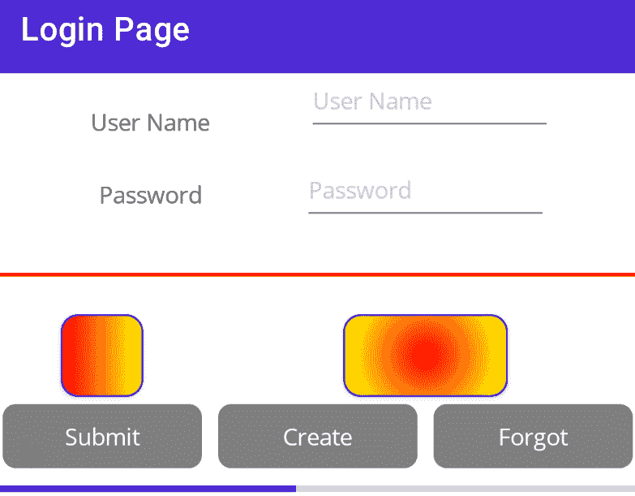
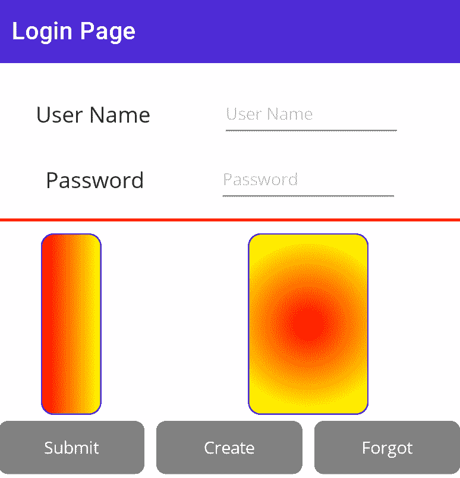
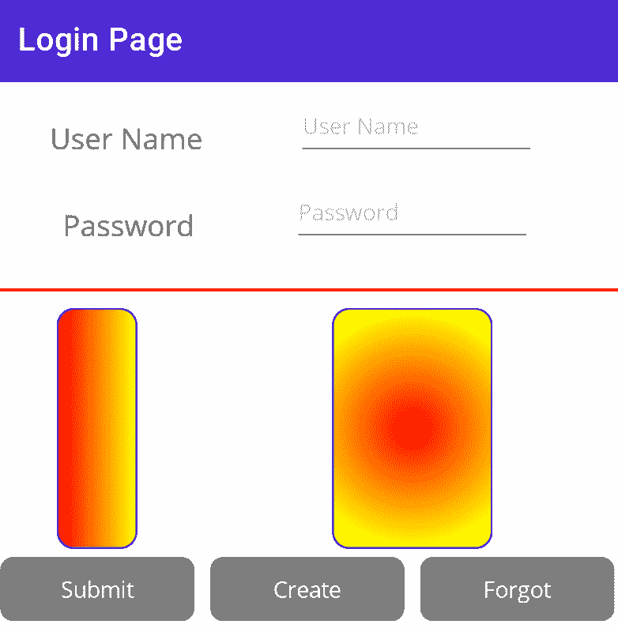
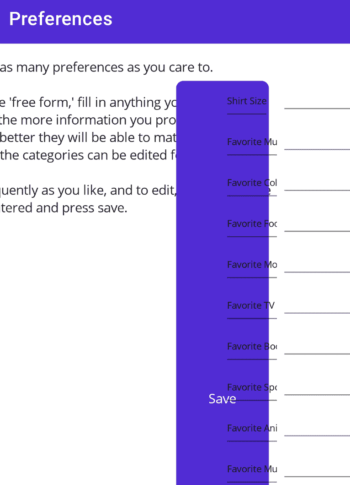
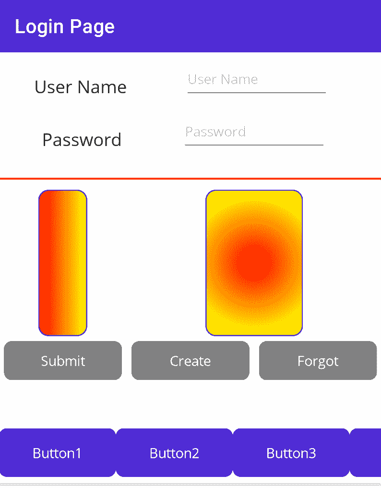
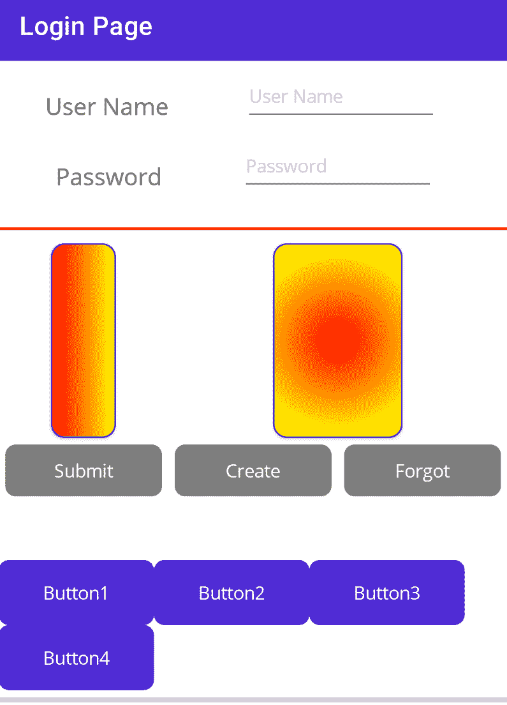
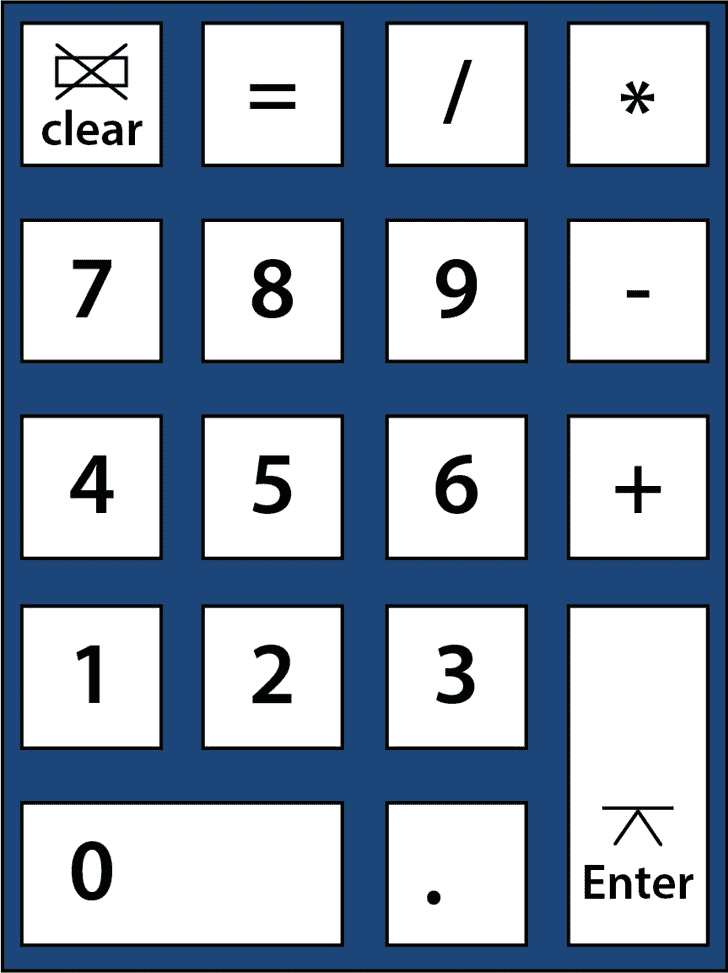

# 第六章：布局

在前两章中，我们探讨了控件——请求和显示数据的组件——但控件需要在页面上进行定位，这个过程称为布局。布局是丑陋的应用程序与专业外观应用程序之间的区别。

您有几种布局控件可供选择，我们将在本章中介绍：

+   垂直和水平堆叠布局

+   `Grid`

+   滚动

+   弹性布局

我不是设计师

为了使页面看起来专业，设计师必须与开发者合作，不仅要指定控件的位置，还要指定字体大小、字体、边距等。我不是设计师，我们创建的页面仅用于说明目的；它们不会很漂亮。

# 技术要求

本章的源代码可以在 GitHub 仓库的此分支下找到：[`github.com/PacktPublishing/.NET-MAUI-for-C-Sharp-Developers/tree/Layouts`](https://github.com/PacktPublishing/.NET-MAUI-for-C-Sharp-Developers/tree/Layouts)

# 堆叠布局

堆叠布局允许您将一个控件堆叠在另一个控件上方或并排放置。它们有三种类型：

+   `StackLayout`

+   `VerticalStackLayout`

+   `HorizontalStackLayout`

这些中的第一个是为了与 `Xamarin.Forms` 兼容而设计的，实际上已被弃用；其他两个则性能更佳。

我们已经看到了 `VerticalStackLayout` 和 `HorizontalStackLayout` 的应用。正如其名称所示，`VerticalStackLayout` 将一个控件放置在另一个控件的上方，而 `HorizontalStackLayout` 则将它们并排放置。使用 `margins`（对象之间的空间）和 `padding`（对象周围的空间），您只需使用这些控件就能调整出一个不错的布局：

```cs
<VerticalStackLayout x:Name="LoginStackLayout">
    <HorizontalStackLayout WidthRequest="300">
        <Label
            Style="{StaticResource LargeLabel}"
            Text="User Name" />
        <Entry
            HorizontalOptions="End"
            Placeholder="User Name"
            Text="{Binding Name}"
            WidthRequest="150" />
    </HorizontalStackLayout>
    <HorizontalStackLayout WidthRequest="300">
        <Label
            Style="{StaticResource SmallLabel}"
            Text="Password" />
        <Entry
            HorizontalOptions="End"
            IsPassword="True"
            Placeholder="Password"
            Text="{Binding Password}"
            WidthRequest="150" />
    </HorizontalStackLayout>
    <BoxView
        Color="Red"
        HeightRequest="2"
        Margin="0,20"
        WidthRequest="400" />
```

在这里，在 `LoginPage` 页面上，我们从一个 `VerticalStackLayout` 对象开始，它将包含其下直到关闭 `</VerticalStackLayout>` 标签的所有内容。紧接着，我们声明一个 `HorizontalStackLayout` 对象，它包含一个 `Label`（作为提示）和一个 `Entry`（收集用户的名字）。

在 `HorizontalStackLayout` 下方是一个第二个 `HorizontalStackLayout`，再下方是一个 `BoxView`。简而言之，`VerticalStackLayout` 继续将视图堆叠在彼此的上方。

虽然这对于一个非常简单的布局来说很好，但它有其局限性。在复杂布局中使用 `VerticalStackLayout` 和 `HorizontalStackLayout` 不会持续太久就会变得困难。

进入所有布局中最强大的布局：`Grid`。

# 网格

对于灵活性来说，没有哪种布局能与 `Grid` 相提并论，尽管其基本用法非常简单。网格由行和列组成。您定义每个的大小，然后填充生成的框。

默认情况下，所有列的宽度都相同，所有行的长度都相同。行和列（默认情况下）通过从列 0、行 0 开始的偏移量进行标识。您可以省略 0（它是默认值），但我建议不要这样做以提高可读性。（这也是为什么我用 `private` 关键字标记私有方法和类的原因。）

我们可以使用`Grid`重新创建`LoginPage`页面。让我们看看第一次近似的全貌（我已经省略了资源部分，因为它没有变化）：

```cs
<?xml version="1.0" encoding="utf-8" ?>
<ContentPage
    Title="Login Page"
    x:Class="ForgetMeNotDemo.View.LoginPage"
    xmlns="http://schemas.microsoft.com/dotnet/2021/maui"
    xmlns:behaviors="http://schemas.microsoft.com/dotnet
     /2022/maui/toolkit"
    xmlns:x="http://schemas.microsoft.com/winfx/2009/xaml">
    <VerticalStackLayout x:Name="LoginStackLayout">   [1]
        <Grid  [2]
            ColumnDefinitions="*,*,*"  [3]
            RowDefinitions="*,*,*,*,*"  [4]
            x:Name="LoginGrid">
            <Label
                Grid.Column="0"  [5]
                Grid.Row="0"  [6]
                HorizontalOptions="End" [7]
                Margin="5,20,0,10"
                Text="User Name"
                VerticalOptions="Center" [8] />
            <Entry
                Grid.Column="1"
                Grid.ColumnSpan="2" [9]
                Grid.Row="0"
                HorizontalOptions="Center"
                Margin="5,20,0,10"
                Placeholder="User Name"
                Text="{Binding Name}"
                VerticalOptions="End"
                WidthRequest="150" />
            <Label                     [10]
                Grid.Column="0"
                Grid.Row="1"
                HorizontalOptions="End"
                Margin="5,10"
                Text="Password"
                VerticalOptions="Center" />
            <Entry
                Grid.Column="1"
                Grid.ColumnSpan="2"
                Grid.Row="1"
                HorizontalOptions="Center"
                IsPassword="True"
                Placeholder="Password"
                Text="{Binding Password}"
                VerticalOptions="Start"
                WidthRequest="150" />
            <BoxView
                Color="Red"
                Grid.Column="0"
                Grid.ColumnSpan="3" [11]
                Grid.Row="2"
                HeightRequest="2"
                Margin="0,10"
                WidthRequest="400" />
```

接下来要添加的是框架：

```cs
            <Frame
                BorderColor="Blue"
                CornerRadius="10"
                Grid.Column="0"
                Grid.Row="3"
                HasShadow="True"
                HeightRequest="50"
                WidthRequest="50">
                <Frame.Background>
                    <LinearGradientBrush EndPoint="1,0">
                        <GradientStop Color="Yellow" Offset="0.2" />
                        <GradientStop Color="Red"
                            Offset="0.1" />
                    </LinearGradientBrush>
                </Frame.Background>
            </Frame>
            <Frame
                BorderColor="Blue"
                CornerRadius="10"
                Grid.Column="1"
                Grid.ColumnSpan="2"
                Grid.Row="3"
                HasShadow="True"
                HeightRequest="50"
                WidthRequest="100">
                <Frame.Background>
                    <RadialGradientBrush>
                        <GradientStop Color="Yellow"
                            Offset="0.2" />
                        <GradientStop Color="Red"
                            Offset="0.1" />
                    </RadialGradientBrush>
                </Frame.Background>
            </Frame>
```

在设置好这些之后，我们可以添加三个按钮，然后关闭`Grid`和`VerticalStackLayout`：

```cs
            <Button
                BackgroundColor="Gray"
                Command="{Binding SubmitCommand}"
                Grid.Column="0"
                Grid.Row="4"
                Margin="5"
                Text="Submit" />
            <Button
                BackgroundColor="Gray"
                Command="{Binding CreateCommand}"
                Grid.Column="1"
                Grid.Row="4"
                Margin="5"
                Text="Create Account" />
            <Button
                BackgroundColor="Gray"
                Clicked="OnForgotPassword"
                Grid.Column="2"
                Grid.Row="4"
                Margin="5"
                Text="Forgot Password" />
            <Label
                Grid.Column="0"
                Grid.ColumnSpan="3"
                Grid.Row="5"
                Text="
                x:Name="CreateAccount" />
        </Grid>
    </VerticalStackLayout>
</ContentPage>
```

[1] 我们将`Grid`放入`VerticalStackLayout`中，这样我们就可以在网格下方添加`ProgressBar`（将其添加到`VerticalStackLayout`的`Children`集合中，该集合将只有两个成员：`Grid`和`ProgressBar`）。

[2] 我们使用关键字声明`Grid`。

[3] 我们声明了三个大小相等的列（`*,*,*`）。

“有些星星在远处” – 马克·吐温博士

当星星大小相同时，它们的影响不大，但如果我们，例如，想让第一个星星是其他星星的两倍大，我们会写如下：

`ColumnDefinitions="2*,*,*"`

在这种情况下，列将被分为四个相等的部分，第一列将获得其中两个，其他列各一个。结果是第一列的宽度是其他列的两倍。

[4] 类似地，我们声明了五个大小相等的行。

[5] 我们将标签放置在列 0 中。

[6] 我们将标签放置在行 0 中。

[7] 水平选项是相对于控件所在的列而言的。

[8] 垂直选项是相对于控件所在的行而言的。

[9] 一个控件可以跨越多个列。在这种情况下，条目从列 1 开始，跨越 2 列（即它占据了列 1 和 2）。

[10] 注意，我们不需要`HorizontalStackLayout`，因为提示与输入之间的位置是由它们所在的列及其水平选项（例如，开始、居中或结束）决定的。

[11] `BoxView`想要跨越整个网格，因此它从列 0 开始，列跨度为 3。

注意，其他内容无需更改。我调整了页边距和垂直选项，以获得所需的**像素级**对齐，但除此之外，XAML 保持不变。

另一点需要注意的是，我们有将垂直和水平选项以及页边距提取到样式中的机会。

将`StackLayout`转换为网格的结果显示在*图 6.1*中。



图 6.1 – 第一个网格布局

注意，`ProgressBar`仍然可见。它在代码隐藏中添加到`VerticalStackLayout`，就像之前一样。

## 调整行和列的大小

`RowHeight`和`ColumnWidth`可以以三种方式之一定义：

1.  *绝对值*：DIU 中的值

1.  *自动大小*：根据单元格内容自动调整大小

1.  *星星*：如前所述，按比例分配

目前，`Grid`的顶部看起来是这样的：

```cs
        <Grid  [2]
            ColumnDefinitions="*,*,*"
            RowDefinitions="*,*,*,*,*"
```

我们可以使用`auto`来表示每个控件将占据每行所需的房间量：

```cs
        <Grid  [2]
            ColumnDefinitions="*,*,*"
            RowDefinitions="auto,auto,auto,auto,auto"
```

让我们也将框架的高度设置为`150`。`auto`为新扩大的框架分配足够的房间，如图*图 6.2*所示。



图 6.2 – 使用自动调整大小

最佳实践 – 最小化使用自动

微软建议最小化使用 `auto`，因为它性能较差（布局引擎需要执行额外的计算）。尽管如此，有时它非常有用，尤其是在对象的大小将在运行时确定时。

我们可以将之前显示的行重写如下：

```cs
<Grid
    ColumnDefinitions="*,*,*"
    RowDefinitions="*,*,auto,auto,50,auto"
```

现在的计算将是找到三个 `auto` 行的实际大小，并添加 `50` 设备无关单位，用于第五行。然后，我们将网格大小中剩余的部分平均分配给第一行和第二行。结果如下所示：



图 6.3 – 结合星号、绝对和自动

如您所见，通过混合和匹配，您可以创建一个外观糟糕的 UI。另一方面，如果交给设计师，这三个选项（`绝对`、`星号`和 `auto`）可以用来创建具有精确尺寸控制的美丽 UI。

## 命名行和列

在前面的代码中，我们通过零基偏移量来引用每一行和每一列。因此，框架位于 `Grid.row[3]` 和 `Grid.column[0]` 以及 `Grid.column[1]`。对于大型网格，这可能会变得令人困惑且难以管理。

在 C# 中，.NET MAUI 提供了使用枚举来命名行和列的选项。为了看到这一点，让我们创建一个替代的登录页面，完全使用 C#，然后看看它。

我们将稍微简化页面，移除 `BoxView` 和 `Frame`，以保持我们对行和列操作的焦点。

首先，我们将定义枚举，这些枚举将分别作为我们行和列的名称：

```cs
enum Row
{
  Username,
  Password,
  Buttons
}
enum Column
{
  Submit,
  Create,
  Forgot
}
```

你可以使用什么来命名完全取决于你；通常，你会使用一些描述那些行和列内容的名称。因此，在这里，我的第一行将包含 `Username`，我的第二行将包含 `Password`，我的第三行将包含我们的三个 `Buttons`。

注意，列是按照按钮类型命名的。这使得使用这些行与这些列一起使用变得困难（或令人困惑）。我们将通过在这些行上回退到使用偏移量来解决此问题。

这是完整的类，我将其命名为 `LoginCS.cs`：

```cs
class LoginCS : ContentPage
{
  public LoginCS()  [1]
  {
    BindingContext = new LoginViewModel();
    Content = new VerticalStackLayout() [2]
    {
      Children =
                {
                    new Grid()  [3]
                    {
                        RowDefinitions = GridRowsColumns
                           .Rows.Define(
                            (Row.Username,Auto), [4]
                            (Row.Password,Auto),
                            (Row.Buttons, Auto)
                            ),
                        ColumnDefinitions = GridRowsColumns
                            .Columns.Define(
                            (Column.Submit,Star), [5]
                            (Column.Create, Star),
                            (Column.Forgot, Star)
                            ),
                        Children =
                        {
                            new Label()
                                .Text("User name")
                                .Row(Row.Username)
                                    .Column(0), [6]
                            new Entry()
                                .Placeholder("User name")
                                .Bind(Entry.TextProperty,
                                  nameof(LoginViewModel
                                   .Name))
                                .Row(Row.Username)
                                   .Column(1)
                                .ColumnSpan(2),
                            new Label()
                                .Text("Password")
                                .Row(Row.Password)
                                  .Column(0),
                            new Entry {IsPassword = true}
                                .Placeholder("Password")
                                .Bind(Entry.TextProperty,
                                    nameof(LoginViewModel
                                      .Password))
                                .Row(Row.Password)
                                  .Column(1)
                                .ColumnSpan(2),
                            new Button()
                                .Text("Submit")
                                .Row(Row.Buttons).Column
                                  (Column.Submit) [7]
                                .Margin(5)
                                .BindCommand(nameof
                                 (LoginViewModel
                                   .SubmitCommand)),
                            new Button()
                                .Text("Create Account")
                                .Margin(5)
                                .Row(Row.Buttons).Column
                                  (Column.Create)
                                .BindCommand(nameof
                                (LoginViewModel
                                  .CreateCommand)),
                            new Button()
                                .Margin(5)
                                .Text("Forgot Password")
                                .Row(Row.Buttons)
                                   .Column(Column.Forgot)
                        }
                    }
                }
    };
  }
}
```

[1] 工作在构造函数中完成

[2] 如同在 XAML 中，我们以 `VerticalStackLayout` 开始

[3] `Grid` 是 `VerticalStackLayout` 的子项

[4] 我们定义第一行使用枚举名称和 `auto` 的大小

[5] 我们定义第一列使用枚举列名和星号的大小（相当于 1 `*`）

[6] 注意，虽然行名是有意义的，所以我使用了它，但列名则没有意义，所以我只使用偏移量

[7] 在这里，行名和列名都是有意义的，使用这些名称而不是偏移量来了解正在发生的事情要容易得多

毫无疑问，`.Row(Row.Buttons).Column(Column.Create)` 比起 `Row[4].Column[1]` 更容易理解。

如果你想要使用这个页面，别忘了在 `AppShell.xaml` 中指向你的新页面，`LoginCS.cs`。

哎呀

`Submit` 按钮会导致程序崩溃，因为 `LoginViewModel` 中的 `Submit` 命令正在寻找 `LoginPage.LoginProgressBar`。我们可以修复这个问题，但这里的目的是展示你可以用 C# 重新编写 `LoginPage`。

在本书的剩余部分，我们将保持使用原始的 `LoginPage.xaml`，因为它更完整。

# ScrollView

通常，你想要显示的数据会比页面能容纳的还要多。这在处理列表时尤其常见，但对于表单来说也可能如此。`ScrollView` 控件会围绕你的其他控件，并允许它们进行滚动。

我们在 `PreferencesPage` 中看到了 `ScrollView` 的使用，我们在 `ScrollView` 控件中包裹了 `VerticalStackLayout`：

```cs
<ScrollView>
    <VerticalStackLayout>
```

预设的数量略多于一次显示在手机屏幕上的数量。如果你在 `PreferenceService` 中添加更多预设，你可以更清楚地看到滚动效果。

# FlexLayout

`FlexLayout` 与 `VerticalStackLayout` 和 `HorizontalStackLayout` 类似，但有一个关键的区别：如果你使用其中一个堆叠布局，并且项目延伸到页面末尾（你没有使用 `ScrollView`），那么任何不适合的内容都不会被渲染。

FlexLayout – 看起来熟悉吗？

如果你曾经使用过 CSS，那么 `FlexLayout` 可能很熟悉。`FlexLayout` 与 Flexible Box Layout 非常相似，实际上它基于 CSS 模块。

你可以通过从 `PreferencesPage` 中移除 `ScrollView` 来看到 `FlexLayout` 的效果。所有剩余的预设都不可访问。

使用 `FlexLayout`，项目会被包裹到下一行或列。你通过在 `FlexLayout` 中设置方向来定义这一点。可能的方向如下：

+   `Row`: 水平堆叠子项

+   `Row-reverse`: 以反向顺序水平堆叠

+   `Column`: 垂直堆叠子项

+   `Column-reverse`: 以反向顺序垂直堆叠

移除 `VerticalStackLayout` 并用 `FlexLayout` 替换它。将方向设置为 `Row`：

```cs
<FlexLayout
    Direction="Row">
```

*Figure 6**.4* 展示了结果。它很丑，但它传达了正在发生的事情。多余的项目水平包装。



Figure 6.4 – 使用 FlexLayout 打乱屏幕

让我们看看我们是否能提出一个更好、不那么丑陋的例子。

包装

`FlexLayout` 的一个属性是 `Wrap`，默认为 *no-wrap*。然而，大多数时候，你希望它进行包装，最终你会得到这个美妙的语法：

`Wrap = "``Wrap"`

我们将回到 `Login` 页面，并在结束前，我们添加一个包含四个按钮的 `HorizontalStackLayout`，这些按钮不太适合，如图 *6**.5* 所示。



Figure 6.5 – 按钮没有适应行

现在，我们将用 `FlexLayout` 替换 `HorizontalStackLayout`，并将 `Wrap` 设置为 `Wrap`：

```cs
<FlexLayout
    Direction="Row"
    Wrap="Wrap">
```

`FlexLayout` *看到*第四个按钮无法适应，并将其包裹到下一行，如图下所示：



图 6.6 – FlexLayout 包裹按钮

.NET MAUI 添加了一个 `BindableLayout` 对象，坦白说，我觉得它并不特别有用。

# 摘要

在本章中，我们探讨了在 .NET MAUI 应用程序设计中使用的原理布局。其中最强大和灵活的是 `Grid`，尽管 `HorizontalStackLayout` 和 `VerticalStackLayout` 通常用于相对简单的布局。

在下一章中，我们将探讨如何从一个页面移动到另一个页面，以及如何在移动过程中发送数据。我们将查看 Shell 和路由，这是页面导航的基本方面。

# 测验

1.  你可以定义网格中列宽的哪三种方式？

1.  如果一个网格的列定义看起来像这样 – `(2*, auto, *, 100)` – 空间将如何划分？

1.  如果一个 `Button` 对象定义如下：

    ```cs
    new Button()
    ```

    ```cs
        .Margin(5)
    ```

    ```cs
        .Text("Forgot Password")
    ```

    ```cs
        .Row(Row.Buttons).Column(Column.Forgot)
    ```

我们对其位置了解多少？

1.  `Grid` 相比于使用 `VerticalStackLayout` 和 `HorizontalStackLayout` 有什么优势？

1.  为什么 `BindableLayout` 比例如 `CollectionView` 更不实用？

# 你试试

创建一个看起来像标准四功能计算器的页面。使用 *图 6*.7 中所示的布局。加分项：实现功能并在 `Label` 中显示结果。



图 6.7 – 四功能计算器

# 第二部分 – 中级主题

在掌握基础知识后，我们将继续探讨许多中级主题，包括如何从一个页面导航到另一个页面以及如何存储数据，包括用户的偏好和关系数据库中的数据。我们将以创建单元测试这一最重要的话题结束。

本部分包含以下章节：

+   *第七章*, *理解导航*

+   *第八章*, *存储和检索数据*

+   *第九章*, *单元测试*
