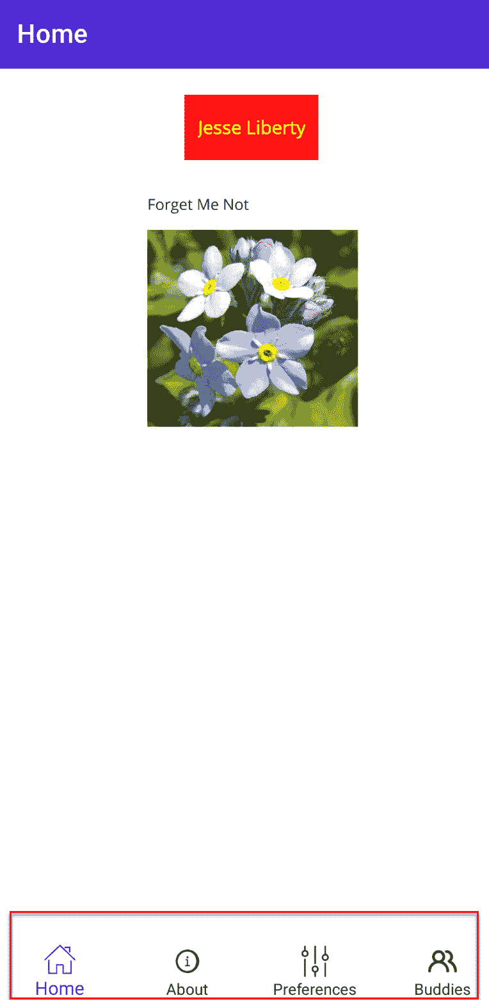
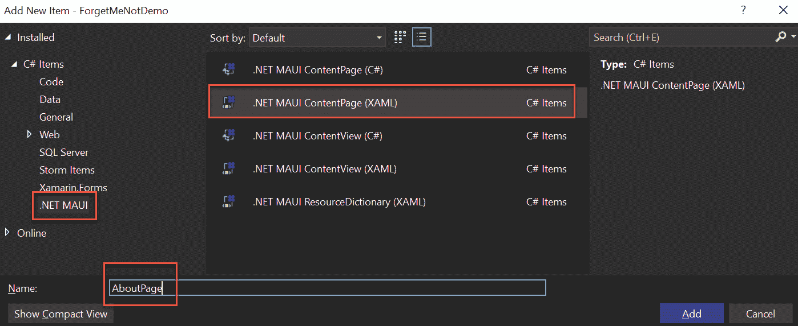
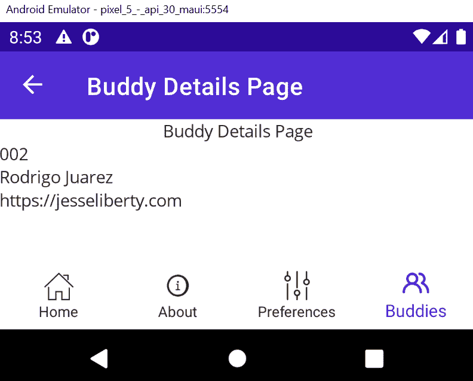

# 理解导航

到目前为止，我们一次只处理一个页面，没有其他方式可以到达页面，除非在`AppShell.xaml`中设置它。当然，这对于实际应用来说是不够的，所以在本章中，我们将探讨从页面到页面的各种导航选项。您将看到，.NET MAUI 使用*shell 导航*，我们将深入探讨这个过程。

本章包括以下主题：

+   探索 TabBar

+   创建关于和伙伴页面

+   壳导航

+   路由

+   从页面到页面传递值

# 技术要求

要充分利用本章内容，您需要 Visual Studio 的副本。本章中显示的完成代码的源代码可以在以下位置找到：[`github.com/PacktPublishing/.NET-MAUI-for-C-Sharp-Developers/tree/Navigation`](https://github.com/PacktPublishing/.NET-MAUI-for-C-Sharp-Developers/tree/Navigation)。如果您想跟随，从*第六章*的完成代码开始。

# 探索 TabBar

ForgetMeNot 的主要导航形式将是`TabBar`控件。Tab Bar 是一种在不通过其他页面的情况下跳转到特定页面的方式。它由每个页面底部的图标和有时描述性文本组成，如下面的截图所示：



图 7.1 – 完成项目中的标签栏

底部的四个标签，如图*图 7.1*所示，将直接将用户带到相应的页面。

主页

在这里，您可以看到我们在`MainPage`上创建的标签，我们在*第四章*中创建了它，其中一个我们将其命名为**主页**。

您在`AppShell.xaml`中创建`TabBar`。在`TabBar`标签内，为每个页面提供一个`ShellContent`元素。`ShellContent`具有`Title`属性（显示的文本）、`Icon`属性（显示的图像）和`ContentTemplate`，它指定了此标签的内容：

```cs
<TabBar >
    <ShellContent
        Title="Home"
        ContentTemplate="{DataTemplate view:MainPage}"
        Icon="icon_home" />
    <ShellContent
        Title="About"
        ContentTemplate="{DataTemplate view:About}"
        Icon="icon_about" />
    <ShellContent
        Title="Preferences"
        ContentTemplate="{DataTemplate view:Preferences}"
        Icon="icon_prefs" />
    <ShellContent
        Title="Buddies"
        ContentTemplate="{DataTemplate view:BuddyList}"
        Icon="icon_buddies" />
</TabBar>
```

接下来，我们需要创建每个`ContentTemplate`指向的页面，这样我们才能看到`TabBar`在工作。

# 创建关于和伙伴页面

要看到这种导航工作，您需要添加缺失的页面：**关于**和**伙伴**。创建**关于**页面非常直接。右键单击**视图**文件夹，然后选择**添加新项**。如果需要，展开**添加新项**对话框。

从左侧面板中选择`AboutPage.xaml`，如图*图 7.2*所示：



图 7.2 – 创建 AboutPage

**关于**页面非常简单，不需要任何新的控件类型。

## 组装关于页面

让我们组装`BindingContext`。最后，我们需要`ViewModel`。最终，**关于**页面将向服务请求其版本号，但到目前为止，我们将硬编码它：

```cs
<?xml version="1.0" encoding="utf-8" ?>
<ContentPage xmlns="http://schemas.microsoft.com/dotnet/
  2021/maui"
   xmlns:x="http://schemas.microsoft.com/winfx/2009/xaml"
             x:Class="ForgetMeNotDemo.View.AboutPage"
             Title="About">
    <VerticalStackLayout Margin="10" Spacing="10">
        <HorizontalStackLayout Spacing="10">
            <Label
                FontAttributes="Bold"
                FontSize="22"
                Text="About this app"
                VerticalOptions="End" />
            <Label
                FontSize="22"
                Text="v0.1"
                VerticalOptions="End" />
        </HorizontalStackLayout>
        <HorizontalStackLayout Spacing="10">
            <Label
                FontAttributes="Bold"
                FontSize="22"
                Text="Api Version"
                VerticalOptions="End" />
            <Label
                FontSize="22"
                Text="{Binding ApiVersion}"
                VerticalOptions="End" />
        </HorizontalStackLayout>
        <Label
            HeightRequest="60"
            Text="This app is written in XAML and C# with
            .NET MAUI by Jesse Liberty and Rodrigo Juarez."
            VerticalTextAlignment="Center" />
        <Label
            HeightRequest="60"
            Text="Concept and original design by Robin
              Liberty"
            VerticalTextAlignment="Center" />
        <Label FontSize="Small" Text="Icons from IconScout:
          https://iconscout.com" />
    </VerticalStackLayout>
</ContentPage>
```

后台代码文件看起来像这样（目前）：

```cs
  public AboutPage()
  {
    BindingContext = new AboutViewModel();
    InitializeComponent();
  }
```

最后，`ViewModel`看起来像这样（目前）：

```cs
namespace ForgetMeNotDemo.ViewModel;
[ObservableObject]
public partial class AboutViewModel
{
  [ObservableProperty] private string apiVersion;
  public AboutViewModel()
  {
    apiVersion = "1.0";
  }
}
```

**关于**页面目前看起来像这样：

![Figure 7.3 – 关于页面

![img/B19723_Figure_7.3.jpg]

图 7.3 – 关于页面

这将为我们提供一些可以操作的东西。

接下来，我们需要一个**BuddiesPage**，即列出所有用户的朋友和亲戚的页面。每个朋友都将有一个我们可以用来在他们需要礼物时使用的**偏好**列表。

目前，我们只需使用当我们右键点击**视图**并添加一个新的**.NET MAUI XAML**页面时获得的现成页面，如图*图 7.4*所示：

![Figure 7.4 – 创建 Buddies 页面

![img/B19723_Figure_7.4.jpg]

图 7.4 – 创建 Buddies 页面

接下来，打开`BuddiesPage.xaml`并做一个小改动。在`Label`控制的`Text`字段中，将`Welcome to .NET MAUI!`改为`Buddies Page`，这样当我们导航到那里时就会知道我们在哪里。如果你愿意，在标题中的单词之间也可以添加一个空格：

```cs
<?xml version="1.0" encoding="utf-8" ?>
<ContentPage xmlns="http://schemas.microsoft.com/dotnet/
  2021/maui"
    xmlns:x="http://schemas.microsoft.com/winfx/2009/xaml"
             x:Class="ForgetMeNotDemo.View.BuddiesPage"
             Title="Buddies Page">
    <VerticalStackLayout>
        <Label
            Text="Buddies Page"
            VerticalOptions="Center"
            HorizontalOptions="Center" />
    </VerticalStackLayout>
</ContentPage>
```

接下来，通过右键点击**ViewModel**文件夹并选择**添加** | **类**来创建`BuddiesViewModel`。

最后，我们需要告诉应用程序从哪里开始。我们将在`App.xaml.cs`中这样做，我们将`MainPage`设置为新的`AppShell`（这是我们启动程序并为我们设置 shell 导航的方式，如前所述）：

```cs
namespace ForgetMeNotDemo;
public partial class App : Application
{
public App()
{
InitializeComponent();
MainPage = new AppShell();
}
}
```

这是`AppShell.xaml`现在应该看起来像的样子：

```cs
<?xml version="1.0" encoding="UTF-8" ?>
<Shell
    Shell.FlyoutBehavior="Disabled"
    x:Class="ForgetMeNotDemo.AppShell"
    xmlns="http://schemas.microsoft.com/dotnet/2021/maui"
    xmlns:local="clr-namespace:ForgetMeNotDemo"
    xmlns:view="clr-namespace:ForgetMeNotDemo.View"
    xmlns:x="http://schemas.microsoft.com/winfx/2009/xaml">
    <TabBar>
        <ShellContent
            Title="Home"
            ContentTemplate="{DataTemplate view:MainPage}"
            Icon="icon_home" />
        <ShellContent
            Title="About"
            ContentTemplate="{DataTemplate view:AboutPage}"
            Icon="icon_about" />
        <ShellContent
            Title="Preferences"
            ContentTemplate="{DataTemplate
              view:PreferencesPage}"
            Icon="icon_prefs" />
        <ShellContent
            Title="Buddies"
            ContentTemplate="{DataTemplate
              view:BuddiesPage}"
            Icon="icon_buddies" />
    </TabBar>
</Shell>
```

一件额外的事情。注意每个标签页都有一个图标。为了使其工作并达到预期效果，你可能需要在网上找到图标，或者通过检查本章的`Navigation`分支的源代码来获取它们。

在任何情况下，只需将图像复制到项目的`resources\image`文件夹中，将三个点替换为计算机上的完整路径。

图片支持

对于那些使用过`Xamarin.Forms`的人来说，将不再需要为 iOS 和 Android 创建不同尺寸的图像并将它们分发到各个文件夹的日子将令人高兴。将`.svg`文件放入`images`文件夹，.NET MAUI 将为你完成所有剩余的工作！（你也可以使用`.png`文件，但它不会很好地缩放。为了说明这一点，我将我们的花朵图像保存为`.png`文件。）

运行应用程序并点击各个标签页。你应该看到它导航到我们创建的各个页面。注意在*图 7.5*中，当前标签页*点亮*了——你得到这种效果是免费的，你不需要为当前选中和不选中的图标各创建一个图标。

![Figure 7.5 – 主标签页“点亮”

![img/B19723_Figure_7.5.jpg]

图 7.5 – 主标签页“点亮”

现在我们已经设置了标签页和页面，是时候看看在没有标签页的页面之间导航时如何从一个页面移动到另一个页面了。

# Shell 导航

如果你的应用程序只是通过 TabBar 访问我们访问的四个页面，那么你需要的关于导航的知识就到此为止了。当然，你几乎肯定会有比这更多的页面，并且你将需要一个从页面导航到页面的方法。

要在不使用`TabBar`的情况下查看页面间的导航，我们需要另一个要导航到的页面。让我们创建**BuddyDetailsPage**，我们将从**Buddies**页面导航到它。

再次，使用现成的页面，但将`Label`改为显示`Buddy``Details Page`：

```cs
<?xml version="1.0" encoding="utf-8" ?>
<ContentPage xmlns="http://schemas.microsoft.com/dotnet/
  2021/maui"
     xmlns:x="http://schemas.microsoft.com/winfx/2009/xaml"
         x:Class="ForgetMeNotDemo.View.BuddyDetailsPage"
             Title="Buddy Details Page">
    <VerticalStackLayout>
        <Label
            Text="Buddy Details Page"
            VerticalOptions="Center"
            HorizontalOptions="Center" />
    </VerticalStackLayout>
</ContentPage>
```

接下来，回到显示“转到详情”的`Button`，并给它分配`GoToDetailsCommand`命令：

```cs
        <Button Text="Go to details"
               Command="{Binding GoToDetailsCommand}" />
```

在`GoToDetails`命令中。我们处理器的目标是导航到**BuddyDetails**。我们通过*shell navigation*来实现这一点。以下是实现此功能的代码：

```cs
[RelayCommand]
private async Task GoToDetails()
{
  await Shell.Current.GoToAsync("buddydetailspage");
}
```

BindingContext

记住，为了让`GoToDetails`命令生效，你必须在代码隐藏文件中通过设置`BindingContext`将 XAML 绑定到`ViewModel`。

在这个常见的结构中，你将页面名称传递给`Shell.Current`上的`GoToAsync`静态方法。关键问题是，*它如何知道*buddydetailspage*是什么，*鉴于*buddydetailspage*是一个字符串？*这个答案在于*路由*，我们将在下一节中介绍。

# 路由

在.NET MAUI 中，你将在`AppShell.xaml.cs`中注册你的路由。例如，要将`buddydetailspage`字符串连接到实际的`BuddyDetailsPage`，你需要添加以下内容：

```cs
Routing.RegisterRoute("buddydetailspage",
  typeof(BuddyDetailsPage));
```

我们将为所有页面创建一个路由条目，包括我们可以通过标签访问的页面。这将给我们最大的灵活性：

```cs
public partial class AppShell : Shell
{
  public AppShell()
  {
    InitializeComponent();
    Routing.RegisterRoute("buddiespage",
      typeof(BuddiesPage));
    Routing.RegisterRoute("buddydetailspage",
      typeof(BuddyDetailsPage));
    Routing.RegisterRoute("aboutpage", typeof(AboutPage));
    Routing.RegisterRoute("preferencespage",
      typeof(PreferencesPage));
    Routing.RegisterRoute("loginpage", typeof(LoginPage));
    Routing.RegisterRoute("mainpage", typeof(MainPage));
  }
}
```

现在路由就像魔法一样工作。你告诉它你想去哪里，传递路由，.NET MAUI 处理导航。如果程序尚未运行，请启动程序并轻触**Buddies**标签。在**Buddies**页面上，轻触**Details**按钮，嘿，你就在**Buddy Details**页面上！简单得很。

能够从一个页面导航到另一个页面是很好的，但通常第一个页面有第二个页面需要的数据。所以，让我们看看如何将数据发送到第二个页面。

# 从页面到页面传递值

当从一个页面导航到另一个页面时，你通常会想要传递一个值。有几种方法可以做到这一点；这里是最常见的两种：

1.  使用与在网页上导航到页面时相同的`url (?)`语法

1.  使用字典传递导航参数

## 使用 url (?)语法传递值

让我们回到`Buddies`页面。目前，`Button`有一个`GoToDetailsCommand`命令。但是，**Details**页面需要知道要显示哪个 Buddy 的详细信息。

我们将修改`ViewModel`中的`RelayCommand`以传递`BuddyId`。为了使这生效，我们需要一个`Buddy`对象（它将具有`Id`）。然而，Buddy 只是这个程序用户类型之一，所以让我们首先定义`User`类型：

```cs
[ObservableObject]
public partial class User
{
    [ObservableProperty]
    private string name;
    [ObservableProperty]  [1]
    private string id;
    [ObservableProperty]
    private List<Buddy> buddies;   [2]
    [ObservableProperty]
 //   private List<Invitation> invitations; [3]
    [ObservableProperty]
    private List<Preference> preferences; [4]
}
```

[1] 这里是我们需要的`Id`属性。

[2] 用户可能有一组`buddies`（我们稍后会回到这一点）。

[3] 用户可能有一组`invitations`，这些邀请被发送给潜在的`buddies`（我们稍后会回到这一点）。

[4] 用户有一个`preference`对象的列表，正如我们之前看到的。

`Buddy`类继承自`User`类。以下是完整的类定义，尽管我们现在不会使用这些属性中的大多数：

```cs
public partial class Buddy : User
{
    [ObservableProperty] private string emailAddress;
    [ObservableProperty] private string? phoneNumber;
    [ObservableProperty] private string?
      mailingAddressLine1;
    [ObservableProperty] private string?
      mailingAddressLine2;
    [ObservableProperty] private string? website;
    [ObservableProperty] private string? twitter;
    [ObservableProperty] private string? facebook;
    [ObservableProperty] private string? instagram;
    [ObservableProperty] private string? linkedIn;
    [ObservableProperty] private string? venmoName;
    [ObservableProperty] private DateTime buddySince;
}
```

继承`ObservableObject`

注意，`Buddy`类没有标记`ObservableObject`属性。这是因为它继承自标记为`ObservableObject`的`User`类。

我们希望将新页面分配给传递的`Buddy`对象的`Id`。我们可以使用传递数据的方法之一（例如，URL 方法或字典）来实现这一点。

### 传递 Buddy Id

使用`?`语法将`Id`返回到`Id`：

```cs
private async Task GoToDetails()
{
  await Shell.Current.GoToAsync
    ($"buddydetailspage?id={Id}");
}
```

如果您想传递两个属性，例如`Id`和`Name`，您可以使用`&&`将它们连接起来。这应该与您在浏览器中使用的 URL 非常熟悉：

```cs
private async Task GoToDetails()
{
  await Shell.Current.GoToAsync
    ($"buddydetailspage?id={Id}&&name={"BuddyName"});
}
```

如果我们没有在`BuddiesViewModel`中包含`Id`和`Name`，则这不会起作用，所以让我们在这里添加它们：

```cs
public partial class BuddiesViewModel
{
  [ObservableProperty] private string id = "001";
  [ObservableProperty] private string name = "jesse";
```

`GoToAsync`的调用将更改页面到`BuddyDetailsPage`，并将参数发送到相关的`ViewModel`（`BuddyDetailsViewModel`）。

### QueryProperty

我们使用`QueryProperty`属性以及属性名称标记接收的`ViewModel`，以便将其与`ViewModel`和`GoToAsync`方法中使用的字符串关联起来。

为了使这更清晰，让我们创建`BuddyDetailsViewModel`，并将其标记为`ObservableObject`。我们将给它两个属性：`Id`和`Name`：

```cs
[ObservableObject]
public partial class BuddyDetailsViewModel
{
  [ObservableProperty] private string id;
  [ObservableProperty] private string name;
}
```

我们希望将传入的第一个参数（`id`）分配给`Id`属性，希望将传入的第二个参数分配给`Name`属性。为此，我们使用`QueryProperty`属性（放置在类上方）：

```cs
using CommunityToolkit.Mvvm.ComponentModel;
namespace ForgetMeNotDemo.ViewModel;
[ObservableObject]
[QueryProperty(nameof(Id), "id")]
[QueryProperty(nameof(Name), "buddyname")]
public partial class BuddyDetailsViewModel
{
  [ObservableProperty] private string id;
  [ObservableProperty] private string name;
}
```

现在您已经熟悉了两种传递数据的方式，让我们看看如何将它们集成到程序的流程中。

### 整合起来

在**Buddies**页面上，用户点击**GoToDetails**。

这在`BuddiesViewModel`中触发了`GoToDetails`中继命令。

该方法调用以下方法：

```cs
await Shell.Current.GoToAsync
  ($"buddydetailspage?id={{Id}}&&buddyname={{Name}}");
```

这个`GoToAsync`调用将我们转移到`BuddyDetailsPage`，但将两个参数（`Id`和`Name`）传递给`BuddyDetailsViewModel`！

`BuddyDetailsViewModel`解析`QueryProperty`属性并将值分配给相关属性。

最终效果是您现在在`BuddyDetailsPage`上，与`ViewModel`关联的`Id`和`Name`属性已填充了值。

要看到这个效果，请转到`BuddyDetailsPage.xaml`文件并添加两个标签控件，一个绑定到`Id`，另一个绑定到`Name`。

这是 XAML 页面：

```cs
<?xml version="1.0" encoding="utf-8" ?>
<ContentPage
    Title="Buddy Details Page"
    x:Class="ForgetMeNotDemo.View.BuddyDetailsPage"
    xmlns="http://schemas.microsoft.com/dotnet/2021/maui"
    xmlns:x="http://schemas.microsoft.com/winfx/2009/xaml">
    <VerticalStackLayout>
        <Label
            HorizontalOptions="Center"
            Text="Buddy Details Page"
            VerticalOptions="Center" />
        <Label Text="{Binding Id}"/>
        <Label Text="{Binding Name}"/>
    </VerticalStackLayout>
</ContentPage>
```

记得在代码-behind 页面中设置`BindingContext`。

运行程序并点击**Buddies**标签。在**Buddies**页面上，点击**GoToDetails**。您将被转移到**BuddiesDetails**页面，并且将显示两个值。

立即停止

在继续之前，确保您理解所有这些是如何联系在一起的。如果需要，从“从页面传递到页面”部分重新阅读。

## 使用字典传递值

有时，你将想要传递整个对象（或更多）到接收的 `ViewModel`。你这样做是通过实例化一个字典，其中键是一个字符串，值是一个对象。

让我们修改 `GoToDetails` 以接受整个 `Buddy` 对象。首先，我们需要创建一个 `Buddy` 对象并将其放入 `BuddyViewModel`：

```cs
[ObservableProperty] private Buddy rodrigo = new Buddy
{
  Id = "002",
  Name = "Rodrigo Juarez",
  Website = "https://jesseliberty.com"
};
```

接下来，我们需要创建我们的字典。我们可以选择任何任意的字符串作为键，并传入我们刚刚创建的 `Buddy` 对象 (`rodrigo`)：

```cs
[RelayCommand]
private async Task GoToDetails()
{
  var navigationParameter = new Dictionary<string, object>
  {
    {"TheBuddy", Rodrigo}
  };
  await Shell.Current.GoToAsync($"buddydetailspage",
    navigationParameter);
}
```

再次，我们被重定向到 `Buddy` 对象本身被传入。在 `Buddy` 对象字段顶部分配传入的 `Buddy`，我们使用字典中的键：

```cs
[ObservableObject]
[QueryProperty(nameof(MyBuddy), "TheBuddy")]
public partial class BuddyDetailsViewModel
{
```

我们将为页面添加三个属性以进行绑定：

```cs
[ObservableProperty] private string id;
[ObservableProperty] private string name;
[ObservableProperty] private string? website;
```

注意，`website` 是一个可空字符串。这是因为它在 `Buddy` 定义中被标记为 `nullable`。为了使这可行，你将想要启用 `nullable`，至少在这个页面上，如果不是整个项目。

管理传入的 `Buddy` 对象的最简单方法是以下：

```cs
private Buddy myBuddy;
public Buddy MyBuddy
{
  get => myBuddy;
  set
  {
    Id = value.Id;
    Name = value.Name;
    Website = value.Website;
  }
}
```

如果你转到 `BuddyDetailsPage.xaml` 并添加一个文本绑定到 `website` 的标签，结果将如图 *图 7.6* 所示：




图 7.6 – 传入 Buddy 对象后的 Buddy 详情页面

### 组合起来

这一开始可能会让人感到困惑，因此值得一步一步地了解整个过程。

在 `BuddiesPage` 中，用户点击 `GoToDetailsCommand`，该命令在 `BuddiesViewModel` 中处理。

在 `ViewModel` 中，我们有一个 `Buddy` 属性（如 `Models` 文件夹中定义）。该 `Buddy` 对象的标识符是 `rodrigo`，并且初始化了它的三个字段。

然后，我们组装一个字典，将其用作 `GoToAsync` 方法的参数。我们传入我们想要导航到的页面的名称（如记录在 `AppShell.xaml.cs` 文件中的 `Routing.RegisterRoute` 方法）。

我们还传入了我们刚刚创建的字典。

.NET MAUI 导航到页面，我们的字典通过关联的 `ViewModel` (`BuddyDetailsViewModel`) 进行路由。在那里，`QueryProperty` 属性将 `MyBuddy` 属性与 `queryid` 关联，我们在 `BuddiesPage` 中使用了它。

它匹配的属性是 `Buddy` 类型，因此我们可以使用传入的 `Buddy` 对象的属性设置本地属性（`value`）。

由于 `BuddyDetailsPage` 有 `Labels` 绑定到 `ViewModel` 中的这些属性，所以会显示正确的内容。

# 摘要

在本章中，我们重点介绍了如何在不使用 `TabBar` 的情况下从一个页面跳转到另一个页面，通过使用壳导航和路由。我们还探讨了如何使用 URL 语法或通过传递包含您想要发送的对象或值的字典来从第一个页面传递数据到第二个页面。

在下一章中，我们将探讨存储和检索数据。

# 问答

1.  你在哪里定义 `TabBar`？

1.  `TabBar ShellContent` 的三个属性是什么？

1.  路由在哪里注册？

1.  导航到另一个页面的方法是什么？

1.  我们都看到了哪些方法可以将数据传递到页面？

# 你试试看

在 `LoginViewModel` 中修改 `RelayCommand Submit` 以显示进度条，然后导航到**好友**页面。首先以字符串的形式传入用户名和密码，然后以字典的形式传入。暂时修改**好友**页面以显示传入的值。
