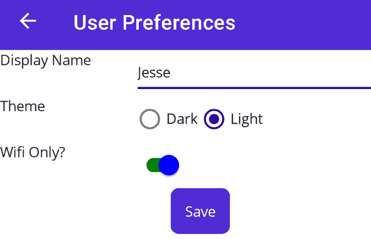

# 8

# 存储和检索数据

您现在拥有了创建和导航页面、布局以及用于填充页面的控件的所有基础知识。恭喜！您现在是一名.NET MAUI 程序员。

本章开始介绍本书的中间部分，其中您将了解如何存储和检索数据，然后创建单元测试——这两个都是编写现实世界应用，尤其是企业应用的关键方面。

程序与数据交互，大多数需要在应用关闭后存储数据，并在应用恢复时按需恢复。在本章中，我们将考虑两种变体——用户偏好的长期持久化和长期数据库存储。

本章我们将涵盖以下主题：

+   存储用户偏好

+   在您的设备上存储到数据库

# 技术要求

要跟随本章内容，您需要 Visual Studio。您还将安装另一个`NuGet`包，如本章后面所示。

本章完成代码的源代码可以在以下位置找到：[`github.com/PacktPublishing/.NET-MAUI-for-C-Sharp-Developers/tree/persistence`](https://github.com/PacktPublishing/.NET-MAUI-for-C-Sharp-Developers/tree/persistence)。要跟随本章内容，您需要使用上一章的代码。

# 存储用户偏好

大多数应用允许用户设置可以存储在手机上并在应用启动时检索的偏好设置。.NET MAUI 提供了这项服务，可以轻松存储*键/值对*，例如主题偏好、最后使用日期、登录名等。

.NET MAUI 提供了`IPreferences`接口来帮助存储这些偏好。使用它以及相关的`Preferences`类（都在`Microsoft.Maui.Storage`命名空间中），您可以存储以下类型的字符串键和值：

+   `布尔`

+   `双精度浮点数`

+   `Int`（`int32`、`single`和`int64`）

+   `String`

+   `DateTime`

持久化日期时间

`DateTime`值存储为 64 位整数，并使用`ToBinary`和`FromBinary`方法进行编码和解码。

让我们创建一个`UserPreferences`页面，包含一个简短表单来收集用户的偏好。我们还将添加`Button`，用于显示所有已保存的偏好，并允许用户删除一个或全部。

名称冲突

我们有一个偏好设置页面，这可能会引起问题，因为我们想使用内置的`Preferences`对象。为了解决这个问题，请转到`PreferencesViewModel`并将`List<Preference>`重命名为`preferenceList`。不应该有其他冲突。最安全的重命名方法是使用 Visual Studio 的重命名功能，您可以通过将光标放在名称上并输入`Control-R R`来访问它。重命名后，您可能需要根据 Visual Studio 的最新更新手动重命名`ObservableProperties`。

新的`UserPreferences`页面将从用户那里收集三个偏好，具体如下：

+   用户的显示名称

+   偏好的主题

+   应用是否可以在蜂窝或 Wi-Fi 上使用

浅色和深色主题

在应用程序中提供浅色和深色主题已经变得很常见。在 .NET MAUI 中，你可以为用户提供选择，或者如果你有雄心壮志，你可以创建自己的主题。

我们将收集但不实现与浅色和深色主题相关的用户偏好。

这里是 `UserPreferences` 页面：

```cs
<?xml version="1.0" encoding="utf-8" ?>
<ContentPage
    Title="User Preferences"
    x:Class="ForgetMeNotDemo.View.UserPreferencesPage"
    xmlns="http://schemas.microsoft.com/dotnet/2021/maui"
    xmlns:x="http://schemas.microsoft.com/winfx/2009/xaml">
    <VerticalStackLayout>
        <Grid
            ColumnDefinitions="*,*"
            RowDefinitions="*,*,*,*">
            <Label
                Grid.Column="0"
                Grid.Row="0"
                Text="Display Name" />
            <Entry
                Grid.Column="1"
                Grid.Row="0"
                Placeholder="Your name as you want it
                   displayed"
                Text="{Binding DisplayName}" />
```

收集了用户的显示名称后，我们可以继续询问他们希望选择哪两个互斥主题之一。为此，我们将使用 `RadioButtonGroup` 和两个 `RadioButtons`，初始化 `Light` 为选中状态：

```cs
            <Label
                Grid.Column="0"
                Grid.Row="1"
                Text="Theme" />
            <HorizontalStackLayout
                Grid.Column="1"
                Grid.Row="1"
                RadioButtonGroup.GroupName="{Binding
                    ThemeGroupName}" [1]
                RadioButtonGroup.SelectedValue="{Binding
                    ThemeSelection}"> [2]
                <RadioButton Content="Dark" />
                <RadioButton
                    Content="Light"
                    IsChecked="True" /> [3]
            </HorizontalStackLayout>
```

我们现在想询问用户是否应该在连接到 Wi-Fi 时才使用应用程序。我们可以使用一个开关控件来实现，其中 `on` 表示 `WiFi only` 是 `true`：

```cs
            <Label
                Grid.Column="0"
                Grid.Row="2"
                Text="Wifi Only?" />
            <Switch                  [4]
                Grid.Column="1"
                Grid.Row="2"
                HorizontalOptions="Start"
                IsToggled="{Binding WifiOnly}"
                OnColor="Green"
                ThumbColor="Blue" />
            <Button
                Command="{Binding SavePreferencesCommand}"
                Grid.Column="0"
           Grid.ColumnSpan="2"
                Grid.Row="3"
                HorizontalOptions="Center"
                Text="Save" />
        </Grid>
    </VerticalStackLayout>
</ContentPage>
```

`[1]` 在这里，我们引入了一个新的控件，`RadioButton`。单选按钮可以是隐式或显式的组。隐式组是通过将所有 `RadioButtons` 放入同一个容器中（例如，`VerticalStackLayout`）来创建的。显式组被赋予 `GroupName`，正如我们所看到的。

`[2]` 用户的选项通过 `SelectedValue` 属性记录。

`[3]` 在定义 `RadioButtons` 时，你可以（并且应该）设置一个 `IsChecked=true`。

`[4]` 开关控件切换开和关（`false` 和 `true`）。

现在我们已经知道了如何收集用户想要保存的信息，让我们看看 .NET MAUI 提供的轻量级机制来完成这项任务。

## UserPreferencesViewModel

如您所预期，我们首先会为绑定的控件创建属性：

```cs
[ObservableObject]
public partial class UserPreferencesViewModel
{
  [ObservableProperty] private string displayName;
  [ObservableProperty] private string themeSelection;
  [ObservableProperty] private bool wifiOnly;
  public string ThemeGroupName => "Theme";
```

接下来，我们需要处理 `SavePreferences` 命令。我们通过使用 .NET MAUI 的 `Preferences` 对象，调用静态的 `Set` 方法来完成：

```cs
[RelayCommand]
public async Task SavePreferences()
{
  Preferences.Default.Set("DisplayName", displayName);
  Preferences.Default.Set("ThemeSelection",
    themeSelection);
  Preferences.Default.Set("WifiOnly", wifiOnly);
}
```

.NET MAUI 将为我们处理持久性。

现在我们已经创建了页面，让我们设置导航以到达它。

## 导航到用户偏好

我们需要一种方法来访问我们新的页面。一个典型的放置位置是将 `Button` 作为 `VerticalStackLayout` 的最后一个项目：

```cs
<Button
    Command="{Binding OpenPreferencesCommand}"
    Text="Preferences"
    WidthRequest="150"
    Margin="10,50,10,0"/>
```

`OnPreferences` 命令简单地导航到我们的新页面：

```cs
[RelayCommand]
public async Task OpenPreferences()
{
  await Shell.Current.GoToAsync("userpreferences");
}
```

确保在调用此方法之前在 `AppShell` 中注册 `userpreferences` 页面。

页面可能看起来并不美观，但它已经准备好收集用户的偏好，如下所示：



图 8.1 – 偏好页面

用户现在可以设置他们的偏好。下次他们启动应用程序时，我们将想要检索这些偏好并相应地设置应用程序。

## 检索偏好

当用户关闭应用程序时，偏好将被保留。下次我们返回到偏好页面时，我们应该看到偏好已恢复。我们通过在 `Preferences.Default` 上使用 `Get` 方法来实现这一点。

`Get` 方法接受两个参数，*键*和*默认值*。我们将将其放在 `ViewModel` 构造函数中，以便在显示时填充偏好页面：

```cs
public UserPreferencesViewModel()
{
  displayName = Preferences.Default.Get("DisplayName",
    "Unknown");
  themeSelection = Preferences.Default.Get
    ("ThemeSelection", "Light");
  wifiOnly = Preferences.Default.Get("WifiOnly", false);
}
```

注意，`Get` 方法的第一个参数是键，正如在 `SavePreferences` 方法中 `Set` 方法定义的那样。第二个参数是如果键不存在时将提供的默认值。

检查键

虽然在尝试检索之前您不必检查键是否存在，但有时您会想要区分返回的值是默认值还是实际存储的值（例如，`WiFiOnly` 是否为 `false`，因为它确实是 `false`，还是因为该键不存在而收到了默认值？）。

要管理这一点，您可以在 `Preferences.Default` 上使用 `ContainsKey` 方法：

`bool knowsWifi =` `Preferences.DefaultContainsKey("WifiOnly");`

用户现在可以存储他们的首选项，理论上它们可以被恢复。让我们确保这一点是正常工作的。

### 测试持久性

要验证这一点，通过 `UserPreferences` 页面导航到 `UserPreferences` 页面，您应该看到您输入的值已经恢复。

清除

如果您想清除特定的 `UserPreference`，请使用 `Remove` 方法：

`Preferences.Default.Remove("DisplayName");`

要删除所有这些，请使用 `Clear` 方法：

`Preferences.Default.Clear()`

`Preferences` 接口旨在以键/值对的形式存储简单数据。Microsoft 警告说，不要存储长字符串，因为它可能会对性能产生负面影响。如果您需要存储更复杂或更大的数据，您将需要使用数据库，而对于许多 .NET MAUI 开发者来说，首选的数据库是 **SQLite**。

轻量级持久机制非常适合存储相对较短的字符串和其他原始数据，但如果您要存储大量数据，您将需要一个真正的数据库。

# 在您的设备数据库中存储

在您的设备上存储数据有几个竞争者。最受欢迎的是 SQLite，它是一个开源的、小巧的、快速的且高度可靠的数据库。它是世界上使用最广泛的数据库，并内置在所有手机和大多数计算机中。

## 安装 SQLite

要开始，请安装 **sqlite-net-pcl** NuGet 包的最新版本，如 *图 8*.2 所示。

![Figure 8.2 – 安装 sqlite-net-pcl]

![img/Figure_8.2_B19723.jpg]

图 8.2 – 安装 sqlite-net-pcl

安装正确的包

在 NuGet 上有多个 SQLite 包可用。您想要的是 **sqlite-net-pcl**，其作者为 **SQLite-net**，如 *图 8*.3 所示。

![Figure 8.3 – 作者应为 SQLite-net]

![img/Figure_8.3_B19723.jpg]

图 8.3 – 作者应为 SQLite-net

一旦安装了 `sqlitepclraw.bundle_green`，如果它没有自动安装，请手动安装 **SQLitePCLRaw.bundle_green**，如 *图 8*.4 所示。

![Figure 8.4 – 安装 SQLitePCLRaw.bundle_green]

![img/Figure_8.4_B19723.jpg]

图 8.4 – 安装 SQLitePCLRaw.bundle_green

安装完包后，您就可以设置程序以创建和使用 SQLite 数据库了。

## 开始使用 SQLite

要创建你的数据库，你需要存储数据库文件名及其路径以及其他常量值。为此，右键单击你的项目并创建一个 `Constants.cs` 文件。为了方便，我将创建一个 `Database` 文件夹并将其放置在那里：

```cs
namespace ForgetMeNotDemo.Database;
public static class Constants
{
  public const string DatabaseFilename =
    "ForgetMeNotDemo.db3"; [1]
  public const SQLite.SQLiteOpenFlags Flags = [2]
    SQLite.SQLiteOpenFlags.ReadWrite |
    SQLite.SQLiteOpenFlags.Create |
    SQLite.SQLiteOpenFlags.SharedCache;
  public static string DatabasePath =>
    Path.Combine(FileSystem.AppDataDirectory,
      DatabaseFilename); [3]
}
```

`[1]` 为你的数据库设置名称。你可以使用显示的名称，也可以将其重命名为你喜欢的任何名称。

`[2]` 设置文件应该如何管理的标志。在这里，我们将其设置为读写模式，如果不存在则创建数据库，最后启用多线程数据库访问。

`[3]` 将我们之前创建的数据库文件名附加到应用程序的目录名上。

在建立了这些常量之后，我们就可以创建数据库了。我们将把这个工作封装在一个类中。

## 数据库类

将数据库访问层包装在类中是一种常见的模式，它可以抽象化它，使其与应用程序的其余部分解耦。我们将把所有的查询逻辑放入这个类中。这种数据库关注点的集中化将有助于使我们的应用程序随着时间的推移而可扩展。

该类需要一个 `Init()` 方法来创建数据库和我们的第一个表。为了让我们开始，让我们创建一个表来存储所有我们的首选项：

```cs
using ForgetMeNotDemo.Database;
using ForgetMeNotDemo.Model;
using SQLite;
namespace ForetMeNotDemoDatabase;
public class ForgetMeNotDemoDatabase
{
    private SQLiteAsyncConnection Database;  [1]
    private async Task Init()
    {
        if (Database is not null)  [2]
            return;
        Database = new SQLiteAsyncConnection(  [3]
              Constants.DatabasePath,
              Constants.Flags);
        await Database.CreateTableAsync<Preference>(); [4]
    }
}
```

`[1]` 声明一个类型为 `SQLiteAsyncConnection` 的对象，并将其命名为 `Database`。

`[2]` 如果它已经存在，则返回（即，将其视为单例）。

`[3]` 创建 `SQliteAsyncConnection`，传入 `constant` 类中的路径和标志。

`[4]` 创建我们的第一个表，声明我们将存储在表中的对象类型（即 `Preference` 对象）。

我们已经准备好开始使用数据库，添加和操作我们的表。

## CRUD

对于几乎所有数据库来说，我们都希望支持 **创建、读取、更新和删除**（**CRUD**）。现在，让我们只实现创建和读取记录的方法。创建方法通常与更新方法结合使用。

### 创建/更新

我们将需要知道一个 `Preference` 是否已经在表中，这样当我们得到一个 `Preference` 记录时，我们知道是添加它还是更新它。它需要一个唯一的 ID。幸运的是，SQLite 在提供 ID 方面非常出色。

首先在 `Model` 文件夹中打开 `Preference.cs` 并添加一个 `id` 属性：

```cs
[ObservableObject]
public partial class Preference
{
    [ObservableProperty] private int id;
    [ObservableProperty] private string preferencePrompt;
    [ObservableProperty] private string preferenceValue;
}
```

接下来，返回到 `ForgetMeNotDemoDatabase.cs` 并添加 `SavePreference` 方法：

```cs
public async Task<int> SavePreference(Preference
    preference) [1]
{
    await Init();  [2]
    if (preference.Id != 0) [3]
    {
        return await Database.UpdateAsync(preference);
    }
    else
    {
        return await Database.InsertAsync(preference);
    }
}
```

`[1]` 我们的 `SavePreference` 方法接受一个类型（`Preference`）作为参数，并返回更新的行数（在这种情况下，零或一）。

`[2]` 每次执行操作时在数据库上调用 `Init`。

`[3]` 检查 `Preference` 对象是否有 `Id`。由于 `Id` 是 `int` 类型，它默认为零，所以如果它不是零，我们需要进行更新；否则，我们需要进行插入。

现在我们能够创建（或更新）一个记录，让我们编写代码来从数据库中读取这些数据。

### 读取

我们将希望能够从数据库中获取所有我们的首选项。为此，我们将创建一个 `GetPreferences` 方法，它返回一个 `Preference` 对象的列表：

```cs
public async Task<List<Preference>> GetPreferences()
{
    await Init();
    return await Database.Table<Preference>();
}
```

软删除

当我们编写`Delete`方法时，我们可能想要进行一次*软删除*——也就是说，将其标记为已删除而不是实际删除。为了实现这一点，你需要在`Preference`中添加另一个属性`Deleted`，以及`int`类型。然后，我们的读取语句将包含一个`where`子句，检查`Deleted`属性是否等于零。

一旦你有了数据库设计，你需要决定你是打算在设备上本地保留数据库，还是在云端通过你的 API 访问。

# 本地还是远程？

对于这个应用，设计问题在于我们是否想在设备上的表里存储偏好、好友、邀请等等，或者使用云中的网络服务和数据库。

为了便于在发送和接收邀请以及偏好列表时进行安全交互，我们决定将所有数据库操作移至云端。然而，本章中的内容不仅与`ForgetMeNotDemo`相关；如果你决定在手机或电脑上本地存储数据，它也会对你有所帮助。

# 摘要

在本章中，我们回顾了两种存储数据的方式。最简单且最轻量级的是使用.NET MAUI 的偏好设置功能。如果你只需要存储原始数据和针对持久化程序用户偏好的短字符串，这非常合适。

如果你需要持久化更大量的数据，你需要一个数据库，而对于设备上的存储来说，最流行的类型无疑是 SQLite。我们检查了 SQLite 的 CRUD 功能，然后指出了一种替代方案，即不是在设备上存储所有内容，而是在云中存储并通过程序的 API 访问。

# 习题

1.  处理用户数据简单存储的键/值对的类是什么？

1.  我们向`Get`方法传递哪两个值来检索存储的值？

1.  我们需要哪些`NuGet`包来在.NET MAUI 中与 SQLite 一起工作？

1.  我们使用什么类型的对象来创建表？

# 你来试试

将剩余的 CRUD 操作添加到`Preference`表（例如，删除和按 ID 获取）。
