# 9

# 单元测试

到目前为止，我们一直专注于创建应用程序，但如果不引入单元测试就做得太过分，是有风险的。在本章中，我们将专注于使用最佳实践编写全面而有意义的单元测试。

测试驱动开发（TDD）

一些开发者认为单元测试应该在代码之前（TDD）进行，但这超出了本书的范围。

单元测试对于创建健壮的应用程序和确保在发货前您的应用程序正常工作至关重要。它也是调试的关键方面，可以立即告诉您您刚刚更改或添加的内容是否破坏了应用程序的某些方面。

为了便于进行单元测试，您希望使用依赖注入，这样您就可以模拟耗时的服务，例如 API、数据库等。我们将花费时间与模拟一起，确保我们正在按预期处理数据。

本章的具体内容包括：

+   为什么创建单元测试？

+   开始创建单元测试

+   模拟

+   依赖注入

+   NSubstitute

# 技术要求

要跟随本章内容，您需要 Visual Studio。您还需要安装两个 NuGet 包，具体请参考本章本身所示。如果您打算边读边输入代码，您应该从上一章的源代码开始：[`github.com/PacktPublishing/.NET-MAUI-for-C-Sharp-Developers/tree/persistence`](https://github.com/PacktPublishing/.NET-MAUI-for-C-Sharp-Developers/tree/persistence)。

本章的源代码可以在以下位置找到：[`github.com/PacktPublishing/.NET-MAUI-for-C-Sharp-Developers/tree/UnitTests`](https://github.com/PacktPublishing/.NET-MAUI-for-C-Sharp-Developers/tree/UnitTests)。

# 为什么创建单元测试？

您将在生产应用程序上运行许多类型的测试。这些包括单元测试（测试应用程序的一个小部分——通常是方法）、集成测试（程序各部分运行在一起的效果）、UI 测试（确保与 UI 的交互按预期进行）和端到端测试（确保整个程序按预期工作）。

**单元测试**是这个过程的关键部分，并为每个方法和每个逻辑单元创建。实际上，通常为每个单元创建多个测试，以便您可以测试 happy path、sad path 和边界条件。

**happy path**是指数据符合预期的情况。**sad path**是指数据可预测地错误（例如，用户未输入必填字段）的情况。

（以`123`作为用户名）。

单元测试的一个关键好处是它们可以使您的代码更少**脆弱**。没有单元测试，很容易陷入一种情况，即这里的更改破坏了那里的代码，而您直到运行整个程序或更糟糕的是，您的客户发现了这个问题，才知道代码被破坏了。

所有这一切的关键是，研究表明，在单元测试期间发现的错误比在开发后期发现的错误更容易修复且成本更低。例如，在 20 世纪 90 年代，Capers Jones 分析了 400 多个软件项目的错误数据，并发现每个开发阶段的错误修复成本增加了 6 到 7 倍。

此外，单元测试是应用程序的优秀文档，精确地描述了在广泛的情况下你期望发生什么。与注释不同，注释会生锈——也就是说，与代码不同步——单元测试永远不会脱离代码，因为当你的代码以使预期结果发生变化的方式改变时，它们会中断。

## 早早投票，经常投票

在你对代码进行每次更改后运行所有单元测试是很重要的。你希望尽快捕捉到意外的和不受欢迎的副作用。然而，为了实现这一点，你的单元测试必须是**快速的**。一套运行时间较长的单元测试会被使用得较少。它们运行的时间越长，程序员运行它们的频率就越低。

良好的单元测试不仅速度快，而且彼此之间是**隔离的**。这意味着一个单元测试不依赖于另一个测试的结果或状态——它们的运行顺序不应该有任何影响。

你希望能够查看单元测试的结果，并立即识别出出了什么问题，以便你可以快速修复它。为了实现这一点，你的单元测试应该做到以下几点：

+   一次只测试一个东西

+   命名要规范

如果你在一个单元测试中测试了多个东西，并且测试失败，你将不知道哪个问题是罪魁祸首。命名良好的单元测试可以让你一眼看出它们在测试什么，以及出了什么问题。

这是一个糟糕的单元测试名称示例：`DoesGetBuddiesWork`。

这是一个好的单元测试名称：`GettingBuddiesListDoesNotThrowAnException`。

如果测试失败，查看**好的单元测试名称**可以立即告诉你出了什么问题。

单元测试名称

一些程序员为单元测试使用非常严格的命名方案。例如，有些人会通过方法的名称、条件以及预期的结果来创建名称。所以，你可能会有这样的名称：`GetBuddiesList_WhenEmpty_ShouldNotThrowAnException`。

这些是有用的，因为浏览测试名称可以给你提供很多信息。

记住，随着程序的扩展，你的单元测试集也会随之增长。当你有成百（甚至上千）个测试时，你希望能够快速地浏览你的测试，以至于你不会介意在每次有意义的更改后运行它们，并且当其中一个或多个测试失败时，你希望知道测试了什么，而无需打开测试文件查看。

# 创建单元测试

要开始，右键单击解决方案并选择 **添加新项目**。在对话框中，使用下拉菜单选择 **单元测试**。有多个单元测试框架。最受欢迎的是较老的 **NUnit** 和较新的 **xUnit**。我们将选择 **xUnit 测试项目**，如图 *图 9**.1* 所示：

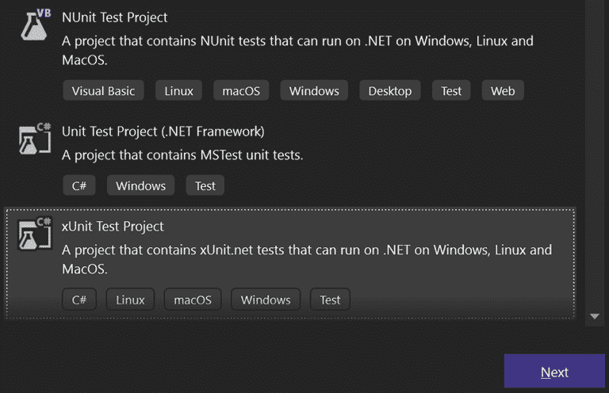

图 9.1 – 选择单元测试类型

1.  点击 `.Tests`，如图所示：

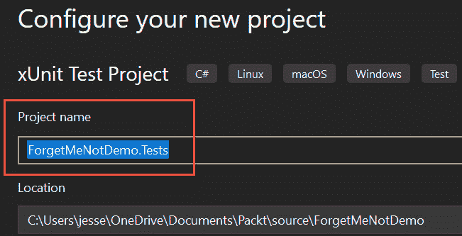

图 9.2 – 命名测试项目

1.  点击 **下一步** 并选择 .NET 平台（本书将使用 .NET 7）。

Visual Studio 将创建你的项目以及第一个单元测试类和方法。由于这是通用的，请删除该类并创建一个名为 `PreferencesTests` 的类。

## 设置项目引用

在做任何事情之前，我们需要让 `ForgetMeNotDemo.Tests` 知道 `ForgetMeNotDemo` 项目。为此，右键单击测试项目并选择 **添加** | **项目引用**，并在 **ForgetMeNotDemo** 旁边勾选复选框，如图 *图 9**.3* 所示：


图 9.3 – 从单元测试项目中引用 ForgetMeNotDemo

在设置好所有这些之后，我们就准备好编写我们的第一个单元测试了，这个测试仅用于确保测试结构已就位且正在运行。

注意

这将无法构建。请参阅本章后面出现的 *调整项目文件* 部分。

## 创建第一个单元测试

为了确保世界一切正常，打开 `UnitTest1` 并添加一个必须通过测试的方法：

```cs
namespace ForgetMeNotDemo.Tests
{
  public class UnitTest1
  {
    [Fact]
    public void MustBeTrue()
    {
      Assert.True(true);
    }
  }
}
```

xUnit 测试有两种类型：

+   **事实**：这些是不变的 – 它们总是使用相同的数据，并且应该总是通过

+   **理论**：这是一套执行相同代码但给定不同输入参数的测试

让我们探索理论。我们创建的第一个测试 `MustBeTrue` 简单地断言值 `true` 是 `true`。这是一个很好的第一个测试，因为它将测试你的单元测试是否设置正确。

要运行此测试，请单击 **测试** | **运行所有测试** 菜单项 – 但请注意，*它* *不会工作*！

为了使这可行，我们需要对项目文件进行一些调整。

## 调整项目文件

问题在于你的 .NET MAUI `.csproj` 项目文件列出了以下 `TargetFrameworks`：

```cs
<TargetFrameworks>net7.0-android;net7.0-ios;net7.0-
  maccatalyst</TargetFrameworks>
```

然而，单元测试项目文件看起来像这样：

```cs
<TargetFramework>7.0</TargetFramework>
```

为了修复这种差异，退出 Visual Studio 并使用你喜欢的文本编辑器（不是 Word 或其他添加特殊字符的程序 – 我喜欢使用 Visual Studio Code，但随便你用什么）打开你的 .NET MAUI 项目 `.csproj` 文件。将 `<TargetFramework>` 修改为包含 `.net7.0`：

```cs
<TargetFrameworks>net7.0;net7.0-android;net7.0-ios;net7.0-
  maccatalyst</TargetFrameworks>
```

您已经完成了一半。下一个问题是，我们需要将测试输出为 DLL，但项目的输出是 EXE。最好的解决方法是添加一个条件 - 只有当目标框架不是 7.0 时才输出为 EXE：

```cs
<OutputType Condition="'$(TargetFramework)' !=
  'net7.0'">Exe</OutputType>
```

重新打开 Visual Studio 并打开解决方案。您的测试现在应该可以工作了。

## 运行测试

首先，将 `UnitTest1` 重命名为 `PreferencesTests`。然后，转到菜单并选择 **测试** | **测试探索器**。这将打开（惊喜！）**测试探索器**。点击如图 *图 9**.4* 所示的绿色 *播放* 按钮：


图 9.4 – 播放按钮

您的项目将构建并测试探索器将运行您的测试，并显示如图 *图 9**.5* 所示的结果：

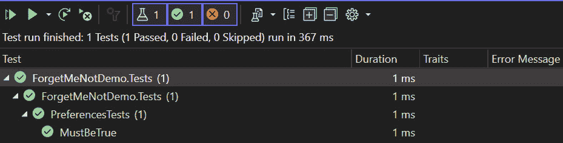

图 9.5 – 测试结果

从顶部向下阅读，它显示 `ForgetMeNotDemo.Tests` 有一个测试，绿色勾选表示 `ForgetMeNotDemo.Tests` 中的所有测试都已通过。

在 `ForgetMeNotDemo.Tests` 内将有一个所有测试类的列表 - 在这种情况下，只有一个，`PreferencesTests`，这也显示有一个测试并且它通过了。

最后，在 `PreferencesTests` 内将有一个每个单独测试的列表，再次，绿色勾选表示测试通过。

恭喜，您已经创建了第一个测试，运行了它，并看到了它通过！

现在，让我们坐下来为 `ForgetMeNotDemo` 编写一些测试。

# ForgetMeNotDemo 单元测试

要开始，我们一次检查一个 ViewModel，注意方法。我们这样做是因为我们想要测试的是业务逻辑，如果您做得正确，大部分的业务逻辑将位于 `ViewModel` 类中。

例如，将我们的注意力转向 `PreferencesViewModel`，我们看到 `Init()` 方法。`Init` 的任务是填充 `PreferenceList` 集合。目前，我们将忽略它是如何做到这一点的，只是编写一个测试来确保它确实如此。

## 实现 AAA 模式

在我们开始之前，创建一个 `PreferenceService` 的接口，正如本书前面所描述的（打开 `PreferenceService`，右键单击类名，并选择 **提取接口**）。

单元测试的经典设计模式是 **Arrange, Act, Assert** (**AAA**) 模式。也就是说，您设置测试（Arrange），然后调用一个或两个方法（Act），然后检查以确保您得到了预期的结果（Assert）。让我们看看它是如何实施的（注意，这个测试有两个缺陷将在后面讨论）：

```cs
  [Fact]
  public async void AfterCallingInitPreferencesIsNotEmpty()
  {
    // Arrange
    IPreferenceService service = new PreferenceService();
    preferencesViewModel = new PreferencesViewModel();
    // Act
    await preferencesViewModel.Init();
    // Assert
    Assert.NotEmpty(preferencesViewModel.PreferenceList);
  }
```

在这里，我们设置了 `IPreferenceService`，这是我们创建 `PreferencesViewModel` 所需要的，然后我们创建了一个该 `ViewModel` 的实例。

在此基础上，我们可以调用 `Init()` 方法。

现在，我们将使用 Assert 来测试结果。Assert 有许多方法，您可以使用它们来测试测试的成功。这些包括但不限于以下内容：

+   `Assert.True`

+   `Assert.False`

+   `Assert.Equal<T>(T expected, T actual)`

+   `Assert.InRange<T>(T actual, T low, T high)`

+   `Assert.Null`

+   `Assert.NotNull`

+   `Assert.IsType<T>(object obj)`

+   `Assert.Empty(IenumerableCollection)`

+   `Assert.Contains<T>(T expected,` `Ienumerable<t> collection)`

还有更多。完整的列表可以在`xUnit`仓库中找到：[`github.com/xunit/assert.xunit/blob/main/Assert.cs`](https://github.com/xunit/assert.xunit/blob/main/Assert.cs)。各种断言被组织成类，每个类都有各种`Assert`方法。部分列表如图*9**.6*所示：

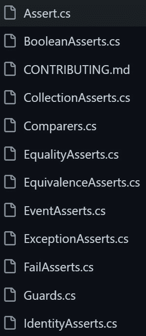

图 9.6 – 断言类部分列表

在我们的情况下，我们断言在运行`Init`之后，`PreferenceList`不为空。打开**测试资源管理器**，然后点击**运行视图中的所有测试**按钮，如图所示：


图 9.7 – 运行视图中的所有测试按钮

测试运行后，测试资源管理器会给我们显示结果，如下图所示：

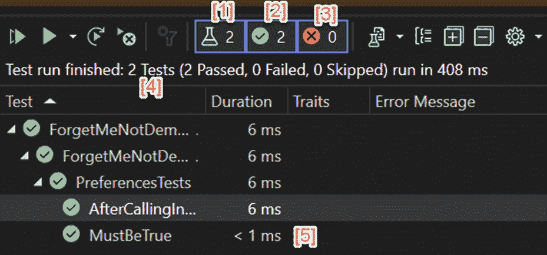

图 9.8 – 测试资源管理器结果

让我们看看图中每个编号选项的含义：

[1] 测试数量

[2] 通过的测试数量

[3] 失败的测试数量

[4] 测试的总结和持续时间说明

[5] 在文本所在上下文中的每个通过的测试。绿色勾号表示通过，红色叉号表示失败。注意，每个测试的时间都被列出。还要注意，测试最多花费了 6 毫秒，但整个测试套件花费了 408 毫秒。这种差异是开始测试过程的开销。这很快就会被所有测试的时间所淹没。

## 这个测试有什么问题？

我之前提到，这个测试有两个显著的缺陷。第一个是调用`Init`可能不会填充`PreferenceList`，因为服务可能返回零条记录。我们需要通过断言`PreferenceList`不是 null 来调整这一点。

第二个，更重要的问题是，这个测试依赖于运行`PreferenceService`。如果我们检查`PreferenceService`的代码，我们会看到对`GetPreferences`的调用有一个重大问题：

```cs
public async Task<List<Preference>> GetPreferences()
{
  return await GetPreferencesMock();
}
```

目前，在开发应用程序时，我们调用`GetPreferencesMock`，这只是在`PreferenceService`中的一个方法。但那不是我们完成应用程序的方式。在*第十一章*中，我们将将其转换为进行 API 调用。API 调用可能需要不确定的时间，并且可能会使我们的测试停止。

为了解决这个问题，我们需要一个快速返回且返回可预测集合（或如果我们想测试这种情况，则为空集合）的模拟`PreferenceService`。

# 模拟

经常在测试时，你需要与一个需要不确定时间的方法进行交互，例如从数据库中检索数据，或者更糟糕的是，从 API（即从互联网而不是从你的设备本地）中检索数据。

调用此类方法可能会使你的单元测试突然停止，使其几乎无法使用。为了避免这种情况，我们使用一个名为 **模拟** 的对象创建数据库或 API 的假表示。

模拟提供了两个优点：它们会立即响应，也许更重要的是，它们的响应是可预测的。一旦编写，它们提供相同的输入，模拟将始终提供相同的输出。

为了使用模拟，我们需要为我们的一些类实现依赖注入，所以让我们从这里开始。

# 依赖注入

到目前为止，每次我们需要在类内部使用一个对象时，我们都是传入该对象，或者在类的主体中创建它。这会创建一个 `PreferencesViewModel`，我们需要一个 `PreferenceService` 对象。我们迄今为止采取的方法是在构造函数中 *new 一个*：

```cs
private readonly PreferenceService service;
public PreferencesViewModel()
{
  service = new();
}
```

依赖注入解耦了类，并允许进行更强大的单元测试，正如我们在继续讨论模拟时将看到的。我们不想 *new 一个* `PreferenceService`，而是想传入一个接口，让 .NET MAUI 为我们创建它（也就是说，没有调用函数会将接口添加到构造函数调用中 – 这将自动完成）。

不仅用于测试

依赖注入可以在你的整个项目中使用，而不仅仅是用于单元测试。实际上，当与 **控制反转**（**IoC**）容器结合使用时，依赖注入为在整个应用程序中解耦对象创建了一个强大的模式。关于 IoC 容器的内容将在后面介绍。

## 创建接口

要做这件事，我们首先需要创建一个 `IPreferenceService` 接口。

Resharper

接下来我将展示的内容都将使用 **Resharper**，这是严肃的 .NET MAUI 程序员的一个必备工具，但它不是免费的。你当然可以手动完成所有这些；只是 Resharper 让它变得容易得多。由于我强烈推荐购买 Resharper，我将展示如何使用该工具完成以下操作。（请注意，作为微软 MVP，我免费获得我的 Resharper 复制品。）

首先，转到 **解决方案资源管理器**，打开 **PreferenceService**，然后按照以下步骤操作：

1.  右键单击类名，选择 **重构此**。将出现一个如图所示的上下文菜单：

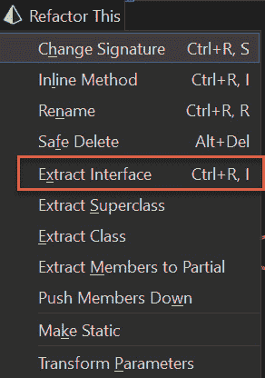

图 9.9 – 重构上下文菜单

1.  选择 **提取接口**，将出现一个如图所示的对话框：

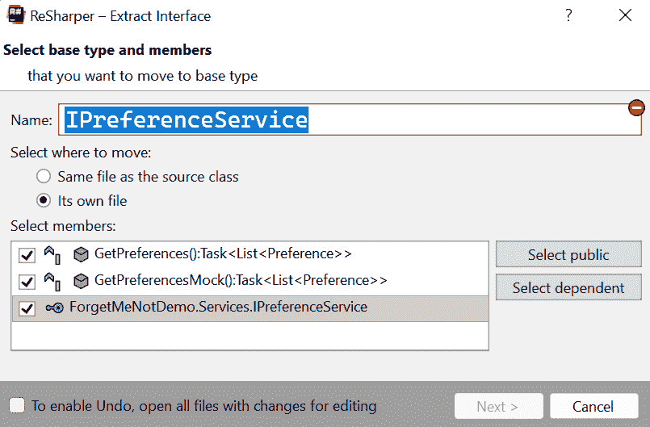

图 9.10 – 提取接口

1.  确保选中所有公共方法，并选择将接口移动到 **其自己的文件** 单选按钮。

嘿，奇迹！你将在同一目录（`Services`）中有一个接口文件，如图 *图 9.11* 所示：

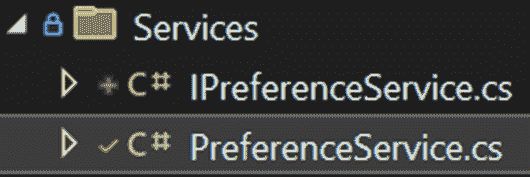

图 9.11 – 在服务文件夹中创建新的接口文件

打开你的新文件，你会看到一个典型的 C# 接口：

```cs
public interface IPreferenceService
{
  public Task<List<Preference>> GetPreferences();
  public Task<List<Preference>> GetPreferencesMock();
}
```

现在，检查原始的 `PreferenceService`。Resharper 足够友好地指定了 `PreferenceService` 实现 `IPreferenceService`：

```cs
public class PreferenceService : IPreferenceService
```

请将 `PreferenceService.GetPreferencesMock` 公开。

使用接口，我们可以使用构造函数注入——也就是说，我们可以定义我们将要传递接口实例到构造函数中，然后传递实现该接口的任何内容。

## 修改类构造函数

让我们回到 `PreferencesViewModel`。由于我们知道我们将使用依赖注入将 `PreferenceService` 发送到 `ViewModel`，我们可以修改 `PreferenceService` 的声明和构造函数：

```cs
Private readonly IPreferenceService service;   [1]
public PreferencesViewModel(IPreferenceService service) [2]
{
  this.service = service; [3]
}
```

[1] 我们将局部服务成员更改为接口。

[2] 我们将 `IPreferenceService` 传递到构造函数中。

[3] 我们将成员分配给传入的参数。

但是谁调用带有 `IPreference` 服务的 `PreferencesViewModel`，那个方法又是从哪里获取它的？

答案是 IoC 容器负责所有这些。

## .NET MAUI IoC 容器

.NET MAUI 内置了一个 IoC 容器，我们通过注册我们想要管理的接口来使用它。你可以在 `MauiProgram.cs` 中的 `CreateMauiApp` 方法中这样做：

```cs
public static MauiApp CreateMauiApp()
{
    var builder = MauiApp.CreateBuilder(); [1]
     builder
    .UseMauiApp<App>()
    .UseMauiCommunityToolkit()
    .UseMauiCommunityToolkitMarkup()
    .ConfigureFonts(fonts =>
    {
      fonts.AddFont("OpenSans-Regular.ttf",
        "OpenSansRegular");
      fonts.AddFont("OpenSans-Semibold.ttf",
        "OpenSansSemibold");
    })
    .UseMauiMaps();
if DEBUG
    builder.Logging.AddDebug();
endif
    return builder.Build();
}
```

如 `[1]` 中所示，我们首先实例化一个 `MauiAppBuilder` 对象。然后，我们在构建器上附加了许多其他配置要求。

我们将使用它来注册所有接口到我们的服务中。实际上，我们还将注册我们的视图和 ViewModels，这样我们就可以通过依赖注入将它们传递到方法中。

## 注册你的接口、服务和 ViewModels

.NET MAUI 提供了一个 IoC 容器。通过注册我们的接口、服务等，.NET MAUI 将在我们需要时提供所需的内容，而无需我们手动创建实例。除此之外，IoC 容器还将解决所有依赖关系。

要注册 `IPreferences` 接口，我们添加一个调用 `Builder.Services.AddTransient`，传入接口和实现该接口的类：

```cs
builder.Services.AddTransient<IPreferenceService,
  PreferenceService>();
```

`Builder.Services` 提供了两种注册接口的方式：

+   `AddTransient`

+   `AddSingleton`

当你可能或可能不会实例化对象时，你会使用 `AddTransient`（我们可能永远不会查看用户的偏好设置，因此可能永远不会需要该服务）。当你知道你将需要该对象，并且创建多个对象没有意义时，你会使用 `AddSingleton`。

当我们在这里时，让我们注册所有 ViewModels。我们不需要为它们提供接口，因为我们不会通过依赖注入将它们传递到任何地方：

```cs
builder.Services.AddTransient<AboutViewModel>();
builder.Services.AddTransient<BuddiesViewModel>();
builder.Services.AddTransient<BuddyDetailsViewModel>();
builder.Services.AddTransient<PreferencesViewModel>();
builder.Services.AddTransient<LoginViewModel>();
```

将它们组合起来，这就是现在的 `CreateMauiApp` 看起来的样子：

```cs
public static MauiApp CreateMauiApp()
{
    var builder = MauiApp.CreateBuilder();
  builder
    .UseMauiApp<App>()
    .UseMauiCommunityToolkit()
    .UseMauiCommunityToolkitMarkup()
    .ConfigureFonts(fonts =>
    {
      fonts.AddFont("OpenSans-Regular.ttf",
         "OpenSansRegular");
      fonts.AddFont("OpenSans-Semibold.ttf",
         "OpenSansSemibold");
    })
    .UseMauiMaps();
if DEBUG
    builder.Logging.AddDebug();
endif
  builder.Services.AddTransient<IPreferenceService,
    PreferenceService>();
  builder.Services.AddTransient<AboutViewModel>();
  builder.Services.AddTransient<BuddyDetailsViewModel>();
  builder.Services.AddTransient<PreferencesViewModel>();
  builder.Services.AddTransient<LoginViewModel>();
  return builder.Build();
}
```

注意，所有的注册都是在我们在 `Builder` 对象上调用 `Build` 的结果返回之前发生的。

我们将使用依赖注入来注入模拟对象，这些对象通常会被用于不可预测的时间。也就是说，我们不必等待数据库或 API 调用，我们可以注入一个模拟数据库或模拟服务，并立即得到一个可预测的响应。

我们的第一步是决定使用哪个模拟库。

# 使用 NSubstitute 包

有许多不同的模拟库可供选择，有些是免费的，有些是商业的。对于这本书，我们将使用**NSubstitute**，这是一个开源且免费的选项，可以作为 NuGet 包使用。

要开始，请按照以下步骤操作：

1.  右键单击你的解决方案，选择**ManageNugetPackagesForSolution**。

1.  前往`NSubstitute`。

你想要的第一包是 Anthony Egerton 等人编写的**NSubstitute**，如图所示：

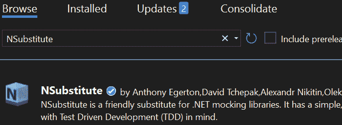

图 9.12 – NSubstitute NuGet 包

1.  在右侧，点击你想要添加此内容的工程（`ForgetMeNotDemo.Tests`），然后点击**Install**，如图*图 9.13*所示：

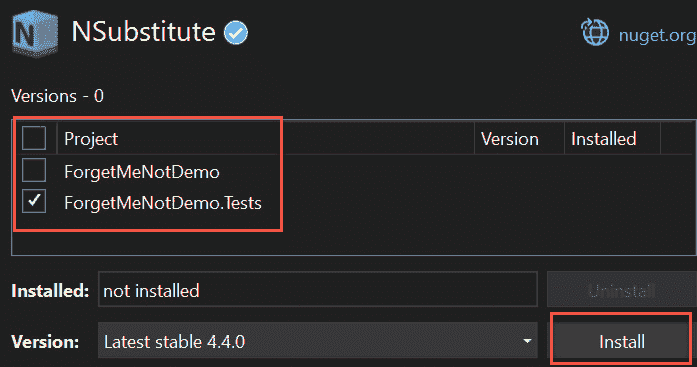

图 9.13 – 安装 NSubstitute

1.  安装完成后，安装**NSubstitute.Analyzers.CSharp**，如图所示：

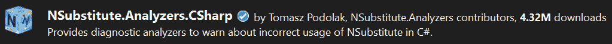

图 9.14 – 选择 NSubstitute.Analyzers.CSharp

虽然不是强制性的，但这个第二个库将检测你在使用 NSubstitute 时可能犯的错误。像之前一样将其安装到测试项目中。

## 将 NSubstitute 添加到测试固定装置中

要将 NSubstitute 添加到测试固定装置中，请将`using NSubstitute;`添加到 C#文件的顶部。

我们现在可以创建`PreferenceService`的替代品。

模拟依赖于构造函数依赖注入

转到`PreferencesViewModel`的构造函数，注意服务被注入为一个接口：

`public` `PreferencesViewModel(IPreferenceService service)`

`{`

`this.service =` `service;`

`}`

这非常重要。模拟只与构造函数注入一起工作。

在我们的单元测试中，让我们为服务声明一个模拟：

```cs
[Fact]
public async void AfterCallingInitPreferencesIsNotEmpty()
{
  // Arrange
  var service = Substitute.For<IPreferenceService>();   [1]
  var = new PreferencesViewModel(service); [2]
  // Act
  await preferencesViewModel.Init();
  // Assert
  Assert.NotEmpty(preferencesViewModel.PreferenceList);
}
```

[1] 声明`IpreferenceService`的模拟。

[2] 将该模拟传递给`PreferencesViewModel`构造函数。

运行测试。它因集合不能为空而失败。为什么？

原始服务返回一个`Preference`对象列表，但我们的新模拟不是。我们需要教会模拟返回一组可预测的`Preference`对象。

这里是`Arrange`方法的顶部，我们在其中创建了一些`Preference`对象，然后将它们添加到一个列表中：

```cs
public async void AfterCallingInitPreferencesIsNotEmpty()
{
  // Arrange
  Preference pref1 = new()
  {
    Id = 1,
    PreferencePrompt = "Shirt Size",
    PreferenceValue = "Large"
  };
  Preference pref2 = new()
  {
    PreferencePrompt = "Favorite Music Genre",
    PreferenceValue = "Jazz"
  };
  List<Preference> prefs = new()
  {
    pref1,
    pref2
  };
```

我们现在可以创建我们的替代品：

```cs
var serviceMock = Substitute.For<IPreferenceService>(); [1]
  serviceMock.GetPreferences() [2]
  .Returns(prefs); [3]
```

[1] 创建模拟。

[2] 告诉模拟它将模拟哪个方法。

[3] 告诉模拟在调用该方法时应该返回什么。

我们使用模拟来调用`PreferencesViewModel`构造函数，你将记得它需要`IpreferenceService`：

```cs
preferencesViewModel = new PreferencesViewModel
  (serviceMock);
```

在测试的`Act`部分，我们将对那个`PreferencesViewModel`对象调用`Init`，然后断言列表不为空。这次会成功，因为所依赖的服务现在可以预测会返回两个首选项的列表。

## 测试边缘情况

如果`PreferenceService`没有返回记录会发生什么？这会导致`ViewModel`崩溃吗？我们可以测试这一点：

```cs
  [Fact]
  public async void AfterCallingInitPreferencesIsEmptyButNo
    Exception()
  {
    // Arrange
    List<Preference> preferences = new(); [1]
    var serviceMock = Substitute.For<IPreferenceService>();
    serviceMock.GetPreferences()
      .Returns(preferences); [2]
    preferencesViewModel = new PreferencesViewModel
      (serviceMock);
    // Act
    var exception = await Record.ExceptionAsync (async ()
      => await preferencesViewModel.Init()); [3]
    // Assert
    Assert.Null(exception); [4]
  }
```

[1] 将`List<Preference>`设置为空。

[2] 让服务返回空的首选项列表。

[3] 使用`Record.ExceptionAsync`并传入对`Init`的调用。这将返回异常或 null，如果没有抛出异常。

[4] 断言没有抛出异常。

所有 NSubstitute 用法的完整描述可在[`nsubstitute.github.io/help.html`](https://nsubstitute.github.io/help.html)找到。

# 摘要

在本章中，我们回顾了编写单元测试和全面测试程序的重要性。简而言之，单元测试允许你自信地编码，知道如果你进行更改并且它破坏了看似无关的东西，你将立即发现。

我们看到，有时你的单元测试必须与较慢的外部系统（API、数据库等）交互，并且你可以通过使用模拟来保持亚秒级响应时间；我们选择的模拟库是`NSubstitute`，尽管还有其他免费的模拟系统（一个非常流行的是**Moq**）。

为了便于使用模拟，我们探讨了依赖注入并简要回顾了 IoC 容器的作用。在下一章*消费 REST 服务*中，我们将查看从基于云的服务（Azure）获取数据，而不是模拟数据。

# 问答

1.  为什么编写单元测试很重要？

1.  你将测试的大部分代码在哪里？

1.  为什么使用模拟？

1.  为什么依赖注入对模拟很重要？

# 你试试看

识别 ViewModel 或服务中与 API 或数据库交互的方法，并编写一个使用模拟的单元测试。

# 第三部分 - 高级主题

在本节的最后一部分，我们将深入探讨忍者级别的主题，包括如何与基于 REST 的服务（在我们的案例中是 Azure）进行交互，以及如何根据运行时数据修改我们应用程序的外观。

本部分包含以下章节：

+   *第十章*，*消费 REST 服务*

+   *第十一章*，*探索高级主题*
