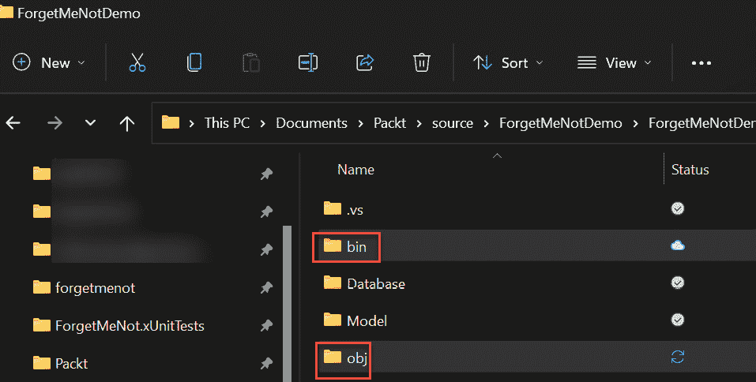
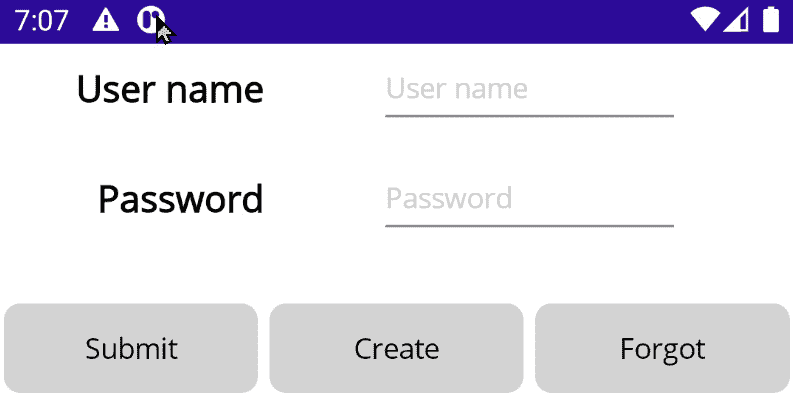
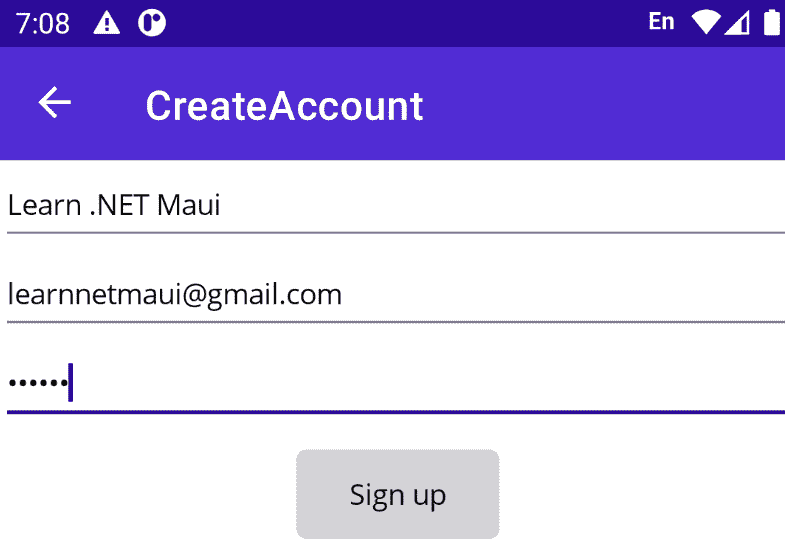
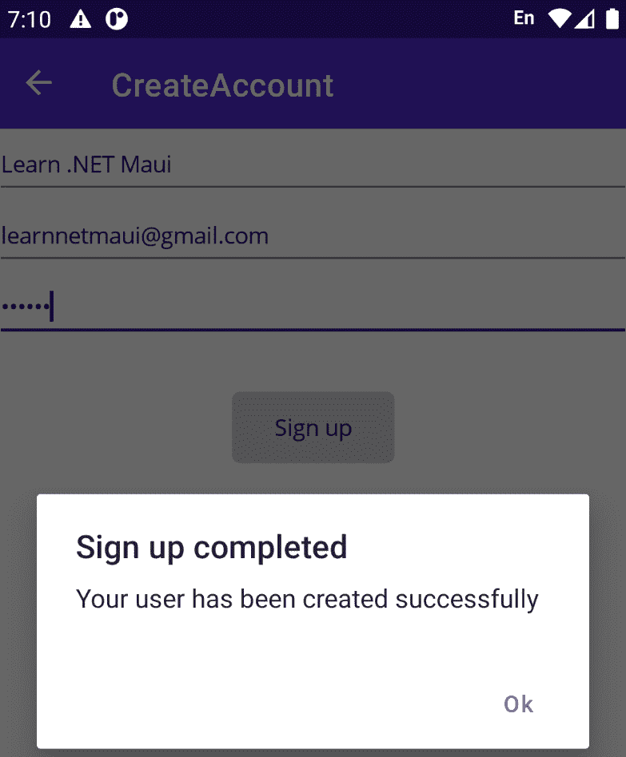
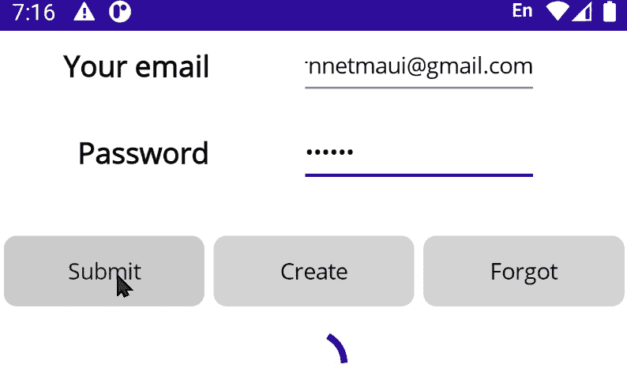

# 消费 REST 服务

到目前为止，当我们需要数据时，我们通过使用硬编码的对象来伪造它。然而，在现实世界的程序中，你将大部分数据从本地数据库（如*第八章*中讨论的）中获取，或者你将通过 API 与云中的服务交互。你可以使用几种架构之一进行交互，其中最流行的是 .NET MAUI 的 **表示状态转移**（**REST**）。

REST 是一种描述类如何在互联网上交互的模式。REST 的关键是它是无状态的——也就是说，客户端和 API 之间不需要持续连接。

忘不了架构被设计为使用 REST 服务和数据库，这将管理会员资格、身份验证和用户数据的持久化。在本章中，我们将查看以下内容：

+   使用 REST 服务

+   忘不了 API 架构

+   API 领域对象

+   **数据传输对象**（**DTOs**）

+   API 客户端类

+   使用 API

# 技术要求

要跟随本章内容，你需要 Visual Studio。如果你打算在跟随时输入代码，你将需要上一章的分支。

本章完成项目的源代码可以在[`github.com/PacktPublishing/.NET-MAUI-for-C-Sharp-Developers/tree/REST`](https://github.com/PacktPublishing/.NET-MAUI-for-C-Sharp-Developers/tree/REST)找到。

# 使用 REST 服务

到目前为止，我们所做的一切工作都是本地化的（一个手机、Windows 或 Mac）。忘不了的设计涉及到在云端使用一个服务来管理我们所有的数据——程序邀请、注册、身份验证、数据持久化等等。

客户端通过 **REST API**（也称为 RESTful API）与服务器交互。

一个 `ForgetMeNot.API`。

了解更多关于 REST

对于我们的目的来说，这就是你需要了解的所有关于 REST 的内容，但如果你好奇，你可以在[`en.wikipedia.org/wiki/Representational_state_transfer`](https://en.wikipedia.org/wiki/Representational_state_transfer)上找到更多信息。

# 忘不了 API 架构

当我们在*第八章*中查看获取用户偏好时，我们使用了偏好服务。这个服务，直到现在，使用了一种返回硬编码值的方法。当然，这是一个临时的权宜之计，这样我们就可以一次专注于一件事情。我们现在准备好与在线 API 交互了。

服务在哪里？

我已经在 Azure 上创建了一个在线的 Web 服务，网址是[`forgetmenotapi20230113114628.azurewebsites.net/`](https://forgetmenotapi20230113114628.azurewebsites.net/)。

我的目的是保持这个服务的运行，以便你可以实现客户端并得到有意义的结果，但鉴于可能存在维护成本，在你阅读这段文字的时候，该服务可能已经不再可用。如果是这样，你仍然可以通过阅读 API 代码和使用硬编码的数据来获得你需要的 95%，就像我们到目前为止所做的那样。

此外，请注意，仅仅访问 URL 是没有用的。只有当我们结合基本 URL 和特定任务相关的补充时，才会发生魔法。你可以通过创建一个账户或登录一个账户来测试 API 是否仍然可用。如果这可行，那么 API 的其余部分也应该可以正常工作。

为了方便我们与 API 的 REST 交互，我们将使用非常流行的开源 `RestSharp` 库 ([`restsharp.dev/`](https://restsharp.dev/))。它将为我们做所有繁重的工作。（我们将使用 `class` 库模板。）

## 创建项目

要开始，我们需要三个新的项目。右键单击 **解决方案** 并选择 **添加新项目**。这三个项目的名称是：

+   `ForgetMeNot.API.Domain` (API 域对象)

+   `ForgetMeNot.API.Dto` (DTOs)

+   `ForgetMeNot.ApiClient` (API 的包装器)

`Api.Doman` 和 `API.Dto` 都是类库。`APIClient` 是一个 `webapi`。

我们将依次查看这些项目，填写所有详细信息。

因为我们将使用 API 数据库，我们可以删除本地 SQLite 数据库。为此，注释掉或删除 `Constants` 文件和整个 `ForgetMeNotDemoDatabase.cs` 文件。

## 完善模型

在我们创建与我们的模型类中的项目对应的类之前，我们需要完善它们。

让我们从 `Model` 目录中的 `Preference` 类开始。我们为 SQLite 添加了一个 `Id` 属性；我们不再需要它了，所以我们可以将其删除。同时，从 `PreferencesTests.AfterCallingInitPreferencesIsNotEmpty()` 中也删除它。

设计规范说明，用户可以邀请朋友成为伙伴。我们需要添加一个模型来描述邀请：

```cs
using CommunityToolkit.Mvvm.ComponentModel;
namespace ForgetMeNotDemo.Model;
[ObservableObject]
public partial class Invitation
{
  [ObservableProperty] private string buddyCode;
  [ObservableProperty] private int buddyId;
}
```

类似地，我们需要跟踪 *场合*，例如生日和周年纪念日，以便我们记得使用“忘不了”来购买礼物：

```cs
[ObservableObject]
public partial class Occasion
{
  [ObservableProperty] private string name;
  [ObservableProperty] private DateTime date;
  [ObservableProperty] private int numDaysToNotify;
}
```

我们还需要几个额外的 `Model` 类，例如 `User` 和它的派生类 `Buddy`。应用的所有者是一个用户，以及他们所有的伙伴。以下是 `User` `Model` 类：

```cs
[ObservableObject]
public partial class User
{
  [ObservableProperty] private string name;
  [ObservableProperty] private string id;    [1]
  [ObservableProperty] private List<Buddy> buddies; [2]
  [ObservableProperty] private List<Invitation>
    invitations; [3]
  [ObservableProperty] private List<Preference>
    preferences; [4]
```

`[1]` 我们已经将 ID 迁移到了基类。对于（现在不再存在的）本地数据库，我们不再需要它，但我们需要在服务器上使用 ID。它是一个字符串，因为服务器将创建一个 **全局唯一** **ID** (**GUID**)。

`[2]` 每个用户可以有任意数量的 `Buddies`。

`[3]` 每个用户可以发送任意数量的邀请。

`[4]` 每个用户将有一个 `Preference` 对象的列表。

注释掉的代码

注意，GitHub 仓库中现有的代码中，`invitations` 属性被注释掉了。请取消注释它。

`Buddy` 类在此基础上构建：

```cs
public partial class Buddy : User
{
  [ObservableProperty] private string emailAddress;
  [ObservableProperty] private string? phoneNumber;
  [ObservableProperty] private string? mailingAddressLine1;
  [ObservableProperty] private string? mailingAddressLine2;
  [ObservableProperty] private string? website;
  [ObservableProperty] private string? twitter;
  [ObservableProperty] private string? facebook;
  [ObservableProperty] private string? instagram;
  [ObservableProperty] private string? linkedIn;
  [ObservableProperty] private string? venmoName;
  [ObservableProperty] private InvitationStatus status;
  [ObservableProperty] private List<OccasionModel>
    occasions;
  [ObservableProperty] private DateTime buddySince;
}
```

注释掉的代码

目前，请不要取消注释`InvitationStatus`或`OccasionModel`。

我们存储了关于每个伙伴的大量信息，包括他们成为我们伙伴的时间、共享的场合以及我们发送给`Buddy`类的邀请状态。

# 检查 API 域对象

API 域对象是`客户端模型`类的超集。这是因为 API 需要一些在客户端不可见的数据。右键单击**ForgetMeNot.API.Domain**并创建以下类：

+   `InvitationStatus`

+   `Invite`

+   `Occasion`

+   `Related`

+   `Roles`

+   `User`

+   `UserPreference`

让我们逐一介绍它们，从`User`开始（注意，这个类使用了在以下代码中定义的`UserPreference`，所以不要构建，直到你有了这两个类）：

```cs
public class User
{
    public Guid Id { get; set; }
    public string FullName { get; set; }
    public string Email { get; set; }
    public string HashedPassword { get; set; }
    public bool IsEmailConfirmed { get; set; }
    public string Role { get; set; }
    public List<UserPreference> Preferences { get; set; }
}
```

如你所见，在服务器上，每个`User`实例都有一个唯一的 ID。大多数其他属性与客户端上的相同，尽管它们可能没有相同的标识符（例如，`FullName`而不是`Name`）。这不是问题，因为当我们从服务器获取对象时，我们会进行映射。

然而，有几个新的字段——例如，`IsEmailConfirmed`、`HashedPassword`和`Role`。这些由服务器用于身份验证。

让我们创建`Roles`文件。它是一个包含我们将支持的两种角色的静态类：

```cs
public static class Roles
{
    public static string Admin = "admin";
    public static string User = "user";
}
```

接下来，我们将关注`UserPreference`类。这对应于客户端`Model`文件夹中的`Preference`类：

```cs
public class UserPreference
{
    public string PreferencePrompt { get; set; }
    public string PreferenceValue { get; set; }
}
```

注意，API 在某些方面是独立于客户端的。我们用不同的名字调用这个类，并且没有使用代码生成器。

接下来，我们需要代表`Invitation`和`Occasion`的类。让我们从`Invitation`开始：

```cs
public class Invite
{
    public Invite()
    {
        Id = Guid.NewGuid();
    }
    public Guid Id { get; set; }
    public User CreatedByUser { get; set; }
    public User? AcceptedByUser { get; set; }
    public InvitationStatus Status { get; set; }
    public DateTime CreationDate { get; set; }
    public DateTime? EndDate { get; set; }
    public string InvitedUserName { get; set; }
    public string InvitedUserCustomMessage { get; set; }
}
```

这个类有一个`InvitationStatus`类型的属性。为此也创建一个文件。这只是一个枚举：

```cs
public enum InvitationStatus
 {
     Waiting,
     Expired,
     Accepted,
     Rejected
 }
```

这是`Occasion`类：

```cs
public class Occasion
{
    public Occasion()
    {
        Id = Guid.NewGuid();
    }
    public Guid Id { get; set; }
    public User? ForUser { get; set; }
    public string? OccasionName { get; set; }
    public DateTime Date { get; set; }
    public int NumDaysToNotify { get; set; }
}
```

`NumDaysToNotify`的目的允许用户指定他们希望在场合前多少天收到通知（这个功能留给你作为练习！）。

最后，我们添加一个将用户与其所有的`Occasions`和伙伴关联起来的类。注意，我们使用`User`作为`Buddy`，因为基类包含了我们所需的所有信息：

```cs
public class Related
{
    public Related()
    {
        Occasions = new List<Occasion>();
        Users = new List<User>();
    }
    public Guid Id { get; set; }
    public string RelatedDescription { get; set; }
    public List<User> Users { get; set; }
    public List<Occasion> Occasions { get; set; }
    public DateTime Since { get; set; }
}
```

这个项目就到这里了。没有方法；这实际上只是一组基于服务器的模型对象。

一旦我们有了模型，我们需要确定如何将数据从服务器传输到客户端以及从客户端传输回服务器。为此，我们需要 DTOs（数据传输对象）。

# 审查 DTOs

如你所猜，`ForgetMeNot.Api.Dto`项目将包含 DTOs。这些将对应于模型对象，但设计为在服务器和客户端之间来回传递。

项目引用

您需要从`ForgetMeNot.Api.Dto`添加一个项目引用到`ForgetMeNot.Api.Domain`。

让我们从`BuddyDto.cs`开始：

```cs
using ForgetMeNot.Api.Domain;
namespace ForgetMeNot.Api.Dto
{
    public class BuddyDto
    {
        public BuddyDto()
        {
        }
        public BuddyDto(User user)
        {
            UserId = user.Id;
            FullName = user.FullName;
            Email = user.Email;
            Preferences = new List<UserPreference>();
            if (user.Preferences?.Any(p =>
                p.PreferenceValue != null) ?? false)
            {
                Preferences = user.Preferences.Where(p =>
                    p.PreferenceValue != null).ToList();
            }
            Occasions = new List<OccasionDto>();
        }
        public Guid UserId { get; set; }
        public string FullName { get; set; }
        public string Email { get; set; }
        public List<UserPreference> Preferences { get; set; }
        public List<OccasionDto> Occasions { get; set; }
    }
}
```

注意，`Buddy`的构造函数接受`User`。如前所述，`Buddy`类从`User`派生，通过将`User`传递到构造函数中，我们可以设置`Buddy`的`User`属性。

注意我们还在使用 `OccasionDto` 对象的列表。这些在 `ForgetMeNot.Api.Dto` 项目中。

## 其他 DTO 文件

`ForgetMeNot.Api.Dto` 中的其他关键文件与模型类无关，而是客户端和服务器之间交换的数据，以方便管理账户——例如，`AccountCreateRequest`：

```cs
public class AccountCreateRequest
{
    public string FullName { get; set; }
    public string Email { get; set; }
    public string PlainPassword { get; set; }
}
```

在创建账户时，需要将所有这些发送到服务器。有一个 DTO 用于请求更新用户记录，它只包含 `Id`、`FullName` 和 `Email`。一个重要的 DTO 是 `UserResponse`，它包含与 `User` `Domain` 对象相对应的信息：

```cs
public class UserResponse
{
  public Guid Id { get; set; }
  public string FullName { get; set; }
  public string Email { get; set; }
  public bool IsEmailConfirmed { get; set; }
  public string Role { get; set; }
  public List<UserPreference> Preferences { get; set; }
  public UserResponse()
  {
  }
  public UserResponse(User user)
  {
    Id = user.Id;
    FullName = user.FullName;
    Email = user.Email;
    Role = user.Role;
    IsEmailConfirmed = user.IsEmailConfirmed;
    Preferences = user.Preferences;
  }
}
```

您传入一个 `User` 对象，`UserResponse` 会将其转换为 DTO。

同样，您可以将一个 `User` 对象传递到 `ProfileResponse` 中，并返回一个 `ProfileResponse` DTO：

```cs
public class ProfileResponse
{
  public Guid Id { get; set; }
  public string FullName { get; set; }
  public string Email { get; set; }
  public bool IsEmailConfirmed { get; set; }
  public string Role { get; set; }
  public List<UserPreference> Preferences { get; set; }
  public ProfileResponse(User user)
  {
    Id = user.Id;
    FullName = user.FullName;
    Email = user.Email;
    Role = user.Role;
    IsEmailConfirmed = user.IsEmailConfirmed;
    Preferences = user.Preferences;
  }
}
```

最后一个拼图是包裹 API 在客户端类中，以方便与云中的数据进行交互。

# 理解 ForgetMeNot.APIClient

第三个 API 项目 `ForgetMeNot.APIClient` 中只有一个类——`Client.cs`。这是客户端（`ForgetMeNotDemo`）将要与之交互的 REST 服务的包装器。

我们从四个成员变量开始：

```cs
public class Client
{
    RestClient client; [1]
    string baseUrl;   [2]
    string username;   [3]
    string password;
```

`[1]` 如前所述，`RestClient` 是我们用来管理 REST 交互的库（通过 NuGet 获取，如前所述）。

`[2]` `baseURL` 是所有 API 调用的前缀，在我们将 API 移动到 Azure 时创建。如前所述，它可在 [`forgetmenotapi20230113114628.azurewebsites.net/`](https://forgetmenotapi20230113114628.azurewebsites.net/) 找到。

`[3]` `username` 和 `password` 被客户端用来访问用户的记录。

`Client` 的构造函数接受 `baseUrl`，将其分配给字段，然后调用 `SetClient()`：

```cs
public Client(string baseUrl)
{
    this.baseUrl = baseUrl;
    SetClient();
}
void SetClient()
{
    var options = new RestClientOptions(baseUrl)  [1]
    {
        ThrowOnAnyError = false,
        MaxTimeout = 10000
    };
    client = new RestClient(options); [2]
}
```

`[1]` 我们希望为这个 REST 客户端创建的选项创建一个健壮的接口；我们不会在任何错误上抛出异常，并且不会在 10 秒内超时。

`[2]` 设置了选项后，我们可以创建一个新的 `RestClient`，它在 `RestSharp` 中定义。

文件的其他部分被划分为客户端的重要行为部分，从认证用户的代码开始。

## 认证

我们设置了一个 `IsAuthenticated` 属性，该属性设置为 `client.Authenticator` 是否为 `null`。

然后我们有一个 `Login` 方法，它接受一个 `LoginRequest` 对象，设置 `username` 和 `password`，并调用 `Authenticate`：

```cs
public async Task Login(LoginRequest request)
{
    username = request.Username;
    password = request.Password;
    await Authenticate();
}
```

项目参考

您需要参考 DTO 项目。

`LoginRequest` 在 DTO 项目中定义，并且仅有两个字符串属性，`Username` 和 `Password`（参考以下代码块）。

`Authenticate` 方法使用 `RestSharp` 的 OAuth 认证——也就是说，繁重的工作再次由 `RestSharp` 完成：

```cs
async Task Authenticate()
{
    var request = new RestRequest("auth/gettoken");
    request.AddBody(new { username, password });
    var accessToken = await client.PostAsync<string>
        (request);
    client.Authenticator = new OAuth2Authorization
        RequestHeaderAuthenticator(accessToken, "Bearer");
}
```

幸运的是，您不需要理解如何实现这一功能；您只需传入用户名和密码，`RestSharp` 会为您处理其余部分。

客户端与客户端

记住，即使你处于 `Client` 类中，`client` 字段也是 `RestSharp` 对象。

我们有一个辅助方法来获取当前的 API 版本：

```cs
public Task<string?> Version()
{
    var request = new RestRequest("util/version");
    return client.GetAsync<string?>(request);
}
```

这将带我们到文件的配置文件部分，在那里我们可以获取和更新 `profile` 对象。

## 配置文件

需要两个方法来处理配置文件。第一个是获取配置文件：

```cs
public Task<ProfileResponse?> GetProfile()
{
    var request = new RestRequest("profile/me");
    return client.GetAsync<ProfileResponse?>(request);
}
```

这使用了之前检查过的 `ProfileResponse` DTO。本节中的第二个方法是用来更新配置文件的：

```cs
public Task UpdateProfile(ProfileUpdateRequest
    profileUpdateRequest)
{
    var request = new RestRequest("profile/me");
    request.AddBody(profileUpdateRequest);
    return client.PutAsync(request);
}
```

这段代码使用了在 `ForgetMeNot.Api.Dto` 中定义的 `ProfileUpdateRequest` 对象。

同样，这里所有有趣的工作都是由 `RestSharp` 完成的。正如你所见，客户端实际上只是 `RestSharp` 方法的包装。

让我们通过查看更多用于管理 `Buddy` 对象的方法来加强这一点。

## 伙伴区域

这个区域包括我们需要与伙伴交互的方法，`GetBuddy` 和 `CreateInvitation`。`GetBuddy` 返回一个 `BuddyDto` 对象列表：

```cs
public Task<List<BuddyDto>?> GetBuddy()
{
    var request = new RestRequest("buddy");
    return client.GetAsync<List<BuddyDto>?>(request);
}
```

`CreateInvitation` 返回 `Guid`，这是结果 `Invitation` 对象的 `Id` 属性：

```cs
public Task<Guid?> CreateInvitation(InviteCreateRequest
  inviteCreateRequest)
{
    var request = new RestRequest("buddy/invite");
    request.AddBody(inviteCreateRequest);
    return client.PostAsync<Guid?>(request);
}
```

这段代码使用了在 `ForgetMeNot.Api.Dto` 中定义的 `InviteCreateRequest`。

最后，我们有一个方法来获取所有用户——也就是说，所有这些用户的伙伴：

```cs
public Task<List<UserResponse>?> GetUserList()
{
    var request = new RestRequest("user");
    return client.GetAsync<List<UserResponse>?>(request);
}
```

我们得到的是之前看到的 `UserResponse` DTO 对象列表。

现在我们已经检查了服务器提供的所有项目，我们就可以让 `ForgetMeNotDemo` 与 API 交互以获取、存储和检索数据。

# 使用 API

在 `Client` 类及其支持的 `DTO` 和 `API` 领域类就位后，我们就可以与 API 交互来创建账户和登录，以及存储和检索我们的偏好。

## 创建账户

新用户首先会创建一个账户。为了使这可行，我们需要将用户带到 `CreateAccount.xaml`，在那里他们可以填写他们的名字、电子邮件和密码。为了实现这一点，我们必须对 **登录** 和 **创建** **账户** 页面进行一些实质性的更改。

让我们首先将应用程序指向以登录开始。修改 `App.xaml.cs` 中的 `App` 方法，使其看起来像这样：

```cs
public App(LoginViewModel loginViewModel) [1]
{
  InitializeComponent();
  MainPage = new LoginPage(loginViewModel); [2]
}
```

`[1]` 让 IoC 容器传入 `LoginViewModel` 的一个实例。

`[2]` 将 `MainPage`（程序的入口点）设置为 `LoginPage`。

**登录** 页面的工作现在将是允许用户登录或将他们带到 **创建** **账户** 页面。

一定要在 `AppShell.xaml.cs` 中添加 `CreateAccount` 的路由：

```cs
Routing.RegisterRoute("createaccount",
  typeof(CreateAccountPage));
```

接下来，让我们修改 **登录** 页面。

## 修改登录页面

既然我们要将认证管理交给服务器，我们需要一个不同的 `LoginPage.xaml.cs` 并用这个简单版本替换它：

```cs
using CommunityToolkit.Maui.Core.Views;
using ForgetMeNotDemo.ViewModel;
namespace ForgetMeNotDemo.View;
public partial class LoginPage : ContentPage
{
  public LoginPage(LoginViewModel viewModel)
  {
    BindingContext = viewModel;
    InitializeComponent();
  }
}
```

`LoginViewModel` 由 `App` 传入，如前述代码所示。

现在，让我们修改 `LoginPage` 以专注于登录用户或将他们重定向到创建新账户。

## 更新登录页面

我们将对`LoginPage`进行一些重大更改。为了避免混淆，删除所有内容并替换为以下内容：

```cs
<?xml version="1.0" encoding="utf-8" ?>
<ContentPage
    x:Class="ForgetMeNot.View.LoginPage"
    xmlns="http://schemas.microsoft.com/dotnet/2021/maui"
    xmlns:x="http://schemas.microsoft.com/winfx/2009/xaml"
    xmlns:iOsSpecific="clr-namespace:Microsoft.Maui
      .Controls.PlatformConfiguration.iOSSpecific;
        assembly=Microsoft.Maui.Controls"
    Title="Login"
    iOsSpecific:Page.UseSafeArea="True"
    Shell.NavBarIsVisible="False"
    Shell.PresentationMode="ModalAnimated">
    <ContentPage.Resources>
        <ResourceDictionary>
            <Style x:Key="Prompt" TargetType="Label">   [1]
              <Setter Property="TextColor" Value="Black" />
              <Setter Property="FontSize" Value="Medium" />
              <Setter Property="FontAttributes"
                  Value="Bold" />
                <Setter Property="HorizontalTextAlignment"
                  Value="Center" />
                <Setter Property="VerticalTextAlignment"
                  Value="Center" />
                <Setter Property="VerticalOptions"
                  Value="Center" />
                <Setter Property="HorizontalOptions"
                  Value="End" />
            </Style>
            <Style x:Key="LoginButton" TargetType="Button">
              <Setter Property="BackgroundColor"
                Value="LightGray" />
              <Setter Property="Margin" Value="0,20,0,0" />
              <Setter Property="TextColor" Value="Black" />
             <Setter Property="WidthRequest" Value="125" />
            </Style>
        </ResourceDictionary>
    </ContentPage.Resources>
```

在样式设置到位后，我们准备创建`Labels`和`Entry`控件来获取用户的用户名和密码：

```cs
<VerticalStackLayout>
        <Grid
            ColumnDefinitions="*,*,*"
            RowDefinitions="Auto,Auto,Auto,Auto"
            RowSpacing="10">
            <Label
                Grid.Row="0"
                Grid.Column="0"
                Style="{StaticResource Prompt}"
                Text="User name" />
            <Entry
                Grid.Row="0"
                Grid.Column="1"
                Grid.ColumnSpan="2"
                Placeholder="User name"
                Text="{Binding LoginName}"
                WidthRequest="150" />
            <Label
                Grid.Row="1"
                Grid.Column="0"
                HorizontalOptions="End"
                Style="{StaticResource Prompt}"
                Text="Password" />
            <Entry
                Grid.Row="1"
                Grid.Column="1"
                Grid.ColumnSpan="2"
                IsPassword="True"
                Placeholder="Password"
                Text="{Binding Password}"
                WidthRequest="150" />
            <Button
                Grid.Row="2"
                Grid.Column="0"
                Command="{Binding DoLoginCommand}"
                Style="{StaticResource LoginButton}"
                Text="Submit" />  [2]
```

一旦用户填写了字段（或者由于他们忘记了密码而无法填写），我们将提供以下选项：

```cs
             <Button
                Grid.Row="2"
                Grid.Column="1"
                Command="{Binding DoCreateAccountCommand}"
                Style="{StaticResource LoginButton}"
                Text="Create Account" /> [3]
            <Button
                Grid.Row="2"
                Grid.Column="2"
                BackgroundColor="LightGray"
                Command="{Binding ForgotPasswordCommand}"
                Style="{StaticResource LoginButton}"
                Text="Forgot Password" /> [4]
        </Grid>
        <ActivityIndicator  [6]
            x:Name="activityIndicator"
            HeightRequest="50"
            IsRunning="{Binding ShowActivityIndicator}"
            Color="Blue" />
    </VerticalStackLayout>
</ContentPage>
```

`[1]` 我稍微扩展了两种样式，以最小化控件中的样式。

`[2]` 稍后点击`ViewModel`）。

`[3]` 点击`CreateAccount`页面。

`[4]` 忘记密码（正如他们所说）留作练习。

使用这个新的以 API 为导向的`LoginViewModel`。

## `AccountService`类

在更新`LoginViewModel`之前，我们需要创建`AccountService`类及其相关接口：

```cs
using ForgetMeNot.Api.Dto;
using ForgetMeNot.ApiClient;
using System;
using System.Collections.Generic;
using System.Linq;
using System.Text;
using System.Threading.Tasks;
namespace ForgetMeNotDemo.Services
{
  public class AccountService : IAccountService
  {
    readonly Client apiClient;
    public AccountService(Client apiClient)
    {
      this.apiClient = apiClient;
    }
    public async Task CreateAccount(AccountCreateRequest
      accountCreateRequest)
    {
      await apiClient.CreateAccount(accountCreateRequest);
    }
    public async Task GetNewPassword()
    {
    }
    public async Task Login(LoginRequest request)
    {
      await apiClient.Login(request);
    }
    public bool IsLoggedIn()
    {
      return apiClient.IsAuthenticated;
    }
  }
}
```

这个类用于账户的创建和验证。有了这个，我们就准备好更新`LoginViewModel`。

## 更新`LoginViewModel`

`LoginViewModel`必须更新以满足更新后的`LoginPage`类的新要求。再次，删除所有内容并替换为以下内容：

```cs
using CommunityToolkit.Mvvm.ComponentModel;
using CommunityToolkit.Mvvm.Input;
using ForgetMeNot.API.Dto;
using ForgetMeNotDemo.Services;
using ForgetMeNotDemo;
namespace ForgetMeNotDemo.ViewModel
{
  [ObservableObject]
  public partial class LoginViewModel
  {
    private AccountService;           [1]
    [ObservableProperty] private string loginName;
    [ObservableProperty] private string password;
    [ObservableProperty] private bool showActivityIndicator
      = false;
```

构造函数通过**控制反转**（**IoC**）容器传递给`AccountService`，并保留该服务以供其其他方法使用：

```cs
    public LoginViewModel(AccountService accountService)
      [2]
    {
      this.accountService = accountService;
    }
    [RelayCommand]
    public async Task DoLogin()
    {
      try
      {
        LoginRequest loginRequest = new LoginRequest [3]
        {
          Username = LoginName,
          Password = Password
        };
```

我们将设置`ActivityIndicator`在请求 API 登录用户时显示：

```cs
        ShowActivityIndicator = true;
        await accountService.Login(loginRequest); [4]
        ShowActivityIndicator = false;
        if (accountService.IsLoggedIn()) [5]
        {
          Application.Current.MainPage = new AppShell();
          await Shell.Current.GoToAsync("mainpage");
        }
        else [6]
        {
          await Application.Current.MainPage.DisplayAlert
            ("Login failure",
              "Your username and password do not match our
                records", "Ok");
        }
      }
      catch (Exception exception)
      {
        await Application.Current.MainPage.DisplayAlert
          ("Authorization failure",
            "Your username and password do not match our
              records", "Ok");
        Console.WriteLine(exception);
      }
```

实现管理忘记密码的逻辑留作练习：

```cs
    }
    [RelayCommand]
    public async Task ForgotPassword()
    {
[7]
    }
```

我们将创建新账户的责任委托给服务器：

```cs
    [RelayCommand]
    public async Task DoCreateAccount() [8]
    {
      try
      {
        Application.Current.MainPage = new AppShell();
        await Shell.Current.GoToAsync($"createaccount");
      }
      catch (Exception e)
      {
        Console.WriteLine(e);
      }
    }
  }
}
```

`[1]` 我们创建`AccountService`字段，它将在`ViewModel`和`Client`类之间进行调解。

`[2]` IoC 传递给我们需要的`AccountService`，我们将将其分配给刚刚创建的`AccountService`成员。

`[3]` 我们将用户名和密码打包成一个`LoginRequest`对象。我们从`ForgetMeNot.API.DTO`获取这个类：

```cs
public class LoginRequest
{
    public string Username { get; set; }
    public string Password { get; set; }
}
```

`[4]` 我们打开`ActivityIndicator`，将`LoginRequest`传递给 API，然后，当我们得到响应时，关闭`ActivityIndicator`。我们将在下一步查看`AccountService`实际上在做什么。

`[5]` 我们询问`AccountService`登录是否成功。如果是（愉快的路径），我们重置`MainPage`（远离`LoginPage`）并导航到那里。

`[6]` 如果登录失败（不愉快的路径），我们通知用户我们无法登录他们，并给他们另一个机会尝试。

`[7]` 本书将不会实现重置密码的代码。

`AccountService`负责登录。让我们看看下一个。

## 使用`AccountService`进行登录

为了安全起见，我们希望服务器负责根据电子邮件地址和密码验证用户：

```cs
public async Task Login(LoginRequest request) [1]
{
  await apiClient.Login(request);
}
public bool IsLoggedIn() [2]
{
  return apiClient.IsAuthenticated;
}
```

在`AccountService`的其他方法（我们将在稍后返回）中，以下两个方法是：

`[1]` 登录简单地将处理登录的责任委托给`apiClient`，通过*API*进行登录，传递包含用户名和密码的`LoginRequest`。

`[2]` 类似地，`IsLoggedIn`布尔方法使用`apiClient`来查看当前用户是否已*认证*。

用户还有第二个选项，即点击`CreateAccountPage`。

## 设置创建账户页面

**创建账户**页面提示用户输入用户名、密码以及他们的电子邮件。为了简化，在这个例子中，我们只要求输入一次密码，但我们确实实现了验证：

```cs
<?xml version="1.0" encoding="utf-8" ?>
<ContentPage
    x:Class="ForgetMeNotDemo.View.CreateAccountPage"
    xmlns="http://schemas.microsoft.com/dotnet/2021/maui"
    xmlns:x="http://schemas.microsoft.com/winfx/2009/xaml"
    xmlns:behaviors="http://schemas.microsoft.com/dotnet/
      2022/maui/toolkit"
    Title="CreateAccount">
    <VerticalStackLayout>
        <Entry
            HorizontalOptions="FillAndExpand"
            Keyboard="Text"
            Placeholder="Enter Name"
            Text="{Binding Name}">
            <Entry.Behaviors>
                <behaviors:UserStoppedTypingBehavior
                Command="{Binding  ValidateNameCommand}"
                StoppedTypingTimeThreshold="500" />  [1]
            </Entry.Behaviors>
        </Entry>
```

`[1]` 我们使用 Community Toolkit 的`StoppedTypingBehavior`来检测用户何时完成字段的输入。我们将`StoppedTypingTimeThreshold`设置为`500`——即半秒。这意味着一旦用户半秒内没有输入任何内容，我们就假设他们已经完成，并启动验证。注意，命令设置为`ValidateNameCommand`。这将在`ViewModel`中处理（如后文所示），并返回一个布尔值，表示用户是否输入了有效的名称：

```cs
        <Label
            FontSize="13"
            IsVisible="{Binding ShowNameErrorMessage}"
              [1]
            Text="{Binding NameErrorMessage}"
            TextColor="Red" />
        <Entry
            HorizontalOptions="FillAndExpand"
            Keyboard="Email"
            Placeholder="Enter Email"
            Text="{Binding Email}">
            <Entry.Behaviors>
                <behaviors:UserStoppedTypingBehavior
                  Command="{Binding ValidateEmailCommand}"
                    StoppedTypingTimeThreshold="500" />
                      [2]
            </Entry.Behaviors>
        </Entry>
```

`[1]` 只有当名称验证失败时才显示标签。

`[2]` 现在，像对名称一样对电子邮件进行相同的处理，当用户停止输入时调用`ValidateEmailCommand`：

```cs
        <Label
            FontSize="13"
            IsVisible="{Binding ShowEmailErrorMessage}"
            Text="{Binding EmailErrorMessage}"
            TextColor="Red" />
        <Entry
            HorizontalOptions="FillAndExpand"
            IsPassword="True"   [1]
            Keyboard="Default"
            Placeholder="Enter Password"
            Text="{Binding Password}">
            <Entry.Behaviors>
                <behaviors:UserStoppedTypingBehavior
                Command="{Binding ValidatePasswordCommand}"
                  StoppedTypingTimeThreshold="500" />
            </Entry.Behaviors>
        </Entry>
        <Label
            FontSize="13"
            IsVisible="{Binding ShowPasswordErrorMessage}"
            Text="{Binding PasswordErrorMessage}"
            TextColor="Red" />
        <Button
            Margin="0,30,0,0"
            BackgroundColor="LightGray"
            Command="{Binding SignUpCommand}" [2]
            CornerRadius="5"
            HorizontalOptions="Center"
            IsEnabled="{Binding EnableButton}"
            Text="Sign up"
            TextColor="Black"
            TextTransform="None"
            WidthRequest="100" />
    </VerticalStackLayout>
</ContentPage>
```

`[1]` 条目的`IsPassword`属性设置为`true`，当用户输入字符时，密码将显示为一串星号。

`[2]` 一旦字段有效，执行`Signup`命令。

所有的支持命令和验证都在`CreateAccountViewModel`中。

## 设置 CreateAccountViewModel

在这个文件中，我们看到的第一件事是所有的属性：

```cs
[ObservableProperty] accountService;
[ObservableProperty] private string name;
[ObservableProperty] private string email;
[ObservableProperty] private string password;
[ObservableProperty] private string nameErrorMessage;
[ObservableProperty] private string emailErrorMessage;
[ObservableProperty] private string passwordErrorMessage;
[ObservableProperty] private bool showNameErrorMessage;
[ObservableProperty] private bool showEmailErrorMessage;
[ObservableProperty] private bool showPasswordErrorMessage;
[ObservableProperty] private bool enableButton;
[ObservableProperty] private bool isValidName;
[ObservableProperty] private bool isValidEmail;
[ObservableProperty] private bool isValidPassword;
```

注意，除了提示外，还有错误消息的属性。还有一个布尔属性`EnableButton`，默认为`false`（如果你没有设置布尔值，它默认为`false`）。

构造函数接受通过 IoC 传递的`AccountService`（这在`MauiProgram.cs`中已注册）。更新客户端构造函数以接受一个作为`baseUrl`的字符串：

```cs
var apiClient = new Client("https://forgetmenotapi
  20230113114628.azurewebsites.net/");
builder.Services.AddSingleton(apiClient);
builder.Services.AddTransient<AccountService>();
```

我们将转向`CreateAccountViewModel`类：

```cs
public CreateAccountViewModel(AccountService
  accountService)
{
  this.accountService = accountService;
}
```

让我们检查一个`Validation`方法。

业务需求是有效的名称至少有两个字符。验证的代码是一个简单的`if`语句，如下所示：

```cs
[RelayCommand]
public Task ValidateName()
{
  if (!string.IsNullOrEmpty(Name) && Name.Length >= 2)
  {
    IsValidName = true;
    ShowNameErrorMessage = false;
    EnableButton = IsValidName && IsValidEmail &&
      IsValidPassword; [1]
  }
  else
  {
    NameErrorMessage = "*Please enter a name with at least
      two characters";
    IsValidName = false;
    ShowNameErrorMessage = true;  [2]
    EnableButton = IsValidName && IsValidEmail &&
      IsValidPassword;
  }
  return Task.CompletedTask;
}
```

`[1]` `EnableButton`属性（用于确定当名称、电子邮件和密码都有效时返回`true`）。

`[2]` 如果名称无效，则将`ShowNameErrorMessage`属性设置为`true`，并显示错误消息。

在下一章中，我们将探讨.NET MAUI 为更优雅的验证方法提供的支持。

在这个文件中最重要的命令是响应`SignUpCommand`的命令。

## 处理注册命令

`SignUp`方法检查确保字段有效（通过确保`EnableButton`为`true`），然后创建一个`AccountCreateRequest`对象，该对象定义在`ForgetMeNot.Api.Dto`中：

```cs
public class AccountCreateRequest
{
    public string FullName { get; set; }
    public string Email { get; set; }
    public string PlainPassword { get; set; }
}
```

将该对象传递给`accountService`上的`CreateAccount`方法。让我们看看`ForgetMeNot.Api.Dto AccountCreateRequest`中的整个方法：

```cs
[RelayCommand]
async Task SignUp()
{
  if (EnableButton)
  {
    AccountCreateRequest = new() [1]
    {
      Email = this.Email,
      FullName = Name,
      PlainPassword = Password
    };
    try
    {
      await accountService.CreateAccount
        (accountCreateRequest); [2]
      await Application.Current.MainPage.DisplayAlert(
        "Sign up  completed",
          "Your user has been created successfully", "Ok");
            [3]
      await Shell.Current.GoToAsync(".."); [4]
    }
    catch (Exception e)
    {
      await Application.Current.MainPage.DisplayAlert("Sign
        up failed",
          "We were not able to create an account with that
            user name", "Ok");
    }
  }
}
```

`[1]` 首先创建 `AccountCreateRequest` 对象，如前所述。

`[2]` 在服务上调用 `CreateAccount`。我们稍后将查看该方法。

`[3]` 如果一切正常，显示一个对话框（或者，如我们之前所做的那样，一个吐司）。

`[4]` 一旦创建用户账户，就返回一页到 **登录** 页面。

`AccountService` 中的 `CreateAccount` 方法所做的只是将 `AccountCreateRequest` 对象传递给 `apiClient` 的 `CreateAccount` 方法。

这里描述的机制就其本身而言是正确的，但它们不包括最终应用程序应该有的邀请响应（用户邀请一个朋友，然后创建账户）。

我们不要忘记，我们最初创建 `LoginCS` 是为了模仿 C# 中的 XAML。你需要调整 `LoginCS` 以匹配 XAML 文件中的命名约定，或者完全注释掉它，因为我们不再使用它。

是时候运行程序并确保我们所做的一切都正常工作了。然而，当你进行这么多更改时，有时你可能会遇到无法解释的构建错误。

## 如果无法构建怎么办

假设你已经检查了所有代码，它是正确的，但你遇到了奇怪的构建错误（例如 `InitializeComponents not found`），那么可能是时候清理一切了。为此，关闭 Visual Studio 并导航到你的文件所在的文件夹。删除每个项目中的 `bin` 和 `obj` 目录，如图 *图 10*.1* 所示。



图 10.1 – 删除 bin 和 obj 目录

请按照以下步骤操作：

1.  重新启动 Visual Studio 并立即从菜单中选择 **构建** | **清理解决方案**。最后，选择 **构建** | **重新构建解决方案**，这将强制进行完整的重新构建而不是增量构建。给你的项目一点时间来稳定并运行它。

你应该直接被带到 **登录** 页面，如图中所示：



图 10.2 – 登录页面

1.  接下来，点击 `Entry` 控件的 `Placeholder` 属性。



图 10.3 – 创建账户页面

1.  填写字段并点击 **注册**。你的账户将在服务器上创建，并将出现一个对话框来通知你操作成功，如图 *图 10*.4* 所示。



图 10.4 – 成功注册

如果你尝试登录，你会收到一个 `unauthorized` 消息。问题是系统不想要用户名；它想要用户的电子邮件。

未授权

当然，任何错误的用户名或无效的密码都会收到未授权的消息。

让我们修复 `LoginPage.xaml` 并登录，如图 *图 10*.5* 所示。



图 10.5 – 使用我们的新账户登录

当登录验证成功后，你将被直接带到主页。

重要的是要注意并享受这样一个事实：账户创建和身份验证都通过 API 在云端进行。

# 摘要

在本章中，我们回顾了如何与 API 交互。通过检查 API 域和 DTO 项目，我们深入了解了这种交互的内部机制，并看到 `APIClient` 类如何封装所有 API 调用来简化客户端的体验并使其更加直观。

这是一个相对高级的话题，在下一章中，我们将深入探讨更多高级话题，帮助你从一名 .NET MAUI 新手程序员成长为专家。

# 问答

1.  什么是 DTO？

1.  为什么我们不需要本地 SQLite 数据库？

1.  API 客户端类的作用是什么？

1.  账户创建发生在哪里？

1.  身份验证发生在哪里？

# 你来试试

实现忘记密码的客户端代码。
