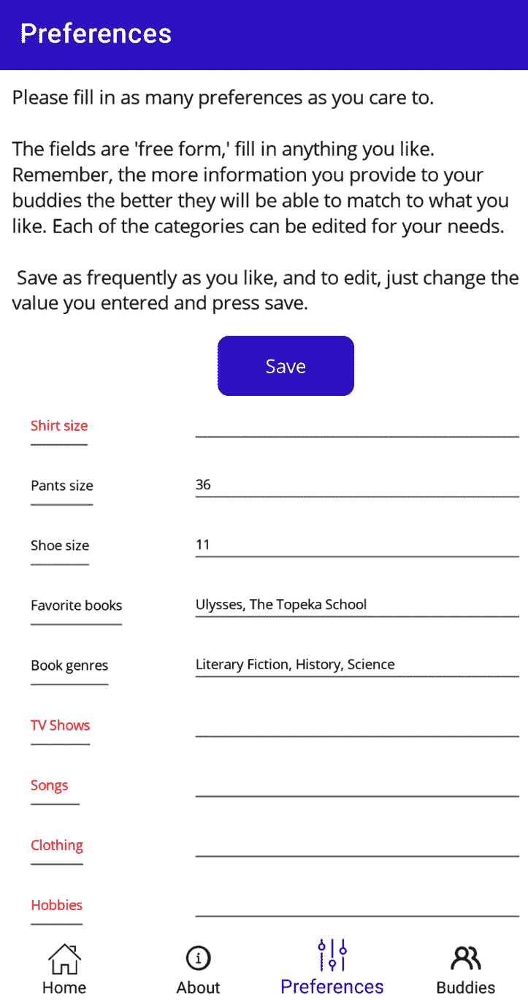
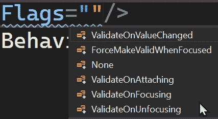
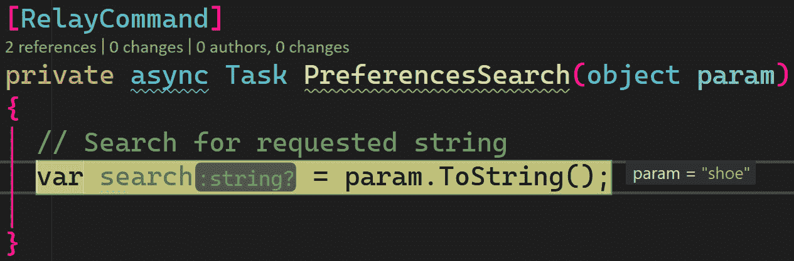
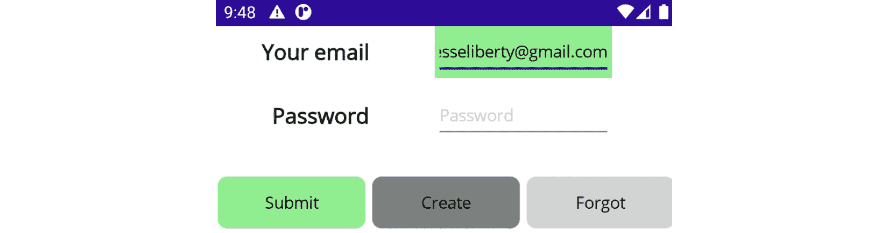

# 探索高级主题

现在，你拥有了中级.NET MAUI 程序员的技能和知识。你看到了如何布局控件以及管理和操作这些控件。然后你学习了 MVVM 设计模式。这些都是基础。

之后，你进阶到了 Shell 导航，使用 SQLite 进行数据持久化，以及编写单元测试的至关重要的技能。

这最后一章将带你超越这个水平，进入专家.NET MAUI 知识的领域。在本章中，我们将涵盖以下主题：

+   在运行时选择数据模板

+   管理视觉状态

+   利用社区工具包的行为

+   使用触发器采取行动

+   验证表单

# 技术要求

本章的源代码可以在[`github.com/PacktPublishing/.NET-MAUI-for-C-Sharp-Developers/tree/AdvancedTopics`](https://github.com/PacktPublishing/.NET-MAUI-for-C-Sharp-Developers/tree/AdvancedTopics)找到。如果你希望跟随，请确保使用上一章的代码。

# 在运行时选择数据模板

你在*第五章*中看到了数据模板在集合视图中使用的情况。现在让我们重新审视那段代码，并在此基础上进行扩展，以便我们能够在运行时根据对象本身的数据修改每个对象的显示。

回顾一下，我们是从`PreferenceService`开始的，我们模拟了获取`Preference`对象列表的过程。现在，我们只需稍作工作就可以从 API 中获取它。修改`IPreferenceService`以移除`GetPreferencesMock`。

接下来，我们需要对`PreferenceService`进行重大重构以与客户端交互。删除你有的内容，并使用以下内容：

```cs
using ForgetMeNot.ApiClient;
using ForgetMeNotDemo.Model;
namespace ForgetMeNotDemo.Services;
public class PreferenceService : IPreferenceService
{
  readonly Client apiClient;
  public PreferenceService(Client apiClient)
  {
    this.apiClient = apiClient;
  }
  public async Task<List<Preference>> GetPreferences()
  {
    try
    {
      var response = await apiClient.GetProfile();
      return response?.Preferences.Select(p => new
         Preference
      {
        PreferencePrompt = p.PreferencePrompt,
        PreferenceValue = p.PreferenceValue
      }).ToList();
    }
    catch (Exception e)
    {
      await Application.Current.MainPage.DisplayAlert
        ("Preferences error",
        "We were unable to get your preferences", "Ok");
      Console.WriteLine(e);
    }
    return null;
  }
}
```

这里没有什么新的内容；它与我们在*第十章*中获取*Buddies*时看到的内容直接平行。现在我们有一个`Preference`对象的集合，我们可以像在*第五章*中那样（如前一章中在`PreferencesPage`中所示）在`CollectionView`中显示它们：

```cs
<CollectionView
    ItemsSource="{Binding PreferenceList}"
    Margin="20,20,10,10"
    SelectionMode="None">
    <CollectionView.ItemTemplate>
        <DataTemplate>
            <Grid ColumnDefinitions="*,2*">
                <Entry
                    FontSize="10"
                    Grid.Column="0"
                    HorizontalOptions="Start"
                    HorizontalTextAlignment="Start"
                    Text="{Binding PreferencePrompt,
                        Mode=TwoWay}"
                    TextColor="{OnPlatform Black,
                                           iOS=White}" />
                <Entry
                    FontSize="10"
                    Grid.Column="1"
                    HeightRequest="32"
                    HorizontalOptions="Start"
                    HorizontalTextAlignment="Start"
                    Text="{Binding PreferenceValue,
                      Mode=TwoWay}"
                    TextColor="{OnPlatform Black,
                                           iOS=White}"
                    WidthRequest="350" />
            </Grid>
        </DataTemplate>
    </CollectionView.ItemTemplate>
</CollectionView>
```

注意到`CollectionView`的`ItemTemplate`是在`CollectionView`本身的声明中声明的，但这并不是声明`ItemTemplate`的唯一方式。让我们看看另一种方法。

## 将 ItemTemplates 声明为资源

你可以将`ItemTemplate`从`CollectionView`的定义中移除，并将其移动到`ResourceDictionary`中：

```cs
    <ContentPage.Resources>  [1]
        <ResourceDictionary>
            <DataTemplate x:Key="PreferenceTemplate"> [2]
                <Grid ColumnDefinitions="*,2*"> [3]
                    <Entry
                        FontSize="10"
                        Grid.Column="0"
                        HorizontalOptions="Start"
                        HorizontalTextAlignment="Start"
                        Text="{Binding PreferencePrompt,
                          Mode=TwoWay}"
                        TextColor="{OnPlatform Black,
                                iOS=White}" />
                    <Entry
                        FontSize="10"
                        Grid.Column="1"
                        HeightRequest="32"
                        HorizontalOptions="Start"
                        HorizontalTextAlignment="Start"
                        Text="{Binding PreferenceValue,
                           Mode=TwoWay}"
                        TextColor="{OnPlatform Black,
                                         iOS=White}"
                        WidthRequest="350" />
                </Grid>
            </DataTemplate>
        </ResourceDictionary>
    </ContentPage.Resources>
```

让我们看看我们在这里做了什么：

+   `[1]`：在文件顶部，我们声明了一个`Resources`部分，包含一个`ResourceDictionary`

+   `[2]`：我们创建了`DataTemplate`并为其提供了一个键，以便我们稍后可以引用它

+   `[3]`：`DataTemplate`的其余部分与在`CollectionView`内部一样

`CollectionView`现在要简单得多——它只是声明其`ItemTemplate`属性为我们创建的`StaticResource`：

```cs
<CollectionView
    ItemsSource="{Binding PreferenceList}"
    ItemTemplate="{StaticResource PreferenceTemplate}"
    Margin="20,20,10,10"
    SelectionMode="None">
</CollectionView>
```

这很有价值，但除了它开辟了新的可能性之外，几乎没有什么令人兴奋的。

数据模板的位置

在这里，我们在资源部分显示了 `DataTemplate`，但你也可以将其放在不同的文件中。

## 数据模板选择

你可以在同一个 `ResourceDictionary` 中创建两个或更多额外的 DataTemplates。这允许 .NET MAUI 在即将显示每个 *项目* 时检查它，并根据条件在可用的 DataTemplates 中进行选择。

我们知道当我们获取首选项时，一些会有值，一些则没有。假设我们想告诉用户输入一个值，当值为空时将提示变成红色。我们可以创建两个 DataTemplates：

```cs
    <ContentPage.Resources>
        <ResourceDictionary>
            <DataTemplate x:Key="PreferenceTemplate">  [1]
                <Grid ColumnDefinitions="*,2*">
                    <Entry
                        FontSize="10"
                        Grid.Column="0"
                        HorizontalOptions="Start"
                        HorizontalTextAlignment="Start"
                        Text="{Binding PreferencePrompt,
                           Mode=TwoWay}"
                        TextColor="{OnPlatform Black,  [2]
                                       iOS=White}" />
                    <Entry
                        FontSize="10"
                        Grid.Column="1"
                        HeightRequest="32"
                        HorizontalOptions="Start"
                        HorizontalTextAlignment="Start"
                        Text="{Binding PreferenceValue,
                           Mode=TwoWay}"
                        TextColor="{OnPlatform Black,
                                               iOS=White}"
                        WidthRequest="350" />
                </Grid>
            </DataTemplate>
            <DataTemplate x:Key=
              "PreferenceTemplateEmpty">
              [3]
                <Grid ColumnDefinitions="*,2*">
                    <Entry
                        FontSize="10"
                        Grid.Column="0"
                        HorizontalOptions="Start"
                        HorizontalTextAlignment="Start"
                        Text="{Binding PreferencePrompt,
                          Mode=TwoWay}"
                        TextColor="{OnPlatform Red,
                                   iOS=Yellow}" />    [4]
                    <Entry
                        FontSize="10"
                        Grid.Column="1"
                        HeightRequest="32"
                        HorizontalOptions="Start"
                        HorizontalTextAlignment="Start"
                        Text="{Binding PreferenceValue,
                            Mode=TwoWay}"
                        TextColor="{OnPlatform Black,
                                               iOS=White}"
                        WidthRequest="350" />
                </Grid>
            </DataTemplate>
         </ResourceDictionary>
    </ContentPage.Resources>
```

让我们看看这个：

+   `[1]`：第一个数据模板

+   `[2]`：正常文本颜色

+   `[3]`：第二个数据模板（具有自己的键）

+   `[4]`：*空*文本颜色

现在，显然的问题是，.NET MAUI 如何知道显示哪个？为了这个，我们需要一个 `DataTemplateSelector`。

## DataTemplateSelector 类

你必须做的第一件事是创建一个包含显示哪个模板逻辑的类。我将其命名为 `PreferenceDataTemplateSelector`。由于我只打算有一个，所以我将其放在 `Services` 文件夹中：

```cs
using ForgetMeNotDemo.Model;
namespace ForgetMeNotDemo.Services;
public class PreferenceDataTemplateSelector :
  DataTemplateSelector  [1]
{
  public DataTemplate PreferenceTemplate { get; set; }
    [2]
  public DataTemplate PreferenceTemplateEmpty { get; set; }
  protected override DataTemplate OnSelectTemplate(object
    item,  [3] BindableObject container)
  {
    if (((Preference)item)?.PreferenceValue == null)
      return PreferenceTemplateEmpty;
    return ((Preference) item).PreferenceValue.Length > 0 ?
      PreferenceTemplate : PreferenceTemplateEmpty;    [4]
  }
}
```

你必须做以下事情：

`[1]`：你的类必须从 `DataTemplateSelector` 继承。

`[2]`：你需要为每个 DataTemplates 创建一个公共属性。

`[3]`：重写 `OnSelectTemplate` 虚拟方法。

`[4]`：添加确定显示哪个模板的逻辑。

类已经就位，我们需要一个相应的资源。

## 将模板选择器添加到页面的资源中

返回到 `PreferencesPage.xaml`。在页面声明中添加 `Xmlns:services="clr-namespace:ForgetMeNotDemo.Services"`。然后，在 `ResourceDictionary` 中添加以下内容：

```cs
<services:PreferenceDataTemplateSelector
                PreferenceTemplate="{StaticResource
                    PreferenceTemplate}"
                PreferenceTemplateEmpty="{StaticResource
                    PreferenceTemplateEmpty}"
                x:Key="PreferenceDataTemplateSelector" />
```

这为我们刚刚创建的类中的名称提供了链接。我们现在有了逻辑，但如何将其连接到 `CollectionView` 呢？

## 将 DataTemplateSelector 添加到 CollectionView

将所有这些连接到 `CollectionView` 只需设置一个 `ItemTemplate`：

```cs
<CollectionView
    ItemTemplate="{StaticResource PreferenceDataTemplate
       Selector}"
    ItemsSource="{Binding PreferenceList}"
    Margin="20,20,10,10"
    SelectionMode="None" />
```

所有这些都汇集在一起。`CollectionView` 在资源中查找 `PreferenceDataTemplateSelector`，它与我们所创建的包含显示哪个 `DataTemplate` 逻辑的类相关联。结果如 *图 11**.1* 所示：



图 11.1 – 数据模板选择

`DataTemplateSelector` 是一种非常强大的方式来控制运行时显示的内容。类似的机制封装在视觉状态的概念中。

# 管理视觉状态

在任何给定时刻，每个 `VisualElement` 都有一个 *视觉状态*（例如，`VisualElement` 是否有 *焦点*？它是否 *选中*？）。你可以想象在 C# 中以编程方式响应这种状态，但在 XAML 中声明性地响应视觉状态的变化有优势。这样做将更多的 UI 管理集中在一个地方——你的视图（例如，`MainPage.xaml`）。

VisualElement

`VisualElement` 是所有控件（和页面）的基类。

根据其状态在`VisualElement`上设置视觉属性的`VisualStates`对象，并根据在 XAML 中设置的属性显示`VisualElement`。

这迫使人们提出问题：什么是视觉状态？

## 定义通用视觉状态

.NET MAUI 为控件定义了一套通用视觉状态：

+   `正常`

+   `禁用`

+   `有焦点`

+   `已选择`

+   `鼠标悬停`（适用于 Windows 和 macOS）

.NET MAUI 还允许你定义自己的视觉状态，尽管这不太常见。

你使用这些视觉状态来设置`VisualElement`上的属性。例如，你可能根据按钮的`VisualState`来改变按钮的外观。一个例子将使这一点更加清晰。

## 按钮视觉状态示例

当你第一次访问**登录**页面时，你会看到**提交**按钮是禁用的。我们希望它显示为灰色。一旦你填写了**您的电子邮件**和**密码**字段，按钮应该变为浅绿色。如果你将光标移至按钮，它应该通过变为全绿色来表示它具有焦点。你可以通过创建视觉状态来声明性地完成所有这些，如图*图 11.2*所示。2*：


图 11.2 – 按钮的视觉状态

你可以为单个按钮设置视觉状态，或者，正如我们将在这里做的那样，你可以将视觉状态的 XAML 放入样式并应用于所有按钮。以下是按钮的完整`Style`：

```cs
<Style x:Key="LoginButton" TargetType="Button"> [1]
    <Setter Property="Margin" Value="0,20,0,0" />
    <Setter Property="TextColor" Value="Black" />
    <Setter Property="WidthRequest" Value="125" />
    <Setter Property="VisualStateManager
      .VisualStateGroups"> [2]
        <VisualStateGroupList>
            <VisualStateGroup x:Name="CommonStates"> [3]
                <VisualState x:Name="Normal"> [4]
                    <VisualState.Setters> [5]
                        <Setter Property="BackgroundColor"
                           Value="LightGreen" /> [6]
                    </VisualState.Setters>
                </VisualState>
                <VisualState x:Name="Focused">
                    <VisualState.Setters>
                        <Setter Property="BackgroundColor"
                           Value="Green" />
                    </VisualState.Setters>
                </VisualState>
                <VisualState x:Name="Disabled">
                    <VisualState.Setters>
                        <Setter Property="BackgroundColor"
                          Value="Gray" />
                    </VisualState.Setters>
                </VisualState>
            </VisualStateGroup>
        </VisualStateGroupList>
    </Setter>
</Style>
```

在这里，我们有以下内容：

+   `[1]`：我们首先声明一个正常的`Style`——在这种情况下，它适用于每个按钮

+   `[2]`：你可能有一个或多个视觉状态组（我们有一个）

+   `[3]`：第一个组（在这种情况下，只有一个）是`CommonStates`

+   `[4]`：我们依次声明每个`VisualState`（在这里，我们从`Normal`开始）

+   `[5]`：对于每个状态，我们可以声明一组`Setter`

+   `[6]`：我们的第一个（在这种情况下，唯一的）`Setter`设置了`BackgroundColor`属性

然后我们继续为所有其他状态设置`Setter`。注意，我们没有为`PointerOver`设置`Setter`，这意味着在 Windows 和 macOS 上，如果你将鼠标悬停在按钮上，将不会有任何变化。

.NET MAUI 为控件定义了专门的视觉状态。例如，`Button`添加了*按下*状态，而`CheckBox`添加了*已选中*状态，`CollectionViews`添加了*已选择*。

.NET MAUI 社区工具包为管理你的应用的外观和行为提供了进一步的帮助，它包含大量行为。

# 利用社区工具包行为

我们已经看到了来自**社区工具包**的一个将事件转换为命令的行为（`EventToCommandBehavior`），这允许我们在`ViewModel`中对这些事件做出响应。

社区工具包是开源的

社区工具包不是.NET MAUI 的官方部分，它由（惊喜！）社区提供的代码组成——也就是说，独立于微软的开发者。尽管如此，微软的文档包括并越来越多地整合了社区工具包。

`CommunityToolkit`提供了一套处理许多其他常见编程需求的行为。其中许多行为帮助验证输入。例如，`CommunityToolkit`包括以下内容：

+   字符验证

+   数字验证

+   必需的字符串验证

+   文本验证

+   URI 验证

你将行为附加到控件上。例如，让我们为**登录**页面添加一条规则，说明用户名必须是一个有效的电子邮件地址。首先，在头文件中添加所需的命名空间：

```cs
Xmlns:behaviors=http://schemas.microsoft.com/dotnet/2022/maui/toolkit
```

你就可以使用 Community Toolkit 行为来测试有效的电子邮件：

```cs
<Entry
    Grid.Column="1"
    Grid.ColumnSpan="2"
    Grid.Row="0"
    Placeholder="Please enter your email address"
    Text="{Binding LoginName}"
    WidthRequest="150">
    <Entry.Behaviors>   [1]
        <behaviors:EmailValidationBehavior  [2]
            InvalidStyle="{StaticResource InvalidUserName}"
              [3]
            ValidStyle="{StaticResource ValidUserName}" [4]
            Flags="ValidateOnValueChanged" /> [5]
    </Entry.Behaviors>
</Entry>
```

执行以下操作：

`[1]`: 开始`Entry`标签的`Behaviors`部分。

`[2]`: 选择你想要的行为（在这种情况下，电子邮件验证）。

`[3]`: 识别无效电子邮件地址的样式。

`[4]`: 识别有效电子邮件地址的样式。

`[5]`: 添加验证行为。它们有标志来指示何时进行验证（在这种情况下，当值改变时），如下面的图所示：



图 11.3 – 验证标志

还有其他几种非验证行为。这些包括帮助动画视图、进度条动画、帮助自定义设备状态栏颜色和样式的行为，以及当用户停止输入时触发动作的行为。

最后一个在允许用户搜索大量数据时非常有用。与其让搜索在用户输入时增量，或者强迫用户点击**搜索**按钮，不如让搜索在用户停止输入指定时间后开始：

```cs
Place the following code at the top of PreferencesPage.xaml
<Entry Placeholder="Search" x:Name="SearchEntry">
    <Entry.Behaviors>
        <behaviors:UserStoppedTypingBehavior
            Command="{Binding PreferencesSearchCommand}"
              [1]
            CommandParameter="{Binding Source={x:Reference
               SearchEntry}, Path=Text}"    [2]
            MinimumLengthThreshold="4"  [3]
            ShouldDismissKeyboardAutomatically="True" [4]
            StoppedTypingTimeThreshold="500" /> [5]
    </Entry.Behaviors>
</Entry>
```

让我们看看这段代码做了什么：

+   `[1]`: 当用户停止输入时，在您的`ViewModel`中调用此命令。

+   `[2]`: 将此参数（`Entry`的文本）传递给命令。

+   `[3]`: 除非至少输入这么多字符，否则不要执行命令。

+   `[4]`: 当你执行命令时，收起键盘。

+   `[5]`: 等待这么长时间（半秒）以表示用户已经停止输入。

当你将此添加到你的 XAML 中，并且用户在输入框中输入`Shoe`时，命令被触发，并传递参数。*图 11**.4*显示了参数被传递到`PreferencesPageViewModel`中的命令处理器：



图 11.4 – 传递搜索字符串

行为是一种声明系统在 XAML 中应该如何表现的方式。另一种将响应动作移动到 XAML 触发器中的强大机制。

# 使用触发器采取行动

*触发器*允许你根据数据变化在 XAML 中声明控件的外观。你还可以使用*状态触发器*来改变控件的*视觉状态*，如前面所示。

例如，我们可能想强制执行`DataTrigger`：

```cs
<Button
    Command="{Binding DoCreateAccountCommand}"
    Grid.Column="1"
    Grid.Row="2"
    Style="{StaticResource LoginButton}"
    Text="Create Account">
    <Button.Triggers>  [1]
        <DataTrigger
            Binding="{Binding Source={x:Reference
               passwordEntry}, Path=Text.Length}"
            TargetType="Button"
            Value="0"> [2]
            <Setter Property="IsEnabled" Value="False" />
              [3]
        </DataTrigger>
    </Button.Triggers>
</Button>
```

让我们看看这段代码做了什么：

+   `[1]`: 这开始于`Button`的`Triggers`集合。

+   `[2]`：这创建了一个 `DataTrigger` 并将其绑定到名为 `passwordEntry` 的输入控件中的文本长度。将 `TargetType` 设置为 `Button`（必需）并设置触发它的值（即，如果密码输入文本的长度为 `0`，则触发触发器）。

+   `[3]`：此代码使用设置器来声明触发器触发时会发生什么。

简而言之，当 **密码** 字段为空时，**创建** 按钮应被禁用，一旦它不为空，按钮应被启用。

预期之外的行为

你正在检查的字段（`密码`）必须将其文本初始化为 `""` 才能正常工作。否则，它将是 null，触发器可能不会按预期工作。为了解决这个问题，在 `ViewModel` 中初始化属性：

`[``可观察属性``]`

`public string password =` `string.Empty;`

此触发器的结果在 *图 11.5* 和 *图 11.6* 中显示。



图 11.5 – 当密码字段为空时的触发器

在 *图 11.5* 中，**密码** 字段为空，而在 *图 11.6* 中，已经输入了字符到 **密码** 字段：


图 11.6 – 当密码字段不为空时的触发器

为了好玩，将 `Property` 从 `IsEnabled` 更改为 `IsVisible`。现在，当你进入页面时，按钮不会出现，但当你将字符输入到 **密码** 字段时，它会出现。

# 摘要

在本章中，我们回顾了四个关键的高级主题，这些主题允许你声明式地管理应用程序的行为：

+   选择数据模板允许你根据集合中每个元素的特定内容来更改数据的显示。

+   管理视图状态允许你根据该控件的状态（例如，它是否有焦点）来修改控件的外观。

+   行为允许（包括但不限于）数据验证，并协助提供你声明的操作。

+   触发器根据其他控件中的数据值或其他控件的状态来更改控件的外观。

这就标志着 `.Net MAUI for C# Developers` 的结束。你现在已经完全准备好创建真实世界的专业 .NET MAUI 应用程序了。

与许多编程技能一样，成功的关键在于动手经验。如果你目前没有在 .NET MAUI 项目上工作，你将想要在信息处于你脑海中心时为自己分配一个项目。

这是我多年来一直有的一个应用想法，你可以自由地编写（如果你愿意，还可以出售）。我将无限制地给你：

创建一个看起来很棒的应用程序，收集你在网上书店（使用它们的公共 API）上评分为五星的所有书籍。然后，收集那些也给出了大量书籍五星评价的人。排除任何给那些书籍评分为少于五星的人。现在，找到那些似乎与你意见一致的人，并找出他们评分为五星而你尚未阅读的任何书籍。这些是你想阅读的书籍。

享受这个项目！我希望你喜欢这本书。

# 测验

回答以下问题以测试你对本章知识的掌握：

1.  为什么你会使用 Visual State Manager？

1.  .NET MAUI 如何决定使用哪个数据模板？

1.  命名一个不用于验证的行为。

1.  当一个触发器被触发时，它是如何知道该做什么的？

# 你试试

修改 **登录** 页面，使其执行以下操作：

+   只有当用户名是有效的电子邮件地址且密码至少有一个字符时，才禁用 **登录** 按钮。

+   修改 **忘记密码** 按钮的大小，使其在获得焦点时（即按下制表符键）加倍并变为粉色，失去焦点时恢复到正常大小和颜色。

# 评估

本节包含所有章节的问题答案。

# 第一章，组装你的工具和创建你的第一个应用程序

1.  你可以通过选择 **创建一个新项目** 从启动对话框创建一个新的项目。如果你是通过点击 **文件** | **新项目** 直接进入 Visual Studio 的，也可以这样做。

1.  使用 **视图** | **解决方案资源管理器**。

1.  `.xaml` 扩展名表示该文件包含 XAML 标记。

1.  代码隐藏文件。

1.  `MauiProgram.cs`。

# 第三章，XAML 和 Fluent C#

1.  XAML 是一种基于 XML 的标记语言。

1.  在 .NET MAUI 中使用 XAML 声明布局和控件。

1.  而不是使用 XAML 编写，你可以使用 C# 创建你的布局和控件。

1.  我们通过使用 `Children` 属性在布局内部嵌套布局或控件。

1.  事件处理程序是一个注册到 UI 事件的方法。

1.  事件处理程序位于代码隐藏中。

# 第四章，MVVM 和控件

1.  MVVM 有两个主要优点。首先，如果你的逻辑在代码隐藏文件中，那么几乎不可能对 .NET MAUI 应用程序进行单元测试 – 将逻辑放在 `ViewModel` 中是至关重要的，正如我们将在即将到来的单元测试章节中看到的。其次，MVVM 很好地将 UI 与你的逻辑解耦，允许你更改一个而不破坏另一个。

1.  最重要的 `BindingContext`。通常将 `ViewModel` 作为 `View` 的绑定上下文。

1.  `Entry` 控件和 `Editor` 控件。

1.  `Label` 控件。

1.  `SnackBar` 是一个高度可配置的 `Toast` – 一个从页面底部弹出的弹出窗口，然后可以通过计时器耗尽或用户点击它来消失。

# 第五章，高级控件

1.  `ActivityIndicator` 显示有 *某事* 正在进行，而 `ProgressBar` 告诉用户任务完成的百分比。

1.  我们关心的基本区别是，事件通常在代码隐藏中处理，而命令在 `ViewModel` 中处理。在 `ViewModel` 中处理命令更可取，因为它使得创建单元测试更容易或成为可能。

1.  `WeakReferenceManager` 是在消息传递中使用的首要对象，允许 `ViewModel` 向 `View` 或另一个 `ViewModel` 发送通知，而不需要对该对象的引用，从而支持松耦合。

1.  样式允许你在控件实例之间创建统一的外观，集中属性并提供良好设计的代码的所有优势。

1.  重构样式的 一种方法 是创建一个基本样式，然后使用`BasedOn`创建派生类型，根据需要添加或覆盖属性。

# 第六章，布局

1.  星号，`auto`和 dpi 中的值

1.  将 100 dpi 分配给最后一列，这是第二列所需的大小，然后将第一列和第三列按比例 2:1 进行划分

1.  行和列偏移量由枚举常量定义

1.  `Grid`允许更精确地对控件进行对齐和定位

1.  `BindableLayout`不允许你进行选择

# 第七章，理解导航

1.  `AppShell.xaml`

1.  `Title`，`ContentTemplate`和`Icon`

1.  `AppShell.xaml.cs`

1.  `Shell.Current.GoToAsync`

1.  URL 语法或使用字典

# 第八章，存储和检索数据

1.  `Preferences`（不要与`UserPreferences`混淆）。

1.  键和默认值。

1.  **SQLite-net-pcl**和可能**SQLitePCLRaw.bundle_green**，如果它们没有包含在**SQLite-net-pcl**中。

1.  `SQLiteAsyncConnection`

# 第九章，单元测试

1.  单元测试对于确保代码质量至关重要，并允许你添加和更改代码，同时有信心知道，如果你破坏了某些东西，你将立即发现。

1.  .NET MAUI 应用程序中的大部分可测试代码将在 ViewModel 中，或者可能是服务中。

1.  当你需要一个较慢的服务来测试你的代码中的方法时，一个模拟可以代替该服务并立即给出响应。

1.  为了向你的测试提供一个模拟，你必须能够将其注入代码中，以替代运行时对象。

# 第十章，消费 REST 服务

1.  一个 DTO 负责持有将发送到 API 或从 API 发送的数据。

1.  数据库现在在云中，并通过 API 进行管理。作为客户端，我们不知道，也不需要知道正在使用哪种数据库。

1.  它封装了所有的 API 调用，以便客户端可以像与一个**普通的 CLR 对象**（**POCO**）交互一样与 API 交互。

1.  账户创建通过 API 在云中完成。

1.  认证通过 API 在云中完成。

# 第十一章，探索高级主题

1.  根据控件的状态（例如，是否有焦点）修改控件的外观。

1.  在 XAML 中，添加一个`DataTemplateSelector`来指示潜在的模板，然后添加一个继承自`DataTemplateSelector`的类，重写`OnSelectTemplate`并返回要显示的`DataTemplate`。

1.  我们已经看到了`EventToCommand`行为，它允许你向只有事件的控件添加命令，让你可以在`ViewModel`中处理事件/命令。

1.  你添加带有属性的 setter 来改变值，并将其设置为指定的值。
