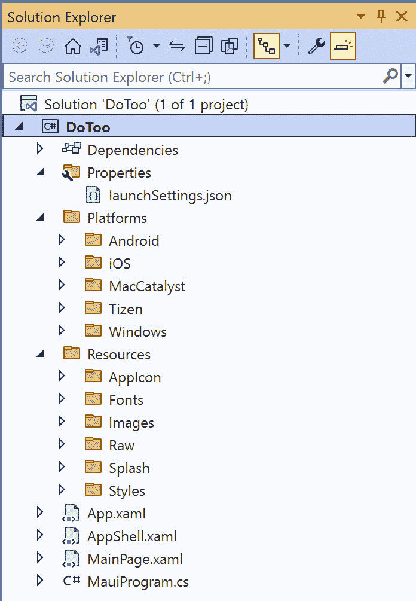
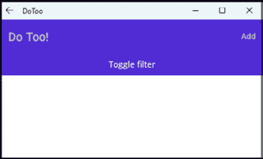

# 第二章：构建我们的第一个.NET MAUI 应用

在本章中，我们将创建一个待办事项列表应用，并在创建过程中探索构成应用的所有组成部分。我们将查看创建页面、向页面添加内容、在页面之间导航以及创建令人惊叹的布局。好吧，*令人惊叹*可能有点夸张，但我们将确保设计出的应用在完成之后你可以根据自己的需求进行调整！

本章将涵盖以下主题：

+   设置项目

+   使用仓库模式在设备上本地持久化数据

+   MVVM 是什么以及为什么它非常适合.NET MAUI

+   使用.NET MAUI 页面（作为视图）以及使用.NET MAUI 控件在 XAML 中在它们之间导航

+   使用数据绑定

+   在.NET MAUI 中使用样式

# 技术要求

要完成此项目，你需要在你的**Macintosh**（**Mac**）或 PC 上安装 Visual Studio，以及.NET 移动组件。有关如何设置环境的更多详细信息，请参阅*第一章*，*.NET MAUI 简介*。本章提供了 Windows 上 Visual Studio 的截图和说明。

本章将是一个经典的**文件** | **新建** | **项目**章节，逐步指导你创建你的第一个待办事项列表应用。除了几个 NuGet 包之外，无需任何下载。

你可以在[`github.com/Packt Publishing/MAUI-Projects-3rd-Edition`](https://github.com/PacktPublishing/MAUI-Projects-3rd-Edition)的`Chapter02`文件夹中找到本章代码的完整源代码。

# 项目概述

每个人都需要一种跟踪事物的方法。为了启动我们的 .NET MAUI 开发学习曲线，我们决定制作一个待办事项列表应用是开始的最佳方式，并帮助你跟踪事物。这是一个简单、经典的双赢场景。

我们将首先创建一个项目并定义一个存储待办事项列表项的仓库。我们将以列表形式渲染这些项，并允许用户通过详细用户界面进行编辑。我们还将探讨如何通过**SQLite.NET**在设备上本地存储待办事项列表项，以便在退出应用时不会丢失。

本项目的构建时间大约为 2 小时。

# 设置项目

.NET MAUI 引入了一种新的代码共享范式，称为单一项目。在 Xamarin.Forms 中，你将为每个应用部署的平台创建一个单独的项目。在.NET MAUI 中，所有平台都在一个项目中，该项目针对所有支持的平台进行多目标配置。默认情况下，所有代码都被视为共享的，除非它位于平台特定的子文件夹之一。随着我们继续本章和未来的章节，我们将进一步探讨这一点。

让我们开始吧！

## 创建新项目

第一步是创建一个新的.NET MAUI 项目。打开 Visual Studio 2022 并选择**创建一个** **新项目**：


图 2.1 – Visual Studio 2022

这将打开 `maui` 并从列表中选择 **.NET MAUI App** 项：


图 2.2 – 创建新项目

通过将项目命名为 `DoToo` 并点击 **下一步** 来完成向导的下一页：


图 2.3 – 配置你的新项目

下一步将提示你选择要支持的 .NET Core 版本。在撰写本文时，.NET 6 可用为 **长期支持**（**LTS**），.NET 7 可用为 **标准期限支持**。对于本书，我们假设你将使用 .NET 7：


图 2.4 – 其他信息

通过点击 **创建** 并等待 Visual Studio 创建项目来最终完成设置。

恭喜！我们刚刚创建了我们第一个 .NET MAUI 应用。让我们看看模板向导为我们生成了什么。

## 检查文件

选择的模板已创建一个名为 `DoToo` 的单个项目，作为一个可以针对 iOS、Mac Catalyst（macOS）、Android 和 Windows 平台的目标 .NET 库。你可以使用 Visual Studio 中的主工具栏切换目标平台，如图 *图 2**.5* 所示：


图 2.5 – 调试目标下拉菜单

默认情况下选择 Windows 平台，但你可以通过使用 **调试目标** 下拉菜单轻松切换到 iOS 或 Android。在 **框架** 子菜单下的下拉菜单中，你可以找到所有支持的目标平台。

当你选择目标设备时，目标框架也将相应地更改。如果你在 **Android 模拟器** 菜单项下选择模拟器，那么 Android 目标框架将成为当前框架，而如果你从 iOS 菜单项中选择 iOS 模拟器或设备，iOS 将成为当前框架。

项目现在应该如下所示：



图 2.6 – .NET MAUI 项目结构

我们将突出显示项目中的几个重要文件，以便我们对其有一个基本了解。首先，我们将查看共享代码，然后我们将查看每个平台特定的文件/代码（存储在不同的平台文件夹下）。

### 共享代码

在 `Dependencies` 下，我们将找到对任何外部依赖项的引用，例如每个引用的 .NET 移动框架。在每个框架下，你将在 `packages` 文件夹下找到 .NET MAUI 依赖项。我们将在 *更新 .NET MAUI 包* 部分更新 .NET MAUI 包版本，并在本章的后续内容中添加更多依赖项。

`MauiProgram.cs` 文件是应用程序的起点。初始模板将生成一个如下所示的 `MauiProgram` 类：

```cs
public static class MauiProgram
{
    public static MauiApp CreateMauiApp()
    {
        var builder = MauiApp.CreateBuilder();
        builder
            .UseMauiApp<App>()
            .ConfigureFonts(fonts =>
            {
                fonts.AddFont("OpenSans-Regular.ttf", 
"OpenSansRegular");
                fonts.AddFont("OpenSans-Semibold.ttf", 
"OpenSansSemibold");
            });
#if DEBUG
        builder.Logging.AddDebug();
#endif
        return builder.Build();
    }
}
```

静态的`MauiProgram`类包含一个`CreateMauiApp`方法，该方法返回`MauiApp`。这个实例是通过使用`MauiAppBuilder`创建的，它的工作方式与 ASP.NET 构建器非常相似；`MauiAppBuilder`使用一个`Application`实例。

什么是 Fluent API？

Fluent API 允许方法链式调用，其中 API 的每个方法都返回相同的上下文。Fluent API 通过使用特定于 API 主题的术语形成了一种独特的语言。这使得 API 更容易理解和使用。C#的**语言集成查询**（**LINQ**）是 Fluent API 的一个很好的例子。

扩展方法用于向`MauiApp`实例添加功能和服务。`UseMauiApp`扩展方法标识要使用的`Microsoft.Maui.Controls.Application`的子类。默认情况下，这个类定义在`App.xaml`和`App.xaml.cs`文件中。另一个扩展方法`ConfigureFonts`被模板用于注册应用程序使用的自定义字体文件。另一个可以使用的扩展方法示例是`ConfigureLifecycleEvents`，它用于设置.NET MAUI 中可用的跨平台生命周期事件的处理器。我们将在*第三章*，*将 Xamarin.Forms 应用程序转换为.NET MAUI*中更详细地讨论`ConfigureLifecycleEvents`。

`App.xaml`文件是一个 XAML 文件，它表示应用程序。这是一个放置应用程序范围资源的好地方，我们稍后会这样做。我们还可以看到`App.xaml.cs`文件，它包含启动代码。

如果我们打开`App.xaml.cs`，我们可以看到我们的.NET MAUI 应用程序的起点：

```cs
public partial class App : Application
{
    public App()
    {
        InitializeComponent();
        MainPage = new AppShell();
    }
}
```

`MainPage`属性被分配给一个页面，这尤其重要，因为它决定了哪个页面首先向用户显示。在这个模板中，这是`DoToo.AppShell()`类。

`AppShell.xaml`和`AppShell.xaml.cs`文件声明了.NET MAUI 应用程序中第一个可见的 UI 组件。Shell 提供了页面之间的导航形式。当你打开`AppShell.xaml`时，它应该看起来像这样：

```cs
<Shell
    x:Class="DoToo.AppShell"
    xmlns=http://schemas.microsoft.com/dotnet/2021/maui
    xmlns:x=http://schemas.microsoft.com/winfx/2009/xaml

    Shell.FlyoutBehavior="Disabled">
    <ShellContent
        Title="Home"
        ContentTemplate="{DataTemplate local:MainPage}"
        Route="MainPage" />
</Shell>
```

`ShellContent`元素标识了在 shell 中显示的单独页面。`ContentTemplate`属性用于定位实现页面的类——在本例中是`MainPage`——而`Route`是页面的唯一标识符。

最后两个文件是`MainPage.xaml`文件，它包含应用程序的第一页，以及后置代码文件，称为`MainPage.xaml.cs`。

接下来，我们将逐个处理每个平台的文件。每个平台在`Platforms`文件夹下都有一个独特的文件夹。Android 文件位于`Android`文件夹中，iOS 文件位于`iOS`文件夹中，Mac Catalyst 文件位于`MacCatalyst`文件夹中，Tizen 文件位于`Tizen`文件夹中，Windows 文件位于`Windows`文件夹中。

### Android

Android 特定平台代码位于项目中的`Platforms/Android`文件夹下：


图 2.7 – Android 特定文件

这里的重要文件是 `MainActivity.cs` 和 `MainApplication.cs`。这两个文件包含我们在 Android 设备上运行应用程序时的应用程序入口点。标准的 Android 应用会声明 `Activity` 类的 `MainLauncher` 属性。`MauiAppCompatActivity` 将搜索带有 `ApplicationAttribute` 装饰的类型并实例化它。

此属性可以在 `MainApplication.cs` 文件中的 `MainApplication` 类中找到。在初始化期间，`MainApplication` 将调用 `CreateMauiApp` 方法，该方法反过来调用我们在本章前面探索过的 `MauiProgram.CreateMauiApp`。

您不需要详细了解这些文件；只需记住，它们对于初始化我们的应用程序很重要。

### iOS 和 Mac Catalyst

iOS 和 Mac Catalyst 平台文件相同，但每个平台都有一个用于自定义平台的文件夹。每个平台的文件都包含在 `Platform` 文件夹下各自命名的文件夹中：


图 2.8 – iOS 平台特定文件

`AppDelegate.cs` 是 Android 平台中 `MainApplication` 类的等价物。它包含一个名为 `CreateMauiApp` 的单个方法，其实现与 Android 相同；它调用 `MauiProgram.CreateMauiApp` 方法。

`Program.cs` 文件是 iOS 应用的入口点。它包含 `Main` 方法，该方法调用 `UIApplication.Main`，这是 iOS 应用的启动点，并引用 `AppDelegate` 类型以实例化。

代码首先初始化 .NET MAUI，然后加载应用程序。之后，它将控制权返回给 iOS。它必须在 17 秒内完成此操作；否则，应用程序将被操作系统终止。

`info.plist` 文件是 iOS 特定的文件，其中包含有关应用程序的信息，例如包 ID 和其配置文件。Visual Studio 为 `info.plist` 文件提供了一个图形编辑器，但由于它是一个标准的 XML 文件，因此可以使用任何文本编辑器进行编辑。

与 Android 应用的启动代码一样，我们不需要详细了解这里发生的事情，只需知道这对于初始化我们的应用程序很重要。

### Tizen

Tizen 是三星定制的 Android 发行版。`Main.cs` 文件是启动点，类似于 Android 平台，`Program` 类有一个 `CreateMauiApp` 方法。Tizen 默认未启用。要启用它，请遵循 `DoToo.csproj` 文件中的注释说明。要为 Tizen 开发应用程序，您需要安装三星分发的附加软件。

### Windows

我们将要检查的最后一个平台是 **WinUI** 应用。文件结构如下：


图 2.9 – Windows 特定文件

它有一个 `App.xaml` 文件，类似于共享代码中的文件，但特定于 `App.xaml.cs`。此文件是 Windows 的 Android 的 `MauiApplication` 的等价物，它包含 `CreateMauiApp` 方法。

平台项目文件就到这里了。接下来，我们将探讨如何保持 .NET MAUI 的更新。

## 更新 .NET MAUI 包

注意 – Windows 用户

由于 .NET MAUI 是作为 Visual Studio 的一部分分发的，因此最好让 Visual Studio 在您更新 Visual Studio 时更新这些包。如果您遵循这些步骤，您可能将 .NET MAUI 更新到一个不可用的状态。

.NET MAUI 以一组可选的 `dotnet workload` 命令的形式分发。要查看当前安装的工作负载及其版本，您可以使用 `dotnet workload list` 命令。Visual Studio 2022 内置了开发者 PowerShell 来执行命令。要访问它，请在 macOS 和 Windows 上同时按 *Ctrl* + *`*。

运行 `dotnet workload list` 应该会给出以下输出。请注意，您的版本号可能更高：

```cs
C:\Users\cummings.michael\Source\Repos\DoToo
> dotnet workload list
Installed Workload Ids      Manifest Version                              Installation Source
---------------------------------------------------------------------------------------------
maui-windows                6.0.486/6.0.400                          
     VS 17.3.32901.215
maui-maccatalyst            6.0.486/6.0.400                          
     VS 17.3.32901.215
maccatalyst                 15.4.446-ci.-release-6-0-4xx.446/6.0.400
      VS 17.3.32901.215
maui-ios                    6.0.486/6.0.400                         
      VS 17.3.32901.215
ios                         15.4.446-ci.-release-6-0-4xx.446/6.0.400
      VS 17.3.32901.215
maui-android                6.0.486/6.0.400                         
      VS 17.3.32901.215
android                     32.0.448/6.0.400                        
      VS 17.3.32901.215
Use `dotnet workload search` to find additional workloads to install.
```

要更新 MAUI 工作负载中的包，您可以使用 `dotnet workload update`。这是运行该命令的结果示例：

```cs
C:\Users\cummings.michael\Source\Repos\DoToo
> dotnet workload update
No workloads installed for this feature band. To update workloads 
installed with earlier SDK
versions, include the --from-previous-sdk option.
Updated advertising manifest microsoft.net.sdk.android.
Updated advertising manifest microsoft.net.sdk.tvos.
Updated advertising manifest microsoft.net.sdk.macos.
Updated advertising manifest microsoft.net.sdk.maui.
Updated advertising manifest microsoft.net.workload.emscripten.
Updated advertising manifest microsoft.net.sdk.ios.
Updated advertising manifest microsoft.net.sdk.maccatalyst.
Updated advertising manifest microsoft.net.workload.mono.toolchain.
Downloading microsoft.net.sdk.android.manifest-6.0.400.msi.x64 
(32.0.465)
Installing Microsoft.NET.Sdk.Android.Manifest-6.0.400.32.0.465-x64.msi 
......... Done
Downloading microsoft.net.sdk.ios.manifest-6.0.400.msi.x64 (15.4.454)
Downloading microsoft.net.sdk.maccatalyst.manifest-6.0.400.msi.x64 
(15.4.454)
Downloading microsoft.net.sdk.macos.manifest-6.0.400.msi.x64 
(12.3.454)
Installing Microsoft.NET.Sdk.macOS.Manifest-6.0.400.12.3.454-x64.msi ...... Done
Downloading microsoft.net.sdk.maui.manifest-6.0.400.msi.x64 (6.0.540)
Installing Microsoft.NET.Sdk.Maui.Manifest-6.0.400.6.0.540-x64.msi 
...... Done
Downloading microsoft.net.sdk.tvos.manifest-6.0.400.msi.x64 (15.4.454)
Downloading microsoft.net.workload.mono.toolchain.manifest-6.0.400.
msi.x64 (6.0.9)
Installing Microsoft.NET.Workload.Mono.ToolChain.Manifest-
6.0.400.6.0.9-x64.msi ....... Done
Downloading microsoft.net.workload.emscripten.manifest-6.0.400.msi.x64 
(6.0.9)
Installing Microsoft.NET.Workload.Emscripten.Manifest-
6.0.400.6.0.9-x64.msi ...... Done
No workloads installed for this feature band. To update workloads 
installed 
with earlier SDK versions, include the --from-previous-sdk option.
Successfully updated workload(s): .
```

要查看结果，只需再次运行 `dotnet workload list` 命令：

```cs
C:\Users\cummings.michael\Source\Repos\DoToo
> dotnet workload list
Installed Workload Ids      Manifest Version
Installation Source
---------------------------------------------------------------------------------------------
maui-windows                6.0.540/6.0.400                            
   VS 17.3.32901.215
maui-maccatalyst            6.0.540/6.0.400                            
   VS 17.3.32901.215
maccatalyst                 15.4.446-ci.-release-6-0-4xx.446/6.0.400   
   VS 17.3.32901.215
maui-ios                    6.0.540/6.0.400                            
   VS 17.3.32901.215
ios                         15.4.446-ci.-release-6-0-4xx.446/6.0.400   
   VS 17.3.32901.215
maui-android                6.0.540/6.0.400                            
   VS 17.3.32901.215
android                     32.0.465/6.0.400                           
   VS 17.3.32901.215
Use `dotnet workload search` to find additional workloads to install.
```

现在我们已经对 .NET MAUI 项目的结构有了基本的了解，我们可以开始构建我们的第一个应用程序了！

# 创建一个存储库和一个 TodoItem 模型

任何好的架构总是涉及抽象。在这个应用程序中，我们需要一个东西来存储和检索待办事项列表中的项目。稍后，这些项目将存储在 SQLite 数据库中，但将数据库直接添加到负责 GUI 的代码中通常是一个坏主意，因为它将您的数据存储实现与 UI 层紧密耦合，这使得独立于数据库测试您的 UI 代码变得更加困难。

因此，我们需要一个东西来抽象我们的数据库与 GUI。对于这个应用程序，我们选择使用简单的存储库模式。这个存储库只是一个位于 SQLite 数据库和即将到来的 `ViewModel` 类之间的类。这是处理与视图交互的类，反过来，它处理 GUI。

存储库将公开获取、添加和更新项目的方法，以及允许应用程序的其他部分对存储库中的更改做出反应的事件。它将隐藏在接口后面，这样我们就可以在不修改应用程序初始化中的任何代码的情况下替换整个实现。这是由 **Microsoft.Extensions.DependencyInjection** NuGet 包实现的。

## 定义待办事项列表项

我们将首先创建一个 `TodoItem` 类，它代表列表上的单个项目。这是一个简单的 **Plain Old CLR Object** (**POCO**) 类，其中 **CLR** 代表 **Common Language Runtime**。换句话说，这是一个没有依赖第三方组件的 .NET 类。要创建该类，请按照以下步骤操作：

1.  在 `DoToo` 项目中，创建一个名为 `Models` 的文件夹。

1.  在那个文件夹中添加一个名为 `TodoItem.cs` 的类，并输入以下代码：

    ```cs
    namespace DoToo.Models;
    using System;
    public class TodoItem
    {
        public int Id { get; set; }
        public string Title { get; set; }
        public bool Completed { get; set; }
        public DateTime Due { get; set; }
    }
    ```

此代码是自我解释的；它是一个简单的 POCO（Plain Old CLR Object）类，只包含属性而没有逻辑。我们有一个`Title`属性，用于描述我们想要执行的操作，一个名为`Completed`的标志，用于确定待办事项列表项是否已完成，一个`Due`日期，表示我们期望完成的时间，以及一个唯一的`Id`属性，我们稍后会需要它在数据库中使用。

## 创建仓库及其接口

现在我们有了`TodoItem`类，让我们定义一个接口，描述一个将存储我们的待办事项列表项的仓库：

1.  在`DoToo`项目中创建一个名为`Repositories`的文件夹。

1.  在`Repositories`文件夹中创建一个名为`ITodoItemRepository.cs`的接口，并编写以下代码：

    ```cs
    namespace DoToo.Repositories;
    using DoToo.Models;
    public interface ITodoItemRepository
    {
        event EventHandler<TodoItem> OnItemAdded;
        event EventHandler<TodoItem> OnItemUpdated;
        Task<List<TodoItem>> GetItemsAsync();
        Task AddItemAsync(TodoItem item);
        Task UpdateItemAsync(TodoItem item);
        Task AddOrUpdateAsync(TodoItem item);
    }
    ```

等等，什么？没有删除方法？

眼尖的你们可能已经注意到，我们没有在这个接口中定义`Delete`方法。这在现实世界的应用中应该是必须的。虽然我们在本章创建的应用不支持删除项目，但我们非常确信，如果您想的话，您可以自己添加这个功能！

此接口定义了我们应用所需的一切。它的存在是为了在您的仓库实现和仓库使用者之间创建逻辑隔离。如果应用的其他部分需要`ITodoItemRepository`的一个实例，我们可以传递一个实现了`ITodoItemRepository`的对象，无论其实现方式如何。

话虽如此，让我们来实现`ITodoItemRepository`：

1.  在`Repositories`文件夹中创建一个名为`TodoItemRepository.cs`的类。

1.  输入以下代码：

    ```cs
    namespace DoToo.Repositories;
    using DoToo.Models;
    public class TodoItemRepository : ITodoItemRepository
    {
        public event EventHandler<TodoItem> OnItemAdded;
        public event EventHandler<TodoItem> OnItemUpdated;
        public async Task<List<TodoItem>> GetItemsAsync()
        {
            return null; // Just to make it build
        }
        public async Task AddItemAsync(TodoItem item)
        {
        }
        public async Task UpdateItemAsync(TodoItem item)
        {
        }
        public async Task AddOrUpdateAsync(TodoItem item)
        {
            if (item.Id == 0)
            {
                await AddItemAsync(item);
            }
            else
            {
                await UpdateItemAsync(item);
            }
        }
    }
    ```

此代码是接口的裸骨实现，除了`AddOrUpdateAsync(...)`方法。这个方法处理一小段逻辑，即如果一个项目的`Id`值为`0`，则它是一个新项目。任何`Id`值大于`0`的项目都存储在数据库中。这是因为当我们在表中创建行时，数据库会分配一个大于`0`的值。

前面的代码中还定义了两个事件。它们将被用来通知订阅者有关已更新或添加的项目列表。

## 将 SQLite 连接到持久化数据

现在我们已经有一个接口，以及实现该接口的框架。为了完成本节，我们需要在仓库的实现中连接 SQLite。

### 添加 SQLite NuGet 包

要在此项目中访问 SQLite，我们需要将名为`sqlite-net-pcl`的 NuGet 包添加到`DoToo`项目中。为此，右键单击解决方案中的`DoToo`项目节点，然后单击**管理** **NuGet 包...**：


图 2.10 – 管理 NuGet 包...

可移植类库 (PCL)

您可能已经注意到，NuGet 包以`-pcl`结尾。这是命名规范出错时发生的一个例子。此包支持.NET Standard 1.0，尽管其名称表明它是 PCL（Portable Class Library），它是.NET Standard 的前身。

这将打开**NuGet 包管理器**窗口：


图 2.11 – NuGet 包管理器

要安装 SQLite NuGet 包，请按照以下步骤操作：

1.  在搜索框中点击`sqlite-net-pcl`。

1.  通过**sQLite-net**选择包并点击**安装**。

1.  将会显示一个对话框，显示所有将被下载到您系统中的包；接受更改以完成安装。

重要

`sqlite-net-pcl`包的 1.8.116 版本引用了与.NET 6+在所有平台上不完全兼容的原生库版本。为了解决这个问题，您需要手动添加以下包的额外引用，版本至少为 2.1：

- `SQLitePCLRaw.core`

- `SQLitePCLRaw.provider.sqlite3`

- `SQLitePCLRaw.bundle_green`

- `SQLitePCLRaw.provider.dynamic_cdecl`

有关更多详细信息和一个可能的解决方案，请参阅[`github.com/praeclarum/sqlite-net/issues/1102`](https://github.com/praeclarum/sqlite-net/issues/1102)。

安装完成后，我们可以在`TodoItem`类中添加一些代码，将 C#对象映射到表，并在仓库中创建数据库连接。

### 更新 TodoItem 类

由于 SQLite 是一个关系型数据库，它需要了解一些关于如何创建存储我们对象的表的基本信息。这通过使用属性来完成，这些属性在 SQLite 命名空间中定义：

1.  打开`Models/TodoItem.cs`。

1.  在文件开头，紧接在`namespace`语句下方添加一个`using SQLite`语句，如下面的代码所示：

    ```cs
    namespace DoToo.Models;
    using SQLite;
    public class TodoItem
    ```

1.  在`Id`属性之前添加`PrimaryKey`和`AutoIncrement`属性，如下面的代码所示：

    ```cs
    [PrimaryKey, AutoIncrement]
    public int Id { get; set; }
    ```

    `PrimaryKey`属性指示 SQLite，`Id`属性是表的键。`AutoIncrement`属性确保每次向表中添加新的`TodoItem`类时，`Id`的值增加 1。

在正确配置数据对象类之后，现在是时候创建数据库连接了。

### 创建与 SQLite 数据库的连接

现在我们将添加所有与数据库通信所需的代码。首先，我们需要定义一个连接字段，它将保存对数据库的连接：

1.  打开`Repositories/TodoItemRepository.cs`文件。

1.  在现有`using`语句下方添加一个`using SQLite`语句，如下面的代码所示：

    ```cs
    namespace DoToo.Repositories;
    using DoToo.Models;
    using SQLite;
    public class TodoItemRepository : ITodoItemRepository
    ```

1.  在类声明下方添加以下字段：

    ```cs
    private SQLiteAsyncConnection connection;
    ```

连接需要被初始化。一旦初始化，它就可以在整个仓库的生命周期中重复使用。由于该方法是非同步的，不能从构造函数中调用而不引入锁定策略。为了简化问题，我们将简单地从接口定义的每个方法中调用它。为此，将以下代码添加到`TodoItemRepository`类中：

```cs
private async Task CreateConnectionAsync() 
{ 
    if (connection != null) 
    { 
        return; 
    } 

    var documentPath = Environment.GetFolderPath(Environment.
SpecialFolder.MyDocuments); 
    var databasePath = Path.Combine(documentPath, "TodoItems.db"); 

    connection = new SQLiteAsyncConnection(databasePath);  
    await connection.CreateTableAsync<TodoItem>(); 

    if (await connection.Table<TodoItem>().CountAsync() == 0) 
    { 
        await connection.InsertAsync(new TodoItem() 
        { 
            Title = "Welcome to DoToo", 
            Due = DateTime.Now 
        }); 
    } 
}
```

该方法首先检查我们是否已经有一个连接。如果有，我们可以简单地 `return`。如果没有设置连接，我们定义一个磁盘上的路径来指示我们希望数据库文件所在的位置。在这种情况下，我们将选择 `MyDocuments` 文件夹。.NET MAUI 将在每个我们针对的平台找到最接近的匹配项。

然后，我们创建连接并将该连接的引用存储在 `connection` 字段中。我们需要确保 SQLite 已经创建了一个与 `TodoItem` 表模式相对应的表。为了使开发应用程序更容易，如果 `TodoItem` 表为空，我们将添加一个默认待办事项列表项。

接下来，我们将添加数据库操作的实现。

### 实现 GetItemsAsync(), AddItemsAsync(), 和 UpdateItemsAsync() 方法

在存储库中剩下的唯一事情是实现获取、添加和更新项目的相关方法：

1.  在 `TodoItemRepository` 类中定位 `GetItemsAsync()` 方法。

1.  使用以下代码更新 `GetItemsAsync()` 方法：

    ```cs
    public async Task<List<TodoItem>> GetItemsAsync()
    {
        await CreateConnectionAsync();
        return await connection.Table<TodoItem>().ToListAsync();
    }
    ```

    为了确保数据库连接有效，我们调用上一节中创建的 `CreateConnectionAsync()` 方法。当此方法返回时，我们可以确保它已初始化，并且 `TodoItem` 表已创建。

    然后，我们使用连接来访问 `TodoItem` 表，并返回一个包含数据库中所有待办事项列表项的 `List<TodoItem>` 项目。

SQLite 和 LINQ

SQLite 支持使用 LINQ 查询数据。项目完成后，你可以尝试使用它来更好地理解如何在你的应用程序中与数据库一起工作。

添加项目的代码甚至更简单：

1.  在 `TodoItemRepository` 类中定位 `AddItemAsync()` 方法。

1.  使用以下代码更新 `AddItemAsync()` 方法：

    ```cs
    public async Task AddItemAsync(TodoItem item)
    {
        await CreateConnectionAsync();
        await connection.InsertAsync(item);
        OnItemAdded?.Invoke(this, item);
    }
    ```

    对 `CreateConnectionAsync()` 的调用确保了我们有一个连接，就像我们对 `GetItemsAsync()` 方法所做的那样。之后，我们使用 `connection` 对象上的 `InsertAsyncAsync(...)` 方法将其插入数据库。一个项目被插入到表中后，我们调用 `OnItemAdded` 事件来通知任何订阅者。

更新项目的代码与 `AddItemAsync()` 方法相同，但还包括对 `UpdateAsync` 和 `OnItemUpdated` 的调用。让我们通过以下代码更新 `UpdateItemAsync()` 方法来完成：

1.  在 `TodoItemRepository` 类中定位 `UpdateItemAsync()` 方法。

1.  使用以下代码更新 `UpdateItemAsync()` 方法：

    ```cs
    public async Task UpdateItemAsync(TodoItem item)
    {
        await CreateConnectionAsync();
        await connection.UpdateAsync(item);
        OnItemUpdated?.Invoke(this, item);
    }
    ```

在下一节中，我们将开始学习 MVVM。拿一杯咖啡，让我们开始吧！

# 使用 MVVM – 创建视图和视图模型

**模型-视图-视图模型**，简称 **MVVM**，其核心是 **关注点分离**。它是一种定义了三个部分，每个部分都有特定意义的架构模式：

+   `ViewModel`。

+   **视图**：这是视觉组件。在 .NET MAUI 中，这由一个页面表示。

+   **ViewModel**：这是一个作为模型和视图之间粘合剂的类。

我们在这里引入 MVVM，因为 MVVM 模式是专门针对基于 XAML 的 GUI 设计的。这个应用以及本书中的其他应用都将使用 XAML 来定义 GUI，我们将使用 MVVM 模式来将代码分为前面提到的三个部分。

在这个应用中，我们可以认为模型是仓库以及它返回的任务列表项。`ViewModel` 指的是这个仓库，并公开了视图可以绑定的属性。基本规则是任何逻辑都应该位于 `ViewModel` 中，而没有任何逻辑应该位于视图中。视图应该知道如何呈现数据，例如将布尔值转换为 `是` 或 `否`。

MVVM 可以以多种方式实现，并且有相当多的框架可以帮助我们实现，例如 **Prism**、**MVVMCross**，甚至是 **TinyMvvm**。在本章中，我们选择保持简单，首先以纯方式实现 MVVM，然后使用 **CommunityToolkit.Mvvm** 库的部分功能。CommunityTookit.Mvvm 是由 .NET 基金会生产的开源库。它是 **MVVMLight** 库的替代品。

使用 MVVM 作为架构模式的主要好处是关注点的明确分离、代码更清晰，以及 `ViewModel` 的良好可测试性。如果您想了解更多关于 MVVM 的信息，以及如何与 .NET MAUI 一起使用它，请访问 [`learn.microsoft.com/en-us/dotnet/architecture/maui/mvvm`](https://learn.microsoft.com/en-us/dotnet/architecture/maui/mvvm)。

好了，就说到这里吧——让我们来写一些代码吧！

## 定义 ViewModel 基类

`ViewModel` 是视图和模型之间的中介。通过为所有 `ViewModel` 类创建一个公共基类，我们可以从中受益匪浅。为此，请按照以下步骤操作：

1.  在 `DoToo` 项目中创建一个名为 `ViewModels` 的文件夹。

1.  在 `ViewModels` 文件夹中创建一个名为 `ViewModel` 的类。

1.  添加以下代码：

    ```cs
    using System.ComponentModel;
    public abstract class ViewModel : INotifyPropertyChanged
    {
        public event PropertyChangedEventHandler PropertyChanged;
        public void RaisePropertyChanged(params string[] 
    propertyNames)
        {
            foreach (var propertyName in propertyNames)
            {
                PropertyChanged?.Invoke(this, new 
    PropertyChangedEventArgs(propertyName));
             }
        }
        public INavigation Navigation { get; set; }
    }
    ```

`ViewModel` 类是所有 `ViewModel` 对象的基类。它不打算单独实例化，所以我们将其标记为 `abstract`。它实现了在 .NET 基类库中定义的 `System.ComponentModel` 接口 `INotifyPropertyChanged`。该接口只定义了一件事——`PropertyChanged` 事件。我们的 `ViewModel` 类必须在想要让 GUI 了解任何属性更改时引发此事件。这可以通过在属性的设置器中手动添加代码来实现，就像我们在当前实现中所做的那样，或者通过使用 **CommunityToolkit.Mvvm** 库。我们将在下一节中详细介绍这一点。

我们还将在这里采取一个小捷径，通过向 `ViewModel` 添加一个 `INavigation` 属性。这将帮助我们进行后续的导航。这也是可以（并且应该）抽象化的东西，因为我们不希望 `ViewModel` 依赖于 .NET MAUI，以便能够在任何平台上重用 `ViewModel` 类。

## 介绍 CommunityToolkit.Mvvm 库的 ObservableObject 和 ObservableProperty

实现 ViewModel 类传统的做法是从基类（例如我们之前定义的`ViewModel`类）继承，然后添加可能看起来如下所示的代码：

```cs
public class MyTestViewModel : ViewModel
{
    private string name;
    public string Name
    {
        get { return name; }
        set
        {
            if (name != value)
            {
                name = value;
                RaisePropertyChanged(nameof(Name));
            }
        }
    }
}
```

我们想要添加到`ViewModel`类的每个属性都会产生 13 行代码。你可能认为这还不错。然而，考虑到一个`ViewModel`类可能包含 10 到 20 个属性，这会迅速变成大量的代码。我们可以做得更好。

只需几个简单的步骤，我们就可以使用 CommunityToolkit.Mvvm 库在构建过程中自动注入几乎所有代码：

1.  在`DoToo`项目中，安装 CommunityToolkit.Mvvm NuGet 包。

1.  更新`ViewModel`类，使其看起来像这样：

    ```cs
    using CommunityToolkit.Mvvm.ComponentModel;
    [ObservableObject]
    public abstract partial class ViewModel
    {
        public INavigation Navigation { get; set; }
    }
    ```

我们已经更改了`ViewModel`类的基类，使其具有`ObservableObject`属性，并添加了`partial`修饰符。此属性将在构建过程中自动添加之前在`ViewModel`基类中存在的`INotifyPropertyChanged`的基实现。

一旦我们的基类被修改，我们就可以使用`ObservableProperty`属性来自动生成属性实现。结果是，我们之前拥有的测试类每个属性都减少到一行代码。这使得代码库更易于阅读，因为所有操作都在幕后进行：

```cs
public partial class MyTestViewModel : ViewModel
{
    [ObservableProperty]
    string name;
}
```

关于前面的示例，有几个需要注意的事项。首先，类必须被标记为`partial`，这样`ObservableProperty`属性才能正常工作，就像`ObservableObject`属性一样。其次，在使用`ObservableProperty`属性时，你应该将其放置在私有字段上，而不是属性上。CommunityToolkit.Mvvm 库使用.NET 5 中添加的特性**Source Generators**来生成实际的属性实现。

使用 Source Generators 的一个好处是，你可以始终查看生成的源代码来了解工作原理。例如，要查看`ViewModel`类的生成源代码，请执行以下操作：

1.  打开`ViewModel.cs`文件。

1.  右键点击`ViewModel`类型名称。

1.  选择**转到实现**。

通常情况下，这不会做任何事情，因为你正在`ViewModel`的实现中。然而，由于有额外的生成代码，Visual Studio 会显示一个包含`ViewModel`实现位置列表，类似于这里所示：


图 2.12 – 查找 ViewModel 的所有实现

列表中的第一项是我们添加到`ViewModel.cs`文件中的内容，列表中的第二项是生成的代码。通过双击该项，它将在新的代码窗口中打开生成的代码。在*创建 TodoItemViewModel*部分，你可以遵循相同的步骤来查看属性实现生成的代码。

现在我们已经看到了如何使用示例 `ViewModel` 实现属性，现在是时候创建具体的 `ViewModel` 类了。

## 创建 MainViewModel

到目前为止，我们主要准备编写构成应用程序本身的代码。`MainViewModel` 是第一个显示给用户的视图的 `ViewModel` 类。它负责为待办事项列表项提供数据和逻辑。我们将创建基本的 `ViewModel` 类，并在本章的进展中向它们添加代码：

1.  在 `ViewModels` 文件夹中创建一个名为 `MainViewModel` 的类。

1.  添加以下模板代码并解决引用：

    ```cs
    public class MainViewModel : ViewModel
    {
        private readonly ITodoItemRepository repository;
        public MainViewModel(ITodoItemRepository repository)
        {
            this.repository = repository;
            Task.Run(async () => await LoadDataAsync());
        }
        private async Task LoadDataAsync()
        {
        }
    }
    ```

这个类的结构是我们将重用于所有即将到来的 `ViewModel` 类。

让我们总结一下我们希望 `ViewModel` 类拥有的重要功能：

+   我们通过继承 `ViewModel` 类来访问共享逻辑，例如 `INotifyPropertyChanged` 接口和常见的导航代码。

+   所有对其他类的依赖，例如通过 `ViewModel` 构造函数传递的仓库和服务，都由 `Microsoft.Extensions.DependencyInjection` 处理，这是我们所使用的依赖注入的实现。我们将在 *连接依赖注入* 部分添加对自动依赖注入的支持。

+   我们使用异步调用 `LoadDataAsync()` 作为初始化 `ViewModel` 类的入口点。不同的 MVVM 库可能会以不同的方式做这件事，但基本功能是相同的。

## 创建 TodoItemViewModel

`TodoItemViewModel` 是代表 `MainView` 上待办事项列表中每个项目的 `ViewModel` 类。它没有自己的完整视图，尽管它可以有。相反，它通过 `ListView` 中的模板进行渲染。我们将在创建 `MainView` 控件时回到这一点。

这里重要的是，这个 `ViewModel` 对象代表一个单独的项目，无论我们选择在哪里渲染它。

让我们创建 `TodoItemViewModel` 类：

1.  在 `ViewModels` 文件夹中创建一个名为 `TodoItemViewModel` 的类。

1.  更新类，使其与以下代码匹配：

    ```cs
    namespace DoToo.ViewModels;
    using CommunityToolkit.Mvvm.ComponentModel;
    using DoToo.Models;
    public partial class TodoItemViewModel : ViewModel
    {
        public TodoItemViewModel(TodoItem item) => Item = item;
        public event EventHandler ItemStatusChanged;
        [ObservableProperty]
        TodoItem item;
        public string StatusText => Item.Completed ? "Reactivate" : "Completed";
    }
    ```

与任何其他 `ViewModel` 类一样，我们从 `ViewModel` 继承 `TodoItemViewModel` 类。我们遵循将所有依赖项注入构造函数的模式。在这种情况下，我们向构造函数传递一个 `TodoItem` 类的实例，该实例将被 `ViewModel` 对象用于公开视图。

当我们想要向视图发出信号，表示 `TodoItem` 类的状态已更改时，将使用 `ItemStatusChanged` 事件处理程序。`Item` 属性允许我们访问传递的项目。

`StatusText` 属性用于在视图中使待办事项的状态对人类可读。

## 创建 ItemViewModel 类

`ItemViewModel` 代表一个视图中的待办事项列表项，可以用来创建新项和编辑现有项：

1.  在 `ViewModels` 文件夹中创建一个名为 `ItemViewModel` 的类。

1.  添加以下代码：

    ```cs
    namespace DoToo.ViewModels;
    using DoToo.Repositories;
    public class ItemViewModel : ViewModel
    {
        private readonly ITodoItemRepository repository;
        public ItemViewModel(ITodoItemRepository repository)
        {
            this.repository = repository;
        }
    }
    ```

该模式与之前的两个 `ViewModel` 类相同：

+   我们使用依赖注入将 `TodoItemRepository` 类传递给 `ViewModel` 对象。

+   我们通过从 `ViewModel` 基类继承来添加由基类定义的常见功能

## 创建 `MainView` 视图

现在我们已经完成了 `ViewModel` 类，让我们创建视图所需的骨架代码和 XAML。模板创建了一个名为 `MainPage.xml` 的文件。在 MVVM 中，惯例是使用 `-View` 后缀。我们还将希望将所有视图一起放在一个子文件夹中，就像我们对 `ViewModel` 类所做的那样。让我们首先处理 `MainPage.xml` 文件，这是将被首先加载的视图：

1.  从项目的根目录删除 `MainPage.xml` 文件。

1.  在 `DoToo` 项目中创建一个名为 `Views` 的文件夹。

1.  右键单击 `Views` 文件夹，选择 **添加**，然后点击 **新建项...**。

1.  在左侧的 **C# 项** 节点下选择 **.NET MAUI**。

1.  选择 `MainView`。

1.  点击 **添加** 创建页面：


图 2.13 – 添加新的 XAML 文件

让我们在新创建的视图中添加一些内容：

1.  打开 `MainView.xaml`。

1.  从 `ContentPage` 根节点下方删除所有模板代码，并添加以下代码中突出显示的 XAML 代码：

    ```cs
    <?xml version="1.0" encoding="utf-8"?>
    <ContentPage xmlns="http://schemas.microsoft.com/dotnet/2021/
    maui"

      x:Class="DoToo.Views.MainView"
      Title="Do Too!">
      <ContentPage.ToolbarItems>
        <ToolbarItem Text="Add" />
      </ContentPage.ToolbarItems>
      <Grid>
        <Grid.RowDefinitions>
          <RowDefinition Height="auto" />
          <RowDefinition Height="*" />
        </Grid.RowDefinitions>
        <Button Text="Toggle filter" />
        <ListView Grid.Row="1">
        </ListView>
      </Grid>
    </ContentPage>
    ```

为了能够访问自定义转换器，我们需要添加对本地命名空间的引用。`line` 定义了这个命名空间。在这种情况下，我们不会直接使用它，但定义一个本地命名空间是一个好主意。如果我们创建自定义控件，我们可以通过编写类似 **`<local:MyControl />`** 的方式来访问它们。**

**`ContentPage` 页面上的 `Title` 属性为页面提供了标题。根据我们运行的平台，标题的显示方式不同。如果我们使用标准导航栏，它将在顶部显示，例如，在 iOS 和 Android 上。页面应该始终有一个标题**。

`ContentPage.ToolbarItems` 节点定义了一个用于添加新待办事项的工具栏项。它根据平台的不同也会以不同的方式渲染，但始终遵循平台特定的 UI 指南。

.NET MAUI 中的页面（以及在 XML 文档中通常情况下）只能有一个根节点。.NET MAUI 页面的根节点填充了页面本身的 `Content` 属性。由于我们希望 `MainView` 视图包含一个项目列表和顶部的一个按钮来切换过滤器（在所有项目和仅活动项目之间切换），我们需要添加一个 `Layout` 控件来在页面上定位它们。`Grid` 是一个允许您根据行和列分割可用空间的控件。

对于我们的 `MainView` 视图，我们想要添加两行。第一行是按钮高度计算出的空间（`Height="auto"`），第二行占据剩余的所有空间用于 `ListView`（`Height="*"`）。像 `ListView` 这样的元素使用 `Grid.Row` 和 `Grid.Column` 属性在网格中定位。如果未指定这两个属性，它们默认为 `0`，就像按钮一样。

`ListView` 是一个以列表形式展示项的控件，这恰好是我们应用将要做的。值得注意的是，.NET MAUI 确实有一个名为 `CollectionView` 的控件，它比 `ListView` 更好地处理显示项集合。后续章节将使用此控件，但我们还想介绍这个古老的 `ListView` 控件。

小贴士

如果你对 `Grid` 的工作原理感兴趣，你可以在互联网上搜索有关 .NET MAUI 网格的更多信息，或者查看官方文档[`learn.microsoft.com/en-us/dotnet/maui/user-interface/layouts/grid`](https://learn.microsoft.com/en-us/dotnet/maui/user-interface/layouts/grid)。

我们还需要将 `ViewModel` 与视图连接起来。这可以通过在视图的构造函数中传递 `ViewModel` 类来实现：

1.  通过展开 `MainView.xaml` 文件在 `MainView.xaml.cs` 中打开 `MainView` 的代码隐藏文件。

1.  在文件顶部添加 `using DoToo.ViewModels` 语句，紧邻现有的 `using` 语句。

1.  修改类的构造函数，使其看起来如下，通过添加高亮代码：

    ```cs
    public MainView(MainViewModel viewModel)
    {
        InitializeComponent();
        viewModel.Navigation = Navigation;
        BindingContext = viewModel;
    }
    ```

我们通过构造函数传递任何依赖项，遵循与 `ViewModel` 类相同的模式。视图始终依赖于 `ViewModel` 类。为了简化项目，我们还直接将页面的 `Navigation` 属性分配给在 `ViewModel` 基类中定义的 `Navigation` 属性。在一个更大的项目中，我们可能想要将此属性抽象出来，以确保将 `ViewModel` 类与 .NET MAUI 分离。然而，对于这个应用来说，直接引用它是可以的。

最后，我们将 `ViewModel` 分配给页面的 `BindingContext` 类。这告诉 .NET MAUI 绑定引擎使用我们稍后创建的绑定来使用我们的 `ViewModel` 对象。

在这一点上，由于我们已移除 `MainPage`，项目将无法运行。我们将在后面的 *使应用运行* 部分修复这个问题。

## 创建 ItemView 视图

我们将要添加的第二个视图是 `ItemView`。我们将使用它来添加和编辑待办事项列表项：

1.  创建一个新的内容页面（与创建 `MainView` 视图的方式相同），并将其命名为 `ItemView`。

1.  编辑 XAML 文件，使其看起来如下代码所示。更改已高亮显示：

    ```cs
    <?xml version="1.0" encoding="UTF-8"?>
    <ContentPage xmlns=http://schemas.microsoft.com/dotnet/2021/maui
                  xmlns:x=http://schemas.microsoft.com/winfx/2009/xaml
      x:Class="DoToo.Views.ItemView"
      Title="New todo item">
      <ContentPage.ToolbarItems>
        <ToolbarItem Text="Save" />
      </ContentPage.ToolbarItems>
      <StackLayout Padding="14">
        <Label Text="Title" />
        <Entry />
        <Label Text="Due" />
        <DatePicker />
        <StackLayout Orientation="Horizontal">
          <Switch />
          <Label Text="Completed" />
        </StackLayout>
      </StackLayout>
    </ContentPage>
    ```

与 `MainView` 一样，我们需要一个标题。现在我们将给它一个默认标题 `New todo item`，但稍后当我们重用此视图进行编辑时，我们将将其更改为 `Edit todo item`。用户必须能够保存新的或编辑的项目，因此我们添加了一个工具栏 `Save` 按钮。页面内容使用 `StackLayout` 来结构化控件。`StackLayout` 根据它计算出的元素所占用的空间垂直（默认选项）或水平地添加元素。这是一个 CPU 密集型过程，因此我们只应在布局的小部分上使用它。在 `StackLayout` 中，我们添加了一个 `Label` 控件，它是一个在下面的 `Entry` 控件上方的文本行。`Entry` 控件是一个文本输入控件，包含待办事项列表项的名称。然后，我们有一个用于 `DatePicker` 的部分，用户可以为此待办事项列表项选择一个截止日期。最后一个控件是一个 `Switch` 控件，它渲染一个切换按钮来控制项目是否完成，以及旁边的标题。由于我们希望这些控件水平显示，我们使用一个水平的 `StackLayout` 控件来完成这个操作。

视图的最后一步是将 `ItemViewModel` 模型连接到 `ItemView`：

1.  通过在 **解决方案资源管理器** 中展开 `ItemView.xaml` 文件来打开 `ItemView` 的代码隐藏文件。

1.  在文件顶部添加一个 `using DoToo.ViewModels` 语句，紧邻现有的 `using` 语句。

1.  修改类的构造函数，使其看起来如下。添加以下加粗的代码：

    ```cs
    public ItemView (ItemViewModel viewmodel)
    {
        InitializeComponent ();
        viewmodel.Navigation = Navigation;
        BindingContext = viewmodel;
    }
    ```

这段代码与我们为 `MainView` 添加的代码相同，只是 `ViewModel` 类的类型不同。

## 连接依赖注入

之前，我们讨论了依赖注入模式，该模式指出所有依赖项，如存储库和 ViewModel，都必须通过类的构造函数传递。这个要求有几个好处：

+   它增加了代码的可读性，因为我们可以快速确定所有外部依赖项

+   它使得依赖注入成为可能

+   它通过模拟类使得单元测试成为可能

+   我们可以通过指定对象应该是单例还是每次解析时的新实例来控制对象的生命周期

依赖注入是一种模式，它允许我们在运行时确定创建对象时应该传递给构造函数的对象的哪个实例。我们通过定义一个容器来实现这一点，我们在其中注册了类的所有类型。我们让使用的框架解决它们之间的任何依赖关系。假设我们要求容器提供一个 `MainView` 类。容器负责解决 `MainViewModel` 以及该类所拥有的任何依赖关系。

.NET MAUI 在内部使用 `Microsoft.Extensions.DependencyInjection` NuGet 库，并且它被暴露给我们用于我们的应用程序。第一步是注册我们想要参与依赖注入的类。

### 注册视图、ViewModel 和服务

为了使我们的类可以通过依赖注入使用，它们需要注册到依赖注入服务中。.NET MAUI 通过 `MauiAppBuilder` 类的 `Services` 属性公开依赖注入服务。`Services` 属性将返回一个 `IServiceCollection` 对象，也称为容器。`IServiceCollection` 有两个我们感兴趣的方法，`AddSingleton` 和 `AddTransient`。方法名称中的“Transient”和“Singleton”指的是对象的生存期。Transient 对象每次从容器请求时都会创建。Singleton 对象只创建一次，并且每次从容器请求该类时都会返回那个实例。

当使用容器注册类时，建议使用扩展方法来分组类型。对于此应用程序，有三个组：`View`、`ViewModels` 和 `Services`。扩展方法将接受一个参数并返回一个值，即 `MauiAppBuilder` 实例。这就是实现 Builder 模式的方式，并允许我们在 `CreateMauiApp` 方法中定义的构建器上链式调用方法。

要实现这些方法，请按照以下步骤操作：

1.  打开 `MauiProgram.cs` 文件。

1.  对 `MauiProgram` 类进行以下更改。更改内容已加粗：

    ```cs
    using DoToo.Repositories;
    public static class MauiProgram
    {
        public static MauiApp CreateMauiApp()
        {
            var builder = MauiApp.CreateBuilder();
            builder
                .UseMauiApp<App>()
                .ConfigureFonts(fonts =>
                {
                    fonts.AddFont("OpenSans-Regular.ttf", 
    "OpenSansRegular");
                    fonts.AddFont("OpenSans-Semibold.ttf", 
    "OpenSansSemibold");
                })
                .RegisterServices()
                .RegisterViewModels()
                .RegisterViews();
                return builder.Build();
        }
    public static MauiAppBuilder RegisterServices(this 
    MauiAppBuilder mauiAppBuilder)
        {
        mauiAppBuilder.Services.AddSingleton<ITodoItemRepository,TodoItemRepository>();
            return mauiAppBuilder;
        }
    public static MauiAppBuilder RegisterViewModels(this 
    MauiAppBuilder mauiAppBuilder)
        {
             mauiAppBuilder.Services.AddTransient<ViewModels.
    MainViewModel>();
            mauiAppBuilder.Services.AddTransient<ViewModels.
    ItemViewModel>();
            return mauiAppBuilder;
        }
    public static MauiAppBuilder RegisterViews(this 
    MauiAppBuilder mauiAppBuilder)
        {
            mauiAppBuilder.Services.AddTransient<Views.MainView>();
            mauiAppBuilder.Services.AddTransient<Views.ItemView>();
            return mauiAppBuilder;
        }
    }
    ```

通常，通过将类型名称用作注册方法的泛型参数来注册类型，例如 `mauiAppBuilder.Services.AddTransient<Views.MainView>();`。但如果需要将接口解析为实现，如 `RegisterServices` 方法中发生的情况，则这不起作用。在那里，注册方法不使用泛型参数；相反，它将注册的类型作为第一个参数传递，第二个参数是要返回的实例的类型。

信息

要了解更多关于 `Microsoft.Extensions.DependencyInjection` 的工作原理，请访问您最喜欢的浏览器中的 [`learn.microsoft.com/en-us/dotnet/core/extensions/dependency-injection`](https://learn.microsoft.com/en-us/dotnet/core/extensions/dependency-injection)。

现在依赖注入已经连接好，我们可以再次运行项目。

## 使应用程序运行

我们还需要进行一些更改才能使应用程序运行：

1.  通过展开 `DoToo` 项目中的 `App.xaml` 节点来打开 `App.xaml.cs` 文件。

1.  以下行需要加粗：

    ```cs
    public App(Views.MainView view)
    {
        InitializeComponent();
        MainPage = new NavigationPage(view);
    }
    ```

1.  `AppShell.Xaml` 和 `AppShell.xaml.cs` 已不再使用，因此可以从项目中删除。

当.NET MAUI 通过构建器初始化`App`类时，它是通过使用依赖注入容器来完成的，所以你添加到`App`构造函数中的任何参数都会从容器中解析出来，以及它们的依赖项。在这种情况下，我们正在导入`MainView`类（及其所有依赖项，包括`MainViewModel`和`TodoItemRepository`），并将其包装在`NavigationPage`中。`NavigationPage`是在.NET MAUI 中定义的一个页面，它添加了一个导航栏，并使用户能够导航到其他视图。

信息

.NET MAUI 包括`Shell`，在这本书中我们有一整章关于它的内容。然而，要成为一名优秀的.NET MAUI 开发者，你需要了解基础知识，而.NET MAUI 中导航的基础知识使用的是古老的`NavigationPage`控件。

那就这样！现在，你的项目应该开始了。根据你使用的平台，它可能看起来如下所示：



图 2.14 – DoToo 应用程序在 Windows 子系统中的 Android

现在我们已经运行了一个具有基本 UI 的应用程序，让我们添加一些功能，从显示数据开始。

小贴士

如果你正在使用 Windows 目标框架调试应用程序，但它不起作用，并且你没有收到任何错误消息，尝试使用 Android 目标框架。有时，你可以从不同的平台获得更好的错误报告。

# 添加数据绑定

数据绑定是 MVVM 的核心和灵魂。这是视图和 ViewModel 之间相互通信的方式。在.NET MAUI 中，我们需要两样东西来使数据绑定发生：

+   我们需要一个对象来实现`INotifyPropertyChanged`。

+   我们需要将页面的`BindingContext`类设置为该对象。我们已经在`ItemView`和`MainView`上做了这件事。

数据绑定的一个有用特性是它允许我们使用双向通信。例如，当将数据绑定到`Entry`控件上的文本时，数据绑定对象上的属性会直接更新。考虑以下 XAML：

```cs
<Entry Text="{Binding Title}" />
```

要使这起作用，我们需要在字符串对象上有一个名为`Title`的属性。我们必须查看文档，定义一个对象，并让**IntelliSense**提供提示，以找出我们的属性应该是什么类型。

执行动作的控件，如`Button`，通常公开一个名为`Command`的属性。这个属性是`ICommand`类型，我们可以返回`Microsoft.Maui.Controls.Command`或我们自己的实现。`Command`属性将在下一节中解释，我们将使用它来导航到`ItemView`。

在接下来的几节中，我们将向我们的视图和 ViewModel 添加数据绑定和命令实现，从从`MainView`导航到`ItemView`开始。

信息

值得注意的是，.NET MAUI 除了双向数据绑定外，还支持单向绑定，这在你想在视图中显示数据但不允许它更新 ViewModel 时非常有用。从性能的角度来看，将那些绑定标记为单向绑定是一个好主意。

## 从 MainView 导航到 ItemView 添加新项目

在 `MainView` 中我们有一个 `Add` 工具栏按钮。当用户点击此按钮时，我们希望它将他们带到 `ItemView`。按照 MVVM 的方式来做这件事，就是定义一个命令，然后将该命令绑定到按钮上。

在 .NET MAUI 中，要导航到一个视图，你需要一个指向目标实例的引用。在这种情况下，那就是 `ItemView`。由于我们所有的视图都已经注册到依赖注入容器中，当我们准备导航时，我们需要一个指向容器的引用来请求视图的新实例。我们将使用构造函数注入来让容器提供其实例，如下所示：

1.  打开 `ViewModels/MainViewModel.cs`。

1.  为 `DoToo.Views` 添加一个 `using` 语句。

1.  向类中添加以下字段：

    ```cs
    private readonly IServiceProvider services;
    ```

1.  按照以下方式修改构造函数。变更部分已高亮：

    ```cs
    public MainViewModel(ITodoItemRepository repository, 
    IServiceProvider services)
    {
        this.repository = repository;
        this.services = services;
        Task.Run(async () => await LoadDataAsync());
    }
    ```

这将捕获由依赖注入容器创建的 `ItemView` 实例，并将其存储在类字段中。现在，让我们看看命令的实现。

所有命令都应该以泛型 `ICommand` 类型公开。这抽象了实际的命令实现，这是遵循良好通用实践的好方法。命令必须是一个属性；在我们的例子中，我们正在创建一个新的 `Command` 对象并将其分配给这个属性。这个属性是只读的，对于 `Command` 对象来说通常是可以接受的。命令的动作（当命令执行时我们想要运行的代码）被传递给 `Command` 对象的构造函数。

按照那些要求，你可能会写出以下内容：

```cs
public ICommand AddItem => new Command(async () =>
{
    await Navigation.PushAsync(itemView);
});
```

在这个实现中有很多样板代码，你不得不为每个命令重复这些代码。这些样板代码可能会妨碍命令的实际操作。就像我们能够通过属性消除样板代码一样，我们也可以用 `ICommand` 来做同样的事情，但在这里，我们可以使用 `RelayCommand` 属性。`RelayCommand` 属性使用源生成器将方法包装在一个新的 `Command` 实例中，并通过属性暴露出来。生成的属性名是方法名加上`Command`。

现在，我们可以添加 `Command` 对象的实现：

1.  打开 `ViewModels/MainViewModel.cs`。

1.  向类中添加以下方法：

    ```cs
    [RelayCommand]
    public async Task AddItemAsync() => await Navigation.
    PushAsync(services.GetRequiredService<ItemView>());
    ```

1.  将 `using CommunityToolkit.Mvvm.Input;` 添加到文件的 `usings` 部分。

1.  更新类定义以允许源生成器执行其操作：

    ```cs
    public partial class MainViewModel : ViewModel
    ```

命令的动作仅仅是使用 `Navigation` 服务将 `itemView` 实例推入堆栈。

之后，我们只需要将 `ViewModel` 中的 `AddItemAsync` 命令连接到视图中的 `Add` 按钮上：

1.  打开 `Views/MainView.xaml`。

1.  更新 `ContentPage` 元素：

    ```cs
    <ContentPage xmlns=http://schemas.microsoft.com/dotnet/2021/maui
                 xmlns:x=http://schemas.microsoft.com/winfx/2009/xaml

      x:Class="DoToo.Views.MainView"
      x:DataType="viewModels:MainViewModel"
      Title="Do Too!">
    ```

1.  向 `ToolbarItem` 添加 `Command` 属性：

    ```cs
    <ContentPage.ToolbarItems>
      <ToolbarItem Text="Add" Command="{Binding AddItemAsyncCommand}" />
    </ContentPage.ToolbarItems>
    ```

运行应用并点击 `Add` 按钮导航到新的 `ItemView` 视图。注意，后退按钮会自动出现。

## 向列表添加新项目

现在我们已经完成了向新项目添加导航的添加，让我们添加创建新项目并将其保存到数据库的代码：

1.  打开 `ViewModels/ItemViewModel.cs`。

1.  添加以下粗体标记的代码：

    ```cs
    using CommunityToolkit.Mvvm.ComponentModel;
    using CommunityToolkit.Mvvm.Input;
    using DoToo.Models;
    using DoToo.Repositories;
    public partial class ItemViewModel : ViewModel
    {
        private readonly ITodoItemRepository repository;
        [ObservableProperty]
        TodoItem item;
        public ItemViewModel(ITodoItemRepository repository)
        {
            this.repository = repository;
            Item = new TodoItem() { Due = DateTime.Now.AddDays(1) };
        }
        [RelayCommand]
        public async Task SaveAsync()
        {
            await repository.AddOrUpdateAsync(Item);
            await Navigation.PopAsync();
        }
    }
    ```

`Item` 属性持有我们想要添加或编辑的当前项的引用。在构造函数中创建一个新项，当我们想要编辑一个项时，我们可以简单地将自己的项分配给这个属性。除非我们执行定义在末尾的 `Save` 命令，否则新项不会被添加到数据库中。一旦项被添加或更新，我们就从导航堆栈中移除视图并返回到 `MainView`。 

信息

由于导航将页面保存在一个堆栈中，框架声明了反映您可以在堆栈上执行的操作的方法。从堆栈中移除最顶层项的操作称为 *弹出堆栈*，因此我们使用 `PopAsync()` 而不是 `RemoveAsync()`。要将页面添加到导航堆栈中，我们将其推入，所以该方法称为 `PushAsync()`。

现在我们已经通过必要的命令和属性扩展了 `ItemViewModel`，是时候在 XAML 中将它们数据绑定了：

1.  打开 `Views/ItemView.xaml`。

1.  添加以下粗体标记的代码：

    ```cs
    <?xml version="1.0" encoding="UTF-8"?>
    <ContentPage
      xmlns=http://schemas.microsoft.com/dotnet/2021/maui
        xmlns:x=http://schemas.microsoft.com/winfx/2009/xaml

      x:Class="DoToo.Views.ItemView"
      x:DataType="viewModels:ItemViewModel" >
      <ContentPage.ToolbarItems>
        <ToolbarItem Text="Save" Command="{Binding 
    SaveAsyncCommand}" />
      </ContentPage.ToolbarItems>
      <StackLayout Padding="14">
        <Label Text="Title" />
        <Entry Text="{Binding Item.Title}" />
        <Label Text="Due" />
        <DatePicker Date="{Binding Item.Due}" />
        <StackLayout Orientation="Horizontal">
        <Switch IsToggled="{Binding Item.Completed}" />
        <Label Text="Completed" />
      </StackLayout>
    </ContentPage>
    ```

将 `ToolbarItems` 命令属性绑定触发 `ItemViewModel` 暴露的 `SaveAsync` 命令，当用户点击 `Save` 链接时。再次值得注意的是，任何名为 `Command` 的属性都表示将发生动作，并且我们必须将其绑定到实现 `ICommand` 接口的对象的实例。

代表标题的 `Entry` 控件绑定到 `ItemViewModel` 的 `Item.Title` 属性，`Datepicker` 和 `Switch` 控件以类似方式绑定到它们各自的属性。

我们可以将 `Title`、`Due` 和 `Complete` 直接作为 `ItemViewModel` 的属性暴露，但相反，我们选择重用已经存在的 `TodoItem` 对象作为引用。这是可以的，只要 `TodoItem` 对象的属性实现了 `INotifyPropertyChange` 接口。

## 在 `MainView` 中绑定 ListView

没有项目列表的待办事项列表没有什么用处。让我们通过项目列表扩展 `MainViewModel`：

1.  打开 `ViewModels/MainViewModel.cs`。

1.  在类的 `using` 部分添加 `using System.Collections.ObjectModel`。

1.  为待办事项列表添加一个属性：

    ```cs
    [ObservableProperty]
    ObservableCollection<TodoItemViewModel> items;
    ```

`ObservableCollection` 类似于一个普通集合，但它有一个有用的超能力：它可以在列表发生变化时通知监听器，例如当项目被添加或删除时。`ListView` 控件会监听列表的变化，并基于这些变化自动更新自己。然而，重要的是要注意，列表中项目的更改不会触发更新。更改项目的标题不会导致列表重新渲染。让我们继续实现 `MainViewModel` 的其余部分。

现在，我们需要一些数据：

1.  打开 `ViewModels/MainViewModel.cs`。

1.  替换（或完成）`LoadDataAsync` 方法并创建 `CreateTodo ItemViewModel` 和 `ItemStatusChanged` 方法：

    ```cs
    private async Task LoadDataAsync()
    {
        var items = await repository.GetItemsAsync();
        var itemViewModels = items.Select(i => CreateTodoItemViewModel(i));
        Items = new ObservableCollection<TodoItemViewModel> 
    (itemViewModels);
    }
    private TodoItemViewModel CreateTodoItemViewModel(TodoItem item)
    {
        var itemViewModel = new TodoItemViewModel(item);
        itemViewModel.ItemStatusChanged += ItemStatusChanged;
        return itemViewModel;
    }
    private void ItemStatusChanged(object sender, EventArgs e)
    {
    }
    ```

1.  通过添加以下 `using` 语句解决所有新的引用：

    ```cs
    using CommunityToolkit.Mvvm.ComponentModel;
    using DoToo.Models;
    ```

`LoadData` 方法调用存储库以获取所有项目。然后，我们将每个待办事项列表项包装在 `TodoItemViewModel` 中。这包含了一些特定于视图的信息，我们不想将其添加到 `TodoItem` 类中。将普通对象包装在 `ViewModel` 中是一种良好的实践；这使得向其中添加操作或额外属性变得更加简单。`ItemStatusChanged` 是一个存根，当我们将待办事项列表项的状态从 `active` 更改为 `completed`，反之亦然时被调用。

我们还需要连接存储库的一些事件，以便知道数据何时发生变化：

1.  打开 `ViewModels/MainViewModel.cs`。

1.  在粗体中添加以下代码：

    ```cs
    public MainViewModel(TodoItemRepository repository, 
    IServiceProvider services)
    {
        repository.OnItemAdded += (sender, item) =>
            items.Add(CreateTodoItemViewModel(item));
        repository.OnItemUpdated += (sender, item) =>
            Task.Run(async () => await LoadDataAsync());
        this.repository = repository;
        this.services = services;
        Task.Run(async () => await LoadDataAsync());
    }
    ```

当项目被添加到存储库中时，无论谁添加了它，`MainView` 都会将它添加到 `items` 列表中。由于项目集合是一个可观察集合，列表会更新。如果项目被更新，我们只需重新加载列表。

让我们将项目数据绑定到 `ListView`：

1.  打开 `MainView.xaml` 并定位 `ListView` 元素。

1.  修改它，使其反映以下代码：

    ```cs
    <ListView Grid.Row="1"
      RowHeight="70" ItemsSource="{Binding Items}">
      <ListView.ItemTemplate>
        <DataTemplate x:DataType="viewModels:TodoItemViewModel">
          <ViewCell>
            <Grid Padding="15,10">
              <Grid.RowDefinitions>
                  <RowDefinition />
                  <RowDefinition />
              </Grid.RowDefinitions>
              <Grid.ColumnDefinitions>
                <ColumnDefinition Width="10" />
                <ColumnDefinition Width="*" />
              </Grid.ColumnDefinitions>
              <BoxView Grid.RowSpan="2" />
              <Label Grid.Column="1"
                Text="{Binding Item.Title}" FontSize="Medium" />
              <Label Grid.Column="1" Grid.Row="1"
                Text="{Binding Item.Due}" FontSize="Micro" />
              <Label Grid.Column="1" Grid.Row="1"
                HorizontalTextAlignment="End" Text="Completed"
                IsVisible="{Binding Item.Completed}"
                FontSize="Micro" />
            </Grid>
          </ViewCell>
        </DataTemplate>
      </ListView.ItemTemplate>
    </ListView>
    ```

`ItemsSource` 绑定告诉 `ListView` 去哪里找到要迭代的集合，并且是 `ViewModel` 本地化的。然而，`ViewCell` 节点中的任何绑定都是针对列表中迭代的每个项目本地化的。在这种情况下，我们正在绑定到 `TodoItemViewModel`，它包含一个名为 `Item` 的属性。这个属性反过来又包含诸如 `Title`、`Due` 和 `Completed` 等属性。在定义绑定时，我们可以毫无问题地导航到对象的层次结构。

`DataTemplate` 元素定义了每一行将看起来是什么样子。我们使用网格来划分空间，就像我们之前做的那样。

你可能已经注意到我们没有讨论 `BoxView` 的用途，并且它没有绑定到 `ViewModel` 的任何属性。接下来的两个部分将介绍我们如何使用 `Completed` 属性来使用 `BoxView` 为项目着色。

## 为项目状态创建一个 `ValueConverter` 对象

有时，我们想要绑定到表示原始值的对象。这可能是一段基于布尔值的文本。例如，我们可能想要写 `Yes` 和 `No`，或者返回一个颜色。这就是 `ValueConverter` 发挥作用的地方。它可以用来将一个值转换为另一个值，或者从另一个值转换回来。我们将编写一个 `ValueConverter` 对象，将待办事项列表项的状态转换为颜色：

1.  在 `DoToo` 项目的根目录下创建一个名为 `Converters` 的文件夹。

1.  在 `Converters` 文件夹中创建一个名为 `StatusColorConverter.cs` 的类，并添加以下代码：

    ```cs
    using System;
    using System.Globalization;
    public class StatusColorConverter : IValueConverter
    {
        public object Convert(object value, Type targetType, object 
    parameter, CultureInfo culture)
        {
            return (Color)Application.Current.Resources[
            (bool)value ? "CompletedColor" : "ActiveColor"];
        }
        public object ConvertBack(object value, Type targetType, 
    object parameter, CultureInfo culture)
        {
            return null;
        }
    }
    ```

`ValueConverter` 对象是一个实现了 `IValueConverter` 接口的类。这反过来又只定义了两个方法。当视图从 `ViewModel` 读取数据时调用 `Convert` 方法，当 `ViewModel` 从视图中获取数据时使用 `ConvertBack` 方法。`ConvertBack` 方法仅用于返回纯文本数据的控件，例如 `Entry` 控件。

如果我们查看 `Convert` 方法的实现，我们会注意到传递给该方法的所有值都是 `object` 类型。这是因为我们不知道用户将什么类型绑定到我们添加 `ValueConverter` 类的属性上。我们可能还会注意到我们从资源文件中获取颜色。我们本来可以在代码中定义颜色，但这不是推荐的做法。因此，我们走得更远，将它们作为全局资源添加到 `App.xaml` 文件中。完成本章学习后，资源是一个值得再次审视的好东西：

1.  打开 `DoToo` 项目的 `App.xaml` 文件。

1.  添加以下 `ResourceDictionary` 元素：

    ```cs
    <Application ...>
        <Application.Resources>
            <ResourceDictionary>
                <ResourceDictionary.MergedDictionaries>
                    <ResourceDictionary Source="Resources/Styles/Colors.xaml" />
                    <ResourceDictionary Source="Resources/Styles/
    Styles.xaml" />
            </ResourceDictionary.MergedDictionaries>
            <ResourceDictionary>
                <Color x:Key="CompletedColor"> #1C8859 </Color>
                <Color x:Key="ActiveColor"> #D3D3D3 </Color>
            </ResourceDictionary>
            </ResourceDictionary>
        </Application.Resources>
    </Application>
    ```

`ResourceDictionary` 可以定义广泛的不同对象。我们只需要访问 `ValueConverter` 的两个颜色。请注意，这些可以通过给定的键访问，并且可以从任何其他 XAML 文件使用静态资源绑定访问。

`ValueConverter` 本身作为一个静态资源被引用，但来自局部作用域。

### 使用 ValueConverter

我们想在 `MainView` 中使用我们全新的 `StatusColorConverter` 对象。不幸的是，我们必须跳过一些步骤才能实现这一点。我们需要做三件事：

+   在 XAML 中定义一个命名空间

+   定义一个表示转换器实例的本地资源

+   声明我们想要在绑定中使用转换器

让我们从命名空间开始：

1.  打开 `Views/MainView.xaml`。

1.  将以下命名空间添加到页面中：

    ```cs
    <ContentPage  xmlns="http://schemas.microsoft.com/dotnet/2021/
    maui"
                 xmlns:x="http://schemas.microsoft.com/winfx/2009/
    xaml"

      x:Class="DoToo.Views.MainView" Title="Do Too!>
    ```

在 `MainView.xaml` 文件中添加一个 `Resource` 节点：

1.  打开 `Views/MainView.xaml`。

1.  在 XAML 文件的根元素下添加以下 `ResourceDictionary` 元素，如下所示（加粗）：

    ```cs
    <ContentPage ...>
      <ContentPage.Resources>
        <ResourceDictionary>
    <converters:StatusColorConverter 
    x:Key="statusColorConverter"/>
        </ResourceDictionary>
      </ContentPage.Resources>
      <ContentPage.ToolBarItems>
        <ToolbarItem Text="Add" Command="{Binding AddItem}" />
      </ContentPage.ToolbarItems>
      <Grid ...>
      </Grid>
    </ContentPage>
    ```

这与全局资源字典具有相同的形式，但由于这个资源是在 `MainView` 中定义的，因此只能从那里访问。我们本来可以在全局资源字典中定义它，但通常将只在一个地方使用的对象尽可能靠近那个地方定义会更高效。

最后一步是添加转换器：

1.  在 XAML 文件中找到 `BoxView` 节点。

1.  添加标记为粗体的 `BackgroundColor` XAML：

    ```cs
    <BoxView Grid.RowSpan="2"
            BackgroundColor="{Binding Item.Completed,
            Converter={StaticResource statusColorConverter}}" />
    ```

我们在这里所做的是将一个 `bool` 值绑定到一个接受 `Color` 对象的属性。然而，在数据绑定发生之前，`ValueConverter` 将 `bool` 值转换为颜色。这只是 `ValueConverter` 有用的许多情况之一。在定义 GUI 时请记住这一点。

## 使用命令导航到项

我们希望能够看到所选待办事项列表项的详细信息。当我们点击一行时，我们应该导航到该行的项。

要完成这个任务，我们需要添加以下代码：

1.  打开 `ViewModels/MainViewModel.cs`。

1.  将 `SelectedItem` 属性、`OnSelectedItemChanging` 事件处理程序和 `NavigateToItemAsync` 方法添加到类中：

    ```cs
    [ObservableProperty]
    TodoItemViewModel selectedItem;
    partial void OnSelectedItemChanging(TodoItemViewModel value)
    {
        if (value == null)
        {
            return;
        }
        MainThread.BeginInvokeOnMainThread(async () => {
            await NavigateToItemAsync(value);
        });
    }
    private async Task NavigateToItemAsync(TodoItemViewModel item)
    {
        var itemView = services.GetRequiredService<ItemView>();
        var vm = itemView.BindingContext as ItemViewModel;
        vm.Item = item.Item;
        itemView.Title = "Edit todo item";
        await Navigation.PushAsync(itemView);
    }
    ```

`SelectedItem` 属性是我们将要数据绑定到 `ListView` 的属性。当我们选择 `ListView` 中的行时，此属性设置为表示该行的 `TodoItemViewModel` 对象。在这里我们使用 `ObservableProperty` 属性来执行其 `PropertyChanged` 魔法。然而，由于设置器是通过 `ObservableProperty` 属性生成的，因此没有地方可以添加额外的代码到该属性中。幸运的是，`ObservableProperty` 源生成器还添加了两个可以实现的局部方法。我们使用 `OnSelectedItemChanging` 来向设置器添加额外的功能。另一个局部方法是 `OnSelectedItemChanged`。`OnSelectedItemChanging` 在属性值改变之前被调用，而 `OnSelectedItemChanged` 在值改变后被调用。记住，你总是可以查看生成的源代码来了解这些属性是如何扩展你的代码的。

`OnSelectedItemChanging` 方法随后调用 `NavigateToItem`，它使用 .NET MAUI 依赖注入容器创建一个新的 `ItemView` 视图。在这个时候，我们将视图的 `Title` 从 `"Add todo item"` 改为 `"Edit todo item"`。我们从新创建的 `ItemView` 视图中提取 `ViewModel` 并将 `TodoItemViewModel` 包含的当前 `TodoItem` 对象分配给它。困惑了吗？记住，`TodoItemViewModel` 包装了一个 `TodoItem` 对象，而我们想要传递给 `ItemView` 的就是那个对象。

我们还没有完成。现在，我们需要将新的 `SelectedItem` 属性数据绑定到视图中的正确位置：

1.  打开 `Views/MainView.xaml`。

1.  定位到 `ListView` 并添加粗体字中的属性：

    ```cs
    <ListView x:Name="ItemsListView" Grid.Row="1" RowHeight="70"
        ItemsSource="{Binding Items}"
        SelectedItem="{Binding SelectedItem}">
    ```

`SelectedItem` 属性将 `ListView` 视图的 `SelectedItem` 属性绑定到 `ViewModel` 属性。当 `ListView` 中项的选择改变时，`ViewModel` 属性的 `SelectedItem` 属性被调用，并且我们导航到新的和令人兴奋的视图。

`x:Name` 属性用于命名 `ListView`，因为我们需要做一些小而丑陋的修改来使它工作。`ListView` 在导航完成后会保持选中状态。当我们返回导航时，它不能再次被选中，直到我们选择另一行。为了减轻这种情况，我们需要连接到 `ListView` 的 `ItemSelected` 事件，并在 `ListView` 上直接重置选中项。这不被推荐，因为我们不应该在视图中有任何逻辑，但有时我们别无选择：

1.  打开 `Views/MainView.xaml.cs`。

1.  请以粗体添加以下代码：

    ```cs
    public MainView(MainViewModel viewmodel)
    {
        InitializeComponent();
        viewmodel.Navigation = Navigation;
        BindingContext = viewmodel;
        ItemsListView.ItemSelected += (s, e) =>
            ItemsListView.SelectedItem = null;
    }
    ```

现在我们应该能够导航到列表中的某个项目。接下来，我们将标记它为完成。

## 使用命令标记项目为完成

我们需要添加一个功能，允许我们在 `complete` 和 `active` 之间切换项目。虽然可以导航到待办事项列表项的详细视图，但这对于用户来说工作量太大。因此，我们将在 `ListView` 中添加一个 `ContextAction` 项目。例如，在 iOS 中，这可以通过在行上向左滑动来访问：

1.  打开 `ViewModel/TodoItemViewModel.cs`。

1.  添加 `using` 语句 `CommunityToolkit.Mvvm.Input`。

1.  添加一个用于切换项目状态的命令和一段描述状态的文本：

    ```cs
    [RelayCommand]
    void ToggleCompleted()
    {
        Item.Completed = !Item.Completed;
        ItemStatusChanged?.Invoke(this, new EventArgs());
    }
    ```

在这里，我们添加了一个用于切换项目状态的命令。当执行时，它会反转当前状态并引发 `ItemStatusChanged` 事件，以便订阅者得到通知。为了根据状态更改上下文操作按钮的文本，我们添加了一个 `StatusText` 属性。这不是推荐的做法，因为我们正在向 `ViewModel` 添加仅因特定 UI 情况而存在的代码。理想情况下，这应该由视图处理，可能通过使用 `ValueConverter`。然而，为了省去我们实现这些步骤的需要，我们将其保留为字符串属性：

1.  打开 `Views/MainView.xaml`。

1.  定位到 `ListView.ItemTemplate` 节点，并添加以下 `ViewCell.ContextActions` 节点：

    ```cs
    <ListView.ItemTemplate>
      <DataTemplate>
        <ViewCell>
          <ViewCell.ContextActions>
    <MenuItem Text="{Binding StatusText}" Command="{Binding 
    ToggleCompletedCommand}" />
          </ViewCell.ContextActions>
          <Grid Padding="15,10">
          ...
          </Grid>
        </ViewCell>
      </DataTemplate>
    </ListView.ItemTemplate>
    ```

## 使用命令创建过滤切换功能

我们希望能够切换仅在查看活动项目或所有项目之间。我们将创建一个简单的机制来实现这一点。

按照以下方式将 `MainViewModel` 中的更改连接起来：

1.  打开 `ViewModels/MainViewModel.cs` 并定位 `ItemStatusChangeMethod`。

1.  将实现添加到 `ItemStatusChanged` 方法，并添加一个名为 `ShowAll` 的属性来控制过滤：

    ```cs
    private void ItemStatusChanged(object sender, EventArgs e)
    {
        if (sender is TodoItemViewModel item)
        {
            if (!ShowAll && item.Item.Completed)
            {
                Items.Remove(item);
            }
            Task.Run(async () => await repository.UpdateItemAsync(item.Item));
        }
    }
    [ObservableProperty]
    bool showAll;
    ```

当我们使用上一节中的上下文操作时，会触发 `ItemStatusChanged` 事件处理程序。由于发送者始终是一个对象，我们尝试将其转换为 `TodoItemViewModel`。如果成功，我们检查是否可以将其从列表中删除，如果 `ShowAll` 不是 `true`。这是一个小的优化；我们本可以调用 `LoadData` 并重新加载整个列表，但由于 `Items` 列表被设置为 `ObservableCollection`，它会通知 `ListView` 列表中已删除一个项目。我们还调用存储库来更新项目以持久化状态更改。

`ShowAll` 属性控制我们的过滤器处于哪种状态。我们需要调整 `LoadData` 方法以反映这一点：

1.  在 `MainViewModel` 中定位 `Load` 方法。

1.  添加以下加粗的代码行：

    ```cs
    private async Task LoadDataAsync()
    {
        var items = await repository.GetItemsAsync();
        if (!ShowAll)
        {
            items = items.Where(x => x.Completed == false).ToList();
        }
        var itemViewModels = items.Select(i => 
    CreateTodoItemViewModel(i));
        Items = new ObservableCollection<TodoItemViewModel> (itemViewModels);
    }
    ```

如果 `ShowAll` 为 `false`，我们将限制列表的内容为未完成的项。我们可以通过有两个方法，`GetAllItems()` 和 `GetActiveItems()`，或者使用可以传递给 `GetItemsAsync()` 的 `filter` 参数来实现这一点。花一分钟时间思考我们如何实现这一点。

让我们添加切换过滤器的代码：

1.  打开 `ViewModels/MainViewModel.cs`。

1.  添加 `FilterText` 和 `ToggleFilterAsync` 属性：

    ```cs
    [RelayCommand]
    private async Task ToggleFilterAsync()
    {
        ShowAll = !ShowAll;
        await LoadDataAsync();
    }
    ```

`ShowAll` 属性是一个布尔值，它以人类可读的形式显示得不好。我们将使用另一个 `ValueConverter` 将状态转换为人类可读的形式：

1.  在 `Converters` 文件夹中创建一个名为 `FilterTextConverter.cs` 的新类。

1.  添加以下代码：

    ```cs
    using System;
    using System.Globalization;
    internal class FilterTextConverter : IValueConverter
    {
        public object Convert(object value, Type targetType, object 
    parameter, CultureInfo culture)
        {
            return (bool)value ? "All" : "Active";
        }
        public object ConvertBack(object value, Type targetType, 
    object parameter, CultureInfo culture)
        {
            return null;
        }
    }
    ```

`FilterTextConverter` 与我们之前创建的转换器非常相似。区别在于在 `Convert` 方法中，我们将 `bool` 值转换为 `"All"` 或 `"Active"` 字符串。此转换器将在视图中使用，将 `ShowAll` 的值转换为更适合在用户界面中显示的值。

`ToggleFilterAsync` 命令的逻辑是状态的简单反转然后调用 `LoadDataAsync`。这反过来又导致列表被重新加载。

在我们可以过滤项目之前，我们需要将过滤按钮连接到 `Command` 和 `Converter`：

1.  打开 `Views/MainView.xaml`。

1.  将以下突出显示的条目添加到 `ResourceDictionary`：

    ```cs
    <ResourceDictionary>
        <converters:StatusColorConverter  x:Key=
    "statusColorConverter"/>
        <converters:FilterTextConverter 
    x:Key="filterTextConverter"/>
    </ResourceDictionary>
    ```

1.  定位控制过滤器的按钮（文件中的唯一按钮）。

1.  调整您的代码以反映以下代码：

    ```cs
    <Button Text="{Binding ShowAll,Converter={StaticResource 
    filterTextConverter}, StringFormat='Filter: {0}'}"
        Command="{Binding ToggleFilterAsyncCommand}" />
    ```

我们现在已经完成了这个功能！然而，我们的应用并不吸引人；我们将在下一节中处理这个问题。

# 布局内容

这最后一部分是关于让应用看起来更美观。我们在这里只是触及了可能性的表面，但这应该会给你一些关于样式如何工作的想法。

## 设置应用程序范围的背景颜色

样式是应用样式的绝佳方式。如果添加了 `x:Key` 属性，它们可以应用于类型的所有元素或通过键引用的元素：

1.  打开 `App.xaml`。

1.  将以下加粗的 XAML 添加到文件中：

    ```cs
    <ResourceDictionary>
      <Style TargetType="NavigationPage">
        <Setter Property="BarBackgroundColor" Value="#A25EBB" />
        <Setter Property="BarTextColor" Value="#FFFFFF" />
      </Style>
      <Style x:Key="FilterButton" TargetType="Button">
        <Setter Property="Margin" Value="15" />
        <Setter Property="BorderWidth" Value="1" />
        <Setter Property="BorderColor" Value="Silver" />
        <Setter Property="TextColor" Value="Black" />
      </Style>
      <Color x:Key="CompletedColor">#1C8859</Color>
      <Color x:Key="ActiveColor">#D3D3D3</Color>
    </ResourceDictionary>
    ```

我们将应用的第一种样式是导航栏的新背景颜色和文本颜色。第二种样式将应用于过滤按钮。我们可以通过设置 `TargetType` 来定义样式，这告诉 .NET MAUI 这种样式可以应用于哪种类型的对象。然后我们可以添加一个或多个我们想要设置的属性。结果将与我们在 XAML 代码中直接添加这些属性相同。

缺少 `x:Key` 属性的样式应用于 `TargetType` 中定义的类型的所有实例。具有键的样式必须在用户界面的 XAML 中显式分配。我们将在定义下一节中的筛选按钮时看到这个例子。

## 布局 MainView 和 ListView 项目

在本节中，我们将改进 `MainView` 和 `ListView` 的外观。打开 `Views/MainView.xaml` 并在每个以下部分中应用 XAML 代码中的粗体更改。

### 筛选按钮

筛选按钮允许我们切换列表的状态，以仅显示活动待办事项或所有待办事项。让我们将其样式化，使其在布局中更加突出：

1.  找到筛选按钮。

1.  进行以下修改：

    ```cs
    <Button Style="{DynamicResource FilterButton}"
            Text="{Binding ShowAll,Converter={StaticResource 
    filterTextConverter}, StringFormat='Filter: {0}'}"
            BackgroundColor="{DynamicResource ActiveColor}"
            TextColor="Black"
            Command="{Binding ToggleFilterCommand}">
      <Button.Triggers>
    <DataTrigger TargetType="Button" Binding="{Binding ShowAll}" 
    Value="True">
    <Setter Property="BackgroundColor" Value="{DynamicResource 
    CompletedColor}" />
          <Setter Property="TextColor" Value="White" />
        </DataTrigger>
      </Button.Triggers>
    </Button>
    ```

样式是通过 `DynamicResource` 应用的。在资源字典中定义的任何内容，无论是 `App.xaml` 文件中还是本地 XAML 文件中，都可以通过它访问。然后，我们设置了 `BackgroundColor`，再次将 `DynamicResource` 设置为 `ActiveColor` 并将 `TextColor` 设置为 `Black`。

`Button.Triggers` 节点是一个有用的功能。我们可以定义在满足某些条件时触发的几种类型的触发器。在这种情况下，我们使用了一个数据触发器，检查 `ShowAll` 的值是否变为 `true`。如果是，我们将 `TextColor` 设置为白色，将 `BackgroundColor` 设置为 `CompletedColor`。最酷的部分是当 `ShowAll` 再次变为 `false` 时，它会切换回之前的任何值。

### 优化 ListView

`ListView` 可以进行一些小的修改。第一个修改是将到期日期字符串格式化为更易读的格式，第二个修改是将 `Completed` 标签的颜色改为漂亮的绿色：

1.  打开 `Views/MainView.xaml`。

1.  在 `ListView` 中定位绑定 `Item.Due` 和 `Item.Completed` 的标签：

    ```cs
    <Label Grid.Column="1" Grid.Row="1"
          Text="{Binding Item.Due, StringFormat='{0:MMMM d, yyyy}'}"
          FontSize="Micro" />
    <Label Grid.Column="1" Grid.Row="1"
          HorizontalTextAlignment="End"
          Text="Completed"
          IsVisible="{Binding Item.Completed}"
          FontSize="Micro"
          TextColor="{StaticResource CompletedColor}" />
    ```

在这里，我们向绑定中添加了一个格式化字符串，用于使用特定格式格式化日期。在这种情况下，我们使用了 `0:MMMM d, yyyy` 格式，这将日期显示为字符串，例如，5 月 5 日，2020 年。

我们还向 `Completed` 标签添加了文本颜色，仅在项目完成时可见。我们通过在 `App.xaml` 中引用我们的字典来实现这一点。

现在所有代码更改都已完成，运行我们的应用程序。以下是一组截图，应该与你的应用程序匹配：


图 2.15 – DoToo 在 Android 上

# 摘要

现在，你应该已经很好地掌握了从头创建 .NET MAUI 应用所需的所有步骤。在本章中，我们了解了项目结构和新建项目中的重要文件。我们讨论了依赖注入，并通过创建所有视图和所需的 `ViewModel` 类学习了 MVVM 的基础知识。我们还介绍了在 SQLite 中进行数据存储，以快速且安全的方式在我们的设备上持久化数据。利用本章中获得的知识，你现在应该能够创建任何你想要的任何应用的骨架。

下一章将专注于将现有的 Xamarin.Forms 应用程序升级到.NET MAUI。**
