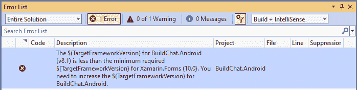

# 将 Xamarin.Forms 应用转换为.NET MAUI

在我们深入.NET MAUI 之前，我们将回顾一个现有的 Xamarin.Forms 应用，并将其转换为.NET MAUI。本章将指导您通过将运行在 Mono 上的现有 Xamarin.Forms 应用转换为运行在.NET 7 上的.NET MAUI 应用的步骤。我们将讨论两种将您的 Xamarin.Forms 应用程序转换为.NET MAUI 的不同方法。第一种方法将使用新的.NET MAUI 项目，并将我们旧的 Xamarin.Forms 代码移动到新项目中。第二种方法将使用**.NET 升级助手**工具为我们完成一些升级工作。

如果您是.NET MAUI 的新手，并且不是从 Xamarin.Forms 应用开发过来的，您可以自由地跳过这一章，直接进入下一个项目。

本章将涵盖以下主题：

+   将代码迁移到新的.NET MAUI 项目

+   升级 Xamarin.Forms 应用的概述

+   安装和运行.NET 升级助手

# 技术要求

要完成此项目，您需要在您的**Macintosh**（**Mac**）或 PC 上安装 Visual Studio，以及.NET 移动组件。有关如何设置环境的更多详细信息，请参阅*第一章*，*.NET MAUI 简介*。本章还将安装额外的组件，因此您需要互联网连接来下载和安装.NET 升级助手。本章提供了 Windows 上 Visual Studio 的截图和说明。

本章将既是经典的**文件** | **新建** | **项目**章节，同时也会使用一个现有的应用，引导您一步步完成将应用从 Xamarin.Forms 迁移到.NET MAUI 的过程。对于第二个应用，您需要从本书的 GitHub 仓库下载源代码。

您可以在[`github.com/PacktPublishing/MAUI-Projects-3rd-Edition`](https://github.com/PacktPublishing/MAUI-Projects-3rd-Edition)的`Chapter03`文件夹下找到本章代码的完整源代码。

# 项目概述

本章的目的不是详尽无遗地介绍在将您的 Xamarin.Forms 应用转换为.NET MAUI 时需要了解的所有事项。相反，它概述了在迁移应用时需要考虑的因素，以及两个实现该任务的示例。由于应用样式、版本、框架、自定义控件等存在太多变体，本章无法涵盖所有场景。这可能需要一整本书，而且很可能在出版时就已经过时了。因此，在本章中，我们将专注于一个简单的迁移方法，该方法利用.NET MAUI 的单项目特性和.NET 迁移助手，这将自动化许多手动操作，并且会不断更新。

本章的第一部分将使用从 Shell 模板创建的新 Xamarin.Forms 应用。本章的第二部分将使用.NET 升级助手升级 GitHub 上可用的开源应用 BuildChat，网址为[`github.com/mindofai/Build2019Chat`](https://github.com/mindofai/Build2019Chat)。

每本开发书籍都需要有一个聊天应用；这本书也不例外。对于.NET 迁移助手，我们将使用一个使用 Xamarin.Forms 构建的现有聊天应用。该应用可以在本地进行调试和测试，因此无需设置和配置任何云服务。

此项目的构建时间大约为一小时。

# 将应用迁移到空白.NET MAUI 模板

这种将现有应用代码移动到新.NET MAUI 应用的方法主要用于较小、较简单的应用，这些应用没有很多外部依赖，例如 NuGet 或本地库。这种方法的最大好处是迁移后的应用将是一个单一的项目，针对所有.NET MAUI 支持的平台。如果你的原始应用只针对 Android 和 iOS，使用这种方法可以免费获得 Mac Catalyst 和 Windows 目标。使用.NET 升级助手不会添加你尚未针对的平台。

为了说明这些步骤，我们将创建一个新的项目，就像我们在**第二章**中所做的那样。然而，这一次，我们首先需要创建一个 Xamarin.Forms 项目。

## 创建一个新的 Xamarin.Forms 应用

以下步骤将指导你创建一个新的 Xamarin.Forms 项目：

1.  打开 Visual Studio 2022 并选择**创建新项目**：


图 3.1 – Visual Studio 2022

这将打开**创建新项目**向导。

1.  在搜索框中输入`Xamarin.Forms`，并从列表中选择**移动应用（Xamarin.Forms）**项：


图 3.2 – 新的 Xamarin.Forms 项目

1.  通过将你的项目命名为`MauiMigration`来完成向导的下一页，然后点击**下一步**：


图 3.3 – 配置 Xamarin.Forms 项目

1.  选择**飞出**模板，并确保所有三个 Xamarin.Forms 平台都被勾选：


图 3.4 – 选择 Xamarin.Forms 模板和平台

你可能会收到一些关于过时组件的消息。如果你是第一次创建 Xamarin.Forms 应用，这是预期的，可以安全忽略。

1.  通过点击**创建**并等待 Visual Studio 创建项目来完成设置。

    在我们开始迁移此应用之前，确保它能够正常工作是个好主意。

1.  运行应用并测试所有按钮、弹出选项和菜单。

    在**关于**页面中，有一个**了解更多**按钮，它将打开浏览器并导航你到 Xamarin.Forms 快速入门网页：


图 3.5 – 了解更多按钮

1.  快捷菜单有三个选项：**关于**、**浏览**和**注销**。确保你点击每一个并探索它们的所有功能：


图 3.6 – 快捷菜单选项

现在我们已经探索了这个 Xamarin.Forms 应用，让我们继续创建新的.NET MAUI 项目，这个项目将作为我们的新应用。

## 创建新的.NET MAUI 应用

我们将向当前解决方案添加一个新项目以简化操作。要创建一个新的.NET MAUI 项目，请按照以下步骤操作：

1.  在 Visual Studio 中，右键单击**解决方案资源管理器**中的`MauiMigration`解决方案项，选择**文件** | **添加** | **新项目**：


图 3.7 – 将新项目添加到解决方案

1.  在**添加新项目**对话框中，选择**.NET MAUI 应用**，然后点击**下一步**：


图 3.8 – 添加新的.NET MAUI 项目

1.  在`MyMauiApp`中点击**下一步**：


图 3.9 – 配置.NET MAUI 项目

1.  在**附加信息**对话框中，确保选定的框架是**.NET 7.0（标准支持期限）**，然后点击**创建**。

现在我们有了.NET MAUI 应用的框架，我们可以开始将 Xamarin.Forms 应用的重要部分移动到.NET MAUI 项目中。

## 将 MauiMigration 应用迁移到 MyMauiApp

将 Xamarin.Forms 应用迁移到新的空白.NET MAUI 模板将涉及以下高级步骤：

1.  将你的应用文件复制到新的模板中。

1.  将 Xamarin.Forms 命名空间更改为其.NET MAUI 等效名称。

1.  更新应用启动项，使其使用你的视图。

下几个部分将解释如何完成这些步骤。

### 将文件复制到新项目

首先，让我们将 XAML 和 C#文件和文件夹从 Xamarin.Forms 项目复制到.NET MAUI 项目。在`MauiMigration`项目中，选择`Models`、`Services`、`ViewModels`和`Views`文件夹。我们将复制这些文件而不是移动它们，这样我们就不破坏原始项目。右键单击所选文件夹中的任何一个，选择`MauiApp`项目并点击**粘贴**。

还需要一些图片；我们将从`MauiMigration.UWP`项目复制它们。在`MauiMigration.UWP`项目下，你会找到三个名为`icon_about.png`、`icon_feed.png`和`xamarin_logo.png`的图片文件。选择所有三个文件，就像你之前对文件所做的那样。将这些文件粘贴到`MyMauiApp/Resources/Images`文件夹中。

当您复制/粘贴文件时，Visual Studio 可能会对您的项目文件进行一些更改，例如添加新的项目组，这些项目组会删除并添加相同的文件到项目中。您可以安全地删除这些更改，因为单一项目系统知道如何处理 `XAML` 和 `.png` 文件。如果您遇到与缺失图像或 `XAML` 文件中的错误相关的编译错误，请检查 `MyMAuiApp.csproj` 文件中是否有任何额外的 `ItemGroups` 引用了 `.png` 文件或 `XAML` 文件，并删除它们。

以下截图显示了从 `MauiMigration.UWP` 复制图像后的 `MyMauiApp.csproj` 文件示例。*图 3**.10* 显示了 Visual Studio 添加的更改；这些可以删除：


图 3.10 – Visual Studio 添加了不必要的项目

接下来，我们需要更新 `XAML` 文件，以便它们引用 .NET MAUI 控件。

### 更新命名空间

目前，`XAML` 文件仍在使用 Xamarin.Forms 命名空间。要更新这些文件，我们需要更改以下内容：

我们必须按照以下方式修改：

您可以使用 Visual Studio 中的 **查找和替换** 功能来执行这些更改或手动编辑每个文件。要使用 **查找和替换** 对话框，请按照以下步骤操作：

1.  在 `MyMauiApp` 项目中。

1.  从 Visual Studio 菜单中选择 **编辑** | **查找和替换** | **在文件中替换**（或 *Ctrl* + *Shift* + *H*）以打开 **查找和替换** 对话框：


图 3.11 – 查找和替换对话框

1.  在 **查找位置** 字段中，选择 **当前项目**。

1.  点击 **全部替换** 按钮；应该只有五个地方需要做出更改。

完成后，还需要进行一些其他更改。

在 `MyMauiApp` 项目的 `Views` 文件夹中的 `NewItemPage.xaml` 文件中，删除以下突出显示的文本：

```cs
Title="New Item"

XAML file namespace changes are complete, we can move on to the C# namespace changes.
Using the **Find and Replace** dialog again, we can remove all the Xamarin.Forms namespace references. This time, by using a regular expression, we can remove multiple lines. Use the following expression in the **Find** entry box:

```

^using Xamarin\.[Forms,Essentials].*;

```cs

 Then, check the **Use regular expressions** checkbox and select **Current project** for **Look in**, as shown here:


Figure 3.12 – Find and Replace – C# namespaces
Most of the changes have been made, and the app should compile at this point. However, it is not using any of the code we have copied and modified as .NET MAUI Shell does not reference the copied pages. The next step is to hook Shell into our code.
Modifying the app startup
The `MyMauiApp` project is still using the default `MainPage.xaml` file as its startup page. The next step in our migration is to make the `AppShell.xaml` file the same as it is for our Xamarin.Forms app.
What we need to copy is in the `MauiMigration` project, in the `AppShell.xaml` file, starting at line 76 until line 101, as shown in the following code snippet:

```

<!--

当弹出项可见时，这将定义在弹出项中显示的内容。

FlyoutDisplayOptions="AsMultipleItems" 将为每个子元素创建一个单独的弹出项           https://docs.microsoft.com/dotnet/api/xamarin.forms.shellgroupitem.flyoutdisplayoptions?view=xamarin-forms

-->

<FlyoutItem Title="关于" Icon="icon_about.png">

<ShellContent Route="AboutPage" ContentTemplate="{DataTemplate local:AboutPage}" />

</FlyoutItem>

<FlyoutItem Title="浏览" Icon="icon_feed.png">

<ShellContent Route="ItemsPage" ContentTemplate="{DataTemplate local:ItemsPage}" />

</FlyoutItem>

<!-- 当弹出项可见时，这将是一个可以绑定点击行为的菜单项  -->

<MenuItem Text="注销" StyleClass="MenuItemLayoutStyle" Clicked="OnMenuItemClicked">

</MenuItem>

<!--

TabBar 允许您定义不会在弹出菜单中显示的内容。当此内容处于活动状态时

弹出菜单将不可用。这对于创建应用程序中不需要弹出菜单的区域很有用。

您不希望用户能够导航离开。如果您想导航到这个

content you can do so by calling

await Shell.Current.GoToAsync("//LoginPage");

-->

<TabBar>

<ShellContent Route="LoginPage" ContentTemplate="{DataTemplate local:LoginPage}" />

</TabBar>

```cs

 Copy the preceding code and replace the following lines in the `MyMauiApp` project’s `AppShell.xaml` file:

```

<ShellContent

Title="Home"

ContentTemplate="{DataTemplate local:MainPage}"

Route="MainPage" />

```cs

 To enable the flyout, you will need to remove the following highlighted text in `AppShell.xaml`:

```

MauiProgram.cs 文件并对以下代码块中突出显示的更改进行修改：

```cs
using Microsoft.Extensions.Logging;
using MauiMigration.Services;
using MauiMigration.Models;
namespace MyMauiApp
{
    public static class MauiProgram
    {
        public static MauiApp CreateMauiApp()
        {
            var builder = MauiApp.CreateBuilder();
            builder
                .UseMauiApp<App>()
                .ConfigureFonts(fonts =>
                {
                    fonts.AddFont("OpenSans-Regular.ttf", "OpenSansRegular");
                    fonts.AddFont("OpenSans-Semibold.ttf", "OpenSansSemibold");
                });
            DependencyService.RegisterSingleton<IDataStore<Item>>(new MockDataStore());
#if DEBUG
        builder.Logging.AddDebug();
#endif
        return builder.Build();
        }
    }
}
```

到目前为止，您应该能够编译并运行转换后的项目。在运行之前，请确保将 `MyMauiApp` 设置为启动项目。玩转应用程序，确保一切正常后再进入下一节，即手动将应用程序迁移到 .NET MAUI。

手动迁移概述

在上一节中，我们使用单一项目系统将一个简单的 Xamarin.Forms 应用程序转换为 .NET MAUI。该项目没有使用任何高级的 Xamarin.Forms 功能，例如外部 NuGet 包、自定义控件或任何商业控件。这些是在将您的应用程序从 Xamarin.Forms 迁移到 .NET MAUI 时需要考虑的额外项目。

在本节中，我们将讨论您在迁移您的 Xamarin.Forms 应用程序到 .NET MAUI 时应该遵循的基本流程。这绝对不是一份详尽的列表；.NET MAUI 团队正在更新一个维基页面，其中详细说明了他们所有的知识。

官方迁移指南

由于 .NET MAUI 的发布，迁移您的 Xamarin.Forms 应用程序到 .NET MAUI 的指南一直在不断演变，基于使用情况和反馈。要查看最新指南，请访问以下 URL 并在您喜欢的浏览器中查看：[`learn.microsoft.com/en-us/dotnet/maui/get-started/migrate?view=net-maui-7.0`](https://learn.microsoft.com/en-us/dotnet/maui/get-started/migrate?view=net-maui-7.0)。

当您将应用程序从 Xamarin.Forms 迁移到 .NET MAUI 时，您需要遵循这里概述的整体步骤：

1.  将 .NET Framework 的 Xamarin.Forms 项目转换为 .NET SDK 风格。

1.  将代码从 Xamarin.Forms 更新到 .NET MAUI。

1.  更新与 .NET 6+ 版本不兼容的依赖项。

1.  解决任何破坏性的 API 变更。

1.  运行转换后的应用程序并验证其功能。

.NET 升级助手是一个工具，它将尝试为您执行前四个步骤。然而，在我们深入使用 .NET 升级助手之前，我们将查看每个步骤包含的内容，以便我们能够牢固地理解如何在 .NET 升级助手无法在应用程序项目中操作时迁移我们的应用程序。

将 .NET Framework 的 Xamarin.Forms 项目转换为 .NET SDK 风格

一些 Xamarin.Forms 项目基于 .NET Framework 项目模板。这是一个冗长的项目格式，已经更新为适用于 .NET 项目。新的格式，通常称为 SDK 风格，是一个更简洁的格式，具有更好的默认设置。使用 Visual Studio 16.5 或更高版本创建的 Xamarin.Forms 项目使用较新的 SDK 格式。

要转换旧格式的项目文件，例如我们将在本章后面的*安装和运行.NET 升级助手*部分使用的项目文件，你需要将`<Project />`元素更改为新的 SDK 样式，如下所示：

1.  在你的项目文件中找到如下类似的行：

    ```cs
    <Project ToolsVersion="4.0" DefaultTargets="Build" >
    ```

    2.  替换为以下内容：

    ```cs
    <Project Sdk="Microsoft.NET.Sdk">
    ```

记住，你将必须为所有你的 Xamarin.Forms 项目、平台特定项目和任何共享库项目进行此更改。

让我们看看你可能需要为针对 Android 和 iOS 的典型 Xamarin.Forms 项目做出的具体更改。

要将 Xamarin.Forms 应用的共享库项目转换为.NET MAUI 项目，我们需要将`csproj`文件的内容替换为以下内容：

```cs
<Project Sdk="Microsoft.NET.Sdk">
  <PropertyGroup>
    <TargetFrameworks>net7.0-ios;net7.0-android; </TargetFrameworks>
    <TargetFrameworks Condition="$([MSBuild]::IsOSPlatform
('windows'))">$(TargetFrameworks);net7.0-windows10.0.19041.0
</TargetFrameworks>
    <UseMaui>True</UseMaui>
    <OutputType>Library</OutputType>
    <ImplicitUsings>enable</ImplicitUsings>
    <!-- Required for C# Hot Reload -->
    <UseInterpreter Condition="'$(Configuration)' == 'Debug'">True</UseInterpreter>
    <SupportedOSPlatformVersion Condition="$([MSBuild]::GetTargetPlatformIdentifier('$
(TargetFramework)')) == 'ios'">14.2</SupportedOSPlatformVersion>
    <SupportedOSPlatformVersion Condition="$([MSBuild]::GetTargetPlatformIdentifier('$
(TargetFramework)')) == 'android'">21.0</SupportedOSPlatformVersion>
    <SupportedOSPlatformVersion Condition="$([MSBuild]::GetTargetPlatformIdentifier('$
(TargetFramework)')) == 'windows'">10.0.17763.0</SupportedOS
PlatformVersion>
    <TargetPlatformMinVersion Condition="$([MSBuild]::GetTargetPlatformIdentifier('$
(TargetFramework)')) == 'windows'">10.0.17763.0</Target
PlatformMinVersion>
  </PropertyGroup>
</Project>
```

重要的部分被突出显示。`<UseMaui>True</UseMaui>`将使项目系统自动为.NET MAUI 库添加正确的项目引用。`<TargetFrameworks>`元素被更新为.NET 6 或 7 的正确**目标框架标识符**（**TFMs**）。

.NET MAUI 还需要一个额外的`<SupportedOSPlatformVersion>`属性，该属性根据`TargetPlatformIdentifier`有条件地设置。

与.NET Framework 的`csproj`文件相比，这是一个显著的数量减少。除了属性减少之外，你可以删除大多数`<ItemGroup>…</ItemGroup>`条目，因为现在所有源文件默认都包含在内。需要保留的组是包含`<ProjectReferences />`条目的组。

现在我们已经转换了共享项目，让我们回顾一下 Android 项目所需的更改。

与所有.NET Framework 项目一样，我们需要将`<Project …>`元素更改为以下内容：

```cs
<Project Sdk="Microsoft.NET.Sdk">
```

现在，删除所有`<PropertyGroup>…</PropertyGroup>`元素，因为它们是默认值，并用以下内容替换它们：

```cs
<PropertyGroup>
  <UseMaui>True</UseMaui>
  <TargetFramework>net7.0-android</TargetFramework>
  <OutputType>Exe</OutputType>
  <ImplicitUsings>enable</ImplicitUsings>
  <SupportedOSPlatformVersion Condition="'$(TargetFramework)' == 'net7.0-android'">31.0</SupportedOSPlatformVersion>
</PropertyGroup>
<PropertyGroup>
  <UseInterpreter Condition="$(TargetFramework.Contains('-android'))">True</UseInterpreter>
</PropertyGroup>
```

在 Android 项目中，我们设置了`<UseMaui>`和`<TargetFramework>`属性。

要完成迁移此项目文件，删除所有`<ItemGroup>`元素及其内容，除了包含`<AndroidResource>`元素的组。最后，删除项目文件底部的`<Import>`元素；它不再需要。

接下来要查看的项目类型是 iOS 项目。这里的更改将与 Android 项目的更改非常相似，但带有 iOS 特色。Xamarin.Forms iOS 项目也是一个.NET Framework 风格的项目，因此我们需要将`<Project …>`元素更改为以下内容：

```cs
<Project Sdk="Microsoft.NET.Sdk">
```

然后，我们需要删除所有现有的`<PropertyGroup>`元素，并添加以下内容：

```cs
<PropertyGroup>
  <UseMaui>true</UseMaui>
  <TargetFramework>net7.0-ios</TargetFramework>
  <OutputType>Exe</OutputType>
  <ImplicitUsings>enable</ImplicitUsings>
  <SupportedOSPlatformVersion 
Condition="$([MSBuild]::GetTargetPlatformIdentifier('$
(TargetFramework)')) == 'ios'">14.2</SupportedOSPlatformVersion>
</PropertyGroup>
```

再次，你会注意到`<UseMaui>`属性被设置，并且`<TargetFramwork>`的值是`net7.0-ios`。

要完成 iOS 项目的转换，删除除包含`<ProjectReference>`条目的`<ItemGroup>`和`<Import>`元素之外的所有元素；这些仍然需要。

将 Xamarin.Forms 代码更新到.NET MAUI

将代码从 Xamarin.Forms 更新到 .NET MAUI 包含几个步骤。首先，我们需要添加一些初始化 .NET MAUI 所必需的新代码。有关所需文件的更多详细信息，请参阅 *第二章* 的 *检查文件部分*。

您需要做的第一个更改是在共享项目中。添加一个名为 `MauiProgram.cs` 的新类文件，内容至少如下所示：

```cs
public static class MauiProgram
{
    public static MauiApp CreateMauiApp()
    {
        var builder = MauiApp.CreateBuilder();
        builder
            .UseMauiApp<App>()
            .ConfigureFonts(fonts =>
            {
                fonts.AddFont("OpenSans-Regular.ttf", 
"OpenSansRegular");
             });
        return builder.Build();
    }
}
```

您可能需要向此文件添加额外的代码，以便它可以处理您应用程序的额外需求，例如注册类型以进行依赖注入或注册额外的库功能，例如日志记录。

在 `Platforms/Android` 文件夹中，添加一个名为 `MainApplication.cs` 的新类文件，并更新类，使其看起来像这样：

```cs
[Application]
public class MainApplication : MauiApplication
{
    public MainApplication(IntPtr handle, JniHandleOwnership ownership)
    : base(handle, ownership)
    {
    }
    protected override MauiApp CreateMauiApp() => MauiProgram.CreateMauiApp();
}
```

我们还必须对 `MainActivity` 类进行一些调整。打开 `MainActivity.cs` 文件，并对以下代码中突出显示的部分进行更改：

```cs
[Activity(Label = "ManualMigration", Icon = "@mipmap/icon", 
Theme = "@style/Theme.MaterialComponents", MainLauncher = true, 
ConfigurationChanges = ConfigChanges.ScreenSize | ConfigChanges.
Orientation | ConfigChanges.UiMode | ConfigChanges.ScreenLayout | 
ConfigChanges.SmallestScreenSize )]
public class MainActivity : MauiAppCompatActivity
{
    protected override void OnCreate(Bundle savedInstanceState)
    {
        base.OnCreate(savedInstanceState);
    }
targetSdkVersion in the AndroidManifest.xml file to version 33, like this:

```

<uses-sdk android:minSdkVersion="21" android:targetSdkVersion="33" />

```cs

 Android SDK versions
Since the Android SDK is updated yearly, it may be the case that the version of .NET for Android and .NET MAUI that you are using is also using a version of the Android SDK that is greater than `33`. The good news is that you will get an error in Visual Studio if `targetSdkVersion` is too low or is not installed. Just follow the instructions in the build error to set the SDK version correctly.
That is all the changes we need to make in the Android project for now. Moving on to the iOS project, the `AppDelegate.cs` file can be updated so that it matches the following:

```

public partial class AppDelegate : MauiUIApplicationDelegate

{

protected override MauiApp CreateMauiApp() => MauiProgram.

CreateMauiApp();

}

```cs

 The final change for the iOS project is to open the `Info.plist` file and change the `MinimumOSVersion` property to `15.2`.
With the base changes needed to start your app as a .NET MAUI app done, the next changes are much broader brush strokes:

1.  Remove all `Xamarin.*` namespaces from `.``cs` files.
2.  Change all `xaml` namespace declarations from the following:

    You will need to amend them like so:

You may notice that these are the same changes we made in the previous section when using a .NET MAUI Single Project.
About images
.NET MAUI has improved image handling for the various platforms that it targets. You can provide a single SVG image file, and it will resize the image correctly for all platforms for you. Since the SVG format is based on vectors, it will render much better than other formats such as JPG and PNG after resizing. It is recommended that you convert your images into SVG format, if possible, to take advantage of this feature in .NET MAUI.
Updating any incompatible NuGet packages
There are a lot of NuGet packages out there and there is no way we can cover them all. But, in general, for each of the NuGet packages that are in use in your app, be sure to look for a version that specifically supports .NET MAUI or the version of .NET that you are targeting. You can use the NuGet Gallery page to determine whether a package supports .NET MAUI. Using a popular package such as PCLCrypto version 2.0.147 ([`www.nuget.org/packages/PCLCrypto/2.0.147#supportedframeworks-body-tab`](https://www.nuget.org/packages/PCLCrypto/2.0.147#supportedframeworks-body-tab)) targets classic Xamarin projects but not .NET 6 or .NET 7\. You can find the compatible frameworks under the **Frameworks** tab:


Figure 3.13 – NuGet Gallery page for PCLCrypto v2.0.147
However, version 2.1.40-alpha ([`www.nuget.org/packages/PCLCrypto/2.1.40-alpha#supportedframeworks-body-tab`](https://www.nuget.org/packages/PCLCrypto/2.1.40-alpha#supportedframeworks-body-tab)) lists .NET 6 and .NET 7 as compatible frameworks:


Figure 3.14 – NuGet Gallery page for PCLCrypto v2.1.40-alpha
Currently, we know of the following NuGet changes:

*   Remove all Xamarin.Forms and Xamarin.Essentials NuGet references from your projects. These are now included in .NET MAUI directly. You will have to make some namespace adjustments as those have changed.
*   Replace Xamarin.Community Toolkit with the latest preview of .NET MAUI Community Toolkit. You will have to make some namespace adjustments as those have changed.
*   If you reference any of the following SkiaSharp NuGet packages directly, replace them with the latest previews:
    *   **SkiaSharp.Views.Maui.Controls**
    *   **SkiaSharp.Views.Maui.Core**
    *   **SkiaSharp.Views.Maui.Controls.Compatibility**

You can find the latest version of NuGet packages on the NuGet Gallery website at [`nuget.org/packages`](https://nuget.org/packages).
Addressing any breaking API changes
Unfortunately, there is no magic bullet for any of these types of changes. You will simply have to start from the top of your error list and work your way through them. You can review the release notes linked in the official migration guide, available at [`learn.microsoft.com/en-us/dotnet/maui/migration/`](https://learn.microsoft.com/en-us/dotnet/maui/migration/), as helpful hints.
For example, a common type of error that’s seen is `error CS0104: 'ViewExtensions' is an ambiguous reference between 'Microsoft.Maui.Controls.ViewExtensions' and 'Microsoft.Maui.ViewExtensions'`. This can be fixed by explicitly using the full namespace when referencing the type or by using a type alias – for example, `using ViewExtensions =` `Microsoft.Maui.Controls.ViewExtensions`.
Custom renderers and effects
Your application may use custom renderers or effects to provide a unique user experience. Covering how to upgrade these components is beyond the scope of this chapter. To learn more about how to upgrade renderers and effects, visit the Microsoft Learn site for .NET MAUI migration at [`learn.microsoft.com/en-us/dotnet/maui/migration/`](https://learn.microsoft.com/en-us/dotnet/maui/migration/).
Running the converted app and verifying its functionality
This is not the last step – I recommend that you attempt to do this after each change. Building your app as you make changes ensures that you are moving in the right direction. I recommend that you `obj` and `bin` folders beforehand. This will ensure that you are building with the latest changes and dependencies, by forcing a NuGet restore.
Now that we know the basics of how to convert a Xamarin.Forms app, let’s use .NET Upgrade Assistant to migrate a project for us.
Installing and running .NET Upgrade Assistant
As stated previously, .NET Upgrade Assistant will attempt to perform the first four steps of the migration of your Xamarin.Forms app to .NET MAUI outlined in the previous section. The tool is under active development and as the team discovers new improvements, they are added. This is mostly due to feedback they receive from developers like you.
At the time of writing, .NET Upgrade Assistant did not work on all projects and has the following limitations:

*   Xamarin.Forms must be version 5.0 and higher
*   Only Android and iOS projects are converted
*   .NET MAUI must be properly installed with the appropriate workloads

If you have followed the steps from *Chapter 1*, then the last should should already be satisfied.
If your Xamarin.Forms app meets these criteria, then we can get started by installing the tool.
Installing .NET Upgrade Assistant
.NET Upgrade Assistant is a Visual Studio extension on Windows and a command-line tool on Windows and macOS. You can use the integrated developer PowerShell in Visual Studio or any command-line prompt to install the tool. Follow these steps to install the tool using Visual Studio on Windows:

1.  In Visual Studio, select the **Extensions** menu, then the **Manage Extensions** item. This will open the **Manage** **Extensions** dialog.
2.  In the `upgrade`.
3.  Select **.NET Upgrade Assistant** and click **Download**:


Figure 3.15 – Visual Studio – the Manage Extensions dialog

1.  Once the extension has been downloaded, you will need to close and reopen Visual Studio to install the extension:


Figure 3.16 – Installing the .NET Upgrade Assistant VSIX

1.  Click **Modify** and then follow the instructions to complete the installation.
2.  Once the installation is complete, reopen Visual Studio.

Now that the tool has been installed, we can use it to convert a Xamarin.Forms project!
Preparing to run .NET Upgrade Assistant
For the remainder of this chapter, we will be using Visual Studio on Windows to migrate a Xamarin.Forms app to .NET MAUI.
To run .NET Upgrade Assistant, we will need a Xamarin.Forms project to upgrade. For this portion of the chapter, we will use the Xamarin.Forms app that was demoed at the Microsoft Build conference in 2019\. The source can be found at [`github.com/mindofai/Build2019Chat`](https://github.com/mindofai/Build2019Chat), though you can find it in this book’s GitHub repository at [`github.com/PacktPublishing/MAUI-Projects-3rd-Edition`](https://github.com/PacktPublishing/MAUI-Projects-3rd-Edition) under the `Chapter03/Build2019Chat` folder.
Once you have downloaded the source, open the `BuildChat.sln` file in Visual Studio. Once the project has finished loading, make sure your configuration is correct by running the app first. You should see a screen that looks like this on Android:


Figure 3.17 – The original app on Android
Now that we have confirmed that the original app runs, we can follow these steps to prepare for running .NET Upgrade Assistant:

1.  Right-click the `BuildChat` solution node in **Solution Explorer** and select **Manage NuGet Packages** **for Solution…**:


Figure 3.18 – Solution context menu

1.  In the **NuGet – Solution** window that opens, select the **Updates** tab:


Figure 3.19 – The NuGet – Solution window

1.  Click the **Select all packages** checkbox, then click **Update**.
2.  Visual Studio will prompt you with a preview of all the changes that will be made. Click **OK** once you have reviewed them.
3.  Visual Studio will then prompt you to accept the license terms for packages that have them. Once you have reviewed the license terms, click **I Accept**.
4.  After updating, you may still have a **gold bar** indicator in the Visual Studio window from running the application earlier. You can safely dismiss the message by clicking the **X** button on the right:

Figure 3.20 – Xamarin.Forms version gold bar

1.  Once the packages have been updated, let’s make sure the app is still working by running it again. You should get a build error like the following:



Figure 3.21 – Error after upgrading packages

1.  To resolve this error, in `BuildChat.Android` project, then press *Alt* and *Enter* at the same time to open the project properties page.
2.  Use the `Android 8.1 (Oreo)` to `Android 10.0`.

Google Play support
You may get a warning about Google Play requiring new apps and updates to support a specific version of Android. To remove that warning, just set **Target Framework** to the version indicated in the warning message.

1.  Visual Studio will prompt you to confirm the change as it has to close and re-open the project. Select **Yes**.
2.  Visual Studio may also prompt you to install the Android version if you haven’t installed it. Follow the prompts to install the Android version.
3.  Attempting to run the project again yields a new set of errors:


Figure 3.22 – Missing packages error

1.  To resolve this error, right-click the `BuildChat.Android` project and select **Unload Project**. The project file should open in Visual Studio automatically.
2.  Locate `<ItemGroup>` in the file with `<PackageReference>` items and make the changes highlighted in the following snippet:

    ```

    <ItemGroup>

    <PackageReference Include="Microsoft.AspNetCore.SignalR.Client">

    <Version>7.0.9</Version>

    </PackageReference>

    <PackageReference Include="Xamarin.Forms" Version="5.0.0.2578" />

    <PackageReference Include="Xamarin.Android.Support.Design" Version="28.0.0.3" />

    <PackageReference Include="Xamarin.Android.Support.v7.AppCompat" Version="28.0.0.3" />

    <PackageReference Include="Xamarin.Android.Support.v4" Version="28.0.0.3" />

    <PackageReference Include="Xamarin.Android.Support.v7.CardView" Version="28.0.0.3" />

    <PackageReference Include="Xamarin.AndroidX.MediaRouter" Version="1.2.0" />

    <PackageReference Include="Xamarin.AndroidX.Palette" Version="1.0.0.5" />

    </ItemGroup>

    ```cs

    You could also use Visual Studio’s NuGet Package Manager to add these packages.

     3.  Save and reload the project before trying to run it again. Since the project was unloaded, you will need to set the `BuildChat.Android` project as the startup project again.

You should be able to run the application at this time since some warnings can be ignored. If not, review the previous steps to make sure you made all the changes correctly. At this point, we are ready to run the upgrade assistant to convert from Xamarin.Forms into .NET MAUI.
Treat warnings as errors
If you have the project option to treat warnings as errors set to anything other than none, then the warnings will prevent you from running the app. Set the option to none to allow the app to run. The option defaults to none.
Running .NET Upgrade Assistant
Running .NET Upgrade Assistant from within Visual Studio is a straightforward process. We will upgrade each project individually; there isn’t any method to upgrade all the projects in one go.
Upgrading the BuildChat project
Let’s start with the shared project, `BuildChat`, by following these steps:

1.  Select the `BuildChat` project in **Solution Explorer**.
2.  Use the context menu to select the **Upgrade** menu item:


Figure 3.23 – Upgrading the BuildChat project
This will open the **Upgrade** assistant in a document window:


Figure 3.24 – Upgrading the BuildChat project

1.  Select the **In-place project** **upgrade** option.
2.  Depending on the versions of .NET you have installed, you will be prompted to choose one. If you followed the setup instructions in *Chapter 1*, you should have the .NET 7.0 option available. Select **.NET 7.0** and select **Next**:


Figure 3.25 – Choosing the preferred target framework

1.  At this point, you are allowed to review the changes that will be made by expanding each node in the list. You can also choose to not upgrade certain items by removing the check in the checkbox next to that item. When you have inspected all the changes, make sure all items are checked again, then click **Upgrade selection**:


Figure 3.26 – Reviewing the upgrade

1.  Visual Studio will start the upgrade process. You can monitor it as it completes each item:


Figure 3.27 – Upgrade in progress

1.  When it’s finished, you can inspect each item to see what the result of the upgrade was:


Figure 3.28 – Upgrade complete
A white check in a green circle indicates some transformation was completed and successful, a green check with a white background means the step was skipped since nothing was needed, and a red cross (not shown) means the transformation failed. You can view the complete output from the tool by inspecting the **Upgrade Assistant** log in the output pane:


Figure 3.29 – Upgrade Assistant log output
Do not be concerned with the errors in the error window at this point. There will be errors until we finish upgrading the remaining projects. Now that the `BuildChat` project has been upgraded, we can upgrade the `BuildChat.Android` project.
Upgrading the BuildChat.Android project
The steps for upgrading the remaining projects are largely the same – the only difference will be the steps involved in upgrading each project. The next two sections will skip the screenshots and just provide the steps. To complete the upgrade for the `BuildChat.Android` project, follow these steps:

1.  Select the **BuildChat.Android** project in **Solution Explorer**.
2.  Use the context menu to select the **Upgrade** menu item.
3.  This will open the **Upgrade** assistant in a document window.
4.  Select the **In-place project** **upgrade** option.
5.  Select the **.NET 7.0** option, then select **Next**.
6.  Review the changes that will be made by expanding each node in the list. Make sure all items are checked, then click **Upgrade Selection**.
7.  Visual Studio will complete the upgrade process.

Now that .NET Upgrade Assistant has completed the `BuildChat.Android` project, we can upgrade the `BuildChat.iOS` project.
Upgrading the BuildChat.iOS project
The steps for upgrading the iOS project are largely the same – the only difference will be the steps involved in upgrading each project. To complete the upgrade for the `BuildChat.iOS` project, follow these steps:

1.  Select the `BuildChat.iOS` project in **Solution Explorer**.
2.  Use the context menu to select the **Upgrade** menu item.
3.  This will open the **Upgrade** assistant in a document window:
4.  Select the **In-place project** **upgrade** option.
5.  Select the **.NET 7.0** option, then select **Next**.
6.  Review the changes that will be made by expanding each node in the list. Make sure all items are checked, then click **Upgrade Selection**.
7.  Visual Studio will complete the upgrade process.

Now that .NET Upgrade Assistant has completed the `BuildChat.iOS` project, we can see how well it worked.
Completing the upgrade to .NET MAUI
With .NET Upgrade Assistant having done all the work it can to upgrade the projects, we can now see what is left for us to complete the upgrade to .NET MAUI.
The first thing we want to do is make sure that the project is clean of all the previous build artifacts. This will ensure we are referencing all the right dependencies in our build output by forcing a restore and build. The best way to accomplish this is to remove the `bin` and `obj` folders from each project folder.
Use `bin` and `obj` folders from the `BuildChat`, `BuildChat.Android` and `BuildChat.iOS` folders, then build the solution.
We’ll end up with a few build errors for each project, as shown in the following figure:


Figure 3.30 – Package issues
To resolve these errors, either use Visual Studio’s NuGet Package Manager to add a reference to version 7.0.1 of the `Microsoft.Extensions.Logging.Abstractions` package to all the projects, or follow these steps to update the project files manually:

1.  Select the `BuildChat` project in **Solution Explorer**.

    The project file will open in a document window automatically.

2.  Locate the `ItemGroup` element that contains the `PackageReference` items.
3.  Make the changes highlighted in the following snippet:

    ```

    <ItemGroup>

    <PackageReference Include="Microsoft.AspNetCore.SignalR.Client" Version="7.0.9" />

    <PackageReference Include="Microsoft.Extensions.Logging.Abstractions" Version="7.0.1" />

    </ItemGroup>

    ```cs

     4.  Select the `BuildChat.Android` project in **Solution Explorer**.

    The project file will open in a document window automatically.

5.  Locate the `ItemGroup` element that contains the `PackageReference` items.
6.  Make the changes highlighted in the following snippet:

    ```

    <ItemGroup>

    <PackageReference Include="Xamarin.AndroidX.MediaRouter" Version="1.2.0" />

    <PackageReference Include="Xamarin.AndroidX.Palette" Version="1.0.0.5" />

    <PackageReference Include="Microsoft.AspNetCore.SignalR.Client" Version="7.0.9" />

    <PackageReference Include="Microsoft.Extensions.Logging.Abstractions" Version="7.0.1" />

    </ItemGroup>

    ```cs

     7.  Select the `BuildChat.iOS` project in **Solution Explorer**.

    The project file will open in a document window automatically.

8.  Locate the `ItemGroup` element that contains the `PackageReference` items.
9.  Make the changes highlighted in the following snippet:

    ```

    <ItemGroup>

    <PackageReference Include="Microsoft.AspNetCore.SignalR.Client" Version="7.0.9" />

    <PackageReference Include="Microsoft.Extensions.Logging.Abstractions" Version="7.0.1" />

    </ItemGroup>

    ```cs

Now that we have added the required package references, we can try building the app again. After this build, we’ll get two new errors:


Figure 3.31 – Namespace does not exist errors
These two errors show two areas that the upgrade assistant did not upgrade. Luckily, we covered how to upgrade these two files easier in this chapter. Let’s upgrade them again, starting with the `BuildChat.Android` project.
Open the `MainActivity.cs` file and make the changes highlighted in the following code:

```

使用 Microsoft.Maui;

命名空间 BuildChat.Droid

{

[Activity(Label = "BuildChat", Icon = "@mipmap/icon", Theme = "@style/Theme.MaterialComponents", MainLauncher = true, ConfigurationChanges = ConfigChanges.ScreenSize | ConfigChanges.Orientation)]

public class MainActivity : MauiAppCompatActivity

{

protected override void OnCreate(Bundle savedInstanceState)

{

base.OnCreate(savedInstanceState);

}

}

}

```cs

 That should complete the changes needed for the Android project. Now, to upgrade the iOS project, open the `AppDelegate.cs` file in `BuildChat.iOS` and update it so that it matches the following:

```

使用 Foundation;

使用 Microsoft.Maui;

using Microsoft.Maui.Hosting;

namespace BuildChat.iOS

{

// 应用的 UIApplicationDelegate。此类负责启动

// 应用的用户界面，以及监听（并可选地响应）

// 从 iOS 接收的应用事件。

[Register("AppDelegate")]

public partial class AppDelegate : MauiUIApplicationDelegate

{

protected override MauiApp CreateMauiApp() => MauiProgram.CreateMauiApp();

}

}

```cs

 The final change for the iOS project is to open the `Info.plist` file and change the `MinimumOSVersion` property to `15.2`. To make this change, use `Info.plist` file and make this change, follow these steps:

1.  Select the `Info.plist` file in the `BuildChat.iOS` project.
2.  Use the context menu (right-click) and select **Open With…**.
3.  In the **Open With** dialog, select **Generic Plist Editor**, then select **OK**:


Figure 3.32 – Opening the Info.plist file

1.  Find the entry labeled `Minimum system version` and change the value from `8.0` to `15.1`:


Figure 3.33 – Changing the minimum system version
Great – that should complete the changes needed to get the app running as a .NET MAUI application! The following are the before and after screenshots of the application; *before* is on the left and *after* is on the right:


Figure 3.34 – Xamarin.Forms versus .NET MAUI
There are some visual changes between Xamarin.Forms and .NET MAUI, and you can tweak the .NET MAUI settings for the layouts and controls to get a very similar output.
Summary
In this chapter, we focused on upgrading a Xamarin.Forms app to .NET MAUI. We learned how to upgrade the project files from .NET Framework to SDK-style projects, application startup files, XAML views, and C# files needed for .NET MAUI. We started by doing this manually to learn about all the required steps and changes. We ended this chapter by using .NET Upgrade Assistant to make many of the changes for us. We also learned how to upgrade to the Single Project format, which is the default for .NET MAUI. Now, we can pick the best method for the project we are upgrading.
While we covered a lot in this chapter, it was not exhaustive. There is a lot of variation in different projects, from NuGet package dependencies and vendor-provided controls to customizations using renderers and effects. The app you are upgrading may use one or all of these, and you can find additional help on the Microsoft Learn site for upgrading Xamarin.Forms to .NET MAUI: [`learn.microsoft.com/en-us/dotnet/maui/migration/`](https://learn.microsoft.com/en-us/dotnet/maui/migration/).
If you are interested in seeing the `BuildChat` app fully functional, try using .NET Upgrade Assistant on the service that was also built for the 2019 Microsoft Build conference. You can find the source on GitHub at [`github.com/mindofai/SignalRChat/tree/master`](https://github.com/mindofai/SignalRChat/tree/master). You could also use ChatGPT to help you build the service yourself using Azure Functions and SignalR.
In the next chapter, we will build an app that displays news articles using the new .NET MAUI Shell.

```

```cs

```

# 第二部分：基本项目

在这部分，你将学习.NET MAUI 的特性，例如 Shell、CollectionView、Image、Button、Label、CarouselView、Grid、自定义控件和手势。你将探索使用位置服务、调用自定义 Web API 以及为不同形态设计你的 XAML。

本部分包含以下章节：

+   *第四章*，*使用.NET MAUI Shell 构建新闻应用*

+   *第五章*，*使用动画构建具有丰富 UX 的匹配应用*

+   *第六章*，*使用 CollectionView 和 CarouselView 构建照片库应用*

+   *第七章*，*使用 GPS 和地图构建位置跟踪应用*

+   *第八章*，*为多种形态构建天气应用*
