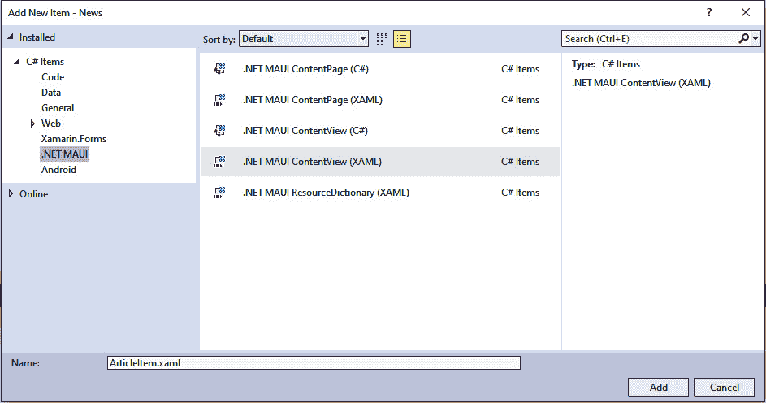

# 使用 .NET MAUI Shell 构建新闻应用

在本章中，我们将创建一个利用微软 .NET MAUI 团队提供的 **Shell** 导航功能构建的新闻应用。我们之前使用 **ContentPage**、**FlyoutPage**、**TabbedPage** 或 **NavigationPage** 作为主页的方法仍然有效，就像我们在 *第二章* 中所做的那样，但我们确信您会喜欢定义应用程序结构的新方法。此外，您还可以混合使用新旧方法。

到本章结束时，您将学习如何使用 Shell 定义应用程序结构，从 REST API 消费数据，配置导航，以及使用查询样式路由在视图之间传递数据。

那么，Shell 是什么呢？在 Shell 中，您使用 **可扩展应用程序标记语言**（**XAML**）来定义您应用程序的结构，而不是将其隐藏在应用程序中分散的代码片段中。您还可以使用路由进行导航，就像那些花哨的网页开发者所做的那样。

本章将涵盖以下主题：

+   定义 Shell 导航页面

+   创建飞出菜单

+   创建导航栏

+   使用路由进行导航并在查询字符串中传递数据

+   从公共 **表示状态传输**（**REST**）**应用程序编程接口**（**API**）消费数据

+   以 `CollectionView` 控件的形式添加内容

# 技术要求

要完成这个项目，您需要安装 Visual Studio for Mac 或 Windows，以及必要的 .NET MAUI 工作负载组件。有关如何设置环境的更多详细信息，请参阅 *第一章*，*.NET MAUI 简介*。

您可以在 [`github.com/PacktPublishing/MAUI-Projects-3rd-Edition`](https://github.com/PacktPublishing/MAUI-Projects-3rd-Edition) 找到本章的源代码。

# 项目概述

我们将使用 **单项目** 功能作为代码共享策略来创建一个 .NET MAUI 项目。它将包含以下两个部分：

+   在第一部分，我们将创建视图并使用 Shell 使它们可导航。

+   在第二部分，我们将通过消费新闻的 **REST API** 来添加一些内容

第二部分不是学习 Shell 所必需的，但它将使您在构建完整应用程序的道路上更进一步。

本项目的构建时间大约为 1.5 小时。

# 构建新闻应用

本章将从头开始构建新闻应用。它将指导您完成每个步骤，但不会深入每个细节。为此，我们建议阅读 *第二章*，*构建我们的第一个 .NET MAUI 应用程序*，其中包含更多详细信息。

开心编码！

## 设置项目

与所有其他项目一样，本项目是一个 **文件** | **新建** | **项目...** 风格的项目。这意味着我们根本不会导入任何代码。因此，本节全部关于创建项目和设置基本项目结构。

### 创建新项目

第一步是创建一个新的 .NET MAUI 项目：

1.  打开 Visual Studio 2022 并选择 **创建一个** **新项目**：


图 4.1 – Visual Studio 2022

这将打开 **创建一个新项目** 向导。

1.  在搜索框中输入 `maui` 并从列表中选择 **.NET MAUI 应用** 项：


图 4.2 – 创建一个新项目

1.  点击 **下一步**。

1.  如下截图所示，输入 `News` 作为应用程序的名称：


图 4.3 – 配置您的新的项目

1.  点击 **下一步**。

1.  最后一步将提示您选择要支持的 .NET Core 版本。在撰写本文时，.NET 6 可用作为 **长期支持**（**LTS**），而 .NET 7 可用作为 **标准期限支持**。对于本书，我们假设您将使用 .NET 7：


图 4.4 – 其他信息

1.  通过点击 **创建** 并等待 Visual Studio 创建项目来完成设置。

项目创建到此结束。

让我们继续设置应用程序的结构。

## 创建应用程序的结构

在本节中，我们将开始构建应用程序的 **视图** 和 **ViewModel**。*第二章* 中的 *使用 MVVM – 创建视图和 ViewModel* 部分包含有关 **模型-视图-ViewModel**（**MVVM**）作为设计模式的更多详细信息。如果您不知道 MVVM 是什么，建议您先阅读。

### 创建 ViewModel 基类

`ViewModel` 是 `View` 和 `Model` 之间的中介。让我们创建一个具有常见功能的基础类 `ViewModels`，我们可以重用它。在实践中，`ViewModel` 必须实现一个名为 `INotifyPropertyChanged` 的接口，以便 MVVM 能够运行。我们将在基类中这样做，并添加一个名为 **CommunityToolkit.Mvvm** 的小巧助手工具，这将为我们节省大量时间。如果您对 MVVM 感到不确定，请再次查看 *第二章*，*构建我们的第一个 .NET MAUI 应用*。

第一步是创建一个基类。按照以下步骤操作：

1.  在 `News` 项目中，创建一个名为 `ViewModels` 的文件夹。

1.  在 `ViewModels` 文件夹中，创建一个名为 `ViewModel` 的类。

1.  将现有类更改为以下样子：

    ```cs
    namespace News.ViewModels;
    public abstract class ViewModel
    {
    }
    ```

太棒了！让我们在基 `ViewModel` 类中实现 `INotifyPropertyChanged`。

#### CommunityToolkit.Mvvm 快速回顾

CommunityToolkit.Mvvm 是一个包含几个源生成器的 NuGet 包，这些生成器可以自动生成 `INotifyPropertyChanged` 所需的实现细节。更具体地说，它将注入一个调用，每当调用设置器时都会引发 `PropertyChanged` 事件。它还负责属性依赖关系；如果更改 `FirstName` 属性，只读属性 `FullName` 也会收到一个 `PropertyChanged` 事件。在 CommunityToolkit.Mvvm 之前，您将不得不手动编写此代码。

更详细的内容请参阅 *第二章*，*构建我们的第一个 .NET MAUI 应用程序*。你读过它了吗？

#### 添加对 CommunityToolkit.Mvvm 的引用

CommunityToolkit.Mvvm 及其依赖项使用 NuGet 安装。因此，让我们安装 NuGet 包：

1.  在 `News` 项目中，安装 CommunityToolkit.Mvvm NuGet 包，版本 8.0.0。

1.  接受任何许可对话框。

这将安装相关的 NuGet 包。

#### 实现 INotifyPropertyChanged

`ViewModel` 位于 `View` 和 `Model` 之间。当 `ViewModel` 发生变化时，`View` 必须被通知。这种机制的实现是 `INotifyPropertyChanged` 接口，它定义了一个 `View` 控件订阅的事件。`ObservableObject` 属性是生成我们 `INotifyPropertyChanged` 实现的魔法。按照以下步骤进行：

1.  在 `News` 项目中，打开 `ViewModels.cs`。

1.  在粗体中添加以下代码：

    ```cs
    using CommunityToolkit.Mvvm.ComponentModel;
    [ObservableObject]
    public abstract partial class ViewModel
    {
    }
    ```

这指示 CommunityToolkit.Mvvm 实现了 `INotifyPropertyChanged` 接口。下一步是减少我们将要编写的代码行数。通常，您需要手动从您的代码中引发 `PropertyChanged` 事件，但多亏了在构建时编写代码的源生成器，我们只需创建常规属性，让 CommunityToolkit.Mvvm 做出魔法。

让我们继续前进，创建我们的第一个 `ViewModel`。

#### 创建 HeadlinesViewModel 类

现在，我们将开始创建一些 `View` 和 `ViewModel` 占位符，我们将在本章中对其进行扩展。我们不会直接实现所有图形功能；相反，我们将保持简单，并将所有这些页面视为未来内容的占位符。

第一个是 `HeadlinesViewModel` 类，它将作为 `HeadlinesView` 的 `ViewModel`。按照以下步骤进行：

1.  在 `News` 项目中，在 `ViewModels` 文件夹下，创建一个名为 `HeadlinesViewModel` 的新类。

1.  编辑类，使其从以下粗体代码片段中的 `ViewModel` 基类继承：

    ```cs
    namespace News.ViewModels;
    public class HeadlinesViewModel : ViewModel
    {
        public HeadlinesViewModel()
        {
        }
    }
    ```

好的 – 不坏。它现在还没有做什么，但我们先这样吧。让我们创建匹配的视图。

#### 创建 HeadlinesView

这个视图最终将显示新闻列表，但到目前为止，它将保持简单。按照以下步骤创建页面：

1.  在 `News` 项目中，创建一个名为 `Views` 的文件夹。

1.  右键点击 `Views` 文件夹，选择 **添加**，然后点击 **新建项...**。

    如果您使用的是 Visual Studio 17.7 或更高版本，请点击弹出的对话框中的 **显示所有模板** 按钮。否则，继续下一步。

1.  在左侧的 **C# 项** 节点下，选择 **.NET MAUI**。

1.  选择 `HeadlinesView`。

1.  点击 **添加** 创建页面。

    参考以下截图查看上述信息：


图 4.5 – 添加新项

让我们在`HeadlinesView`中添加一些占位符代码，以便有东西可以导航到和从。我们将在本章稍后用更热的东西替换它，但为了保持简单，让我们添加一个标签。要这样做，请按照以下步骤进行：

1.  在`News`项目中，在`Views`文件夹下，打开`HeadlinesView.xaml`。

1.  通过添加以下加粗代码来编辑 XAML 代码：

    ```cs
    <?xml version="1.0" encoding="utf-8" ?>
    <ContentPage 

        x:Class="News.Views.HeadlinesView"
        Title="Home">
        <VerticalStackLayout>
            <Label
                Text="HeadLinesView!"
                VerticalOptions="Center"
                HorizontalOptions="Center" />
        </VerticalStackLayout>
    </ContentPage>
    ```

这将设置页面的标题并在页面中间添加一个带有文本`HeadlinesView`的标签。让我们继续并创建一些额外的视图占位符。

#### 创建 ArticleItem

应用程序最终将显示一系列文章，其中每篇文章都将使用一个可重用组件进行渲染。我们将把这个可重用组件称为`ArticleItem`。在.NET MAUI 中，一个可重用组件被称为**ContentView**。请不要将其与表示为.NET MAUI 中页面的 MVVM View 混淆。我们知道这很令人困惑，但规则是.NET MAUI 页面是一个 MVVM View，而.NET MAUI ContentView 基本上是一个可重用控件。

话虽如此，让我们创建`ArticleItem`类，如下所示：

1.  在`News`项目中，右键单击`Views`文件夹，选择**添加**，然后点击**新建项...**。

    如果你使用的是 Visual Studio 17.7 或更高版本，请点击弹出对话框中的**显示所有模板**按钮。否则，继续下一步。

1.  在左侧的**C# Items**节点下，选择**.NET MAUI**。

    *重要*：确保在下一步中选择**ContentView**模板，而不是**ContentPage**模板。

1.  选择`ArticleItem`。

1.  点击**添加**来创建视图。

参考以下截图查看上述信息：



图 4.6 – 添加新项 – ArticleItem.xaml

目前我们不需要修改生成的 XAML 代码，所以我们将其保持原样。

#### 创建 ArticleView

在上一节中，我们创建了`ArticleItem`内容视图。这个视图（`ArticleView`）将包含`WebView`以显示每篇文章。但到目前为止，我们只需将`ArticleView`作为一个占位符添加。按照以下步骤进行操作：

1.  在`News`项目中，右键单击`Views`文件夹，选择**添加**，然后点击**新建项...**。

    如果你使用的是 Visual Studio 17.7 或更高版本，请点击弹出对话框中的**显示所有模板**按钮。否则，继续下一步。

1.  在左侧的**C# Items**节点下选择**.NET MAUI**。

1.  选择`ArticleView`。

1.  点击**添加**来创建页面。

由于这个视图目前也是一个占位符视图，我们只需添加一个标签来指示页面的类型。按照以下步骤编辑内容：

1.  在`News`项目中，打开`ArticleView.xaml`。

1.  通过添加以下加粗代码来编辑 XAML 代码：

    ```cs
    <?xml version="1.0" encoding="utf-8" ?>
    <ContentPage 

        x:Class="News.Views.ArticleView"
        Title="ArticleView">
        <VerticalStackLayout>
            <Label
                Text="ArticleView!"
                VerticalOptions="Center"
                HorizontalOptions="Center" />
        </VerticalStackLayout>
    </ContentPage>
    ```

好的 – 在我们开始连接东西之前，还有一个视图需要模拟。

#### 创建 AboutView

最后一个视图将以与其他所有视图相同的方式进行创建。按照以下步骤进行：

1.  在`News`项目中，右键单击`Views`文件夹，选择**添加**，然后点击**新建项...**。

1.  在左侧的**C# 项目**节点下，选择**.****NET MAUI**。

1.  选择`AboutView`。

1.  点击**添加**以创建页面。

这种视图是唯一会保留为占位符视图的视图。如果你选择在以后从这个项目中构建一些酷炫的东西，那么就需要你来处理它。因此，我们只会添加一个标签来声明这是一个`AboutView`：

1.  在`News`项目中，打开`AboutView.xaml`。

1.  通过添加以下加粗代码来编辑 XAML 代码：

    ```cs
    <?xml version="1.0" encoding="utf-8" ?>
    <ContentPage 

        x:Class="News.Views.AboutView"
        Title="AboutView">
        <VerticalStackLayout>
            <Label
                Text="AboutView!"
                VerticalOptions="Center"
                HorizontalOptions="Center" />
        </VerticalStackLayout>
    </ContentPage>
    ```

这样，我们就有了开始连接应用所需的所有视图。第一步是配置依赖注入。

### 连接依赖注入

通过使用依赖注入作为模式，我们可以使我们的代码更干净、更易于测试。这个应用将使用构造函数注入，这意味着一个类所拥有的所有依赖都必须通过其构造函数传递。容器随后为你构建对象，因此你不需要过多关注依赖链。由于.NET MAUI 已经包含了一个名为 Microsoft.Extensions.DependencyInjection 的依赖注入框架，因此不需要安装任何额外的东西。

对依赖注入感到困惑？

在*第二章*，*构建我们的第一个.NET MAUI 应用*中查看*连接依赖注入*部分，以获取有关依赖注入的更多详细信息。

#### 使用依赖注入注册视图和 ViewModel

在使用容器注册类时，建议使用扩展方法来分组类型。扩展方法将接受一个参数并返回一个值，即`MauiAppBuilder`实例。这就是`CreateMauiApp`方法的工作方式。对于这个应用，我们现在需要注册`Views`和`ViewModels`。让我们创建这个方法：

1.  在`News`项目中，打开`MauiProgram.cs`文件。

1.  对`MauiProgram`类进行以下更改；更改已在代码中突出显示：

    ```cs
    public static class MauiProgram
    {
        public static MauiApp CreateMauiApp()
        {
            var builder = MauiApp.CreateBuilder();
            builder
                .UseMauiApp<App>()
                .ConfigureFonts(fonts =>
                {
                    fonts.AddFont("OpenSans-Regular.ttf", "OpenSansRegular");
                    fonts.AddFont("OpenSans-Semibold.ttf", "OpenSansSemibold");
                })
            .RegisterAppTypes();
            return builder.Build();
        }
        public static MauiAppBuilder RegisterAppTypes(this MauiAppBuilder mauiAppBuilder)
        {
            // ViewModels
            mauiAppBuilder.Services.AddTransient<ViewModels.
            HeadlinesViewModel>();
            // Views
            mauiAppBuilder.Services.AddTransient<Views.AboutView>();
            mauiAppBuilder.Services.AddTransient<Views.
    ArticleView>();
            mauiAppBuilder.Services.AddTransient<Views.
    HeadlinesView>();
            return mauiAppBuilder;
        }
    }
    ```

.NET MAUI 的`MauiAppBuilder`类公开了`Services`属性，它是依赖注入容器。我们只需要添加我们想要依赖注入了解的类型；容器会为我们完成剩下的工作。顺便说一句，将构建器想象成收集了大量需要完成的信息的东西，然后最终构建我们需要的对象。它本身就是一个非常有用的模式。

目前我们只使用构建器来做一件事。稍后，我们将使用它来注册任何从我们的抽象`ViewModel`类继承的类。容器现在已为我们准备好请求这些类型。

现在，我们需要对我们的应用做一些图形上的调整。我们将依靠**Font Awesome**来完成魔法。

### 下载和配置 Font Awesome

Font Awesome 是一个免费集合，将图像打包成字体。.NET MAUI 在工具栏、导航栏以及各个地方使用 Font Awesome 方面有出色的支持。虽然制作这个应用程序并不严格需要它，但我们认为额外的往返是值得的，因为你很可能在你的新杀手级应用程序中需要类似的东西。

第一步是下载字体。

#### 下载 Font Awesome

下载字体很简单。请注意文件的重命名——这不是必需的，但如果文件名更简单，编辑配置文件等会更容易。按照以下步骤获取并复制字体到每个项目中：

1.  浏览到[`fontawesome.com/download`](https://fontawesome.com/download)。

1.  点击**Free for Desktop**按钮下载 Font Awesome。

1.  解压下载的文件，然后找到`otfs`文件夹。

1.  将`Font Awesome 5 Free-Solid-900.otf`文件重命名为`FontAwesome.otf`（你可以保留原始名称，但如果重命名，输入会更少）。由于 Font Awesome 不断更新，你的文件名可能不同，但应该类似。

1.  将`FontAwesome.otf`复制到`News`项目的`Resources/Fonts`文件夹中。

好的——现在，我们需要将 Font Awesome 注册到.NET MAUI 中。

#### 配置.NET MAUI 以使用 Font Awesome

如果我们只需要将字体文件复制到项目文件夹中那就太好了。仅仅这一步就会发生很多事情。默认的.NET MAUI 模板在`News.csproj`文件中包含了`Resources/Fonts`文件夹中的所有字体，其项目定义如下：

```cs
<!-- Custom Fonts -->
<MauiFont Include="Resources\Fonts\*" />
```

这确保了字体文件会被处理并自动包含在应用程序包中。剩下的只是将字体注册到.NET MAUI 运行时，以便它可以在我们的 XAML 资源中使用。为此，将以下高亮行添加到`MauiProgram.cs`文件中：

```cs
.ConfigureFonts(fonts =>
{
    fonts.AddFont("FontAwesome.otf", "FontAwesome");
    fonts.AddFont("OpenSans-Regular.ttf", "OpenSansRegular");
    fonts.AddFont("OpenSans-Semibold.ttf", "OpenSansSemibold");
})
```

这行代码添加了一个别名，我们可以在下一节中使用它来创建静态资源。第一个参数是字体文件的文件名，而第二个是我们可以在`FontFamily`属性中使用字体别名。

剩下的只是需要在资源字典中定义一些图标。

#### 在资源字典中定义一些图标

现在我们已经定义了字体，我们将使用它并定义五个要在我们的应用程序中使用的图标。我们首先添加 XAML；然后，我们将检查一个`FontImage`标签。

按照以下步骤操作：

1.  在`News`项目中打开`App.xaml`。

1.  在现有的`ResourceDictionary.MergedDictionaries`标签下添加以下加粗代码：

    ```cs
    <ResourceDictionary>
      <ResourceDictionary.MergedDictionaries>
        <ResourceDictionary Source="Resources/Styles/Colors.xaml" />
        <ResourceDictionary Source="Resources/Styles/Styles.xaml" />
      </ResourceDictionary.MergedDictionaries>
      <FontImage x:Key="HomeIcon" FontFamily="FontAwesome" Glyph="&#xf015;" Size="22" Color="Black" />
      <FontImage x:Key="HeadlinesIcon" FontFamily="FontAwesome" Glyph="&#xf70e;" Size="22" />
      <FontImage x:Key="NewsIcon" FontFamily=" FontAwesome" Glyph="&#xf1ea;" Size="22" />
      <FontImage x:Key="SettingsIcon" FontFamily="FontAwesome" Glyph="&#xf013;" Size="22" Color="Black" />
      <FontImage x:Key="AboutIcon" FontFamily="FontAwesome" Glyph="&#xf05a;" Size="22" Color="Black" />
    </ResourceDictionary>
    ```

`FontImage`是一个可以在.NET MAUI 的任何地方使用的类，它期望一个`ImageSource`对象。它被设计用来将一个字符（或符号）渲染成图像。`FontImage`类需要一些属性才能工作，详细说明如下：

+   这是一个键，它将被应用程序中的其他视图使用。

+   一个使用别名引用回我们在上一节中定义的`Font`资源的`FontFamily`资源。

+   `Glyph` 对象，代表要显示的图像。要找出这些神秘值引用的是哪个图像，请访问 [fontawesome.com](http://fontawesome.com)，点击 **图标**，选择 **免费和开源图标**，并开始浏览。

+   `Size` 和 `Color`。这些不是严格必需的，但定义它们是好的。它们用于此应用中的一些图标，以便它们在浅色主题中正确渲染。

Font Awesome 现已安装并配置。我们已经做了很多工作，才到达本章的实际主题。现在是定义壳的时候了！

### 定义壳

如前所述，.NET MAUI Shell 是定义您应用结构的新方法。本书中的不同项目使用不同的方法来定义应用的整体结构，但根据我们的观点，.NET MAUI Shell 是定义 UI 结构的最佳方式。我们希望您觉得它和我们都一样令人兴奋！

#### 定义基本结构

我们将首先为应用定义一个基本结构，而不真正添加我们定义的任何视图。之后，我们将逐个添加实际视图。但让我们先添加一些内容，并使用 XAML 直接创建 `ContentPage` 对象。按照以下两个步骤操作：

1.  在 `News` 项目中，打开 `AppShell.xaml` 文件。

1.  修改文件，使其看起来像以下代码：

    ```cs
    <?xml version="1.0" encoding="UTF-8"?>
    <Shell 

        x:Class="News.AppShell">
        <FlyoutItem Title="Home" Icon="{StaticResource HomeIcon}">
          <ShellContent Title="Headlines" Icon="{StaticResource HeadlinesIcon}" >
          <ContentPage Title="Headlines" />
          </ShellContent>
          <Tab Title="News" Icon="{StaticResource NewsIcon}">
            <ContentPage Title="Local" />
            <ContentPage Title="Global" />
          </Tab>
        </FlyoutItem>
        <FlyoutItem Title="Settings" Icon="{StaticResource SettingsIcon}">
          <ContentPage Title="Settings" />
        </FlyoutItem>
        <ShellContent Title="About" Icon="{StaticResource AboutIcon}">
          <ContentPage Title="About"/>
        </ShellContent>
    </Shell>
    ```

让我们分解一下。首先，默认情况下，.NET MAUI Shell 模板禁用了飞出菜单。由于我们想在应用中使用它，您必须删除禁用它的那一行。Shell 本身的直接子对象是两个 `FlyoutItem` 对象和一个 `ShellContent` 对象。这三个对象都有定义的 `Title` 和 `Icon` 属性，如下面的截图所示。图标引用了我们之前创建的 Font Awesome 资源。这将渲染一个飞出菜单，如下面的截图所示：


图 4.7 – 应用飞出菜单

通过从左侧滑动可以访问飞出菜单。`Flyout` 对象可以有多个子对象，而 `ShellContent` 元素只能有一个子对象。

`ShellContent` 包含一个标题为 **Headlines** 的页面和一个定义其自身两个子页面的标签页。第一级子页面将在应用的底部渲染标签栏，如下面的截图所示。在具有 **News** 标题的 **Tab** 元素下的第二级子页面将直接在顶部导航栏的标题下方渲染为一个标签栏：


图 4.8 – Shell 标签和页面

**设置** 和 **关于** 飞出菜单将简单地渲染它们定义的页面。

### 使应用运行

是时候尝试这个应用并看看它是否看起来像本章中展示的截图了。现在应用应该可以运行了。如果不行，保持冷静，只需再次检查代码即可。一旦你完成了对应用的导航，我们就可以创建一个新闻服务来获取新闻，并扩展我们创建的所有视图。

## 创建新闻服务

为了找到有趣的内容，我们将使用由[newsapi.org](http://newsapi.org)提供的现有`News` API。为此，我们必须注册一个 API 密钥，我们可以用它来请求新闻。如果你不习惯这样做，你可以模拟新闻服务，而不是使用 API。

我们必须做的第一件事是获取一个 API 密钥。

### 获取 API 密钥

注册过程相当简单。然而，请注意，[newsapi.org](http://newsapi.org)的 UI 在你阅读此内容时可能已经改变。

好的——让我们获取这个密钥：

1.  浏览到[`newsapi.org/`](https://newsapi.org/)。

1.  点击**获取** **API 密钥**。

1.  按照以下截图所示填写表格：


图 4.9 – 注册 API 密钥

1.  复制下一页上提供的 API 密钥，如图所示：


现在，我们需要一个地方来存储密钥以便于访问。我们将创建一个静态类来为我们保存密钥。按照以下步骤操作：

1.  在`News`项目的根文件夹中创建一个名为`Settings`的新类。

1.  添加以下代码片段中的代码，将前面的步骤中获得的 API 密钥替换占位文本：

    ```cs
    namespace News;
    internal static class Settings
    {
        public static string NewsApiKey => "<Your APIKEY Here>";
    }
    ```

这里重要的是将密钥复制并粘贴到文件中。现在，我们需要模型。

关于令牌和其他秘密的说明

这不是存储 API 密钥或其他应安全存储在应用中的令牌的推荐方式。为了安全地存储令牌和其他数据，你应该使用**安全存储**（见[`learn.microsoft.com/en-us/dotnet/maui/platform-integration/storage/secure-storage`](https://learn.microsoft.com/en-us/dotnet/maui/platform-integration/storage/secure-storage)）并从安全服务器获取数据，最好是通过某种形式的用户身份验证。你也可以要求用户通过设置页面提供 API 密钥——提示，提示。

### 创建模型

从 API 返回的数据需要存储在某个地方，最方便的访问方式是将数据反序列化到`Models`中。让我们创建我们的模型：

1.  在`News`项目中，创建一个名为`Models`的新文件夹。

1.  在`Models`文件夹中，添加一个名为`NewsApiModels`的新类。

1.  将以下代码添加到类中：

    ```cs
    namespace News.Models;
    using System;
    using System.Collections.Generic;
    using System.Text.Json.Serialization;
    public class Source
    {
        [JsonPropertyName("id")]
        public string Id { get; set; }
        [JsonPropertyName("name")]
        public string Name { get; set; }
    }
    public class Article
    {
        [JsonPropertyName("source")]
        public Source Source { get; set; }
        [JsonPropertyName("author")]
        public string Author { get; set; }
        [JsonPropertyName("title")]
        public string Title { get; set; }
        [JsonPropertyName("description")]
        public string Description { get; set; }
        [JsonPropertyName("url")]
        public string Url { get; set; }
        [JsonPropertyName("urlToImage")]
        public string UrlToImage { get; set; }
        [JsonPropertyName("publishedAt")]
        public DateTime PublishedAt { get; set; }
        [JsonPropertyName("content")]
        public string Content { get; set; }
    }
    public class NewsResult
    {
        [JsonPropertyName("status")]
        public string Status { get; set; }
        [JsonPropertyName("totalResults")]
        public int TotalResults { get; set; }
        [JsonPropertyName("articles")]
        public List<Article> Articles { get; set; }
    }
    ```

每个属性的 `JsonPropertyName` 特性允许 `System.Text.Json` 反序列化器将来自 Web API 的 JSON 接收到的名称映射到 C#对象中。当我们调用 API 时，API 将返回一个 `NewsResult` 对象，该对象将包含一系列文章。下一步是创建一个封装 API 并允许我们访问最新新闻的服务。

创建 POCO 类的技巧

如果你需要从一大堆 **JavaScript Object Notation** (**JSON**) 创建一个类模型，你可以使用 Windows Visual Studio 中的 **Paste JSON as Classes** 工具（**编辑** | **粘贴特殊** | **粘贴 JSON** **为类**）。

### 创建服务类

服务类将封装 API，以便我们可以以类似.NET 的方式访问它。

但我们首先定义一个枚举，它将定义我们请求的新闻范围。

#### 创建 NewsScope 枚举

`NewsScope` 枚举定义了我们服务支持的不同类型的新闻。让我们按照以下几个步骤添加它：

1.  在 `News` 项目中，创建一个新的文件夹，名为 `Services`。

1.  在 `Services` 文件夹中，添加一个名为 `NewsScope.cs` 的新文件。

1.  将以下代码添加到该文件中：

    ```cs
    namespace News.Services;
    public enum NewsScope
    {
        Headlines,
        Local,
        Global
    }
    ```

下一步是创建将封装对 `News` API 调用的 `NewsService` 类。

#### 创建 NewsService 类

`NewsService` 类的目的是封装对新闻 REST API 的 HTTP 调用，并使其以常规.NET 方法调用的形式轻松访问我们的代码。为了更容易替换新闻的来源——例如，在测试中使用模拟——我们将使用一个接口。

要创建 `INewsService` 接口，按照以下步骤操作：

1.  在 `Services` 文件夹中，创建一个新的接口，名为 `INewsService`。

1.  编辑接口，使其看起来像这样：

    ```cs
    namespace News.Services;
    using News.Models;
    public interface INewsService
    {
        public Task<NewsResult> GetNews(NewsScope scope);
    }
    ```

创建 `NewsService` 类现在相当直接。按照以下步骤操作：

1.  在 `Services` 文件夹中，创建一个新的类，名为 `NewsService`。

1.  编辑类，使其看起来像这样：

    ```cs
    namespace News.Services;
    using News.Models;
    using System.Net.Http.Json;
    public class NewsService : INewsService, IDisposable
    {
        private bool disposedValue;
        const string UriBase = "https://newsapi.org/v2";
        readonly HttpClient httpClient = new() {
            BaseAddress = new(UriBase),
            DefaultRequestHeaders = { { "user-agent", "maui-projects-news/1.0" } }
        };
        public async Task<NewsResult> GetNews(NewsScope scope)
        {
            NewsResult result;
            string url = GetUrl(scope);
            try
            {
                result = await httpClient.GetFromJsonAsync<NewsResult>(url);
            }
            catch (Exception ex) {
                result = new() { Articles = new() { new() { Title = $"HTTP Get failed: {ex.Message}", PublishedAt = DateTime.Now} } };
            }
            return result;
        }
        private string GetUrl(NewsScope scope) => scope switch
        {
            NewsScope.Headlines => Headlines,
            NewsScope.Global => Global,
            NewsScope.Local => Local,
            _ => throw new Exception("Undefined scope")
        };
        private static string Headlines => $"{UriBase}/top-headlines?country=us&apiKey={Settings.NewsApiKey}";
        private static string Local => $"{UriBase}/everything?q=local&apiKey={Settings.NewsApiKey}";
        private static string Global => $"{UriBase}/everything?q=global&apiKey={Settings.NewsApiKey}";
        protected virtual void Dispose(bool disposing)
        {
            if (!disposedValue)
            {
                if (disposing)
                {
                    httpClient.Dispose();
                }
                disposedValue = true;
            }
        }
        public void Dispose()
        {
            // Do not change this code. Put cleanup code in 'Dispose(bool disposing)' method
            Dispose(disposing: true);
            GC.SuppressFinalize(this);
        }
    }
    ```

`NewsService` 类由五个方法组成；我知道技术上应该有八个，但我们会稍后讨论这一点。

第一个方法 `GetNews` 是我们将最终从我们的应用程序中调用的方法。它接受一个参数 `scope`，这是我们之前创建的枚举。根据此参数的值，我们将获得不同类型的新闻。此方法的第一件事是解析要调用的 URL，它是通过调用带有范围的 `GetUrl` 方法来完成的。

`GetUrl` 方法使用 switch 表达式解析 URL，并根据传递的 `scope` 参数的值返回三个 URL 之一。该 URL 指向 `News` API 的 REST API，其中包含一些预定义的查询参数和为我们注册的 API 密钥。

当我们解决了正确的 URL 后，我们就准备好发起 HTTP 请求并以 JSON 形式下载新闻。.NET 内置的`HttpClient`类为我们很好地获取了 JSON。在获取数据后，剩下的就是将其反序列化为我们之前定义的新闻模型。

现在让我们简单谈谈剩余的方法和`HttpClient`类。`HttpClient`现在是请求网络数据时推荐的类。它是一个比之前可用的实现更安全的实现。它随.NET 5+一起发货，并且可以作为单独的 NuGet 包用于旧版本。有了这个，使用`HttpClient`时有一些特殊之处。

首先，`HttpClient`会保留原生资源，因此必须正确地释放。为了正确地释放`HttpClient`，我们需要从`IDisposable`派生并实现它。这就是为什么在类中有额外的`Dispose(bool)`和`Dispose()`方法的原因。它们所做的只是确保`HttpClient`的实例被正确地释放。

其次，`HttpClient`会池化这些原生资源，因此建议尽可能多地重用`HttpClient`的实例。这就是为什么在`NewsService`构造函数中创建`HttpClient`实例的原因。

最后的话 - 由于`GetFromJsonAsync`调用可能会抛出异常，并且它是在一个`async`方法中调用的，因此你必须处理这个异常；否则，它将在执行线程上丢失，而你唯一能意识到有问题的情况就是你没有项目。对于这个应用，我们只是创建一个包含一个有异常的`Article`的`NewsResult`对象，以便显示一些内容。处理错误有更好的方法，但这对这个应用来说已经足够了。

下一步是连接`NewsService`类。

## 连接`NewsService`类

我们现在准备好在我们的应用中连接`NewsService`类，并将其与真实的新闻源集成。我们将扩展所有现有的`ViewModels`，并定义 UI 元素以在`Views`中渲染新闻。

### 扩展`HeadlinesViewModel`类

在 MVVM 中，`ViewModel`是处理应用逻辑的地方。模型是我们将从`NewsService`类中获取的新闻数据。我们现在将扩展`HeadlinesViewModel`类，使其使用`NewsService`来获取新闻：

1.  在`News`项目中，展开`ViewModels`文件夹并打开`HeadlinesViewModel.cs`文件。

1.  添加以下加粗的代码并解决引用：

    ```cs
    namespace News.ViewModels;
    using System.Threading.Tasks;
    using System.Web;
    using CommunityToolkit.Mvvm.ComponentModel;
    using CommunityToolkit.Mvvm.Input;
    using News.Models;
    using News.Services;
    public partial class HeadlinesViewModel : ViewModel
    {
        private readonly INewsService newsService;
        [ObservableProperty]
        private NewsResult currentNews;
        public HeadlinesViewModel(INewsService newsService)
        {
            this.newsService = newsService;
        }
        public async Task Initialize(string scope) =>
            await Initialize(scope.ToLower() switch
            {
                "local" => NewsScope.Local,
                "global" => NewsScope.Global,
                "headlines" => NewsScope.Headlines,
                _ => NewsScope.Headlines
            });
        public async Task Initialize(NewsScope scope)
        {
            CurrentNews = await newsService.GetNews(scope);
        }
        [RelayCommand]
        public void ItemSelected(object selectedItem)
        {
            var selectedArticle = selectedItem as Article;
            var url = HttpUtility.UrlEncode(selectedArticle.Url);
            // Placeholder for more code later on
        }
    }
    ```

由于我们使用（构造函数）依赖注入，我们需要将依赖注入到构造函数中。这个`ViewModel`唯一的依赖是`NewsService`，我们将其内部存储在类的字段中。

`CurrentNews`属性被定义为获取绑定 UI 的内容。

然后，我们有两个 `Initialize` 方法——一个接受 `scope` 作为枚举，另一个接受 `scope` 作为字符串。字符串重载的 `Initialize` 方法将在 XAML 中使用。它只是将字符串转换为 `scope` 的枚举表示形式，然后调用另一个 `Initialize` 方法，该方法反过来调用新闻服务上的 `GetNews(...)` 方法。

最后一个属性 `ItemSelected` 返回一个 .NET MAUI 命令，我们将将其连接到当应用程序用户选择一个项目时响应的事件。方法的一半从一开始就实现了。所选的项目将被传递到方法中。然后，我们编码文章的 URL，因为我们将在应用程序内导航时将其作为查询参数传递。我们稍后会回到导航部分。

如果你好奇关于 `ObservableProperty` 和 `RelayCommand` 属性，可以通过回顾 *第二章*，*构建我们的第一个 .NET* *MAUI 应用程序* 来刷新你的记忆。

现在我们已经有了获取数据的代码，接下来我们将转向定义用于显示数据的用户界面。

### 扩展 `HeadlinesView`

`HeadlinesView` 是一个共享视图，将在应用程序的几个地方使用。这个视图的目的是显示文章列表，并允许用户从一个文章导航到显示整个文章的网页浏览器。

要扩展 `HeadlinesView`，我们必须做两件事——首先，我们必须编辑 XAML 并定义 UI；然后，我们需要添加一些代码来初始化它。按照以下步骤进行：

1.  在 `News` 项目中，展开 `Views` 文件夹并打开 `HeadlinesView.xaml` 文件。

1.  编辑 XAML，如下面的代码块所示：

    ```cs
    <?xml version="1.0" encoding="UTF-8"?>
    <ContentPage 

        x:Name="headlinesview"
        x:Class="News.Views.HeadlinesView"
                  x:DataType="viewModels:HeadlinesViewModel"
        Title="Home" Padding="14">
      <CollectionView ItemsSource="{Binding CurrentNews.Articles}">
        <CollectionView.EmptyView>
          <Label Text="Loading" />
        </CollectionView.EmptyView>
        <CollectionView.ItemTemplate>
          <DataTemplate x:DataType="models:Article">
            <ContentView>
              <ContentView.GestureRecognizers>
                <TapGestureRecognizer Command="{Binding BindingContext.ItemSelectedCommand, Source={x:Reference headlinesview}}" CommandParameter="{Binding .}" />
              </ContentView.GestureRecognizers>
              <views:ArticleItem />
            </ContentView>
          </DataTemplate>
        </CollectionView.ItemTemplate>
      </CollectionView>
    </ContentPage>
    ```

`HeadlinesView` 使用 `CollectionView` 来显示文章列表。`ItemsSource` 属性设置为 `ViewModel` 的 `CurrentNews.Articles` 属性，在加载新闻后，应该包含一个新闻列表。当列表为空或正在加载时，我们将在 `CollectionView.EmptyView` 元素内显示一个加载标签。当然，你可以在该标签内创建任何有效的 UI 来创建一个更酷的加载界面。

`CurrentNews.Articles` 列表中的每一篇文章都将使用 `CollectionView.ItemTemplate` 元素内部的内容进行渲染，而 `ContentView` 元素内部的内容将代表实际的项目。文章将通过一个 `ArticleItem` 视图进行渲染，这是一个我们之前定义的自定义控件。我们将在完成这个视图后定义这个视图。

要启用从视图的导航，我们需要检测用户何时点击特定的文章。我们可以通过添加 `TapGestureRecognizer` 并将其绑定到根 `ViewModel` 的 `ItemSelectedCommand` 属性来实现。`Source={x:Reference headlinesview}}` 这段代码是引用当前上下文回到页面的根，而不是我们正在迭代的列表中的当前文章。如果我们没有指定源，绑定引擎将尝试将 `ItemSelectedCommand` 属性绑定到在 `CurrentNews.Articles` 属性中定义的当前文章的属性。

GUI 部分就到这里。现在，我们需要修改代码背后的部分，以便根据我们从 XAML 本身传递的数据进行初始化。按照以下步骤进行操作以实现这一点：

1.  在 `News` 项目中，打开 `HeadlinesView.xaml.cs` 代码背后的文件。

1.  将以下加粗的代码添加到文件中：

    ```cs
    namespace News.Views
    using System.Threading.Tasks;
    using News.Services;
    using News.ViewModels;
    public partial class HeadlinesView : ContentPage
    {
        readonly HeadlinesViewModel viewModel;
        public HeadlinesView(HeadlinesViewModel viewModel)
        {
            this.viewModel = viewModel;
            InitializeComponent();
            Task.Run(async () => await Initialize(GetScopeFromRoute()));
        }
        private async Task Initialize(string scope)
        {
            BindingContext = viewModel;
            await viewModel.Initialize(scope);
        }
        private string GetScopeFromRoute()
        {
            var route = Shell.Current.CurrentState.Location
            .OriginalString.Split("/").LastOrDefault();
            return route;
        }
    }
    ```

通常，我们不想直接在视图的代码背后添加代码，但我们需要做出例外，以便可以将参数从 XAML 传递到我们的 `ViewModel`。

根据创建视图所使用的路由信息，我们将以不同的方式初始化 `ViewModel`。`GetScopeFromRoute` 方法将解析 `Shell` 中的位置信息以确定用于查询新闻服务的范围。然后，我们可以调用一个私有方法为我们创建 `HeadlinesViewModel` 的实例，将其设置为视图的绑定上下文，并在 `ViewModel` 上调用 `Initialize()` 方法，这会向 `News` API 发起 REST 调用。我们将在编辑 shell 文件时定义路由。

但首先，我们需要扩展 `ArticleItem` 的 `ContentView` 以显示新闻列表中的单行项。

### 扩展 ArticleItem 的 ContentView

`ArticleItem` 的 `ContentView` 代表新闻列表中的一个条目，如图中所示：


图 4.11 – 一个示例新闻条目

要创建如图 *图 4*.11 所示的布局，我们将使用 `Grid` 控件。按照以下步骤创建布局：

1.  在 `News` 项目中，展开 `Views` 文件夹并打开 `ArticleItem.xaml` 文件。

1.  编辑以下代码块中的 XAML 代码：

    ```cs
    <?xml version="1.0" encoding="UTF-8"?>
    <ContentView 

        x:Class="News.Views.ArticleItem"
        x:DataType="models:Article">
      <Grid Margin="0">
        <Grid.RowDefinitions>
          <RowDefinition Height="10" />
          <RowDefinition Height="40" />
          <RowDefinition Height="15" />
          <RowDefinition Height="10" />
          <RowDefinition Height="1" />
        </Grid.RowDefinitions>
        <Grid.ColumnDefinitions>
          <ColumnDefinition Width="65" />
          <ColumnDefinition Width="*" />
        </Grid.ColumnDefinitions>
        <Label Grid.Row="1" Grid.Column="1" Text="{Binding Title}" Padding="10,0" FontSize="Small" FontAttributes="Bold" />
        <Label Grid.Row="2" Grid.Column="1" Text="{Binding PublishedAt, StringFormat='{0:MMMM d, yyyy}'}" Padding="10,0,0,0" FontSize="Micro" />
        <Border Grid.Row="1" Grid.RowSpan="2" StrokeShape="RoundRectangle 15,15,15,15" Padding="0" Margin="0,0,0,0" BackgroundColor="#667788" >
          <Image Source="{Binding UrlToImage}" Aspect="AspectFill" HeightRequest="55" HorizontalOptions="Center" VerticalOptions="Center" />
        </Border>
        <BoxView Grid.Row="4" Grid.ColumnSpan="2" BackgroundColor="LightGray" />
      </Grid>
    </ContentView>
    ```

上述 XAML 代码定义了一个具有两列和五行的网格布局。`Grid.Row` 和 `Grid.Column` 属性将子元素定位到网格中，而 `Grid.ColumnSpan` 属性允许控件跨越多个列。

使用具有 `StrokeShape="RoundRectangle 15,15,15,15"` 的 `Border` 元素，并设置 `Image` 的 `Aspect` 属性为 `AspectFill`，可以创建一个圆形图像。

标签中的字符串可以直接在绑定语句中格式化。查看 `Text="{Binding PublishedAt, StringFormat='{0:MMMM d, yyyy}'}"` 这行代码，它将日期格式化为特定的字符串格式。

最后，灰色分隔线是 XAML 代码末尾的 `BoxView`。

现在我们已经创建了 `NewsService` 并修复了所有相关视图，是时候使用它们了。

### 添加到依赖注入

由于 `HeadlinesViewModel` 依赖于 `INewsService`，我们需要在我们的依赖注入容器中注册它（请参阅 *第二章* 中的 *连接依赖注入* 部分，了解更多关于 .NET MAUI 中依赖注入的细节）。按照以下步骤进行操作：

1.  在 `News` 项目中，打开 `MauiProgram.cs` 文件。

1.  定位到 `RegisterAppTypes()` 方法并添加以下加粗的行：

    ```cs
    public static MauiAppBuilder RegisterAppTypes(this MauiAppBuilder mauiAppBuilder)
    {
        // Services
         mauiAppBuilder.Services.AddSingleton<Services.INewsService>((serviceProvider) => new Services.NewsService());
        // ViewModels
        mauiAppBuilder.Services.AddTransient<ViewModels.HeadlinesViewModel>();
        //Views
        mauiAppBuilder.Services.AddTransient<Views.AboutView>();
        mauiAppBuilder.Services.AddTransient<Views.ArticleView>();
        mauiAppBuilder.Services.AddTransient<Views.HeadlinesView>();
        return mauiAppBuilder;
    }
    ```

这将允许进行 `NewsService` 的依赖注入。

### 添加 `ContentTemplate` 属性

到目前为止，我们的 `AppShell` 文件中只有占位符代码。让我们用实际内容替换它，如下所示：

1.  在 `News` 项目中，打开 `AppShell.xaml`。

1.  定位到标题设置为 `Home` 的 `FlyoutItem` 元素。

1.  编辑 XAML，使 `ShellContent` 元素成为自闭合的，添加以下加粗的 `ContentTemplate` 属性，并替换 `Tab` 元素的全部内容：

    ```cs
    <Shell
        x:Class="News.AppShell"

        >
        <FlyoutItem Title="Home" Icon="{StaticResource HomeIcon}">
            <ShellContent Title="Headlines" Route="headlines" Icon="{StaticResource HeadlinesIcon}" ContentTemplate="{DataTemplate views:HeadlinesView}" />
            <Tab Title="News" Route="news" Icon="{StaticResource NewsIcon}">
                <ShellContent Title="Local" Route="local" ContentTemplate="{DataTemplate views:HeadlinesView}" />
                <ShellContent Title="Global" Route="global" ContentTemplate="{DataTemplate views:HeadlinesView}" />
            </Tab>
        </FlyoutItem>
        <FlyoutItem Title="Settings" Icon="{StaticResource SettingsIcon}">
            <ContentPage Title="Settings" />
        </FlyoutItem>
        <ShellContent Title="About" Icon="{StaticResource AboutIcon}">
            <ContentPage Title="About"/>
        </ShellContent>
    </Shell>
    ```

这里有两件事情在进行。第一件事是我们使用 `ContentTemplate` 属性指定 `ShellContent` 的内容。这意味着我们指向当壳可见时要创建的视图类型。通常，你希望在即将显示之前才创建视图，而 `ContentTemplate` 属性就提供了这个功能。注意，那个 `FlyoutItem` 的 `Route` 属性被设置为 `headlines`。

第二件事是对于 `Local` 和 `Global` 新闻，我们在下面做同样的事情，但使用的是 `local` 和 `global` 路由。

如果你现在运行这个应用，你应该得到以下截图所示的内容：


图 4.12 – 主要列表视图

我们需要实现的最后一件事是在我们点击列表中的项目时如何查看文章。

## 处理导航

我们现在离这个应用完成只剩下最后一步了。我们唯一需要做的是实现导航到文章视图，该视图将在网页中显示整个文章。由于我们使用 Shell，我们将使用路由进行导航。路由可以直接在 Shell 标记中注册 – 例如，在 `AppShell.xaml` 文件中。我们可以通过在 `ShellContent` 元素上使用 `Route` 属性来实现，就像我们在上一节中所做的那样。

在下面的代码中，我们将以编程方式添加一个路由并注册一个视图来为我们处理它。我们还将创建一个导航服务来抽象化导航的概念。

所以，系好安全带，让我们完成这个应用！

### 创建导航服务

第一步是定义一个将包装 .NET MAUI 导航的接口。我们为什么要这样做呢？因为将接口与实现分离是一种良好的实践；这使得单元测试更容易，等等。

#### 创建 `INavigation` 接口

`INavigation` 接口很简单，我们可能会稍微超出目标。我们只对 `NavigateTo` 方法感兴趣，但我们会添加 `PushModal()` 和 `PopModal()` 方法，因为如果你继续扩展应用程序，你可能会用到它们。

添加导航接口很简单，以下步骤将说明：

1.  在 `News` 项目中，展开 `ViewModels` 文件夹，并添加一个名为 `INavigate.cs` 的新文件。

1.  将以下代码添加到文件中：

    ```cs
    namespace News.ViewModels;
    public interface INavigate
    {
        Task NavigateTo(string route);
        Task PushModal(Page page);
        Task PopModal();
    }
    ```

`NavigateTo()` 方法的声明接受我们想要导航到的路由。这是我们将会调用的方法。`PushModal()` 方法在导航堆栈顶部添加一个新的页面作为模态页面，强制用户只能与这个特定的页面进行交互。`PopModal()` 方法将其从导航堆栈中移除。所以，如果你使用 `PushModal()` 方法，确保你给用户一个方法来将其从堆栈中移除。

否则，你将永远卡在查看模态页面。

接口部分就到这里。让我们使用 .NET MAUI Shell 创建一个实现。

#### 使用 .NET MAUI Shell 实现 `INavigate` 接口

实现非常直接，因为每个方法都只是调用由 Shell API 提供的 .NET MAUI 静态方法。

按照以下步骤创建 `Navigator` 类：

1.  在 `News` 项目中，添加一个名为 `Navigator` 的新类。

1.  将以下代码添加到类中：

    ```cs
    namespace News;
    using News.ViewModels;
    public class Navigator : INavigate
    {
        public async Task NavigateTo(string route) => await Shell.Current.GoToAsync(route);
        public async Task PushModal(Page page) => await Shell.Current.Navigation.PushModalAsync(page);
        public async Task PopModal() => await Shell.Current.Navigation.PopModalAsync();
    }
    ```

这只是简单的透传代码，调用已经存在的方法。现在，我们需要将类型注册到我们的依赖注入容器中，以便它可以被 `ViewModel` 类消费。

#### 使用依赖注入注册 `Navigator` 类

为了让 `ViewModel` 类及其派生类能够访问 `Navigator` 实例，我们必须将其注册到容器中，就像我们之前对 `NewService` 所做的那样；只需按照以下步骤操作：

1.  在 `News` 项目中，打开 `MauiProgram.cs` 文件。

1.  找到 `RegisterAppTypes` 方法，并添加以下突出显示的代码：

    ```cs
    public static MauiAppBuilder RegisterAppTypes(this MauiAppBuilder mauiAppBuilder)
    {
        // Services
        mauiAppBuilder.Services.AddSingleton<Services.INewsService>((serviceProvider) => new Services.NewsService());
        mauiAppBuilder.Services.AddSingleton<ViewModels.INavigate>((serviceProvider) => new Navigator());
        // ViewModels
    …
    }
    ```

现在，我们可以将 `INavigate` 接口添加到 `ViewModel` 类及其派生类中。

#### 将 INavigate 接口添加到 ViewModel 类

为了能够访问 `Navigator`，我们必须扩展 `ViewModel` 基类，使其对所有 `ViewModels` 可用。按照以下步骤操作：

1.  在 `News` 项目中，打开 `ViewModels` 文件夹，然后打开 `ViewModel.cs` 文件。

1.  将以下突出显示的代码添加到类中：

    ```cs
    public abstract class ViewModel
    {
        public INavigate Navigation { get; init; }
        internal ViewModel(INavigate navigation) => Navigation = navigation;
    }
    ```

1.  打开 `HeadlinesViewModel.cs` 文件，并对构造函数进行突出显示的更改：

    ```cs
    public HeadlinesViewModel(INewsService newsService, INavigate navigation) : base (navigation)
    ```

基础 `ViewModel` 现在通过 `INavigate` 接口公开了 `Navigator` 属性。到这一点，我们就准备好将导航连接到我们的 `Article` 视图了。

### 使用路由进行导航

路由是导航的一个非常方便的方法，因为它们抽象了页面创建的过程。我们只需要知道我们想要导航到的视图的路由 - .NET MAUI Shell 会为我们处理其余的事情。如果你熟悉网络导航的工作方式，你可能会认出我们在路由中传递参数的方式。它们作为查询参数传递。

#### 完成 ItemSelected 命令

之前，我们在 `HeadlinesViewModel` 类中定义了 `ItemSelected` 方法。现在，是时候添加将执行导航到 `ArticleView` 的代码了：

1.  在 `新闻` 项目中，展开 `ViewModels` 文件夹并打开 `HeadlinesViewModel.cs`。

1.  定位到 `ItemSelected` 方法并添加以下加粗的行：

    ```cs
    [RelayCommand]
    public async Task ItemSelected(object selectedItem)
    {
        var selectedArticle = selectedItem as Article;
        var url = HttpUtility.UrlEncode(selectedArticle.Url);
        await Navigation.NavigateTo($"articleview?url={url}");
    }
    ```

在这里，我们定义了一个名为 `articleview` 的路由，它接受一个名为 `url` 的查询行参数，该参数指向文章本身的 URL。它看起来可能像这样：`articleview?url=www.mypage.com`。只有传递给 `url=` 参数之后的数据必须使用 `HttpUtility.UrlEncode()` 方法进行编码，该方法由 `System.Web` 为我们定义。

前面的 `NavigateTo()` 方法调用使用查询参数中的此编码数据。在导航调用的接收端，我们需要处理传入的 `url` 参数。

#### 扩展 ArticleView 以接收查询数据

`ArticleView` 负责为我们渲染文章。为了保持简单（并且说明你并不总是需要 `ViewModel`），我们不会为这个类定义 `ViewModel`；相反，我们将定义 `BindingContext` 为 `UrlWebViewSource` 类的一个实例。

将以下代码添加到 `ArticleView.xaml.cs` 文件中：

1.  在 `新闻` 项目中，展开 `视图` 文件夹并打开 `ArticleView.xaml.cs` 文件。

1.  将以下加粗的代码添加到文件中：

    ```cs
    namespace News.Views;
    using System.Web;
    [QueryProperty("Url", "url")]
    public partial class ArticleView : ContentPage
    {
        public string Url
        {
            set
            {
                BindingContext = new UrlWebViewSource
                {
                    Url = HttpUtility.UrlDecode(value)
                };
            }
        }
        public ArticleView()
        {
            InitializeComponent();
        }
    }
    ```

`ArticleView` 依赖于一个已设置的 URL，我们通过定义一个只读属性 `Url` 来实现这一点。当此属性被设置时，它将创建一个新的 `UrlWebViewSource` 实例，并将属性值赋给它，然后将其分配给页面的 `BindingContext`。这个设置器是由 Shell 框架调用的，因为我们向类本身添加了一个名为 `QueryProperty` 的属性。它接受两个参数 - 第一个是设置哪个属性，第二个是 `url` 查询参数的名称。

由于数据是 URL 编码的，我们需要使用 `HttpUtility.UrlDecode()` 方法对其进行解码。

这样，我们就有一个指向我们想要显示的网页的绑定上下文。现在，我们只需要在 XAML 中定义 `WebView`。

#### 通过 WebView 扩展 ArticleView

这个页面只有一个目的，那就是显示我们传递给它的 URL 中的网页。让我们在页面上添加一个 `WebView` 控件，如下所示：

1.  在 `新闻` 项目中，展开 `视图` 文件夹并打开 `ArticleView.xaml`。

1.  添加以下突出显示的 XAML：

    ```cs
    <?xml version="1.0" encoding="utf-8" ?>
    <ContentPage 

        x:Class="News.Views.ArticleView"
        Title="ArticleView">
        <WebView Source="{Binding .}" />
    </ContentPage>
    ```

`WebView` 控件将占据视图中的所有可用空间。源设置为 `.`，这意味着它与 `ViewModel` 的 `BindingContext` 属性相同。在这种情况下，`BindingContext` 属性是一个 `UrlWebViewSource` 实例，这正是 `WebView` 需要导航和显示内容所需的。

我们只剩下一步了——我们的应用需要了解 `ArticleView` 路由以及如何处理它。

#### 注册路由

如前所述，路由可以在 XAML 中声明性添加（`Route="MyDucks"`）或通过代码添加，如下所示：

1.  在 `新闻` 项目中，打开 `AppShell.xaml.cs` 文件。

1.  添加以下加粗的代码行：

    ```cs
    namespace News;
    public partial class AppShell : Shell
    {
        public AppShell()
        {
            InitializeComponent();
            Routing.RegisterRoute("articleview", typeof(Views.ArticleView));
        }
    }
    ```

`RegisterRoute()` 方法接受两个参数——第一个是我们想要使用的路由，这是我们指定在 `NavigateTo()` 调用中的路由。第二个是我们想要创建的页面（视图）的类型——在我们的例子中，我们想要创建 `ArticleView`。

太棒了！这就完成了。应用现在应该可以运行，你应该能够从你的 `CollectionViews` 中导航到文章。干得好！

# 摘要

在本章中，我们学习了如何使用 .NET MAUI Shell 定义导航结构，如何使用路由导航到视图，以及如何以查询字符串的形式在视图之间传递参数。Shell 还有很多内容，但这应该能让你开始并足够自信地探索 Shell API。此外，请记住，Shell API 正在不断发展，确保查看最新的功能。

我们还学习了如何为任意 REST API 创建 API 客户端，这在编写大多数应用时非常有用，因为大多数应用都需要在某个时候与服务器通信。有很大可能性，服务器将通过 REST API 公开其数据和功能。

如果你感兴趣，想进一步扩展应用，尝试设计自己的 `News` API 密钥，并通过设置进行设置。

下一个项目将关于创建一个匹配应用，以及如何仅使用 .NET MAUI 渲染和动画跨平台 UI 控件来创建一个带有滑动功能的是/否图片选择应用。
