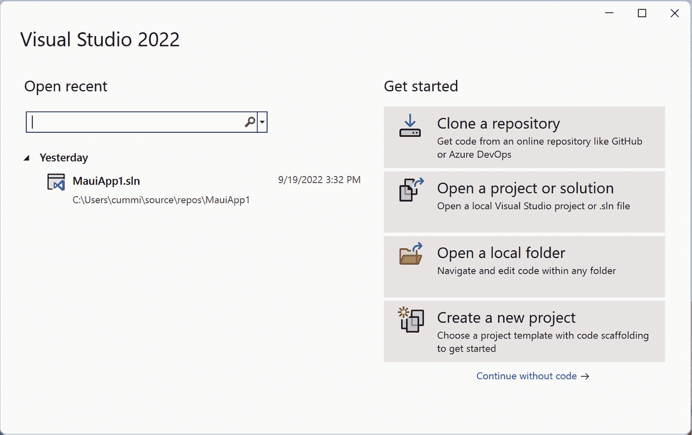
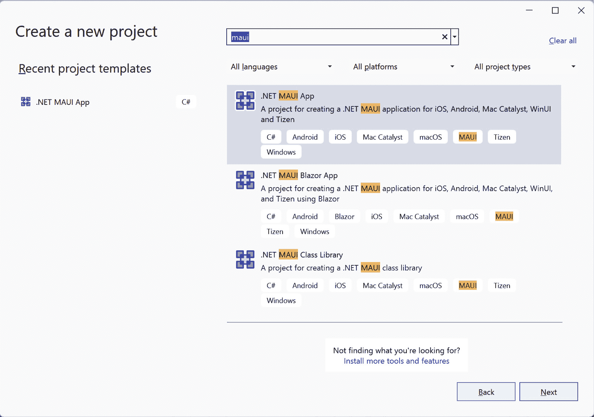
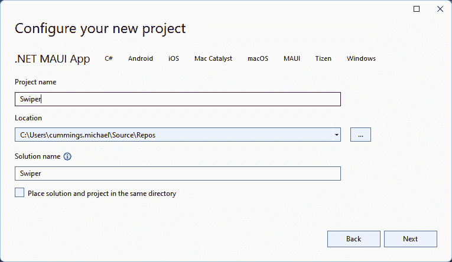
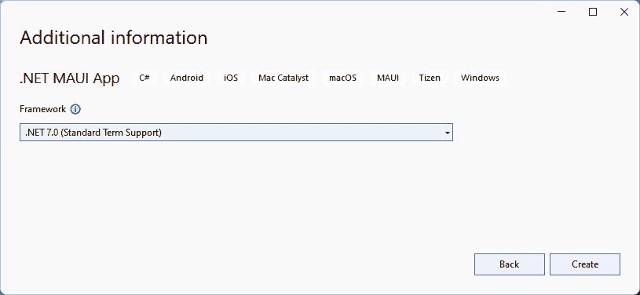
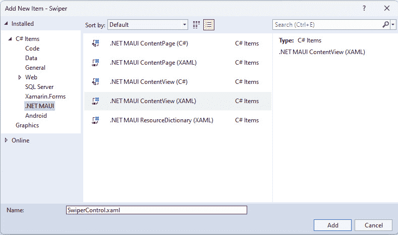
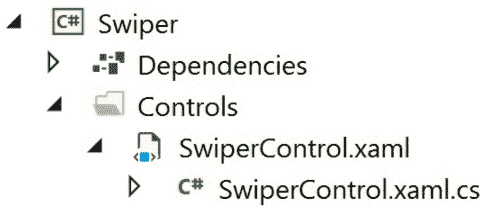

# 使用动画的丰富 UX 的匹配应用

在本章中，我们将创建匹配应用的基线功能。然而，由于隐私问题，我们不会对人员进行评分。相反，我们将从互联网上的随机来源下载图片。这个项目是为那些想要了解如何编写可重用控件的人准备的。我们还将探讨如何使用动画使我们的应用程序更易于使用。这个应用将不会是一个**模型-视图-视图模型**（**MVVM**）应用程序，因为我们想将控件创建和使用与 MVVM 的轻微开销隔离开来。

本章将涵盖以下主题：

+   创建自定义控件

+   将应用程序样式设计成照片样式，并在其下方添加描述性文本

+   使用 .NET MAUI 创建动画

+   订阅自定义事件

+   重复使用自定义控件

+   处理平移手势

# 技术要求

为了能够完成本章的项目，您需要安装 Visual Studio for Mac 或 Windows，以及必要的 .NET MAUI 工作负载。有关如何设置环境的更多详细信息，请参阅 *第一章*，* .NET MAUI 简介*。

您可以在[`github.com/PackPublishing/MAUI-Projects-3rd-Edition`](https://github.com/PackPublishing/MAUI-Projects-3rd-Edition)找到本章代码的完整源代码。

# 项目概述

许多人都曾面临过这样的困境：是滑动左键还是右键。突然间，你可能开始 wonder：*这是怎么工作的？滑动魔法是如何发生的？* 好吧，在这个项目中，我们将学习所有关于它的知识。我们将从定义一个`MainPage`文件开始，我们的应用程序图像将驻留在其中。之后，我们将实现图像控制，并逐渐添加**图形用户界面**（**GUI**）和功能，直到我们打造出完美的滑动体验。

该项目的构建时间大约为 90 分钟。

# 创建匹配应用

在这个项目中，我们将学习更多关于创建可重用控件的知识，这些控件可以添加到**可扩展应用程序标记语言**（**XAML**）页面中。为了保持简单，我们不会使用 MVVM，而是使用不带任何数据绑定的裸机 .NET MAUI。我们的目标是创建一个允许用户左右滑动图片的应用程序，就像大多数流行的匹配应用一样。

好吧，让我们从创建项目开始吧！

## 设置项目

这个项目，就像所有其他项目一样，是一个**文件** | **新建** | **项目...**风格的程序。这意味着我们不会导入任何代码。因此，这个第一部分完全是关于创建项目和设置基本项目结构。

让我们开始吧！

### 创建新项目

那么，让我们开始吧。

第一步是创建一个新的 .NET MAUI 项目：

1.  打开 Visual Studio 2022 并选择**创建一个** **新项目**：



图 5.1 – Visual Studio 2022

这将打开 **创建新项目** 向导。

1.  在搜索框中，键入 `maui` 并从列表中选择 **.NET MAUI 应用** 项：



图 5.2 – 创建一个新项目

1.  点击 **下一步**。

1.  通过命名您的项目来完成向导的下一步。在这种情况下，我们将我们的应用程序命名为 `Swiper`。通过点击 **创建**，如图所示，继续到下一个对话框：



图 5.3 – 配置您的全新项目

1.  点击 **下一步**。

1.  最后一步将提示您选择要支持的 .NET Core 版本。在撰写本文时，.NET 6 可用为 **长期支持**（**LTS**），.NET 7 可用为 **标准期限支持**。对于这本书，我们假设您将使用 .NET 7：



图 5.4 – 补充信息

1.  通过点击 **创建** 并等待 Visual Studio 创建项目来完成设置。

就这样，应用程序已经创建。让我们先设计 `MainPage` 文件。

### 设计 MainPage 文件

已创建一个名为 `Swiper` 的新 .NET MAUI Shell 应用程序，包含一个名为 `MainPage.xaml` 的单页。这位于项目的根目录中。我们需要将默认的 XAML 模板替换为包含我们的 `Swiper` 控件的新布局。

让我们通过替换默认内容来编辑已存在的 `MainPage.xaml` 文件：

1.  打开 `MainPage.xaml` 文件。

1.  将页面内容替换为以下突出显示的 XAML 代码：

    ```cs
    <?xml version="1.0" encoding="utf-8"?>
    <ContentPage
      xmlns=http://schemas.microsoft.com/dotnet/2021/maui

      x:Class="Swiper.MainPage">
      <Grid Padding="0,40" x:Name="MainGrid">
        <Grid.RowDefinitions>
          <RowDefinition Height="400" />
          <RowDefinition Height="*" />
        </Grid.RowDefinitions>
        <Grid Grid.Row="1" Padding="30">
            <!-- Placeholder for later -->
        </Grid>
      </Grid>
    </ContentPage>
    ```

`ContentPage` 节点内的 XAML 代码定义了应用程序中的两个网格。网格简单地是一个其他控件的容器。它根据行和列定位这些控件。在这种情况下，外部网格定义了两个将覆盖整个屏幕可用区域的行。第一行高 400 个单位，第二行，使用 `Height="*"`，使用剩余的可用空间。

定义在第一个网格内的内部网格，通过 `Grid.Row="1"` 属性分配给第二行。行和列索引是从零开始的，所以 `"1"` 实际上指的是第二行。我们将在本章的后面添加一些内容到这个网格中，但现在我们先让它保持为空。

两个网格都定义了它们的填充。您可以输入一个数字，这意味着所有边都将有相同的填充，或者 – 如此案例中 – 输入两个数字。我们输入了 `0,40`，这意味着左侧和右侧应该有 `0` 个单位的填充，顶部和底部应该有 `40` 个单位的填充。还有一个第三个选项，使用四个数字，它设置了 *左侧*、*顶部*、*右侧* 和 *底部* 的填充，按照特定的顺序。

最后要注意的是，我们给外层网格起了一个名字，`x:Name="MainGrid"`。这将使得它可以直接从 `MainPage.xaml.cs` 文件中定义的后台代码中访问。由于在这个例子中我们没有使用 MVVM，我们需要一种方法来访问网格而不使用数据绑定。

## 创建 Swiper 控件

这个项目的核心部分是创建 `Swiper` 控件。在一般意义上，控件是一个自包含的 `ContentView`，与 `ContentPage` 相对，后者是 XAML 页面。它可以作为一个元素添加到任何 XAML 页面中，或者在代码的后台文件中。在这个项目中，我们将从代码中添加控件。

### 创建控件

创建 `Swiper` 控件是一个简单的过程。我们只需要确保我们选择了正确的项目模板，即 **内容视图**，通过以下操作：

1.  在 `Swiper` 项目中，创建一个名为 `Controls` 的文件夹。

1.  右键单击 `Controls` 文件夹，选择 **添加**，然后点击 **新建项...**。

1.  在 **添加新项** 对话框的左侧面板中选择 **C# 项**，然后选择 **.NET MAUI**。

1.  选择 **.NET MAUI 内容视图 (XAML)** 项。确保您不要选择 **.NET MAUI 内容视图 (C#)** 选项；这只会创建一个 C# 文件，而不是 XAML 文件。

1.  将控件命名为 `SwiperControl.xaml`。

1.  点击 **添加**。

    参考以下截图查看上述信息：



图 5.5 – 添加新项

这添加了一个用于 UI 的 XAML 文件和一个 C# 后台代码文件。它应该看起来如下：



图 5.6 – 解决方案布局

### 定义主网格

让我们设置 `Swiper` 控件的基本结构：

1.  打开 `SwiperControl.xaml` 文件。

1.  将以下代码块中的内容替换为高亮的代码：

    ```cs
    <?xml version="1.0" encoding="UTF-8"?>
    <ContentView 

                 x:Class="Swiper.Controls.SwiperControl">
    <ContentView.Content>
      <Grid>
        <Grid.ColumnDefinitions>
          <ColumnDefinition Width="100" />
          <ColumnDefinition Width="*" />
          <ColumnDefinition Width="100" />
        </Grid.ColumnDefinitions>
        <!-- ContentView for photo here -->
        <!-- StackLayout for like here -->
        <!-- StackLayout for deny here -->
      </Grid>
    </ContentView.Content>
    </ContentView>
    ```

这定义了一个有三个列的网格。最左边的和最右边的列将占用 100 个单位的空间，中间将占用剩余的可供空间。两侧的空间将是添加标签以突出用户所做选择的地方。我们还添加了三个注释，作为即将到来的 XAML 代码的占位符。

我们将继续添加额外的 XAML 来创建照片布局。

### 添加照片内容视图

现在，我们将通过添加定义照片外观的定义来扩展 `SwiperControl.xaml` 文件。我们的最终结果将看起来像 *图 5.7*。由于我们将从互联网上拉取图片，我们将显示一个加载文本，以确保用户能够得到关于正在发生什么的反馈。为了使其看起来像即时打印的照片，我们在照片下方添加了一些手写的文本，如下面的图所示：


图 5.7 – 照片 UI 设计

前面的图显示了我们希望照片看起来像什么。为了使这成为现实，我们需要通过以下方式向`SwiperControl`文件添加一些 XAML 代码：

1.  打开`SwiperControl.xaml`。

1.  在`<!-- ContentView for photo here -->`注释之后添加高亮的 XAML 代码。确保不要替换页面的整个`ContentView`控件；只需在注释下添加此代码，如以下代码块所示。页面的其余部分应保持不变：

    ```cs
    <!-- ContentView for photo here -->
      <ContentView x:Name="photo" Padding="40" Grid.ColumnSpan="3" >
        <Grid x:Name="photoGrid" BackgroundColor="Black" Padding="1" >
          <Grid.RowDefinitions>
            <RowDefinition Height="*" />
            <RowDefinition Height="40" />
          </Grid.RowDefinitions>
          <BoxView Grid.RowSpan="2" BackgroundColor="White" />
          <Image x:Name="image" Margin="10" BackgroundColor="#AAAAAA" Aspect="AspectFill" />
          <Label x:Name="loadingLabel" Text="Loading..." TextColor="White" FontSize="Large" FontAttributes="Bold" HorizontalOptions="Center" VerticalOptions="Center" />
          <Label Grid.Row="1" x:Name="descriptionLabel" Margin="10,0" Text="A picture of grandpa" FontFamily="Bradley Hand" />
        </Grid>
      </ContentView>
    ```

`ContentView`控件定义了一个新的区域，我们可以在这里添加其他控件。`ContentView`控件的一个非常重要的特性是它只接受一个子控件。大多数时候，我们会添加一个可用的布局控件。在这种情况下，我们将使用`Grid`控件来布局控件，如前述代码所示。

网格定义了两行：

+   为照片本身添加一行，当其他行已经分配空间时，它将占据所有可用空间

+   为评论添加一行，其高度正好为 40 个单位

`Grid`控件本身设置为使用黑色背景和 1 的填充。这与一个白色背景的`BoxView`控件结合使用，创建了我们在控件周围看到的框架。`BoxView`控件也被设置为跨越网格的两行（`Grid.RowSpan="2"`），占据网格的整个区域，减去填充。

接下来是`Image`控件。它设置了一个背景颜色为漂亮的灰色调（`#AAAAAA`）和 40 的边距，这将使其与周围的框架稍微隔开。它还有一个硬编码的名称（`x:Name="image"`），这将允许我们从代码后端与之交互。最后一个属性，称为`Aspect`，决定了如果图像控件与源图像的比例不同时我们应该做什么。在这种情况下，我们希望填充整个图像区域，但不显示任何空白区域。这实际上在高度或宽度上裁剪了图像。

我们通过添加两个标签来完成，这些标签也有硬编码的名称供以后参考。

现在 XAML 的部分就到这里了；让我们继续为这张照片创建一个描述。

### 创建`DescriptionGenerator`类

在图片底部，我们可以看到一个描述。由于我们来自即将到来的图片源没有任何通用的图片描述，我们需要创建一个生成描述的生成器。这里有一个简单而有趣的方法来做这件事：

1.  在`Swiper`项目中创建一个名为`Utils`的文件夹。

1.  在那个文件夹中创建一个名为`DescriptionGenerator`的新类。

1.  向这个类添加以下代码：

    ```cs
    internal class DescriptionGenerator
    {
      private string[] _adjectives = { "nice", "horrible", "great", "terribly old", "brand new" };
      private string[] _other = { "picture of grandpa", "car", "photo of a forest", "duck" };
      private static Random random = new();
      public string Generate()
      {
        var a = _adjectives[random.Next(_adjectives.Count())];
        var b = _other[random.Next(_other.Count())];
        return $"A {a} {b}";
      }
    }
    ```

这个类只有一个目的：它从`_adjectives`数组中随机取一个词，并将其与`_other`数组中的一个随机词组合。通过调用`Generate()`方法，我们得到一个全新的组合。您可以在数组中自由添加自己的词。请注意，`Random`实例是一个静态字段。这是因为如果我们创建时间上过于接近的新实例的`Random`类，它们会被相同的值初始化，并返回相同的随机数序列。

现在我们可以为照片创建一个有趣的描述，我们需要一种方法来捕获照片和描述。

### 创建一个`Picture`类

为了抽象出我们想要显示的图片的所有信息，我们将创建一个封装这些信息的类。在我们的`Picture`类中信息不多，但这是一个好的编码实践。按照以下步骤进行：

1.  在`Utils`文件夹中创建一个新的类，名为`Picture`。

1.  将以下代码添加到类中：

    ```cs
    public class Picture
    {
      public Uri Uri { get; init; }
      public string Description { get; init; }
      public Picture()
      {
        Uri = new Uri($"https://picsum.photos/400/400/?random&ts={DateTime.Now.Ticks}");
         var generator = new DescriptionGenerator();
         Description = generator.Generate();
      }
    }
    ```

`Picture`类有以下两个公共属性：

+   `Uri`属性，指向其在互联网上的位置

+   该图片的描述，作为`Description`属性公开

在构造函数中，我们创建一个新的 URI，它指向一个公共测试照片源，我们可以使用。宽度和高度在 URI 的查询字符串部分指定。我们还附加了一个随机时间戳，以避免.NET MAUI 缓存图片。这为我们每次请求图片时生成一个唯一的 URI。

我们随后使用之前创建的`DescriptionGenerator`类为图片生成一个随机描述。

注意，属性并不定义一个`set`方法，而是使用`init`。由于我们创建对象后永远不需要更改`URL`或`Description`的值，这些属性可以是只读的。`init`只允许在构造函数完成之前设置值。如果您在构造函数运行之后尝试设置值，编译器将生成一个错误。

现在我们已经拥有了开始显示图片所需的所有组件，让我们开始把它们整合起来。

### 将图片绑定到控件上

让我们开始连接`Swiper`控件，以便它开始显示图片。我们需要设置图片的来源，然后根据图片的状态控制加载标签的可见性。由于我们使用的是从互联网上获取的图片，可能需要几秒钟的时间来下载。一个好的用户界面将提供适当的反馈，帮助用户避免对正在发生的事情产生困惑。

我们将首先设置图片的源。

#### 设置源

`Image`控件（在代码中称为`image`）有一个`source`属性。这个属性是`ImageSource`抽象类型。您可以使用几种不同类型的图像源。我们感兴趣的是`UriImageSource`类型，它接受一个 URI，下载图片，并允许图像控件显示它。

让我们扩展 `Swiper` 控件，以便我们可以设置源和描述：

1.  打开 `Controls/Swiper.Xaml.cs` 文件（`Swiper` 控件的代码隐藏文件）。

1.  为 `Swiper.Utils` 添加一个 `using` 语句（`using Swiper.Utils;`），因为我们将会使用该命名空间中的 `Picture` 类。

1.  将以下突出显示的代码添加到构造函数中：

    ```cs
    public SwiperControl()
    {
      InitializeComponent();
      var picture = new Picture();
      descriptionLabel.Text = picture.Description;
      image.Source = new UriImageSource() { Uri = picture.Uri };
    }
    ```

在这里，我们创建了一个 `Picture` 类的新实例，并通过设置该控制器的文本属性将描述分配给 GUI 中的 `descriptionLabel` 控制器。然后，我们将图像的源设置为 `UriImageSource` 类的新实例，并将 `picture` 实例的 URI 分配给它。这将导致图像从互联网上下载，并在下载完成后立即显示。

接下来，我们将更改加载标签的可见性以提供积极的用户反馈。

#### 控制加载标签

当图像正在下载时，我们想在图像上方显示一个居中的加载文本。这已经在之前创建的 XAML 文件中，所以我们需要做的是在图像下载后隐藏它。我们将通过控制 `loadingLabel` 控件的 `IsVisibleProperty` 属性（是的，属性实际上命名为 `IsVisibleProperty`）来实现这一点，通过将绑定设置到图像的 `IsLoading` 属性。每当图像上的 `IsLoading` 属性发生变化时，绑定就会更改标签上的 `IsVisible` 属性。这是一个很好的“点火并忘记”的方法。

你可能已经注意到，当我们说我们不会使用绑定时，我们使用了绑定。这被用作一个快捷方式，以避免我们不得不编写与这个绑定本质上相同功能的代码。而且公平地说，虽然我们说过不要使用 MVVM 和数据绑定，但我们是在绑定到自身，而不是在类之间绑定，所以所有代码都包含在 `Swiper` 控件内部。

让我们添加控制 `loadingLabel` 控件的代码，如下所示：

1.  打开 `Swiper.xaml.cs` 代码隐藏文件。

1.  将以下加粗的代码添加到构造函数中：

    ```cs
    public SwiperControl()
    {
      InitializeComponent();
      var picture = new Picture();
      descriptionLabel.Text = picture.Description;
      image.Source = new UriImageSource() { Uri = picture.Uri };
      loadingLabel.SetBinding(IsVisibleProperty, "IsLoading");
      loadingLabel.BindingContext = image;
    }
    ```

在前面的代码中，`loadingLabel` 控制器将一个绑定设置到 `IsVisibleProperty` 属性，该属性属于所有控件继承的 `VisualElement` 类。它告诉 `loadingLabel` 监听绑定上下文中任何对象的 `IsLoading` 属性的变化。在这种情况下，这是图像控件。

接下来，我们将允许用户“向右滑动”或“向左滑动”。

### 处理滑动手势

本应用的核心功能是滑动手势。滑动手势是指用户按下控件并在屏幕上移动它。我们还将向 `Swiper` 控件添加随机旋转，以便在添加多个图像时使其看起来像一堆照片。

我们将首先向 `SwiperControl` 类添加一些字段，如下所示：

1.  打开 `SwiperControl.xaml.cs` 文件。

1.  在代码中将以下字段添加到类中：

    ```cs
    private readonly double _initialRotation;
    private static readonly Random _random = new Random();
    ```

第一个字段`_initialRotation`存储图像的初始旋转。我们将在构造函数中设置这个值。第二个字段是一个包含`Random`对象的`static`字段。你可能记得，最好创建一个静态的随机对象，以确保不会创建具有相同种子的多个随机对象。种子基于时间，所以如果我们创建的对象在时间上太接近，它们将生成相同的随机序列，这根本不是随机的。

接下来，我们必须创建一个事件处理程序来处理`PanUpdated`事件，我们将在本节末尾将其绑定，如下所示：

1.  打开`SwiperControl.xaml.cs`代码隐藏文件。

1.  将`OnPanUpdated`方法添加到类中，如下所示：

    ```cs
    private void OnPanUpdated(object sender, PanUpdatedEventArgs e)
    {
      switch (e.StatusType)
      {
        case GestureStatus.Started: PanStarted();
        break;
        case GestureStatus.Running: PanRunning(e);
        break;
        case GestureStatus.Completed: PanCompleted();
        break;
      }
    }
    ```

这段代码很简单。我们处理一个以`PanUpdatedEventArgs`对象作为第二个参数的事件。这是处理事件的标准方法。然后我们有一个`switch`子句来检查事件引用的是哪种状态。

平移手势可以有以下三种状态：

+   `GestureStatus.Started`：当平移开始时，事件以这种状态触发一次

+   `GestureStatus.Running`：事件被多次触发，每次你移动手指时触发一次

+   `GestureStatus.Completed`：当你放手时，事件最后一次被触发

对于这些状态中的每一个，我们调用特定的方法来处理不同的状态。我们现在将继续添加这些方法：

1.  打开`SwiperControl.xaml.cs`代码隐藏文件。

1.  将以下三个方法添加到类中，如下所示：

    ```cs
    private void PanStarted()
    {
      photo.ScaleTo(1.1, 100);
    }
    private void PanRunning(PanUpdatedEventArgs e)
    {
      photo.TranslationX = e.TotalX;
      photo.TranslationY = e.TotalY;
      photo.Rotation = _initialRotation + (photo.TranslationX / 25);
    }
    private void PanCompleted()
    {
      photo.TranslateTo(0, 0, 250, Easing.SpringOut);
      photo.RotateTo(_initialRotation, 250, Easing.SpringOut);
      photo.ScaleTo(1, 250);
    }
    ```

让我们先看看`PanStarted()`。当用户开始拖动图像时，我们希望添加一点效果，使其稍微高出表面。这是通过将图像按 10%的比例缩放来实现的。.NET MAUI 有一套出色的函数来完成这个任务。在这种情况下，我们在图像控件（命名为`Photo`）上调用`ScaleTo()`方法，并告诉它缩放到`1.1`，这对应于其原始大小的 10%。我们还告诉它在`100`毫秒（**ms**）内完成这个动作。这个调用也是可等待的，这意味着我们可以在执行下一个调用之前等待控件完成动画。在这种情况下，我们将使用一种触发即忘掉的方法。

接下来是`PanRunning()`，它在平移操作期间多次被调用。这个方法从调用`PanRunning()`的事件处理程序中接收一个名为`PanUpdatedEventArgs`的参数。我们也可以只传递*X*和*Y*值作为参数来减少代码的耦合。这是一件你可以实验的事情。该方法从事件的`TotalX`/`TotalY`属性中提取*X*和*Y*分量，并将它们分配给图像控件的`TranslationX`/`TranslationY`属性。我们还根据图像移动的距离稍微调整了旋转。

我们最后需要做的是在图像释放时将其恢复到初始状态。这可以在 `PanCompleted()` 中完成。首先，我们将图像（或移动）在 250 毫秒内翻译（或移动）回其原始局部坐标（`0,0`）。我们还添加了一个缓动函数，使其略微超出目标，然后动画回弹。我们可以尝试不同的预定义缓动函数；这些对于创建漂亮的动画很有用。我们同样将图像移动回其初始旋转。最后，我们在 250 毫秒内将其缩放回原始大小。

现在，是时候在构造函数中添加代码，以连接平移手势并设置一些初始旋转值。按照以下步骤进行：

1.  打开 `SwiperControl.xaml.cs` 代码隐藏文件。

1.  将以下加粗代码添加到构造函数中。注意构造函数中还有更多代码，所以不要覆盖整个方法；只需添加以下代码块中显示的加粗文本：

    ```cs
    public SwiperControl()
    {
      InitializeComponent();
      var panGesture = new PanGestureRecognizer();
      panGesture.PanUpdated += OnPanUpdated;
      this.GestureRecognizers.Add(panGesture);
      _initialRotation = _random.Next(-10, 10);
      photo.RotateTo(_initialRotation, 100, Easing.SinOut);
      var picture = new Picture();
      descriptionLabel.Text = picture.Description;
      image.Source = new UriImageSource() { Uri = picture.Uri };
      loadingLabel.SetBinding(IsVisibleProperty, "IsLoading");
      loadingLabel.BindingContext = image;
    }
    ```

所有 .NET MAUI 控件都有一个名为 `GestureRecognizers` 的属性。有不同类型的手势识别器，例如 `TapGestureRecognizer` 或 `SwipeGestureRecognizer`。在我们的情况下，我们感兴趣的是 `PanGestureRecognizer` 类型。我们创建一个新的 `PanGestureRecognizer` 实例，并通过将其连接到我们之前创建的 `OnPanUpdated()` 方法来订阅 `PanUpdated` 事件。然后，我们将它添加到 `Swiper` 控件的 `GestureRecognizers` 集合中。

然后，我们设置图像的初始旋转，并确保我们存储当前的旋转值，以便我们可以修改旋转，然后将其旋转回原始状态。

接下来，我们将临时连接控件，以便我们可以对其进行测试。

## 测试控件

我们现在已经编写了所有代码，可以对这个控件进行测试运行。按照以下步骤进行：

1.  打开 `MainPage.xaml.cs`。

1.  为 `Swiper.Controls` 添加一个 `using` 语句（`using Swiper.Controls;`）。

1.  将以下加粗代码添加到构造函数中：

    ```cs
    public MainPage()
    {
      InitializeComponent();
      MainGrid.Children.Add(new SwiperControl());
    }
    ```

如果构建一切顺利，我们最终应该得到如图所示的照片：


图 5.8 – 测试应用

我们还可以拖动照片（平移它）。注意当你开始拖动时会有轻微的抬起效果，以及根据平移量（即总移动量）的照片旋转。如果你放手，照片会动画回到原位。

现在我们有了显示照片并可以左右滑动它的控件，我们需要对那些滑动做出反应。

### 创建决策区域

一个配对应用如果没有屏幕两侧的特殊拖放区域，那就什么都不是。我们在这里想做一些事情：

+   当用户将图像拖动到任一侧时，应显示 `LIKE` 或 `DENY`（决策区域）的文本

+   当用户将图片拖放到决策区域时，应用应从页面上移除该图片

我们将通过在`SwiperControl.xaml`文件中添加一些 XAML 代码来创建这些区域，然后添加必要的代码来实现这一功能。值得注意的是，这些区域不是放置图像的热点，而是用于在控制表面上方显示标签。实际的放置区域是根据你拖动图像的距离来计算和确定的。

第一步是添加左右滑动动作的 UI。

### 扩展网格

`Swiper`控制有三个列（左侧、右侧和中间）定义。我们希望在图像被拖动到页面任一侧时，向用户添加某种视觉反馈。我们将通过添加一个带有每侧`Label`控制的`StackLayout`控制来实现这一点。

我们将首先添加右侧。

#### 添加用于喜欢照片的 StackLayout

我们需要做的第一件事是在控制的右侧添加用于喜欢照片的`StackLayout`控制：

1.  打开`Controls/SwiperControl.xaml`。

1.  在`<!-- StackLayout for like here -->`注释下添加以下代码：

    ```cs
    <StackLayout Grid.Column="2" x:Name="likeStackLayout" Opacity="0" Padding="0, 100">
      <Label Text="LIKE" TextColor="Lime" FontSize="30" Rotation="30" FontAttributes="Bold" />
    </StackLayout>
    ```

`StackLayout`控制是我们想要显示的子元素的容器。它有一个名称，并分配为在第三列渲染（由于零索引，代码中显示为`Grid.Column="2"`）。`Opacity`属性设置为`0`，使其完全不可见，并且调整了`Padding`属性，使其从顶部向下移动一点。

在`StackLayout`控制内部，我们将添加`Label`控制。

现在我们有了右侧，让我们添加左侧。

#### 添加用于拒绝照片的 StackLayout

下一步是添加在控制的左侧用于拒绝照片的`StackLayout`控制：

1.  打开`Controls/SwiperControl.xaml`。

1.  在`<!-- StackLayout for deny here -->`注释下添加以下代码：

    ```cs
    <StackLayout x:Name="denyStackLayout" Opacity="0" Padding="0, 100" HorizontalOptions="Start">
      <Label Text="DENY" TextColor="Red" FontSize="30" Rotation="-20" FontAttributes="Bold" />
    </StackLayout>
    ```

左侧`StackLayout`的设置与右侧相同，只是它应该位于第一列，这是默认设置，因此不需要添加`Grid.Column`属性。我们还将`HorizontalOptions="End"`指定为`HorizontalOptions`，这意味着内容应该右对齐。

UI 设置完成后，我们现在可以着手实现逻辑，通过调整`LIKE`或`DENIED`文本控制的透明度，在照片平移时为用户提供视觉反馈。

### 确定屏幕大小

为了能够计算用户拖动图像的距离百分比，我们需要知道控件的大小。这直到.NET MAUI 布局控件后才确定。

我们将重写`OnSizeAllocated()`方法并在类中添加一个`_screenWidth`字段来跟踪窗口的当前宽度：

1.  打开`SwiperControl.xaml.cs`。

1.  将以下代码添加到文件中，将字段放在类的开头，并在构造函数下方添加`OnSizeAllocated()`方法：

    ```cs
    private double _screenWidth = -1;
    protected override void OnSizeAllocated(double width, double height)
    {
      base.OnSizeAllocated(width, height);
      if (Application.Current.MainPage == null)
      {
        return;
      }
      _screenWidth = Application.Current.MainPage.Width;
    }
    ```

`_screenWidth` 字段用于在解决后立即存储宽度。我们通过重写 .NET MAUI 调用的 `OnSizeAllocated()` 方法来实现这一点，当控制的大小被分配时调用。这会被多次调用。第一次调用实际上是在宽度和高度设置之前，以及当前应用程序的 `MainPage` 属性设置之前。此时，宽度和高度被设置为 `-1`，`Application.Current.MainPage` 属性为 `null`。我们通过检查 `Application.Current.MainPage` 是否为 `null` 来寻找此状态，如果是 `null`，则返回。我们也可以检查宽度上的 `-1` 值。两种方法都可行。然而，如果它具有值，我们希望将其存储在我们的 `_screenWidth` 字段中供以后使用。

.NET MAUI 会在应用框架发生变化时调用 `OnSizeAllocated()` 方法。这对于 **WinUI** 应用程序尤其相关，因为它们位于用户可以轻松更改的窗口中。Android 和 iOS 应用程序不太可能再次收到此方法的调用，因为应用程序将占据整个屏幕的空间。

### 添加代码以计算状态

为了计算图像的状态，我们需要定义我们的区域，然后创建一个函数，该函数接受当前的移动量，并根据我们平移图像的距离更新 GUI 决策区域的不透明度。

#### 定义计算状态的函数

让我们按照以下几个步骤添加 `CalculatePanState()` 方法来计算平移图像的距离，并确定是否应该开始影响 GUI：

1.  打开 `Controls/SwiperControl.xaml.cs`。

1.  在类中任何位置添加顶部属性和 `CalculatePanState()` 方法，如下面的代码块所示：

    ```cs
    private const double DeadZone = 0.4d;
    private const double DecisionThreshold = 0.4d;
    private void CalculatePanState(double panX)
    {
      var halfScreenWidth = _screenWidth / 2;
      var deadZoneEnd = DeadZone * halfScreenWidth;
      if (Math.Abs(panX) < deadZoneEnd)
      {
        return;
      }
      var passedDeadzone = panX < 0 ? panX + deadZoneEnd : panX - deadZoneEnd;
      var decisionZoneEnd = DecisionThreshold * halfScreenWidth;
      var opacity = passedDeadzone / decisionZoneEnd;
      opacity = double.Clamp(opacity, -1, 1);
      likeStackLayout.Opacity = opacity;
      denyStackLayout.Opacity = -opacity;
    }
    ```

我们将以下两个值定义为常量：

+   `DeadZone` 定义了在平移图像时，中心点两侧的 40% (`0.4`) 可用空间为死区。如果我们在这个区域内释放图像，它将简单地返回到屏幕中心，不执行任何操作。

+   下一个常量是 `DecisionThreshold`，它定义了另外 40% (`0.4`) 的可用空间。这用于在布局两侧插值 `StackLayout` 的不透明度。

然后，每当平移发生变化时，我们使用这些值来检查平移动作的状态。如果 *X* 的绝对平移值 (`panX`) 小于死区，则不执行任何操作并返回。如果不满足条件，我们计算超过死区的距离以及进入决策区的距离。我们根据这个插值计算不透明度值，并将值限制在 `-1` 和 `1` 之间。

最后，我们将不透明度设置为 `likeStackLayout` 和 `denyStackLayout` 的此值。

#### 连接平移状态检查

当图像正在平移时，我们想要更新状态，如下所示：

1.  打开 `Controls/SwiperControl.xaml.cs`。

1.  在 `PanRunning()` 方法中添加以下加粗代码：

    ```cs
    private void PanRunning(PanUpdatedEventArgs e)
    {
      photo.TranslationX = e.TotalX; photo.TranslationY = e.TotalY;
      photo.Rotation = _initialRotation + (photo.TranslationX / 25);
      CalculatePanState(e.TotalX);
    }
    ```

这个 `PanRunning()` 方法的添加将总移动量传递到 `CalculatePanState()` 方法，以确定是否需要调整控件右侧或左侧的 `StackLayout` 的不透明度。

### 添加退出逻辑

到目前为止，一切顺利，除了如果我们拖动图片到边缘并释放，文本会保留下来。我们需要确定用户何时停止拖动图片，以及，如果是这样，图片是否在决策区域。

让我们添加将照片动画回原始位置的代码。

#### 检查图片是否应该退出

我们需要一个简单的函数来判断图片是否已经平移足够远，可以算作图片的退出。要创建这样的函数，请按照以下步骤操作：

1.  打开 `Controls/SwiperControl.xaml.cs` 文件。

1.  将 `CheckForExitCriteria()` 方法添加到类中，如下代码片段所示：

    ```cs
    private bool CheckForExitCriteria()
    {
      var halfScreenWidth = _screenWidth / 2;
      var decisionBreakpoint = DeadZone * halfScreenWidth;
      return (Math.Abs(photo.TranslationX) > decisionBreakpoint);
    }
    ```

这个函数计算我们是否已经越过了死区并进入了决策区。我们需要使用 `Math.Abs()` 方法来获取总绝对值以进行比较。我们也可以使用 `<` 和 `>` 操作符，但我们使用这种方法因为它更易读。这是一个关于代码风格和品味的问题——请随意按照您的方式来做。

#### 移除图片

如果我们确定图片已经平移足够远，可以算作退出，我们希望将其动画移出屏幕，然后从页面上移除图片。为此，请按照以下步骤操作：

1.  打开 `Controls/SwiperControl.xaml.cs` 文件。

1.  将 `Exit()` 方法添加到类中，如下代码块所示：

    ```cs
    private void Exit()
    {
      MainThread.BeginInvokeOnMainThread(async () =>
      {
        var direction = photo.TranslationX < 0 ? -1 : 1;
        await photo.TranslateTo(photo.TranslationX + (_screenWidth * direction), photo.TranslationY, 200, Easing.CubicIn);
        var parent = Parent as Layout;
        parent?.Children.Remove(this);
      });
    }
    ```

让我们分解前面的代码块，了解 `Exit()` 方法的作用：

1.  我们首先确保这个调用是在 UI 线程上完成的，这也被称为 `MainThread` 线程。这是因为只有 UI 线程可以进行动画。

1.  我们还需要异步运行这个线程，这样我们就可以一石二鸟。因为这个方法完全是关于将图片动画到屏幕的任一侧，我们需要确定动画的方向。我们通过确定图片的总平移量是正数还是负数来实现这一点。

1.  然后，我们使用这个值通过 `photo.TranslateTo()` 调用等待平移。

1.  我们使用 `await` 来等待这个调用，因为我们不希望代码执行继续直到它完成。一旦完成，我们就从父控件的子控件集合中移除该控件，使其永远消失。

#### 更新 PanCompleted

关于图片是否应该消失或简单地返回到原始状态的决定是在 `PanCompleted()` 方法中触发的。在这里，我们将连接我们之前两个部分中创建的两个方法。请按照以下步骤操作：

1.  打开 `Controls/SwiperControl.xaml.cs` 文件。

1.  将以下代码以粗体形式添加到 `PanCompleted()` 方法中：

    ```cs
    private void PanCompleted()
    {
      if (CheckForExitCriteria())
      {
        Exit();
      }
      likeStackLayout.Opacity = 0;
      denyStackLayout.Opacity = 0;
      photo.TranslateTo(0, 0, 250, Easing.SpringOut);
      photo.RotateTo(_initialRotation, 250, Easing.SpringOut);
      photo.ScaleTo(1, 250);
    }
    ```

本节的最后一步是使用`CheckForExitCriteria()`方法，如果满足这些条件，则使用`Exit()`方法。如果未满足退出条件，我们需要重置状态和`StackLayout`的不透明度，使一切恢复正常。

现在我们可以左右滑动，让我们添加一些事件，当用户滑动时触发。

### 添加到控制器的事件

在控制器本身中，我们剩下要做的最后一件事是添加一些事件，以指示图片是否已被*喜欢*或*拒绝*。我们将使用一个干净的界面，允许简单使用控件，同时隐藏所有实现细节。

#### 声明两个事件

为了使控制器更容易从应用程序本身进行交互，我们需要添加`Like`和`Deny`事件，如下所示：

1.  打开`Controls/SwiperControl.xaml.cs`。

1.  在类开始处添加两个事件声明，如下代码片段所示：

    ```cs
    public event EventHandler OnLike;
    public event EventHandler OnDeny;
    ```

这两个是标准的事件声明，带有开箱即用的事件处理器。

#### 触发事件

我们需要在`Exit()`方法中添加代码来触发我们之前创建的事件，如下所示：

1.  打开`Controls/SwiperControl.xaml.cs`。

1.  在`Exit()`方法中添加以下加粗代码：

    ```cs
    private void Exit()
    {
      MainThread.BeginInvokeOnMainThread(async () =>
      {
        var direction = photo.TranslationX < 0 ? -1 : 1;
        if (direction > 0)
        {
          OnLike?.Invoke(this, new EventArgs());
        }
        if (direction < 0)
        {
          OnDeny?.Invoke(this, new EventArgs());
        }
        await photo.TranslateTo(photo.TranslationX + (_screenWidth * direction), photo.TranslationY, 200, Easing.CubicIn);
        var parent = Parent as Layout;
        parent?.Children.Remove(this);
      });
    }
    ```

在这里，我们注入代码以检查我们是在喜欢还是拒绝图片。然后，根据这些信息触发正确的事件。

我们现在准备好最终化这个应用；`Swiper`控制器已完成，因此现在我们需要添加正确的初始化代码来完成它。

## 连接 Swiper 控制器

我们现在已经到达了本章的最后一部分。在本节中，我们将连接图片，并使我们的应用成为一个闭环应用，可以永久使用。当应用启动时，我们将添加 10 张图片，这些图片将从互联网上下载。每次移除一张图片，我们就会简单地添加另一张。

### 添加图片

让我们先创建一些代码，这些代码将添加图片到`MainView`类。首先，我们将添加初始图片；然后，我们将为每次图片被喜欢或拒绝时在堆栈底部添加新图片创建一个逻辑模型。

#### 添加初始图片

要使照片看起来像堆叠的，我们需要至少 10 张。按照以下步骤进行：

1.  打开`MainPage.xaml.cs`。

1.  将`AddInitalPhotos()`方法和`InsertPhotoMethod()`添加到类中，如下代码块所示：

    ```cs
    private void AddInitialPhotos()
    {
      for (int i = 0; i < 10; i++)
      {
        InsertPhoto();
      }
    }
    private void InsertPhoto()
    {
      var photo = new SwiperControl();
      this.MainGrid.Children.Insert(0, photo);
    }
    ```

首先，我们创建一个名为`AddInitialPhotos()`的方法，该方法将在启动时被调用。此方法简单地调用`InsertPhoto()`方法 10 次，并在每次调用时向`MainGrid`添加一个新的`SwiperControl`。它将控件插入堆栈的第一个位置，由于控件集合是从开始到结束渲染的，因此这实际上将控件放置在堆栈底部。

#### 在构造函数中发起调用

我们需要调用此方法以实现魔法效果，因此请按照以下步骤进行操作：

1.  打开`MainPage.xaml.cs`。

1.  在构造函数中添加以下加粗代码：

    ```cs
    public MainPage()
    {
      InitializeComponent();
      AddInitialPhotos();
    }
    ```

这里没有太多可说的。一旦`MainPage`对象被初始化，我们调用方法添加 10 张从互联网下载的随机照片。

### 添加计数标签

我们还想在应用程序中添加一些值。我们可以通过在`Swiper`控件集合下方添加两个标签来实现。每次用户对图像进行评分时，我们将增加两个计数器之一，并显示结果。

因此，让我们添加显示标签所需的 XAML 代码：

1.  打开`MainPage.xaml`。

1.  将`<!-- Placeholder for later -->`注释替换为以下加粗的代码：

    ```cs
    <Grid Grid.Row="1" Padding="30">
      <Grid.RowDefinitions>
        <RowDefinition Height="auto" />
        <RowDefinition Height="auto" />
        <RowDefinition Height="auto" />
        <RowDefinition Height="auto" />
      </Grid.RowDefinitions>
      <Label Text="LIKES" />
      <Label x:Name="likeLabel" Grid.Row="1" Text="0" FontSize="Large" FontAttributes="Bold" />
      <Label Grid.Row="2" Text="DENIED" />
      <Label x:Name="denyLabel" Grid.Row="3" Text="0" FontSize="Large" FontAttributes="Bold" />
    </Grid>
    ```

此代码添加了一个新的`Grid`控件，具有四个自动高度的行。这意味着我们计算每行内容的长度，并使用这个值进行布局。这与`StackLayout`相同，但我们想展示一种更好的实现方式。

我们在每一行添加一个`Label`控件，并将其中两个命名为`likeLabel`和`denyLabel`。这两个命名标签将包含有关有多少图像被点赞和有多少被拒绝的信息。

### 订阅事件

最后一步是连接`OnLike`和`OnDeny`事件，并将总计数显示给用户。

#### 添加方法以更新 GUI 和响应用件

我们需要一些代码来更新 GUI 并跟踪计数。按照以下步骤进行：

1.  打开`MainPage.xaml.cs`。

1.  将以下代码添加到类中：

    ```cs
    private int _likeCount;
    private int _denyCount;
    private void UpdateGui()
    {
      likeLabel.Text = _likeCount.ToString();
      denyLabel.Text = _denyCount.ToString();
    }
    private void Handle_OnLike(object sender, EventArgs e)
    {
      _likeCount++;
      InsertPhoto();
      UpdateGui();
    }
    private void Handle_OnDeny(object sender, EventArgs e)
    {
      _denyCount++;
      InsertPhoto();
      UpdateGui();
    }
    ```

上述代码块顶部的两个字段跟踪点赞和拒绝的数量。由于它们是值类型变量，它们的默认值是零。

为了使这些标签的变化显示在 UI 中，我们创建了一个名为`UpdateGui()`的方法。这个方法将上述两个字段的值分配给两个标签的`Text`属性。

下面的两个方法是处理`OnLike`和`OnDeny`事件的处理器。它们增加适当的字段，添加一张新照片，然后更新 GUI 以反映变化。

#### 连接事件

每次创建一个新的`SwiperControl`实例时，我们需要连接事件，如下所示：

1.  打开`MainPage.xaml.cs`。

1.  在`InsertPhoto()`方法中，以下代码需要加粗：

    ```cs
    private void InsertPhoto()
    {
      var photo = new SwiperControl();
      photo.OnDeny += Handle_OnDeny;
      photo.OnLike += Handle_OnLike;
      this.MainGrid.Children.Insert(0, photo);
    }
    ```

添加的代码连接了我们之前定义的事件处理程序。这些事件使得与我们的新控件交互变得容易。自己试一试，并玩一玩你创建的应用程序。

# 摘要

干得好！在本章中，我们学习了如何创建一个可重用、外观良好的控件，可以在任何.NET MAUI 应用程序中使用。为了增强应用程序的**用户体验**（**UX**），我们使用了一些动画，为用户提供更多的视觉反馈。我们还巧妙地使用了 XAML 来定义一个看起来像照片的控件 GUI，并附有手写描述。

之后，我们使用事件将控制的行为暴露回`MainPage`页面，以限制您的应用和控制之间的接触面。最重要的是，我们触及了`GestureRecognizers`的主题，这在我们处理常见手势时可以使我们的生活变得更加轻松。

正在寻找如何使这个应用变得更好的想法？试试这个：保留点赞和踩不喜欢的记录，并添加一个视图来显示每个收藏。

在下一章中，我们将使用`CollectionView`和`CarouselView`控件创建一个照片库应用。该应用还将允许您通过使用存储来保留在应用运行之间的收藏列表，来收藏您喜欢的照片。
