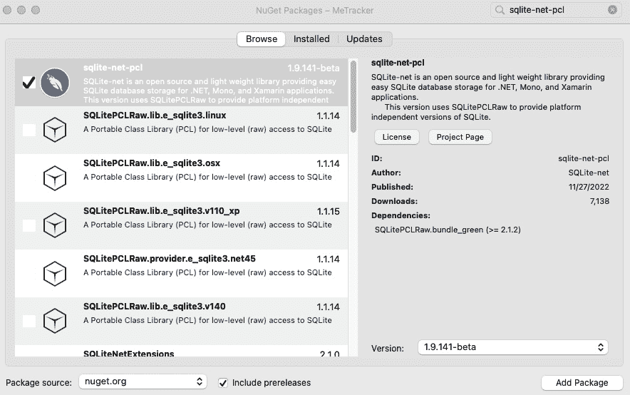

# 7

# 使用 GPS 和地图构建位置跟踪应用

在本章中，我们将创建一个位置跟踪应用，该应用将保存用户的地理位置并以热图的形式显示。我们将学习如何在 iOS、macOS 和 Android 设备上后台运行任务。我们将扩展 .NET MAUI 的 `Map` 控件，以便直接在地图中显示保存的地理位置。

本章将涵盖以下主题：

+   在 iOS 设备和 macOS 设备上后台跟踪用户的地理位置

+   在 Android 设备上后台跟踪用户的地理位置

+   如何在 .NET MAUI 应用中显示地图

+   如何扩展 .NET MAUI 地图的功能

让我们开始吧！

# 技术要求

要完成此项目，您需要安装 Visual Studio for Mac 或 Windows，以及 .NET MAUI 组件。有关如何设置环境的更多详细信息，请参阅 *第一章*，*.NET MAUI 简介*。如果您使用 Visual Studio for Windows 构建 iOS 应用，您必须连接一台 Mac。如果您根本无法访问 Mac，您只需完成此项目的 Android 部分。

您可以在本章中找到代码的完整源代码，链接为 [`github.com/PacktPublishing/MAUI-Projects-3rd-Edition`](https://github.com/PacktPublishing/MAUI-Projects-3rd-Edition)。

Windows 用户的重要信息

在撰写本文时，.NET MAUI 在 Windows 平台上没有 `Map` 控件。这是由于底层 WinUI 平台上缺少 `Map` 控件。有关 Windows 上 `Map` 支持的最新信息，请访问 [`learn.microsoft.com/en-us/dotnet/maui/user-interface/controls/map`](https://learn.microsoft.com/en-us/dotnet/maui/user-interface/controls/map) 的 `Map` 文档。

# 项目概述

通过添加地图和位置服务，许多应用可以变得更加丰富。在本项目中，我们将构建一个名为 `MeTracker` 的位置跟踪应用。此应用将跟踪用户的地理位置并将其保存到 SQLite 数据库中，以便我们可以以热图的形式可视化结果。为了构建此应用，我们将学习如何在 iOS、macOS 和 Android 上设置后台进程。幸运的是，iOS 和 macOS 的实现是相同的；然而，Android 的实现非常不同。对于地图，我们将使用 .NET MAUI 的 `Maps` 组件并扩展其功能以构建热图。

由于 Windows 平台上缺少 `Map` 支持，以及为了增加一些多样性，本章将使用 Visual Studio for Mac 的截图和参考。如果您没有 Mac，不要担心；您仍然可以在 Windows 开发机器上完成 Android 项目的开发。如果您需要帮助，可以查看一些早期章节中的等效步骤。

此项目的预计构建时间为 180 分钟。

# 构建 MeTracker 应用

是时候开始构建应用了。使用以下步骤从模板创建项目：

1.  打开 Visual Studio for Mac 并点击 **新建**：


图 7.1 – Visual Studio for Mac 启动屏幕

1.  在 **选择新项目的模板** 对话框中，使用位于 **多平台** | **应用** 下的 **.NET MAUI App** 模板；然后，点击 **继续**：


图 7.2 – 新项目

1.  在 **配置你的新 .NET MAUI 应用** 对话框中，确保已选择 **.NET 7.0** 目标框架，然后点击 **继续**：


图 7.3 – 选择目标框架

1.  在 `MeTracker` 中，然后点击 **创建**：


图 7.4 – 命名新应用

如果你现在运行应用程序，你应该会看到以下类似的内容：


图 7.5 – MeTracker 应用在 macOS 上

现在我们已经从一个模板中创建了一个项目，是时候开始编码了！

## 创建一个用于保存用户位置的仓库

我们首先要做的是创建一个仓库，我们可以用它来保存用户的地理位置。

### 为位置数据创建模型

在我们创建仓库之前，我们将创建一个表示用户位置的模型类。按照以下步骤进行操作：

1.  创建一个用于所有模型的 `Models` 文件夹。

1.  在 `Models` 文件夹中创建一个 `Location` 类，并添加 `Id`、`Latitude` 和 `Longitude` 属性。

1.  创建两个构造函数 – 一个为空，另一个接受 `latitude` 和 `longitude` 作为参数。使用以下代码进行操作：

    ```cs
    Using'System;
    namespace MeTracker.Models;
    public class Location
    {
        public Location() {}
        public Location(double latitude, double longitude)
        {
            Latitude = latitude;
            Longitude = longitude;
        }
        public int Id { get; set; }
        public double Latitude { get; set; }
        public double Longitude { get; set; }
    }
    ```

现在我们已经创建了一个模型，我们可以开始创建仓库。

### 创建仓库

首先，我们将为仓库创建一个接口。按照以下步骤进行操作：

1.  创建一个名为 `Repositories` 的新文件夹。

1.  在我们的新文件夹中，创建一个名为 `ILocationRepository` 的接口。

1.  在我们为接口创建的新文件中编写以下代码：

    ```cs
    using MeTracker.Models;
    using System;
    using System.Threading.Tasks;
    namespace MeTracker.Repositories;
    public interface ILocationRepository
    {
        Task SaveAsync(Models.Location location);
    }
    ```

现在我们有了接口，我们需要创建它的实现。按照以下步骤进行操作：

1.  在 `Repositories` 文件夹中创建一个新的 `LocationRepository` 类。

1.  实现 `ILocationRepository` 接口，并在 `SaveAsync` 方法中添加 `async` 关键字，使用以下代码：

    ```cs
    using System;
    using System.Threading.Tasks;
    using MeTracker.Models;
    namespace MeTracker.Repositories;
    public class LocationRepository : ILocationRepository
    {
        public async Task SaveAsync(Models.Location location)
        {
        }
    }
    ```

关于 Async 后缀的说明

你会在本书的许多章节中看到方法后使用 `Async` 作为后缀。在所有异步方法上附加 `Async` 后缀是 .NET 的一个约定。我们如何知道接口中的方法是否是异步的，因为我们看不到 `async` 关键字？它很可能会返回一个 `Task` 或 `ValueTask` 对象。在某些情况下，异步方法将返回 `void`；然而，这并不被看好，正如 Stephen Cleary 在他的文章 [`msdn.microsoft.com/en-us/magazine/jj991977.aspx`](https://msdn.microsoft.com/en-us/magazine/jj991977.aspx) 中解释的那样，所以你不会在本书中看到它的使用。

为了存储数据，我们将使用 SQLite 数据库和名为**对象关系映射器**（**ORM**）的 SQLite-net，这样我们就可以针对领域模型编写代码，而不是使用 SQL 对数据库进行操作。这是一个由 Frank A. Krueger 创建的开源库。让我们通过以下步骤来设置它：

1.  通过在**解决方案资源管理器**中的`Dependencies`节点上右键单击来添加对`sqlite-net-pcl`的引用：


图 7.6 – 添加 NuGet 包

1.  从上下文菜单中选择**管理 NuGet 包…**以打开**NuGet** **包**窗口。

1.  如下所示，在搜索框中检查`sqlite-net-pcl`：



图 7.7 – 添加 sqlite-net-pcl 包

1.  最后，勾选`sqlite-net-pcl`旁边的复选框，然后点击**添加包**。

1.  前往`Location`模型类，并将`PrimaryKeyAttribute`和`Auto` **IncrementAttribute**属性添加到`Id`属性。当我们添加这些属性时，`Id`属性将成为数据库中的主键，并且将自动为其创建一个值。现在`Location`类应该看起来如下所示：

    ```cs
    using SQLite;
    namespace MeTracker.Models;
    public class Location
    {
        public Location() { }
        public Location(double latitude, double longitude)
        {
            Latitude = latitude;
            Longitude = longitude;
        }
        [PrimaryKey]
        [AutoIncrement]
        public int Id { get; set; }
        public double Latitude { get; set; }
        public double Longitude { get; set; }
    }
    ```

1.  在`LocationRepository`类中编写以下代码以连接到 SQLite 数据库。使用`if`语句检查我们是否已经创建了连接。如果我们已经有了，我们不会创建一个新的；相反，我们将使用我们已创建的连接：

    ```cs
    private SQLiteAsyncConnection connection;
    private async Task CreateConnectionAsync()
    {
        if (connection != null)
        {
            return;
        }
        var databasePath = Path.Combine(Environment.GetFolderPath (Environment.SpecialFolder .MyDocuments), "Locations.db");
        connection = new SQLiteAsyncConnection(databasePath);
        await connection.CreateTableAsync<Location>();
    }
    ```

现在，是时候实现`SaveAsync`方法了，它将接受一个`location`对象作为参数并将其存储在数据库中。

我们将在`SaveAsync`方法中使用`CreateConnectionAsync`方法来确保在我们尝试将数据保存到数据库时创建一个连接。当我们知道我们有一个活动的连接时，我们就可以直接使用`InsertAsync`方法，并将`SaveAsync`方法的`location`参数作为参数传递。

编辑`LocationRepository`类中的`SaveAsync`方法，使其看起来像这样：

```cs
public async Task SaveAsync(Models.Location location)
{
    await CreateConnectionAsync();
    await connection.InsertAsync(location);
}
```

目前这个仓库就到这里，接下来让我们继续到位置跟踪服务。

## 创建位置跟踪服务

要跟踪用户的位置，我们需要根据平台编写代码。.NET MAUI 有获取用户位置的方法，但不能在后台使用。为了能够使用我们将为每个平台编写的代码，我们需要创建一个接口。对于`ILocationRepository`接口，只有一个实现将在两个平台（iOS 和 Android）上使用，而对于位置跟踪服务，我们将为每个平台提供一个实现。

按照以下步骤创建一个`ILocationTrackingService`接口：

1.  创建一个名为`Services`的新文件夹。

1.  在`Services`文件夹中创建一个新的`ILocationTrackingService`接口。

1.  在接口中添加一个名为`StartTracking`的方法，如下面的代码片段所示：

    ```cs
    public interface ILocationTrackingService
    {
        void StartTracking();
    }
    ```

为了确保我们可以在为每个平台实现位置跟踪服务的同时运行和测试我们的应用程序，我们将使用部分类。类的主要部分将在项目的共享代码部分，而类的特定平台部分将在特定平台文件夹中。我们将在本章后面部分回到每个实现。

在 `Services` 文件夹中创建一个名为 `LocationTrackingService` 的类，如下所示：

```cs
public partial class LocationTrackingService : ILocationTrackingService
{
    public void StartTracking()
    {
        StartTrackingInternal();
    }
    partial void StartTrackingInternal();
}
```

我们使用接口来抽象我们的实现。我们还使用部分类来抽象每个特定的实现，但提供基础实现，这样我们就不必立即为每个平台实现。然而，这两种方法（部分类和基类继承）并不能与相同的方法一起使用。

实现 `StartTracking` 接口方法需要一个 `public` 关键字，它看起来像这样：

```cs
public void StartTracking() {}
```

然后，将其设置为部分类，如下所示：

```cs
public partial void StartTracking() {}
```

编译器抱怨没有部分方法的初始定义——也就是说，没有实现的方法。

删除空定义，如下所示：

```cs
public partial void StartTracking();
```

编译器现在抱怨因为它有一个可访问性修饰符，`public`。

在这种情况下，根本无法让编译器满意。因此，为了避免这些问题，我们通过调用 `StartTrackingInternal` 部分方法来实现 `StartTracking` 接口方法。我们将在本章后面部分访问每个平台的 `StartTrackingInternal` 的实现；现在，即使我们没有实现 `StartTrackingInternal`，应用程序也应该可以编译和运行。

现在我们已经有了位置跟踪服务的接口和基础实现，我们可以将注意力转向应用程序逻辑和用户界面。

## 设置应用程序逻辑

现在我们已经创建了接口，我们需要跟踪用户的位置并将其保存在设备上本地。是时候编写一些代码，以便我们可以开始跟踪用户了。我们还没有任何跟踪用户位置的代码，但如果我们已经编写了启动跟踪过程的代码，这将更容易编写。

### 创建带有地图的视图

首先，我们将创建一个带有简单地图的视图，该地图以用户的位置为中心。让我们通过以下步骤来设置它：

1.  在 `Views` 文件夹中创建一个名为 `Views` 的新文件夹。

1.  在 `Views` 文件夹中，创建一个基于 XAML 的 `ContentPage` 模板，并将其命名为 `MainView`：


图 7.8 – 添加 .NET MAUI XAML ContentPage 组件

1.  通过在 **解决方案资源管理器** 中的 `Dependencies` 节点右键单击来添加对 `Microsoft.Maui.Controls.Maps` 的引用：


图 7.9 – 添加 NuGet 包

1.  从上下文菜单中选择 **管理 NuGet 包…** 以打开 **NuGet 包** **管理器** 窗口。

1.  在搜索框中键入 `Microsoft.Maui.Controls.Maps`，如下所示：


图 7.10 – 添加 .NET MAUI Maps 包

1.  最后，勾选 `Microsoft.Maui.Controls.Maps` 旁边的复选框，然后单击 **添加包**。

1.  通过打开 `MauiProgram.cs` 文件并做出高亮更改来添加 Map 初始化代码：

    ```cs
    var builder = MauiApp.CreateBuilder();
    builder
        .UseMauiApp<App>()
        .ConfigureFonts(fonts =>
        {
            fonts.AddFont("OpenSans-Regular.ttf", "OpenSansRegular");
            fonts.AddFont("OpenSans-Semibold.ttf", "OpenSansSemibold");
        })
        .UseMauiMaps();
        return builder.Build();
    ```

1.  使用以下高亮代码在 `MainView` 中添加 `Microsoft.Maui.Controls.Maps` 命名空间：

    ```cs
    <ContentPage 
                 _idTextAnchor605"/>om/winfx/2009/xaml"
        xmlns:maps="clr-namespace:Microsoft.Maui.Controls.Maps;assembly=Microsoft.Maui.Controls.Maps"
        x:Class="MeTracker.Views.MainView"
        Title="MainView">
    ```

    现在，我们可以在我们的视图中使用地图了。因为我们想让 `Map` 覆盖整个页面，所以我们可以将其添加到 `ContentPage` 的根目录。

1.  将 `Map` 添加到 `ContentPage` 并为其命名，以便我们可以从代码隐藏文件中访问它。命名为 `Map`，如下面的代码片段所示：

    ```cs
    <ContentPage 

        x:Class="MeTracker.Views.MainView"
        Title="MainView">
        <maps:Map x:Name="Map" />
    </ContentPage>
    ```

在我们能够启动应用程序并首次看到 `Map` 控件之前，我们需要将外壳设置为使用我们新的 `MainView` 模板而不是默认的 `MainPage` 模板。但首先，我们将删除我们在启动项目时创建的 `MainPage.xaml` 和 `MainPage.xaml.cs` 文件，因为我们在这里不会使用它们：

1.  由于我们将设置 `MainView` 模板为用户看到的第一个视图，因此请删除项目中的 `MainPage.xaml` 和 `MainPage.xaml.cs` 文件。

1.  编辑 `AppShell.xaml` 文件，如下所示的高亮代码：

    ```cs
    <Shell
        x:Class="MeTracker.AppShell"

        Shell.FlyoutBehavior="Disabled">
        <ShellContent
            Title="Home"
            ContentTemplate="{DataTemplate views:MainView}"
            Route="MainView" />
    </Shell>
    ```

我们能否使用现有的 `MainPage` 模板呢？当然可以——对于编译器来说，XAML 文件的名字或位置并没有任何区别，但为了保持一致性，并且按照 .NET MAUI 的 MVVM 习惯，我们将我们的 *页面* 放在 `Views` 文件夹中，并在页面名称后缀加上 `Views`。

选择 Mac Catalyst 或 iOS 模拟器并运行应用程序将产生 *图 7*.11 中所示的结果。Android 不会工作，直到我们完成下一节：


图 7.11 – 添加 Map 控件后运行应用程序

现在我们有一个带有 `Map` 控件的页面，我们需要确保我们已从用户那里获得使用位置信息的权限。

### 声明特定平台的定位权限

要使用 `Map` 控件，我们需要声明我们需要位置信息的权限。如果需要，`Map` 控件将进行运行时请求。iOS/Mac Catalyst 和 Android 各自有声明所需权限的方式。我们将从 iOS/Mac Catalyst 开始，之后我们将进行 Android。

通过双击将其打开到 **属性列表编辑器** 中，在 `Platforms/iOS` 文件夹中的 `info.plist` 文件中。向文件中添加两个新条目，如下一个屏幕截图所示的高亮部分：


图 7.12 – 编辑 iOS 的 info.plist 文件

在 `Platforms/MacCatalyst` 文件夹中的 `info.plist` 文件中做出相同的更改，如下所示：


图 7.13 – 编辑 Mac Catalyst 的 info.plist 文件

Windows 用户

要在 Windows 上编辑`info.plist`文件，您需要通过右键单击文件，选择**打开方式…**，然后选择**XML 编辑器**来在文本编辑器中打开文件。然后，添加下一代码片段中突出显示的条目。

使用**属性列表编辑器**编辑`info.plist`文件会导致以下高亮显示的更改：

```cs
    <key>XSAppIconAssets</key>
    <string>Assets.xcassets/appicon.appiconset</string>
    <key>NSLocationAlwaysAndWhenInUseUsageDescription</key>
    <string>Can we use your location at all times?</string>
    <key>NSLocationWhenInUseUsageDescription</key>
    <string>Can we use your location when your app is being used?</string>
</dict>
</plist>
```

要在 Android 中后台跟踪用户的位置，我们需要声明五个权限，如下表所示：

| ACCESS_COARSE_LOCATION | 获取用户的大致位置 |
| --- | --- |
| ACCESS_FINE_LOCATION | 获取用户的确切位置 |
| ACCESS_NETWORK_STATE | 我们需要这个权限，因为 Android 中的位置服务使用网络信息来确定用户的位置 |
| ACCESS_WIFI_STATE | 我们需要这个权限，因为 Android 中的位置服务使用 Wi-Fi 网络的信息来确定用户的位置 |
| RECEIVE_BOOT_COMPLETED | 这样后台任务在设备重启后可以再次启动 |

以下步骤将声明我们应用所需的权限：

1.  在`Platforms/Android`文件夹中打开`MainActivity.cs`文件。

1.  在`using`声明块的末尾添加以下`assembly`属性，如下所示：

    ```cs
    using Android.App;
    using Android.Runtime;
    [assembly: UsesPermission(Android.Manifest.Permission.AccessCoarseLocation)]
    [assembly: UsesPermission(Android.Manifest.Permission.AccessFineLocation)]
    [assembly: UsesPermission(Android.Manifest.Permission.AccessWifiState)]
    [assembly: UsesPermission(Android.Manifest.Permission.ReceiveBootCompleted)]
    namespace MeTracker;
    ```

    注意，我们没有声明`Android.Manifest.Permission.AccessNetworkState`，因为它包含在.NET MAUI 模板中。

现在我们已经声明了我们所需的全部权限，我们可以在 Android 上启用地图服务。

Android 需要**API 密钥**才能使**Google Maps**与地图一起工作。有关如何获取 API 密钥的 Microsoft 文档可以在[`learn.microsoft.com/en-us/dotnet/maui/user-interface/controls/map?view=net-maui-7.0#get-a-google-maps-api-key`](https://learn.microsoft.com/en-us/dotnet/maui/user-interface/controls/map?view=net-maui-7.0#get-a-google-maps-api-key)找到。按照这些说明获取您的 Google Maps 密钥，然后按照以下步骤在应用中使用您的密钥来配置 Google Maps API 密钥：

1.  通过右键单击文件并选择**打开方式…**，然后选择**XML (****文本) 编辑器**来打开位于`Platforms/Android`文件夹中的`AndroidManifest.xml`文件。

1.  在应用程序元素下插入一个元数据元素，如下所示的高亮代码中所示，将`"{YourKeyHere}"`替换为从 Google 获得的密钥：

    ```cs
    <application android:label="MeTracker.Android">
      <meta-data android:name="com.google.android.geo.API_KEY" android:value="{YourKeyHere}" />
    </application>
    ```

Android 和 iOS 的最近版本已经改变了权限的处理方式。在应用运行时，某些权限，如位置权限，如果没有用户的明确批准则不会授予。也有可能用户会拒绝权限。让我们在下一节中看看如何处理运行时权限请求。

### 在运行时请求位置权限

在我们可以使用用户的位置之前，我们需要从用户那里请求权限。.NET MAUI 有跨平台的权限 API，我们只需要一点代码来使处理请求更加优雅。要实现权限请求处理，请按照以下步骤操作：

1.  在项目的根目录下创建一个名为`AppPermissions`的新类。

1.  编辑新文件以看起来像以下内容：

    ```cs
    namespace MeTracker;
    internal partial class AppPermissions
    {
        internal partial class AppPermission : Permissions.LocationWhenInUse
        {
        }
        public static async Task<PermissionStatus> CheckRequiredPermissionAsync() => await Permissions.CheckStatusAsync<AppPermission>();
        public static async Task<PermissionStatus> CheckAndRequestRequiredPermissionAsync()
        {
            PermissionStatus status = await Permissions.CheckStatusAsync<AppPermission>();
            if (status == PermissionStatus.Granted)
                return status;
            if (status == PermissionStatus.Denied && DeviceInfo.Platform == DevicePlatform.iOS)
            {
                // Prompt the user to turn on in settings
                // On iOS once a permission has been denied it may not be requested again from the application
                await App.Current.MainPage.DisplayAlert("Required App Permissions", "Please enable all permissions in Settings for this App, it is useless without them.", "Ok");
            }
            if (Permissions.ShouldShowRationale<AppPermission>())
            {
                // Prompt the user with additional information as to why the permission is needed
                await App.Current.MainPage.DisplayAlert("Required App Permissions", "This is a location based app, without these permissions it is useless.", "Ok");
            }
            status = await MainThread.InvokeOnMainThreadAsync(Permissions.RequestAsync<AppPermission>);
            return status;
        }
    }
    ```

    这创建了一个名为`AppPermission`的类型，它从默认的.NET MAUI `LocationWhenInUse`权限类继承。

    `CheckRequiredPermission` 方法用于确保在我们尝试任何可能会失败的操作之前，我们的应用程序拥有正确的权限。其实现是调用.NET MAUI 的`CheckSyncStatus`方法并使用我们的`AppPermission`类型。它返回一个`PermissionStatus`类型，这是一个枚举。我们主要对`Denied`和`Granted`值感兴趣。

    `CheckAndRequestRequiredPermission` 方法处理从用户请求访问的复杂性。第一步是简单地检查权限是否已经被授予，如果是，则返回状态。接下来，如果我们处于 iOS 并且权限已被拒绝，则无法再次请求，因此您必须指导用户如何通过设置面板授予应用程序权限。Android 在请求行为中包括如果用户拒绝访问则骚扰用户的能力。此行为通过.NET MAUI 的`ShouldShowRationale`方法公开。对于不支持此行为的任何平台，它将返回`false`；在 Android 上，如果用户第一次拒绝访问，它将返回`true`，如果用户第二次拒绝，则返回`false`。最后，我们从用户那里请求对`AppPermission`类型的访问。同样，.NET MAUI 正在隐藏所有平台实现细节，使得检查和请求访问某些资源变得非常直接。

现在我们已经设置了`AppPermissions`类，我们可以使用它来请求用户的当前位置，并将地图中心定位在该位置。

### 在当前用户位置上居中地图

我们将在`MainView.xaml.cs`的构造函数中使地图以用户的位置为中心。因为我们想异步获取用户的位置，并且这需要在主线程上执行，所以我们将使用`MainThread.BeginInvokeOnMainThread`在主线程上运行一个匿名方法。一旦我们有了位置，我们就可以使用`Map`的`MoveToRegion`方法。我们可以通过以下步骤来设置它：

1.  打开`MainView.xaml.cs`。

1.  将以下代码片段中突出显示的代码添加到`MainView.xaml.cs`类的构造函数中：

    ```cs
    public MainView ()
    {
        InitializeComponent();
        MainThread.BeginInvokeOnMainThread(async () =>
        {
            var status = await AppPermissions.CheckAndRequestRequiredPermissionAsync();
            if (status == PermissionStatus.Granted)
            {
                var location = await Geolocation.GetLastKnownLocationAsync();
                if (location == null)
                {
                    location = await Geolocation.GetLocationAsync();
                }
                Map.MoveToRegion(MapSpan.FromCenterAndRadius(
                    location,
                    Distance.FromKilometers(50)));
            }
        });
    }
    ```

如果现在运行应用程序，它应该看起来像以下内容：


图 7.14 – 以用户位置为中心的地图

现在我们已经有了显示我们当前位置的地图，让我们开始构建应用程序其余部分的逻辑，从我们的 `ViewModel` 类开始。

### 创建 ViewModel 类

在我们创建实际的 `ViewModel` 类之前，我们将创建一个所有视图模型都可以继承的抽象基视图模型。这个基视图模型背后的想法是我们可以在其中编写通用代码。在这种情况下，我们将通过使用 `CommunityToolkit.Mvvm` NuGet 包来实现 `INotifyPropertyChanged` 接口。要添加包，请按照以下步骤操作：

1.  通过在 **Solution Explorer** 中的 `Dependencies` 节点右键单击添加对 `CommunityToolkit.Mvvm` 的引用：


图 7.15 – 添加 NuGet 包

1.  从上下文菜单中选择 **Manage NuGet Packages…** 以打开 **NuGet package** **manager** 窗口。

1.  在搜索框中输入 `CommunityToolkit.Mvvm`，如下所示：


图 7.16 – 添加 CommunityToolkit.Mvvm 包

1.  最后，勾选 `CommunityToolkit.Mvvm` 旁边的复选框，然后单击 **Add Package**。

现在，我们可以通过以下步骤创建一个 `ViewModel` 类：

1.  在项目中创建一个名为 `ViewModels` 的文件夹。

1.  创建一个名为 `ViewModel` 的新类。

1.  修改模板代码以匹配以下内容：

    ```cs
    using CommunityToolkit.Mvvm.ComponentModel;
    namespace MeTracker.ViewModels;
    public partial class ViewModel : ObservableObject
    {
    }
    ```

下一步是创建一个实际使用 `ViewModel` 作为基类的视图模型。让我们通过以下步骤来设置它：

1.  在 `ViewModels` 文件夹中创建一个新的 `MainViewModel` 类。

1.  使 `MainViewModel` 类继承 `ViewModel`。

1.  添加一个只读字段，类型为 `ILocationTrackingService`，命名为 `locationTrackingService`。

1.  添加一个只读字段，类型为 `ILocationRepository`，命名为 `locationRepository`。

1.  创建一个带有 `ILocationTrackingService` 和 `ILocationRepository` 作为参数的构造函数。

1.  使用参数的值设置我们在 *步骤 3* 和 *步骤 4* 中创建的字段的值，如下面的代码片段所示：

    ```cs
    public class MainViewModel : ViewModel
    {
        private readonly ILocationRepository locationRepository;
        private readonly ILocationTrackingService locationTrackingService;
        public MainViewModel(ILocationTrackingService locationTrackingService,
            ILocationRepository locationRepository)
        {
            this.locationTrackingService = locationTrackingService;
            this.locationRepository = locationRepository;
        }
    }
    ```

要使应用程序开始跟踪用户的地理位置，我们需要在主线程上运行启动跟踪过程的代码。按照以下步骤操作：

1.  在新创建的 `MainViewModel` 类的构造函数中，使用 `MainThread.BeginInvokeOnMainThread` 向主线程添加调用。

1.  在传递给 `BeginInvokeOnMainThread` 方法的操作中调用 `locationService.StartTracking`。这在上面的高亮代码中显示：

    ```cs
    public MainViewModel(ILocationTrackingService locationTrackingService, ILocationRepository locationRepository)
    {
        this.locationTrackingService = locationTrackingService;
        this.locationRepository = locationRepository;
        MainThread.BeginInvokeOnMainThread(() =>
        {
            locationTrackingService.StartTracking();
        });
    }
    ```

最后，我们需要将 `MainViewModel` 类注入到 `MainView` 的构造函数中，并将 `MainViewModel` 实例分配给视图的绑定上下文。这将允许我们完成的数据绑定被处理，并且 `MainViewModel` 的属性将被绑定到用户界面中的控件。按照以下步骤操作：

1.  前往 `Views/MainView.xaml.cs` 文件的构造函数。

1.  将 `MainViewModel` 作为构造函数的参数并命名为 `viewModel`。

1.  将 `BindingContext` 设置为 `MainViewModel` 的实例，如下代码片段所示：

    ```cs
    public MainView(MainViewModel viewModel)
    {
        InitializeComponent();
        BindingContext = viewModel;
        MainThread.BeginInvokeOnMainThread(async () =>
        {
            var location = await Geolocation.GetLastKnownLocationAsync();
            if(location == null)
            {
                location = await Geolocation.GetLocationAsync();
            }
            Map.MoveToRegion(MapSpan.FromCenterAndRadius(
                location, Distance.FromKilometers(5)));
        });
    }
    ```

为了让 .NET MAUI 定位到我们在此部分已实现的类，我们需要将它们添加到 **依赖注入** （**DI**） 容器中。

### 将类添加到 DI 容器中

由于我们向视图的构造函数中添加了一个参数，.NET MAUI `View` 框架将无法自动构建视图。因此，我们需要将 `MainView`、`MainViewModel`、`LocationTrackingService` 和 `LocationRepository` 实例添加到 DI 容器中。为此，请按照以下步骤操作：

1.  打开 `MauiProgram.cs` 文件。

1.  将以下突出显示的行添加到 `CreateMauiApp` 方法中：

    ```cs
    public static MauiApp CreateMauiApp()
    {
        var builder = MauiApp.CreateBuilder();
        builder
            .UseMauiApp<App>()
            .ConfigureFonts(fonts =>
            {
                fonts.AddFont("OpenSans-Regular.ttf", "OpenSansRegular");
                fonts.AddFont("OpenSans-Semibold.ttf", "OpenSansSemibold");
            })
            .UseMauiMaps(); 
    #if DEBUG
        builder.Logging.AddDebug();
    #endif
        builder.Services.AddSingleton<Services.ILocationTrackingService, Services.LocationTrackingService>();
            builder.Services.AddSingleton<Repositories.ILocationRepository, Repositories.LocationRepository>();
            builder.Services.AddTransient(typeof(ViewModels.MainViewModel));
            builder.Services.AddTransient(typeof(Views.MainView));
        return builder.Build();
    }
    ```

现在，我们再次能够运行应用程序。我们没有更改任何接口，所以它应该看起来和表现与之前相同。如果它没有，请仔细回顾前面的部分，确保所有代码都是正确的。

让我们添加一些代码，以便我们可以使用后台位置跟踪跟踪用户的位置随时间的变化。

## iOS 和 Mac Catalyst 的后台位置跟踪

位置跟踪的代码是我们需要为每个平台编写的。对于 iOS 和 Mac Catalyst，我们将使用 `CoreLocation` 命名空间中的 `CLLocationManager`。

### 启用后台位置更新

当我们想在 iOS 或 Mac Catalyst 应用程序中执行后台任务时，我们需要在 `info.plist` 文件中声明我们想要执行的操作。以下步骤展示了我们如何进行这一操作：

1.  打开 `info.plist`；您需要为 `Platforms/iOS/info.plist` 和 `Platforms/MacCatalyst/info.plist` 都这样做。

1.  使用 **属性列表编辑器** 通过从下拉菜单中选择 **Required background modes** 并选择 **App registers for location updates**，按照以下截图所示添加以下突出显示的条目：


图 7.17 – 添加位置更新

我们也可以使用 XML 编辑器直接在 `info.plist` 文件中启用后台模式。在这种情况下，我们将添加以下 XML：

```cs
<key>UIBackgroundModes</key>
<array>
<string>location</string>
</array>
```

### 订阅位置更新

现在我们已经为位置跟踪准备好了 `info.plist` 文件，是时候编写实际跟踪用户位置的代码了。如果我们没有将 `CLLocationManager` 设置为不暂停位置更新，iOS 或 Mac Catalyst 在位置数据不太可能改变时可以自动暂停位置更新。在这个应用程序中，我们不希望发生这种情况，因为我们想多次保存位置，以便我们可以确定用户是否频繁访问特定位置。

如果您还记得，我们之前已经将服务定义为部分类和部分方法；现在，我们将通过实现服务的平台特定部分来完成服务。让我们设置如下：

1.  在 `Platforms/iOS` 文件夹中创建一个名为 `Services` 的新文件夹。

1.  在 `Services` 文件夹中创建一个名为 `LocationTrackingService` 的新类。

1.  修改类以匹配以下内容：

    ```cs
    namespace MeTracker.Services;
    public partial class LocationTrackingService : ILocationTrackingService
    {
        partial void StartTrackingInternal()
        {
        }
    }
    ```

1.  为 `CLLocationManager` 添加一个私有字段。

1.  在 `StartTrackingInternal` 方法中创建一个 `CLLocationManager` 的实例。

1.  将 `PausesLocationUpdatesAutomatically` 设置为 `false`。

    在我们可以开始跟踪用户的位置之前，我们需要设置我们从 `CLLocationManager` 收到的数据的精度。我们还将添加一个事件处理程序来处理位置更新。

1.  将 `DesiredAccuracy` 设置为 `CLLocation.AccuracyBestForNavigation`。在应用程序在后台运行时，`DesiredAccuracy` 需要设置为 `AccuracyBest` 或 `AccuracyBestForNavigation` 之一。

1.  将 `AllowBackgroundLocationUpdates` 设置为 `true`（如以下代码片段所示），这样即使应用程序在后台运行，位置更新也会继续。

    您的更改应如下所示：

    ```cs
    CLLocation locationManager;
    partial void StartTrackingInternal()
    {
        locationManager = new CLLocationManager
        {
            PausesLocationUpdatesAutomatically = false,
            DesiredAccuracy = CLLocation.AccuracyBestForNavigation,
            AllowsBackgroundLocationUpdates = true
        };
        // Add code here
    }
    ```

下一步是请求用户允许跟踪他们的位置。我们将请求始终跟踪用户的位置，但用户可以选择只在他们使用应用程序时才给我们权限跟踪他们的位置。因为用户也有权拒绝我们跟踪他们的位置，所以在开始之前我们需要检查这一点。让我们设置它：

1.  在 `// Add code here` 注释之后添加 `LocationsUpdated` 的事件处理程序。它应类似于以下片段中高亮的代码：

    ```cs
    partial void StartTrackingInternal()
    {
        locationManager = new CLLocationManager
        {
            PausesLocationUpdatesAutomatically = false,
            DesiredAccuracy = CLLocation.AccuracyBestForNavigation,
            AllowsBackgroundLocationUpdates = true
        };
        // Add code here
        locationManager.LocationsUpdated +=
    async (object sender, CLLocationsUpdatedEventArgs e) =>
        {
            // Final block of code goes here
        };
    };
    ```

1.  在事件处理程序之后，调用我们最近在 `CLLocationManager` 中创建的实例的 `RequestAlwaysAuthorization` 方法：

    ```cs
    partial void StartTrackingInternal()
    {
        locationManager = new CLLocationManager
        {
            PausesLocationUpdatesAutomatically = false,
            DesiredAccuracy = CLLocation.AccurracyBestForNavigation,
            AllowsBackgroundLocationUpdates = true
        };
        // Add code here
        locationManager.LocationsUpdated +=
    async (object sender, CLLocationsUpdatedEventArgs e) =>
        {
            // Final block of code goes here
        };
        locationManager.RequestAlwaysAuthorization();
    };
    ```

1.  然后，调用 `locationManager` 的 `StartUpdatingLocation` 方法：

    ```cs
    partial void StartTrackingInternal()
    {
        locationManager = new CLLocationManager
        {
            PausesLocationUpdatesAutomatically = false,
            DesiredAccuracy = CLLocation.AccurracyBestForNavigation,
            AllowsBackgroundLocationUpdates = true
        };
        // Add code here
        locationManager.LocationsUpdated +=
    async (object sender, CLLocationsUpdatedEventArgs e) =>
        {
            // Final block of code goes here
        };
        locationManager.RequestAlwaysAuthorization();
        locationManager.StartUpdatingLocation();
    };
    ```

小贴士

精度越高，电池消耗就越高。如果我们只想跟踪用户去过哪里，而不关心一个地方有多受欢迎，我们也可以设置 `AllowDeferredLocationUpdatesUntil`。这样，我们可以指定用户必须移动一定距离后才会更新位置。我们还可以使用 `timeout` 参数指定我们希望位置更新的频率。要跟踪用户在一个地方停留了多久，最节能的解决方案是使用 `CLLocationManager` 的 `StartMonitoringVisits` 方法。

现在，是时候处理 `LocationsUpdated` 事件了。让我们按以下步骤进行：

1.  添加一个名为 `locationRepository` 的私有字段，其类型为 `ILocationRepository`。

1.  添加一个具有 `ILocationRepository` 作为参数的构造函数。将参数的值设置为 `locationRepository` 字段。您的类应类似于以下代码片段：

    ```cs
    using CoreLocation;
    using MeTracker.Repositories;
    namespace MeTracker.Services;
    public partial class LocationTrackingService : ILocationTrackingService
    {
        CLLocationManager locationManager;
        ILocationRepository locationRepository;
        public LocationTrackingService(ILocationRepository locationRepository)
        {
            this.locationRepository = locationRepository;
        }
        partial void StartTrackingInternal()
        {
        // Remainder of code omitted for brevity
        }
    ```

1.  读取 `CLLocationsUpdatedEventArgs` 的 `Locations` 属性的最新位置。

1.  创建一个 `MeTracker.Models.Location` 的实例，并将最新位置的纬度和经度传递给它。

1.  使用 `ILocationRepository` 的 `SaveAsync` 方法保存位置。

1.  代码应放置在 `// Final block of code goes here` 注释之后。它应类似于以下片段中加粗的代码：

    ```cs
    locationManager.LocationsUpdated +=
    async (object sender, CLLocationsUpdatedEventArgs e) =>
    {
        // Final block of code goes here
        var lastLocation = e.Locations.Last();
        var newLocation = new Models.Location(lastLocation.Coordinate.Latitude, lastLocation.Coordinate.Longitude);
         await locationRepository.SaveAsync(newLocation);
    };
    ```

这样，我们就完成了 iOS 应用程序的跟踪部分。对于 Mac Catalyst 的实现是相同的；你可以重复本节中的步骤为 Mac Catalyst（但将文件创建为 `Platforms/MacCatalyst/Services` 而不是 `Platforms/iOS/Services`），或者将 `Platforms/iOS/Services/LocationTrackingService.cs` 文件复制到 `Platforms/MacCatalyst/Services` 文件夹中。

现在，我们将实现 Android 的后台跟踪，之后我们将可视化位置跟踪数据。

## Android 后台位置跟踪

Android 实现后台更新的方式与我们用 iOS 实现的方式非常不同。在 Android 中，我们需要创建一个 `JobService` 类并对其进行调度。

### 创建后台作业

要在后台跟踪用户的位置，我们需要创建一个后台作业。后台作业由操作系统使用，允许开发者在应用不在前台或屏幕上可见时执行代码。按照以下步骤创建一个后台作业以捕获用户的位置：

1.  在 `Platforms/Android` 文件夹中创建一个名为 `Services` 的新文件夹。

1.  在 `Platforms/Android` 文件夹中创建一个名为 `LocationJobService` 的新类。

1.  将类继承自 `Android.App.Job.JobService` 作为基类。

1.  在文件顶部添加 `using Android.App.Job` 和 `using Android.App.Job` 声明。

1.  实现 `OnStartJob` 和 `OnStopJob` 抽象方法，如下面的代码片段所示：

    ```cs
    using Android.App;
    using Android.App.Job;
    namespace MeTracker.Platforms.Android.Services;
    internal class LocationJobService : JobService
    {
        public override bool OnStartJob(JobParameters @params)
        {
            return true;
        }
        public override bool OnStopJob(JobParameters @params)
        {
            return true;
        }
    }
    ```

应用程序中的所有 Android 服务都需要添加到 `AndroidManifest.xml` 文件中。我们不必手动进行此操作；相反，我们可以在 `LocationJobService` 类中添加一个属性，然后它将在 `AndroidManifest.xml` 文件中生成。我们将使用 `Name` 和 `Permission` 属性来设置所需的信息，如下面的代码片段所示：

```cs
[Service(Name = "MeTracker.Platforms.Android.Services.LocationJobService", Permission = "android.permission.BIND_JOB_SERVICE")]
internal class LocationJobService : JobService
```

### 调度后台作业

当我们创建了一个作业后，我们需要对其进行调度。我们将从 `Platforms/Android/LocationTrackingService` 文件夹中进行操作。为了配置作业，我们将使用 `JobInfo.Builder` 类。

我们将使用 `SetPersisted` 方法来确保在重启后作业会再次启动。这就是为什么我们之前添加了 `RECEIVE_BOOT_COMPLETED` 权限。

要调度一个作业，至少需要一个约束。在这种情况下，我们将使用 `SetOverrideDeadline`。这将指定作业需要在指定时间（以毫秒为单位）过去之前运行。

`SetRequiresDeviceIdle` 方法可以用来确保作业仅在设备未被用户使用时运行。如果我们想确保在用户使用设备时不会减慢设备速度，我们可以将 `true` 传递给该方法。

`SetRequiresBatteryNotLow` 方法可以用来指定当电池电量低时不应运行作业。如果你没有在电池电量低时运行作业的合理理由，我们建议始终将其设置为 `true`。这是因为我们不希望我们的应用程序耗尽用户的电池电量。

因此，让我们实现 `LocationTrackingService`。按照以下步骤进行：

1.  在 `Platforms/Android/Services` 文件夹中创建一个名为 `LocationTrackingService` 的新类。

1.  修改类，使其看起来如下：

    ```cs
    namespace MeTracker.Services;
    public partial class LocationTrackingService : ILocationTrackingService
    {
        partial void StartTrackingInternal()
        {
        }
    }
    ```

1.  在 `StartTrackingInternal` 方法中，基于我们将指定的 ID（这里我们将使用 `1`）和组件名称（我们将从应用程序上下文和 Java 类中创建）创建一个 `JobInfo.Builder` 类。组件名称用于指定在作业期间将运行哪些代码。

1.  使用 `SetOverrideDeadline` 方法并将 `1000` 传递给它，以确保作业在作业创建后 1 秒内运行。

1.  使用 `SetPersisted` 方法并传递 `true`，使作业即使在设备重新启动后也能持续。

1.  使用 `SetRequiresDeviceIdle` 方法并传递 `false`，这样即使用户正在使用设备，作业也会运行。

1.  使用 `SetRequiresBatteryLow` 方法并传递 `true`，以确保我们不会耗尽用户的电池。此方法是在 Android API 级别 26 中添加的。

    `LocationTrackingService` 的代码现在应该看起来像这样：

    ```cs
    using Android.App.Job;
    using Android.Content;
    using MeTracker.Platforms.Android.Services;
    namespace MeTracker.Services;
    public partial class LocationTrackingService : ILocationTrackingService
    {
        partial void StartTrackingInternal()
        {
            var javaClass = Java.Lang.Class.FromType(typeof(LocationJobService));
            var componentName = new ComponentName(global::Android.App.Application.Context, javaClass);
            var jobBuilder = new JobInfo.Builder(1, componentName);
            jobBuilder.SetOverrideDeadline(1000);
            jobBuilder.SetPersisted(true);
            jobBuilder.SetRequiresDeviceIdle(false);
            jobBuilder.SetRequiresBatteryNotLow(true);
            var jobInfo = jobBuilder.Build();
        }
    }
    ```

`StartTrackingInternal` 方法中的最后一步是使用 `JobScheduler` 系统安排作业。`JobScheduler` 服务是一个 Android 系统服务。为了获取系统服务的实例，我们将使用应用程序上下文。按照以下步骤进行：

1.  使用 `GetSystemService` 方法在 `Application.Context` 上获取 `JobScheduler` 服务。

1.  将结果转换为 `JobScheduler`。

1.  在 `JobScheduler` 类上使用 `Schedule` 方法并传递 `JobInfo` 对象来安排作业，如下面的代码片段所示：

    ```cs
    var jobScheduler = (JobScheduler)global::Android.App.Application.Context.GetSystemService(Context.JobSchedulerService);
    jobScheduler.Schedule(jobInfo);
    ```

现在作业已经安排好了，我们可以开始接收位置更新；让我们继续这个工作。

### 订阅位置更新

一旦我们安排了作业，我们可以编写代码来指定作业应该做什么——即跟踪用户的地理位置。为此，我们将使用 `LocationManager`，这是一个 `SystemService` 类。使用 `LocationManager`，我们可以请求单个位置更新或订阅位置更新。在这种情况下，我们想要订阅位置更新。

我们将首先创建 `ILocationRepository` 接口的一个实例。我们将使用它将位置保存到 SQLite 数据库中。让我们设置一下：

1.  为 `LocationJobService` 创建一个构造函数。

1.  为 `ILocationRepository` 接口创建一个名为 `locationRepository` 的 `private` 只读字段。

1.  在构造函数中使用 `Services.GetService<T>` 创建 `ILocationRepository` 的实例，如下面的代码片段所示：

    ```cs
    private ILocationRepository locationRepository;
    public LocationJobService()
    {
        locationRepository = MauiApplication.Current.Services.GetService<ILocationRepository>();
    }
    ```

在我们订阅位置更新之前，我们将添加一个监听器。为此，我们将使用 `Android.Locations.ILocationListener` 接口。

按照以下步骤进行：

1.  将 `Android.Locations.ILocationListener` 接口添加到 `LocationJobService`。

1.  将以下命名空间声明添加到文件顶部：

    ```cs
    using Android.Content;
    using Android.Locations;
    using Android.OS;
    using Android.Runtime;
    using MeTracker.Repositories;
    ```

1.  实现接口并移除所有 `throw new NotImplemented Exception();` 实例。这是在您让 Visual Studio 生成接口实现时添加到方法中的。

    方法实现应类似于以下代码片段：

    ```cs
        public override bool OnStartJob(JobParameters @params)
        {
            return true;
        }
        public void OnLocationChanged(global::Android.Locations.Location location) { }
        public override bool OnStopJob(JobParameters @params) => true;
        public void OnStatusChanged(string provider, [GeneratedEnum] Availability status, Bundle extras) { }
        public void OnProviderDisabled(string provider) { }
        public void OliknProviderEnabled(string provider) { }
    ```

1.  在 `OnLocationChanged` 方法中，将 `Android.Locations.Location` 对象映射到 `Model.Location` 对象。

1.  使用 `LocationRepository` 类上的 `SaveAsync` 方法，如下代码片段所示：

    ```cs
    public void OnLocationChanged(Android.Locations.Location location)
    {
    var newLocation = new Models.Location(location.Latitude, location.Longitude);
    locationRepository.SaveAsync(newLocation);
    }
    ```

现在我们已经创建了一个监听器，我们可以订阅位置更新。按照以下步骤进行：

1.  创建一个名为 `locationManager` 的 `LocationManager` 类型的 `static` 字段。确保它具有与应用程序相同的生命周期。

1.  在 Android 中，`JobService` 可能会在 `MainView` 显示之前启动，并且我们请求位置权限。为了避免因权限缺失而导致的任何错误，我们将首先检查权限。

    ```cs
    public override bool OnStartJob(JobParameters @params)
    {
        PermissionStatus status = PermissionStatus.Unknown;
        Task.Run(async ()=> status = await AppPermissions.CheckRequiredPermissionAsync()).Wait();
        if (status == PermissionStatus.Granted)
        {
        }
    }
    ```

    我们在 `Task.Run` 实例中运行 `CheckRequiredPermissionsAsync`，因为它是一个 `async` 调用，我们不能将 `async` 添加到方法中，因为返回类型不兼容。对 `Wait` 的调用将 `async` 调用转换为同步调用。如果结果是 `Granted`，则我们可以继续。

1.  前往 `LocationJobService` 中的 `StartJob` 方法。通过在 `ApplicationContext` 上调用 `GetSystemService` 获取 `LocationManager`。

1.  要订阅位置更新，使用如下代码片段所示的 `RequestLocationUpdates` 方法：

    ```cs
    public override bool OnStartJob(JobParameters @params)
    {
        PermissionStatus status = PermissionStatus.Unknown;
        Task.Run(async ()=> status = await AppPermissions.CheckRequiredPermissionAsync()).Wait();
        if (status == PermissionStatus.Granted)
        {
            locationManager = (LocationManager)ApplicationContext.GetSystemService  (Context.LocationService);
            locationManager.RequestLocationUpdates (LocationManager.GpsProvider, 1000L, 0.1f, this);
            return true;
        }
        return false;
    }
    ```

我们传递给 `RequestLocationUpdates` 方法的第一个参数确保我们从 GPS 获取位置。第二个参数确保位置更新之间至少有 `1000` 毫秒的间隔。第三个参数确保用户至少移动 `0.1` 米以获取位置更新。最后一个参数指定我们应使用哪个监听器。因为当前类实现了 `Android.Locations.ILocationListener` 接口，所以我们将传递 `this`。

现在我们已经从用户那里收集了位置数据并将其存储在我们的 SQLite 数据库中，我们现在可以在地图上显示这些数据。

## 创建热图

为了可视化我们收集的数据，我们将创建一个热图。我们将在地图上添加很多点，并根据用户在特定地点花费的时间长短使它们呈现不同的颜色。最受欢迎的地方将呈现暖色调，而最不受欢迎的地方将呈现冷色调。

在我们将点添加到地图之前，我们需要从存储库中获取所有位置。

### 向 LocationRepository 添加 GetAllAsync 方法

为了可视化数据，我们需要编写一些代码，以便可以从数据库中读取位置数据。让我们设置如下：

1.  打开 `ILocationRepository.cs` 文件。

1.  添加一个返回 `Location` 对象列表的 `GetAllAsync` 方法，如下代码所示：

    ```cs
    Task<List<Models.Location>> GetAllAsync();
    ```

1.  打开实现 `ILocationRepository` 的 `LocationRepository.cs` 文件。

1.  实现新的 `GetAllAsync` 方法，并返回数据库中所有保存的位置，如下代码片段所示：

    ```cs
    public async Task<List<Location>> GetAllAsync()
    {
        await CreateConnectionAsync();
        var locations = await connection.Table<Location> ().ToListAsync();
        return locations;
    }
    ```

### 准备可视化数据

在我们可以在地图上可视化数据之前，我们需要准备数据。我们首先要做的是创建一个新的模型，我们可以用它来准备数据。让我们设置一下：

1.  在 `Models` 文件夹中，创建一个名为 `Point` 的新类。

1.  添加 `Location`、`Count` 和 `Heat` 属性，如下代码片段所示：

    ```cs
    namespace MeTracker.Models{
    public class Point
    {
        public Location Location { get; set; }
        public int Count { get; set; } = 1;
        public Color Heat { get; set; }
    }
    }
    ```

    `MainViewModel` 将存储我们稍后找到的位置。让我们为存储点添加一个属性。

1.  打开 `MainViewModel` 类。

1.  添加一个名为 `points` 的 `private` 字段，其类型为 `List<Point>`。

1.  将 `ObservableProperty` 属性添加到 `points` 字段，如下代码片段所示：

    ```cs
    [ObservableProperty]
    private List<Models.Point> points;
    ```

现在我们已经有了点的存储，我们必须添加一些代码，以便我们可以添加位置。我们将通过实现 `MainViewModel` 类的 `LoadDataAsync` 方法来完成此操作，并确保它在位置跟踪开始后立即在主线程上调用。

我们首先要做的是将保存的位置分组，以便所有在 200 米范围内的位置都将作为一个点处理。我们将跟踪在该点内记录位置的次数，以便我们可以决定点在地图上的颜色。让我们设置一下：

1.  添加一个名为 `LoadDataAsync` 的 `async` 方法。此方法返回一个 `Task` 对象给 `MainViewModel`。

1.  在调用 `ILocationTrackingService` 上的 `StartTracking` 方法之后，从构造函数中调用 `LoadDataAsync` 方法，如下代码片段所示：

    ```cs
    public MainViewModel(ILocationTrackingService locationTrackingService, ILocationRepository locationRepository)
    {
        this.locationTrackingService = locationTrackingService;
        this.locationRepository = locationRepository;
        MainThread.BeginInvokeOnMainThread(async() =>
        {
            locationTrackingService.StartTracking();
            await LoadDataAsync();
        });
    }
    ```

`LoadDataAsync` 方法的第一步是从 SQLite 数据库中读取所有跟踪的位置。当我们拥有所有位置后，我们将遍历它们并创建点。

要计算位置和点之间的距离，我们将使用 `CalculateDistance` 方法，如下代码片段所示：

```cs
private async Task LoadDataAsync()
{
    var locations = await locationRepository.GetAll();
    var pointList = new List<Models.Point>();
    foreach (var location in locations)
    {
        //If no points exist, create a new one and continue to the next location in the list
        if (!pointList.Any())
        {
            pointList.Add(new Models.Point() { Location = location });
            continue;
        }
        var pointFound = false;
        //try to find a point for the current location
        foreach (var point in pointList)
        {
            var distance = Location.CalculateDistance(
                new Location(point.Location.Latitude, point.Location.Longitude),
                new Location(location.Latitude, location.Longitude),
                DistanceUnits.Kilometers);
            if (distance < 0.2)
            {
                pointFound = true;
                point.Count++;
                break;
            }
        }
        //if no point is found, add a new Point to the list of points
        if (!pointFound)
        {
            pointList.Add(new Models.Point() { Location = location });
        }
        // Next section of code goes here
    }
}
```

当我们有一个点的列表时，我们可以计算每个点的热色。我们将使用颜色的 **色调**、**饱和度**和**亮度**（**HSL**）表示，如下所述：

+   **色调**：色调是色轮上的一个度数，从 0 到 360，0 为红色，240 为蓝色。因为我们希望最热门的地点是红色（热），最不热门的地点是蓝色（冷），我们将根据用户访问该地点的次数计算一个介于 0 和 240 之间的值，这意味着我们只会使用三分之二的刻度。

+   （代码中的 `1`）。

+   （代码中的 `0.5`）。

我们首先需要做的是找出用户访问最热门和最不热门地点的次数。让我们看一下：

1.  首先，检查点的列表不为空。

1.  获取点列表中 `Count` 属性的 `Min` 和 `Max` 值。

1.  计算最小值和最大值之间的差异。

1.  代码应该在`LoadDataAsync`方法底部的`// Next section of code goes here`注释之后添加，如下面的代码片段所示：

    ```cs
    private async Task LoadDataAsync()
    {
        // The rest of the method has been omitted for brevity
        // Next section of code goes here
        if (pointList == null || !pointList.Any())
        {
            return;
        }
        var pointMax = pointList.Select(x => x.Count).Max();
        var pointMin = pointList.Select(x => x.Count).Min();
        var diff = (float)(pointMax - pointMin);
        // Last section of code goes here
    }
    ```

现在，我们可以计算每个点的热值，如下所示：

1.  遍历所有点。

1.  应该在`LoadDataAsync()`方法底部的`// Last section of code goes here`注释之后添加以下代码（以下代码片段已突出显示）：

    ```cs
    private async Task LoadDataAsync()
    {
        // The rest of the method has been omitted for brevity
        // Next section of code goes here
        if (pointList == null || !pointList.Any())
        {
            return;
        }
        var pointMax = pointList.Select(x => x.Count).Max();
        var pointMin = pointList.Select(x => x.Count).Min();
        var diff = (float)(pointMax - pointMin);
        // Last section of code goes here
        foreach (var point in pointList)
        {
            var heat = (2f / 3f) - ((float)point.Count / diff);
            point.Heat = Color.FromHsla(heat, 1, 0.5);
        }
        Points = pointList;
    }
    ```

这就是我们为`MeTracker`项目设置位置跟踪所需做的全部工作。现在，让我们将注意力转向可视化我们接收到的数据。

### 添加数据可视化

在.NET MAUI 中，`Map`控件可以在地图上渲染额外的信息。这包括图钉和自定义形状，被称为`MapElements`。我们可以简单地添加存储在存储库中的每个位置作为图钉；然而，为了得到热图，我们想在地图上的每个位置添加一个彩色圆点，所以我们将为每个位置使用`MapElements`。

如果`MapElements`属性是`BindableProperty`，我们就可以使用转换器将`MainViewModel`的`Points`属性映射到地图的`MapElements`属性进行绑定。但是`MapElements`不是一个可绑定的属性，所以这不会那么简单。

让我们先创建一个自定义地图控件。

## 创建地图的自定义控件

为了在我们的地图上显示热图，我们将创建一个新的控件。由于`Map`是一个密封类，我们无法直接继承它；相反，我们将使用`BindableProperty`将`Map`控件封装在`ContentView`中，以便从`ViewModel`访问`Points`数据。

按照以下步骤创建自定义控件：

1.  创建一个名为`Controls`的新文件夹。

1.  创建一个名为`CustomMap`的新类。

1.  将`ContentView`作为基类添加到新类中，如下面的代码片段所示：

    ```cs
    namespace MeTracker.Controls;
    public class CustomMap : ContentView
    {
        public CustomMap()
        {
        }
    }
    ```

现在，我们需要将`Map`控件添加到自定义控件中。按照以下步骤添加`Map`控件：

1.  从.NET MAUI 的`Map`控件派生出`CustomMap`控件，如下面的代码片段所示：

    ```cs
    using Microsoft.Maui.Controls.Maps;
    using Microsoft.Maui.Maps;
    using Map = Microsoft.Maui.Controls.Maps.Map;
    namespace MeTracker.Controls;
    public class CustomMap : Map
    {
        public CustomMap()
        {
        }
    }
    ```

1.  在构造函数中初始化地图，如下所示（新更改已突出显示）：

    ```cs
    public CustomMap()
    {
        IsScrollEnabled = true;
        IsShowingUser = true;
    }
    ```

如果我们想要将数据绑定到属性，我们需要创建一个`BindableProperty`类。这应该是类中的一个公共静态字段。我们还需要创建一个常规属性来保存值。属性的命名非常重要。`BindableProperty`的名称需要是`{NameOfTheProperty}Property`；例如，我们将在以下步骤中创建的`BindableProperty`的名称将是`PointsProperty`，因为属性的名称是`Points`。`BindableProperty`是通过`BindableProperty`类的静态`Create`方法创建的。这至少需要四个参数，如下所示：

+   `propertyName`：这是属性名称的字符串。

+   `returnType`：这是属性将返回的类型。

+   `declaringType`：这是`BindableProperty`声明的类的类型。

+   `defaultValue`：这是如果没有设置值将返回的默认值。这是一个可选参数。如果没有设置，.NET MAUI 将使用 `null` 作为默认值。

该属性的 `set` 和 `get` 方法将调用基类中的方法来设置或从 `BindableProperty` 获取值：

1.  创建一个名为 `PointsProperty` 的 `BindableProperty`，如下面的代码片段所示：

    ```cs
    public static BindableProperty PointsProperty = BindableProperty.Create(nameof(Points), typeof(List<Models.Point>), typeof(CustomMap), new List<Models.Point>());
    ```

1.  创建一个名为 `Points` 的 `List<Models.Point>` 类型的属性。记住将 `GetValue` 的结果转换为与属性相同的类型。我们需要这样做，因为 `GetValue` 将返回一个 `type` 对象作为值：

    ```cs
    public List<Models.Point> Points
    {
    get => GetValue(PointsProperty) as List<Models.Point>;
    set => SetValue(PointsProperty, value);
    }
    ```

为了显示 `Points`，我们需要将它们转换为 `MapElements`。这是通过一个名为 `PropertyChanged` 的 `BindingProperty` 事件来完成的。每当 `BindingProperty` 发生变化时，都会触发 `PropertyChanged`。要添加事件并将 `Points` 转换为 `MapElements`，请将以下突出显示的代码添加到类中：

```cs
public readonly static BindableProperty PointsProperty = BindableProperty.Create(nameof(Points), typeof(List<Models.Point>), typeof(MapView), new List<Models.Point>(), propertyChanged: OnPointsChanged);
private static void OnPointsChanged(BindableObject bindable, object oldValue, object newValue)
{
    var map = bindable as Map;
    if (newValue == null) return;
    if (map == null) return;
    foreach (var point in newValue as List<Models.Point>)
    {
        // Instantiate a Circle
        Circle circle = new()
        {
            Center = new Location(point.Location.Latitude, point.Location.Longitude),
            Radius = new Distance(200),
            StrokeColor = Color.FromArgb("#88FF0000"),
            StrokeWidth = 0,
            FillColor = point.Heat
        };
        // Add the Circle to the map's MapElements collection
        map.MapElements.Add(circle);
    }
}
public List<Models.Point> Points
{
    get => GetValue(PointsProperty) as List<Models.Point>;
    set => SetValue(PointsProperty, value);
}
```

现在我们已经创建了一个自定义地图控件，我们将使用它来替换 `MainView` 中的 `Map` 控件。请按照以下步骤操作：

1.  在 `MainView.xaml` 文件中，声明自定义控件的命名空间。

1.  用我们创建的新控件替换 `Map` 控件。

1.  在 `MainViewModel` 中将 `Points` 属性绑定，如下面的代码片段所示：

    ```cs
    <ContentPage  

    x:Class="MeTracker.Views.MainView">
    <map:CustomMap x:Name="Map" Points="{Binding Points}" />
    </ContentPage>
    ```

这就完成了关于如何扩展 `Maps` 控件的这一部分。我们应用程序的最终步骤是在应用程序恢复时刷新地图。

## 在应用程序恢复时刷新地图

我们将要做的最后一件事是确保在应用程序恢复时地图与最新的点保持最新。最简单的方法是在 `App.xaml.cs` 文件中将 `MainPage` 属性设置为 `AppShell` 的新实例，就像构造函数一样，如下面的代码片段所示：

```cs
protected override void OnResume()
{
    base.OnResume();
    MainPage = new AppShell();
}
```

现在 `MeTracker` 应用程序已经完成 – 尝试使用它。一个示例截图显示在 *图 7.18*：


图 7.18 – iOS 和 Android 上的 MeTracker

# 摘要

在本章中，我们为 iOS、Mac Catalyst 和 Android 开发了一个应用程序，该应用程序跟踪用户的地理位置。在构建应用程序时，我们学习了如何在 .NET MAUI 中使用地图以及如何在后台运行时进行位置跟踪。我们还学习了如何使用自定义控件扩展 .NET MAUI。有了这些知识，我们可以创建执行其他后台任务的程序。我们还学习了如何扩展 .NET MAUI 中的大多数控件。

这里有一些方法可以进一步扩展这个应用程序：

+   目前，应用程序在应用程序恢复时更新地图位置。当位置发生变化时，您如何更新地图？

+   添加一个视图，列出数据库中的所有位置。允许用户从列表中删除位置。

下一个项目将是一个天气应用程序。在下一章中，我们将使用现有的天气服务 API 获取天气数据，然后在应用程序中显示这些数据。
