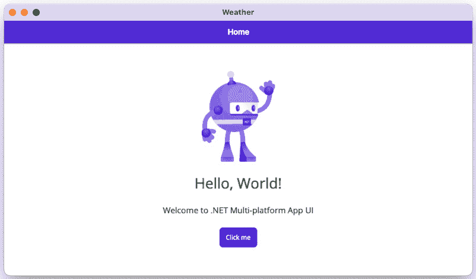

# 8

# 为多种形态构建天气应用

.NET MAUI 不仅用于创建手机应用；它还可以用于创建平板电脑和桌面电脑的应用。在本章中，我们将构建一个适用于所有这些平台的应用，并为每个形态优化用户界面。除了使用三种不同的形态，我们还将针对四个不同的操作系统进行工作：iOS、macOS、Android 和 Windows。

本章将涵盖以下主题：

+   在 .NET MAUI 中使用 `FlexLayout`

+   使用 `VisualStateManager`

+   使用不同视图针对不同形态

+   使用行为

让我们开始吧！

# 技术要求

要处理此项目，我们需要安装 Visual Studio for Mac 或 PC，以及必要的 .NET MAUI 组件。有关如何设置环境的更多详细信息，请参阅 *第一章*，*.NET MAUI 简介*。如果你使用 Visual Studio for PC 构建 iOS 应用，你需要连接一台 Mac。如果你根本无法访问 Mac，你可以选择只处理此项目的 Windows 和 Android 部分。同样，如果你只有 Mac，你可以选择只处理此项目的 iOS 和 Android 部分。

你可以在本章中找到代码的完整源代码，链接为 [`github.com/PacktPubliching/MAUI-Projects-3rd-Edition`](https://github.com/PacktPubliching/MAUI-Projects-3rd-Edition)。

# 项目概述

iOS 和 Android 应用可以在手机和平板电脑上运行。通常，应用只是针对手机进行优化。在本章中，我们将构建一个适用于不同形态的应用，但不会仅限于手机和平板电脑——我们还将针对桌面电脑。桌面版本将使用 **Window UI Library** （**WinUI**）和 macOS 通过 Mac Catalyst。

我们将要构建的应用是一个天气应用，它根据用户的地理位置显示天气预报。对于本章，我们将使用 Visual Studio for Mac 的说明。如果你使用 Visual Studio for Windows，你应该能够跟上。如果你需要帮助，可以使用其他章节进行参考。

# 构建天气应用

是时候开始构建应用了。按照以下步骤在 Visual Studio for Mac 中创建一个新的空白 .NET MAUI 应用：

1.  打开 Visual Studio for Mac 并点击 **新建**：


图 8.1 – Visual Studio 2022 for Mac 启动屏幕

1.  在 **选择** **你的新项目模板** 对话框中，使用位于 **多平台 | 应用** 下的 **.NET MAUI 应用** 模板，然后点击 **继续**：


图 8.2 – 新建项目

1.  在 **配置** **你的新 .NET MAUI 应用** 对话框中，确保已选择 **.NET 7.0** 目标框架，然后点击 **继续**：


图 8.3 – 选择目标框架

1.  在 `Weather` 中，点击 **创建**：


图 8.4 – 命名新应用

如果你现在运行该应用，你应该看到以下类似的内容：



图 8.5 – macOS 上的天气应用

现在我们已经从模板创建了项目，是时候开始编码了！

## 为天气数据创建模型

在我们编写从外部天气服务获取数据的代码之前，我们将创建用于反序列化服务结果的模型。我们将这样做，以便我们有一个通用的模型，我们可以用它来从服务返回数据。

作为此应用的数据源，我们将使用外部天气 API。本项目将使用 **OpenWeatherMap**，这是一个提供几个免费 API 的服务。你可以在 [`openweathermap.org/api`](https://openweathermap.org/api) 找到这个服务。在本项目中，我们将使用 **5 天 / 3 小时预报**服务，该服务以 3 小时为间隔提供 5 天的预报。为了使用 OpenWeatherMap API，我们必须创建一个账户以获取 API 密钥。如果你不想创建 API 密钥，你可以模拟数据。

按照以下说明在 [`home.openweathermap.org/users/sign_up`](https://home.openweathermap.org/users/sign_up) 创建你的账户并获取你的 API 密钥，你需要用它来调用 API。

生成用于反序列化服务结果的模型的最简单方法是，在浏览器或使用工具（如浏览器中的 `https://api.openweathermap.org/data/2.5/forecast?lat=44.34&lon=10.99&appid={API key}`）中对服务进行调用，将 `{API KEY}` 替换为你的 API 密钥。

注意

如果你遇到了 401 错误，请等待几个小时后再使用你的 API，如 [`openweathermap.org/faq#error401`](https://openweathermap.org/faq#error401) 中所述。

我们可以手动创建类或使用一个可以从 JSON 生成 C# 类的工具。一个可以使用的工具是 **quicktype**，可以在 [`quicktype.io/`](https://quicktype.io/) 找到。只需将 API 调用的输出粘贴到 quicktype 中，即可生成你的 C# 模型。

如果你使用工具生成它们，请确保将命名空间设置为 `Weather.Models`。

如前所述，你也可以手动创建这些模型。我们将在下一节中描述如何进行此操作。

### 手动添加天气 API 模型

如果你希望手动添加模型，请按照以下说明进行。我们将添加一个名为 `WeatherData.cs` 的单个代码文件，其中将包含多个类：

1.  创建一个名为 `Models` 的文件夹。

1.  在新创建的文件夹中添加一个名为 `WeatherData.cs` 的文件。

1.  将以下代码添加到 `WeatherData.cs` 文件中：

    ```cs
    using System.Collections.Generic;
    namespace Weather.Models
    {
        public class Main
        {
            public double temp { get; set; }
            public double temp_min { get; set; }
            public double temp_max { get; set; }
            public double pressure { get; set; }
            public double sea_level { get; set; }
            public double grnd_level { get; set; }
            public int humidity { get; set; }
            public double temp_kf { get; set; }
        }
        public class Weather
        {
            public int id { get; set; }
            public string main { get; set; }
            public string description { get; set; }
            public string icon { get; set; }
        }
        public class Clouds
        {
            public int all { get; set; }
        }
        public class Wind
        {
            public double speed { get; set; }
            public double deg { get; set; }
        }
        public class Rain
        {
        }
        public class Sys
        {
            public string pod { get; set; }
        }
        public class List
        {
            public long dt { get; set; }
            public Main main { get; set; }
            public List<Weather> weather { get; set; }
            public Clouds clouds { get; set; }
            public Wind wind { get; set; }
            public Rain rain { get; set; }
            public Sys sys { get; set; }
            public string dt_txt { get; set; }
        }
        public class Coord
        {
            public double lat { get; set; }
            public double lon { get; set; }
        }
        public class City
        {
            public int id { get; set; }
            public string name { get; set; }
            public Coord coord { get; set; }
            public string country { get; set; }
        }
        public class WeatherData
        {
            public string cod { get; set; }
            public double message { get; set; }
            public int cnt { get; set; }
            public List<List> list { get; set; }
            public City city { get; set; }
        }
    }
    ```

如您所见，有很多类。这些类直接映射到我们从服务中获得的响应。在大多数情况下，您只想在与服务通信时使用这些类。为了在您的应用中表示数据，您将需要使用另一组仅公开您在应用中需要的信息的类。

### 添加应用特定的模型

在本节中，我们将创建我们的应用将翻译天气 API 模型的模型。让我们先添加 `WeatherData` 类（除非你在前面的部分手动创建了它）：

1.  在 `Weather` 项目中创建一个名为 `Models` 的新文件夹。

1.  添加一个名为 `WeatherData.cs` 的新文件。

1.  将 quicktype 生成的代码粘贴过来，或者根据 JSON 写出类的代码。如果生成了除属性以外的代码，忽略它，只使用属性。

1.  重命名 `MainClass`（这是 `WeatherData` 的内容）。

现在，我们将创建基于我们感兴趣的数据的模型。这将使其余的代码与数据源耦合得更松散。

### 添加 ForecastItem 模型

我们将要添加的第一个模型是 `ForecastItem`，它代表特定时间点的特定预测。我们可以这样做：

1.  在 `Weather` 项目和 `Models` 文件夹中，创建一个名为 `ForecastItem` 的新类。

1.  添加以下代码：

    ```cs
    using System;
    using System.Collections.Generic;
    namespace Weather.Models
    {
        public class ForecastItem
        {
            public DateTime DateTime { get; set; }
            public string TimeAsString => DateTime.ToShortTimeString();
            public double Temperature { get; set; }
            public double WindSpeed { get; set; }
            public string Description { get; set; }
            public string Icon { get; set; }
        }
    }
    ```

现在我们已经有了每个预测的模型，我们需要一个容器模型来按 `City` 对 `ForecastItems` 进行分组。

### 添加 Forecast 模型

在本节中，我们将创建一个名为 `Forecast` 的模型，该模型将跟踪一个城市的单个预测。`Forecast` 模型保留多个 `ForeCastItem` 对象的列表，每个对象代表特定时间点的预测。让我们设置它：

1.  在 `Models` 文件夹中创建一个名为 `Forecast` 的新类。

1.  添加以下代码：

    ```cs
    using System;
    using System.Collections.Generic;
    namespace Weather.Models;
    public class Forecast
    {
        public string City { get; set; }
        public List<ForecastItem> Items { get; set; }
    }
    ```

现在我们已经有了天气 API 和应用的两个模型，我们需要从天气 API 获取数据。

## 创建一个获取天气数据的服务

为了更容易更改外部天气服务并使代码更易于测试，我们将为服务创建一个接口。以下是我们可以如何进行：

1.  创建一个名为 `Services` 的新文件夹。

1.  创建一个名为 `IWeatherService` 的新 `public interface`。

1.  添加一个基于用户位置获取数据的方法，如下所示。将方法命名为 `GetForecastAsync`：

    ```cs
    using System.Threading.Tasks;
    using Weather.Models;
    namespace Weather.Services;
    public interface IWeatherService
    {
        Task<Forecast> GetForecastAsync(double latitude, double longitude);
    }
    ```

现在我们有一个接口，我们可以创建一个实现，如下所示：

1.  在 `Services` 文件夹中，创建一个名为 `OpenWeatherMapWeatherService` 的新类。

1.  实现接口，并将 `async` 关键字添加到 `GetForecastAsync` 方法中：

    ```cs
    using System;
    using System.Globalization;
    using Weather.Models;
    using System.Text.Json;
    namespace Weather.Services;
    public class OpenWeatherMapWeatherService : IWeatherService
    {
        public async Task<Forecast> GetForecastAsync(double latitude, double longitude)
        {
        }
    }
    ```

在我们调用 OpenWeatherMap API 之前，我们需要为对天气 API 的调用构建一个 URI。这将是一个 GET 调用，位置的位置纬度和经度将作为查询参数添加。我们还将添加 API 密钥和我们希望响应使用的语言。让我们设置它：

1.  打开 `OpenWeatherMapWeatherService` 类。

1.  将以下代码片段中高亮显示的代码添加到 `OpenWeatherMap` 的 `WeatherService` 类中：

    ```cs
    public async Task<Forecast> GetForecastAsync(double latitude, double longitude)
    {
     var language = CultureInfo.CurrentUICulture.TwoLetterISOLanguageName;
     var apiKey = “{AddYourApiKeyHere}”;
     var uri = $”https://api.openweathermap.org/data/2.5/forecast?lat={latitude}&lon={longitude}&units=metric&lang={language}&appid={apiKey}”;
    }
    ```

将 `{`AddYourApiKeyHere`}` 替换为从 *Creating models for the weather* *data* 部分获得的密钥

为了反序列化我们从外部服务获取的 JSON，我们将使用 `System.Text.JSON`。

要调用 `Weather` 服务，我们将使用 `HttpClient` 类和 `GetStringAsync` 方法，如下所示：

1.  创建 `HttpClient` 类的新实例。

1.  调用 `GetStringAsync` 并将 URL 作为参数传递。

1.  使用 `System.Text.Json` 中的 `JsonSerializer` 类和 `DeserializeObject` 方法将 JSON 字符串转换为对象。

1.  将 `WeatherData` 对象映射到 `Forecast` 对象。

1.  此代码应类似于以下代码片段中高亮显示的代码：

    ```cs
    public async Task<Forecast> GetForecastAsync(double latitude, double longitude)
    {
        var language = CultureInfo.CurrentUICulture.
    TwoLetterISOLanguageName;
        var apiKey = “{AddYourApiKeyHere}”;
        var uri = $”https://api.openweathermap.org/data/2.5/forecast?lat={latitude}&lon={longitude}&units=metric&lang={language}&appid={apiKey}”;
     var httpClient = new HttpClient();
     var result = await httpClient.GetStringAsync(uri);
     var data = JsonSerializer.Deserialize<WeatherData>(result);
     var forecast = new Forecast()
     {
     City = data.city.name,
     Items = data.list.Select(x => new ForecastItem()
     {
     DateTime = ToDateTime(x.dt),
     Temperature = x.main.temp,
     WindSpeed = x.wind.speed,
     Description = x.weather.First().description,
     Icon = $”http://openweathermap.org/img/w/{x.weather.First().icon}.png”
     }).ToList()
     };
     return forecast;
    }
    ```

性能提示

为了优化应用程序的性能，我们可以将 `HttpClient` 作为单例使用，并在应用程序的所有网络调用中重用它。以下信息来自 Microsoft 的文档：“*HttpClient 旨在一次性实例化并在整个应用程序生命周期中重用。为每个请求实例化 HttpClient 类将在高负载下耗尽可用的套接字数量。这将导致 SocketException 错误*。” 这可以在 [`learn.microsoft.com/en-gb/dotnet/api/system.net.http.httpclient?view=netstandard-2.0`](https://learn.microsoft.com/en-gb/dotnet/api/system.net.http.httpclient?view=netstandard-2.0) 找到。

在前面的代码中，我们有一个调用 `ToDateTime` 方法的调用，这是一个我们需要创建的方法。该方法将日期从 Unix 时间戳转换为 `DateTime` 对象，如下面的代码所示：

```cs
private DateTime ToDateTime(double unixTimeStamp)
{
    DateTime dateTime = new DateTime(1970, 1, 1, 0, 0, 0, 0, DateTimeKind.Utc);
    dateTime = dateTime.AddSeconds(unixTimeStamp).ToLocalTime();
    return dateTime;
}
```

性能提示

默认情况下，`HttpClient` 使用 `HttpClient` 的 Mono 实现（iOS 和 Android）。为了提高性能，我们可以使用特定平台的实现。对于 iOS，使用 `NSUrlSession`。这可以在 iOS 项目的“**iOS 构建选项卡**”下的项目设置中设置。对于 Android，使用 **Android**。这可以在 Android 项目的“**Android 选项**” | **高级**”下设置。

## 配置应用程序平台以使用位置服务

要使用位置服务，我们需要在每个平台上进行一些配置。

### 配置 iOS 平台以使用位置服务

要在 iOS 应用程序中使用位置服务，我们需要在 `info.plist` 文件中添加一个描述，说明我们为什么想要使用位置。在这个应用程序中，我们只需要在我们使用应用程序时获取位置，所以我们只需要为此添加一个描述。让我们设置它：

1.  使用 **XML (****Text) Editor** 打开 `Platforms/iOS` 中的 `info.plist`。

1.  使用以下代码添加 `NSLocationWhenInUseUsageDescription` 键：

    ```cs
    <key>NSLocationWhenInUseUsageDescription</key>
    <string>We are using your location to find a forecast for you</string>
    ```

### 配置 Android 平台以使用位置服务

对于 Android，我们需要设置应用程序，使其需要以下两个权限：

+   **ACCESS_COARSE_LOCATION**

+   **ACCESS_FINE_LOCATION**

我们可以在 `AndroidManifest.xml` 文件中设置此内容，该文件位于 `Platforms\Android\` 文件夹中。然而，我们也可以在项目属性中的 **Android Manifest** 选项卡中设置此内容，如下面的截图所示：


图 8.6 – 选择位置权限

### 配置 WinUI 平台以使用位置服务

由于我们将在 WinUI 平台中使用位置服务，我们需要在项目的 `Platforms/Windows` 文件夹中的 `Package.appxmanifest` 文件下添加 `Location` 功能，如下面的截图所示：


图 8.7 – 向 WinUI 应用添加位置

## 创建 ViewModel 类

既然我们已经有一个负责从外部天气源获取天气数据的服务，那么是时候创建一个 `ViewModel` 了。然而，首先我们将创建一个基视图模型，我们可以在这里放置所有应用中 `ViewModels` 之间可以共享的代码。让我们来设置它：

1.  创建一个名为 `ViewModels` 的新文件夹。

1.  创建一个名为 `ViewModel` 的新类。

1.  将新类设置为 `public` 和 `abstract`。

1.  添加对 CommunityToolkit.MVVM 的包引用：

    ```cs
    public abstract partial class ViewModel : ObservableObject
    {
    }
    ```

现在我们有一个基视图模型。我们可以使用它来创建我们即将创建的视图模型。

现在，是时候创建 `MainViewModel` 了，它将是应用中 `MainView` 的 ViewModel。执行以下步骤来完成此操作：

1.  在 `ViewModels` 文件夹中，创建一个名为 `MainViewModel` 的新类。

1.  将抽象的 `ViewModel` 类添加为基类。

1.  由于我们将使用构造函数注入，我们将添加一个带有 `IWeatherService` 接口参数的构造函数。

    创建一个 `read-only private` 字段。我们将使用它来存储 `IweatherService` 实例：

    ```cs
    public class MainViewModel : ViewModel
    {
        private readonly IWeatherService weatherService;
        public MainViewModel(IWeatherService weatherService)
        {
            this.weatherService = weatherService;
        }
    }
    ```

`MainViewModel` 接受任何实现 `IWeatherService` 的对象，并将对该服务的引用存储在一个字段中。我们将在下一节添加将获取天气数据的功能。

### 获取天气数据

现在，我们将创建一个新的加载数据的方法。这将是一个三步过程。首先，我们将获取用户的位置。一旦我们有了这个，我们就可以获取与该位置相关的数据。最后一步是为视图准备数据，以便创建用户界面。

要获取用户的位置，我们将使用 `Geolocation` 类，该类公开了可以获取用户位置的方法。执行以下步骤：

1.  创建一个名为 `LoadDataAsync` 的新方法。使其成为一个返回 `Task` 的异步方法。

1.  使用 `Geolocation` 类中的 `GetLocationAsync` 方法来获取用户的位置。

1.  从 `GetLocationAsync` 调用的结果中传递纬度和经度，并使用以下代码将其传递给实现 `IWeatherService` 的对象上的 `GetForecast` 方法：

    ```cs
    public async Task LoadDataAsync()
    {
        var location = await Geolocation.GetLocationAsync();
        var forecast = await weatherService.GetForecastAsync(location.Latitude, location.Longitude);
    }
    ```

现在我们可以从服务中获取数据，我们需要通过分组单个数据项来为我们的用户界面结构化它。

### 对天气数据进行分组

当我们展示天气数据时，我们将按天对其进行分组，以便所有针对一天的预测都将位于同一标题下。为此，我们将创建一个新的模型，称为 `ForecastGroup`。为了使该模型能够与 .NET MAUI 的 `CollectionView` 一起使用，它必须有一个 `IEnumerable` 类型作为基类。让我们设置它：

1.  在 `Models` 文件夹中创建一个新的类 `ForecastGroup`。

1.  将 `List<ForecastItem>` 作为新模型的基类。

1.  添加一个空的构造函数和一个带有 `ForecastItem` 实例列表参数的构造函数。

1.  添加一个 `Date` 属性。

1.  添加一个名为 `DateAsString` 的属性，它返回 `Date` 属性作为短日期字符串。

1.  添加一个名为 `Items` 的属性，它返回 `ForecastItem` 实例的列表，如下所示：

    ```cs
    using System;
    namespace Weather.Models;
    public class ForecastGroup : List<ForecastItem>
    {
        public ForecastGroup() { }
        public ForecastGroup(IEnumerable<ForecastItem> items)
        {
            AddRange(items);
        }
        public DateTime Date { get; set; }
        public string DateAsString => Date.ToShortDateString();
        public List<ForecastItem> Items => this;
    }
    ```

当我们完成这个操作后，我们可以通过以下方式更新 `MainViewModel` 的两个新属性：

1.  创建一个名为 `city` 的私有字段，并使用 `ObservableProperty` 属性来获取我们正在获取天气数据的城市的名称。

1.  创建一个名为 `days` 的私有字段，并使用 `ObservableProperty` 属性，它将包含分组后的天气数据。

1.  `MainViewModel` 类应该看起来像以下代码片段中高亮显示的代码：

    ```cs
    public partial class MainViewModel : ViewModel
    {
        [ObservableProperty]
     private string city;
    [ObservableProperty]
     private ObservableCollection<ForecastGroup> days;
        // Rest of the class is omitted for brevity
    }
    ```

现在，我们准备好对数据进行分组了。我们将在 `LoadDataAsync` 方法中这样做。我们将遍历服务中的数据，并将项目添加到不同的组中，如下所示：

1.  创建一个 `itemGroups` 变量，其类型为 `List<ForecastGroup>`。

1.  创建一个 `foreach` 循环，遍历 `forecast` 变量中的所有项目。

1.  添加一个 `if` 语句来检查 `itemGroups` 属性是否为空。如果是空的，则向变量中添加一个新的 `ForecastGroup` 并继续到项目列表中的下一个项目。

1.  在 `itemGroups` 变量上使用 `SingleOrDefault` 方法（这是来自 `System.Linq` 的扩展方法）来根据当前 `ForecastItem` 的日期获取一个组。将结果添加到一个新变量 `group` 中。

1.  如果 `group` 属性为 `null`，则当前天在组列表中没有组。如果是这种情况，应在 `itemGroups` 变量中添加一个新的 `ForecastGroup`。代码将继续执行，直到它到达 `forecast.Items` 列表中的下一个 `forecast` 项目。如果找到组，则应将其添加到 `itemGroups` 变量中的列表。

1.  在 `foreach` 循环之后，使用新的 `ObservableCollection` **<ForecastGroup>** 设置 `Days` 属性，并将 `itemGroups` 变量作为构造函数的参数。

1.  将 `City` 属性设置为 `forecast` 变量的 `City` 属性。

1.  `LoadDataAsync` 方法现在应该如下所示：

    ```cs
    public async Task LoadDataAsync()
    {
        var location = await Geolocation.GetLocationAsync();
        var forecast = await weatherService.GetForecastAsync(location.Latitude, location.Longitude);
        var itemGroups = new List<ForecastGroup>();
        foreach (var item in forecast.Items)
        {
            if (!itemGroups.Any())
            {
                itemGroups.Add(new ForecastGroup(new List<ForecastItem>() { item })
                {
                    Date = item.DateTime.Date
                });
                continue;
            }
            var group = itemGroups.SingleOrDefault(x => x.Date == item.DateTime.Date);
            if (group == null)
            {
                itemGroups.Add(new ForecastGroup(new List<ForecastItem>() { item })
                {
                    Date = item.DateTime.Date
                });
                continue;
            }
            group.Items.Add(item);
        }
        Days = new ObservableCollection<ForecastGroup>(itemGroups);
        City = forecast.City;
    }
    ```

小贴士

当你想添加超过几个项目时，不要在 `ObservableCollection` 上使用 `Add` 方法。最好创建一个新的 `ObservableCollection` 实例并将集合传递给构造函数。这样做的原因是，每次你使用 `Add` 方法时，你都会从视图中绑定它，这将导致视图被渲染。如果我们避免使用 `Add` 方法，我们将获得更好的性能。

## 为平板电脑和桌面电脑创建视图

下一步是创建当应用在平板电脑或桌面电脑上运行时我们将使用的视图。让我们设置它：

1.  在 `Weather` 项目中创建一个名为 `Views` 的新文件夹。

1.  在 `Views` 文件夹中创建一个名为 `Desktop` 的新文件夹。

1.  在 `Views\Desktop` 文件夹中创建一个名为 `MainView` 的新 `.NET MAUI ContentPage (XAML)` 文件：


图 8.8 – 添加 .NET MAUI XAML ContentPage

1.  在视图的构造函数中传递 `MainViewModel` 的实例以设置 `BindingContext`，如下面的代码所示：

    ```cs
    public MainView (MainViewModel mainViewModel)
    {
        InitializeComponent ();
        BindingContext = mainViewModel;
    }
    ```

    在后面的 *添加服务和 ViewModels 到依赖注入* 部分中，我们将配置依赖注入以为我们提供实例。

要在主线程上触发 `MainViewModel` 中的 `LoadDataAsync` 方法，通过覆盖主线程上的 `OnNavigatedTo` 方法来调用 `LoadDataAsync` 方法。我们需要确保调用是在 UI 线程上执行的，因为它将交互用户界面。

要执行此操作，请按照以下步骤操作：

1.  在 `Views\Desktop` 文件夹中打开 `MainView.xaml.cs` 文件。

1.  创建 `OnNavigatedTo` 方法的覆盖版本。

1.  将以下代码片段中突出显示的代码添加到 `OnNavigateTo` 方法中：

    ```cs
        protected override void OnNavigatedTo(NavigatedToEventArgs args)
        {
            base.OnNavigatedTo(args);
     if (BindingContext is MainViewModel viewModel)
     {
     MainThread.BeginInvokeOnMainThread(async () =>
     {
     await viewModel.LoadDataAsync();
     });
     }
        }
    ```

在 `MainView` XAML 文件中，将 `ContentPage` 的 `Title` 属性绑定到 `ViewModel` 中的 `City` 属性，如下所示：

1.  在 `Views\Desktop` 文件夹中打开 `MainView.xaml` 文件。

1.  将 `Title` 绑定添加到以下代码片段中突出显示的 `ContentPage` 元素中：

    ```cs
    <ContentPage
        xmlns=”http://schemas.microsoft.com/dotnet/2021/maui”
        xmlns:x=”http://schemas.microsoft.com/winfx/2009/xaml”
        x:Class=”Weather.Views.Desktop.MainView”
        Title=”{Binding City}”>
    ```

在接下来的部分中，我们将使用 `FlexLayout` 将 ViewModel 中的数据渲染到屏幕上。

### 使用 FlexLayout

在.NET MAUI 中，如果我们想显示一组数据，可以使用`CollectionView`或`ListView`。在大多数情况下，使用`CollectionView`和`ListView`都很好，我们将在本章后面使用`CollectionView`，但`ListView`只能垂直显示数据。在这个应用中，我们希望两个方向都能显示数据。在垂直方向上，我们将有天数（我们根据天数分组预测），而在水平方向上，我们将有特定天内的预测。我们还希望如果在一行中不足以显示所有预测时，预测内容可以换行。`CollectionView`可以在水平方向显示数据，但它不会自动换行。使用`FlexLayout`，我们可以添加两个方向的项目，并且我们可以使用`BindableLayout`将其绑定。当我们使用`BindableLayout`时，我们将使用`ItemSource`和`ItemsTemplate`作为附加属性。

执行以下步骤来构建视图：

1.  将`Grid`作为页面的根视图添加。

1.  将`ScrollView`添加到`Grid`中。我们需要这样做，以便如果内容高于页面高度，则可以滚动。

1.  将`FlexLayout`添加到`ScrollView`中，并将方向设置为`Column`，以便内容将垂直排列。

1.  使用`BindableLayout.ItemsSource`将`MainViewModel`中的`Days`属性添加绑定。

1.  将`DataTemplate`设置为`ItemsTemplate`的内容，如下面的代码所示：

    ```cs
    <Grid>
      <ScrollView BackgroundColor=”Transparent”>
        <FlexLayout BindableLayout.ItemsSource=”{Binding Days}” Direction=”Column”>
          <BindableLayout.ItemTemplate>
            <DataTemplate>
              <!--Content will be added here -->
            </DataTemplate>
          </BindableLayout.ItemTemplate>
        </FlexLayout>
      </ScrollView>
    </Grid>
    ```

每个项目的内联内容将是一个包含日期的标题以及一个水平`FlexLayout`，其中包含该天的预测。让我们设置如下：

1.  打开`MainView.xaml`文件。

1.  添加`StackLayout`，以便我们将添加到其中的子项垂直排列。

1.  将`ContentView`添加到`StackLayout`中，并将`Padding`设置为`10`，`BackgroundColor`设置为`#9F5010`。这将作为标题。我们需要`ContentView`的原因是我们希望文本周围有填充。

1.  将`Label`添加到`ContentView`中，并将`TextColor`设置为`White`，`FontAttributes`设置为`Bold`。

1.  为`Label`的`Text`属性添加对`DateAsString`的绑定。

1.  代码应放置在`<!-- Content will be added here -->`注释中，并应如下所示：

    ```cs
    <StackLayout>
      <ContentView Padding=”10” BackgroundColor=”#9F5010”>
        <Label Text=”{Binding DateAsString}” TextColor=”White” FontAttributes=”Bold” />
      </ContentView>
    </StackLayout>
    ```

现在我们已经在用户界面中有了日期，我们需要添加一个`FlexLayout`属性，该属性将在`MainViewModel`中的任何项目中重复。执行以下步骤来完成此操作：

1.  在`</ContentView>`标签之后但在`</StackLayout>`标签之前添加`FlexLayout`。

1.  将`JustifyContent`设置为`Start`，以便将项目从左侧添加，而不在可用空间中分配它们。

1.  将`AlignItems`设置为`Start`，以便将内容设置为`FlexLayout`中每个项目的左侧，如下面的代码所示：

    ```cs
    <FlexLayout BindableLayout.ItemsSource=”{Binding Items}” Wrap=”Wrap” JustifyContent=”Start” AlignItems=”Start”>
    </FlexLayout>
    ```

在定义了`FlexLayout`之后，我们需要提供一个`ItemsTemplate`属性，该属性定义了列表中每个项目应该如何渲染。继续在您刚刚添加的`<FlexLayout>`标签下直接添加 XAML，如下所示：

1.  将`ItemsTemplate`属性设置为`DataTemplate`。

1.  使用以下代码将元素添加到`FillDataTemplate`中：

提示

如果我们想在绑定中添加格式，可以使用`StringFormat`。在这种情况下，我们想在温度后面添加度符号。我们可以通过使用`{Binding Temperature, StringFormat=’{0}° C’}`短语来实现。通过绑定的`StringFormat`属性，我们可以使用与在 C#中执行此操作时相同的参数格式化数据。这相当于 C#中的`string.Format(“{0}° C”, Temperature)`。我们还可以用它来格式化日期；例如，`{Binding Date, StringFormat=’yyyy’}`。在 C#中，这看起来像`Date.ToString(“yyyy”)`。

```cs
<BindableLayout.ItemTemplate>
  <DataTemplate>
    <StackLayout Margin=”10” Padding=”20” WidthRequest=”150” BackgroundColor=”#99FFFFFF”>
      <Label FontSize=”16” FontAttributes=”Bold” Text=”{Binding TimeAsString}” HorizontalOptions=”Center” />
      <Image WidthRequest=”100” HeightRequest=”100” Aspect=”AspectFit” HorizontalOptions=”Center” Source=”{Binding Icon}” />
      <Label FontSize=”14” FontAttributes=”Bold” Text=”{Binding Temperature, StringFormat=’{0}° C’}” HorizontalOptions=”Center” />
      <Label FontSize=”14” FontAttributes=”Bold” Text=”{Binding Description}” HorizontalOptions=”Center” />
    </StackLayout>
  </DataTemplate>
</BindableLayout.ItemTemplate>
```

提示

`AspectFill`短语作为`Image`的`Aspect`属性的值，意味着整个图像始终可见，并且不会更改其比例。`AspectFit`短语也将保持图像的比例，但图像可以放大和缩小，并裁剪以填充整个`Image`元素。`Aspect`可以设置的最后一个值`Fill`意味着图像可以拉伸或压缩以匹配`Image`视图，从而确保保持宽高比。

### 添加工具栏项以刷新天气数据

为了能够在不重新启动应用程序的情况下刷新数据，我们将向工具栏添加一个`Refresh`按钮。`MainViewModel`负责处理我们想要执行的任何逻辑，并且我们必须将任何操作公开为可绑定的`ICommand`，以便我们可以将其绑定到。

让我们从在`MainViewModel`上创建`Refresh`命令方法开始：

1.  打开`MainViewModel`类。

1.  为`CommunityToolkit.Mvvm.Input`添加`using`声明：

    ```cs
    using System.Collections.ObjectModel;
    using CommunityToolkit.Mvvm.ComponentModel;
    using CommunityToolkit.Mvvm.Input;
    using Weather.Models;
    using Weather.Services;
    ```

1.  添加一个名为`RefreshAsync`的方法，该方法调用`LoadDataAsync`方法，如下所示：

    ```cs
        public async Task RefreshAsync()
        {
            await LoadDataAsync();
        }
    ```

1.  由于这些方法是异步的，`Refresh`将返回`Task`，我们可以使用`async`和`await`来调用`LoadDataAsync`而不会阻塞 UI 线程。

1.  向`RefreshAsync`方法添加`RelayCommand`属性以自动生成方法的可绑定`ICommand`属性：

    ```cs
    [RelayCommand]
        public async Task RefreshAsync()
        {
            await LoadDataAsync();
        }
    ```

现在我们已经定义了`Refresh`命令，我们需要将其绑定到用户界面，以便当用户点击工具栏按钮时，将执行该操作。

要完成此操作，请执行以下步骤：

1.  打开`MainView.xaml`文件。

1.  从[`raw.githubusercontent.com/PacktPublishing/MAUI-Projects-3rd-Edition/main/Chapter08/Weather/Resources/Images/refresh.png`](https://raw.githubusercontent.com/PacktPublishing/MAUI-Projects-3rd-Edition/main/Chapter08/Weather/Resources/Images/refresh.png)下载`refresh.png`文件，并将其保存到项目的`Resources/Images`文件夹中。

1.  向`ContentPage`的`ToolbarItems`属性添加一个新的`ToolbarItem`，将`Text`属性设置为`Refresh`，并将`IconImageSource`属性设置为`refresh.png`（或者，您可以将`IconImageSource`属性设置为图片的 URL，.NET MAUI 将下载该图片）。

1.  将 `Command` 属性绑定到 `MainViewModel` 中的 `Refresh` 属性，如下所示：

    ```cs
    <ContentPage.ToolbarItems>
      <ToolbarItem IconImageSource=”refresh.png” Text=”Refresh” Command=”{Binding RefreshCommand}” />
    </ContentPage.ToolbarItems>
    ```

数据刷新的所有内容都已完成。现在，我们需要某种指示数据正在加载的指示器。

#### 添加加载指示器

当我们刷新数据时，我们希望显示一个加载指示器，以便用户知道正在发生某些事情。为此，我们将添加 `ActivityIndicator`，这是 .NET MAUI 中对该控件的称呼。让我们设置如下：

1.  打开 `MainViewModel` 类。

1.  在 `MainViewModel` 中添加一个名为 `isRefreshing` 的 `Boolean` 字段。

1.  在 `isRefreshingField` 上添加 `ObservableProperty` 属性以生成 `IPropertyChanged` 实现。

1.  在 `LoadDataAsync` 方法的开始处将 `IsRefreshing` 属性设置为 `true`。

1.  在 `LoadDataAsync` 方法的末尾，将 `IsRefreshing` 属性设置为 `false`，如下所示：

    ```cs
        [ObservableProperty]
        private bool isRefreshing;
    ....// The rest of the code is omitted for brevity
    public async Task LoadData()
    {
        IsRefreshing = true;
    ....// The rest of the code is omitted for brevity
        IsRefreshing = false;
    }
    ```

现在我们已经在 `MainViewModel` 中添加了一些代码，我们需要将 `IsRefreshing` 属性绑定到当 `IsRefreshing` 属性为 `true` 时将显示的用户界面元素，如下所示：

1.  在 `MainView.xaml` 中，将 `Frame` 添加到 `ScrollView` 之后，作为 `Grid` 中的最后一个元素。

1.  将 `IsVisible` 属性绑定到我们在 `MainViewModel` 中创建的 `IsRefreshing` 方法。

1.  将 `HeightRequest` 和 `WidthRequest` 设置为 `100`。

1.  将 `VerticalOptions` 和 `HorizontalOptions` 设置为 `Center`，以便 `Frame` 将位于视图的中间。

1.  将 `BackgroundColor` 设置为 `#99000000` 以将背景设置为带有一定透明度的白色。

1.  在 `Frame` 中添加 `ActivityIndicator`，将 `Color` 设置为 `Black`，将 `IsRunning` 设置为 `True`，如下所示：

    ```cs
    <Frame IsVisible=”{Binding IsRefreshing}” BackgroundColor=”#99FFFFFF” WidthRequest=”100” HeightRequest=”100” VerticalOptions=”Center” HorizontalOptions=”Center”>
      <ActivityIndicator Color=”Black” IsRunning=”True” />
    </Frame>
    ```

这将创建一个在数据加载时可见的旋转器，这在创建任何用户界面时都是一个非常好的实践。现在，我们将添加一个背景图像，使应用看起来更美观。

### 设置背景图像

对于这个视图，我们目前要做的最后一件事是添加一个背景图像。在这个例子中，我们将使用的是通过 Google 搜索免费使用图像的结果。让我们设置如下：

1.  打开 `MainView.xaml` 文件。

1.  将 `ScrollView` 的 `Background` 属性设置为 `Transparent`。

1.  在 `Grid` 中添加一个 `Image` 元素，将 `UriImageSource` 设置为 `Source` 属性的值。

1.  将 `CachingEnabled` 属性设置为 `true`，将 `CacheValidity` 设置为 `5`。这意味着图像将被缓存 `5` 天。

注意

如果您使用了 URL 作为 `Refresh` `IconImageSource` 属性的值，也可以设置这些属性以避免在每次运行应用时下载图像。

1.  XAML 现在应该看起来如下所示：

    ```cs
    <ContentPage xmlns=”http://schemas.microsoft.com/dotnet/2021/maui”
                 xmlns:x=”http://schemas.microsoft.com/winfx/2009/xaml”
        x:Class=”Weather.Views.Desktop.MainView”
        Title=”{Binding City}”>
      <ContentPage.ToolbarItems>
        <ToolbarItem Icon=”refresh.png” Text=”Refresh” Command=”{Binding RefreshCommand}” />
      </ContentPage.ToolbarItems>
     <Grid>
     <Image Aspect=”AspectFill”>
     <Image.Source>
     <UriImageSource Uri=”https://upload.wikimedia.org/wikipedia/commons/7/79/Solnedg%C3%A5ng_%C3%B6ver_Laholmsbukten_augusti_2011.jpg” CachingEnabled=”true” CacheValidity=”5” />
     </Image.Source>
     </Image>
        <ScrollView BackgroundColor=”Transparent”>
    <!-- The rest of the code is omitted for brevity -->
    ```

我们也可以通过使用 `<Image Source=”https://ourgreatimage.url” />` 直接在 `Source` 属性中设置 URL。然而，如果我们这样做，我们无法指定对图像的缓存。

桌面视图完成后，我们需要考虑当我们在手机或平板上运行应用时，这个页面将如何显示。

## 创建手机视图

在平板电脑和台式计算机上结构化内容在很多方面非常相似。然而，在手机上，我们能够做的事情却非常有限。因此，在本节中，我们将为在手机上使用此应用时创建一个特定的视图。为此，请按照以下步骤操作：

1.  创建一个新的基于 XAML 的 `Views` 文件夹。

1.  在 `Views` 文件夹中，创建一个名为 `Mobile` 的新文件夹。

1.  在 `Views\Mobile` 文件夹中创建一个名为 `MainView` 的新 `.NET MAUI ContentPage (XAML)` 文件：


图 8.9 – 添加 .NET MAUI XAML ContentPage

1.  在视图的构造函数中传递 `MainViewModel` 的实例以设置 `BindingContext`，如下所示：

    ```cs
    public MainView (MainViewModel mainViewModel)
    {
        InitializeComponent();
        BindingContext = mainViewModel;
    }
    ```

    在 *添加服务和 ViewModels 到依赖注入* 部分中，我们将配置依赖注入以为我们提供实例。

要触发 `MainViewModel` 中的 `LoadDataAsync` 方法，通过在主线程上重写 `OnNavigatedTo` 方法来调用 `LoadDataAsync` 方法。我们需要确保调用在 UI 线程上执行，因为它将交互用户界面。

要执行此操作，请按照以下步骤进行：

1.  在 `Views\Mobile` 文件夹中打开 `MainView.xaml.cs` 文件。

1.  重写 `OnNavigatedTo` 方法。

1.  将以下片段中突出显示的代码添加到 `OnNavigateTo` 方法中：

    ```cs
        protected override void OnNavigatedTo(NavigatedToEventArgs args)
        {
            base.OnNavigatedTo(args);
     if (BindingContext is MainViewModel viewModel)
     {
     MainThread.BeginInvokeOnMainThread(async () =>
     {
     await viewModel.LoadDataAsync();
     });
     }
        }
    ```

在 `MainView` XAML 文件中，将 `ContentPage` 的 `Title` 属性绑定到 `ViewModel` 中的 `City` 属性，如下所示：

1.  在 `Views\Mobile` 文件夹中打开 `MainView.xaml` 文件。

1.  将 `Title` 绑定添加到以下代码片段中突出显示的 `ContentPage` 元素：

    ```cs
    <ContentPage xmlns=”http://schemas.microsoft.com/dotnet/2021/maui”
                 xmlns:x=”http://schemas.microsoft.com/winfx/2009/xaml”
        x:Class=”Weather.Views.Desktop.MainView”
        Title=”{Binding City}”>
    ```

在下一节中，我们将使用 `CollectionView` 来显示天气数据，而不是像桌面视图那样使用 `FlexView`。

### 使用分组 CollectionView

我们可以使用 `FlexLayout` 来实现手机的视图，但由于我们希望用户体验尽可能好，我们将使用 `CollectionView`。为了获取每天的标题，我们将对 `CollectionView` 使用分组。对于 `FlexLayout`，我们有 `ScrollView`，但对于 `CollectionView`，我们不需要这个，因为 `CollectionView` 默认可以处理滚动。

让我们继续为手机的视图创建用户界面：

1.  在 `Views\Mobile` 文件夹中打开 `MainView.xaml` 文件。

1.  将 `CollectionView` 添加到页面的根处。

1.  在 `MainViewModel` 中为 `ItemSource` 属性设置对 `Days` 属性的绑定。

1.  将 `IsGrouped` 设置为 `True` 以在 `CollectionView` 中启用分组。

1.  将 `BackgroundColor` 设置为 `Transparent`，如下所示：

    ```cs
    <CollectionView ItemsSource=”{Binding Days}” IsGrouped=”True” BackgroundColor=”Transparent”>
    </CollectionView>
    ```

为了格式化每个标题的外观，我们将创建一个 `DataTemplate` 属性，如下所示：

1.  将 `DataTemplate` 属性添加到 `CollectionView` 的 `GroupHeaderTemplate` 属性中。

1.  将行内容添加到 `DataTemplate` 中，如下所示：

    ```cs
    <CollectionView ItemsSource=”{Binding Days}” IsGrouped=”True” BackgroundColor=”Transparent”>
     <CollectionView.GroupHeaderTemplate>
     <DataTemplate>
     <ContentView Padding=”15,5” BackgroundColor=”#9F5010”>
     <Label FontAttributes=”Bold” TextColor=”White” Text=”{Binding DateAsString}” VerticalOptions=”Center”/>
     </ContentView>
     </DataTemplate>
     </CollectionView.GroupHeaderTemplate>
    </CollectionView>
    ```

为了格式化每个预报的外观，我们将创建一个 `DataTemplate` 属性，就像我们对组标题所做的那样。让我们设置这个：

1.  将 `DataTemplate` 属性添加到 `CollectionView` 的 `ItemTemplate` 属性中。

1.  在 `DataTemplate` 中添加一个包含四个列的 `Grid` 属性。使用 `ColumnDefinition` 属性指定列的宽度。第二列应该是 `50`；其他三列将共享剩余的空间。我们将通过将 `Width` 设置为 `*` 来实现这一点。

1.  将以下内容添加到 `Grid`：

    ```cs
    <CollectionView.ItemTemplate>
      <DataTemplate>
        <Grid Padding=”15,10” ColumnSpacing=”10” BackgroundColor=”#99FFFFFF”>
          <Grid.ColumnDefinitions>
            <ColumnDefinition Width=”*” />
            <ColumnDefinition Width=”50” />
            <ColumnDefinition Width=”*” />
            <ColumnDefinition Width=”*” />
          </Grid.ColumnDefinitions>
          <Label FontAttributes=”Bold” Text=”{Binding TimeAsString}” VerticalOptions=”Center” />
          <Image Grid.Column=”1” HeightRequest=”50” WidthRequest=”50” Source=”{Binding Icon}” Aspect=”AspectFit” VerticalOptions=”Center” />
          <Label Grid.Column=”2” Text=”{Binding Temperature, StringFormat=’{0}° C’}”
    VerticalOptions=”Center” />
          <Label Grid.Column=”3” Text=”{Binding Description}” VerticalOptions=”Center” />
        </Grid>
      </DataTemplate>
    </CollectionView.ItemTemplate>
    ```

### 添加下拉刷新功能

对于视图的平板和桌面版本，我们在工具栏中添加了一个按钮来刷新天气预报。然而，在手机版本的视图中，我们将添加下拉刷新功能，这是在数据列表中刷新内容的一种常见方式。.NET MAUI 中的 `CollectionView` 没有内置下拉刷新的支持，就像 `ListView` 一样。

相反，我们可以使用 `RefreshView`。`RefreshView` 可以用于向任何控件添加下拉刷新行为。让我们设置这个：

1.  前往 `Views\Mobile\MainView.xaml`。

1.  将 `CollectionView` 包裹在 `RefreshView` 内。

1.  将 `MainViewModel` 中的 `RefreshCommand` 属性绑定到 `RefreshView` 的 `Command` 属性，以便在用户执行下拉刷新手势时触发刷新。

1.  要在刷新进行时显示加载图标，将 `MainViewModel` 中的 `IsRefreshing` 属性绑定到 `RefreshView` 的 `IsRefreshing` 属性。当我们设置这个时，我们也会在初始加载运行时获得一个加载指示器，如下面的代码所示：

    ```cs
    <RefreshView Command=”{Binding Refresh}” IsRefreshing=”{Binding IsRefreshing}”>
      <CollectionView ItemsSource=”{Binding Days}” IsGrouped=”True” BackgroundColor=”Transparent”>
    ....
      </CollectionView>
    </RefreshView>
    ```

这就完成了当前视图的创建。现在，让我们将它们连接到依赖注入，以便我们可以看到我们的工作。

## 添加服务和 ViewModels 到依赖注入

为了让我们的视图获取 `MainViewModel` 的实例，以及让 `MainViewModel` 获取 `OpenWeatherMapWeatherService` 的实例，我们需要将它们添加到依赖注入中。让我们设置这个：

1.  打开 `MauiProgram.cs`。

1.  添加以下突出显示的代码：

    ```cs
    #if DEBUG
        builder.Logging.AddDebug();
    #endif
     builder.Services.AddSingleton<IWeatherService, OpenWeatherMapWeatherService>();
     builder.Services.AddTransient<MainViewModel, MainViewModel>();
        return builder.Build();
    ```

在下一节中，我们将根据设备的形态添加视图的导航。

## 根据设备形态导航到不同的视图

现在我们有两个不同的视图，它们应该在应用程序的同一位置加载。如果应用程序在平板或桌面上运行，则应加载 `Weather.Views.Desktop.MainView`；如果应用程序在手机上运行，则应加载 `Weather.Views.Mobile.MainView`。

.NET MAUI 中的 `Device` 类有一个静态的 `Idiom` 属性，我们可以使用它来检查应用程序正在哪个形态上运行。`Idiom` 的值可以是 `Phone`、`Tablet`、`Desktop`、`Watch` 或 `TV`。因为我们在这个应用程序中只有一个视图，所以我们可以在 `App.xaml.cs` 中设置 `MainPage` 时使用 `if` 语句来检查 `Idiom` 的值。

由于我们只需要一个视图，我们只需在依赖注入中注册我们需要的视图即可——我们只需要一个公共类型来注册视图。让我们创建一个新的接口，我们的视图将实现它：

1.  在 `Views` 文件夹中创建一个名为 `IMainView` 的新接口。

    我们不会向接口添加任何额外的属性或方法，我们只是将其用作标记。

1.  打开 `Views\Desktop\MainView.xaml.cs` 并将 `IMainView` 接口添加到类中：

    ```cs
    public partial class MainView : ContentPageViews\Mobile\MainView.xaml.cs and add the IMainView interface to the class:

    ```

    public partial class MainView : ContentPage, IMainView

    ```cs

    ```

现在我们有一个公共接口，我们可以通过依赖注入注册视图：

1.  打开 `MauiProgram.cs` 文件。

1.  添加以下代码：

    ```cs
    #if DEBUG
        builder.Logging.AddDebug();
    #endif
        builder.Services.AddSingleton<IWeatherService, OpenWeatherMapWeatherService>();
        builder.Services.AddTransient<MainViewModel, MainViewModel>();
     if (DeviceInfo.Idiom == DeviceIdiom.Phone)
     {
     builder.Services.AddTransient<IMainView, Views.Mobile.MainView>();
     }
     else
     {
     builder.Services.AddTransient<IMainView, Views.Desktop.MainView>();
     }
        return builder.Build();
    ```

通过这些更改，我们现在可以测试我们的应用程序。如果你运行你的应用，你应该看到以下内容：


图 8.10 – 在 macOS 和 iOS 上运行的应用

接下来，让我们通过使用 `VisualStateManager` 来更新桌面视图，以便正确处理调整大小。

## 使用 VisualStateManager 处理状态

`VisualStateManager` 是一种从代码中更改 UI 的方法。我们可以定义状态并为选定的属性设置值，以应用于特定状态。`VisualStateManager` 在我们想要为具有不同屏幕分辨率的设备使用相同视图的情况下非常有用。对于我们这些 .NET MAUI 开发者来说，`VisualStateManager` 非常有趣，尤其是在 iOS 和 Android 都可以在手机和平板上运行的情况下。

在此项目中，我们将使用它来在平板电脑或桌面上的横幅模式下运行应用时使 `forecast` 项更大。我们还将使天气图标更大。让我们设置它：

1.  打开 `Views\Desktop\MainView.xaml` 文件。

1.  在第一个 `FlexLayout` 和 `DataTemplate` 中，将一个 `VisualStateManager.VisualStateGroups` 元素插入到第一个 `StackLayout`：

    ```cs
    <StackLayout Margin=”10” Padding=”20” WidthRequest=”150” BackgroundColor=”#99FFFFFF”>
     <VisualStateManager.VisualStateGroups>
     <VisualStateGroup>
     </VisualStateGroup>
     </VisualStateManager.VisualStateGroups>
    ......
    </StackLayout>
    ```

关于 `VisualStateGroup`，我们应该添加两个状态，如下所示：

1.  在 `VisualStateGroup` 中添加一个名为 `Portrait` 的新 `VisualState`。

1.  在 `VisualState` 中创建一个设置器，并将 `WidthRequest` 设置为 `150`。

1.  将另一个名为 `Landscape` 的 `VisualState` 添加到 `VisualStateGroup` 中。

1.  在 `VisualState` 中创建一个设置器，并将 `WidthRequest` 设置为 `200`，如下面的代码所示：

    ```cs
    <VisualStateGroup>
     <VisualState Name=”Portrait”>
     <VisualState.Setters>
     <Setter Property=”WidthRequest” Value=”150” />
     </VisualState.Setters>
     </VisualState>
     <VisualState Name=”Landscape”>
     <VisualState.Setters>
     <Setter Property=”WidthRequest” Value=”200” />
     </VisualState.Setters>
     </VisualState>
    </VisualStateGroup>
    ```

我们还希望当预测项本身更大时，预测项中的图标也更大。为此，我们将再次使用 `VisualStateManager`。让我们设置它：

1.  在第二个 `FlexLayout` 和 `DataTemplate` 中的 `Image` 元素中插入一个 `VisualStateManager.VisualStateGroups` 元素。

1.  为 `Portrait` 和 `Landscape` 添加 `VisualState`。

1.  向状态添加设置器以设置 `WidthRequest` 和 `HeightRequest`。在 `Portrait` 状态中，值应为 `100`，在 `Landscape` 状态中，值应为 `150`，如下面的代码所示：

    ```cs
    <Image WidthRequest=”100” HeightRequest=”100” Aspect=”AspectFit” HorizontalOptions=”Center” Source=”{Binding Icon}”>
     <VisualStateManager.VisualStateGroups>
     <VisualStateGroup>
     <VisualState Name=”Portrait”>
     <VisualState.Setters>
     <Setter Property=”WidthRequest” Value=”100” />
     <Setter Property=”HeightRequest” Value=”100” />
     </VisualState.Setters>
     </VisualState>
     <VisualState Name=”Landscape”>
     <VisualState.Setters>
     <Setter Property=”WidthRequest” Value=”150” />
     <Setter Property=”HeightRequest” Value=”150” />
     </VisualState.Setters>
     </VisualState>
     </VisualStateGroup>
     </VisualStateManager.VisualStateGroups>
    </Image>
    ```

### 创建一个用于设置状态更改的行为

使用 `Behavior`，我们可以在不必须对控件进行子类化的情况下向控件添加功能。使用行为，我们还可以创建比子类化控件时更多的可重用代码。我们创建的 `Behavior` 越具体，其可重用性就越高。例如，从 `Behavior<View>` 继承的 `Behavior` 可以用于所有控件，但仅从 `Button` 继承的 `Behavior` 可以用于按钮。正因为如此，我们总是希望使用更不具体的基类来创建行为。

当我们创建 `Behavior` 时，需要重写两个方法：`OnAttached` 和 `OnDetachingFrom`。如果我们在 `OnAttached` 方法中添加了事件监听器，那么在 `OnDeattached` 方法中移除它们是非常重要的。这将使应用程序使用更少的内存。同样重要的是将值设置回 `OnAppearing` 方法运行之前的状态；否则，我们可能会看到一些奇怪的行为，尤其是在行为位于重用单元格的 `CollectionView` 或 `ListView` 视图中。

在此应用程序中，我们将为 `FlexLayout` 创建一个行为。这是因为我们不能从代码后端设置 `FlexLayout` 中项的状态。我们可以在 `FlexLayout` 中添加一些代码来检查应用程序是否以纵向或横向运行，但如果我们使用 `Behavior`，则可以将该代码从 `FlexLayout` 中分离出来，使其更具可重用性。执行以下步骤来完成此操作：

1.  创建一个名为 `Behaviors` 的新文件夹。

1.  创建一个名为 `FlexLayoutBehavior` 的新类。

1.  将 `Behavior<FlexLayoutView>` 作为基类添加。

1.  创建一个名为 `view` 的 `FlexLayout` 类型的 `private` 字段。

1.  代码应如下所示：

    ```cs
    using System;
    namespace Weather.Behaviors;
    public class FlexLayoutBehavior : Behavior<FlexLayout>
    {
        private FlexLayout view;
    }
    ```

`FlexLayout` 是一个继承自 `Behavior<FlexLayout>` 基类的类。这将使我们能够覆盖一些在将行为附加到或从 `FlexLayout` 类中移除时将被调用的虚拟方法。

但首先，我们需要创建一个处理状态变化的方法。执行以下步骤来完成此操作：

1.  打开 `FlexlayoutBehavior.cs` 文件。

1.  创建一个名为 `SetState` 的 `private` 方法。此方法将有一个 `VisualElement` 值和一个 `string` 参数。

1.  调用 `VisualStateManager.GoToState` 并传递参数给它。

1.  如果视图是 `Layout` 类型，可能还有需要获取新状态的子元素。为此，我们将遍历布局的所有子元素。我们不会直接将状态设置到子元素，而是调用 `SetState` 方法，这是我们已经在其中的方法。这样做的原因是，一些子元素可能有它们自己的子元素：

    ```cs
    private void SetState(VisualElement view, string state)
    {
        VisualStateManager.GoToState(view, state);
        if (view is Layout layout)
        {
            foreach (VisualElement child in layout.Children)
            {
                SetState(child, state);
            }
        }
    }
    ```

现在我们已经创建了 `SetState` 方法，我们需要编写一个使用它并确定要设置什么状态的方法。执行以下步骤来完成此操作：

1.  创建一个名为 `UpdateState` 的 `private` 方法。

1.  在 `MainThread` 上运行代码以检查应用程序是否以纵向或横向模式运行。

1.  创建一个名为 `page` 的变量，并将其值设置为 `Application.Current.MainPage`。

1.  检查`Width`是否大于`Height`。如果是`true`，将`view`变量的`VisualState`属性设置为`Landscape`。如果是`false`，将`view`变量的`VisualState`属性设置为`Portrait`，如下面的代码所示：

    ```cs
    private void UpdateState()
    {
        MainThread.BeginInvokeOnMainThread(() =>
        {
            var page = Application.Current.MainPage;
            if (page.Width > page.Height)
            {
                SetState(view, “Landscape”);
                return;
            }
            SetState(view, “Portrait”);
        });
    }
    ```

这样，`UpdateState`方法已经添加。现在，我们需要重写`OnAttachedTo`方法，该方法将在行为添加到`FlexLayout`时被调用。当它被添加时，我们想要通过调用此方法并将其连接到`MainPage`的`SizeChanged`事件来更新状态，以便当大小改变时，我们将再次更新状态。

让我们设置如下：

1.  打开`FlexLayoutBehavior`文件。

1.  从基类中重写`OnAttachedTo`方法。

1.  将`view`属性设置为`OnAttachedTo`方法中的参数。

1.  向`Application.Current.MainPage.SizeChanged`添加事件监听器。在事件监听器中添加对`UpdateState`方法的调用，如下面的代码所示：

    ```cs
    protected override void OnAttachedTo(FlexLayout view)
    {
        this.view = view;
        base.OnAttachedTo(view);
        UpdateState();
        Application.Current.MainPage.SizeChanged += MainPage_SizeChanged;
    }
    void MainPage_SizeChanged(object sender, EventArgs e)
    {
        UpdateState();
    }
    ```

当我们从控件中移除行为时，非常重要的一点是也要从其中移除任何事件处理器，以避免内存泄漏，在最坏的情况下，防止应用崩溃。让我们这样做：

1.  打开`FlexLayoutBehavior.cs`文件。

1.  从基类中重写`OnDetachingFrom`方法。

1.  从`Application.Current.MainPage.SizeChanged`中移除事件监听器。

1.  将`view`字段设置为`null`，如下面的代码所示：

    ```cs
    protected override void OnDetachingFrom(FlexLayout view)
    {
        base.OnDetachingFrom(view);
        Application.Current.MainPage.SizeChanged -= MainPage_SizeChanged;
        this.view = null;
    }
    ```

执行以下步骤以将`behavior`添加到视图中：

1.  打开`Views/Desktop`文件夹中的`MainView.xaml`文件。

1.  按照以下代码导入`Weather.Behaviors`命名空间：

    ```cs
    <ContentPage xmlns=”http://schemas.microsoft.com/dotnet/2021/maui”
                 xmlns:x=”http://schemas.microsoft.com/winfx/2009/xaml”
     xmlns:behaviors=”clr-namespace:Weather.Behaviors” 
        x:Class=”Weather.Views.Desktop.MainView”
        Title=”{Binding City}”>
    ```

我们最后要做的就是将`FlexLayoutBehavior`添加到第二个`FlexLayout`中，如下面的代码所示：

```cs
<FlexLayout ItemsSource=”{Binding Items}” Wrap=”Wrap” JustifyContent=”Start” AlignItems=”Start”>
 <FlexLayout.Behaviors>
 <behaviors:FlexLayoutBehavior />
 </FlexLayout.Behaviors>
<FlexLayout.ItemsTemplate>
```

恭喜——天气应用已经完成！


图 8.11——平板电脑、手机和桌面上的完成应用

# 摘要

在本章中，我们成功地为四个不同的操作系统——iOS、macOS、Android 和 Windows——以及三种不同的形态——手机、平板电脑和桌面电脑——创建了一个应用。为了在所有平台和形态上提供良好的用户体验，我们使用了`FlexLayout`和`VisualStateManager`。我们还学习了如何处理不同形态的不同视图，以及如何使用`Behaviors`。

我们接下来要构建的应用将是一个具有实时通信的游戏。在下一章中，我们将探讨如何使用**Azure**中的**SignalR**服务作为后端游戏服务。

# 第三部分：高级项目

在本部分，你将处理更高级的主题和复杂的项目。你将学习如何在 Azure 中创建和部署服务。此外，你将使用 Azure 存储和 SignalR 服务。你将学习如何从.NET MAUI 应用程序中调用你的服务，正确处理错误条件，并将摄像头集成到你的应用程序中。你将探索一个嵌入到.NET MAUI 应用程序中的 Blazor 项目，并学习如何将人工智能服务集成到.NET MAUI 应用程序中。

本部分包含以下章节：

+   *第九章*, *使用 Azure 服务为游戏设置后端*

+   *第十章*, *构建实时游戏*

+   *第十一章*, *使用.NET MAUI Blazor 构建计算器*

+   *第十二章*, *使用机器学习判断热狗是否热*
