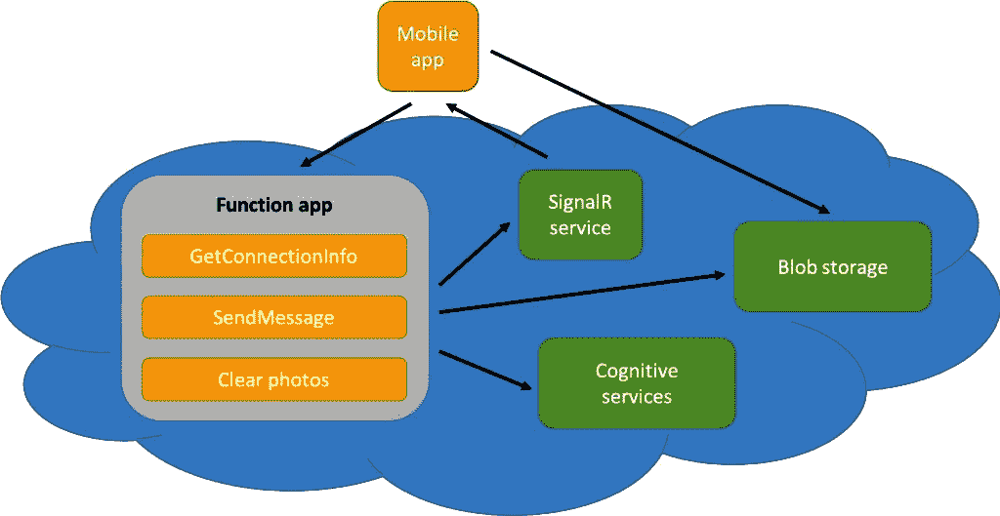

# 9

# 使用 Azure 服务设置游戏的后端

在本章中，我们将设置一个具有实时通信功能的游戏应用的后端。我们不仅将创建一个可以扩展以处理大量用户的后端，当用户数量减少时还可以缩小规模。为了构建这个后端，我们将使用基于**Microsoft Azure**服务的无服务器架构。

本章将涵盖以下主题：

+   理解不同的 Azure 无服务器服务

+   在 Microsoft Azure 中创建**SignalR**服务

+   使用 Azure Functions 作为**应用程序编程** **接口**（**API**）

# 技术要求

要能够完成此项目，您需要安装 Visual Studio for Mac 或 PC，以及必要的.NET MAUI 组件。有关如何设置您的环境的更多详细信息，请参阅*第一章*，*.NET MAUI 简介*。

您还需要一个 Azure 账户。如果您有 Visual Studio 订阅，则每月包含一定数量的 Azure 信用额度。要激活您的 Azure 福利，请访问[`my.visualstudio.com`](https://my.visualstudio.com)。

您还可以创建一个免费账户，在 12 个月内您可以免费使用所选服务。您将获得价值 200 美元的信用额度，用于探索任何 Azure 服务 30 天，您还可以随时使用免费服务。更多信息请参阅[`azure.microsoft.com/en-us/free/`](https://azure.microsoft.com/en-us/free/)。

如果您没有并且不想注册免费 Azure 账户，您可以使用本地开发工具在无需 Azure 的情况下运行服务。

您可以在本章中找到代码的完整源代码，请参阅[`github.com/PacktPublishing/MAUI-Projects-3rd-Edition`](https://github.com/PacktPublishing/MAUI-Projects-3rd-Edition)。

# 项目概述

本项目的主要目标将是设置游戏的后端。项目的大部分工作将是我们将在 Azure 门户中进行的配置。我们还将为 Azure 函数编写一些代码，以处理 SignalR 连接以及一些游戏逻辑和状态。SignalR 是一个使应用程序中的实时通信更简单的库。Azure SignalR 是一个使通过 SignalR 库连接多个客户端发送消息更简单的服务。SignalR 将在后面详细描述。将会有函数来返回有关 SignalR 连接的信息，管理匹配玩家进行对战，并将每位玩家的回合结果发布到 SignalR 服务。

下图显示了此应用程序架构的概述：



图 9.1 – 应用程序架构

完成此项目部分所需的时间估计约为 2 小时。

## 游戏概述

*Sticks & Stones* 是一款基于两个童年游戏概念结合而成的回合制社交游戏，即点线格和井字棋。游戏板布局为一个 9x9 的网格。每位玩家将轮流在盒子的旁边放置一根棍子，获得一分。如果一根棍子完成了一个盒子，那么玩家将获得该盒子的所有权，获得五分。当玩家在水平、垂直或对角线上拥有三个连续的盒子时，游戏结束。如果没有任何玩家能拥有三个连续的盒子，则游戏胜利者由得分最高的玩家决定。

为了保持应用和服务端相对简单，我们将消除大量的状态管理。当玩家打开应用时，他们需要连接到游戏服务。他们必须提供游戏标签或用户名和电子邮件地址。可选地，他们可以上传自己的照片作为头像。

一旦连接，玩家将看到连接到同一游戏服务的所有其他玩家的列表；这被称为大厅。玩家的状态，无论是“准备游戏”还是“正在比赛中”，将和玩家的游戏标签和头像一起显示。如果玩家不在比赛中，则还会有一个按钮挑战玩家进行比赛。

挑战玩家进行比赛将导致应用提示对手回应挑战，要么接受要么拒绝。如果对手接受挑战，那么两位玩家将被导航到一个新的游戏板，接受挑战的玩家将先走一步。所有其他玩家的大厅中，两位玩家的状态都将更新为“正在比赛中”。玩家将轮流选择放置一根棍子的位置。每次玩家放置一根棍子时，游戏板和分数将在两位玩家的设备上更新。当放置的棍子完成一个或多个方块时，玩家就“拥有”了那个方块，并在方块的中央放置一堆石头。当所有棍子都放置完毕，或者玩家拥有三个连续的石头时，游戏结束，玩家返回大厅，状态更新为“准备游戏”。

如果玩家在游戏中离开应用，那么他们将放弃比赛，剩余的对手将获得胜利，并返回大厅。

以下截图应能给您一个概念，了解应用完成后的样子，如第 *10* 章所述：


图 9.2 – 主游戏界面

# 理解不同的 Azure 无服务器服务

在我们开始构建无服务器架构的后端之前，我们需要定义**无服务器**的含义。在无服务器架构中，代码将在服务器上运行，但我们无需担心这一点；我们唯一需要关注的是构建我们的软件。我们让其他人处理所有与服务器相关的事情。我们不需要考虑服务器需要多少内存或**中央处理器**（**CPUs**），甚至不需要考虑我们需要多少服务器。当我们使用 Azure 中的服务时，Microsoft 会为我们处理这些事情。

## Azure SignalR 服务

**Azure SignalR 服务**是**Microsoft Azure**中的一项服务，用于服务器和客户端之间的实时通信。该服务将内容推送到客户端，而无需客户端轮询服务器以获取内容更新。SignalR 可用于多种类型的应用程序，包括移动应用程序、Web 应用程序和桌面应用程序。

SignalR 将使用**WebSockets**，如果该选项可用。如果不可用，SignalR 将使用其他通信技术，例如**服务器发送事件**（**SSEs**）或**长轮询**。SignalR 将检测哪种传输技术可用，并使用它，而无需开发者进行任何思考。

SignalR 可以在以下示例中使用：

+   **聊天应用程序**：当应用程序需要在新消息可用时从服务器获取更新时

+   **协作应用程序**：例如，会议应用程序或当多个设备上的用户共同编辑同一文档时

+   **多人游戏**：所有用户都需要实时了解其他用户的更新

+   **仪表板应用程序**：用户需要实时更新

## Azure Functions

Azure Functions 是 Microsoft Azure 的一项服务，允许我们以无服务器的方式运行代码。我们将部署称为**函数**的小块代码。函数以组的形式部署，称为**函数应用**。当我们创建函数应用时，我们需要选择是否希望它在消费计划或应用服务计划上运行。如果我们希望应用程序完全无服务器，则选择消费计划；而使用应用服务计划，我们必须指定服务的要求。使用消费计划，我们只需为函数的执行时间和使用的内存付费。应用服务计划的一个好处是，您可以将其配置为**始终开启**，这样就不会有任何冷启动，只要您不需要扩展到更多实例。消费计划的一个主要好处是，它将始终根据当时所需的资源进行扩展。

函数可以通过多种方式触发运行。两个例子是 `HttpTrigger` 和 `TimeTrigger`。`HttpTrigger` 将在 HTTP 请求调用函数时触发函数运行。使用 `TimeTrigger`，函数将按照我们指定的间隔运行。还有其他 Azure 服务的触发器。例如，我们可以配置一个函数在文件上传到 Azure Blob 存储时运行，当新消息发布到事件中心或服务总线时运行，或者当 Azure Cosmos DB 服务中的数据发生变化时运行。

现在我们已经了解了 Azure SignalR 服务和 Functions 提供的功能，让我们使用它们来构建我们的游戏后端。

# 构建无服务器后端

在本节中，我们将根据上一节中描述的服务设置后端。

## 创建 SignalR 服务

我们将首先设置 SignalR 服务。要创建此类服务，请按照以下步骤操作：

1.  访问 Azure 门户 [`portal.azure.com`](https://portal.azure.com)。

1.  创建一个新的资源。**SignalR 服务** 资源位于 **Web & 移动** 类别。

1.  在表单中为资源提供名称。

1.  选择您想用于此项目的订阅。

    我们建议您创建一个新的 **资源组** 并将其用于我们将为该项目创建的所有资源。我们想要一个资源组的原因是跟踪与该项目相关的资源更容易，并且也更容易一起删除所有资源。

1.  选择一个靠近您用户的位置。

1.  选择一个定价层。对于此项目，我们将使用 **免费** 层。我们始终可以使用 **免费** 层进行开发，然后扩展到可以处理更多连接的层。

1.  将 **服务模式** 设置为 **无服务器**。

1.  点击 **审查 + 创建** 在创建 SignalR 服务之前审查设置。

1.  点击 **创建** 创建存储账户。

参考以下截图查看上述信息：


图 9.3 – 创建 SignalR 服务

这就是我们设置 SignalR 服务所需做的所有事情。我们将在 Azure 门户中稍后返回以获取其连接字符串。

下一步是在存储账户中设置一个账户，我们可以将用户上传的图片存储在其中。

在创建计算机视觉服务后，我们现在可以创建 Azure Functions 服务，该服务将运行我们的游戏逻辑并使用 SignalR、Blob 存储和认知服务，这些服务我们刚刚创建。

## 使用 Azure Functions 作为 API

我们将为后端编写的所有代码都将使用 Azure Functions。我们将使用 Visual Studio 项目来编写、调试和部署我们的函数。在创建项目之前，我们必须设置和配置 Azure Functions 服务。然后，我们将实现连接玩家到游戏并提供客户端当前玩家列表的函数。接下来，我们将编写允许一个玩家向另一个玩家挑战游戏的函数。最后，我们将通过编写允许玩家轮流在棋盘上放置木棒的函数来结束。

让我们从创建 Azure Functions 服务开始。

### 创建 Azure Functions 服务

在我们编写任何代码之前，我们将创建函数应用。这将包含 Azure 门户中的函数。按照以下步骤操作：

1.  创建一个新的 **Function App** 资源。**Function App** 可在 **计算** 类别下找到。

1.  选择函数应用的订阅。

1.  选择函数应用的资源组。这应该与我们在本章中创建的其他资源相同。

1.  给函数应用起一个名字。这个名字也将是函数 URL 的起始部分。

1.  选择 **代码** 作为部署机制。

1.  将 **.NET** 作为函数的运行时堆栈。

1.  选择 **.NET 6.0 (长期支持)** 作为版本。

1.  选择离您的用户最近的位置。

1.  选择 **Windows** 作为 **操作系统**。

1.  我们将使用 **消费** 计划作为我们的 **托管** 计划，因此我们只为使用的内容付费。**Function app** 将根据我们的需求进行扩展和缩减 – 而无需我们考虑 – 如果我们选择 **消费** 计划。

    参考以下截图查看上述信息：


图 9.4 – 创建 Function App – 基础

1.  点击 **审查 + 创建** 在创建函数应用之前审查设置。

1.  点击 **创建** 以创建函数应用。

### 创建项目

如果您愿意，您可以在 Azure 门户中创建函数。我更喜欢使用 Visual Studio，因为代码编辑体验更好，并且可以使用源代码控制。对于此项目，我们需要在我们的解决方案中创建和配置单独的项目 – 一个 Azure Functions 项目和一个用于函数和将在第十章中构建的 .NET MAUI 应用之间共享代码的类库。要创建和配置项目，请按照以下步骤操作：

1.  在 Visual Studio 中创建一个新项目。

1.  在搜索字段中输入 `function` 以找到 Azure Functions 的模板。

1.  点击以下截图所示的 **Azure Functions** 模板以继续：


图 9.5 – 创建新项目

1.  将项目命名为 `SticksAndStones.Functions`。

1.  将解决方案命名为 `SticksAndStones.Functions`，如以下截图所示，然后点击 **下一步**：


图 9.6 – 配置您的新的项目

下一步是创建我们的第一个函数，如下所示：

1.  在对话框顶部选择 **.Net 6.0 (长期支持**) 作为 **函数工作器**。

1.  将 **Http 触发器** 作为我们第一个函数的触发器。

1.  点击 **创建** 以继续；我们的函数项目将被创建。

参考以下截图查看上述信息：


图 9.7 – 创建新的 Azure Functions 应用程序 – 其他信息

我们的第一个函数将返回 SignalR 服务的连接信息。为此，我们需要通过向 SignalR 服务添加连接字符串来连接函数，如下所示：

1.  前往 Azure 门户中的 **SignalR 服务** 资源。

1.  切换到左侧的 **键** 选项卡并复制连接字符串。

1.  将 `AzureSignalRConnectionString` 作为设置的名称。

1.  将连接字符串添加到 Visual Studio 项目中的 `local.settings.json` 文件中，以便能够在开发机上本地运行函数，如下面的代码块所示：

    ```cs
    {  "IsEncrypted": false,  "Values": {    "AzureWebJobsStorage": "UseDevelopmentStorage=true",    "FUNCTIONS_WORKER_RUNTIME": "dotnet",    "AzureSignalRConnectionString": "SticksAndStones.Functions project, and add the code listed previously with your connection string.
    ```

接下来，在 `SticksAndStones.Functions` 项目中，我们需要引用 `Microsoft.Azure.WebJobs.Extensions.SignalRService` NuGet 包。此包包含我们与 SignalR 服务通信所需的类。如果在安装此包时发生错误并且您无法安装包，请确保项目中所有其他包都是最新版本，然后重试。

我们需要做的最后一个更改是调整自动命名空间生成。默认情况下，默认命名空间是项目的名称，这意味着本项目中所有类型都将有一个根命名空间 `SticksAndStones.Functions`。我们不需要 `Functions` 这部分，所以让我们将其删除：

1.  在 **解决方案资源管理器** 中右键单击 `SticksAndStones.Functions` 项目并选择 **属性**。

1.  在 `默认命名空间`。

1.  修改 `$(MSBuildProjectName.Split(".")[0].Replace(" ", "``_"))`。

    这将根据点号 `. ` 分割项目名称，仅使用第一部分并将任何空格替换为下划线。

现在，当我们创建一个新的类时，命名空间将仅以 `SticksAndStones` 开头。是时候创建一个共享项目，以便我们可以在 .NET MAUI 客户端和 Azure Functions 服务中重用代码了。

共享代码将放入一个类库项目中。要创建项目并将其从 `SticksAndStones.Functions` 项目中引用，请按照以下步骤操作：

1.  在 **解决方案资源管理器** 中右键单击 `SticksAndStones` 解决方案节点并选择 **添加**，然后 **新建项目**。

1.  在如图所示的 **添加新项目** 对话框中搜索 **类库**。


图 9.8 – 添加新项目

1.  选择 **类库** 模板，然后点击 **下一步**。

1.  在`StickAndStones.Shared`命名空间中，如图下所示，然后点击**下一步**：


图 9.9 – 配置您的新的项目

1.  在**附加信息**对话框中，选择**.NET 6.0 (长期支持**)框架项目，然后点击**创建**。

1.  删除由项目模板创建的`Class1.cs`文件。

1.  在`SticksAndStones.Functions`项目中添加对`SticksAndStones.Shared`的引用。

正如我们对`SticksAndStones.Functions`项目所做的那样，我们将通过以下步骤更改默认命名空间：

1.  在**解决方案资源管理器**中右键单击`SticksAndStones.Functions`项目并选择**属性**。

1.  在**默认命名空间**。

1.  修改`$(MSBuildProjectName.Split(".")[0].Replace(" ", "``_"))`。

    这将根据`.`分割项目名称，只使用第一部分，并将任何空格替换为下划线。

现在，我们可以编写返回连接信息的函数的代码。

### 将玩家连接到游戏

游戏的第一步是建立连接。建立连接会将您添加到可用玩家的列表中，这样您或其他玩家就可以加入游戏。正如我们在本书中的其他项目中做的那样，首先，我们将创建存储或在不同服务之间传输数据的所需模型。然后，我们将实现`Connect`函数本身。

### 创建模型

我们需要在应用的生命周期中调用几个函数，这些函数位于第十章。第一个是建立与游戏服务的连接，称为`Connect`。本质上，这告诉服务有一个新的或现有的玩家正在活跃并准备游戏。`Connect`函数将注册玩家详细信息并返回连接字符串到 SignalR 中心，以便应用可以接收消息。在完成函数之前，我们需要一些模型。需要一个`Player`模型，一个`Game`模型，以及帮助在 Azure 函数和 SignalR 服务之间传递数据的模型。

在我们深入创建库之前，我们应该讨论本章中使用的命名约定。有一个命名约定将使确定类的使用方式变得更容易。当应用调用任何 Azure 函数时，如果需要发送任何数据，它将使用后缀为`-Request`的类来发送，任何返回数据的 Azure 函数将使用以`-Response`结尾的类来发送。对于通过 SignalR 中心发送的任何数据，我们将使用带有`EventArgs`后缀的类。这些类将包含对我们实际模型的引用，仅作为数据的容器。拥有这些类意味着您可以修改发送或接收的数据，而不会影响模型本身。

由于这是一个双人对战游戏，我们需要跟踪一些状态信息，以便我们知道谁在线以及正在进行的比赛。对于这个项目，我们将保持状态简单，不涉及实际的数据库，但我们将仍然使用 Entity Framework 来为我们完成大部分工作。

现在我们已经创建并引用了新的项目，并且我们已经建立了命名约定，我们可以开始创建所需的类。我们将从两个模型 `Player` 和 `Match` 开始。`Player` 代表每个人，而 `Game` 是两个 `Player` 实例之间的比赛以及游戏状态。要创建这两个模型，请按照以下步骤操作：

1.  在 `SticksAndStones.Shared` 项目中创建一个新的文件夹名为 `Models`。

1.  在 `Models` 文件夹中创建一个新的类名为 `Player`。

1.  在 `Player` 类中创建一个名为 `Id` 的 `public` 属性，类型为 `Guid`，并将其初始化为 `Guid.Empty`。

1.  创建另一个名为 `GamerTag` 的 `public` 属性，类型为 `string`，并将其初始化为 `string.Empty`。

1.  创建一个名为 `GameId` 的 `public` 属性，类型为 `Guid`，并将其初始化为 `Guid.Empty`。

1.  您的 `Player` 类现在应该类似于以下代码块：

    ```cs
    namespace SticksAndStones.Models;public class Player {    public Guid Id { get; set; } = Guid.Empty;    public string GamerTag { get; set; } = string.Empty;    public string EmailAddress { get; set; } = string.Empty;    public Guid MatchId { get; set; } = Guid.Empty;}
    ```

我们的模型类将使用 `Id` 字段作为唯一标识符，以便我们可以单独定位每个对象。它将用于定位特定玩家进行消息传递以及将 `Match` 实例与 `Player` 实例相关联。`GamerTag` 将是玩家的显示名称，而 `EmailAddress` 是我们关联离开应用程序并再次登录的玩家的方式。最后，`MatchId` 属性将跟踪玩家是否正在积极进行游戏。

现在我们已经定义了 `Player` 类，是时候定义 `Match` 类了：

1.  在 `Models` 文件夹中创建一个新的类名为 `Match`。

1.  在 `Game` 类中创建一个名为 `Id` 的 `public` 属性，类型为 `Guid`，并将其初始化为 `Guid.Empty`。

1.  创建一个名为 `PlayerOneId` 的 `public` 属性，类型为 `Guid`。

1.  添加一个名为 `PlayerOneScore` 的 `public` 属性，类型为 `int`。

1.  创建另一个名为 `PlayerTwoId` 的 `public` 属性，类型为 `Guid`。

1.  添加一个名为 `PlayerTwoScore` 的 `public` 属性，类型为 `int`。

1.  创建一个名为 `NextPlayerId` 的 `public` 属性，类型为 `Guid`。

1.  创建一个名为 `Sticks` 的 `public` 属性，类型为 `List<int>`，并将其初始化为 `new List<int>(24)`。

1.  创建一个名为 `Stones` 的 `public` 属性，类型为 `List<int>`，并将其初始化为 `new List<int>(9)`。

1.  创建一个名为 `Scores` 的 `public` 属性，类型为 `List<int>`，并将其初始化为 `new List<int>(2)`。

1.  创建一个名为 `Completed` 的 `public` 属性，类型为 `bool`，并将其初始化为 `false`。

1.  创建一个名为 `WinnerId` 的 `public` 属性，类型为 `Guid`，并将其初始化为 `Guid.Empty`。

1.  添加一个名为 `New` 的 `public` `static` 方法，该方法接受两个参数，参数类型均为 `Guid`，分别命名为 `challengerId` 和 `opponentId`。该方法返回一个 `Game` 类型的对象。该方法应返回一个新的 `Game` 实例，并将 `Id` 属性设置为 `Guid.NewGuid()`，`PlayerOneId` 和 `NextPlayerId` 设置为 `opponentId`，`PlayerTwoId` 设置为 `challengerId`。

1.  `Player` 类现在应类似于以下代码块：

    ```cs
    using System;using System.Collections.Generic;namespace SticksAndStones.Models;public class Match {    public Guid Id { get; set; } = Guid.Empty;    public Guid PlayerOneId { get; set; }    public int PlayerOneScore { get; set; }    public Guid PlayerTwoId { get; set; }    public int PlayerTwoScore { get; set; }    public Guid NextPlayerId { get; set; }    public List<int> Sticks {get; set; } = new(new int[24]);    public List<int> Stones {get; set;} = new(new int[9]);    public List<int> Score = new(new int[2]);    public bool Completed { get; set; } = false;    public Guid WinnerId { get; set; } = Guid.Empty;    public static Game New(Guid challengerId, Guid opponentId)    {        return new()        {            Id = Guid.NewGuid(),            PlayerOne = opponent,            PlayerTwo = challenger,            NextPlayer = opponent         };    }}
    ```

`Player` 和 `Match` 类将用于客户端和服务器之间的数据存储和数据传输。在我们创建模型之前，让我们使用 Entity Framework 添加数据库。执行以下步骤以添加对 Entity Framework 的引用并创建数据库上下文，以便 `Player` 和 `Match` 类可以存储在 `InMemory` 数据库中：

1.  将 `Microsoft.EntityFrameworkCore.InMemory` 包引用添加到 `SticksAndStones.Functions` 项目中。

1.  在 `SticksAndStones.Functions` 项目中创建一个名为 `Repository` 的新文件夹。

1.  在 `Repository` 文件夹中创建一个名为 `GameDbContext` 的类。

1.  修改类的构造函数以设置数据库选项：

    ```cs
    public GameDbContext(DbContextOptions<GameDbContext> options) : base(options) { }
    ```

1.  添加一个公共 `Players` 属性以存储 `Player` 对象：

    ```cs
    public DbSet<Player> Players { get; set; }
    ```

1.  添加一个公共 `Matches` 属性以存储 `Match` 对象：

    ```cs
    public DbSet<Match Matches { get; set; }
    ```

1.  在 `OnModelCreating` 方法中添加一个重写：

    ```cs
    protected override void OnModelCreating(ModelBuilder modelBuilder){}
    ```

    此方法是我们指定 Entity Framework 如何在关系数据库中将我们的类关联在一起的地方。

1.  首先在 `OnModelCreating` 方法中声明每个类的标识符，如下所示：

    ```cs
    modelBuilder.Entity<Player>()    .HasKey<Player>(p => p.Id);modelBuilder.Entity<Match>()    .HasKey<Match>(g => g.Id);base.OnModelCreating(modelBuilder);
    ```

1.  Entity Framework 无法正确处理我们的 `List<int>` 属性。它假设由于它是一个列表，它们是相关实例。为了在 Entity Framework 中更改默认行为，我们可以使用以下突出显示的代码：

    ```cs
    modelBuilder.Entity<Game>()    .HasKey(g => g.Id);modelBuilder.Entity<Match>()    .Property(p => p.Sticks)    .HasConversion(        toDb => string.Join(",", toDb),        fromDb => fromDb.Split(',', StringSplitOptions.None).Select(int.Parse).ToList() ?? new(new int[24]));
    modelBuilder.Entity<Match>()    .Property(p => p.Stones)    .HasConversion(        toDb => string.Join(",", toDb),        fromDb => fromDb.Split(',', StringSplitOptions.None).Select(int.Parse).ToList() ?? new(new int[9]));
    base.OnModelCreating(modelBuilder);
    ```

    每个块所做的是定义属性的转换。转换有两个 Lambda 表达式 - 一个是从 C# 对象到数据库的转换，另一个是从数据库到 C# 对象的转换。对于我们的 `List<int>` 属性，我们希望将 C# `List<int>` 转换为逗号分隔的整数字符串，然后将逗号分隔的整数字符串转换为 `List<int>`。

    `toDB` 是 `List<int>` 的一个实例，因此要将它转换为逗号分隔的数字列表，我们可以使用 `String.Join` 函数将列表中的每个元素与它们之间的 `,` 连接起来。

    `fromDb` 是一个包含逗号分隔的数字的 `string` 值。要将该值转换为 `List<int>`，我们可以使用 `String.Split` 方法来隔离每个数字，然后将每个数字传递给 `Int.Parse` 方法以将数字转换为 `int` 值。`Select` 将生成 `IEnumberable<int>`；我们可以使用 `ToList` 将其转换为 `List<int>`。如果它没有创建列表，我们可以提供一个默认值列表，就像我们在 `Match` 类本身中所做的那样。

要初始化 Entity Framework 以使用内存数据库，我们需要创建一个 `Startup` 方法。要创建该方法并初始化数据库，请按照以下步骤操作：

1.  在 `SticksAndStones.Functions` 项目的根目录中创建一个名为 `Startup` 的新类。

1.  修改以下突出显示的代码的类文件：

    ```cs
    using Microsoft.Azure.Functions.Extensions.DependencyInjection;using Microsoft.EntityFrameworkCore;using Microsoft.Extensions.DependencyInjection;using SticksAndStones.Repository;[assembly: FunctionsStartup(typeof(SticksAndStones.Startup))]
    namespace SticksAndStones;public class Startup : FunctionsStartup {    public override void Configure(IFunctionsHostBuilder builder)    {        string SqlConnection = Environment.GetEnvironmentVariable("SqlConnectionString");        builder.Services.AddDbContextFactory<GameDbContext>(            options =>            {                options.UseInMemoryDatabase("SticksAndStones");            });    }}
    ```

当 `SticksAndStones.Functions` 项目在运行时加载时，将调用 `Startup` 方法。然后，它将为之前创建的 `GameDbContext` 类创建一个工厂以创建其实例，并使用内存数据库对其进行初始化。

这就完成了我们对 Entity Framework 和基本模型`Player`和`Game`的设置。我们还需要一个最终模型，将 SignalR 连接信息发送到客户端。要创建此模型，请按照以下步骤操作：

1.  在`Models`文件夹中创建一个名为`ConnectionInfo`的新类。

1.  添加一个名为`Url`的公共属性，它是一个`string`值。

1.  添加另一个名为`AccessToken`的公共属性，它也是一个`string`值。

1.  `ConnectionInfo`类应该看起来像这样：

    ```cs
    namespace SticksAndStones.Models;public class ConnectionInfo {    public string Url { get; set; }    public string AccessToken { get; set; }}
    ```

现在模型已经创建，我们可以开始创建`Connect`函数。

#### 创建 Connect 函数

我们将从一个连接我们的玩家到游戏的函数开始，这个函数恰当地命名为`Connect`。这个函数将期望在请求体中发送一个部分填充的`Player`对象。该函数将返回一个完全填充的`Player`对象、当前连接的玩家列表以及客户端连接到 SignalR 中心所需连接信息。为了使输入和输出更清晰，我们将它们包装起来。

要创建输入和输出类，请按照以下步骤操作：

1.  在`Messages`文件夹中创建一个名为`ConnectMessages`的新类。

1.  修改`ConnectMessages.cs`使其看起来像这样：

    ```cs
    using SticksAndStones.Models;namespace SticksAndStones.Messages;public record struct ConnectRequest(Player Player);public record struct ConnectResponse(Player Player, List<Player> Players, ConnectionInfo ConnectionInfo);
    ```

对于所有将在客户端和 Azure 函数或 SignalR 服务之间传输数据的类，我们将使用`record`语法。由于这些类没有任何实际功能，它们唯一的目的就是包含我们的模型。通过使用`record`结构体，我们还提高了我们函数的内存使用效率，因为新实例将在本地内存中创建，而不是全局内存中，这需要额外的处理。`record`语法将构造函数和属性声明合并为单行代码，消除了大量无实际益处的样板代码。

你会注意到我们正在使用我们在*创建模型*部分讨论的约定。后缀为`Request`或`Response`的类被用作任何 Azure 函数的输入和输出。对于通过 SignalR 服务发送的任何数据，该类将使用后缀为`EventArgs`。

当新客户端连接时，将通过 SignalR 服务向其他用户发送消息，以表明他们已连接。此消息还将用于通知玩家开始或结束游戏。要创建此类消息，请按照以下步骤操作：

1.  在`SticksAndStones.Shared`项目的`Messages`文件夹中创建一个名为`PlayerUpdatedEventArgs`的新类。

1.  修改该类，使其成为一个具有单个`Player`参数的`record`结构体，如下面的代码片段所示：

    ```cs
    using SticksAndStones.Models;namespace SticksAndStones.Messages;public record struct PlayerUpdatedEventArgs(Player Player);
    ```

现在我们已经创建了`Connect`函数所需的架构，我们可以开始编写函数本身：

1.  创建一个名为`Hubs`的新文件夹。我们将把我们的服务类放入这个文件夹。

1.  将`Function1.cs`文件移动到`Hubs`文件夹。

1.  对于移动文件和调整命名空间的下两个提示，回答**是**。

1.  将默认的 `Function1.cs` 文件重命名为 `GameHub.cs`，并在重命名提示中点击 **是**。

1.  打开 `GameHub.cs` 文件，将类名 `GameHub` 重命名为 `GameHub`，将 `internal static` 访问修饰符替换为 `public`，并从 `ServerlessHub` 基类派生，如以下突出显示所示：

    ```cs
    public class GameHub : ServerlessHub
    {    [FunctionName("Function1")]    public static async Task<IActionResult> Run(    [HttpTrigger(AuthorizationLevel.Function, "get", "post", Route = null)] HttpRequest req,    ILogger log)    {        log.LogInformation("C# HTTP trigger function processed a request.");        string name = req.Query["name"];        string requestBody = await new StreamReader(req.Body).ReadToEndAsync();        dynamic data = JsonConvert.DeserializeObject(requestBody);        name = name ?? data?.name;        string responseMessage = string.IsNullOrEmpty(name)        ? "This HTTP triggered function executed successfully. Pass a name in the query string or in the request body for a personalized response."                : $"Hello, {name}. This HTTP triggered function executed successfully.";        return new OkObjectResult(responseMessage);    }}
    ```

1.  将默认的 `Function1` 函数重命名为 `Connect`，同时移除 `static` 修饰符。方法签名应如下所示的高亮代码片段：

    ```cs
    [FunctionName("HttpTrigger attribute indicates that this function is called by using the HTTP protocol and not by some other means, such as a SignalR message or a timer. The function is only called using the HTTP POST method, not GET.
    ```

1.  要向连接到 SignalR 中心的所有客户端发送消息，我们需要另一个 SignalR 绑定。这次是一个 `HubName`，类型为 `IAsyncCollector<SignalRMessage>`，如下所示：

    ```cs
    [HttpTrigger(AuthorizationLevel.Anonymous, "post", Route = null)] HttpRequest req,[SignalRConnectionInfo(HubName = "GameHub")] SignalRConnectionInfo connectionInfo,[SignalR(HubName = "GameHub")] IAsyncCollector<SignalRMessage> signalRMessages,ILogger log)
    ```

删除 `Connect` 方法的所有内容，并按照以下步骤实现功能：

1.  在 Azure Functions 中，日志记录非常重要，因为它有助于在生产环境中调试。因此，让我们添加一个 `log` 消息：

    ```cs
    log.LogInformation("A new client is requesting connection");
    ```

1.  客户端，一个 .NET MAUI 应用，将在 HTTP 请求体中发送 `ConnectRequest` 作为 JSON。要从请求体中获取 `ConnectRequest` 的实例，请使用以下代码行：

    ```cs
    var result = await JsonSerializer.DeserializeAsync<ConnectRequest>(req.Body, jsonOptions);var newPlayer = result.Player;
    ```

    您将需要在命名空间声明中添加 `using System.Text.Json`。这使用 `System.Text.Json.JsonSerializer` 类来读取请求体的内容，并从中创建一个 `ConnectRequest` 对象。它使用 `jsonOptions` 正确反序列化对象。

1.  现在，我们需要定义 `jsonOptions` 字段。在 `Connect` 方法上方添加以下代码行：

    ```cs
    internal class GameHub : ServerlessHub {    private readonly JsonSerializerOptions jsonOptions = new(JsonSerializerDefaults.Web);
        [FunctionName("Connect")]    public async Task<IActionResult> Connect(
    ```

    `JsonSerializerDefaults.Web` 确保了 JSON 格式正确，以便 Azure Functions 和 SignalR 服务可以正确地序列化和反序列化对象。主要将强制执行以下操作：

    +   属性名称不区分大小写

    +   所有属性和对象名称都将格式化为 camelCase

    +   数字可以加引号

1.  如果我们收到不良玩家数据，向客户端返回 `ArgumentException`，如下所示：

    ```cs
    if (newPlayer is null){    var error = new ArgumentException("No player data.", "Player");    log.LogError(error, "Failure to deserialize arguments");    return new BadRequestObjectResult(error);}if (string.IsNullOrEmpty(newPlayer.GamerTag)){    var error = new ArgumentException("A GamerTag is required for all players.", "GamerTag");    log.LogError(error, "Invalid value for GamerTag");    return new BadRequestObjectResult(error);}if (string.IsNullOrEmpty(newPlayer.EmailAddress)){    var error = new ArgumentException("An Email Address is required for all players.", "EmailAddress");    log.LogError(error, "Invalid value for EmailAddress");    return new BadRequestObjectResult(error);}
    ```

    由于函数的返回类型是 `IActionResult`，我们无法简单地返回自定义对象。相反，我们需要创建一个派生或实现 `IActionResult` 的对象，并传入我们的结果。在错误的情况下，我们将使用 `BadRequestObjectResult`，它将在构造函数中接受 `Exception` 作为参数。`BadRequestObjectResult` 将 HTTP 状态码设置为 `400`，表示错误。然后，客户端可以检查此状态码，以确定在解析响应体之前请求是否成功。

1.  下几个步骤将需要我们查询数据库，因此我们需要将数据库上下文工厂添加到类中。添加 `Microsoft.EntityFrameworkCore` 命名空间声明：

    ```cs
    using Microsoft.Azure.WebJobs.Extensions.SignalRService;private field to store the context factory and a constructor with an argument that will be fulfilled by dependency injection, as follows:

    ```

    private readonly JsonSerializerOptions jsonOptions = new JsonSerializerOptions(JsonSerializerDefaults.Web); private readonly IDbContextFactory<GameDbContext> dbContextFactory;public GameHub(IDbContextFactory<GameDbContext> dbcontext){    contextFactory = dbContextFactory;}

    [FunctionName("Connect")]public async Task<IActionResult> Connect(

    ```cs

    ```

1.  添加 `System.Linq` 的命名空间声明以允许使用 **Linq** 查询：

    ```cs
    using System;GamerTag in the database to ensure it isn’t in use already by another player, as follows:

    ```

    使用 var context = contextFactory.CreateDbContext();log.LogInformation("Checking for GameTag usage");var gamerTagInUse = (from p in context.Players where string.Equals(p.GamerTag, newPlayer.GamerTag, StringComparison.InvariantCultureIgnoreCase) && !string.Equals(p.EmailAddress, newPlayer.EmailAddress, StringComparison.OrdinalIgnoreCase) select p).Any();if (gamerTagInUse){    var error = new ArgumentException($"The GamerTag {newPlayer.GamerTag} is in use, please choose another.", "GamerTag");    log.LogError(error, "GamerTag in use.");    return new BadRequestObjectResult(error);}

    ```cs

    The first step is to get a new database context from the factory. The `Players` list from the database context to compare `GamerTag` value to other GamerTagsvalues. However, we want to exclude a result if it matches `EmailAddress` since that would indicate the records are identical, and this user is just signing back in again.
    ```

1.  现在，查询 `Players` 数据集以找到匹配的电子邮件的玩家：

    ```cs
        log.LogInformation("Locating Player record.");    var thisPlayer = (from p in context.Players where string.Equals(p.EmailAddress, newPlayer.EmailAddress, StringComparison.OrdinalIgnoreCase) select p).FirstOrDefault();
    ```

1.  如果在 `Players` 中没有匹配的 `Player`，则将 `Player` 添加到数据集中：

    ```cs
    if (thisPlayer is null){    log.LogInformation("Player not found, creating.");    thisPlayer = newPlayer;    thisPlayer.Id = Guid.NewGuid();    context.Add(thisPlayer);    await context.SaveChangesAsync();}
    ```

    我们为 `Player` 对象分配一个新的 `Guid`，以便每个 `Player` 都有一个唯一的标识符。这也可以通过 Entity Framework 来完成；然而，我们将在这里处理它。然后使用上下文添加 `Player` 实例，以便跟踪任何更改。之后，`SaveChangesAsync` 将提交所有更改到数据库。

1.  在 `Connect` 函数的下一步中，我们需要向所有已连接的玩家发送一条消息，告知他们有新玩家加入。我们可以使用 `SendAsync` 方法来完成此操作。`SendAsync` 方法接受两个参数 - 一个作为 `string` 值的方法名称，该消息旨在为其发送，以及一个作为 `object` 值的消息。为了确保我们发送和接收正确的方法，我们将创建一个常量值。在 `SticksAndStones.Shared` 项目的根目录下创建一个名为 `Constants` 的新类，然后更新它，使其看起来像这样：

    ```cs
    namespace SticksAndStones;public static class Constants {    public static class Events     {        public static readonly string PlayerUpdated = nameof(PlayerUpdated);    }}
    ```

1.  现在，我们可以通知其他已连接的玩家有新玩家连接。打开 `GameHub` 类，并在 `Connect` 方法的末尾添加以下代码：

    ```cs
        log.LogInformation("Notifying connected players of new player.");    await Clients.All.SendAsync(Constants.Events.PlayerUpdated, new PlayerUpdatedEventArgs(thisPlayer));
    ```

    此代码使用 `ServerlessHub` 基类中 `Clients.All` 集合的 `SendAsync` 方法向所有已连接的客户端发送消息。我们传递 `Constants.Events.PlayerUpdated`，即 `"PlayerUpdated"` 字符串，作为方法名称。作为参数，我们发送包裹在 `PlayerUpdatedEventArgs` 中的 `Player` 实例。我们将在 *第十章* 中处理此消息。

1.  现在，从数据库中获取可用的玩家集合以发送回客户端：

    ```cs
    // Get the set of available players log.LogInformation("Getting the set of available players.");    var players = (from player in context.Players         where player.Id != thisPlayer.Id         select player).ToList();
    ```

    使用 Linq，我们可以轻松查询 `Players` 集合并排除当前玩家。

1.  在这个阶段，我们需要从 SignalR 服务中获取 SignalR 连接信息。这可以通过调用 `ServerlessHub` 基类中的 `NegotiateAsync` 方法来实现。此外，为了能够向单个用户发送定向消息，我们将连接的 `UserId` 值设置为玩家 ID 值。添加以下代码行以配置和检索 SignalR 连接信息：

    ```cs
    var connectionInfo = await NegotiateAsync(new NegotiationOptions() { UserId = thisPlayer.Id.ToString() });
    ```

1.  现在我们已经拥有了返回给客户端所需的所有信息，我们可以构建`ConnectResponse`对象。我们将使用`ConnectionInfo`类并将`SignalRConnection`属性映射到它，这样我们就可以避免在共享库中引用 SignalR 服务：

    ```cs
    log.LogInformation("Creating response.");var connectResponse = new ConnectResponse(){    Player = thisPlayer,    Players = players,    ConnectionInfo = new Models.ConnectionInfo { Url = connectionInfo.Url, AccessToken = connectionInfo.AccessToken }};
    ```

1.  一旦`ConnectResponse`被初始化，我们可以通过使用`OkObjectResult`来返回它，这将使用 HTTP 响应代码**200 OK**：

    ```cs
    log.LogInformation("Sending response.");return new OkObjectResult(connectResponse);
    ```

要测试我们刚刚编写的函数，你可以在 Visual Studio 中按下*F5*后，使用 PowerShell 命令提示符和以下命令：

```cs
Invoke-WebRequest -Headers @{ ContentType = "application/json" } -Uri http://localhost:7024/api/Connect -Method Post -Body ''
```

在`Uri`参数中使用的端口号可能因项目而异。你可以通过打开`SticksAndStones.Functions`项目的`Properties`文件夹中的`launchSettings.json`文件来获取正确的端口号。端口号设置在`commandLineArgs`属性中，如下所示：

```cs
{  "profiles": {    "SticksAndStones.Functions": {      "commandName": "Project",      "commandLineArgs": "--port Uri parameter after localhost:.
In the `Body` parameter, you can add the JSON that the command is expecting. For the `Connect` function, this would be `ConnectRequest` and would look like this:

```

'{     "player": {        "gamerTag": "NewPlayer2",        "emailAddress": "newplayer2@gmail.com",    }}'

```cs

 The full command will look like this:

```

Invoke-WebRequest -Headers @{ ContentType = "application/json" } -Uri http://localhost:7024/api/Connect -Method Post -Body '{     "player": {        "gamerTag": "NewPlayer2",        "emailAddress": "newplayer2@gmail.com",    }}'

```cs

 Go ahead and try out various versions of the command to see how the function reacts.
Now that we can connect players to the game server, let’s look at what is needed for the lobby.
Refreshing the lobby
In the Sticks and Stones App, which you will create in Chapter 10, once a player has connected, they will move to the lobby page. Initially, the lobby will be populated from the list of players sent in the response from the `Connect` function. Additionally, as each player connects, the lobby will be updated through a SignalR event.
But we all get impatient and want a way to refresh the list immediately. So, the lobby page has a way to refresh the list; to do so, it will call the `GetAllPlayers` function.
Let’s start by creating the messages needed for `GetAllPlayers`.
Creating the messages
`GetAllPlayers` takes no parameters, so we only need to create the `GetAllPlayersResponse` type. Follow these steps to add `GetAllPlayersResponse`:

1.  In the `SticksAndStones.Shared` project, create a new file named `GetAllPlayers` **Messages.cs** in the `Messages` folder.
2.  Modify the contents of the file so that it looks as follows:

    ```

    using SticksAndStones.Models;namespace SticksAndStones.Messages;public record struct GetAllPlayersResponse(List<Player> Players);

    ```cs

With the messages created, we can move on to the `GetAllPlayers` function.
Getting all the players
`GetAllPlayers` is called using the `Http` `GET` method and has an optional parameter that is passed through `QueryString` using the `id` key. The optional parameter is used to exclude a specific `id` from the returned list. This makes it so that the app can send the current player’s `id` and not have it returned in the list. To create the `GetAllPlayers` function, follow these steps:

1.  In the `GameHub` class, after the `Connect` method, add the following method declaration:

    ```

    [FunctionName("GetAllPlayers")]public IActionResult GetAllPlayers([HttpTrigger(AuthorizationLevel.Function, "get", Route = "Players/GetAll")] HttpRequest req,ILogger log){}

    ```cs

    Not much is new here other than using `"get"` instead of `"post"` for the `Http` method, and `Route` is set to `"Players/GetAll"`, which would make the URL for the function `http://localhost:7024/api/Players/GetAll`.

     2.  In the method, we will process the `id` option parameter. To do so, add the following code:

    ```

    // 排除提供的 playerId Guid playerId = Guid.Empty;if (req.Query.ContainsKey("id")){    string id = req.Query["id"];    if (!string.IsNullOrEmpty(id))    {        playerId = new Guid(id);    }}

    ```cs

    In this code, we check for the existence of a key named `id`. If it exists, then its value is retrieved and converted into a `Guid` value and assigned to the `playerId` variable.

     3.  Next, we can query the database for all players, and exclude `player.Id` using the following code:

    ```

    using var context = contextFactory.CreateDbContext();// 获取可用玩家的集合 log.LogInformation("获取可用玩家的集合.");var players = (from player in context.Players                where player.Id != playerId                select player).ToList();

    ```cs

     4.  Finally, return `OkObjectResult` with a new `GetAllPlayersResponse` object initialized with the list of `players`:

    ```

    return new OkObjectResult(new GetAllPlayersResponse(players));

    ```cs

Now that we can refresh the lobby with a list of all the players, it’s time to match them up for a game.
Challenging another player to a game
To test your skills at this game, you’ll need an opponent – someone who would also like to test their skills against yours. This section will build the functionality needed in the `SticksAndStones.Function` project to have one player – the challenger – challenge another player – the opponent – to a game. The opponent has the option to accept the challenge or deny it. We will also handle the case where the opponent does not respond since they might have put their phone down; this is an edge case.
The interactions in this use case can get tricky, so let’s review the following diagram to get a better understanding of what we are building:


Figure 9.10 – Challenge diagram
The process starts with a user interaction that results in the client making an HTTP request to the `GameHub` instance via the `IssueChallenge` function. The client will pass the challenger and opponent details when making the HTTP call. `IssueChallenge` will create an `Id` value to track this process. `IssueChallenge` will then send a direct message to the opponent via the SignalR hub using the `SendAsync` method. The message will include the `Id` value that was created earlier, the challenger, and the opponent details as an instance of `ChallengeEventArgs`. The opponent’s client will receive the message via an `On<ChallengeEventArgs>` event handler. The opponent will then have the choice of accepting or declining the challenge. The response is sent back to the `GameHub` instance using the `AcknowledgeChallenge` function. The `Id` value of the challenge is sent along with `ChallengeResponse`, either `Accept` or `Decline`. A third possibility is `Timeout`. If the opponent never responds, then after a certain amount of time has passed, `Challenge` will `Timeout`. In either event, the result is then returned to the challenger using the response of the `IssueChallenge` call.
Let’s get started by defining the messages.
Creating the messages and models
We will start with `IssueChallengeRequest` since that is the first message that is being sent. Follow these steps to create the class:

1.  In the `SticksAndStones.Shared` project, create a new file named `ChallengeMessages.cs` under the `Message` folder.
2.  Modify the file so that it looks as follows:

    ```

    using SticksAndStones.Models;using System;namespace SticksAndStones.Messages;public record struct IssueChallengeRequest(Player Challenger, Player Opponent);

    ```cs

As we have in the `Connect` function, we use a `record` struct to eliminate a lot of the boilerplate code needed to define a `struct` value. Our message only needs two `Player` objects – `Challenger` and `Opponent`. The client will have both available when it makes the call to this function. `Challenger` will be the client making the call to `IssueChallenge` and `Opponent` will be the opposing side.
The `IssueChallenge` function will return `IssueChallengeResponse`. This `Issue` **ChallengeResponse** will have just one field, `Response`, which will be an `enum` value called `ChallengeResponse`. Follow these steps to create `ChallengeResponse`:

1.  In the `SticksAndStones.Shared` project, in the `Models` folder, create a new `enum` named `ChallengeResponse`.
2.  Add the following values to the `enum` value:
    *   `None`
    *   `Accepted`
    *   `Declined`
    *   `Timeout`

    Your code should look like this:

    ```

    namespace SticksAndStones.Models;public enum ChallengeResponse {    None,    Accepted,    Declined,    TimeOut }

    ```cs

To create the remaining messages for the `IssueChallenge` and `AcknowledgeChallenge` functions, follow these steps:

1.  Open the `ChallengeMessages.cs` file and add the following declaration at the end of the file:

    ```

    public record struct IssueChallengeResponse(ChallengeResponse Response);

    ```cs

     2.  When the opponent responds to a challenge, they will call the `AcknowledgeChallenge` function and pass an `AcknowledgeChallengeRequest` object as an argument. In the `ChallengeMessages.cs` file, add the following declaration to create `AcknowledgeChallengeRequest`:

    ```

    public record struct AcknowledgeChallengeRequest(Guid Id, ChallengeResponse Response);

    ```cs

That completes the messages that are sent or received from the `GameHub` functions for a challenge. That just leaves `ChallengeEventArgs`, which is sent from `GameHub` to the opponent. To create the `ChallengeEventArgs` class, follow these steps:

1.  In the `Messages` folder of the `SticksAndStones.Shared` project, create a new file named `ChallengeEventArgs.cs`.
2.  Replace the contents of the `ChallengeEventArgs.cs` file with the following:

    ```

    using SticksAndStones.Models;using System;namespace SticksAndStones.Messages;public record struct ChallengeEventArgs(Guid Id, Player Challenger, Player Opponent);

    ```cs

     3.  To add the method name constant for the `SendAsync` method, open the `Constants.cs` file in the `SticksAndStones.Shared` project and add the following highlighted field to the `Events` class:

    ```

    public static class Events {    public static readonly string PlayerUpdated = nameof(PlayerUpdated);    public static readonly string Challenge = nameof(Challenge);

    ```cs

As with the previous message definitions, `ChallengeEventArgs` is also defined as `public record struct`. The parameters are an `Id` value of the `Guid` type and two `Player` objects – one for `Challenger` or the initiator, and one for `Opponent` or the receiver. `Id` will be created in the `IssueChallenge` function and is used to correlate the challenge with the response. This is needed because we are tracking the challenge and if a certain amount of time has passed, we expire the challenge. `Id` is used to track that state and check whether the challenge is still valid if the client responds.
What was not included in the diagram in *Figure 9**.10* is a structure that is used to track the challenge in the `GameHub` class. It is only needed while a challenge is active and hasn’t timed out. To create the `Challenge` class, follow these steps:

1.  Create a file named `Challenge.cs` in the `Models` folder of the `SticksAndStones.Shared` project.
2.  Replace the contents of the `Challenge.cs` file with the following code:

    ```

    using System;namespace SticksAndStones.Models;public record struct Challenge(Guid Id, Player Challenger, Player Opponent, ChallengeResponse Response);

    ```cs

As with previous models, we use a `record` struct. The `Challenge` class has various properties – `Id`, `Challenger` as a `Player` type, `Opponent` as a `Player` type, and `ChallengeResponse`, which is called `Response`.
If a player accepts the challenge, then the two players will start a match with each other. Each player will be notified that the match has begun by receiving a `MatchStarted` SignalR event. To create the event and its arguments, follow these steps:

1.  Open the `Constants.cs` file in the `SticksAndStones.Shared` project and add the following highlighted field to the `Events` class:

    ```

    public static class Events {    public static readonly string PlayerUpdated = nameof(PlayerUpdated);    public static readonly string Challenge = nameof(Challenge); public static readonly string GameStarted = nameof(MatchStarted);}

    ```cs

     2.  In the `Messages` folder of the `SticksAndStones.Shared` project, create a new file named `MatchStartedEventArgs.cs`.
3.  Replace the contents of the `MatchStartedEventArgs.cs` file with the following:

    ```

    using SticksAndStones.Models;namespace SticksAndStones.Messages;public record struct MatchStartedEventArgs(Match Match);

    ```cs

That concludes the new messages and models that are needed to allow one player to challenge another to a game of `SticksAndStones`. Next, we will create the first of two functions that will handle the process in the `GameHub` class.
Creating the IssueChallenge function
We’ll start with the `IssueChallenge` function. This function is called from the `Challenger` client to start the challenge process. The client will pass their `Player` object, `Challenger`, and the player they are challenging – that is, `Opponent`. These two models are contained in an `IssueChallengeRequest` object. The `IssueChallenge` function will need to perform the following actions:

*   Validate input
*   Create a challenge object
*   Send a challenge to the opponent
*   Wait for a response from the opponent
*   Send the response to the challenger

To create the function and implement these actions, follow these steps:

1.  Open the `GameHub.cs` file in the `SticksAndStones.Functions` project.
2.  Add the `IssueChallenge` function declaration, as follows:

    ```

    [FunctionName("IssueChallenge")]public async Task<IssueChallengeResponse> IssueChallenge([HttpTrigger(AuthorizationLevel.Function, "post", Route = $"Challenge/Issue")] HttpRequest req, ILogger log){}

    ```cs

    The `FunctionName` attribute tells Azure Functions that this is an available function. The `req` parameter is an `HttpRequest` object, and the Azure Functions runtime will provide its instance when the function is called. It is attributed by the `HttpTrigger` attribute, which makes the function available via an `Http` API call. `HttpRequest` must use the `POST` method and not `GET` when making the call and the function’s `Route` or `Url` will end with `Challenge/Issue`. The function returns `IssueChallengeResponse` to the caller.

     3.  The first action the function performs is to validate the inputs. The `IssueChallengeRequest` object is sent as part of the body of the `Http` POST request. To retrieve the instance, use the following code in the `IssueChallenge` function:

    ```

    {    var result = await JsonSerializer.DeserializeAsync<IssueChallengeRequest>(req.Body, jsonOptions);}

    ```cs

    This is the same way we retrieved the arguments that were passed in the `Connect` function. The main difference is that the type of object being returned by the `DeserializeAsync` method is `IssueChallengeRequest`, not `ConnectRequest`. The `jsonOptions` field is already defined in the `GameHub` class.

     4.  Now, we need to check whether the challenger and opponent are valid. Valid means that they exist in our database, and neither are currently in a match. We will use `IssueChallenge` function to verify that the players exist:

    ```

    using var context = contextFactory.CreateDbContext();Guid challengerId = result.Challenger.Id;var challenger = (from p in context.Players where p.Id == challengerId select p).FirstOrDefault();

    Guid opponentId = result.Opponent.Id;var opponent = (from p in context.Players where p.Id == opponentId select p).FirstOrDefault();if (challenger is null)throw new ArgumentException(paramName: nameof(challenger), message: $"{challenger.GamerTag} is not a valid player.");if (opponent is null)throw new ArgumentException(paramName: nameof(opponent), message: $"{opponent.GamerTag} is not a valid player.");

    ```cs

    First, we capture the `Id` value of the player. We use this `Id` to query the `Players` `DbSet` in the database context for a matching `Id` and return the `Player` object if it exists; otherwise, we return `null`. If the object is `null`, then we exit the function by throwing `ArgumentException` and passing the name of the object as the `paramName` argument and a message detailing the issue. This can be used on the client to display an error message.

     5.  The following code will check whether the players are currently engaged in a match with another player. Add the following code to the end of the `IssueChallenge` function:

    ```

    var challengerInMatch = (from g in context.Matches

    where g.PlayerOneId == challengerId || g.PlayerTwoId == challengerId

    select g).Any();

    var opponentInMatch = (from g in context.Matches

    where g.PlayerOneId == opponentId || g.PlayerTwoId == opponentId

    select g).Any();

    if (challengerInMatch)

    throw new ArgumentException(paramName: nameof(challenger), message: $"{challenger.GamerTag} is already in a match!");

    if (opponentInMatch)

    throw new ArgumentException(paramName: nameof(opponent), message: $"{opponent.GamerTag} is already in a match!");

    ```cs

    Again, we use `Matches` `DbSet`. We are not looking for the `Match` instance, just the fact that one does exist, where either `PlayerOneId` or `PlayerTwoId` is the player’s `Id` value. We use the `Any` function to return `true` if there are any results and `false` if there are no results. Again, we throw `ArgumentException` if either player is in a match with an appropriate message.

     6.  At this point, we have validated that both players exist and can join a new game. We will need to capture the game `Id` value if the challenge is accepted, so let’s create the variable and log some details before moving on:

    ```

    Guid matchId = Guid.Empty;log.LogInformation($"{challenger.GamerTag} has challenged {opponent.GamerTag} to a match!");

    ```cs

The next step in the `IssueChallenge` function is to create a `Challenge` object. But because we want to track how long `Challenge` is waiting so that we can time it out, we need a helper class to abstract that detail away from the function.
Don’t reinvent the wheel
The implementation of `ChallengeHandler` is heavily based on `AckHandler` from the **Azure SignalR AckableChatRoom** sample. The source for the sample is available at [`github.com/aspnet/AzureSignalR-samples/tree/main/samples/AckableChatRoom`](https://github.com/aspnet/AzureSignalR-samples/tree/main/samples/AckableChatRoom).
Let’s create the `ChallengeHandler` class by following these steps:

1.  Create a new folder in the `SticksAndStones.Functions` folder named `Handlers`.
2.  Create a new class named `ChallengeHandler` in the `Handlers` folder, and change the access modifier from `internal` to `public`.
3.  Add a constructor for the class that has three parameters – `completeAcksOnTimeout` as `bool`, `ackThreshold` as `TimeSpan`, and `ackInterval` as `TimeSpan`. The constructor will create a timer to periodically clear out old challenges and store the `ackThreshold` value in a class field. The class’s contents should look like this:

    ```

    private readonly TimeSpan ackThreshold;private readonly Timer timer;

    public ChallengeHandler(bool completeAcksOnTimeout, TimeSpan ackThreshold, TimeSpan ackInterval){    if (completeAcksOnTimeout)    {        timer = new Timer(_ => CheckAcks(), state: null, dueTime: ackInterval, period: ackInterval);    }    this.ackThreshold = ackThreshold;}

    ```cs

    You will need to add a `using` declaration for the `System.Threading` namespace to use the `Timer` type. The `CheckAcks` method will be created later in this section.

     4.  To provide some reasonable defaults for the constructor, we will create a parameterless constructor and provide the defaults, as shown in the following snippet:

    ```

    private readonly Timer timer; public ChallengeHandler() : this(completeAcksOnTimeout: true, ackThreshold: TimeSpan.FromSeconds(30), ackInterval: TimeSpan.FromSeconds(1))    {    }

    public ChallengeHandler(bool completeAcksOnTimeout, TimeSpan ackThreshold, TimeSpan ackInterval)

    ```cs

    This will provide the default values to the main constructor.

     5.  Now, to create a new `Challenge`, the `IssueChallenge` function will call a method named `CreateChallenge`, as shown here:

    ```

    public (Guid id, Task<Challenge> responseTask) CreateChallenge(Player challenger, Player opponent){    var id = Guid.NewGuid();    var tcs = new TaskCompletionSource<Challenge>(TaskCreationOptions.RunContinuationsAsynchronously);    handlers.TryAdd(id, new(id, tcs, DateTime.UtcNow, new(id, challenger, opponent, ChallengeResponse.None)));    return (id, tcs.Task);}

    private record struct ChallengeRecord(Guid Id, TaskCompletionSource<Challenge> ResponseTask, DateTime Created, Challenge Challenge);

    ```cs

    Add this declaration to the top of the `ChallengeHandler` class. This `record` has an `Id` value – for uniqueness, `TaskCompletionSource` – a `DateTime` value to track the creation time, and the `Challenge` object itself. We keep a list of `ChallengeRecord` instances in another field called `handlers`. The `handlers` field, which is declared right after the `ChallengeRecord` class, is as follows:

    ```

    private readonly ConcurrentDictionary<Guid, ChallengeRecord> handlers = new();

    ```cs

    We use `ConcurrentDictionary` since we may be accessing the field from several different threads at the same time. `ConncurrentDictionary` is designed to prevent data corruption in multithreaded situations, like this one.

    Once `TaskCompletionSource`, `Challenge`, and `ChallengeRecord` have been created, the `Challenge` `Id` value and the `Task` value associated with `TaskCompletionSource` are returned as a `Tuple` value to the `IssueChallenge` function. We will see what happens to that data later in this section when we complete the `IssueChallege` function.

    Finally, to resolve the missing namespaces, add the following highlighted namespace declarations to your `ChallengeHandler` class file:

    ```

    using SticksAndStones.Models;

    using System;

    using System.Collections.Concurrent;

    使用 System.Threading;

    AcknowledgeChallenge 函数将调用一个名为 Respond 的方法。Respond 方法会从字典中移除 ChallengeRecord（如果存在），并返回关联的 Challenge。如果没有 ChallengeRecord，则返回一个新的空 Challenge 记录，如下代码所示：

    ```cs
    public Challenge Respond(Guid id, ChallengeResponse response){    if (handlers.TryRemove(id, out var res))    {        var challenge = res.Challenge;        challenge.Response = response;        res.ResponseTask.TrySetResult(challenge);        return challenge;    }    return new Challenge();}
    ```

    ```cs

     6.  The `CheckAcks` method, which is called periodically to check for `Challenge` objects that have expired and have not been responded to, looks like this:

    ```

    private void CheckAcks(){    foreach (var pair in handlers)    {        var elapsed = DateTime.UtcNow - pair.Value.Created;        if (elapsed > ackThreshold)        {            pair.Value.ResponseTask.TrySetException(new TimeoutException("Response time out"));        }    }}

    ```cs

    This method will iterate over all the pairs in the `handlers` dictionary. For each one, it will determine whether the elapsed time is greater than the threshold provided in the constructor. If it is, then the task fails with a `TimeOutException` error.

     7.  To wrap up this class, we need to make sure that we clean up any remaining tasks when the service shuts down. We will handle canceling tasks in a `Dispose` method, which is implemented via the `IDisposable` interface. Add the `IDisposable` interface to the `ChallengeHandler` class and add the following `Dispose` method to the end of the class:

    ```

    public void Dispose(){    timer?.Dispose();    foreach (var pair in handlers)    {        pair.Value.ResponseTask.TrySetCanceled();    }}

    ```cs

    The `Dispose` method will dispose of the timer since we don’t want that firing any longer. Then, it iterates over the handlers and cancels each of the tasks.

That should complete the `ChallengeHandler` class. We can now resume the implementation of the `IssueChallenge` function:

1.  Open the `GameHub.cs` file and locate the constructor, modifying it as highlighted in the following code:

    ```

    private readonly GameDbContext context;private readonly ChallengeHandler challengeHandler;

    public GameHub(GameDbContext dbcontext, ChallengeHandler handler){    context = dbcontext;    challengeHandler = handler;

    }

    ```cs

    Since we will need the `ChallengeHandler` class, and it needs to maintain state, we will use dependency injection and have the Azure Functions runtime supply us with the instance.

     2.  Open the `Startup.cs` file in the `SticksAndStones.Function` project and add the following line of code at the end of the `Configure` method:

    ```

    builder.Services.AddSingleton<ChallengeHandler>();

    ```cs

    This will register `ChallengeHandler` with dependency injection to allow the Azure Functions runtime to manage the instance creation and lifetime.

     3.  Open the `GameHub.cs` file and navigate to the bottom of the `IssueChallenge` function.
4.  Add the following lines of code:

    ```

    var challengeInfo = challengeHandler.CreateChallenge(challenger, opponent);log.LogInformation($"Challenge [{challengeInfo.id}] has been created.");

    log.LogInformation($"Waiting on response from {opponent.GamerTag} for challenge[{challengeInfo.id}].");await Clients.User(opponent.Id.ToString()).SendAsync(Constants.Events.Challenge, new ChallengeEventArgs(challengeInfo.id, challenger, opponent));

    ```cs

    This code will first call `CreateChallenge` using the `ChallengeHandler` instance that we are getting in the constructor. `challengeInfo` is a `Tuple` value of the `Challenge` `Id` type and `task`.

    Next, the opponent is sent a SignalR `Challenge` message with `ChallengeEventArgs`. This message is sent slightly differently since this message will only be sent to the client that matches the opponent’s `Id`.

     5.  Now, we need to wait for the opponent’s response, or a timeout from `ChallengeHandler`, by using the following code:

    ```

    ChallengeResponse response;try {    var challenge = await challengeInfo.responseTask.ConfigureAwait(false);    log.LogInformation($"Got response from {opponent.GamerTag} for challenge[{challengeInfo.id}].");    response = challenge.Response;}catch {    log.LogInformation($"Never received a response from {opponent.GamerTag} for challenge[{challengeInfo.id}], it timed out.");    response = ChallengeResponse.TimeOut;}return new(response);

    ```cs

    The real trick in this code is the `challengeInfo.responseTask` await. `responseTask` is the task that is created as part of `TaskCompletionSource` in `ChallengeHandler`. By awaiting it, we do not continue until either the `Respond` method is called and the task is completed, or the task is failed by setting a `TimeoutException` error in the `CheckAcks` method of `ChallengeHandler`.

    Once one of those conditions is `true`, the method completes and we can get the response from the returned `Challenge`, or in the case of a timeout, handle the exception and return the response to the client in a new instance of `IssueChallengeResponse`.

The `IssueChallenge` function is now complete. The client can call the function and it will send a message to the opponent’s client and wait for the response. If the opponent client does not respond in a defined amount of time, which is 30 seconds by default, then the challenge will time out. Now, let’s work on accepting or declining a challenge. As with the `Connect` function, you can try it out using the command line. You just need to connect two players, and then have one challenge the other!
Creating the AcknowledgeChallenge function
The `AcknowledgeChallenge` function is used by the client to respond to an open challenge from another player. Let’s create the function by following these steps:

1.  Add a new function to the `GameHub` class, as follows:

    ```

    [FunctionName("AcknowledgeChallenge")]public async Task AcknowledgeChallenge(    [HttpTrigger(AuthorizationLevel.Function, "post", Route = $"Challenge/Ack")] HttpRequest req,    ILogger log)

    {}

    ```cs

     2.  In the body of the function, deserialize the arguments using the following line of code:

    ```

    var result = await JsonSerializer.DeserializeAsync<AcknowledgeChallengeRequest>(req.Body, jsonOptions);

    ```cs

     3.  Use `challengeHandler` to `Respond` to the challenge:

    ```

    var challenge = challengeHandler.Respond(result.Id, result.Response);if (challenge.Id == Guid.Empty){    return;}

    ```cs

     4.  If the response is `Declined`, then just log a message:

    ```

    var challenger = challenge.Challenger;var opponent = challenge.Opponent;if (result.Response == ChallengeResponse.Declined){    log.LogInformation($"{opponent.GamerTag} has declined the challenge from {challenger.GamerTag}!");}

    ```cs

     5.  If the response is `Accepted`, then create a match and notify the players:

    ```

    if (result.Response == ChallengeResponse.Accepted)

    {

        log.LogInformation($"{opponent.GamerTag} has accepted the challenge from {challenger.GamerTag}!");

        using var context = contextFactory.CreateDbContext();

        var game = Match.New(challenger.Id, opponent.Id);

        context.Matches.Add(game);

        opponent.MatchId = challenger.MatchId = match.Id;

        context.Players.Update(opponent);

        context.Players.Update(challenger);

        context.SaveChanges();

        log.LogInformation($"创建了玩家 {opponent.GamerTag} 和 {challenger.GamerTag} 之间的比赛 {match.Id}!");

        // 为游戏创建组

        await UserGroups.AddToGroupAsync(opponent.Id.ToString(), $"Match[{match.Id}]");

        await UserGroups.AddToGroupAsync(challenger.Id.ToString(), $"Match[{match.Id}]");

        await Clients.Group($"Match[{match.Id}]").SendAsync(Constants.Events.MatchStarted, new MatchStartedEventArgs(match));

        await Clients.All.SendAsync(Constants.Events.PlayerUpdated, new PlayerUpdatedEventArgs(opponent));

        await Clients.All.SendAsync(Constants.Events.PlayerUpdated, new PlayerUpdatedEventArgs(challenger));

    }

    ```cs

    So, ignoring all the logging, since that is non-functional, the preceding code starts by creating a new `Match` instance and assigning `PlayerOneId`, `PlayerTwoId`, and `NextPlayerId`. The `Match` object’s `Id` property is then assigned to both of the players, and all the changes are saved to the database.

    Next, is the SignalR messages. First, we create a SignalR group with just the two players in it and use the `Match` object’s `Id` property in the name. This way we can send messages to the group and both players will receive them.

    The first message we will send will indicate the start of a new game and it will send the `match` instance wrapped in `MatchStartedEventArgs`.

    Finally, we send a message for each player to all players, indicating a change in their status.

That completes the functionality for one player to challenge another player to a match of Sticks and Stones! It’s time to move on to playing a match. But first, we will need a function to return the game to the player.
Getting the match
You may be wondering why we need this functionality since, in the previous function, we sent the `Match` object to both players through a SignalR message. The answer is rather simple – if the user accidentally closes the Sticks and Stones app while in the middle of a game, then when they return to the Sticks and Stones app and log back in, the app will detect that they are still in a match and navigate to the `Match` page. It will use this function to retrieve the `Match` object in this case since it wasn’t sent during `Connect`, just `Id`.
So, let’s create a function to return a game by its `Id`, starting with the messages.
Creating the messages
This function will only need a response message object. Unlike the previous functions, the `GetMatch` function will use the `Http` GET method, and we will pass the match `Id` value as part of the URL. The response from the `GetGame` function will be the `Match` instance. To create the `GetGameResponse` message, follow these steps:

1.  In the `SticksAndStones.Shared` project, create a new file named `GetGameMessages.cs` in the `Messages` folder.
2.  Modify the contents of the file so that it’s as follows:

    ```

    using SticksAndStones.Models;namespace SticksAndStones.Messages;public record struct GetMatchResponse(Match Match);

    ```cs

With the response message class in place, we can create the `GetMatch` function.
Getting a match by its ID
The `GetMatch` function will accept a single integer named `id` as a parameter. The parameter is bound to a part of the URL that’s used to call the function. Let’s look at an example. If we wanted to get `Match` identified by a `Guid` type of `c39c7490-f4bc-425a-84ab-0a4ad916ea48`, then the URL would be `http://localhost:7024/api/Game/c39c7490-f4bc-425a-84ab-0a4ad916ea48`.
Follow these steps to implement the `GetMatch` function:

1.  Open the `GameHub.cs` file in the `Hubs` folder of the `SticksAndStones.Functions` project.
2.  Add the following method declaration after the `AcknowledgeChallenge` method:

    ```

    [FunctionName("GetMatch")]

    public IActionResult GetMatch(

    [HttpTrigger(AuthorizationLevel.Function, "get", Route =

    "Match/{id}")] HttpRequest req,

    Guid id,    ILogger log){}

    ```cs

    There are a few differences from the other functions. First, the `Http` method that’s used is `"get"`, not `"post"`. Second, `Route` is set to `"Game/{id}"`; `{id}` in `Route` tells the Azure Functions runtime that this function has a parameter named `id` and that the value in that position of the URL should be passed in as an argument. You can see that the third change is that there is an `id` parameter of the `Guid` type. This means that whatever is on the URL in the `{id}` position must be able to be converted into the `Guid` type; otherwise, the Azure Functions runtime will return an HTTP `500 Internal` `Server` error.

     3.  To query our database for the `Match` object that matches the `id` value, use the following lines of code:

    ```

    using var context = contextFactory.CreateDbContext();Match match = (from m in context.Matches where m.Id == id select m).FirstOrDefault();

    ```cs

     4.  If the method gets this far, then it has been completed successfully, so we can return `OkObjectResult`. The object that’s returned will be a `GetMatchResponse` instance with the `Match` instance that was found, or `null`:

    ```

    return new OkObjectResult(new GetMatchResponse(match));

    ```cs

Since this function uses the HTTP GET method, you can test it out in your favorite browser:

1.  Press *F5* to start the project in debug mode.
2.  Wait for txhe service to start, then copy the URL for the `GetMatch` function from the output window – for example, http://localhost:####/api/Game/{id}, where `###` is your port number.
3.  Open your browser and paste the URL in the address bar.
4.  Change `{id}` to anything.
5.  Press *Enter*.

    You should get an error page in your browser. Try a valid `Guid` value such as `c39c7490-f4bc-425a-84ab-0a4ad916ea48`. You should get a response similar to the following:

    ```

    {    "match": null }

    ```cs

    Since there are no active games, you won’t be able to retrieve an actual `Match` instance.

Now that we can retrieve the `Match` object, we will tackle how players make and receive moves and how to determine the score and winner of the game.
Playing the game
Sticks and Stones is an interactive, fast-paced, turn-based game. 
Let's review the following diagram to get a better understanding of what we are building:


Figure 9.11 – Processing turns
Once a match has started, players will take turns choosing a location to place one of their sticks. The client application will then send a message to the GameHub’s `ProcessTurn` function. The `ProcessTurn` function will then validate the move, recalculate the score, check for a winner, and finally, send an update to the players.
Creating the ProcessTurn messages and models
The `ProcessTurn` function has three parameters – the `Match Id`, the player making the move, and the position of the move. The function will return an updated `Match` instance. Follow these steps to add the `ProcessTurn` messages:

1.  Add a new file named `ProcessTurnMessages.cs` to the `Messages` folder in the `SticksAndStones.Shared` project.
2.  Modify the contents of the file so that it looks as follows:

    ```

    using SticksAndStones.Models;using System;namespace SticksAndStones.Messages;public record struct ProcessTurnRequest(Guid MatchId, Player Player, int Position);

    public record struct ProcessTurnResponse(Match Match);

    ```cs

As part of the turn, `ProcessTurn` will send the updated `Match` instance to the players. This will require a new SignalR event. Perform the following steps to add it:

1.  `SaveMatchAndSendUpdates` sends a new event via SignalR to the clients, so we need to add that to our constants. Add the highlighted code in the following snippet to the `Constants.cs` file in the `SticksAndStones.Shared` project:

    ```

    public static class Events     {        public static readonly string PlayerUpdated = nameof(PlayerUpdated);        public static readonly string Challenge = nameof(Challenge);        public static readonly string MatchStarted = nameof(MatchStarted);

    public static readonly string MatchUpdated = nameof(MatchUpdated);

    }

    ```cs

     2.  Add the `MatchUpdatedEventArgs` class that we used to send the updated `Match` to the players when the `MatchUpdated` event is set by adding a new file named `MatchUpdatedEventArgs.cs` to the `Messages` folder in the `SticksAndStones.Shared` project.
3.  Modify the contents of the file so that it’s as follows:

    ```

    using SticksAndStones.Models;namespace SticksAndStones.Messages;public record struct MatchUpdatedEventArgs(Match Match);

    ```cs

That concludes the additional models, events, and messages that are used by the `ProcessTurn` function. Next, we can start working on the ProcessTurn (P-Code) function.
Processing turns
The `ProcessTurn` function has a few responsibilities. It will need to do the following:

*   Validate the turn
*   Make the necessary changes to the `Match` object
*   Recalculate the score
*   Determine whether there is a winner
*   Notify the players

To start the implementation of the `ProcessTurn` function, we will create stubs for each of the methods that we will call when processing a turn. Follow these steps to create the method stubs:

1.  Add a new method declaration to the `GameHub` class for the `ProcessTurn` function:

    ```

    [FunctionName("ProcessTurn")]public async Task<IActionResult> ProcessTurn(

    [HttpTrigger(AuthorizationLevel.Function, "post", Route = $"Game/Move")] HttpRequest req,

    ILogger log)

    {}

    ```cs

     2.  Add a new method declaration for `ValidateProcessTurnRequest`:

    ```

    private Exception ValidateProcessTurnRequest(ProcessTurnRequest args)

    {    return null;}

    ```cs

    The method accepts `ProcessTurnRequest` as the only argument. If there are no errors in the arguments, then it will default to returning `null`. If there is an error, then it will return an `Exception` error.

     3.  We will use another method to verify the match state before processing the move. Create a new method in the `GameHub` class named `VerifyMatchState`, as follows:

    ```

    private Exception VerifyMatchState(Match match, ProcessTurnRequest args)

    {    return null;}

    ```cs

    Just like with `ValidateProcessTurnRequest`, we will return `null` for the error if everything is okay; otherwise, we will return an error.

Now that we have the helper method signatures in place, let’s implement them, starting with `ValidateProcessTurnRequest`. Follow these steps to add the implementation to `ValidateProcessTurnRequest`:

1.  In `ValidateProcessTurnRequest`, add the following at the top of the method to check for a valid position:

    ```

    if (args.Position <= 0 || args.Position > 23)

    {

    return new IndexOutOfRangeException("位置超出范围，必须在 1 到 24 之间");}

    ```cs

     2.  In `ValidateProcessTurnRequest`, add the following at the top of the method to check for a valid player:

    ```

    if (args.Player is null){    return new ArgumentException("无效的玩家");}

    ```cs

     3.  In `ValidateProcessTurnRequest`, add the following at the top of the method to check for a valid game `Id` value:

    ```

    if (args.MatchId == Guid.Empty){

    return new ArgumentException("无效的比赛 ID");}

    ```cs

That completes the `ValidateProcessTurnRequest` method. Now, we can add the code to `VerifyMatchState`, as follows:

1.  In `VerifyMatchState`, add the following at the top of the method to check that the position hasn’t already been played:

    ```

    if (match.Sticks[args.Position] != 0){    return new ArgumentException($"位置 [{args.Position}] 已经被玩过");}

    ```cs

     2.  In `VerifyMatchState`, add the following at the top of the method to check that the correct player is taking their turn:

    ```

    if (args.Player.Id != game.NextPlayerId){    return new ArgumentException($"现在不是 {args.Player.GamerTag}'s 轮次");}

    ```cs

     3.  In `VerifyMatchState`, add the following at the top of the method to check that the game isn’t over already:

    ```

    if (match.WinnerId != Guid.Empty){    return new ArgumentException("比赛已完成");}

    ```cs

     4.  In `VerifyMatchState`, add the following at the top of the method to check that the game object exists:

    ```

    if (match is null)

    {

    return new ArgumentException("无效的 MatchId");

    }

    ```cs

Now that we have created these helper methods, we can implement the `ProcessTurn` method by following these steps:

1.  Deserialize the arguments that are passed to the `ProcessTurn` function using `JsonSerializer`, as follows:

    ```

    var args = await JsonSerializer.DeserializeAsync<ProcessTurnRequest>(req.Body, jsonOptions);

    ```cs

     2.  In the `ProcessTurn` method, we can call `ValidateProcessTurnRequest`. If there is an error, we can handle it, as follows:

    ```

    var error = ValidateProcessTurnRequest(args);

    if (error is not null)

    {

    log.LogError(error, "验证回合请求时出错");

    return new BadRequestObjectResult(error);

    }

    ```cs

     3.  With the arguments verified, we can query the database for the game, and fail if it doesn’t exist:

    ```

    using var context = contextFactory.CreateDbContext();

    var game = (from g in context.Matches where m.Id == args.MatchId select m).FirstOrDefault() ?? throw new ArgumentException("无效的 MatchId.");

    ```cs

     4.  Now, we can call `VerifyGameState`. If there is an error, we can handle it, as follows:

    ```

    error = VerifyGameState(game, args);

    if (error is not null)

    {

    log.LogError(error, "验证游戏状态时出错");

    return new BadRequestObjectResult(error);

    }

    ```cs

     5.  We must do one final check before making the move and updating the scores – we need to check to see whether the player made their selection before their turn expired using the following code:

    ```

    if (turnHandler.EndTurn(args.GameId) == TurnHandler.TurnStatus.Forfeit)

    {

    error = new ArgumentException($"The turn has expired.");

    log.LogError(error, $"玩家未在规定时间内做出回应。");

    return new BadRequestObjectResult(error);

    }

    ```cs

With the validation of the input and game out of the way, we can now focus on applying the player’s move to the current state of the game, updating the score, and determining a winner. To make the code for updating the score simpler, we will need a complex data structure. Let’s explore this further.
When a player chooses a location to place one of their sticks, it may complete a square. If it does, then the player who placed the stick gets the square and an additional five points. The trick is how to determine that a stick has completed a square. We are storing the state of all sticks and stones as an array of integers. What we need is a map from a stone index (0–8) to the sticks that make up its sides. But we can simplify the logic a bit more once we know what sticks make up a square since we are only interested in a single stick, and a single stick can complete, at most, two squares. So, we can now have a structure that maps each stick position (0–23) to an array of tuples. Each tuple has an integer that is the index for the stone and another integer array that is the other three stick indexes that make up the square.
Let’s use an example to illustrate this. Pretend that we have a game that’s in the following state:


Figure 9.12 – Sample view of the board game
Now, pretend that a player has chosen to place their stick at location 9, highlighted in aqua:


Figure 9.13 – Board game with stick placement highlighted
We will only need to check the two squares highlighted in brown. This means that we need to check whether there are sticks in positions 2, 5, and 6 for the stone in the upper brown box, and 12, 13, and 16 for the stone in the lower brown box.
This means we need two tuples – one for stone 2 and a second for stone 5 – each with an array of integers of the sides – f example, { (2, {2, 5, 6} ), (5, {12, 13, 16) }. Using that data, we can check the two possible squares that could be completed by placing a stick at position 9.
Using old-fashioned sticky notes with a pencil and eraser, we can determine that the complete mapping will look like this:

```

(int stone, int[] sticks)[][] stickToStoneMap = new (int, int[])[][] {/* 1 */ new (int, int[])[] { (1, new int[] { 4, 5, 8}), (0, new int[] { 0, 0, 0})},/* 2 */ new (int, int[])[] { (2, new int[] { 5, 6, 9}), (0, new int[] { 0, 0, 0})},/* 3 */ new (int, int[])[] { (3, new int[] { 6, 7,10}), (0, new int[] { 0, 0, 0})},/* 4 */ new (int, int[])[] { (1, new int[] { 1, 5, 8}), (0, new int[] { 0, 0, 0})},/* 5 */ new (int, int[])[] { (1, new int[] { 1, 4, 8}), (2, new int[] { 2, 6, 9})},/* 6 */ new (int, int[])[] { (2, new int[] { 2, 5, 9}), (3, new int[] { 3, 7,10})},/* 7 */ new (int, int[])[] { (3, new int[] { 3, 6,10}), (0, new int[] { 0, 0, 0})},/* 8 */ new (int, int[])[] { (1, new int[] { 1, 4, 5}), (4, new int[] {11,12,15})},/* 9 */ new (int, int[])[] { (2, new int[] { 2, 5, 6}), (5, new int[] {12,13,16})},/*10 */ new (int, int[])[] { (3, new int[] { 3, 6, 7}), (6, new int[] {13,14,17})},/*11 */ new (int, int[])[] { (4, new int[] { 8,12,15}), (0, new int[] { 0, 0, 0})},/*12 */ new (int, int[])[] { (4, new int[] { 8,11,15}), (5, new int[] { 9,13,16})},/*13 */ new (int, int[])[] { (5, new int[] { 9,12,16}), (6, new int[] {10,14,17})},/*14 */ new (int, int[])[] { (6, new int[] {10,13,17}), (0, new int[] { 0, 0, 0})},/*15 */ new (int, int[])[] { (4, new int[] { 8,11,12}), (7, new int[] {18,19,22})},/*16 */ new (int, int[])[] { (5, new int[] { 9,12,13}), (8, new int[] {19,20,23})},/*17 */ new (int, int[])[] { (6, new int[] {13,14,17}), (9, new int[] {20,21,24})},/*18 */ new (int, int[])[] { (7, new int[] {15,19,22}), (0, new int[] { 0, 0, 0})},/*19 */ new (int, int[])[] { (7, new int[] {15,18,22}), (8, new int[] {16,20,23})},/*20 */ new (int, int[])[] { (8, new int[] {16,19,23}), (9, new int[] {17,21,24})},/*21 */ new (int, int[])[] { (9, new int[] {17,20,24}), (0, new int[] { 0, 0, 0})},/*22 */ new (int, int[])[] { (7, new int[] {15,18,19}), (0, new int[] { 0, 0, 0})}, /*23 */ new (int, int[])[] { (8, new int[] {16,19,20}), (0, new int[] { 0, 0, 0})},/*24 */ new (int, int[])[] { (9, new int[] {17,20,21}), (0, new int[] { 0, 0, 0})},};

```cs

 Add the preceding code to the `GameHub` class after the `turnHandler` field declaration. Now that we have declared the data structure for finding completed boxes, let’s continue processing the turn:

1.  Return the `ProcessTurn` method, and add the following code at the end:

    ```

    match.Sticks[args.Position] = args.Player.Id == match.PlayerOneId ? 1 : -1;

    ```cs

    This will assign the position `-1` or `1`, depending on who the active player is. We will use a value of `-1` and `1` later in determining a winner, in the case of three stones in a row.

     2.  Now that we have placed the stick, we need to adjust the player’s score, as follows:

    ```

    if (args.Player.Id == game.PlayerOneId){    match.PlayerOneScore += 1;}else {    match.PlayerTwoScore += 1;}

    ```cs

     3.  The following code will use the data structure from earlier to determine whether placing the stick completed any squares:

    ```

    // Determine if this play creates a square

    foreach (var tuple in stickToStoneMap[args.Position])

    {

        if (tuple.stone == 0) continue;

        var stickCompletesABox =

        (

            Math.Abs(match.Sticks[tuple.sticks[0] - 1]) +

            Math.Abs(match.Sticks[tuple.sticks[1] - 1]) +

            Math.Abs(match.Sticks[tuple.sticks[2] - 1])

        ) == 3;

        if (stickCompletesABox)

        {

            // If so, place stone, and adjust score

            var player = args.Player.Id == match.PlayerOneId ? 1 : -1;

            match.Stones[tuple.stone - 1] = player;

            if (player > 0)

            {

                match.PlayerOneScore += 5;

            }

            else

            {

                match.PlayerTwoScore += 5;

            }

        }

    }

    ```cs

    This code will iterate over the tuples declared at the array position of the newly placed stick, adjusting for C# arrays being 0-based. It will then use the array of stick positions from the tuple to index into the array of sticks in the match The value at that location will be either `1` for player one, `-1` for player two, or `0` for unclaimed. We can add the absolute value of all three locations and if it is 3, then the newly placed stick completes a box. If so, then assign the stone location from the tuple, adjusting for 0-based arrays again, to the player, and give them five points.

     4.  To help determine whether the match is over, we are going to use a couple of helper functions to make the code cleaner and easier to read. The first of those returns a `boolean` value if all the sticks have been played in the match. Add the following code to the end of the `GameHub` class:

    ```

    private static bool AllSticksHaveBeenPlayed(Match match)

    {

        return !(from s in match.Sticks where s == 0 select s).Any();

    }

    ```cs

    This function uses a straightforward LINQ query to search the `Sticks` array for any element that has a value of `0`, meaning unclaimed. If there are, the function returns.

     5.  The next function is a little more complex as it is used to determine whether a player has three stones in a row, either horizontally, vertically, or diagonally, and returns the `Id` value of the player that does. Add the following code to the end of the `GameHub` class:

    ```

    private static int HasThreeInARow(List<int> stones){    for (var rc = 0; rc < 3; rc++)    {        var rowStart = rc * 3;        var rowValue = stones[rowStart] + stones[rowStart + 1] + stones[rowStart + 2];        if (Math.Abs(rowValue) == 3) // we Have a winner!        {            return rowValue;        }        var colStart = rc;        var colValue = stones[colStart] + stones[colStart + 3] + stones[colStart + 6];        if (Math.Abs(colValue) == 3) // We have a winner!        {            return colValue ;        }    }    var tlbrValue = stones[0] + stones[4] + stones[8];    var trblValue = stones[2] + stones[4] + stones[6];    if (Math.Abs(tlbrValue) == 3) { return tlbrValue; }    if (Math.Abs(trblValue) == 3) { return trblValue; }    return 0;}

    ```cs

    This method starts by checking all the rows and columns for 3 stones in a row, for the same player. Since there are nine stones arranged in a 3x3 grid, we only need to check three columns and three rows. Using a single iterator, each row or column is checked by adding the values stored at each position in the row or column and if the absolute value of the sum is 3, then a single player has a winning row. If the sum is positive, player one has won; otherwise, player two has won. Since there are only two possible diagonals, those checks use the same logic but are done individually, rather than looping.

     6.  Now, we can use those two functions to determine whether there is a winner. To do so, we can use the following code at the end of the `ProcessTurn` function:

    ```

    // Does one player have 3 stones in a row?

    var winner = Guid.Empty;

    var threeInARow = HasThreeInARow(match.Stones);

    if (threeInARow != 0)

        winner = threeInARow > 0 ? match.PlayerOneId : match.PlayerTwoId;

    if (winner == Guid.Empty) // No Winner yet

    {

        // Have all sticks been played, if yes, use top score.

        if (HaveAllSticksBeenPlayed(match))

        {

            winner = match.PlayerOneScore > match.PlayerTwoScore ? match.PlayerOneId : match.PlayerTwoId;

        }

    }

    ```cs

    Here, we use the two methods we just created to do the main checks and assign the winner. We capture the winner as the `Guid` type from the `Id` property of the `Player` class, so some translation is needed.

     7.  Next, we can set the next player’s turn, or if there is a winner, complete the match, as follows:

    ```

    if (winner == Guid.Empty)

    {

        match.NextPlayerId = args.Player.Id == match.PlayerOneId ? match.PlayerTwoId : match.PlayerOneId;

    }

    else

    {

        match.NextPlayerId = Guid.Empty;

        match.WinnerId = winner;

        match.Completed = true;

    }

    ```cs

     8.  The final steps are to save any changes we have made and send updates to the players. We will use a helper method called `SaveGameAndSendUpdates` to handle that as we will need the same code when a turn expires. Add the following code to the end of the `GameHub` class:

    ```

    private async Task SaveMatchAndSendUpdates(GameDbContext context, Match match)

    {

        context.Matches.Update(match);

        await context.SaveChangesAsync();

        await Clients.Group($"Match[{match.Id}]").SendAsync(Constants.Events.MatchUpdated, new MatchUpdatedEventArgs(match));

        if (match.Completed)

        {

            await UserGroups.RemoveFromGroupAsync(match.PlayerOneId.ToString(), $"Match[{match.Id}]");

            await UserGroups.RemoveFromGroupAsync(game.PlayerTwoId.ToString(), $"Match[{match.Id}]");

        }

    }

    ```cs

This function will save the current match state to the database, then sends a message to the SignalR group for the match indicating that there have been updates to the match. If the match is over, then we remove the players from the group.

1.  The following final three lines of code complete the `ProcessTurn` method:

    ```

    await SaveMatchAndSendUpdates(context, match);

    return new OkObjectResult(new ProcessTurnResponse(match));

    ```cs

    After saving the match changes and notifying the players of the match updates, if the match is not over yet, we notify the next player that it is their turn to play. To wrap things up we return the updated match object back to the player that just made their move.

     2.  We also need to call `SaveGameAndSendUpdates` when there is an error after calling `VerifyGameState`. Modify that section of code in `ProcessTurn` using the following snippet:

    ```

    error = VerifyMatchState(game, args);

    if (error is not null)

    {

    await SaveMatchAndSendUpdates(game);

    log.LogError(error, "Error validating match state.");

    return new BadRequestObjectResult(error);

    }

    ```cs

We have now completed all the required functions to connect a player to the service, challenge another player to a match, and then process each player’s turn and determine the winner.
Let’s take a short look back at what we have accomplished so far in this chapter. We started by creating the Azure services that our game server backend would need, a SignalR service for real-time communication, and finally, the Functions service to host our backend functions. We then implemented the Azure functions that would provide the functionality for our game:

*   `Connect`: To register players to the game service
*   `IssueChallenge`: To allow one player to request a game with another player
*   `AcknowledgeChallenge`: To accept or decline a request
*   `ProcessTurn`: To manage the gameplay between two players and determine the winner

Our backend is now complete, and we are ready to publish it to Azure so that we can consume the services from the game app in *Chapter 10*.
Deploying the functions to Azure
The final step in this chapter is to deploy the functions to Azure. You can do that as a part of a **continuous integration/continuous deployment** (**CI/CD**) pipeline – for example, with Azure DevOps. But the easiest way to deploy the functions, in this case, is to do it directly from Visual Studio. Perform the following steps to deploy the functions:

1.  Right-click on the `SticksAndStones.Functions` project and select **Publish**.
2.  Select **Azure** as the destination for publishing and click **Next**:


Figure 9.14 – Target selection when publishing

1.  Choose **Azure Function App (Windows)** in the **Specific target** tab, then click **Next**:


Figure 9.15 – Container selection when publishing

1.  Sign in to the same Microsoft account that we used in the Azure portal when we were creating the **Function** **App** resource.
2.  Select the subscription that contains the function app. All function apps we have in the subscription will now be loaded.
3.  Select the function app and click **Finish**. If your app isn’t showing up, click **Back** and choose the **Azure Function App (Linux)** option as you may not have changed the default when creating the service in the *Creating the Azure service for* *functions* section.
4.  When the profile is created, click the **Publish** button.

The following screenshot shows the last step. After that, the publishing profile will be created:


Figure 9.16 – Publishing Azure functions
Summary
In this chapter, we started by learning about a few Azure services, including SignalR, and Functions. Then, we created the services in Azure that our game server backend would need – a SignalR service for real-time communication, and finally, the Functions service to host our backend functions. After this, we implemented the Azure functions that would provide the functionality for our game.
We wrapped up this chapter by publishing our function code to the Azure Functions instance in Azure.
In the next chapter, we will build a game app that will use the backend we have built in this project.

```
