# 第十章：构建实时游戏

在本章中，我们将构建一个支持多人、面对面实时通讯的游戏应用。在应用中，您将能够连接到游戏服务器并查看其他已连接玩家的列表。然后，您可以选择一个玩家请求与他们玩游戏，如果他们接受，就可以玩一场*棍棒与石头*游戏。我们将探讨如何使用 SignalR 实现与服务器的实时连接。

本章将涵盖以下主题：

+   如何在.NET MAUI 应用中使用 SignalR

+   如何使用控件模板

+   如何使用 XAML 触发器更新界面

+   如何在.NET MAUI 应用中使用 XAML 样式

让我们开始吧。

# 技术要求

在开始构建此项目的应用之前，您需要构建我们在*第九章*中详细说明的后端，即*使用 Azure 服务设置游戏后端*。您还需要安装 Visual Studio for Mac 或 PC，以及.NET MAUI 组件。有关如何设置环境的更多详细信息，请参阅*第一章*，*.NET MAUI 简介*。本章的源代码可在本书的 GitHub 仓库中找到：[`github.com/PacktPublishing/MAUI-Projects-3rd-Edition/tree/chapters/ten/main`](https://github.com/PacktPublishing/MAUI-Projects-3rd-Edition/tree/chapters/ten/main)。

# 项目概述

在构建一个面对面游戏应用时，拥有实时通讯功能非常重要，因为用户期望其他玩家的动作能够尽可能快地到达。为了实现这一点，我们将使用 SignalR，这是一个用于实时通讯的库。如果 WebSocket 可用，SignalR 将使用 WebSocket，如果不可用，它将提供几个备选方案。在应用中，我们将使用 SignalR 通过我们在*第九章*中构建的 Azure Functions 发送玩家和游戏状态更新。

此项目的构建时间大约为 180 分钟。

# 开始使用

我们可以使用 PC 上的 Visual Studio 或 Mac 来完成这个项目。要使用 PC 上的 Visual Studio 构建 iOS 应用，您必须连接一台 Mac。如果您根本无法访问 Mac，您可以选择只构建应用的 Android 部分。

让我们从*第九章*回顾一下游戏的主要内容。

## 游戏概述

*棍与石*是一款基于两个童年游戏概念结合而成的回合制社交游戏，即点与框（[`en.wikipedia.org/wiki/Dots_and_boxes`](https://en.wikipedia.org/wiki/Dots_and_boxes)）和井字棋（[`en.wikipedia.org/wiki/Tic-tac-toe`](https://en.wikipedia.org/wiki/Tic-tac-toe)）的概念。游戏板以三乘三的网格布局。每位玩家将轮流在方框的旁边、两个点之间放置一根棍子，以获得一分。如果一根棍子完成了一个方框，那么该玩家将获得该方框的所有权，获得五分。当玩家在一条水平、垂直或对角线上拥有三个方框时，游戏获胜。如果没有任何玩家能够连续拥有三个方框，则游戏获胜者由得分最高的玩家决定。

为了保持应用和服务端相对简单，我们将消除大量的状态管理。当玩家打开应用时，他们需要连接到游戏服务。他们需要提供一个游戏标签、用户名或电子邮件地址。可选地，他们可以上传自己的照片作为头像。

一旦连接，玩家将看到所有连接到同一游戏服务的其他玩家的列表；这被称为大厅。玩家的状态（**准备游戏**或**正在比赛中**）将与玩家的游戏标签和头像一起显示。如果玩家不在比赛中，将有一个按钮可供挑战其他玩家进行比赛。

向玩家发起比赛邀请会导致应用提示对手回应挑战，无论是接受还是拒绝。如果对手接受挑战，那么两位玩家将被导航到一个新的游戏板，接受挑战的玩家将先走一步。所有其他玩家的大厅中，两位玩家的状态都将更新为**正在比赛中**。

玩家们将轮流选择放置一根棍子的位置。每次玩家放置一根棍子，游戏板和分数将在两位玩家的设备上更新。当放置的棍子完成一个或多个方格时，该玩家赢得该方格，并在方格中心放置一堆石头。当所有棍子都放置完毕，或者某个玩家在一条直线上拥有三颗石头时，游戏结束，玩家们将被导航回大厅，他们的状态更新为“准备游戏”。

如果玩家在游戏中离开应用，那么他们将放弃比赛，剩余的对手将被计入胜利，并导航回大厅。

既然我们已经了解了我们想要构建的内容，那么让我们深入细节。

我们建议您使用我们在 *第九章*，*使用 Azure 服务设置游戏后端* 中使用的相同解决方案，因为这会使代码共享更容易。如果您不想阅读 *第九章* 的全部内容，您可以从 *第九章* 中获取完成的源代码，[`github.com/PacktPublishing/MAUI-Projects-3rd-Edition/tree/chapters/nine/main`](https://github.com/PacktPublishing/MAUI-Projects-3rd-Edition/tree/chapters/nine/main)。

我们将分四个部分来构建这个应用程序：

+   **服务** – 所需的所有类，用于连接并与在 *第九章*，*使用 Azure 服务设置游戏后端* 中构建的 Azure 函数后端进行交互。

+   **连接页面** – 这将包括允许用户作为玩家连接到游戏服务器的视图和视图模型。

+   **大厅页面** – 大厅是玩家可以与其他玩家发送和接收挑战的地方。在本节中，我们将构建大厅的视图和视图模型。

+   **游戏页面** – 这是玩家可以轮流玩 *棍子和石头* 游戏的地方。在本节中，我们将构建实现这一功能的视图和视图模型。

让我们先创建 .NET MAUI 应用程序的项目。

# 构建游戏应用程序

是时候开始构建应用程序了。从上一章打开 `SticksAndStones` 解决方案，按照以下步骤创建项目：

1.  通过选择 Visual Studio 菜单中的 **文件**，**添加**，然后 **新建项目…** 来打开 **创建新项目** 向导：

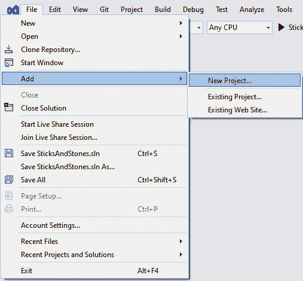

图 10.1 – 文件 | 添加 | 新项目…

1.  在搜索框中输入 `maui` 并从列表中选择 **.NET MAUI 应用** 项，或者如果列出，从 **最近的项目模板** 中选择它：

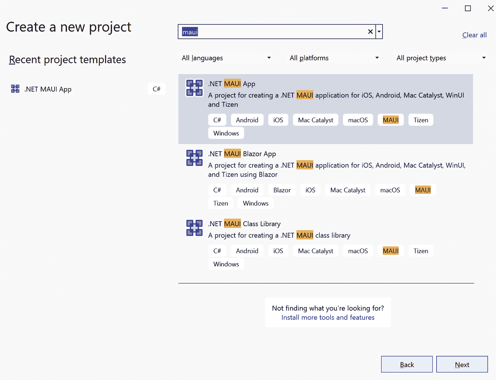

图 10.2 – 创建新项目

1.  点击 **下一步**。

1.  将应用程序名称输入为 `SticksAndStones.App`，并在 **解决方案** 下选择 **添加到解决方案**，如图下所示：

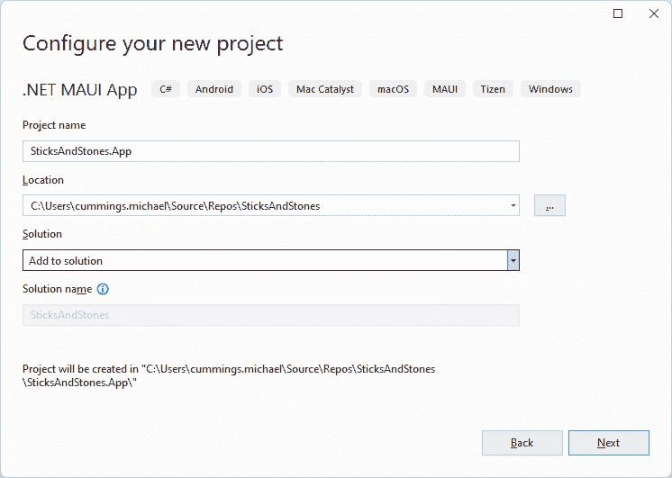

图 10.3 – 配置您的新的项目

1.  点击 **下一步**。

1.  最后一步将提示您选择支持 .NET Core 的版本。在撰写本文时，.NET 6 可用为 **长期支持**（**LTS**），.NET 7 可用为 **标准期限支持**。为了本书的目的，我们假设您将使用 .NET 7：

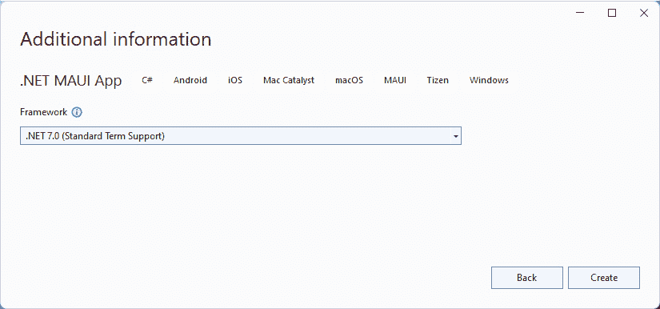

图 10.4 – 补充信息

1.  通过点击 **创建** 完成设置，并等待 Visual Studio 创建项目。

现在我们已经为我们的游戏屏幕创建了 .NET MAUI 项目，让我们配置它，以便它可以添加服务和视图。我们需要将 `SticksAndStones.Shared` 项目添加为项目引用，以及一些 NuGet 包。按照以下步骤完成 `SticksAndStones.App` 项目的设置：

1.  右键单击 **Solution Explorer** 中的 `SticksAndStones.App` 项目，并选择 **Properties**。

1.  在 `Default namespace` 中。

1.  修改 `$(MSBuildProjectName.Split(".")[0].Replace(" ", "``_"))`。

    这将根据 `"."` 分割项目名称，仅使用第一部分，并将任何空格替换为下划线。

1.  将 NuGet 包引用添加到 `CommunityToolkit.Mvvm`，因为在其他章节中，我们将使用此包来简化数据绑定到属性和命令的实现。

1.  将 NuGet 包引用添加到 `CommunityToolkit.Maui`。我们将使用此包中的 `GravatarImageSource` 类来渲染用户的头像。对于 .NET 7，您需要使用 NuGet 包的 6.1.0 版本。7.0+ 版本以 .NET 8 为依赖项。

1.  打开 `MauiProgram.cs` 文件，并添加此处显示的突出显示行：

    ```cs
    using CommunityToolkit.Maui;
    using Microsoft.Extensions.Logging;
    namespace SticksAndStones.App
    {
        public static class MauiProgram
        {
            public static MauiApp CreateMauiApp()
            {
                var builder = MauiApp.CreateBuilder();
                builder
                    .UseMauiApp<App>()
                    .ConfigureFonts(fonts =>
                    {
                        fonts.AddFont("OpenSans-Regular.ttf", "OpenSansRegular");
                        fonts.AddFont("OpenSans-Semibold.ttf", "OpenSansSemibold");
                    })
                    .UseMauiCommunityToolkit();
    #if DEBUG
                builder.Logging.AddDebug();
    #endif
                return builder.Build();
            }
        }
    }
    ```

    这将为应用程序内的 `CommunityToolkit` 配置。

1.  将 NuGet 包引用添加到 `Microsoft.Extensions.Logging.Abstractions`。此包用于记录 Azure Functions 函数的消息以进行调试。

1.  将 NuGet 包引用添加到 `Microsoft.Extensions.Logging.Debugging`。此包用于记录 Azure Functions 函数的消息以进行调试。

1.  将 NuGet 包引用添加到 `Microsoft.AspNetCore.SignalR.Client`。此包对于应用程序连接到我们在第九章中创建的 SignalR Hub 并接收消息是必需的。

1.  将项目引用添加到 `SticksAndStones.Shared` 项目。这将使我们能够访问在第九章中创建的消息和对象。

项目创建到此结束。接下来，我们将开始创建与我们的服务直接交互的类。

## 创建游戏服务

我们首先要做的是创建一个服务，该服务将用于与在第九章中创建的 Azure Functions 函数服务进行通信，即使用 Azure 服务设置游戏后端。该服务将分为三个主要类：

+   `GameService` – 用于调用 Azure Functions 和接收 SignalR 消息的方法和属性。

+   `ServiceConnection` – 包含对 `HttpClient` 和 SignalR Hub 实例的引用。同时提供用于安全调用 `HttpClient` 的方法。

+   `Settings` – 存储和检索 `HttpClient` 所使用的服务器 URL。它还存储用户提供的连接详细信息。

我们将从 `Settings` 类开始，因为 `GameService` 和 `ServiceConnection` 都将依赖于 `Settings`。

### 创建 Settings 服务

`Settings` 服务用于存储应用程序运行之间所需的价值。它将使用 .NET MAUI 的 `Preferences` 类以跨平台方式存储这些值。使用以下步骤实现 `Settings` 类：

1.  在 `SticksAndStones.App` 项目中，创建一个名为 `Services` 的新文件夹。

1.  在新创建的 `Services` 文件夹中，创建一个名为 `Settings` 的新类。

1.  将类设置为公共。

1.  创建一个名为 `LastPlayerKey` 的 `const string` 字段，并按如下方式初始化：

    ```cs
    private const string LastPlayerKey = nameof(LastPlayerKey);
    ```

1.  创建一个名为 `ServerUrlKey` 的 `const string` 字段，并按如下方式初始化：

    ```cs
    private const string ServerUrlKey = nameof(ServerUrlKey);
    ```

    这两个字段被 .NET MAUI 的 `Preferences` 类用来存储服务器 URL 和用户上次登录的登录详情。

1.  添加一个名为 `ServerUrlDefault` 的 `private const string` 字段，如下所示：

    ```cs
    #if DEBUG && ANDROID
        private const string ServerUrlDefault = "http://10.0.2.2:7071/api";
    #else
        private const string ServerUrlDefault = "http://localhost:7071/api";
    #endif
    ServerlUrlDefault value for Android devices. The 10.0.2.2 IP address is a special value used by the Android emulators to be able to access the host computer’s localhost address. This is very useful when testing the app using the Azurite development environment for Azure Functions.
    ```

    你可能需要调整前面列表中突出显示的端口号，以适应你特定的开发环境。Azure Functions 将在从 Visual Studio 启动时显示服务器 URL，如下面的屏幕截图所示：

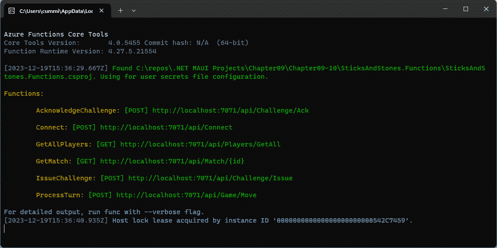

图 10.5 – Azure Functions 控制台输出

使用托管在 Azure 中的 Azure Functions

如果你遵循了 *第九章* 部分中名为 *将函数部署到 Azure* 的步骤，那么你可以在 *创建函数的 Azure 服务* 部分中使用 *第九章* 中创建的 Azure Function App 的 URL。该 URL 显示在 Azure Functions App 的 **概览** 选项卡上。

1.  现在，添加一个名为 `ServerUrl` 的 `public string` 属性，其实现如下：

    ```cs
    public string ServerUrl
    {
        get => Preferences.ContainsKey(ServerUrlKey) ?
                    Preferences.Get(ServerUrlKey, ServerUrlDefault) :
                    ServerUrlDefault;
        set => Preferences.Set(ServerUrlKey, value);
    }
    ```

    如果存在，此代码将从 `Preferences` 存储中获取服务器 URL；如果不存在，它将使用 `serverUrlDefault` 值。该属性将在 `Preferences` 存储中存储新值。

1.  在 `Settings.cs` 文件的顶部添加以下 `using` 声明：

    ```cs
    using SticksAndStones.Models;
    using System.Text.Json;
    ```

    这将使我们能够使用我们的模型和 `JsonSerializer` 类。

1.  创建一个名为 `LastPlayer` 的新属性，其类型为 `Player`，如下所示：

    ```cs
    public Player LastPlayer
    {
        get
        {
            if (Preferences.ContainsKey(LastPlayerKey))
            {
                var playerJson = Preferences.Get(LastPlayerKey, string.Empty);
                return JsonSerializer.Deserialize<Player>(playerJson, new JsonSerializerOptions(JsonSerializerDefaults.Web)) ?? new();
            }
            return new();
        }
        set => Preferences.Set(LastPlayerKey, JsonSerializer.Serialize(value, new JsonSerializerOptions(JsonSerializerDefaults.Web)));
    }
    ```

    在这里，属性的 `set` 方法将在将 `Player` 对象存储在 `Preferences` 之前将其转换为 `Json` 字符串，在获取属性时，如果它在 `Preferences` 存储中存在，则将存储的 `Json` 转换为 `Player` 对象。如果没有在 `Preferences` 存储中找到值，则 `get` 方法将返回一个空的 `Player` 对象。

1.  `Settings` 类的最终步骤是将它注册到依赖注入容器中。打开 `SticksAndStones.App` 项目的 `MauiProgram.cs` 文件，然后在 `CreateMauiApp` 方法中添加以下突出显示的代码：

    ```cs
    public static MauiApp CreateMauiApp()
    {
        var builder = MauiApp.CreateBuilder();
        builder
            .UseMauiApp<App>()
            .ConfigureFonts(fonts =>
            {
                fonts.AddFont("OpenSans-Regular.ttf", "OpenSansRegular");
                fonts.AddFont("OpenSans-Semibold.ttf", "OpenSansSemibold");
            });
    #if DEBUG
            builder.Logging.AddDebug();
    #endif
        builder.Services.AddSingleton<Services.Settings>();
            return builder.Build();
        }
    ```

随着 `Settings` 类的完成，我们现在可以专注于 `ServiceConnection` 类。

### 创建 ServiceConnection 类

`ServiceConnection` 类封装了与 Azure Functions 服务通信所需的功能。它具有调用函数方法并返回结果的方法，并具有适当的错误处理。它还负责初始化用于实时通信的 SignalR Hub 实例。`ServiceConnection` 类有几个我们需要的依赖项，所以让我们先放在一起。

首先要添加的是日志。在调试期间有日志可以帮助找出问题，尤其是在处理异步过程时。与 Azure Functions 通信将涉及大量的异步操作。为了在调试时启用日志记录，将高亮代码添加到`SticksAndStones.App`项目中的`MauiProgram`类的`CreateMauiApp`方法：

```cs
#if DEBUG
        builder.Logging.AddDebug();       
        builder.Services.AddLogging(configure =>
        {
            configure.AddDebug();
        });
#endif
        builder.Services.AddSingleton<Services.Settings>();
        return builder.Build();
```

这将在服务容器中添加一个`ILoggingProvider`实例。`ILoggerProvider`实例将提供`ILogger<T>`实例。这将使`ILogger<T>`能够在`ServiceConnection`类构造函数中作为依赖项使用。

更多关于日志提供者的信息

在[`learn.microsoft.com/en-us/dotnet/core/extensions/logging-providers`](https://learn.microsoft.com/en-us/dotnet/core/extensions/logging-providers)了解更多关于日志提供者如何工作以及日志的一般信息。

现在，当使用 HTTP 向 API 发出请求时，使用异步调用是一种常见且良好的做法，这样就不会阻塞主线程或 UI 线程。所有 UI 更新，如动画、按钮点击、屏幕上的轻触或文本更改，都发生在 UI 线程上。HTTP 调用可能需要相当长的时间才能完成，这可能导致应用程序对用户无响应。

异步编程中的错误处理可能很困难。为了帮助在调用 API 时处理错误，我们将使用几个类来封装异常；这些类是`AsyncError`和`AsyncExceptionError`。我们需要`AsyncError`和`AsyncExceptionError`，因为将任何从`System.Exception`派生的类实例序列化和反序列化都是一种不好的做法。并非所有从`System.Exception`派生的类都是可序列化的，即使它们是可序列化的，也可能由于缺少类型而无法反序列化——例如，类型在服务器上可用但在客户端不可用。在`SticksAndStones.App`项目中创建一个名为`AsyncError.cs`的新文件，并用以下代码替换其内容：

```cs
using System.Text.Json.Serialization;
namespace SticksAndStones;
public record AsyncError
{
    [JsonPropertyName("message")]
    public string Message { get; set; }
}
public record AsyncExceptionError : AsyncError
{
    [JsonPropertyName("innerException")]
    public string InnerException { get; set; }
}
```

`AsyncError`类有一个单独的属性`Message`。`Message`属性被`JsonPropertyName`属性装饰，以便在需要时可以序列化，使用属性名的小写版本。`AsyncExceptionError`从`AsyncError`继承并添加了一个额外的属性`InnerException`。`InnerException`属性也被`JsonPropertyName`属性装饰。

我们还需要最后一个类 `AsyncLazy<T>`。你可能已经在你编写的一些其他应用程序中使用了 `Lazy<T>`。当你想要延迟创建一个类直到你真正需要它时，它非常方便。如果你永远不需要它，它就不会被创建。但是 `Lazy<T>` 与异步编程不太兼容，所以如果你想要异步创建一个类，这会变得很繁琐。幸运的是，Stephen Toub，他在微软的 .NET 团队工作，创建了 `AsyncLazy<T>`。要将它添加到 `SticksAndStones.App` 项目中，创建一个名为 `AsyncLazy~1.cs` 的新文件，并用以下内容替换其内容：

```cs
using System.Runtime.CompilerServices;
namespace SticksAndStones;
// AsyncLazy<T>, Microsoft, Stephen Toub, .NET Parallel Programming Blog, https://devblogs.microsoft.com/pfxteam/asynclazyt/
public class AsyncLazy<T> : Lazy<Task<T>>
{
    public AsyncLazy(Func<T> valueFactory) :
        base(() => Task.Factory.StartNew(valueFactory))
    { }
    public AsyncLazy(Func<Task<T>> taskFactory) :
        base(() => Task.Factory.StartNew(() => taskFactory()).Unwrap())
    { }
    public TaskAwaiter<T> GetAwaiter() { return Value.GetAwaiter(); }
}
```

了解更多关于 AsyncLazy<T>

访问 .NET 博客了解更多关于 Stephen Toub 创建 `AsyncLazy<T>` 类的信息：[`devblogs.microsoft.com/pfxteam/asynclazyt/`](https://devblogs.microsoft.com/pfxteam/asynclazyt/)。

这就完成了开始实现 `ServiceConnection` 类所需的所有更改。要创建该类，请按照以下步骤操作：

1.  在 `SticksAndStones.App` 项目的 `Services` 文件夹中创建一个名为 `ServiceConnection` 的新类。

    将类改为 `public sealed` 并继承自 `IDisposable`:

    ```cs
    public sealed class ServiceConnection : IDisposable
    ```

1.  将文件顶部的命名空间声明修改为以下内容：

    ```cs
    using Microsoft.AspNetCore.Http.Connections.Client;
    using Microsoft.AspNetCore.SignalR.Client;
    using Microsoft.Extensions.Logging;
    using SticksAndStones.Models;
    using System.Net;
    using System.Net.Http.Json;
    using System.Text.Json;
    ```

    这些是在以下步骤中需要的，以引用所需的类型。

1.  向类中添加以下 `private` 字段：

    ```cs
    private readonly ILogger log;
    private readonly HttpClient httpClient;
    private readonly JsonSerializerOptions serializerOptions;
    ```

    `serializerOptions` 用于确保从 Azure Functions 函数发送和接收的 JSON 可以正确地序列化和反序列化。

1.  现在，添加一个名为 `Hub` 的 `public` 属性。`Hub` 的类型为 `AsyncLazy<HubConnection>`。`HubConnection` 是来自 SignalR 客户端库的类型，用于从 SignalR 服务接收消息。该属性应如下所示：

    ```cs
    public AsyncLazy<HubConnection> Hub { get; private set; }
    ```

    `HubConnection` 在 `ConnectHub` 方法中初始化。但首先，让我们添加构造函数。

1.  `ServiceConnection` 类的构造函数有两个参数：`ILogger<ServiceConnection>` 和一个 `Settings` 参数。在构造函数的主体中，初始化在 *步骤 3* 中创建的 `private` 字段如下：

    ```cs
    public ServiceConnection(ILogger<ServiceConnection> logger, Settings settings)
    {
        httpClient = new()
        {
            BaseAddress = new Uri(settings.ServerUrl)
        };
        httpClient.DefaultRequestHeaders.Accept.Add(new("application/json"));
        serializerOptions = new JsonSerializerOptions(JsonSerializerDefaults.Web);
        log = logger;
    }
    ```

    `logger` 和 `settings` 参数由 .NET MAUI 依赖注入服务提供。`httpClient` 字段被初始化，并且它的 `BaseAddress` 被分配为设置 `ServerUrl` 属性作为 URI。然后，`DefaultHeaders` 被修改以指示服务器期望结果以 JSON 格式返回。`serializerOptions` 实例被初始化为 `Web` 的默认值，这与 Azure Functions 使用的格式一致。最后，`log` 字段被初始化为 `logger` 参数的值。

1.  现在，让我们实现`Dispose`方法。它将清理任何可能持有任何原生资源的值，例如网络、文件句柄等。这个类中需要释放引用的两个值是`httpClient`和`Hub`。请注意，我们不需要自己调用`Dispose`，因为.NET MAUI 依赖注入系统会为我们完成这个操作。将以下代码添加到`ServiceConnection`类中：

    ```cs
    public void Dispose()
    {
        httpClient?.Dispose();
        Hub?.Value?.Dispose();
        GC.SuppressFinalize(this);
    }
    ```

1.  现在，通过将以下高亮显示的代码行添加到`MauiProgram.cs`文件中，将类添加到依赖注入中：

    ```cs
    builder.Services.AddSingleton<Services.Settings>();
    builder.Services.AddSingleton<Services.ServiceConnection>();
    return builder.Build();
    ```

1.  `Hub`属性的初始化将在`ConnectHub`方法中发生。SignalR Hub 连接的配置作为`Connect`函数的结果返回给应用程序。由于我们在这个类构造之前没有也不会调用那个方法，所以我们不能在构造函数中创建`Hub`。在初始化`Hub`实例之前需要配置。`ConnectHub`方法有一个名为`ConnectionInfo`的单个参数。使用以下代码片段添加该方法：

    ```cs
    public void ConnectHub(ConnectionInfo config)
    {
        Hub = new(async () =>
        {
            var connectionBuilder = new HubConnectionBuilder();
            connectionBuilder.WithUrl(config.Url, (HttpConnectionOptions obj) =>
            {
                obj.AccessTokenProvider = async () => await Task.FromResult(config.AccessToken);
            });
            connectionBuilder.WithAutomaticReconnect();
            var hub = connectionBuilder.Build();
            await hub.StartAsync();
            return hub;
        });
    }
    ```

    此方法将`Hub`属性初始化为一个新的`AsyncLazy<HubConnection>`实例。`AsyncLazy<T>`的构造函数接受`Func<T>`，它通过匿名方法语法提供。匿名方法也被标记为`async`方法，这意味着它将包含一个等待的方法调用。匿名方法不接受任何参数，在方法体中，首先创建一个新的`HubConnectionBuilder`。然后，在`HubConnectionBuilder`上调用`WithUrl`扩展方法来设置 SignalR 服务的 URL 并提供建立连接所需的`AccessToken`值。`AccessTokenProvider`是`Task<string>`，因此`config.AccessToken`通过另一个`async`匿名函数提供。`WithAutomaticReconnect`方法将`HubConnection`实例设置为在连接丢失时自动尝试重新连接 SignalR 服务。如果没有调用`WithAutomaticReconnect`，则当连接丢失时，应用程序负责重新连接。通过调用`HubConnectionBuilder.Build`创建`HubConnection`实例。然后，通过`StartAsync`启动`Hub`实例，这是等待的，然后返回`Hub`。这里要记住的是，当调用`ConnectHub`时，匿名函数不会执行。该方法只有在第一次访问`Hub`属性的一个属性或方法时才会被调用。

`ServiceConnection` 类包含两个辅助函数，这些函数从 `GameService` 类中使用，以向 Azure Functions 服务发送 HTTP 请求。第一个是 `GetAsync<T>`，它接受两个参数：一个 URL 和一个字典，该字典包含要随 URL 一起传递的查询参数。它返回一个 `T` 实例和 `AsyncError` 作为 `Tuple`。`GetAsync` 方法在发起 HTTP 请求时将使用 `GET` HTTP 方法。另一个辅助方法是 `PostAsync<T>`，它使用 `POST` HTTP 方法，并接受两个参数：一个 URL 和一个对象，该对象作为请求体中的 JSON 格式发送。它将从响应中返回 `T` 的一个实例。

`GetAsync<T>` 和 `PostAsync<T>` 使用几个辅助方法；使用以下代码片段将它们添加到 `ServiceConnection` 类中：

```cs
UriBuilder GetUriBuilder(Uri uri, Dictionary<string, string> parameters)
=> new(uri)
{
    Query = string.Join("&",
    parameters.Select(kvp =>
            $"{kvp.Key}={kvp.Value}"))
};
async ValueTask<AsyncError?> GetError(HttpResponseMessage responseMessage, Stream content)
{
    AsyncError? error;
    if (responseMessage.StatusCode == HttpStatusCode.Unauthorized)
    {
        log.LogError("Unauthorized request {@Uri}", responseMessage.RequestMessage?.RequestUri);
        return new()
        {
            Message = "Unauthorized request."
        };
    }
    try
    {
        error = await JsonSerializer.DeserializeAsync<AsyncError>(content, serializerOptions);
    }
    catch (Exception e)
    {
        error = new AsyncExceptionError()
        {
            Message = e.Message,
            InnerException = e.InnerException?.Message,
        };
    }
    log.LogError("{@Error} {@Message} for {@Uri}", responseMessage.StatusCode, error?.Message, responseMessage?.RequestMessage?.RequestUri);
    return error;
}
```

`GetUriBuilder` 方法将返回一个新的 `UriBuilder`，该 `UriBuilder` 从提供的 URL 和键值对 `Dictionary` 中获取，用于查询字符串。`GetError` 方法将根据状态码或 HTTP 方法调用响应的内容返回 `AsyncError` 对象或 `AsyncExceptionError` 对象。

现在，我们可以使用以下代码将 `GetAsync<T>` 方法添加到 `ServiceConnection` 类中：

```cs
public async Task<(T Result, AsyncError Exception)> GetAsync<T>(Uri uri, Dictionary<string, string> parameters)
{
    var builder = GetUriBuilder(uri, parameters);
    var fullUri = builder.ToString();
    log.LogDebug("{@ObjectType} Get REST call @{RestUrl}", typeof(T).Name, fullUri);
    try
    {
        var responseMessage = await httpClient.GetAsync(fullUri);
        log.LogDebug("Response {@ResponseCode} for {@RestUrl}", responseMessage.StatusCode, fullUri);
        if (responseMessage.IsSuccessStatusCode)
        {
            try
            {
                var content = await responseMessage.Content.ReadFromJsonAsync<T>();
                log.LogDebug("Object of type {@ObjectType} parsed for {@RestUrl}", typeof(T).Name, fullUri);
                return (content, null);
            }
            catch (Exception e)
            {
                log.LogError("Error {@ErrorMessage} for when parsing ${ObjectType} for {@RestUrl}", e.Message, typeof(T).Name, fullUri);
                return (default, new AsyncExceptionError()
                {
                    InnerException = e.InnerException?.Message,
                    Message = e.Message
                });
            }
        }
        log.LogDebug("Returning error for @{RestUrl}", fullUri);
        return (default, await GetError(responseMessage, await responseMessage.Content.ReadAsStreamAsync()));
    }
    catch (Exception e)
    {
        log.LogError("Error {@ErrorMessage} for REST call ${ResUrl}", e.Message, fullUri);
        // The service might not be happy with us, we might have connection issues etc..
        return (default, new AsyncExceptionError()
        {
            InnerException = e.InnerException?.Message,
            Message = e.Message
        });
    }
}
```

虽然这个方法有点长，但它所做的事情并不复杂。首先，它使用 `GetUriBuilder` 方法创建 `UriBuilder` 实例，并从该实例构建 `fullUri` 字符串值。然后，它使用 `HttpClient` 实例向 URL 发起 HTTP `GET` 请求。如果发生任何失败，异常处理程序将捕获它并返回 `AsynExceptionError`。如果没有错误发生，并且响应代码指示成功，则处理并返回结果。否则，将读取结果内容以查找错误，如果找到，则返回。当 `GetAsync<T>` 方法返回时，它将始终返回两个项目：`T` 类型的响应和 `AsyncError`。如果其中任何一个不存在，则返回它们的默认值或 `null`。

审查并添加以下代码片段到 `ServiceConnection` 类以实现 `PostAsync<T>` 方法：

```cs
public async Task<(T Result, AsyncError Exception)> PostAsync<T>(Uri uri, object parameter)
{
    log.LogDebug("{@ObjectType} Post REST call @{RestUrl}", typeof(T).Name, uri);
    try
    {
        var responseMessage = await httpClient.PostAsJsonAsync(uri, parameter, serializerOptions);
        log.LogDebug("Response {@ResponseCode} for {@RestUrl}", responseMessage.StatusCode, uri);
        await using var content = await responseMessage.Content.ReadAsStreamAsync();
        if (responseMessage.IsSuccessStatusCode)
        {                
            if(string.IsNullOrEmpty(await.responseMessage.Content.ReadAsStringAsync()))
                return (default, null);
            try
            {
                log.LogDebug("Parse {@ObjectType} SUCCESS for {@RestUrl}", typeof(T).Name, uri);
                var result = await responseMessage.Content.ReadFromJsonAsync<T>();
                log.LogDebug("Object of type {@ObjectType} parsed for {@RestUrl}", typeof(T).Name, uri);
                return (result, null);
            }
            catch (Exception e)
            {
                log.LogError("Error {@ErrorMessage} for when parsing ${ObjectType} for {@RestUrl}", e.Message, typeof(T).Name, uri);
                return (default, new AsyncExceptionError()
                {
                    InnerException = e.InnerException?.Message,
                    Message = e.Message
                });
            }
        }
        log.LogDebug("Returning error for @{RestUrl}", uri);
        return (default, await GetError(responseMessage, content));
    }
    catch (Exception e)
    {
        log.LogError("Error {@ErrorMessage} for REST call ${ResUrl}", e.Message, uri);
        // The service might not be happy with us, we might have connection issues etc..
        return (default, new AsyncExceptionError()
        {
            InnerException = e.InnerException?.Message,
            Message = e.Message
        });
    }
}
```

此方法基本上与 `GetAsync<T>` 相同，但有一些小的变化。首先，它不需要调用 `GetUriBuilder` 将参数添加到 `Uri` 的 `QueryString` 中，因为参数作为请求体的一部分发送。其次，它使用 HTTP `POST` 方法而不是 `GET`。有了这些变化，方法的大部分是错误处理，以确保我们返回正确的数据。

这样就完成了 `ServiceConnection` 类。`ServiceConnection` 和 `Settings` 服务类将在下一节中使用，其中我们将创建 `GameService` 类。

### 创建 `GameService` 类

`GameService` 类是 UI 和网络之间的一个层。它使用 `ServiceConnection` 类来处理特定的网络调用，以创建我们需要与 Azure Functions 交互的逻辑。对于我们在 *第九章* 中创建的每个函数，`GameService` 类都有一个对应的方法来调用函数并返回结果（如果有的话）。

按照以下步骤创建和初始化类：

1.  在 `SticksAndStones.App` 项目的 `Services` 文件夹下创建一个名为 `GameService` 的新类。

1.  将类定义更改为 `public sealed` 并从 `IDisposable` 接口继承：

    ```cs
    public sealed class GameService : IDisposable
    ```

1.  将以下命名空间声明添加到文件顶部：

    ```cs
    using System.Collections.ObjectModel;
    using CommunityToolkit.Mvvm.Messaging;
    using Microsoft.AspNetCore.SignalR.Client;
    using SticksAndStones.Messages;
    using SticksAndStones.Models;
    ```

1.  `GameService` 类将依赖于 `Settings` 服务和 `ServiceConnection` 服务，因此我们需要将它们添加到构造函数中，并将引用存储在类字段中，如下所示：

    ```cs
    private readonly ServiceConnection service;
    private readonly Settings settings;
    public GameService(Settings settings, ServiceConnection service)
    {
        this.service = service;
        this.settings = settings;
    }
    GameService class. .NET MAUI will provide the Settings and ServiceConnection instances through dependency injection.
    ```

1.  通过向 `GameService` 类添加以下方法来实现 `IDisposable` 接口：

    ```cs
    public void Dispose()
    {
        service.Dispose();
        GC.SuppressFinalize(this);
    }
    ```

1.  现在，通过将以下高亮显示的代码行添加到 `MauiProgram.cs` 文件中，将类添加到依赖注入中：

    ```cs
    #if DEBUG
                builder.Logging.AddDebug();
    #endif
                builder.Services.AddSingleton<Services.Settings>();
               builder.Services.AddSingleton<Services.ServiceConnection>();
                builder.Services.AddSingleton<Services.GameService>();
                return builder.Build();
    ```

我们将从 `Connect` 方法开始。`Connect` 将接受一个要连接的 `Player` 对象，并返回一个更新的 `Player` 对象。此外，如果连接成功，它将配置 SignalR Hub。要创建 `Connect` 函数，请按照以下步骤操作：

1.  创建一个名为 `semaphoreSlim` 的 `private` 字段，并使用一个具有初始和最大计数为 `1` 的新实例初始化该字段：

    ```cs
    public sealed class GameService : IDisposable
    {
        private readonly SemaphoreSlim semaphoreSlim = new(1, 1);
        private readonly ServiceConnection service;
    ```

    `SemaphoreSlim` 类是限制一次执行操作线程数量的好方法。在我们的情况下，我们只想让一个线程在每次进行网络调用。它将在所有从 `GameService` 类进行网络调用的方法中使用。

1.  `GameService` 将在名为 `CurrentPlayer` 的 `public` 属性中跟踪当前玩家；使用以下代码将属性添加到类中：

    ```cs
    private readonly Settings settings;
    public Player CurrentPlayer { get; private set; } = new Player() { Id = Guid.Empty, GameId = Guid.Empty };
    ```

    属性被初始化为一个空的 `Player` 对象。

1.  一旦用户以玩家身份连接，我们还需要一个地方来存储在线玩家的列表。为此，将以下属性添加到 `GameService` 类中：

    ```cs
    public ObservableCollection<Player> Players { get; } = new();
    ```

1.  `GameService` 类在名为 `IsConnected` 的属性中跟踪当前连接状态；使用以下代码片段将属性添加到 `GameService` 类中：

    ```cs
    public bool IsConnected { get; private set; }
    ```

1.  将一个名为 `Connect` 的 `public async` 方法添加到 `GameService` 类中。它应该返回 `Task<Player>` 并接受一个 `Player` 参数，如下所示：

    ```cs
    public async Task<Player> Connect(Player player)
    {
    }
    ```

1.  在 `Connect` 方法中，第一步是确保一次只有一个线程在该方法中操作：

    ```cs
    await semaphoreSlim.WaitAsync();
    ```

    这使用 C# 中的 `async`/`await` 结构创建一个锁，只有当 `SemaphoreSlim` 中有足够的开放槽位时才会释放。由于 `SemaphoreSlim` 实例仅初始化了一个槽位，因此一次只能有一个线程处理 `Connect` 方法。

1.  为了确保 `the` `SemaphoreSlim` 实例释放槽位，我们需要在方法的其他部分添加异常处理，并在最后调用 `Release`。将以下代码片段添加到 `Connect` 方法中：

    ```cs
    try
    {
    }
    finally
    {
        semaphoreSlim.Release();
    }
    return CurrentPlayer;
    ```

    `try`/`finally` 块确保我们将在方法结束时始终调用 `Release`，这将防止 `the` `SemaphoreSlim` 实例被饿死，防止任何其他线程进入该方法。最后，我们返回 `CurrentPlayer` 的值，我们将在 `try` 块中设置它。

处理 `SemaphoreSlim` 的另一种方法是

使用 `try`/`catch`/`finally` 块是可行的，但如果您正确处理所有异常或没有异常，则略显笨拙。Tom Dupont 在他的博客上发布了一个辅助类，允许您使用 `using` 语句来管理 `the` `SemaphoreSlim` 实例的生命周期。您可以在他的帖子 [`www.tomdupont.net/2016/03/how-to-release-semaphore-with-using.html`](http://www.tomdupont.net/2016/03/how-to-release-semaphore-with-using.html) 中阅读他的帖子。以下是他扩展的示例：

`using var handle =` `semaphoreSlim.UseWaitAsync();`

1.  在 `try` 块中，添加以下代码行：

    ```cs
    CurrentPlayer = player;
    var (response, error) = await service.PostAsync<ConnectResponse>(new($"{settings.ServerUrl}/Connect"), new ConnectRequest(player));
    if (error is null)
    {
        service.ConnectHub(response.ConnectionInfo);
        response.Players.ForEach(Players.Add);
        CurrentPlayer = response.Player;
        IsConnected = true;
    }
    else
    {
        WeakReferenceMessenger.Default.Send<ServiceError>(new(error));
    }
    ```

    此代码块处理 Azure Functions 服务中 `Connect` 函数的调用。我们首先将传入的玩家详细信息设置为 `CurrentPlayer` 属性。然后，将 `player` 实例打包成一个 `ConnectRequest` 对象，并将其传递给 `ServiceConnection` 实例上的 `PostAsync<T>` 调用。URL 是从存储在 `Settings` 服务中的 `ServerUrl` 属性拼接 `/Connect` 创建的。预期的响应类型为 `ConnectResponse`，并将其存储在 `response` 中。如果我们没有收到任何错误，那么我们可以在 `ServiceConnection` 实例上调用 `ConnectHub`，填充我们的 `Players` 集合，并将 `the` `CurrentPlayer` 属性设置为返回的 `Player` 实例，该实例将包含来自服务器的额外详细信息。如果发生任何问题，则错误对象将被填充，我们将向 UI 发送包含该错误的消息。

    `ServiceError` 是我们需要从 `GameService` 类发送到 `ViewModel` 实例的第一个消息。它用于将 `ServiceConnection` 实例的错误发送到 `ViewModel` 实例。我们将在下一步添加 `ServiceError` 类。

1.  在 `SticksAndStones.App` 项目中，创建一个名为 `Messages` 的新文件夹。

1.  在 `SticksAndStones.App` 项目的 `Messages` 文件夹中创建一个名为 `ServiceError` 的新类。

1.  `ServiceError` 消息是对 `AyncError` 对象的简单包装，可用于向视图模型发送消息。将 `ServiceError.cs` 文件的内容替换为以下内容：

    ```cs
    using CommunityToolkit.Mvvm.Messaging.Messages;
    namespace SticksAndStones.Messages;
    internal class ServiceError : ValueChangedMessage<AsyncError>
    {
        public ServiceError(AsyncError error) : base(error)
        {
        }
    }
    ```

1.  最后，由于我们正在使用 `SemaphoreSlim` 并且它可以保留原生资源，我们应该确保这些资源被正确释放。将以下高亮代码添加到 `Dispose` 方法中以清理 `semaphoreSlim` 字段：

    ```cs
    public void Dispose()
    {
        semaphoreSlim.Release();
        semaphoreSlim.Dispose();
        service.Dispose();
        GC.SuppressFinalize(this);
    }
    ```

这就完成了当前的 `Connect` 方法。

接下来的三个方法是从 `Lobby` 页面调用的。第一个方法用于刷新玩家列表。当用户下拉列表以刷新或如果 SignalR Hub 重新连接时，将调用此方法。要实现 `the` `RefreshPlayerList` 方法，请按照以下步骤操作：

1.  `the` `RefreshPlayerList` 方法不接受任何参数并返回 `Task`；将此方法添加到 `GameService` 类中，如下所示：

    ```cs
    public async Task RefreshPlayerList()
    {
        await semaphoreSlim.WaitAsync();
        try
        {
            var getAllPlayers = service.GetAsync<GetAllPlayersResponse>(new($"{settings.ServerUrl}/Players/GetAll"), new Dictionary<string, string> { { "id", $"{CurrentPlayer.Id}" } });
            var (response, error) = await getAllPlayers;
            if (error is null)
            {
                Players.Clear();
                response.Players.ForEach(Players.Add);
            }
            else
            {      WeakReferenceMessenger.Default.Send<ServiceError>(new(error));
            }
        }
        finally
        {
            semaphoreSlim.Release();
        }
    }
    ```

1.  当 SignalR Hub 重新连接时，刷新玩家列表，请将以下高亮代码添加到 `Connect` 方法中：

    ```cs
    if (error is null)
    {
        service.ConnectHub(response.ConnectionInfo);
        response.Players.ForEach(Players.Add);
        CurrentPlayer = response.Player;
        (await service.Hub).Reconnected += (s) => { return RefreshPlayerList(); };
    }
    ```

    这行代码很有趣。首先，我们等待 `service.Hub`，然后设置 `Reconnected` 事件为一个匿名函数，该函数调用 `RefreshPlayerList`。如果你还记得，`ServiceConnection` 类中的 `Hub` 属性是 `AsyncLazy<T>`。第一次引用 `Hub` 属性时，它将异步初始化自身，因此有 `await` 调用。

下一个从 `Lobby` 页面使用的方法是 `IssueChallenge`。当玩家希望与其他玩家进行比赛时，`Lobby` 页面会调用 `IssueChallenge` 方法。由于实际的挑战响应将通过 SignalR Hub 返回，因此 `IssueChallenge` 方法不返回任何值。该方法将向服务器发送请求并处理任何错误，如下所示：

```cs
public async Task IssueChallenge(Player opponent)
{
    await semaphoreSlim.WaitAsync();
    try
    {
        var (response, error) = await service.PostAsync<IssueChallengeResponse>(new($"{settings.ServerUrl}/Challenge/Issue"), new IssueChallengeRequest(CurrentPlayer, opponent));
        if (error is not null)
        {         WeakReferenceMessenger.Default.Send<ServiceError>(new(error));
        }
    }
    finally
    {
        semaphoreSlim.Release();
    }
}
```

将前面的代码添加到 `GameService` 类中。当对手响应挑战时调用的 `SendChallengeResponse` 方法与 `IssueChallenge` 方法非常相似，如下所示：

```cs
public async Task SendChallengeResponse(Guid challengeId, Models.ChallengeResponse challengeResponse)
{
    await semaphoreSlim.WaitAsync();
    try
    {
        var (response, error) = await service.PostAsync<string>(new($"{settings.ServerUrl}/Challenge/Ack"), new AcknowledgeChallengeRequest(challengeId, challengeResponse));
        if (error is not null)
        {         WeakReferenceMessenger.Default.Send<ServiceError>(new(error));
        }
    }
    finally
    {
        semaphoreSlim.Release();
    }
}
```

将 `SendChallengeResponse` 方法添加到 `GameService` 类中。这样就完成了支持 `Lobby` 页面所需的方法。我们应用中的最后一页是 `Game` 页面。还需要三个由 `Game` 页面需要的方法。按照以下步骤添加它们：

1.  添加 `EndTurn` 方法，该方法将玩家的移动发送到 `Game` 服务器，使用以下代码片段：

    ```cs
    public async Task<(Game?, string?)> EndTurn(Guid gameId, int position)
    {
        await semaphoreSlim.WaitAsync();
        try
        {
            var (response, error) = await service.PostAsync<ProcessTurnResponse>(new($"{settings.ServerUrl}/Game/Move"), new ProcessTurnRequest(gameId, CurrentPlayer, position));
            if (error is not null)
            {
                return (null, error.Message);
            }
            else return (response.Game, null);
        }
        finally
        {
            semaphoreSlim.Release();
        }
    }
    ```

    `EndTurn` 方法与 `IssueChallenge` 和 `SendChallengeResponse` 方法非常相似，只有一个小的例外：它返回更新后的 `Game` 对象和错误消息（如果有的话）。

1.  `the` `GetPlayerId` 方法是一个小的辅助函数，用于搜索 `Players` 列表并返回与传入的 ID 匹配的 `Player` 实例。使用以下代码片段添加 `GetPlayerById` 方法：

    ```cs
    public Player? GetPlayerById(Guid playerId)
    {
        if (playerId == CurrentPlayer.Id)
            return CurrentPlayer;
        return (from p in Players where p.Id == playerId select p).FirstOrDefault();
    }
    ```

1.  `the` `GetMatchById` 方法是最后一个将调用后端的方法。在这种情况下，它将根据 ID 获取一个 `Match` 对象。使用以下代码片段将 `GetMatchById` 添加到 `GameService` 类中：

    ```cs
    public async Task<Match> GetMatchById(Guid matchId)
    {
        await semaphoreSlim.WaitAsync();
        try
        {
            var (response, error) = await service.GetAsync<GetMatchResponse>(new($"{settings.ServerUrl}/Match/{matchId}"), new());
            if (error != null) { }
            if (response.Match != null)
                return response.Match;
            return new Match();
        }
        finally
        {
            semaphoreSlim.Release();
        }
    }
    ```

`GameService` 类的最后一部分是处理通过 SignalR Hub 接收的事件。为了从 *第九章* 中刷新我们的记忆，后端函数将通过 SignalR 将以下事件发送到客户端：

+   `PlayerUpdatedEventArgs`

+   `ChallengeEventArgs`

+   `GameStartedEventArgs`

+   `GameUpdatedEventArgs`

我们将在 `GameService` 方法中处理这些事件中的每一个。要实现这些事件的处理器，请按照以下步骤操作：

1.  当 `Hub` 接收到 `PlayerUpdatedEventArgs` 时，我们需要使用新值更新 `Players` 集合中的 `Player`。我们将创建一个辅助函数来处理这项工作，如下所示：

    ```cs
    private void PlayerStatusChangedHandler(PlayerUpdatedEventArgs args)
    {
        var changedPlayer = (from player in Players
                             where player.Id == args.Player.Id
                             select player).FirstOrDefault();
        if (changedPlayer is not null)
        {
            changedPlayer.MatchId = args.Player.MatchId;
        }
        else if (args.Player.Id != CurrentPlayer.Id)
        {
            Players.Add(args.Player);
        }
    }
    ```

    `PlayerStatusChangedHandler` 方法将在 `Players` 集合中定位已更改的玩家并更新实例的相关字段或如果不存在则添加它。

1.  当接收到 `PlayerUpdated` 事件时调用 `PlayerStatusUpdateHandler` 类，请将以下突出显示的代码添加到 `Connect` 方法：

    ```cs
    if (error is null)
    {
        service.ConnectHub(response.ConnectionInfo);
        response.Players.ForEach(Players.Add);
        CurrentPlayer = response.Player;
        IsConnected = true;
        (await service.Hub).On<PlayerUpdatedEventArgs>(Constants.Events.PlayerUpdated, PlayerStatusChangedHandler);
        (await service.Hub).Reconnected += (s) => { return RefreshPlayerList(); };
    }
    ```

其他三个事件将通过 `WeakReferenceManager` 向 `ViewModel` 实例发送消息。首先，我们需要添加消息类型，按照以下步骤操作：

1.  在 `SticksAndStones.App` 项目的 `Messages` 文件夹中添加一个名为 `ChallengeReceived` 的新类。

1.  用以下内容替换 `ChallengeReceived.cs` 文件的内容：

    ```cs
    using CommunityToolkit.Mvvm.Messaging.Messages;
    using SticksAndStones.Models;
    namespace SticksAndStones.Messages;
    public class ChallengeRecieved : ValueChangedMessage<Player>
    {
        public Guid Id { get; init; }
        public ChallengeRecieved(Guid id, Player challenger) : base(challenger)
        {
            Id = id;
        }
    }
    ```

1.  在 `SticksAndStones.App` 项目的 `Messages` 文件夹中添加一个名为 `MatchStarted` 的新类。

1.  用以下代码替换 `MatchStarted.cs` 文件的内容：

    ```cs
    using CommunityToolkit.Mvvm.Messaging.Messages;
    using SticksAndStones.Models;
    namespace SticksAndStones.Messages;
    public class MatchStarted : ValueChangedMessage<Match>
    {
        public MatchStarted(Match match) : base(match)
        {
        }
    }
    ```

1.  在 `SticksAndStones.App` 项目的 `Messages` 文件夹中添加一个名为 `MatchUpdated` 的新类。

1.  用以下代码替换 `MatchUpdated.cs` 文件的内容：

    ```cs
    using CommunityToolkit.Mvvm.Messaging.Messages;
    using SticksAndStones.Models;
    namespace SticksAndStones.Messages;
    class MatchUpdated : ValueChangedMessage<Match>
    {
        public MatchUpdated(Match match) : base(match)
        {
        }
    }
    ```

1.  当接收到事件时发送消息，请将以下突出显示的代码添加到 `GameService` 类中的 `Connect` 方法：

    ```cs
    service.ConnectHub(response.ConnectionInfo);
    response.Players.ForEach(Players.Add);
    CurrentPlayer = response.Player;
    IsConnected = true;
    (await service.Hub).On<PlayerUpdatedEventArgs>(Constants.Events.PlayerUpdated, PlayerStatusChangedHandler);
    (await service.Hub).On<ChallengeEventArgs>(Constants.Events.Challenge, (args) => WeakReferenceMessenger.Default.Send(new ChallengeRecieved(args.Id, args.Challenger)));
    (await service.Hub).On<MatchStartedEventArgs>(Constants.Events.MatchStarted, (args) => WeakReferenceMessenger.Default.Send(new MatchStarted(args.Game)));
    (await service.Hub).On<MatchUpdatedEventArgs>(Constants.Events.MatchUpdated, (args) => WeakReferenceMessenger.Default.Send(new MatchUpdated(args.Game)));
    (await service.Hub).Reconnected += (s) => { return RefreshPlayerList(); };
    ```

这就完成了 `GameService` 类。我们拥有了与后端功能交互所需的所有方法，并且我们正在处理发送到客户端的事件。本章的下一部分将添加用于向用户展示屏幕所需的页面，从 **连接** 页面开始。

## 创建连接页面

如 *图 10.6* 所示的 **连接** 页面，是应用加载后用户首先看到的屏幕。该页面包含四个主要元素：玩家游戏标签的输入框、玩家电子邮件地址的输入框、玩家头像的图像控件以及 **连接** 按钮。

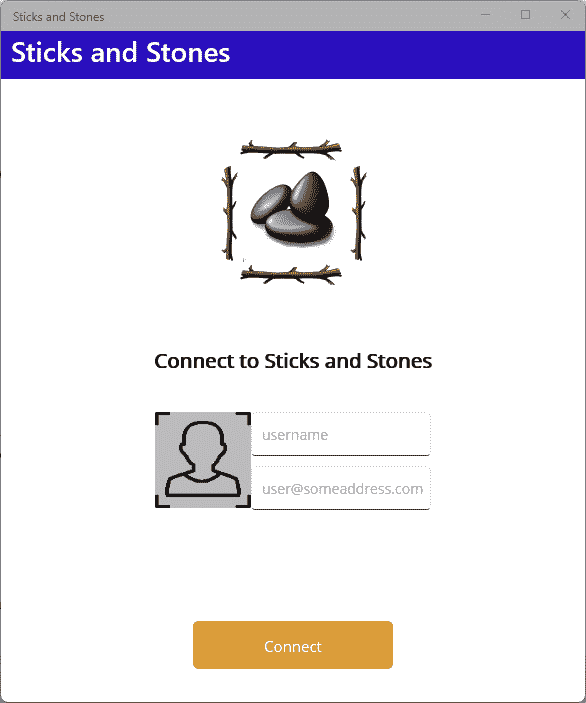

图 10.6 – 连接页面

**连接** 页面将包含几个部分：

+   一个名为 `ConnectViewModel.cs` 的 `ViewModel` 文件

+   一个名为 `ConnectView.xaml` 的 XAML 文件，其中包含布局

+   一个名为 `ConnectView.xaml.cs` 的代码隐藏文件，将执行数据绑定过程

+   包含自定义按钮控件布局的 XAML 文件，称为 `ActivityButton.xaml`

+   `ActivityButton.xaml.cs` 中 `ActivityButton` 的代码隐藏

我们将首先实现 `ConnectViewModel`。

### 添加 ConnectViewModel

`ConnectViewModel` 与 `LobbyViewModel` 和 `GameView` 模型一起将继承自一个名为 `ViewModelBase` 的单一基类。`ViewModelBase` 类提供了实现页面刷新所需的功能。并非所有页面都会使用此功能，但它将是可用的。要添加 `ViewModelBase`，请按照以下步骤操作：

1.  在 `SticksAndStones.App` 项目中创建一个名为 `ViewModels` 的新文件夹。

1.  在 `ViewModels` 文件夹中添加一个名为 `ViewModelBase` 的新类。

1.  在 `ViewModelBase.cs` 文件顶部添加以下命名空间声明：

    ```cs
    using CommunityToolkit.Mvvm.ComponentModel;
    using CommunityToolkit.Mvvm.Input;
    ```

1.  将类声明更改为 `public abstract partial` 并从 `ObservableRecipient` 派生类：

    ```cs
    ObservableRecipient comes from CommunityToolkit. If you have worked through the other chapters in this book, you will have seen view models that derive from ObservableObject, which implements INotifyPropertyChanged. ObservableRecipient extends ObservableObject and adds built-in support for working with implementations of the .NET MAUI IMessage interface. To learn more about ObservableRecipient, visit https://learn.microsoft.com/en-us/dotnet/communitytoolkit/mvvm/observablerecipient.
    ```

1.  添加一个名为 `canRefresh` 的 `private bool` 字段，并使用 `ObservableProperty` 属性：

    ```cs
    [ObservableProperty]
    private bool canRefresh;
    ```

1.  添加一个名为 `isRefreshing` 的 `private bool` 字段，并使用 `ObservableProperty` 属性：

    ```cs
    [ObservableProperty]
    private bool isRefreshing;
    ```

1.  添加一个无参数返回 `bool` 类型的 `private` 方法名为 `CanExecuteRefresh`。方法签名和实现如下代码片段所示：

    ```cs
    private bool CanExecuteRefresh() => CanRefresh && !IsRefreshing;
    ```

1.  添加一个名为 `RefreshInternal` 的新 `protected virtual` 方法，它返回一个 `Task`，其实现返回 `Task.CompletedTask`，如下所示：

    ```cs
    protected virtual Task RefreshInternal() => Task.CompletedTask;
    ```

1.  添加如下所示的 `Refresh` 方法：

    ```cs
    [RelayCommand(CanExecute = nameof(CanExecuteRefresh))]
    public async Task Refresh()
    {
        IsRefreshing = true;
        await RefreshInternal();
        IsRefreshing = false;
        return;
    }
    ```

    `Refresh` 方法是一个 `Command`，这意味着它可以绑定到 XAML 元素作为 `RefreshCommand`。`CanExecuteRefresh` 方法用于确定命令的启用/禁用状态。命令本身翻转 `IsRefreshing` 布尔值并调用 `RefreshInternal` 方法，在从 `ViewModelBase` 派生的类中放置具体的实现。

现在 `ViewModelBase` 已经实现，我们可以实现 `ConnectViewModel`。`ConnectViewModel` 类具有可绑定的玩家游戏标签和电子邮件地址属性以及各种命令状态。最后，有一个用于建立与游戏服务的连接的命令。让我们按照以下步骤实现 `ConnectViewModel` 类：

1.  在 `ViewModels` 文件夹中创建一个名为 `ConnectViewModel` 的新类。

1.  将类定义更改为 `public partial` 并从 `ViewModelBase` 派生，如下所示：

    ```cs
    public partial class ConnectViewModel : ViewModelBase
    {
    }
    ```

1.  `ConnectViewModel` 依赖于 `GameService` 和 `Settings` 服务，因此让我们添加一个构造函数来通过依赖注入获取它们，并添加 `private` 字段来存储它们的值，如下所示：

    ```cs
    public partial class ConnectViewModel : ViewModelBase
    {
        private readonly GameService gameService;
        private readonly Settings settings;
        public ConnectViewModel(GameService gameService, Settings settings)
        {
            this.gameService = gameService;
            this.settings = settings;
        }
    }
    ```

1.  要使用 `GameService` 和 `Settings` 类，您需要在文件顶部添加一个命名空间声明：

    ```cs
    using SticksAndStones.Services;
    ```

1.  在代码片段中添加一个名为 `gamerTag` 的 `private string` 字段，并使用 `ObservableProperty` 属性来使其可绑定，如下所示：

    ```cs
    [ObservableProperty]
    private string gamerTag;
    ```

1.  在代码片段中添加一个名为 `emailAddress` 的 `private string` 字段，并使用 `ObservableProperty` 属性来使其可绑定，如下所示：

    ```cs
    [ObservableProperty]
    private string emailAddress;
    ```

1.  在 `ConnectViewModel` 的构造函数中，从用户上次连接时初始化可绑定属性，如下所示：

    ```cs
    {
        this.gameService = gameService;
        this.settings = settings;
        // Load Player settings
        var player = settings.LastPlayer;
        Username = player.GamerTag;
        EmailAddress = player.EmailAddress;
    }
    ```

1.  `Connect` 页面不需要刷新视图，因此通过在构造函数开头添加以下行代码来禁用该功能：

    ```cs
    CanRefresh = false;
    ```

1.  要实现 `Connect` 命令，我们需要四样东西：一个表示命令状态的 `string`，一个表示命令当前状态的 `bool`，一个返回命令是否启用的方法，以及命令本身的方法。要将状态作为字符串添加，请在 `ConnectViewModel` 类的构造函数上方添加以下代码：

    ```cs
    [ObservableProperty]
    private string connectStatus;
    ```

    我们使用 `ObservableProperty` 标记此字段，以便它可以绑定到视图中。

1.  要将 `isConnecting` 字段添加以跟踪命令的状态，请在 `connectStatus` 字段下添加以下代码：

    ```cs
    [ObservableProperty]
    private bool isConnecting;
    ```

1.  `CanExecuteConnect` 方法将在命令启用时返回 `true`，否则返回 `false`。请在 `isConnecting` 字段下方使用以下代码片段添加方法：

    ```cs
    private bool CanExecuteConnect() => !string.IsNullOrEmpty(GamerTag) && !string.IsNullOrEmpty(EmailAddress) && !IsConnecting;
    ```

1.  `Connect` 命令将调用 `Connect` 方法与游戏服务器建立连接。这主要是为了保持方法小且易于管理。请将以下私有 `Connect` 方法添加到 `ConnectViewModel` 类中：

    ```cs
    private async Task<Player> Connect(Player player)
    {
        // Get SignalR Connection
        var playerUpdate = await gameService.Connect(player);
        if (gameService.IsConnected)
        {
            // If the player has an in progress match, take them to it.
            if (gameService.CurrentPlayer?.MatchId != Guid.Empty)
            {
                await Shell.Current.GoToAsync($"///Match", new Dictionary<string, object>() { { "MatchId", gameService.CurrentPlayer.MatchId } });
            }
            else
            {
                await Shell.Current.GoToAsync($"///Lobby");
            }
        }
        return playerUpdate;
    }
    ```

    此方法将在 `GameService` 类上调用 `Connect` 方法，传入玩家详细信息。如果连接成功，则用户将被导航到大厅页面，除非他们当前正在玩游戏，在这种情况下，他们将被导航到游戏页面。

.NET MAUI Shell 中的导航

在 .NET MAUI 中，导航是通过从 `Shell` 对象调用 `GotoAsync` 来实现的。`Shell` 对象可以通过将 `App.Current.MainPage` 强制转换为 `Shell` 对象，或者使用 `Shell.Current` 属性来获取。传递给 `GotoAsync` 的路由可以是相对于当前位置的，也可以是绝对路径。相对和绝对路由的有效形式如下：

`• route` – 路由将从当前位置向上搜索，如果找到，将被推送到导航堆栈

`• /route` – 路由将从当前位置向下搜索，如果找到，将被推送到导航堆栈

`• //route` – 路由将从当前位置向上搜索，如果找到，将替换导航堆栈

`• ///route` – 路由将从当前位置向下搜索，如果找到，将替换导航堆栈

要了解更多关于路由和导航的信息，请访问 [`learn.microsoft.com/en-us/dotnet/maui/fundamentals/shell/navigation`](https://learn.microsoft.com/en-us/dotnet/maui/fundamentals/shell/navigation)。

1.  使用以下代码片段将实现 `Connect` 命令的方法添加到 `Connect` **ViewModel** 类的底部：

    ```cs
        [RelayCommand(CanExecute = nameof(CanExecuteConnect))]
        public async Task Connect()
        {
            IsConnecting = true;
            ConnectStatus = "Connecting...";
            var player = settings.LastPlayer;
            player.GamerTag = GamerTag;
            player.EmailAddress = EmailAddress;
            player.Id = (await Connect(player)).Id;
            settings.LastPlayer = player;
            ConnectStatus = "Connect";
            IsConnecting = false;
        }
    ```

    命令非常直接。它设置 `IsConnecting` 和 `ConnectStatus` 属性，然后从视图更新 `Player` 值。然后，它调用 `Connect`，传入当前的 `Player` 实例。返回的玩家 ID 被捕获并设置回 `Settings` 中的 `LastPlayer`。最后，将 `ConnectStatus` 和 `IsConnecting` 属性设置回默认值。

1.  为了总结，我们需要添加一些属性以确保值更改时属性得到适当的更新。例如，当 `IsConnecting` 属性更改时，我们需要确保再次评估 `CanExecuteConnect` 方法。为此，我们在 `IsConnecting` 字段上添加 `NotifyCanExecuteChangeFor` 属性，如下所示：

    ```cs
    [ObservableProperty]
    [NotifyCanExecuteChangedFor(nameof(ConnectCommand))]
    private bool isConnecting;
    ```

    由于 `gamerTag` 字段和 `emailAddress` 字段也在 `CanExecuteConnect` 方法中被引用，因此我们应将这些字段也添加属性，如下所示：

    ```cs
    [ObservableProperty]
    [NotifyCanExecuteChangedFor(nameof(ConnectCommand))]
    private string gamerTag;
    [ObservableProperty]
    [NotifyCanExecuteChangedFor(nameof(ConnectCommand))]
    private string emailAddress;
    ```

我们几乎完成了 `ConnectViewModel` 的实现。要实现的功能是处理可能从 `GameService` 收到的消息。`CommunityToolkit` 的 `ObservableObject` 实现提供了一个使订阅和取消订阅这些消息变得简洁的功能。要实现消息处理程序，请按照以下步骤操作：

1.  在 `ConnectViewModel` 类中添加一个名为 `OnServiceError` 的新 `private` 方法，使用以下代码片段：

    ```cs
    private void OnServiceError(AsyncError error)
    {
        MainThread.BeginInvokeOnMainThread(async () =>
        {
            await Shell.Current.CurrentPage.DisplayAlert("There is a problem...", error.Message, "Ok");
        });
    }
    ```

1.  我们将从 `ObservableObject` 类的 `OnActivated` 事件方法订阅 `ServiceError` 消息。将以下方法添加到 `ConnectViewModel` 类中，以订阅 `ServiceError` 消息：

    ```cs
    protected override void OnActivated() => Messenger.Register<ServiceError>(this, (r, m) => OnServiceError(m.Value));
    ```

1.  要取消订阅 `ServiceError` 消息，请将以下方法添加到 `ConnectViewModel` 类中：

    ```cs
    protected override void OnDeactivated() => Messenger.Unregister<ServiceError>(this);
    ```

1.  在 `ConnectViewModel` 的构造函数中，我们需要启用由 `ObservableObject` 触发的 `OnActivated` 和 `OnDeactivated` 事件。这些事件是推荐订阅和取消订阅消息的地方。将以下代码行添加到构造函数的末尾以启用事件：

    ```cs
    IsActive = true;
    ```

    将 `IsActive` 设置为 `true` 将触发 `OnActivated` 事件。将其设置为 `false` 将触发 `OnDeactivated` 事件。

1.  要触发 `OnDeactivated` 事件，我们需要将 `IsActive` 设置为 `false`。在 `Connect` 方法中添加以下突出显示的代码行：

    ```cs
    private async Task<Player> Connect(Player player)
    {
        // Get SignalR Connection
        var playerUpdate = await gameService.Connect(player);
        if (gameService.IsConnected)
        {
            IsActive = false;
            // If the player has an in progress match, take them to it.
            if (gameService.CurrentPlayer?.MatchId != Guid.Empty)
            {
                await Shell.Current.GoToAsync($"///Match", new Dictionary<string, object>() { { "MatchId", gameService.CurrentPlayer.MatchId } });
            }
            else
            {
                await Shell.Current.GoToAsync($"///Lobby");
            }
        }
        return playerUpdate;
    }
    ```

1.  在 `SticksAndStones.App` 项目的 `MauiProgram.cs` 文件中打开，并将以下突出显示的行添加到注册 `ConnectViewModel` 以进行依赖注入：

    ```cs
    builder.Services.AddSingleton<Services.GameService>();
    builder.Services.AddTransient<ViewModels.ConnectViewModel>();
    return builder.Build();
    ```

这完成了 `ConnectViewModel` 的实现。`ConnectViewModel` 类控制用户游戏标签和电子邮件的输入。它使用玩家的详细信息将用户连接到游戏服务器。

### 添加连接视图

`Connect` 视图看起来相当简单，但其中有很多内容。我们将创建视图的创建分为三个部分：

+   创建 `ActivityButton` 控件：

    `ActivityButton`控件是用于启动与后端服务连接的按钮。虽然一个简单的按钮可能可以完成任务，但如果有一个动画指示`connect`操作正在进行，并且按钮的文本也更新了会怎样？这正是`ActivityButton`将要做的，在一个可重用的控件中。

+   创建图片：

    在这个页面上使用了一些图片。所有这些图片都是使用 AI 生成的。我们将探讨这是如何完成的。

+   构建视图：

    这是我们将`ActivityButton`与我们的自定义图片和.NET MAUI 的内置控件结合起来，使`ConnectView`看起来像图中的样子。

让我们从构建`ActivityButton`控件开始。

#### 创建 ActivityButton 控件

那么，这个`ActivityButton`控件是什么？它基本上是一个带有`ActivityIndicator`的按钮，只有在按钮背后的任务正在工作时才会显示出来。这个控件复杂性的来源在于我们正在制作一个通用控件而不是一个专用控件。因此，从所有目的和用途来看，它需要表现得像一个正常的`Button`和`ActivityIndicator`。我们只为这个应用程序实现所需的特性，即便如此，它仍然是一个可重用的控件。

从`Button`，我们希望有以下 XAML 属性：

+   `Text`、`FontFamily`和`FontSize`

+   `Command`和`CommandParameter`

从`ActivityIndicator`，我们将有`IsRunning`。

这些 XAML 元素将像它们的原始属性一样可绑定。以下是一个示例，说明如何声明这个控件作为一个元素：

```cs
<controls:ActivityButton IsRunning="{Binding IsConnecting}" 
                         Text="{Binding ConnectStatus}" 
                         BackgroundColor="#e8bc65" 
                         Command="{Binding ConnectCommand}" 
                         HorizontalOptions="Center"
                         WidthRequest="200"
                         HeightRequest="48"/>
```

此列表来自本节稍后我们将创建的`ConnectView.xaml`的实际 XAML。

从两个底层控件复制的属性需要能够绑定到视图模型。这要求它们被实现为绑定属性。要创建一个绑定属性，你需要两样东西：一个属性和一个引用该属性的`BindableProperty`。`BindableProperty`提供了保持实现`INotifyPropertyChanged`的视图模型属性与控件属性的功能。以下是一个创建`Command`绑定属性的示例：

1.  在`SticksAndStones.App`项目中创建一个名为`Controls`的新文件夹。

1.  添加一个新的.NET MAUI `ContentView`（XAML）名为`ActivityButton`。

1.  打开`ActivityButton.xaml.cs`文件。

1.  创建一个名为`Command`的`public ICommand`属性，如下所示：

    ```cs
    public ICommand Command
    {
        get => (ICommand)GetValue(CommandProperty);
        set { SetValue(CommandProperty, value); }
    }
    ```

    `BindableProperty`属性与它们所绑定到的属性之间存在循环引用，因此直到我们完成下一步，你将得到红色的波浪线。这看起来几乎与我们所创建的每个属性都一样，除了`get`和`set`方法只是分别委托给`GetValue`和`SetValue`方法。`GetValue`和`SetValue`由`BindableObject`类提供，`ContentView`最终从这个类继承。`GetValue`和`SetValue`是视图模型中`INotifyPropertyChanged`的等价物。调用它们不仅存储值，还会发送通知，表明值已更改。

1.  现在，为`Command`属性添加`BindableProperty`属性，使用以下代码片段：

    ```cs
    public static readonly BindableProperty CommandProperty = BindableProperty.Create(
        propertyName: nameof(Command),
        returnType: typeof(ICommand),
        declaringType: typeof(ActivityButton),
        defaultBindingMode: BindingMode.TwoWay);
    ```

    `CommandProperty`是`BindableProperty`类型，并使用`BindableProperty`类的`Create`工厂方法创建。我们传入我们正在绑定的属性的名称（`Command`），该属性返回的类型（`Icommand`），声明类型（在这种情况下是`ActivityButton`），然后是我们想要绑定的模式。`BindingMode`有四个选项：

    +   `OneWay` —— 默认选项，将更改从源（视图模型）传播到目标（控件）

    +   `OneWayToSource` —— 这是`OneWay`的反向，将更改从目标（控件）传播到源（视图模型）

    +   `TwoWay` —— 这在两个方向上传播更改

    +   `OneTime` —— 仅当`BindingContext`更改时传播更改，并忽略所有`INotifyPropertyChanged`事件

    这两个组件——你将在大多数 C#类中使用的一般属性，以及`BindableProperty`——提供了我们创建自定义控件所需的所有功能。

现在我们已经了解了如何在 XAML 控件上实现`BindableProperty`，我们可以完成`ActivityButton`的实现。

让我们先更新 XAML，然后我们将继续剩余的`BindableProperty`实现。以下步骤将指导你创建控件：

1.  我们选择的用于创建 XAML 和`.cs`文件的模板并不完全符合我们为`ActivityButton`的需求。我们需要将底层根控件从`ContentView`更改为`Frame`。我们使用`Frame`来用边框包裹我们的布局。打开`ActivityButton.cs`文件，并更新类定义以从`ContentView`继承到`Frame`，如下所示：

    ```cs
    public partial class ActivityButton : ActivityButton.xaml file and modify it to look like the following:

    ```

    `<Frame`

    x:Class="SticksAndStones.Controls.ActivityButton">

    </ContentView to Frame，同时删除 Frame 的内容，因为我们不会重新使用它。

    ```cs

    ```

1.  让我们给我们的控件命名，以便以后更容易引用它。通常，在 C#中，如果你想引用类的实例，你会使用`this`关键字。在 XAML 中默认不存在`this`，所以添加`x:Name`属性并使用`this`的值来模拟 C#。

1.  更新 `Frame` 元素并添加 `BackgroundColor` 属性，其值为 `{x:StaticResource Primary}`。`Primary` 在 `Resources/Styles/Colors.xaml` 文件中定义，我们可以使用 `StaticResource` 扩展方法来引用它。

1.  更新 `Frame` 元素并添加 `CornerRadius` 属性，其值为 `5`。这将给我们的按钮带来圆角。

1.  将 `Padding` 属性的值设置为 `12` 添加到 `Frame` 元素。这将确保在控件周围有足够的空白。`Frame` 元素现在应该看起来像以下：

    ```cs
    <?xml version="1.0" encoding="utf-8" ?>
    <Frame 

                 x:Class="SticksAndStones.Controls.ActivityButton"
            x:Name="this"
            BackgroundColor="{x:StaticResource Primary}"
            CornerRadius="5"
            Padding="12">
    </Frame>
    ```

1.  要在 `Frame` 中使 `ActivityIndicator` 和 `Label` 侧边对齐，我们将使用包含在 `VerticalStackLayout` 中的 `HorizontalStackLayout`。`StackLayout` 控件忽略控制方向的对齐选项，例如，`VerticalStackLayout` 忽略其子控件的 `VerticalOptions` 属性，而 `HorizontalStackLayout` 忽略其子控件的 `HorizontalOptions` 属性。这是因为，根据其本质，`HorizontalStackLayout` 控制在水平平面上布局其子控件，同样，`VerticalStackLayout` 也是如此，只是在垂直平面上。将以下突出显示的代码添加到 XAML 中：

    ```cs
    <Frame 

                 x:Class="SticksAndStones.Controls.ActivityButton"
            BackgroundColor="{x:StaticResource Primary}"
            CornerRadius="5"
            Padding="12">
        <VerticalStackLayout>
            <HorizontalStackLayout HorizontalOptions="CenterAndExpand" Spacing="10">
            </HorizontalStackLayout>
        </VerticalStackLayout>
    </Frame>
    ```

1.  在 `HorizontalStackLayout` 元素内，添加以下 XAML：

    ```cs
    <ActivityIndicator HeightRequest="15" WidthRequest="15"
                       Color="{x:StaticResource White}" 
                       IsRunning="{Binding Source={x:Reference this},Path=IsRunning}"
                       IsVisible="{Binding Source={x:Reference this},Path=IsRunning}"
                       VerticalOptions="CenterAndExpand"/>
    ```

    `ActivityIndicator` 将具有 `Height` 和 `Width` 值为 `15` 和 `Color` 值为 `White`。`IsRunning` 和 `IsVisible` 属性绑定到控件的 `IsRunning` 属性。我们尚未创建 `IsRunning` 属性，因此这不会工作，直到我们这样做。`x:Reference` 标记扩展允许我们将属性绑定到父控件，我们在 *步骤 3* 中将其命名为 `this`。

1.  现在，我们可以使用以下 XAML 在 `HorizontalStackLayout` 内添加 `Label`：

    ```cs
    <Label x:Name="buttonLabel" TextColor="{x:StaticResource White}" 
           Text="{Binding Source={x:Reference this},Path=Text}" 
           FontSize="15"
           VerticalOptions="CenterAndExpand"
           VerticalTextAlignment="Center" 
           HorizontalTextAlignment="Start" />
    ```

1.  当用户在 `Frame` 的任何地方点击或轻触时，应运行 `Command`。为此，我们将使用 `GestureRecognizer`。`GestureRecognizer` 是 XAML 提供事件处理程序的方式。有几种不同类型的 `GestureRecognizer`：

    +   `DragGestureRecognizer` 和 `DropGestureRecognizer`

    +   `PanGestureRecognizer`

    +   `PinchGestureRecognizer`

    +   `PointerGestureRecognizer`

    +   `SwipeGestureRecognizer`

    +   `TapGestureRecognizer`

    对于 `ActivityButton`，我们关注的是 `TapGestureRecognizer`。由于在此控件在视图中使用之前，要执行的操作尚未定义，因此当 `Frame` 被点击时，`TapGestureRecognizer` 将调用一个命令。将以下 XAML 添加到 `Frame` 元素以创建 `TapGestureRecognizer`：

    ```cs
    <Frame.GestureRecognizers>
        <TapGestureRecognizer Command="{Binding Source={x:Reference this},Path=Command}" CommandParameter="{Binding Source={x:Reference this},Path=CommandParameter}" />
    </Frame.GestureRecognizers>
    ```

    `TapGestureRecognizer` 的 `Command` 属性和 `CommandParameter` 属性设置为绑定到父控件的 `Command` 和 `CommandParameter` 属性。

    如果 `IsRunning` 属性为 `true`，则 `Frame` 应该被禁用，反之亦然。`DataTrigger` 是一种 XAML 方法，用于根据另一个控件属性的变化设置一个控件的属性。要为 `Frame` 添加触发器，请将突出显示的 XAML 添加到控件：

    ```cs
    <Frame.Triggers>
        <DataTrigger TargetType="Frame" Binding="{Binding Source={x:Reference this},Path=IsBusy}" Value="True">
            <Setter Property="IsEnabled" Value="False" />
        </DataTrigger>
        <DataTrigger TargetType="Frame" Binding="{Binding Source={x:Reference this},Path=IsBusy}" Value="False">
            <Setter Property="IsEnabled" Value="True" />
        </DataTrigger>
    </Frame.Triggers>
    ```

1.  这就完成了控件的 XAML 部分。打开`ActivityButton.xaml.cs`文件，我们可以添加缺失的属性，从`CommandParameter`开始：

    ```cs
    public static readonly BindableProperty CommandParameterProperty = BindableProperty.Create(
        propertyName: nameof(CommandParameter),
        returnType: typeof(object),
        declaringType: typeof(ActivityButton),
        defaultBindingMode: BindingMode.TwoWay);
    public object CommandParameter
    {
        get => GetValue(CommandParameterProperty);
        set { SetValue(CommandParameterProperty, value); }
    }
    ```

    将前面的代码列表添加到`ActivityButton`类中。除了名称外，这个属性与`Command`属性没有显著的不同。`CommandParameter`允许你通过 XAML 指定传递给`Command`的参数。

1.  `Label`控件是从`Text`属性填充的。要添加`Text`属性，请将以下代码添加到`ActivityButton`类中：

    ```cs
    public static readonly BindableProperty TextProperty = BindableProperty.Create(
        propertyName: nameof(Text),
        returnType: typeof(string),
        declaringType: typeof(ActivityButton),
        defaultValue: string.Empty,
        defaultBindingMode: BindingMode.TwoWay);
    public string Text
    {
        get => (string)GetValue(TextProperty);
        set { SetValue(TextProperty, value); }
    }
    ```

    在`Text`属性的情况下，`returnType`已更改为`string`，但除此之外，它与`Command`和`CommandParameter`类似。

1.  我们接下来需要实现的是`IsRunning`属性，如下所示：

    ```cs
    public static readonly BindableProperty IsRunningProperty = BindableProperty.Create(
        propertyName: nameof(IsRunning),
        returnType: typeof(bool),
        declaringType: typeof(ActivityButton),
        defaultValue: false);
    public bool IsRunning
    {
        get => (bool)GetValue(IsRunningProperty);
        set { SetValue(IsRunningProperty, value); }
    }
    ```

1.  为了允许更改文本的大小和字体，我们实现了`FontSize`和`FontFamily`属性：

    ```cs
    public static readonly BindableProperty FontFamilyProperty = BindableProperty.Create(
        propertyName: nameof(FontFamily),
        returnType: typeof(string),
        declaringType: typeof(ActivityButton),
        defaultValue: string.Empty,
        defaultBindingMode: BindingMode.TwoWay);
    public string FontFamily
    {
        get => (string)GetValue(Label.FontFamilyProperty);
        set { SetValue(Label.FontFamilyProperty, value); }
    }
    public static readonly BindableProperty FontSizeProperty = BindableProperty.Create(
        nameof(FontSize),
        typeof(double),
        typeof(ActivityButton),
        Device.GetNamedSize(NamedSize.Small, typeof(Label)),
        BindingMode.TwoWay);
    public double FontSize
    {
        set { SetValue(FontSizeProperty, value); }
        get { return (double)GetValue(FontSizeProperty); }
    }
    ```

完成了`ActivityButton`。在我们创建游戏所需的图像之后，我们将立即在*创建连接视图*部分使用`ActivityButton`。

#### 使用 Bing 图片创建器创建图像

游戏中使用了几个图像。它们如下所示：

+   一根水平的棍子

+   一根垂直的棍子

+   一堆石头

创建这些图像可能相当耗时，并且根据你的艺术能力，可能并不完全符合你的预期。对于你的应用程序，你可能选择雇佣图形设计师或艺术家为你创建数字资产。最近，出现了一个新的选项，那就是使用 AI 生成图像。在本节中，我们将探讨如何使用**Bing Image Creator**来创建游戏所需的图像。

Bing 图片创建器使用你想要看到的场景的英文描述，并尝试创建它。你可以使用一些关键词来指导图片创建器以创建图像的艺术风格，例如*游戏艺术*、*数字艺术*或*逼真*。

让我们通过创建棍子图像开始：

1.  在 Microsoft Edge 或你喜欢的网页浏览器中打开[`bing.com/create`](https://bing.com/create)。

1.  如果需要，请使用你的 Microsoft 账户登录。这可以是你用于在*第九章*中登录 Azure 门户的相同账户。

1.  在提示框中，输入以下提示，然后按**创建**：

    ```cs
    A single wood stick, positioned horizontally, with five stubs where branches would be and no leaves, no background, game art
    ```

    Image Creator 将根据你的描述生成四张不同的图像。如果你对结果不满意，可以稍微调整描述并再次尝试。描述越详细，结果越好。尽量创建一个几乎垂直或水平的棍子，因为它将更容易旋转和裁剪图像。如果它是在明亮的白色背景上，看起来也会更好。

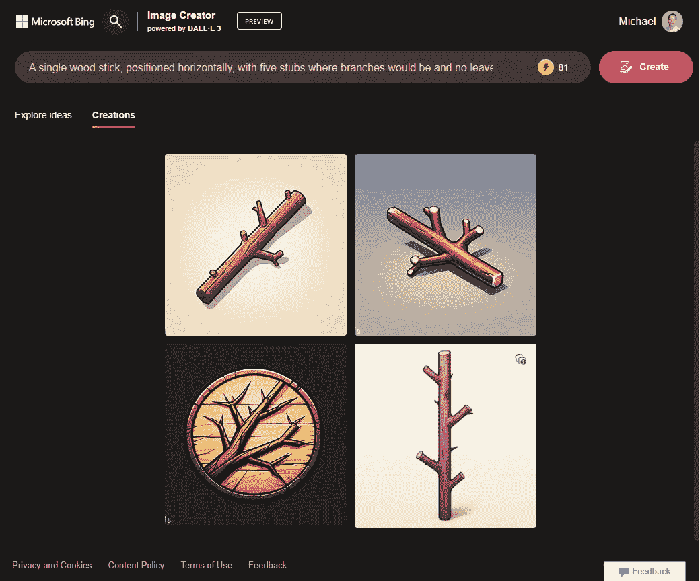

图 10.7 – Image Creator 的图像样本集

1.  一旦你有一个满意的图片，点击图片以打开它。

1.  点击**下载**按钮将图片保存到你的本地计算机。

1.  现在，在您喜欢的图像编辑器中打开下载的文件。Image Creator 创建的图像大约是 1024 x 1024，理想情况下，图像应该是 3:9 的比例，或者大约 300 x 900 像素。使用您的图像编辑器工具，裁剪图像，使其大约为 300 x 900 像素。

1.  将图像保存为 `hstick.jpeg`，如果棍子是水平放置，或者保存为 `vstick.jpeg`，如果棍子是垂直放置，在 `SticksAndStones.App` 项目的 `Resources/Images` 文件夹中。

1.  使用相同的图像编辑工具，将图像旋转 90 度，使其方向相反，并将图像保存到 `Resources/``I``mages` 文件夹中，如果棍子现在是水平放置，则保存为 `hstick.jpeg`，如果是垂直放置，则保存为 `vstick.jpeg`。

我们几乎完成了所需创建的一半图像。让我们接下来创建石头：

1.  在 Microsoft Edge 或您喜欢的网页浏览器中打开 [`bing.com/create`](https://bing.com/create)。

1.  如果需要，使用您的 Microsoft 账户登录。这可以与您在 *第九章* 中用于登录 Azure 门户的同一账户相同。

1.  在提示框中，输入以下提示，然后按 **创建**：

    ```cs
    3 grey stones, arranged closely together, no background, game art
    ```

1.  通过处理提示，得到三块石头整齐堆叠在一起，最好是在白色背景上，如图所示：

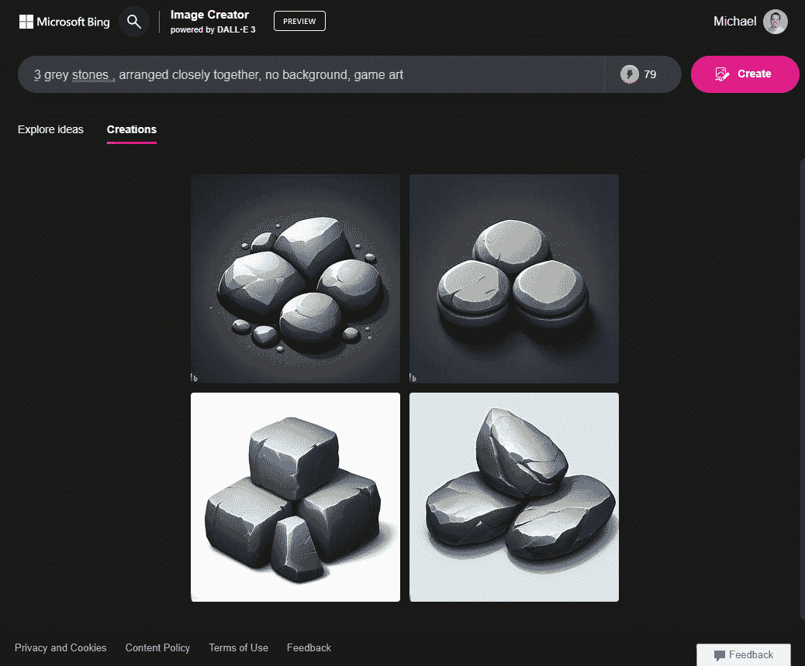

图 10.8 – 白色背景上的三块石头

1.  当您对生成的图像满意时，点击图像以打开它。

1.  点击 **下载** 按钮将图像保存到您的本地计算机。

1.  现在，在您喜欢的图像编辑器中打开下载的文件。由于石头应该是方形图像，我们只需将文件保存到 `Resources/Images` 文件夹中，文件名为 `stones.jpeg`。

没有图像编辑器？

没有您喜欢的图像编辑器？如果您使用的是 Windows，Paint 可以很好地完成这项工作，或者您可以使用 Visual Studio 编辑图像。在 macOS 上，您可以使用预览。

太好了，我们现在有了玩游戏所需的棍子和石头，这也标志着 Image Creator 生成游戏图像的使用结束。您总是可以返回网站并查看以前的结果，这是一个很好的功能。现在，我们可以继续创建 `Connect` 视图。

#### 创建连接视图

`Connect` 视图是用户在应用程序中除了启动画面外将看到的第一个 UI。*图 10**.6* 提供了最终视图的表示。如果您决定生成自己的图像，图像可能会有所不同。我们将把这个部分分为三个部分。首先，我们将创建包含静态内容的视图顶部部分，然后继续创建包含输入控制的视图中间部分，最后，创建 **连接** 按钮。让我们通过以下步骤开始创建视图的顶部部分：

1.  在 `SticksAndStones.App` 项目中创建一个名为 `Views` 的文件夹。

1.  右键单击 `Views` 文件夹，选择 **添加**，然后点击 **新建项...**。

    如果您正在使用 Visual Studio 17.7 或更高版本，请点击弹出对话框中的 **显示所有模板** 按钮；否则，转到下一步。

1.  在左侧的 **C# Items** 节点下，选择 **.NET MAUI**。

1.  选择 `ConnectView.xaml`。

1.  点击 **添加** 创建页面。

    参考以下截图查看上述信息：

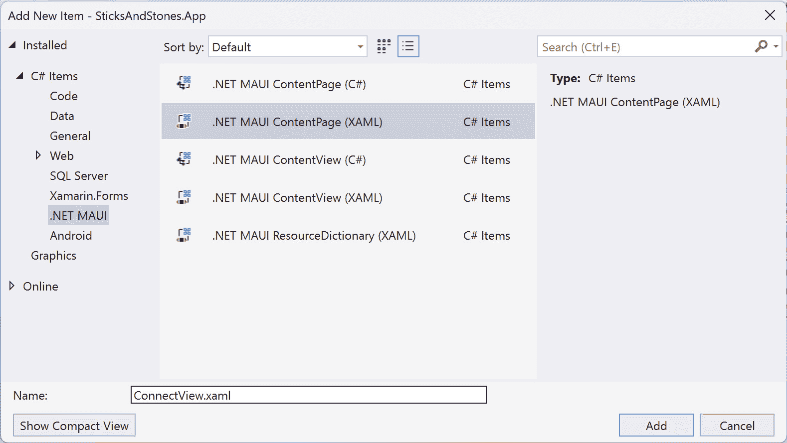

图 10.9 – 添加新的 .NET MAUI ContentPage (XAML)

1.  将视图的标题更改为 `Sticks & Stones`。由于 XAML 是 XML 的方言，字符串中的 `&` 必须转义为 `&amp;`。

    将以下突出显示的命名空间添加到 `ContentView` 元素中。它们将为我们提供访问 `ViewModels`、`Controls` 和 `Toolkit` 命名空间中的类的能力：

    ```cs
    <ContentPage xmlns=“http://schemas.microsoft.com/dotnet/2021/maui”
                 xmlns:x=“http://schemas.microsoft.com/winfx/2009/xaml”
            xmlns:viewModels=“clr-namespace:SticksAndStones.ViewModels”
            xmlns:controls=“clr-namespace:SticksAndStones.Controls”
                  xmlns:toolkit=“http://schemas.microsoft.com/dotnet/2022/maui/toolkit”
                 x:Class=“SticksAndStones.Views.ConnectView”
                 Title=“Sticks and Stones”>
    ```

1.  为了让 IntelliSense 对我们将要添加的绑定感到满意，通过在 `ContentView` 元素中添加 `x:DataType` 属性来定义视图所使用的视图模型，如下所示：

    ```cs
    <ContentPage  xmlns=“http://schemas.microsoft.com/dotnet/2021/maui”
                 xmlns:x=“http://schemas.microsoft.com/winfx/2009/xaml”
            xmlns:viewModels=“clr-namespace:SticksAndStones.ViewModels”
            xmlns:controls=“clr-namespace:SticksAndStones.Controls”
                 xmlns:toolkit=“http://schemas.microsoft.com/dotnet/2022/maui/toolkit”
                 x:Class=“SticksAndStones.Views.ConnectView”
            x:DataType=“viewModels:ConnectViewModel”
            Title=“Sticks and Stones”>
    ```

1.  我们不希望用户使用任何导航，例如 `Shell` 提供的 `Back` 按钮，除了本页提供的之外，因此请使用以下列表中突出显示的代码禁用它：

    ```cs
    <ContentPage xmlns=“http://schemas.microsoft.com/dotnet/2021/maui”
                 xmlns:x=“http://schemas.microsoft.com/winfx/2009/xaml”
            xmlns:viewModels=“clr-namespace:SticksAndStones.ViewModels”
            xmlns:controls=“clr-namespace:SticksAndStones.Controls”
                 xmlns:toolkit=“http://schemas.microsoft.com/dotnet/2022/maui/toolkit”
                 x:Class=“SticksAndStones.Views.ConnectView”
            x:DataType=“viewModels:ConnectViewModel”
            Title=“Sticks and Stones”
            BackgroundColor of the entire view to White, which will make the images blend better, by adding the following highlighted code:

    ```

    <ContentPage xmlns=“http://schemas.microsoft.com/dotnet/2021/maui”

    xmlns:x=“http://schemas.microsoft.com/winfx/2009/xaml”

    xmlns:viewModels=“clr-namespace:SticksAndStones.ViewModels”

    xmlns:controls=“clr-namespace:SticksAndStones.Controls”

    xmlns:toolkit=“http://schemas.microsoft.com/dotnet/2022/maui/toolkit”

    x:Class=“SticksAndStones.Views.ConnectView”

    x:DataType=“viewModels:ConnectViewModel”

    Title=“Sticks & Stones”

    NavigationPage.HasNavigationBar=“False”

    定义了四行的 `Grid` 控制器；在 `ContentPage` 元素内添加以下代码：

    ```cs
    <Grid Margin=“40”>
        <Grid.RowDefinitions>
            <RowDefinition Height=“8*”/>
            <RowDefinition Height=“2*”/>
            <RowDefinition Height=“8*”/>
            <RowDefinition Height=“1*”/>
        </Grid.RowDefinitions>
    </Grid>
    ```

    `Grid` 使用 `40` 的 `Margin` 值来为图像和控制提供足够的空白。第 `8` 单位的第 `1` 行将包含应用的标志。第 `2` 行将包含文本 `Sticks & Stones`。第 `3` 行将包含头像图像、电子邮件和游戏标签输入控件。最后一行将包含 `Connect` 按钮。记住，`Height` 单位是相对的，所以第 `0` 行，即第一行，将是第 `1` 行的四倍高，是第 `3` 行，即最后一行的八倍高。`Height` 值中的 `*` 符号表示如果需要，该行可以扩展。

    ```cs

    ```

1.  为了将生成的图像排列成类似盒子的布局，我们使用另一个 `Grid` 控制器。在 `</Grid.RowDefinitions>` 和 `</Grid>` 标签之间添加以下列表：

    ```cs
    <Grid Grid.Row=“0” WidthRequest=“150” HeightRequest=“150”>
        <Grid.ColumnDefinitions>
            <ColumnDefinition Width=“1*” />
            <ColumnDefinition Width=“5*” />
            <ColumnDefinition Width=“1*” />
        </Grid.ColumnDefinitions>
        <Grid.RowDefinitions>
            <RowDefinition Height=“1*” />
            <RowDefinition Height=“4*” />
            <RowDefinition Height=“1*” />
        </Grid.RowDefinitions>
        <Image Grid.Row=“0” Grid.Column=“1” Source=“hstick.jpeg” Aspect=“Fill”/>
        <Image Grid.Row=“1” Grid.Column=“0” Source=“vstick.jpeg” Aspect=“Fill”/>
        <Image Grid.Row=“1” Grid.Column=“1” Source=“stones.jpeg” Aspect=“AspectFit”/>
        <Image Grid.Row=“1” Grid.Column=“2” Source=“vstick.jpeg” Aspect=“Fill”/>
        <Image Grid.Row=“2” Grid.Column=“1” Source=“hstick.jpeg” Aspect=“Fill”/>
    </Grid>
    ```

    这个 `Grid` 控件定义了三行和三列。`Grid` 的内容完全由 `Image` 控件组成。`Grid` 位于其父 `Grid` 的行 `0`。网格的子控件，即 `Image` 控件，通过在 `Image` 控件上设置 `Grid.Row` 和 `Grid.Column` 属性来定位。棍子图像使用设置为 `Fill` 的 `Aspect` 属性。`Fill` 允许图像缩放以完全填充内容区域；为此，它可能不会在 *x* 和 *y* 轴上均匀缩放。石头使用 `Aspect` 值为 `AspectFit`。这将均匀缩放图像，直到至少一边适合，这可能会导致信封式显示。`Aspect` 属性还有两个其他选项：`Center`，它不进行缩放，和 `AspectFill`，它将缩放直到两个轴都填满视图，这可能会导致裁剪。

1.  在外部的 `Grid` 控件中添加一个包含文本 `Connect to Sticks & Stones` 的 `Label` 元素，并将其放置在行 `1`，即 `Grid` 的第二行。在 *步骤 11* 中添加的内部 `Grid` 控件之后，将以下代码添加到外部的 `Grid` 控件中：

    ```cs
    <Label Grid.Row="1" Text="Connect to Sticks &amp; Stones" FontSize="20" TextColor="Black" FontAttributes="Bold" Margin="0,0,0,20" HorizontalOptions="Center"/>
    ```

1.  页面的下一部分包含头像图片、游戏标签输入和电子邮件输入控件。使用 `HorizontalStackLayout` 和 `VerticalStackLayout` 控件来排列控件。在 *步骤 12* 中添加的 `Label` 控件之后，将以下代码片段添加到外部的 `Grid` 控件中：

    ```cs
    <HorizontalStackLayout Grid.Row="2" HorizontalOptions="Center">
        <VerticalStackLayout Spacing="10" > 
            <Image HeightRequest="96" WidthRequest="96" BackgroundColor="LightGrey">
                <Image.Source>
                    <toolkit:GravatarImageSource
                        Email="{Binding EmailAddress}"
                        Image="MysteryPerson" />
                </Image.Source>
            </Image>
        </VerticalStackLayout>
        <VerticalStackLayout Spacing="10" >
            <Entry Placeholder="username" Keyboard="Email" Text="{Binding Username}" HorizontalTextAlignment="Start" HorizontalOptions="FillAndExpand"/>
            <Entry Placeholder="user@someaddress.com" Keyboard="Email" Text="{Binding EmailAddress}" HorizontalTextAlignment="Start" HorizontalOptions="FillAndExpand"/>
        </VerticalStackLayout>
    </HorizontalStackLayout>
    ```

    `HorizontalStackLayout` 控件被分配到 `Grid` 的第二行，即第三行。它在该行内水平居中。第一个 `VerticalStackLayout` 安排了组成头像的控件。它包含一个 `Image` 元素，其源设置为 `GravatarImageSource` 的实例。`GravatarImageSource` 使用 `ConnectViewModel` 的 `EmailAddress` 属性并将其绑定到 `GravatarImageSource` 的 `Email` 属性。当 `EmailAddress` 发生变化时，图片将自动更新。`Image` 属性使用 `MysteryPerson` 值在电子邮件地址没有可用的 Gravatar 时提供一个简单的个人资料。第二个 `VerticalStackLayout` 包含两个 `Entry` 控件：第一个，用于游戏标签，绑定到 `ConnectViewModel` 的 `Username` 属性，第二个绑定到 `ConnectViewModel` 的 `EmailAddress` 属性。`Keyboard` 属性确定当焦点在控件上时显示哪个虚拟键盘。有关自定义键盘的更多信息，请参阅 [`learn.microsoft.com/en-us/dotnet/maui/user-interface/controls/entry#customize-the-keyboard`](https://learn.microsoft.com/en-us/dotnet/maui/user-interface/controls/entry#customize-the-keyboard)。

1.  要添加到 `ConnectView` 的最后一个控件是 `Connect` 按钮。使用以下代码片段将按钮添加到视图中：

    ```cs
    <controls:ActivityButton Grid.Row="3" 
                             IsRunning="{Binding IsConnecting}" 
                             Text="{Binding ConnectStatus}" 
                             BackgroundColor="#e8bc65" 
                             Command="{Binding ConnectCommand}" 
                             HorizontalOptions="Center" 
                             WidthRequest="200" 
                             HeightRequest="48"/>
    ```

    “连接”按钮使用在 *创建 ActivityButton 控件* 中创建的 `ActivityButton` 控件。控件位于第 3 行，第四行，`IsRunning` 属性绑定到 `ConnectViewModel.IsConnecting` 方法。按钮的 `Text` 属性绑定到 `ConnectViewModel.ConnectStatus` 属性，最后，`Command` 绑定到 `ConnectViewModel.Connect` 方法。

1.  在`SticksAndStones.App`项目中打开 `MauiProgram.cs` 文件，并将以下高亮行添加以使用依赖注入注册 `ConnectView`：

    ```cs
    builder.Services.AddSingleton<Services.GameService>();
    builder.Services.AddTransient<ViewModels.ConnectViewModel>();
    builder.Services.AddTransient<Views.ConnectView>();
    return builder.Build();
    ```

1.  现在，我们需要通过依赖注入消耗 `ConnectViewModel` 实例并将其设置为绑定对象。打开 `ConnectView.Xaml.cs` 文件并按以下方式修改：

    ```cs
    using SticksAndStones.ViewModels;
    namespace SticksAndStones.Views;
    public partial class ConnectView : ContentPage
    {
        public ConnectView(ConnectViewModel viewModel)
        {
            this.BindingContext = viewModel;
            InitializeComponent();
        }
    }
    ```

1.  最后，我们需要将 `ConnectView` 设置为第一个显示的视图。在 `SticksAndStones.App` 项目中打开 `AppShell.xaml` 文件，并更新 `Shell` 元素的内容，如所示：

    ```cs
    <Shell
        x:Class="SticksAndStones.App.AppShell"

        Shell.FlyoutBehavior="Disabled">
        <ShellItem Route="Connect">
            <ShellContent ContentTemplate="{DataTemplate views:ConnectView}" />
        </ShellItem>
    </Shell>
    ```

应用程序中的三个视图中的第一个已经完成。要测试它，请按照以下步骤操作：

1.  在 Visual Studio 中，在 **解决方案资源管理器** 中右键单击 `SticksAndStones.Functions` 项目，然后选择 **调试** | **不调试启动**。

1.  在 `SticksAndStones.App` 项目中，选择 **设置为** **启动项目**。

1.  按 *F5* 启动 `SticksAndStones.App` 项目，使用调试器。

“大厅”页面，它将允许我们与其他玩家开始游戏。

## 创建大厅页面

“大厅”页面显示已连接玩家的列表，并允许玩家向其他玩家发起比赛挑战。随着更多玩家连接到服务器，他们将被添加到可用玩家列表中。*图 10.10* 显示了页面的两个视图，一个包含已连接玩家，另一个在没有其他玩家连接时为空视图。

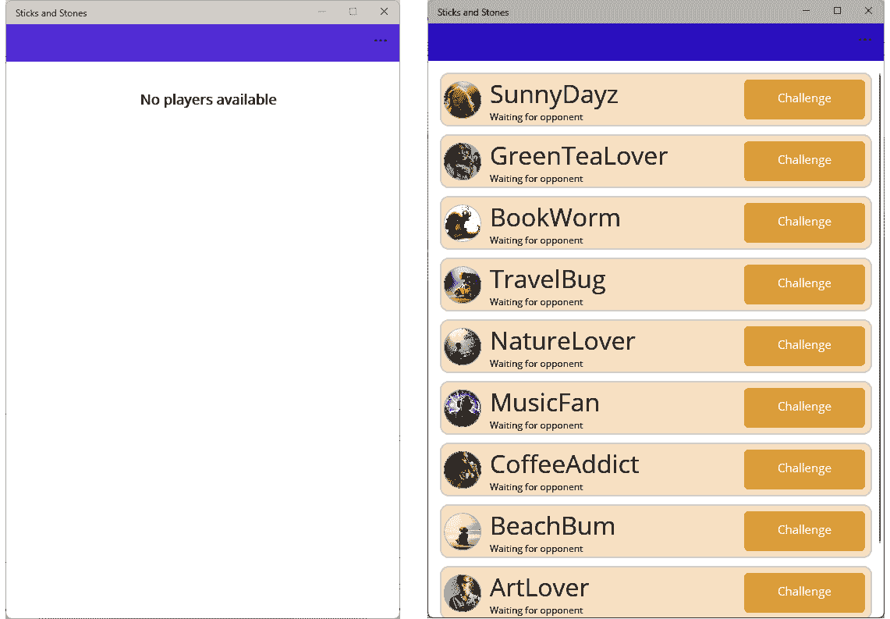

图 10.10 – 大厅视图

每个玩家都显示在一个卡片上，其中包含他们的头像图像、游戏标签、状态以及一个按钮，允许玩家向其他玩家发起比赛挑战。

此页面由两个 `ViewModel` 类组成，而不是一个。正如你可能预期的，有一个 `LobbyViewModel` 类，该类有一个 `PlayerViewModel` 实例的集合。除了 `ViewModel` 类之外，还有一个 `LobbyView` 类。让我们从创建 `PlayerViewModel` 类开始。

### 添加 PlayerViewModel

`PlayerViewModel` 与我们所有的其他 `ViewModel` 类非常相似，但有一点细微的区别：它没有直接绑定到视图。否则，它具有相同的目的：抽象模型，在这种情况下是 `Player`，从显示它的 UI 中分离出来。`PlayerViewModel` 提供了显示每个单个玩家卡片在 `LobbyView` 中所需的所有绑定属性。要添加 `PlayerViewModel`，请按照以下步骤操作：

1.  在 `SticksAndStones.App` 项目中，在 `ViewModels` 文件夹下创建一个名为 `PlayerViewModel` 的新类。

1.  将以下命名空间添加到文件顶部：

    ```cs
    using CommunityToolkit.Mvvm.ComponentModel;
    using CommunityToolkit.Mvvm.Input;
    using SticksAndStones.Models;
    using SticksAndStones.Services;
    ```

1.  将以下代码添加到类中：

    ```cs
    private readonly Player playerModel;
    private readonly GameService gameService;
    public PlayerViewModel(Player player, GameService gameService)
    {
        playerModel = player;
        this.gameService = gameService;
    }
    ```

    这将为构造函数传入的参数值添加两个 `private` 字段。与 `ConnectViewModel` 类似，构造函数的参数由依赖注入提供。

1.  玩家卡片显示玩家的游戏标签、头像和状态。将以下代码添加到 `PlayerViewModel` 类中，以添加 `Id` 和 `GamerTag` 属性：

    ```cs
    public Guid Id => playermodel.Id;
    public string GamerTag => playerModel.GamerTag;
    ```

    对于 `PlayerViewModel`，我们绑定的一些属性并没有使用 `ObservablePropertyAttribute` 实现。这是因为我们直接从 `Player` 模型提供它们的值。因此，属性的 `get` 方法只是返回模型对象的相应属性。没有定义的 `set` 方法，所以这个属性本质上是一个单向数据绑定。

1.  `Status` 属性有一点不同，因为它不在我们的 `Player` 模型上存在。`Status` 属性是玩家是否在比赛中的文本指示。`Player` 模型确实有一个 `MatchId` 属性，所以如果 `Player` 模型有一个有效的 `MatchId`（即，不是 `Guid.Empty`），则状态将是 `"In a match"`；否则，该状态将是 `"Waiting for opponent"`。将以下代码添加到 `PlayerViewModel` 以实现 `Status` 属性：

    ```cs
    public bool IsInMatch => !(playerModel.MatchId == Guid.Empty);
    public string Status => IsInMatch switch
    {
        true => "In a match",
        false => "Waiting for opponent"
    };
    ```

    `IsInMatch` 属性用于简化 `Status` 属性的实现。它也将在类中稍后使用。`Status` 属性是一个简单的基于 `IsInMatch` 的开关，并返回适当的 `string` 值。

1.  要添加一个处理 `Challenge` 按钮的命令，将以下代码添加到 `PlayerViewModel` 类中：

    ```cs
    [ObservableProperty]
    [NotifyPropertyChangedFor(nameof(ChallengeStatus))]
    private bool isChallenging = false;
    public string ChallengeStatus => IsChallenging switch
    {
        true => "Challenging...",
        false => "Challenge"
    };
    public bool CanChallenge => !IsInMatch && !IsChallenging;
    [RelayCommand(CanExecute = nameof(CanChallenge))]
    public void Challenge(PlayerViewModel opponent)
    {
        MainThread.BeginInvokeOnMainThread(async () =>
        {
            IsChallenging = true;
            bool answer = await Shell.Current.CurrentPage.DisplayAlert("Issue Challenge!", $" You are about to challenge {GamerTag} to a match!\nAre you sure?", "Yes", "No");
            if (answer)
            {
                await gameService.IssueChallenge(opponent.Player);
            }
            IsChallenging = false;
        });
        return;
    }
    ```

    当命令正在等待挑战响应时，它会阻止执行，这是有道理的——没有必要催促其他玩家。在挑战期间，`IsChallenging` 属性设置为 `true`，完成时设置为 `false`。`CanChallenge` 属性是 `IsInMatch` 和 `IsChallenging` 的组合，这意味着你不能在有现有挑战进行时挑战同一玩家，也不能挑战已经与其他玩家进行比赛的玩家。用作按钮文本的 `ChallengeStatus` 绑定到 `IsChallenging` 值，并在该属性更新时更新。你可能已经注意到我们的命令只接受一个参数。这是用来操作正确玩家的。

这完成了 `PlayerViewModel` 的实现。接下来，使用 `LobbyViewModel` 来封装 `PlayerViewModel` 对象集合。

### 添加 LobbyViewModel

`LobbyViewModel` 的实现相当直接。它有一个暴露给 UI 的 `PlayerViewModel` 对象集合，允许用户下拉刷新视图，并处理 `ChallengeReceived`、`MatchStarted` 和 `ServiceError` 消息。按照以下步骤实现 `LobbyViewModel`：

1.  在 `SticksAndStones.App` 项目中，在 `ViewModels` 文件夹内，创建一个名为 `LobbyViewModel` 的新类。

1.  将以下命名空间添加到文件顶部：

    ```cs
    using System.Collections.ObjectModel;
    using System.Collections.Specialized;
    using CommunityToolkit.Mvvm.Messaging;
    using SticksAndStones.Messages;
    using SticksAndStones.Models;
    using SticksAndStones.Services;
    ```

1.  将类声明修改为从 `ViewModelBase` 继承的 `public partial` 类，如下所示：

    ```cs
    LobbyViewModel class:

    ```

    private readonly GameService gameService;

    public ObservableCollection<PlayerViewModel> Players { get; init; }

    public LobbyViewModel(GameService gameService)

    {

    this.gameService = gameService;

    Players = new(from p in gameService.Players

    where p.Id != gameService.CurrentPlayer.Id

    select new PlayerViewModel(p, gameService));

    CanRefresh = true;

    IsActive = true;

    }

    ```cs

    `LobbyViewModel` receives an instance of `GameService` via dependency injection. The `gameService` instance is used to initialize the `Players` list. The `Players` property from the `GameService` class is a collection of the `Player` model, whereas `Players` in `LobbyViewModel` is an `ObservableCollection` `instance` of `PlayerViewModel`. We use `ObservableCollection` because it provides support for `INotifyPropertyChanged` and `INotifyCollectionChanged` when it is bound automatically. A LINQ query is used to get all the current players and add them to the `Players` `ObservableCollection`. `CanRefresh` from `ViewModelBase` is set to `true`, which enables `RefreshCommand`. Finally, `IsActive` is set to `true`, which enables the `OnActivated` and `OnDeactivated` events.
    ```

1.  随着 `GameService.Players` 列表中的玩家连接到服务器，该列表将更新。然而，这些更改不会自动传播到 `LobbyViewModel.Players` 集合。通过实现 `GameService.Players` 属性的 `CollectionChanged` 事件的处理程序，我们可以相应地更新 `LobbyViewModel.Players` 集合。向 `LobbyViewModel` 类添加以下方法：

    ```cs
    private void OnPlayersCollectionChanged(object? sender, 
    NotifyCollectionChangedEventArgs e)
    {
        if (e.Action == NotifyCollectionChangedAction.Add)
        {
            foreach (var player in e.NewItems.Cast<Player>())
            {
                Players.Add(new PlayerViewModel(player, gameService));
            }
        }
        else if (e.Action == NotifyCollectionChangedAction.Remove)
        {
            foreach (var player in e.OldItems.Cast<Player>())
            {
                var toRemove = Players.FirstOrDefault(p => p.Id == player.Id);
                Players.Remove(toRemove);
            }
        }
        else if (e.Action == NotifyCollectionChangedAction.Replace)
        {
        }
        else if (e.Action == NotifyCollectionChangedAction.Reset)
        {
            Players.Clear();
        }
    }
    ```

    `OnPlayersCollectionChanged` 方法是 `Notify` **CollectionChangedEventHandler** 的实现。它由 `Observable` **Collection.CollectionChanged** 事件调用。每当集合中的项目被添加、删除或更新时，都会调用此事件。当整个集合被清除时，也会调用此事件。此方法处理 `NotifyCollectionChangedAction` 的 `Add`、`Remove` 和 `Reset` 值。

1.  在 `OnActivated` 事件处理程序中，将 `Players.CollectionChanged` 事件分配给 `OnPlayers` **CollectionChanged** 方法。使用以下代码添加 `OnActivated` 和 `OnDeactivated` 方法：

    ```cs
    protected override void OnActivated()
    {
        gameService.Players.CollectionChanged += OnPlayersCollectionChanged;
        // If the player has an in progress match, take them to it.
        if (gameService.CurrentPlayer?.MatchId != Guid.Empty)
        {
            MainThread.InvokeOnMainThreadAsync(async () =>
            {
                IsActive = false;
                await Shell.Current.GoToAsync(Constants.ArgumentNames.MatchId, new Dictionary<string, object>() { { "MatchId", gameService.CurrentPlayer.MatchId } });
            });
        }
    }
    protected override void OnDeactivated()
    {
        gameService.Players.CollectionChanged -= OnPlayersCollectionChanged;
    }
    ```

    在 `OnActivated` 方法中，将 `CollectionChanged` 事件分配给 `OnPlayersCollectionChanged` 方法，并在 `OnDeactivated` 方法中取消分配。在 `OnActivated` 中，还有一个检查以查看玩家是否已经在比赛中。如果是，则应用程序立即导航到 `Match` 视图。在导航到 `Match` 视图时，我们发送一个 `Match` 参数。这将要么是 `MatchId`，要么是 `Match` 模型。

1.  打开 `SticksAndStones.Shared` 项目的 `Constants.cs` 文件，将以下代码片段添加到 `Constants` 类中：

    ```cs
    public class ArgumentNames
    {
        public static readonly string Match = nameof(Match);
        public static readonly string MatchId = nameof(MatchId);
    }
    ```

1.  在大厅中，有三个消息需要处理：`ChallengeReceived`、`MatchStarted` 和 `ServerError`。将以下代码添加到每个消息的处理程序中：

    ```cs
    private void OnChallengeReceived(Guid challengeId, Player opponent)
    {
        MainThread.BeginInvokeOnMainThread(async () =>
        {
            bool answer = await Shell.Current.CurrentPage.DisplayAlert("You have been challenged!", $"{opponent.GamerTag} has challenged you to a match of Sticks & Stones, do you accept?", "Yes", "No");
            await gameService.SendChallengeResponse(challengeId, answer ? Models.ChallengeResponse.Accepted : Models.ChallengeResponse.Declined);
        });
    }
    private void OnMatchStarted(Match match)
    {
        MainThread.BeginInvokeOnMainThread(async () =>
        {
            IsActive = false;
            await Shell.Current.GoToAsync($"///Match", new Dictionary<string, object>() { { Constants.ArgumentNames.Match, match } });
        });
    }
    private void OnServiceError(AsyncError error)
    {
        MainThread.BeginInvokeOnMainThread(async () =>
        {
            IsActive = false;
            await Shell.Current.CurrentPage.DisplayAlert("There is a problem...",error.Message, "Ok");
        });
    }
    ```

    在 `OnChallengeReceived` 中，用户被提示接受或拒绝挑战。然后，他们的响应通过 `GameService` 类的 `SendChallengeResponse` 方法发送给挑战者。`OnMatchStarted` 将用户导航到 `Match` 视图。最后，`OnServiceError` 将错误显示给用户。

1.  在 `OnActivated` 方法的顶部添加以下代码片段以注册接收消息：

    ```cs
    Messenger.Register<ChallengeRecieved>(this, (r, m) => OnChallengeReceived(m.Id, m.Value));
    Messenger.Register<MatchStarted>(this, (r, m) => OnMatchStarted(m.Value));
    Messenger.Register<ServiceError>(this, (r, m) => OnServiceError(m.Value));
    ```

1.  在 `OnDeactivated` 方法的末尾添加以下代码片段以停止接收消息：

    ```cs
    Messenger.Unregister<ChallengeRecieved>(this);
    Messenger.Unregister<MatchStarted>(this);
    Messenger.Unregister<ServiceError>(this);
    ```

1.  当用户在 UI 中下拉列表时刷新 `Players` 列表，请向 `LobbyViewModel` 类添加以下方法：

    ```cs
    protected override async Task RefreshInternal()
    {
        await gameService.RefreshPlayerList();
        return;
    }
    ```

1.  `LobbyViewModel` 需要使用依赖注入进行注册，因此打开 `MauiProgram.cs` 文件并添加以下高亮显示的代码行：

    ```cs
    builder.Services.AddTransient<ViewModels.ConnectViewModel>();
    builder.Services.AddTransient<ViewModels.LobbyViewModel>();
    builder.Services.AddTransient<Views.ConnectView>();
    ```

`LobbyViewModel` 现在已经完成，现在是时候创建视图了！

### 添加大厅视图

`The Lobby` 视图简单地显示连接玩家的列表，包括他们的头像、游戏标签和当前状态。要构建 `LobbyView`，请按照以下步骤操作：

1.  右键单击 `SticksAndStone.App` 项目的 `Views` 文件夹，选择 **添加**，然后点击 **新建项...**。

    如果您正在使用 Visual Studio 17.7 或更高版本，请点击弹出对话框中的 **显示所有模板** 按钮；否则，转到下一步。

1.  在左侧的 **C# 项** 节点下，选择 **.****NET MAUI**。

1.  选择 `LobbyView.xaml`。

1.  点击 **添加** 创建页面。

    参考以下截图查看前面的信息：

    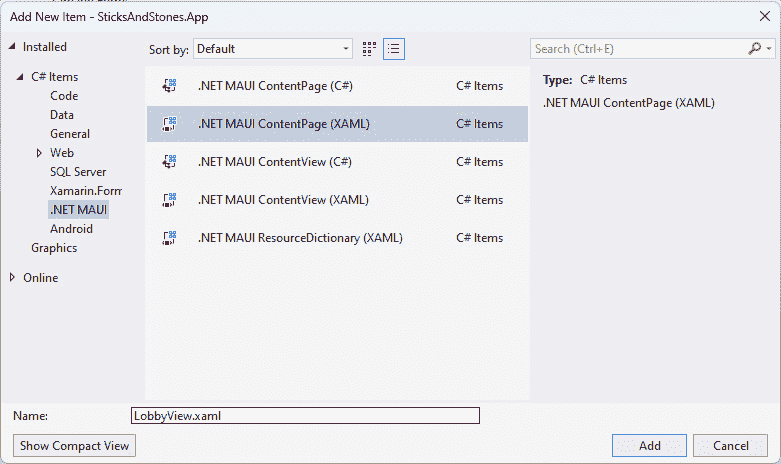

图 10.11 – 添加新的 .NET MAUI 内容页 (XAML)

1.  打开 `LobbyView.xaml.cs` 文件并添加以下 `using` 声明：

    ```cs
    using SticksAndStones.ViewModels;
    ```

1.  对构造函数进行以下高亮显示的更改：

    ```cs
    public LobbyView(LobbyViewModel viewModel)
    {
        this.BindingContext = viewModel;
        InitializeComponent();
    }
    ```

    这些更改允许依赖注入提供 `LobbyViewModel` 实例给视图，然后将其分配给 `BindingContext`。

1.  打开 `AppShell.xaml` 文件并将以下代码片段添加到 `ContentPage` 元素中：

    ```cs
    <ShellItem Route="Lobby">
        <ShellContent ContentTemplate="{DataTemplate views:LobbyView}" />
    </ShellItem>
    ```

    这将注册 `"Lobby"` 路由并将其指向 `LobbyView`。

1.  打开 `MauiProgram.cs` 文件并添加以下高亮显示的代码行：

    ```cs
    builder.Services.AddTransient<Views.ConnectView>();
    builder.Services.AddTransient<Views.LobbyView>();
    return builder.Build();
    ```

    这将使用依赖注入注册 `LobbyView`，以便 `DataTemplate` 可以定位它。

1.  打开 `LobbyView.xaml` 文件并将 `ContentPage` 元素的 `Title` 属性更改为 `"Lobby"`。

1.  将以下高亮显示的命名空间添加到 `LobbyView` 元素中；它们将为我们提供访问 `ViewModels`、`Controls` 和 `Toolkit` 命名空间中的类：

    ```cs
    <ContentPage xmlns=“http://schemas.microsoft.com/dotnet/2021/maui”
                 xmlns:x=“http://schemas.microsoft.com/winfx/2009/xaml”
            xmlns:viewModels=“clr-namespace:SticksAndStones.ViewModels”
            xmlns:controls=“clr-namespace:SticksAndStones.Controls”
            xmlns:toolkit=“ http://schemas.microsoft.com/dotnet/2022/maui/toolkit”
                 x:Class=“SticksAndStones.Views.LobbyView”>
    ```

1.  为了让 IntelliSense 对我们将要添加的绑定感到满意，通过在 `LobbyView` 元素中添加 `x:DataType` 属性来定义视图所使用的视图模型，如下所示：

    ```cs
    <ContentPage xmlns=“http://schemas.microsoft.com/dotnet/2021/maui”
                 xmlns:x=“http://schemas.microsoft.com/winfx/2009/xaml”
            xmlns:viewModels=“clr-namespace:SticksAndStones.ViewModels”
            xmlns:controls=“clr-namespace:SticksAndStones.Controls”
            xmlns:toolkit=“ http://schemas.microsoft.com/dotnet/2022/maui/toolkit”
            x:DataType=“viewModels:LobbyViewModel”
                 x:Class=“SticksAndStones.Views.LobbyView”>
    ```

1.  我们不希望用户使用任何导航，例如此页面上提供的 `Shell` 提供的 `Back` 按钮，因此使用以下列表中的高亮代码禁用它：

    ```cs
    <ContentPage xmlns=“http://schemas.microsoft.com/dotnet/2021/maui”
                 xmlns:x=“http://schemas.microsoft.com/winfx/2009/xaml”
            xmlns:viewModels=“clr-namespace:SticksAndStones.ViewModels”
            xmlns:controls=“clr-namespace:SticksAndStones.Controls”
            xmlns:toolkit=“ http://schemas.microsoft.com/dotnet/2022/maui/toolkit”
            x:Class=“SticksAndStones.Views.LobbyView”
            x:DataType=“viewModels:LobbyViewModel”
            BackgroundColor value of the entire view to White, which will make the images blend better, by adding the following highlighted code:

    ```

    <ContentPage xmlns=“http://schemas.microsoft.com/dotnet/2021/maui”

    xmlns:x=“http://schemas.microsoft.com/winfx/2009/xaml”

    xmlns:viewModels=“clr-namespace:SticksAndStones.ViewModels”

    xmlns:controls=“clr-namespace:SticksAndStones.Controls”

    xmlns:toolkit=“ http://schemas.microsoft.com/dotnet/2022/maui/toolkit”

    x:Class=“SticksAndStones.Views.ConnectView”

    x:DataType=“viewModels:ConnectViewModel”

    Title=“ConnectView”

    NavigationPage.HasNavigationBar=“False”

    包含以下代码片段的内容页：

    ```cs
    <RefreshView IsRefreshing=“{Binding IsRefreshing}” Command=“{Binding RefreshCommand}”>
        <ScrollView Padding=“5”>
            <CollectionView ItemsSource=“{Binding Players}” Margin=”5,5,5,0 SelectionMode=“None”>
            </CollectionView>
        </ScrollView>
    </RefreshView>
    ```

    对于 `LobbyView`，有一个垂直滚动的玩家列表。根元素是 `RefreshView`。它的 `IsRefreshing` 属性绑定到 `LobbyViewModel` 的 `IsRefreshing` 属性。`RefreshView` 的 `Command` 属性绑定到 `RefreshCommand`，这将最终执行 `LobbyViewModel` 的 `RefreshInternal` 方法。`IsRefreshing` 和 `RefreshCommand` 在 `BaseViewModel` 类中实现。在 `RefreshView` 内部是 `ScrollView`，它提供了滚动能力以显示长列表。在 `ScrollView` 内部是 `CollectionView`，它将显示每个 `Player` 实例作为一个单独的项目，因此 `ItemsSource` 绑定到 `LobbyViewModel` 的 `Players` 属性。由于没有真正需要选择单个 `Player` 项目，`SelectionMode` 设置为 `none`。

    ```cs

    ```

1.  当列表为空时，向用户显示一些内容是很好的，这样他们就不会感到困惑。`CollectionView` 有一个 `EmptyView` 属性，用于配置在没有任何项目时显示的内容。在 `ContentPage` 开始打开标签后立即添加以下代码片段：

    ```cs
    <ContentPage.Resources>
        <ContentView x:Key="BasicEmptyView">
            <StackLayout>
                <Label Text="No players available"
                       Margin="10,25,10,10"
                       FontAttributes="Bold"
                       FontSize="18"
                       HorizontalOptions="Fill"
                       HorizontalTextAlignment="Center" />
            </StackLayout>
        </ContentView>
    </ContentPage.Resources>
    ```

    这定义了一个包含 `ContentView` 的页面资源，其 `Key` 值为 `"BasicEmptyView"`。视图包含 `StackLayout`，其中有一个 `Label` 子元素，其文本为 `"No players available"`。应用适当的样式以确保它足够大，并且有足够的周围空白。

1.  向 `CollectionView` 元素添加以下属性：

    ```cs
    EmptyView="{StaticResource BasicEmptyView}"
    ```

    这将 `BasicEmptyView` 绑定到 `CollectionView` 的 `EmptyView` 属性。*图 10**.12* 展示了运行应用并登录后的结果：

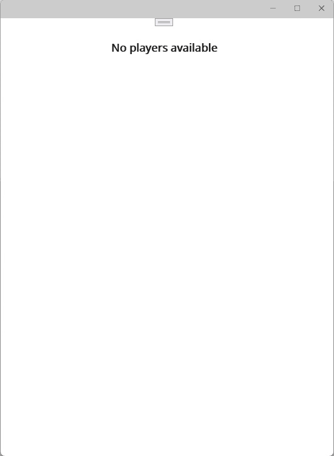

图 10.12 – 没有玩家的大厅

1.  玩家卡片也将使用静态资源，这仅仅使文件更容易阅读，并且减少了缩进。在 `ContentView.Resources` 元素下，在 `BasicEmptyView` 元素下添加以下代码片段：

    ```cs
    <DataTemplate x:Key="PlayerCardViewTemplate" x:DataType="viewModels:PlayerViewModel">
        <ContentView>
            <Border StrokeShape="RoundRectangle 10,10,10,10" BackgroundColor="AntiqueWhite" Padding="3,3,3,3" Margin="5,5,5,5">
                <Grid>
                    <Grid.ColumnDefinitions>
                        <ColumnDefinition Width="50" />
                        <ColumnDefinition Width="4*" />
                        <ColumnDefinition Width="2*" />
                    </Grid.ColumnDefinitions>
                    <toolkit:AvatarView Grid.Column="0" Margin="0" BackgroundColor="LightGrey" HeightRequest="48" WidthRequest="48" CornerRadius="25" VerticalOptions="Center" HorizontalOptions="Center">
                        <toolkit:AvatarView.ImageSource>
                            <toolkit:GravatarImageSource
                                Email="{Binding EmailAddress}"
                                Image="MysteryPerson" />
                        </toolkit:AvatarView.ImageSource>
                    </toolkit:AvatarView>
                    <VerticalStackLayout Grid.Column="1" Margin="10,0,0,0">
                        <Label Text="{Binding GamerTag}" HorizontalTextAlignment="Start" FontSize="Large" BackgroundColor="AntiqueWhite" />
                        <Label Text="{Binding Status}" HorizontalTextAlignment="Start" FontSize="Caption" BackgroundColor="AntiqueWhite"/>
                    </VerticalStackLayout>
                    <controls:ActivityButton Grid.Column="2" IsRunning="{Binding IsChallenging}" Text="{Binding ChallengeStatus}" BackgroundColor="#e8bc65" Command="{Binding ChallengeCommand}" CommandParameter="{Binding .}" IsVisible="{Binding CanChallenge}" Margin="5"/>
                </Grid>
            </Border>
        </ContentView>
    </DataTemplate>
    ```

    `DataTemplate` 将显示玩家的头像。为此，它将使用 `Image` 控件和 `GravatarImageSource`，就像在 *创建连接视图* 部分中所做的那样。需要一个 `DataTemplate` 元素，因为这是用于 `ItemTemplate` 的，然后是必选的 `ContentView`。然后定义 `Border`。它使用特殊的 `Stroke` 形状来使矩形的边缘圆润，而不是有直角，并将 `AntiqueWhite` 作为 `BackgroundColor` 值应用。可用于 `Border` 的其他形状包括 `Ellipse`、`Line`、`Path`、`Polygon`、`Polyline` 和 `Rectangle`。有关更多详细信息，请参阅 [`learn.microsoft.com/en-us/dotnet/maui/user-interface/controls/border`](https://learn.microsoft.com/en-us/dotnet/maui/user-interface/controls/border)。在 `Border` 内部有一个 `Grid` 控件，它定义了三列。第一列包含头像图像，宽度为 `50`，下一列包含玩家的游戏标签和状态，垂直堆叠，第三列包含 `Challenge` 按钮。

    对于头像，使用来自 `CommunityToolkit` 的 `AvatarView` 控件。它提供图像的圆形版本。

    `Challenge` 按钮使用 `ActivityButton` 控件，并将其绑定到 `PlayerViewModel` 的 `IsChallenging`、`CanChallenge`、`ChallengeStatus` 和 `ChallengeCommand` 属性。

1.  要将 `PlayerCardViewTemplate` 作为 `CollectionView` 的 `ItemTemplate`，请向 `CollectionView` 元素添加以下属性：

    ```cs
    ItemTemplate="{StaticResource PlayerCardViewTemplate}"
    ```

这样就完成了 `Lobby` 页面。到这一点，你应该能够启动 `SticksAndStone.Functions` 并连接到 `SticksAndStones.App` 项目，以查看 `Lobby` 视图提供的不同布局。还需要创建一个页面来完成游戏，那就是 `Match` 页面。

## 创建比赛页面

`Match` 页面显示带有玩家和分数的游戏板。它还管理游戏玩法，允许每个玩家轮流放置棍子。每个玩家轮流时，板会更新以显示比赛的当前状态。让我们开始创建 `ViewModel` 类。

### 创建 ViewModel 类

在 `Match` 页面中使用了两个不同的 `ViewModel` 类，就像在 `Lobby` 页面中一样，一个用于游戏，另一个用于玩家详细信息。

#### 添加 MatchPlayerViewModel

`MatchPlayerViewModel` 是 `Player` 模型和 `MatchView` 之间的抽象。`MatchPlayerViewModel` 需要向 `MatchView` 暴露 `Player` 模型中的 `Id`、`GamerTag` 和 `EmailAddress` 值。此外，由于每个玩家都有一个分数，因此 `Match` 模型中玩家的分数也暴露给 `MatchView`。还需要一些额外的属性：

+   `IsPlayersTurn`:

    这用于确定 `MatchPlayerViewModel` 是否是当前玩家。

+   `PlayerToken`:

    这用于将每个玩家映射到一个令牌，以跟踪哪个玩家放置了哪个木棍。使用 `-1` 或 `1` 的令牌，因为这样比使用 `Id` 属性（它是 `Guid` 类型）更容易确定赢家。回顾第九章的 *处理回合部分*，以刷新如何确定赢家。

要创建 `MatchPlayerViewModel`，请按照以下步骤操作：

1.  在 `SticksAndStones.App` 项目的 `ViewModels` 文件夹中创建一个名为 `MatchPlayerViewModel` 的新类。

1.  将 `using` 声明修改为文件顶部的以下内容：

    ```cs
    using CommunityToolkit.Mvvm.ComponentModel;
    using SticksAndStones.Models;
    ```

1.  将 `public` 和 `partial` 修饰符添加到类中，并使其继承自 `ObservableObject`，如下所示：

    ```cs
    public partial class MatchPlayerViewModel: ObservableObject
    {
    }
    ```

1.  `MatchPlayerViewModel` 是 `Player` 和 `Match` 模型的抽象，将通过构造函数传入。创建字段和构造函数，如下所示列表所示：

    ```cs
    private readonly Player playerModel;
    private readonly Match matchModel;
    public MatchPlayerViewModel(Player player, Match match)
    {
        this.playerModel = player;
        this.matchModel = match;
    }
    ```

1.  如果 `Player` 模型在 `Match` 模型中是 `PlayerOne`，则 `PlayerToken` 属性为 `1`；否则，为 `-1`。使用以下方式添加 `PlayerToken` 属性：

    ```cs
    public int PlayerToken => playerModel.Id == matchModel.PlayerOneId ? 1 : -1;
    ```

1.  如果 `Player` 模型是 `Match` 模型的 `NextPlayer`，则 `IsPlayersTurn` 属性将返回 `true`，如下所示：

    ```cs
    public bool IsPlayersTurn => playerModel.Id == matchModel.NextPlayerId;
    ```

1.  `Id`、`GamerTag` 和 `EmailAddress` 属性都直接映射到 `Player` 模型中的相应属性。这与在 `PlayerViewModel` 中用于 `Lobby` 页面的相同实现。使用以下列表将属性添加到 `MatchPlayerViewModel` 中：

    ```cs
    public Guid Id => playerModel.Id;
    public string GamerTag => playerModel.GamerTag;
    public string EmailAddress => playerModel.EmailAddress;
    ```

1.  `MatchPlayerViewModel` 需要的最后一个属性是 `Score` 属性。`Score` 属性映射到 `Match` 模型中的 `PlayerOneScore` 或 `PlayerTwoScore` 属性，具体取决于 `Player` 模型是哪个玩家。使用以下列表将 `Score` 属性添加到 `MatchPlayerViewModel` 中：

    ```cs
    public int Score => playerModel.Id == matchModel.PlayerOneId ? matchModel.PlayerOneScore : matchModel.PlayerTwoScore;
    ```

这就是 `MatchPlayerViewModel` 的全部内容。下一节将指导您创建 `MatchViewModel`。

#### 添加 MatchViewModel

`MatchViewModel` 需要提供所有游戏功能。它提供两个用于在页面标题中显示的 `MatchPlayerViewModel` 对象，以及显示已放置木棍和已捕获石头的棋盘。它还提供了玩家进行回合和选择弃权的所需功能。要实现 `MatchViewModel`，请按照以下步骤操作：

1.  在 `SticksAndStones.App` 项目的 `ViewModels` 文件夹中创建一个名为 `MatchViewModel` 的新类。

1.  修改页面顶部的 `using` 声明部分，以匹配以下列表：

    ```cs
    using CommunityToolkit.Mvvm.ComponentModel;
    using CommunityToolkit.Mvvm.Input;
    using CommunityToolkit.Mvvm.Messaging;
    using SticksAndStones.Models;
    using SticksAndStones.Services;
    ```

1.  将 `public` 和 `partial` 类修饰符添加到类中，继承自 `ViewModelBase` 并实现 `IQueryAttributable`，如下所示：

    ```cs
    public partial class MatchViewModel : ViewModelBase, IQueryAttributable
    ```

    回想一下，在 `ConnectViewModel` 和 `LobbyViewModel` 中，当它们导航到 `Match` 时，会传递一个参数——要么是 `MatchId`，要么是 `Match` 实例本身。`IQueryAttributable` 是如何将这个参数传递给 `MatchViewModel` 的。`IQueryAttributable` 的实现将在后续步骤中提供。

1.  `MatchViewModel` 只有一个依赖项，即 `GameService`，因此添加一个字段来存储实例，并添加一个接受实例作为参数的构造函数，如下所示：

    ```cs
    private readonly GameService gameService;
    public MatchViewModel(GameService gameService)
    {
        this.gameService = gameService;
    }
    ```

1.  当 `MatchViewModel` 被加载时，它需要处理参数，无论是 `Match` 实例还是 `MatchId` 值。无论哪种参数，最终都会得到一个用于在视图中显示棋盘的 `Match` 实例，并基于此创建两个 `MatchPlayerViewModel` 实例，分别用于玩家一和玩家二。将 `match`、`playerOne` 和 `playerTwo` 字段添加到 `MatchViewModel` 类中，以保存这些实例，如下所示：

    ```cs
    [ObservableProperty]
    private Match match;
    [ObservableProperty]
    private MatchPlayerViewModel playerOne;
    [ObservableProperty]
    private MatchPlayerViewModel playerTwo;
    ```

1.  `IQueryAttributable` 用于处理传递给视图模型的参数。嗯，这是其中一种方法。`IQueryAttributable` 接口定义了一个方法，即 `ApplyQueryAttributes`。.NET MAUI 路由系统将自动调用 `ApplyQueryAttributes` 方法，如果视图模型实现了 `IQueryAttributable` 接口。要添加 `IQueryAttributable` 的实现，请使用以下代码列表：

    ```cs
    public async Task ApplyQueryAttributes(IDictionary<string, object> query)
    {
        Match match = null;
        if (query.ContainsKey(Constants.ArgumentNames.Match))
        {
            match = query[Constants.ArgumentNames.Match] as Match;
        }
        if (query.ContainsKey(Constants.ArgumentNames.MatchId))
        {
            var matchId = new Guid($"{query[Constants.ArgumentNames.MatchId]}");
            if (matchId != Guid.Empty)
            {
                match = await gameService.GetMatchById(matchId);
            }
        }
            LoadMatch(match);
        });
    }
    private void LoadMatch(Match match)
    { 
        if (match is null) return;
        PlayerOne = new MatchPlayerViewModel(gameService.GetPlayerById(match.PlayerOneId), match);
        PlayerTwo = new MatchPlayerViewModel(gameService.GetPlayerById(match.PlayerTwoId), match);
        this.Match = match;
    }
    ```

    `ApplyQueryAttributes` 有一个名为 `query` 的单个参数，它是一个键值对字典，键是一个字符串，值是一个对象。键 ID 是参数的名称，如 `"Match"` 或 `"MatchId"`。该方法将检查 `"Match"` 键是否存在，如果存在，则将其值作为 `Match` 获取。如果存在 `"MatchId"` 键，则使用 `GameService` 从 `Id` 获取 `Match` 模型。如果没有 `match` 的值，则该方法返回；否则，初始化两个 `GamePlayerViewModel` 实例并将它们和 `Match` 存储在 `ViewModel` 属性中。`LoadMatch` 方法是从 `ApplyQueryAttributes` 调用的，因为我们将在接收到 `UpdateMatch` 事件时需要相同的功能。

1.  在允许玩家选择放置棍子的位置之前，必须是他们的回合。使用以下代码创建一个名为 `IsCurrentPlayersTurn` 的属性：

    ```cs
    public bool IsCurrentPlayersTurn => gameService.CurrentPlayer.Id == (Match?.NextPlayerId ?? Guid.Empty);
    ```

1.  任何时间 `Match` 对象被更新时，`IsCurrentPlayersTurn` 也需要更新，因为它依赖于 `Match` 属性中的值。为了自动执行此操作，使用来自 `CommunityToolkit` 的 `NotifyPropertyChangedFor` 属性。在以下代码列表中添加高亮行：

    ```cs
    [ObservableProperty]
    [NotifyPropertyChangedFor(nameof(IsCurrentPlayersTurn))]
    private Match match;
    ```

    现在，每当 `Match` 属性发生变化时，`NotfiyPropertyChanged` 方法也会被调用以更新 `IsCurrentPlayersTurn`。参见 *第二章* 中的 *定义 ViewModel 基类* 部分，以复习实现 `INotifyPropertyChanged` 接口。

1.  游戏允许玩家在提交之前尝试不同的棒的位置。如果这是当前玩家的回合，即连接并使用应用的玩家，那么 `SelectStick` 方法将在用户选择的位置放置一根棒。选择不会发送到服务器，直到用户点击 `lastSelectedStick` 字段。添加以下代码以实现 `SelectStick` 方法：

    ```cs
    int lastSelectedStick = -1;
    [RelayCommand(CanExecute = nameof(IsCurrentPlayersTurn))]
    private void SelectStick(string arg)
    {
        if (gameService.CurrentPlayer is null) return;
        if (Match is null) return;

        if (int.TryParse(arg, out var pos))
        {
            pos--; // adjust for 0 based indexes
            if (lastSelectedStick != -1 && lastSelectedStick != pos)
                Match.Sticks[lastSelectedStick] = 0;
            if (Match.Sticks[pos] != 0)
                return;
            Match.Sticks[pos] = gameService.CurrentPlayer.Id == PlayerOne.Id ? PlayerOne.PlayerToken : PlayerTwo.PlayerToken;
            lastSelectedStick = pos;
            OnPropertyChanged(nameof(Match));
        }
    }
    ```

    `lastSelectedStick` 的 `-1` 值用于表示没有棒。`SelectStick` 方法通过 `RelayCommandAttribute` 暴露为一个 `Command` 实例。使用 `Is CurrentPlayersTurn` 属性来确定命令是否可以执行。回想一下 *第九章*，`Sticks` 元素将具有三个值之一：玩家一的 `-1`，空位的 `0`，以及玩家二的 `1`。在确定棒的位置是否有效后，该方法会引发 `Match` 属性的 `OnPropertyChanged` 事件，这会导致绑定更新。

1.  在考虑将下一根棒放在哪个位置后，玩家有三个选择：将他们的移动发送到服务器并结束他们的回合，犹豫不决并撤销他们的移动，或者放弃并退出比赛。使用以下代码片段将 `Play` 方法添加到 `MatchViewModel`：

    ```cs
    [RelayCommand]
    private async Task Play()
    {
        if (lastSelectedStick == -1)
        {
            await Shell.Current.CurrentPage.DisplayAlert("Make a move", "You must make a move before you play.", "Ok");
            return;
        }
        if (await Shell.Current.CurrentPage.DisplayAlert("Make a move", "Are you sure this is the move you want, this can't be undone.", "Yes", "No"))
        {
            var (newMatch, error) = await gameService.EndTurn(Match.Id, lastSelectedStick);
            if (error is not null)
            {
                await Shell.Current.CurrentPage.DisplayAlert("Error in move", error, "Ok");
                return;
            }
            lastSelectedStick = -1;
        }
    }
    ```

    `Play` 方法被暴露为一个 `Command`，以便它可以被 UI 元素绑定。

1.  当玩家轻触 `lastSelectedStick` 位置和 `lastSelectedStick` 的值时，会调用 `Undo` 方法。添加 `Undo` 方法，如下代码所示：

    ```cs
    [RelayCommand]
    private async Task Undo()
    {
        if (lastSelectedStick != -1)
        {
            if (await Shell.Current.CurrentPage.DisplayAlert("Undo your move", "Are you sure you don't want to play this move?", "Yes", "No"))
            {
                OnPropertyChanging(nameof(Match));
                Match.Sticks[lastSelectedStick] = 0;
                OnPropertyChanged(nameof(Match));
                lastSelectedStick = -1;
                return;
            }
        }
    }
    ```

    再次，将 `RelayCommand` 属性应用于方法，以便它可以被 UI 元素绑定。

    当玩家使用 `Forfeit` 方法调用 `MatchViewModel` 类时，会调用 `Forfeit` 方法：

    ```cs
    [RelayCommand]
    private async Task Forfeit()
    {
        var returnToLobby = true;
        if (!Match.Completed)
        {
            returnToLobby = await Shell.Current.CurrentPage.DisplayAlert("W A I T", "Returning to the Lobby will forfeit your match, are you sure you want to do that?", "Yes", "No"))
        if (returnToLobby)
        {
            await Shell.Current.GoToAsync("///Lobby");
        }
    }
    ```

1.  当对手玩家将他们的移动发送到服务器时，它作为来自 SignalR 服务的 `MatchUpdated` 事件在应用中接收。使用以下代码添加 `MatchUpdated` 事件的处理器：

    ```cs
    void OnMatchUpdated(object r, Messages.MatchUpdated m)
    {
        LoadMatch(m.Value);
        if (Match.WinnerId != Guid.Empty && Match.Completed == true)
        {
            MainThread.InvokeOnMainThreadAsync(async () =>
            {
                if (Match.WinnerId == gameService.CurrentPlayer.Id)
                {
                    await Shell.Current.CurrentPage.DisplayAlert("Congratulations!", $"You are victorious!\nPress the back button to return to the lobby.", "Ok");
                }
                else
                {
                    await Shell.Current.CurrentPage.DisplayAlert("Bummer!", $"You were defeated, better luck next time!\nPress the back button to return to the lobby.", "Ok");
                }
            });
            return;
        }
    }
    ```

1.  要注册 `MatchUpdated` 事件处理器，从 `OnActivated` 中调用 `Register` 方法，从 `OnDeactivated` 中调用 `UnRegister`，如下所示：

    ```cs
    protected override void OnActivated()
    {
        Messenger.Register(this, (MessageHandler<object, Messages.MatchUpdated>)OnMatchUpdated);
    }
    protected override void OnDeactivated()
    {
        Messenger.Unregister<Messages.MatchUpdated>(this);
    }
    ```

1.  通过在 `MauiProgram.cs` 文件中的 `CreateMauiApp` 方法中添加以下高亮代码行，使用依赖注入注册 `MatchViewModel`：

    ```cs
    builder.Services.AddTransient<ViewModels.ConnectViewModel>();
    builder.Services.AddTransient<ViewModels.LobbyViewModel>();
    builder.Services.AddTransient<ViewModels.MatchViewModel>();
    builder.Services.AddTransient<Views.ConnectView>();
    builder.Services.AddTransient<Views.LobbyView>();
    ```

为什么叫 IQueryAttributable？这感觉有点尴尬

接口名称背后的原因是命名事物很难。传递参数到视图模型的系统可以是声明性的或不声明性的。声明性方式使用 `QueryPropertyAttribute` 将查询参数映射到视图模型上的属性。如果你选择不使用属性，而是手动处理映射，你可以声明你的类为 `IQueryAttributable`，例如，我本可以使用 `QueryPropertyAttribute` 但我选择不这样做。更多信息，请访问 [`learn.microsoft.com/en-us/dotnet/maui/fundamentals/shell/navigation#pass-data`](https://learn.microsoft.com/en-us/dotnet/maui/fundamentals/shell/navigation#pass-data)。

### 添加 Match 视图

这个页面很复杂，所以我们将将其分解成更小、更易于管理的块。首先，定义基本页面布局，包括玩家可用的命令：`Play`、`Undo` 和 `Forfeit`。接下来，定义计分板区域，包括玩家的游戏标签、Gravatar 和分数。最后，定义并布局游戏板，形成一个三行三列的网格。让我们开始创建视图和布局。

#### 创建视图

`Match` 视图与其他创建的视图没有太大区别，除了它比预览视图有更多元素。让我们按照以下步骤开始创建视图和一些基本元素：

1.  右键单击 `SticksAndStone.App` 项目的 `Views` 文件夹，选择 **Add**，然后点击 **New Item...**。

    如果你正在使用 Visual Studio 17.7 或更高版本，请点击弹出的对话框中的 **Show all Templates** 按钮；否则，请跳到下一步。

1.  在左侧的 **C# Items** 节点下，选择 **.NET MAUI**。

1.  选择 `MatchView`。

1.  点击 **Add** 以创建页面。

    参考以下截图查看上述信息：

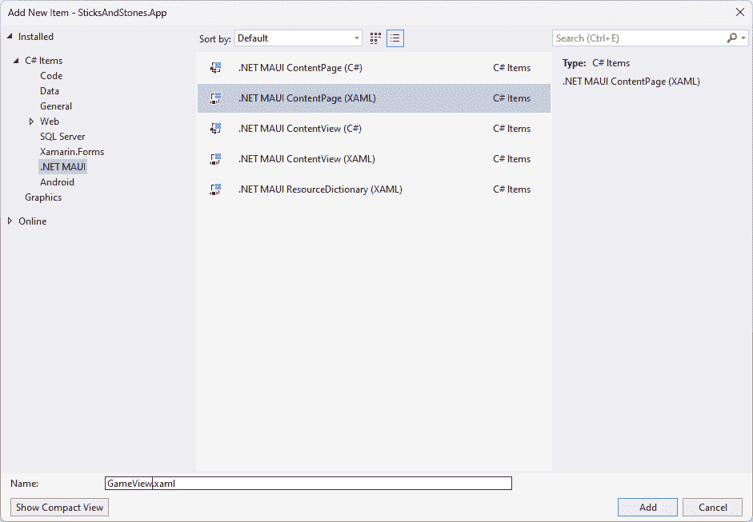

图 10.13 – 添加新的 .NET MAUI ContentPage (XAML)

1.  打开 `MatchView.xaml.cs` 文件，并添加以下 `using` 声明：

    ```cs
    using SticksAndStones.ViewModels;
    ```

1.  对构造函数进行以下突出显示的更改：

    ```cs
    public MatchView(MatchViewModel viewModel)
    {
        this.BindingContext = viewModel;
        InitializeComponent();
    }
    ```

    这些更改允许依赖注入提供 `MatchViewModel` 实例给视图，然后将其分配给 `BindingContext`。

1.  打开 `AppShell.xaml` 文件，并将以下代码片段添加到 `ContentPage` 元素中：

    ```cs
    <ShellItem Route="Match">
        <ShellContent ContentTemplate="{DataTemplate views:MatchView}" />
    </ShellItem>
    ```

    这将注册 `"Match"` 路由并将其指向 `MatchView`。

1.  打开 `MauiProgram.cs` 文件，并添加以下突出显示的代码行：

    ```cs
    builder.Services.AddTransient<Views.ConnectView>();
    builder.Services.AddTransient<Views.LobbyView>();
    builder.Services.AddTransient<Views.MatchView>();
    return builder.Build();
    ```

    这将注册 `MatchView` 以进行依赖注入，以便 `DataTemplate` 可以找到它。

1.  打开 `MatchView.xaml` 文件，并移除 `ContentPage` 元素的 `Title` 属性。

1.  将以下突出显示的命名空间添加到 `MatchView` 元素中。它们将为我们提供访问 `ViewModels`、`Converters` 和 `Controls` 命名空间中的类：

    ```cs
    <ContentPage 

            x:Class="SticksAndStones.Views.GameView">
    ```

1.  为了让 IntelliSense 对我们将要添加的绑定感到满意，定义视图所使用的视图模型，通过在 `MatchView` 元素中添加 `x:DataType` 属性来实现，如下所示：

    ```cs
    <ContentPage 

            x:DataType="viewModels:GameViewModel"
            x:Class="SticksAndStones.Views.GameView">
    ```

`MatchView` 使用了 Font Awesome 字体库中的几个图标，因此我们需要下载并安装这个库，以便在应用中可用。

#### 下载和配置 Font Awesome

Font Awesome 是一个包含在字体中的图像集合。.NET MAUI 对在工具栏、导航栏等地方使用 Font Awesome 提供了出色的支持。虽然制作这个应用不是必需的，但我们认为这额外的往返是值得的，因为你很可能在你的新杀手级应用中需要类似的东西。

下载字体很简单。请注意文件的重命名——这实际上不是必需的，但如果文件名更简单，编辑配置文件等会更容易。按照以下步骤获取并复制字体到每个项目中：

1.  浏览到 [`fontawesome.com/download`](https://fontawesome.com/download)。

1.  点击 **Free for Desktop** 按钮下载 Font Awesome。

1.  解压下载的文件，然后找到 `otfs` 文件夹。

1.  将 `Font Awesome 5 Free-Solid-900.otf` 文件重命名为 `FontAwesome.otf`（你可以保留原始名称，但如果重命名会少输入一些）。由于 Font Awesome 持续更新，你的文件名可能不同，但应该相似。

1.  将 `FontAwesome.otf` 复制到 `SticksAndStones.App` 项目的 `Resources/Fonts` 文件夹中。

如果只需要将字体文件复制到项目文件夹中就足够了，那就太好了。默认的 .NET MAUI 模板在 `News.csproj` 文件中包含了所有字体，并在 `Resources/Fonts` 文件夹中定义了以下项目：

```cs
<!-- Custom Fonts -->
<MauiFont Include="Resources\Fonts\*" />
```

这确保了字体文件被处理并自动包含在应用包中。剩下要做的就是将字体注册到 .NET MAUI 运行时中，使其对 XAML 资源可用。为此，将以下高亮行添加到 `MauiProgram.cs` 文件中：

```cs
.ConfigureFonts(fonts =>
{
    fonts.AddFont("OpenSans-Regular.ttf", "OpenSansRegular");
    fonts.AddFont("OpenSans-Semibold.ttf", "OpenSansSemibold");
    fonts.AddFont("FontAwesome.otf", "FontAwesome");
})
```

这一行添加了一个别名，我们可以在下一节中使用它来创建静态资源。第一个参数是字体文件的文件名，第二个参数是你可以用于 `FontFamily` 属性的字体别名。

#### 定义布局

现在 Font Awesome 已安装并配置在 .NET MAUI 中，`TitleView` 可以使用它。按照以下步骤添加自定义标题区域和主要布局：

1.  首先，覆盖 `Shell` 元素的 `TitleView` 并提供一个新容器来存放按钮：

    ```cs
    <Shell.TitleView>
        <Grid>
            <HorizontalStackLayout HorizontalOptions="Start">
            </HorizontalStackLayout>
            <HorizontalStackLayout HorizontalOptions="End">
            </HorizontalStackLayout>
        </Grid>
    </Shell.TitleView>
    ```

    按钮分为两个部分，一个对齐到窗口的左侧或起始位置，另一个对齐到右侧或结束位置。

1.  玩家可以在任何时候决定他们不再想继续游戏。要退出比赛，玩家可以使用 `TitleView` 的 `Start` 部分，并在 `MatchViewModel` 中绑定 `ForfeitCommand`，添加以下片段中的高亮代码：

    ```cs
    <HorizontalStackLayout HorizontalOptions="Start">
    <ImageButton Command="{Binding ForfeitCommand}" ToolTipProperties.Text="Return to the lobby.">
            <ImageButton.Source>
                <FontImageSource Glyph="&#xf0a8;" FontFamily="FontAwesome" Color="White" Size="28" />
            </ImageButton.Source>
        </ImageButton>
    </HorizontalStackLayout>
    ```

1.  当轮到玩家时，他们有两个可用的按钮，`Play` 和 `Undo`。`Play` 和 `Undo` 按钮放置在 .NET MAUI 页面的 `TitleView` 区域。将以下高亮代码添加到 `TitleView` 以添加 `Play` 和 `Undo` 按钮：

    ```cs
    <HorizontalStackLayout HorizontalOptions="End">
        <ImageButton Command="{Binding UndoCommand}" IsVisible="{Binding IsCurrentPlayersTurn}" ToolTipProperties.Text="Undo the last stick placement.">
            <ImageButton.Source>
                <FontImageSource Glyph="&#xf0e2;" FontFamily="FontAwesome" Color="White" Size="28" />
            </ImageButton.Source>
        </ImageButton>
        <ImageButton Command="{Binding PlayCommand}" IsVisible="{Binding IsCurrentPlayersTurn}" ToolTipProperties.Text="Send the stick placement, and end my turn.">
            <ImageButton.Source>
                <FontImageSource Glyph="&#xf1d8;" FontFamily="FontAwesome" Color="White" Size="28" />
            </ImageButton.Source>
        </ImageButton>
    </HorizontalStackLayout>
    ```

1.  从 `ContentView` 中删除默认的 `VerticalStackLayout` 元素，并添加以下代码：

    ```cs
    <ContentView>
        <Grid>
            <Grid.RowDefinitions>
                <RowDefinition Height="4*" />
                <RowDefinition Height="2*" />
                <RowDefinition Height="6*" />
                <RowDefinition Height="2*" />
            </Grid.RowDefinitions>
        </Grid>
    </ContentView>
    ```

    这添加了一个具有四行的 `Grid` 控件。第一行和第三行将包含计分板和游戏板，而第二行和第四行是填充。

主布局已准备就绪。接下来，将计分板添加到布局的第一行。

#### 创建计分板

计分板包含每个玩家的头像、游戏标签和分数。这些元素绑定到玩家的 `MatchPlayerViewModel` 对应字段。`Match` 对象有两个属性，`PlayerOne` 和 `PlayerTwo`，每个属性都是一个 `MatchPlayerViewModel`。要添加计分板，请按照以下步骤操作：

1.  每个玩家都有一个不同的颜色来识别。要将每种颜色添加为资源，打开 `SticksAndStones.App` 项目的 `Resources/Styles` 文件夹中的 `Colors.xaml` 文件，并将以下行添加到 `ResourceDictionary` 元素中：

    ```cs
    <Color x:Key="PlayerOne">#6495ED</Color>
    <Color x:Key="PlayerTwo">#CD5C5C</Color>
    ```

1.  计分板使用 `HorizontalStackLayout` 作为外部容器。将以下代码添加到 `Grid` 元素中：

    ```cs
    <HorizontalStackLayout Grid.Row="0" HorizontalOptions="CenterAndExpand" Margin="10" BindableLayout.ItemsSource="{Binding Players}">
    </HorizontalStackLayout>
    ```

    `HorizontalStackLayout` 被分配到 `Grid` 的行 `0`，其内容通过 `BindableLayout.ItemsSource` 绑定到视图模型的 `Players` 属性。`BindableLayout` 是支持所有布局控件（如 `AbsoluteLayout` 和 `FlexLayout`）的底层接口。

1.  每个玩家在 `HorizontalStackLayout` 中都有自己的卡片。由于控件绑定到 `Players` 属性，该属性是一个 `MatchPlayerViewModels` 数组，因此 `BindableLayout.ItemTemplate` 属性提供了在 `Players` 中显示每个项目的视图。卡片使用 `Border` 元素和嵌套的 `VerticalStackLayout` 元素进行布局。将以下高亮代码添加到 `HorizontalStackLayout`：

    ```cs
    <HorizontalStackLayout Grid.Row="0" HorizontalOptions="CenterAndExpand" Margin="10">
        <BindableLayout.ItemTemplate>
            <DataTemplate>
                <Border x:DataType="viewModels:MatchPlayerViewModel" Padding="0" Margin="2" StrokeShape="RoundRectangle 10,10,10,10" HeightRequest="175">
                    <VerticalStackLayout Padding="2" HorizontalOptions="Center">
                    </VerticalStackLayout>
                </Border>
            </DataTemplate>
        </BindableLayout.ItemTemplate>
    </HorizontalStackLayout>
    ```

1.  `Border` 元素是玩家卡片的最高级容器。要根据 `PlayerToken` 设置 `Border` 元素的边框颜色和背景颜色，使用触发器（[`learn.microsoft.com/en-us/dotnet/maui/fundamentals/triggers`](https://learn.microsoft.com/en-us/dotnet/maui/fundamentals/triggers)）——具体来说，使用 `DataTrigger` 来根据其他值设置属性值。将以下代码添加到 `Border` 元素：

    ```cs
    <Border.Triggers>
        <DataTrigger TargetType="Border" Binding="{Binding PlayerToken}" Value="1" >
            <Setter Property="Stroke" Value="{StaticResource PlayerOne}" />
            <Setter Property="BackgroundColor" Value="{StaticResource PlayerOne}" />
        </DataTrigger>
        <DataTrigger TargetType="Border" Binding="{Binding PlayerToken}" Value="-1" >
            <Setter Property="Stroke" Value="{StaticResource PlayerTwo}" />
            <Setter Property="BackgroundColor" Value="{StaticResource PlayerTwo}" />
        </DataTrigger>
    </Border.Triggers>
    ```

    `DataTrigger` 绑定属性与 `Value` 属性进行比较。如果它们相等，则执行 `DataTrigger` 的 `Setter` 元素。在这种情况下，如果 `PlayerToken` 属性为 `-1`，则将 `Border` 的 `Stroke` 和 `BackgroundColor` 属性设置为在 *步骤 1* 中定义的 `PlayerOne` 颜色。否则，如果 `PlayerToken` 属性等于 `-1`，则将 `Stroke` 和 `BackgroundColor` 属性设置为 `PlayerTwo` 颜色。

1.  `VerticalStackLayout` 包含另一个 `VerticalStackLayout` 和 `Border` 元素，如下所示突出显示的代码：

    ```cs
    <VerticalStackLayout BackgroundColor="{Binding PlayerToken, Converter={StaticResource PlayerToColor}}" Padding="2" HorizontalOptions="Center">
        <VerticalStackLayout>
        </VerticalStackLayout>
        <Border Padding="0" WidthRequest="96" StrokeShape="RoundRectangle 10,10,10,10" StrokeThickness="0">
            <Image IsVisible="{Binding IsPlayersTurn}" Source="hstick.jpeg" Aspect="AspectFit" MaximumHeightRequest="36"/>
        </Border>
    VerticalStackLayout will be used to hold GamerTag, AvatarImage, and the player’s score, which is added in the next step. Border contains a horizontal stick image whose IsVisible attribute is bound to the IsPlayersTurn property. The stick is used as a visual indicator of which player’s turn it is. If it is not the player’s turn, the image is not displayed.
    ```

1.  在第二个 `VerticalStackLayout` 中有一个 `Label` 和一个 `FlexLayout`。添加以下突出显示的代码：

    ```cs
    <VerticalStackLayout>
        <Label Text="{Binding GamerTag}" HorizontalOptions="FillAndExpand" HorizontalTextAlignment="Center" FontSize="18" FontFamily="OpenSansSemibold"/>
        <FlexLayout Margin="3">
        </FlexLayout>
    FlexLayout contains the visual elements to display AvatarImage and Score. Add the following highlighted code to FlexLayout:

    ```

    <FlexLayout Margin="3">

    <toolkit:AvatarView FlexLayout.Order="0" Margin="0" BackgroundColor="LightGrey" HeightRequest="85" WidthRequest="85" CornerRadius="50" VerticalOptions="Center" HorizontalOptions="Center">

    <toolkit:AvatarView.ImageSource>

    <toolkit:GravatarImageSource

    Email="{Binding EmailAddress}"

    Image="MysteryPerson" />

    </toolkit:AvatarView.ImageSource>

    <toolkit:AvatarView.Triggers>

    <DataTrigger TargetType="toolkit:AvatarView" Binding="{Binding Path=PlayerToken}" Value="-1">

    <Setter Property="FlexLayout.Order" Value="1" />

    </DataTrigger>

    </toolkit:AvatarView.Triggers>

    </toolkit:AvatarView>

    <Label FlexLayout.Order="1" Text="{Binding Score}" FontSize="48" Padding="5" MinimumWidthRequest="65" HorizontalTextAlignment="Center">

    <Label.Triggers>

    <DataTrigger TargetType="Label" Binding="{Binding Path=PlayerToken}" Value="-1">

    <Setter Property="FlexLayout.Order" Value="0" />

    </DataTrigger>

    </Label.Triggers>

    </Label>

    FlexLayout 控件，FlexLayout 子项显示的顺序由 FlexLayout.Order 属性控制。类似于 Grid 控件，其子项的 Grid.Row 和 Grid.Column 属性，Order 属性设置在子项上。FlexLayout 中子项的顺序通过使用触发器来改变。在 AvatarView 上，如果 PlayerToken 属性等于 -1，即 PlayerTwo，DataTrigger 将 FlexLayout.Order 属性设置为 "1"。在 Label 上，DataTrigger 将 FlexLayout.Order 属性设置为 "0"，从而有效地交换了两个元素。

    ```cs

    ```

这样就完成了记分板。`MatchView` 的最后一部分是最大的：棋盘。继续阅读以了解如何创建棋盘视觉效果。

#### 创建游戏棋盘

游戏棋盘由三个不同的元素组成。这些元素是每个方格角落的点、横竖棒（水平和垂直）和石头。这些元素按照以下所示布局：

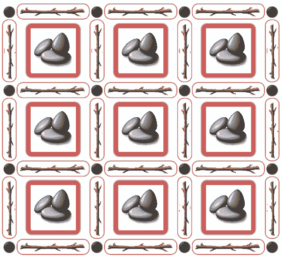

图 10.14 – 游戏棋盘

棋盘使用 `Grid` 控件来提供基本布局。使用 7 列和 7 行将为每个元素提供单元格：16 个点、9 个石头和 24 根棒。将以下代码添加到顶级 `Grid` 元素以提供游戏棋盘的基本布局：

```cs
<Grid Grid.Row="2" BackgroundColor="White" Margin="10,40,10,0" MaximumHeightRequest="410" MaximumWidthRequest="400" >
    <Grid.ColumnDefinitions>
        <ColumnDefinition Width="1*" />
        <ColumnDefinition Width="5*" />
        <ColumnDefinition Width="1*" />
        <ColumnDefinition Width="5*" />
        <ColumnDefinition Width="1*" />
        <ColumnDefinition Width="5*" />
        <ColumnDefinition Width="1*" />
    </Grid.ColumnDefinitions>
    <Grid.RowDefinitions>
        <RowDefinition Height="1*" />
        <RowDefinition Height="4*" />
        <RowDefinition Height="1*" />
        <RowDefinition Height="4*" />
        <RowDefinition Height="1*" />
        <RowDefinition Height="4*" />
        <RowDefinition Height="1*" />
    </Grid.RowDefinitions> 
</Grid>
```

让我们从添加网格的角落开始，因为它们是最简单的。要定义一个角落，使用带有文本 `"&#x26AB;"` 的 `Label`，这是点的十六进制字符代码。为了水平垂直居中点，将 `HorizontalOptions` 和 `VerticalOptions` 设置为 `"Center"`。您的基本元素看起来如下所示：

```cs
<Label Text="&#x26AB" HorizontalOptions="Center" VerticalOptions="Center" />
```

没有使用`Grid.Row`和`Grid.Column`属性，`Label`将被放置在行`0`和列`0`。网格中有 16 个角落，它们占据了所有偶数单元格，所以`(0,0)`、`(0,2)`、`(0,4)`、`(0,6)`、`(2,0)`、`(2,2)`等等。第一行的完全定义的标签如下所示：

```cs
            <Label Grid.Row="0" Grid.Column="0" Text="&#x26AB" HorizontalOptions="Center" VerticalOptions="Center" />
            <Label Grid.Row="0" Grid.Column="2" Text="&#x26AB" HorizontalOptions="Center" VerticalOptions="Center" />
            <Label Grid.Row="0" Grid.Column="4" Text="&#x26AB" HorizontalOptions="Center" VerticalOptions="Center" />
            <Label Grid.Row="0" Grid.Column="6" Text="&#x26AB" HorizontalOptions="Center" VerticalOptions="Center" />
```

当你为所有 16 行都这样做时，就会有很多`Text`、`HorizontalOptions`和`VerticalOptions`属性的重复。通过使用`Style`元素，可以消除这种重复。`Style`元素包含`Setter`元素，如`DataTrigger`元素。当`Style`应用于元素时，`Setter`元素用于更新目标元素的属性。使用以下步骤通过`Style`将角落元素添加到`Grid`控件中：

1.  将以下`Style`元素添加到`ContentPage.Resources`元素中：

    ```cs
    <Style x:Key="dotLabel"
            TargetType="Label">
        <Setter Property="Text" Value="&#x26AB;" />
        <Setter Property="HorizontalOptions" Value="Center" />
        <Setter Property="VerticalOptions" Value="Center" />
    </Style>
    ```

    这个`Style`元素通过`x:Key`属性进行标识。

1.  在本节开头创建的`Grid`控件中添加一个`Label`。

1.  将`Label`的`Grid.Row`属性设置为`0`。

1.  将`Label`的`Grid.Column`属性设置为`0`。

1.  将`Style`属性设置为`{StaticResource dotLabel}`值。`Style`属性用于指定应用于元素的样式。由于`Style`在`ContentView.Resources`元素中定义，它是一个`StaticResource`。

1.  完成的`Label`应如下所示：

    ```cs
    <Label Grid.Row="0" Grid.Column="0" Style="{StaticResource dotLabel}" />
    ```

1.  现在，复制刚刚创建的`Label`，并将`Grid.Column`值增加两个，重复此步骤，直到你有四个具有相同`Grid.Row`值的`Label`元素。

1.  复制在第 7 步中创建的最后一个`Label`，并将`Grid.Row`值增加两个，并将`Grid.Column`的值重置为`0`。现在，使用更新的`Grid.Row`值重复第 7 步，直到有四个具有`Grid.Row`值为`6`的标签。

1.  标签应如下所示：

    ```cs
    <Label Grid.Row="0" Grid.Column="0" Style="{StaticResource dotLabel}" />
    <Label Grid.Row="0" Grid.Column="2" Style="{StaticResource dotLabel}" />
    <Label Grid.Row="0" Grid.Column="4" Style="{StaticResource dotLabel}" />
    <Label Grid.Row="0" Grid.Column="6" Style="{StaticResource dotLabel}" />
    <Label Grid.Row="2" Grid.Column="0" Style="{StaticResource dotLabel}" />
    <Label Grid.Row="2" Grid.Column="2" Style="{StaticResource dotLabel}" />
    <Label Grid.Row="2" Grid.Column="4" Style="{StaticResource dotLabel}" />
    <Label Grid.Row="2" Grid.Column="6" Style="{StaticResource dotLabel}" />
    <Label Grid.Row="4" Grid.Column="0" Style="{StaticResource dotLabel}" />
    <Label Grid.Row="4" Grid.Column="2" Style="{StaticResource dotLabel}" />
    <Label Grid.Row="4" Grid.Column="4" Style="{StaticResource dotLabel}" />
    <Label Grid.Row="4" Grid.Column="6" Style="{StaticResource dotLabel}" />
    <Label Grid.Row="6" Grid.Column="0" Style="{StaticResource dotLabel}" />
    <Label Grid.Row="6" Grid.Column="2" Style="{StaticResource dotLabel}" />
    <Label Grid.Row="6" Grid.Column="4" Style="{StaticResource dotLabel}" />
    <Label Grid.Row="6" Grid.Column="6" Style="{StaticResource dotLabel}" />
    ```

现在角落处理完毕，我们可以开始制作游戏棋子：木棍和石头。由于木棍和石头有一些相似之处，我们可以创建一个通用的控件来显示它们。然而，它们的可视化方式完全不同。所需的是一个通用的接口来定义`BindableProperty`属性，并在不同的布局中使用它。`.NET` `MAUI`使用`ControlTemplate`资源来允许对构成控件的视觉元素进行自定义，甚至完全替换。在.NET MAUI 中，许多控件可以通过`ControlTemplate`进行自定义，如果它们从`ContentView`或`ContentPage`派生。让我们从添加自定义控件开始，然后按照以下步骤添加木棍和石头的`ControlTemplate`资源：

1.  在`SticksAndStones.App`项目的`Controls`文件夹中创建一个新的类，命名为`GamePieceView`。

1.  更新类定义以匹配以下列表：

    ```cs
    namespace SticksAndStones.Controls;
    public partial class GamePieceView : ContentView
    {
    }
    ```

1.  添加一个名为 `GamePiecePosition` 的 `string` 属性和一个名为 `GamePiecePositionProperty` 的 `BindableProperty`，如下所示：

    ```cs
    public static readonly BindableProperty GamePiecePositionProperty = BindableProperty.Create(nameof(GamePiecePosition), typeof(string), typeof(GamePieceView), string.Empty);
    public string GamePiecePosition
    {
        get => (string)GetValue(GamePiecePositionProperty);
        set => SetValue(GamePiecePositionProperty, value);
    }
    ```

    `GamePiecePosition` 用于确定 `GameViewModel` 上的 `Sticks` 或 `Stones` 属性中的数组索引。

1.  添加一个名为 `GamePieceState` 的 `int` 属性和一个名为 `GamePieceStateProperty` 的 `BindableProperty`，如下所示：

    ```cs
    public static readonly BindableProperty GamePieceStateProperty = BindableProperty.Create(nameof(GamePieceState), typeof(int), typeof(GamePieceView), 0, BindingMode.TwoWay);
    public int GamePieceState
    {
        get => (int)GetValue(GamePieceStateProperty);
        set => SetValue(GamePieceStateProperty, value);
    }
    ```

    `GamePieceState` 是棋子的所有者：`1` 表示 `PlayerOne`，`0` 表示无人，`-1` 表示 `PlayerTwo`。

1.  添加一个名为 `GamePieceDirection` 的 `string` 属性和一个名为 `GamePieceDirectionProperty` 的 `BindableProperty`，如下所示：

    ```cs
    public static readonly BindableProperty GamePieceDirectionProperty = BindableProperty.Create(nameof(GamePieceDirection), typeof(string), typeof(GamePieceView), null);
    public string GamePieceDirection
    {
        get => (string)GetValue(GamePieceDirectionProperty);
        set => SetValue(GamePieceDirectionProperty, value);
    }
    ```

    `GamePieceDirection` 仅适用于 `Sticks`，可以是 `Horizontal` 或 `Vertical`。

1.  再次打开 `MatchView.Xaml` 文件，并为所有棍子添加一个控件模板。将以下代码片段添加到 `ContentView.Resources` 元素中：

    ```cs
    <ControlTemplate x:Key="StickViewControlTemplate">
    </ControlTemplate>
    ```

    这定义了一个具有 `StickViewControlTemplate` 键的 `ControlTemplate` 元素。键用于将 `ControlTemplate` 元素应用于控件。

1.  每个棍子视觉元素有两个部分：标签上显示的数字和棍子图像，图像使用 `Image` 控件在边框内显示，并由放置棍子的玩家着色。另一个有趣的方面是 `Label` 和 `Border` 控件需要叠加在一起。为了实现这一点，使用了一个 `Grid` 控件，并将两个元素放置在同一单元格中。要添加 `Grid`、`Label`、`Border` 和 `Image` 控件，请使用以下列表，并将它们添加到 `ControlTemplate` 元素中：

    ```cs
    <Grid Margin="0" Padding="0">
        <Label Text="{TemplateBinding GamePiecePosition}" IsVisible="False" HorizontalTextAlignment="Center" VerticalTextAlignment="Center" TextColor="Red" FontAttributes="Bold" >
        </Label>
        <Border Padding="3" BackgroundColor="Transparent" StrokeShape="RoundRectangle 5" Stroke="Transparent">
            <Image Aspect="Fill">
            </Image>
        </Border>
    </Grid>
    ```

    `Grid` 的 `Margin` 和 `Padding` 值为 `0`，这样它就不会占用任何屏幕空间。`Label` 控件的 `Text` 属性使用 `TemplateBinding` 绑定到 `GamePiecePosition` 属性。`TemplateBinding` 与 `Binding` 有所不同，因为 `TemplateBinding` 使用应用于此 `ControlTemplate` 的控件作为 `DataContext`。由于此 `ControlTemplate` 将应用于 `GamePieceView` 的实例，因此它将绑定到这些控件的 `Bindable` 属性。

    检查 *第 7 步* 中的 `Image` 控件，你会发现它没有指定显示哪个图像。对于 `Sticks`，会显示两个图像中的一个：水平棍子显示 `hstick.jpeg`，垂直棍子显示 `vstick.jpeg`，如果该位置没有棍子，则控件不应可见。以下列表使用 `DataTrigger` 通过 `TemplateBinding` 将 `IsVisible` 和 `Source` 的值设置为 `Image` 控件的 `GamePieceState` 和 `GamePieceDirection` 属性。将此代码添加到 `ControlTemplate` 的 `Image` 控件中：

    ```cs
    <Image.Triggers>
        <DataTrigger TargetType="Image" Binding="{TemplateBinding Path=GamePieceState}" Value="0">
            <Setter Property="IsVisible" Value="False" />
        </DataTrigger>
        <DataTrigger TargetType="Image" Binding="{TemplateBinding Path=GamePieceDirection}" Value="Horizontal">
             <Setter Property="Source" Value="hstick.jpeg" />
        </DataTrigger>
        <DataTrigger TargetType="Image" Binding="{TemplateBinding Path=GamePieceDirection}" Value="Vertical">
             <Setter Property="Source" Value="vstick.jpeg" />
        </DataTrigger>
    </Image.Triggers>
    ```

1.  `Border` 控件也使用 `DataTrigger` 以放置棍子的玩家的颜色来勾勒出棍子。在 `Image` 之后添加以下代码到 `Border` 元素中：

    ```cs
    <Border.Triggers>
        <DataTrigger TargetType="Border" Binding="{TemplateBinding GamePieceState}" Value="1" >
            <Setter Property="Stroke" Value="{StaticResource PlayerOne}" />
        </DataTrigger>
        <DataTrigger TargetType="Border" Binding="{TemplateBinding GamePieceState}" Value="-1" >
            <Setter Property="Stroke" Value="{StaticResource PlayerTwo}" />
        </DataTrigger>
    </Border.Triggers>
    ```

    需要两个触发器来在`PlayerOne`（`1`）和`PlayerTwo`（`-1`）之间切换。`Border`控制的`Stroke`属性被设置为玩家的颜色资源。如果两个触发器都不活跃，则使用`Border`元素的默认`Stroke`值`Transparent`。这样，如果没有使用棒子，`GamePieceState`为`0`，边界将是透明的。如果`GamePieceState`为`1`，则`Stroke`将具有由名为`PlayerOne`的资源定义的颜色，如果`GamePieceState`为`-1`，则`Stroke`值将是名为`PlayerTwo`的资源。

1.  当用户在他们的回合中移动时，他们将通过点击标签来放置他们的棒子在那个位置。为了在发生这种情况时调用`SelectStickCommand`，`Border`控制将`TapGestureRecognizer`绑定到`GameViewModel.SelectStickCommand`属性，并将`GamePiecePosition`作为参数传递。将以下列表添加到`Border`元素之后，在`Border.Triggers`元素之后：

    ```cs
    <Border.GestureRecognizers>
        <TapGestureRecognizer Command="{Binding Source={RelativeSource AncestorType={x:Type viewModels:GameViewModel}}, Path=SelectStickCommand}" CommandParameter="{TemplateBinding GamePiecePosition}" />
    </Border.GestureRecognizers>
    ```

1.  最后，仔细看看`Label`元素；你会看到`IsVisible`属性被设置为`False`。如果没有在这个位置放置棒子，我们需要显示位置的标签。这可以通过使用`DataTrigger`来实现；如果`GamePieceState`为`0`，即还没有放置棒子，则可以将标签的`IsVisible`属性设置为`True`，使标签可见。将以下列表添加到`Label`元素中：

    ```cs
    <Label.Triggers>
        <DataTrigger TargetType="Label" Binding="{TemplateBinding Path=GamePieceState}" Value="0">
            <Setter Property="IsVisible" Value="True" />
        </DataTrigger>
    </Label.Triggers>
    ```

这样就完成了棒子的控制模板。接下来，按照以下步骤创建`Stones`的控制模板：

1.  在为棒子创建的`ControlTemplate`下方添加以下代码：

    ```cs
    <ControlTemplate x:Key="StoneViewControlTemplate">
    </ControlTemplate>
    ```

    就像棒子的控制模板一样，`ControlTemplate`使用一个键来定位正确的模板。

1.  `Stones`模板比`Sticks`模板简单一些。在这里，我们只有一个作为子控件的`Border`控制和`Image`控制。再次使用`DataTrigger`来选择正确的边界颜色，如果石头不存在，则边界不可见。使用以下代码示例并将其添加到在*步骤 1*中创建的`ControlTemplate`中：

    ```cs
    <Border Margin="3" Padding="5" HorizontalOptions="Center" VerticalOptions="Center" StrokeShape="RoundRectangle 5" StrokeThickness="3">
        <Border.Triggers>
            <DataTrigger TargetType="Border" Binding="{TemplateBinding GamePieceState}" Value="0">
                <Setter Property="IsVisible" Value="False" />
            </DataTrigger>
            <DataTrigger TargetType="Border" Binding="{TemplateBinding GamePieceState}" Value="1" >
                <Setter Property="Stroke" Value="{StaticResource PlayerOne}" />
            </DataTrigger>
            <DataTrigger TargetType="Border" Binding="{TemplateBinding GamePieceState}" Value="-1" >
                <Setter Property="Stroke" Value="{StaticResource PlayerTwo}" />
            </DataTrigger>
        </Border.Triggers>
        <Image Source="stones.jpeg" Aspect="Fill" />
    </Border>
    ```

    你可能已经注意到这个列表中的触发器与`Sticks`控制模板中的触发器有所不同。在`Sticks`中，`IsVisible`属性是在`Image`上设置的，而不是在`Border`上，你可能想知道为什么是这样。解释很简单；如果边界不可见，它将不会收到`TapGuesture`事件。`Grid`元素无法注册`GestureRecognizer`，因此事件也无法在那里被捕获。

需要用于棍子和石头图像的`ControlTemplates`已经就位；现在，它们需要与`GamePieceView`控件元素关联。`Style`可以设置`GamePieceView`元素的`ControlTemplate`属性，但它如何确定这个元素是棍子还是石头？`Style`元素有一个`Class`属性，可以用来进一步细化应用于控件的风格。如果控件在其`StyleClass`属性中列出了匹配的类名，则应用该`Style`元素。让我们以棍子为例，按照以下步骤进行：

1.  将新的`Style`元素添加到`ContentView.Resources`元素中，如下所示列表：

    ```cs
    <Style TargetType="controls:GamePieceView"
            Class="Stick">
        <Setter Property="ControlTemplate"
                Value="{StaticResource StickViewControlTemplate}" />
    </Style>
    ```

    此样式仅应用于类型为`GamePiece`且在`StyleClass`属性中列出`Stick`类的元素。匹配的元素可能如下所示：

    ```cs
    <controls:GamePieceView Grid.Row="0" Grid.Column="1" StyleClass="Stick" 
                            GamePiecePosition="01" GamePieceState="{Binding Game.Sticks[0]}" GamePieceDirection="Horizontal" />
    ```

    突出的部分显示了用于匹配`Style`元素的控件部分。`StyleClass`可以列出多个名称；只需使用逗号分隔名称。

1.  添加一个新的`Style`元素。这次，它将应用于`StoneViewControlTemplate`，如下所示列表：

    ```cs
    <Style TargetType="controls:GamePieceView"
            Class="Stone">
        <Setter Property="ControlTemplate"
                Value="{StaticResource StoneViewControlTemplate}" />
    </Style>
    ```

棒子和石头元素添加到游戏板网格中所需的所有内容都已具备。要添加剩余的元素，请按照以下步骤进行：

1.  有七行棍子：四行三列和三行四列。它们几乎相同，但又不完全相同。定位定义游戏板的`Grid`；它已经添加了角落的点。在 16 个点元素之后，添加以下列表以添加第一行棍子：

    ```cs
    <controls:GamePieceView Grid.Row="0" Grid.Column="1" StyleClass="Stick"
                            GamePiecePosition="01" GamePieceState="{Binding Game.Sticks[0]}" GamePieceDirection="Horizontal" />
    <controls:GamePieceView Grid.Row="0" Grid.Column="3" StyleClass="Stick" 
                            GamePiecePosition="02" GamePieceState="{Binding Game.Sticks[1]}" GamePieceDirection="Horizontal" />
    <controls:GamePieceView Grid.Row="0" Grid.Column="5" StyleClass="Stick" 
                            GamePiecePosition="03" GamePieceState="{Binding Game.Sticks[2]}" GamePieceDirection="Horizontal" />
    ```

    第一行中的每根棍子都是水平显示的。每根棍子都分配了其在`GamePiecePosition`属性中的位置，并且`GamePieceState`绑定到该棍子的`Game.Sticks`对象。`Sticks`数组是从零开始的，所以数组的索引比`GamePiecePosition`少一个。

1.  使用以下列表添加第二行棍子的代码：

    ```cs
    <controls:GamePieceView Grid.Row="1" Grid.Column="0" StyleClass="Stick"
                            GamePiecePosition="04" GamePieceState="{Binding Game.Sticks[3]}" GamePieceDirection="Vertical" />
    <controls:GamePieceView Grid.Row="1" Grid.Column="2" StyleClass="Stick" 
                            GamePiecePosition="05" GamePieceState="{Binding Game.Sticks[4]}" GamePieceDirection="Vertical" />
    <controls:GamePieceView Grid.Row="1" Grid.Column="4" StyleClass="Stick" 
                            GamePiecePosition="06" GamePieceState="{Binding Game.Sticks[5]}" GamePieceDirection="Vertical" />
    <controls:GamePieceView Grid.Row="1" Grid.Column="6" StyleClass="Stick"
                            GamePiecePosition="07" GamePieceState="{Binding Game.Sticks[6]}" GamePieceDirection="Vertical" />
    ```

    这些元素都是`Vertical`而不是`Horizontal`；否则，它们遵循与上一步相同的模式。继续添加剩余的行。

1.  使用以下列表添加第三行棍子：

    ```cs
    <controls:GamePieceView Grid.Row="2" Grid.Column="1" StyleClass="Stick"
                            GamePiecePosition="08" GamePieceState="{Binding Game.Sticks[7]}" GamePieceDirection="Horizontal" />
    <controls:GamePieceView Grid.Row="2" Grid.Column="3" StyleClass="Stick"
                            GamePiecePosition="09" GamePieceState="{Binding Game.Sticks[8]}" GamePieceDirection="Horizontal" />
    <controls:GamePieceView Grid.Row="2" Grid.Column="5" StyleClass="Stick"
                            GamePiecePosition="10" GamePieceState="{Binding Game.Sticks[9]}" GamePieceDirection="Horizontal" />
    ```

1.  使用以下列表添加第四行棍子：

    ```cs
    <controls:GamePieceView Grid.Row="3" Grid.Column="0" StyleClass="Stick"
                            GamePiecePosition="11" GamePieceState="{Binding Game.Sticks[10]}" GamePieceDirection="Vertical" />
    <controls:GamePieceView Grid.Row="3" Grid.Column="2" StyleClass="Stick"
                            GamePiecePosition="12" GamePieceState="{Binding Game.Sticks[11]}" GamePieceDirection="Vertical" />
    <controls:GamePieceView Grid.Row="3" Grid.Column="4" StyleClass="Stick"
                            GamePiecePosition="13" GamePieceState="{Binding Game.Sticks[12]}" GamePieceDirection="Vertical" />
    <controls:GamePieceView Grid.Row="3" Grid.Column="6" StyleClass="Stick"
                            GamePiecePosition="14" GamePieceState="{Binding Game.Sticks[13]}" GamePieceDirection="Vertical" />
    ```

1.  使用以下列表添加第五行棍子：

    ```cs
    <controls:GamePieceView Grid.Row="4" Grid.Column="1" StyleClass="Stick"
                            GamePiecePosition="15" GamePieceState="{Binding Game.Sticks[14]}" GamePieceDirection="Horizontal" />
    <controls:GamePieceView Grid.Row="4" Grid.Column="3" StyleClass="Stick"
                            GamePiecePosition="16" GamePieceState="{Binding Game.Sticks[15]}" GamePieceDirection="Horizontal" />
    <controls:GamePieceView Grid.Row="4" Grid.Column="5" StyleClass="Stick" 
                            GamePiecePosition="17" GamePieceState="{Binding Game.Sticks[16]}" GamePieceDirection="Horizontal" />
    ```

1.  使用以下列表添加第六行棍子：

    ```cs
    <controls:GamePieceView Grid.Row="5" Grid.Column="0" StyleClass="Stick"
                            GamePiecePosition="18" GamePieceState="{Binding Game.Sticks[17]}" GamePieceDirection="Vertical" />
    <controls:GamePieceView Grid.Row="5" Grid.Column="2" StyleClass="Stick"
                            GamePiecePosition="19" GamePieceState="{Binding Game.Sticks[18]}" GamePieceDirection="Vertical" />
    <controls:GamePieceView Grid.Row="5" Grid.Column="4" StyleClass="Stick"
                            GamePiecePosition="20" GamePieceState="{Binding Game.Sticks[19]}" GamePieceDirection="Vertical" />
    <controls:GamePieceView Grid.Row="5" Grid.Column="6" StyleClass="Stick" 
                            GamePiecePosition="21" GamePieceState="{Binding Game.Sticks[20]}" amePieceDirection="Vertical" />
    ```

1.  使用以下列表添加第七行棍子：

    ```cs
    <controls:GamePieceView Grid.Row="6" Grid.Column="1" StyleClass="Stick"
                            GamePiecePosition="22" GamePieceState="{Binding Game.Sticks[21]}" GamePieceDirection="Horizontal" />
    <controls:GamePieceView Grid.Row="6" Grid.Column="3" StyleClass="Stick"
                            GamePiecePosition="23" GamePieceState="{Binding Game.Sticks[22]}" GamePieceDirection="Horizontal" />
    <controls:GamePieceView Grid.Row="6" Grid.Column="5" StyleClass="Stick" 
                            GamePiecePosition="24" GamePieceState="{Binding Game.Sticks[23]}" GamePieceDirection="Horizontal" />
    ```

1.  棍子都已添加，现在我们需要添加石头。使用以下列表将九个`Stone`元素添加到游戏板`Grid`控件中，遵循棍子的顺序：

    ```cs
    <controls:GamePieceView Grid.Row="1" Grid.Column="1" StyleClass="Stone" GamePieceState="{Binding Game.Stones[0]}" />
    <controls:GamePieceView Grid.Row="1" Grid.Column="3" StyleClass="Stone" GamePieceState="{Binding Game.Stones[1]}" />
    <controls:GamePieceView Grid.Row="1" Grid.Column="5" StyleClass="Stone" GamePieceState="{Binding Game.Stones[2]}" />
    <controls:GamePieceView Grid.Row="3" Grid.Column="1" StyleClass="Stone" GamePieceState="{Binding Game.Stones[3]}" />
    <controls:GamePieceView Grid.Row="3" Grid.Column="3" StyleClass="Stone" GamePieceState="{Binding Game.Stones[4]}" />
    <controls:GamePieceView Grid.Row="3" Grid.Column="5" StyleClass="Stone" GamePieceState="{Binding Game.Stones[5]}" />
    <controls:GamePieceView Grid.Row="5" Grid.Column="1" StyleClass="Stone" GamePieceState="{Binding Game.Stones[6]}" />
    <controls:GamePieceView Grid.Row="5" Grid.Column="3" StyleClass="Stone" GamePieceState="{Binding Game.Stones[7]}" />
    <controls:GamePieceView Grid.Row="5" Grid.Column="5" StyleClass="Stone" GamePieceState="{Binding Game.Stones[8]}" />
    ```

这是对游戏应用的总结。你现在可以在下一节测试项目。

## 测试完成的项目

这个项目跨越了两个章节，包括*第九章*，使用 Azure 服务设置游戏后端，以及本章，构建实时游戏。由于这是一个两人回合制游戏，正确配置所有组件可能是一个挑战。按照以下步骤在 Windows 上本地测试你的游戏：

1.  第一步是让服务在后台运行。在 Visual Studio 中，右键单击`SticksAndStones.Functions`项目，然后选择**调试** | **不调试启动**或按*Ctrl* + *F5*。

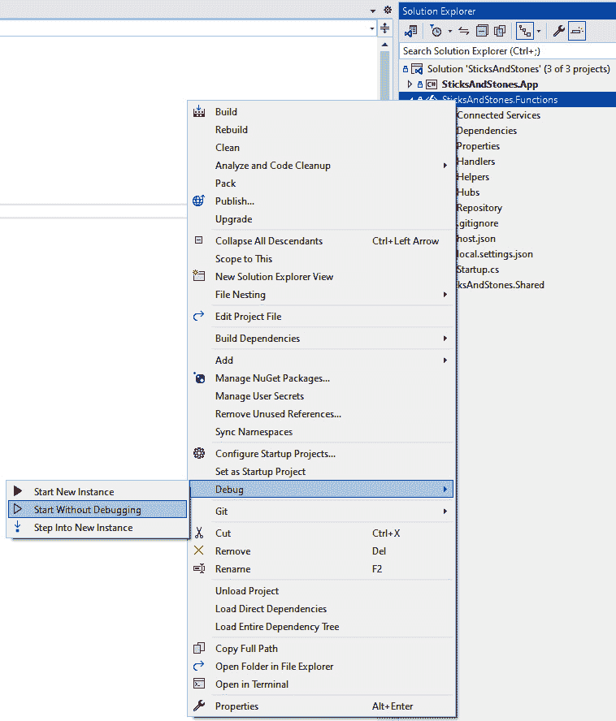

图 10.15 – 启动 Azure Functions 服务

这应该会启动一个包含正在运行的 Azure Functions 服务的终端窗口。

1.  现在，需要两个客户端来玩游戏。在 Windows 上，这意味着 Windows 客户端和 Android 客户端。首先启动 Windows 客户端，并使用与函数相同的方法。确保在**调试**选项中选择了 Windows 目标：

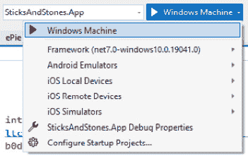

图 10.16 – 选择 Windows 作为调试目标

1.  右键单击`SticksAndStones.App`项目，然后选择**调试** | **不调试启动**或按*Ctrl* + *F5*。应该会打开一个新窗口，显示登录页面。

1.  现在，将**调试**目标切换到 Android：

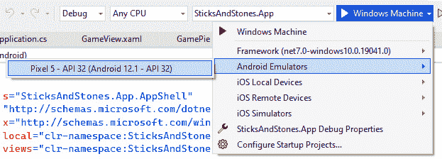

图 10.17 – 选择 Android 作为调试目标

1.  现在，要么使用*F5*在 Android 模拟器中调试应用，要么使用*Ctrl* + *F5*仅运行应用。

1.  使用不同的电子邮件和游戏标签登录到每个应用。

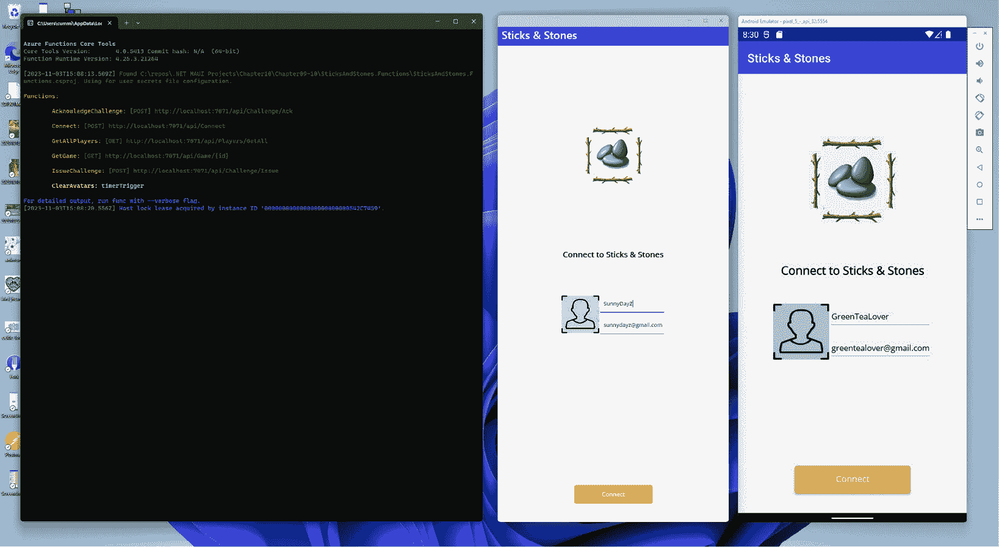

图 10.18 – 登录到游戏

1.  向其他玩家发起比赛！

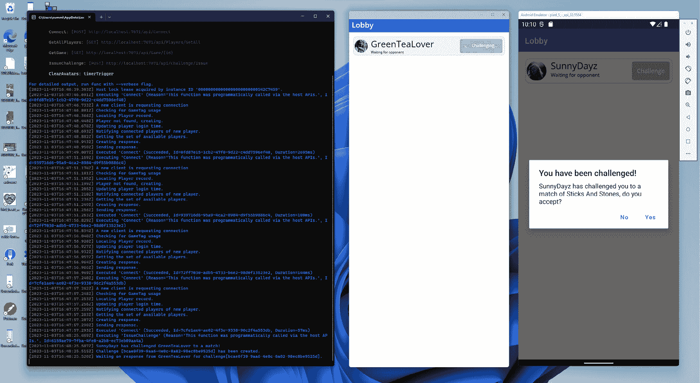

图 10.19 – 发出挑战

1.  在一场*棍子* *和石头*游戏中挑战自己吧！

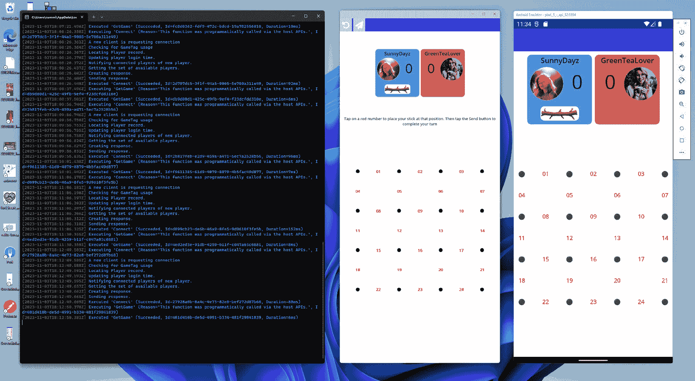

图 10.20 – 比赛已经开始

Android：不允许到 10.0.2.2 的明文 http 流量

如果你尝试使用 Android 客户端测试游戏，当你尝试向服务器发送移动时，你可能会遇到这个错误。幸运的是，解决方案很简单。在`Platforms/Android`文件夹中打开`MainApplication.cs`文件，并将`MainApplication`类上的`Application`属性修改为以下内容：

`[Application(UsesCleartextTraffic = true)]`

如果你遇到任何错误或某些事情没有按预期工作，请返回所有步骤并确保你没有错过任何东西。否则，恭喜你完成了这个项目。

# 摘要

就这样！做得好！这一章内容丰富，很难将其总结得简短。在这一章中，我们创建了一个连接到我们后端的游戏应用。我们创建了一个服务，用于管理对后端服务的调用并处理错误，所有操作都是异步进行的。我们学习了如何响应 SignalR 的消息，以及如何在应用中使用 `IMessenger` 接口发送和接收消息。我们创建了自定义控件，并在多个页面中使用它们。我们学习了如何使用 XAML 风格来设计应用，如何使用控件模板，以及如何通过样式来选择它们。我们探讨了路由及其在多页面 .NET MAUI 应用中的工作方式。我们检查了触发器，并了解了如何在不使用 C# 代码和转换器的情况下使用它们来更新界面。

现在，奖励自己，挑战一位朋友在你的新游戏中进行一场比赛。

在下一章中，我们将一起深入研究 Blazor 和 .NET MAUI。
