# 使用 .NET MAUI Blazor 构建 Calculator

在本章中，我们将探讨 .NET `BlazorWebView`。我们还将实现 Blazor 和 .NET MAUI 之间的通信。

在本章中，我们将涵盖以下主题：

+   什么是 Blazor？

+   探索 .NET MAUI 项目和 .NET MAUI Blazor 项目的区别

+   使用 HTML 和 CSS 定义 UI

+   在 WebView 中使用 XAML 控件与 HTML

+   编写将与 XAML 控件和 HTML 控件集成的 C# 代码

+   使用主 .NET MAUI 窗口来调整其大小以适应内容

# 技术要求

你需要安装 Visual Studio for Mac 或 PC，以及 .NET MAUI 组件。有关如何设置环境的更多详细信息，请参阅 *第一章*，*.NET MAUI 简介*。本章的源代码可在本书的 GitHub 仓库中找到：[`github.com/`](https://github.com/)PacktPublishing/MAUI-Projects-3rd-Edition。

# 项目概述

在本章中，你将了解 .NET Blazor 以及如何使用它与 .NET MAUI 开发应用程序的 UI。我们将探讨在 .NET MAUI 应用程序内托管 Blazor 应用程序的不同选项。两个应用程序之间的通信是互操作性的关键部分，本章的项目将向你展示如何从 .NET MAUI 向 Blazor 发送数据，反之亦然。

# 什么是 Blazor？

.NET Blazor 是一个基于 .NET 的 Web 框架。Blazor 应用程序通过使用 **WebAssembly**（**WASM**）在浏览器中运行，或者通过 SignalR 在服务器上运行。Blazor 是整个 ASP.NET 生态系统的一部分，并且它利用 Razor 页面来开发 UI。Blazor 使用 HTML 和 CSS 来渲染丰富的 UI。Blazor 使用基于组件的 UI，其中每个组件都是一个 Razor 标记页。在一个 Razor 页面中，你可以混合使用 HTML、CSS 和 C# 代码。Blazor 应用程序有三种部署模型：

+   **Blazor Server**：在 Blazor Server 部署中，应用程序代码在 ASP.NET Core 应用程序的服务器上运行，并通过 SignalR 与在浏览器中运行的 UI 进行通信。

+   **Blazor WebAssembly**：对于 Blazor WebAssembly，整个应用程序通过 WASM 在浏览器中运行。它是一个开放的网络标准，使得在浏览器中安全运行 .NET 代码成为可能。WASM 提供了与 JavaScript 的互操作性。

+   **Blazor Hybrid**：Blazor Hybrid 是原生 .NET 和 Web 技术的混合体。Blazor Hybrid 应用程序可以托管在 .NET MAUI、**WPF** 和 **Windows Forms** 应用程序中。由于所有宿主都是 .NET，Blazor 运行时在同一个 .NET 进程中本地运行，并将 Razor 页面 Web UI 渲染到 WebView 控件中。

现在我们对 Blazor 有了一些基本的了解，让我们看看本章我们将要构建的应用程序吧！

# 创建计算器应用程序

在本章中，我们将构建一个计算器应用程序。计算器的 UI 使用 Blazor 中的 Razor 页面构建，但计算器的实际机制位于 .NET MAUI 应用程序中。

## 设置项目

这个项目，就像所有其他项目一样，是一个 **文件** | **新建** | **项目...** 风格的项目。这意味着我们根本不会导入任何代码。因此，这个第一部分完全是关于创建项目和设置基本项目结构。

### 创建新项目

第一步是创建一个新的 .NET MAUI 项目。按照以下步骤操作：

1.  打开 Visual Studio 2022 并选择 **创建一个** **新项目**：

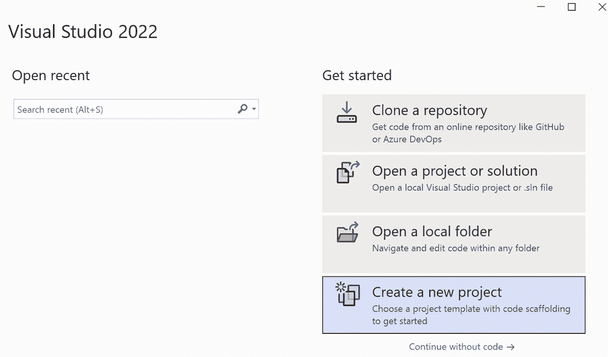

图 11.1 – Visual Studio 2022

这将打开 **创建一个新** **项目** 向导。

1.  在搜索框中输入 `blazor` 并从列表中选择 **.NET MAUI Blazor App** 项：

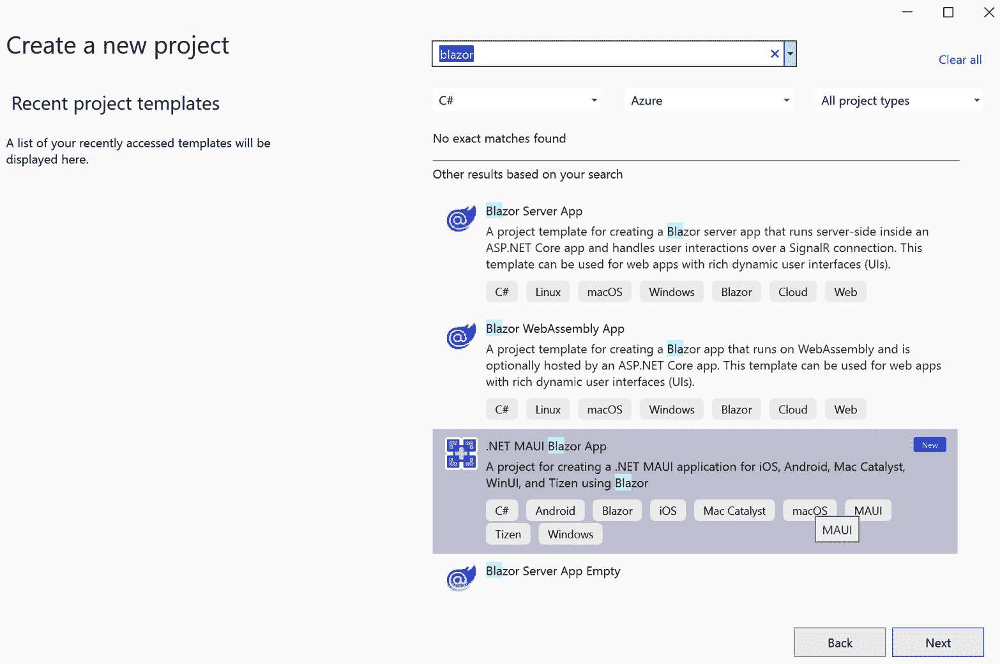

图 11.2 – 创建一个新项目

1.  点击 **下一步**。

1.  如下截图所示，将应用名称输入为 `Calculator`：

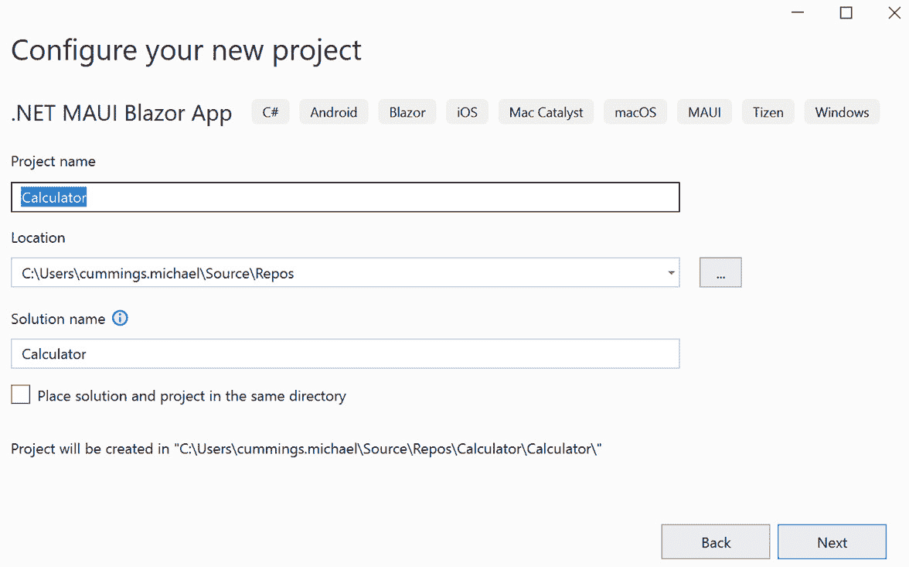

图 11.3 – 配置您的全新项目

1.  点击 **下一步**。

    最后一步将提示您选择要支持的 .NET Core 版本。在撰写本文时，.NET 6 可用为 **长期支持**（**LTS**），而 .NET 7 可用为 **标准期限支持**。对于本书，我们假设您将使用 .NET 7：

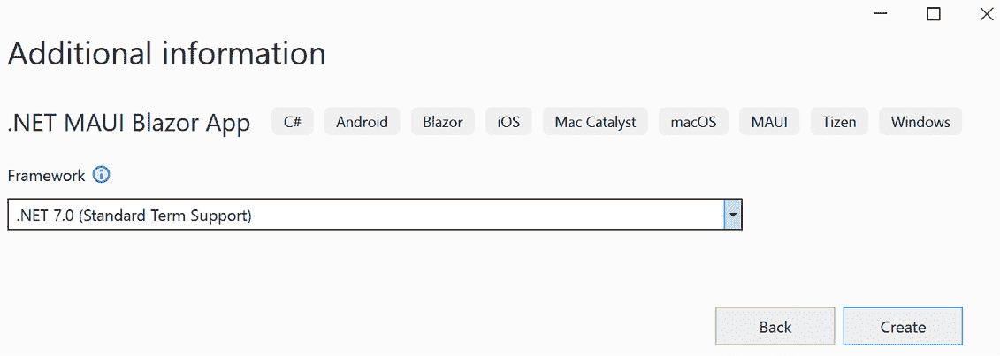

图 11.4 – 其他信息

1.  通过点击 **创建** 并等待 Visual Studio 创建项目来最终完成设置。

项目创建到此结束。

让我们通过回顾应用的结构来继续。

### 探索 .NET MAUI Blazor 混合项目

如果您运行项目，您将看到一个应用，如图 11.5 所示。它并不像 .NET MAUI 应用模板，而是具有独特的网络感觉。稍微探索一下应用，看看所有视觉元素是如何协同工作的。然后，关闭应用程序，返回 Visual Studio，并继续探索项目：

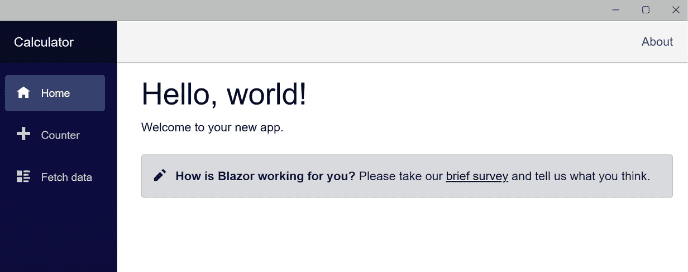

图 11.5 – 运行 .NET MAUI Blazor 模板项目

.NET MAUI Blazor 应用的结构是 .NET MAUI 应用和 Blazor 应用的混合体。如果您查看通常存在于 .NET MAUI 模板中的 `Platforms` 和 `Resources` 文件夹以及 `App.xaml`、`MainPage.xaml` 和 `MauiProgram.cs` 文件。`wwwroot`、`Data`、`Pages` 和 `Shared` 文件夹都支持 Blazor 应用。此外，您将在项目的根目录下找到 `_Imports.razor` 和 `Main.razor`：

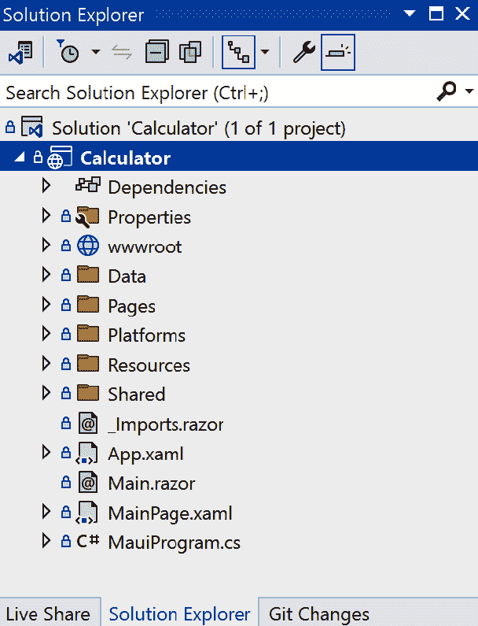

图 11.6 – .NET MAUI Blazor 项目的解决方案资源管理器视图

如果您需要复习 .NET MAUI 应用的结构和功能，请参阅 *第一章*。暂时忽略 Blazor 应用的功能，让我们看看 Blazor 应用是如何由 .NET MAUI 托管的。

由于所有 .NET MAUI 程序都从 `MauiProgram.cs` 文件开始，这似乎是一个好的起点。打开 `MauiProgram.cs` 文件并检查其内容。以下代码片段突出了 .NET MAUI Blazor 应用的差异：

```cs
builder.Services.AddMauiBlazorWebView();
#if DEBUG
    builder.Services.AddBlazorWebViewDeveloperTools();
    builder.Logging.AddDebug();
#endif
```

第一行高亮显示的行启用了 Blazor 应用的托管服务，特别是 WebView 控制器。第二行高亮显示的行启用了 WebView 控制器内的开发者工具（*F12*），但仅限于调试配置。

`App.xaml` 和 `App.xaml.cs` 与 .NET MAUI 模板项目中的基本相同，但 `MainPage.xaml` 则不同。打开 `MainPage.xaml` 文件来检查其内容，如下所示：

```cs
<?xml version="1.0" encoding="utf-8" ?>
<ContentPage

    x:Class="Calculator.MainPage"
    BackgroundColor="{DynamicResource PageBackgroundColor}">
    <BlazorWebView x:Name="blazorWebView" HostPage="wwwroot/index.html">
      <BlazorWebView.RootComponents>
        <RootComponent Selector="#app" ComponentType="{x:Type local:Main}" />
      </BlazorWebView.RootComponents>
    </BlazorWebView>
</ContentPage>
```

`MainPage` 有一个单独的控制项，`BlazorWebView`。这是一个包装原生控件以在应用程序中托管网页的包装器。`HostPage` 属性指向起始页面 - 在这种情况下，`wwwroot/index.html`。`BlazorWebView.RootComponents` 元素标识了 Blazor 应用程序的起始点以及它们在页面上的托管位置。在这种情况下，`RootComponent` `Main` 在具有 ID `app` 的元素中根。

要查看 `app` 元素的位置，打开 `wwwroot` 文件夹中的 `index.html` 文件并检查其内容，如下所示：

```cs
<!DOCTYPE html>
<html lang="en">
<head>
  <meta charset="utf-8" />
  <meta name="viewport" content="width=device-width, initial-scale=1.0, maximum-scale=1.0, user-scalable=no, viewport-fit=cover" />
  <title>Calculator</title>
  <base href="/" />
  <link rel="stylesheet" href="css/bootstrap/bootstrap.min.css" />
  <link href="css/app.css" rel="stylesheet" />
  <link href="Calculator.styles.css" rel="stylesheet" />
</head>
<body>
  <div class="status-bar-safe-area"></div>
  <div id="app">Loading...</div>
  <div id="blazor-error-ui">
    An unhandled error has occurred.
    <a href="" class="reload">Reload</a>
    <a class="dismiss">🗙</a>
  </div>
  <script src="img/blazor.webview.js" autostart="false"></script>
</body>
</html>
```

代码中突出显示的文件的关键部分。首先，`id` 设置为 `app` 的 `div` 元素是 `Main` 组件的根或加载位置。在页面的页眉中，识别了样式表。第一个样式表 `app.css` 位于项目的 `wwwroot/css` 文件夹中。第二个样式表 `Calculator.Styles.css` 在构建过程中从隔离的 CSS 文件创建。导入 `_framework/blazor.webview.js` 文件，该文件负责在页面上正确位置渲染你的 Blazor 组件的所有繁重工作。

在我们继续创建应用程序的其他部分之前，我们需要审查的最后部分是 Blazor 组件。`Main.razor` 是一个路由文件，它将 Blazor 运行时指向起始组件 `MainLayout.razor`，如下面的代码所示：

```cs
<Router AppAssembly="@typeof(Main).Assembly">
  <Found Context="routeData">
    <RouteView RouteData="@routeData" DefaultLayout="@typeof(MainLayout)" />
    <FocusOnNavigate RouteData="@routeData" Selector="h1" />
  </Found>
  <NotFound>
    <LayoutView Layout="@typeof(MainLayout)">
      <p role="alert">Sorry, there's nothing at this address.</p>
    </LayoutView>
  </NotFound>
</Router>
```

`MainLayout.razor` 文件定义了页面的基本布局，左侧有一个导航栏，主体内容占据了页面的剩余部分，如下面的代码所示：

```cs
@inherits LayoutComponentBase
<div class="page">
  <div class="sidebar">
    <NavMenu />
  </div>
  <main>
    <div class="top-row px-4">
      <a href="https://docs.microsoft.com/aspnet/" target="_blank">About</a>
    </div>
    <article class="content px-4">
      @Body
    </article>
  </main>
</div>
```

`@Body` 内容由满足路由的页面提供。对于第一个页面，那将是 `/`。如果你查看 `Pages` 文件夹中的文件，`Index.razor` 文件有一个 `@page` 指令，其参数为 `/`。因此，默认情况下，那将是显示的页面。`@page` 指令是一个 Razor 构造，允许满足路由而无需使用控制器。`Shared/NavMenu.razor` 文件中的 `NavLink` 条目使用 `href` 属性引用路由。该值在 `@page` 指令列表中查找匹配项。如果没有找到匹配项，则在 `Main.razor` 文件中的 `<NotFound>` 元素中渲染内容。

打开 `Pages/Counter.razor` 页面，看看 Razor 页面是如何工作的：

```cs
@page "/counter"
<h1>Counter</h1>
<p role="status">Current count: @currentCount</p>
<button class="btn btn-primary" @onclick="IncrementCount">Click me</button>
@code {
    private int currentCount = 0;
    private void IncrementCount()
    {
      currentCount++;
    }
}
```

在 `@page` 指令之后，页面由 HTML 和一些 Razor 指令混合组成。然后是 `@code` 指令，其中包含页面的 C# 代码。HTML 的 `button` 元素的点击事件通过 `@onclick` 指令映射到 C# 的 `IncrementCount` 方法。

了解更多

要了解更多关于 Razor 页面的信息，请查看官方文档：[`learn.microsoft.com/en-us/aspnet/core/blazor/?view=aspnetcore-7.0`](https://learn.microsoft.com/en-us/aspnet/core/blazor/?view=aspnetcore-7.0)。

现在，让我们开始创建项目。

### 准备项目

.NET MAUI 和 Blazor 无缝集成 – 集成得如此之好，以至于有时很难区分在哪里执行。这使得在 XAML 和 HTML 中渲染数据变得非常容易。

让我们从为计算器准备项目开始。我们将首先删除大部分我们不会使用的模板代码。按照以下步骤准备模板：

1.  在 Visual Studio 中，使用 `Data` 文件夹。

1.  在 `Pages` 文件夹中，删除 `Index.razor`、`Counter.Razor` 和 `FetchData.razor`。

1.  在 `Shared` 文件夹中，删除 `NavMenu.razor`、`NavMenu.razor.css` 和 `SurveyPrompt.razor`。

1.  右键点击 `Pages` 文件夹，然后选择 **添加** | **Razor 组件…**，如图所示：

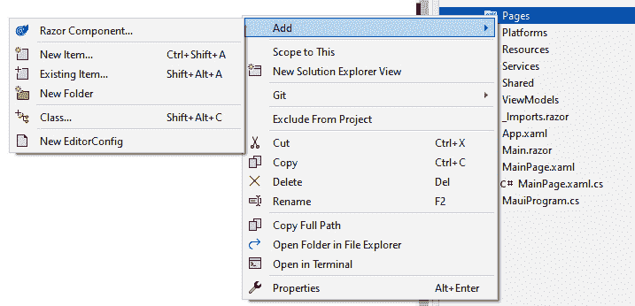

图 11.7 – 添加新的 Razor 组件

1.  在 `Keypad.razor` 中点击 **添加**：

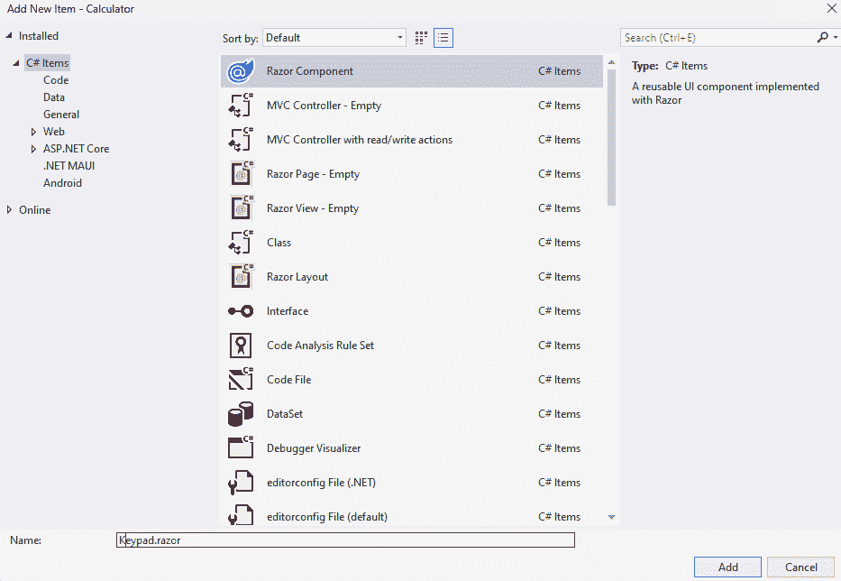

图 11.8 – Razor 组件

1.  在新的 `Keypad.razor` 文件中，添加以下突出显示的行：

    ```cs
    @page "/"
    <h3>Keypad</h3>
    <div>Keypad goes here</div>
    @code {
    }
    ```

1.  打开 `Shared` 文件夹中的 `MainLayout.razor` 文件，并删除以下突出显示的部分：

    ```cs
    @inherits LayoutComponentBase
    <div class="page">
        <div class="sidebar">
          <NavMenu />
        </div>
        <main>
          <div class="top-row px-4">
            <a href="https://docs.microsoft.com/aspnet/" target="_blank">About</a>
          </div>
          <article class="content px-4">
            @Body
          </article>
        </main>
    </div>
    ```

1.  打开 `MauiProgram.cs` 并删除突出显示的代码行：

    ```cs
    using Calculator.Data;
    using Microsoft.Extensions.Logging;
    namespace Calculator
    {
        public static class MauiProgram
        {
          public static MauiApp CreateMauiApp()
          {
            var builder = MauiApp.CreateBuilder();
            builder
              .UseMauiApp<App>()
              .ConfigureFonts(fonts =>
              {
                fonts.AddFont("OpenSans-Regular.ttf", "OpenSansRegular");
              });
            builder.Services.AddMauiBlazorWebView();
    #if DEBUG
          builder.Services.AddBlazorWebViewDeveloperTools();
          builder.Logging.AddDebug();
    #endif
          builder.Services.AddSingleton<WeatherForecastService>();
          return builder.Build();
          }
        }
    }
    ```

1.  现在，运行项目以查看更改的效果，如图 *图 11.9* 所示：

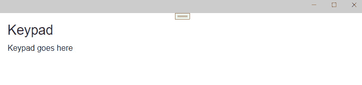

图 11.9 – 在 Windows 上运行空白计算器应用

现在，项目已经准备好成为一个应用，让我们从 Keypad 视图开始。

## 创建 Keypad 视图

Keypad 视图是计算器的基本功能。它有 0 到 9 的每个数字按钮，小数分隔符 `.*`，清除按钮 `C`，清除所有内容 `CE`，以及最终，加号 `+`，减号 `-`，乘号 `x`，除号 `/`，等于 `*=` 来获取结果，和左箭头 `<` 来删除最后一个字符。视图有三个基本组件 – HTML 和 CSS 用于样式，以及 C# 代码。以下每个部分将指导您为视图添加每个这些组件，从 HTML 开始。

### 添加 HTML

Razor 文件和 .NET MAUI XAML 文件没有为你提供可视化的设计器。你必须运行你的应用来查看你所做的更改，这通常涉及到构建、部署，然后导航到应用中的视图。.NET 有一个节省时间的功能叫做热重载。它通过将你对 Razor、XAML、CSS 和 C# 文件所做的更改应用到正在运行的应用程序中，而无需你停止并重新启动应用来实现。在完成下一步操作时尝试使用**热重载**。要应用更改，请使用**调试**工具栏中的**热重载**按钮。它很容易找到——它是一个火焰图标：

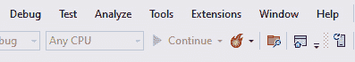

图 11.10 – 热重载工具栏按钮

如果在任何时候你收到类似于以下“粗鲁编辑”对话框，这仅仅意味着更改不能通过热重载应用，因此你需要停止、重新构建并重新启动调试：

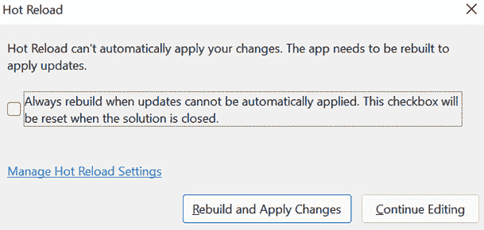

图 11.11 – 热重载对话框

热重载一直在不断改进，所以将来这些情况会越来越少。

要添加将为你提供与密钥盘交互的 UI 的 HTML，请按照以下步骤操作：

1.  通过使用调试器或按*F5*键启动应用。

1.  如果你想在 Visual Studio 中查看你的应用，你可以打开**XAML 实时预览**窗格。要打开**XAML 实时预览**窗格，请使用 Visual Studio 菜单并选择**调试**|**窗口**|**XAML 实时预览**。我通常将其固定打开，以便始终可用。

1.  在`Pages`文件夹中打开`Keypad.razor`文件。

1.  删除以下代码块中显示的突出内容：

    ```cs
    @page "/"
    <h3>Keypad</h3>
    <div>Keypad goes here</div>
    @code {
    }
    ```

1.  在`@page`之后但在`@`代码指令之前添加以下 HTML：

    ```cs
    <div class="keypad">
      <div class="keypad-body">
        <div class="keypad-screen">
          <div class="keypad-typed"></div>
        </div>
        <div class="keypad-row">
          <div class="keypad-button wide command">C</div>
          <div class="keypad-button command">CE</div>
          <div class="keypad-button operator">/</div>
        </div>
        <div class="keypad-row">
          <div class="keypad-button">7</div>
          <div class="keypad-button">8</div>
          <div class="keypad-button">9</div>
          <div class="keypad-button operator">X</div>
        </div>
        <div class="keypad-row">
          <div class="keypad-button">4</div>
          <div class="keypad-button">5</div>
          <div class="keypad-button">6</div>
          <div class="keypad-button operator">−</div>
        </div>
        <div class="keypad-row">
          <div class="keypad-button">1</div>
          <div class="keypad-button">2</div>
          <div class="keypad-button">3</div>
          <div class="keypad-button operator">+</div>
        </div>
        <div class="keypad-row">
          <div class="keypad-button">.</div>
          <div class="keypad-button">0</div>
          <div class="keypad-button">&lt;</div>
          <div class="keypad-button operator">=</div>
        </div>
      </div>
    </div>
    ```

    不要忘记按`div`而不是`table`，因为比`table`元素更容易为`div`元素添加样式。密钥盘按四按钮一行排列，除了前两行。第一行是显示表达式或结果的显示屏。第二行只有三个按钮。类名已经添加到 HTML 元素中，但由于它们还不存在，它们不会改变外观。

密钥盘看起来还不完全像密钥盘，但一旦我们给它添加一些样式，它就会变得如此。

### 为 HTML 添加样式

CSS 已经存在很长时间了，是使你的 HTML 看起来最好的最佳方式。按照以下步骤添加我们在上一节中使用的样式：

1.  确保你的应用仍在运行，并在`Pages`文件夹中使用`Keypad.razor.css`。如果 Visual Studio 默认不显示它们，请点击**显示所有模板**按钮：

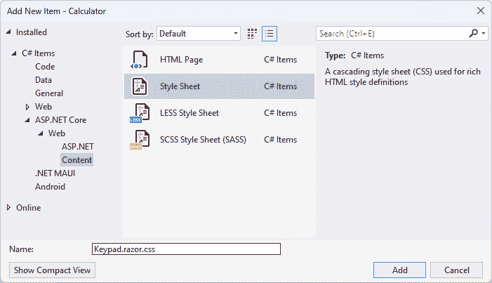

图 11.12 – 添加新的 CSS 文件

如果你查看`Pages`文件夹，你会注意到你的新文件现在位于`Keypad.razor`文件下：

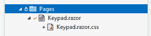

图 11.13 – 带有独立 CSS 文件的 Razor 页面

Visual Studio 自动识别您想要添加一个`Keypad.razor`文件。

1.  将`keypad`样式添加到`Keypad.razor.css`文件中：

    ```cs
    .keypad {
        width: 300px;
        margin: auto;
        margin-top: -1.1em;
    }
    ```

    这个样式将元素的宽度设置为`300px`，除了顶部，其值为`-1.1em`。`-1.1em`将键盘的顶部边缘直接移动到网页视图控制的顶部。

1.  现在，使用以下代码添加`keypad-body`样式：

    ```cs
    .keypad-body {
        border: solid 1px #3A4655;
    }
    ```

    这个样式只是给整个元素添加了一个一像素宽的深灰色边框。

1.  我们将最后保存`keypad-screen`和`keypad-typed`样式，所以添加以下代码中显示的`keypad-row`样式：

    ```cs
    .keypad-row {
        width: 100%;
        background: #3C4857;
    }
    ```

    这个样式将元素宽度设置为父元素的 100%，即`keypad-body`，并将背景设置为令人愉悦的深灰色。

1.  接下来要添加的样式是`keypad-button`。使用以下代码添加样式：

    ```cs
    .keypad-button {
        width: 25%;
        background: #425062;
        color: #fff;
        padding: 20px;
        display: inline-block;
        font-size: 25px;
        text-align: center;
        vertical-align: middle;
        margin-right: -4px;
        border-right: solid 2px #3C4857;
        border-bottom: solid 2px #3C4857;
        transition: all 0.2s ease-in-out;
    }
    ```

    这个样式是所有按键按钮的基础，因此它具有最多的属性。应用了这个样式的元素在其右侧和底部有 2 像素宽的边框，并且使用与行背景相同的颜色。按钮的`background`属性比边框颜色略暗，这提供了一点深度。文本在垂直和水平方向上居中对齐，并使用 25 像素的字体大小。宽度设置为 25%，因为每行通常有四个按钮。`transition`属性使用`ease-in-out`进行 200 毫秒的过渡，这从开始加速到中间，然后从中间减速到结束。`transition`应用于所有属性，所以每当这个样式的属性发生变化时，它都会从起始值缓慢变化到结束值。

1.  如果按钮是动作按钮，例如运算符，则应用一个额外的样式，称为`operator`。这个样式的定义与迄今为止创建的其他样式略有不同。这个样式不仅被命名为`operator`，而是命名为`keypad-button.operator`。在 CSS 中，`.`是一个选择器；它用于定位要应用哪些属性。在这种情况下，我们想要所有同时应用了`keypad-button`类和`operator`类的元素。要添加`keypad-button.operator`类，请使用以下代码：

    ```cs
    .keypad-button.operator {
        color: #AEB3BA;
        background: #404D5E;
    }
    ```

    这些按钮将以略暗的背景和略少的白色文字显示。

1.  清除(*C*)和清除所有(*CE*)按钮也有它们自己的类，如下所示：

    ```cs
    .keypad-button.command {
        color: #D95D4E;
        background: #404D5E;
    }
    ```

    这些按钮将以略暗的背景和红色文字显示。

1.  现在，对于桌面，我们可以通过使用`:hover`伪选择器来添加悬停高亮。使用以下代码添加悬停样式：

    ```cs
    .keypad-button:hover {
        background: #E0B612;
    }
    .keypad-button.command:hover,
    .keypad-button.operator:hover {
        background: #E0B612;
        color: #fff;
    }
    ```

    背景被改为橙色。由于`keypad-button`样式中存在`transition`属性，所以变化不会立即发生，它将在两十分之一秒内从深灰色过渡到橙色。

1.  最后一个与按钮相关的样式是宽的，或者 `keypad-button.wide`。这种样式使按钮的宽度是普通按钮的两倍。要添加此样式，请使用以下代码：

    ```cs
    .keypad-button.wide {
        width: 50%;
    }
    ```

1.  最后两个样式，`keypad-screen` 和 `keypad-typed`，用于显示表达式和结果。使用以下代码添加剩余的两个样式：

    ```cs
    .keypad-screen {
        background: #3A4655;
        width: 100%;
        height: 75px;
        padding: 20px;
    }
    .keypad-typed {
        font-size: 45px;
        text-align: right;
        color: #fff;
    }
    ```

现在，键盘看起来像真正的计算器键盘；请参阅 *图 11**.14* 以获取示例。你是否能够在不重新启动应用程序的情况下继续添加样式并看到更改？请记住点击 **热重载** 按钮，或在 **热重载** 按钮菜单下设置 **在文件保存时热重载** 选项；Visual Studio 将在您保存文件时尝试应用更改。接下来，我们将添加使按钮能够工作的代码：

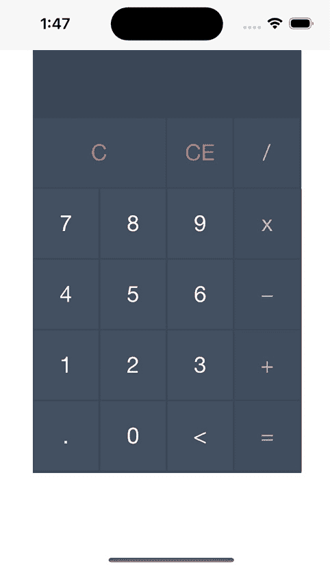

图 11.14 – 带样式的 HTML 键盘

### 连接控件

在大多数网页中，您会使用 `Keypad.razor` 文件，按照以下步骤操作：

1.  在 `@code` 指令块内，添加以下内容：

    ```cs
    string inputDisplay = string.Empty;
    bool clearInputBeforeAppend = false;
    ```

    这声明了一个名为 `inputDisplay` 的 `string` 字段，并将其初始化为空字符串。它还声明了一个 `bool` 字段，并将其初始化为 `false`。`clearInputBeforeAppend` 是一个标志，用于保持 `inputDisplay` 的清洁。在显示结果后，当用户轻触按钮时，应在将字符添加到屏幕之前清除 `inputDisplay`。

1.  更新具有 `keypad-typed` 类的元素，如下所示：

    ```cs
    <div class="keypad-typed">@inputDisplay</div>
    ```

    这将渲染 `inputDisplay` 变量的内容到 `div` 元素中。注意使用 `@` 来引用 C# 字段。

1.  为了帮助验证输入，请添加以下内容：

    ```cs
    readonly char[] symbols = { '/', 'X', '+', '-', '.' };
    ```

1.  当按下任何数字（0 到 9）或操作按钮时，`inputDisplay` 将通过向显示中添加一个字符来更新。使用以下代码添加 `AppendInput` 方法：

    ```cs
    void AppendInput(string inputValue)
    {
        double numValue;
        if (clearInputBeforeAppend)
        {
            inputDisplay = string.Empty;
        }
        if (string.IsNullOrEmpty(inputDisplay) && inputValue.IndexOfAny(symbols) != -1)
        {
            return;
        }
        if (!double.TryParse(inputValue, out numValue) && !string.IsNullOrEmpty(inputDisplay) && $"{inputDisplay[¹]}".IndexOfAny(symbols) != -1)
        {
            return;
        }
        if (inputDisplay.Trim() == "0" && inputValue == "0")
        {
            return;
        }
        clearInputBeforeAppend = false;
        inputDisplay += inputValue;
    }
    ```

    让我们回顾一下代码。首先检查 `inputDisplay` 是否需要清除；如果是，则清除。然后进行操作符的检查。下一个检查更复杂，因为它不允许一行中有多个操作符。此检查使用 `¹` 的 `Range` 语法来指示最后一个字符。使用字符串插值将最后一个字符转换回字符串，以便 `IndexOfAny` 可以在符号数组中找到该字符。检查并拒绝多个前导 0。如果所有检查都通过，则将输入追加到 `inputDisplay`，并将 `clearInputBeforeAppend` 标志重置为 `false`。

1.  当用户使用以下代码按下 `Undo` 方法时：

    ```cs
    void Undo()
    {
        if (!clearInputBeforeAppend && inputDisplay.Length > 0)
        {
            inputDisplay = inputDisplay[0..¹];
            return;
        }
    }
    ```

    此方法再次使用 `Range` 语法，以及字符串能够像数组一样索引的能力。它使用数组语法从索引 0 到下一个最后一个索引获取元素，并返回它。

1.  当用户使用以下代码按下 `ClearInput` 方法时：

    ```cs
    void ClearInput()
    {
        inputDisplay = string.Empty;
    }
    ```

1.  当用户按下 `ClearAll` 方法时：

    ```cs
    void ClearAll()
    {
        ClearInput();
    }
    ```

1.  最后，`EvaluateExpression` 方法：

    ```cs
    void EvaluateExpression()
    {
        var expression = inputDisplay;
        clearInputBeforeAppend = true;
    }
    ```

    此方法尚未评估输入的表达式；这将在 *创建计算* *服务* 部分中发生。

在 `Keypad.razor` 文件中的下一步是连接刚刚定义的方法，以便在用户点击或触摸该元素时调用它们。就像在标准 HTML 中一样，事件通过引用代码的元素属性连接起来，无论是内联还是方法。Razor 页面中的属性使用页面指令与事件名称相关联。例如，处理触摸或点击的 DOM 事件是 `click`，因此 Razor 事件名称将是 `@onclick`。该属性随后被分配给一个代表，它可以是任何方法。完整的属性可能看起来像 `@onclick="DoSomething"`，其中 `DoSomething` 是在页面的 `@code` 指令中定义的 C# 方法。

`AppendInput` 方法接受一个字符串参数，因此代表不能只是 `AppendInput` – 它必须被包裹在一个表达式中，以便可以将参数传递下去。Razor 页面中的表达式包含在 `@(…)` 指令中。所有从事件指令对 `AppendInput` 的调用都将类似于 `@onclick="@(AppendInput("0"))"`。

使用以下代码中高亮显示的行来更新 `Keypad.razor` 文件中的 HTML：

```cs
<div class="keypad">
    <div class="keypad-body">
        <div class="keypad-screen">
            <div class="keypad-typed">@inputDisplay</div>
        </div>
        <div class="keypad-row">
            <div class="keypad-button wide command" @onclick="ClearInput">C</div>
            <div class="keypad-button command" @onclick="ClearAll">CE</div>
            <div class="keypad-button operator" @onclick="@(()=>AppendInput("/"))">/</div>
        </div>
        <div class="keypad-row">
            <div class="keypad-button" @onclick="@(()=>AppendInput("7"))">7</div>
            <div class="keypad-button" @onclick="@(()=>AppendInput("8"))">8</div>
            <div class="keypad-button" @onclick="@(()=>AppendInput("9"))">9</div>
            <div class="keypad-button operator" @onclick="@(()=>AppendInput("X"))">X</div>
        </div>
        <div class="keypad-row">
            <div class="keypad-button" @onclick="@(()=>AppendInput("4"))">4</div>
            <div class="keypad-button" @onclick="@(()=>AppendInput("5"))">5</div>
            <div class="keypad-button" @onclick="@(()=>AppendInput("6"))">6</div>
            <div class="keypad-button operator" @onclick="@(()=>AppendInput("-"))">−</div>
        </div>
        <div class="keypad-row">
            <div class="keypad-button" @onclick="@(()=>AppendInput("1"))">1</div>
            <div class="keypad-button" @onclick="@(()=>AppendInput("2"))">2</div>
            <div class="keypad-button" @onclick="@(()=>AppendInput("3"))">3</div>
            <div class="keypad-button operator" @onclick="@(()=>AppendInput("+"))">+</div>
        </div>
        <div class="keypad-row">
            <div class="keypad-button" @onclick="@(()=>AppendInput("."))">.</div>
            <div class="keypad-button" @onclick="@(()=>AppendInput("0"))">0</div>
            <div class="keypad-button" @onclick="Undo">&lt;</div>
            <div class="keypad-button operator" @onclick="EvaluateExpression">=</div>
        </div>
    </div>
</div>
```

更多关于 Razor 事件处理的信息

要了解更多关于 Razor 事件处理的信息，请访问 https://learn.microsoft.com/en-us/aspnet/core/blazor/components/event-handling?view=aspnetcore-7.0。

键盘几乎完成了。在此阶段，你应该能够输入一个完整的表达式进行评估，然后清除显示屏。在下一节中，你将创建一个用于评估表达式的服务。

## 创建计算服务

`Compute` 服务评估表达式并返回结果。为了说明 .NET MAUI 和 Blazor 应用程序如何相互交互，此服务将从 .NET MAUI 依赖注入容器注入到 Blazor 页面中。要实现 `Compute` 服务，请按照以下步骤操作：

1.  在项目的根目录下创建一个名为 `Services` 的新文件夹。

1.  在 `Services` 文件夹中，添加一个名为 `Compute` 的新 C# 类文件。

1.  修改 `Compute.cs` 文件，使其与以下代码匹配：

    ```cs
    namespace Calculator.Services;
    internal class Compute
    {
        public string Evaluate(string expression)
        {
            System.Data.DataTable dataTable = new System.Data.DataTable();
            var finalResult = dataTable.Compute(expression, string.Empty);
            return finalResult.ToString();
        }
    }
    ```

    这段代码可能比你预期的要短。而不是编写大量代码来解析表达式并构建一个用于评估的表达式树，已经存在一种内置的方式来评估简单的表达式：`DataTable`。`DataTable.Compute` 方法可以评估从计算器构建的所有表达式。

1.  打开 `MauiProgram.cs` 文件，并添加以下高亮显示的代码行以使用依赖注入注册类：

    ```cs
    #if DEBUG
        builder.Services.AddBlazorWebViewDeveloperTools();
        builder.Logging.AddDebug();
    #endif
        builder.Services.AddSingleton<Compute>();
        return builder.Build();
    ```

1.  为了允许 `Keypad.razor` 页面使用 `Compute` 类型，它需要使用 Razor 声明。打开 `_Imports.razor` 文件，并在文件末尾添加以下高亮显示的代码行：

    ```cs
    @using Calculator.Services
    ```

    没有此行，你仍然可以使用该类型，但必须完全限定它为`Calculator.Services.Compute`。这是 Razor 中 C#文件中`global` `using`指令的等效项。

1.  现在，打开`Keypad.razor`文件，在`@page`指令之后添加以下代码行：

    ```cs
    @inject Compute compute
    ```

    `@inject`指令将使用.NET MAUI 依赖注入容器解析第一个参数提供的类型，并将其分配给第二个参数定义的变量。

1.  在`EvaluateExpression`方法中，可以使用`compute`变量来评估`inputDisplay`中包含的表达式，如下所示突出显示的代码：

    ```cs
    void EvaluateExpression()
    {
        var expression = inputDisplay;
        var result = compute.Evaluate(inputDisplay.Replace('X', '*'));
        inputDisplay = result;
        clearInputBeforeAppend = true;
    }
    ```

    在这里，使用`inputDisplay`作为参数调用了`Evaluate`方法。首先将`inputDisplay`修改为将字符串中的所有`X`值替换为`*`，因为这是`DataTable`期望用于乘法的。然后将结果分配给`inputDisplay`。

到目前为止，计算器应用程序可以接受数字和运算符的组合输入，并评估结果，将其显示给用户。用户还可以清除显示。在下一节中，我们将通过给计算器添加内存来探索更多的互操作性。

## 添加内存功能

大多数计算器可以存储以前的计算。在本节中，你将向计算器应用程序添加一个以前计算列表，并将以前的计算召回到键盘的`inputDisplay`参数。

代码将使用.NET MAUI 控件在`WebViewControl`旁边渲染。将使用一个名为`Calculations`的新类来管理列表。

要将内存功能添加到计算器应用程序中，请按照以下步骤操作：

1.  创建一个名为`ViewModels`的新文件夹。

1.  在`ViewModels`文件夹中添加一个名为`Calculations`的新类，并修改文件以匹配以下代码：

    ```cs
    using System.Collections.ObjectModel;
    namespace Calculator.ViewModels;
    public class Calculations : ObservableCollection<Calculation>
    {
    }
    public class Calculation : Tuple<string, string>
    {
        public Calculation(string expression, string result) : base(expression, result) { }
        public string Expression => this.Item1;
        public string Result => this.Item2;
    }
    ```

    此代码添加了两个类 - `Calculations`，它是`Observable Collection<Calculation>`的简称，以及`Calculation`，它是`Tuple<string, string>`，并定义了两个属性来引用`Item1`作为`Expression`和`Item2`作为`Result`。

1.  添加对`CommunityToolkit.Mvvm` NuGet 包的引用。

1.  在`ViewModels`文件夹中添加一个名为`MainPageViewModel`的新类，并修改文件，如下所示代码：

    ```cs
    using CommunityToolkit.Mvvm.Input;
    using CommunityToolkit.Mvvm.Messaging;
    namespace Calculator.ViewModels;
    public partial class MainPageViewModel
    {
        IMessenger messenger;
        public MainPageViewModel(Calculations results, IMessenger messenger)
        {
            Results = results;
            this.messenger = messenger;
        }
        public Calculations Results { get; init; }
        [RelayCommand]
        public void Recall(Calculation sender)
        {
            messenger.Send(sender);
        }
    }
    ```

    `MainViewModel`类使用`CommunityToolkit`的两个功能：`RelayCommand`和`IMessenger`。与其他章节一样，`RelayCommand`用于将方法绑定到 XAML 操作。`IMessenger`是一个用于在应用程序的不同部分之间发送消息的接口。当你不希望两个类之间有硬依赖时，它非常有用，尤其是如果它创建了一个循环引用。`CommunityToolkit`提供了一个名为`WeakReferenceMessenger`的`IMessenger`的默认实现。

1.  打开`MauiProgram.cs`文件，在文件顶部添加以下`using`声明：

    ```cs
    using Calculator.ViewModels;
    using CommunityToolkit.Mvvm.Messaging;
    ```

1.  在`CreateMauiApp`方法中，进行以下突出显示的更改：

    ```cs
    builder.Services.AddSingleton<Compute>();
    builder.Services.AddSingleton<Calculations>();
    builder.Services.AddSingleton<MainPage>();
    builder.Services.AddSingleton<MainPageViewModel>();
    builder.Services.AddSingleton<IMessenger>(WeakReferenceMessenger.Default);
    return builder.Build();
    ```

    这会将 `MainPage`、`MainPageViewModel` 和 `WeakReferenceMessenger` 的默认实例添加到依赖注入容器中。接下来的几个步骤将使 `MainPage` 能够通过依赖注入进行初始化。

1.  打开 `MainView.xaml.cs` 文件，并进行以下高亮显示的更改：

    ```cs
    using Calculator.ViewModels;
    namespace Calculator;
    public partial class MainPage : ContentPage
    {
        public MainPage(MainPageViewModel vm)
        {
            InitializeComponent();
            BindingContext = vm;
        }
    }
    ```

    如同其他章节，视图的构造函数被更新以接受视图模型作为参数，并将其分配为 `BindingContext`。

1.  打开 `App.xaml.cs` 文件，修改构造函数，并添加 `OnHandlerChanging` 事件处理程序，如下所示：

    ```cs
    public App()
    {
        InitializeComponent();
    }
    protected override void OnHandlerChanging(HandlerChangingEventArgs args)
    {
        base.OnHandlerChanging(args);
        MainPage = args.NewHandler.MauiContext.Services.GetService<MainPage>();
    }
    ```

    由于 .NET MAUI Blazor 应用程序默认不使用 `Shell`，因此视图不能像使用 `Shell` 那样通过依赖注入进行初始化。相反，在设置 `Handler` 之后，将获取 `MainPage` 的实例。使用 `OnHandlerChanging` 事件来获取新 `Handler` 的引用，然后它为依赖注入容器提供 `MauiContext`。

1.  打开 `_Imports.razor` 文件，并将以下行添加到文件末尾：

    ```cs
    @using Calculator.ViewModels
    @using CommunityToolkit.Mvvm.Messaging
    ```

1.  打开 `Keypad.razor` 文件，并添加以下高亮显示的行：

    ```cs
    @inject Compute compute
    @inject Calculations calculations
    @inject IMessenger messenger
    <div class="keypad">
    ```

    这将从 .NET MAUI 依赖注入容器中注入 `Calculations` 实例作为 `calculations` 和 `WeakReference` **信使** 作为 `messenger`。

1.  修改 `ClearAll` 和 `EvaluateExpression` 方法，并添加一个 `OnAfter` **RenderAsync** 方法，如下所示：

    ```cs
    void ClearAll()
    {
        ClearInput();
        calculations.Clear();
    }
    void EvaluateExpression()
    {
        var expression = inputDisplay;
        var result = compute.Evaluate(inputDisplay.Replace('X', '*'));
        calculations.Add(new(expression, result));
        inputDisplay = result;
        clearInputBeforeAppend = true;
    }
    protected override Task OnAfterRenderAsync(bool firstRender)
    {
        if (firstRender)
        {
            messenger.Register<Calculation>(this, (sender, er) =>
            {
                inputDisplay = er.Expression;
                clearInputBeforeAppend = true;
                StateHasChanged();
            });
        }
        return base.OnAfterRenderAsync(firstRender);
    ClearAll will just clear the collection, and EvaluateExpression will add the new Calulation to the collection. OnAfterRenderAsync is used to register this class to receive messages for any Calculation objects. When a message is received, inputDisplay is set to the Expression value of Calculation, and StateHasChanged is called to force the UI to refresh with the updated value.
    ```

1.  打开 `Shared/MainLayout.razor.css` 文件，并将以下行添加到 `page` 类中：

    ```cs
    background-color: black;
    ```

    这只是为了美观，使得计算器周围区域变为黑色。

1.  打开 `MainPage.xaml` 文件，并修改它以匹配以下代码：

    ```cs
    <ContentPage

        x:Class="Calculator.MainPage"
        x:DataType="viewModels:MainPageViewModel">
        <Grid BackgroundColor="Black">
          <Grid.RowDefinitions>
            <RowDefinition Height="1*" />
            <RowDefinition Height="1*" />
          </Grid.RowDefinitions>
          <ScrollView Grid.Row="0" BackgroundColor="Bisque" WidthRequest="400" VerticalScrollBarVisibility="Always">
            <CollectionView ItemsSource="{Binding Results}" ItemsUpdatingScrollMode="KeepLastItemInView">
              <CollectionView.ItemTemplate>
                <DataTemplate x:DataType="viewModels:ExpressionResult">
                  <SwipeView>
                    <SwipeView.LeftItems>
                      <SwipeItems Mode="Execute">
                        <SwipeItem
    Text="Recall"                             BackgroundColor="LightPink"                                       Command="{Binding Source={RelativeSource AncestorType={x:Type viewModels:MainPageViewModel}}, Path=RecallCommand}"                                      CommandParameter="{Binding}"/>
                        </SwipeItems>
                      </SwipeView.LeftItems>
                      <VerticalStackLayout>
                        <HorizontalStackLayout Padding="10" HorizontalOptions="EndAndExpand">
                          <Label Text="{Binding Expression}" FontSize="Large" TextColor="Black" HorizontalTextAlignment="End" HorizontalOptions="EndAndExpand"/>
                          <Label Text="=" TextColor="Blue" FontSize="Large" HorizontalTextAlignment="End" HorizontalOptions="EndAndExpand"/>
                          <Label Text="{Binding Result}" FontSize="Large" TextColor="Black" HorizontalTextAlignment="End" HorizontalOptions="EndAndExpand"/>
                        </HorizontalStackLayout>
                        <Line Stroke="LightSlateGray" X2="400" />
                        <Line Stroke="Black" X2="400" />
                      </VerticalStackLayout>
                    </SwipeView>
                  </DataTemplate>
                </CollectionView.ItemTemplate>
              </CollectionView>
          </ScrollView>
          <BlazorWebView Grid.Row="1" x:Name="blazorWebView" HostPage="wwwroot/index.html" HeightRequest="540">
            <BlazorWebView.RootComponents>
              <RootComponent Selector="#app" ComponentType="{x:Type local:Main}" />
            </BlazorWebView.RootComponents>
          </BlazorWebView>
        </Grid>
    </ContentPage>
    ```

    使用定义了两行的 `Grid` 元素来包含新的显示区域，用于之前的计算和原始的 `BlazorWebView` 控件。计算使用 `ScrollView` 渲染，其中包含 `CollectionView`。`CollectionView.ItemTemplate` 属性包含每个 `Calculation` 的 `DataTemplate`。`SwipeView` 控件允许用户向上、向下、向左或向右滑动以显示额外的命令。每个方向都有一个元素来定义这些操作。对于 `Calculation` 项目，当用户向右滑动时，它会显示一个 `Recall` 项目，该项目绑定到 `MainPageViewModel` 的 `Recall` 命令。`Calculation` 的显示使用水平和垂直 `StackLayout` 控件的组合来堆叠 `Expression` 在 `Result` 之上，并用 `=` 对齐，所有内容都向左对齐。

这就完成了我们计算器应用的主要功能。下一节将处理在桌面操作系统（如 Windows 或 macOS）上运行时的主窗口的一些美学问题。

## 调整主窗口大小

计算器应用被定义为固定大小。本书中的大多数项目都允许控件随着窗口大小的变化而增长或缩小。对于我们的计算器应用，主窗口应该是固定的，以便以最佳方式显示。要在应用启动时固定窗口大小，打开 `App.xaml.cs` 文件，并将以下方法添加到 `App` 类中：

```cs
protected override Window CreateWindow(IActivationState activationState)
{
    var window = base.CreateWindow(activationState);
    if (OperatingSystem.IsWindows() || OperatingSystem.IsMacCatalyst())
    {
        window.Created += Window_Created;
    }
    return window;
}
private async void Window_Created(object sender, EventArgs e)
{
    const int defaultWidth = 450;
    const int defaultHeight = 800;
    var window = (Window)sender;
    window.Width = defaultWidth;
    window.Height = defaultHeight;
    window.X = -defaultWidth;
    window.Y = -defaultHeight;
    await window.Dispatcher.DispatchAsync(() => { });
    var displayInfo = DeviceDisplay.Current.MainDisplayInfo;
    window.X = (displayInfo.Width / displayInfo.Density - window.Width) / 2;
    window.Y = (displayInfo.Height / displayInfo.Density - window.Height) / 2;
    window.Created -= Window_Created;
}
```

`CreateWindow` 方法被重写，以便当应用在 Windows 或 macOS 上运行时，可以给 `Window.Created` 事件附加一个自定义处理程序。调整窗口大小的操作在 `Window_Created` 方法中完成。它使用 `defaultHeight` 和 `defaultWidth` 常量来设置新窗口的高度、宽度和屏幕上的位置。然后，该方法等待所有线程完成后再再次更改窗口的 `X` 和 `Y` 属性，但这次要考虑到屏幕像素密度。最后，它断开事件处理程序

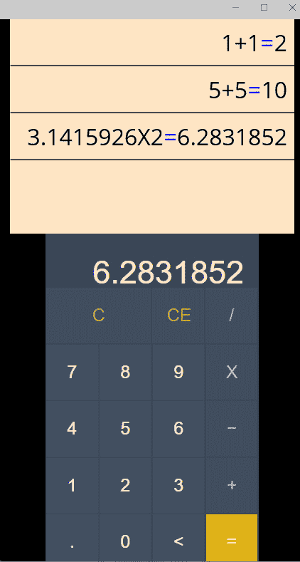

图 11.15 – 完成的计算器项目

# 摘要

优秀的工作！在本章中，你完成了一个使用 .NET MAUI Blazor 模板的项目。你使用 HTML 创建了一个 UI，并用 C# 代码更新它，然后实现了一个由 .NET MAUI 管理并注入到 Razor 页面中的服务。然后，你使用 `CollectionView` 显示之前计算列表。在 `CollectionView` 的 `ItemTemplate` 中，使用了 `SwipeView` 控件来将之前的计算召回键盘进行额外的编辑和重新评估。

要进一步扩展此项目，请考虑以下：

+   为集合添加一个额外的滑动操作以删除一个计算

+   为科学计算添加一个额外的键盘布局

在下一章——也是最后一章中，你将随着构建一个物体识别应用而发现人工智能的世界。
