# 12

# 热狗还是非热狗：使用机器学习

在本章中，我们将学习如何使用机器学习创建一个模型，我们可以用它来进行图像分类。我们将导出为**Onnx**模型，这样我们就可以在所有平台上使用它——也就是说，Android、iOS、macOS 和 Windows。为了训练和导出模型，我们将使用 Azure 认知服务和自定义视觉服务。

一旦我们导出了模型，我们将学习如何在.NET MAUI 应用程序中使用它们。

本章将涵盖以下主题：

+   使用 Azure 认知服务和自定义视觉服务训练模型

+   使用 ML.NET 和 Onnx 模型进行图像分类

+   在.NET MAUI 中使用自定义路由进行导航

# 技术要求

为了能够完成这个项目，你需要安装 Visual Studio for Mac 或 PC，以及.NET MAUI 组件。有关如何设置环境的更多详细信息，请参阅*第一章*，*.NET MAUI 简介*。你还需要一个 Azure 账户。如果你有 Visual Studio 订阅，每个月包含一定数量的 Azure 积分。要激活你的 Azure 福利，请访问[`my.visualstudio.com`](https://my.visualstudio.com)。

你也可以创建一个免费账户，在那里你可以免费使用选定的服务长达 12 个月。你将获得价值 200 美元的积分，用于探索任何 Azure 服务 30 天，你还可以随时使用免费服务。更多信息请参阅[`azure.microsoft.com/en-us/free/`](https://azure.microsoft.com/en-us/free/)。

如果你没有并且不想注册免费的 Azure 账户，本章源代码中提供了训练好的模型。你可以下载并使用预训练模型。

本章的源代码可在本书的 GitHub 仓库[`github.com/PacktPublishing/MAUI-Projects-3rd-Edition`](https://github.com/PacktPublishing/MAUI-Projects-3rd-Edition)中找到。

# 机器学习

术语**机器学习**由 1959 年的美国人工智能先驱 Arthur Samuel 提出。美国计算机科学家 Tom M. Mitchell 后来提供了以下更正式的机器学习定义：

“如果一个计算机程序在任务 T 和性能度量 P 方面从经验 E 中学习，那么它的性能随着经验 E 的提高而提高。”

用更简单的话说，这句话描述了一个可以不经过明确编程就能学习的计算机程序。在机器学习中，算法用于构建样本数据或训练数据的数学模型。这些模型用于计算机程序，以便在没有为特定任务明确编程的情况下做出预测和决策。

在本节中，我们将了解一些不同的机器学习服务和 API，这些服务和 API 在开发.NET MAUI 应用程序时可用。一些 API 仅适用于特定平台，如 Core ML，而其他则是跨平台的。

## Azure 认知服务 – 定制视觉

定制视觉是一个工具或服务，可以用来训练图像分类模型和检测图像中的对象。使用定制视觉，我们可以上传自己的图像并对其进行标记，以便进行图像分类训练。如果我们为对象检测训练一个模型，我们还可以标记图像的特定区域。因为模型已经为基本图像识别进行了预训练，所以我们不需要大量的数据就能得到很好的结果。建议每个标签至少有 30 张图像。

当我们训练了一个模型后，我们可以使用 API 来使用它，这是定制视觉服务的一部分。我们还可以导出模型用于 **Core ML**（**iOS**）、**TensorFlow**（**Android**）、**Open Neural Network Exchange**（**ONNX**）以及 **Dockerfile**（**Azure IoT Edge**、**Azure Functions** 和 **Azure ML**）。这些模型可以在不连接到定制视觉服务的情况下执行分类或对象检测。

使用它需要 Azure 订阅 - 请访问 [`azure.com/free`](https://azure.com/free) 创建一个免费订阅，这应该足以完成此项目。

## Core ML

Core ML 是在 iOS 11 中引入的一个框架。Core ML 使得将机器学习模型集成到 iOS 应用中成为可能。在 Core ML 的基础上，我们还有以下高级 API：

+   用于图像分析的视觉 API

+   用于自然语言处理的自然语言 API

+   将音频转换为文本的语音识别

+   声音分析以识别音频中的声音

+   使用 GameplayKit 评估学习到的决策树和策略

更多信息

更多关于 Core ML 的信息可以在苹果官方文档中找到，请访问 [`developer.apple.com/documentation/coreml`](https://developer.apple.com/documentation/coreml)。

## TensorFlow

TensorFlow 是一个开源的机器学习框架。然而，TensorFlow 不仅可以用在移动设备上运行模型，还可以用来训练模型。要在移动设备上运行它，我们使用 TensorFlow Lite。从 Azure 认知服务导出的模型是为 TensorFlow Lite 设计的。还有 TensorFlow Lite 的 C# 绑定，它作为一个 NuGet 包提供。

更多信息

更多关于 TensorFlow 的信息可以在官方文档中找到，请访问 [`www.tensorflow.org/`](https://www.tensorflow.org/)。

## ML.Net

ML.Net 是一个开源且跨平台的机器学习框架，支持 iOS、macOS、Android 和 Windows，所有这些都可以在熟悉的环境中完成 - C#。ML.Net 提供了 **AutoML**，一套生产力工具，使构建、训练和部署自定义模型变得简单。ML.Net 可以用于以下场景和更多：

+   情感分析和产品推荐

+   目标检测和图像分类

+   价格预测、销售峰值检测和预测

+   欺诈检测

+   客户细分

现在我们对正在使用的技术的概览已经比较广泛了，我们将专注于使用 ML.NET，因为它是一个跨平台框架，专为 C# 构建。让我们看看我们接下来要构建的项目。

# 项目概览

如果你看过电视剧 *硅谷*，你可能已经听说过 *Not Hotdog* 应用程序。在本章中，我们将学习如何构建这个应用程序。本章的第一部分将涉及收集我们将用于创建一个能够检测照片中是否包含热狗的机器学习模型的数据。

在本章的第二部分，我们将使用 .NET MAUI 和 ML.NET 构建一个应用程序，用户可以拍摄一张新照片或从照片库中选择一张照片，分析它以查看是否包含热狗。完成此项目的估计时间为 120 分钟。

# 开始

我们可以使用安装在 PC 上的 Visual Studio 2022 或 Visual Studio for Mac 来完成这个项目。如果你想在 PC 上使用 Visual Studio 构建 iOS 应用程序，你必须连接一台 Mac。如果你根本无法访问 Mac，你可以选择只完成这个项目的 Android 和 Windows 部分。

同样，如果你只有 Mac，你也可以选择只完成这个项目的 iOS 和 macOS 或 Android 部分。

# 使用机器学习构建热狗或非热狗应用程序

让我们开始吧！我们将首先训练一个用于图像分类的模型，我们可以在本章的后面使用它来判断照片中是否包含热狗。

注意

如果你不想费心训练模型，你可以从以下网址下载一个预训练的模型：[`github.com/PacktPublishing/MAUI-Projects-3rd-Edition/tree/main/Chapter12/HotdogOrNot/Resources/Raw`](https://github.com/PacktPublishing/MAUI-Projects-3rd-Edition/tree/main/Chapter12/HotdogOrNot/Resources/Raw)。

## 训练模型

要训练一个用于图像分类的模型，我们需要收集热狗的照片以及不是热狗的照片。由于世界上大多数物品都不是热狗，我们需要更多不包含热狗的照片。如果热狗的照片涵盖了多种不同的热狗场景——比如有面包、番茄酱或芥末，那就更好了。这样，模型就能在不同的情境中识别出热狗。当我们收集不是热狗的照片时，我们也需要有一大批照片，这些照片既包含类似热狗的物品，也完全不同于热狗。

GitHub 上的解决方案中的模型是用 240 张照片训练的，其中 60 张是热狗的照片，180 张不是。

一旦我们收集了所有照片，我们就可以开始按照以下步骤训练模型：

1.  前往 [`customvision.ai`](https://customvision.ai).

1.  登录并创建一个新的项目。

1.  给项目起一个名字——在我们的例子中，`HotDogOrNot`。

1.  通过点击 **创建新资源** 选择一个资源或创建一个新的资源。填写对话框，并在 **类型** 下拉菜单中选择 **CustomVision.Training**。

    项目类型应该是**分类**，分类类型应该是**多类（每张图片一个标签**）。

1.  将域选择为**通用（紧凑）**。如果我们想导出模型并在移动设备上运行，我们使用紧凑域。

1.  点击**创建项目**继续，如下截图所示：

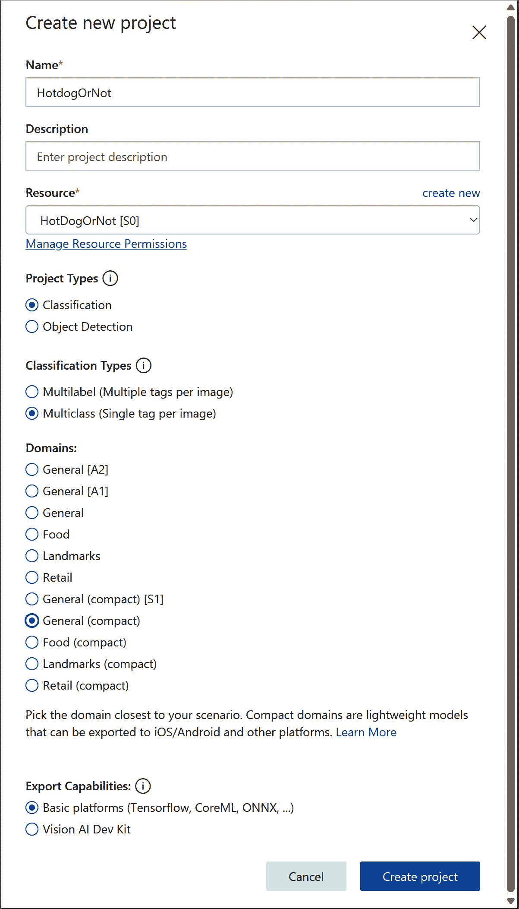

图 12.1 – 创建新的 AI 项目

创建项目后，我们可以开始上传图片并标记它们。

### 标记图片

获取图片最简单的方法是去谷歌搜索。我们将通过以下步骤添加热狗的照片：

1.  点击**添加图片**。

1.  选择应该上传的热狗照片。

1.  标记照片为`hotdog`，如下截图所示：

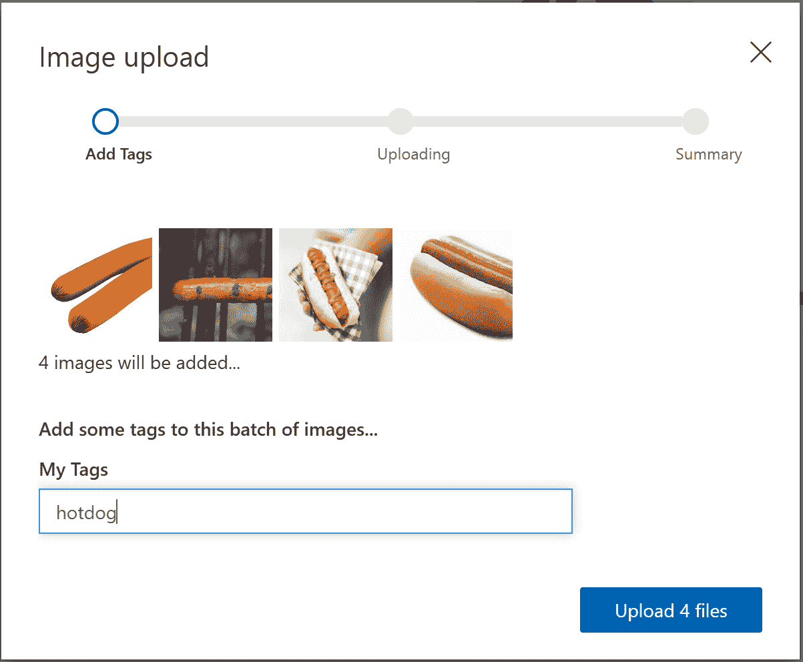

图 12.2 – 上传热狗的图片

上传所有热狗照片后，就是时候按照以下步骤上传非热狗的照片了。为了获得最佳结果，我们还应该包括看起来像热狗但实际上不是的照片：

1.  点击上传图片画廊上方的**添加图片**按钮。

1.  选择那些不是热狗的照片。

1.  用`Negative`标签标记照片。

    使用`Negative`标签标记不包含我们创建的其他标签的任何对象的图片。在这种情况下，我们上传的图片中没有任何热狗，如下截图所示：

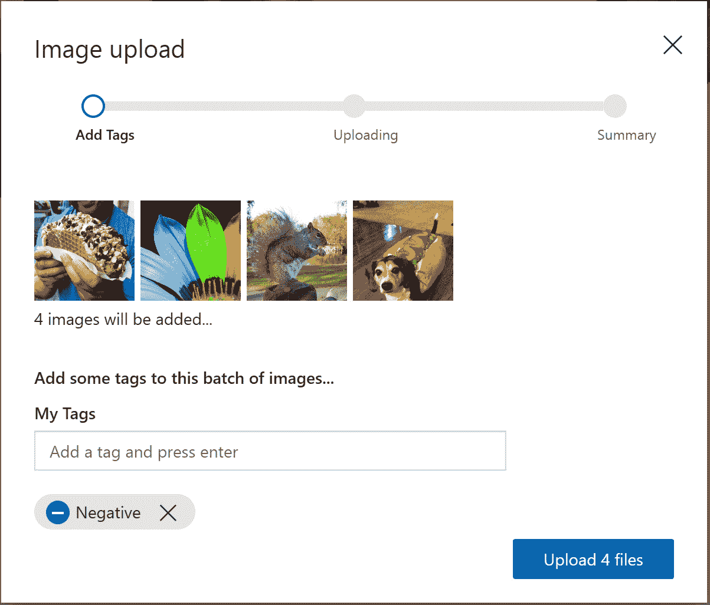

图 12.3 – 上传非热狗的图片

上传照片后，就是时候训练一个模型了。

### 训练模型

我们上传的并非所有照片都会用于训练；其中一些将用于验证，以给我们一个关于模型好坏的评分。如果我们分批上传照片并在每批之后训练模型，我们将能够看到我们的评分在提高。要训练一个模型，请点击页面顶部的绿色**训练**按钮，如下截图所示：

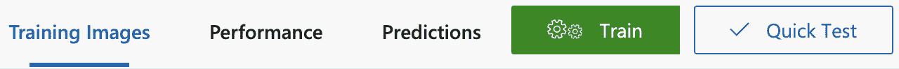

图 12.4 – 训练模型

下面的截图显示了训练迭代的结果，其中模型的精确度为**91.7%**：

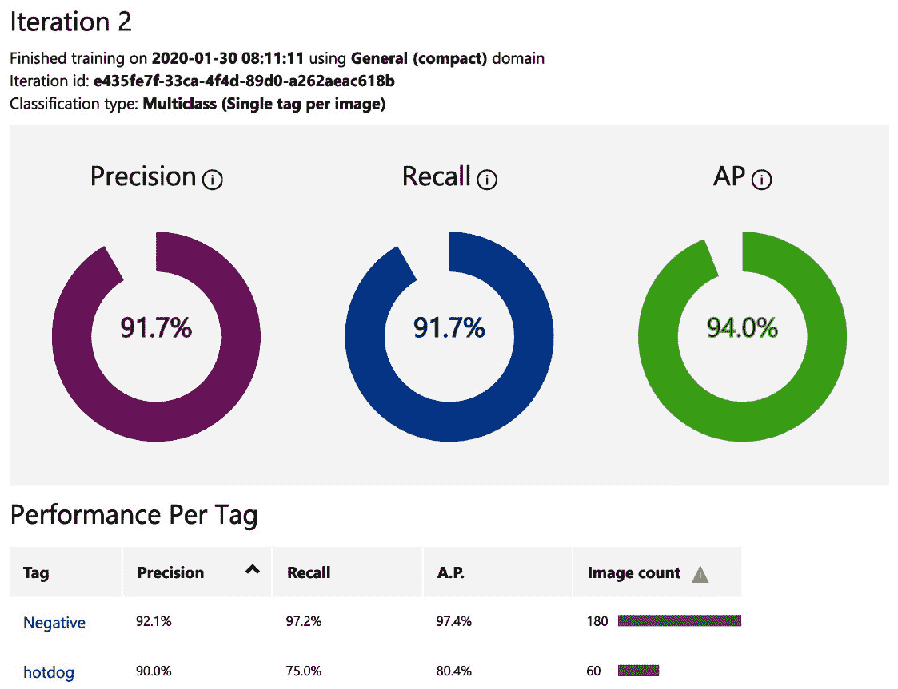

图 12.5 – 模型验证结果

训练好模型后，我们将导出它，以便在设备上使用。

### 导出模型

如果需要，我们可以使用 API，但为了快速分类并能够离线操作，我们将模型添加到应用包中。点击**导出**按钮，然后选择**ONNX**下载模型，如下截图所示：

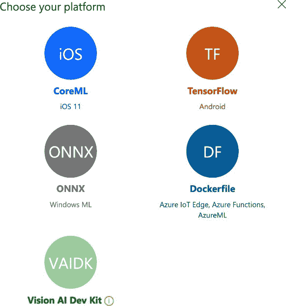

图 12.6 – 导出模型

下载了 ONNX 模型之后，就是时候构建应用了。

## 构建应用

我们的应用程序将使用训练好的模型来分类照片，根据它们是否是热狗的照片。我们将使用相同的 ONNX 模型在 .NET MAUI 应用程序的所有平台上。

### 创建新项目

让我们开始，如下所示。

第一步是创建一个新的 .NET MAUI 项目：

1.  打开 Visual Studio 2022，并选择 **创建新项目**：

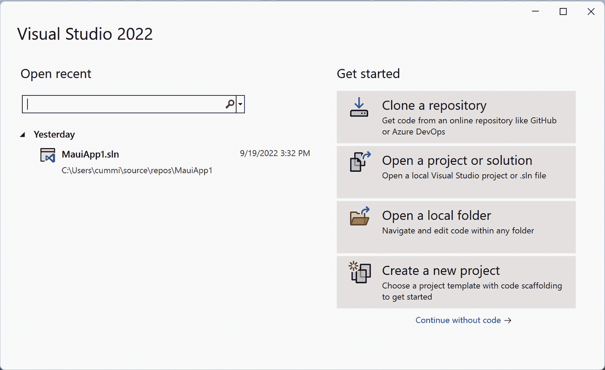

图 12.7 – Visual Studio 2022

这将打开 **创建新项目** 向导。

1.  在搜索框中输入 `maui`，并从列表中选择 **.NET MAUI 应用** 项：

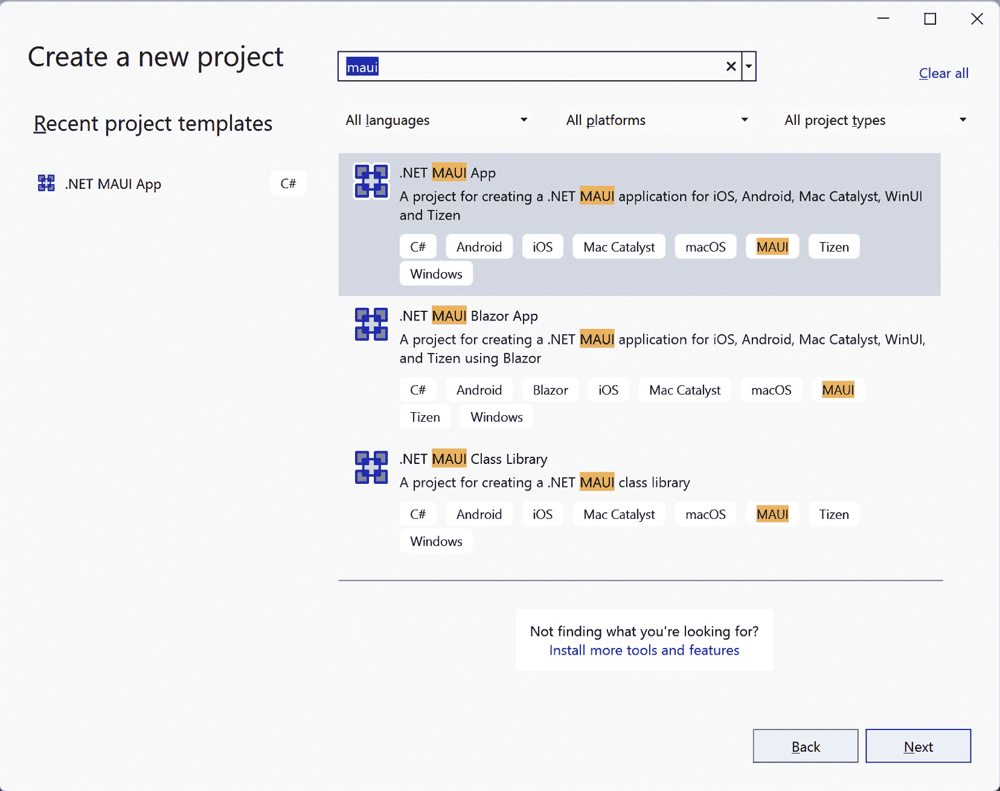

图 12.8 – 创建新项目

1.  点击 **下一步**。

1.  通过命名项目来完成向导的下一步。在这种情况下，我们将应用程序命名为 `HotdogOrNot`。通过点击 **下一步**，如图所示继续到下一个对话框：

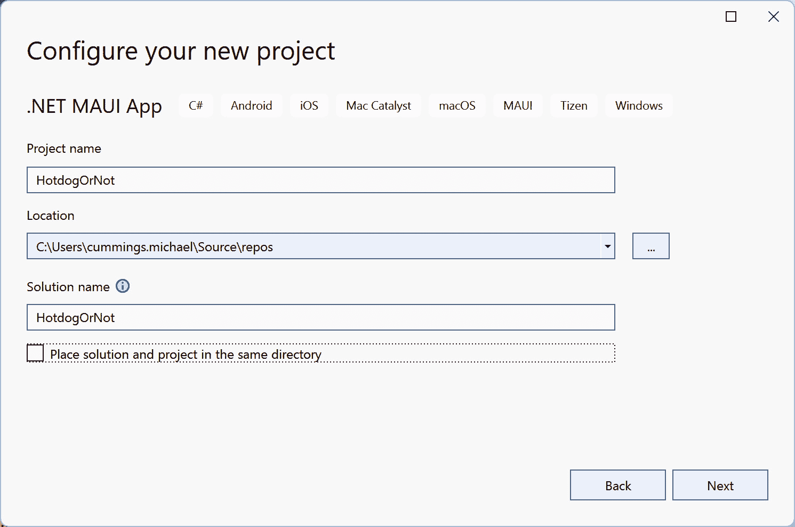

图 12.9 – 配置您的项目

1.  最后一步将提示您选择支持 .NET Core 的版本。在撰写本文时，.NET 6 可用作为 **长期支持**（**LTS**），而 .NET 7 可用作为 **标准期限支持**。在本书中，我们假设您正在使用 .NET 7。

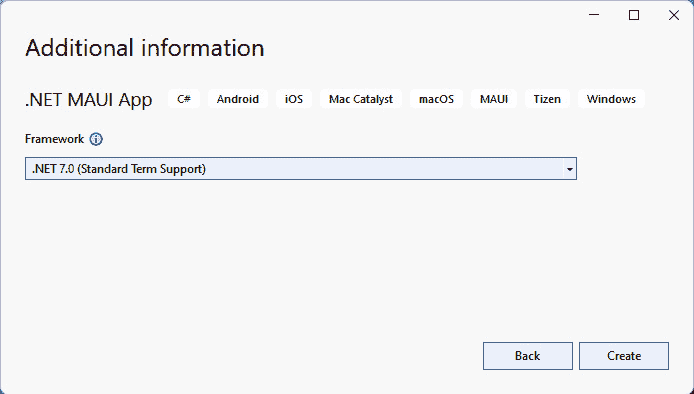

图 12.10 – 其他信息

1.  通过点击 **创建** 完成设置，并等待 Visual Studio 创建项目。

如果现在运行应用程序，您应该会看到以下类似的内容：

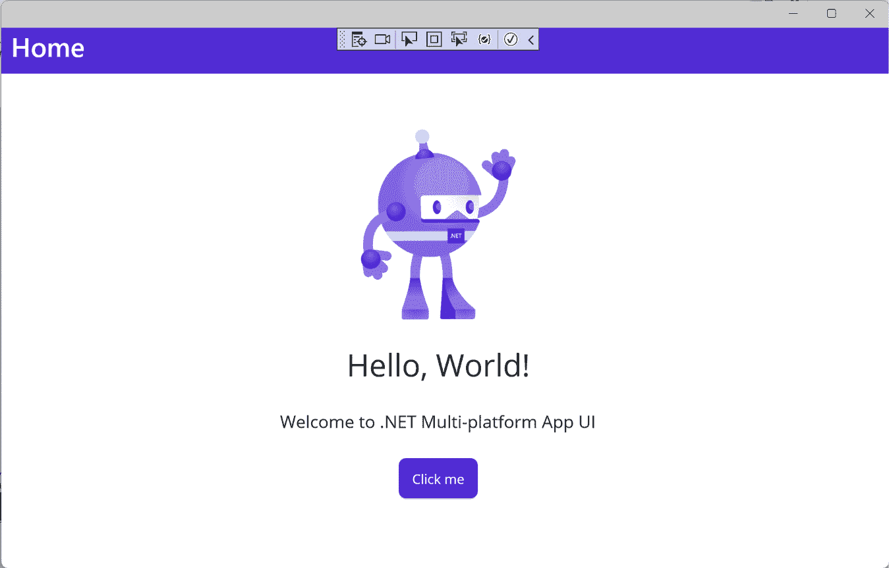

图 12.11 – HotdogOrNot 应用程序

就这样，应用程序就创建完成了。接下来，让我们开始创建图像分类器。

### 使用机器学习进行图像分类

我们将首先通过以下步骤将 ONNX ML 模型添加到项目中：

1.  从 Custom Vision 服务中获取的 `.zip` 文件进行解压。

1.  找到 `.onnx` 文件，并将其重命名为 `hotdog-or-not.onnx`。

1.  将其添加到项目中的 `Resources/Raw` 文件夹。

一旦我们将文件添加到项目中，我们就可以开始创建图像分类器的实现。我们将用于图像分类的代码将在 .NET MAUI 支持的平台上共享。我们可以通过以下步骤创建分类器的接口：

1.  创建一个名为 `ImageClassifier` 的新文件夹。

1.  在 `ImageClassifier` 文件夹中创建一个名为 `ClassifierOutput` 的新类。

1.  修改 `ClassifierOutput` 类，使其看起来如下：

    ```cs
    namespace HotdogOrNot.ImageClassifier;
    internal sealed class ClassifierOutput
    {
        ClassifierOutput() { }
    }
    ```

1.  在 `ImageClassifier` 文件夹中创建一个名为 `IClassifier` 的新接口。

1.  添加一个名为 `Classify` 的方法，该方法返回 `ClassifierOutput` 并接受 `byte[]` 作为参数。

1.  您的界面应该看起来像以下代码块：

    ```cs
    namespace HotdogOrNot.ImageClassifier;
    public interface IClassifier
    {
        ClassifierOutput Classify(byte[] bytes);
    }
    ```

现在我们有了分类器的接口，我们可以继续到实现部分。

#### 使用 ML.NET 进行图像分类

我们现在可以创建`IClassifier`接口的实现。在我们直接进入实现之前，让我们看看需要发生的高级步骤，以便我们更好地理解流程。

我们的训练模型`hotdog-or-not.onnx`具有特定的输入和输出参数，在将其提交给 ML.NET 框架之前，我们需要将我们想要分类的图像转换为输入格式。此外，我们还需要确保在提交之前图像的形状是正确的。图像的形状由大小、宽度、高度和颜色格式定义。如果图像与输入格式不匹配，那么在提交之前需要对其进行调整和转换，否则您将面临图像被错误分类的风险。对于由 Custom Vision 服务生成的图像分类模型，例如*hotdog-or-not*模型，其输入和输出如下所示：

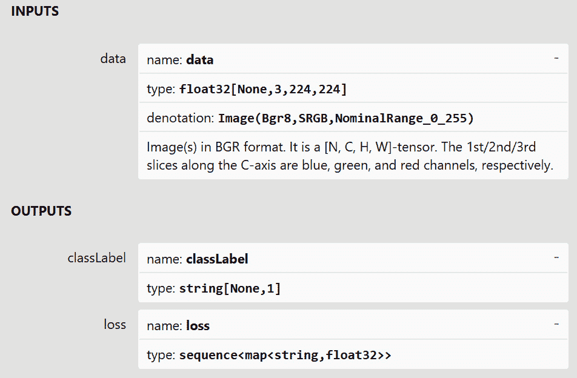

图 12.12 – Netron 中的模型输入和输出

模型的输入被格式化为一个名为`data`的多维数组。该数组由四个维度组成：

+   **图像**：该格式允许您一次性提交多个图像；然而，对于此应用程序，我们将一次只提交一个图像

+   `0`是蓝色，`1`是绿色，`2`是红色

+   **高度**：每个索引代表图像的*y*轴或垂直轴上的一个位置，范围在 0 到 223 之间

+   **宽度**：每个索引代表图像的*x*轴或水平轴上的一个位置，范围在 0 到 223 之间

该值是该特定图像、颜色以及*x*和*y*位置的颜色值。例如，`data[0,2,64,64]`将是第一张图像中从左侧 64 像素和从底部 64 像素位置上的绿色通道的值。

为了减少错误分类的数量，我们需要将所有提交的图像缩放到 224 x 224 像素，并正确排序颜色通道。

我们可以通过以下步骤来完成：

1.  在项目的`ImageClassifier`文件夹中创建一个名为`MLNetClassifier`的新类。

1.  添加`IClassifier`接口。

1.  实现接口中的`Classify`方法，如下面的代码块所示：

    ```cs
    namespace HotdogOrNot.ImageClassifier;
    internal class MLNetClassifier : Iclassifier
    {
        public MLNetClassifier(byte[] model)
        {
            // Initialize Model here
        }
        public ClassifierOutput Classify(byte[] imageBytes)
        {
            // Code will be added here
        }
    }
    ```

到目前为止，我们还没有从 ML.NET 引用任何类。要使用 ML.NET API，我们需要按照以下步骤添加对 NuGet 包的引用：

1.  在项目中安装`Microsoft.ML.OnnxRuntime` NuGet 包。

1.  接受任何许可对话框。

这将安装相关的 NuGet 包。

现在我们正在引用 ML.NET 包，我们可以按照以下步骤编译 ONNX ML 模型。

1.  在`MLNetClassifier`文件顶部添加`using Microsoft.ML.Onnx.Runtime;`声明。

1.  在`MLNetClassifier`类中添加以下字段：

    ```cs
        readonly InferenceSession session;
        readonly bool isBgr;
        readonly bool isRange255;
        readonly string inputName;
        readonly int inputSize;
    ```

1.  在 `MLNetClassifier` 构造函数中，添加以下代码行以初始化 `OnnxRuntime` 会话，替换 `// Initialize Model` `这里` 注释：

    ```cs
            Session = new InferenceSession(model);
            isBgr = session.ModelMetadata.CustomMetadataMap["Image.BitmapPixelFormat"] == "Bgr8";
            isRange255 = session.ModelMetadata.CustomMetadataMap["Image.NominalPixelRange"] == "NominalRange_0_255";
            inputName = session.InputMetadata.Keys.First();
            inputSize = session.InputMetadata[inputName].Dimensions[2];
    ```

    在继续之前，让我们讨论一下前面的代码。`MLNetClassifier` 类的构造函数接受 `byte[]` 作为参数。这代表 ML 模型文件。`byte[]` 然后被传递到一个新的 `InferenceSession` 实例中，这是 ML.NET API 的主要入口点。一旦模型被加载到会话中，我们就可以检查模型的一些属性，例如图像格式（`isBGR`）、颜色值范围（`isRange255`）、输入名称和输入大小。我们将这些值缓存在类字段中，以便在分类期间使用。现在，你的 `MLNetClassifier` 类应该看起来像以下这样：

    ```cs
    using Microsoft.ML.OnnxRuntime;
    namespace HotdogOrNot.ImageClassifier;
    internal class MLNetClassifier : Iclassifier
    {
        readonly InferenceSession session;
        readonly bool isBgr;
        readonly bool isRange255;
        readonly string inputName;
        readonly int inputSize;
        public MLNetClassifier(byte[] model)
        {
            session = new InferenceSession(model);
            isBgr = session.ModelMetadata.CustomMetadataMap["Image.BitmapPixelFormat"] == "Bgr8";
            isRange255 = session.ModelMetadata.CustomMetadataMap["Image.NominalPixelRange"] == "NominalRange_0_255";
            inputName = session.InputMetadata.Keys.First();
            inputSize = session.InputMetadata[inputName].Dimensions[2];
        }
        public ClassifierOutput Classify(byte[] imageBytes)
        {
            // Code will be added here
        }
    }
    ```

我们现在可以继续实现 `MLNetClassifier` 类的 `Classify` 方法。

运行分类的第一步是将输入转换为正确的格式。对于图像分类，这意味着将图像调整到正确的尺寸，并将颜色值组织成预期的格式。然后，图像数据被加载到 `Tensor` 中，这是我们向 ML.NET 模型传递数据的方式。以下步骤将创建一个名为 `LoadInputTensor` 的方法来完成这项工作：

1.  在 `MLNetClassifier` 类中的 `Classify` 方法之后添加一个名为 `LoadInputTensor` 的新方法。此方法将接受四个参数，`byte[]`、`int` 和两个布尔值，并返回一个 `Tensor<float>` 和 `byte[]` 的元组。你的方法应该看起来像以下这样：

    ```cs
    static (Tensor<float>, byte[] resizedImage) LoadInputTensor(byte[] imageBytes, int imageSize, bool isBgr, bool isRange255)
        {
        }
    ```

1.  在 `LoadInputTensor` 内部，我们将创建 `return` 对象并添加以下突出显示的代码行：

    ```cs
        {
            var input = new DenseTensor<float>(new[] { 1, 3, imageSize, imageSize });
            byte[] pixelBytes;
            // Add code here
            return (input, pixelBytes);
        }
    ```

    下一步是调整图像大小；我们将使用 **ImageSharp** NuGet 库使这一过程变得非常简单。

1.  将 ImageSharp NuGet 包添加到项目中。

1.  添加以下代码行以调整图像大小，替换 `\\ Add code` `这里` 注释：

    ```cs
    using (var image = Image.Load<Rgb24>(imageBytes))
        {
            image.Mutate(x => x.Resize(imageSize, imageSize));
            pixelBytes = new byte[image.Width * image.Height * Unsafe.SizeOf<Rgba32>()];
            image.ProcessPixelRows(source =>
            {
                // Add Code here
            });
        }
    ```

    此代码使用 ImageSharp 库从 `byte[]` 加载图像。然后，图像被调整到模型所需的大小。我们使用 `imageSize` 字段，其值从构造函数中捕获模型要求。最后，我们设置对 `ProcessPixelRows` 方法的调用，这将允许我们操作图像中的单个像素。

1.  由于 .NET MAUI 和 ImageSharp 之间的命名冲突，我们必须在文件顶部添加一个声明，告诉编译器我们真正想要使用哪个类：

    ```cs
    using Image = SixLabors.ImageSharp.Image;
    ```

1.  下一段代码也将需要以下突出显示的声明：

    ```cs
    using Microsoft.ML.OnnxRuntime;
    using SixLabors.ImageSharp.Formats.Png
    using Microsoft.ML.OnnxRuntime.Tensors;
    using Image = SixLabors.ImageSharp.Image;
    ```

1.  为了将输入图像转换为模型所需的正确颜色格式，我们使用 `ImageSharp` 库中的 `ProcessPixelRows` 方法。此方法为我们提供了一个可写缓冲区，我们可以对其进行操作。使用以下突出显示的代码，替换 `// Add Code here` 注释，来遍历调整大小的图像数据，将颜色值放入正确的顺序，并在需要时将值夹在 0 和 255 之间：

    ```cs
    image.ProcessPixelRows(source =>
    {
        for (int y = 0; y < image.Height; y++)
        {
            Span<Rgb24> pixelSpan = source.GetRowSpan(y);
            for (int x = 0; x < image.Width; x++)
            {
                if (isBgr)
                {
                    input[0, 0, y, x] = pixelSpan[x].B;
                    input[0, 1, y, x] = pixelSpan[x].G;
                    input[0, 2, y, x] = pixelSpan[x].R;
                }
                else
                {
                    input[0, 0, y, x] = pixelSpan[x].R;
                    input[0, 1, y, x] = pixelSpan[x].G;
                    input[0, 2, y, x] = pixelSpan[x].B;
                }
                if (!isRange255)
                {
                    input[0, 0, y, x] = input[0, 0, y, x] / 255;
                    input[0, 1, y, x] = input[0, 1, y, x] / 255;
                    input[0, 2, y, x] = input[0, 2, y, x] / 255;
                 }
             }
         }
    });
    ```

    这段代码所做的是简单的——使用提供的源变量，它遍历图像中的每一行，以及行中的每个像素。如果模型期望颜色以蓝色、绿色和红色的顺序出现，`isBGR`为`true`，那么提取的颜色值将按照该顺序放置在输入张量中；否则，它们将以红色、绿色和蓝色的顺序添加到输入张量中。这里棘手的部分是访问每个像素的正确元素。张量组织成四个维度，如前所述。对于这个模型，第一个元素始终为零，因为我们一次只处理一张图像。第二个维度是颜色通道，所以你会看到红色、绿色和蓝色颜色值的变化。

    最后，如果模型期望颜色值在 0 到 255 的范围内，`isRange255`，则每个颜色通道都会被限制在该范围内。

1.  我们将要做的最后一件事是将调整大小后的图像内容复制到`pixelBytes`数组中，这样我们就可以向用户显示图像。添加以下高亮代码来完成此操作；注意，为了简洁，之前的代码已被省略：

    ```cs
                });
                var outStream = new MemoryStream();
                image.Save(outStream, new PngEncoder());
                pixelBytes = outStream.ToArray();
            }
            return (input, pixelBytes);
    ```

现在我们已经编写了处理图像并填充输入张量的代码，我们可以通过以下步骤完成`Classify`方法：

1.  将`// Code will be added here`注释替换为对`LoadInputTensor`方法的调用：

    ```cs
        public ClassifierOutput Classify(byte[] imageBytes)
        {
            (Tensor<float> tensor, byte[] resizedImage) = LoadInputTensor(imageBytes, inputSize, isBgr, isRange255);
        }
    ```

1.  接下来，我们可以运行会话，传入新创建的输入张量并捕获结果：

    ```cs
        public ClassifierOutput Classify(byte[] imageBytes)
        {
            (Tensor<float> tensor, byte[] resizedImage) = LoadInputTensor(imageBytes, inputSize, isBgr, isRange255);
            var resultsCollection = session.Run(new List<NamedOnnxValue>
            {
                        NamedOnnxValue.CreateFromTensor<float>(inputName, tensor)
             });
        }
    ```

1.  我们从输出结果中获取标签，这将用来确定这张图像是否包含热狗：

    ```cs
        public ClassifierOutput Classify(byte[] imageBytes)
        {
            (Tensor<float> tensor, byte[] resizedImage) = LoadInputTensor(imageBytes, inputSize, isBgr, isRange255);
            var resultsCollection = session.Run(new List<NamedOnnxValue>
                    {
                        NamedOnnxValue.CreateFromTensor<float>(inputName, tensor)
                    });
            var topLabel = resultsCollection
                ?.FirstOrDefault(i => i.Name == "classLabel")
                ?.AsTensor<string>()
                ?.First();
        }
    ```

1.  然后，我们可以获取结果的置信度水平，这告诉我们模型对分类有多确定。这将在我们显示结果时使用：

    ```cs
        public ClassifierOutput Classify(byte[] imageBytes)
        {
            (Tensor<float> tensor, byte[] resizedImage) = LoadInputTensor(imageBytes, inputSize, isBgr, isRange255);
            var resultsCollection = session.Run(new List<NamedOnnxValue>
                    {
                        NamedOnnxValue.CreateFromTensor<float>(inputName, tensor)
                    });
            var topLabel = resultsCollection
                ?.FirstOrDefault(i => i.Name == "classLabel")
                ?.AsTensor<string>()
                ?.First();
            var labelScores = resultsCollection
                ?.FirstOrDefault(i => i.Name == "loss")
                ?.AsEnumerable<NamedOnnxValue>()
                ?.First()
                ?.AsDictionary<string, float>();
        }
    ```

1.  最后，我们可以使用`ClassifierOutput`类返回分类的结果：

    ```cs
        public ClassifierOutput Classify(byte[] imageBytes)
        {
            (Tensor<float> tensor, byte[] resizedImage) = LoadInputTensor(imageBytes, inputSize, isBgr, isRange255);
            var resultsCollection = session.Run(new List<NamedOnnxValue>
                    {
                        NamedOnnxValue.CreateFromTensor<float>(inputName, tensor)
                    });
            var topLabel = resultsCollection
                ?.FirstOrDefault(i => i.Name == "classLabel")
                ?.AsTensor<string>()
                ?.First();
            var labelScores = resultsCollection
                ?.FirstOrDefault(i => i.Name == "loss")
                ?.AsEnumerable<NamedOnnxValue>()
                ?.First()
                ?.AsDictionary<string, float>();
            return ClassifierOutput.Create(topLabel, labelScores, resizedImage);
        }
    ```

1.  最后一步是完成`MLNetClassifier`的实现，通过实现`ClassifierOutput`类。通过添加以下高亮代码来更新你的`ClassifierOutput`类：

    ```cs
    internal sealed class ClassifierOutput
    {
        public string TopResultLabel { get; private set; }
        public float TopResultScore { get; private set; }
        public IDictionary<string, float> LabelScores { get; private set; }
        public byte[] Image { get; private set; }
        ClassifierOutput() { }
        public static ClassifierOutput Create(string topLabel, IDictionary<string, float> labelScores, byte[] image)
        {
            var topLabelValue = topLabel ?? throw new ArgumentException(nameof(topLabel));
            var labelScoresValue = labelScores ?? throw new ArgumentException(nameof(labelScores));
            return new ClassifierOutput
            {
                TopResultLabel = topLabelValue,
                TopResultScore = labelScoresValue.First(i => i.Key == topLabelValue).Value,
                LabelScores = labelScoresValue,
                Image = image,
            };
        }
    }
    ```

`ClassifierOutput`类用于封装将在 UI 中使用的四个值，并将它们作为公共属性公开。`Create`静态方法用于创建类的实例。`Create`方法验证提供的参数，并适当地设置公共属性以供 UI 使用。

我们现在已经编写了识别图像中热狗的代码。

现在，我们可以构建应用程序的用户界面并调用`MLNetClasssifier`来对图像进行分类。

### 请求应用权限

在我们深入构建应用的其他功能之前，我们需要处理权限问题。这个应用将有两个按钮供用户使用，一个用于拍照，另一个用于从设备中选择照片。这与我们在 *第六章* 中看到的 *使用 CollectionView 和 CarouselView 构建照片库应用* 的功能类似，在那里我们需要在访问相机或设备存储之前请求用户的权限。然而，我们将以与该章节不同的方式实现权限。由于访问相机和访问用户设备上的照片需要不同的权限，我们将从每个按钮处理程序中请求它们。

按照以下步骤添加一个类来帮助我们进行权限检查：

1.  在项目中创建一个名为 `AppPermissions` 的新类。

1.  修改类定义以添加 `partial` 修饰符，并移除默认构造函数：

    ```cs
    namespace HotdogOrNot;
    internal partial class AppPermissions
    {
    }
    ```

1.  向 `AppPermissions` 类添加以下方法：

    ```cs
        public static async Task<PermissionStatus> CheckRequiredPermission<TPermission>() where TPermission : Permissions.BasePermission, new() => await Permissions.CheckStatusAsync<TPermission>();
    ```

    `CheckRequiredPermission` 方法用于确保在我们尝试任何可能会因为权限不足而失败的操作之前，我们的应用已经拥有了正确的权限。它的实现是通过调用 .NET MAUI 的 `CheckSyncStatus` 方法，并使用在 `TPermission` 中提供的权限类型。它返回 `PermissionStatus`，这是一个枚举类型。我们主要关注的是 `Denied` 和 `Granted` 这两个值。

1.  向 `AppPermissions` 类添加 `CheckAndRequestRequiredPermission` 方法：

    ```cs
        public static async Task<PermissionStatus> CheckAndRequestRequiredPermission() <TPermission>() where TPermission : Permissions.BasePermission, new()
        {
            PermissionStatus status = await Permissions.CheckStatusAsync< TPermission >();
            if (status == PermissionStatus.Granted)
                return status;
            if (status == PermissionStatus.Denied && DeviceInfo.Platform == DevicePlatform.iOS)
            {
                // Prompt the user to turn on in settings
                // On iOS once a permission has been denied it may not be requested again from the application
                await App.Current.MainPage.DisplayAlert("Required App Permissions", "Please enable all permissions in Settings for this App, it is useless without them.", "Ok");
            }
            if (Permissions.ShouldShowRationale< TPermission >())
            {
                // Prompt the user with additional information as to why the permission is needed
                await App.Current.MainPage.DisplayAlert("Required App Permissions", "This app uses photos, without these permissions it is useless.", "Ok");
            }
            status = await MainThread.InvokeOnMainThreadAsync(Permissions.RequestAsync<TPermission>);
            return status;
        }
    }
    ```

    `CheckAndRequestRequiredPermission` 方法处理请求用户访问的复杂性。第一步是简单地检查权限是否已经被授予，如果是，则返回状态。接下来，如果我们是在 iOS 上，并且权限已经被拒绝，那么它不能再次请求，因此你必须指导用户如何通过设置面板授予应用权限。Android 在请求行为中包括了一个如果用户拒绝了访问，可以不断提醒用户的功能。这个行为通过 .NET MAUI 的 `ShouldShowRationale` 方法暴露出来。对于不支持此行为的任何平台，它将返回 `false`，在 Android 上，如果用户第一次拒绝访问，它将返回 `true`，如果用户第二次拒绝，它将返回 `false`。最后，我们请求用户访问权限。同样，.NET MAUI 隐藏了所有平台实现细节，使得检查和请求访问某些资源变得非常直接。

看起来熟悉吗？

如果前面的代码看起来熟悉，那么你是对的。它是基于在 .NET MAUI 文档中描述的实现。你可以在 [`learn.microsoft.com/en-us/dotnet/maui/platform-integration/appmodel/permissions`](https://learn.microsoft.com/en-us/dotnet/maui/platform-integration/appmodel/permissions) 找到它。

现在，我们已经设置了共享的 `AppPermissions`，我们可以开始进行平台配置。然而，在我们可以使用媒体选择器之前，我们需要为每个平台进行一些配置。我们将从 Android 开始。

在 Android API 版本 33 中，增加了三个新权限以启用对媒体文件的读取访问 – `ReadMediaImages`、`ReadMediaVideos` 和 `ReadMediaAudio`。在 API 版本 33 之前，只需要 `ReadExternalStorage` 权限。要访问相机，我们需要 `Camera` 和 `WriteExternalStorage` 权限。为了正确请求设备的 API 版本的正确权限，请打开 `Platform/Android` 文件夹中的 `MauiApplication.cs` 并将其修改如下：

```cs
using Android.App;
using Android.Runtime;
// Needed for Picking photo/video
[assembly: UsesPermission(Android.Manifest.Permission.ReadExternalStorage, MaxSdkVersion = 32)]
[assembly: UsesPermission(Android.Manifest.Permission.ReadMediaImages)]
// Needed for Taking photo/video
[assembly: UsesPermission(Android.Manifest.Permission.Camera)]
IMAGE_CAPTURE intent as follows in the AndroidManifest.xml file:

```

<queries>

<intent>

<action android:name="android.media.action.IMAGE_CAPTURE" />

</intent>

</queries>

```cs

 For iOS and Mac Catalyst, the only thing we need to do is add the following four usage descriptions to the `info.plist` file in the `platform/ios` and `platform/maccatalyst` folders:

```

<key>NSCameraUsageDescription</key>

<string>此应用需要访问相机以拍照。</string>

<key>NSPhotoLibraryUsageDescription</key>

<string>此应用需要访问照片。</string>

<key>NSMicrophoneUsageDescription</key>

<string>此应用需要访问麦克风。</string>

<key>NSPhotoLibraryAddUsageDescription</key>

<string>此应用需要访问照片库。</string>

```cs

 For Windows, we need to add the following highlighted code to the `Capabilities` section of the `package.appxmanifest` file in the `platforms/windows` folder:

```

<Capabilities>

<rescap:Capability Name="runFullTrust" />

<DeviceCapability Name="webcam"/>

</Capabilities>

```cs

 Now that we have declared the permissions we need for each platform, we can implement the remaining functionality to take a photo or pick an existing image.
Building the first view
The first view in this app will be a simple view with two buttons. One button will be to start the camera so that users can take a photo of something to determine whether it is a hot dog. The other button will be to pick a photo from the photo library of the device. We will continue to use the MVVM pattern in this chapter, so we will split the view into two classes, `MainView` for the UI visible to the user and `MainViewModel` for the actual implementation.
Building the ViewModel class
We will start by creating the `MainViewModel` class, which will handle what will happen when a user taps one of the buttons. Let’s set this up by going through the following steps:

1.  Create a new folder called `ViewModels`.
2.  Add a NuGet reference to `CommunityToolkit.Mvvm`; we use `CommunityToolkit.Mvvm` to implement the `INotifyPropertyChanged` interface and commands, as we did in other chapters.
3.  Create a new partial class called `MainViewModel` in the `ViewModels` folder, using `ObservableObject` from the `CommunityToolkit.Mvvm.ComponentModel` namespace as a base class.
4.  Create a private field of the `IClassifier` type and call it `classifier`, as shown in the following code block:

    ```

    using CommunityToolkit.Mvvm.ComponentModel;

    using HotdogOrNot.ImageClassifier;

    命名空间 HotdogOrNot.ViewModels;

    public partial class MainViewModel : ObservableObject

    {

    private IClassifier classifier;

    public MainViewModel()

    {

    }

    }

    ```cs

Initializing the ONNX model requires the use of asynchronous methods, so we need to handle them carefully, since we will be calling them from the constructor and the button handlers. The following steps will create the model initializer:

1.  Create an `InitTask` property that is of the `Task` type.
2.  Use a property initializer to set it to a new `Task`, using `Task.Run`.
3.  Initialize the model from the raw resources of the .NET MAUI app. The method should look like the following code:

    ```

    Task InitTask() => Task.Run(async () =>

    {

    using var modelStream = await FileSystem.OpenAppPackageFileAsync("hotdog-or-not.onnx");

    using var modelMemoryStream = new MemoryStream();

    modelStream.CopyTo(modelMemoryStream);

    var model = modelMemoryStream.ToArray();

    _classifier = new MLNetClassifier(model);

    });

    ```cs

    The `InitTask` property holds a reference to `Task` that does the following:

    *   Loads the `hotdog-or-not.onnx` file into `Stream`
    *   Copies the bytes from the original stream to an array of bytes so that the original stream can be closed and any native resources, such as file handles, can be released.
    *   Creates and returns a new instance of the `MLNetClassifier` class using the loaded model. 4.  To ensure that `InitTask` will only run successfully once, add the following highlighted code:

    ```

    public partial class MainViewModel : ObservableObject

    {

    IClassifier _classifier;

    Task initTask;

    public MainViewModel()

    {

    _ = InitAsync();

    }

    public Task InitAsync()

    {

    if (initTask == null || initTask.IsFaulted)

    initTask = InitTask();

    return initTask;

    }

    // 省略代码以节省篇幅

    }

    ```cs

    In `InitAsync`, the initialization task is captured by a field only if the field is `null` or its value has faulted. This ensures that we only run the initialization successfully once. The value of the field is then returned to the caller, which, in this case, is the constructor. Unwinding this, the constructor calls `InitAsync` and throws away the return value. `InitAsync`, meanwhile, captures the value returned by the `InitTask` property, which is `Task` that has already been queued for execution. Since `InitAsync` and `InitTask` and their closure are all asynchronous, they complete sometime after the constructor completes.

Now that we have initialized the `hotdog-or-not` ONNX model, we can now implement the two buttons, one that takes a photo and another that allows the user to pick a photo from their device storage. Let’s start by implementing a couple of helper methods to use in both use cases.
The first helper method is used to convert `FileResult` to `byte[]`. To implement `ConvertPhotoToBytes`, follow these steps:

1.  Open the `MainViewModel.cs` file.
2.  Add a new method named `ConvertPhotoToBytes`, which takes `FileResult` as a parameter and returns `byte []`. Since the method is `async`, you’ll need to return `Task` and use the `async` modifier.
3.  In the method, check whether `FileResult` is `null` and that it returns an empty array.
4.  Next, open a stream from `FileResult` using the `OpenStreamAsync` method.
5.  Create a new variable of the `MemoryStream` type and initialize it using the default constructor.
6.  Use the `Copy` method to copy `stream` to `MemoryStream`.
7.  Finally, return `MemoryStream` as `byte[]`; your method should look like the following:

    ```

    私有异步任务 ConvertPhotoToBytes(FileResult photo)

    {

    if (photo == null) return Array.Empty<byte>();

    using var stream = await photo.OpenReadAsync();

    using MemoryStream memoryStream = new();

    stream.CopyTo(memoryStream);

    return memoryStream.ToArray();

    }

    ```cs

The other helper method we will need is to use our classification model to get the results of a photo and return the results. We will need a new type to return the results. Follow these steps to implement the new class:

1.  Create a new folder named `Models` in the project.
2.  In the `Models` folder, create a new class, `Result`, in a file named `Result.cs`.
3.  Add a public property, `IsHotdog`, as `bool`.
4.  Add a public property, `Confidence`, as `float`.
5.  Add a public property, `PhotoBytes`, as `byte[]`; the class should now look like the following:

    ```

    命名空间 HotdogOrNot.Models;

    public class Result

    {

    public bool IsHotdog { get; set; }

    public float Confidence { get; set; }

    public byte[] PhotoBytes { get; set; }

    }

    ```cs

    The `IsHotdog` property is used to capture whether the label returned from the model is “hotdog.” `Confidence` is a score of how sure the model is that this is a hotdog or not. Finally, since we transform the image prior to processing, we store the transformed image in the `PhotoBytes` property.

Now, we can implement the method that will run and process the classification result, by following these steps:

1.  Open the `MainViewModel.cs` file.
2.  In the `MainViewModel` class, add a new field, `isClassifying`, with a `bool` type.
3.  Add the `ObservableAttribute` attribute to the field; it should look like the following:

    ```

    [ObservableProperty]

    private bool isClassifying;

    ```cs

     4.  Add a new method to the `MainViewModel` class, named `RunClassificationAsync`. The method will accept a `byte[]` parameter and return `Result`, wrapped in `Task`, since it is `async`:

    ```

    async Task<Result> RunClassificationAsync(byte[] imageToClassify)

    {

    }

    ```cs

     5.  In the method, the first thing we do is set the `IsClassifying` property to `true`; this will be used to disable the buttons later in the chapter.
6.  Add a `try..catch..finally` statement.
7.  Inside the `try` statement, ensure the model is initialized by calling `InitAsync`.
8.  Then, call `Classify` on the `classifier` field passing `byte[]`, representing the image as a parameter and storing the result.
9.  The last statement in the `try` statement block is to return a new `Result`, setting `IsHotdog` to `true` only if the classification result’s `TopResultLabel` property is “hotdog,” `Confidence` is set to the classification result’s `TopResultScore` property, and `PhotoBytes` is set to the classification result’s `Image` property. The `try` portion should look like the following:

    ```

    try

    {

    await InitAsync().ConfigureAwait(false);

    var result = _classifier.Classify(imageToClassify);

    return new Result()

    {

    IsHotdog = result.TopResultLabel == "hotdog",

    Confidence = result.TopResultScore,

    PhotoBytes = result.Image

    };

    }

    catch

    ```cs

     10.  Now, in the `catch` statement block, return a new `Result`, setting the `IsHotdog` property to `false`, `Confidence` to `0.0f`, and the `PhotoBytes` property to the bytes passed into the method. The `catch` block should look like the following:

    ```

    catch

    {

    return new Result

    {

    IsHotdog = false,

    Confidence = 0.0f,

    PhotoBytes = imageToClassify

    };

    }

    finally

    ```cs

     11.  Lastly, for the `finally` block, we want to set the `IsClassiying` property back to `false`; however, we will need to do this on the main UI thread using the `MainThread.BeginInvokeOnMainThread` method from .NET MAUI, as shown in the following code:

    ```

    finally

    {

    MainThread.BeginInvokeOnMainThread(() => IsClassifying = false);

    }

    ```cs

Now that we have written the helper methods, we can create two methods, one to handle capturing an image from the camera and another to pick a photo from user storage. We will start with the camera capture method.
Let’s set this up by following these steps:

1.  Open the `MainViewModel.cs` file.
2.  Create a public async void method called `TakePhoto`.
3.  Add the `RelayCommand` attribute to make the method bindable.
4.  Add an `if` statement to check whether the `MediaPicker.Default.IsCaptureSupported` parameter is `true`.
5.  In the `true` statement block of `if`, get the status of the `Camera` permission using the `CheckAndRequestPermission` method.
6.  If the status is `Granted`, then use `CheckAndRequestMethod` again to check the `WriteExternalStorage` permission.
7.  If the status is `Granted`, use `MediaPicker` to capture a photo using the `Capture``PhotoAsync` method.
8.  Call a method named `ConvertPhotoToBytes`, passing in the file returned from `MediaPicker`.
9.  Pass the photo bytes to the `RunClassificationAsync` method.
10.  Finally, we will dynamically navigate to the `Result` view, which we will create in the next section, passing the result from `RunClassificationAsync` as a parameter. We do this by using `Shell.Current.GotoAsync` and ensuring that the app uses the main thread to do so, as shown in the following code block:

    ```

    [RelayCommand()]

    public async void TakePhoto()

    {

    if (MediaPicker.Default.IsCaptureSupported)

    {

    var status = await AppPermissions.CheckAndRequestRequiredPermissionAsync<Permissions.Camera>();

    if (状态 == PermissionStatus.Granted) {

    状态 = await AppPermissions.CheckAndRequestRequiredPermissionAsync<Permissions.StorageWrite>();

    }

    if (状态 == PermissionStatus.Granted)

    {

    FileResult photo = await MediaPicker.Default.CapturePhotoAsync(new MediaPickerOptions() { Title = "热狗或不是热狗?" });

    var imageToClassify = await ConvertPhotoToBytes(photo);

    var result = await RunClassificationAsync(imageToClassify);

    await MainThread.InvokeOnMainThreadAsync(async () => await

    Shell.Current.GoToAsync("Result", new Dictionary<string, object>() { { "result", result } })

    );

    }

    }

    }

    ```cs

`Shell.Current.GotoAsync` takes two parameters – the first is the route that `Shell` is to navigate to, and the second is a dictionary of key-value pairs to send to the destination view. Later in this chapter, we will see how to configure a route to a view without using XAML and, when we create the `Result` view, how to access the parameters passed to it.
We will now create the `PickPhoto` method to allow a user to use an image from their device. Use the following steps to create the method:

1.  Create a public async void method called `PickPhoto`.
2.  Add the `RelayCommand` attribute to make the method bindable.
3.  Grant the status of the `Photos` permission using the `CheckAndRequestPermission` method.
4.  If the status is `Granted`, use `MediaPicker` to capture a photo using the `Pick``PhotoAsync` method.
5.  Call a method named `ConvertPhotoToBytes`, passing in the file returned from `MediaPicker`.
6.  Pass the photo bytes to the `RunClassificationAsync` method.
7.  Finally, we will dynamically navigate to the `Result` view, which we will create in the next section, passing the result from `RunClassificationAsync` as a parameter. We will do this by using `Shell.Current.GotoAsync` and ensuring that the app uses the main thread to do so, as shown in the following code block:

    ```

    [RelayCommand()]

    public async void PickPhoto()

    {

    var status = await AppPermissions.CheckAndRequestRequiredPermissionAsync<Permissions.Photos>();

    if (状态 == PermissionStatus.Granted)

    {

    FileResult photo = await MediaPicker.Default.PickPhotoAsync();

    var imageToClassify = await ConvertPhotoToBytes(photo);

    var result = await RunClassificationAsync(imageToClassify);

    await MainThread.InvokeOnMainThreadAsync(async () => await

    Shell.Current.GoToAsync("Result", new Dictionary<string, object>() { { "result", result } })

    );

    }

    }

    ```cs

When a user clicks on a button, the classification could take a noticeable amount of time. To prevent the user from clicking the button again because they think it’s not working, we will disable the buttons until the operation completes. The `IsClassifying` property is already set; we just need to use that value to restrict `RelayCommands`, by following these steps:

1.  Add a new method that returns a Boolean named `CanExecuteClassification`, and return the inverse of the `IsClassifying` property, as shown in the following code:

    ```

    private bool CanExecuteClassification() => !IsClassifying;

    ```cs

     2.  Update the `RelayCommand` attribute for the `TakePhoto` method, as highlighted here:

    ```

    [RelayCommand(CanExecute = nameof(CanExecuteClassification))]

    public async void TakePhoto()

    ```cs

     3.  Update the `RelayCommand` attribute for the `PickPhoto` method, as highlighted here:

    ```

    [RelayCommand(CanExecute = nameof(CanExecuteClassification))]

    public async void PickPhoto()

    ```cs

Now that ViewModel for the main page is complete, we can build View for the main page.
Building the view
Now, once we have created the `MainViewModel` class, it is time to create the code for the `MainView` view:

1.  Create a new folder called `Views`.
2.  Add a new `MainView`.
3.  Set the `Title` property of `ContentPage` as `Hotdog or` `Not hotdog`.
4.  Add `HorizontalStackLayout` to the page, and set its `VerticalOptions` property to `Center` and its `HorizontalOptions` property to `CenterAndExpand`.
5.  Add `Button` to the `HorizontalStackLayout`, with the text `Take Photo`. For the `Command` property, add a binding to the `TakePhoto` property in the `MainViewModel` class.
6.  Add `Button` to `HorizontalStackLayout`, with the text `Pick Photo`. For the `Command` property, add a binding to the `PickPhoto` property in the `MainViewModel` class, as shown in the following code block:

    ```

    <ContentPage

    x:Class="HotdogOrNot.Views.MainView"

    x:DataType="viewModels:MainViewModel"

    Title="热狗或不是热狗">

    <HorizontalStackLayout VerticalOptions="Center" HorizontalOptions="CenterAndExpand">

    <Button Text="拍摄照片" Command="{Binding TakePhotoCommand}" WidthRequest="150" HeightRequest="150" Margin="20" FontSize="Large"/>

    <Button Text="选择照片" Command="{Binding PickPhotoCommand}" WidthRequest="150" HeightRequest="150" Margin="20" FontSize="Large"/>

    </HorizontalStackLayout>

    </ContentPage>

    ```cs

In the code-behind `MainView.xaml.cs` file, we will set the binding context of the view by following these steps:

1.  Add `MainViewModel` as a parameter of the constructor.
2.  After the `InitialComponent` method call, set the `BindingContext` property of the view to the `MainViewModel` parameter.
3.  Use the `SetBackButtonTitle` static method on the `NavigationPage` class so that an arrow to navigate back to this view will be shown in the navigation bar on the result view, as shown in the following code block:

    ```

    public MainView(MainViewModel viewModel)

    {

    InitializeComponent();

    BindingContext = viewModel; NavigationPage.SetBackButtonTitle(this, string.Empty);

    }

    ```cs

Building the result view
The last thing we need to do in this project is to create the result view. This view will show the input photo and the classification of a hot dog or not.
Building the ResultViewModel class
Before we create the view, we will create a `ResultViewModel` class that will handle all the logic for the view, by following these steps:

1.  Create a `partial` class called `ResultViewModel` in `ViewModels`.
2.  Add `ObservableObject` as a base class to the `ResultViewModel` class.
3.  Create a `private` field of the `string` type, called `title`. Add the `ObservableProperty` attribute to the field to make it a bindable property.
4.  Create a `private` field of the `string` type, called `description`. Add the `ObservableProperty` attribute to the field to make it a bindable property.
5.  Create a `private` field of the `string` type, called `Title`. Add the `ObservableProperty` attribute to the field to make it a bindable property, as shown in the following code block:

    ```

    使用 CommunityToolkit.Mvvm.ComponentModel;

    using HotdogOrNot.Models;

    namespace HotdogOrNot.ViewModels;

    public partial class ResultViewModel : ObservableObject

    {

    [ObservableProperty]

    private string title;

    [ObservableProperty]

    private string description;

    [ObservableProperty]

    byte[] photoBytes;

    public ResultViewModel()

    {

    }

    }

    ```cs

The next thing we will do in `ResultViewModel` is to create an `Initialize` method that will have the result as a parameter. Let’s set this up by following these steps:

1.  Add a `private` method named `Initialize` to the `ResultViewModel` class that accepts a parameter of the `Result` type, named `result`, and returns `void`.
2.  In the `Initialize` method, set the `PhotoBytes` property to the value of the `PhotoBytes` property of the `result` parameter.
3.  Add an `if` statement that checks whether the `IsHotDog` property of the `result` parameter is `true` and whether `Confidence` is higher than `90%`. If this is the case, set `Title` to `"Hot dog"` and `Description` to `"This is for sure` `a hotdog"`.
4.  Add an `else if` statement to check whether the `IsHotdog` property of the `result` parameter is `true`. If this is the case, set `Title` to `"Maybe"` and `Description` to `"This is maybe` `a hotdog"`.
5.  Add an `else` statement that sets `Title` to `"Not a hot dog"` and `Description` to `"This is not a hot dog"`, as shown in the following code block:

    ```

    public void Initialize(Result result)

    {

    PhotoBytes = result.PhotoBytes;

    if (result.IsHotdog && result.Confidence > 0.9)

    {

    Title = "热狗";

    Description = "这肯定是一条热狗";

    }

    else if (result.IsHotdog)

    {

    Title = "可能";

    Description = "这可能是一条热狗";

    }

    else

    {

    Title = "不是热狗";

    Description = "This is not a hot dog";

    }

    }

    ```cs

The final thing we need to do is call the `Initialize` method with the result. If you recall from the previous section on building the main view, we navigated to the `Result` view and passed the `Result` object as a parameter. To access the parameter and call the `Initialize` method properly, follow these steps:

1.  Add the `IQueryAttributable` interface to the list of inherited interfaces:

    ```

    public partial class ResultViewModel : ObservableObjectvoid method, ApplyQueryAttributes, that accepts a parameter named query of the IDictionary<string, object> type:

    ```cs
    public void ApplyQueryAttributes(IDictionary<string, object> query)
    {
    }
    ```

    ```cs

     2.  Now, in the method, call the `Initialize` method, passing the `“result”` object from the query dictionary and casting it to a `Result` type, as shown in the following code:

    ```

    public void ApplyQueryAttributes(IDictionary<string, object> query)

    {

    Initialize(query["result"] as Result);

    }/

    ```cs

`ViewModel` is now complete, and we are ready to create `View`.
Building the view
Because we want to show the input photo in the result view, we need to convert it from `byte[]` to `Microsft.Maui.Controls.ImageSource`. We will do this in a value converter that we can use together with the binding in the **XAML**, by following these steps:

1.  Create a new folder called `Converters`.
2.  Create a new class called `BytesToImageConverter` in the `Converters` folder.
3.  Add and implement the `IValueConverter` interface, as shown in the following code block:

    ```

    using System.Globalization;

    namespace HotdogOrNot.Converters;

    public class BytesToImageConverter : IvalueConverter

    {

    public object Convert(object value, Type targetType, object parameter, CultureInfo culture)

    {

    throw new NotImplementedException();

    }

    public object ConvertBack(object value, Type targetType, object parameter, CultureInfo culture)

    {

    throw new NotImplementedException();

    }

    }

    ```cs

The `Convert` method will be used when `ViewModel` updates a view. The `ConvertBack` method will be used in two-way bindings when `View` updates `ViewModel`. In this case, we only need to write code for the `Convert` method, by following these steps:

1.  First, check whether the `value` parameter is `null`. If so, we should return `null`.
2.  If the value is not `null`, cast it as `byte[]`.
3.  Create a `MemoryStream` object from the `byte` array.
4.  Return the result of the `ImageSource.FromStream` method to which we will pass the stream, as shown in the following code block:

    ```

    public object Convert(object value, Type targetType, object parameter, CultureInfo culture)

    {

    if(value == null)

    {

    return null;

    }

    var bytes = (byte[])value;

    var stream = new MemoryStream(bytes);

    return ImageSource.FromStream(() => stream);

    }

    ```cs

The view will contain the photo, which will take up two-thirds of the screen. Under the photo, we will add a description of the result. Let’s set this up by going through the following steps:

1.  In the `Views` folder, create a new file using the .NET MAUI ContentPage (XAML) file template, and name it `ResultView`.
2.  Import the namespace for the converter.
3.  Add `BytesToImageConverter` to `Resources` for the page and give it `“``ToImage”` key.
4.  Bind the `Title` property of `ContentPage` as the `Title` property of `ViewModel`.
5.  Add `Grid` to the page with two rows. The `Height` value for the first `RowDefinition` should be `2*`. The height of the second row should be `*`. These are relative values that mean that the first row will take up two-thirds of `Grid`, while the second row will take up one-third of `Grid`.
6.  Add `Image` to `Grid`, and bind the `Source` property to the `PhotoBytes` property in `ViewModel`. Use the converter to convert the bytes to an `ImageSource` object and set the `Source` property.
7.  Add `Label`, and bind the `Text` property to the `Description` property of `ViewModel`, as shown in the following code block:

    ```

    <ContentPage     xmlns:converters="clr-

    namespace:HotdogOrNot.Converters"

    x:Class="HotdogOrNot.Views.ResultView" Title="{Binding Title}">

    <ContentPage.Resources>

    <converters:BytesToImageConverter x:Key="ToImage" />

    </ContentPage.Resources>

    <Grid>

    <Grid.RowDefinitions>

    <RowDefinition Height="2*" />

    <RowDefinition Height="*" />

    </Grid.RowDefinitions>

    <Image Source="{Binding PhotoBytes, Converter=

    {StaticResource ToImage}}" Aspect="AspectFill" />

    <Label Grid.Row="1" HorizontalOptions="Center" FontAttributes="Bold" Margin="10" Text="{Binding Description}" />

    </Grid>

    </ContentPage>

    ```cs

We also need to set `BindingContext` of the view. We will do this in the same way as we did in `MainView` – in the code-behind file (`ResultView.xaml.cs`), as shown in the following code snippet:

```

public ResultView (ResultViewModel viewModel)

{

InitializeComponent();

BindingContext = viewModel;

}

```cs

 We are now ready to write the initialization code for the app.
Initializing the app
We will set up `Shell`.
Open `App.xaml.cs`, and set `MainPage` to `MainView` by following these steps:

1.  Delete the `MainPage.xaml` and `MainPage.xaml.cs` files from the root of the project, since we won’t be needing those.
2.  Open the `AppShell.xaml` file in the root of the project, and modify it to look like the following code:

    ```

    <?xml version="1.0" encoding="UTF-8" ?>

    <Shell

    x:Class="HotdogOrNot.AppShell"

    Shell.FlyoutBehavior="Disabled">

    <ShellContent

    Title="Home"

    ContentTemplate="{DataTemplate views:MainView}"

    Route="MainView" />

    </Shell>

    ```cs

Now, configure the `View` and `ViewModel` classes in the IoC container by following these steps:

1.  Open the `MauiProgram.cs` file.
2.  In the `CreateMauiApp` method before the `return` statement, add the following highlighted lines of code:

    ```

    #if DEBUG

    builder.Logging.AddDebug();

    #endif

    builder.Services.AddTransient<Views.MainView>();

    builder.Services.AddTransient<Views.ResultView>();

    builder.Services.AddTransient<ViewModels.MainViewModel>();

    builder.Services.AddTransient<ViewModels.ResultViewModel>();

    return builder.Build();

    ```cs

The very last thing we need to do is add the route to `ResultView` to enable navigation from `MainView`. We will do this by adding the following highlighted code to the constructor of `AppShell` in `AppShell.xaml.cs`:

```

public AppShell()

{

Routing.RegisterRoute("Result", typeof(HotdogOrNot.Views.ResultView));

InitializeComponent();

}

```cs

 Now, we are ready to run the app. If we use the simulator/emulator, we can just drag and drop photos to it if we need photos to test with. When the app has started, we can now pick a photo and run it against the model. The following screenshot shows how the app will look if we upload a photo of a hot dog:
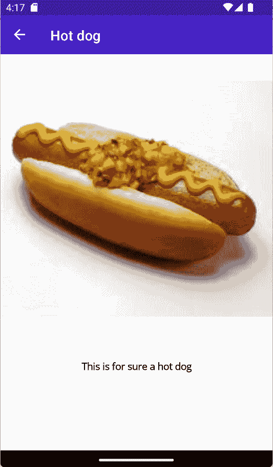

Figure 12.13 – HotdogOrNot running in an Android emulator
Note
The prediction result for Android may not be as accurate as the web portal at [`github.com/Azure-Samples/cognitive-services-android-customvision-sample/issues/12`](https://github.com/Azure-Samples/cognitive-services-android-customvision-sample/issues/12). If you desire better, more consistent results, you can use the REST APIs.
Summary
In this chapter, we built an app that can recognize whether a photo contains a hot dog or not. We accomplished this by training a machine learning model for image classification, using Azure Cognitive Services and the Custom Vision service.
We exported models for ML.NET, and we learned how to use it in an MAUI app that targets iOS, Mac Catalyst, Windows, and Android. In the app, a user can take a photo or pick one from their photo library. This photo will be sent to the model to be classified, and we will get a result that tells us whether the photo is of a hot dog.
Now, we can continue to build other apps and use what we have learned in this chapter regarding machine learning, both on-device and in the cloud using Azure Cognitive Services. Even if we are building other apps, the concept will be the same.
Now, we have completed all the chapters in this book. We have learned the following:

*   What .NET MAUI is and how we can get started building apps
*   How to use the basic layouts and controls of .NET MAUI
*   How to work with navigation
*   How to make the user experience better with animations
*   How to use sensors such as the **Global Positioning System** (**GPS**) in the background
*   How to build apps for multiple form factors
*   How to build real-time apps powered by Azure
*   How to make apps smarter with machine learning

The next step is to start to build your own apps. To stay up to date and learn more about .NET MAUI, our recommendation is to read the official Microsoft dev blogs and watch live streams on Twitch and YouTube videos from the .NET MAUI team.
Thank you for reading the book!

```
