# 第一章：回归基础

在本章中，我们将涵盖以下食谱：

+   创建基于 C# 的控制台应用程序

+   创建 C# 类库

+   创建一个使用库的经典 Windows 应用程序

+   创建一个基于 WPF 的应用程序以使用库

+   Hello Universe – 我第一个 .NET Standard 类库

+   创建一个基于 Windows 控制台的程序以使用库

+   创建一个基于 ASP.NET Core 的 Web 应用程序以使用库

# 技术要求

读者应具备 C# 的基本知识。他们还应了解如何使用 Visual Studio，使用 NuGet 安装包，以及在其他项目中引用项目中的库。

本章的代码文件可以在 GitHub 上找到：

[`github.com/PacktPublishing/DotNET-Standard-2-Cookbook/tree/master/Chapter01`](https://github.com/PacktPublishing/DotNET-Standard-2-Cookbook/tree/master/Chapter01)

查看以下视频以查看代码的实际效果：

[`goo.gl/PoR4HM`](https://goo.gl/PoR4HM)

# 简介

Microsoft .NET 是一个支持多种编程语言的多用途开发平台，这是一个关键特性。其他关键特性包括异步和并发编程模型以及原生互操作性。.NET Framework 支持多种编程语言，如 C#、VB.NET 和 F#，这些语言由 Microsoft 活跃开发和支持。在这本书中，我们将探讨 C#。

C# 是一种现代的、面向对象的、类型安全的编程语言，它帮助开发者使用 .NET Framework 构建健壮、安全的应用程序。C# 在 2002 年随着 .NET Framework 1.0 一起推出。从那时起，C# 不断发展成熟。在撰写本文时，C# 的当前版本是 7.0，.NET 有多种风味可供使用，包括以下内容：

+   **.NET Framework**：与 Windows 一起分发的 .NET 完整风味。由开发者用于在 Windows 下构建 ASP.NET 4.5/4.6 或桌面 Windows 应用程序。

+   **.NET Core**：另一种在 Windows、Mac 和 Linux 下运行的 .NET 风味。由开发者用于构建跨平台的 .NET 基础应用程序，包括跨平台的 Web 应用程序，使用 ASP.NET Core。

+   **Xamarin**：一个基于 mono 的框架，用于 iOS、Android 和 Windows Phone 设备的移动应用程序。此风味支持 macOS 桌面应用程序。

+   **.NET Standard**：用于开发者之间在所有平台上共享代码的 **Portable Class Libraries**（PCL）的替代品，但在最新版本 2.0 中支持 API。此外，请注意，.NET Standard 2.0 在 .NET Core 2.0、.NET Framework 4.6.1 及更高版本以及 Visual Studio 2017（版本 15.3）中得到支持。

# 创建一个基于 C# 的控制台应用程序

让我们从简单的基于 C#的控制台应用程序开始。这个控制台应用程序将介绍一些基本的 C#代码，并为我们在下一道菜谱中要构建的库做好准备。我们的主要重点是进入 C#编码，并为我们将要经历的兴奋做好准备。

# 准备工作

要逐步执行此菜谱，您需要一个运行中的 Visual Studio 2017 副本以及.NET Framework 的最新版本。如果您没有 Visual Studio 2017 的副本，您可以从中下载[`www.visualstudio.com/`](https://www.visualstudio.com/)。

这将带您到微软的 Visual Studio 网站。按照网站上的说明获取 Visual Studio 的副本并开始操作。

# 如何操作...

1.  打开 Visual Studio 2017。

1.  点击文件 | 新建 | 项目，然后在新建项目模板对话框中，在左侧面板中选择 Visual C#，在右侧面板中选择控制台应用程序 (.NET Framework)：

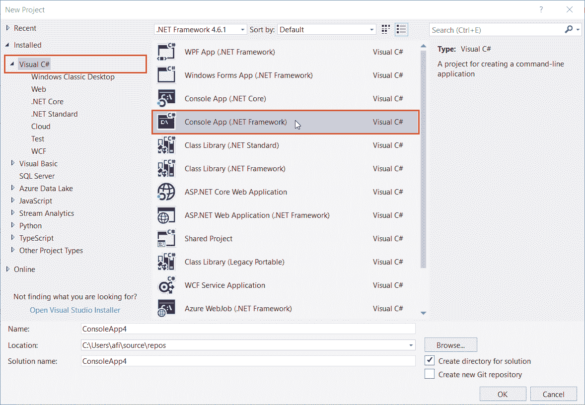

1.  在名称：文本框中，为您的应用程序输入一个名称。在本例中，输入`HelloCSharp`。在位置：下拉列表中选择一个首选位置或点击浏览...按钮选择一个位置。保留默认设置：

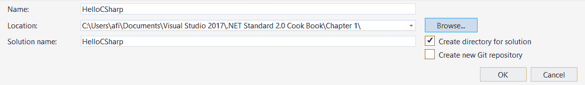

1.  现在点击确定。

1.  你将看到一个默认的 C#控制台应用程序代码模板。让我们按*F5*来测试运行。如果一切正常，一个控制台窗口将弹出并关闭。

1.  在`Main`方法的末尾，输入以下代码片段：

```cs
      private static string SayHello(string yourName)
      {
          return $"Hello, {yourName}";
      }
```

1.  现在，在您的`Main`方法中，输入调用我们刚刚创建的先前方法的代码：

```cs
      var message = SayHello("Fiqri Ismail");
      Console.WriteLine(message);
      Console.ReadLine();
```

1.  现在我们已经编写了我们的第一个 C#代码。完成编码后，控制台应用程序的代码应该看起来像以下这样：

```cs
      static void Main(string[] args)
      {
        var message = SayHello("Fiqri Ismail");
 Console.WriteLine(message);
 Console.ReadLine();
      }

      private static string SayHello(string yourName)
      {
        return $"Hello, {yourName}";
      }
```

1.  让我们按*F5*测试应用程序。如果一切正常，你应该会看到以下屏幕。按*Enter*键退出：

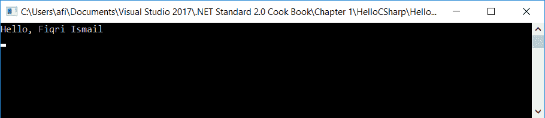

# 工作原理...

让我们快速回顾一下上一道菜谱中我们做了什么。在第 1 步到第 4 步中，我们创建了一个基于 C#的控制台应用程序。控制台应用程序的骨架已经作为模板包含在 Visual Studio 中。为您的项目命名并指定位置是一个好习惯。这些事情将帮助您轻松追踪项目以便将来使用。在第 5 步中，我们只是确保默认的控制台应用程序模板运行正常，并且在实际编码之前没有出现任何意外。

在第 6 步中，我们创建了一个接受`string`参数并返回带有该参数的消息的静态方法；这被称为**字符串插值**。这是 C# 6.0 中引入的新功能，可以用作传统`string.format()`方法的替代。第 7 步在主方法中使用该方法。在正常的控制台应用程序中，`Console.ReadLine()`将等待按下任何键后才退出。最后，在第 9 步中，我们调试代码以检查一切是否按预期正常工作。

# 相关内容

+   C#基础知识  (第二章，*原始类型、集合、LINQ 等*)

+   使用 C#创建基于 Windows 的应用程序（创建一个经典基于 Windows 的应用程序以使用库——第一章，*回到基础*)

# 创建一个 C#类库

在这个菜谱中，我们将构建一个简单的 C#类库。这个库将有一个简单的公共方法，该方法接受一个参数并返回一个字符串。我们还将创建一个空白的 Visual Studio 解决方案并添加库项目。这个解决方案将在后面的菜谱中使用。

# 准备工作

确保你已经安装了 Visual Studio 2017 及其最新更新。在撰写本文时，最新的 Visual Studio 2017 版本是 15.3.5。

# 如何做...

1.  打开 Visual Studio 2017。

1.  点击“文件”|“新建”|“项目”，在“新建项目”模板对话框中，在左侧面板的“其他项目类型”节点下选择 Visual Studio 解决方案，在右侧面板中选择空白解决方案：

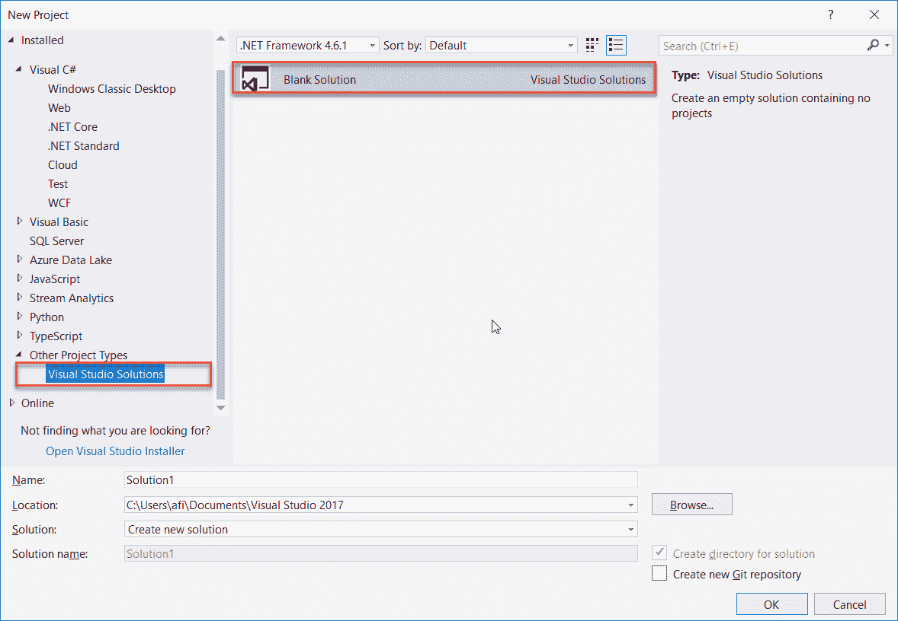

1.  在“名称：”文本框中，为你的应用程序输入一个名称。在这个例子中，输入`Chapter1.Library`。在“位置：”下拉列表中选择一个首选位置，或者点击“浏览...”按钮并选择一个位置。保留默认设置：

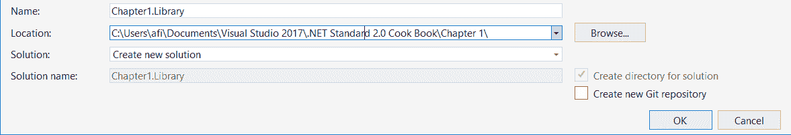

1.  现在你有一个空白解决方案。让我们向解决方案中添加一个 C#类库项目。点击“项目”|“添加新项...”，或者你可以在解决方案资源管理器中右键单击`Chapter1.Library`解决方案标签，然后选择“添加”|“新项目....”

1.  在“添加新项目”模板对话框中，在左侧面板中选择 Visual C#，在右侧面板中选择类库(.NET Framework)：

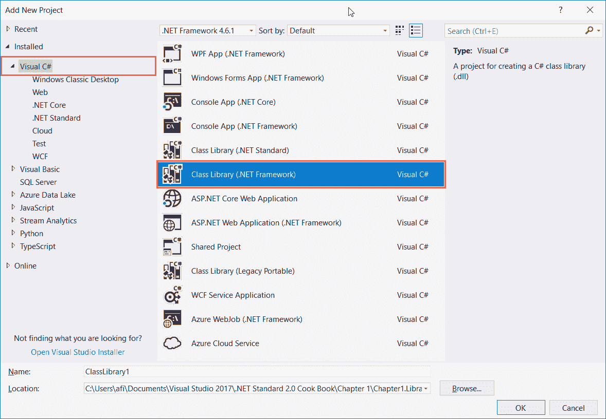

1.  在“名称：”文本框中，为你的类库输入一个名称。在这个例子中，将项目名称输入为`Chapter1.Library.HelloLib`。在“位置：”下拉列表中保留当前位置，然后点击“确定”以创建项目：

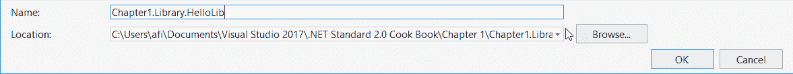

1.  现在我们有一个全新的基于.NET Framework 的类库。在解决方案资源管理器中（如果你看不到解决方案资源管理器，请按*Ctrl* + *Alt* + *L*），默认结构应该如下所示：

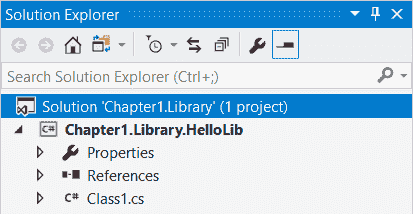

1.  现在我们有一个类库项目的默认模板。让我们将`Class1.cs`重命名为更有意义的东西。将其重命名为`HelloWorld.cs`。你可以在解决方案资源管理器中简单地点击文件的标签并输入新名称（或单击文件名标签并按*F2*）。在确认框中点击“是”以确认重命名。

1.  在`HelloWorld`类体中输入以下代码片段：

```cs
      public string SayHello(string name) 
      { 
          return $"Hello {name}, congratulations !!!, 
          this message is from the class library you created."; 
      }
```

1.  让我们构建我们的代码以检查一切是否正常。点击“生成”|“生成解决方案”，或者按*Ctrl* + *Shift* + *B*，解决方案应该成功构建。让我们在下一个菜谱中测试我们的类库。

1.  点击 文件 | 保存所有，或者按 *Ctrl* + *Shift* + *S*，以保存解决方案和类库项目。

# 它是如何工作的...

让我们看看在这个菜谱中我们已经做了什么以及它是如何工作的。在步骤 1 到 3 中，你创建了一个空白解决方案。空白解决方案是任何大小项目的非常好的起点。它为你提供了一个全新的解决方案来开始。稍后，你可以向解决方案中添加更多内容。尽管这是一个关于类库的简单介绍，但坚持使用正确的命名约定是一个好习惯。这不是必须的，但这是一个好习惯。正如你所看到的，我们给了一个名字 `Chapter1.Library`，所以这个名字是有意义的，它说明了我们的解决方案是关于什么的。

在接下来的步骤 4 到 8 中，我们向空白解决方案中添加了一个类库项目。现在你有一个关于解决方案如何随着时间的推移从开始到结束逐渐成长的概念。我们选择的模板是一个完整的 .NET Framework 类库。我们将 Visual Studio 提供的默认 `Class1.cs` 模板重命名了。给类和文件起一个有意义的名字是一个好习惯。

在步骤 9 和 10 中，我们向我们的类中添加了代码，并通过构建解决方案来检查所有语法是否正确。偶尔检查语法中的错别字和其他错误也是一个好习惯。

# 创建一个基于 Windows 的经典应用程序以使用库

到目前为止，从上一个菜谱中，我们已经创建了一个空白解决方案和一个使用完整 .NET Framework 的类库。在这个菜谱中，让我们创建一个经典的 Windows Forms 应用程序，它使用上一个菜谱中创建的类库。我们将构建一个 Windows 表单，它使用文本框和按钮获取一个名称，并触发我们在类库中创建的公共方法。

# 准备工作

对于这个菜谱，你需要前一个菜谱中构建的解决方案和类。打开 Visual Studio 2017 并为项目做准备。 点击 构建 | 构建解决方案，或者按 *Ctrl* + *Shift* + *B*，解决方案应该成功构建。一切准备就绪，可以测试我们的类库。

# 如何操作...

1.  打开 Visual Studio 2017。

1.  现在，打开上一个菜谱中的解决方案。点击 文件 | 打开 | 项目/解决方案，或者按 *Ctrl* + *Shift* + *O*，并选择 `Chapter1.Library` 解决方案。

1.  现在点击 `Chapter1.Library` 解决方案标签。点击 文件 | 添加 | 新项目...

1.  在 添加新项目模板对话框中，展开左侧窗格中的 Visual C# 节点。

1.  选择 Windows 经典桌面，并在右侧模板窗格中选择 Windows Forms App (.NET Framework)：

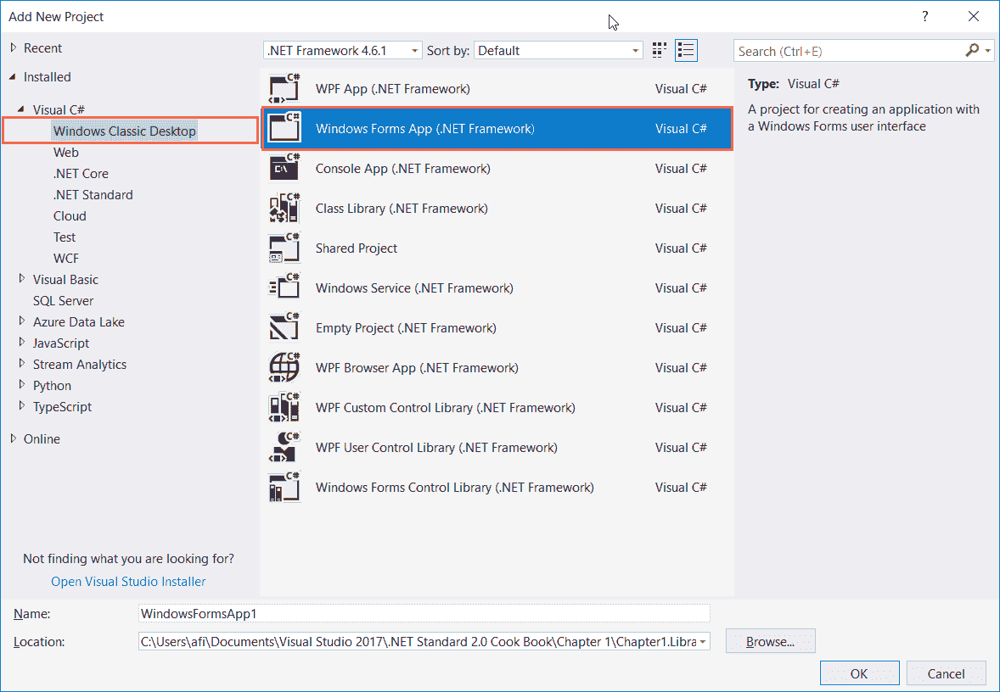

1.  现在，在 名称：文本框中，为新的项目输入一个名称。让我们输入 `Chapter1.Library.HelloWindowsForms` 并保持 位置：文本框不变以及默认设置。点击 确定 创建新项目。

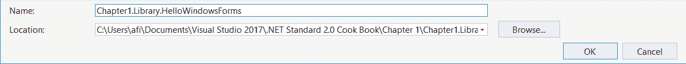

1.  新项目将被添加到解决方案资源管理器中，它应该看起来像这样：

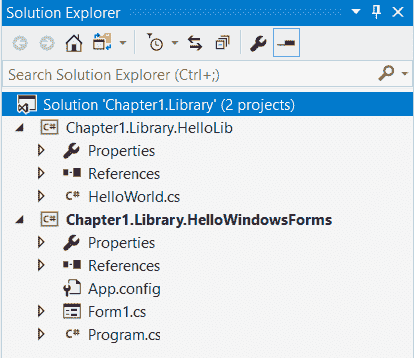

1.  现在让我们对名称进行一些清理。将`Form1.cs`更改为`MainForm.cs`。记住，给你的文件起一个有意义的名称非常重要，并且是一种非常好的实践。

1.  在“MainForm [设计]”选项卡中选择表单，并转到属性窗口（或按*F4*）。现在将文本属性更改为`Hello World`。

1.  让我们在窗体中添加一些 UI 组件。转到工具箱窗口（或按*Ctrl* + *Alt* + *X*），并将一个标签、一个文本框和一个按钮拖放到窗体上。按照以下截图进行排列：

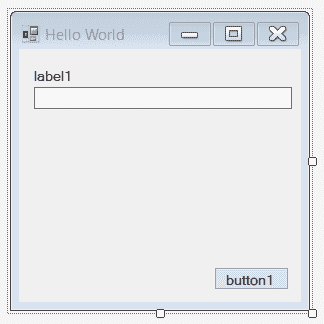

1.  让我们更改刚刚添加到窗体上的组件的一些属性。转到属性窗口，并将默认值更改为以下内容：

| **组件** | **属性** | **值** |
| --- | --- | --- |
| 标签 | 名称 | `NameLabel` |
| 标签 | 文本 | `输入您的姓名` |
| 文本框 | 名称 | `NameTextBox` |
| 按钮 | 名称 | `HelloButton` |
| 按钮 | 文本 | `问候` |

变更之后，Windows 窗体设计器应该看起来像这样：

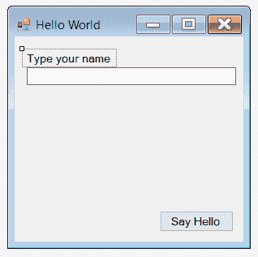

1.  让我们将我们的库添加到 Windows 窗体项目中。为此，展开`Chaper1.Library.HelloWindowsForms`项目下的“引用”。右键单击“引用”标签，然后选择“添加引用……”。

1.  在“引用管理器”对话框中，点击左侧窗格中的“项目”标签。在中间窗格中，选中`Chapter1.Library.HelloLib`项目：

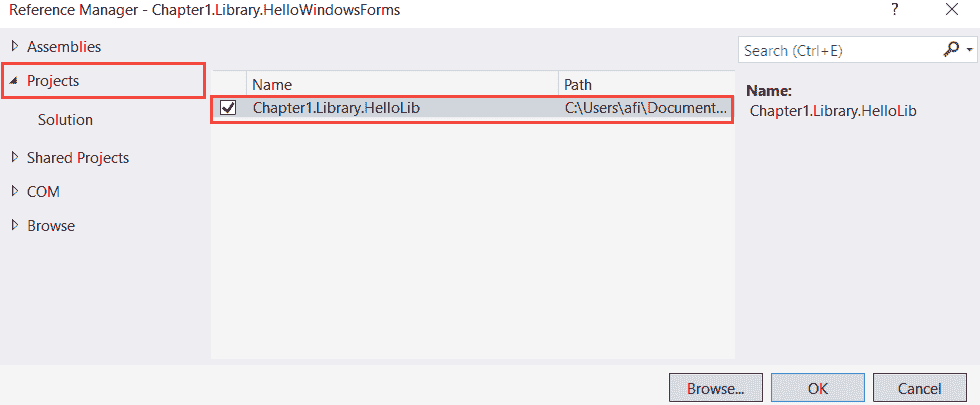

1.  点击“确定”。

1.  现在双击“问候”按钮以打开代码窗口。

1.  在代码窗口中，滚动到顶部并在`using`指令的最后一行之后输入以下代码：

```cs
      using Chapter1.Library.HelloLib;
```

1.  现在滚动到`HelloButton_Click`方法。在大括号之间，输入以下代码：

```cs
      var helloMessage = new HelloWorld();
      var yourName = NameTextBox.Text;
      MessageBox.Show(helloMessage.SayHello(yourName));
```

1.  现在是时候测试我们用之前菜谱中创建的类库构建的经典 Windows 应用程序了。按*F5*调试代码。现在你应该能看到创建的 Windows 窗体。

1.  在文本框中输入您的姓名，然后点击“问候”按钮。将出现一个消息框，显示来自类库的消息：

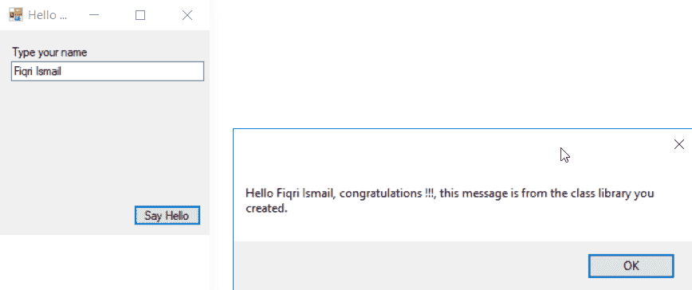

1.  恭喜！！！您刚刚使用了一个来自经典 Windows 应用程序的类库。

# 它是如何工作的...

如果你仔细看看我们刚刚完成的菜谱，我们使用了一个从之前的菜谱创建的解决方案。在实际应用中，这是一个日常过程。从步骤 1 到 7，我们打开了一个包含之前菜谱中类库的现有解决方案，并将经典 Windows 窗体应用程序添加到该解决方案中。

在步骤 8 到 11 中，我们准备了 Windows 表单项目。为组件和文件命名得当是良好的实践。即使这是一个小型应用程序，良好的命名也是一项良好的纪律。步骤 12 到 14 是本食谱中最重要的步骤。在这些步骤中，我们将我们的类库添加到 Windows 项目中作为引用。现在你可以从你的 Windows 应用程序中访问类库提供的所有公共方法。

在步骤 15 到 17 中，我们向 `HelloButton` 的按钮点击事件中添加了代码。双击组件将带你到 Windows 表单的 C# 代码。Visual Studio 将为你生成代码。在这种情况下，是按钮点击事件。组件的默认事件将根据你选择的组件而变化。在步骤 17 中，我们创建了一个变量来保存类库中 `HelloWorld` 类的实例。然后，我们创建另一个变量来保存文本框的用户输入。代码的最后一行将使用上一行代码中创建的变量提供的字符串参数调用 `HelloWorld.SayHello(string name)` 方法。最后，一个默认的消息框将显示 `HelloWorld` 类的 `SayHello(string name)` 方法返回的 `string`。

步骤 19 将执行默认项目，在本例中，我们的基于 Windows 的应用程序。有时，如果类库项目被选为默认项目，Visual Studio 将会抱怨你无法执行此类项目。所以请确保你已经选择了 Windows 项目作为默认启动项目。

# 创建一个基于 WPF 的应用程序以使用库

现在，在这个食谱中，让我们向解决方案添加一个基于 **Windows Presentation Foundation** (**WPF**) 的应用程序，并使用之前食谱中创建的类库。WPF 是 Windows Presentation Foundation 的缩写。本食谱的目的是演示如何在不同的 .NET 基于的应用程序之间共享库。

# 准备工作

对于这个食谱，你需要使用之前食谱中构建的解决方案和类库。打开 Visual Studio 2017 并准备项目。点击 Build | Build Solution，或者按 *Ctrl* + *Shift* + *B*，解决方案应该能够成功构建。一切准备就绪，可以测试我们的类库。

# 如何做这件事...

1.  打开 Visual Studio 2017。

1.  现在打开之前食谱中的解决方案。点击 File | Open | Open Project/Solution，或者按 *Ctrl* + *Shift* + *O*，并选择 `Chapter1.Library` 解决方案。

1.  现在点击 `Chapter1.Library` 解决方案标签。点击 File | Add | New Project。

1.  在“添加新项目”模板对话框中，展开左侧窗格中的 Visual C# 节点。

1.  选择 Windows Classic Desktop，并在右侧模板窗格中选择 WPF App (.NET Framework)。

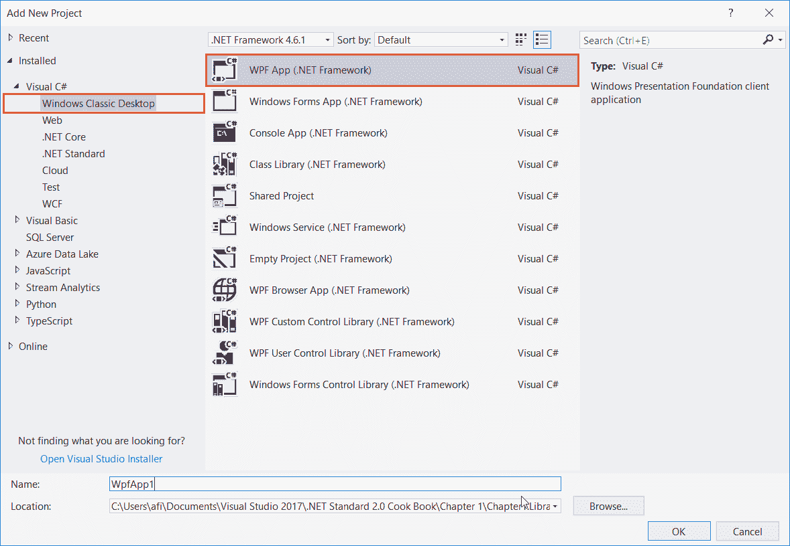

1.  现在，在 名称：文本框中，为新项目输入一个名称。让我们输入 `Chapter1.Library.HelloWPF` 并保持 位置：不变以及默认设置。点击 确定 以创建新项目。

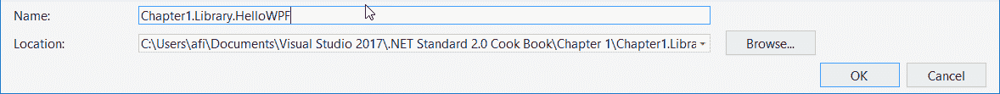

1.  现在，解决方案资源管理器（如果不可见，请按 *Ctrl + Alt + L*）应该看起来像这样：

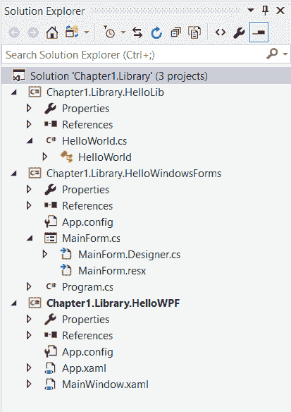

1.  现在，点击 `MainWindow.xaml` 选项卡并确保您处于设计模式。

1.  现在，从工具箱（要查看工具箱，请按 *Ctrl* + *Alt* + *X*）拖放一个按钮和一个文本块。您可以在 公共 WPF 控件 下找到这些组件。

1.  主窗口应该看起来像这样：

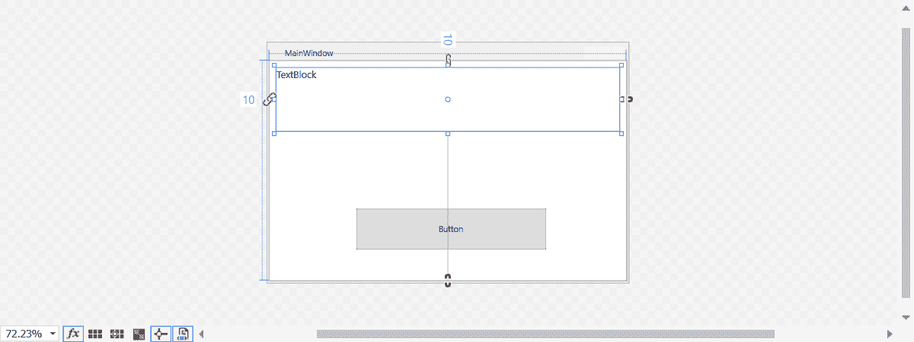

1.  让我们命名我们的控件并更改一些属性如下：

    | **控件** | **属性** | **值** |
    | --- | --- | --- |
    | 文本块 | 名称 | `消息标签` |
    | 文本块 | 布局 &#124; 宽度 | `498` |
    | 文本块 | 布局 &#124; 高度 | `93` |
    | 文本块 | 文本 &#124; 字体 | `粗体` |
    | 文本块 | 文本 &#124; 字体 | `大小 14` |
    | 文本块 | 公共 &#124; 文本 | `按按钮查看消息` |
    | 按钮 | 名称 | `HelloButton` |
    | 按钮 | 布局 &#124; 宽度 | `276` |
    | 按钮 | 布局 &#124; 高度 | `60` |
    | 按钮 | 公共 &#124; 内容 | `说你好` |

1.  让我们将我们的类库作为引用添加到我们刚刚创建的 WPF 项目中。展开 `Chapter1.Library.HelloWPF` 项目节点，并在解决方案资源管理器中展开 引用 节点（如果您看不到解决方案资源管理器，请按 *Ctrl* + *Alt* + *L*）。

1.  右键单击 引用 标签并选择添加引用....。

1.  在 引用管理器 对话框中，在左侧窗格中单击 项目 标签。在中窗格中，选中 `Chapter1.Library.HelloLib` 项目：

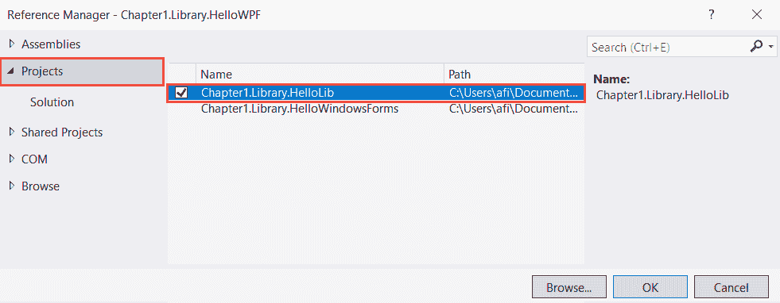

1.  点击确定。

1.  在 `MainWindow.xaml` 选项卡中，双击 `SayHello` 按钮。

1.  在 `MainWindow.xamal.cs` 选项卡中，向上滚动直到看到 `using` 代码块。将此代码作为 `using` 代码块的最后一行添加：

```cs
      using Chapter1.Library.HelloLib;
```

1.  现在，向下滚动直到到达 `HelloButton_Click` 方法。在 `HelloButton_Click` 方法的括号中输入以下代码块：

```cs
      var yourName = "Fiqri Ismail";
      var helloMessage = new HelloWorld();

      MessageLabel.Text = helloMessage.SayHello(yourName);
```

1.  现在，我们准备测试。按 *F5* 调试我们的代码：

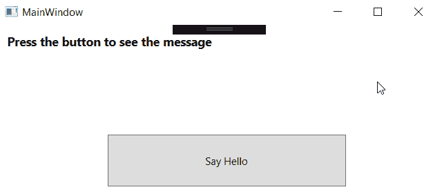

1.  点击 说你好 按钮以查看来自类库的消息：

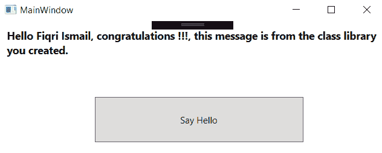

1.  恭喜！！！您刚刚使用了一个用 WPF 应用程序创建的库。

# 它是如何工作的...

让我们看看这些片段以及它们是如何结合在一起的。从步骤 1 到 7，我们打开了一个现有解决方案并添加了一个 WPF 项目到该解决方案中。在步骤 8 到 10 中，我们从工具箱中添加了一个控件到 WPF 主窗体。由于这是一个 WPF 应用程序，我们通过一个额外的元素；设置 UI。在步骤 11 中，我们使用属性窗口设置了 UI 元素。

在步骤 12 到 15 中，我们添加了对 WPF 项目的引用。引用我们创建的库是最重要的部分。没有引用，WPF 项目对库一无所知。仅引用库后，它将可供 WPF 项目使用。步骤 17 告诉编译器使用库的命名空间。现在我们不需要在库内部调用类的完整命名空间。在步骤 18 中，我们创建了一个简单的变量并存储了一个名称。下一行在库内部创建了一个`HelloWorld`类的实例。最后，我们使用 WPF TextBlock 控制的 Text 属性来存储从`SayHello(string name)`方法中获取的值。

在最后几步 – 19 到 20 中，我们执行了代码并进行了测试。

# Hello Universe – 我的第一个.NET Standard 类库

现在是时候继续前进，看看 Microsoft .NET Standard 了。在这个菜谱中，我们将查看.NET Standard 库的 2.0 版本。一开始，我们将构建一个小型的.NET Standard 类库，并使用它与不同的.NET 应用程序。

# 准备工作

让我们确保我们已经下载并安装了 Visual Studio 2017 的一个版本。如果您在 Windows 上运行，您可以选择 Visual Studio 2017 社区版、专业版或企业版。如果您在 mac 上运行，您可以选择 Visual Studio 2017 for macOS。此外，Visual Studio Code 适用于所有 Windows、Mac 和 Linux 平台。访问[`www.visualstudio.com`](http://www.visualstudio.com)并按照说明下载您选择的 Visual Studio。

在下一步中，我们将需要下载并安装.NET Core 2.0。再次提醒，只需访问[`www.dot.net/core`](http://www.dot.net/core)并下载最新版本，在这种情况下，是.NET Core 的 2.0 版本。该网站提供了一套非常简单且信息丰富的说明，指导如何在您的系统上安装.NET Core 2.0。

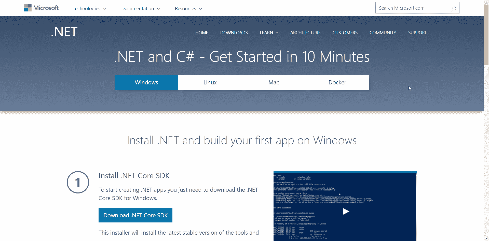

# 如何操作...

1.  打开 Visual Studio 2017。

1.  点击文件 | 新建 | 项目。

1.  现在，在新项目对话框中，展开左侧窗格中的 Visual C#节点，并选择.NET Standard 类库，在右侧窗格中，选择.NET Standard 类库：

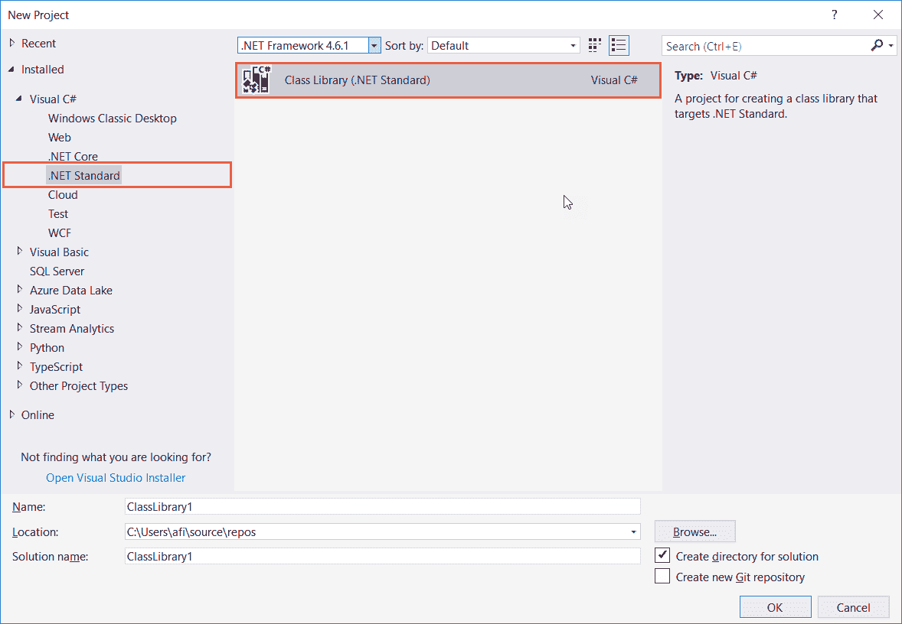

1.  在名称：文本框中，为您的类库输入一个名称。让我们输入`Chapter1.StandardLib.HelloUniverse`，并在位置：下拉列表中选择一个首选位置，或者点击浏览...按钮并选择一个位置。保留默认设置。最后，在解决方案名称：文本框中，输入`Chapter1.StandardLib`。

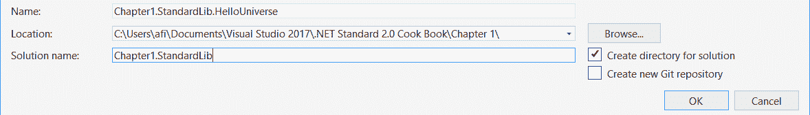

1.  点击确定。

1.  在解决方案资源管理器（按*Ctrl* + *Alt* + *L*），点击 Class1.cs，按*F2*，将其重命名为`HelloUniverse.cs`。通过在确认框中选择是来确认重命名。

1.  将命名空间从`Chapter1.StandardLib.HelloUniverse`更改为`Chapter1.StandardLib`。

1.  现在，在`HelloUniverse`类的花括号内，输入以下代码：

```cs
      public string SayHello(string name)
      {
          return $"Hello {name}, 
          welcome to a whole new Universe of .NET Standard 2.0";
      }
```

1.  按*Ctrl* + *S*保存更改，然后按*Ctrl* + *Shift* + *B*构建代码。如果构建没有错误完成，我们就可以进行下一个菜谱，了解如何使用这个类库。

# 它是如何工作的...

.NET Standard 2.0 是其最新版本。.NET Standard 完全是关于代码共享的。与.NET Framework 类库不同，.NET Standard 类库代码几乎可以在.NET 生态系统的所有部分共享。.NET Standard 的最新版本是 2.0。在撰写本文时，它可以与.NET Framework 4.6.1、.NET Core 2.0、Mono 5.4、Xamarin.iOS 10.14、Xamarin.Mac 3.8、Xamarin.Android 7.5 以及即将推出的**通用 Windows 平台**（**UWP**）版本共享。它还取代了**可移植类库**（**PCLs**），作为构建在所有地方都能工作的.NET 库的工具。

在步骤 1 到 5 中，我们创建了一个基于.NET Standard 2.0 的新类库项目。在步骤 4 中，我们为类库以及解决方案给出了合适的名称。给项目和解决方案起一个有意义的名称是良好的实践。在步骤 6 中，我们将默认类的名称更改为`HelloUniverse.cs`，这要归功于 Visual Studio 中的重构功能。如果你查看.NET Standard 2.0 库模板的布局，你会看到一个依赖项节点。在一个正常的.NET Framework 类库中，我们有引用。依赖项节点将列出该类库的所有依赖组件。

在步骤 8 中，我们添加了一个简单的公共方法，该方法接受一个字符串参数，并返回一个包含发送到方法中的参数的消息。最后，我们通过构建解决方案来检查语法错误和拼写错误。

# 创建一个基于 Windows 控制台的应用程序以使用库

在上一个菜谱中，我们创建了一个基于.NET Standard 2.0 的类库。在这个菜谱中，我们将创建一个基于 Windows 控制台的应用程序来使用这个库。基于控制台的应用程序将在 Windows 下使用完整的.NET Framework，当前.NET Framework 的版本是 4.6.1。

# 准备工作

让我们准备好创建一个 Windows 控制台应用程序，以使用我们在上一个菜谱中构建的.NET Standard 库。如果你没有遵循上一个菜谱，请确保你已经完成了它。我们将使用那个解决方案并向其中添加 Windows 控制台应用程序。打开 Visual Studio 2017，打开上一个菜谱中保存的解决方案。点击“构建”|“构建解决方案”，或者按*Ctrl* + *Shift* + *B*，解决方案应该能够成功构建。一切准备就绪，可以测试我们的类库。

# 如何操作...

1.  打开 Visual Studio 2017。

1.  现在，打开上一个菜谱中的解决方案。点击“文件”|“打开”|“打开项目/解决方案”，或者按*Ctrl* + *Shift* + *O*，然后选择`Chapter1.StandardLib`解决方案。

1.  现在，点击`Chapter1.Library`解决方案标签。点击“文件”|“添加”|“新建项目”。

1.  在“添加新项目”模板对话框中，展开左侧窗格中的 Visual C#节点。从右侧窗格中选择 Windows 经典桌面，并选择控制台应用程序(.NET Framework)。

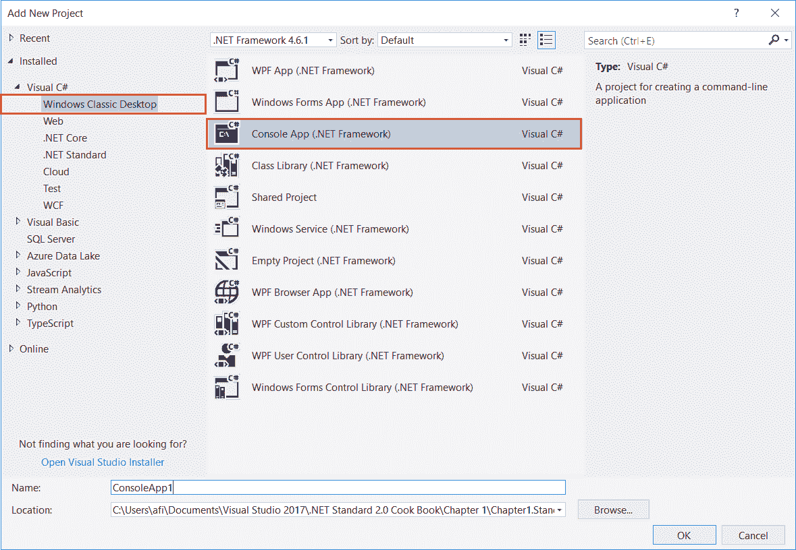

1.  现在，在“名称：”文本框中，输入`Chapter1.Standard.HelloConsole`，并将“位置：”文本框保持原样。

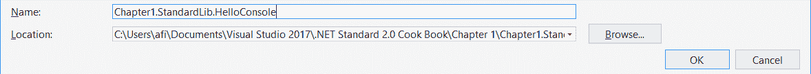

1.  点击确定。

1.  现在，解决方案资源管理器（如果未显示，请按*Ctrl* + *Alt* + *L*）应该看起来像这样：

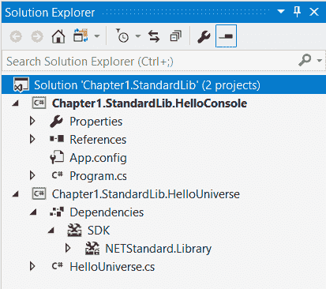

1.  在`Chapter1.StandardLib.HelloConsole`项目树中，右键单击“引用”标签并选择添加引用...

1.  在“引用管理器”对话框中，点击左侧窗格中的“项目”标签。在中间窗格中，选中`Chapter1.StandardLib.HelloUniverse`项目。

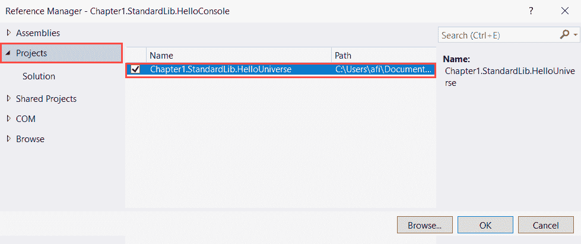

1.  点击确定。

1.  在解决方案资源管理器中，双击`Chapter1.StandardLib.HelloConsole`项目下的`Program.cs`文件名。

1.  滚动至代码中的`using`指令部分，并将以下代码作为该部分的最后一行添加：

```cs
      using Chapter1.StandardLib;
```

1.  现在，在`Main()`方法的括号内，输入以下代码：

```cs
      var myName = "Fiqri Ismail";
      var helloMessage = new HelloUniverse();
      Console.WriteLine(helloMessage.SayHello(myName));
      Console.ReadLine();
```

1.  按*F5*并查看代码运行：

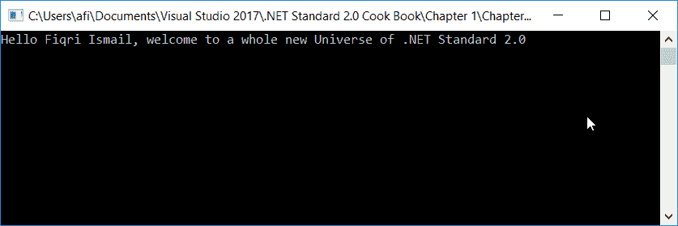

1.  按*Enter*退出命令提示符。

# 它是如何工作的...

好的，让我们深入了解我们刚刚完成的工作。从步骤 1 到 7，我们打开了一个现有项目并添加了一个新的 Windows 控制台应用程序。该项目是一个完整的.NET Framework 项目，其版本为.NET Framework 版本 4.6.1。在步骤 9 和 10 中，我们从 Windows 控制台应用程序添加了对.NET Standard 类库项目的引用。这是测试类库所必需的。然后，我们可以从应用程序中引用并使用它，就像我们在步骤 12 中所做的那样。

在步骤 13 中，我们创建了一个变量来存储名称（请注意，硬编码不是一种好习惯）。然后，我们创建了.NET Standard 2.0 类库中创建的`HelloUniverse`类的实例。为了将`SayHello()`方法的输出显示到控制台窗口，我们直接使用了`Console.WriteLine()`方法。最后，我们使用`Console.ReadLine()`方法等待用户按下键退出控制台，否则最终用户将无法在控制台看到任何输出。

# 创建一个基于 ASP.NET Core 的 Web 应用程序以使用库

到目前为止，我们已经使用运行在完整.NET Framework 版本 4.6.1 下的 Windows 控制台应用程序测试了.NET Standard 2.0 类库。在这个菜谱中，我们将创建一个 ASP.NET Core 2.0 应用程序。ASP.NET Core 使用.NET Core，这是一个开源的、跨平台支持的.NET 版本。

# 准备工作

让我们准备创建 ASP.NET Core 应用程序，以便在我们创建.NET Standard 库时使用前一个菜谱中构建的.NET Standard 库。如果您没有遵循那个菜谱，请确保您已经完成了它。我们将使用那个解决方案，并将 ASP.NET Core 应用程序添加到其中。同时，请确保您已下载并安装了最新版本的.NET Core 框架，该框架可在[`www.dot.net/core`](http://www.dot.net/core)找到。

打开 Visual Studio 2017，并打开前一个菜谱中保存的解决方案。点击“生成”|“生成解决方案”，或者按*Ctrl* + *Shift* + *B*，解决方案应该会成功构建。一切准备就绪，可以测试我们的类库。

# 如何操作...

1.  打开 Visual Studio 2017。

1.  现在，打开前一个菜谱中的解决方案。点击“文件”|“打开”|“打开项目/解决方案”，或者按*Ctrl* + *Shift* + *O*，然后选择`Chapter1.StandardLib`解决方案。

1.  现在，点击`Chapter1.Library`解决方案标签。点击“文件”|“添加”|“新项目”。

1.  在“添加新项目”模板对话框中，展开左侧窗格中的 Visual C#节点。从右侧窗格中选择 Web，然后选择 ASP.NET Core Web 应用程序：

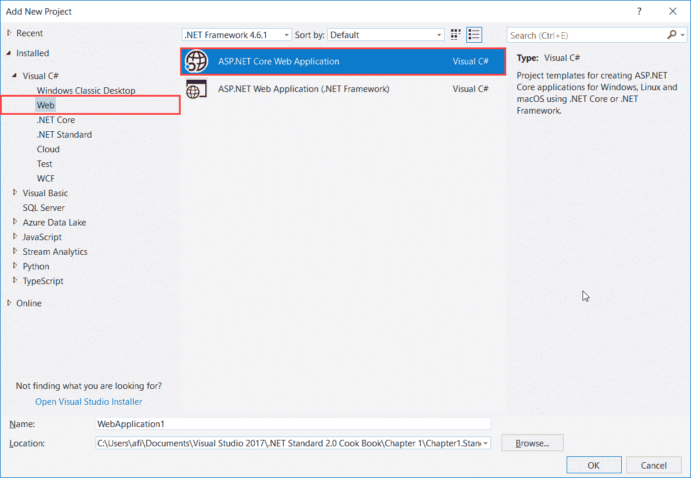

1.  在“名称”文本框中，将项目名称输入为`Chapter1.StandardLib.AspNetCore`，并保持“位置”不变：

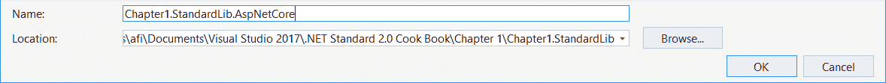

1.  点击确定。

1.  现在，在“新建 ASP.NET Core Web 应用程序”对话框中，从第一个下拉列表中选择.NET Core，从第二个下拉列表中选择 ASP.NET Core 2.0。最后，从模板列表中选择 Web 应用程序（模型-视图-控制器）：

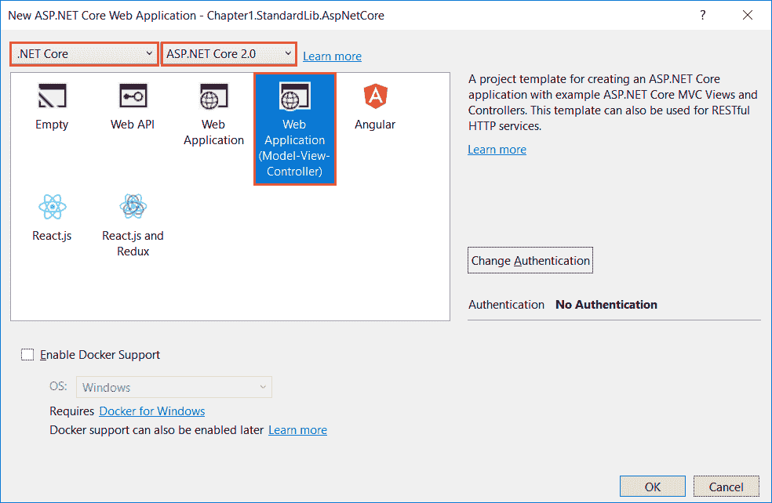

1.  保持默认设置并点击确定。

1.  现在，解决方案资源管理器应该看起来像这样：

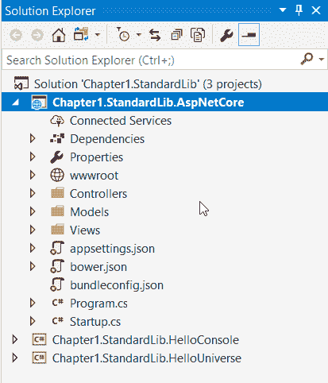

1.  选择`Chapter1.StandardLib.AspNetCore`项目，右键单击，并选择设置为启动项目。

1.  现在，按*F5*进行测试运行。如果一切运行顺利，你应该会在默认浏览器中看到这个默认的 ASP.NET Core 模板正在运行：

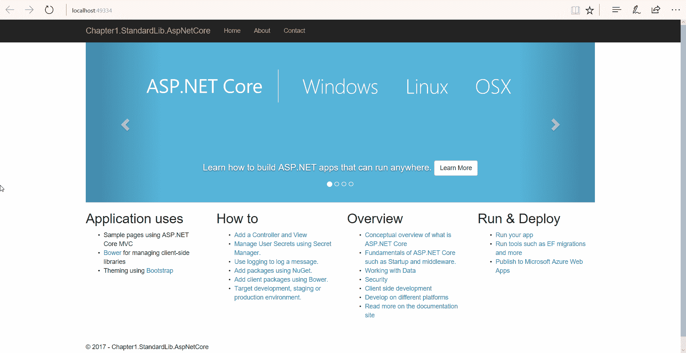

默认 ASP.NET Core 模板在您的默认浏览器上运行

1.  让我们关闭浏览器，并将我们的.NET Standard 类库作为引用添加。为此，展开`Chapter1.StandardLib.AspNetCore`项目树并选择依赖项。

1.  右键单击依赖项标签，并选择添加引用。

1.  在“参考管理器”对话框中，点击左侧窗格中的“项目”标签。在中间窗格中，选中`Chapter1.StandardLib.HelloUniverse`项目，然后点击确定。

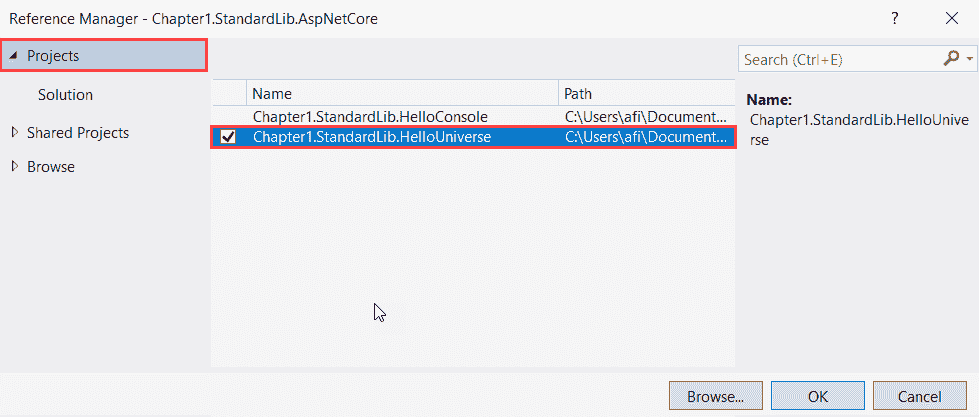

1.  让我们展开“控制器”文件夹，并双击`HomeController.cs`。

1.  在`HomeController.cs`中，在`using`指令块的最后一行旁边添加以下代码：

```cs
      using Chapter1.StandardLib;
```

1.  现在，在 `About()` 动作中，在 `ViewData["Message"]` 行之后（默认情况下，这是默认模板的第 21 行）添加以下代码块：

```cs
      var myName = "Fiqri Ismail"; 
      var helloMessage = new HelloUniverse();
      ViewData["HelloMessage"] = helloMessage.SayHello(myName);
```

1.  现在展开 `Views` 文件夹。同样，也展开 `Home` 文件夹。

1.  双击 `About.cshtml`。

1.  在 `About.cshtml` 文件的末尾，添加以下代码：

```cs
      <p>@ViewData["HelloMessage"]</p>
```

1.  现在按 *F5* 键来查看其效果。

1.  你将在浏览器中看到默认的 ASP.NET Core 模板。现在点击 About 来查看 `About.cshtml` 页面：

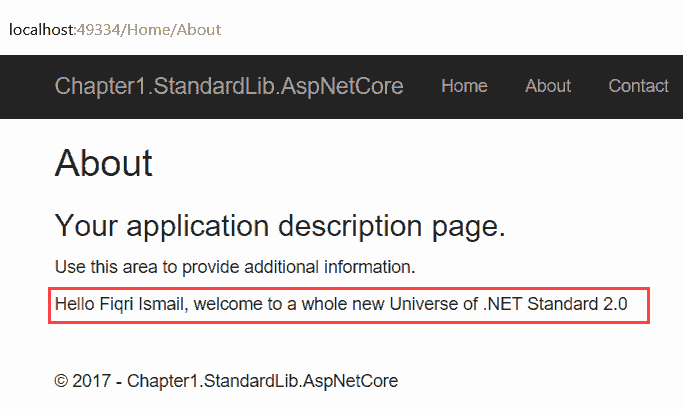

`About.cshtml` 页面

1.  太棒了，现在你已经使用了一个 .NET Standard 2.0 库和一个 ASP.NET Core 2.0 网络应用程序。

# 它是如何工作的...

让我们看看我们刚才做了什么。从第 1 步到第 9 步，我们打开并构建了一个包含 .NET Standard 2.0 库代码的现有解决方案。然后，我们将一个 ASP.NET Core 项目添加到该解决方案中。在第 10 步中，我们告诉 Visual Studio 在我们按 F5 或开始调试时执行 ASP.NET Core 项目。在第 11 步中，我们在默认浏览器中测试了 ASP.NET Core 的默认模板。

在第 12 步到第 14 步中，我们将我们的 ASP.NET Core 应用程序的引用添加到了 .NET Standard 2.0 类库中。这允许您从 ASP.NET Core 2.0 网络应用程序中访问库。在第 16 步中，我们使用 `using` 指令引用了类库。在第 17 步中，我们创建了一个变量来保存名称并创建了 `HelloUniverse` 类的一个实例。

最后，我们已经将 `SayHello()` 方法中的消息存储在 `ViewData` 集合中。`ViewData` 集合允许您将数据从控制器传输到视图。在第 19 步和第 20 步中，我们打开了 `About()` 动作的相关视图，即 `About.cshtml`。最后，在第 20 步中，我们在 `HomeController` 类中添加了简单的 HTML 代码来显示存储在 `ViewData` 中的值。作为最后一步，我们执行了网络应用程序并进行了测试。
