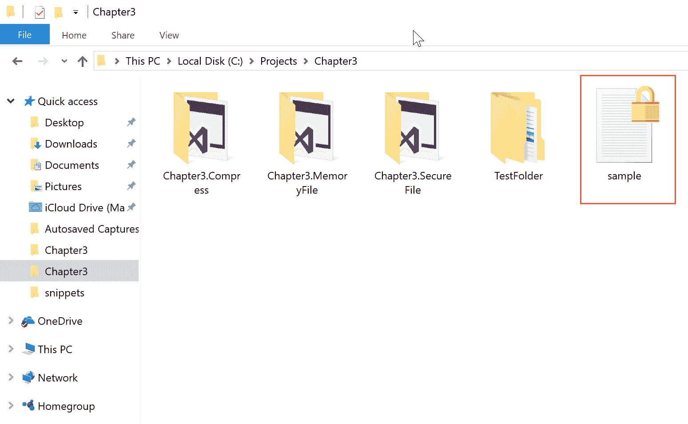

# 第三章：文件操作

在本章中，我们将探讨以下食谱：

+   在 Ubuntu 中设置.NET Core

+   创建一个文本日志

+   在 Ubuntu 中创建一个 ASP.NET Core 应用程序以使用库

+   在 macOS 中设置.NET Core

+   从逗号分隔（CSV）文本文件中读取

+   在 macOS 中创建一个.NET Core 控制台应用程序以使用库

+   压缩？为什么不呢？

+   创建一个经典 Windows 应用程序以使用库

+   在文本文件中加密和解密内容

+   创建一个经典 Windows 应用程序以使用库

# 技术要求

读者应具备 C#的基本知识。他们还应具备使用 Visual Studio、使用 NuGet 安装包以及在其他项目中引用库的基本知识。

本章的代码文件可以在 GitHub 上找到：

[`github.com/PacktPublishing/DotNET-Standard-2-Cookbook/tree/master/Chapter03`](https://github.com/PacktPublishing/DotNET-Standard-2-Cookbook/tree/master/Chapter03)

观看以下视频以查看代码的实际操作：

[`goo.gl/82FCEP`](https://goo.gl/82FCEP)

# 简介

作为一名开发者，在某个时候，我们不得不将一些数据写入磁盘或从磁盘读取数据。这可能是一个简单的文本文件，或者可能是一个您所编写的系统中的日志文件。.NET Framework 为与文件操作提供了强大的支持。主要，我们将关注`System.IO`命名空间及其使用。

在本章中，我们还将探讨一些跨平台应用程序。每个食谱将介绍如何设置新的环境，例如 Ubuntu 和 macOS，以及构建.NET Standard 2.0 库及其配套的应用程序。

# 在 Ubuntu 中设置.NET Core

在本食谱中，我们将介绍如何在 Ubuntu 系统中设置.NET Core 2.x。Ubuntu 是一个广泛使用的基于 Debian 的 Linux 环境。通过访问[`www.ubuntu.com/desktop`](https://www.ubuntu.com/desktop)，您可以轻松地下载并在您的系统上安装 Ubuntu。您可能需要使用虚拟 PC 来完成此操作。有两个出色的免费工具您可以使用：

1.  VMWare Workstation Player for Windows: [`www.vmware.com/products/workstation-player.html`](https://www.vmware.com/products/workstation-player.html)

1.  Oracle Virtual Box for Windows, Linux, and macOS: [`www.virtualbox.org/wiki/Downloads`](https://www.virtualbox.org/wiki/Downloads)

本章假设您已经设置并安装了所需的操作系统。

# 准备工作

您将需要下载一个虚拟 PC 并安装最新版本的 Ubuntu。如果您还没有运行 Ubuntu 的虚拟 PC，在继续此食谱之前请确保已经完成。我在这里使用的是 Ubuntu 版本 16.04。要找出您拥有哪个版本，只需在终端中输入以下命令：

```cs
$ lsb_release -a
```

您应该得到以下输出：


# 如何操作...

1.  打开您喜欢的浏览器，输入以下 URL，然后按*Enter*键：

    `https://www.microsoft.com/net/download/linux`


1.  选择“安装 .NET Core SDK 2.x 包”按钮。

1.  从 Linux 发行版下拉列表中选择 Ubuntu 16.04**。**


1.  按照页面上的说明安装当前 SDK 或执行以下步骤进行安装。

1.  现在打开终端，输入以下命令并按 *Enter* 键：

```cs
 $ curl https://packages.microsoft.com/keys/microsoft.asc | 
      gpg --dearmor > microsoft.gpg
```

1.  如果您有一个全新的 Ubuntu 安装，您可能没有安装 curl。如果没有，请使用以下命令安装 curl：

```cs
 $ sudo apt-get install curl 
```

1.  现在，再次在终端中输入以下命令并按 *Enter* 键以获取文件列表：

```cs
 $ sudo mv microsoft.gpg /etc/apt/trusted.gpg.d/microsoft.gpg
```

1.  在终端中输入以下命令并按 *Enter* 键：

```cs
 $ sudo sh -c 'echo "deb [arch=amd64] 
      https://packages.microsoft.com/repos/
      microsoft-ubuntu-xenial-prod xenial main" > 
      /etc/apt/sources.list.d/dotnetdev.list'
```

1.  让我们使用以下命令更新软件包列表：

```cs
 $ sudo apt-get update
```

1.  最后，让我们使用以下命令安装 SDK：

```cs
 $ sudo apt-get install dotnet-sdk-2.0.2
```

1.  现在我们已经完成了 SDK 的安装，让我们使用以下命令来测试它：

```cs
 $ dotnet --version 
```

1.  如果一切正常，您应该会看到以下输出：


# 它是如何工作的...

在第 1 到 3 步中，我们导航以找到适合我们 Ubuntu 安装的所需 SDK 版本。这些命令很简单。我使用 Ubuntu 16.04 作为我的操作系统。在第 4 和 5 步中，我们使用 `curl` 将安全密钥下载到系统中，并告诉 Ubuntu 我们将从受信任的源下载 SDK。在一个全新的 Ubuntu 安装中，我们可能没有 `curl` 命令。所以，如果您遇到了“找不到命令”的问题，您可以直接按照第 4 步安装 `curl`。

在第 6 步中，我们使用 Ubuntu 命令更新了其软件包列表以包含 Microsoft 仓库。然后，在第 7 步中，我们使用 `apt-get` 命令更新了源列表。最后，在第 8 步中，我们实际安装了 .NET Core 2.0 SDK。

在第 9 和 10 步中，我们检查了安装是否一切正常，以便继续。

# 创建文本日志

在这个菜谱中，我们将创建一个 .NET Standard 2.0 库，该库将作为日志文件写入文本文件。这个日志文件将包含我们在应用程序中执行的操作的简单文本条目。它还将演示如何使用 .NET Core SDK 中的命令行工具来创建解决方案并添加项目，随着我们的进行。

# 准备工作

确保您已安装 Ubuntu 16.04 和 .NET Core 2.0 SDK。如果没有，请按照前面的菜谱进行操作。假设一切已安装且 .NET Core 2.0 正在运行，让我们开始创建一个将日志作为文本写入的库。

确保您已从 [`code.visualstudio.com`](https://code.visualstudio.com) 下载并安装了 Visual Studio Code。这是一个从网站下载 `.deb` 文件的简单安装。

# 如何操作...

1.  打开终端。

1.  现在在您的家目录或任何其他目录中输入以下命令并按 *Enter* 键：

```cs
      $ dotnet new sln -o Chapter3 -n Chapter3.LogFile
```

1.  现在，使用以下命令切换到新创建的目录：

```cs
 $ cd Chapter3
```

1.  现在您已经处于解决方案的根目录。让我们使用以下命令创建.NET Standard 库项目：

```cs
 $ dotnet new classlib -o Chapter3.LogFile.LogLib
```

1.  现在我们已经创建了我们的`Class Library Project`，让我们使用 Visual Studio Code 打开整个解决方案。

1.  在终端中输入以下命令并按*Enter*键：

```cs
 $ code .
```

1.  之前的命令将在当前目录中打开 Visual Studio Code，IDE 应该看起来像这样：


1.  现在，在代码树中，选择`Class1.cs`，按*F2*键，将名称更改为`TextLog.cs`并按*Enter*键。

1.  同样在代码窗口中，将类名从`Class1`更改为`TextLog`。

1.  现在您的代码应该看起来像这样：

```cs
      using System;

      namespace Chapter3.LogFile.LogLib
      {
          public class TextLog
          {
          }
      }
```

1.  让我们将我们的新项目添加到解决方案中。确保您位于项目目录的根目录。输入`ls`命令，输出应该像这样：


1.  在终端中输入以下命令并按*Enter*键：

```cs
 $ dotnet sln Chapter3.LogFile.sln  
      add Chapter3.LogFile.LogLib/Chapter3.LogFile.LogLib.csproj
```

1.  现在，在解决方案的根目录中，输入以下命令来构建解决方案及其关联的项目：

```cs
      $ dotnet build 
```

1.  输出窗口应该看起来像这样：


1.  让我们在库中添加一些代码。在`using`指令的顶部添加以下代码：

```cs
      using System.IO;
```

1.  在类的顶部，紧邻开括号，添加以下代码：

```cs
      private string logFileName = "server_log.txt";
      private StreamWriter logFile;
```

1.  让我们添加一个构造函数。在我们创建的变量旁边添加以下代码：

```cs
      public TextLog()
      {
          if (!File.Exists(logFileName))
          {
              logFile = File.CreateText(logFileName);
          }
          else
          {
              logFile = File.AppendText(logFileName);
          } 
      }
```

1.  在构造函数代码旁边，添加写入日志文件的函数：

```cs
      public void WriteLog(string message)
      {
          logFile.WriteLine($"{DateTime.Now} Log Message: {message} ");
      }
```

1.  让我们在代码中添加最后一个方法：

```cs
      public void CloseLog()
      {
          logFile.Close();
      }
```

1.  现在我们已经将所有代码添加到库中，让我们回到终端窗口并使用以下命令进行构建：

```cs
 $ dontnet build
```

# 它是如何工作的...

在第一步中，我们在 Ubuntu 系统中打开了终端窗口。这个终端类似于您在 Windows 操作系统中使用的命令窗口。终端可以帮助您执行由.NET Core 2.0 支持的 shell 命令。在第*2*步中，我们创建了一个空白解决方案。`dotnet new`命令创建了一个包含目录的新解决方案文件。在第*3*步中，我们将目录更改为解决方案文件的根目录。从这一点开始，我们将向解决方案中添加项目。

在第 4 步中，我们使用了相同的`dotnet new`命令来创建类库。默认情况下，这个类库将使用.NET Standard 2.0 库，因此我们不需要告诉命令行工具创建.NET Standard 2.0 库。我们可以通过在 Visual Studio Code 中展开`Chapter3.LogFile.LogLib`节点，然后点击`Chapter3.LogFile.LogLib.csproj`标签来确认这一点。在 Visual Studio Code 的右侧窗格中，您将能够看到以下 XML 代码：

```cs
<Project Sdk="Microsoft.NET.Sdk">
    <PropertyGroup>
        <TargetFramework>netstandard2.0</TargetFramework>
    </PropertyGroup>
</Project>
```

在此代码中，`<TargetFramwork>` 标记表示它是 `netstandard2.0`，并且已经确认，我们手头有一个 .NET Standard 2.0 库。在第 6 步到第 10 步中，我们使用 Visual Studio Code 打开当前目录并对现有类进行了修改。在第 11 步中，我们确保我们处于解决方案的根目录。在第 12 步中，我们使用命令行工具将类库项目添加到解决方案中。你可以在终端中执行以下命令来列出解决方案中的所有项目：

```cs
$ dotnet sln list 
```

命令将列出当前解决方案文件中所有可用的项目。在第 13 步中，我们执行了一个 `build` 命令以确保一切完好且运行正常。在第 15 步中，我们添加了用于处理输入和输出的命名空间。`System.IO` 命名空间包含其内部的所有文件处理类。

在第 16 步中，我们创建了两个 `private` 变量来存储文件名和 `StreamWriter` 类，该类可以帮助你将文本写入文件。在第 17 步中，我们创建了一个构造函数方法，用于检查文件是否存在。如果文件不存在，它将创建一个新的文本文件；如果已经存在文件，我们将打开文件以追加文本。当你处理这类任务时，这是一个非常好的实践。

在第 18 步中，我们创建了一个方法，该方法接受一个 `string` 参数作为消息并将其写入文件。在第 19 步中，我们创建了一个方法来关闭打开的文件。最后，在第 20 步中，我们使用 `build` 命令验证了语法正确且构建无误。

# 在 Ubuntu 中创建 ASP.NET Core 应用程序以使用库

我们将创建一个 ASP.NET Core 应用程序来使用本配方中的库。ASP.NET Core 将使用 MVC 设计模式，并在 Linux、macOS 以及当然，在 Windows 上工作。我们将使用 Ubuntu 作为操作系统来构建这个小应用程序，以展示 .NET Core 的跨平台能力。

# 准备工作

确保你已经完成了之前的配方，包括设置环境和构建用于创建日志文件的 .NET Standard 2.0 库。本配方假设你具备 MVC 架构的基本知识。简单来说，MVC 是一种软件架构模式，它将数据模型、控制代码和用户界面分开。让我们看看如何构建这个应用程序并使用我们的库。

# 如何做...

1.  打开终端并导航到之前配方中构建的应用程序的根目录。

1.  目录结构应该看起来像这样：


1.  现在在终端中输入以下命令并按 *Enter* 键以创建新的 ASP.NET Core MVC 应用程序：

```cs
      $ dotnet new mvc -o Chapter3.LogFile.LogAppMvc
```

1.  让我们将这个新项目添加到解决方案中：

```cs
     $ dotnet sln add 
 Chapter3.LogFile.LogAppMvc/Chapter3.LogFile.LogAppMvc.csproj
```

1.  现在让我们执行构建以检查一切是否正常工作：

```cs
      $ dotnet build
```

1.  现在，导航到我们刚刚创建的应用程序：

```cs
      $ cd Chapter3.LogFile.LogAppMvc/
```

1.  使用以下命令执行应用程序：

```cs
 $ dotnet run
```

1.  如果一切正常，打开您的浏览器，在地址栏中输入 `http://localhost:5000` 并按 *Enter*。浏览器输出应该如下所示：


1.  让我们关闭浏览器，并在终端窗口中按 *Ctrl* + *C* 来停止网络服务器。

1.  我们需要添加之前构建的 .NET Standard 2.0 库的引用。现在让我们使用终端中的此命令来添加它：

```cs
 $ dotnet add reference 
      ../Chapter3.LogFile.LogLib/Chapter3.LogFile.LogLib.csproj 
```

1.  让我们通过输入以下命令回到根文件夹：

```cs
      $ cd ..
```

1.  现在，在解决方案目录的根目录中，输入以下命令以使用当前目录打开 Visual Studio Code：

```cs
      $ code . 
```

1.  在 Visual Studio Code 中，展开 `Chapter3` 标签，然后展开 `Chapter3.LogFile.LogAppMvc`**。**

1.  再次，展开 `Controllers` 文件夹，并点击 `HomeController.cs`**:**

****

1.  在 `HomeController.cs` 中，将以下 `using` 指令添加到 `using` 指令块的最后一行：

```cs
      using Chapter3.LogFile.LogLib;
```

1.  现在，在 `HomeController` 类的 `Index` 方法的起始大括号旁边，添加以下代码：

```cs
      TextLog logFile = new TextLog();
      logFile.WriteLog("You are in the Index action.");
      logFile.CloseLog();
```

1.  让我们在 `About` 方法内部也添加更多的代码：

```cs
      TextLog logFile = new TextLog();
      logFile.WriteLog("You are in the About action.");
      logFile.CloseLog();
```

1.  同样对 `Contact` 方法也进行相同的操作：

```cs
      TextLog logFile = new TextLog();
      logFile.WriteLog("You are in the Contact action.");
      logFile.CloseLog();
```

1.  现在，我们已经完成了代码的添加，让我们导航到 `Chapter3.LogFile.LogAppMvc`：

```cs
 $ cd Chapter3.LogFile.LogAppMvc/
```

1.  让我们运行应用程序：

```cs
      $ dotnet run
```

1.  打开您喜欢的浏览器，在地址栏中输入 `localhost:5000`，然后按 *Enter*。点击导航链接 Home、About 和 Contact 几次。

1.  关闭浏览器。

1.  现在，转到 Visual Studio Code，展开 `Chapter3` 标签，然后展开 `Chapter3.LogFile.LogAppMvc`**。** 您应该在根目录中看到一个名为 `server_log.txt` 的文件：


1.  现在，点击 `server_log.txt` 文件名以查看输出：


# 它是如何工作的...

在步骤 1 和 2 中，我们打开了终端并确保我们处于正确的目录，即解决方案的根目录。然后，在步骤 3 中，我们创建了 ASP.NET Core 2.0 MVC 应用程序。在步骤 4 中，我们将该项目添加到解决方案中。完成此步骤后，解决方案中就有两个项目了，您可以通过在解决方案目录的根目录中输入以下命令来查看解决方案中的所有项目：

```cs
dotnet sln list 
```

在步骤 5、6 和 7 中，我们从根目录构建项目以检查一切是否正常。然后，我们导航到新创建的项目文件夹并执行项目以测试是否一切正常。在步骤 8 中，我们打开默认浏览器并给出测试 ASP.NET Core 2.0 应用程序的 URL。如您所见，URL 看起来像 `http://localhost:5000`。默认情况下，网络服务器（即 Kestrel）运行在端口 5000。

Kestrel 是一个跨平台的 ASP.NET Core 网络服务器，它使用名为 **libuv** 的跨平台异步 I/O 库构建。

因此，我们没有做任何更改，保留了默认设置。在步骤 11 中，我们导航回根解决方案目录，然后在步骤 12 中，我们使用该目录打开 Visual Studio Code。

在步骤 14 中，我们导航到 `HomeController.cs`，在步骤 15 中，我们添加了第一个 `using` 语句以访问允许您使用文件操作的类。在步骤 16 中，我们创建了 `TextLog` 类并在 `WriteLog()` 方法中使用它。最后，我们使用 `CloseLog()` 方法关闭了打开的文件。我们在步骤 17 和 18 中做了同样的事情。在步骤 19 和 20 中，我们导航到 ASP.NET Core 2.0 应用程序目录并执行了应用程序。

在步骤 21 和 22 中，我们打开了浏览器并使用该应用程序将一些文本写入磁盘。然后我们关闭了浏览器。最后，在步骤 23 和 24 中，当我们使用应用程序时，我们见证了写入磁盘的文件。

# 在 macOS 中设置 .NET Core

在本教程中，我们将探讨如何在 macOS 上设置以运行 .NET Core 2.0 应用程序。在撰写本文时，macOS 版本是 macOS High Sierra 10.13.2。我们需要一台 MacBook 或 iMac 这样的设备来运行 macOS，否则您可以跳过本教程。

# 准备工作

确保您的设备上已安装并运行 macOS。打开您喜欢的浏览器。我还假设您在 Mac 设备上下载和安装应用程序有经验。

# 如何操作...

1.  打开您喜欢的浏览器，导航到 [`www.microsoft.com/net/download/macos`](https://www.microsoft.com/net/download/macos)。

1.  点击 `Download .NET Core 2.1.x SDK`（在撰写本文时，版本是 2.1.105）按钮。


1.  现在，在下载对话框中，选择“保存”。

1.  现在双击下载位置（通常在 `Downloads` 文件夹中）的文件，并按照说明进行安装。

1.  安装完成后，您应该可以开始了。让我们打开一个终端并测试安装。（应用程序 | 实用工具 | 终端）。

1.  现在，在终端中，输入以下命令：

```cs
      $ dotnet --version
```

1.  如果一切正常，您应该会看到如下输出：


1.  让我们在 [`code.visualstudio.com/`](https://code.visualstudio.com/) 下载 Visual Studio Code for Mac。

1.  在对话框中，选择“保存文件”以下载。

1.  下载文件后，找到它并双击以解压。然后将文件拖放到 `Applications` 文件夹中，您就可以使用 Visual Studio Code 了。

# 它是如何工作的...

在这些步骤中，我们已经下载并安装了 .NET Core 2.0 和 Visual Studio Code。每一步都很直观。在打开 Visual Studio Code 后，您可能需要安装一些扩展，如 C#，以便使事情变得更容易。

# 从逗号分隔（CSV）文本文件中读取

在本教程中，我们将使用 macOS 下的 .NET Core 2.0。我假设您熟悉使用终端并在其中输入一些命令。我们将查看 .NET Core 2.0 提供的命令行工具，以创建我们的 .NET Standard 2.0 库，该库可以读取**逗号分隔值**（**CSV**）文件并返回其数据。

# 准备工作

如果您还没有完成之前的菜谱，请确保您已经完成了。这将帮助您下载.NET Core 2.0 和 Visual Studio Code 作为 IDE。让我们启动终端并开始吧。

# 如何做到这一点...

1.  打开终端窗口（应用程序 | 实用工具 | 终端）。

1.  现在，在您的`home`目录中，输入以下命令（您可能需要为项目创建一个单独的目录并执行以下命令）：

```cs
      $ dotnet new sln -o Chapter3.CsvFile
```

1.  现在，输入以下命令以导航到新创建的解决方案：

```cs
      $ cd Chapter3.CsvFile
```

1.  再次输入此命令以创建.NET Standard 2.0 库项目：

```cs
      $ dotnet new classlib -o Chapter3.CsvFile.CsvReader
```

1.  现在，让我们通过输入此命令将此项目添加到我们的解决方案中：

```cs
      $ dotnet sln add 
      Chapter3.CsvFile.CsvReader/Chapter3.CsvFile.CsvReader.csproj
```

1.  让我们打开 Visual Studio Code 并打开当前解决方案目录（文件 | 打开）。（Visual Studio Code 通常会在应用程序目录下列出它）。

1.  Visual Studio Code 应该看起来像这样：


Visual Studio Code

1.  现在，选择文件树中的`Class1.cs`标签。

1.  按下*Enter*键，将`Class1.cs`重命名为`CsvFileLib.cs`，然后再次按下*Enter*。

1.  现在，在代码编辑器中，将`Class1`类名更改为与文件名`CsvFileLib`匹配。

1.  让我们点击 CsvFileLib.cs 选项卡并添加一些代码。在代码窗口的最后一行`using`指令旁边添加`using`指令：

```cs
      using System.IO;
      using System.Collections.Generics;

```

1.  在`CsvFileLib`的开放花括号上方，在类中添加以下代码：

```cs
      private string _fileName; 
```

1.  现在，在上一行旁边，添加以下类的构造函数代码：

```cs
      public CsvFileLib(string csvFile)
      {
          _fileName = csvFile;
      }
```

1.  最后，让我们添加一个方法来读取 CSV 文件中的所有行：

```cs
      public List<string> ReadCsvFile()
      {
          var fileContents = new List<string>();

          using (var csvFile = File.OpenRead(_fileName))
          {
              var fileStream = new StreamReader(csvFile);

              while(!fileStream.EndOfStream)
              {
                  fileContents.Add(fileStream.ReadLine());
              }
              fileStream.Close();
          }

          return fileContents;
      }
```

1.  现在，在终端中输入以下命令来构建解决方案（确保您位于解决方案目录的根目录）：

```cs
      $ dotnet build
```

1.  这将构建并检查代码中的任何语法错误。

# 它是如何工作的...

在步骤 1 到 5 中，我们使用了.NET Core 命令行工具来创建解决方案和项目，然后将项目添加到解决方案中。在步骤 6 和 7 中，我们打开了 macOS 上的 Visual Studio Code 并打开了刚刚创建的目录。macOS 上的 Visual Studio Code 允许您在 macOS 上使用基于.NET 的应用程序。此外，通过安装扩展，它还允许您使用其他流行的技术。

在步骤 9 和 10 中，我们将模板生成的默认`Class1.cs`重命名，并将文件和类重命名为有意义的名称。在步骤 11 中，我们添加了必要的命名空间来处理文件和集合。在步骤 12 中，我们创建了一个私有变量来保存文件名。在步骤 13 中，我们创建了一个构造函数，它接受一个包含路径的文件名作为`string`参数，然后填充了我们在步骤 12 中创建的变量。

在第 14 步中，我们创建了一个方法，该方法读取整个文件并将文本的每一行存储到一个列表集合中。这个集合将其项目存储为`string`，在`ReadCsvFile()`方法的第 1 行，我们创建了一个局部变量来保存 CSV 文本文件的句柄。代码的下一部分打开给定的文本文件，在下一行将所有内容存储在一个变量中作为一个流。第 3 行循环到文件末尾，并将每一行存储在之前的列表中。最后，它关闭流并从`ReadCsvFile()`方法返回内容列表：

```cs
      using (var csvFile = File.OpenRead(_fileName))
      {
          var fileStream = new StreamReader(csvFile);

          while(!fileStream.EndOfStream)
          {
              fileContents.Add(fileStream.ReadLine());
          }

          fileStream.Close();
      }
```

# 在 macOS 上创建一个.NET Core 控制台应用程序以使用库

在这个菜谱中，我们将创建一个.NET Core 控制台应用程序来使用之前会话中构建的库。.NET Core 是一个跨平台的.NET 版本，可以在 Windows、Linux 和 macOS 上运行。这个菜谱专注于在 macOS 下运行的.NET Core。

# 准备工作

让我们打开终端并确保我们位于之前菜谱中构建的解决方案的根目录。执行以下快速构建命令以检查一切是否正常工作：

```cs
$ dotnet build
```

# 如何操作...

1.  打开终端（应用程序 | 工具 | 终端）。

1.  导航到之前菜谱中构建的解决方案的根目录，并输入以下命令：

```cs
      $ dotnet new console -o Chapter3.CsvFile.ConsoleApp
```

1.  再次，输入此命令以查看目录内容：

```cs
      $ ls
```

1.  您的终端应该看起来像这样：


1.  执行以下命令将此项目添加到解决方案并测试构建：

```cs
      $ dotnet sln add 
 Chapter3.CsvFile.Console/Chapter3.CsvFile.ConsoleApp.csproj 

 $ dotnet build
```

1.  让我们打开 Visual Studio Code 并打开（文件 | 打开）完整的解决方案。

1.  您的 Visual Studio Code 应该看起来像这样：


1.  现在展开`Chapter3.CsvFile.Console`节点并选择`Chapter3.CsvFile.Console`标签。

1.  在选项卡上点击新建文件图标。


1.  输入`movies.txt`作为名称并按*Enter*键。

1.  现在选择`movies.txt`文件并添加以下内容：

    `1,X-Men: Apocalypse,2016`

    `2,The Secret Life of Pets,2016`

    `3,Suicide Squad,2016`

    `4,Independence Day: Resurgence,2016`

    `5,Star Trek 3,2016`

    `6,Batman v Superman: Dawn of Justice,2016`

    `7,The Jungle Book,2016`

    `8,Hail, Caesar!,2016`

    `9,Zoolander 2,2016`

    `10,How to Be Single,2016`

1.  您的文本文件应该看起来像这样：


1.  让我们打开终端（应用程序 | 工具 | 终端）并导航到新创建的控制台项目。

1.  输入以下命令并按*Enter*键将我们的库添加到控制台应用程序作为引用：

```cs
      $ dotnet add reference 
 ../Chapter3.CsvFile.CsvReader/Chapter3.CsvFile.CsvReader.csproj
```

1.  让我们回到 Visual Studio Code，选择`Program.cs`，并在`using`指令的最后一行之后添加此`using`指令：

```cs
      using Chapter3.CsvFile.CsvReader;
```

1.  现在删除`Main()`方法中任何现有的代码，并在大括号之间添加此代码：

```cs
      var moviesFile = new CsvFileLib("movies.txt");
      var moviesList = moviesFile.ReadCsvFile();

      foreach (var movie in moviesList)
      {
          var row = movie.Split(',');
          Console.WriteLine($"ID: {row[0]} Title : 
              {row[1]} Year : {row[2]}");
      }
```

1.  保存当前更改并回到终端，输入以下命令并按*Enter*键：

```cs
      $ dotnet build 
```

1.  再次，输入以下代码并按*Enter*键：

```cs
      $ dotnet run 
```

1.  你应该在终端窗口中看到以下输出：


# 它是如何工作的...

在第 1 至 4 步中，我们导航到之前构建的 .NET Standard 2.0 库。使用 macOS 终端，我们到达该解决方案的根目录。此外，我们还创建了一个新的 .NET Standard 2.0 库。当你创建 .NET Core 2.0 的库项目时，默认情况下它会选择 .NET Standard 2.0 作为模板。所以我们不用担心告诉命令行工具创建 .NET Standard 2.0 库。

在第 5 步中，我们将新创建的项目添加到我们的解决方案中，并执行构建以检查一切是否正常。在第 6 至 9 步中，我们使用 Visual Studio Code 打开当前目录，然后在第 9 至 12 步中，我们创建了用于测试目的的逗号分隔值样本文本文件。在第 14 步中，我们将库添加到我们的控制台应用程序中作为引用。

在第 15 步中，我们在`using`语句中添加了库项目的引用，然后在第 16 步中创建了一个`CsvFileLib`类的实例，并将`ReadCsvFile()`方法的输出存储在一个变量中。最后，我们遍历了由`ReadCsvFile()`方法返回的列表，并在控制台窗口中打印了输出。

# 压缩？为什么不呢？

在本食谱中，我们将探讨在 .NET Framework 上支持的文件压缩功能以及如何在 .NET Standard 2.0 库中使用它们。`System.IO.Compression` 命名空间内支持文件压缩类。此命名空间内的类用于压缩文件以及解压缩文件。它们还用于读取压缩文件内的内容。让我们看看并创建一个可以压缩和解压缩文件的 .NET Standard 2.0 库。

# 准备工作

确保你的 Visual Studio 2017 是最新版本并正在运行。如前所述，我们将使用`System.IO.Compression`中的类。主要我们将关注`ZipFile`类。让我们开始构建我们的库，它可以压缩和解压缩文件。

# 如何做...

1.  打开 Visual Studio 2017。

1.  点击“文件”|“新建”|“项目”来创建一个项目。

1.  在“新建项目”对话框中，展开左侧窗格中的“其他项目类型”节点，并选择“Visual Studio 解决方案”。在右侧窗格中，选择“空白解决方案**。**”

1.  在“名称：”文本框中，键入`Chapter3.Compress`，并在“位置：”文本框中，从下拉框中选择路径或点击“浏览...”按钮来定位路径。


1.  点击“确定”。

1.  现在，你的“解决方案资源管理器”(*Ctrl* + *Alt* + *L*)应该看起来像这样：


1.  现在，在“解决方案资源管理器”中右键单击`Chapter3.Compress`标签，并选择“添加”|“新建项目”。

1.  在“新建项目”对话框中，展开“Visual C#”节点。

1.  在左侧窗格中选择.NET Standard，在右侧窗格中选择类库 (.NET Standard)。


1.  现在，在名称：文本框中，输入 `Chapter3.Compress.CompressLib`，保留其他默认设置，然后点击确定。


1.  现在，解决方案资源管理器 (*Ctrl* + *Alt* + *L*) 应该看起来像这样：


1.  现在，在解决方案资源管理器中选择 `Class1.cs` 并按 *F2* 键重命名文件为 `Zipper.cs`。

1.  在确认对话框中回答是，以将类名也重命名。

1.  现在，在 `Zipper.cs` 代码窗口中（在解决方案资源管理器中双击 `Zipper.cs` 标签以打开），在 `using` 指令的最后一行旁边输入以下代码：

```cs
      using System.Collections.Generic;
      using System.IO.Compression;
```

1.  在类代码顶部创建一个 `private` 类变量（紧挨着类的开始花括号）：

```cs
      private string _sourcePath;
```

1.  让我们通过添加以下代码向我们的类添加一个构造函数：

```cs
      public Zipper(string sourcePath)
      {
          _sourcePath = sourcePath;
      }
```

1.  现在，在构造函数代码旁边添加此方法：

```cs
      public void CompressFile(string zipPath)
      {
          ZipFile.CreateFromDirectory(zipPath, _sourcePath);
      }
```

1.  最后，添加以下代码以列出压缩内容：

```cs
      public List<string> ListArchive(string zipFile)
      {
          var fileList = new List<string>()

          using (ZipArchive archive = ZipFile.OpenRead(zipFile)
          {
              foreach(var entry in archive.Entries)
              {
                  fileList.Add(entry.Name);
              }
          }

          return fileList;
      }
```

1.  通过按 *Ctrl* + *Shift* + *B* 执行快速构建，以检查语法错误。

# 它是如何工作的...

在步骤 1 到 5 中，我们使用 Visual Studio 2017 创建了一个空白解决方案，并给它一个合适、有意义的名称。在步骤 7 到 10 中，我们将一个 .NET Standard 2.0 类库添加到项目中。我们在步骤 12 中模板生成的默认 `Class1.cs` 进行了重命名。在步骤 14 中，我们向代码中添加了两个命名空间。`System.IO.Compression` 命名空间包含所有必要的类，用于压缩和解压缩。在步骤 15 中，我们添加了一个私有变量，用于存储压缩路径。在这种情况下，它是一个文件夹。

步骤 16 介绍了具有源路径参数的构造函数以进行压缩。在步骤 17 中，我们创建了一个使用 `ZipFile` 类及其方法压缩指定源文件夹的方法。然后，最终，我们创建了一个列出压缩存档名称的方法。它接受一个参数作为压缩 zip 文件路径：

```cs
var fileList = new List<string>()

    using (ZipArchive archive = ZipFile.OpenRead(zipFile)
    {
        foreach(var entry in archive.Entries)
        {
            fileList.Add(entry.Name);
        }
    }

    return fileList;
```

第一行创建了一个空的列表，将 `strings` 作为项目填充。然后我们创建了一个 `ZipArchive` 实例。我们使用了 `using` 关键字来包围那个语句。这是一种安全的编程方法，用于此类项目。`using` 关键字是使用实现 `IDisposable` 接口的对象的一种非常方便的方法。

`IDisposable` 接口提供了一个释放非托管资源的机制。

最后，我们使用 `foreach` 遍历了所有条目，然后返回了填充后的列表。

# 创建一个经典 Windows 应用程序以使用库

在这个菜谱中，我们将查看一个经典的 Windows 应用程序，该程序使用我们在上一个菜谱中构建的库来压缩指定的文件夹。确保你已经完成了创建 .NET Standard 2.0 库的上一个菜谱。

# 准备工作

让我们打开我们构建的库的先前解决方案。确保你执行快速构建 (*Ctrl* + *Shift* + *B*) 以检查任何语法错误。

# 如何操作...

1.  打开 Visual Studio 2017。

1.  现在，打开从先前菜谱构建的解决方案。

1.  解决方案资源管理器应该看起来像这样：


1.  现在，让我们选择解决方案名称并右键点击。

1.  从菜单中选择添加 | 新项目。

1.  在“新建项目”对话框中，展开 Visual C# 节点，并在左侧窗格中选择 Windows Classic Desktop。

1.  在右侧窗格中，选择 Windows Forms App (.NET Framework)：


1.  现在，在“名称：”文本框中输入 `Chapter3.Compress.ZipperWinApp`，保留“位置：”文本框的当前设置，然后点击确定。


1.  现在，解决方案资源管理器应该看起来像这样：


1.  让我们通过选择它并按 *F2* 将 `Form1.cs` 重命名为 `MainForm.cs`。

1.  在确认框中点击是以确认更改主类名。

1.  现在，从设计器窗口中选择 Windows 窗体。

1.  将 TextBox、Button 和 ListBox 拖放到窗体中。

1.  同时将一个 FolderDialogBox 控件拖放到 Windows 窗体中。

1.  根据此表更改先前控件的属性：

    | **控件** | **属性** | **值** |
    | --- | --- | --- |
    | 文本框 | 名称 | `FolderTextBox` |
    | 按钮 | 名称 | `BrowseButton` |
    | 按钮 | 文本 | `Browse...` |
    | 列表框 | 名称 | `FileListBox` |
    | 窗体 | 文本 | `Zipper WinApp` |
    | 文件夹对话框框 | 名称 | `ZipFolder` |

1.  现在，你的设计区域应该看起来像这样：


1.  现在，在解决方案资源管理器中选择 `Chapter3.Compress.ZipperWinApp` 标签并展开它。

1.  右键点击“引用”标签并选择添加引用。

1.  在引用管理器对话框中点击“项目”节点。

1.  在右侧窗格的项目列表中，勾选 `Chapter3.Compress.CompressLib` 前面的复选框。


1.  点击确定。

1.  现在双击“浏览...”按钮以打开代码窗口。

1.  在代码窗口中向上滚动并添加以下 `using` 指令到所有 `using` 指令的最后一行，即在顶部：

```cs
      using Chapter3.Compress.CompressLib;
```

1.  现在向下滚动，直到到达“浏览...”按钮的按钮点击事件，并在大括号之间添加以下代码：

```cs
      if (ZipFolder.ShowDialog() == DialogResult.OK)
      {
          FolderTextBox.Text = ZipFolder.SelectedPath;

          string zipFileName = 
              @"C:\Projects\Chapter3\TestFolder\result.zip";

          var zipFile = new Zipper(zipFileName);
          zipFile.CompressFile(FolderTextBox.Text);

          MessageBox.Show("You folder has been zipped.", 
              "Information", MessageBoxButtons.OK, 
              MessageBoxIcon.Information);

          var fileList = zipFile.ListArchive(zipFileName);

          FileListBox.Items.AddRange(fileList.ToArray());
      }
```

1.  让我们按 *F5* 并测试我们的代码。你的输出应该看起来像这样：


1.  让我们点击“浏览...”按钮并导航到一个文件夹：


1.  点击确定。现在，文件夹将被压缩，输出文件将是 `result.zip`。


1.  点击确定。

1.  现在，你将看到压缩 ZIP 文件中的文件列表：


1.  让我们使用 Windows 资源管理器浏览到选定的文件夹并查看（您可以从应用程序中的文本框中复制并粘贴路径）：


1.  双击文件，你会看到 ZIP 文件的内容与我们在第 29 步中看到的列表相匹配：


1.  现在关闭应用程序。

# 作用原理...

在步骤 1 到 9 中，我们打开了之前菜谱中构建的带有.NET Standard 2.0 类库的现有解决方案。然后我们向该解决方案添加了一个新的经典 Windows 应用程序项目，并给它一个合适的名称以匹配解决方案。在步骤 10 和 11 中，我们将 Visual Studio 生成的默认 Windows 窗体重命名。在步骤 12 到 16 中，我们添加了必要的控件来构建我们应用程序的用户界面。

在步骤 18 到 21 中，我们将.NET Standard 2.0 库的引用添加到我们的经典 Windows 应用程序中。这是一个强制性的步骤，否则你将无法访问库及其功能。在步骤 23 中，我们添加了一个 using 语句，这将告诉 Windows 应用程序我们已经引用了库，并允许我们访问其可访问的方法。

在步骤 24 中，我们向浏览...按钮的点击事件中添加了代码。在该代码的第一行中，我们使用了一个`if`语句来打开文件夹对话框，并检查对话框中是否按下了 OK 按钮。然后，接下来的两行代码将选定的路径存储在我们的 Windows 应用程序的文本框中：

```cs
FolderTextBox.Text = ZipFolder.SelectedPath;

string zipFileName = @"C:\Projects\Chapter3\TestFolder\result.zip";
```

然后，我们有一个`string`变量，用于存储目标 ZIP 文件名：

```cs
var zipFile = new Zipper(zipFileName);
zipFile.CompressFile(FolderTextBox.Text);

MessageBox.Show("You folder has been zipped.", 
    "Information", MessageBoxButtons.OK, MessageBoxIcon.Information);
```

在第一行，我们创建了一个`Zipper`类的实例，在第二行，我们使用了它的`CompressFile()`方法。最后，我们通过使用`MessageBox.Show()`方法向最终用户显示了一个通知。最后，在接下来的两行代码中，我们使用了`ListArchive()`方法来提取 ZIP 文件的内容，并将其添加到列表框控件中：

```cs
var fileList = zipFile.ListArchive(zipFileName);
FileListBox.Items.AddRange(fileList.ToArray());
```

# 在文本文件中加密和解密内容

在这个菜谱中，我们将查看`System.IO`命名空间的其他功能。我们将创建一个.NET Standard 2.0 库，该库可以加密现有的文本文件，也可以解密它。

# 准备工作

加密是保护文件的一种很好的方式。`System.IO`命名空间为你提供了加密和解密内容的功能。让我们看看如何在.NET Standard 2.0 库中实现它。

# 如何操作...

1.  打开 Visual Studio 2017。

1.  点击文件 | 新建 | 项目来创建一个项目。

1.  在“新建项目”对话框中，展开左侧窗格中的“其他项目类型”节点，并选择 Visual Studio 解决方案。在右侧窗格中，选择空白解决方案。

1.  在“名称：”文本框中，键入`Chapter3.SecureFile`，在“位置：”文本框中，从下拉框中选择路径或点击浏览...按钮来定位路径。


1.  点击确定。

1.  现在，你的解决方案资源管理器（*Ctrl* + *Alt* + *L*）应该看起来像这样：


1.  现在，在解决方案资源管理器中右键单击`Chapter3.SecureFile`标签，并选择添加 | 新项目****。

1.  在“新建项目”对话框中，展开“Visual C#”节点。

1.  在左侧窗格中选择 .NET Standard，在右侧窗格中选择类库 (.NET Standard)。


1.  现在，在“名称”文本框中，输入`Chapter3.SecureFile.CryptLib`，保留其他默认设置，然后点击确定。


1.  现在，解决方案资源管理器 (*Ctrl* + *Alt* + *L*) 应该看起来像这样：


1.  现在，在解决方案资源管理器中选择 `Class1.cs` 并按 *F2* 将文件重命名为 `CryptFile.cs`。

1.  在询问是否重命名类名的确认对话框中，回答是。

1.  现在，双击 `CryptFile.cs` 以打开代码窗口。

1.  在代码窗口中，向上滚动到顶部，并在 `using` 指令的最后一行添加以下 `using` 指令：

```cs
      using System.IO;
```

1.  现在，在 `CryptFile` 类的开始花括号旁边添加以下代码：

```cs
      private string _fileName;
```

1.  添加以下默认构造函数方法：

```cs
      public CryptFile(string fileName)
      {
          _fileName = fileName;
      }
```

1.  现在，让我们添加一个加密文件的方法：

```cs
      public void EncryptFile()
      {
          File.Encrypt(_fileName);
      }
```

1.  还要添加以下解密文件的方法：

```cs
      public void DecryptFile()
      {
          File.Decrypt(_fileName);
      }
```

1.  按 *Ctrl* + *Shift* + *B* 进行快速构建以检查语法是否正确。

# 它是如何工作的...

在步骤 1 到 5 中，我们打开了 Visual Studio 2017，创建了一个空解决方案，并给它起了适当的名字。在步骤 7 到 11 中，我们将 .NET Standard 2.0 库添加到解决方案中。在步骤 12 和 13 中，我们更改了由模板生成的类的默认名称。在步骤 15 中，我们添加了包含文件加密和解密功能的 `System.IO` 命名空间。

在步骤 16 中，我们添加了一个类级别的私有 `string` 变量来保存要加密和解密的文件名。在步骤 17 中，我们添加了默认构造函数，用于填充私有变量以保存文件名。在步骤 18 中，我们添加了一个加密文件的方法。我们使用了 `System.IO` 命名空间中找到的文件类的 `Encrypt()` 方法。在步骤 19 中，我们以相同的方式解密文件。

最后，我们进行了快速构建以检查所有语法是否完整。

# 创建一个经典 Windows 应用程序以使用库

这个配方将专注于构建一个经典 Windows 应用程序来使用我们在上一个配方中创建的 .NET Standard 2.0 库。

# 准备工作

确保你已经完成了之前的配方，其中我们构建了一个 .NET Standard 2.0 库。它使用了 `System.IO` 命名空间来加密和解密文件。打开该解决方案，并快速按 *Ctrl* + *Shift* + *B* 检查一切是否正常。

# 如何做...

1.  打开 Visual Studio 2017。

1.  现在，打开之前配方中构建的解决方案。

1.  解决方案资源管理器应该看起来像这样：


1.  现在，让我们选择解决方案名称并右键单击。

1.  从菜单中选择添加 | 新项目。

1.  在新项目对话框中，展开 Visual C# 节点，并在左侧窗格中选择 Windows Classic Desktop。

1.  在右侧窗格中，选择 Windows Forms App (.NET Framework)：


1.  现在，在名称：文本框中，键入 `Chapter3.SecureFile.SecureWinApp`，保留位置：文本框的当前内容，并点击确定。


1.  现在，解决方案资源管理器应该看起来像这样：


1.  让我们将 `Form1.cs` 重命名为 `MainForm.cs`，通过选中它并按 *F2* 键。

1.  在确认框中回答是，以确认更改主类名。

1.  现在从设计窗口中选择 Windows 窗体。

1.  在窗体中拖放两个按钮。

1.  同时将一个 `OpenFileDialogBox` 控件拖放到 Windows 窗体中。

1.  根据以下表格更改先前控件属性：

    | **控件** | **属性** | **值** |
    | --- | --- | --- |
    | 按钮 | 名称 | `EncryptButton` |
    | 按钮 | 文本 | `加密` |
    | 按钮 | 名称 | `DecryptButton` |
    | 按钮 | 文本 | `解密` |
    | 打开文件对话框框 | 名称 | `OpenDialog` |
    | 打开文件对话框框 | 过滤器 | `文本文件&#124;*.txt` |

1.  现在，您的设计区域应该看起来像这样：


1.  现在从解决方案资源管理器中选择 `Chapter3.SecureFile.SecureWinApp` 标签，并展开它。

1.  右键单击引用标签，并选择添加引用。

1.  在引用管理器对话框中点击项目节点。

1.  从右侧窗格的项目列表中，勾选 `Chapter3.SecureFile.CryptLib` 标签前面的复选框。


1.  点击确定。

1.  现在切换回设计窗口，双击加密按钮以打开代码窗口。

1.  在代码窗口中，向上滚动到顶部，并将以下 `using` 指令作为 `using` 块的最后一行添加：

```cs
      using Chapter3.SecureFile.CryptLib;
```

1.  现在向下滚动到加密按钮，点击，并在大括号之间添加以下代码：

```cs
      if (OpenDialog.ShowDialog() == DialogResult.OK)
      {
          var textFileName = OpenDialog.FileName;
          var secureFile = new CryptFile(textFileName);

          secureFile.EncryptFile();

          MessageBox.Show("File encrypted", "Information", 
              MessageBoxButtons.OK,     
              MessageBoxIcon.Information);
      }
```

1.  现在通过点击 MainForm.cs [设计器] 选项卡，切换回设计窗口。

1.  双击解密按钮，进入该按钮点击事件的代码。

1.  在按钮点击代码的大括号之间添加以下代码：

```cs
      if (OpenDialog.ShowDialog() == DialogResult.OK)
      {

          var textFileName = OpenDialog.FileName;
          var secureFile = new CryptFile(textFileName);

          secureFile.DecryptFile();

          MessageBox.Show("File decrypted", "Information", 
              MessageBoxButtons.OK,
              MessageBoxIcon.Information);
      }
```

1.  现在按 *F5* 执行代码（确保经典 Windows 应用程序项目是默认项目）

1.  点击加密按钮并选择一个文件：


1.  点击打开，并在信息框中点击确定。

1.  现在打开 Windows 资源管理器，导航到您刚刚加密的文件位置。

1.  您会注意到文件上有一个锁。



1.  现在切换回您的应用程序，点击解密按钮，并按照之前的步骤进行。

1.  现在文件上的锁已被移除。


# 它是如何工作的...

在步骤 1 到 4 中，我们打开了包含我们在上一个菜谱中构建的库的现有解决方案。在步骤 5 到 9 中，我们将一个经典的 Windows 项目添加到解决方案中。我们为项目分配了适当的名称以保持一致性和可读性。在步骤 10 到 15 中，我们更改了 Windows 窗体的名称，并向窗体添加了必要的控件。最后，我们更改了这些控件的属性。

在步骤 18 到 21 中，我们添加了对包含库的项目引用。这是一个强制性的步骤，否则我们无法从我们的 Windows 应用程序中访问库功能。现在，在步骤 23 中，我们从代码级别添加了对库项目的引用。这一步骤将允许您从代码级别访问所有可用的方法。在步骤 24 中，我们使用了一个`if`语句来打开文件打开对话框，并检查是否点击了打开按钮。在接下来的代码行中，我们创建了一个`CryptFile`类的实例，并使用带有路径的文件名作为其参数。最后，我们使用`EncryptFile()`方法开始加密，并使用`MessageBox.Show()`向用户显示信息。同样，在步骤 25 中，我们使用了应用程序的解密按钮来使用`CryptFile`类的另一个`DecryptFile()`方法。

最后，在步骤 28 到 31 中，我们执行了我们的应用程序并对其进行了测试。在步骤 32 和 34 中，我们确认了加密和解密功能正常工作。
