# 第九章：使用 Xamarin 进入 Android

在本章中，我们将探讨以下食谱：

+   Hello Android – 创建 Xamarin Android 应用程序

+   将.NET Standard 2.0 库添加到 Xamarin 项目

+   将事物组合在一起并测试应用程序

# 技术要求

读者应具备 C#的基本知识。他们还应具备使用 Visual Studio、使用 NuGet 安装包以及在其他项目中引用库的基本知识。

本章的代码文件可以在 GitHub 上找到：

[`github.com/PacktPublishing/DotNET-Standard-2-Cookbook/tree/master/Chapter09/Chapter9.Xamarin`](https://github.com/PacktPublishing/DotNET-Standard-2-Cookbook/tree/master/Chapter09/Chapter9.Xamarin)

查看以下视频以查看代码的实际操作：

[`goo.gl/dMi9PZ`](https://goo.gl/dMi9PZ)

# 简介

在本章中，我们将探讨使用 Visual Studio for Mac 构建 Android 应用程序。我们还将构建一个 Android 应用程序将使用的.NET Standard 2.0 类库。Visual Studio for Mac 允许您使用您喜欢的 C#编程语言构建基于 Xamarin 的应用程序，用于 iOS、Android 和 Windows。它还默认支持 F#。在前一章第八章“使用 Xamarin 进入 iOS”中，我们讨论了如何安装 Visual Studio for Mac。

# Hello Android – 创建 Xamarin Android 应用程序

在本食谱中，我们将探讨 Visual Studio for Mac 对基于 Android 的应用程序的支持。我们将查看一个 Android 项目，为其设置解决方案，并检查所需的所有组件。

# 准备工作

确保您已为 macOS 系统安装了 Visual Studio for Mac。如果没有，请遵循“安装 Visual Studio for Mac”和“准备”食谱，该食谱展示了如何安装它。

# 如何操作...

1.  打开 Finder。

1.  在左侧窗格中单击“应用程序”。

1.  现在，双击 Visual Studio 图标：

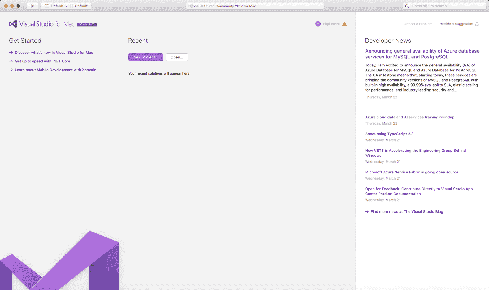

Visual Studio

1.  单击“新建项目”按钮。

1.  在“**为您的项目选择模板**”对话框中，向下滚动直到到达其他部分。

1.  选择“杂项”，然后在“通用”下选择“空白解决方案”：

**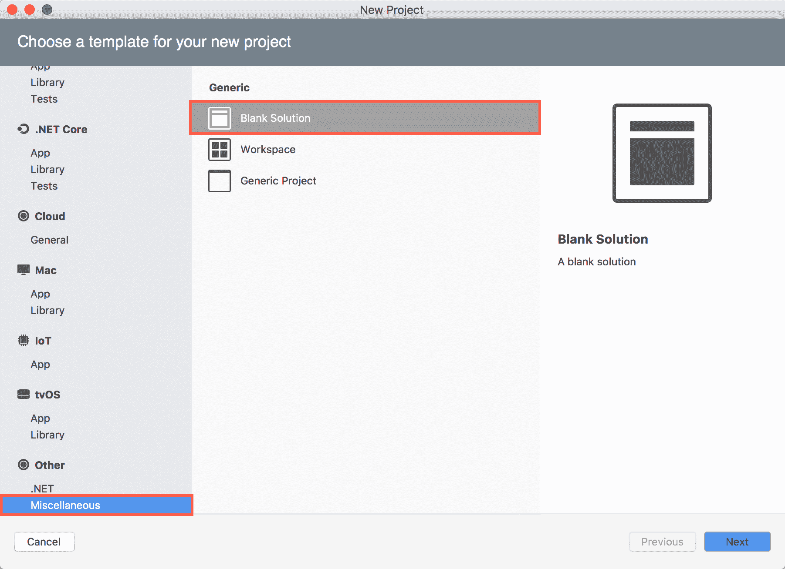**

1.  现在，单击“下一步”按钮。

1.  在“解决方案名称：”文本框中键入`Chapter9.Xamarin`。同时确保您已选择合适的位置：

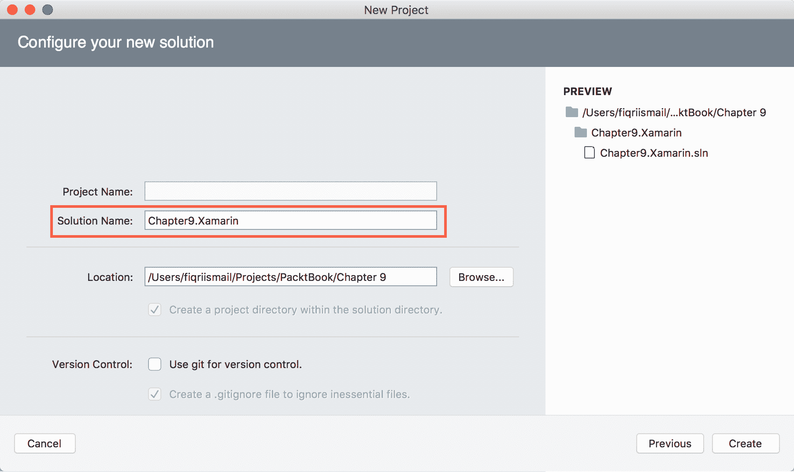

1.  现在，单击“创建”。

1.  现在，解决方案资源管理器应如下所示：

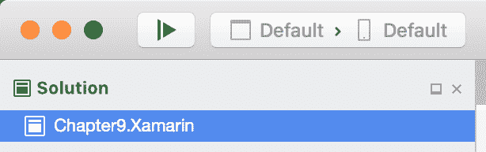

1.  现在，在`Chapter9.Xamarin`标签上*control (^)*+单击，然后选择“添加”|“新建项目”。

1.  在左侧窗格的 Android 部分下选择“应用程序”。在右侧窗格中选择“Android 应用程序”。

1.  确保已选择 C#作为编程语言：

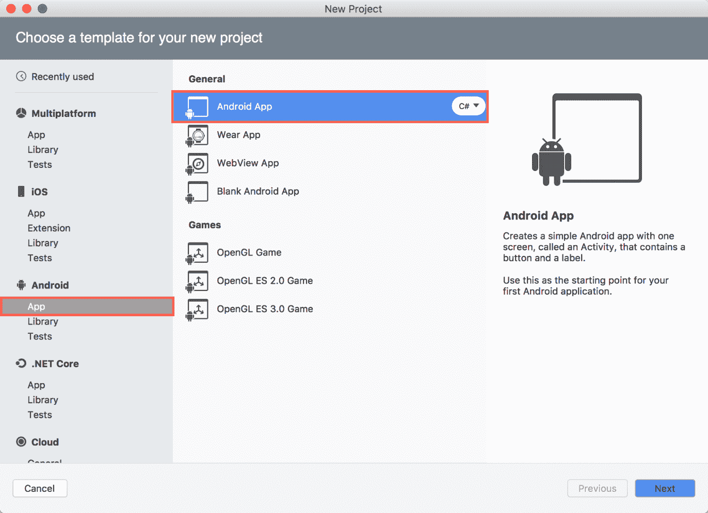

1.  单击“下一步”。

1.  现在，在“应用程序名称：”文本框中，键入 `Chapter9.Xamarin.AndroidApp`，在“组织标识符：”文本框中，键入 `com.chapter9`。其余的保持不变：

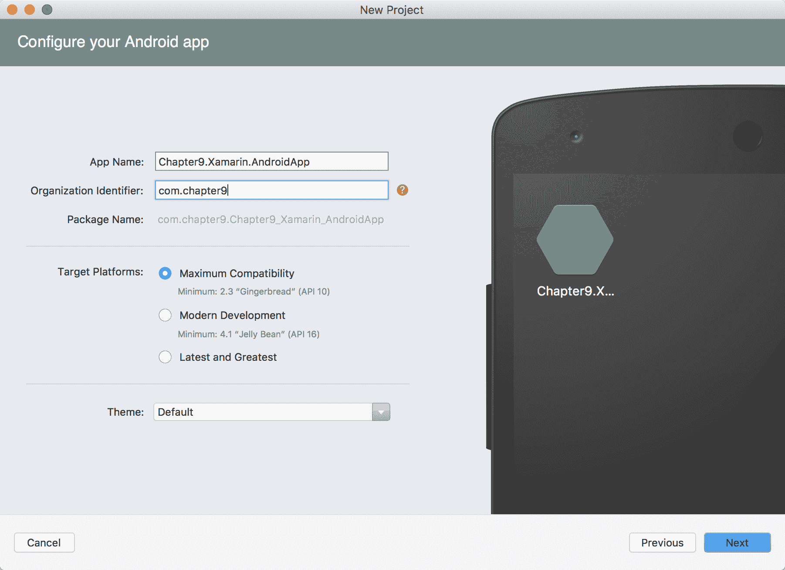

1.  单击下一步。

1.  保持一切不变并单击创建：

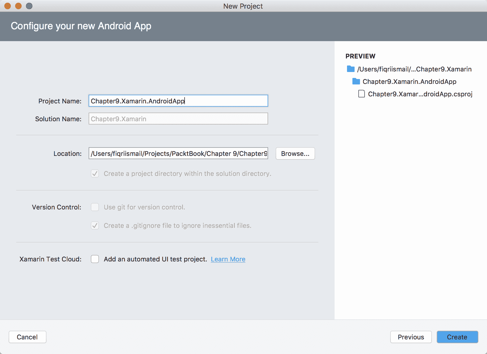

1.  现在，解决方案资源管理器应该看起来像这样：

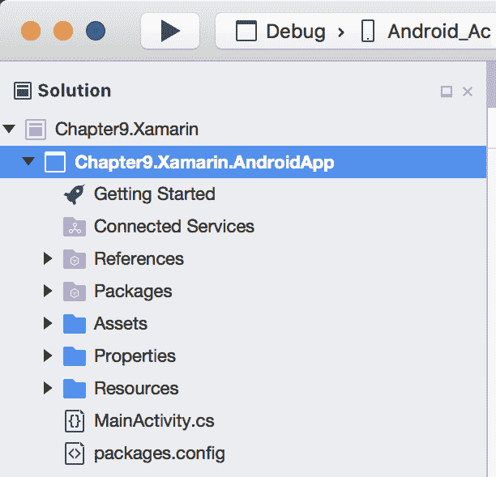

1.  现在，你应该看到默认模板已经有一个工作中的应用程序。

1.  按下 *command* + *return* 键来调试应用程序。

1.  现在，你应该在模拟器中看到默认的 `HelloWorld` 应用程序正在运行：

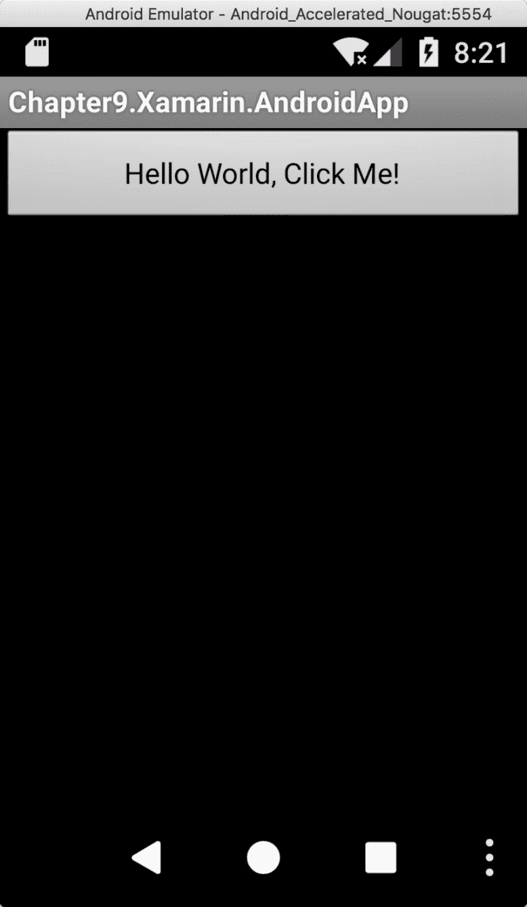

1.  点击按钮以查看其动作。按 *shift* + *command* + *return* 停止调试。

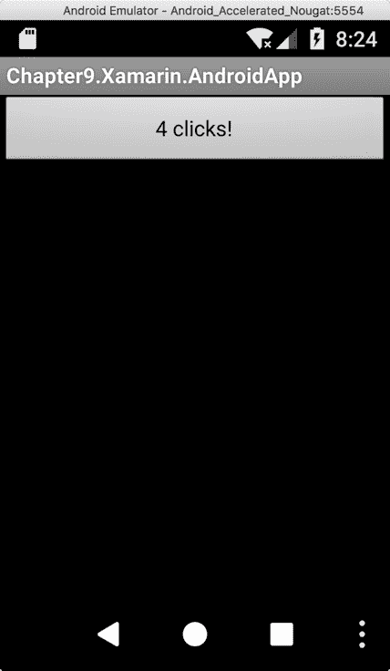

# 它是如何工作的...

在步骤 1 到 10 中，我们创建了一个空白解决方案并给它起了个合适的名字。在步骤 10 中，我们向该解决方案添加了一个 Android App 项目。Android App 项目是由 Visual Studio for Mac 创建的默认模板。这是一个用于测试所有内容是否完整的原型应用程序。

如果你查看解决方案资源管理器并单击 `MainActivity.cs` 文件，你会看到所有的动作。在 `OnCreate()` 方法中，代码看起来像这样：

```cs
base.OnCreate(savedInstanceState);

// Set our view from the "main" layout resource
SetContentView(Resource.Layout.Main);

// Get our button from the layout resource,
// and attach an event to it
Button button = FindViewById<Button>(Resource.Id.myButton);

button.Click += delegate { button.Text = $"{count++} clicks!"; };
```

你可以看到一个简单的按钮。当你点击按钮时，它的增量会被计数，并且更新按钮标签。`FindViewById` 会定位按钮并创建一个 `Button` 类。最后，`button.Click` 事件触发计数过程并将其存储在按钮标题中。

# 将 .NET Standard 2.0 库添加到 Xamarin 项目

在这个菜谱中，我们将查看创建一个 .NET Standard 2.0 库并将默认的计数代码移动到库中。计数代码是由 Visual Studio for Mac 为 Android 应用程序创建的默认模板。

# 准备工作

确保你已经完成了创建默认 Android 应用程序的上一道菜谱。如果你已经完成了，让我们打开那个解决方案并开始吧。

# 如何操作...

1.  打开 Finder。

1.  在左侧窗格中单击“应用程序”。

1.  现在，双击 Visual Studio 图标。

1.  单击“打开”，定位 `Chapter9.Xamarin` 解决方案，并打开它。

1.  解决方案资源管理器应该看起来像这样：

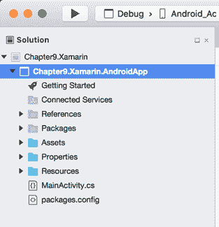

1.  现在，按住 *control (^)* + 点击 `Chapter9.Xamarin` 标签并选择添加 | 新项目。

1.  在“新建项目”对话框中，将左侧窗格向下滚动，直到看到“多平台”部分。

1.  点击“库”并在右侧窗格的“常规”下选择 .NET Standard 库。同时确保已选择 C#：

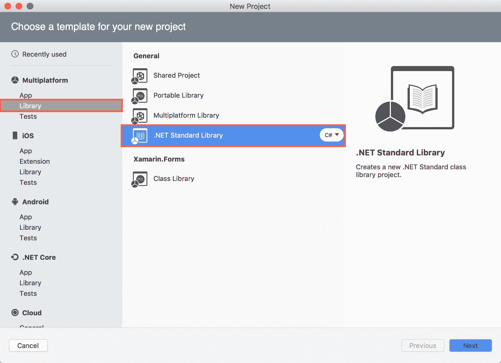

1.  单击下一步。

1.  选择目标框架：为 .NET Standard 2.0 并单击下一步：

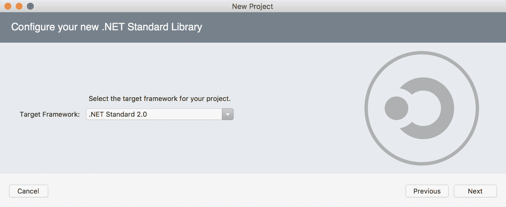

1.  在“项目名称：”文本框中，键入 `Chapter9.Xamarin.AndroidLib` 作为名称，其余的保持不变：

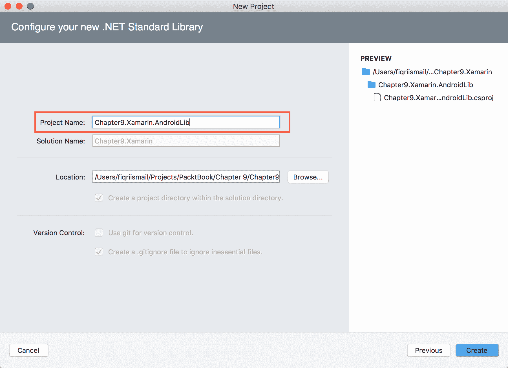

1.  单击创建。

1.  现在，解决方案资源管理器应该看起来像这样：

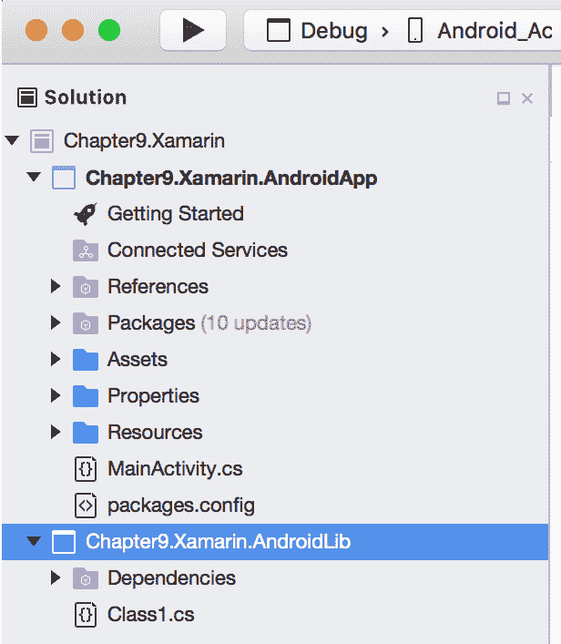

1.  现在，选择`Class1.cs`标签并按 *command* + *R* 来重命名。

1.  将其重命名为`CounterLib.cs`。

1.  确保您还将类名从`Class1`更改为`CounterLib`。

1.  现在，在`CounterLib`类内部添加以下代码：

```cs
      public int IncrementByOne(int value)
      {
          return value++;
      }
```

1.  点击构建 | 构建全部以检查所有语法是否正确。

# 它是如何工作的...

在步骤 1 到 4 中，我们打开了之前菜谱中创建的解决方案。在步骤 6 到 12 中，我们将.NET Standard 2.0 库添加到解决方案中。现在，解决方案有两个项目：一个 Android 项目和.NET Standard 2.0 库项目。在步骤 14 到 16 中，我们重命名了在 Visual Studio 中创建的类。我们还重命名了实际的类名以匹配文件名。

在步骤 17 中，我们添加了一个公共方法，该方法接受一个`整数`参数，并返回一个比提供的值增加 1 的整数值。最后，我们进行了快速构建以检查语法是否正确。

# 将事物组合在一起并测试应用程序

在这个菜谱中，我们将把所有东西组合在一起并测试最终的应用程序。我们将从 Android 应用程序中引用.NET Standard 2.0 库并使用 Android 应用程序中的库。

# 准备工作

确保您已经完成了构建.NET Standard 2.0 库的先前菜谱。如果您已经完成，请打开解决方案并开始此应用程序。

# 如何做...

1.  打开 Finder。

1.  在左侧窗格中点击“应用程序”。

1.  现在，双击 Visual Studio 图标。

1.  点击“打开”，定位到`Chapter9.Xamarin`解决方案，并打开它。

1.  解决方案资源管理器应该看起来像这样：


1.  现在，展开`Chapter9.Xamarin.AndroidApp`项目节点。

1.  在解决方案资源管理器中，*控制 (^)* + 点击“引用”标签并选择“编辑引用”。

1.  在“编辑引用”对话框中，点击“项目”选项卡。

1.  在列表中检查`Chapter9.Xamarin.AndroidLib`并点击“确定”：

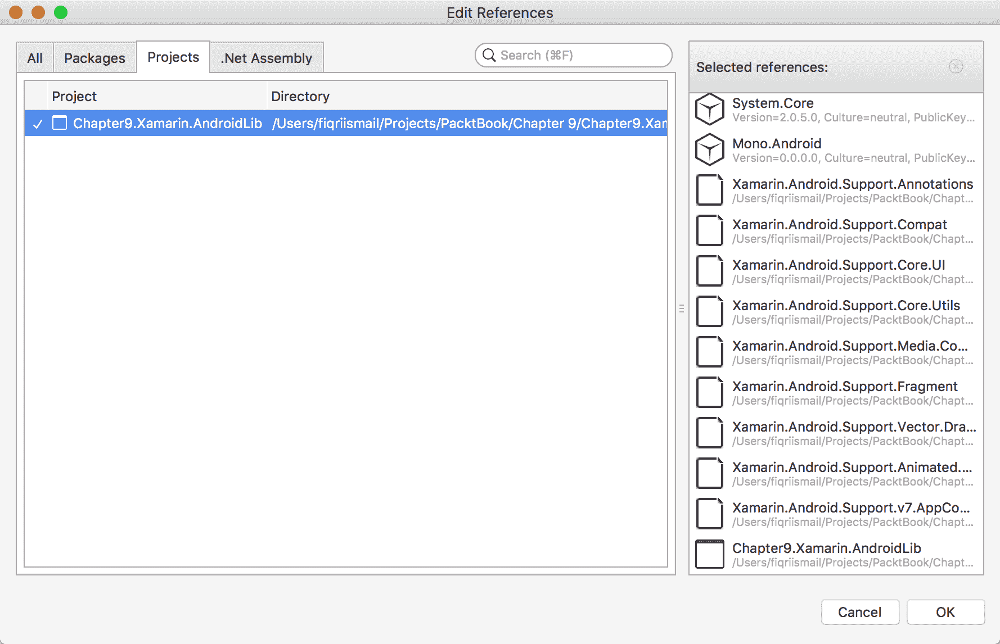

1.  向上滚动直到到达`using`指令，并添加以下`using`指令以访问库：

```cs
      using Chapter9.Xamarin.AndroidLib;
```

1.  现在，双击 MainActivity.cs 文件以打开其代码。

1.  在`MainActivity`类下，找到以下代码：

```cs
      int count = 1; 
```

用以下代码替换之前的代码：

```cs
      int count = 0;
```

1.  现在，向下滚动直到你到达`OnCreate()`方法。

1.  在`base.OnCreate()`行旁边添加以下代码：

```cs
      CounterLib counter = new CounterLib();
```

1.  现在，将默认按钮点击代码替换为以下代码：

```cs
      button.Click += delegate { 
          count = counter.IncrementByOne(count);
          button.Text = $"{count} clicks!";
      };
```

1.  按 *command* + *return* 来调试应用程序。

1.  点击按钮几次，你应该会看到以下输出：

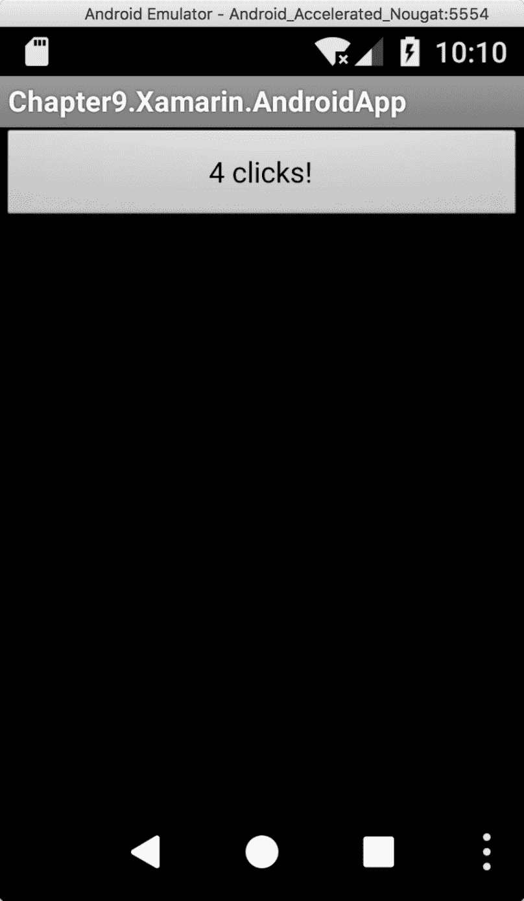

1.  按 *shift* + c*ommand* + *return* 来停止调试。

# 它是如何工作的...

在步骤 1 到 6 中，我们打开了之前在先前的菜谱中创建的现有解决方案。在步骤 9 中，我们从 Android 应用程序中添加了对库的引用。在步骤 10 中，我们添加了对库的代码级别引用。这将使我们能够获取库中所有可用的方法。在步骤 12 中，我们修改了现有的代码。在步骤 14 中，我们创建了一个`CounterLib()`实例并将其存储在一个变量中。

在步骤 15 中，我们又对按钮现有的点击代码进行了一小改动，以使用类库中的`IncrementByOne()`方法。最后，在步骤 16、17 和 18 中，我们测试了我们的新代码。
