# 第十章：让我们调整我们的库

在本章中，我们将探讨以下食谱：

+   记录库

+   创建一个.NET Core 控制台应用程序以使用库

+   通知最终用户 - 异常处理和错误消息

+   使用 Visual Studio 2017 的诊断和调试工具

# 技术要求

读者应具备 C#的基本知识。他们还应具备使用 Visual Studio、使用 NuGet 安装包以及在其他项目中引用库的基本知识。

本章的代码文件可以在 GitHub 上找到：

[`github.com/PacktPublishing/DotNET-Standard-2-Cookbook/tree/master/Chapter10/Chapter10.Logging`](https://github.com/PacktPublishing/DotNET-Standard-2-Cookbook/tree/master/Chapter10/Chapter10.Logging)

查看以下视频以查看代码的实际效果：

[`goo.gl/HNVQMh`](https://goo.gl/HNVQMh)

# 简介

在本章中，我们将探讨如何调整我们的.NET Standard 2.0 库，如何创建日志，以及如何使用 Visual Studio 2017 中可用的调试工具。我们还将探讨异常处理。在前面的章节中，我们一直在探讨如何构建库及其利用。在本章中，我们将使该库变得更好、更稳固。

# 库会自己记录信息

在这个食谱中，我们将使用文本日志文件来存储有关库如何与其他程序交互的详细信息。这是一个好的做法；边走边记录。然后，您将能够定位错误和其他重要事项，例如库的使用。

# 准备工作

确保您的系统上已安装最新版本的 Visual Studio 2017。让我们开始我们的食谱。

# 如何操作...

1.  打开 Visual Studio 2017。

1.  点击文件 | 新建 | 项目创建项目。

1.  在“新建项目”对话框中，展开左侧窗格中的“其他项目类型”节点，并选择 Visual Studio 解决方案。在右侧窗格中，选择空白解决方案**。**

1.  在“名称”文本框中，输入`Chapter10.Logging`，并在“位置”文本框中，从下拉框中选择路径或点击浏览...按钮定位路径：

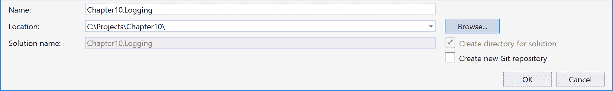

1.  点击确定。

1.  现在，解决方案资源管理器（*Ctrl* + *Alt* + *L*）应该看起来像这样：

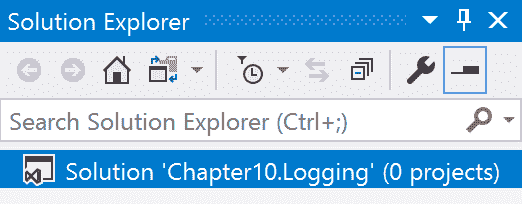

1.  现在，在解决方案资源管理器中的`Chapter10.Logging`标签上右键单击，然后选择添加 | 新项目。

1.  在“新建项目”对话框中，展开 Visual C#节点。

1.  在左侧窗格中选择.NET Standard，在右侧窗格中选择类库(.NET Standard)：

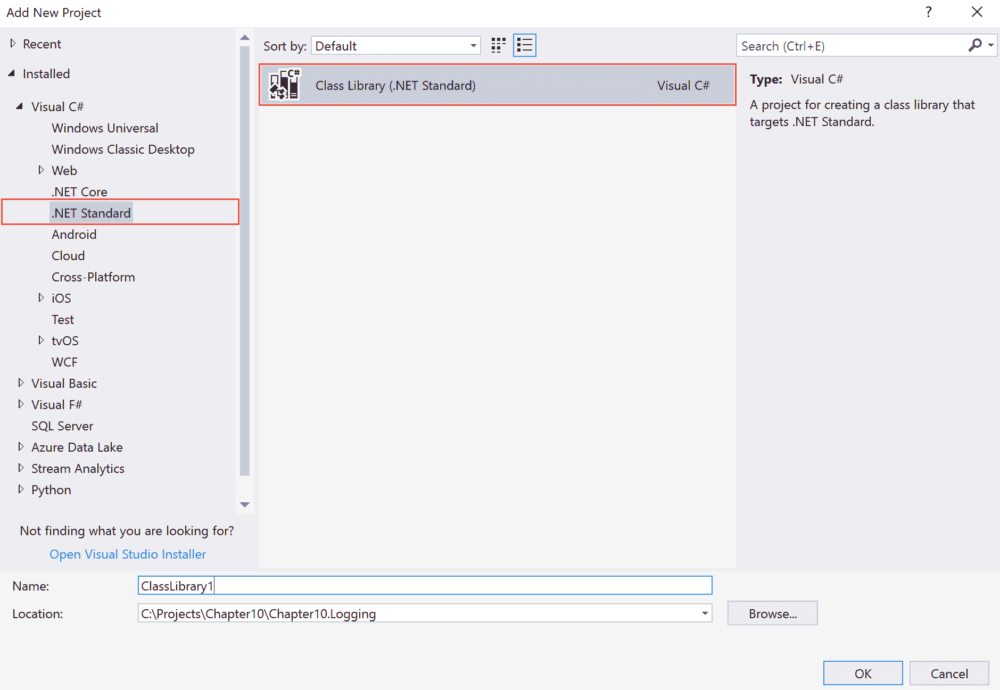

1.  在“名称”文本框中，输入`Chapter10.Logging.LogLib`，保留其他默认设置，然后点击确定：

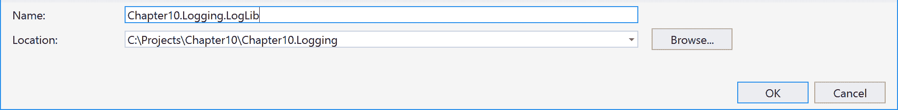

1.  现在，解决方案资源管理器（*Ctrl* + *Alt* + *L*）应该看起来像这样：

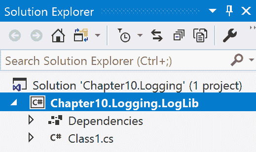

1.  现在，在解决方案资源管理器中选择`Class1.cs`，然后按*F2*重命名文件为`LoggerDemo.cs`。

1.  在询问是否重命名类名的确认对话框中回答“是”。

1.  双击解决方案资源管理器中的`LoggerDemo.cs`标签。

1.  让我们在代码窗口中向上滚动并添加以下`using`指令：

```cs
      using System.IO;
```

1.  现在，创建两个类级别变量来保存文件名和`StreamWriter`类：

```cs
      private string logFileName = "lib_log.txt";
      private StreamWriter logFile;
```

1.  现在，创建默认构造函数方法如下：

```cs
      public LoggerDemo()
      {
          WriteLog("Constructor Called.");
      }
```

1.  再次创建这个`private`方法来将日志详细信息写入文件：

```cs
      private void WriteLog(string message)
      {
          if (!File.Exists(logFileName))
          {
              logFile = File.CreateText(logFileName);
          }
          else
          {
              logFile = File.AppendText(logFileName);
          }

          logFile.WriteLine($"{DateTime.Now} Log Message: {message} ");
          logFile.Close();
      }
```

1.  创建以下这三个`public`方法：

```cs
      public void CallMethod1()
      {
          WriteLog("Method 1 Called");
      }

      public void CallMethod2()
      {
          WriteLog("Method 2 Called");
      }

      public void CallMethod3()
      {
          WriteLog("Method 3 Called");
      }
```

1.  按*Ctrl* + *Shift* + *B*构建解决方案。

# 工作原理...

在步骤 1 到 11 中，我们在解决方案中创建了一个空白解决方案并添加了一个.NET Standard 2.0 库。在这些步骤中，我们为解决方案和库分配了合适的名称。在步骤 12 和 13 中，我们将 Visual Studio 创建的现有`Class1.cs`重命名。在步骤 15 中，我们创建了一个`using`指令来访问文件操作。

在步骤 16 中，我们创建了两个`private`变量来保存文件名和`StreamWriter`类。在步骤 17 中，我们创建了默认构造函数，并调用了我们在步骤 18 中创建的`WriteLog()`方法。在步骤 19 中，我们创建了三个测试方法来演示日志记录。最后，在步骤 20 中，我们进行了快速构建以检查语法。

# 创建一个.NET Core 控制台应用程序来使用库

在这个配方中，我们将创建一个.NET Core 控制台应用程序来使用前面配方中的库。你还可以在 macOS 或 Linux 上尝试这个配方，因为.NET Core 是跨平台的。

# 准备工作

确保你已经完成了前面的配方并且构建成功。让我们打开解决方案并做好准备。

# 如何操作...

1.  打开 Visual Studio 2017。

1.  现在，打开前面配方中的解决方案。点击 文件 | 打开 | 打开项目/解决方案，或按 *Ctrl* + *Shift* + *O*，选择`Chapter10.Logging`解决方案。

1.  按*Ctrl* + *Shift* + *B*进行快速构建以检查一切是否正常。

1.  点击`Chapter10.Logging`解决方案标签。点击 文件 | 添加 | 新建项目。

1.  在 添加新项目 模板对话框中，展开左侧窗格中的 Visual C#节点。

1.  选择 .NET Core 并在右侧窗格中选择 控制台应用程序 (.NET Core)：

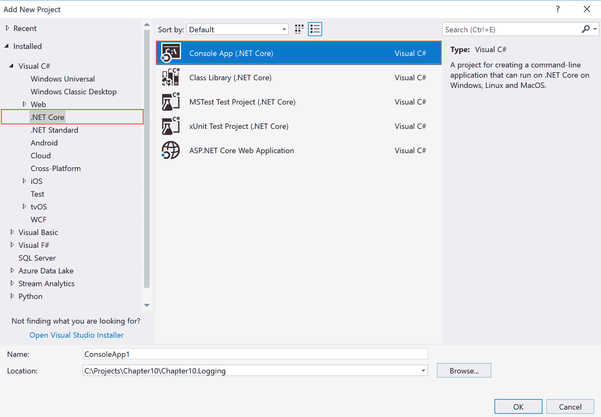

1.  在名称：文本框中，将项目名称输入为`Chapter10.Logging.LogCore`。其余字段可以保持不变：

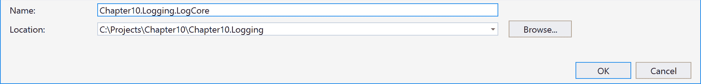

1.  点击“确定”。

1.  现在，解决方案资源管理器（按*Ctrl* + *Alt* + *L*）应该看起来像这样：

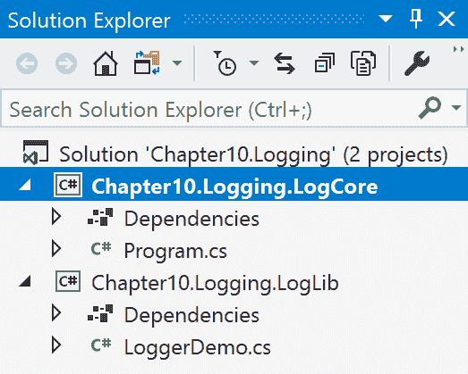

1.  右键单击`Chapter10.Logging.LogCore`下的依赖项标签。

1.  选择添加引用。

1.  在引用管理器中，点击右侧窗格中的项目标签：

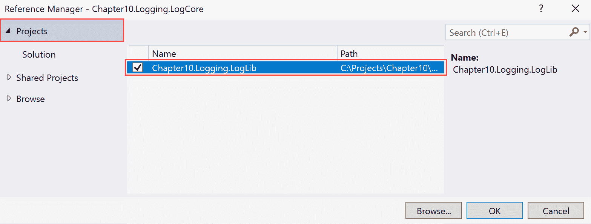

1.  在左侧窗格中检查`Chapter10.Logging.LogLib`项目。

1.  点击“确定”。

1.  现在，双击解决方案资源管理器中的`Program.cs`标签。

1.  滚动直到看到`using`指令。

1.  在`using`指令的最后一行旁边添加以下引用：

```cs
      using Chapter10.Logging.LogLib;
```

1.  现在，将`Main()`方法中的现有代码替换为以下代码：

```cs
      var logDemo = new LoggerDemo();

      Console.WriteLine("Executing method 1");
      logDemo.CallMethod1();

      Console.WriteLine("Executing method 2");
      logDemo.CallMethod2();

      Console.WriteLine("Executing method 3");
      logDemo.CallMethod3();

      Console.WriteLine("Press ENTER to exit.");
      Console.ReadLine();
```

1.  按*F5*键进行调试代码。

1.  你应该看到以下输出：

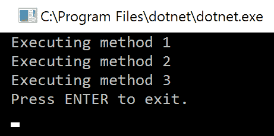

1.  按*Enter*键退出。

1.  你还会看到在`bin/Debug`文件夹中创建了一个`lib_log.txt`文件（确保你已经点击了显示所有文件）：

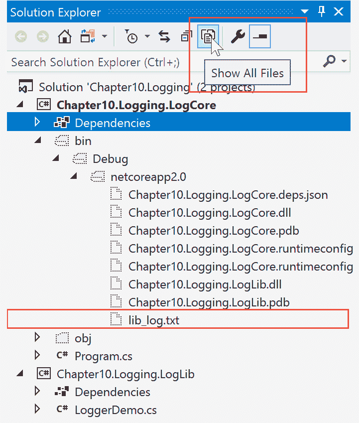

1.  `lib_log.txt`文件应该有以下输出：

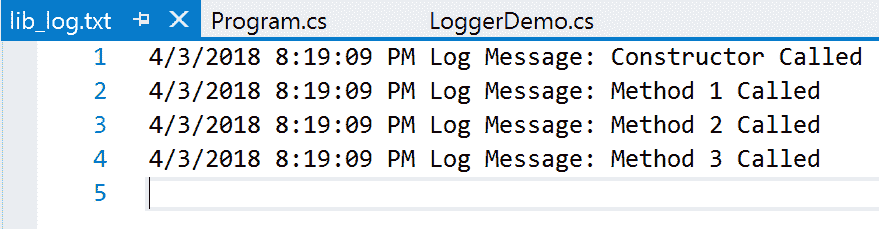

# 如何工作...

在第 1 步到第 10 步中，我们从上一个菜谱打开了解决方案并添加了一个.NET Core 控制台应用程序。在这些步骤中，我们给它起了个合适的名字。在第 17 步中，我们向库添加了代码级别的引用。在第 18 步中，我们在`Main`方法中创建了代码。在第一行，我们创建了一个`LoggerDemo`类的实例并将其存储在一个变量中。在接下来的几行中，我们执行了`public`方法`CallMethod1()`、`CallMethod2()`和`CallMethod3()`。

最后，在第 19 步和第 20 步中，我们执行了代码并进行了测试。在第 21 步和第 22 步中，我们调查了从库中创建的文本文件。

# 通知最终用户 – 异常处理和错误消息

在这个菜谱中，我们将查看.NET 类库中的异常处理。我们将重用本章第一个菜谱中创建的相同库。

# 准备工作

确保你已经完成了本章的两个菜谱。打开解决方案并快速构建以检查一切是否正常且编译良好。

# 如何做...

1.  打开 Visual Studio 2017。

1.  现在，打开上一个菜谱的解决方案。点击文件 | 打开 | 打开项目/解决方案，或者按*Ctrl* + *Shift* + *O*，然后选择`Chapter10.Logging`解决方案。

1.  按*Ctrl* + *Shift* + *B*进行快速构建以检查一切是否正常。

1.  解决方案资源管理器应该看起来像这样：

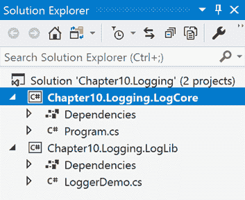

1.  现在，双击`LoggerDemo.cs`标签以打开代码窗口。

1.  滚动直到到达`WriteLog()`方法。

1.  将当前代码替换为以下代码：

```cs
      try
      {
          if (!File.Exists(logFileName))
          {
              logFile = File.CreateText(logFileName);
          }
          else
          {
              logFile = File.AppendText(logFileName);
          }

          logFile.WriteLine($"{DateTime.Now} Log Message: {message} ");
      }
      catch (FileNotFoundException)
      {
          //Cannot find the file you are looking for
      }
      catch (Exception ex)
      {
          //Catch any exception 
      }
      finally
      {
          logFile.Close(); 
      }
```

1.  现在，单击.NET Core 控制台应用程序项目并按*F5*进行测试。

# 如何工作...

在第 1 步到第 5 步中，我们打开了现有的解决方案。在第 7 步中，我们在库中的`WriteLog()`方法中添加了异常处理。在代码的第一行中，我们添加了关键字`try`**。** 在其中，我们创建了创建文本文件的代码。然后，在第一个`catch`子句中捕获了一个`FileNotFoundException`。这是一个好习惯；捕获确切的异常。如果你已经捕获了所有异常，那么你可以捕获默认的`exception`。

最后，我们使用了一个`finally`子句来关闭文件流。`finally`子句将始终在`try...catch`块中执行。在`finally`子句中包含清理代码是一个好习惯。

# 使用 Visual Studio 2017 诊断和调试工具

在这个菜谱中，我们将探讨如何使用 Visual Studio 2017 及其调试工具调试 .NET Standard 2.0 库。我们将使用之前菜谱中创建的相同解决方案。

# 准备工作

确保你已经完成了之前的菜谱，并且没有问题地构建了它们。让我们开始吧。

# 如何操作...

1.  打开 Visual Studio 2017。

1.  现在，打开之前菜谱中的解决方案。点击 文件 | 打开 | 打开项目/解决方案，或按 *Ctrl* + *Shift* + *O*，然后选择`Chapter10.Logging`解决方案。

1.  按*Ctrl* + *Shift* + *B*进行快速构建以检查一切是否正常。

1.  解决方案资源管理器应该看起来像这样：


1.  现在，双击`LoggerDemo.cs`标签以打开代码窗口。

1.  滚动直到到达`WriteLog()`方法。

1.  现在，如图所示，点击代码窗口左侧的灰色栏以添加一个调试点：

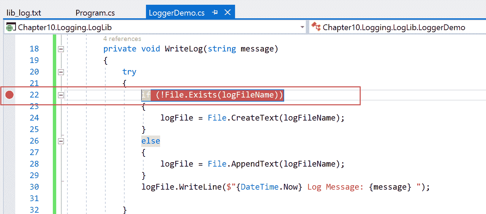

1.  再次，点击`Program.cs`标签页。

1.  按*F5*键以调试代码。

1.  如你所见，光标将停在调试点上：

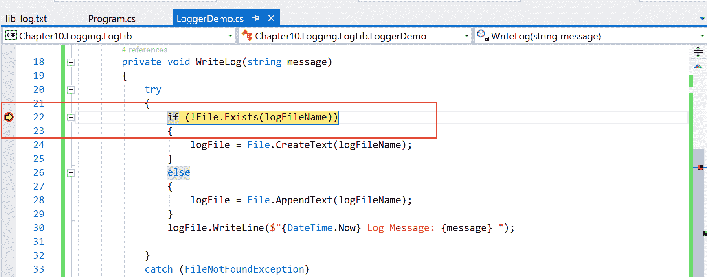

1.  现在，将鼠标指针移到`WriteLog()`方法的`message`参数上：

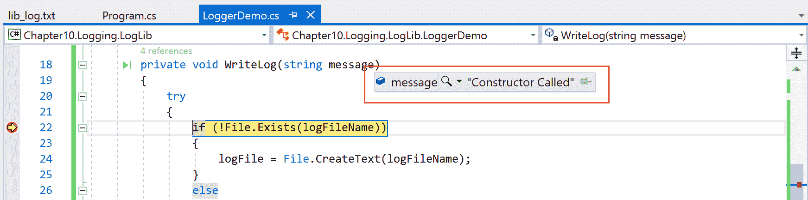

1.  现在，你可以看到那个变量里面存储的内容了。

1.  点击以下图中突出显示的小绿色箭头：

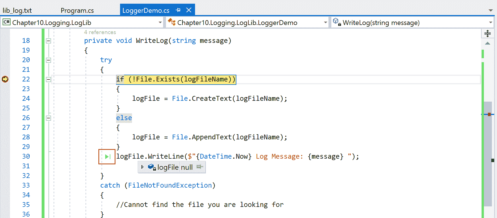

1.  你应该看到调试点跳转到了`logFile.WriteLine`方法。

1.  在屏幕的右侧，你应该能看到诊断工具窗口：

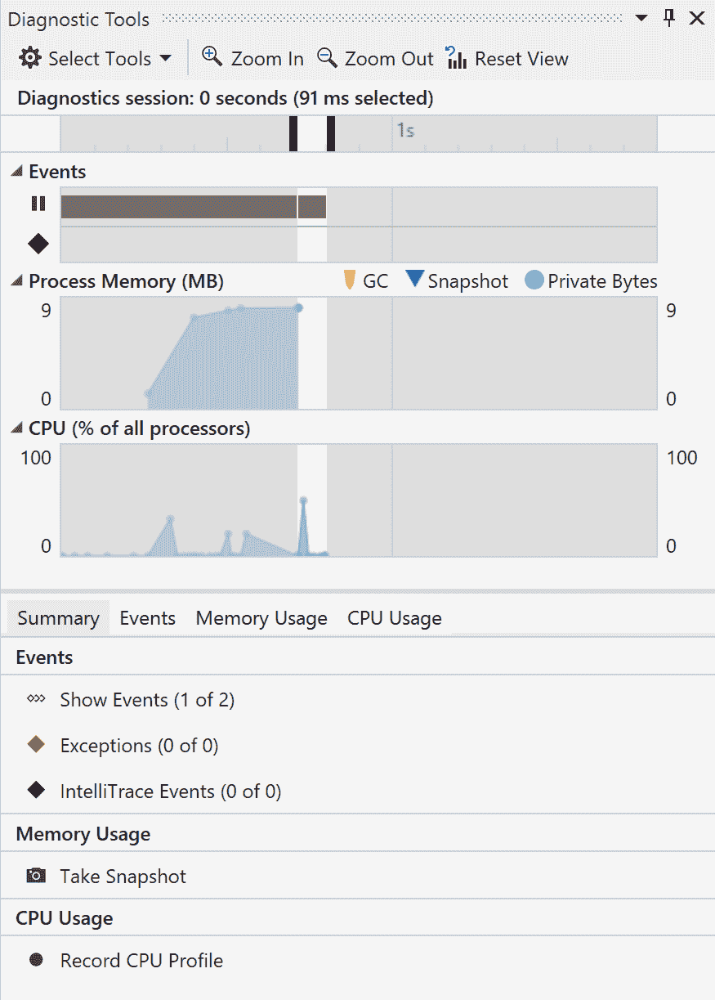

1.  此外，在底部，你应该能看到监视窗口和调用堆栈窗口：

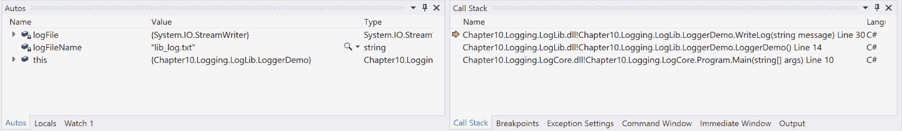

1.  现在，通过按*Shift* + *F5*停止调试。

# 它是如何工作的...

在步骤 1 到 5 中，我们打开了包含.NET Standard 库及其配套.NET Core 应用程序的现有解决方案。在步骤 10 中，我们在代码中添加了一个调试点。在步骤 11 中，我们看到它已经停止在.NET Standard 2.0 库本身上。从那时起，它就像一个正常的调试应用程序一样运行。Visual Studio 知道我们正在寻找库中的代码。

在步骤 13 中，我们将鼠标指针移到了库代码本身中的`WriteLog()`方法的`string`参数上。Visual Studio 向我们显示了该参数内的值。同样，在步骤 13 中，我们看到我们可以跳转到代码中的任何我们想要的地方。这是 Visual Studio 2017 的新特性。在步骤 15 中，我们看到了可用的诊断工具，包括事件、内存和 CPU 使用情况。这些工具帮助我们像正常的 C#代码一样微调我们的库。

最后，我们查看监视和调用堆栈窗口，它们是自我解释的。
