# 第十二章：部署

在本章中，我们将查看以下菜谱：

+   创建免费的 Azure 云订阅

+   创建一个 ASP.NET Core 网络应用程序以使用来自 NuGet 的库

+   将应用程序部署到 Azure 云

# 技术要求

读者应该具备基本的 C# 知识。他们还应该了解如何使用 Visual Studio，使用 NuGet 安装包，以及在其他项目中引用项目中的库。

本章的代码文件可以在 GitHub 上找到：

[`github.com/PacktPublishing/DotNET-Standard-2-Cookbook/tree/master/Chapter12/Chapter12.Azure.WebAppCore`](https://github.com/PacktPublishing/DotNET-Standard-2-Cookbook/tree/master/Chapter12/Chapter12.Azure.WebAppCore)

查看以下视频以查看代码的实际操作：

[`goo.gl/syvoGK`](https://goo.gl/syvoGK)

# 简介

在本章中，我们将使用我们在上一章中工作的库。在那个章节中，我们创建了一个库并将其提交到 NuGet。我们将使用相同的库与 ASP.NET core 应用程序一起部署到 Azure 并进行测试。

# 创建免费的 Azure 云订阅

在这个菜谱中，我们将为您创建一个 Azure 免费帐户。这将帮助您在 Azure 上部署应用程序。我们将使用 Visual Studio 的 Azure 工具来部署我们的项目。在撰写本书时，Microsoft 允许您创建一个价值 200 美元的免费帐户；它也免费提供一年。

# 准备工作

在开始此过程之前，请确保您有一张有效的信用卡。信用卡仅用于验证目的。

# 如何操作...

1.  打开您喜欢的浏览器。

1.  输入 `azure.microsoft.com`，然后按 *Enter*：

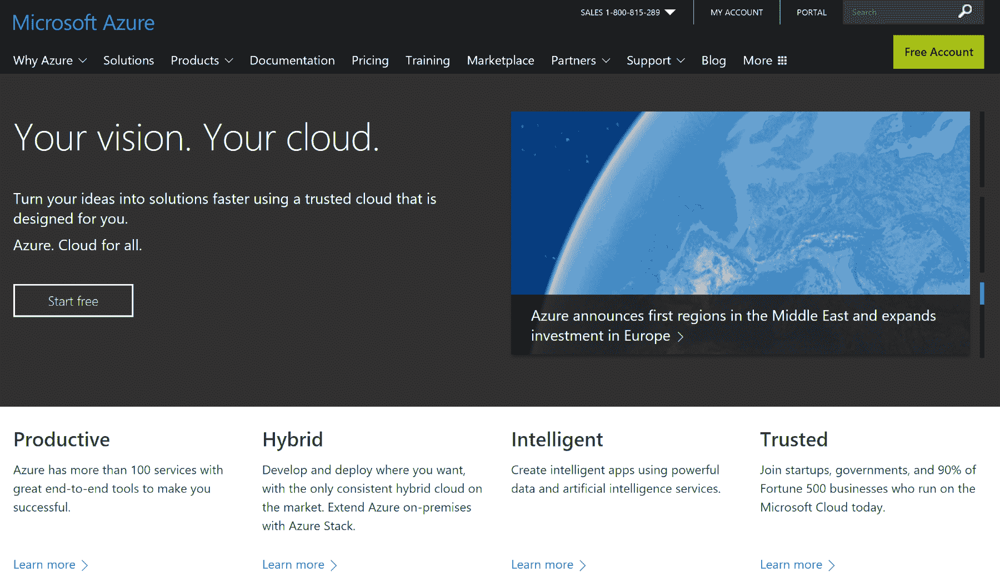

1.  现在，点击右上角的绿色“免费帐户”按钮，或点击左侧的“开始免费”按钮。

1.  之后，您将看到一个信息屏幕。

1.  再次，点击右上角的“开始免费”按钮，或点击左侧的“开始免费”按钮。

1.  然后，您将被要求使用 Microsoft 帐户或任何其他帐户登录。

1.  登录后，您将被要求提供付款信息。按照说明操作，您就可以使用新的 Azure 帐户开始了。

1.  完成所有这些后，您将看到 Azure 门户。

1.  否则，在地址栏中输入 `portal.azure.com`，然后按 *Enter*。

1.  你应该会看到 Azure 门户，并且屏幕应该类似于以下内容：

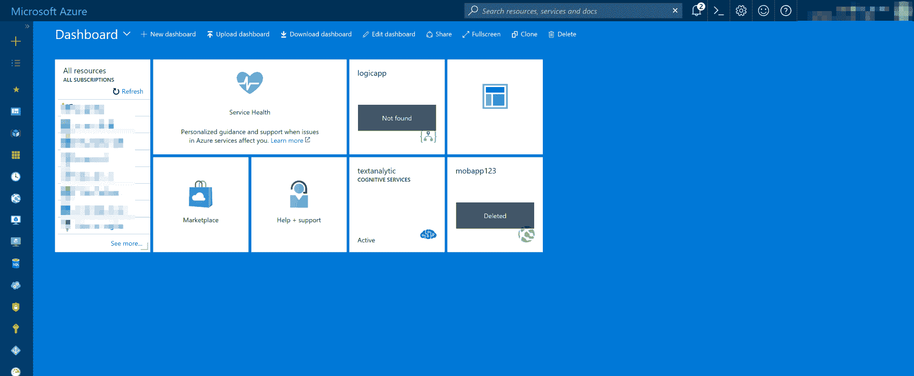

Azure 门户

# 它是如何工作的...

步骤很简单，您只需按照 Azure 门户上的说明创建新的订阅即可。

# 创建一个 ASP.NET core 网络应用程序以使用来自 NuGet 的库

在这个菜谱中，我们将创建一个 ASP.NET core 网络应用程序，然后我们将安装我们在上一章上传到 NuGet 的 .NET Standard 2.0 库。

# 准备工作

确保您已安装并更新了最新的 Visual Studio 2017 版本，并且已经完成了上一章的内容。

# 如何操作...

1.  打开 Visual Studio 2017。

1.  点击文件 | 新建 | 项目，然后在 Visual C#下的右侧窗格中选择 Web。

1.  在右侧窗格中选择 ASP.NET Core Web 应用程序：

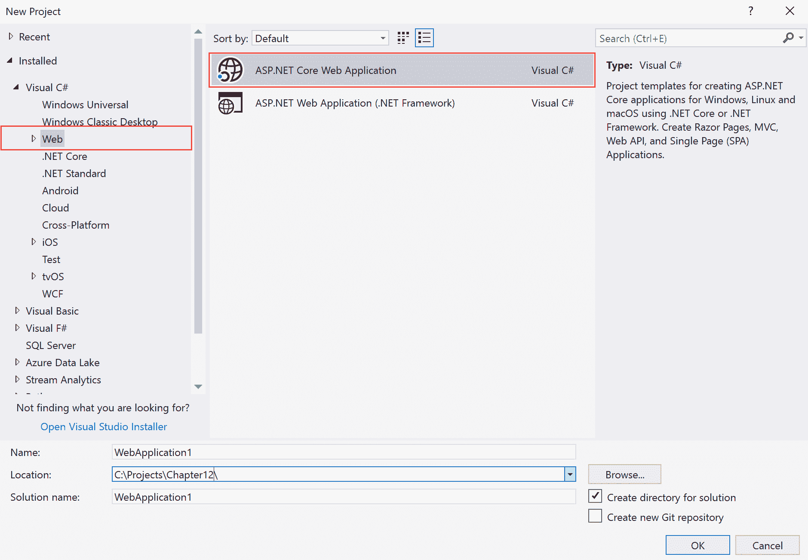

1.  现在，在名称：文本框中，输入`Chapter12.Azure.WebAppCore`，并在位置：文本框下选择一个合适的位置，其他字段保持不变：

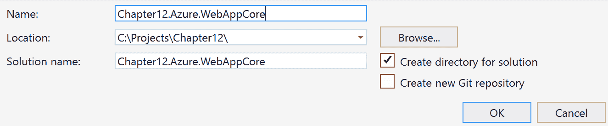

1.  点击确定。

1.  在新的 ASP.NET Core Web 应用程序对话框中，选择空，其他字段保持不变：

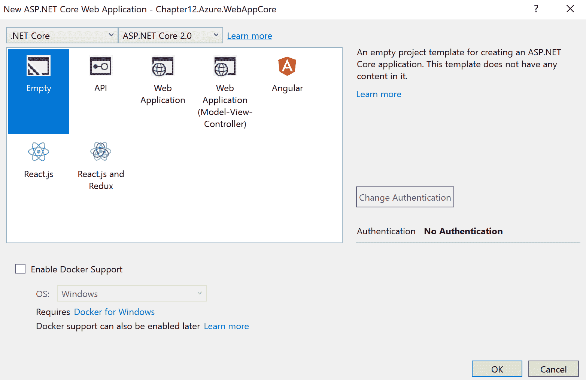

1.  点击确定。

1.  解决方案资源管理器(*Ctrl* + *Alt* + *L*)应该看起来像这样：

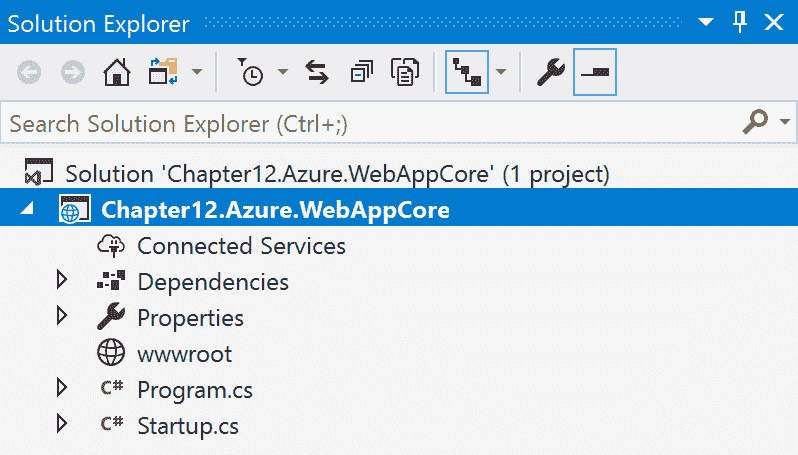

1.  现在，右键单击依赖项标签。

1.  选择`管理 NuGet 包`**。**

1.  点击浏览，并在搜索框中输入您在上传时选择的包 ID。

1.  在这种情况下，输入`Packt_DotNetStandard_CookBook_Chap1`并按*Enter*键：

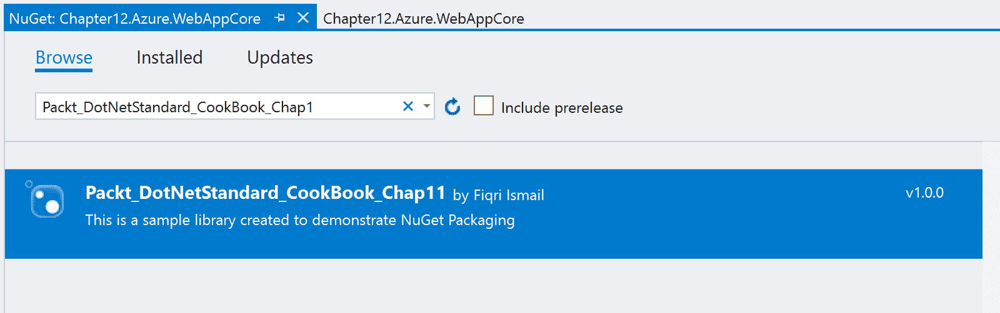

1.  现在，点击包。

1.  在右侧窗格中点击安装按钮：

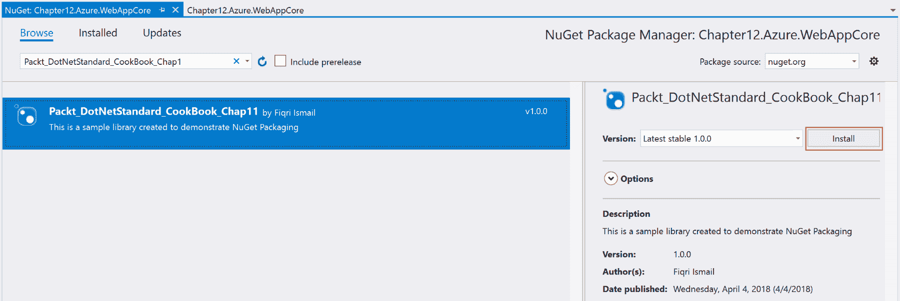

1.  在确认对话框中点击确定。

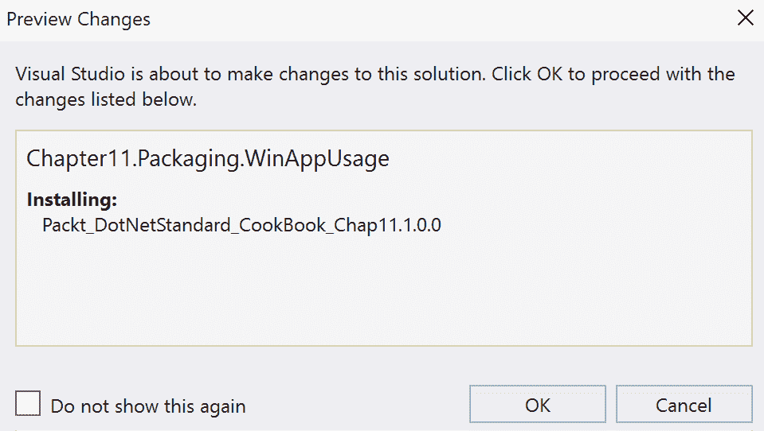

1.  安装成功后，输出窗口应该看起来像这样：

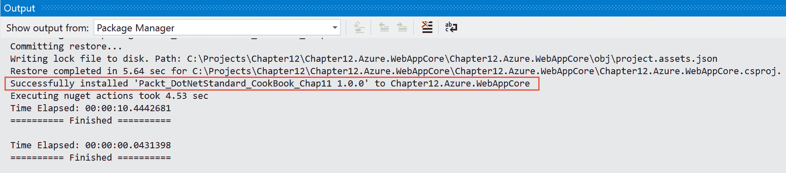

1.  现在，在解决方案资源管理器中，展开依赖项| NuGet 选项卡，你应该在那里看到我们的库：

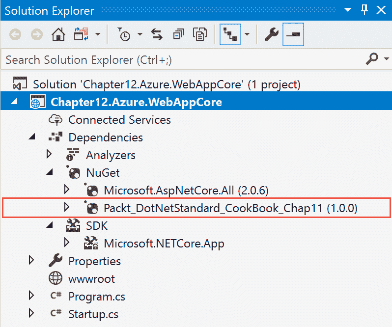

1.  现在，双击`Startup.cs`按钮以进入代码窗口。

1.  向上滚动，直到看到`using`指令。

1.  在`using`指令的末尾添加以下指令：

```cs
      using Chapter11.Packaging.CalcLib;
```

1.  现在，向下滚动，直到到达`Configure()`方法内的`app.Run()`方法。

1.  用以下代码替换：

```cs
      var calculator = new Calculator();
      var answer = calculator.Add(10, 50);

      await context.Response.WriteAsync($"Answer for 10+50 
          is {answer}");
```

1.  按*F5*进行调试。

1.  你应该得到如下输出：

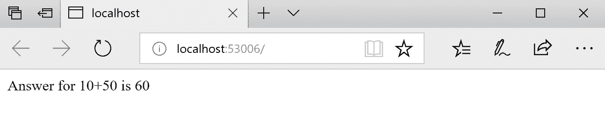

# 它是如何工作的...

在步骤 1 到 9 中，我们创建了一个 ASP.NET 核心项目。我们为这个食谱选择了一个空项目。之后，在步骤 10 到 17 中，我们安装了上一章创建的库。我们使用 NuGet 包管理器安装它，并确认库已成功安装。

在步骤 20 中，我们使用`using`指令引用了库。最后，在步骤 22 中，我们创建了一个`Calculator`类的实例并将其存储在一个变量中。最后，我们使用`WriteAsync()`方法将输出发送到浏览器。在步骤 24 中，我们在浏览器中测试了我们的应用程序。

# 将应用程序部署到 Azure 云

在本食谱中，我们将探讨如何将我们的应用程序部署到 Azure。我们将使用 Visual Studio 2017 将应用程序部署到 Azure App Service。

# 准备工作

确保您有一个 Azure 账户。如果没有，您可以在 `azure.microsoft.com` 创建一个免费账户。此外，请确保您已经完成了之前的食谱。我们将需要带有最新更新的 Visual Studio 2017。让我们开始吧。

# 如何操作...

1.  打开 Visual Studio 2017。

1.  现在，打开之前食谱中的解决方案。点击文件 | 打开 | 打开项目/解决方案，或者按 *Ctrl* + *Shift* + *O*，并选择 `Chapter12.Azure.WebAppCore` 解决方案。

1.  解决方案资源管理器 (*Ctrl* + *Alt* + *L*) 应该看起来像这样：

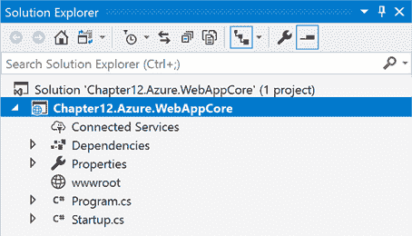

1.  现在，右键单击 `Chapter12.Azure.WebAppCore` 并选择发布。

1.  在选择发布目标窗口中，在左侧窗格中选择应用程序服务，在右侧窗格中选择创建新：

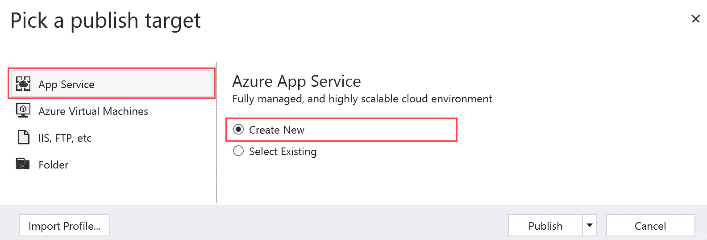

1.  点击发布。

1.  现在，在创建应用程序服务屏幕中，提供一个合适的应用程序名称，并选择资源组和托管计划：

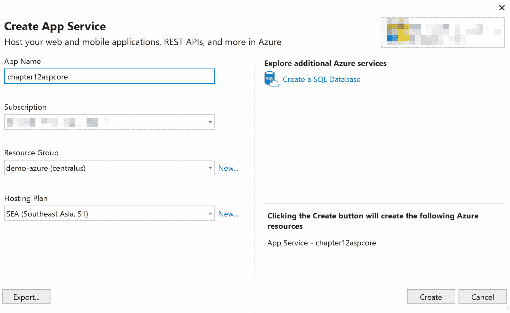

1.  点击创建。

1.  这将部署您的应用程序到 Azure。

1.  如果一切顺利，您应该在浏览器中看到这个：

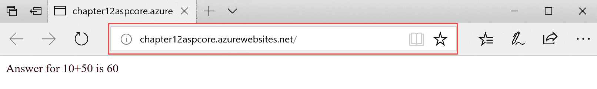

# 它是如何工作的...

在步骤 1、2 和 3 中，我们打开了之前食谱中创建的现有解决方案。我们进行了快速构建以检查任何语法错误并确认一切正常。在步骤 5 中，我们使用 Visual Studio 工具将应用程序发布到 Azure。在这种情况下，我们选择了一个新的应用程序服务。在下一屏幕的步骤 7 中，我们必须使用与您的登录绑定的 Azure 订阅。这应该是您在之前的食谱中创建的账户。您在这里可以选择一个现有的资源组，或者通过点击新建链接创建一个新的资源组。您将看到一个类似于这样的对话框：

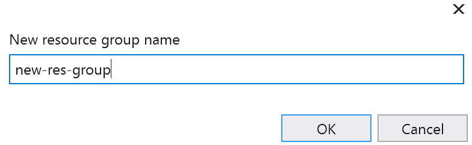

您必须为您的资源组命名并点击确定。资源组是您在 Azure 中分类资源的一种方式。再次提醒，您可以通过点击新建链接选择一个新的托管计划。再次提醒，您应该看到一个类似于这样的屏幕来选择您的新计划：

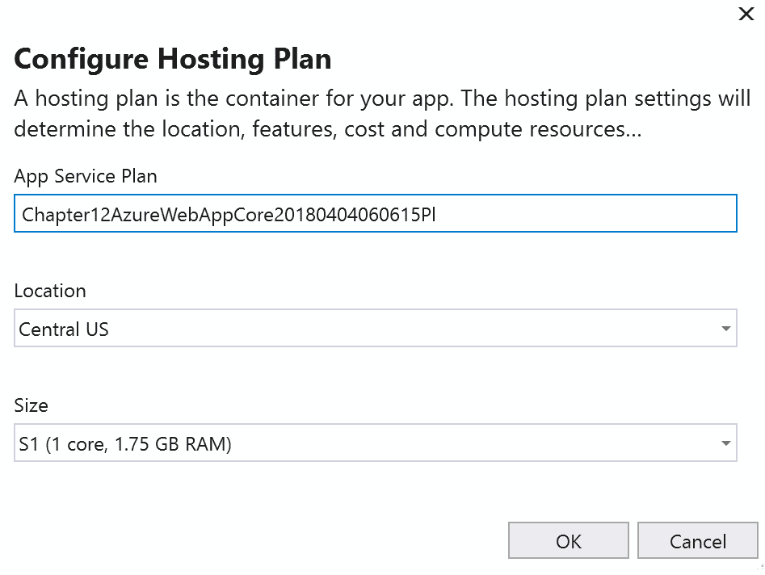

位置和大小下拉列表提供了不同的选项供您选择。位置将帮助您选择靠近您客户的区域。这将帮助您快速访问您的网站。此外，大小将告诉您将为这个应用程序服务使用什么处理器和 RAM。最后，您点击创建按钮，Visual Studio 将负责整个过程。这包括将您的文件上传到 Azure、打开浏览器并显示最终结果。在 Azure 门户中，您的应用程序服务应该像这样出现在列表中：

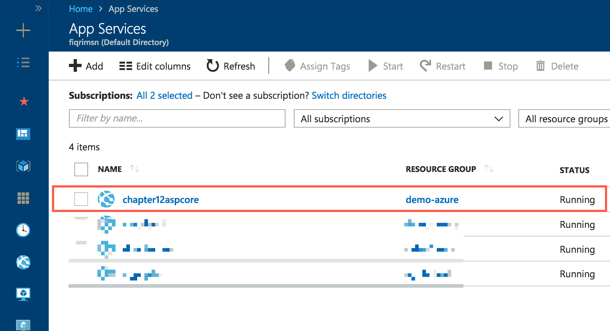

如您所见，Visual Studio 已经为您完成了所有艰苦的工作。
