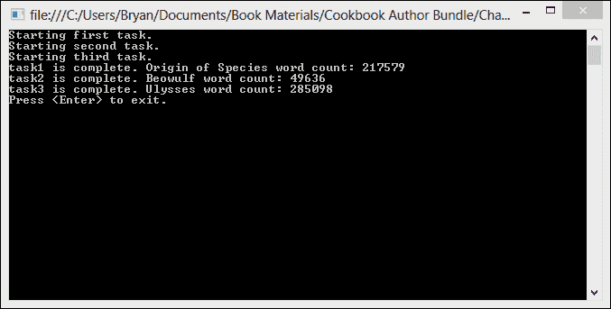
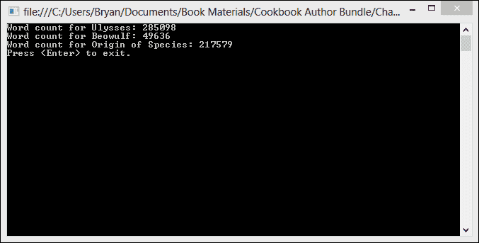

# 第一章. 使用任务并行库入门

在本章中，我们将介绍以下食谱：

+   创建任务

+   等待任务完成

+   从任务返回结果

+   向任务传递数据

+   创建子任务

+   懒任务执行

+   使用 try/catch 块处理任务异常

+   使用 AggregateException.Handle 处理任务异常

+   取消任务

+   取消多个任务中的一个

# 简介

在个人计算机时代的初期，操作系统并没有提供多线程的概念。通常，操作系统代码和应用程序代码都在单个执行线程上运行。这个问题在于，如果单个应用程序行为不当，或者简单地执行时间过长，整个机器就会停滞，并且通常需要重新启动。

随着 Windows 操作系统的不断发展，微软意识到他们需要改善这种情况。在 Windows NT 内核中，每个应用程序都在自己的进程中运行。进程是一组资源，为每个应用程序分配一个虚拟地址空间。这些进程的出现确保了被一个应用程序使用的代码和数据不能被另一个应用程序访问和损坏，从而提高了系统的可靠性。

Windows 中的每个进程也都有自己的线程。线程是操作系统的一个构造，其功能类似于虚拟 CPU。在任何给定时刻，这些线程中的一个可以在物理 CPU 上运行一段时间。当一个线程的运行时间结束时，它会被切换出 CPU，以便另一个线程运行。因此，如果单个线程进入无限循环，它不能垄断系统上的所有 CPU 时间。在其时间片结束时，它将被切换到另一个线程。

几年来，多处理器的计算机开始出现。这些多处理器机器能够同时执行多个线程。这使得应用程序能够异步地生成新线程来运行计算密集型进程，从而获得性能提升。

在过去几年中，处理器发展的趋势已经从制造越来越快的处理器，转变为在单个物理处理器芯片上制造具有多个 CPU 核心的处理器。购买这些新机器的个人期望他们的投资能够通过能够高效运行在可用处理器核心上的应用程序来实现回报。最大化下一代多核处理器提供的计算资源利用率需要改变编写代码的方式。

.NET 框架从一开始就支持编写多线程应用程序，但实现这一点的复杂性对于许多 .NET 开发者来说仍然遥不可及。要充分利用多线程，你需要相当了解 Windows 内部的工作原理。首先，你必须创建和管理自己的线程，随着应用程序中线程数量的增加，这可能是一项繁重的任务，并且往往是难以发现的错误来源。

最后，帮助终于来了。从 .NET 4.0 开始，Microsoft 引入了 .NET 并行扩展，为我们提供了一个新的运行时、新的类库类型（**任务并行库**（**TPL**））以及新的诊断工具，以帮助解决并行编程固有的复杂性。

TPL 不仅仅是一系列新类型。它是一种全新的并行编程思考方式。我们不再需要从线程的角度思考。使用 TPL，我们现在可以以 `task` 为单位思考。在这个新的基于任务的模型中，我们只需要确定应用程序中可以并发执行的部分，并将这些部分转换为任务。运行时将负责管理和创建所有实际执行工作的底层线程。`System.Threading.Task` 类本身只是一个传递委托的包装器，委托是一种数据结构，它引用一个 `static` 方法或类实例及其该类的一个实例方法。

TPL 的 `task` 仍然在内部使用经典的线程池，但启动新线程以执行 `tasks` 和确定充分利用硬件所需的最佳线程数量等繁重工作都由运行时处理。

在本章中，我们将探讨创建并行 `task` 的基础知识。你将学习如何使用 `Task` 状态对象将数据传递给 `Task`，从 `Task` 返回数据，取消 `Task`，以及在 `Task` 内部处理异常。

# 创建任务

`Tasks` 是 .NET 框架中的一种抽象，用于表示异步工作单元。在某种程度上，任务类似于经典 .NET 线程的创建，但提供了更高层次的抽象，这使得你的代码更容易编写和阅读。

我们将探讨创建和运行新任务的三种基本方法。

+   `Parallel.Invoke()` 方法：此方法提供了一种简单的方式来运行任意数量的并发语句

+   `Task.Start()` 方法：此方法启动一个任务，并使用 `TaskScheduler` 对其进行执行调度

+   `Task.Factory.StartNew()` 方法：此方法使用 `Task.Factory` 创建并启动一个任务

在这个菜谱中，我们将使用这三种方法中的每一种来创建一个新的任务。为了使我们的任务有所作为，我们将使用 `WebClient` 来读取三本经典书籍的文本。然后我们将每本书的单词拆分到一个字符串数组中，并显示每本书中的单词计数。

## 如何做到这一点...

好的，让我们开始构建一个 `Console` 应用程序，演示创建并行任务的多种方式。

1.  启动 Visual Studio 2012。

1.  使用 C# **控制台应用程序** 项目模板创建一个新的项目，并将 `SimpleTasks` 作为 **解决方案名称**，如图所示：

1.  在 `Program` 类的顶部添加以下 `using` 语句：

    ```cs
    using System;
    using System.Linq;
    using System.Net;
    using System.Threading.Tasks;
    ```

    ### 小贴士

    **下载示例代码**

    你可以从你购买的所有 Packt 书籍的账户中下载你购买的所有示例代码文件。[`www.packtpub.com`](http://www.packtpub.com)。如果你在其他地方购买了这本书，你可以访问 [`www.packtpub.com/support`](http://www.packtpub.com/support) 并注册以将文件直接通过电子邮件发送给你。

1.  首先，让我们使用 `Parallel.Invoke` 创建一个任务。将以下代码添加到 `Program` 类的 `Main` 方法中：

    ```cs
    char[] delimiters = { ' ', ',', '.', ';', ':', '-', '_', '/', '\u000A' };
    const string headerText = "Mozilla/5.0 (compatible; MSIE 10.0; Windows NT 6.1; Trident/6.0)";

    Parallel.Invoke(() =>
        {
        Console.WriteLine("Starting first task using Parallel.Invoke");
        var client = new WebClient();
        client.Headers.Add("user-agent", headerText);
        var words =client.DownloadString(@"http://www.gutenberg.org/files/2009/2009.txt");
        var wordArray = words.Split(delimiters, StringSplitOptions.RemoveEmptyEntries);
        Console.WriteLine("Origin of Species word count: {0}", wordArray.Count());
        client.Dispose();
        }
    );
    ```

1.  接下来，让我们使用 `Task` 对象的 `Start` 方法启动 `task`。将以下代码添加到 `Program` 类的 `Main` 方法中，位于上一步代码的下方：

    ```cs
    var secondTask = new Task(() =>
        {
        Console.WriteLine("Starting second task using Task.Start");
        var client = new WebClient();
        client.Headers.Add("user-agent", headerText);
        var words = client.DownloadString(@"http://www.gutenberg.org/files/16328/16328-8.txt");
        var wordArray = words.Split(delimiters, StringSplitOptions.RemoveEmptyEntries);
        Console.WriteLine("Beowulf word count: {0}", wordArray.Count());
        client.Dispose();
        } 
      );
    secondTask.Start();
    ```

1.  最后，让我们使用 `Task.Factory.StartNew` 创建 `task`。将以下代码添加到 `Program` 类的 `Main` 方法中：

    ```cs
    Task.Factory.StartNew(() =>
        {
        Console.WriteLine("Starting third task using Task.Factory.StartNew");
        var client = new WebClient();
        client.Headers.Add("user-agent", headerText);
        var words = client.DownloadString(@"http://www.gutenberg.org/files/4300/4300.txt");
        var wordArray = words.Split(delimiters, StringSplitOptions.RemoveEmptyEntries);
        Console.WriteLine("Ulysses word count: {0}", wordArray.Count());
        client.Dispose();
        }
    );
    //wait for Enter key to exit
    Console.ReadLine();
    ```

1.  在 Visual Studio 2012 中，按 *F5* 运行项目。你应该会看到类似于以下截图的输出。请注意，你看到的文本的确切顺序可能会因 `tasks` 的异步运行而有所不同：

## 工作原理…

`Parallel.Invoke` 方法可以通过为要执行的工作的每个委托传递一个动作委托来隐式创建和运行任意数量的语句并发执行。

```cs
Parallel.Invoke(( )=>DoSomething( ), ( )=>DoSomethingElse( ));
```

然而，值得注意的是，`Parallel.Invoke` 实际创建的 `tasks` 的数量可能与传入的委托数量相等或不相等，特别是如果有大量委托。

使用 `Task.Start()` 或 `Task.Factory.StartNew()` 可以显式创建新任务。新的 `tasks` 将由 `ThreadPool` 类分配线程，该类负责创建 `tasks` 用于执行其工作的实际线程。作为开发者，我们被屏蔽了所有这些线程创建的工作，因为这一切都是由 `Task` 对象为我们完成的。

当你创建一个任务时，你实际上只是在要执行的工作的委托周围创建了一个包装器。这个委托可以是一个命名的委托、匿名方法或 lambda 表达式。

那么，创建 `task` 的这些方法中哪一个是最好的？`Task.Factory.StartNew` 通常被认为是首选方法，因为它在同步成本方面更高效。使用 `Thread.Start` 时会消耗一些同步成本，因为必须确保没有其他线程同时调用同一 `Task` 对象的启动。当使用 `Task.Factory.StartNew` 时，我们知道任务已经在 `task` 引用返回到我们的代码之前被调度了。

注意，你无法在已经运行并完成的任务上调用`Start()`。如果你需要任务再次执行工作，你需要创建具有相同工作代理的新`task`。

在本书的剩余部分，我们将主要使用`Task.Factory.StartNew`。

# 等待任务完成

在开发并行应用程序时，你经常会遇到必须先完成任务，主线程才能继续处理的情况。任务并行库包括几个方法，允许你等待一个或多个并行`task`完成。这个菜谱将涵盖两种这样的方法：`Task.Wait()`和`Task.WaitAll()`。

在这个菜谱中，我们将创建三个任务，所有这些任务都是读取经典书籍的文本并生成`单词计数`。在创建第一个任务后，我们将使用`Task.Wait()`等待它完成，然后再开始第二个和第三个任务。然后，我们将使用`Task.WaitAll()`等待第二个和第三个任务完成，然后再向控制台发送消息。

## 如何做…

让我们创建一个`Console`应用程序，演示如何等待`task`完成。

1.  启动 Visual Studio 2012。

1.  使用 C# **控制台应用程序**项目模板启动一个新项目，并将`WordCount`作为**解决方案名称**。

1.  在你的`Program`类的顶部添加以下`using`语句：

    ```cs
    using System;
    using System.Linq;
    using System.Net;
    using System.Threading.Tasks;
    ```

1.  在`Program`类的`Main`方法中，添加一个包含基本标点符号的字符数组。我们将使用这个数组在`string.Split()`中消除标点符号。还要添加一个名为`constant`的字符串，用于`WebClient`的`user-agent`头。

    ```cs
    char[] delimiters = { ' ', ',', '.', ';', ':', '-', '_', '/', '\u000A' };
    const string headerText = "Mozilla/5.0 (compatible; MSIE 10.0; Windows NT 6.1; Trident/6.0)";
    ```

1.  好的，现在让我们创建我们的第一个任务。这个任务将使用`WebClient`读取达尔文的《物种起源》，并获取其单词计数。在`Program`类的`Main`方法中，在上一条语句下方输入以下代码：

    ```cs
    var task1 = Task.Factory.StartNew(() =>
        {
        Console.WriteLine("Starting first task.");
        var client = new WebClient();
        client.Headers.Add("user-agent", headerText);
        var words = client.DownloadString(@"http://www.gutenberg.org/files/2009/2009.txt");
        var wordArray = words.Split(delimiters, StringSplitOptions.RemoveEmptyEntries);
        Console.WriteLine("Origin of Species word count: {0}", wordArray.Count());
        }
    );
    ```

1.  现在，在上一任务下方，写下以下语句以等待任务，并向`Console`应用程序发送消息：

    ```cs
    task1.Wait();
    Console.WriteLine("Task 1 complete. Creating Task 2 and Task 3.");
    ```

1.  在上一条语句下方，输入创建第二个和第三个任务的代码。这些任务与第一个任务非常相似。

    ```cs
    var task2 = Task.Factory.StartNew(() =>
    {
      Console.WriteLine("Starting second task.");
        var client = new WebClient();
        client.Headers.Add("user-agent", headerText);
        var words = client.DownloadString(@"http://www.gutenberg.org/files/16328/16328-8.txt");
        var wordArray = words.Split(delimiters, StringSplitOptions.RemoveEmptyEntries);
        Console.WriteLine("Beowulf word count: {0}", wordArray.Count());
     });

    var task3 = Task.Factory.StartNew(() =>
    {
        Console.WriteLine("Starting third task.");
        var client = new WebClient();
        client.Headers.Add("user-agent", headerText);
        var words = client.DownloadString(@"http://www.gutenberg.org/files/4300/4300.txt");
        var wordArray = words.Split(delimiters, StringSplitOptions.RemoveEmptyEntries);
        Console.WriteLine("Ulysses word count: {0}", wordArray.Count());
    });
    ```

1.  最后，让我们使用`Task.WaitAll()`等待第二个和第三个任务完成，然后提示用户退出程序。`Task.WaitAll()`接受一个`task`数组作为其参数，可以用来等待任意数量的任务完成。

    ```cs
    Task.WaitAll(task2,task3);
    Console.WriteLine("All tasks complete.");
    Console.WriteLine("Press <Enter> to exit.");
    Console.ReadLine();
    ```

1.  在 Visual Studio 2012 中，按*F5*运行项目。你应该看到类似于以下截图的输出。注意，最后几行文本的确切顺序可能仍然取决于第二个和第三个任务的执行顺序。

## 它是如何工作的…

虽然`Task.Wait()`和`Task.WaitAll()`相当直观，但它们都有几个重载，提供了不同的功能。

`Task.Wait()` 可以接受一个 `Int32` 或 `TimeSpan` 参数来指定等待的特定时间段。它还可以接受一个用于取消的 `CancellationToken` 令牌参数，这将在本章后面进行介绍。

`Task.WaitAll()` 总是将其第一个参数作为 `Task` 数组，并且有一个第二个参数，可以是 `Int32` 或 `TimeSpan`，就像 `Task.Wait` 一样。

在配方中未显示的另一个有用的方法是 `Task.WaitAny()`。`WaitAny` 与 `WaitAll` 非常相似，但它只等待数组中的 `Task` 之一完成。`Task` 数组中第一个完成的 `Task` 将完成等待条件，并允许主线程的执行继续前进。

重要的是要注意，当你调用 `Wait` 方法之一时，运行时会检查你等待的任务是否已经开始执行。如果 `task` 已经开始执行，则调用 `Wait` 的线程将阻塞，直到 `task` 执行完成。然而，如果 `task` 尚未开始运行，则运行时可能会使用调用 `Wait` 的线程来执行任务。

`Task.Wait`、`Task.WaitAll` 和 `Task.WaitAny` 的各种重载和行为如下表所示：

| `Wait()` | 等待任务完成执行。 |
| --- | --- |
| `Wait(CancellationToken)` | 等待任务完成执行或设置 `CancellationToken`。 |
| `Wait(Int32)` | 等待任务完成或经过指定毫秒数。值为 `-1` 表示无限期等待。 |
| `Wait(TimeSpan)` | 等待任务完成执行或指定的时长过去。 |
| `Wait(Int32, CancellationToken)` | 等待任务完成，经过指定毫秒数或设置 `CancellationToken`。 |
| `WaitAll(Task[])` | 等待数组中的所有任务完成执行。 |
| `WaitAll(Task[], Int32)` | 等待数组中的所有任务完成执行或经过指定毫秒数。值为 `-1` 表示无限期等待。 |
| `WaitAll(Task[], CancellationToken)` | 等待数组中的所有任务完成执行或设置 `CancellationToken`。 |
| `WaitAll(Task[], TimeSpan)` | 等待数组中的所有任务完成执行或指定的时长过去。 |
| `WaitAll(Task[], Int32, CancellationToken)` | 等待数组中的所有任务完成执行，经过指定毫秒数或设置 `CancellationToken`。 |
| `WaitAny(Task[])` | 等待数组中的任何任务完成执行。 |
| `WaitAny(Task[], Int32)` | 等待数组中的任何任务完成执行或经过指定毫秒数。值为 `-1` 表示无限期等待。 |
| `WaitAny(Task[], CancellationToken)` | 等待数组中的任何任务完成执行或设置 `CancellationToken`。 |
| `WaitAny(Task[], TimeSpan)` | 等待数组中的任何任务完成执行或指定的时长过去。 |
| `WaitAny(Task[], Int32, CancellationToken)` | 等待数组中的任何任务完成执行，等待的毫秒数，或 `CancellationToken` 被设置。 |

# 从任务返回结果

到目前为止，我们的任务还没有返回任何值。然而，通常需要从任务中返回一个结果，以便它可以在我们应用程序的另一个部分中使用。这个功能由 `Task<TResult>` 的 `Result` 属性提供。

在这个菜谱中，我们将创建一个类似于上一个解决方案的解决方案，但我们的三个任务中的每一个都会返回一个结果，然后可以使用这个结果向用户显示单词计数。

## 如何做到这一点...

让我们去 Visual Studio 看看我们如何从我们的任务中返回结果值。

1.  使用 C# **控制台应用程序** 项目模板创建一个新的项目，并将 `WordCount2` 作为 **解决方案名称**。

1.  在您的 `Program` 类顶部添加以下 `using` 语句：

    ```cs
    using System;
    using System.Linq;
    using System.Net;
    using System.Threading.Tasks;
    ```

1.  在 `Program` 类的 `Main` 方法中，添加一个包含基本标点符号的字符数组。我们将使用此数组在 `string.Split()` 中消除标点符号。还要添加一个用于 `WebClient` `user-agent` 标头的字符串常量。

    ```cs
    char[] delimiters = { ' ', ',', '.', ';', ':', '-', '_', '/', '\u000A' };
    const string headerText = "Mozilla/5.0 (compatible; MSIE 10.0; Windows NT 6.1; Trident/6.0)";  
    ```

1.  首先创建三个类型为 `Task<int>` 的任务，分别命名为 `task1`、`task2` 和 `task3`。您的任务应如下所示：

    ```cs
    Task<int> task1 = Task.Factory.StartNew(() =>
    {
        Console.WriteLine("Starting first task.");
        var client = new WebClient();
        client.Headers.Add("user-agent", headerText);
        var words = client.DownloadString(@"http://www.gutenberg.org/files/2009/2009.txt");
        var wordArray = words.Split(delimiters, StringSplitOptions.RemoveEmptyEntries);
        return wordArray.Count();
    });

    Task<int> task2 = Task.Factory.StartNew(() =>
    {
        Console.WriteLine("Starting second task.");
        var client = new WebClient();
        client.Headers.Add("user-agent", headerText);
        var words = client.DownloadString(@"http://www.gutenberg.org/files/16328/16328-8.txt");
        var wordArray = words.Split(delimiters, StringSplitOptions.RemoveEmptyEntries);
        return wordArray.Count();
    });

     Task<int> task3 = Task.Factory.StartNew(()
     {
        Console.WriteLine("Starting third task.");
        var client = new WebClient();
        client.Headers.Add("user-agent", headerText);
        var words = client.DownloadString(@"http://www.gutenberg.org/files/4300/4300.txt");
        var wordArray = words.Split(delimiters, StringSplitOptions.RemoveEmptyEntries);
        return wordArray.Count();
    });
    ```

1.  在您的任务下方立即添加使用 `Task.Result` 来向用户显示结果的 `Console.WriteLine()` 语句。现在 `Main` 方法其余部分应如下所示：

    ```cs
    Console.WriteLine("task1 is complete. Origin of Species word count: {0}",task1.Result);
    Console.WriteLine("task2 is complete. Beowulf word count: {0}", task2.Result);
    Console.WriteLine("task3 is complete. Ulysses word count: {0}", task3.Result);
    Console.WriteLine("Press <Enter> to exit.");
    Console.ReadLine();
    ```

1.  在 Visual Studio 2012 中，按 *F5* 运行项目。您应该看到如下类似的输出：

## 它是如何工作的...

`Task<TResult>` 是 `Task` 标准类的子类，并提供了能够返回值的附加功能。这是通过从提供 `Action` 委托切换到提供 `Func<TResult>` 委托来实现的。

值得注意的是，调用 `Task.Result` 访问器将确保在返回之前异步操作已完成，因此这是等待任务完成的另一种方法。一旦 `Task` 的结果可用，它将在后续对 `Result` 访问器的调用中立即存储和返回。

# 向任务传递数据

您可以通过传递一个 `System.Action<object>` 的实例以及一个表示将要由操作使用的对象的数据来提供 `task` 所使用的数据。

在这个菜谱中，我们将重新审视我们的 WordCount 示例，但这次我们将对任务将要操作的数据进行参数化。

## 如何做到这一点...

将数据传递到任务的能力使我们能够创建一个可以操作多个输入数据的单个任务。让我们创建一个 `Console` 应用程序，以便我们可以看到它是如何工作的：

1.  使用 C# **控制台应用程序** 项目模板创建一个新的项目，并将 `WordCount3` 作为 **解决方案名称**。

1.  在您的 `Program` 类顶部添加以下 `using` 语句：

    ```cs
    using System;
    using System.Linq;
    using System.Net;
    using System.Threading.Tasks;
    using System.Collections.Generic;
    ```

1.  在 `Program` 类的 `Main` 方法中，添加一个包含基本标点符号的字符数组。我们将使用此数组在 `string.Split()` 中消除标点符号。还要添加一个用于 `WebClients` 用户代理任务的常量字符串。

    ```cs
    char[] delimiters = { ' ', ',', '.', ';', ':', '-', '_', '/', '\u000A' };
    const string headerText = "Mozilla/5.0 (compatible; MSIE 10.0; Windows NT 6.1; Trident/6.0)";
    ```

1.  对于这个配方，让我们创建一个可以保存我们的书名和 URL 的 `new Dictionary` 实例。在上一条语句之后立即添加以下代码来创建和初始化 `dictionary`：

    ```cs
    var dictionary = new Dictionary<string, string>
    {
        {"Origin of Species", "http://www.gutenberg.org/files/2009/2009.txt"},
        {"Beowulf", "http://www.gutenberg.org/files/16328/16328-8.txt"},
        {"Ulysses", "http://www.gutenberg.org/files/4300/4300.txt"}
    };
    ```

1.  这次我们将在循环中创建匿名任务。我们仍然希望在提示用户退出程序之前等待任务完成。我们需要一个集合来保存我们的任务，以便我们可以将它们传递给 `Task.WaitAll()` 并等待完成。在上一条语句下方创建一个 `List<Task>` 来保存我们的任务。

    ```cs
    var tasks = new List<Task>();
    ```

1.  接下来，我们想要创建一个 `for` 循环来遍历字典中的 `KeyValuePairs`。让我们在上一条语句下方放置 `for` 循环。

    ```cs
    foreach (var  pair in dictionary)
    {
    }
    ```

1.  在你的 `for` 循环体内，放置 `task` 的定义，并将其按照以下方式添加到任务列表中。注意传递给 `task` 的 `KeyValuePair` 是以对象的形式。在委托体中，我们将此对象转换回 `KeyValuePair`。除此之外，`task` 几乎相同。

    ```cs
    tasks.Add( Task.Factory.StartNew((stateObj) =>
    {
        var taskData = (KeyValuePair<string, string>)stateObj;
        var client = new WebClient();
        client.Headers.Add("user-agent", headerText);
        var words = client.DownloadString(taskData.Value);
        var wordArray = words.Split(delimiters, StringSplitOptions.RemoveEmptyEntries);
        Console.WriteLine("Word count for {0}: {1}", taskData.Key, wordArray.Count());
    },pair));
    ```

1.  在 `for` 循环之后，让我们通过使用 `Task.WaitAll()` 等待任务完成并提示用户退出来完成事情。最后几行应该是这样的：

    ```cs
    Task.WaitAll(tasks.ToArray());
    Console.WriteLine("Press <Enter> to exit.");
    Console.ReadLine();
    ```

1.  在 Visual Studio 2012 中，按 *F5* 运行项目。你应该会看到以下截图所示的输出：

## 它是如何工作的…

通过使用状态功能将数据传递给 `Task`，我们现在有一个非常强大的任务创建模型，因为我们可以一次创建许多任务，每个任务在主体中都有相同的代码语句，并传递 `Task` 操作的数据。这也使我们的代码更加简洁和易于阅读。

在我们的应用程序中，我们需要将两个数据项传递给 `task`：一本书的标题和书的 URL，因此我们创建了 `dictionary`。

```cs
var dictionary = new Dictionary<string, string>
{
    {"Origin of Species", "http://www.gutenberg.org/files/2009/2009.txt"},
    {"Beowulf", "http://www.gutenberg.org/files/16328/16328-8.txt"},
    {"Ulysses", "http://www.gutenberg.org/files/4300/4300.txt"}
};
```

我们还希望等待所有这些任务完成后再提示用户退出，因此我们需要创建一个可以转换为任务数组以保存我们的 `Task` 对象的集合。在这种情况下，我们创建了一个任务列表。在创建任务的循环体内，我们将任务添加到列表中。

```cs
var tasks = new List<Task>();

foreach (var pair in dictionary)
{
    tasks.Add( //TASK DECLARATION HERE   ));
}
```

在我们的循环中，我们将使用 `Task(Action<Object>, Object)` 构造函数将 `dictionary` 中的每个 `KeyValuePairs` 作为对象传递。这种语法有点奇怪，因为你实际上两次引用了 `state` 对象。

```cs
Task.Factory.StartNew((stateObj) =>
{
    // TASK Body
},pair ));}
```

这里的关键要点是，向 `Task` 构造函数传递数据的唯一方法是使用 `Action<Object>`。要使用特定类型的成员，必须在 `Task` 的主体中将数据转换或显式地转换回所需类型。

```cs
var taskData = (KeyValuePair<string, string>)stateObj;
```

# 创建子任务

正在运行任务的代码可以使用 `TaskCreationOptions.AttachedToParent` 设置创建另一个任务。在这种情况下，新任务成为原始或父任务的子任务。

在这个菜谱中，我们将使用简化版的 WordCount 解决方案，该方案使用父任务将一本书的文本放入字符串数组中，然后启动一个子任务来打印结果。

## 如何做到这一点...

让我们回到我们的 WordCount 解决方案，这样我们就可以看到如何创建子任务并将其附加到父任务上。

1.  使用 C# **控制台应用程序** 项目模板开始一个新的项目，并将 **解决方案名称** 设置为 `WordCount4`。

1.  在 `Program` 类的顶部添加以下 `using` 语句：

    ```cs
    using System;
    using System.Linq;
    using System.Net;
    using System.Threading.Tasks;
    ```

1.  在 `Program` 类的 `Main` 方法中，添加一个包含基本标点符号的字符数组。我们将使用这个数组在 `string.Split()` 中消除标点符号。同时，添加一个常量字符串用于 `WebClient` 的 `user-agent` 头部。

    ```cs
    char[] delimiters = { ' ', ',', '.', ';', ':', '-', '_', '/', '\u000A' };
    const string headerText = "Mozilla/5.0 (compatible; MSIE 10.0; Windows NT 6.1; Trident/6.0)";
    ```

1.  首先，让我们创建父任务的基本结构。这与我们迄今为止创建的其他任务非常相似，它不接收任何参数，也不返回任何值。

    ```cs
    Task parent = Task.Factory.StartNew(() =>
    {
        Console.WriteLine("Parent task starting");
        const string uri = "http://www.gutenberg.org/files/2009/2009.txt";
        var client = new WebClient();
        client.Headers.Add("user-agent", headerText);
        var book = client.DownloadString(uri);
        var wordArray = book.Split(delimiters, StringSplitOptions.RemoveEmptyEntries);
        // Child Task will go here
    });
    ```

1.  接下来，在父任务的注释之后，让我们创建一个子任务来打印结果并设置 `AttachedToParent` 选项。

    ```cs
    Task.Factory.StartNew(()=>
    {
        Console.WriteLine("Child task starting");
        Console.WriteLine("Word count for Origin of Species: {0}",wordArray.Count());
        Console.WriteLine("Attached child task completed.");
    },TaskCreationOptions.AttachedToParent);
    ```

1.  最后，在父任务的关闭代码下方，让我们等待父任务完成，并使用以下代码提示用户退出应用程序：

    ```cs
    parent.Wait();
    Console.WriteLine("Parent task completed.");
    Console.WriteLine("Press <Enter> to exit.");
    Console.ReadLine();
    ```

1.  这基本上就是全部内容。在 Visual Studio 2012 中，按 *F5* 运行项目。你应该会看到以下截图所示的输出：

## 它是如何工作的...

使用 `TaskCreationOptions.AttachedToParent` 表达结构化并行性。父任务将等待子任务完成，因此在我们程序的末尾，我们只需要等待父任务。

嵌套的子任务本身只是在另一个 `task` 的委托中创建的普通 `task`。父任务可以创建任意数量的子任务，仅受系统资源的限制。

您也可以不使用 `TaskCreationOptions.AttachedToParent` 创建嵌套任务。唯一的真正区别是，没有此选项创建的嵌套任务基本上与外部任务独立。使用 `TaskCreationOptions.AttachedToParent` 选项创建的任务与父任务非常紧密地同步。

外部任务也可以使用 `DenyChildAttach` 选项来防止其他任务作为子任务附加。然而，相同的父任务仍然可以创建一个独立的嵌套任务。

# 懒任务执行

对象的懒初始化意味着对象创建被延迟到对象实际上被程序使用时。如果您有一个只想在任务返回的值实际需要时才执行的任务，您可以将懒任务执行与 `Task.Factory.StartNew` 方法结合使用。

在这个菜谱中，我们将回到我们熟悉的 WordCount 解决方案，向您展示如何执行并行任务并计算书籍的单词数，仅在我们在控制台显示结果时。

## 如何做到这一点...

让我们创建一个控制台应用程序，演示我们如何将任务创建推迟到需要任务结果时。

1.  使用 C# **控制台应用程序**项目模板创建一个新的项目，并将`WordCount5`作为**解决方案名称**。

1.  在你的`Program`类的顶部添加以下`using`语句。

    ```cs
    using System;
    using System.Linq;
    using System.Net;
    using System.Threading.Tasks;
    ```

1.  第一步是声明`System.Threading.Task<int>`进行懒初始化。在你的`Program`类的`Main`方法中，放置以下`Lazy`声明：

    ```cs
    var lazyCount = new Lazy<Task<int>>(()=
    {
      //Task declaration and body go here
    });
    ```

1.  在`Lazy`初始化声明中，放置创建任务的代码。整个语句现在应该看起来像以下代码片段：

    ```cs
    Task<int>.Factory.StartNew(() =>
    {
        Console.WriteLine("Executing the task.");
        char[] delimiters = { ' ', ',', '.', ';', ':', '-', '_', '/', '\u000A' };
        const string headerText = "Mozilla/5.0 (compatible; MSIE 10.0; Windows NT 6.1; Trident/6.0)";
        const string uri = "http://www.gutenberg.org/files/2009/2009.txt";
        var client = new WebClient();
        client.Headers.Add("user-agent", headerText);
        var words = client.DownloadString(uri);
        var wordArray = words.Split(delimiters, StringSplitOptions.RemoveEmptyEntries);
        return wordArray.Count();
    }));
    ```

1.  现在我们只需要将结果写入`Console`。只需将以下代码添加到你的程序末尾：

    ```cs
    Console.WriteLine("Calling the lazy variable");
    Console.WriteLine("Origin of species word count: {0}",lazyCount.Value.Result );
    Console.WriteLine("Press <Enter> to exit.");
    Console.ReadLine();
    ```

1.  完成了。在 Visual Studio 2012 中，按*F5*运行项目。你应该会看到以下截图所示的输出：

## 它是如何工作的…

`System.Lazy<T>`创建了一个线程安全的对象懒初始化。懒初始化主要用于提高性能和避免不必要的计算开销。你可以将一个委托（记住，System Threading Task 只是委托的一个包装）传递给`System.Lazy`构造函数，就像我们在本菜谱中所做的那样，你可以使用 lambda 表达式来指定对象创建的`factory`方法。这可以将所有初始化代码放在一个地方。

`Lazy`初始化发生在第一次访问`System.Lazy<T>.Value`属性时。

# 使用 try/catch 块处理任务异常

让我们面对现实；有时候我们的代码会出现问题。即使有了 TPL 提供的简化并行编程模型，我们仍然需要能够处理我们的异常。

任务使用`System.AggregateException`将多个失败合并成一个异常对象。在本菜谱中，我们将看看在`tasks`中处理`System.AggregateException`的最简单方法：`try`/`catch`块。

try-catch 语句由一个 try 块后跟一个或多个 catch 块组成，这些 catch 块指定了不同异常的处理程序。try 块包含可能导致异常的保护代码。

## 准备中…

对于这个菜谱，我们需要关闭 Visual Studio 2012 的异常助手。异常助手会在抛出运行时异常时出现，并在它到达我们的处理器之前拦截异常。

1.  要关闭异常助手，请转到**调试**菜单并选择**异常**。

1.  取消选中**公共语言运行时异常**旁边的**用户未处理的**复选框。

## 如何做…

让我们回到 WordCount 解决方案，以便我们可以看到如何处理由并行任务抛出的`AggregateException`。

1.  使用 C# **控制台应用程序**项目模板创建一个新的项目，并将`WordCount6`作为**解决方案名称**。

1.  在你的`Program`类的顶部添加以下`using`语句：

    ```cs
    using System;
    using System.Linq;
    using System.Net;
    using System.Threading.Tasks;
    ```

1.  对于这个菜谱，我们只需要一个任务。这个任务将非常类似于我们的其他单词计数任务，但在这个任务中，我们将通过创建和抛出`System.Net.WebException`来模拟`System.Net.WebClient`的问题。在你的`Program`类的`Main`方法中，创建一个如下所示的`System.Task`：

    ```cs
    Task<int> task1 = Task.Factory.StartNew(() =>
    {
        const string headerText = "Mozilla/5.0 (compatible; MSIE 10.0; Windows NT 6.1; Trident/6.0)";
        Console.WriteLine("Starting the task.");
        var client = new WebClient();
        client.Headers.Add("user-agent", headerText);
        var words = client.DownloadString(@"http://www.gutenberg.org/files/2009/2009.txt");
        var ex = new WebException("Unable to download book contents");
        throw ex;
        return 0;
    });
    ```

1.  在`Task`下方，让我们按照以下代码片段所示添加我们的`try`/`catch`块。在`catch`块中，我们将想要特别捕获`System.AggregateException`。

    ```cs
    try
    {
    }
    catch (AggregateException aggEx)
    { 
    }
    ```

1.  现在，让我们实现`try`块的主体。`try`块的主体应如下所示。这里有几个微妙但重要的概念将在本章后面解释。

    ```cs
    try
    {
        task1.Wait();
        if (!task1.IsFaulted)
        {
         Console.WriteLine("Task complete. Origin of Species word count: {0}",task1.Result);
        }
    }
    ```

1.  接下来，让我们实现`catch`块的主体。它应该如下所示：

    ```cs
    catch (AggregateException aggEx)
    {
        foreach (var ex in aggEx.InnerExceptions)
        {
          Console.WriteLine("Caught exception: {0}", ex.Message);
        }
    }
    ```

1.  在`catch`块之后，让我们通过提示用户退出并等待用户按下*Enter*来完成。

    ```cs
    Console.WriteLine("Press <Enter> to exit.");
    Console.ReadLine();
    ```

1.  在 Visual Studio 2012 中，按*F5*运行项目。你应该会看到如下截图所示的输出：

## 它是如何工作的…

到目前为止，所有这些内容都相当直观，但在任务中处理异常涉及一些需要指出的微妙之处。

任务本身相当直接。除了抛出`System.Net.WebException`之外，这里没有其他不寻常的地方。

让我们更仔细地看看`try`/`catch`块。`try`块中的第一个语句`System.Threading.Task.Wait()`是用来等待任务完成的。然而，这里还有一个目的。在`task`内部抛出的未处理异常会被运行时吞没，并包装在`System.AggregateException`中。这是你的工作。

TPL 还有一个观察`AggregateException`的概念。如果你的任务引发了`AggregateException`，它只有在当前正在被观察时才会被处理。这一点非常重要。如果你从未采取任何导致异常被观察的动作，你将遇到问题。当`Task`对象被垃圾回收时，`task`的`Finalize`方法会看到`task`有未观察到的异常，并抛出`System.AggregateException`。你将无法捕获由终结线程抛出的异常，并且你的进程将被终止。

那么，你如何观察`AggregateException`呢？`System.Threading.Tasks.Task`类有几个方法和属性称为触发器，它们会导致`System.AggregateException`被观察。以下是一些这样的触发器：

+   Task.Wait

+   Task.WaitAny

+   Task.WaitAll

+   Task.Result

使用这些`trigger`方法中的任何一个都表示你希望运行时观察任何发生的`System.AggregateException`。如果你不在`Task`类上使用任何一个`trigger`方法，TPL 将不会引发任何`AggregateException`，并且将发生未处理的异常。

现在，让我们看看 `catch` 块。`System.AggregateException` 可以包装多个单独的异常对象。在我们的 `catch` 块中，我们需要遍历 `AggregateException.InnerExceptions` 来查看任务中发生的所有单个异常。

需要注意的是，实际上并没有办法将来自 `AggregateExcetion.InnerExceptions` 集合的异常关联回抛出异常的特定 `task`。您真正知道的是某些操作抛出了一个 `Exception`。

`System.AggregateException` 覆盖了异常的 `GetBaseException` 方法，并返回最内层的异常，即问题的初始原因。

# 使用 AggregateException.Handle 处理任务异常

在这个示例中，我们将探讨另一种处理 `System.AggregateException` 的方法，即使用 `AggregateException.Handle` 方法。`Handler` 方法为 `AggregateException` 中包装的每个异常调用处理器函数。

## 准备工作…

对于这个示例，我们需要关闭 Visual Studio 2012 的异常助手。异常助手会在抛出运行时异常时出现，并在它到达我们的处理器之前拦截异常。

1.  要关闭异常助手，请转到 **Debug** 菜单并选择 **Exceptions**。

1.  取消勾选 **Common Language Runtime Exceptions** 旁边的 **user-unhandled** 复选框。

## 如何操作…

让我们看看如何使用 `AggregateException.Handle` 来提供一个在并行应用程序中处理异常的替代方法。

1.  对于这个示例，我们将回到我们的 **WordCount6** 项目，并修改它以以不同的方式处理异常。启动 Visual Studio 2012 并打开 **WordCount6** 项目。

1.  第一步是定义我们的处理器函数，该函数将在我们调用 `AggregateException.Handle` 时被调用。在您的 `Program` 类的 `Main` 方法之后，添加一个新的 `private static handler` 方法，它返回一个布尔值。它应该看起来像以下代码片段：

    ```cs
    private static bool HandleWebExceptions(Exception ex)
    {
        if (ex is WebException)
        {
          Console.WriteLine(("Caught WebException: {0}", ex.Message);
          return true;
        }
        else
        {
          Console.WriteLine("Caught exception: {0}", ex.Message);
          return false;
        }
    }
    ```

1.  这里的另一个步骤是将您的 `catch` 块的主体替换为对 `System.AggregateException.Handle` 的调用，传递 `HandleWebExceptions` 谓词。更新的 `try`/`catch` 块应如下所示：

    ```cs
    try
    {
        task1.Wait();   
        if (!task1.IsFaulted)
        {
          Console.WriteLine("Task complete. Origin of Species word count: {0}",task1.Result);
        }
    }
    catch (AggregateException aggEx)
    {
        aggEx.Handle(HandleWebExceptions);                
    }
    ```

1.  这些就是所需的唯一修改。在 Visual Studio 2012 中，按 *F5* 运行项目。您应该看到以下截图所示的输出：

## 它是如何工作的…

`AggregateException.Handle()` 接收一个您提供的谓词，并且该谓词将为 `System.AggregateException` 中包装的每个异常调用一次。

谓词本身只需要包含处理您期望的各种异常类型的逻辑，并返回 true 或 false 以指示是否处理了异常。

如果有任何异常未被处理，它们将被包装在一个新的 `System.AggregateException` 中并抛出。

# 取消任务

到目前为止，我们一直专注于创建、运行和处理`tasks`中的异常。现在，我们将开始探讨使用`System.Threading.CancellationTokenSource`和`System.Threading.CancellationToken`来取消`tasks`。

这个配方将展示如何取消单个任务。

## 如何操作…

让我们创建一个控制台应用程序，展示如何取消并行任务。

1.  使用 C# **控制台应用程序**项目模板创建一个新的项目，并将`WordCount7`作为**解决方案名称**。

1.  在你的`Program`类的顶部添加以下`using`语句：

    ```cs
    using System;
    using System.Linq;
    using System.Net;
    using System.Threading;
    using System.Threading.Tasks;
    ```

1.  让我们从创建`CancellationTokenSource`并获取我们的`CancellationToken`开始。在你的`Program`类的`Main`方法中，添加以下语句：

    ```cs
    //Create a cancellation token source
    CancellationTokenSource tokenSource = new CancellationTokenSource();
    //get the cancellation token
    CancellationToken token = tokenSource.Token;
    ```

1.  现在我们需要创建我们的`Task`并将`CancellationToken`传递给构造函数。在上一行之后，添加以下`Task`定义：

    ```cs
    Task<int> task1 = Task.Factory.StartNew(() =>
    {
        // The body of the task goes here                
    }, token);  
    ```

1.  在我们的`Task`的主体中，我们需要检查`CancellationToken`的`IsCancellationRequested`属性。如果已经取消，我们销毁我们的资源并抛出`OperationCancelledException`。如果没有，我们执行我们通常的工作。将以下代码输入到`Task`的主体中：

    ```cs
    //wait a bit for the cancellation
    Thread.Sleep(2000);
    const string headerText = "Mozilla/5.0 (compatible; MSIE 10.0; Windows NT 6.1; Trident/6.0)";
    var client = new WebClient();
    client.Headers.Add("user-agent", headerText);
    if(token.IsCancellationRequested)
    {
        client.Dispose();
        throw new OperationCanceledException(token);
    }
    else
    {
        var book = client.DownloadString(@"http://www.gutenberg.org/files/2009/2009.txt");
        char[] delimiters = { ' ', ',', '.', ';', ':', '-', '_', '/', '\u000A' };
        Console.WriteLine("Starting the task.");
        var wordArray = book.Split(delimiters, StringSplitOptions.RemoveEmptyEntries);
        return wordArray.Count();
    }
    ```

1.  任务完成后，将以下行添加到将取消状态写入`控制台`，然后调用`TokenSource`的`Cancel`方法。

    ```cs
    Console.WriteLine("Has the task been cancelled?: {0}", task1.IsCanceled);
    //Cancel the token source
    tokenSource.Cancel();
    ```

1.  在尝试写入结果之前，以下最后几行被放入一个条件中，以检查任务是否已被取消或出现故障：

    ```cs
    if (!task1.IsCanceled || !task1.IsFaulted)
    {
        try
        {
            if (!task1.IsFaulted)
            {
              Console.WriteLine("Origin of Specied word count: {0}", task1.Result);
            }
        }
        catch (AggregateException aggEx)
        {
        foreach (Exception ex in aggEx.InnerExceptions)
        {
              Console.WriteLine("Caught exception: {0}", ex.Message);
        }
        }
    }
    else
    {
        Console.WriteLine("The task has been cancelled");
    }
    ```

1.  最后，我们将通过提示用户退出并等待输入来完成。

    ```cs
    Console.WriteLine("Press <Enter> to exit.");
    Console.ReadLine();
    ```

1.  在 Visual Studio 2012 中，按*F5*运行项目。你应该会看到以下截图所示的输出：

## 它是如何工作的…

取消`task`的基本思想是，我们创建`CancellationTokenSource`，从它那里获取`CancellationToken`，然后将`CancellationToken`传递给`Task`构造函数。一旦我们这样做，我们就可以在`CancellationTokenSource`上调用`Cancel`方法来取消任务。

这一切都很简单。然而，在`task`内部，我们有一些处理取消的选项。

如果你的任务有需要清理的资源（例如`WebClient`），你需要检查取消令牌的`IsCancellationRequested`属性，然后销毁资源，并抛出一个新的`OperationCancelledException`。

另一个选项是，如果你的任务不使用需要显式清理的资源，可以使用`ThrowIsCancellationRequested()`令牌，这将确保任务在单个语句中转换为已取消状态。

如果您需要执行 `task` 并防止它被取消，您可以从静态属性 `CancellationToken.None` 获取一个不与任何 `CancellationTokenSource` 关联的特殊 `CancellationToken`，并将此令牌传递给 `Task`。由于没有关联的 `CancellationTokenSource`，因此无法为此令牌调用 `Cancel`，并且任何检查 `CancellationToken.IsCancellationRequested` 属性的代码都将始终返回 `false`。

## 还有更多...

您可以通过使用 `CancellationToken.Register` 方法注册一个 `callback` 方法来注册一个或多个在 `CancellationTokenSource` 被取消时调用的方法。您只需传递 `Action<Object>`，并且可选地，一个状态值将被传递给 `callback`，以及一个 `Boolean`，指示是否使用调用线程的 `SynchronizationContext` 调用 `Register` 方法。传递 `false` 的值意味着调用 `Cancel` 的线程将同步调用已注册的方法。如果您传递 `true`，回调将被发送到 `SynchronizationContext`，它将确定哪个线程将调用回调。

```cs
var source = new CancellationTokenSource();
source.Token.Register(()=>
{
  Console.WriteLine("The operation has been cancelled.");
});
```

`CancellationToken` 的 `Register` 方法返回一个 `CancellationTokenRegistration` 对象。要从 `CancellationTokenSource` 中移除已注册的回调，以便它不会被调用，请调用 `CancellationTokenRegistration` 对象的 `Dispose` 方法。

您也可以通过将其他 `CancellationTokenSource` 对象链接在一起来创建 `CancellationTokenSource`。如果任何链接的 `CancellationTokenSource` 对象被取消，新的复合 `CancellationTokenSource` 将会被取消。

```cs
var source1 = new CancellationTokenSource();
var source2 = new CancellationTokenSource();
var linkedSource = CancellationTokenSource.CreateLinkedTokenSource(source1.Token, source2.Token);
```

# 取消众多任务之一

现在我们已经看到了如何取消一个任务，让我们看看我们如何可以使用 `CancellationToken` 通过对 `CancellationTokenSource.Cancel()` 的单次调用来取消多个任务。

## 如何操作...

现在，让我们回到我们的 WordCount 示例，创建一个 `Console` 应用程序，该程序允许通过单个 `CancellationToken` 取消多个任务。

1.  使用 C# **控制台应用程序** 项目模板启动一个新的项目，并将 `WordCount8` 作为 **解决方案名称**。

1.  在您的 `Program` 类顶部添加以下 `using` 语句：

    ```cs
    using System;
    using System.Linq;
    using System.Net;
    using System.Threading;
    using System.Threading.Tasks;
    ```

1.  首先，让我们创建一个 `helper` 方法来显示错误和取消状态。由于我们有多个任务，最好将此逻辑放在一个地方。在您的 `Program` 类的 `Main` 方法之后创建一个 `static` 方法 `HandleExceptions`，它将向用户显示错误和任务状态。

    ```cs
    private static void DisplayException(Task task, AggregateException outerEx, string bookName)
    {
        foreach (Exception innerEx in outerEx.InnerExceptions)
        {
          Console.WriteLine("Handled exception for {0}:{1}",bookName,innerEx.Message);
        }
        Console.WriteLine("Cancellation status for book {0}: {1}", bookName, task.IsCanceled);
    }
    ```

1.  接下来，在 `Main` 方法的顶部创建 `CancellationTokenSource` 并获取我们的 `CancellationToken`。

    ```cs
    //Create a cancellation token source
    CancellationTokenSource tokenSource = new CancellationTokenSource();
    //get the cancellation token
    CancellationToken token = tokenSource.Token;
    ```

1.  现在，我们需要创建我们的任务和我们的 `delimiters` 数组。任务与取消单个任务的配方中的任务相同。关键是我们在所有三个任务中传递了相同的 `CancellationToken`。

    ```cs
    char[] delimiters = { ' ', ',', '.', ';', ':', '-', '_', '/', '\u000A' };
    const string headerText = "Mozilla/5.0 (compatible; MSIE 10.0; Windows NT 6.1; Trident/6.0)";

     Task<int> task1 = Task.Factory.StartNew(() =>
    {
        // wait for the cancellation to happen
        Thread.Sleep(2000);
        var client = new WebClient();
        client.Headers.Add("user-agent", headerText);
        if (token.IsCancellationRequested)
        {
          client.Dispose();
          throw new OperationCanceledException(token);
        }
        else
        {
          var words = client.DownloadString(@"http://www.gutenberg.org/files/2009/2009.txt");
          Console.WriteLine("Starting the task for Origin of Species.");
          var wordArray = words.Split(delimiters, StringSplitOptions.RemoveEmptyEntries);
          return wordArray.Count();
        }
    },token);

     Task<int> task2 = Task.Factory.StartNew(() =>
    {
        // wait for the cancellation to happen
        Thread.Sleep(2000);
        var client = new WebClient();
        client.Headers.Add("user-agent", headerText);
        if (token.IsCancellationRequested)
        {
          client.Dispose();
          throw new OperationCanceledException(token);
        }
        else
        {
          var words = client.DownloadString(@"http://www.gutenberg.org/files/16328/16328-8.txt");
          Console.WriteLine("Starting the task for Beowulf.");
          var wordArray = words.Split(delimiters, StringSplitOptions.RemoveEmptyEntries);
          return wordArray.Count();
        };
    },token);

    Task<int> task3 = Task.Factory.StartNew(() =>
    {
        // wait for the cancellation to happen
        Thread.Sleep(2000);
        var client = new WebClient();
        client.Headers.Add("user-agent", headerText);
        if (token.IsCancellationRequested)
        {
          client.Dispose();
          throw new OperationCanceledException(token);
        }
        else
        {
          var words = client.DownloadString(@"http://www.gutenberg.org/files/4300/4300.txt");
          Console.WriteLine("Starting the task for Ulysses.");
          var wordArray = words.Split(delimiters, StringSplitOptions.RemoveEmptyEntries);
          return wordArray.Count();
        };
    },token);
    ```

1.  好的，让我们通过调用 `CancellationTokenSource.Cancel()`、检查结果和捕获异常来完成。`Main` 方法的其余部分应如下代码片段所示：

    ```cs
    //Cancel the token source
    tokenSource.Cancel();
    try
    {
        if (!task1.IsFaulted || !task1.IsCanceled)
        {
          Console.WriteLine("Origin of Specied word count: {0}", task1.Result);
        }
    }
    catch(AggregateException outerEx1)
    {
        DisplayException(task1, outerEx1, "Origin of Species");
    }
    try
    {
        if (!task2.IsFaulted || !task2.IsCanceled)
        {
          Console.WriteLine("Beowulf word count: {0}", task2.Result);
        }
    }
    catch (AggregateException outerEx2)
    {
        DisplayException(task2, outerEx2, "Beowulf");
    }
    try
    {
        if (!task3.IsFaulted || !task3.IsCanceled)
        {
          Console.WriteLine("Ulysses word count: {0}", task3.Result);
        }
    }
    catch (AggregateException outerEx3)
    {
       DisplayException(task3, outerEx3, "Ulysses");
    }
    Console.ReadLine();
    ```

1.  在 Visual Studio 2012 中，按 *F5* 运行项目。你应该会看到如下截图所示的输出：

## 它是如何工作的…

从功能上讲，取消多个任务与取消单个任务相同。实际上，并行扩展团队已经投入了大量工作，使得取消各种并行结构非常相似，正如我们在阅读本书时会看到的那样。

取消多个任务所必需的只是创建一个 `CancellationToken`，然后将该令牌传递到所有你希望取消的任务中，如下代码片段所示：

```cs
CancellationTokenSource tokenSource = new CancellationTokenSource();
CancellationToken token = tokenSource.Token;

Task<int> task1 = Task.Factory.StartNew(() =>
{
  ...
},token);
Task<int> task, = Task.Factory.StartNew(() =>
{
  ...
},token);

tokenSource.Cancel();
```
