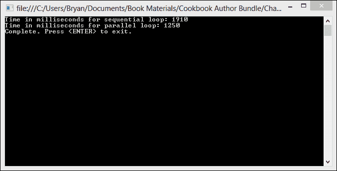
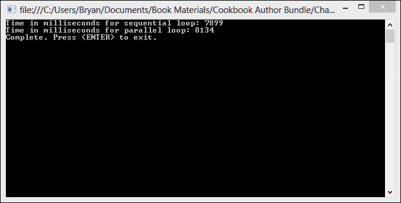
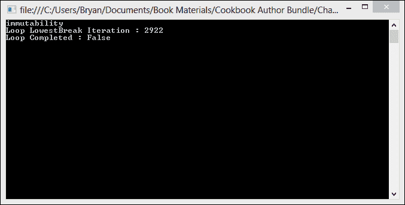
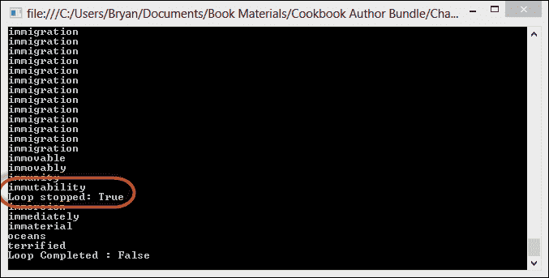
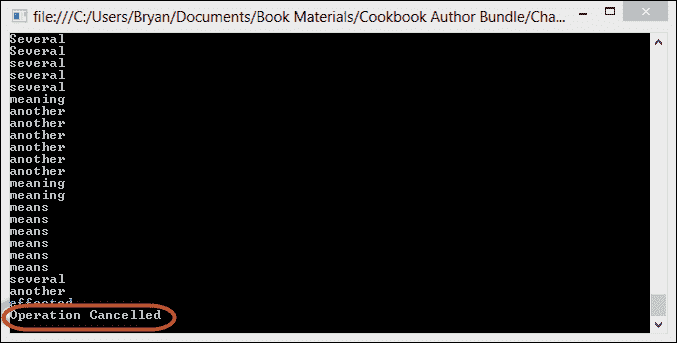
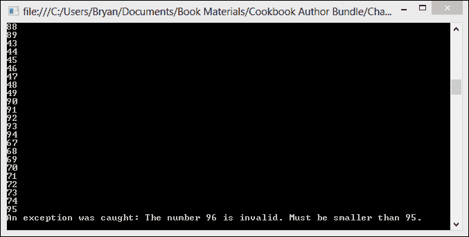
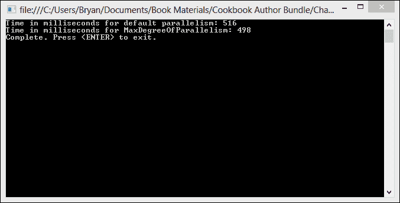
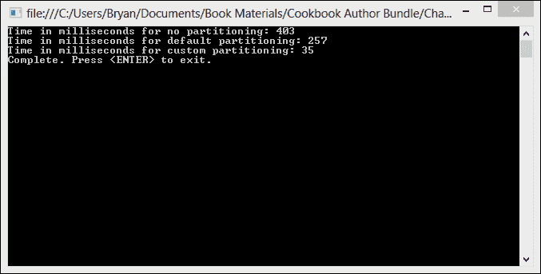
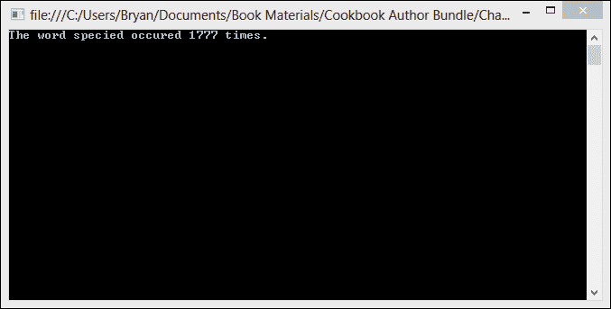

# 第三章. 使用并行循环学习并发

在本章中，我们将涵盖：

+   创建基本的并行 for 循环

+   创建基本的并行 foreach 循环

+   打破并行循环

+   停止并行循环

+   取消并行循环

+   在并行循环中处理异常

+   控制循环中的并行度

+   在并行循环中划分数据

+   使用线程局部存储

# 简介

大多数开发者经常以循环的形式编写顺序代码，他们在数据集合中的每个项目上执行某些操作。循环通常是引入并行性的理想位置，因为大多数情况下，集合中的项目之间没有关系，我们通常希望对集合中的所有项目执行相同的独立操作。然而，并行性伴随着开销。单个循环迭代必须执行足够的工作以证明并行性的开销是合理的。

**.NET 4.5 并行扩展** 包含模拟并行 `For` 和并行 `ForEach` 循环的方法，它们看起来非常像你已用于顺序循环的循环语法。事实上，将顺序循环更改为并行循环以在具有多个核心的计算机上更快完成相当容易。

在本章中，我们将探讨如何在程序中使用并行 `For` 和并行 `ForEach` 循环。

# 创建基本的并行 for 循环

在这个菜谱中，我们将查看基本并行 `for` 循环的语法，并将其性能与顺序 `for` 循环进行比较。

对于我们的比较，我们将创建一个控制台应用程序，包含两个方法。这两个方法都将遍历一个非常大的数字数组，并使用 `Math.Sqrt()` 方法计算数组中每个数字的平方根。我们的一个方法将使用顺序 `for` 循环来处理数组，另一个将使用并行 `for` 循环。

我们程序将计时这两个操作，并在两个循环都完成后在控制台显示结果。

## 如何做…

现在，让我们打开 Visual Studio 并创建一些并行循环。创建并行 `for` 循环的步骤如下：

1.  使用 **C# 控制台应用程序** 项目模板创建一个新的项目，并将 `ParallelFor` 作为 **解决方案名称**。

1.  将以下 `using` 指令添加到程序类的顶部：

    ```cs
    using System;
    using System.Diagnostics;
    using System.Linq;
    using System.Threading.Tasks;
    ```

1.  首先，让我们实现程序类的 `Main` 方法。我们将创建一个 `StopWatch` 对象来执行计时，创建一个包含随机数字的大数组，然后调用方法来运行循环。

    ```cs
    var stopWatch = new Stopwatch();
    var random = new Random();
    var numberList numberArray = Enumerable.Range(1, 10000000).OrderBy(i => random.Next(1, 10000000)).ToArray();
    stopWatch.Start();
    SequentialLoop(numberArraynumberList.ToArray());
    stopWatch.Stop();
    Console.WriteLine("Time in milliseconds for sequential loop: {0}", stopWatch.ElapsedMilliseconds.ToString());

    stopWatch.Reset();
    stopWatch.Start();
    ParallelLoop(numberArraynumberList.ToArray());
    stopWatch.Stop();
    Console.WriteLine("Time in milliseconds for parallel loop: {0}", stopWatch.ElapsedMilliseconds.ToString());

    Console.Write("Complete. Press <ENTER> to exit.");
    Console.ReadKey();
    ```

1.  接下来，让我们创建我们的 `SequentialLoop` 方法，正如你可能猜到的，它执行一个顺序 `for` 循环，计算数组中每个数字的平方根。

    ```cs
    private static void SequentialLoop(Int32[] array)
    {
        for (var i = 0; i < array.Length; i++)
        {
            var temp = Math.Sqrt(array[i]);
        }
    }
    ```

1.  现在我们只需要创建我们的 `ParallelLoop` 方法，它使用并行 `for` 循环来计算数组中每个数字的平方根。

    ```cs
    private static void ParallelLoop(Int32[] array)
    {
        Parallel.For(0, array.Length, i =>
        {
            var temp = Math.Sqrt(array[i]);
        });
    }
    ```

1.  在 Visual Studio 2012 中，按 *F5* 运行项目。你应该会看到类似于以下截图的输出：

## 它是如何工作的…

如前所述的结果所示，在我的四核机器上，并行循环有一些性能提升，但并没有你预期的那么多。可能在你机器上，顺序循环甚至可能比并行循环表现更好。如果是这种情况，这可能意味着创建线程和执行线程在 CPU 上的上下文切换的开销超过了并行化循环的好处。随着章节的继续，我们将探讨如何进一步提高我们循环的性能。现在，我们只是关注并行 for 循环语法的基础知识。

在本食谱中，我们使用了 `Parallel` 类的静态 `For` 方法的基本重载来创建我们的循环。在这个级别上，语法看起来非常类似于顺序 for 循环。

```cs
Parallel.For(int fromInclusive, int toExclusive, Action<int> body );
```

前两个参数构成了循环迭代的范围。请注意，`from` 是一个包含参数，而 `to` 是一个排除参数。因此，如果我们的第一个参数是 0，第二个参数是 10，我们的循环将从 0 迭代到 9。

第三个参数是一个返回 `void` 的 `Action<int>` 类型的委托。在本食谱中，我们使用 Lambda 表达式作为委托。

```cs
Parallel.For(0, array.Length, i =>
{
    var temp = Math.Sqrt(array[i]);
});
```

# 创建基本的并行 foreach 循环

在本食谱中，我们将查看基本并行 foreach 循环的语法，并将其性能与顺序 foreach 循环的性能进行比较。

对于比较，就像之前的食谱一样，我们将创建一个控制台应用程序，其中包含两个方法，这两个方法都会遍历一个非常大的数字数组，并使用 `Math.Sqrt()` 方法计算数组中每个数字的平方根。我们的一个方法将使用顺序 foreach 循环来处理数组，另一个将使用并行 foreach 循环。

我们将记录这两个操作的时间，并在两个循环完成后将结果显示到控制台。

## 如何实现…

现在，让我们转到 Visual Studio，看看如何创建并行 for 循环。创建并行 ForEach 循环的步骤如下：

1.  使用 **C# 控制台应用程序** 项目模板创建一个新的项目，并将 `ParallelForEach` 作为 **解决方案名称**。

1.  将以下 `using` 指令添加到程序类的顶部：

    ```cs
    using System;
    using System.Diagnostics;
    using System.Linq;
    using System.Threading.Tasks;
    ```

1.  让我们从在程序类的 `Main` 方法中添加一些代码开始，创建一个 `StopWatch` 对象以执行计时，创建一个包含随机数字的大数组，然后调用两个方法来运行循环。

    ```cs
    var stopWatch = new Stopwatch();

    var random = new Random()();
    var numberList = Enumerable.Range(1, 10000000).OrderBy(i => random.Next(1, 10000000));
    stopWatch.Start();
    SequentialLoop(numberList);
    stopWatch.Stop();
    Console.WriteLine("Time in milliseconds for sequential loop: {0}", stopWatch.ElapsedMilliseconds.ToString());

    stopWatch.Reset();
    stopWatch.Start();
    ParallelForLoop(numberList);
    stopWatch.Stop();
    Console.WriteLine("Time in milliseconds for parallel loop: {0}", stopWatch.ElapsedMilliseconds.ToString());

    Console.Write("Complete. Press <ENTER> to exit.");
    Console.ReadKey();
    ```

1.  接下来，我们需要创建我们的 `SequentialLoop` 方法来执行一个顺序 `foreach` 循环，该循环计算数组中每个数字的平方根。

    ```cs
    private static void SequentialLoop(IEnumerable<int> numberList)
    {
        foreach (var currentNumber in numberList)
        {
            var temp = Math.Sqrt(currentNumber);
        }
    }
    ```

1.  现在，让我们创建我们的 `ParallelLoop` 方法，它使用并行 `ForEach` 循环来计算数组中每个数字的平方根。

    ```cs
    private static void ParallelForLoop(IEnumerable<int> numberList)
    {
        Parallel.ForEach(numberList, currentNumber =>
        {
            var temp = Math.Sqrt(currentNumber);
        });
    }
    ```

1.  在 Visual Studio 2012 中，按 *F5* 运行项目。你应该会看到类似于以下截图的输出：

## 它是如何工作的…

这次，顺序循环在性能上略优于并行循环，至少在我的机器上是如此。

在这个配方中，我们使用了 `Parallel` 类的静态 `ForEach` 方法的标准重载来创建我们的循环：

```cs
ForEach<TSource>(IEnumerable<TSource>, Action<TSource>)
```

基本上，这只是一个实现了 `IEnumerable<T>` 和委托的源。在我们的案例中，我们使用了 Lambda 表达式作为委托。

```cs
Parallel.ForEach(numberList, currentNumber =>
{
    var temp = Math.Sqrt(currentNumber);
});
```

除了我们使用的循环类型和参数类型外，本项目中的代码与我们的并行 for 循环配方非常相似。

# 跳出并行循环

在编写循环时，我们有时会在特定条件下想要跳出循环。在顺序循环中，我们会使用 C# 的 `break` 语句来实现跳出。然而，`break` 语句仅在包含迭代语句（如 foreach 循环）内有效。当我们运行并行 foreach 时，我们并没有运行迭代语句。实际上，这是一个在方法中运行的委托。

在这个配方中，我们将学习如何使用名为 `ParallelLoopState` 的 TPL 类来跳出并行 ForEach 循环。`ParallelLoopState` 是一个允许并发运行的循环体相互交互的类。它还为我们提供了跳出循环的方法。当循环跳出或完成时，我们将使用 `ParallelLoopResult` 结构来检查循环的完成状态。

我们将创建一个控制台应用程序来下载书籍内容并将单个单词拆分到一个字符串列表中。然后我们将遍历字符串列表以查找特定的单词。当我们找到我们正在寻找的单词时，我们将使用 `ParallelLoopState` 来跳出循环。

## 如何操作…

现在，让我们看看如何取消并行循环。取消并行循环的步骤如下：

1.  使用 **C# 控制台应用程序** 项目模板创建一个新的项目，并将 `Solution name` 设置为 `BreakALoop`。

1.  将以下 `using` 指令添加到程序类顶部：

    ```cs
    using System;
    using System.Linq;
    using System.Net;
    using System.Threading.Tasks;
    ```

1.  首先，让我们向程序类的 `Main` 方法添加一些代码，使用 `WebClient` 下载书籍内容并将书籍的单词拆分到一个字符串数组中。

    ```cs
    char[] delimiters = { ' ', ',', '.', ';', ':', '-', '_', '/', '\u000A' };
     var client = new WebClient();
    const string headerText = "Mozilla/5.0 (compatible; MSIE 10.0; Windows NT 6.1; Trident/6.0)";
    client.Headers.Add("user-agent", headerText);
    var words = client.DownloadString(@"http://www.gutenberg.org/files/2009/2009.txt");
     var wordList = words.Split(delimiters, StringSplitOptions.RemoveEmptyEntries).ToList();
    ```

1.  接下来，让我们创建我们的循环。循环需要处理字符串列表以查找单词 "immutability"。当我们找到它时，使用 `ParallelLoopState.Break` 来跳出循环。

    ```cs
    var loopResult = Parallel.ForEach(wordList, (currentWord,  loopState) =>
    {
        if (currentWord.Equals("immutability"))
        {
            Console.WriteLine(currentWord);
            loopState.Break();
        }
    });
    ```

1.  我们将完成添加几行代码以显示我们跳出循环的迭代次数、循环的完成状态，并等待用户退出。

    ```cs
    Console.WriteLine("Loop LowestBreak Iteration : {0}", loopResult.LowestBreakIteration.ToString());
    Console.WriteLine("Loop Completed : {0}", loopResult.IsCompleted.ToString());
    Console.ReadLine();
    ```

1.  在 Visual Studio 2012 中，按 *F5* 运行项目。你应该会看到类似于以下截图的输出：

## 它是如何工作的…

在这个配方中，我们使用了 `Parallel.ForEach` 的不同重载。这个重载接受一个带有源和循环状态参数的 `Action` 委托。

```cs
ForEach<TSource>(IEnumerable<TSource>, Action<TSource, ParallelLoopState>)
```

在循环体中，我们使用了循环状态参数来取消循环。

```cs
var loopResult = Parallel.ForEach(wordList, (currentWord,  loopState) =>
{
    if (currentWord.Equals("immutability"))
    {
        Console.WriteLine(currentWord);
        loopState.Break();
    }
});
```

注意，我们没有实例化传递给循环的 `ParallelLoopState` 参数。它是通过 `Parallel` 类创建并提供的。我们只需更改我们的 Lambda 表达式，以表明我们想要使用循环状态参数。

`Parallel.ForEach` 方法返回一个 `ParallelLoopResult` 结构（`var loopResult`）。这个结构有几个非常实用的属性。其中之一是 `IsCompleted`，它获取循环完成状态。值为 true 表示循环的所有迭代都已执行，并且循环没有收到提前结束的请求。`LowestBreakIteration` 获取从哪个迭代开始调用 `Break` 的索引。

从并行循环跳出和从顺序循环跳出之间存在一个重要的区别。当跳出顺序循环时，break 语句将立即终止循环。`ParallelLoopState.Break` 有不同的行为。我们实际上是在发出信号，表示我们希望系统在最早方便的时候终止循环。问题是我们在一次处理一个元素。如果我们在一个线程中调用 `ParallelLoopState.Break`，其他线程可能仍在执行。在你请求终止循环后，一些代码可能会继续运行一段时间。

# 停止并行循环

当你从并行循环中跳出时，应用程序实际上会继续处理在调用 `ParallelLoopState.Break` 方法时正在处理的元素之前找到的集合中的任何元素。有时这种行为是不希望的，我们希望立即结束循环，而不处理任何当前正在运行的循环迭代。

在这个菜谱中，我们将探讨如何使用 `ParallelLoopState.Stop` 方法请求尽快终止元素的处理，而不保证处理任何其他元素。我们再次将使用 `WebClient` 下载书籍的内容，并将单词拆分到一个排序后的字符串列表中。我们将遍历列表寻找单词 "immutability"。当我们找到它时，我们将停止循环。

## 如何做到这一点...

现在，让我们启动 Visual Studio，看看如何停止并行循环。停止并行循环的步骤如下：

1.  使用 **C# 控制台应用程序** 项目模板创建一个新的项目，并将 `StopALoop` 作为 **解决方案名称**。

1.  将以下 `using` 指令添加到程序类顶部：

    ```cs
    using System;
    using System.Linq;
    using System.Net;
    using System.Threading.Tasks;
    ```

1.  首先，让我们向程序类的 `Main` 方法添加一些代码，使用 `WebClient` 下载书籍的内容，并将书籍中的单词拆分到一个字符串数组中。

    ```cs
    char[] delimiters = { ' ', ',', '.', ';', ':', '-', '_', '/','"','(',')', '\u000A' };
    var client = new WebClient();
    const string headerText = "Mozilla/5.0 (compatible; MSIE 10.0; Windows NT 6.1; Trident/6.0)";
    client.Headers.Add("user-agent", headerText);
    var words = client.DownloadString(@"http://www.gutenberg.org/files/2009/2009.txt");
    var wordList = words.Split(delimiters, StringSplitOptions.RemoveEmptyEntries).Where(word => word.Length > 5).ToList();
    wordList.Sort();
    ```

1.  接下来，让我们创建我们的循环。循环需要处理字符串列表，寻找单词 "immutability"。当我们找到它时，使用 `ParallelLoopState.Stop` 来停止循环。

    ```cs
    var loopResult = Parallel.ForEach(wordList, (currentWord, loopState) =>
    {
        if (!currentWord.Equals("immutability"))
            Console.WriteLine(currentWord);
        else
        {
            loopState.Stop();
            Console.WriteLine(currentWord);
            Console.WriteLine("Loop stopped: {0}", loopState.IsStopped.ToString());
        }
    });
    ```

1.  我们将完成添加几行以显示循环的完成状态，并等待用户输入以退出。

    ```cs
    Console.WriteLine("Loop Completed : {0}", loopResult.IsCompleted.ToString());
    Console.ReadLine();
    ```

1.  在 Visual Studio 2012 中，按*F5*运行项目。你应该看到类似于以下截图的输出：

## 它是如何工作的…

与前一个配方一样，我们使用了`Parallel.ForEach`的重载版本，它接受一个带有源和循环状态参数的`Action`委托。

```cs
ForEach<TSource>(IEnumerable<TSource>, Action<TSource, ParallelLoopState>)
```

在循环体中，我们使用了循环状态参数来停止循环。我们还使用了`ParallelLoopState.IsStopped`属性来显示循环的状态。

```cs
var loopResult = Parallel.ForEach(wordList, (currentWord, loopState) =>
{
    if (!currentWord.Equals("immutability"))
        Console.WriteLine(currentWord);
    else
    {
        loopState.Stop();
        Console.WriteLine(currentWord);
        Console.WriteLine("Loop stopped: {0}", loopState.IsStopped.ToString());
    }
});
```

如前所述的结果所示，当我们停止循环时，列表中当前正在处理的项目仍然被写入控制台。然而，`ParallelLoopState.Stop`比`ParallelLoopState.Break`更快地停止循环，并且在搜索集合中条件元素的情况下更适合使用。

`ParallelLoopState.Break`和`ParallelLoopState.Stop`的行为与顺序循环中的`break`语句不同。我们要求应用程序一次处理多个任务，并且我们不能再依赖序列。使用 TPL（Task Parallel Library）并行化循环很容易，但应该谨慎处理，因为我们不能再依赖结果的顺序。

# 取消并行循环

如前所述的配方中看到的，要创建一个可取消的任务，你需要从一个`CancellationTokenSource`对象传递一个取消标记。如果你随后调用`CancellationTokenSource.Cancel`方法，该标记会向使用它的所有任务发出终止信号。链接的任务通过该标记检测到这个信号，并以安全的方式停止其活动。

并行循环支持与并行任务相同的取消标记机制。在一个并行循环中，你将`CancellationToken`提供给`ParallelOptions`参数中的方法。

本配方将下载一本书的内容，并将单词分割成字符串列表。然后我们将使用并行循环遍历单词，并将每个单词写入控制台。然而，我们将创建一个单独的任务，该任务暂停几秒钟，然后调用`CancellationTokenSource.Cancel`方法，这将取消循环。

## 如何做…

让我们在 Visual Studio 中创建一个控制台应用程序，以便我们可以看到如何中断循环。步骤如下：

1.  使用**C#控制台应用程序**项目模板启动一个新的项目，并将`BreakALoop`作为**解决方案名称**。

1.  将以下`using`指令添加到程序类的顶部：

    ```cs
    using System;
    using System.Linq;
    using System.Net;
    using System.Threading;
    using System.Threading.Tasks;
    ```

1.  首先，在程序类的`Main`方法中，让我们创建一个`CancellationTokenSource`，然后将`CancellationToken`添加到`ParallelOptions`对象中。

    ```cs
    var tokenSource = new CancellationTokenSource();
    var options = new ParallelOptions
    {
        CancellationToken = tokenSource.Token
    };
    ```

1.  接下来，在上一行文本的下方，创建一个简单的任务，该任务暂停几秒钟，然后调用`CancellationTokenSource`的`Cancel`方法。

    ```cs
    Task.Factory.StartNew(() =>
    {
        Thread.Sleep(new TimeSpan(0,0,5));
        tokenSource.Cancel();
    });
    ```

1.  现在创建一个`WebClient`来下载一本书的文本，并将书中的单词拆分到一个字符串列表中。

    ```cs
    char[] delimiters = { ' ', ',', '.', ';', ':', '-', '_', '/', '"', '(', ')', '\u000A' };
    var client = new WebClient();
    const string headerText = "Mozilla/5.0 (compatible; MSIE 10.0; Windows NT 6.1; Trident/6.0)";
    client.Headers.Add("user-agent", headerText);
     var words = client.DownloadString(@"http://www.gutenberg.org/files/2009/2009.txt");
    var wordList = words.Split(delimiters, StringSplitOptions.RemoveEmptyEntries).Where(word => word.Length > 5).ToList();
    wordList.Sort();
    ```

1.  最后，让我们创建一个简单的并行`foreach`循环，将字符串写入控制台。循环应该包含在`try/catch`块中，我们应该捕获`OperationCancelledException`和`AggregateException`。

    ```cs
    try
    {
        var loopResult = Parallel.ForEach(wordList, options, (currentWord, loopState) => Console.WriteLine(currentWord));
        Console.WriteLine("Loop Completed : {0}", loopResult.IsCompleted.ToString());
    }
    catch (OperationCanceledException)
    {
        Console.WriteLine("Operation Cancelled");
    }
    catch (AggregateException)
    {
        Console.WriteLine("Operation Cancelled");
    }
    Console.ReadLine();
    ```

1.  在 Visual Studio 2012 中，按*F5*键运行项目。你应该看到类似于以下截图的输出：

## 它是如何工作的...

在这个菜谱中，我们使用`Parallel.ForEach`方法的另一个重载，它接受一个`IEnumerable`源、一个`ParallelOptions`对象和一个`Action`委托。

```cs
ForEach<TSource>(IEnumerable<TSource>, ParallelOptions, Action<TSource>)
```

取消任务和取消并行循环之间的区别在于我们如何传递`CancellationToken`。对于任务，`CancellationToken`直接传递到任务的构造函数中。对于并行循环，我们使用我们的`CancellationToken`设置`ParallelOptions`对象的`CancellationToken`属性，然后将`ParallelOptions`对象传递给并行循环方法。

如果表示取消的令牌与设置在`ParallelOptions`实例上的令牌相同，那么在取消时并行循环将抛出`OperationCanceledException`。如果不同的令牌导致取消，循环将抛出一个包含`OperationCanceledException`作为`InnerException`的`AggregateException`。这两个都应该在您的`catch`块中处理。

# 在并行循环中处理异常

当一个顺序循环抛出异常时，循环的正常流程将被中断。控制权将传递给一个`catch`块，或者如果未处理，异常将被传递给.NET 运行时，并终止进程。

`Parallel For`和`ForEach`循环在它们都不具有处理可能抛出的异常的特殊机制方面相似。处理任何可能在一个或多个线程上抛出的异常的责任在我们身上，我们需要通过将循环中的所有异常包装在`AggregateException`中来处理这些异常。

在这个菜谱中，我们将创建一个简单的并行`For`循环，该循环遍历一系列数字，并将值写入控制台。如果正在处理的数字高于一个设定的数字，我们将抛出一个新的`ArgumentException`，然后将其存储在队列中，稍后作为`AggregateException`的一部分抛出。

## 准备中…

对于这个菜谱，我们需要关闭 Visual Studio 2012 的异常助手。异常助手会在抛出运行时异常时出现，并在它到达我们的处理器之前拦截异常。

1.  要关闭异常助手，请转到**调试**菜单并选择**异常**。

1.  取消选中**公共语言运行时异常**旁边的**用户未处理**复选框。

## 如何做到这一点...

让我们看看如何处理并行循环中的异常。步骤如下：

1.  使用**C#控制台应用程序**项目模板启动一个新的项目，并将`LoopExceptions`分配为**解决方案名称**。

1.  将以下 `using` 指令添加到程序类的顶部：

    ```cs
    using System;
    using System.Collections.Concurrent;
    using System.Threading.Tasks;
    ```

1.  在程序类的 `Main` 方法中，创建一个 try/catch 块。`catch` 块应该包含一些代码，用于遍历 `AggregateException.InnerExceptions` 并将封装的异常消息显示到控制台。

    ```cs
    try
    {
        // Parallel for loop           
    }
    catch (AggregateException aggregate)
    {
        // Loop through the exceptions and display to console
        foreach (var ex in aggregate.InnerExceptions)
        {
          Console.WriteLine("An exception was caught:  {0}",ex.InnerException.Message);
        }
    }

    // Wait for user input before exiting
    Console.ReadLine();
    ```

1.  在 `try` 块内部，定义一个类型为 `ConcurrentCollection<Exception>` 的变量。这将是我们的异常容器，直到我们准备好将它们封装在 `AggregateException` 中。

    ```cs
    var exceptionQueue = new ConcurrentQueue<Exception>();
    ```

1.  最后，让我们创建一个简单的并行 `ForEach` 循环，循环从 0 到 100。如果循环遇到大于 95 的数字，它应该抛出一个 `ArgumentException`。循环的主体需要一个 try/catch 块来捕获参数异常并将其入队。

    ```cs
    Parallel.For(0, 100, number =>
    {
        try
        {
            if (number > 95)
            {
              throw new ArgumentException(String.Format("The number {0} is invalid. Must be smaller than 95.",number.ToString()));
            }
            Console.WriteLine(number.ToString());
        }
        catch (Exception ex)
        {
            exceptionQueue.Enqueue(ex);  
        }
        if(exceptionQueue.Count > 0)
            throw new AggregateException(exceptionQueue);
    });
    ```

1.  在 Visual Studio 2012 中，按 *F5* 运行项目。你应该会看到类似于以下截图的输出：

## 它是如何工作的…

在这个菜谱中，外部的 `catch` 块处理 `AggregateException`，它可以封装多个单独的异常对象。调用 `Parallel.For` 时创建的任何或所有实际线程都可能抛出 `AggregateException`。在我们的 `catch` 块中，我们需要遍历 `AggregateException.InnerExceptions` 来处理发生的单个异常。

```cs
catch (AggregateException aggregate)
{
    foreach (var ex in aggregate.InnerExceptions)
    {
      Console.WriteLine("An exception was caught: {0}",ex.InnerException.Message);
    }
}
```

我们还在并行循环的主体中创建了一个 try/catch 块。这个 `catch` 块捕获循环中抛出的任何类型的异常，并将其简单地入队到 `ConcurrentQueue<Exception>` 中。`ConcurrentQueue<T>` 是一个线程安全的先进先出集合，实现了 `IEnumerable<T>`。`AggregateException` 有一个构造函数重载，可以接受 `IEnumerable<Exception>`，因此我们可以通过将 `ConcurrentCollection` 传递给构造函数来将我们的异常集合封装在 `AggregateException` 中。

```cs
catch (Exception ex)
{
    exceptionQueue.Enqueue(ex);  
}
if(exceptionQueue.Count > 0)
    throw new AggregateException(exceptionQueue);
```

# 控制循环中的并行度

默认情况下，`Parallel.For` 和 `Parallel.ForEach` 会使用底层线程调度器提供的线程数。通常，让系统管理并行循环的迭代如何映射到你的计算机核心上是足够的。有时，你可能想要对使用的最大线程数有更多的控制。例如，如果你知道你使用的算法不会扩展到一定数量的核心；你可能想要限制使用的核心数，以避免浪费周期。

由 `Parallel.For` 和 `Parallel.ForEach` 创建的任务数量通常大于可用的核心数。然而，你可以通过指定 `ParallelOptions` 对象的 `MaxDegreeOfParallelism` 属性来限制同时使用的最大任务数。

在这个菜谱中，我们将创建一个大型整数数组。然后，我们将此数组传递给几个并行 `For` 循环。一个循环将以默认的并行度运行，另一个将被限制为四个线程。我们将显示每个循环的运行时间，以查看两个之间是否存在任何性能差异。

## 如何做到这一点…

让我们看看我们如何控制并行循环中的并行度。步骤如下：

1.  使用**C#控制台应用程序**项目模板创建一个新的项目，并将`DegreeOfParallelism`作为**解决方案名称**。

1.  将以下`using`指令添加到程序类的顶部：

    ```cs
    using System;
    using System.Diagnostics;
    using System.Linq;
    using System.Threading.Tasks;
    ```

1.  首先，在程序类中，让我们创建一个名为`DefaultParallelism`的方法，该方法接受一个`Int32`数组作为参数。该方法调用`Parallel.For`并遍历数组计算每个元素的平方根。

    ```cs
    private static void DefaultParallelism(Int32[] array)
    {
        Parallel.For(0, array.Length, i =>
        {
            var temp = Math.Sqrt(array[i]);
        });
    }
    ```

1.  接下来，让我们创建另一个名为`LimitedParallelism`的方法，该方法接受相同类型的参数。此方法也将调用`Parallel.For`并遍历数组计算每个元素的平方根。唯一的区别是，此方法还将创建一个具有`MaxDegreeOfParallelism`属性设置为`4`的`ParallelOptions`对象。

    ```cs
    private static void LimitedParallelism(Int32[] array)
    {
        var options = new ParallelOptions()
        {
            MaxDegreeOfParallelism = 4
        };

        Parallel.For(0, array.Length, options, i =>
        {
            var temp = Math.Sqrt(array[i]);
        });
    }
    ```

1.  最后，在`Main`方法中，我们需要创建一个大的`Int32`数组并将数组元素初始化为随机数。我们还需要设置一个`StopWatch`对象，以便我们可以捕获一些时间并调用这两个方法。

    ```cs
    static void Main()
    {
        var stopWatch = new Stopwatch();

        var random = new Random();
        var numberList numberArray = Enumerable.Range(1, 1000000).OrderBy(i => random.Next(1, 1000000)).ToArray();

        stopWatch.Start();
        DefaultParallelism(numberListnumberArray.ToArray());
        stopWatch.Stop();
        Console.WriteLine("Time in milliseconds for default parallelism: {0}", stopWatch.ElapsedMilliseconds.ToString());

        stopWatch.Reset();
        stopWatch.Start();
        LimitedParallelism(numberList.ToArray());
        stopWatch.Stop();
        Console.WriteLine("Time in milliseconds for MaxDegreeOfParallelism: {0}", stopWatch.ElapsedMilliseconds.ToString());

        Console.Write("Complete. Press <ENTER> to exit.");
        Console.ReadKey();
    }
    ```

1.  在 Visual Studio 2012 中，按*F5*键运行项目。你应该会看到类似于以下截图的输出：

## 它是如何工作的…

这个菜谱没有算法可以从控制并行度中受益，但在某些长时间运行的循环体中，ThreadPool 的启发式算法将无法确定要利用的正确线程数，并可能导致注入比适当数量更多的线程。

通过创建一个`ParallelOptions`对象并设置`MaxDegreeOfParallelism`属性来控制并行度。

```cs
var options = new ParallelOptions()
{
        MaxDegreeOfParallelism = 4
};
```

一旦创建，`ParallelOptions`对象可以传递给接受`ParallelOptions`的`Parallel.For`或`Parallel.ForEach`的许多重载之一。

```cs
Parallel.For(0, array.Length, options, i =>
{
    var temp = Math.Sqrt(array[i]);
});
```

# 在并行循环中划分数据

当创建`Parallel.For`或`Parallel.ForEach`循环时，我们实际上是在为最终将在 ThreadPool 工作线程上运行的委托工作排队。创建和交换这些委托负载所需的时间可能会对性能产生非常不利的影响，尤其是在我们创建具有小委托体的循环时。

有一个默认的`Partitioner<T>`类，它使用默认的分区算法，该算法考虑了系统上的核心数和其他因素，但默认分区可能或可能不会产生最佳结果。

.NET 4.5 并行扩展还允许我们创建自己的自定义分区块，以便将`Parallel.For`或`Parallel.ForEach`的工作负载划分为我们代码中指定的尺寸。我们实际上正在创建一个自定义分区算法。

在这个菜谱中，我们将创建三个并行循环，每个循环遍历一个大的整数数组。其中一个循环将不使用数据分区，一个将使用默认分区器，另一个将使用自定义分区。我们将捕获每个循环遍历数组所需的时间并显示结果。

## 如何实现...

现在，让我们看看如何为并行循环分区数据。步骤如下：

1.  使用**C#控制台应用程序**项目模板启动一个新的项目，并将`PartitionData`作为**解决方案名称**。

1.  将以下`using`指令添加到程序类的顶部：

    ```cs
    using System;
    using System.Collections.Concurrent;
    using System.Diagnostics;
    using System.Linq;
    using System.Threading.Tasks;
    ```

1.  首先，在程序类中，让我们创建一个名为`NoPartitioning`的方法，它接受一个整数数组作为参数。正如其名称所示，这个方法将不使用分区，并且将遍历数组中的元素，计算每个元素的平方根。

    ```cs
    private static void NoPartitioning(Int32[] numbers)
    {
        Parallel.ForEach(numbers, currentNumber =>
        {
           var temp = Math.Sqrt(currentNumber);
        });
    }
    ```

1.  接下来，我们需要创建一个名为`DefaultPartition`的方法。像其他方法一样，这个方法将接受一个整数数组作为其参数，并将遍历数组，计算数组中每个元素的平方根。这个方法将使用`Partitioner.Create`方法为数据创建分区。

    ```cs
    private static void DefaultPartitioning(Int32[] numbers)
    {
        var partitioner = Partitioner.Create(numbers);
        Parallel.ForEach(partitioner, currentNumber =>
        {
            var temp = Math.Sqrt(currentNumber);
        });
    }
    ```

1.  现在，让我们创建一个名为`CustomPartitioning`的方法。这个方法将使用`Partitioner.Create`的不同重载，允许我们指定我们想要使用的范围大小。

    ```cs
    private static void CustomPartitioning(Int32[] numbers)
    {
        var partitioner = Partitioner.Create(0, numbers.Count(), 100000);
        Parallel.ForEach(partitioner, range =>
        {
            for (var index = range.Item1; index < range.Item2; index++)
            {
                var temp = Math.Sqrt(numbers[index]);
            }
        });
    }
    ```

1.  最后，在`Main`方法中，我们需要创建一个大的`Int32`数组，并将数组元素初始化为随机数。我们还需要设置一个`StopWatch`对象，以便我们可以捕获一些时间并调用三个方法。

    ```cs
    static void Main()
    {
        var stopWatch = new Stopwatch();

        var random = new Random();
        var numberArray = Enumerable.Range(1, 10000000).OrderBy(i => random.Next(1, 10000000)).ToArray();
        stopWatch.Start();
        NoPartitioning(numberArray);
        stopWatch.Stop();
        Console.WriteLine("Time in milliseconds for no partitioning: {0}", stopWatch.ElapsedMilliseconds.ToString());

        stopWatch.Reset();
        stopWatch.Start();
        DefaultPartitioning(numberArray);
        stopWatch.Stop();
        Console.WriteLine("Time in milliseconds for default partitioning: {0}", stopWatch.ElapsedMilliseconds.ToString());

        stopWatch.Reset();
        stopWatch.Start();
        CustomPartitioning(numberArray);
        stopWatch.Stop();
        Console.WriteLine("Time in milliseconds for custom partitioning: {0}", stopWatch.ElapsedMilliseconds.ToString());

        Console.Write("Complete. Press <ENTER> to exit.");
        Console.ReadKey();
    }
    ```

1.  在 Visual Studio 2012 中，按*F5*运行项目。你应该看到类似于以下屏幕截图的输出：

## 它是如何工作的...

如前一个屏幕截图所示，使用自定义分区实现了相当大的性能提升。

在这个菜谱中，`NoPartitioning`方法遍历数组，对每个元素执行`Math.Sqrt`操作，而根本不进行数组分区。循环体被传递给`Parallel.ForEach`方法作为代理，而并行循环的体非常小，因此每个循环迭代的代理调用成本非常显著。因此，性能不是很好。

在`DefaultPartitioning`方法中，我们使用了`Partitioner`类的`Create`方法的重载之一，以在源数组上创建范围分区的`IEnumerable<T>`。这样做的好处是，代理调用成本仅在每个范围内发生一次，而不是在每个元素上发生一次。正如你所看到的，这导致了相当不错的性能提升。

```cs
private static void DefaultPartitioning(Int32[] numbers)
{
    var partitioner = Partitioner.Create(numbers);
    Parallel.ForEach(partitioner, currentNumber =>
    {
        var temp = Math.Sqrt(currentNumber);
    });
}
```

在`CustomPartitioning`方法中，我们使用`Partitioner.Create`的不同重载来创建一个自定义分区，该分区将我们指定的范围分成块。

```cs
public static OrderablePartitioner<Tuple<int, int>> Create(
    int fromInclusive,
    int toExclusive,
    int rangeSize
)
```

基本上，我们告诉分区器从 0 到 `numbers.Count()` 创建一个分区，分区大小为 1,00,000。换句话说，我们将数组分成了十等份。性能提升相当显著。

这里的关键教训是，委托调用的开销，尤其是在小体循环中，可能非常显著。考虑使用默认的分区方案，或者自定义块分区器来提高并行循环的性能。

# 使用线程局部存储

计算机在计数方面相当擅长。有时我们需要创建循环来累积某些数据的出现次数的运行计数。当使用 `Parallel.For` 或 `Parallel.Foreach` 循环时，我们如何管理类似的事情？我们可以同时拥有任意数量的线程进行计数。

我们需要完成这项工作的是 **线程局部存储**。线程局部存储使我们能够在由 `Parallel.For` 或 `Parallel.ForEach` 循环创建的每个单独的任务中存储和检索状态，并避免同步访问共享状态变量的开销。

线程局部存储是一种编程方法，它使用线程的静态内存。这有时是必要的，因为通常进程中的所有线程共享相同的地址空间。换句话说，从同一进程引用时，静态或全局变量中的数据通常总是位于相同的内存位置。TLS 变量在调用时是局部的，因为每个线程都有自己的堆栈。

在这个菜谱中，我们将看到如何使用线程局部变量在由 `Parallel.ForEach` 循环创建的每个线程中存储单词计数的值。循环完成后，我们只将最终结果写入一次共享变量。

## 如何操作…

好的，让我们看看我们如何在并行循环中使用线程局部存储。步骤如下：

1.  使用 **C# 控制台应用程序** 项目模板创建一个新的项目，并将 `ThreadLocalStorage` 作为 **解决方案名称**。

1.  将以下 `using` 指令添加到程序类顶部：

    ```cs
    using System;
    using System.Linq;
    using System.Net;
    using System.Threading;
    using System.Threading.Tasks;
    ```

1.  首先，让我们向程序类的 `Main` 方法添加一些代码，使用 `WebClient` 下载一本书的文本，并将书的单词拆分到一个字符串数组中。此外，我们还将创建一个 `integer` 变量，它将保存我们的单词计数。

    ```cs
    char[] delimiters = { ' ', ',', '.', ';', ':', '-', '_', '/', '\u000A' };
    var client = new WebClient();
    const string headerText = "Mozilla/5.0 (compatible; MSIE 10.0; Windows NT 6.1; Trident/6.0)";
    client.Headers.Add("user-agent", headerText);
    var words = client.DownloadString(@"http://www.gutenberg.org/files/2009/2009.txt");
    var wordList = words.Split(delimiters, StringSplitOptions.RemoveEmptyEntries).ToList();

    //word count total
    Int32 total = 0;
    ```

1.  接下来，让我们创建一个并行 `ForEach` 循环，它接受一个 `String` 数组，有一个 `Int32` 线程局部变量，并将它的 `Int32` 结果传递给 `Interlocked.Add` 方法。

    ```cs
    Parallel.ForEach<String, Int32>(wordList, () => 0, 
        (word, loopstate, count) =>  // method invoked on each iteration of loop
        {
            if (word.Equals("species"))
            {
                count++; // increment the count
            }
            return count;
        },(result)=>Interlocked.Add(ref total, result));
     // executed when all loops have completed
    ```

1.  让我们通过显示结果并等待用户输入来完成。

    ```cs
    Console.WriteLine("The word species occured {0} times.",total.ToString());
    Console.ReadLine();
    ```

1.  在 Visual Studio 2012 中，按 *F5* 运行项目。你应该会看到类似于以下截图的输出：

## 它是如何工作的…

在并行`ForEach`循环中使用线程局部变量意味着我们必须使用接受两个类型参数和两个函数参数的`Parallel.ForEach`方法重载。我们的第一个参数是我们源中元素的类型（`String`）。第二个参数指定我们的线程局部变量的类型（`Int32`）。第三个参数是一个在每次循环迭代时被调用的`Func<TSource, ParallelLoopState, TLocal, TLocal>`委托。第四个参数是一个当所有循环完成后方法将调用的`Action<T>`委托。

```cs
ForEach<TSource, TLocal>(IEnumerable<TSource>, Func<TLocal>, Func<TSource, ParallelLoopState, TLocal, TLocal>, Action<TLocal>)
```

在循环体中，循环将我们的输入参数传递给我们的函数委托。这些参数是当前元素、一个`ParallelLoopState`变量以及线程局部变量。

```cs
(word, loopstate, count) =>  // method invoked on each iteration of loop
{
if (word.Equals("species"))
{
   count++; // increment the count
}
return count;
}
```

循环完成后，我们返回我们的线程局部变量，并将其传递给`Action<T>`委托，在那里我们使用`Interlocked.Add()`将其添加到我们的共享状态变量中：

```cs
(result)=>Interlocked.Add(ref total, result));
```
