# 第四章。并行 LINQ

在本章中，我们将介绍以下食谱：

+   创建基本的并行查询

+   在并行 LINQ 中保持顺序

+   强制并行执行

+   限制查询中的并行性

+   处理查询结果

+   指定合并选项

+   使用并行 LINQ 进行范围投影

+   在并行 LINQ 中处理异常

+   取消并行 LINQ 查询

+   执行归约操作

+   创建自定义分区器

# 简介

**语言集成查询**（**LINQ**）为开发人员提供了在数据集合上执行查询的语法。使用 LINQ，您可以遍历、过滤、排序并返回项目投影集合。当您使用 LINQ to objects 时，您的数据集合中的所有项目都由单个线程顺序处理。

并行 LINQ 是 LINQ to objects 的并行实现，可以将你的顺序查询转换为并行查询，从而可能提高性能。

内部，并行 LINQ 使用排队到默认`TaskScheduler`的任务来扩展源集合项的处理，以便多个项可以并发处理。

在本章中，我们将探讨如何通过并行 LINQ 潜在地提高大量项目集合或对项目进行长时间计算绑定处理的查询性能。

# 创建基本的并行查询

在这个食谱中，我们将通过使用`System.Linq.ParallelEnumerable`类的`AsParallel`方法来查看如何创建一个基本的并行查询。

我们将创建一个`Console`应用程序，初始化员工集合，然后查询员工集合以查找特定的职位名称。

## 如何做…

现在，让我们转到 Visual Studio 并开始创建一些并行 LINQ 查询。

1.  使用**C#控制台应用程序**项目模板创建一个新的项目，并将**解决方案名称**设置为`SimplePLINQ`。

1.  将以下`using`指令添加到`Program`类的顶部：

    ```cs
    using System;
    using System.Linq;
    ```

1.  首先，我们需要在`Program`类下方创建一个`Employee`类。创建一个具有`Id`、`Title`、`FirstName`和`LastName`属性的`Employee`类定义。

    ```cs
    public class Employee
    {
        public int Id { get; set; }
        public string Title { get; set; }
        public string FirstName { get; set; }
        public string LastName { get; set; }
    }
    ```

1.  现在，在`Program`类的`Main`方法中，让我们创建并初始化一个`employees`数组。

    ```cs
    var employees = newList<Employee>
    {
      new Employee{Id=1, Title="Developer", FirstName="Mark", LastName="Smith"},
      new Employee{Id=2, Title="Director", FirstName="Kate", LastName="Williams"},
      new Employee{Id=3, Title="Manager", FirstName="Karen", LastName="Davis"},
      new Employee{Id=4, Title="Developer", FirstName="Maria", LastName="Santos"},
      new Employee{Id=5, Title="Developer", FirstName="Thomas", LastName="Arnold"},
      new Employee{Id=6, Title="Tester", FirstName="Marcus", LastName="Gomez"},
      new Employee{I =7, Title="IT Engineer", FirstName="Simon", LastName="Clark"},
      new Employee{Id=8, Title="Tester", FirstName="Karmen", LastName="Wright"},
      new Employee{Id=9, Title="Manager", FirstName="William", LastName="Jacobs"},
      new Employee{Id=10, Title="IT Engineer", FirstName="Sam", LastName="Orwell"},
      new Employee{Id=11, Title="Developer", FirstName="Tony", LastName="Meyers"},
      new Employee{Id=12, Title="Developer", FirstName="Karen", LastName="Smith"},
      new Employee{Id=13, Title="Tester", FirstName="Juan", LastName="Rodriguez"},
      new Employee{Id=14, Title="Developer", FirstName="Sanjay", LastName="Bhat"},
      new Employee{Id=15, Title="Manager", FirstName="Abid", LastName="Naseem"}
    };
    ```

1.  接下来，我们将创建一个并行 LINQ 查询，选择所有标题为`Developer`的员工。

    ```cs
    var results = from e in employees.AsParallel()
                    where e.Title.Equals("Developer")
                    select e;
    ```

    ```cs
    Finally, let's loop through the results and display them to the Console, then wait for user input to exit.
    foreach (var employee in results)
    {
        Console.WriteLine("Id:{0}  Title:{1}  First Name:{2}  Last Name:{3}",
            employee.Id, employee.Title, employee.FirstName, employee.LastName);
    }
    Console.ReadLine();
    ```

1.  在 Visual Studio 2012 中，按*F5*运行项目。你应该会看到类似于以下截图的输出：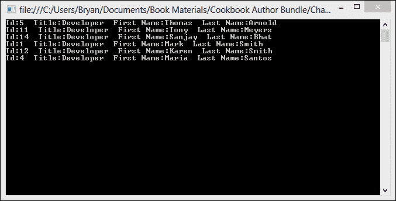

## 它是如何工作的…

我们为这个示例创建的员工集合太小，无法从并行查询中受益，但在这个例子中需要注意的关键点是使用`AsParallel`扩展方法将查询绑定到并行 LINQ，并指定如果可能的话，查询的其余部分应该并行化。

```cs
var results = from e in employees.AsParallel()
                where e.Title.Equals("Developer")
                select e;
```

`System.Linq.ParallelEnumerable` 类实现了所有并行 LINQ 功能，并公开了 `Select`、`Single`、`Skip`、`OrderBy` 等的并行版本。所有这些方法都是扩展方法，扩展了 `ParallelQuery<TSource>`。`AsParallel` 扩展方法将基于 `IEnumerable<T>` 的顺序查询转换为基于 `ParallelQuery<T>` 的并行查询。

# 在并行 LINQ 中保持顺序

默认情况下，PLINQ 不保留源集合中的顺序。因为 PLINQ 使用多个线程并发处理数据集合中的项目，所以项目是无序返回的。这是设计上的，因为维护序列的原始顺序会增加开销，而在大多数情况下，这种开销可能不是必要的。

然而，当你需要保持顺序时，PLINQ 提供了一种简单的方法来实现它。在这个示例中，我们将创建一个 `Console` 应用程序，创建两个数字集合，对一个集合执行有序查询，对另一个集合执行默认的无序查询，并查看结果。

## 如何实现...

让我们打开 Visual Studio，看看如何在并行 LINQ 查询中保持顺序。

1.  使用 **C# Console Application** 项目模板启动一个新项目，并将 `PreserveOrder` 作为 **解决方案名称**。

1.  将以下 `using` 指令添加到 `Program` 类的顶部：

    ```cs
    using System;
    using System.Collections.Generic;
    using System.Linq;
    ```

1.  让我们从在 `Program` 类的 `Main` 方法下方创建一个 `UnorderedQuery` 方法开始。此方法将查询一个大的整数范围，寻找能被 5 整除的数字，并将这些数字中的前 10 个作为结果。

    ```cs
    private static void UnorderedQuery(IEnumerable<int> source)
    {
        Console.WriteLine("Unordered results");
        var query = (from numbers in source.AsParallel()
            where numbers%5 == 0
            select numbers).Take(10);

        foreach (var number in query)
            Console.WriteLine(number);
    }
    ```

1.  接下来，我们需要创建我们的 `OrderedQuery` 方法，它将执行与上一步相同的查询，但它将使用 `AsOrdered` 扩展方法来保持原始顺序。

    ```cs
    private static void OrderedQuery(IEnumerable<int> source)
    {
        Console.WriteLine("Ordered results");
        var query = (from numbers in source.AsParallel().AsOrdered()
            where numbers % 5 == 0
            select numbers).Take(10);

        foreach (var number in query)
            Console.WriteLine(number);
    }
    ```

1.  现在让我们向 `Program` 类的 `Main` 方法中添加一些代码，以创建你的数字源列表并调用每个方法。

    ```cs
    var source1 = Enumerable.Range(1, 100000);
    UnorderedQuery(source1);

    Console.WriteLine();

    var source2 = Enumerable.Range(1, 100000);
    OrderedQuery(source2);

    Console.ReadLine();
    ```

1.  在 Visual Studio 2012 中，按 *F5* 运行项目。你应该会看到如下截图所示的结果：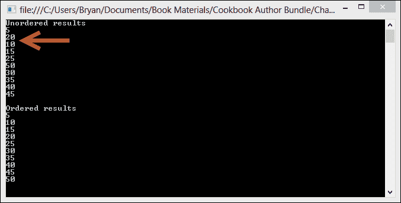

## 它是如何工作的...

如果你需要并行 LINQ，在处理项目时保持它们的顺序，那么你可以调用 `ParallelEnumerable` 类的 `AsOrdered` 方法。

```cs
var query = (from numbers in source.AsParallel().AsOrdered()
        where numbers % 5 == 0
        select numbers).Take(10);
```

当你调用此方法时，为查询生成的线程将按组处理集合中的项目，然后将这些组合并在一起，保持顺序但影响性能。

`Distinct`、`Intersect`、`Union`、`Join`、`Except`、`GroupBy`、`GroupJoin` 和 `ToLookup` 运算符产生无序操作。如果你需要在这些操作之后强制排序，只需调用 `AsOrdered` 方法。

相反，`OrderBy`、`OrderByDescending`、`ThenBy` 和 `ThenByDescending` 运算符产生有序操作。如果你需要回到无序处理并提高性能，PLINQ 提供了一个可以调用的 `AsUnordered` 方法。

# 强制并行执行

并行 LINQ 寻找并行化查询的机会，但并非所有查询并行运行都会更快。例如，包含单个仅做少量工作的代理的查询通常按顺序运行会更快，因为并行化的开销超过了并行化所获得的收益。

在很大程度上，并行 LINQ 在确定应该并行化什么以及应该顺序运行什么方面做得很好，这是基于它对查询形状的检查。然而，它使用的算法并不完美，你可能需要指示 PLINQ 并行运行你的查询。

在这个菜谱中，我们将构建一个`Console`应用程序，创建一个查询，PLINQ 将确定它是否需要按顺序执行。然后我们将使用`WithExecutionMode`方法强制查询并行运行。最后，我们将捕获两个查询的运行时间并比较结果。

## 如何做…

现在，让我们看看如何强制 PLINQ 查询并行执行。

1.  使用**C# Console Application**项目模板启动一个新的项目，并将`ForceParallelism`分配为**解决方案名称**。

1.  将以下`using`指令添加到`Program`类的顶部：

    ```cs
    using System;
    using System.Diagnostics;
    using System.Linq;
    using System.Threading;
    ```

1.  首先，让我们在你的`Program`类中创建一个名为`NoForcedParallelism`的方法，该方法创建一个 PLINQ 查询，其中包含 PLINQ 将评估的小型代理工作，并确定需要按顺序执行的内容。

    ```cs
    private static void NoForcedParallelism()
    {
        Enumerable.Range(0, 1000).AsParallel()
                    .Where(x =>
                    {
                        Thread.SpinWait(1000000);
                        return true;
                    })
                    .Select((x, i) => i)
                    .ToArray();
    }
    ```

1.  接下来，让我们在`Program`类中创建一个名为`ForcedParallism`的方法，该方法运行相同的查询，但通过调用`WithExecutionMode`方法并传递`ParallelExecutionMode.ForceParallelism`枚举来强制 PLINQ 并行执行它。

    ```cs
    private static void ForcedParallelism()
    {
        Enumerable.Range(0, 1000).AsParallel()
                .WithExecutionMode(ParallelExecutionMode.ForceParallelism)
                .Where(x =>
                {
                    Thread.SpinWait(1000000);
                    return true;
                })
                .Select((x, i) => i)
                .ToArray();
    }
    ```

1.  我们将在`Main`方法中添加一些代码来创建`stopWatch`以捕获两个方法的计时，然后运行这些方法并比较结果。

    ```cs
    private static void Main()
    {
       var stopWatch = new Stopwatch();
       stopWatch.Start();
       NoForcedParallelism();
       stopWatch.Stop();
       Console.WriteLine("Query with no forced parallelism ran in {0} ms.",
    		stopWatch.ElapsedMilliseconds);
       stopWatch.Reset();
       stopWatch.Start();
       ForcedParallelism();
       stopWatch.Stop();
       Console.WriteLine("Query with forced parallelism ran in {0} ms.", 
    		stopWatch.ElapsedMilliseconds);
       Console.ReadLine();
    }
    ```

1.  在 Visual Studio 2012 中，按*F5*键运行项目。你应该会看到以下截图所示的输出：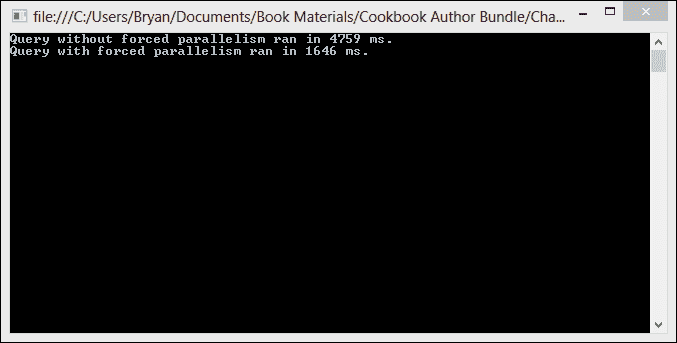

## 它是如何工作的…

在这个菜谱中，我们可以看到 PLINQ 错误地决定查询按顺序运行会更快。当我们强制查询并行运行时，性能提升是显著的。

我们通过调用`System.Linq.ParallelQuery`的`WithExecutionMode`方法，并传递`ParallelExecutionMode.ForceParallelism`枚举值，指示 PLINQ 在检测到某些查询形状时不要回退到顺序执行。

```cs
Enumerable.Range(0, 1000).AsParallel()
    .WithExecutionMode(ParallelExecutionMode.ForceParallelism)
    .Where(x =>
    {
        Thread.SpinWait(1000000);
        return true;
    })
    .Select((x, i) => i)
    .ToArray();
```

为什么 PLINQ 最初就决定该查询应该按顺序执行？这主要是一个决定查询形状的因素，该形状只有一个工作代理。这也与该查询使用`positional Select`运算符有关。与位置相关的运算符可能需要在 PLINQ 中包含`positional Select`、`positional Where`、`positional SelectMany`、`Take`、`Skip`、`TakeWhile`和`SkipWhile`的`ForceParallelism`。

# 在查询中限制并行性

默认情况下，并行 LINQ 会尝试利用 CPU 提供的所有处理器核心。通常，这是你想要的。然而，可能存在你想要限制用于运行查询的线程数，并保留一些核心用于其他工作的情况。

在这个菜谱中，我们将创建一个查询，该查询使用`WithDegreeOfParallelism`方法显式设置并行查询使用的线程数。

## 如何操作…

现在，让我们看看如何限制查询的并行度。

1.  使用**C#控制台应用程序**项目模板启动一个新的项目，并将`LimitParallelism`作为**解决方案名称**。

1.  在你的`Program`类的顶部添加以下`using`指令：

    ```cs
    using System;
    using System.Linq;
    using System.Threading;
    ```

1.  让我们在`Program`类的`Main`方法中添加一个 PLINQ 查询，使其工作在处理器上。目前，我们将使用`WithExecutionMode`方法强制查询并行运行，但不会设置并行化的限制。

    ```cs
    private static void Main()
    {

        var result = Enumerable.Range(0, 10000).AsParallel()
            .WithExecutionMode(ParallelExecutionMode.ForceParallelism)
            .Where(x =>
          {
                    Thread.SpinWait(1000000);
                    return true;
                })
            .Select((x, i) => i)
            .ToArray();

            foreach (var number in result)
                Console.WriteLine("Result: {0}",number);

            Console.ReadLine();
    }
    ```

1.  如果你机器上有多核处理器，启动**任务管理器**，点击**性能**选项卡，并观察 CPU 使用情况。在 Visual Studio 2012 中，按*F5*键运行项目。你应该会看到如下截图所示的处理器使用情况：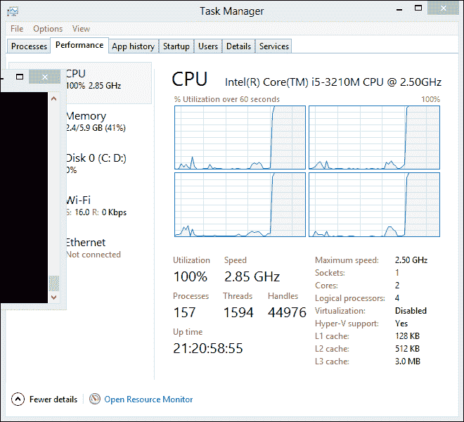

1.  现在，让我们编辑 PLINQ 查询，调用`WithDegreeOfParallelism`方法来限制使用的处理器核心数。你可能想要将传递给方法的值更改为与你可用的处理器核心数相关的数字。你可以指定一个大于你机器上处理器核心数的数字，但这可能会导致更多的上下文切换。

    ```cs
    var result = Enumerable.Range(0, 10000).AsParallel()
            .WithExecutionMode(ParallelExecutionMode.ForceParallelism)
            .WithDegreeOfParallelism(2)
            .Where(x =>
                {
                    Thread.SpinWait(1000000);
                    return true;
                })
            .Select((x, i) => i)
            .ToArray();                       
    ```

1.  现在再次启动**任务管理器**，点击**性能**选项卡，并观察 CPU 使用情况。在 Visual Studio 2012 中，按*F5*键运行项目。你应该会看到处理器使用量减少。请注意，创建的线程不一定会在单个核心上花费所有时间，但总体使用量会下降。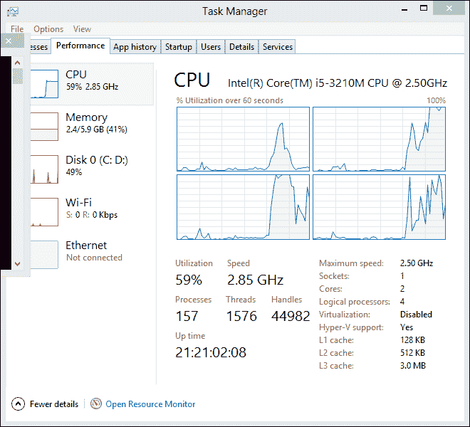

## 它是如何工作的…

`WithDegreeOfParallelism` 方法可能不是你经常需要使用的方法。你可能希望在需要留出一些 CPU 时间来执行其他任务的情况下使用它。你也可以传递一个大于你机器上核心数的数字，在这种情况下，查询将执行同步 I/O，因为线程将会阻塞。

设置并行度仅仅是调用该方法并传递你想要 PLINQ 使用的线程数。

```cs
var result = Enumerable.Range(0, 10000).AsParallel()
        .WithExecutionMode(ParallelExecutionMode.ForceParallelism)
 .WithDegreeOfParallelism(2)
        …
        .Select((x, i) => i)
        .ToArray();                       
```

`WithDegreeOfParallism`方法的默认值是你的机器的处理器数量。

# 处理查询结果

并行 LINQ 的一个很好的特性是它将并行化查询的结果收集到一个单一的输出序列中。然而，通常你的程序对查询的输出数据所做的只是使用 `foreach` 循环或类似的方法对每个元素运行一个函数。在这种情况下，尤其是在你不在乎元素处理顺序的情况下，你可以通过使用 ParallelEnumerable 的 `ForAll` 方法来并行处理结果来提高性能。

在这个菜谱中，我们将对数字范围执行查询，然后使用 `ParallelForAll` 并行迭代结果，计算每个数字的平方。

## 如何操作…

现在，让我们打开 Visual Studio，看看如何处理并行查询的结果。

1.  使用 **C# 控制台应用程序** 项目模板启动一个新的项目，并将 `ProcessResults` 作为 **解决方案名称**。

1.  将以下 `using` 指令添加到 `Program` 类的顶部：

    ```cs
    using System;
    using System.Collections.Concurrent;
    using System.Linq;
    using System.Text;
    using System.Threading.Tasks;
    ```

1.  首先，在 `Program` 类的 `Main` 方法中，让我们创建一个并发整数集合来保存我们计算的结果，并为查询生成一个数字范围。

    ```cs
    var result = new ConcurrentBag<Int32>();
    var source = Enumerable.Range(1, 100000);
    ```

1.  接下来，在上一行代码的下方，创建一个 PLINQ 查询，查询从源范围中均匀可被 5 整除的前 100 个数字。

    ```cs
    var query = (from numbers in source.AsParallel()
            where numbers % 5 == 0
            select numbers).Take(100);
    ```

1.  现在，让我们调用 `ParallelEnumerable.ForAll` 方法来并行处理我们的查询结果。我们只是将要计算每个数字的平方并将结果添加到我们的集合中。

    ```cs
    query.ForAll(r => 
        {
            result.Add(r * r);
        });
    ```

1.  最后，让我们遍历集合并将结果打印到 `Console`。

    ```cs
    foreach (var value in result)
    {
         Console.WriteLine("Result squared: {0}", value );
    }
    Console.ReadLine();
    ```

1.  在 Visual Studio 2012 中，按 *F5* 运行项目。你应该会看到如下截图所示的输出：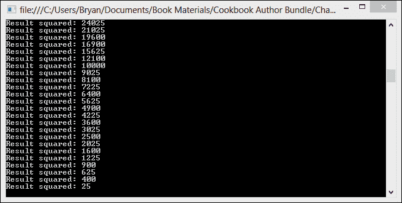

## 它是如何工作的…

在这个菜谱中，我们使用 `ParallelEnumerable.ForAll<TSource>` 来并行迭代并处理我们的查询结果。`ForAll` 方法在 `ParallelQuery` 的每个输出元素上运行一个委托。

```cs
query.ForAll(r => 
    {
        result.Add(r * r);
    });
```

`ForAll` 方法直接连接到并行 LINQ 的内部，绕过了收集和枚举结果的过程，这可以节省相当多的处理时间。

你可能会想知道为什么我们使用 `ForAll` 方法来计算结果的平方并将它们添加到集合中；只是为了使用顺序的 `foreach` 循环将结果写入 `Console`。除了显而易见的答案这只是个简单的例子之外，你不会想在 `ForAll` 方法中写入 `Console`，因为 .NET 会序列化对 `Console` 的所有访问，并强制整个操作按顺序执行。

# 指定合并选项

当并行 LINQ 执行查询时，它会将源数据分区并将每个分区分配给一个单独的线程。如果结果由单个线程消费，例如 `foreach` 循环，那么每个分区的结果必须合并回一个结果集。所执行的合并类型取决于查询中使用的运算符。对于产生有序结果的运算符，所有线程的结果在合并回之前完全缓冲。您的应用程序的消耗线程可能需要等待一段时间才能看到最终结果。如果您不关心顺序，或者想使用不同的缓冲方案来提高结果，则查询可以使用 `WithMergeOptions` 扩展方法向 PLINQ 提供一个提示，说明您希望如何缓冲结果。

在本食谱中，我们将从范围中查询一些数字，并使用几种不同的缓冲选项遍历结果，并观察其效果。

## 如何操作…

现在，让我们看看如何指定 PLINQ 查询的合并选项。

1.  使用 **C# 控制台应用程序** 项目模板启动一个新项目，并将 `MergeOptions` 作为 **解决方案名称**。

1.  将以下 `using` 指令添加到 `Program` 类的顶部：

    ```cs
    using System;
    using System.Linq;
    using System.Threading;
    ```

1.  让我们从在 `Program` 类的 `Main` 方法中创建我们的源数字范围开始。

    ```cs
    var numbers = ParallelEnumerable.Range(0, 1000);
    ```

1.  现在，让我们创建一个 PLINQ 查询以选择范围内能被 5 整除的数字，并使用 `WithMergeOption` 方法指定完全缓冲合并结果。

    ```cs
    var result = numbers.AsParallel()
            .WithMergeOptions(ParallelMergeOptions.FullyBuffered)
            .Where(number => number % 5 == 0);
    ```

1.  接下来，让我们使用 `foreach` 循环遍历结果并将它们打印到 `Console`。

    ```cs
    foreach (var number in result)
    {
        Console.WriteLine("Result: {0}",number);
    }
    Console.ReadLine();
    ```

1.  在 Visual Studio 2012 中，按 *F5* 运行项目。注意以下截图所示的 **有序结果**：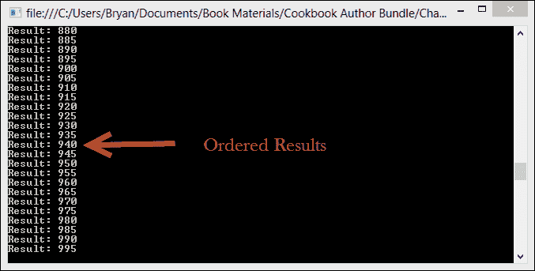

1.  现在，让我们使用 `WithMergeOption` 方法指定不进行结果缓冲。

    ```cs
    var result = numbers.AsParallel()
            .WithMergeOptions(ParallelMergeOptions.NotBuffered)
            .Where(number => number % 5 == 0);
    ```

1.  在 Visual Studio 2012 中，按 *F5* 运行项目。注意以下截图中的无序结果：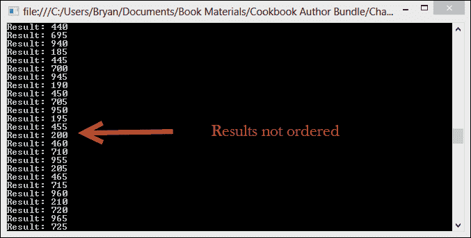

## 工作原理…

`WithMergeOptions` 方法接受 `ParallelMergeOptions` 枚举作为参数。您可以指定以下选项之一，以指定查询输出何时产生以及何时可以消费结果：

+   **不缓冲**：查询的每个处理元素一旦产生，就从每个线程返回。如果存在 `AsOrdered` 运算符，则保留排序，如果没有 `AsOrdered` 运算符，则结果一旦可用就提交。此选项提供最快的速度。

+   **自动缓冲**：元素被收集到缓冲区中，并定期提交给消耗线程。这是一种中间缓冲方法。

+   **完全缓冲**：在向消耗线程提交任何元素之前，所有元素都收集到缓冲区中。

当你使用`WithMergeOptions`时，你正在向 PLINQ 提供有关它想要使用的缓冲方案的提示。如果特定的查询不支持请求的选项，你的请求将被忽略。

# 使用并行 LINQ 进行范围投影

在使用顺序 LINQ 时，使用范围投影来获取值范围是非常常见的。并行 LINQ 为我们提供了这样做的方法。如果你需要生成一个非常大的范围，这些数字不需要按顺序排列，你可以使用`ParallelEnumerable`的`Range`方法来创建序列。

在这个简短的菜谱中，我们将使用`ParallelEnumerable.Range`生成一个非常大范围内的数字。

## 如何操作…

现在，让我们去 Visual Studio 看看如何使用并行 LINQ 生成数字范围。

1.  使用**C#控制台应用程序**项目模板创建一个新的项目，并将`Solution name`设置为`RangeProjection`。

1.  将以下`using`指令添加到`Program`类的顶部：

    ```cs
    using System;
    using System.Linq;
    ```

1.  首先，在`Main`方法中，让我们使用`ParallelEnumerable.Range`创建一个介于 1 到 1000 之间，且能被 5 整除的数字范围。

    ```cs
    var numbers = ParallelEnumerable.Range(1, 1000)
            .Where(x => x % 5 != 0)
            .Select(i => i);
    ```

1.  现在，让我们遍历结果以将它们显示到`Console`，并在退出前等待用户输入。

    ```cs
    foreach (var number in numbers)
    {
        Console.WriteLine("Result: {0}",number);
    }
    Console.ReadLine();
    ```

1.  在 Visual Studio 2012 中，按*F5*运行项目。你应该会看到以下截图所示的输出：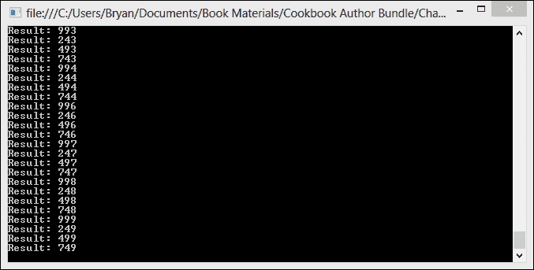

## 它是如何工作的…

这个菜谱的代码相当容易理解。一个需要注意的重要点是，隐式转换为`ParallelQuery<int>`会创建并行执行而不是顺序执行，并且结果中的数字没有特定的顺序。

当然，可以通过在查询上调用`AsOrdered`来保留顺序，但如果顺序对你很重要，只需使用顺序 LINQ 投影生成范围，并避免并行执行的开销。

# 在并行 LINQ 中处理异常

在并行 LINQ 中处理异常与在任务、延续或你的并行代码的任何其他地方处理异常没有太大区别。你需要使用`try`/`catch`并确保捕获`AggregateException`。对于并行 LINQ，真正重要的是在使用结果进行枚举或使用时使用 try/catch。

在这个菜谱中，我们将创建一个简单的并行 LINQ 查询，该查询返回员工列表并抛出`InvalidOperationException`，我们将在遍历结果时处理它。

## 准备工作…

对于这个菜谱，我们需要关闭 Visual Studio 2012 异常助手。异常助手会在运行时`Exception`抛出时出现，并在它到达我们的处理器之前拦截`Exception`。

1.  要关闭异常助手，转到**调试**菜单并点击**异常**。

1.  取消选中**公共语言运行时异常**旁边的**用户未处理**复选框。

## 如何操作…

现在，让我们看看如何处理并行 LINQ 查询中的异常。

1.  使用 **C# 控制台应用程序** 项目模板启动一个新的项目，并将 `HandleExceptions` 作为 **解决方案名称**。

1.  将以下 `using` 指令添加到您的 `Program` 类顶部：

    ```cs
    using System;
    using System.Linq;
    ```

1.  首先，让我们创建一个 `Employee` 类。将以下类定义添加到您的 `Program.cs` 文件中，位于 `Program` 类下方：

    ```cs
    public class Employee
    {
        public int Id { get; set; }
        public string Title { get; set; }
        public string FirstName { get; set; }
        public string LastName { get; set; }
    }
    ```

1.  现在，在 `Program` 类的 `Main` 方法中，让我们创建并初始化一个 `employees` 数组。

    ```cs
    var employees = new[]
    {
      new Employee{Id=1, Title="Developer", FirstName="Mark", LastName="Smith"},
      new Employee{Id=2, Title="Director", FirstName="Kate", LastName="Williams"},
      new Employee{Id=3, Title="Manager", FirstName="Karen", LastName="Davis"},
      new Employee{Id=4, Title="Developer", FirstName="Maria", LastName="Santos"},
      new Employee{Id=5, Title="Developer", FirstName="Thomas", LastName="Arnold"},
      new Employee{Id=6, Title="Tester", FirstName="Marcus", LastName="Gomez"},
      new Employee{I =7, Title="IT Engineer", FirstName="Simon", LastName="Clark"},
      new Employee{Id=8, Title="Tester", FirstName="Karmen", LastName="Wright"},
      new Employee{Id=9, Title="Manager", FirstName="William", LastName="Jacobs"},
      new Employee{Id=10, Title="IT Engineer", FirstName="Sam", LastName="Orwell"},
      new Employee{Id=11, Title="Developer", FirstName="Tony", LastName="Meyers"},
      new Employee{Id=12, Title="Developer", FirstName="Karen", LastName="Smith"},
      new Employee{Id=13, Title="Tester", FirstName="Juan", LastName="Rodriguez"},
      new Employee{Id=14, Title="Developer", FirstName="Sanjay", LastName="Bhat"},
      new Employee{Id=15, Title="Manager", FirstName="Abid", LastName="Naseem"}
      new Employee{Id=16, Title="Developer",FirstName="Kevin", LastName="Strong"}
    };
    ```

1.  接下来，创建一个 PLINQ 查询，该查询选择所有员工，并在遇到大于 `15` 的 `employee Id` 时抛出 `InvalidOperationException`。

    ```cs
    var results = employees.AsParallel()
        .Select(employee =>
        {
        if (employee.Id > 15)
        throw new InvalidOperationException("Invalid employee. Id > 15.");
        return employee;
        });
    ```

1.  最后，让我们创建一个 `try`/`catch` 块。在 `try` 块中，创建一个 `foreach` 循环来遍历结果。在 `catch` 块中，您需要处理 `AggregateException` 并将 `Exception` 显示到 `Console`。完成程序退出前的用户输入等待。

    ```cs
    try
    {
        foreach (var employee in results)
        {
            Console.WriteLine("Id:{0}  Title:{1}  First Name:{2}  Last Name:{3}",
                employee.Id, employee.Title, employee.FirstName, employee.LastName);
        }
    }
    catch (AggregateException aggregateException)
    {
        foreach (var exception in aggregateException.InnerExceptions)
        {
            Console.WriteLine("The query threw an exception: {0}", exception.Message);
        }
    }
    Console.ReadLine();
    ```

1.  在 Visual Studio 2012 中，按 *F5* 运行项目。您应该看到以下截图所示的输出：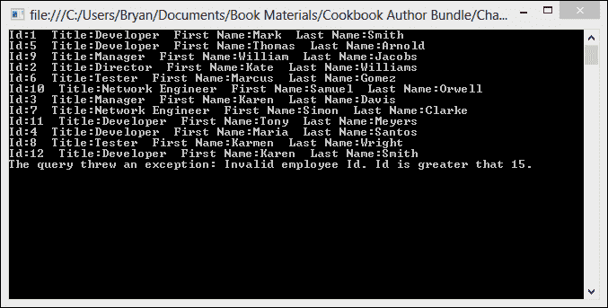

## 它是如何工作的…

如您所见，处理并行 LINQ 查询中发生的异常的步骤与其他部分并行代码中处理异常的步骤非常一致。任何发生的 `Exception` 都将被添加到 `AggregateException` 的 `InnerExceptions` 集合中。因此，我们需要准备好捕获 `AggregateException` 并检查 `InnerExceptions` 集合中的单个 `Exception` 项目。

在这个菜谱中，我们只是在遍历结果的循环周围放置了一个 `try`/`catch` 块，并在 `catch` 块中处理 `AggregateException`。

```cs
try
{
    foreach (var employee in results)
    {
        ...
    }
}
catch (AggregateException aggregateException)
{
    foreach (var exception in aggregateException.InnerExceptions)
    {
        Console.WriteLine("The query threw an exception: {0}", exception.Message);
    }
}
```

# 取消并行 LINQ 查询

与任务和延续一样，并行 LINQ 查询通过使用从 `CancellationTokenSource` 获得的 `CancellationToken` 来取消。取消并行 LINQ 查询的一个小差异在于如何使用 `WithCancellation(tokenSource.Token)` 扩展方法注册 `CancellationToken`。

在这个菜谱中，我们将创建一个可取消的并行查询，该查询从一大范围随机数中选择数字的平方。然后，我们将创建一个单独的任务来取消查询。

## 准备中…

对于这个菜谱，我们需要关闭 Visual Studio 2012 的异常助手。异常助手会在抛出运行时 `Exception` 时出现，并在它到达我们的处理器之前拦截 `Exception`。

1.  要关闭异常助手，请转到 **调试** 菜单并选择 **异常**。

1.  取消选中 **公共语言运行时异常** 旁边的 **用户未处理的** 复选框。

## 如何做到这一点…

现在，让我们看看如何取消一个并行 LINQ 查询。

1.  使用 **C# 控制台应用程序** 项目模板启动一个新的项目，并将 `CancelQuery` 作为 **解决方案名称**。

1.  将以下 `using` 指令添加到您的 `Program` 类顶部：

    ```cs
    using System;
    using System.Linq;
    using System.Threading;
    using System.Threading.Tasks;
    ```

1.  首先，让我们向`Program`类的`Main`方法中添加一些代码来创建我们的`CancellationTokenSource`对象。我们还需要初始化一个大量随机数字的范围，这些数字将是查询的来源。

    ```cs
    var tokenSource = new CancellationTokenSource();
    var random = new Random();
    var numberList = ParallelEnumerable.Range(1, 100000).OrderBy(i => random.Next());
    ```

1.  接下来，让我们创建一个使用`WithCancellation`扩展方法接受取消令牌并使用`Math.Pow`方法选择每个数字的平方的并行 LINQ 查询。

    ```cs
    var results = numberList
        .AsParallel()
        .WithExecutionMode(ParallelExecutionMode.ForceParallelism)
        .WithCancellation(tokenSource.Token)
        .Select(number => Math.Pow(number, 2));
    ```

1.  现在，让我们创建一个任务，该任务将暂停 1 秒以给查询启动时间，然后它将调用`CancellationTokenSource.Cancel`方法来取消令牌。

    ```cs
    Task.Factory.StartNew(() =>
    {
        Thread.Sleep(1000);
        tokenSource.Cancel();
        Console.WriteLine("Cancelling query.");
    });
    ```

1.  最后，让我们创建一个`try`块和几个`catch`块。`try`块将只包含一个`foreach`循环，用于遍历查询的结果。第一个`catch`块需要捕获`OperationCancelledException`并向`Console`显示消息。第二个`catch`块需要捕获`AggregateException`并向`Console`显示所有`InnerException`消息。最后，让我们在退出之前等待用户输入。

    ```cs
    try
    {
        foreach (var number in results)
        {
            Console.WriteLine("Result: {0}", number);
        }
    }
    catch (OperationCanceledException)
    {
        Console.WriteLine("The operation was cancelled");
    }
    catch (AggregateException aggregateException)
    {
        foreach (var exception in aggregateException.InnerExceptions)
        {
            Console.WriteLine("Handled exception: {0}",exception.Message);
        }
    }
    Console.ReadLine();
    ```

1.  在 Visual Studio 2012 中，按*F5*运行项目。你应该会看到以下截图所示的输出：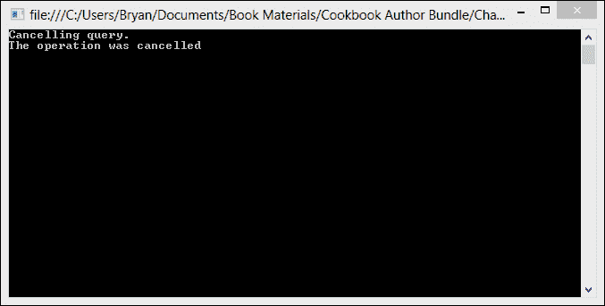

## 它是如何工作的…

在这个菜谱中，我们使用了两个独立的`catch`块，因为并行 LINQ 框架不会将`OperationCanceledExceptions`合并到`AggregateException`中；`OperationCanceledException`必须在单独的`catch`块中处理，否则它将不会被处理。

如果你有一个或多个委托，请使用`CancellationToken`抛出`OperationCanceledException`，但不要抛出任何其他异常。然后，并行 LINQ 将只抛出一个`OperationCanceledException`而不是`System.AggregateException`。然而，如果一个委托抛出`OperationCanceledException`而另一个委托抛出另一种`Exception`类型的异常，那么这两个异常都将合并到`AggregateException`中。因此，每次你使用`WithCancellation`扩展方法创建 PLINQ 查询时，建议你创建两个`catch`块：一个用于`OperationCancelledException`，另一个用于`AggregateException`。

# 执行归约操作

就像顺序 LINQ 一样，并行 LINQ 提供了许多常见的聚合操作，如求和、平均值、最小值和最大值。通过使用 LINQ 的扩展方法之一执行聚合操作非常简单。

然而，有时我们需要对源数据进行自定义聚合，要么是因为我们需要执行标准聚合扩展方法中未提供的计算，要么是因为我们需要对计算应用自定义逻辑。

对于此类情况，并行 LINQ 为我们提供了一个`aggregate`方法，可以在数据序列上并行应用自定义累加函数。

在这个菜谱中，我们将创建一个自定义聚合操作，用于计算大量数字的平均值。

## 如何做…

现在，让我们看看如何使用 PLINQ 执行自定义聚合。

1.  使用 **C# Console Application** 项目模板启动一个新的项目，并将 `Average` 作为 **解决方案名称**。

1.  在 `Program` 类的顶部添加以下 `using` 指令：

    ```cs
    using System;
    using System.Linq;
    ```

1.  首先，让我们在 `Main` 方法中添加一些代码来创建一个随机数字的范围。

    ```cs
    var random = new Random();
    var numbers = ParallelEnumerable.Range(1, 1000).OrderBy(i => random.Next()).ToArray();
    ```

1.  现在，让我们创建一个 PLINQ 查询，调用 `ParallelEnumerable` 的 `Aggregate` 扩展方法，将计算平均值的委托传递给 `intermediateReduceFunc`、`finalReduceFunc` 和 `resultSelector` 参数。将结果显示到 `Console`，并在退出前等待用户输入。

    ```cs
    var result = numbers.AsParallel().Aggregate(() => new double[2],
        (accumulator, elem) => { accumulator[0] += elem; accumulator[1]++; return accumulator; },
        (accumulator1, accumulator2) => { accumulator1[0] += accumulator2[0]; accumulator1[1] += accumulator2[1]; return accumulator1; },
        accumulator => accumulator[0] / accumulator[1]);
    ```

1.  最后，将结果显示到 `Console` 并在退出前等待用户输入。

    ```cs
    Console.WriteLine("Result: {0}",result);
    Console.ReadLine();
    ```

1.  在 Visual Studio 2012 中，按 *F5* 运行项目。你应该会看到以下截图所示的输出：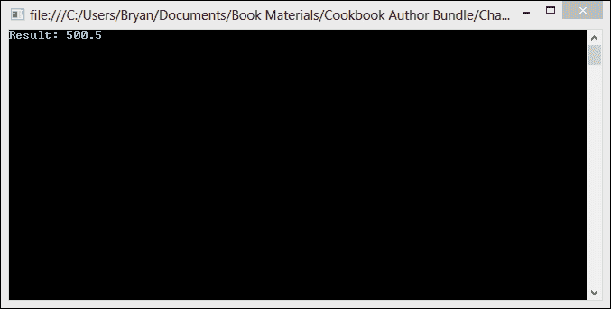

## 它是如何工作的…

聚合操作是一种迭代输入数据元素序列的操作，维护一个包含中间结果的累加器。在每一步，一个归约函数将当前元素和累加器值作为输入，并产生一个将覆盖累加器的值。最终的累加器值是计算的结果。

`ParallelEnumerable` 类提供了 `aggregate` 扩展方法的几个重载。我们使用以下重载：

```cs
public static TResult Aggregate<TSource, TAccumulate, TResult>(
  this ParallelQuery<TSource> source,
  Func<TAccumulate> seedFactory,
  Func<TAccumulate, TSource, TAccumulate> updateAccumulatorFunc,
  Func<TAccumulate, TAccumulate, TAccumulate> combineAccumulatorsFunc,
  Func<TAccumulate, TResult> resultSelector
)
```

`seedFactory` 函数返回初始累加器值。`updateAccumularorFunc` 参数是一个在分区中的每个元素上被调用的累加器函数。`combineAccumulatorsFunc` 参数是一个在从每个分区产生的累加器结果上被调用的累加器函数。最后，`resultSelector` 参数是一个将最终累加器值转换为结果值的函数。

我们为这些函数参数中的每一个都提供了一个自己的委托。

```cs
numbers.AsParallel().Aggregate(() => new double[2], //Seed factory
    (accumulator, elem) =>  //Update accumulator function
  { 
    accumulator[0] += elem; 
    accumulator[1]++; 
    return accumulator; 
  },
    (accumulator1, accumulator2) =>  //Combine accumulator function
  { 
    accumulator1[0] += accumulator2[0]; 
    accumulator1[1] += accumulator2[1]; 
    return accumulator1; 
  },
    accumulator => accumulator[0] / accumulator[1]); //Result selector function
```

# 创建自定义分区器

要并行化对数据源的操作，一个基本步骤是将源分区成多个部分，以便多个线程可以并发访问。Parallel LINQ 提供了适用于大多数并行查询的默认分区器。然而，对于更高级的场景，你也可以创建自己的分区器。

对于这个配方，我们将创建一个自定义静态分区器，它将把我们的数据源分割成可变数量的分区块。确切的分区数将由 TPL 本身指定，并通过重写 `Partitioner<T>` 方法提供给我们的自定义分区器。然后，我们将测试使用默认分区和我们的自定义分区器进行查询的性能。

## 如何操作…

让我们看看如何为并行查询分区数据。

1.  使用 **C# Console Application** 项目模板启动一个新的项目，并将 `CustomPartitioner` 作为 **解决方案名称**。

1.  在项目中添加一个新类，并将其命名为 `CustomPartitioner.cs`。

1.  在你的`CustomPartitioner`类的顶部添加以下`using`指令：

    ```cs
    using System.Collections.Concurrent;
    using System.Collections.Generic;
    ```

1.  将泛型类型参数应用到`CustomPartitioner`类上，并将`Partitioner<T>`声明为其基类。可选地，将类的可见性标记为内部。

    ```cs
    internal class CustomPartitioner<T> : Partitioner<T>
    {

    }
    ```

1.  创建一个私有的源字段，类型为数组`T`，并使用`Class`构造函数初始化源数据。

    ```cs
    internal class CustomPartitioner<T> : Partitioner<T>
    {
      private readonly T[] _source;

        // Class constructor. Initializes source data to array
      public CustomPartitioner(T[] sourceData)
        {
            _source = sourceData;
        }
    }
    ```

1.  覆盖基类的`SupportsDynamicPartitions`属性，返回`false`。这个分区器只能静态分配分区。

    ```cs
    public override bool SupportsDynamicPartitions
    {
        get
        {
            return false;
        }
    }
    ```

1.  添加一个`GetItems`方法，它返回源中的`IEnumerator<T>`。

    ```cs
    internal IEnumerator<T> GetItems(int start, int end)
    {
        for (var index = start; index < end; index++)
            yield return _source[index];
    }
    ```

1.  通过覆盖基类的`GetPartitions`方法来完成`CustomPartitioner`类的实现。这个方法将返回`List<IEnumerable<T>>`，这是我们分区数据的一个列表。

    ```cs
    public override IList<IEnumerator<T>> GetPartitions(int partitionCount)
    {
        IList<IEnumerator<T>> partitionedData = new List<IEnumerator<T>>();
        var items = _source.Length / partitionCount;
        for (var index = 0; index < partitionCount - 1; index++)
        {
            partitionedData.Add(GetItems(index * items, (index + 1) * items));
        }
        partitionedData.Add(GetItems((partitionCount - 1) * items, _source.Length));
        return partitionedData;
    }
    ```

关于`CustomPartitioner`类就到这里。现在让我们转到`Program`类：

1.  在类的顶部添加以下`using`指令：

    ```cs
    using System;
    using System.Diagnostics;
    using System.Linq;
    ```

1.  在`Program`类的`Main`方法中添加一些代码来创建一个大型随机数字数组，我们将使用它作为查询的源。同时，创建一个`stopWatch`对象，我们将用它来捕获性能数据。

    ```cs
    var stopWatch = new Stopwatch();
    var random = new Random();
    var source = Enumerable.Range(1, 10000000).OrderBy(i => random.Next()).ToArray();
    ```

1.  接下来，让我们开始`stopWatch`并针对源数据运行一个查询，以选择每个数字的平方。这个查询使用默认分区。

    ```cs
    stopWatch.Start();
    source.AsParallel()
        .WithExecutionMode(ParallelExecutionMode.ForceParallelism)
        .Select(item => Math.Sqrt(item));
        stopWatch.Stop();
        Console.WriteLine("PLINQ with no partioner ran in {0} ticks", stopWatch.ElapsedTicks );
    ```

1.  最后，让我们重置`stopWatch`，使用我们自定义的分区器运行查询，显示结果，并在退出前等待用户输入。

    ```cs
    var partitioner = new CustomPartitioner<int>(source);

    stopWatch.Reset();
    stopWatch.Start();

    partitioner.AsParallel()
        .WithExecutionMode(ParallelExecutionMode.ForceParallelism)
        .Select(item => Math.Sqrt(item));

    stopWatch.Stop();
    Console.WriteLine("PLINQ with custom partioner ran in {0} ticks", stopWatch.ElapsedTicks);

    Console.ReadLine();
    ```

1.  在 Visual Studio 2012 中，按*F5*键运行项目。你应该会看到以下截图所示的输出：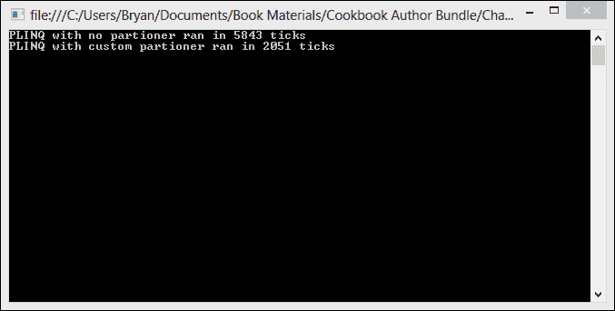

## 它是如何工作的…

在某些情况下，创建自己的分区器可能是有价值的，但大部分情况下，默认的分区效果相当不错。

要创建一个基本的自定义分区器，从`System.Collections.Concurrent`中的`Partitioner<TSource>`派生一个类，并重写几个虚拟方法和一个虚拟属性获取器。

我们为`SupportsDynamicPartitions`属性提供了一个覆盖，以表明我们的简单自定义分区器只支持静态分区，通过返回`true`。

```cs
public override bool SupportsDynamicPartitions
{
    get
    {
        return false;
    }
}
```

如果我们表明这个分区器支持动态分区，我们就会想要提供一个对`GetDynamicPartitions`方法的覆盖，这个方法可以用来代替`GetPartitions`方法用于动态分区器。

在我们的例子中，我们只需要提供一个对`GetPartitions`方法的覆盖。这个方法返回`IList<IEnumerator<TSource>>`，它代表我们的实际分区数据。

```cs
public override IList<IEnumerator<T>> GetPartitions(int partitionCount)
{
    IList<IEnumerator<T>> partitionedData = new List<IEnumerator<T>>();
    var items = _source.Length / partitionCount;
    for (var index = 0; index < partitionCount - 1; index++)
    {
        partitionedData.Add(GetItems(index * items, (index + 1) * items));
    }
    partitionedData.Add(GetItems((partitionCount - 1) * items, _source.Length));
    return partitionedData;
}
```

最后，我们提供了一个`GetItems`方法，这是一个辅助方法，`GetPartitions`使用它来获取源数据中项的枚举器。

```cs
internal IEnumerator<T> GetItems(int start, int end)
{
    for (var index = start; index < end; index++)
        yield return _source[index];
}
```
