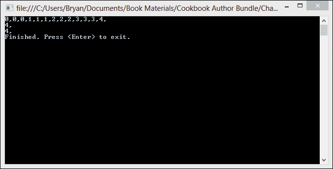
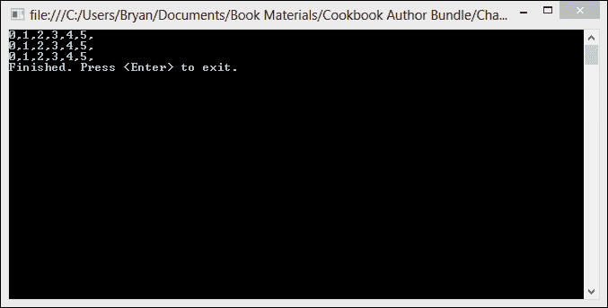
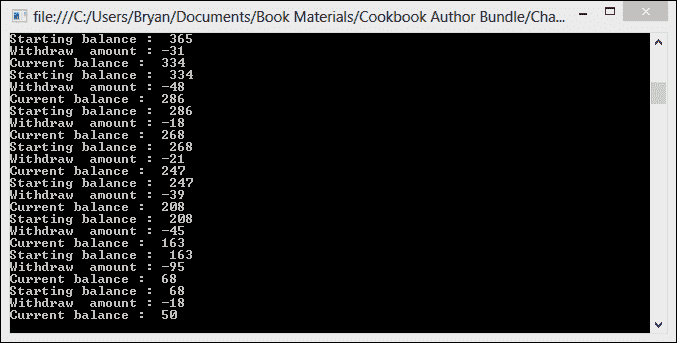
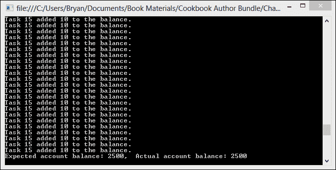
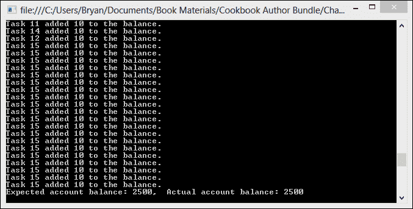
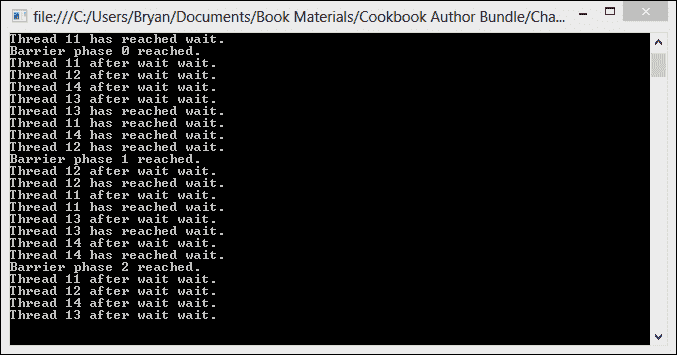
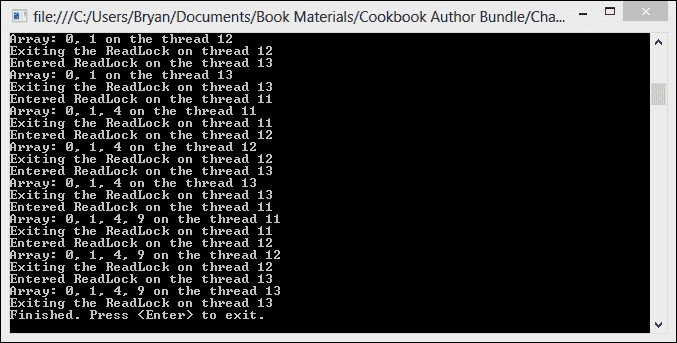
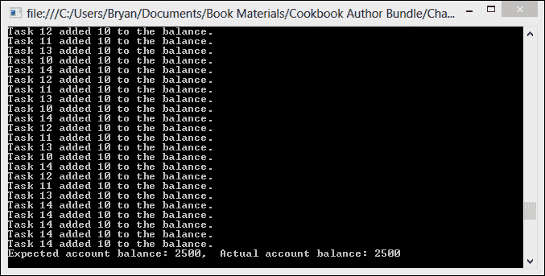
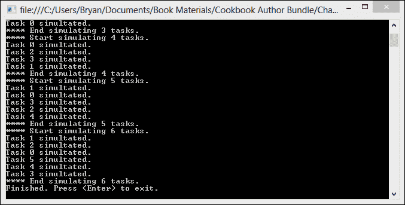
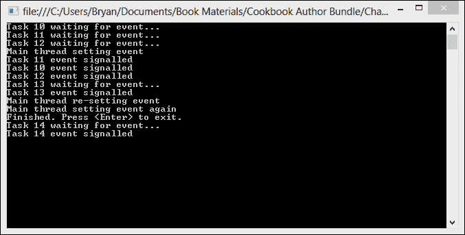

# 第六章。同步原语

在本章中，我们将介绍以下菜谱：

+   使用监视器

+   使用互斥锁

+   使用 `SpinLock` 进行同步

+   互锁操作

+   使用屏障同步多个任务

+   使用 `ReaderWriterLockSlim`

+   使用 Mutex 与 `WaitHandles` 结合

+   使用 `CountdownEvent` 等待多个线程

+   使用 `ManualResetEventSlim` 进行自旋和等待

+   使用 `SemaphoreSlim` 限制访问

# 简介

本章是关于协调并行任务执行的工作。

当并发任务在没有适当的同步机制的情况下从变量中读取和写入时，可能会出现 **竞态条件**。竞态条件可能导致程序中出现不一致的结果，并且可能非常难以检测和纠正。

让我们花点时间来理解什么是竞态条件。考虑一个有两个并行任务；task1 和 task2 的场景。每个任务都尝试读取和增加一个公共变量的值。task1 读取变量的原始值，比如说 10，并将值增加到 11。同时，task1 正在读取变量的值，但在它增加值之前，task2 读取相同的值 10 并增加到 11。变量的最终值最终变成了 11，而不是正确的值 12。

**.NET 框架 4.5** 为并行编程提供了几个新的数据结构，这些数据结构简化了复杂的同步问题。了解这些同步原语将使您能够实现更复杂的算法并解决与多线程编程相关的大量问题。了解各种替代方案非常重要，这样您就可以为需要多个任务之间通信和同步的场景选择最合适的方案。

# 使用监视器

监视器，就像锁语句一样，是一种确保一次只有一个线程可以运行在代码关键部分的机制。监视器有一个锁，一次只有一个线程可以获取它。要运行在代码的关键部分，线程必须获取监视器。当一个线程拥有对象的锁时，没有其他线程可以获取该锁。

对于这个菜谱，我们将创建一个应用程序，该应用程序使用一个具有 `WriteNumbers` 方法的 `ConsoleWriter` 类将一些数字写入控制台。三个并行任务将各自尝试将一些数字写入控制台，我们将使用监视器来控制对代码关键部分的访问。

## 如何操作…

看看以下步骤：

1.  使用 **C# 控制台应用程序** 项目模板启动一个新的项目，并将 `MonitorExample` 作为 **解决方案名称** 指定。

1.  向您的项目中添加一个新的类，并将该类命名为 `ConsoleWriter.cs`。

1.  将以下代码片段添加到 `ConsoleWriter` 类的顶部，使用指令：

    ```cs
    using System;
    using System.Threading;
    ```

1.  首先，在您的 `ConsoleWriter` 类的声明内部，创建一个类型为 object 的私有成员变量，我们将使用它作为我们的锁对象。

    ```cs
    public class ConsoleWriter
    {
      private object _locker = new object(); 
    }
    ```

1.  现在我们为`ConsoleWriter`类创建一个名为`WriteNumbersUnprotected`的方法。这是一个简单的执行`for`循环的方法。循环的每次迭代都会将循环索引的数字写入控制台。正如你可能从方法名中猜到的，我们不会使用监视器来锁定此方法的临界区。

    ```cs
    public void WriteNumbersUnprotected()
    {
      for (int numbers = 0; numbers < 5; numbers++)
      {
        Thread.Sleep(100);
        Console.Write(numbers + ",");
      }
      Console.WriteLine();
    }
    ```

1.  现在我们为`ConsoleWriter`类创建一个名为`WriteNumbers`的方法。这个方法将具有与我们之前创建的方法相同的函数功能。然而，这个方法将使用监视器来确保只有一个线程可以进入代码的临界区。

    ```cs
    public void WriteNumbers()
    {
      Monitor.Enter(_locker);
      try
      {
        for (int number = 0; number <= 5; number++)
        {
          Thread.Sleep(100);
          Console.Write(number + ",");
        }
        Console.WriteLine();
      }
      finally
      {
        Monitor.Exit(_locker);
      }
    }
    ```

1.  现在，让我们回到`Program`类。使用指令将以下代码片段添加到`Program`类的顶部：

    ```cs
    using System;
    using System.Collections.Generic;
    using System.Threading.Tasks;
    ```

1.  在`Program`类的`Main`方法中，首先创建并实例化一个`ConsoleWriter`实例。同时创建一个任务列表，我们将使用它来保存对任务的引用。

    ```cs
    static void Main(string[] args)
    {  
      var writer = new ConsoleWriter();
      var taskList = new List<Task>();	
    }
    ```

1.  现在，让我们创建一个`for`循环，创建并启动三个任务。每个任务将调用共享`ConsoleWriter`对象的`WriteNumbersUnprotected`方法。

    ```cs
    for (int i = 0; i < 3; i++)
    {
      taskList.Add(Task.Factory.StartNew(()=>
        {
          writer.WriteNumbersUnprotected();
        }));                
    }
    ```

1.  通过等待任务完成并在退出前等待用户输入来完成`Program`类的`Main`方法。

    ```cs
    Task.WaitAll(taskList.ToArray());
    Console.WriteLine("Finished. Press <Enter> to exit.");
    Console.ReadLine();
    ```

1.  现在，在 Visual Studio 2012 中按*F5*来运行项目。你可能会看到一些相当丑陋的输出，因为多个线程同时调用该方法。看看下面的屏幕截图：

1.  让我们回到`Program`类的`Main`方法中的任务，并将它们现在改为调用带有监视器保护代码临界区的`WriteNumbers`方法。

    ```cs
    for (int i = 0; i < 3; i++)
    {
      taskList.Add(Task.Factory.StartNew(()=>
        {
          writer.WriteNumbers();
        }));                
    }
    ```

1.  让我们再次按*F5*来运行项目。这次你应该看到更有序的输出，因为一次只有一个线程可以进入临界区。这在上面的屏幕截图中有显示：

## 它是如何工作的…

锁和监视器非常相似。实际上，`lock`关键字是通过`Monitor`类实现的。当使用`Monitor`时，开发者必须更加小心，显式地使用`exit`来移除锁。Lock 隐式调用`Enter`和`Exit`，但使用`Monitor`时，它们必须由开发者调用。最佳实践是在`finally`块中调用`exit`，以确保在发生`Exception`时释放锁。

```cs
Monitor.Enter(_locker);
try
{
	// Critical Section
}
finally
{
  Monitor.Exit(_locker);
```

通常，使用`lock`比直接使用`Monitor`更受欢迎。这是因为`lock`更简洁，并且确保即使在受保护的代码抛出`Exception`时，底层的监视器也会被释放。

然而，`lock`关键字并不像`Monitor`类那样功能全面。例如，`Monitor`有一个`TryEnter`方法，可以在指定的时间内等待`lock`，而不是无限期地等待。

# 使用互斥锁

锁定在并行程序中是必不可少的。它限制了代码不能同时被多个线程执行。独占锁定用于确保一次只有一个线程可以进入代码的特定部分。

在 C#中使用同步的最简单方法是使用`lock`关键字。`lock`关键字通过为运行语句的对象获取互斥锁来标记代码块为关键部分，然后释放锁。

在这个菜谱中，我们将创建一个表示银行账户的类。这个类的对象将被几个并行任务共享，这些任务将进行一系列随机金额的提款。`Withdraw`方法中更新共享账户对象余额的关键代码部分将通过`lock`语句进行保护。

## 如何操作…

让我们去 Visual Studio 2012 看看如何使用互斥锁的以下步骤：

1.  使用**C#控制台应用程序**项目模板创建一个新的项目，并将`LockExample`作为**解决方案名称**。

1.  向项目中添加一个新的类，并将其命名为`Account.cs`。

1.  将以下代码片段使用指令添加到你的`Account`类顶部：

    ```cs
    using System.Text;
    using System.Threading.Tasks;
    ```

1.  在`Account`类中添加一个类型为`double`的私有字段来存储账户余额以及一个用于锁定的私有对象。

    ```cs
    private double _balance;
    private object _locker = new object();
    ```

1.  接下来，让我们为`Account`类添加一个构造函数。这个构造函数应该接受一个类型为`double`的参数，并初始化`balance`字段。

    ```cs
    public Account(double initialBalance)
    {
     _balance = initialBalance;
    }

    ```

1.  现在让我们为账户创建一个`Withdraw`方法。如果账户余额为负，则`Withdraw`方法应抛出错误。否则，`Withdraw`方法应获取对`Account`对象的互斥锁，并从余额中扣除请求的金额。

    ```cs
    public double Withdraw(double amount)
    {

      if (_balance < 0)
      throw new Exception("Account has a negative balance.");
      }

      lock (_locker)
      {
        if (_balance >= amount)
        {
          Console.WriteLine("Starting balance :  " + _balance);
          Console.WriteLine("Withdraw  amount : -" + amount);
          _balance = _balance - amount;
          Console.WriteLine("Current balance :  " + _balance);
          return amount;
        }
        else
        {
          return 0;
        }
      }
    }
    ```

1.  现在，让我们回到我们的`Program`类。确保添加以下代码片段使用指令，这些指令位于`Program`类顶部：

    ```cs
    using System;
    using System.Threading.Tasks;
    ```

1.  为`Program`类创建一个静态的`DoTransactions`方法。`DoTransactions`方法应该循环十次，每次进行随机金额的提款。

    ```cs
    static void DoTransactions(Account account)
    {
      Random r = new Random();
      for (int i = 0; i < 10; i++)
      {
        account.Withdraw((double)r.Next(1, 100));
      }
    }
    ```

1.  最后，在`Program`类的`Main`方法中，让我们创建一个共享的账户对象和两个将并发执行提款的任务。完成之后，等待用户输入再退出。

    ```cs
    static void Main(string[] args)
    {
      Account account = new Account(1000);
      Task task1 = Task.Factory.StartNew(() => DoTransactions(account));
      Task task2 = Task.Factory.StartNew(() => DoTransactions(account));
      Console.ReadLine();
    }
    ```

1.  在 Visual Studio 2012 中，按*F5*运行项目。你应该会看到类似于以下截图的输出：

## 它是如何工作的…

`lock`关键字是 C#语言中用于`System.Threading`的`Monitor`类的快捷方式。基本上，`lock`关键字确保当另一个线程在关键部分时，线程不能进入关键代码部分；以下是在`lock`语句作用域内的代码：

### 小贴士

关键部分只是一段访问必须不能被多个线程并发访问的共享资源的代码。

```cs
lock (this)
{
  //This is the critical section
}
```

如果一个线程尝试进入被锁定的代码部分，它将会阻塞并等待直到被锁定的对象被释放。当锁定线程退出锁的作用域时，锁将被释放。`lock` 关键字在作用域的开始调用 `System.Threading.Monitor.Enter`，在作用域的结束调用 `System.Threading.Monitor.Exit`。

注意，我们创建了一个私有的可锁定对象来锁定，而不是锁定 `Account` 类的实例。这是最佳实践。一般来说，你应该避免锁定在公共类型上或锁定在代码控制之外的对象实例上。如果另一个程序员锁定你的类来同步他们的数据，可能会发生死锁。死锁是一种情况，其中两个或多个竞争线程都在等待对方完成工作并释放锁，因此没有一个线程能够完成。还要注意，锁只能获取引用类型。

# 使用 SpinLock 进行同步

**SpinLock** 是一种特殊用途的锁，只有在锁竞争相对较少且锁持有时间总是非常短的情况下才应使用。与通过使用本质上是一个等待事件来工作的监视器和其它锁类型不同；SpinLock 在一个循环中等待并重复检查直到锁可用。由于减少了线程上下文切换，SpinLock 可能比监视器锁更快。然而，由于线程在循环中旋转，如果锁被长时间持有，SpinLock 可能会导致高 CPU 使用率。

在这个菜谱中，我们将重新访问我们的银行账户解决方案，该解决方案将有一个共享的银行账户对象，它将由多个并行任务更新。每个任务都将有权访问共享的账户对象，并使用 SpinLock 来管理并发。

## 如何操作…

让我们创建一个新的控制台应用程序，通过以下步骤来了解如何使用 SpinLock 进行同步：

1.  使用 **C# 控制台应用程序** 项目模板启动一个新的项目，并将 `SpinBasedLocking` 作为 **解决方案名称**。

1.  将以下代码片段使用指令添加到 `Program` 类的顶部：

    ```cs
    using System;
    using System.Collections.Generic;
    using System.Threading;
    using System.Threading.Tasks;
    ```

1.  在 `Program` 类之后，但在 `SpinBasedLocking` 命名空间内部，为 `Account` 类创建一个非常简单的定义。这个类只需要一个 `public integer` 字段用于余额。

    ```cs
    class Account
    {
      public int Balance { get; set; }
    }
    ```

1.  现在，在 `Program` 类的 `Main` 方法中，让我们首先创建共享的账户对象、一个 `SpinLock` 和一个用于存储我们的任务的列表。

    ```cs
    var account = new Account();
    var spinLock = new SpinLock();
    var taskList = new List<Task>();
    ```

1.  接下来，让我们在 `Main` 方法中添加一个 `for` 循环来创建五个任务。每个任务将循环多次更新余额并使用 `SpinLock` 来管理并发访问。`SpinLock` 应该在 `try` 块中获取并在 `finally` 块中释放。

    ```cs
    for (int i = 0; i < 5; i++)
    {
      taskList.Add(Task.Factory.StartNew(() =>
      {
        for (int x = 0; x < 50; x++)
        {
          bool lockAquired = false;
          try
          {
            spinLock.Enter(ref lockAquired); 
            Thread.Sleep(50);
            account.Balance = account.Balance + 10;
            Console.WriteLine("Task {0} added 10 to the balance.", 
                Thread.CurrentThread.ManagedThreadId);     
          }
          finally
          {
            if(lockAquired) spinLock.Exit();
          }
        }
      }));
    }
    ```

1.  通过等待所有任务完成并在退出前等待用户输入来完成 `Main` 方法。

    ```cs
    Task.WaitAll(taskList.ToArray());
    Console.WriteLine("Expected account balance: 2500,  Actual account balance:      {0}", account.Balance);
    Console.ReadLine();
    ```

1.  在 Visual Studio 2012 中，按 *F5* 运行项目。你应该会看到类似以下截图的输出：

## 它是如何工作的…

SpinLock 可以用来避免在我们的应用程序中发生阻塞，但如果我们预期会有大量的阻塞，那么可能不应该使用 SpinLock，因为过度的自旋可能会使情况变得更糟。然而，如果临界区执行的工作量非常小，并且等待锁的时间也很短，那么自旋锁定可能是一个不错的选择。

`SpinLock`的`enter`方法接受一个`Boolean`参数，表示锁是否成功获取。即使在`Exception`的情况下，我们也可以检查`Boolean`参数，以可靠地确定锁是否成功获取。

```cs
bool lockAquired = false;
try
{
  spinLock.Enter(ref lockAquired); 
  //Critical section                               
}
finally
{
  if(lockAquired) spinLock.Exit();
}
```

应该在`finally`块中退出`SpinLock`以确保锁被释放。在退出之前，您还应该使用`Boolean`参数检查锁是否实际上被持有，因为在一个未持有的锁上调用`exit`会产生错误。

# 互锁操作

在大多数情况下，锁定相对安全，但有些情况下锁定可能不是安全的解决方案。这些情况包括增加或减少变量的值、向变量中添加或从变量中减去，以及交换两个变量。这些操作看起来像是原子操作，但实际上并不是。

例如，增量或减量操作包括三个步骤。第一步是从变量中加载值到寄存器，第二步是增加变量的值，第三步是将增加后的值存储回变量。

问题在于，线程可以在前两步之后被抢占，而另一个线程可以在变量的增量值被保存回寄存器中的变量之前开始执行。在此期间，第二个线程可以继续执行所有三个步骤。之后，第一个线程执行第三个步骤并覆盖计数器变量的值。现在，第二个线程执行的操作就丢失了。

那么，我们如何避免这种情况呢？这就是互斥锁的作用所在。`Interlock`类提供了可以用来增加/减少值以及交换两个变量之间数据的成员。`Interlock`类为在多个并发线程之间共享的变量提供了原子操作。

在这个菜谱中，我们将创建一个应用程序，它有一个银行账户对象，该对象将由多个并行任务更新。每个任务都将有权访问共享的账户对象，该对象只有一个公共字段用于余额。任务将使用`Interlocked.Add`将账户余额作为一个原子操作更新。

## 如何做到这一点…

现在，让我们看看如何在控制台应用程序中使用互锁的以下步骤：

1.  使用**C#控制台应用程序**项目模板开始一个新的项目，并将`InterlockedExample`作为**解决方案名称**。

1.  将以下代码片段使用指令添加到`InterlockedExample`命名空间顶部：

    ```cs
    using System;
    using System.Collections.Generic;
    using System.Threading;
    using System.Threading.Tasks;
    ```

1.  在`Program`类之后，但在`InterlockedExample`命名空间内部，为`Account`类创建一个非常简单的定义。这个类只需要一个`public integer`字段来表示余额。

    ```cs
    class Account
    {
      public int Balance = 0;
    }
    ```

1.  现在，在`Program`类的`Main`方法中，让我们首先创建共享的账户对象和一个`Task`列表来保存我们的任务。

    ```cs
    static void Main(string[] args)
    {
      var account = new Account();            
      var taskList = new List<Task>();  
    }
    ```

1.  接下来，让我们在`Main`方法中添加一个`for`循环来创建五个任务。每个任务将循环多次，并使用`Interlocked.Add`以原子操作增加`Account`对象的余额。

    ```cs
    for (int i = 0; i < 5; i++)
    {
      taskList.Add(Task.Factory.StartNew(() =>
      {
        for (int x = 0; x < 50; x++)
        {
          Thread.Sleep(50);
          Interlocked.Add(ref account.Balance, 10);
          Console.WriteLine("Task {0} added 10 to the balance.", 
            Thread.CurrentThread.ManagedThreadId);                       
        }
      }));
    }
    ```

1.  通过等待所有任务完成并在退出之前等待用户输入来完成`Main`方法。

    ```cs
    Task.WaitAll(taskList.ToArray());
    Console.WriteLine("Expected account balance: 2500,  
        Actual account balance: {0}", account.Balance);
    Console.ReadLine();
    ```

1.  在 Visual Studio 2012 中，按*F5*运行项目。您应该看到类似于以下截图的输出：

## 它是如何工作的…

可以使用`Interlocked`代替锁定机制，以提供对共享变量的简单且快速的运算。

`Interlocked`的使用非常简单。您只需使用其`static`方法自动向变量中添加、减去、增加、减少或交换值。

```cs
Interlocked.Add(ref account.Balance, 10);
```

这些`static`方法将数学运算改为原子操作。这意味着在调用期间不能对值执行其他操作，并且操作不会受到线程之间上下文切换的影响。

# 使用屏障同步多个任务

当您需要一些任务执行一系列并行阶段，并且每个阶段需要在所有其他任务完成上一个阶段后开始时，您可以使用屏障来同步和协调这项工作。简而言之，屏障阻止单个任务继续，直到所有任务都达到屏障。

团队中的每个任务都被称为参与者，并且表示它在每个阶段已经达到障碍，并在继续之前等待所有其他参与者发出到达障碍的信号。可选地，您还可以指定一个超时时间，以避免在某个任务未能达到障碍时发生的死锁。

在这个菜谱中，我们将创建一个控制台应用程序，它有四个参与者任务，这些任务执行一个带有`for`循环的方法。循环的每次迭代都是由屏障控制的阶段。任务将在达到屏障时发出信号，并在继续之前等待所有其他任务。

## 如何做到这一点...

让我们创建一个新的控制台应用程序，并查看以下步骤，了解如何使用屏障同步任务：

1.  使用**C#控制台应用程序**项目模板启动一个新的项目，并将`Barrier`作为**解决方案名称**。

1.  使用指令将以下代码片段添加到`Program`类的顶部：

    ```cs
    using System;
    using System.Threading;
    using System.Threading.Tasks;
    ```

1.  首先，在`Program`类中，让我们使用一个名为`OperationWithBarrier`的`static`方法，它接受一个`Barrier`对象作为参数。

    ```cs
    static void OperationWithBarrier(Barrier barrier)
    {

    }
    ```

1.  现在，在`OperationWithBarrier`方法的主体中，让我们创建一个循环三次的`for`循环。在每次循环中，获取执行线程的`threadId`，然后发出信号表示线程已达到屏障。

    ```cs
    for (int i = 0; i < 3; ++i)
    {
      var threadId = Thread.CurrentThread.ManagedThreadId;
      Console.WriteLine("Thread {0} has reached wait.", threadId);
      barrier.SignalAndWait(100);
      Console.WriteLine("Thread {0} after wait wait.", threadId);
    }
    ```

1.  在`Program`类的`Main`方法中，让我们创建一个具有四个参与者和一个后阶段动作的`Barrier`对象，该动作在达到每个屏障阶段时写入控制台。

    ```cs
    var barrier = new Barrier(4, (b) => 
      Console.WriteLine("Barrier phase {0} reached.", b.CurrentPhaseNumber));
    ```

1.  现在，让我们启动四个新的任务，每个任务都运行`OperationWithBarrier`，并将我们刚刚创建的`Barrier`对象作为参数传入。

    ```cs
    var task1 = Task.Factory.StartNew(() => OperationWithBarrier(barrier));
    var task2 = Task.Factory.StartNew(() => OperationWithBarrier(barrier));
    var task3 = Task.Factory.StartNew(() => OperationWithBarrier(barrier));
    var task4 = Task.Factory.StartNew(() => OperationWithBarrier(barrier));
    ```

1.  最后，让我们等待所有任务完成，并在退出之前等待用户输入。

    ```cs
    Task.WaitAll(task1, task2, task3, task4);
    Console.ReadLine();
    ```

1.  在 Visual Studio 2012 中，按*F5*运行项目。你应该会看到类似于以下截图的输出：

## 它是如何工作的…

当你创建一个`Barrier`时，指定参与者的数量；在我们的例子中是四个。`Barrier`构造函数还有一个重载版本，允许你指定一个类型为`Action<Barrier>`的后阶段动作。这个动作将在所有四个任务发出信号达到屏障后触发。

```cs
Barrier barrier = new Barrier(4, (b) => 
  Console.WriteLine("Barrier phase {0} reached.", b.CurrentPhaseNumber));
```

四个任务中的每一个都通过调用`Barrier.SignalAndWait`方法发出信号达到屏障，并等待其他任务。

```cs
barrier.SignalAndWait(100);
```

如果某个参与者的任务未能达到屏障，将发生死锁，因为达到屏障的任务将无限期地等待对`Barrier.SignalAndWait`的第四次调用。为了避免这些死锁，我们使用了`SignalAndWait`方法的重载版本，该版本指定了一个超时时间。超时后，剩余的任务可以自由地继续到下一个阶段。

# 使用 ReaderWriterLockSlim

`ReaderWriterLockSlim`类用于保护一个资源，该资源被多个线程读取，并且一次只有一个线程写入。

`ReaderWriterLockSlim`允许线程进入以下三种模式之一：

+   **读模式**：只要没有线程当前持有写锁或正在等待获取写锁，多个线程就可以进入锁。如果有任何线程持有或正在等待获取写锁，等待进入读模式的线程将被阻塞。

+   **可升级模式**：适用于线程通常执行读取操作，偶尔也可能执行写入操作的情况。

+   **写模式**：一次只能有一个线程处于写模式。如果有一个线程当前持有写锁或正在等待进入写模式，等待进入写模式的线程将被阻塞。如果有线程处于读模式，升级到写模式的线程将被阻塞。

在这个菜谱中，我们将构建一个控制台应用程序，创建一个写入任务将数值写入数组。应用程序还将启动三个读取任务，这些任务读取写入到数组中的值，并使用`StringBuilder`将这些值追加到字符串中。

## 如何实现…

现在，让我们通过查看以下步骤来了解如何使用`ReaderWriterLockSlim`：

1.  使用**C#控制台应用程序**项目模板启动一个新的项目，并将`ReaderWriter`作为**解决方案名称**。

1.  将以下代码片段使用指令添加到`Program`类的顶部：

    ```cs
    using System;
    using System.Collections.Generic;
    using System.Text;
    using System.Threading;
    using System.Threading.Tasks;
    ```

1.  让我们从在`Program`类上创建一个`static`方法开始，我们的写入任务将调用它将值写入数组。`write`方法将请求以写入模式进入锁，并将循环几次，将循环索引的平方写入数组。

    ```cs
    static void Write()
    {
      int id = Thread.CurrentThread.ManagedThreadId;
      for (int i = 0; i < MaxNumberValues; ++i)
      {
        _lock.EnterWriteLock();
        Console.WriteLine("Entered WriteLock on thread {0}", id);
        _array[i] = i*i;
        Console.WriteLine("Added {0} to array on thread {1}", 
            _array[i], id);

        Console.WriteLine("Exiting WriteLock on the thread {0}", 
            id);
        _lock.ExitWriteLock();
        Thread.Sleep(1000);
      }
    }
    ```

1.  现在我们为`Program`类创建另一个名为`Read`的`static`方法，我们的读取任务将使用它从数组中读取值，并使用`StringBuilder`将这些值追加到字符串中。`Write`方法将请求读取锁，并遍历数组的值，将值写入输出字符串。

    ```cs
    static void Read()
    {
      int idNumber = Thread.CurrentThread.ManagedThreadId;
      for (int i = 0; i < MaxNumberValues; ++i)
      {
        _lock.EnterReadLock();
        Console.WriteLine("Entered ReadLock on the thread {0}", 
                  idNumber);
        StringBuilder sbObj = new StringBuilder();
        for (int j = 0; j < i; j++)
        {
          if (sbObj.Length > 0) sbObj.Append(", ");
          sbObj.Append(_array[j]);
        }
        Console.WriteLine("Array: {0} on the thread {1}", sbObj, 
                  idNumber);
        Console.WriteLine("Exiting the ReadLock on thread {0}", 
                  idNumber);
        _lock.ExitReadLock();
        Thread.Sleep(2000);
      }
    }
    ```

1.  接下来，在`Program`类的顶部，让我们创建一个表示最大值的常量，以及为数组和锁创建几个静态字段。

    ```cs
    const int MaxNumberValues = 5;
    static int[] _array = new int[MaxNumberValues];
    static ReaderWriterLockSlim _lock = new ReaderWriterLockSlim();
    ```

1.  现在我们需要创建`program`类的`Main`方法。`Main`方法将有一个任务列表，我们可以使用它来等待。我们需要创建一个单独的写入任务，该任务调用`write`方法，并循环创建三个读取任务，这些任务将调用`reader`方法。完成等待用户输入后退出。

    ```cs
    static void Main(string[] args)
    {
      var taskList = new List<Task>();
      taskList.Add(Task.Factory.StartNew(() => Write()));
      Thread.Sleep(1000);
      for (int i = 0; i < 3; i++)
      {
        taskList.Add(Task.Factory.StartNew(()=>Read()));
      }
      Task.WaitAll(taskList.ToArray());
      Console.WriteLine("Finished. Press <Enter> to exit.");
      Console.ReadKey();
    }
    ```

1.  在 Visual Studio 2012 中，按*F5*运行项目。注意以下截图中的有序结果：

## 它是如何工作的…

`ReaderWriterLockSlim`允许多个线程处于读取模式；允许一个线程以独占锁的写入模式运行，并允许一个具有读取访问权限的线程处于可升级的读取模式。

线程可以以三种模式进入锁：读取模式、写入模式和可升级读取模式。在我们的控制台应用程序中，`Write`方法通过调用`EnterWriteLock`方法请求以写入模式进入锁，而`Read`方法通过调用`EnterReadLock`方法进入读取模式。

任何时候只能有一个线程处于写入模式。当一个线程处于写入模式时，没有其他线程可以以任何模式进入锁。因此，如果当前持有写入锁，我们的任何读取任务都将阻塞。一旦我们的写入任务通过调用`ExitWriteLock`方法释放写入锁，多个读取任务将能够获得读取锁并进入临界区。

# 使用互斥锁的`WaitHandles`

**互斥锁（Mutex**）就像一把锁，但它可以在多个进程之间工作。互斥锁是一种同步原语，也可以用于进程间同步。当两个或多个线程需要同时访问共享资源时，系统需要一个同步机制来确保一次只有一个线程使用该资源。互斥锁是一种同步原语，它只允许一个线程独占访问共享资源。如果一个线程获取了互斥锁，那么想要获取该互斥锁的第二个线程将被挂起，直到第一个线程释放互斥锁。

在这个菜谱中，我们将回到我们的银行账户示例，并构建一个控制台应用程序，该程序创建几个任务来更新共享银行账户对象的余额。这些任务将使用`Mutex`来为每次单个任务提供对余额的访问。

## 如何做到这一点…

让我们创建一个新的控制台应用程序，通过查看以下步骤来了解如何使用`Mutex`：

1.  使用**C#控制台应用程序**项目模板创建一个新的项目，并将`MutexExample`作为**解决方案名称**。

1.  使用指令将以下代码片段添加到`Program`类的顶部：

    ```cs
    using System;
    using System.Collections.Generic;
    using System.Threading;
    using System.Threading.Tasks;
    ```

1.  在`Program`类之后，但在`MutexExample`命名空间内部，为`Account`类创建一个非常简单的定义。这个类只需要一个`public integer`字段来表示余额。

    ```cs
    class Account
    {
      public int Balance { get; set; }
    }
    ```

1.  现在，在`Program`类的`Main`方法中，让我们首先创建共享的账户对象、一个`Mutex`和一个`Task`列表来保存我们的任务。

    ```cs
    var account = new Account();
    var mutex = new Mutex();
    var taskList = new List<Task>();
    ```

1.  接下来，让我们在`Main`方法中添加一个`for`循环来创建五个任务。每个任务将循环多次更新余额，并使用`Mutex`来管理并发访问。`Mutex`应该在`try`块中获取，并在`finally`块中释放。

    ```cs
    for (int i = 0; i < 5; i++)
    {
      taskList.Add(Task.Factory.StartNew(() =>
      {
        for (int x = 0; x < 50; x++)
        {
          bool lockAquired = false;
          try
          {
            lockAquired = mutex.WaitOne();
            Thread.Sleep(50);
            account.Balance = account.Balance + 10;
            Console.WriteLine("Task {0} added 10 to the balance.", 
              Thread.CurrentThread.ManagedThreadId);
          }
          finally
          {
            if (lockAquired) mutex.ReleaseMutex();
          }
        }
      }));
    }
    ```

1.  通过等待所有任务完成并等待用户输入来结束`Main`方法。

    ```cs
    Task.WaitAll(taskList.ToArray());
    Console.WriteLine("Expected account balance: 2500,  
          Actual account balance: {0}", account.Balance);
    Console.ReadLine();
    ```

1.  在 Visual Studio 2012 中，按*F5*运行项目。你应该看到类似于以下截图的输出：

## 它是如何工作的…

基本上，`Mutex`是一种机制，充当标志以防止两个线程同时执行一个或多个操作。

使用`Mutex`类，你调用`WaitHandle.WaitOne`方法来锁定。`WaitOne`方法接受一个`Boolean`参数，表示是否成功获取了锁。即使在`Exception`的情况下，你也可以检查`Boolean`参数来可靠地确定是否成功获取了锁。

```cs
bool lockAquired = false;
try
{
  lockAquired = mutex.WaitOne(); 
  //Critical section                               
}
finally
{
  if(lockAquired) mutex.ReleaseMutex();
}
```

关闭或释放`Mutex`会自动释放它。就像锁语句一样，`Mutex`只能从获取它的同一个线程释放。应该在`finally`块中释放`Mutex`以确保锁被释放。你还应使用`Boolean`参数在退出前检查`Mutex`是否实际上被持有，因为在一个未持有的`Mutex`上调用`ReleaseMutex`会产生错误。

# 使用`CountdownEvent`等待多个线程

一种常见的异步模式是称为 fork/join 并行模式。这通常表现为启动多个工作项，稍后与这些工作项合并。

`CountdownEvent`使用计数初始化。线程可以阻塞等待事件直到计数达到`0`，此时`CountdownEvent`将被设置，线程可以继续执行。

在这个菜谱中，我们将创建一个控制台应用程序，在循环中执行一些模拟工作。我们将初始化一个`CountdownEvent`为少量任务，然后使用指定数量的任务开始模拟工作。每个任务都会减少`CountDownEvent`的值。当`CountDownEvent`达到`0`并被触发时，我们将使用更高的计数重置`CountDownEvent`并重新开始，直到达到最大任务数。

## 如何操作…

现在，让我们看看如何使用`CoundownEven`t 等待多个线程。查看以下步骤：

1.  使用**C#控制台应用程序**项目模板启动一个新的项目，并将`ForkAndJoin`作为**解决方案名称**。

1.  将以下代码片段使用指令添加到你的`Program`类的顶部：

    ```cs
    using System;
    using System.Threading;
    using System.Threading.Tasks;
    ```

1.  在你的`Program`类开始时，首先创建一个用于`CountdownEvent`的静态变量，以及一些表示我们想要开始和结束的任务数量的常量。

    ```cs
    private static CountdownEvent _countdownEvent;
    private const int BEGIN_TASKS = 2;
    private const int END_TASKS = 6;
    ```

1.  在`Program`类的底部，在`Main`方法之后，创建一个新的`static`方法，命名为`SimulateWork`。此方法将接受一个`integer`参数，表示要创建的任务数量。然后，该方法将循环以创建指定数量的任务。任务将稍微休眠并写入一条消息到控制台。当任务执行完毕后，将调用`CountdownEvent`的`Signal`方法以减少计数。

    ```cs
    private static void SimulateTasks(int taskCount)
    {
      for (int i = 0; i < taskCount; i++)
      {
        Task.Factory.StartNew((num) =>
          {
            try
            {
              var taskNumber = (int)num;
              Thread.Sleep(2500);
              Console.WriteLine("Task {0} simultated.", 
                  taskNumber);
            }
            finally
            {
              _countdownEvent.Signal();
            }
          },i);
      }
    }
    ```

1.  在你的`Program`类的`Main`方法中，首先实例化`CountdownEvent`对象。将`Begin_Tasks`常量传递给`CountdownEvent`构造函数，以便在两个任务之后触发事件。

    ```cs
    _countdownEvent = new CountdownEvent(BEGIN_TASKS);
    ```

1.  接下来，在`Main`方法中，创建一个执行`for`循环的任务。循环的每次迭代都应该将`CountdownEvent`重置为我们想要等待的任务数量。然后，任务将调用`SimulateWork`方法并通过调用`CountdownEvent`的`Wait`方法等待任务完成。

    ```cs
    var task1 = Task.Factory.StartNew(() =>
    {
      for (int i = BEGIN_TASKS; i <= END_TASKS; i++)
      {
        Console.WriteLine("**** Start simulating {0} tasks.", i);
        _countdownEvent.Reset(i);
        SimulateTasks(i);
        _countdownEvent.Wait();
        Console.WriteLine("**** End simulating {0} tasks.", i);
      }
    });
    ```

1.  通过在`try`块中等待前一个任务完成并在`finally`块中处理`CountdownEvent`来完成`Main`方法。在退出之前等待用户输入。

    ```cs
    try
    {
      task1.Wait();
      Console.WriteLine("Finished. Press <Enter> to exit.");
    }
    finally
    {
      _countdownEvent.Dispose();
    }
    Console.ReadLine();
    ```

1.  在 Visual Studio 2012 中，按*F5*键运行项目。你应该会看到类似于以下截图的输出：

## 它是如何工作的…

如你所见，`CoutndownEvent`的主要功能是可以在多个任务完成时发出信号。

`CountDownEvent`的构造函数接受一个`integer`参数，用于指定在触发事件之前我们想要等待的初始信号计数。在我们的例子中，我们传递了一个等于两个的常量值。

```cs
_countdownEvent = new CountdownEvent(BEGIN_TASKS);
```

我们等待的事件数量可以通过调用`Reset`方法重置，就像我们在`for`循环中所做的那样。`for`循环的每次迭代都会增加我们等待的事件数量，直到达到我们在另一个常量中指定的最大数量。

```cs
for (int i = BEGIN_TASKS; i <= END_TASKS; i++)
{
  Console.WriteLine("**** Start simulating {0} tasks.", i);
 _countdownEvent.Reset(i);
  SimulateTasks(i);
 _countdownEvent.Wait();
  Console.WriteLine("**** End simulating {0} tasks.", i);
}
```

在调用`SimulateWork`方法并启动所需数量的任务后，我们通过在`CountdownEvent`上调用`WaitMethod`来等待任务完成。

最后，在`SimulateWork`方法中，每个任务都会调用`CountDownEvent`的`Signal`方法来指示它已完成，并减少我们等待的信号计数。

```cs
Task.Factory.StartNew((num) =>
{
  try
  {
    var taskNumber = (int)num;
    Thread.Sleep(2500);
    Console.WriteLine("Task {0} simultated.", taskNumber);
  }
  finally
  {
 _countdownEvent.Signal();
  }
},i);
```

# 使用`ManualResetEventSlim`进行旋转和等待

`ManualResetEventSlim`是一种轻量级同步原语，自.NET Framework 4.0 以来被引入，允许线程通过信号相互通信。

当一个任务开始一项必须在其他任务继续之前完成的操作时，它会调用`Reset`来将`ManualResetEventSlim`置于非信号状态。这个线程可以被视为控制重置事件。调用`ManualResetEventSlim`的`Wait`方法的任务将会阻塞，等待信号。当控制线程完成活动后，它会调用`Set`来指示等待的线程可以继续。然后所有等待的线程都会被释放。

在这个示例中，主应用程序线程将创建一个`ManualResetEventSlim`来协调它启动的五个任务。任务将调用重置事件的`Wait`方法并等待事件被信号。经过一段时间的休眠后，主线程将唤醒并调用重置事件的`Set`方法来释放所有其他任务继续执行。

## 如何操作…

现在，让我们通过以下步骤来了解一下如何使用`ManualResetEventSlim`：

1.  使用**C#控制台应用程序**项目模板启动一个新的项目，并将`SpinAndWait`作为**解决方案名称**。

1.  使用指令将以下代码片段添加到`Program`类的顶部：

    ```cs
    using System;
    using System.Threading;
    using System.Threading.Tasks;
    ```

1.  首先，让我们在`Program`类上创建一个`static`方法，该方法将使用`for`循环来创建和启动五个任务。每个任务将休眠两秒钟，向控制台写入一条消息，并等待主线程设置`ManualResetEventSlim`。

    ```cs
    private static void StartTasks()   
    {   
      for (int i = 0; i < 5; i++)   
      {
        Task.Factory.StartNew(()=>
        {   
          Thread.Sleep(2000);   
          Console.WriteLine("Task {0} waiting for event...", 
            Thread.CurrentThread.ManagedThreadId);   
          resetEvent.Wait();   
          Console.WriteLine("Task {0} event signalled", 
            Thread.CurrentThread.ManagedThreadId);   
        } );   
      }               
    }
    ```

1.  现在，在`Main`方法中，创建一个`ManualResetEventSlim`对象，并调用`StartTasks`方法。

    ```cs
    resetEvent = new ManualResetEventSlim(false); 
    StartTasks();
    ```

1.  现在，让主线程休眠一秒钟，然后调用重置事件对象的`Set`方法，以通知等待的任务。

    ```cs
    Thread.Sleep(1000);
    Console.WriteLine("Main thread setting event");
    resetEvent.Set();
    ```

1.  接着，让主线程休眠`500`毫秒，然后调用重置事件对象的`Reset`方法来停止任何更多任务的继续执行。

    ```cs
    Thread.Sleep(500);
    Console.WriteLine("Main thread re-setting event");
    resetEvent.Reset();
    ```

1.  最后，让主线程再休眠一秒钟，然后调用重置事件的`Set`方法来释放等待的任务。在退出之前等待用户输入。

    ```cs
    Thread.Sleep(1000);
    Console.WriteLine("Main thread setting event again");
    resetEvent.Set();

    Console.WriteLine("Finished. Press <Enter> to exit.");
    Console.ReadLine();
    ```

1.  在 Visual Studio 2012 中，按*F5*键运行项目。你应该会看到类似于以下截图的输出：

## 如何工作…

`ManualResetEventSlim`就像一个门。当你调用`Set`方法时，你打开门，允许任何已经调用`Wait`方法的任务开始运行。调用`Reset`关闭门，任何调用`Wait`的任务都会阻塞，等待事件被设置。当门再次打开时，它们将一次性全部释放。

代码相当简单。我们创建了五个任务，每个任务都会调用重置事件对象的`Wait`方法并阻塞，等待事件被设置。

```cs
Task.Factory.StartNew(()=>
{   
  ...   
  resetEvent.Wait();   
  ...   
} );
```

然后，主线程将休眠一秒钟，释放当前阻塞的任务以运行。然后我们再稍微休眠一会儿，重置，并再次设置事件，释放剩余的任务。

`ManualResetEventSlim`针对短等待时间进行了优化，并且具有在设置次数内旋转的能力。它还有一个更高效的管理实现，并允许通过`CancellationToken`取消`Wait`。

# 使用`SemaphoreSlim`限制访问

信号量通过保持一个计数器来工作。每次线程获取信号量时，计数器都会减少；每次线程返回信号量时，它都会增加。

`SemaphoreSlim`是一个轻量级的信号量，它限制了可以并发访问资源或资源的线程数量。调用`SemaphoreSlim`对象的`Wait`方法的任务将阻塞，直到信号量计数器低于信号量可以授予的请求数量，该数量在构造函数中指定。

在这个菜谱中，主应用程序线程将使用一个`for`循环创建五个任务。每个任务在允许访问模拟的共享资源之前，都会调用一个在`SemaphoreSlim`对象中等待的方法。

## 如何做…

让我们通过查看如何使用`SemaphoreSlim`限制对共享资源的访问来结束本章。请看以下步骤：

1.  使用**C#控制台应用程序**项目模板创建一个新的项目，并将`Solution name`设置为`SemaphoreSlimExample`。

1.  使用指令将以下代码片段添加到程序类的顶部：

    ```cs
    using System;
    using System.Threading;
    using System.Threading.Tasks;
    ```

1.  首先，让我们在`Program`类中创建一个`static`方法，这样我们的每个线程都可以调用它来访问模拟的共享资源。此方法将调用`SemaphoreSlim`对象的`Wait`方法，它将一次只授予三个任务的访问权限。

    ```cs
    static void Enter(object id)
    {
      Console.WriteLine("Task {0} is trying to enter.",id);
      _semaphoreSlim.Wait();
      Console.WriteLine("Task {0} has entered.", id);   
      Thread.Sleep(2000); //Shared resource           
      Console.WriteLine("Task {0} is leaving.", id); 
      _semaphoreSlim.Release();
    }
    ```

1.  现在，在`Main`方法之前，在`Program`类中创建一个静态的`SemaphoreSlim`对象字段，该字段将授予三个访问请求。

    ```cs
    static SemaphoreSlim _semaphoreSlim = new SemaphoreSlim(3);
    ```

1.  `Main`方法只需要在`for`循环中创建和启动五个任务。任务只需要调用`Enter`方法。现在，等待用户输入后再退出。

    ```cs
    for (int i = 1; i <= 5; i++)
    {
      Task.Factory.StartNew((num) =>
        {
          Enter(num);
        }, i);
    }
    Console.ReadLine();
    ```

1.  在 Visual Studio 2012 中，按*F5*运行项目。你应该会看到类似于以下截图的输出：

## 它是如何工作的…

信号量是对共享资源访问限制的强制执行。一旦达到最大容量，就没有更多任务可以进入信号量，直到一个或多个任务完成并终止。其他任务将在队列外积累。然后，对于离开信号量的每个任务，队列中的另一个任务将进入。

使用 `SemaphoreSlim` 是一个简单的两步过程。首先，你需要创建一个所有线程都能看到的 `SemaphoreSlim` 对象。使用构造函数来指定信号量可以同时授予的请求数量。

```cs
static SemaphoreSlim _semaphoreSlim = new SemaphoreSlim(3);
```

在访问共享资源之前，需要在信号量方法上调用 `Wait` 方法。执行将继续进入共享资源，直到指定的任务数量完成。其他所有任务将阻塞，直到当前任务之一退出。退出任务将释放信号量，并通过调用 `Release` 方法减少请求计数。

```cs
static void Enter(object id)
{
	 _semaphoreSlim.Wait();
	//Shared resource   
	_semaphoreSlim.Release();
}
```
