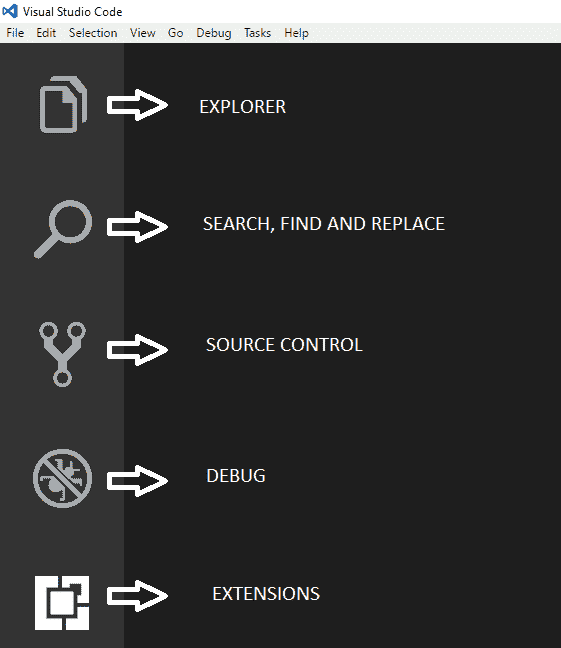
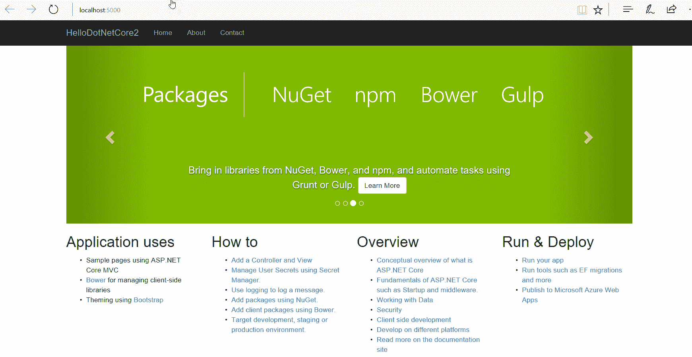

# 入门

在本章中，我们将学习用于在 Windows 和 Linux 操作系统上执行.NET Core 2.0 开发任务的工具。我们还将学习如何使用 VirtualBox 和 Hyper-V 设置 Linux 和虚拟化。本章将涵盖如何为 Windows 和 Linux（Ubuntu）安装.NET Core 2.0 和工具。我们将了解 Ubuntu 的**虚拟机**（**VM**）设置，并创建您的第一个简单的.NET Core 2.0 运行应用程序代码。我们将配置 VM 以管理您的第一个应用程序。本章的目的是让您对所需的工具有一个大致的了解，以及如何为 Windows 和 Linux 安装.NET Core 2.0 SDK，并为您提供基本的 F#理解。

本章将涵盖以下内容：

+   下载 Windows 和 Linux 所需的工具

+   安装.NET Core 2.0 和工具（Windows）

+   设置 Ubuntu Linux 虚拟机

+   安装.NET Core 2.0 和工具（Linux）

+   创建简单可运行的代码

+   F#入门

# 下载 Windows 和 Linux 所需的工具

在本节中，我们将讨论为 Windows 和 Linux 操作系统下载的先决条件，以便开始使用.NET Core 2.0 进行开发。我们将从 Windows 开始，然后转到 Linux。

# Windows 下载

微软为开发者提供了 Visual Studio **集成开发环境**（**IDE**），用于开发适用于 Microsoft Windows 的计算机程序，以及网站、Web 应用、Web 服务和移动应用。微软为我们提供了从四个 Visual Studio 版本中选择的机会——社区版、专业版、企业版和代码版。您可以根据个人需求下载其中一个版本。下面将解释这些版本之间的区别。

在您选择的浏览器中导航到[`www.visualstudio.com/downloads`](https://www.visualstudio.com/downloads)。您将看到四个选项。根据您的需求选择 Visual Studio 产品。

所有版本的 Visual Studio 2017 都适用于 Windows 和 Macintosh 操作系统：

+   **Visual Studio Community**：这是一个具有有限功能的免费开源版本，适用于个人开发者。

+   **Visual Studio Professional**：这个版本为小型团队（五人以下）提供了专业的开发工具、服务和订阅优惠。

+   **Visual Studio Enterprise**：这个版本支持所有 Visual Studio 功能，旨在满足所有规模团队的端到端解决方案开发的需求，以满足对质量和扩展性的严格要求。它非常适合企业组织。这个版本包含的一些关键功能包括测试工具、架构层图、实时依赖项验证、架构验证、代码克隆检测、IntelliTrace、.NET 内存转储分析等等。

+   **Visual Studio Code**：这是一个免费、开源且跨平台（Linux、macOS、Windows）的编辑器，可以通过插件扩展以满足您的需求。它包括调试支持、内嵌 Git 控制、语法高亮、扩展支持、智能代码补全、代码片段和代码重构。

请注意，Visual Studio 是一个集成开发环境 (IDE)，而 Visual Studio Code 是一个编辑器，就像记事本是一个编辑器一样。因此，Visual Studio Code 更轻量级、更快、更流畅，并提供了出色的调试支持和内嵌的 Git 控制。它是一个跨平台编辑器，支持 Windows、Linux 和 Macintosh。调试支持良好，拥有丰富的智能感知和重构功能。像大多数编辑器一样，它以键盘为中心。它是一个基于文件和文件夹的编辑器，不需要了解项目上下文，与 IDE 不同。Visual Studio Code 中没有文件 | 新建项目支持，就像你在 Visual Studio IDE 中所习惯的那样。相反，Visual Studio Code 提供了一个终端，我们可以通过它运行 dotnet 命令行来创建新项目。

因此，在 Windows 上进行开发时，我们可以使用这两个中的任何一个：

+   Visual Studio 2017 集成开发环境 (IDE)

+   Visual Studio Code 编辑器

如果我们选择 Visual Studio 2017，我们只需要从 [`www.visualstudio.com/downloads`](https://www.visualstudio.com/downloads) 下载 Visual Studio 2017 版本 15.3。它捆绑了 .NET Core 2.0 SDK 以及其模板，因此安装后我们就可以立即开始开发了。此外，使用 Visual Studio 2017，一旦我们创建一个 F# 项目或首次打开一个 F# 项目，F# 工具就会自动安装。因此，F# 开发环境也得到了妥善处理。我们将在本章的 *安装 .NET Core 2.0 和工具 (Windows)* 部分看到 Visual Studio 2017 的安装过程。

如果我们选择 Visual Studio Code 进行开发，我们需要从 [`code.visualstudio.com/download`](https://code.visualstudio.com/download) 下载 Visual Studio Code，并从 [`www.microsoft.com/net/core#windowscmd`](https://www.microsoft.com/net/core#windowscmd) 下载 .NET Core 2.0.0 SDK。我们将在本章的 *安装 .NET Core 2.0 和工具 (Windows)* 部分查看 Visual Studio Code 的安装过程。

# Linux 的下载

如前所述，Microsoft Visual Studio Code 是一个跨平台编辑器，支持 Linux 操作系统。因此，我们将使用 Visual Studio Code 在本书中创建所有 Linux 示例应用程序。

让我们开始下载停止在 Linux 操作系统上开发 .NET Core 2.0 应用程序所需的工具：

1.  从 [`code.visualstudio.com/`](https://code.visualstudio.com/) 下载 Visual Studio Code。我们将安装 Ubuntu 32 位版本，因此我们将下载 Visual Studio Code 32 位版本。选择下载以下图像所示的 Linux x86 .deb 稳定包：


如果你手头有一台 Linux 机器，你可以跳过下一个下载步骤。如果你想在 Linux 平台上尝试开发并且有一台 Windows 机器可以工作，那么接下来的两个步骤就是为你准备的。

1.  从[`www.virtualbox.org/`](https://www.virtualbox.org/)下载 VirtualBox。它是 Oracle 的开源通用全虚拟化器。在撰写本章时，VirtualBox 的最新版本是 5.1。5.1.26 版本于 2017 年 7 月 27 日发布。使用这个版本，我们将在 Windows 主机上设置一个 Linux（Ubuntu）虚拟机。点击下载 VirtualBox `5.1.`，它将打开一个包含 VirtualBox 二进制选项的页面。我们可以根据安装的机器选择一个选项。我们是在 Windows 机器上安装它，所以我们将点击 Windows 主机。以类似的方式，我们可以选择不同的平台。点击 Windows 主机后，它将下载 VirtualBox 可执行文件`VirtualBox-5.1.26-117224-Win.exe`：


VirtualBox 需要 Ubuntu 的国际标准化组织（ISO）镜像来创建 Ubuntu 虚拟机，因此接下来我们需要下载 Ubuntu 的 ISO 镜像。

1.  通过导航到[`www.ubuntu.com`](https://www.ubuntu.com)下载 Ubuntu 的 ISO 镜像。默认情况下，虚拟机软件使用 32 位 Linux，因此我们将选择 32 位。将鼠标悬停在下载菜单上，并点击高亮的桌面链接：


它将带我们到桌面下载页面。点击下载桌面版的 Ubuntu。它将开始下载 Ubuntu 17.04 ISO。将下载大约 1.5GB 的 ISO 镜像。

1.  从[`www.microsoft.com/net/download/linux`](https://www.microsoft.com/net/download/linux)下载.NET Core 2.0 SDK：


使用这些，我们已经完成了 Linux 设置所需的下载。在下一节中，我们将学习如何安装和设置这些工具。

**Ubuntu 17.04**：在撰写本章时，这是最新版本，其代号为**Zesty Zapus**，于 2017 年 4 月 13 日发布。Ubuntu 版本以`XX.YY`的形式表示，其中`XX`代表年份，`YY`代表官方发布月份。例如，2017 年 4 月发布的最新版本表示为 17（年份）和 04（月份）。Ubuntu 的代号使用形容词动物组合，即形容词词后跟动物名称，通常是独特的。在撰写本章时，Ubuntu 17.10 预计将于 2017 年 10 月发布；这里涵盖的示例使用了 Ubuntu 17.04 版本。

# 安装.NET Core 2.0 和工具（Windows）

现在我们已经完成了下载，是时候安装了。正如上一节在 Windows 中看到的，我们在 Windows 中进行开发有两个选项：

+   Visual Studio 2017 版本 15.3

+   Visual Studio Code

根据您的选择，您可以遵循适当的安装步骤。

# 安装 Visual Studio 2017 版本 15.3

双击前面部分下载的 Visual Studio 2017 版本 15.3 的可执行文件。这将启动安装过程。C#在 Visual Studio 的每个安装中都是默认的，因此对于 C#不需要做任何事情。Visual Studio 2017 的所有版本（社区版、专业版和企业版）都包含 F#支持。尽管 F#是一个可选组件，但安装程序将其作为可选的工作负载提供，或者您可以在“开发活动”类别下的“单独组件”选项卡中手动选择它。选择 F#语言支持：


Visual Studio 2017 版本 15.3 附带.NET Core SDK。在安装 Visual Studio 2017 版本 15.3 时，在工作负载下选择.NET Core 跨平台开发：


对于 Visual Studio 的其他版本，从[`www.microsoft.com/net/download/core`](https://www.microsoft.com/net/download/core)下载.NET Core 2.0 SDK，或将 Visual Studio 更新到 2017 15.3 并选择“工作负载”下的.NET Core 跨平台开发。

# 安装 Visual Studio Code

通过双击从其下载位置下载的 Visual Studio Code 设置可执行文件来安装 Visual Studio Code。这是一个简单的 Windows 安装。一旦安装了 Visual Studio Code，启动它。下面的截图显示了 Visual Studio Code 的用户界面布局。它遵循传统的编辑器风格，在左侧显示您有权访问的文件和文件夹，在编辑器的右侧显示代码内容。它可以大致分为七个部分，如下面的截图所示：


让我们讨论一下：

1.  **菜单栏**：编辑器中执行各种操作的标准菜单栏，例如打开文件/文件夹、编辑、查看和安装扩展、更改主题、调试、运行和配置任务以及获取帮助。

1.  **活动栏**：将编辑器中最常执行的活动分组在左侧。它允许用户在视图之间切换。它是可定制的，并允许用户通过在栏上右键单击并选择/取消选择视图来选择要在栏中显示的视图。栏本身也可以以相同的方式隐藏。默认情况下，它有五个视图，如下面的截图所示：



+   +   **资源管理器**：此视图允许您浏览、打开和管理项目中的所有文件和文件夹。您可以创建、删除和重命名文件和文件夹，以及从此处移动文件和文件夹。您还可以通过右键单击并选择“在命令提示符中打开”来在此处打开文件/文件夹。您还可以从这里找到文件/文件夹的位置。

    +   **搜索**：此视图允许您在打开的文件夹中全局搜索和替换。

    +   **源代码控制**：默认情况下，这允许您使用 Git 源代码控制。

    +   **DEBUG**：此视图显示调试用的断点、变量和调用堆栈。

    +   **扩展**：用于在 Visual Studio Code 中安装和管理扩展。

1.  **侧边栏**：包含从活动栏中选定的视图。

1.  **命令面板**：如前所述，Visual Studio Code 以键盘为中心，因此任何喜欢使用键盘的人都会在 Visual Studio Code 上工作得非常愉快。*Ctrl* + *Shift* + *P* 键组合会弹出所谓的命令面板。我们可以从这里访问 Visual Studio Code 的所有功能。为了有效地使用 Visual Studio Code，强烈建议读者熟悉帮助菜单项链接中的命令：


1.  **编辑器**：编辑器是显示文件内容并允许用户编辑的地方。Visual Studio Code 提供了一个名为 Split Editor（在 Linux 中侧向打开）的功能。转到菜单栏中的“视图”菜单并选择 Split Editor（或者您也可以输入命令 *Ctrl* +*\*）。这将创建一个新的编辑器区域，您可以在其中编辑一组文件。这些区域被称为编辑器组。打开的编辑器也可以在侧边栏的“资源管理器”视图中看到。Visual Studio Code 允许最多三个编辑器组，分别标记为 LEFT、CENTER 和 RIGHT****，如下面的截图所示：


1.  **面板**：在编辑器下方显示 TERMINAL、OUTPUT、PROBLEMS 和 DEBUG CONSOLE 面板。要查看其操作，请转到“视图”菜单并点击“PROBLEMS”、“OUTPUT”、“DEBUG CONSOLE”和“TERMINAL”中的任何菜单项。或者，您也可以按相应的命令。当我们编写第一个应用程序时，我们将更详细地了解面板。

1.  **状态栏**：显示有关打开的项目和正在编辑的文件的信息，例如错误、警告、当前行和列号、编码和文件类型。

现在我们已经熟悉了 Visual Studio Code 的布局和基本功能。

转到“帮助”菜单并详细了解 Visual Studio Code 提供的功能。交互式游乐场突出了 Visual Studio Code 的一些功能，并允许您交互式地尝试它们。帮助菜单还包括文档、入门视频、技巧和窍门，这些都非常实用。

记住，Visual Studio Code 是一个编辑器，因此我们需要通过扩展来添加我们想要使用的语言的支撑。Visual Studio Code 的扩展非常丰富。对于我们的示例以及学习 .NET Core 2.0 的目的，我们将安装 C# 和 F# 的扩展，因为我们将会使用它们。

让我们从 C# 开始，因为在新安装后我们没有 C# 的支持，因此在编辑器上不会有智能感知可用。要安装 C#，让我们切换到扩展视图并搜索 `C#`。我们将选择 Visual Studio Code 的 C#（由 OmniSharp 提供支持）**，**如图所示：


点击安装，然后点击重新加载，Visual Studio Code 将开始支持 C# 以及其智能感知。

类似地，搜索 `F#` 并安装它。我们将使用如图所示的 Ionide-fsharp 扩展：


使用 Visual Studio Code，我们还需要安装 .NET Core SDK - 2.0.0 (x64)，因为 Visual Studio Code 不会安装它。双击 .NET Core 2.0 SDK 的可执行文件来安装它，如图所示：


有了这些，我们就完成了在 Windows 平台上开发的前置安装。接下来，我们将设置一个 Linux (Ubuntu) 虚拟机，并在那里安装前置条件。如果您使用的是 Windows 平台并且不想设置 Linux 虚拟机，可以跳过下一节。

Visual Studio Code 用户界面是在 Electron 框架上开发的，这是一个用于使用 JavaScript、HTML 和 CSS 构建跨平台桌面应用程序的开源框架。编辑器由微软的 Monaco 编辑器提供动力，并从 OmniSharp/Roslyn 和 TypeScript 获取智能。由于这些都是开源的，您可以在 GitHub 中搜索它们并查看源代码。

# 设置 Ubuntu Linux 虚拟机

在本节中，我们将了解如何在虚拟机上设置 Linux (Ubuntu)，以便 Windows 用户也能在 Linux 上开发和测试他们的 .NET Core 2.0 应用程序。为此，让我们从 VirtualBox 设置开始。Oracle 提供了一个开源的 VirtualBox 可执行文件，我们在上一节中已下载。以下是我们需要遵循的步骤来设置 VirtualBox：

1.  双击 VirtualBox 可执行文件。它将打开一个向导。在安装之前，点击磁盘使用情况并检查磁盘空间需求。建议为 Ubuntu Linux 虚拟机设置至少 2 GB RAM 和 25 GB 的空闲硬盘空间。因此，而不是选择默认驱动器（在我们的例子中是安装 Windows 的 `C` 驱动器），如果存在其他驱动器（例如 `D` 驱动器），请选择它，这样您可以轻松地分配更多空间，并且它还可以防止对主机操作系统产生影响。

1.  VirtualBox 设置大约需要 241 MB 的磁盘空间来安装。建议创建一个新的文件夹（例如，`VirtualBox`），以便轻松识别和跟踪虚拟机。

1.  继续点击“下一步”按钮，直到最后一页。最后，将显示一个警告，说明 VirtualBox 的安装将重置网络连接并暂时断开机器的网络连接。如果你在同一台物理机器上工作，这是可以的。因此，点击“是”按钮继续，然后点击“安装”按钮完成安装：


1.  一旦完成前面的安装，打开 VirtualBox 管理器以创建一个新的虚拟机。点击新建，为机器命名（例如，`Ubuntu`，如图所示），并选择类型为 Linux，版本为 Ubuntu（32 位）：


1.  我们需要指定内存大小。更多的内存是好的，但在选择之前我们应该考虑我们的磁盘空间。Ubuntu 17.04 至少需要 2 GB 的系统内存。选择创建，然后选择 VDI（VirtualBox 磁盘镜像）作为硬盘文件类型。选择动态分配的硬盘。当它填满时（最多固定大小），它将使用你的物理硬盘上的空间。将磁盘空间最大大小设置为`25 GB`并点击创建。它将创建一个带有 Ubuntu 操作系统（32 位）和 4 GB RAM 的虚拟机，所有详细信息将在最后一页显示：


# 使用 Hyper-V 设置 Ubuntu

对于 Windows 机器，我们可以使用 Hyper-V 来创建 Linux 虚拟机。让我们从基本设置和重要的配置更改开始：

1.  首先，从 Windows 功能中启用 Hyper-V 管理工具和 Hyper-V 平台：


1.  更改默认的虚拟目录。默认情况下，Hyper-V 使用与操作系统安装相同的驱动器，但这不是好的做法。我们应该将默认驱动器更改为操作系统未安装的驱动器，例如我们案例中的`D`驱动器。将 Windows 和系统文件与其他文件分开是一个好的做法。要做出配置更改，打开 Hyper-V 管理器，然后选择 Hyper-V 设置。将默认选择更改为其他驱动器（在我们的案例中是`D`）。在这个新驱动器位置创建一个名为`Virtual Machine`的新文件夹：

**   **

1.  创建一个虚拟交换机。虚拟交换机用于连接计算机并创建网络。我们可以为虚拟交换机创建三种类型：

    +   外部：一个可访问的网络，虚拟机托管在同一台物理计算机上，以及所有主机计算机可以连接的外部服务器。

    +   内部：创建一个只能由在同一台物理计算机上运行的虚拟机使用的虚拟交换机，以及虚拟机与物理计算机之间的连接。内部虚拟交换机不提供与物理网络连接的连接性。

    +   私有：创建一个只能由在同一台物理计算机上运行的虚拟机使用的虚拟交换机。

创建一个私有或外部类型的虚拟交换机。这将用于虚拟机：


在你的主机机器上打开网络和共享中心，然后打开外部虚拟交换机的属性。你会找到 Hyper-V 可扩展虚拟交换机**。**这为虚拟机提供网络连接。启用此选项，否则虚拟机将无法连接到主机机器的网络：


1.  创建一个新的虚拟机，并为虚拟机选择名称和位置。在下一页上选择第 1 代，并选择外部虚拟交换机。选择从可启动 CD/DVD-ROM 安装操作系统选项，并选择我们之前下载的 Ubuntu 镜像文件(.iso)。继续点击向导中的下一步按钮，Ubuntu 虚拟机将被创建。点击启动并连接到它：


1.  连接后，我们将能够看到以下屏幕。选择安装 Ubuntu，并将语言设置为英语。选择**擦除磁盘并安装 Ubuntu**选项，然后点击继续：


1.  提供你想要的用户名和密码，然后点击继续。安装完成后重新启动系统：


重启虚拟机后，将显示登录页面。输入你在安装 Ubuntu 时提供的密码。登录成功后，将打开主页，从这里我们可以开始在这个 Ubuntu 机器上安装 Visual Studio Code 和.NET Core 2.0 SDK。

# 安装.NET Core 2.0 和工具（Linux）

要在 Linux 中安装 Visual Studio Code，从[`code.visualstudio.com/download`](http://code.visualstudio.com/download)下载.deb (32 位)文件，如下截图所示：


打开`.deb`文件下载到的文件夹位置。右键点击并选择**在终端中打开**。这将从这个位置打开终端。运行以下命令：

```cs
sudo dpkg -i <fileName>.deb
```

`<fileName>`：输入下载的文件名，在我们的例子中是`code_1.15.1-1502903950_i386.deb`，如下截图所示：


在`下载`文件夹上右键点击，并选择在终端中打开。它将显示以下终端窗口：


可能会显示错误消息，指出依赖项尚未安装。运行以下命令来安装依赖项：

```cs
sudo apt-get install -f
```

这将完成在这个 Ubuntu 机器上 Visual Studio Code 的安装。

现在，让我们安装 .NET Core 2.0 SDK。打开下载 `dotnet-sdk-2.0.0` 文件的文件夹位置。右键单击并选择在终端中打开。它将从该位置打开终端。运行以下命令：

```cs
 sudo apt-get install dotnet-sdk-2.0.0
```

恭喜！我们已经准备好运行 Visual Studio Code！请参阅本章的 *安装 Visual Studio Code* 部分，以了解 Visual Studio Code 的概述。

从 Visual Studio Code 的活动栏打开扩展视图。搜索 `F#` 并安装用于 F# 语言支持的 Ionide-fsharp 扩展，正如我们在 *安装 Visual Studio Code* 部分下 *安装 .NET Core 2.0 和工具 (Windows)* 部分所讨论的那样。

现在，搜索 `C#` 并安装用于 C# 语言支持的 C# for Visual Studio Code (由 OmniSharp 提供支持) 扩展。

# 创建简单的运行代码

让我们创建我们的第一个 .NET Core 2.0 应用程序。我们将使用 Visual Studio Code 以及 Windows 上的 Visual Studio 2017，以及 Ubuntu 上的 Visual Studio Code 来创建它。

.NET Core 2.0 SDK 为基于 .NET Core 2.0 的应用程序安装了创建类库、控制台、Web、MVC、razor、Web API 等模板。作为我们的第一个应用程序，我们将在 .NET Core 2.0 上创建一个简单的 MVC 应用程序，并熟悉应用程序代码和 .NET Core 2.0 命令行集成。

让我们从在 Windows 上使用 Visual Studio 2017 创建此应用程序开始，然后我们将从 Visual Studio Code 创建相同的应用程序，首先是 Windows，然后是 Linux。

# 通过 Visual Studio 2017 版本 15.3 在 Windows 上创建应用程序

对于此操作，我们需要执行以下步骤：

1.  打开 Visual Studio 2017。

1.  前往文件 | 新建 | 项目。在新项目对话框中，你应该在 `Visual C#` 内看到 .NET Core 模板：


1.  点击 .NET Core 并选择 ASP.NET Core Web Application。

1.  将项目命名为 `HelloDotNetCore2` 并点击确定。

1.  它将显示一个新的 ASP.NET Core Web 应用程序对话框。确保在此对话框中显示的两个下拉列表中选择了 .NET Core 和 ASP.NET Core 2.0，因为我们在这里讨论的是 .NET Core 2.0。第一个下拉列表表示应用程序的目标框架，第二个下拉列表是我们使用的 ASP.NET Core 的版本。您可以在第一个下拉列表中选择 .NET Framework 作为目标框架，但这样生成的应用程序将不会是跨平台的。如果应用程序必须是跨平台的，则应针对 .NET Core。第二个下拉列表包含迄今为止发布的不同版本的 ASP.NET Core，例如 1.0、1.1 和 2.0。我们将将其保留为 ASP.NET Core 2.0。您还会注意到，与之前的版本相比，ASP.NET Core 2.0 的模板数量有所增加。除了在 ASP.NET 1.1 中存在的 Empty、Web API 和 Web Application 之外，我们还有 Web Application (Model-View-Controller)、Angular、React.js 和 React.js 及 Redux 的模板。我们将选择 Web Application (Model-View-Controller) 作为我们的模板。支持 Docker 容器，但暂时不要勾选。我们将在后面的章节中详细讨论 Docker。此外，将身份验证保留为无身份验证。我们将在后面的章节中详细探讨身份验证选项。点击确定：


1.  然后，*哇*！Visual Studio 为我们创建了 `HelloDotNetCore2` 项目，并在后台恢复所需的包以进行构建。您可以通过检查包管理器控制台输出进行检查。您非常第一个 ASP.NET Core 2.0 应用程序已准备好运行：


1.  点击调试或按 *F5* 运行应用程序。我们将在下一章中看到所有项目组件的详细说明。

# 在 Windows 中通过 Visual Studio Code 创建应用程序

Visual Studio 是 IDE，并且了解项目和模板。如前所述，Visual Studio Code 是基于文件和文件夹的编辑器，因此它不了解项目和模板。因此，为了通过 Visual Studio Code 创建相同的应用程序，我们将使用 .NET 命令行。让我们开始吧！

打开 Visual Studio Code，转到视图，然后点击终端。它将在 Visual Studio Code 的底部区域打开命令提示符/PowerShell 终端。如果您看到 PowerShell 终端，请输入 `cmd` 以将其转换为命令提示符。如果您对 PowerShell 感到舒适，这一步是可选的。

让我们尝试并探索可用于创建新项目的命令，因此让我们输入 `dotnet --help`。这是 dotnet 的帮助命令，并将让我们了解可用于创建 .NET Core 2.0 MVC 应用程序的选项，如下面的截图所示：


SDK 列出了所有可能的命令和选项以及解释。所以记住，任何时候您需要任何 .NET 命令的帮助，SDK 都会帮助我们。只需在终端中输入 `dotnet --help` 请求帮助。

从命令列表来看，我们感兴趣的命令是 `new` 命令，因为它的描述中提到这个命令初始化 .NET 项目。

因此，让我们通过输入 `dotnet new --help` 来询问 SDK 如何使用 `new` 命令。这将让我们知道需要运行以创建新的 MVC 应用的命令：


根据前面的帮助文本，让我们输入以下命令：

```cs
dotnet new mvc -lang C# -n HelloDotNETCore2
```

这将在终端位置的 `HelloDotNetCore2` 文件夹中创建一个名为 `HelloDotNetCore2` 的新 MVC 项目。现在让我们通过输入以下命令来构建和运行应用程序：

```cs
cd HelloDotNetCore2 dotnet build dotnet run
```

第一个命令导航到新创建的文件夹 `HelloDotNetCore2`。然后，我们使用第二个命令构建应用程序，并通过第三个命令运行它。`dotnet build` 命令只是为了显示我们也有构建命令。`dotnet run` 命令实际上构建并运行应用程序。现在，转到您选择的浏览器并导航到 `http://localhost:5000` 以查看在浏览器中运行的应用程序：



或者，您也可以在活动栏中转到资源管理器视图，打开 `HelloDotNetCore2` 文件夹，然后按 *F5*。这也会构建应用程序并在浏览器中启动它。

在 Ubuntu 中通过 Visual Studio Code 创建应用程序的步骤与 Windows 中相同，但不同的是，我们使用 Bash 而不是命令提示符。

# F# 入门

F# 是一种函数式编程语言。函数式编程将程序视为数学表达式。它侧重于不变常量和函数，而不是变量和状态。F# 是一种微软的编程语言，具有简洁和声明性语法。让我们从该语言是如何产生的简要历史开始。函数式编程的第一次尝试是 **Haskell .NET**。F# 的开发始于 2005 年，此后，各种版本相继推出。在撰写本章时，F# 4.1 是最新版本；它于 2017 年 3 月发布。它随 Visual Studio 2017 一起发布，并支持 .NET Core。

F# 语言可用于以下任务：

+   解决数学问题

+   用于图形设计

+   用于金融建模

+   用于编译器编程

+   用于 CPU 设计

它还用于 CRUD 应用程序、网页、GUI 游戏和其他程序。

# F# 关键字

F# 语言中的关键字及其用法概述如下表：

| **关键字** | **描述** |
| --- | --- |
| `abstract` | 表示它没有实现，或者是一个虚拟的并且有默认实现。 |
| `begin` | 在详细语法中，表示代码块的开始。 |
| `default` | 表示抽象方法的实现；与抽象方法声明一起使用以创建虚拟方法。 |
| `elif` | 在条件分支中使用。else-if 的简写形式。 |
| `end` | 在类型定义和类型扩展中使用，表示成员定义部分的结束。在详细语法中，用于指定以 `begin` 关键字开始的代码块的结束。 |
| `exception` | 用于声明异常类型。 |
| `finally` | 与 `try` 一起使用，用于引入一个无论是否发生异常都会执行的代码块。 |
| `fun` | 在 lambda 表达式中使用，也称为匿名函数。 |
| `function` | 作为 `fun` 关键字和 lambda 表达式中的匹配表达式的简短替代。 |
| `inherit` | 用于指定基类或基接口。 |
| `interface` | 用于声明和实现接口。 |
| `let` | 用于将名称与值或函数关联或绑定。 |
| `member` | 用于在对象类型中声明属性或方法。 |
| `mutable` | 用于声明变量；即可以改变的值。 |
| `override` | 用于实现与基版本不同的抽象或虚拟方法。 |
| `rec` | 用于表示一个递归函数。 |
| `select` | 在查询表达式中使用，用于指定要提取的字段或列。注意，这是一个上下文关键字，这意味着它实际上不是一个保留字，它只在适当的上下文中像关键字一样作用。 |
| `static` | 用于表示可以不通过类型实例调用的方法或属性，或者一个在类型的所有实例之间共享的值成员。 |
| `struct` | 用于声明结构类型。也在泛型参数约束中使用。在模块定义中用于 OCaml 兼容性。 |
| `type` | 用于声明类、记录、结构、区分联合、枚举类型、度量单位或类型缩写。 |
| `val` | 在签名中用于表示值，或在类型中用于声明成员，在有限情况下。 |
| `yield` | 在序列表达式中使用，用于生成序列的值。 |

本参考内容来自微软官方网站，更详细的内容和描述可以在 [`docs.microsoft.com/en-us/dotnet/fsharp/language-reference/keyword-reference.`](https://docs.microsoft.com/en-us/dotnet/fsharp/language-reference/keyword-reference) 找到。

# 注释

在 F# 语言中，我们有两种类型的注释，用于单行和多行注释。这与 C# 相同。以下是两种注释类型：

+   以 `//` 符号开始的单行注释。

示例：`// 返回一个整数退出码`

+   一个以 `(*` 开始并以 `*` 结束的多行注释。

示例：`(*了解更多关于 F# 的信息，请访问 http://fsharp.org *)`

# 数据类型

F# 拥有丰富的数据类型系统。我们可以将它们广泛地分为：

+   **整型**: `sbyte`, `byte`, `int16`, `uint16`, `int32`, `uint32`, `int64`, 和 `bigint`

+   **浮点类型**: `float32`、`float` 和 `decimal`

+   **文本类型**: `char` 和 `string`

+   **其他类型**: `bool`

这些类型也被称为 F# 中的基本原始类型。除了这些，F# 还有一系列预定义类型，例如列表、数组、记录、枚举、元组、单元、序列等。建议学习 F# 的人阅读官方微软关于 F# 的文档，网址为 [`docs.microsoft.com/en-us/dotnet/fsharp/`](https://docs.microsoft.com/en-us/dotnet/fsharp/)

# 变量声明

F# 使用 `let` 关键字来声明变量，例如：

```cs
let square x = x*x
```

编译器会自动将其检测为值类型。如果我们传递一个浮点值，编译器将能够理解这一点，而无需声明数据类型。F# 中的变量是不可变的，所以一旦一个值被分配给变量，它就不能被改变。它们被编译为静态只读属性。

以下示例演示了这一点：

```cs
let x:int32 = 50
let y:int32 = 30
let z:int32 = x + y
```

变量 `x`、`y` 和 `z` 都是 `int32` 类型，且是不可变的，这意味着它们的值不能被改变。

让我们打印它们的值。语法如下：

```cs
printfn "x: %i" x
printfn "y: %i" y
printfn "z: %i" z
```

在执行前面的代码后，结果如下：

```cs
x: 50
y: 30
z: 80
```

现在，假设我们想将 `x` 的值从 `50` 修改为 `60` 并检查 `z` 是否反映了更新的总和；我们将编写如下代码：

```cs
let x = 60
let y = 30
let z = x + y
```

在执行此代码时，我们将得到以下错误，这是正确的，因为 `x` 和 `z` 是不可变的：

```cs
Duplicate definition of value 'x'
Duplicate definition of value 'z'
```

正确的做法是使用可变变量进行声明，如下所示：

```cs
let mutable x = 60
let y = 30 //It's optional to make y mutable.
let mutable z = x + y
x <- 70
z <-  x + y
```

再次打印值，我们将看到：

```cs
x: 70
y: 30
z: 100
```

# 运算符

F# 有以下运算符：

+   算术运算符

+   比较运算符

+   布尔运算符

+   位运算符

让我们详细讨论这些运算符。

# 算术运算符

F# 语言支持的算术运算符概述如下表。假设变量 `X = 10` 和变量 `Y = 40`，我们有以下表达式：

| **运算符** | **描述** | **示例** |
| --- | --- | --- |
| `+` | 加上两个值 | `X + Y = 50` |
| `-` | 从第一个值中减去第二个值 | `X - Y = -30` |
| `*` | 乘以两个值 | `X * Y = 400` |
| `/` | 除以两个值 | `Y / X = 4` |
| `%` | 取模运算符，给出整数除法后的余数 | `Y % X = 0` |
| `**` | 幂运算符；将一个变量提升到另一个变量的幂 | `Y**X = 40¹⁰` |

# 比较运算符

以下表格显示了 F# 支持的所有比较运算符。这些运算符返回 `true` 或 `false`。

让我们取 `X = 20` 和 `Y = 30`：

| **运算符** | **描述** | **示例** |
| --- | --- | --- |
| `==` | 验证两个变量的值是否相等；如果不相等，则条件变为 `false`。 | `(X == Y)` 返回 `false` |
| `<>`  | 验证两个变量的值是否相等；如果不相等，则条件变为 `true`。 | `(X <> Y)` 返回 `true` |
| `>`  | 验证左变量的值是否大于右变量的值；如果不满足，则条件变为 `false`。 | `(X > Y)` 返回 `false` |
| `<`  | 验证左变量的值是否小于右变量的值；如果是，则条件变为 `true`。 | `(X < Y)` 返回 `true` |
| `>=` | 验证左变量的值是否大于或等于右变量的值；如果不满足，则条件变为 `false`。 | `(X >= Y)` 返回 `false` |
| `<=` | 验证左变量的值是否小于或等于右变量的值；如果是，则条件变为 `true`。 | `(X <= Y)` 返回 `true` |

# 布尔运算符

以下表格显示了 F# 语言支持的所有布尔运算符。让我们以变量 `X` 为 `true` 和 `Y` 为 `false` 为例：

| **运算符** | **描述** | **示例** |
| --- | --- | --- |
| `&&` | 布尔 AND 运算符。如果两个布尔值都为 `true`（即 `1`），则条件为 `true`。 | `(X && Y)` 为 `false` |
| `&#124;&#124;` | 布尔 OR 运算符。如果两个布尔值中的任意一个为 `true`（即 `1`），则条件为 `true`。 | `(X &#124;&#124; Y)` 为 `true` |
| `not` | 布尔 NOT 运算符。如果条件为 `true`，则逻辑 NOT 运算符变为 `false`，反之亦然。 | `not (X && Y)` 为 `true` |

# 位运算符

位运算符对位进行操作，并执行逐位操作。以下表格显示了 `&&&`（位 AND）、`|||`（位 OR）和 `^^^`（位异或）的真值表。在以下表格中，第一个变量是 `X`，第二个变量是 `Y`：

| **`X`** | `Y` | `X &&& Y` | `X &#124;&#124;&#124; Y` | `X ^^^ Y` |
| --- | --- | --- | --- | --- |
| `0` | `0` | `0` | `0` | `0` |
| `0` | `1` | `0` | `1` | `1` |
| `1` | `1` | `1` | `1` | `0` |
| `1` | `0` | `0` | `1` | `1` |

它还支持 `~~~`(一元，翻转位的效果) ，`<<<`（左移运算符）和 `>>>`(右移运算符)。

# 决策语句

F# 语言有以下 (`if...else` 和循环) 类型的决策语句。

# if 语句

以下表格显示了实现 `if` 语句的所有方式：

| **语句** | **描述** |
| --- | --- |
| `if`/`then` 语句 | 一个 `if`/`then` 语句由一个布尔表达式后跟一个或多个语句组成。 |
| `if`/`then`/`else` 语句 | 一个 `if`/`then` 语句可以跟一个可选的 `else` 语句，当布尔表达式为 `false` 时执行。 |
| `if`/`then`/`elif`/`else` 语句 | 一个 `if`/`then`/`elif`/`else` 语句允许你拥有多个 `else` 语句。 |
| 嵌套 `if` 语句 | 你可以在另一个 `if` 或 `else if` 语句内部使用一个 `if` 或 `else if` 语句。 |

# 循环语句

F# 提供以下类型的循环：

| **循环类型** | **描述** |
| --- | --- |
| `for…to` 和 `for…downto` 表达式 | `for...to` 表达式用于在循环中遍历循环变量的值范围。`for...downto` 表达式减少循环变量的值。 |
| `for…in` 表达式 | 这种形式的 `for` 循环用于遍历项目集合；即，遍历集合和序列。 |
| `while…do` 循环 | 在给定的条件为真时重复执行语句或语句组。它在执行循环体之前测试条件。 |
| 嵌套循环 | 我们可以在任何其他 `for` 或 `while` 循环内使用一个或多个循环。 |

# F# 函数

F# 函数的行为类似于变量。我们可以像在 C# 中使用变量一样声明和使用它们。函数定义以 `let` 关键字开始，后跟函数名和参数，一个冒号，其类型，以及右侧表达式，显示函数的功能。语法如下：

```cs
Let functionName parameters [ : returnType] = functionbody
```

在前面的语法中：

+   `functionName` 是函数的标识符。

+   `parameters` 提供了用空格分隔的参数列表。我们还可以为每个参数指定显式类型，如果没有指定，编译器倾向于从函数体作为变量推断它。

+   `functionbody` 包含一个表达式或复合表达式，其中包含多个表达式。函数体中的最终表达式是返回值。

+   `returnType` 是一个冒号后跟一个类型，它是可选的。如果没有指定 `returnType`，则编译器会从函数体中的最终表达式确定它。

请查看以下示例以了解我们的语法：

```cs
let addValue (x : int) = 5 + x
```

# 函数调用

函数可以通过传递函数名，然后是一个空格，然后是（如果有）用空格分隔的参数来调用，如下所示：

```cs
let sum = addValue 3
```

我们可以使用 F# 函数执行许多任务，其中一些如下：

+   我们可以创建一个新的函数，并将该函数与类型链接，因为它充当变量类型：

    `let square x = x*x`

+   我们还可以执行一些计算，例如：

    `` `let square x = x*x` ``

+   我们可以赋值。以相同的例子为例：

    `let square x = x*x`

+   我们可以将函数作为参数传递给另一个函数，如下所示：

    `let squareValue = List.map square[1;2;3] // 使用 square 函数`

+   我们可以将函数作为另一个函数的结果返回示例：

    `let squareValue = List.map square[1;2;3]`

# 文件序列

在 F# 解决方案中，项目的文件顺序很重要。任何函数中使用的文件都应该放在该函数使用的文件之上，因为 F# 具有仅向前的编译模型。

与 C# 不同，在 C# 中文件顺序并不重要，但在 F# 中文件顺序很重要。例如，假设 `Program.fs` 正在使用 `DotNetCorePrint.fs`。因此，`DotNetCorePrint.fs` 应该放在解决方案中的 `Program.fs` 之上；否则，它将抛出编译错误。要移动文件上下，我们可以右键单击文件并选择“上移”或使用 *Alt* + 上箭头键来移动文件。在解决方案资源管理器中可以看到文件的顺序，如下截图所示：


# 基本输入/输出语法

我们现在将看到如何在 F# 中写入和读取。为了将数据写入和读取到控制台，我们可以使用以下命令：

+   写入：`System.Console.Write("Welcome!")`

+   读取：`System.Console.Read()`

+   打印：`printfn "Hello"`

让我们比较 F# 和 C#：

|                                 **F#** | **C#** |
| --- | --- |
| F# 用户无需定义类型；例如：`let square x = x* x` 编译器可以在我们传递值时识别（`整数 * 整数`）或（`浮点 * 浮点`）。 | C# 用户必须提供类型：`Public int square(int x){ return x = x*x ; }` |
| F# 有不可变数据，其值永远不会改变；例如：`let number = [3;2;1]` `let moreNumber = 4:: number` 在前面的例子中，要添加一个数字（`4`），我们需要使用 `number` 创建一个新的项目列表，并添加新的记录，在这种情况下是 `4`。相同的列表不会被修改，以确保更安全的异步执行和简化函数的理解。 | C# 既有可变数据也有不可变数据。字符串是不可变的，其余都是可变的，例如：`var number = new List<int> {1,2,3}; number.Add(4);` 在前面的例子中，我们创建了一个列表，并向同一个列表中添加了一个新项目。列表被修改了。 |

|

F# 按顺序编译代码。它因数据处理和算法计算而受到青睐。它不依赖于可见性；它是顺序执行的。| C# 代码依赖于可见性。顺序并不重要。|

| 在 F# 解决方案中，项目的文件顺序很重要。任何方法中使用的文件都应该放在该方法被使用过的文件之上。 |
| --- |

在 C# 中，顺序并不重要。|

| F# 拥有精确的语法；它关注*不是什么*和*如何*；例如：`let square x = x*x` `let squared = List.map square[1;2;3]  // 使用 square 函数` 右键执行 &#124; 结果 `1;4;9` F# 使用声明式语法，而不是像 C# 那样的命令式语法。F# 帮助我们最小化意外复杂性，即不是问题本身的一部分，而是我们在解决方案中引入的复杂性，例如：`let rec quicksort = function &#124; [] -> [] &#124; x :: xs -> let smaller = List.filter((>)x) xs let larger = List.filter ((<=)x) xs` `Quicksort smaller @ [x] @ quicksort larger:` `Let sorted = quicksort [4;5;4;7;9;1;6;1;0;-99;10000;3;2]` `rec` 用于递归函数。它在排序结果中赋值。运行它，你将得到一个排序结果。这是一个非常简单的排序函数，比 C# 的复杂度低，C# 的错误概率很高。 | C# 代码实现更多地关注如何实现。它有时会增加不必要的复杂性，作为问题解决方案的一部分。快速排序算法非常复杂，并且有很大可能增加意外复杂性。 |
| --- | --- |

# 摘要

在本章中，我们讨论了下载 Visual Studio Code、.NET Core 2.0、Ubuntu 17.04 ISO 镜像以及启动 .NET Core 应用程序创建所需的工具，以及如何在 Windows 和 Linux 机器上安装它们。我们还讨论了如何设置 Ubuntu Linux 虚拟机，并介绍了 F# 语言。

在下一章中，你将了解用于扩展控制台功能的 .NET Core 原生库。我们将讨论与现有库的互操作性和 ncurses。
