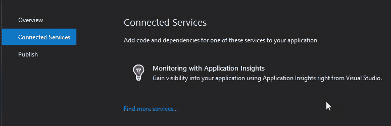
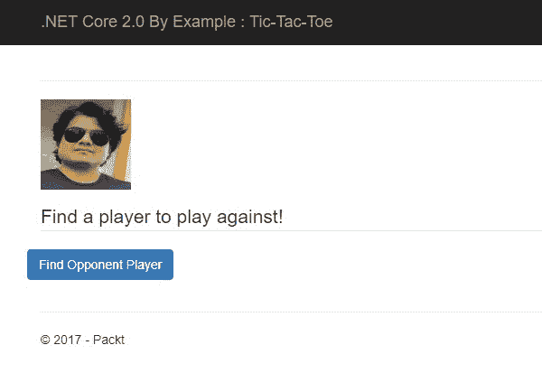

# 构建我们的第一个 .NET Core 游戏——菲尔兹棋

学习在玩游戏的同时会更加有趣。带着这个想法，让我们继续我们的学习之旅，通过编写我们的第一个 .NET Core 2.0 游戏——菲尔兹棋来学习 .NET Core 2.0。在本章中，我们将了解我们在 第一章 “入门”中创建的 ASP.NET Core 2.0 应用程序的解剖结构，并了解应用程序中的每个文件及其目的。然后，我们将快速了解 SignalR Core 的基础知识，这是我们将在 .NET Core 2.0 中编写游戏的技术。接下来，我们将进行 SignalR Core 的快速设置，然后是基本菲尔兹棋游戏的设计和编码，玩家可以指定自己的图片而不是传统的 *X* 和 *O*。

本章我们将涵盖以下主题：

+   ASP.NET Core 2.0 应用程序的解剖结构

+   菲尔兹棋

+   游戏设计

+   SignalR Core

+   解决方案

# ASP.NET Core 2.0 应用程序的解剖结构

在本节中，我们将讨论我们在 第一章 “入门”中“创建简单运行代码”部分创建的 ASP.NET Core 2.0 应用程序的“谁是谁，什么是何物”。目的是理解 MVC 模板附带每个文件的目的和使用方法，以便在需要时能最大限度地利用它们。

以下截图显示了我们的应用程序结构：


为了便于理解，项目从 1 到 12 编号。我们将逐一介绍每个项目，并了解它们带来的价值：

1.  连接服务：这并不是由 .NET Core 2.0 工具创建的项目模板中的物理文件，只有在从 Visual Studio 2017 IDE 打开项目时才可见；也就是说，这是一个 Visual Studio 2017 的功能。目的是让开发者更容易将连接服务添加到他们的应用程序中。这些服务可以部署在本地或云端。以前，这可以通过在项目的右键上下文菜单中选择“添加连接服务”来获得；现在，它作为 Solution Explorer 中的节点提供，适用于 Web 和移动项目。每个 ASP.NET Core Web 应用都可以利用的服务之一是 Application Insights。完整的综合服务列表可以在 [`docs.microsoft.com/en-us/azure/#pivot=services&panel=all`](https://docs.microsoft.com/en-us/azure/#pivot=services&panel=all) 找到。如果我们点击 Solution Explorer 中的“连接服务”节点，我们将在 Visual Studio 中看到一个新全页窗口，它有三个选项卡：



1.  1.  概述：此选项卡位于 ASP.NET Core 应用程序的 `GettingStarted` 部分。它列出了 Microsoft 为 ASP.NET Core 应用程序开发、添加服务和将其部署到云提供的官方文档链接。

    1.  连接服务：这是允许我们向应用程序添加连接服务的部分。在解决方案资源管理器中的连接服务节点上右键单击；我们看到一个上下文菜单项，添加连接服务。如果我们点击此项，它也会导航到相同的位置。我们将在后续章节中添加连接服务，当我们讨论 Azure 时。


1.  1.  发布：在云或本地环境中发布 Web 应用程序。我们将在后续章节中进一步讨论这个问题，当我们发布我们的应用程序到 Azure 时。

+   依赖项：这个节点已经在 Visual Studio 中存在了一段时间。同样，它不是作为系统中的物理文件存在的。Visual Studio 2017 中有一个工具更新，它将依赖项分类并将它们分组到以下类别：

    1.  分析器：分析器默认包含在项目中，如下所示：


1.  1.  NuGet：项目引用的 NuGet 包在此列出。在默认的 ASP.NET Core 2.0 MVC 模板中，我们将看到一个名为`Microsoft.AspNetCore.All`的 NuGet 包，这真是太棒了，因为我们不再需要担心不同包的版本控制以及将它们集成到我们的应用程序中。`Microsoft.AspNetCore.All`是一个元包；也就是说，它只引用其他包。它引用了所有 ASP.NET Core 包及其依赖项，以及所有 Entity Framework Core 包及其依赖项。此包的版本代表 ASP.NET Core 和 Entity Framework Core 的版本。最好的部分是，尽管它只是一个包，你仍然可以继续可视化所有与之相关的包及其依赖项：


1.  1.  SDK：显示目标 SDK。对于默认的 ASP.NET Core 2.0 应用程序，它将是 Microsoft.NETCore.App。

    1.  Bower：这是 Web 的包管理器。它帮助管理所有客户端相关的内容，例如 HTML、CSS、JavaScript、字体和图像。所有客户端包都列在这里。在默认项目模板中，我们可以看到诸如 bootstrap、jquery 等东西。

这些是默认 ASP.NET Core 2.0 MVC 模板中包含的四种类型的依赖项。但我们不仅限于这些依赖项。根据选择的包管理器，我们可能还有**node 包管理器**（**npm**）或其他包管理器作为列出的依赖项。在本章中，我们将使用 npm 安装 SignalR 客户端包，因为它可以通过 npm 获得。

脑海中浮现的第一个问题是什么是 Node.js？Node.js 是一个基于 Chrome 的 JavaScript 运行时引擎构建的平台，用于轻松构建快速且可扩展的应用程序。它使用事件驱动、非阻塞、异步 I/O 模型，这使得它轻量级且高效，非常适合数据密集型（和非 CPU 密集型）的实时应用程序。因此，npm 是 JavaScript 的包管理器。要使用 npm，我们需要安装 Node.js。

1.  属性：在解决方案资源管理器中双击项目的“属性”节点，将带我们到项目属性页面，展开后显示`launchSettings.json`文件，其中所有启动/启动相关的配置都序列化并保存为 JSON。以下是对默认代码的描述：

```cs
 "iisSettings": {
     "windowsAuthentication": false,
     "anonymousAuthentication": true,
     "iisExpress": {
         "applicationUrl": "http://localhost:52845/",
         "sslPort": 0
     }
 },
 "profiles": {
     "IIS Express": {
     "commandName": "IISExpress",
     "launchBrowser": true,
     "environmentVariables": {
     "ASPNETCORE_ENVIRONMENT": "Development"
     }
 },
 "GettingStarted": {
     "commandName": "Project",
     "launchBrowser": true,
     "environmentVariables": {
         "ASPNETCORE_ENVIRONMENT": "Development"
     },
     "applicationUrl": "http://localhost:52846/"
     }
   }
}
```

很明显，前面代码中的值与项目属性页面的调试部分相匹配：


1.  wwwroot: 所有客户端包和图像都是这个文件夹的一部分。这个文件夹中的文件作为静态内容提供服务，可以使用`bundleconfig.json`进行捆绑和压缩以减少负载和页面渲染。以下是一些常见的文件夹：

    +   `css`: 包含层叠样式表

    +   `images`: 包含应用中需要的图像资源

    +   `js`: 包含 JavaScript 文件

    +   `lib`: 包含客户端包

1.  控制器：包含按照模型-视图-控制器（MVC）架构的控制器。

1.  模型：包含按照 MVC 架构的模型。

1.  视图：包含按照 MVC 架构的视图。

1.  `appsettings.json`: 这是应用程序的设置。它包含基于键和值的设置，格式为 JSON。如果你是老派的 ASP.NET Web 开发者，你可以将其视为定义在`web.config`内部的`appSettings`部分。以下是对`Logging`的示例配置，这是默认模板自带的部分：

```cs
  {
     "Logging": {
     "IncludeScopes": false,
     "LogLevel": {
     "Default": "Warning"
     }
 }
}
```

1.  `bower.json`: 如前所述，Bower 包管理器是 Visual Studio 的一部分。这个客户端包管理器是开源社区中用于管理包的最广泛使用的包管理器之一。`bower.json`被 Bower 用于下载和管理客户端包。这与用于管理 NuGet 包的`packages.config`文件非常相似。只需在 JSON 文件中指定你想要的包名，Bower 就会完成剩余的工作。如果你看不到包，只需在解决方案资源管理器中右键单击文件，然后点击“还原包”。以下是从`bower.json`中的代码片段，列出了依赖项为`bootstrap`、`jquery`等：

```cs
{
 "name": "asp.net",
 "private": true,
 "dependencies": {
     "bootstrap": "3.3.7",
     "jquery": "2.2.0",
     "jquery-validation": "1.14.0",
     "jquery-validation-unobtrusive": "3.2.6"
     }
}
```

如果你不喜欢在`bower.json`文件中添加客户端依赖项的方法，右键单击`bower.json`文件，然后点击“管理 Bower 包”。它具有与 NuGet 包管理器非常相似的用户界面，并且可以以相同的方式使用。只需搜索包并点击安装。以下图片显示了项目中安装的 Bower 包：


1.  `bundleconfig.json`: 这个 JSON 文件用于存储网站静态内容（即脚本和样式）的项目捆绑和压缩配置。以下是对默认 MVC 项目模板`bundleconfig.json`的描述。名称和注释都是直观易懂的：

```cs
[
     {
        // The name and relative path of output minified css file.
        "outputFileName": "wwwroot/css/site.min.css",
         // An array of relative input file paths. Globbing patterns 
            supported
         "inputFiles": [
             "wwwroot/css/site.css"
         ]
     },
     {
         // The name and relative path of output minified JavaScript 
            file.
         "outputFileName": "wwwroot/js/site.min.js",
         // The array of relative input file paths.
         "inputFiles": [
             "wwwroot/js/site.js"
         ],
         // Optionally specify minification options
         "minify": {
             "enabled": true,
             "renameLocals": true
         },
         // Optionally generate .map file
         "sourceMap": false
     }
 ]
```

捆绑和压缩是提高请求加载时间的技巧：

+   打包（Bundling）通过减少客户端发送到服务器的请求次数来提高加载时间，即减少获取静态内容（CSS 和 JavaScript）的请求次数。大多数现代浏览器限制每个主机名的并发连接数最多为六个；也就是说，如果有六个请求正在处理，来自客户端的任何附加请求都会被浏览器排队。通过打包，可以避免这个问题，因为所有 CSS 文件都可以打包成一个文件，同样，JavaScript 也可以打包成一个文件。这提高了首次加载的性能。对于后续请求，改进并不大，因为浏览器会缓存这些文件。

+   压缩（Minification）通过减少请求资源的尺寸来提高性能，即通过移除不必要的空白和注释，以及缩短变量名到单个字符来减少 CSS 和 JavaScript 的大小。我们在进行 Web 开发时都见过`jquery.min.js`文件。文件名中的`min`是为了帮助用户识别这是文件的压缩版本。

1.  `Program.cs`：这是 ASP.NET Core 2.0 应用程序的主要入口点。它包含启动应用程序所需的最低限度的代码，使用默认配置：

```cs
public class Program
{
     public static void Main(string[] args)
     {
         BuildWebHost(args).Run();
     }

     public static IWebHost BuildWebHost(string[] args) => 
        WebHost.CreateDefaultBuilder(args)
        .UseStartup<Startup>()
        .Build();
}
```

如我们所见，这看起来更像是一个控制台应用程序，实际上它确实是一个控制台应用程序。在其入口点`Main`方法中，它创建了一个 Web 服务器，托管应用程序，并开始监听 HTTP 请求。注意这里，`BuildWebHost`是一个返回实现`IWebHost`的对象的方法，它接受一个字符串数组参数。这个方法被实现为一个表达式主体成员，只是为了让开发者意识到这个方法的唯一目的是构建 Web 宿主，不应该在这里放置其他代码。该方法遵循构建者模式来构建宿主。我们可以根据需要连接几个方法，一个接一个地添加到对象中。`CreateDefaultBuilder`方法使用来自各种配置提供者（例如 JSON 和环境变量等）的默认配置来构建 Web 宿主，设置日志配置，并设置一个与 IIS 集成的 Kestrel Web 服务器，这对于应用程序的运行已经足够好了。`Build`方法构建对象并返回。注意`UseStartup<Startup>`方法的调用，实际上指定了应用程序的`Startup`类。我们将在下一节讨论这个类。

**构建者模式（Builder pattern**）是一种对象创建设计模式。它是 23 个著名的**四人帮（Gang of Four，GoF**）设计模式之一。这种模式的目的是将复杂对象的构建与其表示分离，以便相同的构建过程可以创建不同的表示。为此，这种模式通过逐步使用简单对象来构建复杂对象。

1.  `Startup.cs`：这是定义请求处理管道和配置应用程序所需服务的类。让我们看看代码，然后深入讨论它：

```cs
 public class Startup
 {
    public Startup(IConfiguration configuration)
    {
        Configuration = configuration;
    }

    public IConfiguration Configuration { get; }

    // This method gets called by the runtime. Use this method to  
       add services to the container.
    public void ConfigureServices(IServiceCollection services)
    {
        services.AddMvc();
    }

    // This method gets called by the runtime. Use this method to 
       configure the HTTP request pipeline.
    public void Configure(IApplicationBuilder app, 
    IHostingEnvironment env)
    {
        if (env.IsDevelopment())
        {
            app.UseDeveloperExceptionPage();
            app.UseBrowserLink();
        }
        else
        {
            app.UseExceptionHandler("/Home/Error");
        }
        app.UseStaticFiles();
        app.UseMvc(routes =>
        {
            routes.MapRoute(
                name: "default",
                template: "{controller=Home}/{action=Index}/{id?}");
        });
    }
}
```

从类代码中得出的关键要点是：

1.  该类应该是`public`。

1.  构造函数依赖于`IConfiguration`，它作为核心服务注入，并分配给类型为`IConfiguration`的`public`属性`Configuration`。

1.  这使得`Configuration`成为 ASP.NET Core 应用程序的一等公民，并且可以通过使用以下代码轻松读取`appSettings`值：`Configuration["<KeyName>"]`。

1.  类中只有两个公共方法：

    +   `ConfigureServices`：这个方法由运行时调用。这个方法是将服务添加到容器的地方，例如 MVC、反伪造、应用程序洞察遥测、身份验证、授权、本地化、身份等。有一个巨大的服务列表可供选择，可以通过 IntelliSense 查看。在前面的代码中，我们正在添加 MVC 服务，这样我们就可以在我们的应用程序中利用所有 MVC 的优点。

    +   `Configure`：如代码中的注释所述，这个方法由运行时调用，并用于配置 HTTP 请求管道。在这个方法中，我们可以访问应用程序构建器和托管环境，这是.NET Core 2.0 应用程序的另一个一等公民，并且可以在容器中用于注入到我们构建的对象中。在前面的代码中，即默认 MVC 模板中，我们可以看到以下内容：

        1.  首先，它会检查环境是否为开发环境。这是通过环境变量`ASPNETCORE_ENVIRONMENT`来确定的。如果其值为`Development`，它将检测主机环境为`Development`；否则，它将是`Production`。如果这个环境变量不可用，它将默认环境设置为`Production`。这个变量可以在项目属性页的调试部分设置。前面属性部分的截图清楚地显示了环境变量。

        1.  如果环境是`Development`，它通过调用`UseDeveloperExceptionPage()`方法告诉应用程序使用开发者异常页面。开发者异常页面提供了一个详细的错误消息和异常堆栈跟踪，以帮助开发者定位问题并解决它。在`Production`中不应使用此功能，因为异常信息可能被黑客用来攻击您的网站。此外，您的最终用户可能不是技术人员，他们可能更喜欢看到比.NET 堆栈跟踪更友好的消息，因此在生产中我们使用自定义错误页面，该页面通过调用`UseExceptionHandler("/Home/Error");`方法指定。

        1.  在开发阶段，你可能想要测试你的 Web 应用程序针对多个浏览器，因此可能需要打开多个浏览器并浏览页面以检查兼容性问题，并在修复时刷新它们。`UseBrowserLink()` 方法可以帮助你做到这一点。**浏览器链接** 是 Visual Studio 中的一项功能，它创建了一个在 `Development` 环境和一台或多台 Web 浏览器之间的通信通道。我们可以使用浏览器链接同时刷新多个浏览器中的 Web 应用程序。

        1.  静态文件，如 `css`、`js`、`images`、HTML 等，它们放置在 `wwwroot` 文件夹中，默认情况下不可服务。为了使它们可服务，我们需要调用 `UseStaticFiles()` 方法。

        1.  最后，代码的最后一段配置了 MVC 服务（在 `Configure` 方法中添加），通过指定默认路由来完成。

        1.  总结一下，在这个方法中，我们只是使用中间件配置了 HTTP 请求管道。我们将在下一章查看中间件，但在此期间，只需将它们视为 ASP.NET 早期版本中的 HTTP 模块。我们添加了服务，然后根据我们的要求使用中间件进行配置。我们将在代码示例中找到三种类型的中间件配置：

            +   `app.Run()`：第一个 `app.Run` 委托终止 HTTP 请求管道。如果你使用 `Run`，它期望处理程序，因此请求会被服务回客户端。在请求路径中不会调用其他中间件。

            +   `app.Map*`：这个扩展用作分支管道的约定。`Map` 根据给定的请求路径匹配来分支请求管道。如果请求路径以给定的路径开头，则执行分支。

            +   `app.Use[Middleware]`：`Use` 可以用来链式调用中间件；也就是说，我们可以将它们安排成依次执行。`Use` 也可以根据需要短路请求管道。

如果这听起来很可怕，别担心！在我们开发 Let's Chat 应用程序的同时，我们将在下一章详细讨论中间件、依赖注入和容器。

最后但同样重要的是，`.csproj` 文件有了重大和长期期待的增强。.NET Core 1.0 的 `.xproj` 现在已经消失，我们熟悉的 `.csproj` 在 ASP.NET Core 2.0 中重新投入使用。它比之前更好，因为它更轻量级且易于管理。Visual Studio 2017 也进行了工具更新，这使得我们可以在不卸载项目的情况下编辑 `.csproj` 文件。这真是太棒了。只需在解决方案资源管理器中右键单击项目，然后点击 `Edit <Project Name>.csproj`：


我们将在代码编辑器中将 `.csproj` 文件打开为 XML 文件，同时整个项目仍然加载。以下是 `.csproj` 文件代码：

```cs
<Project Sdk="Microsoft.NET.Sdk.Web">
     <PropertyGroup>
         <TargetFramework>netcoreapp2.0</TargetFramework> 
     </PropertyGroup>
     <ItemGroup>
         <PackageReference Include="Microsoft.AspNetCore.All" 
         Version="2.0.0" />
     </ItemGroup>
     <ItemGroup>
         <DotNetCliToolReference 
         Include="Microsoft.VisualStudio.Web.CodeGeneration.Tools"  
         Version="2.0.0"           />
     </ItemGroup>
</Project>
```

它非常简洁，只包含`TargetFramework`，即`netcoreapp2.0`；`PackageReference`，只有一个元包`Microsoft.AspNetCore.All`；以及作为`ItemGroup`一部分的`DotNetCliToolReference`。这比传统的`.csproj`文件要好得多，在传统的`.csproj`文件中，我们有不同的构建配置、属性组、所有项目、DLL、NuGet 包引用，以及需要包含在项目中的所有文件和文件夹，这使得管理变得非常困难。

这就结束了我们对 ASP.NET Core 2.0 应用程序基本结构的探讨。让我们开始使用 ASP.NET Core 2.0 进行游戏开发。

# 井字棋

井字棋是一种简单的两人游戏，传统上使用*X*和*O*作为标记。每个玩家在自己的标记在空位上，并在 3×3 的网格中轮流进行。成功地将三个标记放置在水平、垂直或对角线上的一方获胜。

这就是笔和纸游戏板的样子。在下图 illustration 中，带有**X**标记的玩家是赢家：


# 需求规范

在本章中，我们将创建一个具有以下基本要求的两人制井字棋游戏：

1.  作为玩家，我应该能够用我的姓名注册并显示图片

1.  作为玩家，我应该能够找到一个对手，即第二个要对抗的玩家

1.  首先找到对手的前两名玩家应该被配对为游戏中的对手。

1.  哪个玩家先走的机会应该是公平的。

1.  作为玩家，我应该能够使用我的显示图片作为我的标志，而不是传统的*X*和*O*。

1.  谁赢的决定应该公平地做出。

1.  在未来，我们希望有多个玩家同时在线游戏。

现在我们已经制定了需求规范，让我们看看游戏的活动流程，并制定一个流程图。以下是对游戏工作流程的粗略流程图：


1.  **开始**：这是流程的开始。玩家浏览游戏网站的 URL。它被构想为一个网站，因为未来我们希望允许多个玩家同时在线游戏（要求*步骤 7*）。

1.  **使用姓名和显示图片注册**：玩家使用姓名和显示图片进行注册（要求*步骤 1*）。

1.  **对手是否可用？**：玩家找到一个对手进行游戏。如果找到对手，游戏可以开始投掷；否则，玩家需要等待对手（要求*步骤 2*和*步骤 3*）。

1.  **等待对手**：可能存在玩家独自注册但没有对手可玩的情况，因此玩家需要等待另一个玩家注册并寻找对手（要求*步骤 2*和*步骤 3*）。

1.  **赢得投币吗？**：一旦玩家被配对为对手，游戏开始，其中一名玩家将有机会先走一步。为了保持公平，我们将进行投币。玩家可能赢得投币或输掉投币（要求*步骤 4*）。

1.  **移动/等待对手移动**：赢得投币的玩家先走一步，而他们的对手将等待第一个玩家移动。

1.  **我们有胜者吗？**：每次移动后，我们检查是否满足胜利/平局的条件，并检查是否有胜者。如果没有，则游戏继续，每位玩家轮流移动，直到游戏结束（要求*步骤 6*）。

1.  **游戏结束**：最后，玩家要么用完移动，要么有玩家赢得游戏。

如我们所见，游戏只会在流程图的*步骤 6*和*步骤 7*中进行。其他步骤仅用于设置游戏。此外，请注意，这个流程涵盖了我们的所有要求。

# 设计游戏

看看前面的流程图，它符合我们的要求，我们知道我们需要在 ASP.NET Core 2.0 应用程序中开发以下内容，以构成一个基本的两人井字棋游戏：

1.  一个玩家可以注册并显示他们姓名和图片的网页

1.  一个模块，用于找到对手进行游戏

1.  一个模块，用于模拟投币来确保在给予玩家先走一步的机会时保持公平

1.  网页上井字棋游戏界面的 UI，即一个 3×3 的网格，玩家可以在其中放置他们的图像

1.  逻辑指示玩家是轮到他们还是对手

1.  一个模块，用于向对手和玩家展示所进行的移动

1.  确保玩家和对手的棋盘与他们的移动同步的机制

1.  检查游戏是否结束的逻辑

1.  确定胜者的逻辑

看起来很简单！让我们看看我们如何利用 ASP.NET Core 2.0 的优点设计和实现上述每个点：

1.  **注册网页**：我们有多种选项可供选择。我们可以使用静态 HTML 页面，或者 MVC 的常规`.cshtml`视图，或者 ASP.NET Core 2.0 引入的新 Razor Pages。由于我们将在下一章中广泛使用 Razor Pages，我们将使用`.cshtml` Razor 视图来创建游戏的 UI。

1.  **寻找对手的模块：** 当玩家注册时，我们可以在服务器上的某个地方存储他的详细信息，以便服务器知道有多少玩家注册来玩游戏。当玩家找到一个对手时，我们可以根据他们的注册时间将他们配对为对手。然而，仅仅依赖注册用户的问题在于，当玩家注册后有意或无意地关闭浏览器窗口，或者注册后决定不玩游戏。因此，我们需要确保我们只配对那些注册、积极连接到服务器并且正在寻找对手一起游戏的玩家。如果玩家在游戏中断开连接，则将游戏判给对手，并通知他们对手已经断开连接。我们需要进行额外的维护工作来刷新服务器上的注册玩家，因为新玩家加入而现有玩家断开连接。为了检查用户是否连接，我们可能需要通过编写额外的代码或使用会话来执行额外的维护工作。

1.  **模拟抛硬币：** 模拟抛硬币的方法有很多，例如在两个数字之间生成随机数，看它是偶数还是奇数。在我们的情况下，为了使事情简单，我们将生成一个随机数，要么是`0`，要么是`1`。如果是`0`，则是正面；否则，是反面。

1.  **游戏棋盘的 UI 设计：** 如前所述，我们将使用标准的 MVC Razor 视图来创建注册表单以及井字棋游戏棋盘的用户界面。使用 CSS 设计井字棋的棋盘相对简单；我们只需要获取正确的框样式并将框排列成 3x3 的网格。为了在棋盘上放置玩家的图像，我们将玩家图像传递给每位玩家，并在用户点击该网格框时更新框的背景样式。我们在这里可以看到的挑战是如何在任何给定时间保持两位玩家棋盘的同步。尽管单个玩家和服务器知道哪个玩家在哪个位置放置了标记，但对手需要拥有相同的游戏棋盘图片。这是服务器需要在每一回合之后通知两位玩家的内容。

1.  **指示轮到谁的逻辑：** 虽然服务器知道投掷结果，但它需要通知一位玩家进行移动，而另一位玩家则需要等待其他玩家移动。在每一回合之后，服务器还需要通知两位玩家（客户端）关于轮次的信息，因此服务器必须在每次移动后向客户端推送数据。

1.  **显示玩家所做移动的模块：** 就像前面的点一样，这也是服务器的责任，更新玩家关于最后一步的信息，并确保在每次移动后两位玩家都有游戏棋盘视图。

最后两个模块很简单。我们需要检查游戏是否结束，是否有胜者。我们讨论的有趣部分在于，在*步骤 2*、*4*、*5*和*6*中，我们遇到了服务器需要向客户端推送数据的情况。这是 ASP.NET 团队通过开发名为 SignalR 的库已经使事情变得非常简单的事情。因此，我们将使用 SignalR 来覆盖这些场景。在我们开始编码之前，让我们了解 SignalR 是什么，它是如何工作的，以及它是如何帮助我们避免自己编写所有这些内容的。

# SignalR

SignalR 是一个为 ASP.NET 开发者提供的库，用于开发实时网络体验。在传统的网络应用程序中，客户端发起请求，服务器做出响应。使用 SignalR，我们能够实时地将内容从服务器推送到已连接的客户端。SignalR 提供了一个简单的 API，用于创建从服务器到客户端的远程过程调用，这些调用从服务器端的.NET 代码调用客户端浏览器（和其他客户端平台）中的 JavaScript 函数。在任何应用程序中，如果我们需要刷新浏览器以获取新鲜数据或编写轮询代码来刷新数据，SignalR 可能是一个不错的选择。SignalR 的一些实际应用包括聊天应用程序，其中多个用户可以进行聊天，监控仪表板，股票行情应用程序，它会根据股票价格的变化更新股票价格，以及多人游戏。基本上，对于任何需要显示实时数据的应用程序，SignalR 使向所有客户端、一组客户端或特定客户端广播消息变得极其简单。

# SignalR 传输机制

SignalR 通过 WebSockets、服务器发送事件、永久帧和长轮询进行连接。以下是这些传输机制各自的简要描述：

+   **WebSockets**：WebSockets 是一种高级计算机通信协议，它允许您以更低的开销在用户的浏览器和服务器之间打开一个交互式通信会话。随着 HTML5 的出现，所有主要浏览器的最新版本都支持 WebSockets，例如 Microsoft Edge、Microsoft Internet Explorer、Google Chrome、Firefox、Safari 和 Opera。使用 WebSockets，我们可以向服务器发送消息并接收事件驱动的响应，而无需轮询服务器以获取回复。这是一种全双工通信。

+   **服务器发送事件**：服务器发送事件是一种技术，它允许网页通过 HTTP 连接从服务器接收自动更新。在建立初始连接后，服务器可以启动向客户端的数据传输。当前版本的 Microsoft Edge 和 Microsoft Internet Explorer 不支持此功能，但在 Google Chrome、Mozilla Firefox、Safari、Opera 和其他浏览器中可用。这是一种单工通信，因为服务器将数据推送到客户端。这是 HTML5 规范的一部分。

+   **永久帧**：永久帧是微软 Internet Explorer 的一个概念，并且不被任何其他浏览器支持。当客户端网页和服务器通过永久帧建立连接时，它会在客户端页面中创建一个隐藏的 IFrame。这个 IFrame 向服务器端点发出请求，该请求永远不会完成；也就是说，它永远保持连接活跃（因此得名，永久帧）。由于连接保持打开，服务器可以使用这个连接向客户端推送脚本，这些脚本在客户端页面中被加载并立即执行，从而提供从服务器到客户端的实时单向通信。这在旧的 SignalR 中得到支持，但在 SignalR Core 中被移除。

+   **长轮询**：长轮询是大多数网页开发者在其常规网页开发中做的事情，而没有意识到它实际上是长轮询。长轮询不会创建一个持久连接，而是通过一个保持打开直到服务器响应的请求来轮询服务器。这可能会在连接重置时引入一些延迟。长轮询基本上是一种用于与旧浏览器的向后兼容的方法，绝对不是现代网络客户端-服务器通信的首选方法。

# SignalR Core

SignalR Core 是为 ASP.NET Core 2.0 完全重写的 SignalR，在撰写本章时，它作为 ASP.NET Core 2.0 的 alpha 版本提供。根据路线图，它计划在 2017 年第四季度发布，并将与 ASP.NET Core 2.1 一起发布。当前的 alpha 版本包括服务器组件、.NET 客户端和 JavaScript/TypeScript 客户端。

我们将使用 SignalR Core 进行游戏开发，因为它将处理从服务器向客户端推送内容所需的所有繁重任务，让我们专注于手头的问题。有了 ASP.NET Core 2.0 和 SignalR Core 基础，以及设计和方法的最终确定，让我们开始我们的实现。

# 解决方案

在本节中，我们将在 ASP.NET Core 2.0 网页应用程序中开发井字棋游戏，使用 SignalR Core。我们将遵循逐步方法，并使用 Visual Studio 2017 作为主要 IDE，但也会列出使用 Visual Studio Code 编辑器所需的步骤。让我们先进行项目设置，然后我们将深入编码。

# 项目设置

创建一个名为 `TicTacToeGame` 的新 ASP.NET Core 2.0 MVC 应用程序，就像我们在 第一章 的 *创建简单运行代码* 部分中所做的那样。

使用这个，我们将有一个基本的 ASP.NET Core 2.0 MVC 应用程序。然而，为了在我们的应用程序中利用 SignalR Core，我们需要安装 SignalR Core NuGet 和客户端包。

要安装 SignalR Core NuGet 包，我们可以在 Visual Studio IDE 中执行以下两种方法之一：

+   在`TicTacToeGame`项目的上下文菜单中，点击管理 NuGet 包。它将为项目打开 NuGet 包管理器。在浏览部分，搜索`Microsoft.AspNetCore.SignalR`包，然后点击安装。这将安装 SignalR Core 到应用中。请注意，目前该包处于预览阶段，因此需要勾选预发布复选框：


+   编辑`TicTacToeGame.csproj`文件，在包含包引用的`ItemGroup`代码中添加以下代码片段，然后点击保存。文件保存后，工具将负责恢复包，不久 SignalR 包将被安装。此方法也可以用于 Visual Studio Code。尽管 Visual Studio Code 会检测未解决的依赖项并可能提示您恢复包，但建议在编辑并保存文件后，在项目位置的终端窗口中运行`dotnet restore`命令：

```cs
<ItemGroup>
     <PackageReference Include="Microsoft.AspNetCore.All" 
     Version="2.0.0" />
     <PackageReference Include="Microsoft.AspNetCore.SignalR" 
     Version="1.0.0-alpha1-final" />
 </ItemGroup>
```

现在我们已经安装了服务器端包。我们还需要安装 SignalR 的客户端包，它可以通过 npm 获取。为此，我们首先需要确认机器上是否已安装 npm。如果没有，我们需要安装它。npm 与 Node.js 一起分发，因此我们需要从[`nodejs.org/en/`](https://nodejs.org/en/)下载并安装 Node.js。安装过程相当简单。

安装完成后，在项目位置打开命令提示符并运行以下命令：

```cs
npm install @aspnet/signalr-client
```

这将安装 SignalR 客户端包。只需转到包位置（npm 在项目目录中创建一个`node_modules`文件夹）。从项目目录的相对路径将是`\node_modules\@aspnet\signalr-client\dist\browser`。

从此位置，将`signalr-client-1.0.0-alpha1-final.js`文件复制到`wwwroot\js`文件夹。在当前版本中，文件名为`signalr-client-1.0.0-alpha1-final.js`。

使用这种方法，我们就完成了项目的设置，现在我们可以使用 SignalR 的优势了。那么，让我们开始编码吧。

# 编写游戏代码

在本节中，我们将实现我们的游戏解决方案。最终输出将是一个可工作的两人井字棋游戏。我们将分步骤进行编码，以便于理解：

1.  在`Startup`类中，我们修改`ConfigureServices`方法，将 SignalR 添加到容器中，代码如下：

```cs
//// Adds SignalR to the services container.
 services.AddSignalR();
```

1.  在同一类的`Configure`方法中，我们配置管道以使用 SignalR，并拦截并连接包含`gameHub`的请求到我们将要创建的 SignalR 中心，代码如下：

```cs
//// Use - SignalR & let it know to intercept and map any request having gameHub.
 app.UseSignalR(routes => 
 {
        routes.MapHub<GameHub>("gameHub");
 });
```

以下为两种方法的代码，为了清晰和完整，其他方法和属性已被省略：

```cs
 // This method gets called by the run-time. Use this method to add 
    services to the container.
 public void ConfigureServices(IServiceCollection services)
 {
     services.AddMvc();
     //// Adds SignalR to the services container.
 services.AddSignalR();
 }

 // This method gets called by the runtime. Use this method to 
    configure the HTTP request pipeline.
 public void Configure(IApplicationBuilder app, IHostingEnvironment 
 env)
 {
       if (env.IsDevelopment())
       {
            app.UseDeveloperExceptionPage();
            app.UseBrowserLink();
       }
       else
       {
           app.UseExceptionHandler("/Home/Error");
       }  

    app.UseStaticFiles();
    app.UseMvc(routes =>
    {
        routes.MapRoute(
            name: "default",
            template: "{controller=Home}/{action=Index}/{id?}");
     });

   //// Use - SignalR & let it know to intercept and map any request 
        having gameHub.
 app.UseSignalR(routes => 
 {
 routes.MapHub<GameHub>("gameHub");
 });
```

1.  前两个步骤为我们设置了 SignalR。现在，让我们开始编写玩家注册表单的代码。我们希望玩家通过姓名和显示图片进行注册。稍后，服务器还需要知道玩家是否在玩游戏、等待移动、寻找对手等。让我们在应用中的 `Models` 文件夹中创建 `Player` 模型。代码注释是自解释的：

```cs
/// <summary>
/// The player class. Each player of Tic-Tac-Toe game would 
    be an instance of this class.
/// </summary>
internal class Player
{
     /// <summary>
     /// Gets or sets the name of the player. This would be 
         set at the time user registers.
     /// </summary>
     public string Name { get; set; }

    /// <summary>
    /// Gets or sets the opponent player. The player 
        against whom the player would be playing.
    /// This is determined/ set when the players click Find 
        Opponent Button in the UI.
    /// </summary>
    public Player Opponent { get; set; }

    /// <summary>
    /// Gets or sets a value indicating whether the player 
        is playing.
    /// This is set when the player starts a game.
    /// </summary>
    public bool IsPlaying { get; set; }

    /// <summary>
    /// Gets or sets a value indicating whether the player 
        is waiting for opponent to make a move.
    /// </summary>
    public bool WaitingForMove { get; set; }

    /// <summary>
    /// Gets or sets a value indicating whether the player 
        is searching for opponent.
    /// </summary>
    public bool IsSearchingOpponent { get; set; }

    /// <summary>
    /// Gets or sets the time when the player registered.
    /// </summary>
    public DateTime RegisterTime { get; set; }

    /// <summary>
    /// Gets or sets the image of the player.
    /// This would be set at the time of registration, if 
        the user selects the image.
    /// </summary>
    public string Image { get; set; }

    /// <summary>
    /// Gets or sets the connection id of the player 
        connection with the gameHub.
    /// </summary>
    public string ConnectionId { get; set; }
}
```

1.  现在，我们需要设置一个用户界面，以便玩家可以填写表格并注册。我们还需要在玩家浏览图片时显示图片预览。为此，我们将使用默认 MVC 模板中包含的 `HomeController` 类的 `Index.cshtml` 视图。我们将在 `_Layout.cshtml` 部分视图中引用以下两个 `.js` 文件，以便它们对所有视图都可用。或者，你也可以在 `Index.cshtml` 视图中添加这些文件，但强烈建议将常用脚本添加到 `_Layout.cshtml` 中。脚本文件的版本可能因情况而异。这些是目前可用的最新版本。虽然 jQuery 不是我们必须选择的库，但我们将使用 jQuery 来保持代码的简洁、简单和紧凑。有了这些引用，我们可以在客户端使用 jQuery 和 SignalR：

```cs
<script src="img/jquery.js"></script> <!-- jQuery-->
<script src="img/signalr-client-1.0.0-alpha1-final.js"></script> <!-- SignalR-->
```

添加这些引用后，创建简单的 HTML UI 以进行图片预览和注册，如下所示：

```cs
<div id="divPreviewImage"> <!-- To display the browsed image-->
        <fieldset>
            <div class="form-group"> 
                <div class="col-lg-2">
                    <image src="img/" id="previewImage" 
                    style="height:100px;width:100px;border:solid 
                    2px dotted; float:left" />
                </div>
                <div class="col-lg-10" id="divOpponentPlayer"> <!-- 
                To display image of opponent player-->
                    <image src="img/" id="opponentImage" 
                    style="height:100px;width:100px;border:solid 
                    2px dotted; float:right;" />
                </div>
            </div>
        </fieldset>
    </div> 

<div id="divRegister"> <!-- Our Registration form-->
     <fieldset>
         <legend>Register</legend>
         <div class="form-group">
             <label for="name" class="col-lg-2 control-
             label">Name</label>
             <div class="col-lg-10">
                 <input type="text" class="form-control" id="name" 
                 placeholder="Name">
             </div>
         </div>
         <div class="form-group">
             <label for="image" class="col-lg-2 control-
             label">Avatar</label>
             <div class="col-lg-10">
                 <input type="file" class="form-control" id="image" 
                 />
             </div>
         </div>
         <div class="form-group">
             <div class="col-lg-10 col-lg-offset-2">
                 <button type="button" class="btn btn-primary" 
                 id="btnRegister">Register</button>
             </div>
         </div>
     </fieldset>
 </div>
```

1.  当玩家通过点击 `Register` 按钮进行注册时，需要将玩家的详细信息发送到服务器。为此，我们将编写 JavaScript 代码将详细信息发送到我们的 `gameHub`：

```cs
 let hubUrl = '/gameHub';
 let httpConnection = new signalR.HttpConnection(hubUrl);
 let hubConnection = new signalR.HubConnection(httpConnection);
 var playerName = "";
 var playerImage = "";
 var hash = "#";
 hubConnection.start();

$("#btnRegister").click(function () {  //// Fires on button click
        playerName = $('#name').val();   //// Sets the player name 
        with the input name.
        playerImage = $('#previewImage').attr('src'); //// Sets the 
        player image variable with specified image
        var data = playerName.concat(hash, playerImage); //// The 
        registration data to be sent to server.
        hubConnection.invoke('RegisterPlayer', data); //// Invoke 
        the "RegisterPlayer" method on gameHub.
    });

$("#image").change(function () { //// Fires when image is changed.
        readURL(this); //// HTML 5 way to read the image as data 
        url.
    });

    function readURL(input) {
        if (input.files && input.files[0]) { //// Go in only if 
        image is specified.
            var reader = new FileReader();
            reader.onload = imageIsLoaded;
            reader.readAsDataURL(input.files[0]);
        }
    }

    function imageIsLoaded(e) {
        if (e.target.result) {
            $('#previewImage').attr('src', e.target.result); //// 
            Sets the image source for preview.
            $("#divPreviewImage").show();
        }
    };
```

1.  现在玩家有一个用户界面来输入姓名和图片，查看预览图片，并点击 `Register`。点击 `Register` 按钮时，我们通过 `hubConnection.invoke('RegisterPlayer', data);` 将连接名和图片发送到服务器上的 `gameHub`。因此，客户端调用服务器非常简单。通过指定连接名来初始化 `hubConnection`，就像前面代码片段的前三行所做的那样。通过调用 `hubConnection.start();` 来启动连接，然后通过调用 `invoke` 方法并指定连接方法名和它期望的参数来调用服务器端端点方法。我们尚未创建端点，因此让我们在服务器上创建 `GameHub` 类：

```cs
/// <summary>
/// The Game Hub class derived from Hub
/// </summary>
public class GameHub : Hub
{
     /// <summary>
     /// To keep the list of all the connected players 
         registered with the game hub. We could have      
     /// used normal list but used concurrent bag as its thread 
         safe.
     /// </summary>
     private static readonly ConcurrentBag<Player> players = 
     new ConcurrentBag<Player>();

     /// <summary>
     /// Registers the player with name and image.
     /// </summary>
     /// <param name="nameAndImageData">The name and image data 
         sent by the player.</param>
     public void RegisterPlayer(string nameAndImageData)
     {
         var splitData = nameAndImageData?.Split(new char[] { 
         '#' }, StringSplitOptions.None);
         string name = splitData[0];
         string image = splitData[1];
         var player = players?.FirstOrDefault(x => 
         x.ConnectionId == Context.ConnectionId);
         if (player == null)
         {
             player = new Player { ConnectionId = 
             Context.ConnectionId, Name = name, IsPlaying =                
             false, IsSearchingOpponent = false, RegisterTime = 
             DateTime.UtcNow, Image = image };
             if (!players.Any(j => j.Name == name))
             {
                 players.Add(player);
             }
         }

         this.OnRegisterationComplete(Context.ConnectionId);
       }

       /// <summary>
       /// Fires on completion of registration.
       /// </summary>
       /// <param name="connectionId">The connectionId of the 
           player which registered</param>
       public void OnRegisterationComplete(string connectionId)
       {
           //// Notify this connection id that the registration 
                is complete.
           this.Clients.Client(connectionId).
           InvokeAsync(Constants.RegistrationComplete);
       }
}
```

代码注释使代码自解释。该类应该从 SignalR 的 `Hub` 类派生，以便它被识别为 `Hub`。

有两种感兴趣的方法可以被覆盖。请注意，这两种方法都遵循异步模式，因此返回 `Task`：

+   `Task OnConnectedAsync()`: 当客户端/玩家连接到端点时，此方法会触发。

+   `Task OnDisconnectedAsync(Exception exception)`: 当客户端/玩家断开连接或失去连接时，此方法会触发。我们将覆盖此方法来处理玩家断开连接的情况。

端点类还公开了一些属性：

+   +   `Context`：这个属性是`HubCallerContext`类型，为我们提供了访问以下属性的方式：

        +   `Connection`：提供对当前连接的访问

        +   `User`：提供对当前连接用户的`ClaimsPrincipal`的访问

        +   `ConnectionId`：提供当前连接 ID 字符串

    +   `Clients`：这个属性是`IHubClients`类型，为我们提供了通过客户端代理与所有客户端通信的方式

    +   `Groups`：这个属性是`IGroupManager`类型，提供了一种异步添加和删除连接到组的方法

为了保持简单，我们不会使用数据库来跟踪已注册的玩家。相反，我们将使用内存中的集合来存储已注册的玩家。我们本可以使用普通的玩家列表，例如`List<Player>`，但那样我们就需要所有线程安全，并使用线程安全原语，如`lock`、`monitor`等，所以我们选择了`ConcurrentBag<Player>`，它是线程安全的，并且适合我们的游戏开发。这解释了在类中对玩家集合的声明。当玩家注册时，我们需要将玩家添加到这个集合中，当它们断开连接时，我们需要从集合中删除它们。

在上一步中，我们看到了客户端在服务器上调用了`RegisterPlayer`方法，并传递了名称和图像数据。因此，我们在我们的中心类中定义了一个`public`方法，命名为`RegisterPlayer`，接受通过`#`连接的名称和图像数据字符串。这只是接受客户端数据的一种简单方式，用于演示目的，我们也可以使用强类型参数。在这个方法中，我们在`#`上拆分字符串，提取名称作为第一部分，图像作为第二部分。然后我们检查具有当前连接 ID 的玩家是否已经存在于我们的玩家集合中。如果没有，我们创建一个具有默认值的`Player`对象并将其添加到我们的玩家集合中。为了演示目的，我们根据名称区分玩家，但我们可以向`Player`类中添加一个`Id`属性，使不同玩家也可以有相同的名称。注册完成后，服务器需要更新玩家信息，表明注册已完成，然后玩家可以寻找对手。为此，我们调用`OnRegistrationComplete`方法，该方法在客户端上调用名为`registrationComplete`的方法，并传递当前连接 ID。让我们理解调用客户端上方法的代码：

```cs
this.Clients.Client(connectionId).InvokeAsync(Constants.RegistrationComplete);
```

在`Clients`属性上，我们可以选择具有特定连接 ID 的客户端（在这种情况下，来自`Context`的当前连接 ID），然后调用`InvokeAsync`来在客户端上调用方法，指定所需的方法名称和参数。在前面的例子中，方法名称是`registrationComplete`，没有参数。

现在我们知道了如何从客户端调用服务器方法，以及如何从服务器调用客户端方法。我们还知道如何选择特定的客户端并调用那里的方法。我们可以从服务器调用客户端方法，对所有客户端、一组客户端或特定客户端，所以其余的编码内容只是这两个概念的重复。

1.  接下来，我们需要在客户端实现`registrationComplete`方法。在注册完成后，注册表单应该被隐藏，玩家应该能够找到对手进行比赛。为此，我们将编写 JavaScript 代码来隐藏注册表单并显示查找对手的用户界面。点击`查找对手`按钮时，我们需要服务器为我们匹配对手，因此我们需要在服务器上调用中心方法来查找对手。

1.  服务器可以给我们两种结果：

    +   它找到了一个对手玩家进行比赛。在这种情况下，游戏可以开始，因此我们需要模拟抛硬币，确定哪个玩家可以首先移动，并开始游戏。这将在客户端用户界面中显示为游戏板。

    +   它找不到对手，并要求玩家等待另一个玩家注册并寻找对手。这将在客户端显示为找不到对手的屏幕。

在这两种情况下，服务器都会进行一些处理并在客户端调用一个方法。由于我们需要为不同的情况创建很多不同的用户界面，让我们在`div`内部编写 HTML 标记，以便根据服务器响应更容易地显示和隐藏部分。我们将在主体中添加以下代码片段。注释指定了每个`div`元素及其内部标记的目的：

```cs
<div id="divFindOpponentPlayer"> <!-- Section to display Find Opponent -->
     <fieldset>
         <legend>Find a player to play against!</legend>
         <div class="form-group">
             <input type="button" class="btn btn-primary" 
             id="btnFindOpponentPlayer" value="Find Opponent                 
             Player" />
         </div>
     </fieldset>
 </div>
     <div id="divFindingOpponentPlayer"> <!-- Section to display 
     opponent not found, wait -->
     <fieldset>
         <legend>Its lonely here!</legend>
         <div class="form-group">
             Looking for an opponent player. Waiting for someone to 
             join!
         </div>
     </fieldset>
 </div>
 <div id="divGameInformation" class="form-group"> <!-- Section to 
 display game information-->
     <div class="form-group" id="divGameInfo"></div>
     <div class="form-group" id="divInfo"></div>
 </div>
 <div id="divGame" style="clear:both"> <!-- Section where the game 
 board would be displayed -->
     <fieldset>
         <legend>Game On</legend>
         <div id="divGameBoard" style="width:380px"></div>
     </fieldset>
 </div>
```

以下客户端代码将处理**步骤 7**和**步骤 8**。尽管注释已经很直观，但我们会快速查看这里正在进行的所有内容。我们处理`registartionComplete`方法并显示`查找对手玩家`部分。这部分有一个名为`btnFindOpponentPlayer`的按钮用于查找对手玩家。我们定义按钮的事件处理器来在中心调用`FindOpponent`方法。我们稍后会看到中心方法的实现，但我们知道中心方法要么找到对手，要么找不到对手，因此我们分别定义了`opponentFound`和`opponentNotFound`方法来处理这些情况。在`opponentNotFound`方法中，我们只显示一个部分，其中我们说我们没有找到对手玩家。在`opponentFound`方法中，我们显示游戏部分、游戏信息部分、对手显示图片部分，并使用 CSS 样式绘制一个 3×3 的井字棋游戏板。所有其他部分都被隐藏：

```cs
 $("#btnFindOpponentPlayer").click(function () {
        hubConnection.invoke('FindOpponent');
    });

hubConnection.on('registrationComplete', data => { //// Fires on registration complete. Invoked by server hub
     $("#divRegister").hide();  // hide the registration div
     $("#divFindOpponentPlayer").show(); // display find opponent 
     player div.
 });

 hubConnection.on('opponentNotFound', data => { //// Fires when no opponent is found.
        $('#divFindOpponentPlayer').hide(); //// hide the find 
        opponent player section.
        $('#divFindingOpponentPlayer').show(); //// display the 
        finding opponent player div.
    });

   hubConnection.on('opponentFound', (data, image) => { //// Fires 
   when opponent player is found.
        $('#divFindOpponentPlayer').hide();   
        $('#divFindingOpponentPlayer').hide();
        $('#divGame').show();  //// Show game board section.
        $('#divGameInformation').show(); //// Show game information
        $('#divOpponentPlayer').show(); //// Show opponent player 
        image.
        opponentImage = image;  //// sets the opponent player image 
        for display
        $('#opponentImage').attr('src', opponentImage); //// Binds 
        the opponent player image
        $('#divGameInfo').html("<br/><span><strong> Hey " + 
        playerName + "! You are playing against <i>" + data + "</i>
        </strong></span>");  //// displays the information of 
        opponent that the player is playing against.
        //// Draw the tic-tac-toe game board, A 3x3 grid :) by  
        proper styling.
        for (var i = 0; i < 9; i++) {
            $("#divGameBoard").append("<span class='marker' id=" + i 
            + " style='display:block;border:2px solid 
           black;height:100px;width:100px;float:left;margin:10px;'>" 
           + i + "</span>");
        }
    });
```

首先，我们需要一个`Game`对象来跟踪游戏、涉及的玩家、剩余的移动以及检查是否有获胜者。我们将根据以下代码定义一个`Game`类。注释详细说明了方法和定义的属性的目的：

```cs
internal class Game
{
     /// <summary>
     /// Gets or sets the value indicating whether the 
         game is over.
     /// </summary>
     public bool IsOver { get; private set; }

     /// <summary>
     /// Gets or sets the value indicating whether the 
         game is draw.
     /// </summary>
     public bool IsDraw { get; private set; }

     /// <summary>
     /// Gets or sets Player 1 of the game
     /// </summary>
     public Player Player1 { get; set; }

     /// <summary>
     /// Gets or sets Player 2 of the game
     /// </summary>
     public Player Player2 { get; set; }

     /// <summary>
     /// For internal housekeeping, To keep track of value in each 
         of the box in the grid.
     /// </summary>
     private readonly int[] field = new int[9];

     /// <summary>
     /// The number of moves left. We start the game with 9 moves 
         remaining in a 3x3 grid.
     /// </summary>
     private int movesLeft = 9;

     /// <summary>
     /// Initializes a new instance of the 
         <see cref="Game"/> class.
     /// </summary>
     public Game()
     {
         //// Initialize the game
         for (var i = 0; i < field.Length; i++)
         {
             field[i] = -1;
         }
     }
     /// <summary>
     /// Place the player number at a given position for a player
     /// </summary>
     /// <param name="player">The player number would be 0 or    
         1</param>
     /// <param name="position">The position where player number  
         would be placed, should be between 0 and        
     ///8, both inclusive</param>
     /// <returns>Boolean true if game is over and 
         we have a winner.</returns>
     public bool Play(int player, int position)
     {
         if (this.IsOver)
         {
             return false;
         }
         //// Place the player number at the given position
         this.PlacePlayerNumber(player, position);
         //// Check if we have a winner. If this returns true, 
         //// game would be over and would have a winner, else game 
              would continue.
         return this.CheckWinner();
     }
 }
```

现在我们已经用`Game`类解决了整个游戏谜题。我们知道何时游戏结束，我们有放置玩家标记和检查获胜者的方法。以下在`GameHub`上的服务器端代码将处理*步骤 7*和*步骤 8*：

```cs
/// <summary>
/// The list of games going on.
/// </summary>
private static readonly ConcurrentBag<Game> games = new ConcurrentBag<Game>();

/// <summary>
/// To simulate the coin toss. Like heads and tails, 0 belongs to  
    one player and 1 to opponent.
/// </summary>
private static readonly Random toss = new Random();

/// <summary>
/// Finds the opponent for the player and sets the Seraching for 
    Opponent property of player to true. 
/// We will use the connection id from context to identify the 
    current player.
/// Once we have 2 players looking to play, we can pair them and 
    simulate coin toss to start the game.
/// </summary>
public void FindOpponent()
{
    //// First fetch the player from our players collection having 
         current connection id
    var player = players.FirstOrDefault(x => x.ConnectionId == 
    Context.ConnectionId);
    if (player == null)
    {
        //// Since player would be registered before making this 
             call,
        //// we should not reach here. If we are here, something 
             somewhere in the flow above is broken.
        return;
     }

     //// Set that player is seraching for opponent.
     player.IsSearchingOpponent = true;

     //// We will follow a queue, so find a player who registered 
          earlier as opponent. 
     //// This would only be the case if more than 2 players are 
          looking for opponent.
     var opponent = players.Where(x => x.ConnectionId != 
     Context.ConnectionId && x.IsSearchingOpponent && 
     !x.IsPlaying).OrderBy(x =>x.RegisterTime).FirstOrDefault();
     if (opponent == null)
     {
         //// Could not find any opponent, invoke opponentNotFound 
              method in the client.
         Clients.Client(Context.ConnectionId)
         .InvokeAsync(Constants.OpponentNotFound);
         return;
     }

     //// Set both players as playing.
     player.IsPlaying = true;
     player.IsSearchingOpponent = false; //// Make him unsearchable 
     for opponent search

     opponent.IsPlaying = true;
     opponent.IsSearchingOpponent = false;

      //// Set each other as opponents.
      player.Opponent = opponent;
      opponent.Opponent = player;

      //// Notify both players that they can play by invoking 
           opponentFound method for both the players.
      //// Also pass the opponent name and opoonet image, so that 
           they can visualize it.
      //// Here we are directly using connection id, but group is a 
           good candidate and use here.
      Clients.Client(Context.ConnectionId)
      .InvokeAsync(Constants.OpponentFound, opponent.Name,    
      opponent.Image);
      Clients.Client(opponent.ConnectionId)
      .InvokeAsync(Constants.OpponentFound, player.Name, 
      player.Image);

       //// Create a new game with these 2 player and add it to 
            games collection.
       games.Add(new Game { Player1 = player, Player2 = opponent });
  }
```

在这里，我们创建了一个游戏集合来跟踪正在进行的游戏，并添加了一个名为`Random`的字段来模拟抛硬币。`FindOpponent`的工作原理在注释中有详细说明，并且很容易理解。

1.  游戏开始后，每位玩家必须进行一次移动，然后等待对手进行移动，直到游戏结束。移动是通过点击可用的网格单元格来完成的。在这里，我们需要确保已被玩家标记的单元格位置不会被更改或标记。因此，一旦标记了有效的单元格，我们就将其 CSS 类设置为`notAvailable`，这样我们就知道该单元格已被占用。在点击单元格时，我们将检查单元格是否有`notAvailablestyle`。如果有，则不能标记。如果没有，则可以标记单元格，然后我们将标记的位置发送到服务器中心。我们还看到服务器根据游戏状态触发的`waitingForMove`、`moveMade`、`gameOver`和`opponentDisconnected`事件。代码有注释，并且相当直接。以下代码中的`moveMade`方法使用了`MoveInformation`类，我们将在服务器上定义它以与两位玩家共享移动信息：

```cs
//// Triggers on clicking the grid cell.
 $(document).on('click', '.marker', function () {
     if ($(this).hasClass("notAvailable")) { //// Cell is already 
     taken.
     return;
     }

    hubConnection.invoke('MakeAMove', $(this)[0].id); //// Cell is 
    valid, send details to hub.
});

//// Fires when player has to make a move.
hubConnection.on('waitingForMove', data => {
    $('#divInfo').html("<br/><span><strong> Your turn <i>" + 
    playerName + "</i>! Make a winning move! </strong></span>");
});

//// Fires when move is made by either player.
hubConnection.on('moveMade', data => { 
    if (data.Image == playerImage) { //// Move made by player.
        $("#" + data.ImagePosition).addClass("notAvailable");
        $("#" + data.ImagePosition).css('background-image', 
        'url(' + data.Image + ')'); 
        $('#divInfo').html("<br/><strong>Waiting for <i>" + 
        data.OpponentName + "</i> to make a move.            
        </strong>");
    }
    else {
        $("#" + data.ImagePosition).addClass("notAvailable");
        $("#" + data.ImagePosition).css('background-image', 
        'url(' + data.Image + ')');
        $('#divInfo').html("<br/><strong>Waiting for <i>" + 
        data.OpponentName + "</i> to make a move.            
        </strong>");
    }
});

//// Fires when the game ends.
hubConnection.on('gameOver', data => {
    $('#divGame').hide();
    $('#divInfo').html("<br/><span><strong>Hey " + playerName + 
    "! " + data + " </strong></span>");
    $('#divGameBoard').html(" ");
    $('#divGameInfo').html(" ");
    $('#divOpponentPlayer').hide();
});

//// Fires when the opponent disconnects.
hubConnection.on('opponentDisconnected', data => {
        $("#divRegister").hide();
        $('#divGame').hide();
        $('#divGameInfo').html(" ");
        $('#divInfo').html("<br/><span><strong>Hey " + playerName + 
        "! Your opponent disconnected or left     the battle! You 
        are the winner ! Hip Hip Hurray!!!</strong></span>");
    });

```

每次移动后，服务器都需要更新两位玩家关于所进行的移动，以确保两位玩家的游戏板保持同步。因此，在服务器端，我们需要一个额外的模型，称为`MoveInformation`，它将包含玩家最新移动的信息，服务器将向两位客户端发送此模型以保持同步：

```cs
 /// <summary>
 /// While playing the game, players would make moves. This class 
     contains the information of those moves.
 /// </summary>
 internal class MoveInformation
 {
     /// <summary>
     /// Gets or sets the opponent name.
     /// </summary>
     public string OpponentName { get; set; }

     /// <summary>
     /// Gets or sets the player who made the move.
     /// </summary>
     public string MoveMadeBy { get; set; }

     /// <summary>
     /// Gets or sets the image position. The position in the game 
         board (0-8) where the player placed his         
     /// image.
     /// </summary>
     public int ImagePosition { get; set; }

     /// <summary>
     /// Gets or sets the image. The image of the player that he 
         placed in the board (0-8)
     /// </summary>
     public string Image { get; set; }
  }
```

最后，我们将连接`GameHub`类中的剩余方法以完成游戏编码。`MakeAMove`方法在玩家每次进行移动时都会被调用。此外，我们还重写了`OnDisconnectedAsync`方法，以便在对手断开连接时通知玩家。在此方法中，我们还保持我们的玩家和游戏列表最新。代码中的注释解释了方法的工作原理：

```cs
 /// <summary>
 /// Invoked by the player to make a move on the board.
 /// </summary>
 /// <param name="position">The position to place 
     the player</param>
 public void MakeAMove(int position)
 {
        //// Lets find a game from our list of games where one of  
             the player has the same connection Id as the current 
             connection has.
            var game = games?.FirstOrDefault(x => 
            x.Player1.ConnectionId == Context.ConnectionId || 
            x.Player2.ConnectionId == Context.ConnectionId);

            if (game == null || game.IsOver)
            {
                //// No such game exist!
                return;
            }

            //// Designate 0 for player 1
            int symbol = 0;

            if (game.Player2.ConnectionId == Context.ConnectionId)
            {
                //// Designate 1 for player 2.
                symbol = 1;
            }

            var player = symbol == 0 ? game.Player1 : game.Player2;

            if (player.WaitingForMove)
            {
                return;
            }

            //// Update both the players that move is made.
            Clients.Client(game.Player1.ConnectionId)
            .InvokeAsync(Constants.MoveMade, new MoveInformation {  
            OpponentName = player.Name, ImagePosition = position,   
            Image = player.Image });
            Clients.Client(game.Player2.ConnectionId)
            .InvokeAsync(Constants.MoveMade, new MoveInformation {    
            OpponentName = player.Name, ImagePosition = position, 
            Image = player.Image });

            //// Place the symbol and look for a winner after every 
                 move.
            if (game.Play(symbol, position))
            {
                Remove<Game>(games, game);
                Clients.Client(game.Player1.ConnectionId)
                .InvokeAsync(Constants.GameOver, $"The winner is   
                {player.Name}");
                Clients.Client(game.Player2.ConnectionId)
                .InvokeAsync(Constants.GameOver, $"The winner is    
                {player.Name}");
                player.IsPlaying = false;
                player.Opponent.IsPlaying = false;
                this.Clients.Client(player.ConnectionId)
                .InvokeAsync(Constants.RegistrationComplete);
                this.Clients.Client(player.Opponent.ConnectionId)
                .InvokeAsync(Constants.RegistrationComplete);
            }

            //// If no one won and its a tame draw, update the 
                 players that the game is over and let them 
                 look for new game to play.
            if (game.IsOver && game.IsDraw)
            {
                Remove<Game>(games, game);
                Clients.Client(game.Player1.ConnectionId)
                .InvokeAsync(Constants.GameOver, "Its a tame  
                draw!!!");
                Clients.Client(game.Player2.ConnectionId)
                .InvokeAsync(Constants.GameOver, "Its a tame 
                draw!!!");
                player.IsPlaying = false;
                player.Opponent.IsPlaying = false;
                this.Clients.Client(player.ConnectionId)
                .InvokeAsync(Constants.RegistrationComplete);
                this.Clients.Client(player.Opponent.ConnectionId)
                .InvokeAsync(Constants.RegistrationComplete);
            }

            if (!game.IsOver)
            {
                player.WaitingForMove = !player.WaitingForMove;
                player.Opponent.WaitingForMove =    
                !player.Opponent.WaitingForMove;
                Clients.Client(player.Opponent.ConnectionId)
                .InvokeAsync(Constants.WaitingForOpponent,   
                player.Opponent.Name);
                Clients.Client(player.ConnectionId)
                .InvokeAsync(Constants.WaitingForOpponent, 
                player.Opponent.Name);
            }
        }
```

这样，我们就完成了游戏的编码，并准备好运行游戏应用。详细的源代码可以从[`github.com/PacktPublishing/.NET-Core-2.0-By-Example`](https://github.com/PacktPublishing/.NET-Core-2.0-By-Example)下载。

# 游戏演示

现在我们应用已经准备好了，让我们运行它并享受游戏吧。按*F5*键，游戏应该在浏览器中启动。这适用于 Visual Studio 2017 IDE 和 Visual Studio Code。另外，由于我们在本地机器上运行它，两个玩家暂时需要在同一台机器上玩游戏。一旦我们将这个游戏部署到 Azure，玩家就可以从各自的机器上浏览 URL。我们将在后面的章节中看到如何将 ASP.NET Core 2.0 应用程序发布到 Azure。

这就是游戏注册用户界面的样子：


点击“注册”，将显示查找对手的屏幕：



点击“查找对手玩家”按钮，如果存在已注册的玩家，游戏就开始了，这就是两人游戏的模样：


如果没有玩家可用，或者你是唯一注册来玩的单打独斗者，将显示以下屏幕：


我们已经开发了一个功能齐全的两人井字棋游戏，满足了所有要求规范。现在是时候享受由 SignalR Core 驱动的你的第一个 ASP.NET Core 2.0 游戏了！

# 摘要

在本章中，我们学习了典型 ASP.NET Core 2.0 应用程序的项目结构，并了解了每个默认 MVC 模板中每个文件的重要性和目的。我们还学习了 SignalR 和 SignalR Core，并根据给定要求在 ASP.NET Core 2.0 上开发了我们的第一个游戏，井字棋。

在下一章中，我们将深入学习和编码 ASP.NET Core 2.0 的功能，同时开发一个名为 Let's Chat 的多客户端实时聊天应用程序。
