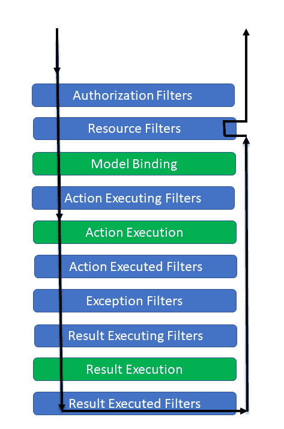

# 开发 Let's Chat 网络应用程序

在上一章中，我们获得了 Let's Chat 网络应用程序的需求和高级设计。我们通过设置项目开始了 Let's Chat 网络应用程序的开发。在这个过程中，我们学习了 ASP.NET Core 的基本概念。在本章中，我们将开发 Let's Chat 网络应用程序，并了解 ASP.NET Core 的更多概念。本章我们将涵盖以下主题：

+   ASP.NET Core 2.0 基础知识

+   通过 Facebook 实现身份验证

# ASP.NET Core 2.0 基础知识

本节是我们从上一章开始学习 ASP.NET Core 2.0 基础知识的旅程的延续。我们将（重新）回顾基础知识，以便在编码应用程序时能够正确使用它们。在本节中，我们将快速浏览 MVC，并进一步讨论路由、过滤器、错误处理等内容。让我们从 MVC 开始。

# 快速浏览 MVC

**MVC** 代表 **模型**-**视图**-**控制器**。这种模式的目的是实现关注点的分离。一般而言，我们可以将 MVC 与“***劳动分工**”进行类比。在这种架构模式中，应用程序被划分为三个不同的组件：模型、视图和控制器。当用户在服务器上请求资源时，它会被路由到控制器，控制器与模型协同工作以执行用户操作和/或 CRUD（**创建**、**读取**、**更新**、**删除**）操作。然后控制器选择视图向用户显示用户界面，并提供所需的模型数据。以下图表显示了三个主要组件：


我们可以看到，在图表中，视图和控制器都依赖于模型。然而，模型不依赖于它们中的任何一个。这是该模式的一个关键优势，也是 MVC 正确实现的黄金法则。利用这种分离，我们可以独立于视觉表示来构建和测试模型。**S**OLID 设计原则中的 **单一职责原则**（**SRP**）是 MVC 的核心。它还重申了 **不要重复自己**（**DRY**）原则。MVC 的一切都是关于关注点的分离，以实现更好的可测试性和可维护性。每个组件的责任都明确列出：

+   **模型**是这种架构模式的核心组件，代表数据。它维护应用程序的数据。

+   **视图**是视觉组件，是模型的用户界面；也就是说，它向最终用户显示模型的数据，并使他们能够编辑数据。

+   **控制器**是请求的控制器；也就是说，是请求处理器。通常，用户通过视图进行显示、编辑、添加和删除数据。这会引发相应的 URL 请求。这个请求由控制器处理。控制器使用模型数据渲染相应的视图作为响应：


以下图表总结了 MVC 模式的一般工作原理：

1.  客户端发送请求，该请求被路由到**控制器**

1.  **控制器**使用**模型**执行一些*业务*操作

1.  **模型**将操作的结果返回给**控制器**

1.  **控制器**决定要渲染哪个**视图**，并发送必须渲染的模型（数据）

1.  **视图**渲染输出并将响应发送回客户端

让我们看看 MVC 在现实世界中的类比，以便 MVC 的新用户能够找到它。让我们考虑一本杂志。如果我要将杂志封面*粗略地*放入 MVC 模式中，它将是这样的：用户看到杂志。我们看到的是杂志的封面，这是我们所说的**视图**（用户界面）。我们看到一些文本和图像；例如，在视图中我们看到一个时装模特或体育明星。这是**模型**（数据），而摄影师/编辑将是**控制器**，因为他们已经操纵了数据并在封面上显示它。这希望展示了 MVC 的核心。

几个趣味问题。MVC 是什么时候发明的？答案大约是 1979 年（12 月 10 日）。是谁发明的？一个名为 Trygve Reenskaug 的 Smalltalk 程序员（了解更多关于他：[`en.wikipedia.org/wiki/Trygve_Reenskaug`](https://en.wikipedia.org/wiki/Trygve_Reenskaug)），他在自己的网页上维护一个页面，用他自己的话解释 MVC 的历史：[`heim.ifi.uio.no/~trygver/themes/mvc/mvc-index.html`](http://heim.ifi.uio.no/~trygver/themes/mvc/mvc-index.html)。值得一读！

到目前为止，我们已经讨论了 MVC 作为一个架构模式。由于我们正在学习 ASP.NET Core，让我们谈谈 ASP.NET Core MVC 框架。ASP.NET Core MVC 是一个轻量级、开源且高度可测试的表示框架，专为与 ASP.NET Core 一起使用而量身定制。它对生成的 HTML 标记有完全控制权，并遵循最新的网络标准。使用它也很简单。我们只需要在`Startup.cs`的`ConfigureServices`方法中添加 MVC 到服务容器中，通过写入`AddMVC`，然后通过写入`UseMVC`来配置管道以开始使用它，如下面的代码片段所示：

```cs
   public void ConfigureServices(IServiceCollection services)
   {
       services.AddMvc(); 
   }

   public void Configure(IApplicationBuilder app, IHostingEnvironment 
   env)
   {
       if (env.IsDevelopment())
       {
           app.UseDeveloperExceptionPage();
           app.UseBrowserLink();
       }
       else
       {
           app.UseExceptionHandler("/Home/Error");
       }
       app.UseStaticFiles();
       app.UseMvc(routes =>
 {
 routes.MapRoute(
 name: "default",
 template: "{controller=Home}/{action=Index}/{id?}");
 });
   }
```

`UseMvc`有两个重载：

+   `UseMvc()`: 这仅与基于属性的路线一起工作，我们将在稍后讨论。

+   `UseMvc(Action<IRouteBuilder> configureRoutes)`: 这与常规和基于属性的路线一起工作。它有一个`回调`方法来配置路线。我们在前面的示例中使用了这个重载。

这可以从 API 的文档中看出，它定义了 `UseMvc` 扩展方法。代码可以在 GitHub 上看到：[`github.com/aspnet/Mvc/blob/760c8f38678118734399c58c2dac981ea6e47046/src/Microsoft.AspNetCore.Mvc.Core/Builder/MvcApplicationBuilderExtensions.cs`](https://github.com/aspnet/Mvc/blob/760c8f38678118734399c58c2dac981ea6e47046/src/Microsoft.AspNetCore.Mvc.Core/Builder/MvcApplicationBuilderExtensions.cs)。

还有一个扩展方法，`UseMvcWithDefaultRoute`，可以用来配置 MVC 以与默认路由 `default` 和模板 `'{controller=Home}/{action=Index}/{id?}'` 一起工作。

通过使用前面提到的任何扩展方法来使用 MVC 中间件，我们可以开始利用 ASP.NET Core MVC 的优点。回想一下，这样做，我们就进入了请求管道的最后一个中间件/部分，如下面的图所示：


我们在上一章中也看到了这个图。然而，本节的澄清，将管道中的其他中间件模糊化以表明我们正在关注 MVC 中间件。让我们详细看看这个。

中间件位于 `Microsoft.AspNetCore.Builder` 命名空间中的 `Microsoft.AspNetCore.Mvc.Core` 程序集。让我们看看代码映射图：


如我们所见，有太多内容我们甚至看不到不同组件之间的关联和继承关系。不用担心这种复杂性；它已经内置在框架中，我们只需要学习和使用感兴趣的东西。ASP.NET Core MVC 功能丰富，包括以下内容：

+   路由

+   模型绑定

+   验证

+   过滤器

+   控制器

+   错误处理

我们将在接下来的章节中讨论它们。

# 路由

ASP.NET Core MVC 是一个强大的 URL 映射软件组件，因为它建立在 ASP.NET Core 路由之上。因此，我们可以构建易于理解和搜索的 URL 的应用程序。这样，我们可以定义我们应用程序的 URL 命名模式，这对于 **搜索引擎优化**（**SEO**）和链接生成非常有用，而无需担心文件在服务器上的物理组织方式。在 ASP.NET Core MVC 框架中，路由是在 `Microsoft.AspNetCore.Mvc.Routing` 命名空间中定义的。

让我们看看路由的代码映射图：


我们看到 `HttpMethodAtribute` 除了构造函数外，还具有 `Name`、`Template`、`HttpMethods` 和 `Order` 属性。我们看到了 `UrlHelperFactory`、`UrlHelper`、`RouteValueAttribute` 和 `KnownRouteValueConstraint` 以及它们的属性、构造函数和方法。路由是将传入请求映射到控制器和操作的机制，也就是说，可以从请求 URL 推导出控制器和操作。

例如，考虑请求 URL 为 `http://localhost:9596/packt/Books/Index`。

这将映射到书籍控制器和索引操作。从请求 URL 中映射控制器和操作是路由的工作。

我们已经讨论过 MVC 本身作为中间件注入到请求管道中。路由中间件利用路由模板进行映射。以下代码展示了简单的路由模板示例：`packt/{controller=Home}/{action=Index}/{id?}`。路由模板使用文本和令牌。文本与 URL 中的文本完全匹配，而令牌在匹配路由时会被替换。令牌用 `{}` 括起来。在上面的例子中，我们有三个令牌：

+   **控制器令牌:** `{controller=Home}`

+   **操作令牌:** `{action=Index}`

+   **ID 令牌:** `{id?}`

并且 `packt` 是与请求的 URL 匹配的文本。

匹配模板需要控制器令牌和操作令牌，因为这是路由中间件需要定位控制器和操作的关键信息。URL 中的其他令牌将使用模型绑定映射到操作方法的参数中，我们将在后面看到。在添加路由映射时，可以为令牌提供默认值。在上面的例子中，`Home` 是控制器令牌的默认值，`Index` 是操作令牌的值。模板还可以为操作参数提供可选令牌，例如 `{id?}`。`?`，在这里表示它是可选的。

现在假设客户端请求以下 URL：

```cs
http://localhost:9596/packt/Books/Index/2
```

这个 URL 将匹配前面的模板，并将调用 `Books` 控制器上的 `Index` 操作，`id` 值为 `2`。因此，`BooksController` 的代码大致如下：

```cs
public class BooksController: Controller
{
    public IActionResult Index(int id)
    {
         return this.View();
    }
}
```

以下客户端请求也将被服务：

+   `http://localhost:9596/packt/Books/Index`: `id` 参数是可选的

+   `http://localhost:9596/packt/Books`: 对于操作使用 `Index` 的默认值

+   `http://localhost:9596/packt`: 对于控制器使用 `Home` 的默认值，对于操作使用 `Index`

这些都是愉快的路径场景，但如果 URL 是 `http://localhost:9596/packt/Books/Index/.NETCore2.0ByExample?`

在这种情况下，控制器将解析为 `BooksController`，操作将解析为 `Index`。然而，最后一个参数被定义为 `int` 类型，这不是我们想要的。为了确保 `id` 在映射中始终是整数，我们可以使用路由约束，如下所示：

```cs
packt/{controller=Home}/{action=Index}/{id:int?}
```

这确保了只有当 `id` 被指定为可选的 `int` 时，路由才会映射到操作；否则，URL 不会映射到此路由。有许多约束可以使用，例如：

+   `:bool`

+   `:datetime`

+   `:decimal`

+   `:guid`

+   `:int`

+   `:length(min,max)`

可以在 Microsoft 路由约束参考中看到完整的约束列表：[`docs.microsoft.com/en-us/aspnet/core/fundamentals/routing#route-constraint-reference`](https://docs.microsoft.com/en-us/aspnet/core/fundamentals/routing#route-constraint-reference)

URL 字符串不区分大小写，因此 `packt` 和 `Packt` 被视为相同。

以下是 `RouterMiddleware` 的代码映射图以及用于此中间件的扩展：


现在我们已经了解了路由中间件以及路由模板的工作方式，让我们看看路由的类型。从广义上讲，有以下几种类型的路由：

+   基于约定的路由

+   属性路由

+   混合路由；即前两种类型的组合

**基于约定的路由**使我们能够定义应用程序能够理解的 URL 格式。基于约定的路由还允许我们定义每个 URL 格式如何映射到控制器上的特定操作方法。一旦收到请求，路由引擎解析 URL 并将其与定义的 URL 格式之一匹配。根据 URL 格式，控制器和操作方法由路由引擎映射并调用。以下是在 Startup.cs 的 `Configure` 方法中，`UseMvc` 方法作为参数传递给 `routeBuilder` 操作的代码示例：

```cs
 routes.MapRoute(
                   name: "default",
                   template:   
                   "packt/{controller=Home}/{action=Index}/{id?}"
                );
```

前面的方法添加了一个名为 `"default"` 的路由。我们可以指定多个命名路由和模板，并且它们将按照定义的顺序执行。

`MapRoute` 方法有几个重载。这些可以在以下文档中看到：

```cs
//
// Summary:
// Provides extension methods for Microsoft.AspNetCore.Routing.IRouteBuilder to
// add routes.
public static class MapRouteRouteBuilderExtensions
{
    //
    // Summary: Adds a route to the  
       Microsoft.AspNetCore.Routing.IRouteBuilder with the specified
    // name and template.
    //
    // Parameters:
    // routeBuilder: The Microsoft.AspNetCore.Routing.IRouteBuilder to 
       add the route to.
    // name: The name of the route.
    // template: The URL pattern of the route.
    // Returns: A reference to this instance after the operation has 
       completed.
    public static IRouteBuilder MapRoute(this IRouteBuilder 
    routeBuilder, string name, string template);
    //
    // Summary: Adds a route to the 
       Microsoft.AspNetCore.Routing.IRouteBuilder with the specified
    // name, template, and default values.
    //
    // Parameters:
    // routeBuilder: The Microsoft.AspNetCore.Routing.IRouteBuilder to 
       add the route to
    // name: The name of the route
    // template: The URL pattern of the route
    // defaults: An object that contains default values for route 
       parameters. The object's properties
    // represent the names and values of the default values.
    // Returns: A reference to this instance after the operation has 
       completed.
    public static IRouteBuilder MapRoute(this IRouteBuilder 
    routeBuilder, string name, string template, object defaults);
    //
    // Summary: Adds a route to the 
       Microsoft.AspNetCore.Routing.IRouteBuilder with the specified
    // name, template, default values, and constraints.
    //
    // Parameters:
    // routeBuilder: The Microsoft.AspNetCore.Routing.IRouteBuilder to 
       add the route to.
    // name: The name of the route.
    // template: The URL pattern of the route.
    //
    // defaults:
    // An object that contains default values for route parameters. The 
       object's properties
    // represent the names and values of the default values.
    //
    // constraints:
    // An object that contains constraints for the route. The object's 
       properties represent
    // the names and values of the constraints.
    //
    // Returns:
    // A reference to this instance after the operation has completed.
    public static IRouteBuilder MapRoute(this IRouteBuilder 
    routeBuilder, string name, string template, object defaults, object 
    constraints);
    //
    // Summary:
    // Adds a route to the Microsoft.AspNetCore.Routing.IRouteBuilder 
       with the specified
    // name, template, default values, and data tokens.
    //
    // Parameters:
    // routeBuilder:
    // The Microsoft.AspNetCore.Routing.IRouteBuilder to add the route 
       to.
    //
    // name:
    // The name of the route.
    //
    // template:
    // The URL pattern of the route.
    //
    // defaults:
    // An object that contains default values for route parameters. The 
       object's properties
    // represent the names and values of the default values.
    //
    // constraints:
    // An object that contains constraints for the route. The object's 
       properties represent
    // the names and values of the constraints.
    //
    // dataTokens:
    // An object that contains data tokens for the route. The object's 
       properties represent
    // the names and values of the data tokens.
    //
    // Returns:
    // A reference to this instance after the operation has completed.
    public static IRouteBuilder MapRoute(this IRouteBuilder 
    routeBuilder, string name, string template, object defaults, object 
    constraints, object dataTokens);
}
```

**属性路由**可以通过装饰控制器和操作上的属性来描述路由信息。这意味着控制器的路由定义放置在与它们关联的控制器和操作标记相邻的位置。这是通过使用包含 `controller` 路由的 `Route` 属性来完成的，如下面的代码所示：

```cs
[Route("packt/[controller]")]
public class BooksController : Controller
{
  [HttpGet("{id}")]
  public IActionResult GetBook(int id)
  {
    //// Code hidden for brevity.
  }
}
```

我们还可以使用任何 `Http` 动词，例如 `HttpGet`、`HttpPut`、`HttpPost`、`HttpDelete` 等，来指定基于属性的路线。以下代码片段说明了为 `Index` 操作指定的路由。请注意，我们对操作应用了多个 `HttpGet` 属性，这表明多个路由可以映射到单个操作：

```cs
[Route("packt/[controller]")]
public class BooksController : Controller
{
  [HttpGet("index")]
 [HttpGet("~/")]
 [HttpGet("")]
  public IActionResult Index()
  {
    //// Code hidden for brevity.
  }
}
```

这些带有路由的 `HttpGet` 属性指的是以下 URL 路径。例如，如果我们向 `HttpGet` 传递一个空字符串，它将带我们到 `http://localhost:9596/packt/Books` 路径，如果我们传递 `HttpGet("index")`，它将指向索引页面：

+   `[HttpGet("index")]` 匹配 `http://localhost:9596/packt/Books/index`

+   `[HttpGet("")]` 匹配 `http://localhost:9596/packt/Books`；即 `controller` 的默认 `action`

+   `[HttpGet("~/")]` 匹配 `http://localhost:9596/packt/Books`；即 `controller` 的默认 `action`

由于我们可以有多个路由，因此可以应用排序到路由属性，以执行所需的通用路由或特定路由。框架将查看 `Order` 属性并按升序执行路由。默认的 `Order` 为 `0` 将执行，然后是比它高一级的路由，依此类推。

**混合路由**是一个完全有效的场景，因为根据需求，我们可能在某些控制器和操作中使用基于约定的路由，而在其他操作中使用属性路由。然而，我们不能对同一个操作同时使用这两种路由。如果一个操作使用属性路由，则基于约定的路由无法映射到该操作。在控制器或操作上放置路由属性使其成为属性路由。定义属性路由的操作无法通过常规路由访问，反之亦然。

在请求管道中的下一步，在请求被路由后，它映射到一个控制器操作。我们在这里结束对路由的讨论。请求管道图中的下一个步骤是授权过滤器。我们现在先跳过它，稍后在本章讨论过滤器时再讨论。现在让我们讨论模型绑定，这是在授权过滤器之后出现的。

请求可能是一个 `PUT`、`POST`、`DELETE` 或 `GET` 操作，并且根据要处理的操作，操作可能具有参数，这些参数需要由框架从客户端请求数据中填充。执行此转换的组件称为模型绑定器。让我们来看看它。

# 模型绑定

如前所述，模型绑定将 HTTP 请求中的数据映射到操作方法参数。这些参数，就像任何其他 C# 方法一样，可以是简单类型，如 `int`、`long`、`decimal`、`string`，或者复杂类。ASP.NET Core MVC 将此逻辑从开发者那里抽象出来，使他们无需担心将请求数据转换为参数。这种转换由框架按照预定义的顺序完成。让我们看看框架是如何做到这一点的。以下是模型绑定子系统的代码映射图：


在图中需要注意的重要事项是：

+   `ParameterBinder`

+   `ValueProvider` 工厂

+   价值提供者

+   属性

+   扩展

框架试图通过名称将请求数据绑定到操作参数。为此，它使用参数名称及其公共可设置属性的名称查看每个参数的值。在前面的`GetBook`请求 URL 示例中，唯一的操作参数名为`id`，框架将其绑定到路由值中具有相同名称的值。ASP.NET Core MVC 框架使用三个主要值提供程序或数据源来按以下顺序将 HTTP 请求数据映射到操作参数：

1.  **表单值** **（使用** `FormValueProvider`**）**：HTTP 请求正文中表单中的值。这些通常在`HttpPost`或`HttpPut`中

1.  **路由值（使用** `RouteValueProvider`**）**：由路由子系统提供的值，该子系统在模型绑定之前执行

1.  **查询字符串（使用** `QueryStringValueProvider`**）**：使用请求 URL 查询字符串中找到的值

所有前面的数据都存储在相应的字典中的名称值对中。如果在执行此操作后，由于某种原因模型绑定失败，它不会抛出异常；它只是将`ModelState`的`IsValid`属性设置为`false`。处理此类情况的责任在于操作方法。

除了默认的模型绑定之外，该框架还提供了一种通过使用我们在前面的代码映射图中提到的属性来自定义模型绑定的方法。我们可以使用这些属性来改变复杂对象属性（用作操作参数）的绑定行为，或者直接绑定到参数本身。让我们看看这些属性：

+   `[BindNever]`：这告诉模型绑定器忽略此参数进行绑定

+   `[BindRequired]`：此属性在绑定失败时添加模型状态错误

+   `[FromBody]`：这告诉模型绑定器绑定请求正文中的数据

+   `[FromForm]`：这告诉模型绑定器应该通过表单数据获取值

+   `[FromHeader]`：这告诉模型绑定器应该通过头部获取值

+   `[FromQuery]`：这告诉模型绑定器应该通过查询字符串获取值

+   `[FromRoute]`：这告诉模型绑定器应该通过路由数据获取值

+   `[FromServices]`：这告诉模型绑定器应该使用依赖注入来绑定参数

+   `[ModelBinder]`：此属性用于覆盖默认模型绑定器，绑定源和名称

请求的下一个步骤是验证，让我们来看看验证。

# 验证

验证是任何与数据打交道的应用程序的关键操作之一。在我们将数据持久化到持久存储（数据库/文件系统）之前，我们应该确保数据的安全、格式、类型、大小，并检查它是否符合我们的规则，以及是否存在任何潜在的安全威胁。这通过验证来确保。这可以在客户端和服务器端进行。我坚信验证应该在客户端和服务器端都进行。验证已经从开发者那里抽象出来，变成了验证属性，这减少了执行验证所需的代码量。验证属性是派生自`ValidationAttribute`的 C#属性。大多数常用的验证属性都可以在`System.ComponentModel.DataAnnotations`命名空间中找到。如果已经提供的属性不能满足我们的需求，我们可以执行以下操作之一：

+   创建一个新的自定义验证属性，该属性从`ValidationAttribute`派生

+   在我们的模型类中实现`IValidatableObject`接口

以下代码映射图展示了`ValidationAttribute`以及`IValidatableObject`接口：


`IValidatableObject`是一个简单的接口，只有一个`Validate`方法，而`ValidationAttribute`提供了更多用于自定义的功能，并具有`IsValid`、`Validate`和`GetValidationResult`方法，以及用于满足验证需求的属性。我们还看到，已经定义了大量的属性，并且它们都派生自`ValidationAttribute`。其中一些最重要的属性包括：

+   `UrlAttribute`：验证属性是否具有有效的 URL。

+   `PhoneAttribute`：验证属性是否具有电话格式。

+   `FileExtensionsAttribute`：验证文件扩展名是否根据预定义的文件扩展名集有效。

+   `EmailAddressAttribute`：验证属性是否具有有效的电子邮件格式。

+   `CreditCardAttribute`：验证属性是否具有信用卡格式。

+   `DataTypeAttribute`：验证属性是否具有有效的数据类型，该数据类型由传递的`DataType`枚举值指定。`DataType`枚举值可以在前一张图的顶部部分看到。

+   `RangeAttribute`：验证属性值是否在指定的范围内。

+   `RegularExpressionAttribute`：验证属性值是否与给定的正则表达式匹配。

+   `RequiredAttribute`：使属性成为必填项，因此用户始终必须提供其值。

+   `CompareAttribute`：验证模型中的两个属性是否匹配。

+   `StringLengthAttribute`：验证字符串属性值长度不超过最大长度。

仅将验证属性应用于模型属性不足以执行验证；我们应该确保在我们的动作方法中，服务器端也执行`ModelState.IsValid`检查，以确保输入数据验证通过或失败，并相应地处理通过和失败的情况。ASP.NET MVC Core 框架在从 HTTP 请求执行模型绑定后设置`ModelState`字典中的错误；如果验证未通过，即使有一个验证错误，`ModelState.IsValid`也会是假的。这发生在动作执行开始之前，因此我们可以在进入动作方法代码时立即获得验证结果。默认情况下，框架会继续验证属性，直到达到最大计数`200`。这个数字可以通过在`Startup.cs`方法的`ConfigureServices`方法中编写以下代码来配置，将最大计数设置为`20`：

```cs
services.AddMvc(options => options.MaxModelValidationErrors = 20);
```

如果我们希望在模型绑定和验证完成后执行一些验证，我们可以通过手动调用验证来实现：`TryValidateModel(<<要验证的模型>>)`。

所有这些时间，我们看到的是服务器端验证，这涉及到一次往返服务器，因此需要时间，所以在客户端进行额外的验证是有意义的，这样如果验证失败，我们甚至不会向服务器发送请求。当我们查看本章后面的视图时，我们将在那里快速讨论客户端验证。现在我们已经有了概念和理论，让我们快速实现验证。假设我们想在将书籍信息保存到数据库之前验证书籍信息，如名称、作者、描述、出版社、页数、发布日期、价格等。为此，让我们创建一个模型和控制器。模型看起来如下所示：

```cs
public class Book
{
    public int Id {get;set;}

    [Required]
    [StringLength(100)]
    public string Name {get;set;}

    [Required]
    [StringLength(50)]
    public string Author {get;set;}

    [Required]
    [StringLength(1000)]
    public string Description {get;set;}

    [Required]
    [StringLength(50)]
    public string Publisher {get;set;}

    //// No point of having required attribute here as its a value type 
         and has a default value.
    public int Pages {get;set;}

    [DataType(DataType.Date)]
    public DateTime ReleaseDate {get;set;}

    [Range(0, 499.99)]
    public decimal Price {get;set;}
}
```

控制器看起来如下所示：

```cs
public class BooksController: Controller
{
    [HttpPost]
    public IActionResult SaveBookInfo(Book model)
    {
         if(this.ModelState.IsValid)
         {
            /// Code for successful validation.
         }
         else
         {
            //// Code for failed validation.
            return this.View(model);
         }
    }
}
```

如我们所见，`SaveBookInfo`方法中有两条路径。如果`ModelState.IsValid`为真，数据有效，数据可以保存到持久存储中；否则，我们返回到相同的`View`。通常，`View`会有一个验证摘要，会显示验证错误。

就这么简单！实现服务器端验证就这么容易。这结束了我们对验证的讨论。让我们继续讨论过滤器。

# 过滤器

在 ASP.NET Core MVC 中，过滤器是在请求处理管道中执行代码的地点，在动作执行前后。过滤器在 MVC 动作调用管道中运行，也称为**过滤器管道**。这个管道在框架选择要执行的动作之后进入视图。

以下列表视图代码映射图说明了过滤器中涉及的参与者：


在右侧，我们定义了属性，它们是抽象类。在左侧，有抽象类和上下文类。根据过滤器的类型，过滤器在动作执行管道的不同阶段执行，可以是：

+   **授权过滤器**：这些是`IAuthorizationFilter`/`IAsyncAuthorizationFilter`的实现，并且首先运行以确定当前用户是否有权限。如果用户未授权，它们可以短路管道。

+   **资源过滤器**：这些是`IResourceFilter`/`IAsyncResourceFilter`的实现，并且紧随授权过滤器之后运行。当这些过滤器执行时，管道中尚未进行模型绑定，因此它们可以用来修改模型绑定。这些过滤器最常见的使用是缓存。

+   **动作过滤器**：这些过滤器是`IActionFilter` / `IAsyncActionFilter`或`ActionFilterAttribute`的实现，并且在动作执行前后立即运行。由于它们在管道中的位置，它们非常适合对动作方法参数以及从动作返回的结果进行任何操作。

+   **异常过滤器**：这些过滤器是`IExceptionFilter` / `IAsyncExceptionFilter`或`ExceptionFilterAttribute`的实现，并用于在写入响应之前对代码应用异常处理。

+   **结果过滤器**：这些是`IResultFilter` / `IAsyncResultFilter`或`ResultFilterAttribute`的实现，并且在执行单个动作结果前后立即运行。只有在动作方法成功执行时才会运行。

如果我们仔细观察，会发现实现过滤器有多种方式。有过滤器接口，然后有异步过滤器接口，我们还有可以实现的抽象属性类。框架首先检查过滤器是否实现了异步接口。如果实现了，它将调用过滤器的异步方法。如果没有实现，它将调用非异步方法，因此应该实现异步或同步接口。如果我们同时实现两者，只有异步实现会被调用。在实现抽象类时也是如此。总结一下，过滤器管道看起来如下所示：



我们应该根据前面的流程编写我们的自定义过滤器，以便在过滤器管道中的正确位置编写所需的操作代码。接下来，我们将看到示例过滤器的实现以及实现过滤器的方法。

1.  从`Attribute`派生并实现`IActionFilter`——过滤器作为属性实现，因此我们需要从`Attribute`派生并实现`IActionFilter`，以便类被视为过滤器：

```cs
using Microsoft.AspNetCore.Mvc.Filters; //// required namespace

public class BookPublishingFilter: Attribute, IActionFilter
{
     public void OnActionexecuting(ActionExecutingContext context)
     {
        //// Write code to be executed, before the action method is 
             called.
     }

     public void OnActionexecuted(ActionExecutedContext context)
     {
        //// Code to be executed, after the action method is called.
     }     
}
```

1.  从`ActionFilterAttribute`派生——`ActionFilterAttribute`类已经从`Attribute`类派生，并实现了`IActionFilter`接口，因此我们可以直接从`ActionFilterAttribute`派生并创建一个过滤器属性。所以，除了我们需要派生的基类和接口之外，前面的代码将保持不变：

```cs
using Microsoft.AspNetCore.Mvc.Filters; //// required namespace

public class BookPublishingFilter: ActionFilterAttribute 
{
     public void OnActionexecuting(ActionExecutingContext context)
     {
        //// Write code to be executed, before the action method is 
             called.
     }

     public void OnActionexecuted(ActionExecutedContext context)
     {
        //// Code to be executed, after the action method is called.
     }     
}
```

定义动作过滤器还有其他几种方法，但在这里我们不会讨论它们。它们可以在本节末尾共享的参考链接中看到。同样，可以通过从`ExceptionFilterAttribute`派生来创建异常过滤器，通过从`ResultFilterAttribute`派生来创建结果过滤器，等等。

为了使用过滤器，它们可以在`Startup.cs`中的`ConfigureServices`方法中全局注册，或者通过在控制器或动作中装饰过滤器属性来实现，如下所示：

```cs
//// Register the filter globally. This would be invoked for all 
     controller actions.
public void ConfigureServices(IServiceCollection services)
{
    services.AddMvc(options =>
    {        
        options.Filters.Add(typeof(BookPublishingFilter)); // by type
         //// Use either above line or below line, not both. Here both 
              are shown to demonstrate ways in which it can be done.
        options.Filters.Add(new BookPublishingFilter()); // an instance
    });
}

//// Register the filter only at action where it is needed. If it is 
     applied in controller, it applies to all actions.
[BookPublishingFilter]
public IActionResult GetUnpublishedBooks()
{
}
```

由于过滤器既可以在全局范围内注册，也可以在动作级别注册，因此自然会想到一个问题，那就是：它们以什么顺序执行？答案是简单的：

+   全球过滤器的执行动作方法首先运行，然后是控制器中注册的过滤器的执行动作方法，最后是动作级别注册的过滤器的执行动作方法。

+   当从动作返回时，顺序是相反的。首先运行在动作级别注册的过滤器已执行的动作方法，然后是控制器级别注册的过滤器已执行的动作方法，最后是全球范围内注册的过滤器已执行的动作方法。

+   这也被称为嵌套娃娃或俄罗斯娃娃模型。

+   这是默认行为。ASP.NET Core 提供了一种通过实现`IOrderedFilter`来覆盖默认执行顺序的方法，该接口公开了一个`Order`属性，指定了可以覆盖默认执行顺序。

关于过滤器的一个详细和全面的讨论，请参阅过滤器文档：[`docs.microsoft.com/en-us/aspnet/core/mvc/controllers/filters`](https://docs.microsoft.com/en-us/aspnet/core/mvc/controllers/filters).

带着这个说明，我们将继续讨论下一个主题：控制器。

# 控制器

从广义上讲，控制器是一个包含一组称为动作的方法的类。动作，也称为动作方法，是一个处理请求的方法。根据 ASP.NET Core MVC 框架使用的约定，控制器是一个类，它：

+   可实例化；也就是说，可以创建该类的实例

+   位于项目的根级文件夹中，命名为`Controllers`

+   继承自抽象类，`Microsoft.AspNetCore.Mvc.Controller`

框架很灵活，如果以下任何一个或多个条件成立，它也会将可实例化的类视为控制器：

+   该类被`[Controller]`属性装饰

+   类名以`Controller`结尾，例如`HomeController`

+   该类派生自一个以`Controller`结尾的类

这里需要注意的一个重要事项是，即使我们没有从 `Controller` 类派生我们的控制器，我们仍然有一个控制器定义。如前所述，控制器的作用是验证请求数据并以视图或数据的形式返回结果。在 ASP.NET Core MVC 项目结构中，我们可以在项目根级别看到一个 `Controllers` 文件夹，如下所示：


让我们看看 `Controller` 类的代码映射图，以更好地理解它：


该图显示 `Controller` 类本身是从 `ControllerBase` 类派生的，通过这种方式，它获得了对 `HttpContext` 和 `ControllerContext` 属性的访问权限。它具有 `TempData`、`ViewData` 和 `ViewBag` 属性，我们将在下一章讨论视图时讨论这些属性。该类包含许多方法，主要用于返回操作结果和执行操作过滤器。让我们看看它们：

+   `PartialView`: 创建一个 `Microsoft.AspNetCore.Mvc.PartialViewResult` 对象，用于将部分视图渲染到响应中

+   `View`: 创建一个 `Microsoft.AspNetCore.Mvc.ViewResult` 对象，用于将视图渲染到响应中

+   `Json`: 创建一个 `Microsoft.AspNetCore.Mvc.JsonResult` 对象，将数据序列化为 JSON

+   `ViewComponent`: 通过指定要渲染的视图组件的名称来创建一个 `Microsoft.AspNetCore.Mvc.ViewComponentResult`

+   `OnActionExecuting`: 在调用操作方法之前被调用

+   `OnActionExecuted`: 在调用操作方法之后被调用

+   `OnActionExecutionAsync`: 在异步实现中调用操作方法之前被调用

在 `Controller` 类中定义的所有方法并不都是操作。只有被标记为 `public` 且没有使用 `[NonAction]` 属性装饰的方法才是操作。一个操作方法可以返回任何内容，但通常我们会看到它们返回 `IActionResult` 的实例（对于异步方法则是 `Task<IActionResult>`）。操作方法决定它将返回哪种类型的响应；它可能是一个视图或格式化的响应数据，例如 JSON，或者任何其他内容。

为了实现关注点分离和松散耦合，`Controller` 类应该始终注入依赖项，而不是创建其实例。如果一个类型或服务只用于一个操作方法，我们可以使用之前提到的 `[FromServices]` 属性直接在操作中注入服务；否则，应使用构造函数注入。

我们将在对 MVC 的回顾中结束，概述错误处理。

# 错误处理

错误处理是任何可靠和稳定软件应用程序中特别重要的一个环节，ASP.NET Core 应用程序也不例外。错误处理策略在应用程序开发期间和部署时有所不同。在开发期间，开发者希望看到高度详细错误消息，以便他们可以深入问题核心并修复它。

然而，在生产环境中，这种详细程度可能并不理想，因为最终用户不会理解任何这些，并且会给黑客提供太多信息，他们可以利用这些信息来破坏您的应用程序。此外，最终用户更可能欣赏一个友好的消息，而不是一些对他们来说像是希腊文的堆栈跟踪。

因此，我们在开发环境中显示开发者异常页面，在生产环境中显示更友好的错误屏幕。老式的 ASP.NET 程序员可能能够将此与 ASP.NET 古老版本中的自定义错误标志联系起来。让我们看看我们如何配置这些页面。

要配置应用程序以显示错误页面来显示详细的异常，我们需要有`Microsoft.AspNetCore.Diagnostics`命名空间。我们需要在`Startup.cs`的`Configure`方法中添加以下代码。请注意，这应该在添加任何其他中间件之前添加，以便捕获随后执行的中间件的所有异常：

```cs
if (env.IsDevelopment())
{
    app.UseDeveloperExceptionPage();
}
else
{
    app.UseExceptionHandler("/error");
}
```

在开发环境中发生异常时，会显示开发者异常页面，如下截图所示。我在这里使用经典的、最简单的代码来模拟异常——`除以零`：


注意它有四个标签页：

+   Stack：显示错误的堆栈跟踪

+   Query：显示请求的查询字符串

+   Cookies：显示与请求关联的 cookie（如果有）

+   Headers：显示请求的头部，如下截图所示：


在非开发环境中，我们将看到一个通用错误页面，如下截图所示：


请注意，错误页面中的错误也可能抛出异常，如果不正确处理，可能会使您的应用程序崩溃。因此，我们应该尽量保持错误页面内容静态。

如果在应用程序启动过程中发生任何异常，它们只能在托管层中处理。当错误在主机地址/端口绑定之后发生时，托管层只能显示一个错误页面来捕获此类启动错误。如果由于任何原因（例如地址/端口已被占用）导致端口/地址绑定失败，托管层将记录一个关键异常，dotnet 进程崩溃，并且不会显示错误页面。

MVC 错误处理继续按原样工作，通过使用异常过滤器处理异常和模型验证处理验证失败。我们已经在我们的 MVC 快速浏览中看到了这些。MVC 还有一个重要的组件，即视图元素，我们需要讨论。我们将在下一章实现我们的聊天 UI 和聊天中心时进行讨论。

这就结束了我们对 MVC 的快速浏览。随着所有基础知识的建立，我们现在可以开始编码了。我们将从在应用程序中实现身份验证开始，这将在下一节中完成。

# 通过 Facebook 实现身份验证

理论和示例已经足够。现在是时候将需求转化为现实了。我们将首先从身份验证模块开始。回想一下，根据我们在上一章的讨论，这个模块需要支持安全登录、忘记密码以及注册用户功能。一旦我们完成它，我们将完成我们应用程序的大部分工作，如下面的流程图所示：


我们将利用 Facebook 身份验证来实现我们系统的这个模块。我们也可以使用其他任何提供者，例如 Twitter、Google、Microsoft 等，但由于这是一个有趣的聊天应用程序，Facebook 是最合适的。在第七章“云服务”中，我们将看到如何支持多个身份验证提供者，并让用户决定他们希望使用哪个提供者进行身份验证。为了编写这个模块，我们将执行以下步骤：

1.  要将 Facebook 集成到我们的应用程序中，我们首先需要创建一个 Facebook 应用程序 ID。因此，请访问[`developers.facebook.com/apps/`](https://developers.facebook.com/apps/)并点击“添加新应用”按钮。请注意，这需要我们登录到我们的 Facebook 账户，因此您需要有一个 Facebook 账户才能进行此活动。如果您没有 Facebook 账户，请创建一个。点击按钮后，将显示以下屏幕：


1.  输入显示名称和联系电子邮件，然后点击“创建应用程序 ID”按钮。它将显示一个**完全自动化的公共图灵测试，以区分计算机和人类**（CAPTCHA）验证页面。验证成功后，应用程序 ID 将被创建，并显示产品页面，如下面的截图所示：


1.  我们需要选择 Facebook 登录，因此点击鼠标悬停在 Facebook 登录上时显示的“设置”按钮。点击设置后，Facebook 将显示一个选择平台页面，如下面的截图所示：


1.  选择“Web”，然后在下一屏幕中输入网站 URL。这是您的 Web 应用的 URL。一旦我们使用 Visual Studio 或 `dotnet run` 运行我们的应用，我们就可以看到 URL（或者我们将直接看到 `launchSettings.json` 或项目属性）。复制 URL 并将其粘贴到以下截图所示的“站点 URL”字段中：


1.  点击“保存”按钮。现在，在“产品”部分的左侧导航面板中点击“Facebook 登录”并做出以下选择：


OAuth 重定向 URI 应该是正确的；否则，流程将不会工作。把锁放在门上，钥匙放在旁边，同样地，使用身份验证和使用 HTTP 协议进行 OAuth 没有意义。URI 应该使用 HTTPS 协议。这是一个演示应用，所以我使用了 HTTP 协议。然而，对于任何非演示应用，我们始终应该使用 HTTPS。我们可以在 OAuth 重定向 URI 中提供多个 URL，因此一旦我们将应用发布到 Azure，我们还需要在这里添加另一个 URL。这样，我们的 Facebook 应用就设置好了。我们需要一个 App ID 和 App Secret，我们将通过导航到我们刚刚创建的应用仪表板来复制它们。这可以通过点击左侧导航中的“仪表板”来完成。将 App ID 和 App Secret 复制到记事本中供我们使用：


使用这些设置，我们在 Facebook 中的应用设置就完成了。当我们使我们的应用公开并发布到 Azure 时，我们还将再次回到这个门户。现在，我们将开始编码。如前所述，我们将使用中间件来执行身份验证。使用中间件的模式也非常简单。首先，在 `ConfigureServices` 方法中添加中间件，然后在 `Startup.cs` 的 `Configure` 方法中使用它。框架负责大部分繁重的工作，因此编码部分也很简单，正如我们将看到的。

1.  我们将使用 Facebook 和 cookie 身份验证。为了使用它们，我们在 `Startup.cs` 中添加以下使用指令：

```cs
using Microsoft.AspNetCore.Authentication.Facebook;
using Microsoft.AspNetCore.Authentication.Cookies;
```

1.  我们需要使用 App ID 和 App Secret 将 Facebook 身份验证集成到我们的 Web 应用中。为此，我们需要读取 App ID 和 App Secret 的值。这可以通过从 `appsettings.json` 读取或从开发中的用户密钥管理器工具中读取来完成。本质上，这些密钥应该远离应用程序代码，并且部署在 Azure 上的真实应用应该从 Azure 密钥保管库中获取。我们将在第七章**云之旅**中使用用户密钥管理器工具以及密钥保管库。为了简单起见，在这个演示中，我们将使用 `appsettings.json` 来读取这些值（尽管不推荐在实际系统中使用），如下所示：

```cs
 "FacebookAuthenticationAppId": "148203862468266",
 "FacebookAuthenticationAppSecret": "<<App Secret>>"  //// Your App  
  Secret goes here.
```

1.  在`Startup.cs`的`ConfigureServices`方法中，我们将编写以下代码行以添加认证中间件并从配置中读取 App ID 和 App Secret，如下所示：

```cs
//// Configure Authentication, we will challenge the user, via Facebook and sign in via Cookie ////authentication, so setting the appropriate values.
services.AddAuthentication(options =>
{
  options.DefaultChallengeScheme = 
  FacebookDefaults.AuthenticationScheme;
  options.DefaultSignInScheme = 
  CookieAuthenticationDefaults.AuthenticationScheme;
  options.DefaultAuthenticateScheme =  
  CookieAuthenticationDefaults.AuthenticationScheme;
}).AddFacebook(options =>
  {
     options.AppId = 
     this.Configuration["FacebookAuthenticationAppId"]; //// AppId
     options.AppSecret =  
     this.Configuration["FacebookAuthenticationAppSecret"]; // App 
     Secret
   }).AddCookie();
```

注释清楚地表明，我们将通过 Facebook 进行挑战并通过 cookie 认证进行登录。我们已经配置了 Facebook 使用`appsettings`中的 App ID 和 App Secret，并添加了 cookie 认证。为了保持应用程序的安全，强烈建议我们始终强制执行 SSL；也就是说，使用 HTTPS。我们可以在添加 MVC 时使用以下代码行来实现：

```cs
 //// Since HTTPS is secure, lets make it mandatory, by using the RequireHttpsAttribute Filter
 services.AddMvc(options =>
 {
     options.Filters.Add(new RequireHttpsAttribute());
 });
```

1.  在`Startup.cs`的`Configure`方法中，在`app.UseStaticFiles`和`app.UseMvc`之间编写以下代码：

```cs
 app.UseAuthentication();
```

这种排序很重要，将确保静态资源，如`js`、`css`和`image`文件，无需经过认证。它们将无需认证提供服务，而在任何其他页面访问请求或认证启动之前。如果我们现在运行应用程序，认证仍然不会启动。我们需要使用`[Authorize]`属性装饰控制器/控制器操作，我们只想让认证用户访问。我们也可以在全局范围内进行配置。我们在上一章中看到了这个示例。

1.  我们将使用`[Authorize]`属性装饰`HomeController`的`Index`操作，这样我们就可以在用户未登录时对其进行挑战，如下所示：

```cs
 public class HomeController : Controller
 {
     [Authorize]
     public IActionResult Index()
     {
         return this.View();
     }
}
```

现在，如果我们运行应用程序并且我们已经正确地遵循了所有步骤，我们将看到 Facebook 登录页面，如下所示：


它还会要求使用用户资料的权限，如下所示：


点击继续作为`<your name>`，我们将被导航到`Index`页面。

将`[Authorize]`放在每个控制器上不是一个可扩展的模型，因为它容易出错。新加入的开发者添加新控制器时可能会忘记这样做，除非有人浏览该控制器的 URL，否则可能不会被捕获，因此建议我们在`Startup.cs`的`ConfigureServices`方法中配置认证，如下所示：

```cs
services.AddMvc(config =>
{
    var policy = new AuthorizationPolicyBuilder()
                     .RequireAuthenticatedUser()
                     .Build();
    config.Filters.Add(new AuthorizeFilter(policy));
});
```

应用此策略后，无论何时我们需要非认证访问，我们都可以插入`[AllowAnonymous]`属性。这在安全方面更为可靠。

现在，我们有一个可以工作的登录界面，其中包括注册用户以及重置密码的选项，如果用户忘记了密码，而无需进行任何自定义编码。我们可以安全地依赖 Facebook 来处理这些事情。我们将通过查看如何进行显式登录和注销来结束本模块，这样如果我们希望通过点击链接或按钮显式地注销或登录，我们就可以处理它。为此，我们将添加一个新的控制器`AuthenticationController`，包含两个操作`SignIn`和`SignOut`，如下所示：

```cs
 [Route("authentication")]
 public class AuthenticationController : Controller
 {
     private readonly ILogger<AuthenticationController> logger;

     public AuthenticationController(ILogger<AuthenticationController> 
     logger)
     {
         this.logger = logger;
     }

     [Route("signin")]
     public IActionResult SignIn()
     {
         logger.LogInformation($"Calling {nameof(this.SignIn)}");
         return Challenge(new AuthenticationProperties { RedirectUri = 
         "/" });
     }

     [Route("signout")]
     [HttpPost]
     public async Task<IActionResult> SignOut()
     {
         await 
         HttpContext.SignOutAsync(CookieAuthenticationDefaults
         .AuthenticationScheme);
         return RedirectToAction("Index", "Home");
     }
  }
```

代码很简单，但解释很重要，因为我们在这里使用了很多东西：

+   我们在控制器级别使用了基于属性的路由，通过使用`[Route("authentication")]`属性。这看起来可能是不必要的，因为它的名称与控制器相同，但目的是展示如何在控制器级别使用`Route`属性。如果我们使用了`[Route("auth")]`，那么所有对`/auth/`的请求都会重定向到这个控制器。

+   接下来，我们看到`AuthenticationController`继承自`Controller`类。当我们创建任何控制器时，这是强制性的；它应该继承自`Controller`类。我们也可以让它继承自其他类，比如`BaseController`，但此时`BaseController`也应该继承自`Controller`类。

+   然后，我们看到我们有一个名为`logger`的字段，其类型为`ILogger<AuthenticationController>`，它将用于以`AuthenticationController`作为分类进行日志记录。

+   然后，我们有`AuthenticationController`的构造函数。它接受一个`ILogger<AuthenticationController>`依赖项，该依赖项默认由框架注入。这展示了依赖注入（DI）的概念。

+   创建了一个名为`SignIn`的操作。请注意，它也使用了基于属性的路由，因为它被装饰了`[Route("signin")]`。这个操作的返回类型是`IActionResult`。如所明显，操作的第一个行是用于记录信息的。在这个操作中，重要的是它返回一个`ChallengeResult`，该结果接受`AuthenticationProperties`作为参数。设置`RedirectUri`很重要，因为它负责在认证后重定向页面到适当的页面。`ChallengeResult`将使用配置的挑战方案，在这个例子中是 Facebook。

+   最后一个操作是`SignOut`。同样，它使用基于属性的路由。当收到带有`[HttpPost]`属性的`POST`请求时，它会被提供服务。我们还注意到`async`关键字，以展示我们可以有异步控制器操作。它使用`HttpContext`的`SignOutAsync`方法，并通过 cookie 认证方案进行登出。登出后，它将用户重定向到`Home`控制器的`Index`操作。如果`Home`控制器的`Index`操作应用了`[Authorize]`属性，它可能会将用户带到登录界面，并且如果浏览器中没有清除 cookie，用户可能会被重新登录。

在视图（View）中，我们将执行以下操作。如果用户未登录，则显示“`登录`”按钮，或者显示“`登出`”按钮。这可以通过在`_Layout.cshtml`中编写以下代码轻松完成：

```cs
  @if (User.Identity.IsAuthenticated) /// If user is authenticated
  {
     <li>
       <br/>
           <form method="post" asp-controller="Authentication" asp-
           action="SignOut">
             <button type="submit" class="btn btn-primary">Sign 
             Out</button>
           </form>
     </li>
   }
   else
   {
     <li><a asp-area="" class="btn btn-primary" asp-
     controller="Authentication" asp-action="SignIn">Sign In</a></li>
    }
```

通过在 `_Layout.cshtml` 中这样做，我们确保了这种功能在所有页面上都是通用的。Razor 中的 `@prefix` 告诉 RazorEngine 这是一个 C# 代码。我们首先检查用户是否已认证；如果是，`User.Identity.IsAuthenticated` 将为 `true`。在这个条件内部，我们在 `form` 标签内显示 `Sign Out` 按钮。`form` 标签很重要，因为我们正在对 `Sign Out` 按钮执行提交操作，所以点击它时，表单将被提交到服务器。这个调用永远不应该使用 `HttpGet`。`form` 标签使用 `post` 方法，并使用标签助手分别指定控制器和操作为 `Authentication` 和 `SignOut`。

HTTP 方法定义（[`www.w3.org/Protocols/rfc2616/rfc2616-sec9.html`](https://www.w3.org/Protocols/rfc2616/rfc2616-sec9.html)）建议出于安全原因，在将数据提交到服务器时，使用 `HttpPost` 方法而不是 `HttpGet` 方法（[`www.w3.org/Protocols/rfc2616/rfc2616-sec15.html#sec15.1.3`](https://www.w3.org/Protocols/rfc2616/rfc2616-sec15.html#sec15.1.3)），如下摘录所示：

如果你的服务使用 HTTP 协议，那么你**不应该**使用基于 `GET` 的表单来提交敏感数据。否则，这将导致数据被编码在 Request-URI 中。请求 URI 将由现有的服务器、代理和用户代理记录在某个地方，并且可能被第三方访问。服务器可以使用基于 `POST` 的表单提交代替。

这完成了我们的认证模块，我们现在可以开始开发 SignalR 聊天中心模块。

# 摘要

在本章中，我们复习了 MVC 的基础知识，并探讨了 ASP.NET Core MVC 的特性。在学习基础知识之后，我们使用 Facebook 开发了 Let's Chat 应用程序的认证模块。我们检查了是否可以使用 Facebook 完成的功能进行登录、注销、注册新用户以及重置密码，在我们的 ASP.NET Core 2.0 应用程序中仅用最少的代码行。在下一章中，我们将开发 SignalR 聊天中心模块并完成 Let's Chat 网络应用程序。我们还将学习 ASP.NET Core 2.0 应用程序的单元测试和部署。
