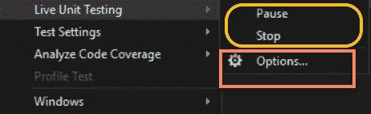

# 测试和部署 – Let's Chat 网络应用程序

在上一章中，我们开发了 Let's Chat 网络应用程序的认证模块。在本章中，我们将使用 SignalR 开发聊天中心模块，并完成网络应用程序的编码工作。之后，我们将演示其工作原理，并学习如何测试和部署它。我们将了解 Docker 容器及其可能带来的帮助。最后，我们将开发一个基于 ASP.NET Core 的聊天机器人，并将其与 Let's Chat 应用程序和 Facebook 集成。本章的动机在于理解 .NET Core 应用程序的测试部署模型、Visual Studio 2017 的实时单元测试功能、容器，以及预先了解基于 Microsoft Bot Framework 的简单机器人开发。在本章中，我们将涵盖以下内容：

+   聊天中心模块

+   测试概述

+   容器简介

+   机器人 101

# 聊天中心模块

现在我们已经设置了认证模块，用户可以使用 Facebook 登录到我们的 Let's Chat 网络应用程序。我们仍然需要开发聊天模块，以便用户可以看到在线的朋友并与他们聊天。在本节中，我们将使用 SignalR 开发聊天中心模块。我们已经使用 SignalR 开发了一个井字棋游戏。因此，我们已经熟悉了如何开发 SignalR 中心模块以及如何在客户端和服务器之间进行双向通信，所以这对我们来说应该相对容易。在客户端方面，我们将利用 Razor 页面。ASP.NET Core 2.0 引入了一个名为 Razor 页面的新功能，这使得针对页面关注场景的编码变得更加容易。如果你之前使用过 ASP.NET 的早期版本，你可能会看到或听说过 ASP.NET Web 表单（`.aspx`）应用程序，这些应用程序以 Web 表单为核心。在 MVC 世界中，这基本上是同样的概念，使得快速开发演示和 **概念验证**（**PoCs**）变得非常高效。我们将快速浏览一下 Razor、视图和 Razor 页面，然后跳入聊天中心模块的编码工作。

在 **模型-视图-控制器**（**MVC**）模式中，视图负责处理应用程序数据展示和用户交互。具体来说，在 ASP.NET MVC 的上下文中，视图只是一个带有 Razor 标记的 HTML 模板。Razor 标记... 哼！在我们理解视图之前，让我们先看看 Razor 入门。

# Razor 入门

Razor 是一种用于在网页中嵌入基于服务器的代码的标记语法。熟悉 PHP 的开发者在使用 Razor 时会感到很自在，因为语法非常相似。Razor 语法由 Razor 标记、C#和 HTML 组成。由于它包含 C#和 HTML，包含 Razor 语法的文件通常具有`.cshtml`扩展名。在 Razor 语法中，`@`符号非常重要，它用于从 HTML 过渡到 C#。OK！但 Razor 是如何工作的呢？一个`.cshtml`文件可以包含 Razor、C#和 HTML。服务器首先运行 Razor 标记和 C#，这最终会转换为浏览器可以理解和渲染的 HTML。然后，这个 HTML 与剩余的 HTML 内容结合，并返回给浏览器。以下是在 Razor 中保留的关键字：

+   `functions`

+   `inherits`

+   `model`

+   `page`

+   `section`

语言特定的关键字（对于`.cshtml`中的 C#和`.vbhtml`中的 VB）在 Razor 代码块中保持不变，因此没有特别提及。必须注意，当`@`符号后面跟着 Razor 保留关键字时，它会被转换为 Razor 特定的标记；否则，它将过渡到纯 C#。让我们快速看一下 Razor 语法：

| **学习要点** | **示例** | **备注** |
| --- | --- | --- |
| `@`与 Razor 保留关键字 | `@model` `@page` | 当`@`符号后面跟着 Razor 保留关键字时，它会过渡到 Razor 特定的标记。否则，它将过渡到纯 C#。 |
| 转义`@`字符 | `<span>@@Name</span>`在 HTML 中渲染为`<span>@Name</span>` | 包含电子邮件地址的 HTML 属性和内容不会将`@`视为过渡字符。要在 Razor 标记中转义`@`符号，请使用第二个`@`符号。 |
| 隐式 Razor 表达式 | `<p>@DateTime.Now</p>` | `@`后跟 C#代码。 |
| 空格不允许 | `@DateTime.Now - TimeSpan.FromDays(2)` | 由于存在空格，渲染为`29/12/2017 – TimeSpan.FromDays(2)`。 |
| 泛型不支持 | `<p>@SomeMethod<int>()</p>` | `<>`会被解释为 HTML 标签，因此在隐式表达式中不支持。 |
| 显式 Razor 语法 | `@(DateTime.Now.AddDays(1))` | `@()`括号内的任何内容都会被评估并渲染到输出中。 |
| 表达式编码 | `@("<span>Hello DotNet 2.0 By Example</span>")` | 渲染的 HTML 为`&lt;span&gt;Hello DotNet 2.0 By Example&lt;/span&gt;`，在浏览器中显示为`<span>Hello DotNet 2.0 By Example</span>`。 |
| 无表达式编码 | `@Html.Raw("<span> Hello .NET Core 2.0 </span>")`渲染为`<span>Hello .NET Core 2.0</span>` | 这会导致安全漏洞，如恶意用户输入和跨站脚本，因此必须极其小心地使用。请记住，除非你 100%确信它不会在任何情况下损害安全，并且永远不会是用户输入，否则请避免使用`@Html.Raw`。 |
| Razor 代码块 | `@{}` `ViewData["Title"] = "Let's Chat";` | Razor 代码块以 `@` 开头，并由 `{}` 包围。与表达式不同，代码块内的 C# 代码不会被渲染。 |
| 显式行转换 | `@:Name: @User.Name` 将渲染为 `Name: <<User.Name 的值>>` | 要在代码块内将整行内容渲染为 HTML，请使用 `@:` 语法。 |
| `@If-else if-else` | `@if (condition){}` `else if (some condition) {}` `else {}` | 仅在开始 `if` 之前需要 `@`。 |
| `@switch` | `@switch(value)` `{ case 1:break;default:break;}` | `switch` 情况的简单语法。 |
| `@for` | `@for (var i = 0; i < array.Length; i++){}` | 使用 `@for`。 |
| `@foreach` | `@foreach (var item in array) {}` | 使用 `@foreach`。 |
| `@while` | `@{var i=0;}` `@while (i < array.Length) {}` | 使用 `@while`。 |
| `@do while` |

```cs
@{ var i = 0; }
@do {
  }while(i< array.Length)
```

| 使用 `@do...while`. |
| --- |
| `@using` | `@using (Html.BeginForm()) {` `@* 整个表单内容 *@}` `@using System.Linq` | 用于创建包含额外内容的 HTML 辅助器。示例渲染了一个表单标签。也可以用作 `using` 指令，并将 C# 的 `using` 指令添加到生成的视图中。 |
| `@try`, `catch`, `finally` | `@try{}` `catch(Exception ex){}` `finally{}` | 使用 `@try` 和类似的 C# 语法。 |
| `@lock` | `@lock(syncLock)` `// 在此处执行关键工作` | 与 C# 相同，用于保护关键区域。使用 `@lock.` |
| 注释 |

+   `<!-- HTML 注释-->`

+   `/* C# 注释 */// C# comment`

+   `@* Razor 多行注释 *@`

| Razor 支持 HTML 和 C# 注释。 |
| --- |
| `@model` | `@model HomeViewModel` | `@model` 指令指定传递给视图的模型类型，并在强类型视图中广泛使用。 |
| `@inherits` | `@inherits BaseRazorPage` 现在视图将能够访问 `BaseRazorPage` 类的所有受保护和公共属性、字段和方法。 | `@inherits` 指令提供了对视图继承的类的完全控制。 |
| `@inject` | `@inject IHtmlLocalizer` | `@inject` 指令允许 Razor 页面从服务容器中注入服务到视图中。 |
| `@functions` |

```cs
@functions { public string GetTime(){
  return     DateTime.Now.ToString();
}}
```

`<div> 当前时间 : @GetTime()</div>` | `@functions` 指令允许 Razor 页面向视图添加函数级内容。 |

| `@section` | `@section Scripts { <script type="text/javascript" src="img/main.js"></script> }` | `@section` 指令与布局页面结合使用，以允许视图在 HTML 页面的不同部分（如标题、页脚、主体等）中渲染内容。 |
| --- | --- | --- |

# 标签助手

Tag Helper 是 ASP.NET Core 中引入的新功能，它使服务器端代码能够参与在 Razor 文件中创建和渲染 HTML 元素。Tag Helper 是参与视图生成的 C# 类，通过操作 HTML 元素来实现。通过使用 Tag Helper，我们可以向 HTML 元素添加额外的属性，更改内容，或完全替换它们。简单来说，Tag Helper 的代码帮助我们构建 `.cshtml` 表单，而无需编写 Razor 语法。例如，如果我们要在 Razor 中编写一个锚标签，我们会这样写：

`@Html.ActionLink("Read my book", "Read", "Book")`

`Read` 是 `Book` 控制器中的动作，锚标签之间的文本将是 `"Read my book"`。使用 Tag Helper，可以非常容易地写出相同的锚标签，如下所示：

```cs
<a asp-action="Read" asp-controller="Book">Read my book</a>
```

这既容易编写，又容易理解，看起来更整洁，也更容易维护，因为它看起来像 HTML。Visual Studio 为 Tag Helper 提供了出色的工具支持，它会突出显示所有使用 Tag Helper 的 HTML 元素，从而使其更容易识别，并提供丰富的智能感知来探索和使用它们。请注意，所有 Tag Helper 属性都以 `asp-` 开头，它们的命名是自解释的。框架中包含了许多内置的 Tag Helper，编写一个新的也非常直接。让我们快速查看一些内置的 Tag Helper，然后我们将通过创建一个自定义 Tag Helper 来结束这次讨论。以下表格列出了几个内置的 Tag Helper：

| **Tag Helper** | **示例** |
| --- | --- |
| 锚点 | `<a asp-action="Index" asp-controller="Home">Back to Home</a>` 锚点 Tag Helper 有一些其他属性可以设置，例如 `asp-fragment`、`asp-route`、`asp-path`。这定义了锚标签。 |
| 标签 | `<label asp-for="Name"></label>` 定义了一个控件的标签。 |
| 输入 | `<input type="text" asp-for="Name"/>` 之前我们为不同类型的输入（`checkbox`、`select`、`radio`、`text`）使用了多个 Razor 辅助函数。现在我们只有两个辅助属性 `asp-for` 和 `asp-format`。 |
| 表单 | `<form asp-action="Create" asp-anti-forgery="true" asp-controller="Person"></form>` `action` 和 `controller` 被定义，同时 `ValidateAntiForgeryToken` 也得到了处理！太棒了！ |
| 文本区域 | `<textarea asp-for="Description"></textarea>`。 |
| 选择 | `<select asp-for="SelectedBook" asp-items="Model.Books"></select>`。 |
| 图片 | `` 用于缓存破坏图片，因为 Tag Helper 会将图片的哈希值附加为查询字符串参数，例如 ``。 |
| 缓存 | `<cache expires-after="@TimeSpan.FromMinutes(5)"></cache>` 缓存标签内的内容将存储在服务器内存中，除非明确禁用。 |
| 链接和脚本 | 这些是所有 Tag Helper 中最有趣的，因为它们实现了缓存破坏以及回退机制，例如`<link rel="stylesheet" href="//ajax.aspnetcdn.com/ajax/bootstrap/3.0.0/css/bootstrap.min.css" asp-fallback-href="~/lib/bootstrap/css/bootstrap.min.css" asp-fallback-test-class="hidden" asp-fallback-test-property="visibility" asp-fallback-test-value="hidden" />`。 |
| 验证 | `<span asp-validation-for="Description"></span>`。 |
| 环境 | `<environment names="Staging,Production"></environment>`。这是一个特殊的辅助器，因为辅助器的内容只有在部署的环境名称与`Environment`标签的`names`属性匹配时才会被渲染。  |

如我们所见，Tag Helper 在编写`.cshtml`文件时提供了极大的生产力提升。Visual Studio 工具的 IntelliSense 使这一体验更加高效。在 ASP.NET Core 2.0 中，通过在后台使用 Tag Helper，也启用了 Application Insights。接下来，让我们创建一个自定义的 Tag Helper。创建自定义 Tag Helper 需要遵循以下步骤：

1.  创建一个从`Microsoft.AspNet.Razor.TagHelper.TagHelper`类派生的自定义类

1.  在类中创建属性以保存属性值

1.  通过使用`HtmlTargetElement`属性装饰类，将 Tag Helper 限制为仅适用于特定类型的 HTML 元素

1.  重写`ProcessAsync`方法并设置所需的属性

1.  在`_ViewImports.cshtml`中添加一行，以便 Razor 视图能够识别 Tag Helper

由于我们现在没有使用 Tag Helper，所以不会深入细节，但正如我们所见，它相当直接且容易。现在我们已经了解了 Razor 语法和 Tag Helper 的基础知识，我们将快速回顾视图。

# 视图

在 MVC 模式中，视图（View）的目的是向用户显示应用程序数据并处理用户交互。视图帮助我们实现 MVC 应用程序中的关注点分离设计原则，通过将用户界面与业务逻辑分离。它是一个 HTML 页面，除了 HTML 标记外，还包含额外的 Razor 标记，正如我们在本章前面所见。`.cshtml`文件是视图，被视为网页。例如，如果我们创建一个简单的 MVC 应用程序，它会在`Views`文件夹下创建一个视图，并且每个视图都与一个控制器相关联。在以下示例中，`HomeController`调用了三个视图——`Index`、`About`和`Contact`。在`Views`文件夹中，我们有一个以控制器名称（`Home`）命名的子文件夹，这个文件夹包含`HomeController`中使用的所有视图。这在上面的屏幕截图中显示：


视图中最常用的组件包括：

1.  **布局**：这些类似于母版页，用于在所有网页之间保持一致性。例如，我们看到在所有页面上都使用的一些常见内容，如页眉、页脚、菜单等。

1.  **部分视图**：部分视图对于可重用性很有用。如果我们有一些需要在多个屏幕上显示的内容，或者如果我们有一个没有逻辑或代码要执行，只有内容要显示的页面，我们可以将它们作为部分视图。

1.  **视图组件**：这些与部分视图类似，帮助我们重用代码，但区别在于部分视图仅绑定模型，而视图组件可以与数据和业务逻辑交互，因为它们有一个迷你控制器。一个常见的视图组件示例是任何电子商务网站的购物车。它通过数据库交互来渲染内容。

接下来，我们将探讨 ASP.NET Core 2.0 中引入的一个新特性，称为 Razor 页面。

# Razor 页面

Razor 页面是轻量级页面，增加了直接处理请求的功能，无需控制器。这使得它们在创建快速应用、概念验证或向观众展示酷炫演示时非常有用。要将视图页面转换为 Razor 页面，我们需要添加 `@page` 指令。它应该是页面上的第一个指令。例如：

```cs
@page
<h1>Hello from .NET Core 2.0 By Example</h1>
```

当我们需要带有少量逻辑的视图时，Razor 页面很有用。对于较小的逻辑，Razor 页面的投资回报率会比创建控制器、操作和视图更好。在 Razor 页面中，我们可以在页面内添加逻辑，或者简单地创建 `page.cshtml.cs` 后端代码，来编写代码。我心中产生了一个问题：*我们是向前发展，还是回到了 Web 表单后端代码的世界？*。

创建 Razor 页面非常简单。右键单击项目，然后单击“添加”|“新建项”，选择“Razor 页面”，如图所示：


在这个例子中，`DemoRazorPage.cshtml` 与 `DemoRazorPage.cshtml.cs` 和 `DemoRazorPageModel` 相关联。我们可以继续编写所需的代码，无需担心创建控制器，然后是它的操作方法，最后在特定位置添加视图。超级高效！


在图中，`DemoRazorPage.cshtml` 文件是 Razor 页面，而 `DemoRazorPage.cshtml.cs` 是 Razor 页面的后端代码文件，它使用 `DemoRazorPageModel` 作为模型。

通过这些，我们已经触及了 ASP.NET Core 中所有基本和最常用的功能。现在，我们将继续编写 Chat 中心模块的代码。

# 编写 Chat 中心模块

现在，让我们为我们的 Let's Chat 网络应用程序编写 Chat 中心模块的代码。我们已经看到如何在开发井字棋游戏时使用 SignalR 创建一个简单的实时网络应用程序，所以我们不会在已经看到的内容上花费太多时间。回想一下，我们已经在 Facebook 上实现了身份验证，并且我们有用户详情，例如显示名称和简介图片。我们需要在 Chat 中心模块中开发以下内容：

+   列出连接到 Chat 中心的所有在线用户

+   随时更新用户在线列表，当有人加入或离开聊天室时

+   房间中发送的任何聊天消息都将发送给所有连接的用户

很明显，为了满足这些要求，我们需要跟踪用户，以便连接的用户在在线列表中显示，当他们离开聊天室时从列表中消失。我们首先创建一个名为`UserInformation`的类来保存用户详情，如`name`、显示图片 URL（`imageURL`）和`connection identifier`，如下定义：

```cs
    /// <summary>
    /// The class to hold the user information.
    /// </summary>
    public class UserInformation
    {
        /// <summary>
        /// Initializes a new instance of the <see 
            cref="UserInformation"/> class.
        /// </summary>
        /// <param name="connectionId">The connection identifier.
            </param>
        /// <param name="name">The name of user.</param>
        /// <param name="imageUrl">The url of user's profile picture.
            </param>
        public UserInformation(string connectionId, string name, string 
        imageUrl)
        {
            this.ConnectionId = connectionId;
            this.Name = name;
            this.ImageUrl = imageUrl;
        }

        /// <summary>
        /// Gets the image path of the user
        /// </summary>
        public string ImageUrl { get; }

        /// <summary>
        /// Gets the connection identifier.
        /// </summary>
        public string ConnectionId { get; }

        /// <summary>
        /// Gets the name of user.
        /// </summary>
        public string Name { get; }
    }
```

接下来，让我们创建一个名为`IUserTracker`的接口，其中包含三个用于用户跟踪的方法：

+   **获取所有在线用户**：这将用于显示所有连接到聊天的用户

+   **添加用户**：这将用于添加用户到用户跟踪数据存储，并且应该在用户加入聊天室时调用

+   **移除用户**：这将用于从用户跟踪数据存储中移除用户，并且应该在用户离开聊天室时调用

代码如下所示，注释应该使代码更全面：

```cs
    /// <summary>
    /// Contract for user tracking.
    /// </summary>
    public interface IUserTracker
    {
        /// <summary>
        /// Gets all the online users (connected to chat hub)
        /// </summary>
        /// <returns>A collection of online user information</returns>
        Task<IEnumerable<UserInformation>> GetAllOnlineUsersAsync();

        /// <summary>
        /// Add user to User Tracker data store. This would be called 
            when a user joins the chat hub.
        /// </summary>
        /// <param name="connection">The hub connection context.
            </param>
        /// <param name="userInfo">The user information</param>
        /// <returns>The task.</returns>
        Task AddUserAsync(HubConnectionContext connection, 
        UserInformation userInfo);

        /// <summary>
        /// Removes user from User Tracker data store. This would be 
            called when a user leaves the chat hub.
        /// </summary>
        /// <param name="connection">The hub connection context.
            </param>
        /// <returns>The task.</returns>
        Task RemoveUserAsync(HubConnectionContext connection);
    }
```

我们创建了一个接口，以便我们可以利用依赖注入来注入用户跟踪组件，无论何时需要它。尽管我们已经与 SignalR 合作过，但我们还没有遇到过`HubConnectionContext`类，我们在接口中使用过这个类。所以，让我们快速了解一下它。`HubConnectionContext`类位于`Microsoft.AspNetCore.SignalR.Core`程序集下的`Microsoft.AspNet.SignalR`命名空间中。它封装了有关 SignalR 连接的所有信息。以下代码映射图显示了`HubConnectionContext`类及其属性：


代码如下所示：

```cs
namespace Microsoft.AspNetCore.SignalR
{
    public class HubConnectionContext
    {
        public HubConnectionContext(WritableChannel<HubMessage> output, 
        ConnectionContext connectionContext);

        public virtual string ConnectionId { get; }
        public virtual ClaimsPrincipal User { get; }
        public virtual IFeatureCollection Features { get; }
        public virtual IDictionary<object, object> Metadata { get; }
        public virtual HubProtocolReaderWriter ProtocolReaderWriter {  
        get; set; }
        public virtual WritableChannel<HubMessage> Output { get; }
    }
}
```

将会有一个扩展方法来从`HubConnectionContext`获取`HttpContext`。

我们使用`HubConnectionContext`类在`UserTracker`类中跟踪用户和连接，我们将在下一部分实现。让我们在`UserTracker`类中实现`IUserTracker`接口，如下所示：

```cs
    /// <summary>
    /// The User Tracker class for tracking users that are connected to  
        chat.
    /// </summary>
    public class UserTracker : IUserTracker
    {
        /// <summary>
        /// The private storage for keeping the track of online users 
            connected to chat hub.
        /// We are going to register the User Tracker as singleton, so    
            no need to make it as static as it would be resued once the   
            class is initialized.
        /// </summary>
        private readonly ConcurrentDictionary<HubConnectionContext, 
        UserInformation> onlineUserStore = new 
        ConcurrentDictionary<HubConnectionContext, UserInformation>();

        /// <summary>
        /// Add user to User Tracker data store. This would be called 
            when a user joins the chat hub.
        /// </summary>
        /// <param name="connection">The hub connection context.
            </param>
        /// <param name="userInfo">The user information</param>
        /// <returns>The task.</returns>
        public async Task AddUserAsync(HubConnectionContext connection, 
        UserInformation userInfo)
        {
            //// Add the connection and user to the local storage.
            onlineUserStore.TryAdd(connection, userInfo);
            await Task.CompletedTask;
        }

        /// <summary>
        /// Gets all the online users (connected to chat hub)
        /// </summary>
        /// <returns>A collection of online user information</returns>
        public async Task<IEnumerable<UserInformation>> 
        GetAllOnlineUsersAsync() => await 
        Task.FromResult(onlineUserStore.Values.AsEnumerable());

        /// <summary>
        /// Removes user from User Tracker data store. This would be 
            called when a user leaves the chat hub.
        /// </summary>
        /// <param name="connection">The hub connection context.
            </param>
        /// <returns>The task.</returns>
        public async Task RemoveUserAsync(HubConnectionContext 
        connection)
        {
            //// Remove the connection and user from the local storage.
            if (onlineUserStore.TryRemove(connection, out var 
            userInfo))
            {
                await Task.CompletedTask;
            }
        }
    }
```

这样，我们的用户跟踪组件就创建完成了。它有一个备份存储（并发字典），当用户加入聊天室时，我们将添加连接和用户详情，当用户离开聊天室时，我们将从其中删除条目。我们也可以将并发字典作为`static`，但我们将使用依赖注册来注册我们的`UserTracker`类作为单例，这样我们就可以确保所有用户连接都会使用同一个类的实例。为了将我们的`UserTracker`注册为单例，我们将在`Startup.cs`类的`ConfigureServices`方法中编写以下代码行：

```cs
//// Register IUserTracker as singleton.
services.AddSingleton(typeof(IUserTracker), typeof(UserTracker));

services.AddSignalR();   //// Adds SignalR goodness in the container.  
```

接下来，我们将编写 Chat hub 的代码，它将使用`UserTracker`类和 SignalR 的优点来完成我们的聊天室。为此，让我们创建一个名为`ChatHub`的类，它从`Hub`类派生，以下是其代码：

```cs
    /// <summary>
    /// The Chat hub class.
    /// </summary>
    [Authorize]
    public class ChatHub : Hub
    {
        /// <summary>
        /// The user tracker to keep track of online users.
        /// </summary>
        private IUserTracker userTracker;

        /// <summary>
        /// Initializes a new instance of the <see cref="ChatHub"/> 
            class.
        /// </summary>
        /// <param name="userTracker">The user tracker.</param>
        public ChatHub(IUserTracker userTracker) 
        {
            this.userTracker = userTracker;
        }
    }
```

这里有一些重要的要点需要注意：

1.  `ChatHub` 类继承自 `Microsoft.AspNetCore.SignalR.Hub` 类。

1.  `ChatHub` 类被 `[Authorize]` 属性装饰，这意味着只有经过身份验证和授权的用户才能访问中心。

1.  `ChatHub` 的构造函数使用 `IUserTracker` 作为依赖项，这将通过依赖注入进行注入。

`Microsoft.AspNetCore.SignalR.Hub` 类有一个名为 `Context` 的属性，其类型为 `HubCallerContext`，它包含 SignalR 连接标识符、用户声明信息和 `HubConnectionContext`。我们可以利用 `Context` 属性从我们的 Chat 中心提取用户信息。为此，我们需要一个辅助/扩展方法，该方法接受 `HubCallerContext` 并返回我们之前创建的 `UserInformation` 对象。以下代码片段显示了一个辅助类，其中包含一个将 `HubCallerContext` 转换为 `UserInformation` 的方法：

```cs
    /// <summary>
    /// The Helper class.
    /// </summary>
    public static class Helper
    {
        /// <summary>
        /// Gets the user information from the Hub caller context.
        /// </summary>
        /// <param name="context">The Hub Caller Context.</param>
        /// <returns>The user Information.</returns>
        public static UserInformation 
        GetUserInformationFromContext(HubCallerContext context)
        {
            Claim nameIdentifierClaim = 
            context.User.Claims.FirstOrDefault(j => j.Type ==   
            "http://schemas.xmlsoap.org/ws/2005/05/
            identity/claims/nameidentifier")
            ; //// Make it a constant.
            var userId = nameIdentifierClaim.Value; //// Get user Id.
            var imageUrl = 
            $"https://graph.facebook.com/{userId}/picture?type=square"; 
            //// Get FB image.
            return new UserInformation(context.ConnectionId, 
            context.User.Identity.Name, imageUrl);
        }
    }
```

使用这种结构，我们现在可以跟踪在线用户，无论他们何时加入或离开我们的聊天室，通过重写由 `Microsoft.AspNetCore.SignalR.Hub` 类公开的 `OnConnectedAsync` 和 `OnDiconnectedAsync` 虚拟方法。我们还需要添加一个额外的方法来获取所有已连接用户列表。我们可以在 `ChatHub` 类中轻松编写以下代码：

```cs
        /// <summary>
        /// Gets all the connected user list.
        /// </summary>
        /// <returns>The collection of online users.</returns>
        public async Task<IEnumerable<UserInformation>> 
        GetOnlineUsersAsync()
        {
            return await userTracker.GetAllOnlineUsersAsync();
        }

        /// <summary>
        /// Fires on client connected.
        /// </summary>
        /// <returns>The task.</returns>
        public override async Task OnConnectedAsync()
        {
            var user = Helper.GetUserInformationFromContext(Context);
            await this.userTracker.AddUserAsync(Context.Connection, 
            user);
            await Clients.All.InvokeAsync("UsersJoined", new 
            UserInformation[] { user });
            //// On connection, refresh online list.
            await Clients.All.InvokeAsync("SetUsersOnline", await 
            GetOnlineUsersAsync());

            await base.OnConnectedAsync();
        }

        /// <summary>
        /// Fires when client disconnects.
        /// </summary>
        /// <param name="exception">The exception.</param>
        /// <returns>The task.</returns>
        public override async Task OnDisconnectedAsync(Exception 
        exception)
        {
            var user = Helper.GetUserInformationFromContext(Context);
            await Clients.All.InvokeAsync("UsersLeft", new 
            UserInformation[] { user });
            await this.userTracker.RemoveUserAsync(Context.Connection);
            //// On disconnection, refresh online list.
            await Clients.All.InvokeAsync("SetUsersOnline", await 
            GetOnlineUsersAsync());
            await base.OnDisconnectedAsync(exception);
        }

        /// <summary>
        /// Sends the message to all the connected clients.
        /// </summary>
        /// <param name="message">The message to be sent.</param>
        /// <returns>A task.</returns>
        public async Task Send(string message)
        {
            UserInformation user = 
            Helper.GetUserInformationFromContext(Context);
            await Clients.All.InvokeAsync("Send", user.Name, message, 
            user.ImageUrl);
        }
```

代码易于理解。然而，为了清晰和完整，我们将快速浏览前面的代码。这里有四个方法：

+   `GetOnlineUsersAsync`：此方法返回存储在 `UserTracker` 存储中的所有在线用户。此方法将用于在聊天室页面上显示在线用户。

+   `OnConnectedAsync`：当用户连接到 Chat 中心，即加入聊天室时，此方法被触发。在这个方法中，我们首先通过调用 `Helper` 类的 `GetUserInformationFromContext` 方法来获取用户信息，传递包含当前连接信息的 `Context` 属性。在获取用户信息后，我们将连接和用户信息添加到 `UserTracker` 存储中。接下来，我们需要通知所有已连接客户端，现在有一个新的用户可供聊天，因此我们在所有客户端上触发 `UsersJoined` 方法。我们将在稍后看到这个方法。此方法接受一个 `UserInformation` 数组作为参数。这样，我们可以向所有已连接客户端显示，有新用户加入了聊天室。最后，我们需要更新显示在线用户的列表，因此我们在所有已连接客户端上调用客户端方法 `SetUsersOnline`，并传递已连接用户列表。

+   `OnDisconnectedAsync`: 这个方法与 `OnConnectedAsync` 方法正好相反，当用户从 Chat hub 断开连接，即离开聊天室时触发。在这个方法中，我们首先通过调用 `Helper` 类方法 `GetUserInformationFromContext` 获取用户信息，传入 hub 的 `Context` 属性，该属性包含有关当前连接的信息。在获取用户信息后，我们需要通知所有已连接的客户端该用户不再可用进行聊天，因此我们在所有客户端上触发 `UsersLeft` 方法。我们将在稍后看到这个方法。这个方法接受一个 `UserInformation` 数组作为参数。这样，我们就可以向所有已连接的客户端显示一个用户已经离开了聊天室。接下来，我们从 `UserTracker` 存储中删除连接和用户信息。最后，我们需要更新显示在线用户的列表，因此我们在所有已连接的客户端上调用客户端方法 `SetUsersOnline`，传入连接用户的列表。

+   `Send`: 我们看到的最后一个方法被称为 `Send`。正如其名所示，这个方法用于将消息发送给所有已连接的客户端，同时包含用户名和图片 URL。在这个方法中，我们首先从 `Context` 中获取用户信息，就像我们在前面的方法中所做的那样，然后对所有已连接的客户端调用客户端方法 `Send`，传入发送消息的用户名和图片 URL。当我们探索客户端方法时，我们将很快看到 `Send` 方法的详细信息。

我们将通过配置 HTTP 管道来拦截和映射任何具有 `chatHub` 的请求，将其映射到我们的 `ChatHub` 类，以此来封装我们的 Chat hub 的服务器端编码。为此，我们将在 `Startup.cs` 的 `Configure` 方法中 `app.UseAuthentication` 和 `app.UseMvc` 之间编写以下代码：

```cs
//// Use - SignalR & let it know to intercept and map any request having chatHub.
app.UseSignalR(routes =>
{
   routes.MapHub<ChatHub>("chatHub");
});
```

这就完成了我们的服务器端编码。接下来，我们将查看我们在视图中将进行的客户端编码。用户界面代码相当简单，所以我们不会深入探讨。读者可以浏览源代码，查看用户界面代码和使用的 `.css` 类。我们将查看完成聊天室体验所需的客户端 JavaScript 代码。作为最佳实践，所有 JavaScript/jQuery 编码都应该在一个单独的 `.js` 文件中完成，并在视图中引用。为了简化，我将在视图中直接展示内联 JavaScript。所以，让我们编写客户端代码：

我们首先确保在 `_Layout.cshtml` 文件中存在以下 CSS 和 JavaScript 引用，以便它们可以在我们的视图中使用。这样，它们就会在我们的视图中可用：

```cs
<script src="img/jquery.js"></script>
<link href="~/css/site.css" rel="stylesheet" />
<script src="img/signalr-client-1.0.0-alpha1-final.js"></script>
<script src="img/signalr-clientES5-1.0.0-alpha1-final.js"></script>
<script src="img/signalr-msgpackprotocol-1.0.0-alpha1-final.js"></script>
```

在我们的 `HomeController` 类的 `Index.cshtml` 中，创建一个 `<script>` 节点，并在页面底部初始化 SignalR hub 连接，如下所示：

```cs
<script type="text/javascript">
    let hubUrl = '/chatHub';
    let httpConnection = new signalR.HttpConnection(hubUrl);
    let hubConnection = new signalR.HubConnection(httpConnection);
</script>
```

接下来，我们需要定义我们之前在服务器端编码中看到的以下方法：

+   `SetUsersOnline`: 此方法在左侧面板显示连接的用户。

+   `UsersJoined`: 当用户加入聊天室时，此方法被触发。此方法显示用户已加入房间的信息。

+   `UsersLeft`: 当用户离开聊天室时，此方法被触发。此方法显示用户已离开房间的信息。

+   `Send`: 当用户输入消息并点击“发送”按钮时，调用此方法。

上述方法的伪代码如下。详细的完整代码可以从与本书共享的源代码仓库 URL（[`github.com/PacktPublishing/.NET-Core-2.0-By-Example`](https://github.com/PacktPublishing/.NET-Core-2.0-By-Example)）中查看。

```cs
 hubConnection.on('SetUsersOnline', usersOnline => {
        if (usersOnline.length > 0) {
            $('#onlineUsers').innerText = '';
            $.each(usersOnline, function (i, user) {
                //// Display users in the panel.
            });
        }
    });

    hubConnection.on('UsersJoined', users => {
        if (users != null && typeof (users) != undefined) {
            appendLine(users.name + ' joined the chat room', 'green');
            //// Display that user joined the chat room.
        }
    });

    hubConnection.on('UsersLeft', users => {
        if (users != null && typeof (users) != undefined) {
            appendLine(users.name + ' left the chat room', 'red');
            //// Display that user left the chat room.
            document.getElementById(users.connectionId).outerHTML = '';
        }
    });
```

在进行任何客户端开发或使用 Bootstrap 进行网页/视图设计时，你可以使用如[`bootswatch.com/default/`](https://bootswatch.com/default/)这样的 Bootstrap 主题网站，它提供所需的代码，并且可以最小化修改后使用。我们可以在几小时内启动一个网页或完整的网站。真的试试看！它非常方便！

一旦我们完成用户界面和客户端编码，我们的 Let's Chat 应用程序就准备好使用了。让我们运行应用程序。这是 Let's Chat 应用程序的用户界面看起来像：


从上到下看看：

1.  它识别已登录的用户，因此能够显示“你好 `{用户名}`”（截图中的 Rishabh Verma），因此我们的认证模块工作良好。

1.  在左侧，它显示在线用户，只列出一个名字，因此能够追踪连接到聊天室的用户。

1.  在聊天区域，我们可以看到 Rishabh Verma 加入了聊天室，Neha Shrivastava 加入了聊天室，因此我们的`IUserTracker`类与认证模块配合工作良好。

1.  用户的 Facebook 头像与他们的消息一起显示。

1.  如果用户离开聊天室，它也会显示文本。

这样，我们的 Let's Chat 应用程序代码就完成了。接下来，我们将进行单元测试，以确保在开发过程中就能捕捉到代码中的问题或错误，从而我们能够交付和部署一个高质量的产品。在这个过程中，我们还将学习如何使用 ASP.NET Core 2.0 进行测试。

# 测试概述

著名的 Java 程序员布鲁斯·艾克尔提出了一句强调测试软件重要性的口号：

如果没有经过测试，它就是有缺陷的。

尽管自信的程序员可能会对此提出质疑，但它完美地突出了确定代码能够一次又一次地按预期工作，没有任何异常的能力。我们如何知道我们交付给最终用户或客户的代码是高质量的，并且所有用户需求都能得到满足？通过测试？是的，通过测试，我们可以确信软件按照客户的要求和规格工作。如果预期行为和实际行为之间存在任何差异，这被称为软件中的错误/缺陷。越早发现这些差异，就越容易在软件发货前修复它们；结果是高质量。难怪软件测试员在各种软件公司中也被称为质量控制分析师。一个好的软件测试员的座右铭可能是：

我们信仰上帝，其余的我们都要测试。

我们不会深入探讨测试类型，因为这本身就可以成为另一章的内容。我们将简要地了解它们，然后编写我们的单元测试，这是每个好的开发者编写任何软件程序后都应该写的。软件测试在不同的级别进行：

+   **单元测试**：在编码过程中，开发者会对程序的一个单元进行测试，以验证他们编写的代码是无错误的。我们很快就会编写一些单元测试。

+   **集成测试**：在一个有多个开发者工作的团队中，开发者们可能正在处理不同的组件。即使所有开发者都执行了单元测试并确保他们的单元运行良好，仍然需要确保在将这些组件集成后，它们能够无错误地工作。这是通过集成测试实现的。

+   **系统测试**：整个软件产品作为一个整体进行测试。这是通过以下一种或多种方法实现的：

    +   **功能测试**：测试软件的所有功能是否符合业务需求文档。

    +   **性能测试**：测试软件的性能。它测试软件完成所需业务用例的平均时间、资源利用率等。这是通过负载测试和压力测试实现的，在这些测试中，软件被置于高用户和数据负载下。

    +   **安全测试**：测试软件对常见和已知的网络安全威胁的防护能力。

    +   **可访问性测试**：测试用户界面是否对有特殊需求的人友好和易于使用。

+   **用户验收测试**：当软件准备交付给客户时，它将经历一轮由客户进行的测试，以检验用户交互和响应。

+   **回归测试**：每当在软件中添加/更新一段代码以添加新功能或修复现有功能时，都会对其进行测试，以检测是否有任何由新添加/更新的代码引起的副作用。

在所有这些不同类型的测试（以及这里没有列出的许多其他测试）中，我们将重点关注单元测试，因为这是编写功能的开发者所执行的。

# 单元测试

.NET Core 是以可测试性为设计理念的。.NET Core 2.0 为 VB、F# 和 C# 提供了单元测试项目模板。我们还可以在 xUnit、NUnit 和 MSTest 中选择我们选择的测试框架。

测试单个编程部分的单元测试是最底层的测试。单元测试应该只测试开发者控制内的代码，并且不应该测试基础设施问题，例如数据库、文件系统或网络资源。单元测试可以使用 **测试驱动开发**（**TDD**）编写，或者添加到现有代码中以验证其准确性。`Test` 类名的命名约定应以 `Test` 结尾，并位于被测试的类所在的同一命名空间中。例如，`Microsoft.Example.AspNetCore` 类的单元测试将位于测试程序集中的 `Microsoft.Example.AspNetCoreTest` 类中。此外，单元测试方法名必须描述性，关于 *正在测试的内容*、*在什么条件下* 和 *期望是什么*。一个好的单元测试有三个主要部分，以下指定顺序：

1.  安排

1.  行为

1.  断言

我们首先安排代码，然后对其采取行动，然后进行一系列断言以检查实际输出是否与预期输出匹配。让我们详细看看它们：

1.  **安排：**在行为部分进行调用所需的所有参数构建和方法调用必须在安排部分声明。

1.  **行为：**行为阶段应该是一个语句，尽可能简单。这个语句应该是调用我们试图测试的方法。

1.  **断言：**方法调用可能失败的唯一原因是方法本身抛出异常，否则，应该始终有一些状态变化或输出来自任何有意义的调用。当我们编写行为语句时，我们预期一个输出，然后如果实际输出与预期相同，则进行断言。如果被测试的方法在正常情况下应该抛出异常，我们可以对异常类型和应该抛出的错误消息进行断言。

在编写单元测试用例时，我们应该警惕不要向基础设施注入任何依赖。基础设施依赖应在集成测试用例中处理，而不是在单元测试中。我们可以通过遵循显式依赖原则并利用依赖注入来请求框架的依赖，在我们的应用程序代码中保持对这些隐蔽依赖的战略距离。我们同样可以将我们的单元测试与集成测试放在不同的项目中，并确保我们的单元测试项目没有对框架的引用。

# 使用 xUnit 进行测试

在本节中，我们将学习如何为我们的控制器编写单元测试和集成测试。我们有多种选择可供选择测试框架。我们将使用 xUnit 进行所有单元测试，并使用 Moq 进行对象模拟。让我们通过以下步骤创建一个 xUnit 测试项目：

1.  在 Visual Studio 2017 中打开 Let's Chat 项目

1.  创建一个名为 `Test` 的新文件夹

1.  右键点击 `Test` 文件夹，然后点击 Add | New Project

1.  在 Visual C#项目模板下选择 xUnit Test Project (.NET Core)，如图所示：


1.  删除由模板创建的默认测试类

1.  在此项目中创建一个测试类 `AuthenticationControllerUnitTests` 用于单元测试

我们需要添加一些 NuGet 包。在 VS 2017 中右键点击项目以编辑项目文件并手动添加引用，或者使用 NuGet 包管理器添加这些包：

```cs
// This package contains dependencies to ASP.NET Core 
<PackageReference Include="Microsoft.AspNetCore.All" Version="2.0.0" />
// This package is useful for the integration testing, to build a test host for the project to test.
<PackageReference Include="Microsoft.AspNetCore.TestHost" Version="2.0.0" />
// Moq is used to create fake objects
<PackageReference Include="Moq" Version="4.7.63" />
```

现在，我们已经准备好编写我们的单元测试了。让我们开始做这件事，但在我们这样做之前，这里有一些关于 xUnit 和 Moq 的快速理论。

来自 xUnit 网站和维基百科的文档告诉我们，xUnit.net 是一个针对 .NET Framework 的免费、开源、社区关注的单元测试工具。它是单元测试 C#、F#、Visual Basic .NET 和其他 .NET 语言的最新技术。所有 xUnit 框架都共享以下基本组件架构：

+   **测试运行器**：它是一个可执行程序，用于运行使用 xUnit 框架实现的测试，并报告测试结果。

+   **测试用例**：这是最基本类。所有单元测试都从这里继承。

+   **测试装置**：测试装置（也称为测试上下文）是一组在运行测试之前需要的先决条件或状态。开发人员应在测试之前设置一个已知良好的状态，并在测试之后返回到原始状态。

+   **测试套件**：它是一组共享相同固定装置的测试。测试的顺序不应重要。

xUnit.net 支持两种不同类型的单元测试：

1.  **事实**：总是为真的测试。它们测试不变条件，即数据无关的测试。

1.  **理论**：只有对于特定数据集才为真的测试。

**Moq** 是 C#/.NET 的模拟框架。它在单元测试中用于隔离被测试的类与其依赖项，并确保在依赖对象上调用正确的方法。

记住，在单元测试中，我们只测试一个单元或软件的一个层/部分，因此不需要考虑外部依赖项，所以我们假设它们工作正常，并使用我们选择的模拟框架来模拟它们。

让我们将这个理论付诸实践，为 `AuthenticationController` 中的以下操作编写单元测试：

```cs
    public class AuthenticationController : Controller
    {
        private readonly ILogger<AuthenticationController> logger;

        public 
        AuthenticationController(ILogger<AuthenticationController> 
        logger)
        {
            this.logger = logger;
        }

        [Route("signin")]
        public IActionResult SignIn()
        {
            logger.LogInformation($"Calling {nameof(this.SignIn)}");
            return Challenge(new AuthenticationProperties { RedirectUri 
            = "/" });
        }
    }
```

单元测试代码取决于要测试的方法的编写方式。为了理解这一点，让我们为`SignIn`操作编写一个单元测试。为了测试`SignIn`方法，我们需要在`AuthenticationController`中调用`SignIn`操作。要做到这一点，我们需要`AuthenticationController`类的一个实例，在该实例上可以调用`SignIn`操作。为了创建`AuthenticationController`的实例，我们需要一个日志对象，因为`AuthenticationController`构造函数期望它作为一个参数。由于我们只测试`SignIn`操作，所以我们不必担心日志，因此我们可以模拟它。让我们来做：

```cs
    /// <summary>
    /// Authentication Controller Unit Test - Notice the naming 
        convention {ControllerName}Test
    /// </summary>
    public class AuthenticationControllerTest
    {
        /// <summary>
        /// Mock the dependency needed to initialize the controller.
        /// </summary>
        private Mock<ILogger<AuthenticationController>> mockedLogger = 
        new Mock<ILogger<AuthenticationController>>();

        /// <summary>
        /// Tests the SignIn action.
        /// </summary>
        [Fact]
        public void SignIn_Pass_Test()
        {
            // Arrange - Initialize the controller. Notice the mocked 
               logger object passed as the parameter.
            var controller = new 
            AuthenticationController(mockedLogger.Object);

            // Act - Invoke the method to be tested.
            var actionResult = controller.SignIn();

            // Assert - Make assertions if actual output is same as 
               expected output.
            Assert.NotNull(actionResult);
            Assert.IsType<ChallengeResult>(actionResult);           
            Assert.Equal(((ChallengeResult)actionResult).    
            Properties.Items.Count, 1);
        } 
    }
```

阅读注释可以解释单元测试代码。前面的例子展示了编写单元测试是多么容易。通过依赖于要测试的方法，事情可能会变得复杂，但大部分都会围绕模拟对象，并且有一些关于模拟框架和绑定的经验，模拟应该不会是一个困难的任务。对于`SignOut`操作的单元测试在模拟方面可能会比较复杂，因为它使用了`HttpContext`。`SignOut`操作的单元测试留作读者练习。让我们探索 Visual Studio 2017 中引入的新功能，称为实时单元测试。

# 实时单元测试

可能会让你失望，但**实时单元测试**（**LUT**）仅在 Visual Studio 2017 企业版中可用，而不是社区版。什么是实时单元测试？它是 Visual Studio 2017 企业版中引入的一个新生产力功能，它直接在 Visual Studio 编辑器中提供实时反馈，说明代码更改如何影响单元测试和代码覆盖率。所有这些都在你编写代码的同时实时发生，因此它被称为实时单元测试。这将有助于通过保持测试通过来维护质量。它还会在我们进行错误修复或添加功能时提醒我们需要编写额外的单元测试。

要开始实时单元测试：

1.  转到“测试”菜单项

1.  点击实时单元测试

1.  点击“开始”，如图所示：


点击此按钮后，你的 CPU 使用率可能会升高，因为 Visual Studio 会在后台启动 MSBuild 和测试运行器进程。在短时间内，编辑器将显示由单元测试覆盖的各个代码行的代码覆盖率。以下图像显示了由单元测试覆盖的`AuthenticationController`中的代码行。单击右侧图标，它会显示覆盖此代码行的测试，并提供运行和调试测试的选项：


同样，如果我们打开测试文件，它也会在那里显示指示器。太酷了，对吧！

如果我们现在导航到“测试|实时单元测试”，我们会看到停止和暂停的选项。所以，如果我们希望在获取数据后保存资源，我们可以暂停或停止实时单元测试：



有许多图标表示单个代码行的代码覆盖率状态。这些是：

+   **红色交叉**：表示该行至少被一个失败的测试覆盖


+   **绿色勾选标记**：表示该行仅由通过测试覆盖


+   **蓝色破折号**：表示该行没有任何测试覆盖


如果你看到这些图标下方有类似时钟的图标，它表示数据尚未更新。有了这个提高生产力的功能，我们结束了关于基本单元测试的讨论。接下来，我们将学习容器以及如何在容器中部署和测试我们的.NET Core 2.0 应用程序。

# 容器简介

将容器想象成在机器上运行的另一个进程；只是它们提供的隔离性比普通进程要多得多。因此，我们将容器定义为隔离的进程。容器可以有自己的文件系统、自己的网络 IP 地址、自己的主机名、自己的注册表、自己独特的资源等等。一个可能会想到的问题是：**为什么是容器**？在现代社会，新的软件一夜之间出现并改变，在以下方面存在许多挑战：

1.  **发现软件**：没有单一的地方可以找到所有软件。一些作为可执行文件在开发者网站上提供，一些在特定平台的应用程序商店中提供，一些作为包管理器提供，等等。

1.  **安装软件**：软件可以安装在特定的操作系统、CPU 架构、操作系统版本和构建版本上，并具有相关的先决条件。随着时间的推移，这会变得混乱和令人困惑。

1.  **运行软件**：我们都遇到过找不到下载的软件的问题。在注册表中安装和更新的应用程序很容易找到，但作为独立可执行文件运行的那些则更容易被遗漏。除此之外，如果我们想运行软件，我们还需要处理许可、升级、文档、路径等问题。更重要的是，我们是否 100%确信我们正在运行的可执行文件是安全的，并且如果在机器上运行不会导致安全漏洞？

这些略微夸张的观点突显了在发现、安装和运行软件过程中存在许多挑战。容器关注软件，并缓解了许多这种痛苦。正如海运集装箱允许货物无论内部装载何种货物都能通过船只、火车或卡车运输一样，软件容器充当了一个标准的软件单元，可以包含不同的代码和依赖项。以这种方式容器化软件使得开发人员和 IT 专业人员能够在不同的环境中部署它们，几乎无需或只需很少的修改。容器还可以在共享的操作系统上隔离应用程序。容器化应用程序在容器宿主上运行，而容器宿主又运行在操作系统（Linux 或 Windows）上。因此，容器比**虚拟机**（**VM**）图像具有显著更小的占用空间。有一个误区认为容器是虚拟机的替代品，这是不正确的。容器比虚拟机需要更少的资源，因此服务器可以托管比虚拟机更多的容器，这使得在存在混淆时选择更加容易。目前市场上有很多容器，如 LXC、Docker 等。我们将使用 Docker 作为我们的容器，并在下一节中讨论它。

# Docker

Docker 是一个开源项目，旨在自动化应用程序的部署，作为可移植的、自给自足的容器，可以在云或本地运行。Docker 也是一个推广和演进这一技术的公司。Docker 与云、Linux 和 Windows 供应商合作，包括微软。Docker 镜像容器在 Linux 和 Windows 上原生运行。Windows 镜像只能在 Windows 宿主上运行，Linux 镜像只能在 Linux 宿主上运行。宿主是一个服务器或虚拟机。Docker 容器打包了一个应用程序运行所需的一切：代码、运行时、系统工具、系统库——任何我们会在服务器上安装以使应用程序运行的东西。容器是一个隔离的地方，应用程序可以在其中运行而不影响系统其他部分，反之亦然。这使得它们成为在生产环境中打包和运行应用程序的理想方式。此外，如前所述，Docker 容器是轻量级的，这使得通过启动新实例快速扩展应用程序成为可能。

在我们部署 Let's Chat 应用程序到 Docker 之前，让我们从微软官方文档网站熟悉一下 Docker 术语（[`docs.microsoft.com/en-us/dotnet/standard/microservices-architecture/container-docker-introduction/docker-terminology`](https://docs.microsoft.com/en-us/dotnet/standard/microservices-architecture/container-docker-introduction/docker-terminology)）：

+   **容器镜像**：它是一个包含创建容器所需的所有依赖项和信息打包。镜像包括所有依赖项，如框架、部署和容器在运行时使用的执行配置。一旦创建，镜像就是不可变的。

+   **容器**：Docker 图像的实例称为容器。它代表单个应用程序、进程或服务的执行。它由 Docker 图像的内容、执行环境和一组标准指令组成。在扩展服务时，我们创建来自同一图像的多个容器实例。

+   **标签**：应用于图像的标记或标签，以便可以识别不同的图像或版本。

+   **Dockerfile**：它是一个包含构建 Docker 镜像指令的文本文件。

+   **构建**：基于 Dockerfile 提供的信息和上下文以及构建图像的文件夹中的附加文件来构建容器图像的操作。我们可以使用 Docker 的 docker build 命令来构建图像。

+   **存储库**：一组相关的 Docker 图像，带有标签，指示图像版本。

+   **注册表**：提供对存储库访问的服务。大多数公共图像的默认注册表是 Docker Hub（由 Docker 组织拥有）。注册表通常包含来自多个团队的存储库。公司通常有自己的私有注册表来存储和管理他们创建的图像；Azure 容器注册表是另一个例子。

+   **Docker Hub**：一个公共注册表，用于上传图像并与之交互。Docker Hub 提供 Docker 镜像托管、公共或私有注册表、构建触发器和 Web 钩子，以及与 GitHub 和 Bitbucket 的集成。

+   **Azure 容器注册表**：在 Azure 中处理 Docker 图像及其组件的公共资源。这提供了一个与 Azure 部署接近的注册表，并提供了对访问的控制，使得可以使用 Azure Active Directory 组和权限。

+   **Compose**：一个命令行工具和 YAML 文件格式，用于定义和运行多容器应用程序。我们基于多个图像定义一个应用程序，使用一个或多个`.yml`文件，这些文件可以根据环境覆盖值。在创建定义后，我们可以使用单个命令（`docker-compose up`）部署整个多容器应用程序，该命令在 Docker 主机上为每个图像创建一个容器。

这只是一个关于 Docker 的基本介绍，以帮助我们开始。还有很多东西要学习，以至于可以写一本关于 Docker 本身的完整书籍。因此，对 Docker 感兴趣和好奇的读者应该在 Docker 文档网站上花些时间熟悉 Docker，或者阅读微软关于 Docker 的文档。

现在我们对 Docker 有一些了解，让我们尝试使用 Visual Studio 2017 提供的工具在 Docker 容器中部署我们的 Let's Chat 应用程序。为此，我们将遵循以下步骤：

1.  如果你已经使用了 Visual Studio 2017 并且与到目前为止的章节一起工作，那么你已经在 Visual Studio 安装中启用了 Docker 支持。如果没有，你需要修改 Visual Studio 2017 安装并选择.NET Core 跨平台开发工作负载。

1.  接下来，我们需要从[`docs.docker.com/docker-for-windows/install/`](https://docs.docker.com/docker-for-windows/install/)安装 Docker for Windows。这是一个简单的安装过程，你只需要点击下一步 | 确定 | 完成，所以我们在这里不讨论它。截至编写本章时，17.12 是最新版本。[`docs.docker.com/docker-for-windows/install/`](https://docs.docker.com/docker-for-windows/install/)

1.  安装成功后，我们会看到一个对话框，如图所示：


1.  接下来，我们需要将本地机器上的驱动器与 Docker 共享，以便构建和运行镜像。为此，右键单击 Docker 系统托盘图标并点击设置，如图所示：


1.  在设置中的共享驱动器选项卡中共享将运行镜像的驱动器。

1.  现在，在 Visual Studio 2017 中打开 Let's Chat 项目。

1.  右键点击`LetsChat.csproj`并选择添加 | Docker 支持。

1.  Visual Studio 将为我们做所有繁重的工作，并在其他几个文件中添加一个 Docker 文件，如图所示：


1.  我们还可以看到，命令栏中的“开始”按钮已更改为 Docker，如图所示：


1.  这样，我们就完成了这些步骤。只需点击 Docker 按钮（或按 *F5*）即可在 Docker 容器中运行应用程序。

在第十章“使用 F# 的函数式编程”中，我们将看到如何将应用程序部署到云中，以及如何在 Azure 中部署 Docker 容器。这总结了我们对 Docker 容器的讨论。我们将通过学习如何使用 Microsoft Bot Framework 开发一个 FAQ 机器人来结束本章。

# 机器人 101

聊天机器人，也称为对话机器人、聊天机器人、机器人或即时消息机器人，是一种通过听觉或文本方式进行对话的计算机程序。这些程序通常被设计成能够令人信服地模拟人类作为对话伙伴的行为，从而通过图灵测试。聊天机器人通常用于对话系统，用于各种实际目的，包括客户服务或信息获取。你可能会注意到，各种网站提供与代理的实时聊天，因为它有助于他们获得更好的客户体验和业务。在本节中，我们将看到如何快速创建一个简单的聊天机器人来回答基本问题。本节完全为信息性内容，仅提供关于如何创建简单聊天机器人和相关技术的基本 100 级别认识。好奇和热情的读者可以从这些基础知识探索其他途径。让我们学习如何开发一个简单的 FAQ 机器人，它将回答像以下这样的简单查询：

+   我该如何使用 Let's Chat？

+   你好吗？

+   你好！

+   再见！

您训练 Bot 的次数越多，放入其知识库的问题越多，它就会变得越好，所以让我们开始吧。首先，我们需要创建一个可以匿名访问的页面，因为这个是**常见问题解答**（**FAQ**），因此用户不应需要登录到系统中才能访问这个页面。为此，让我们在我们的`LetsChat.csproj`中创建一个新的控制器，名为`FaqController`。它将是一个非常简单的类，只有一个名为`Index`的操作，该操作将显示 FAQ 页面。代码如下：

```cs
[AllowAnonymous]
 public class FaqController : Controller
 {
     // GET: Faq
     public ActionResult Index()
     {
         return this.View();
     }
 }
```

注意，我们已经使用了`[AllowAnonymous]`属性，因此即使用户未登录，也可以访问这个控制器。相应的`.cshtml`文件也非常简单。在解决方案探索中，在`LetsChat`项目下的`Views`文件夹上右键单击，创建一个名为`Faq`的文件夹，然后在那个文件夹中添加一个`Index.cshtml`文件。`Index.cshtml`的标记将如下所示：

```cs
@{
     ViewData["Title"] = "Let's Chat";
     ViewData["UserName"] = "Guest";
     if(User.Identity.IsAuthenticated)
     {
         ViewData["UserName"] = User.Identity.Name;
     }
 }
 <h1>
   Hello @ViewData["UserName"]! Welcome to FAQ page of Let's Chat
 </h1>
 <br />
```

这里除了欢迎信息之外没有太多内容。如果用户已认证，信息会显示用户名，否则会显示`Guest`。现在，我们需要将聊天机器人的内容整合到这个页面中。为此，让我们浏览到[`qnamaker.ai`](http://qnamaker.ai)。这是微软的 QnA（即问题和答案）创建网站，它提供了一个免费、易于使用的 REST API 和基于 Web 的服务，该服务训练**人工智能**（**AI**）以更自然、更对话的方式响应用户的问题。QnA Maker 与开发平台、托管服务和渠道兼容，是唯一具有图形用户界面的问答服务——这意味着您不需要是开发者就可以训练、管理和使用它来解决各种问题。这正是它使用起来如此简单的原因。您需要使用您的微软账户（`@microsoft`/`@live`/`@outlook`）登录到这个网站。

如果您还没有，您应该创建一个并登录。在第一次登录时，网站会显示一个对话框，请求访问您的电子邮件地址和配置文件信息。点击“是”并授予权限：


然后，您将看到服务条款。也接受这些条款。然后导航到“创建新服务”标签。将出现一个表单，如下所示：


表格填写简单，并提供从网站或 `.tsv`、`.docx`、`.pdf` 和 `.xlsx` 文件中提取问题/答案对的功能。我们手头没有现成的问题，所以我们将手动输入；因此，不要担心这些字段。只需输入服务名称并点击“创建”按钮。服务应该创建成功，并显示知识库屏幕。我们将在此知识库中输入可能的问题和答案。如果用户输入的问题与知识库中的问题相似，它将回答知识库中的答案。因此，我们输入的问题和答案越多，性能越好。所以，输入所有您希望输入的问题和答案，在本地聊天机器人设置中进行测试，一旦您对其满意，请点击“发布”。这将发布知识库，并分享用于 HTTP 请求的示例 URL。在记事本中记录下来。它包含知识库标识符指南、主机名和订阅密钥。有了这些，我们的问题和答案就准备好了并部署了。我们需要显示聊天界面，将用户输入的文本传递给此服务，并在聊天用户界面中显示此服务对用户的响应。为此，我们将使用 Microsoft Bot Builder SDK for .NET 并遵循以下步骤：

1.  从[`aka.ms/bf-bc-vstemplate.`](http://aka.ms/bf-bc-vstemplate)下载`Bot Application`项目模板。

1.  从[`aka.ms/bf-bc-vscontrollertemplate.`](http://aka.ms/bf-bc-vscontrollertemplate)下载`Bot Controller`项目模板。

1.  从[`aka.ms/bf-bc-vsdialogtemplate.`](http://aka.ms/bf-bc-vsdialogtemplate)下载`Bot Dialog`项目模板。

1.  接下来，确定 Visual Studio 2017 的项目模板和项目模板目录。项目模板目录位于`%USERPROFILE%\Documents\Visual Studio 2017\Templates\ProjectTemplates\Visual C#\`，项目模板目录位于`%USERPROFILE%\Documents\Visual Studio 2017\Templates\ItemTemplates\Visual C#\`。

1.  将`Bot Application`项目模板复制到项目模板目录。

1.  将`Bot Controller` ZIP 和`Bot Dialog` ZIP 复制到项目模板目录。

1.  在`LetsChat`项目的解决方案资源管理器中，右键单击解决方案并添加一个新的项目。在 Visual C#下，我们现在应该开始看到如图所示的`Bot Application`模板：


1.  将项目命名为`FaqBot`并点击“确定”。

1.  在解决方案中创建一个新的项目，其外观类似于 MVC 项目模板。构建项目，以便解决所有依赖关系并恢复包。如果您运行项目，它已经是一个可工作的聊天机器人，可以通过 Microsoft Bot Framework 模拟器进行测试。从[`github.com/Microsoft/BotFramework-Emulator/releases/.`](https://github.com/Microsoft/BotFramework-Emulator/releases/tag/v3.5.34)下载 BotFramework-Emulator 设置可执行文件。

1.  让我们通过按*F5*来运行 Bot 项目。它将显示一个指向默认 URL `http://localhost:3979` 的页面。现在，打开 Bot 框架模拟器并导航到前面的 URL，并在其后附加 `api/messages`；即浏览到 `http://localhost:3979/api/messages` 并点击连接。在成功连接到 Bot 后，将显示一个类似聊天的界面，在其中您可以输入消息。以下截图显示了此步骤：


我们已经有一个正在运行的 Bot，它只是返回文本及其长度。我们需要修改这个 Bot，将用户输入传递到我们的 QnA Maker 服务，并显示从我们的服务返回的响应。为此，我们需要检查`Controllers`文件夹中`MessagesController`的代码。我们注意到它只有一个名为`Post`的方法，该方法检查活动类型，对活动类型进行特定处理，创建响应，并返回它。计算发生在`Dialogs.RootDialog`类中，我们需要在这里进行修改以连接我们的 QnA 服务。修改后的代码如下所示：

```cs
private static string knowledgeBaseId = ConfigurationManager.AppSettings["KnowledgeBaseId"]; //// Knowledge base id of QnA Service.

 private static string qnamakerSubscriptionKey = 
 ConfigurationManager.AppSettings["SubscriptionKey"]; ////Subscription 
 key.

 private static string hostUrl = 
 ConfigurationManager.AppSettings["HostUrl"];

 private async Task MessageReceivedAsync(IDialogContext context, 
 IAwaitable<object> result)
 {
     var activity = await result as Activity;
     // return our reply to the user
     await 
     context.PostAsync(this.GetAnswerFromService(activity.Text));
     context.Wait(MessageReceivedAsync);
 }

 private string GetAnswerFromService(string inputText)
 {
     //// Build the QnA Service URI
     Uri qnamakerUriBase = new Uri(hostUrl);
     var builder = new UriBuilder($"{qnamakerUriBase}/knowledgebases    
     /{knowledgeBaseId}/generateAnswer");
     var postBody = $"{{\"question\": \"{inputText}\"}}";
     //Add the subscription key header
     using (WebClient client = new WebClient())
     {
         client.Headers.Add("Ocp-Apim-Subscription-Key",  
         qnamakerSubscriptionKey);
         client.Headers.Add("Content-Type", "application/json");
         try
         {
             var response = client.UploadString(builder.Uri,   
             postBody);
             var json = JsonConvert.DeserializeObject<QnAResult>
             (response);
             return json?.answers?.FirstOrDefault().answer;
         }
         catch (Exception ex)
         {
             return ex.Message;
         }
     }
 }
```

代码相当简单。首先，我们在`Web.config`的`appSettings`部分添加 QnA Maker 服务的订阅密钥、主机 URL 和知识库 ID。然后，我们将这些应用程序设置读取到静态变量中，以便它们始终可用。接下来，我们修改对话框的`MessageReceivedAsync`方法，将用户输入传递到 QnA 服务，并将服务的响应返回给用户。`QnAResult`类可以在源代码中看到。

1.  这可以在模拟器中通过输入我们存储在知识库中的任何问题来测试，我们将得到适当的响应，如下所示：


在我们的 Let's Chat 应用程序中部署它需要基本的 Azure 知识，我们尚未涉及。我们将在第十章[功能编程与 F#](https://cdp.packtpub.com/_net_core_2_0_by_example/wp-admin/post.php?post=174&action=edit#post_376)中继续部署和集成这个 Chatbot，届时我们将讨论和学习 Azure 基础知识，并将部署 ASP.NET Core 2.0 应用程序到云端。

这结束了我们关于使用 Microsoft Bot Framework、QnA Maker 服务和 ASP.NET Core 2.0 开发基本 Chatbot 的认识讨论。该 Bot 可以部署到 Azure，并且可以与 Skype、Facebook、网页聊天等多种渠道集成。至此，我们也结束了本章。在下一章中，我们将探讨一个在最近几年涌现出的新术语，即微服务，与 ASP.NET Core 2.0 相关。

# 摘要

在本章中，我们学习了 Razor 语法、视图、Razor 页面和标签助手。然后我们为我们的 Let's Chat 应用程序编码了聊天模块。我们还学习了测试的重要性以及如何使用 Moq 和 xUnit 编写单元测试。我们看到了 Visual Studio 2017 企业版中引入的一个新的提高生产力的功能，称为实时单元测试，以及它是如何帮助我们编写更高质量的代码的。我们还学习了容器以及如何从 Visual Studio 本身部署我们的应用程序到 Docker。我们通过学习使用 Microsoft Bot Framework 和 ASP.NET Core 2.0 开发 FAQ 机器人来结束本章。我们尚未将我们的应用程序部署到云端，这将在第十章[功能编程与 F#](https://cdp.packtpub.com/_net_core_2_0_by_example/wp-admin/post.php?post=174&action=edit#post_376)中完成。在接下来的几章中，我们将深入探讨微服务的新世界。
