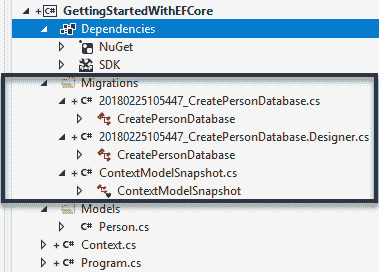

# 电影预订 Web 应用

到目前为止，我们一直在探索 ASP.NET Core 2.0 的特性和基础。我们开发的应用是学习概念的好例子，但并未使用数据持久化。在本章中，我们将学习如何进行读取、写入、更新和删除数据操作，并利用 Entity Framework Core 来实现。我们还将学习如何在 Azure 中部署 Web 应用并监控其健康状况。我们将通过开发一个简单的电影预订 Web 应用来展示这一点，用户可以在该应用中预订电影票。因此，在本章中，我们将涵盖以下主题：

+   介绍 Entity Framework 和 Entity Framework Core

+   开始使用 Entity Framework Core

+   电影预订应用需求

+   设计电影预订应用

+   编写电影预订应用

+   部署电影预订应用

+   监控电影预订应用

让我们从 Entity Framework 的介绍开始。

# 介绍 Entity Framework

那么，什么是 **Entity Framework**（**EF**）？它是不是我需要学习的一些其他花哨的框架？如果这些想法出现在你的脑海中，请摒弃它们，因为 EF 只是一组用于访问数据的 .NET API。EF 是微软的官方数据访问工具。像大多数微软产品一样，它起源于微软研究院，后来被 ADO.NET 团队采纳作为微软数据访问技术的下一个创新。EF 随着时间的推移而发展。它在 2008 年起步缓慢，当时开发者发现难以消化一种新的数据访问方式。但随着 EF4（是的，EF 的第二个版本是 4，因为它与 .NET 4 对齐），使用 EF 进行数据访问已成为 .NET 的标准。继续这一旅程，EF6 版本使其成为开源项目，并迁移到 CodePlex ([`www.codeplex.com`](http://www.codeplex.com))。这为 EF 开辟了新的道路。随着它成为开源项目，社区也可以做出贡献。现在 CodePlex 已存档，EF6 已迁移到 GitHub 并正在积极开发。

EF 也被称为 ORM。什么是 ORM？**ORM** 代表 **对象关系映射**，广义上意味着将对象映射到关系表中。ORM 指的是在两种不兼容的类型系统之间转换数据的技术。例如，让我们考虑一个 `Person` 类的 C# **普通 CLR 对象**（**POCO**）。`Person` 类的一个实例具有 `Name`、`Id` 和 `Age` 属性，分别对应 `string`、`int` 和 `int` 类型。在 SQL 数据库中，这些数据将持久化在名为 `Person` 的表中，具有 `Name`、`Id`、`Age` 等列。ORM 将 `Person` POCO 映射到 `Person` 数据库表。ORM 的主要目的是尽量减少开发者编写优化 SQL 代码进行这种转换的需要。ORMs 被设计用来减少关系数据库中数据结构化方式与类定义方式之间的摩擦。没有 ORM，我们通常需要编写大量代码来将数据库结果转换为类的实例。ORM 允许我们使用我们的类来表示查询，然后 ORM 为我们构建并执行相关的 SQL，以及从数据库返回的数据中实例化对象。我这里所说的只是一个简化的描述，ORMs 和 Entity Framework 的内容远不止这些。Entity Framework 真正提高了开发者的生产力，我们将在开发电影预订应用程序时看到这一点。EF 在微软有一个专门的团队。它已经存在了近十年。与为所使用的任何关系数据库编写相关的 SQL 相比，Entity Framework 使用的是 .NET 框架的一部分，即 **语言集成查询**（**LINQ**）语法。LINQ to Entities 允许开发者使用一致且强类型的查询语言，无论他们针对的是哪种数据库。此外，LINQ to Objects 用于查询 .NET 的其他元素，甚至 `InMemory` 对象，因此开发者可以从他们的 LINQ 知识中受益。

由于我们正在使用 .NET Core 并希望制作一个跨平台的应用程序，我们不能使用 Entity Framework，因为它与 ASP.NET Core 不兼容。别担心！我们有解决方案。要么我们可以将我们的项目编译针对完整的 .NET Framework，要么我们可以使用最新且最优秀的 Entity Framework 版本，即 Entity Framework Core，这是一个轻量级且跨平台的 Entity Framework 版本，从头开始重写以支持各种平台。让我们来讨论 Entity Framework Core。

# 介绍 Entity Framework Core

EF Core 于 2016 年 6 月发布，经过了超过 2 年的专注努力，并经历了多次 alpha、beta 版本，甚至几个发布候选版本。它最初被命名为 Entity Framework 7，但后来其名称被改为 Entity Framework Core。那么，Entity Framework Core 究竟是什么呢？官方的 Microsoft 文档([`docs.microsoft.com/en-us/ef/core/`](https://docs.microsoft.com/en-us/ef/core/))将 Entity Framework Core 描述为一个轻量级且可扩展的 Entity Framework 版本。换句话说，这不仅仅是对 EF6 的更新；它是一个全新的 Entity Framework。EF6 仍然得到积极支持，并将继续对其进行调整和修复，尽管出于许多原因，所有的真正创新都投入到了 Entity Framework Core 中。除了团队希望添加到 Entity Framework 中的新特性外，还有一些对开发 EF Core 至关重要的全面主题，这些主题与 ASP.NET Core 和底层的.NET Core 相一致。开发 EF Core 背后的理念是，它应该由轻量级的可组合 API 构建；也就是说，它应该能够在可以托管 CoreCLR 原生实现的操作系统上运行，同样重要的是，在设计、编码和交付 Entity Framework Core 时使用现代软件实践。与 EF6 一样，EF Core 是开源的，可在 GitHub 上获取。EF Core 的源代码可在[`github.com/aspnet/EntityFrameworkCore`](https://github.com/aspnet/EntityFrameworkCore)查看。EF 团队有一个针对他们优先考虑的功能和即将发布的版本中它们将按何种顺序发布的路线图。EF Core 的路线图可在[`github.com/aspnet/EntityFrameworkCore/wiki/roadmap`](https://github.com/aspnet/EntityFrameworkCore/wiki/roadmap)查看。

EF Core 在 .NET Core 上运行，.NET Core 在许多地方运行，如我们之前章节中看到的，包括基于 Windows 和 Linux 的系统。它可以在完整的 .NET Framework 内运行，因此任何 4.5.1 或更新版本的版本都可以。.NET Core 本身可以在 CoreCLR 上运行；这就是运行时。CoreCLR 可以在原生模式下运行，不仅限于 Windows，还可以在 Macintosh 和 Linux 上运行。EF Core 还可以与 **通用 Windows 平台**（**UWP**）结合使用，适用于 Windows 10，因此它可以在任何可以运行 Windows 10 的设备或 PC 上运行。因此，可能会有人想，我应该在任何地方使用 EF Core，仅仅因为它得到了支持吗？答案是 *不*。这是一个需要牢记的重要观点。EF Core 是一套全新的 API，因此它没有所有你可能习惯于 EF 6 的功能，尽管其中一些功能将在 EF Core 的未来版本中提供，但有一些功能将永远不会成为 EF Core 的一部分，因此了解这一点很重要，因此你可能不想用 EF Core 开始每一个新的项目。在使用 EF Core 之前，请确保 EF Core 具有你需要的所有功能。为了获取 EF 和 EF Core 中可用的功能的完整列表以及比较，我强烈建议您访问官方 Microsoft 文档，深入了解 EF 和 EF Core 之间的特性比较，请参阅[`docs.microsoft.com/en-us/ef/efcore-and-ef6/features`](https://docs.microsoft.com/en-us/ef/efcore-and-ef6/features)。

为了完整性，包含重要功能的特性比较子集如下表所示：

| **特性名称** | **EF6** | **EF Core** |
| --- | --- | --- |
| **实体数据模型扩展**（**EDMX**）设计器支持 | 是 | 否 |
| 实体数据模型向导（用于数据库优先方法） | 是 | 否 |
| 自动迁移 | 是 | 否 |
| 数据的懒加载 | 是 | 否 |
| 使用 DbContext 映射存储过程 | 是 | 否 |
| 批量 `插入`、`更新`、`删除` 操作 | 否 | 是 |
| 测试用的内存提供程序 | 否 | 是 |
| 支持 **控制反转**（**IoC**） | 否 | 是 |
| 字段映射 | 否 | 是 |
| DbContext 连池 | 否 | 是 |

如果你被这个比较搞得不知所措，对列出的功能感到困惑，不要担心。EF 确实是一个很大的学习主题。然而，我们将从头开始学习使用它，以确保基本原理到位。为此，我们将学习创建一个简单的数据访问控制台应用程序。一旦我们知道了如何使用 EF Core，我们就可以将其用于我们的电影预订应用程序。

# 开始使用 Entity Framework Core

在本节中，我们将创建一个简单的控制台应用程序，使用 Entity Framework Core 执行 CRUD 操作。目的是开始使用 EF Core 并了解如何使用它。在我们开始编码之前，让我们看看 EF Core 支持的两种开发方法：

+   代码优先

+   数据库优先

这两种范式已经支持了很长时间，因此我们只需从非常高的层次来看它们。EF Core 主要针对代码优先的方法，并且对数据库优先的方法支持有限，因为没有提供数据库模型的可视设计器或向导。然而，有一些第三方工具和扩展支持这一点。第三方工具和扩展的列表可以在 [`docs.microsoft.com/en-us/ef/core/extensions/`](https://docs.microsoft.com/en-us/ef/core/extensions/) 上看到。

在代码优先的方法中，我们首先编写代码；也就是说，我们首先创建领域模型类，然后，使用这些类，EF Core API 基于提供的约定和配置创建数据库和表。我们将在本节稍后讨论约定和配置。以下图示说明了代码优先的方法：


在数据库优先的方法中，正如其名所示，我们有一个现有的数据库，或者我们首先创建一个数据库，然后使用 EF Core API 创建领域和上下文类。如前所述，由于工具不足，目前 EF Core 对其支持有限。因此，在我们的示例中，我们将偏好代码优先的方法。读者可以查找前面提到的第三方工具，以了解更多关于 EF Core 数据库优先方法的信息。以下图像说明了数据库优先的方法：


我们将属性分为标量属性和导航属性。虽然这是一个旧概念，但值得再次回顾以获得更好的理解。属性可以包含原始数据（例如字符串、整数或布尔值），或者结构化数据（例如复杂类型）。原始类型的属性也称为**标量**属性。复杂属性或非简单类型的属性被称为**复杂**或**导航**属性。

现在我们已经了解了方法，并且知道我们将使用代码优先的方法，让我们深入到使用 EF Core 控制台应用程序的入门编码中。在这样做之前，我们需要在我们的开发机器上安装 SQL Express。如果 SQL Express 没有安装，请从 [`www.microsoft.com/en-IN/sql-server/sql-server-downloads`](https://www.microsoft.com/en-IN/sql-server/sql-server-downloads) 下载 SQL Express 2017 版本，并运行安装向导。为了我们的学习目的，我们将为 SQL Express 2017 执行基本安装，如下面的截图所示：


我们的目标是学习如何使用 EF Core，因此我们不会在我们的控制台应用程序中做任何花哨的事情。我们只会对名为 `Person` 的简单类执行简单的**创建**、**读取**、**更新**和**删除**（**CRUD**）操作，如下所示：

```cs
    public class Person
    {
        public int Id { get; set; }
        public string Name { get; set; }
        public bool Gender { get; set; }
        public DateTime DateOfBirth { get; set; }
        public int Age
        {
            get
            {
                var age = DateTime.Now.Year - this.DateOfBirth.Year;

                if (DateTime.Now.DayOfYear < 
                this.DateOfBirth.DayOfYear)
                {
                    age = age - 1;
                }

                return age;
            }
        }       
    }
```

如前述代码所示，该类具有简单的属性。为了对这个类执行 CRUD 操作，让我们通过以下步骤创建一个控制台应用程序：

1.  创建一个名为 `GettingStartedWithEFCore` 的新 .NET Core 控制台项目，如下截图所示：


1.  在项目节点中创建一个名为 `Models` 的新文件夹，并将 `Person` 类添加到这个新创建的文件夹中。这将是我们用于 CRUD 操作的模型实体类。

1.  接下来，我们需要安装 EF Core 包。在这样做之前，重要的是要知道 EF Core 提供了对各种数据库的支持。其中一些重要的包括：

    +   SQL Server

    +   SQLite

    +   InMemory（用于测试）

完整且全面的列表可以在[`docs.microsoft.com/en-us/ef/core/providers/`](https://docs.microsoft.com/en-us/ef/core/providers/)中看到。为了我们的学习目的，我们将使用 Windows 上的 SQL Server，因此让我们安装 Entity Framework Core 的 SQL Server 包。为此，让我们在 Visual Studio 2017 的 NuGet 包管理器中安装 **`Microsoft.EntityFrameworkCore.SqlServer`** 包。右键单击项目。选择管理 NuGet 包，然后搜索 `Microsoft.EntityFrameworkCore.SqlServer`。选择匹配的结果并点击安装：


1.  接下来，我们将创建一个名为 `Context` 的类，如下所示：

```cs
    public class Context : DbContext
    {
        public DbSet<Person&gt; Persons { get; set; }

        protected override void OnConfiguring(DbContextOptionsBuilder 
        optionsBuilder)
        {
            //// Get the connection string from configuration                                                    
            optionsBuilder.UseSqlServer(@"Server=.\SQLEXPRESS
            ;Database=PersonDatabase;Trusted_Connection=True;");
        }

        protected override void OnModelCreating(ModelBuilder 
        modelBuilder)
        {
             modelBuilder.Entity<Person&gt;
             ().Property(nameof(Person.Name)).IsRequired();
        }
    }
```

这个类看起来相当简单，但它有以下需要注意的微妙且重要的事项：

+   +   `Context` 类从 `DbContext` 派生，该类位于 `Microsoft.EntityFrameworkCore` 命名空间中。`DbContext` 是 EF Core 的一个重要部分，如果你已经使用过 EF，那么你将已经了解它。`DbContext` 的一个实例代表与数据库的会话，并且可以用来查询和保存你的实体实例。`DbContext` 是工作单元模式和仓储模式的组合。通常，你会创建一个从 `DbContext` 派生的类，并为模型中的每个实体包含 `Microsoft.EntityFrameworkCore.DbSet` 属性。

    +   如果属性具有 `public` 设置器，则在创建派生上下文实例时它们会自动初始化。

    +   它包含一个名为 `Persons`（模型类 `Person` 的复数形式）的属性，类型为 `DbSet<Person>`。这将对底层数据库中的 `Persons` 表进行映射。

    +   该类重写了 `DbContext` 的 `OnConfiguring` 方法，并指定了用于 SQL Server 数据库的连接字符串。连接字符串应从配置文件 `appSettings.json` 中读取，但为了简洁和简单，前面的代码中将其硬编码。`OnConfiguring` 方法允许我们使用 `DbContextOptionsBuilder` 选择和配置与上下文一起使用的数据源。让我们看看连接字符串。`Server=` 指定服务器。它可以是 `.\SQLEXPRESS`、`.\SQLSERVER`、`.\LOCALDB` 或任何基于您所进行的安装的其他实例名称。`Database=` 指定将要创建的数据库名称。`Trusted_Connection=True` 指定我们正在使用集成安全或 Windows 身份验证。一个热情的读者应该阅读官方 Microsoft Entity Framework 文档中关于配置上下文的说明，请参阅 [`docs.microsoft.com/en-us/ef/core/miscellaneous/configuring-dbcontext`](https://docs.microsoft.com/en-us/ef/core/miscellaneous/configuring-dbcontext)。

    +   `OnModelCreating` 方法允许我们使用 `ModelBuilder` 流式 API 来配置模型。这是配置中最强大的方法，允许在不修改实体类的情况下指定配置。流式 API 配置具有最高优先级，并将覆盖约定和数据注释。前面的代码与以下数据注释对 `Person` 类中的 `Name` 属性具有相同的效果：

```cs
[Required]
public string Name { get; set; }
```

1.  前面的观点突出了 EF Core 带来的灵活性和配置能力。EF Core 使用约定、属性和流式 API 语句的组合在运行时构建数据库模型。我们只需对这些模型类执行操作，它们就会自动转换为数据库中的适当更改。在我们结束这个观点之前，让我们快速看一下配置数据库模型的不同方法：

    +   **EF Core 约定**：EF Core 的约定非常全面。它们是 EF Core 根据类构建数据库模型的默认规则。以下列出了一些简单但重要的默认约定：

        +   EF Core 为 `Context` 类中所有与属性同名的 `DbSet<TEntity>` 属性创建数据库表。在先前的示例中，根据此约定，表名将是 `Persons`。

        +   EF Core 为那些未作为 `DbSet` 属性包含但可以通过其他 `DbSet` 实体的引用属性访问的实体创建表。如果 `Person` 类有一个复杂/导航属性，EF Core 也会为它创建一个表。

        +   EF Core 默认为类的所有标量读写属性创建具有与属性相同名称的列。它使用引用和集合属性在数据库中对应表之间建立关系。在前面的示例中，`Person`的标量属性对应于`Persons`表中的一列。

        +   EF Core 假设一个名为`ID`或以`ID`结尾的属性为主键。如果该属性是`integer`类型或`Guid`类型，则 EF Core 还假设它为`IDENTITY`，并在插入数据时自动分配值。这正是我们将在插入或创建新的`Person`时使用的内容。

        +   EF Core 根据 C#类中定义的属性的数据类型将数据库列的数据类型映射。以下表格列出了 C#数据类型到 SQL Server 列数据类型的一些映射：

| **C#数据类型** | **SQL Server 数据类型** |
| --- | --- |
| `int` | `int` |
| `string` | `nvarchar(Max)` |
| `decimal` | `decimal(18,2)` |
| `float` | `real` |
| `byte[]` | `varbinary(Max)` |
| `datetime` | `datetime` |
| `bool` | `bit` |
| `byte` | `tinyint` |
| `short` | `smallint` |
| `long` | `bigint` |
| `double` | `float` |

还有许多其他约定，我们也可以定义自定义约定。有关更多详细信息，请阅读官方 Microsoft 文档[`docs.microsoft.com/en-us/ef/core/modeling/`](https://docs.microsoft.com/en-us/ef/core/modeling/)。

+   +   **属性**：约定通常不足以将类映射到数据库对象。在这种情况下，我们可以使用称为数据注释属性的数据属性来获得所需的结果。我们刚刚看到的`[Required]`属性就是一个数据注释属性的例子。

    +   **Fluent API**：这是配置模型最强大的方式，可以与属性一起使用，也可以替代属性。在`OnModelConfiguring`方法中编写的代码是 Fluent API 语句的一个示例。

1.  如果我们现在检查，没有`PersonDatabase`数据库。因此，我们需要通过添加迁移从模型创建数据库。EF Core 包括不同的迁移命令，根据模型创建或更新数据库。要在 Visual Studio 2017 中这样做，请转到“工具”|“NuGet 包管理器”|“包管理器控制台”，如下面的截图所示：


这将打开包管理器控制台窗口。选择默认项目为`GettingStartedWithEFCore`，并输入以下命令：

```cs
add-migration CreatePersonDatabase
```

如果您不使用 Visual Studio 2017，并且依赖于.NET Core CLI 工具，可以使用以下命令：

```cs
dotnet ef migrations add CreatePersonDatabase
```

1.  我们尚未安装`Microsoft.EntityFrameworkCore.Design`包，因此它将报错：

```cs
Your startup project 'GettingStartedWithEFCore' doesn't reference Microsoft.EntityFrameworkCore.Design. This package is required for the Entity Framework Core Tools to work. Ensure your startup project is correct, install the package, and try again. 
```

首先，让我们转到 NuGet 包管理器并安装此包。在成功安装此包后，如果我们再次运行前面的命令，我们应该能够成功运行迁移。它还会告诉我们如何通过显示消息 `To undo this action, use Remove-Migration` 来撤销迁移。我们应该在解决方案资源管理器中的 `Migrations` 文件夹中看到新添加的文件，如下面的截图所示：



1.  虽然我们已经应用了迁移，但我们还没有创建数据库。要创建数据库，我们需要运行以下命令。

在 Visual Studio 2017 中：

```cs
update-database –verbose
```

在 .NET Core CLI 中：

```cs
dotnet ef database update
```

如果一切顺利，我们应该已经创建了数据库，其中包含 `Persons` 表（`DbSet<Person>` 的属性）在数据库中。让我们使用 **SQL Server Management Studio**（**SSMS**）来验证表和数据库。如果 SSMS 没有安装在你的机器上，你也可以使用 Visual Studio 2017 来查看数据库和表。

1.  让我们检查创建的数据库。在 Visual Studio 2017 中，点击视图菜单并选择服务器资源管理器，如下面的截图所示：


1.  在服务器资源管理器中，右键单击数据连接，然后选择添加连接。添加连接对话框将出现。在服务器名称中输入 `.\SQLEXPRESS`（因为我们安装了 SQL EXPRESS 2017），并将 `PersonDatabase` 作为数据库选择，如下面的截图所示：


1.  点击确定后，我们将看到名为 `PersonDatabase` 的数据库，如果我们展开表，我们还可以看到 `Persons` 表以及 `_EFMigrationsHistory` 表。注意，`Person` 类中具有设置器的属性是唯一被转换成 `Persons` 表的列的属性。注意，我们创建的类中的 `Age` 属性是只读的，因此我们在数据库表中看不到年龄列，如下面的截图所示：


这是第一个迁移，用于创建数据库。每次我们添加或更新模型类或配置时，我们都需要使用 `add-migration` 和 `update-database` 命令将数据库与模型同步。有了这个，我们就有了准备好的模型类和相应的数据库。以下图像总结了属性是如何从 C# 类映射到数据库表列的：


现在，我们将使用 `Context` 类来执行 CRUD 操作。

1.  让我们回到我们的 `Main.cs` 并编写以下代码。代码有很好的注释，所以请阅读注释以了解流程：

```cs
    class Program
    {
        static void Main(string[] args)
        {
            Console.WriteLine("Getting started with EF Core");
            Console.WriteLine("We will do CRUD operations on Person 
            class.");
            //// Lets create an instance of Person class.

            Person person = new Person()
            {
                Name = "Rishabh Verma",
                Gender = true, //// For demo true= Male, false = 
                Female. Prefer enum in real cases.
                DateOfBirth = new DateTime(2000, 10, 23)
            };

            using (var context = new Context())
            {
                //// Context has strongly typed property named Persons 
                     which referes to Persons table.
                //// It has methods Add, Find, Update, Remove to 
                     perform CRUD among many others.
                //// Use AddRange to add multiple persons in once.
                //// Complete set of APIs can be seen by using F12 on 
                     the Persons property below in Visual Studio IDE.
                var personData = context.Persons.Add(person);
                //// Though we have done Add, nothing has actually 
                     happened in database. All changes are in context 
                     only.
                //// We need to call save changes, to persist these 
                     changes in the database.
                context.SaveChanges();

                //// Notice above that Id is Primary Key (PK) and hence 
                     has not been specified in the person object passed 
                     to context.
                //// So, to know the created Id, we can use the below 
                     Id
                int createdId = personData.Entity.Id;
                //// If all goes well, person data should be persisted 
                     in the database.
                //// Use proper exception handling to discover 
                     unhandled exception if any. Not showing here for 
                     simplicity and brevity. createdId variable would 
                     now hold the id of created person.

                //// READ BEGINS
                Person readData = context.Persons.Where(j =&gt; j.Id == 
                createdId).FirstOrDefault();
                //// We have the data of person where Id == createdId, 
                     i.e. details of Rishabh Verma.
                //// Lets update the person data all together just for 
                     demonstarting update functionality.
                //// UPDATE BEGINS
                person.Name = "Neha Shrivastava";  
                person.Gender = false;
                person.DateOfBirth = new DateTime(2000, 6, 15);
                person.Id = createdId; //// For update cases, we need 
                this to be specified.

                //// Update the person in context.
                context.Persons.Update(person);
                //// Save the updates.
                context.SaveChanges();

                //// DELETE the person object.
                context.Remove(readData);
                context.SaveChanges();
            }

            Console.WriteLine("All done. Please press Enter key to 
            exit...");
            Console.ReadLine();
        }
    }
```

通过这样，我们已经完成了我们的示例应用，以开始使用 EF Core。我希望这个简单的例子能让你有信心开始使用 EF Core，并鼓励你进一步探索它。EF Core 的详细功能可以从官方微软文档中学习，该文档可在[`docs.microsoft.com/en-us/ef/core/`](https://docs.microsoft.com/en-us/ef/core/)找到。现在我们已经了解了 EF Core，我们准备在电影预订应用中使用它。让我们查看电影预订应用的需求。

# 电影预订应用需求

在本节中，我们将讨论在 ASP.NET Core 2.0 中开发我们的电影预订网络应用的需求。为了使事情简单易懂，我们将创建一个单银幕电影院而不是多厅电影院。我们的示例电影预订应用的需求如下。

作为用户或电影爱好者，我应该能够：

1.  查看电影院正在放映的电影列表及时间表

1.  在预订之前查看电影的简短描述和主演阵容

1.  从可用座位中选择座位

1.  预订所选座位

1.  可选使用 Facebook/Google 凭据登录到座位或以访客身份继续。

现在我们已经制定了需求规范，让我们看看应用的活动流程，并制定一个流程图。以下是该应用工作流程的粗略流程图：


让我们详细讨论这个流程图：

1.  **开始**：这是流程的开始。用户浏览电影预订应用。

1.  **现在上映电影列表**：用户可以看到电影院正在放映的电影列表及时间表。

1.  **电影描述**：用户可以点击列表中选定的电影来可选地查看电影描述。

1.  **选择电影和放映**：用户可以选择一个可用的放映。

1.  **选择座位**：用户可以从所选放映的可用座位中选择座位。

1.  **可选登录**：用户可以选择登录到网络应用或以访客身份继续。

1.  **完成**：我们不会实现支付界面，因为我们只想学习 ASP.NET Core 和 EF Core。在选择了座位并继续导航后，我们完成流程。

现在我们已经了解了需求，并对我们希望实现的目标有了相当的了解，让我们设计电影预订应用。

# 设计电影预订应用

在本节中，我们将使用 ASP.NET Core 2.0 对我们的电影预订网络应用进行高级设计。应用的高级设计非常简单，如下面的图所示：


我们可以看到一个**在线用户**正在浏览**电影预订网页应用**，这是一个 Azure 网页应用。理想情况下，应该在**电影预订网页应用**和**数据库**之间有一个服务层，以便实现整洁、可扩展、模块化和分层架构。然而，为了学习的目的，我们将保持简单，并暂时消除服务层。网页应用从 SQL Azure 数据库获取数据并将数据存储在 SQL Azure 数据库中。如果你在担心 Azure 网页应用或 SQL Azure，请停止这样做。我们将在本地开发机器上开发应用，并在 Azure 中部署它，那时我们将处理 Azure 网页应用和 SQL Azure。

根据需求，我们需要设计以下内容：

1.  电影预订网页应用的用户界面。

1.  一个页面用于列出目前正在上映的所有电影。我们需要设计数据库模型以显示目前正在上映的电影列表。

1.  一个页面用于显示所选电影的详细信息。

1.  一个页面用于显示可供选择的可用座位。

1.  使用 Facebook 或 Gmail 的登录/身份验证模块。

对于*步骤 2*到*步骤 4*，我们需要进行数据库建模。我们将在 Windows 上使用 SQL Express 并使用 EF Core，这是我们之前讨论过的。让我们进行类设计以满足要求，并按照代码优先的方法创建数据库。制作电影预订系统是一个复杂且耗时的系统。然而，我们在这里将制作一个非常简单且有限的版本的电影预订系统，这样我们就可以专注于学习基础知识，而不是系统的设计。从需求来看，很明显我们需要一个`Movie`类来包含电影信息，以及一个`Auditorium`类，电影将在其中上映。关于在礼堂上映的电影的信息应该存储在一个`Show`类中。礼堂有座位，因此我们需要一个`Seat`类，以便用户可以选择座位并使用`Booking`类通过`Ticket`类来预订座位并获得票。值得重申的是，这是一个过于简化的设计，以便更容易理解系统；实际系统可能更复杂。以下图表显示了根据前面的分析，我们的类将如何设计：


由于我们使用 EF Core，我们的数据库模型将是这些类的复制品，正如我们在之前关于 EF Core 入门部分的讨论中看到的。完成这些后，我们将必须开发一个简单的应用程序，它将仅执行 CRUD 操作。现在我们已经有了高级架构和类图，让我们开始编写网页应用的代码。

# 编写电影预订应用代码

在本节中，我们将根据前几节中整理的要求和设计编写电影预订应用程序的代码。我们将使用 EF Core 的代码优先方法与 SQL Express 结合使用。为了使编码易于理解，我们将分步骤进行编码。步骤如下：

1.  创建一个新的 ASP.NET Core 2.0 MVC 应用程序，命名为`MovieBooking`，就像我们在第一章，“入门”的“创建简单运行代码”部分中所做的那样。

1.  如果你想在你的 Web 应用程序中添加身份验证，你可以在选择模板时点击“更改身份验证”按钮，如图下所示：


将显示一个新对话框，如图下所示，它将为我们提供多种身份验证选项，正如我们在第三章，“构建我们的第一个.NET Core 游戏——井字棋”中讨论的那样。为了保持简单，你可以选择“个人用户账户”，然后选择“在应用程序中存储用户账户”。这将完成所有必要的样板代码，以启用应用程序级别的用户注册、登录和注销功能。由于我们已经在“Let's Chat”Web 应用程序中看到了如何使用 OpenID Connect 和 Facebook 身份验证提供者，我们将不会深入这部分内容，并鼓励读者重用相同的代码并进一步探索和扩展。


1.  接下来，我们将在项目中添加`Models`文件夹，并添加前几节中设计的`Auditorium`（礼堂）、`Movie`（电影）、`Show`（放映）、`Seat`（座位）、`Booking`（预订）和`Ticket`（票）类。

1.  类的代码列表如下。由于属性名称本身就具有自解释性，因此没有添加显式的注释，以保持简洁：

```cs
    public class Auditorium
    {
        public int Id { get; set; }
        public string Name { get; set; }
        public string Address { get; set; }
        public virtual IList<Seat&gt; Seats { get; set; }
        public int TotalSeats =&gt; this.Seats == null ? 0 : 
        this.Seats.Count;
    }

    public class Seat
    {
        public int Id { get; set; }
        public string Name { get; set; }
    }

    public class Movie
    {
        public int Id { get; set; }
        public string Name { get; set; }
        public string Poster { get; set; }
        public string Description { get; set; }
        public string Cast { get; set; }
        public string Director { get; set; }
        public string Genere { get; set; }
    }

    public class Show
    {
        public int Id { get; set; }
        public int AuditoriumId { get; set; }
        public int MovieId { get; set; }
        public TimeSpan Timing { get; set; }
        public IList<Seat&gt; AvailableSeats { get; set; }        
        public IList<Seat&gt; BookedSeats { get; set; }
        public int TotalSeats { get; set; }
    }

    public class Ticket
    {
        public int ShowId { get; set; }        
        public List<int&gt; SeatIds { get; set; }
        public int Qunatity =&gt; this.SeatIds == null ? 0 : 
        this.SeatIds.Count;
    }

    public class Booking
    {
        public int Id { get; set; }
        public IList<Ticket&gt; Tickets { get; set;}
    }
```

这样，模型就准备好了。

1.  接下来，我们需要安装 EF Core 包以利用所有 EF Core 的好处，因此让我们从 NuGet 包管理器中在我们的项目中安装`Microsoft.EntityFrameworkCore.SqlServer`和`Microsoft.EntityFrameworkCore.Design`NuGet 包。我们已经在创建`GettingStartedWithEFCore`应用程序时完成了这项工作。

1.  现在，我们需要创建上下文类，根据此模型创建数据库。我们将创建名为`MovieBookingContext`的模型，如图下代码所示：

```cs
    public class MovieBookingContext : DbContext
    {
        public DbSet<Auditorium&gt; Auditoriums { get; set; }        
        public DbSet<Movie&gt; Movies { get; set; }
        public DbSet<Show&gt; Shows { get; set; }
        public DbSet<Booking&gt; Bookings { get; set; }
        public DbSet<Ticket&gt; Tickets { get; set; }
        public 
        MovieBookingContext(DbContextOptions<MovieBookingContext&gt; 
        options) : base(options)
        { 
        }  
    }
```

1.  注意，`MovieBookingContext`没有我们之前在最后一个 EF Core 示例中用来配置 SQL 数据库的`OnConfiguring`方法调用。这是为了展示配置数据库的不同方法。我们将从`appsettings.json`配置文件中读取连接字符串，该配置文件具有以下配置条目：

```cs
"ConnectionStrings": {
    "DefaultConnection": "Server=.\\SQLEXPRESS;Database=MovieBookingDemo;Trusted_Connection=True;"
  },
```

1.  接下来，我们将通过上下文配置数据库，通过在`Startup.cs`的`ConfigureServices`方法中读取配置，如图下代码所示：

```cs
        public void ConfigureServices(IServiceCollection services)
        {
            services.AddDbContext<MovieBookingContext&gt;(options =&gt; 
            options.UseSqlServer(Configuration.GetConnectionString
            ("DefaultConnection")));
            services.AddMvc();
        }
```

1.  在开发上下文之后，我们需要创建数据库。为此，我们需要按以下顺序运行以下命令。第一个命令将添加迁移，第二个命令将实际创建数据库：

```cs
add-migration CreateMovieBookingDemo
update-database -verbose
```

1.  现在我们有了数据库，但在表中还没有必要的数据来列出电影信息。为此，我们可以编写一个脚本，一个基于 EF Core 的小程序，或者手动输入到表中。由于这是 SQL 的事情，我们不会深入细节，但一个有意识的读者应该能够正确地将这些数据插入到相应的表中。

1.  接下来，我们需要为屏幕创建控制器和视图，并将数据访问层连接起来。一开始，用户应该能够在主页面上看到放映列表，因此我们将首先开发主页。为此，我们将重用 `HomeController.cs` 中的 `Index` 动作，并修改 `Index` 视图以显示用户界面，如下面的截图所示：


这里没有什么特别之处。用户界面有一个图片轮播，显示电影的宣传海报，以及快速预订部分，列出电影和放映时间。只需将默认轮播的 URL（默认模板中自带）替换为在线通过 Bing 搜索到的电影海报的图片 URL。

1.  要显示电影列表，我们需要一个名为 `GetMovies` API 的 API 来返回电影列表。回想一下，我们已经将电影数据添加到数据库中，因此我们有要检索的电影。在选择电影后，我们需要检索该电影的可用放映时间，因此我们需要另一个名为 `GetShowTimesForMovie` API 的 API 来根据电影检索放映时间。我们在 *使用 Entity Framework Core 入门* 部分中看到了如何使用 `Context` 对象创建 API。然后我们将 API 连接到控制器以填充视图中的数据。

1.  点击预订按钮后，用户将被导航到座位选择页面。要显示座位，我们再次需要一个名为 `GetAvailableSeatsForShow` API 的 API 来获取放映的可用座位。

1.  点击电影后，我们可以查看所选电影详情。这些数据通过 `GetMovieDetails` API 获取。

1.  同样，UI 和相应的 API 都已开发，因为现在它只是一个简单的应用，从数据库中获取数据并在用户界面中显示。

完整的源代码可以在 [`github.com/PacktPublishing/.NET-Core-2.0-By-Example`](https://github.com/PacktPublishing/.NET-Core-2.0-By-Example) 上看到，其中列出了我们之前讨论的所有 API 和视图代码。它还有一个脚本，可以执行以将示例数据插入到应用程序中。

我们接下来将看看如何部署这个应用。

# 部署电影预订应用

我们已经在 Azure 上部署了我们的一个示例 Web 应用，这并没有什么不同。这里的假设是读者已经拥有 Azure 订阅并且使用订阅的电子邮件 ID 登录。如果不是这种情况，请参阅前面的章节，我们在那里详细讨论了 Azure 订阅。让我们看看在云上部署我们的电影预订应用的步骤：

1.  在 Visual Studio 解决方案资源管理器窗口中，右键单击`MovieBooking`项目，然后点击“发布”。它将打开一个发布对话框。

1.  选择“创建新”然后点击“确定”。它将打开创建应用服务对话框。输入所需的字段，如下面的截图所示：


1.  在填写所有必要的输入后，点击左侧面板上的“服务”。它将显示以下对话框：


1.  我们的应用需要数据库才能运行，对话框显示了 SQL 数据库作为我们需要部署的附加 Azure 资源。点击右侧的加号图标。它将打开一个新的对话框“配置 SQL 数据库”，如下面的截图所示：


1.  输入所需的详细信息。注意用户名和密码以及数据库名和连接字符串名称，因为它们将在代码中使用。点击“确定”然后点击“创建”。这将创建发布配置文件并部署应用。

1.  然而，我们需要确保我们的数据库被创建，我们预期的连接字符串被使用，并且迁移被应用。为此，在发布窗口中，点击设置链接，如下面的截图所示：


1.  发布对话框将会打开。在设置选项卡中，确保在数据库部分下的默认连接中，运行时使用此连接字符串的复选框被勾选，如下面的截图所示：


1.  如果您是第一次部署，您也可能看到“Entity Framework 迁移”，就像前面截图中的数据库部分所示。如果是这样，请检查“发布时应用此迁移”。由于我已经应用了迁移，所以它没有在前面的截图中出现。

1.  点击“保存”然后点击“发布”。这将发布 Web 应用以及数据库和迁移。

这样，我们的 Web 应用已经部署，并且在成功部署后，应用将自动在浏览器中启动。示例应用可以在[`packtmoviebookingapp.azurewebsites.net/`](http://packtmoviebookingapp.azurewebsites.net/)查看。

# 监控电影预订应用

编码和部署一个应用程序是可以的，但同样重要的是确保应用程序在生产环境中部署并最终用户开始使用后仍然运行良好。因此，监控应用程序非常重要。在本节中，我们将学习如何在我们的 Web 应用程序中添加 Application Insights，并简要介绍 Azure 提供的各种开箱即用的监控选项。我们将从 Application Insights 开始。

# Application Insights

Application Insights 是一个可扩展的**应用性能管理（APM**）服务，适用于多个平台上的 Web 开发者，用于监控 Web 应用程序的性能、可用性和用户体验。它自动检测性能问题。它包括强大的分析工具，帮助我们诊断问题并了解用户实际上是如何使用我们的应用程序的。这有多酷？我们可以使用 Application Insights 找到我们 Web 应用程序中最常用和最不常用的功能。我们可以使用 Application Insights 的可操作见解来持续改进应用程序的性能和可用性。我个人发现 Application Insights 在诊断和修复性能问题时非常有用。这是一种主动识别问题的方法，而不是等待最终用户遇到问题并报告它。让我们从在我们的电影预订 Web 应用程序中启用 Application Insights 开始。为此，我们需要执行以下操作：

1.  在 Visual Studio 2017 的 Solution Explorer 中，展开`MovieBooking`项目并点击 Connected Services。这将显示 Connected Services 页面，如下面的截图所示：


1.  点击“使用 Application Insights 进行监控”。这将打开 Application Insights 配置屏幕，如下面的截图所示：


同样的屏幕可以通过在 Solution Explorer 中右键单击`MovieBooking`项目然后点击“添加 | Application Insights 遥测”来访问，如下面的截图所示：


1.  点击“开始免费”按钮。这将带我们到注册屏幕，如下面的截图所示。根据您的需求选择订阅和资源。在这里，我创建了一个新的资源，但您可能希望重用现有的资源。我们将选择免费版本，因此请选择 Application Insights 将保持免费且在每月 1GB 配额耗尽后停止数据收集的选项：


1.  点击“注册”。这可能需要一段时间，因此会显示进度条，如下面的截图所示。查看截图，我们可以看到 Application Insights 有多强大。它具有智能检测、应用地图、分析和 CodeLens 等众多优秀功能：


1.  一旦完成配置，进度条将消失。Application Insights 遥测现在应在所选项目中启用。配置将添加仪器密钥到 `appsettings.json`，因此，在成功启用 Application Insights 后，您可能会收到文件已修改的提示。这是正常的，也是预期的，所以请点击“确定”：


现在，我们已经准备好在发布网站后进行监控，以保持与仪器密钥更改和应用洞察 SDK 更改同步。有了这个，我们就完成了 Application Insights 的设置。现在，我们将看看如何监控网站应用程序并利用 Application Insights 的优势。我们可以在 Visual Studio 本身中查看我们本地调试设置的遥测数据，而 Azure 门户是我们可以看到已部署应用程序洞察的地方。

在 Visual Studio 解决方案资源管理器中，我们现在将在连接服务中为我们的电影预订项目有一个`Application Insights`文件夹，如下面的截图所示：


右键单击“Application Insights”文件夹，我们将获得许多选项。以下截图显示了其中一些重要的选项：


这里是对这些选项的解释：

+   打开 Application Insights 门户：这将直接在 Azure 网站门户中打开 Application Insights。

+   应用程序分析：这将打开应用程序分析门户，在那里我们可以执行详细的数据分析和筛选。

+   应用程序映射：这将打开 Azure 门户中项目的应用程序映射。应用程序映射帮助我们识别分布式应用程序所有组件中的性能瓶颈或故障热点。

+   配置 Application Insights：这可以用来配置 Application Insights。

+   选择遥测源：这将配置用作遥测源的应用程序。默认情况下，当前网站应用程序将是遥测源。

+   搜索实时遥测：这将搜索来自 Visual Studio 或 Azure 网站门户的遥测数据。使用此功能，我们还可以查看 Visual Studio 调试中的调试遥测数据。

为了结束这次讨论，让我们看看我在编写这一部分时收集到的 Application Insights 数据。以下截图显示了我们所开发的电影预订应用程序的外观：


Application Insights 是一个庞大的主题，一个章节的部分内容并不能公正地体现这一伟大且重要的功能。为了全面详细地了解 Application Insights，我强烈建议读者阅读 Application Insights 的出色文档，请参阅[`docs.microsoft.com/en-us/azure/application-insights/`](https://docs.microsoft.com/en-us/azure/application-insights/)。

在本节中，我们探讨了 Application Insights，这是开发者工具箱中一款出色的监控工具。然而，Azure 在监控选项方面还有更多可以提供的内容，我们将在下一章中探讨这些内容，同时我也会讨论如何使用 Application Insights 的遥测数据来调查问题。带着这个提示，我们结束了本章。

# 摘要

在本章中，我们学习了 Entity Framework 和 Entity Framework Core，并了解了它们各自的特点以及两者之间的区别。我们还了解到，只有在 EF 无法使用或存在迫切的跨平台需求使用 EF Core 时，我们才应该使用 EF Core。通过创建一个简单的应用程序，我们学习了如何使用 EF Core 进行 CRUD 操作。然后，我们开发了一个简单的电影预订应用程序，并学习了如何使用 Visual Studio 部署它。我们还看到了如何通过启用 Application Insights 来监控我们的 Web 应用程序。到目前为止，我们只看到了单体应用程序，其中所有 API 都驻留在单个 Web 应用程序中。如果这个 Web 应用程序出现问题，我们的整个应用程序可能会完全停止运行。有一种方法可以通过部署更小、独立的模块（称为微服务）来规避这个问题。在下一章中，我们将探讨微服务。
