# 第九章：使用.NET Core 的微服务

在过去几年中，应用程序的设计方式发生了范式转变，表现为一系列更小且可独立部署的服务，也被称为**微服务架构**或简称**微服务**。其目的是开发更简单、独立的服务，快速发布它们，并频繁发布以确保如果一个服务出现故障，其他服务不会受到影响，从而使应用程序更加健壮、可靠且高度可扩展。在这种新哲学的精神下，并紧跟技术领域的最新发展，我们将在本章中涵盖以下主题：

+   微服务简介

+   需要了解的便捷事物

+   Blazor——来自 ASP.NET 团队的新实验

+   .NET Core 2.1 即将推出

我们有很多内容要介绍，所以让我们从微服务开始。

# 微服务简介

为了更好地理解和欣赏微服务架构，我们首先需要了解什么是服务以及传统的单体服务架构有哪些局限性，这些局限性可以通过微服务来克服。一旦我们建立了这个背景，我们将定义微服务。

# 传统的服务

当我们创建任何服务器端企业应用时，它必须支持各种不同的客户端，包括桌面和移动浏览器、移动应用等。我们可能还需要公开 API，以便第三方可以消费它们并与我们的系统集成。就像第三方一样，我们可能还需要通过 API 将我们的应用程序与其他应用程序集成。应用程序将通过执行业务逻辑来处理请求，然后通过访问数据库和其他数据提供者及系统执行读写操作，并返回 HTML/JSON/XML 响应。我这里描述的是典型的企业应用。我们在应用程序中有不同的逻辑模块来满足业务需求。这些模块就是我们所说的服务。

从本质上讲，服务只是一个软件组件，它为系统内的其他软件组件提供功能。服务应该定义良好、自包含，并且不应依赖于其他服务的上下文或状态。其他软件组件可以是任何东西——一个网站、一个 Web 应用、一个移动应用、一个桌面应用，甚至是另一个服务。如果我要举一个例子，可以拿任何你选择的电子商务网站。该网站显示产品和服务。为了显示产品和服务，它需要与一个服务进行通信。实际上，服务负责从数据库创建、更新、删除和检索数据，因此服务为网站提供功能。

不同软件组件与服务之间的通信通常通过网络使用某种通信协议进行。例如，您的 Facebook 移动应用通过互联网与一个服务进行通信。使用服务或多个服务以这种方式工作的系统被称为**面向服务的架构**，简称**SOA**。SOA 背后的理念是使用厚服务器而不是厚客户端。这样，许多客户端可以拥有相同的功能。在未来，我们可以有新的或不同类型的客户端连接到同一服务，重用这些功能。作为一个软件架构，SOA 已经非常成功。SOA 的一些好处和特性包括：

+   它允许应用程序在需求增加时进行扩展，通过使我们能够在多个服务器上拥有服务的副本。当流量激增时，负载均衡器将请求重定向到服务的特定实例。我们可以拥有多个服务实例。

+   它允许功能的可重用性。例如，在一个购物网页应用中，创建订单的功能可能是相同的，这个功能是由我们的服务上的移动应用触发的。因此，创建订单的代码对网站和移动应用都是相同的。

+   它允许标准化合同或基于接口的开发。当客户端应用程序调用服务时，它实际上是在调用服务中的一个方法。当服务实现发生变化时，方法的签名通常不会改变，因此我们可以升级我们的服务，而无需升级我们的客户端，只要合同和方法签名不改变。这样，当服务升级时，我们不需要升级客户端。

+   它是无状态的。当一个客户端向服务发送请求时，该服务实例不需要记住来自该特定客户端的先前请求。它拥有从请求中获取的所有必要信息，以便在服务内部检索与先前请求相关的所有数据，因此服务不需要记住客户端对该特定服务实例的先前调用，也不需要维护任何上下文。由于它是无状态的，因此服务的任何实例都可以响应来自客户端的任何请求，因为它不需要记住与任何其他服务实例的任何先前交互。

+   开发、部署和扩展应用程序很简单。

我们现在应该对可能已经使用多年而不知其所以然的服务导向架构（SOA）有一个公平的了解。可能使用 SOA 的传统服务通常被部署为一个单一的整体。单一由两个词组成，mono 和 lith。Mono 意味着单一，lith 意味着石头。然而，在软件词典中，单一架构指的是作为单一单元部署的应用。在开发应用时，一个重要的考虑因素是学习修改的难易程度，以及新开发者快速成为应用生产力所需的时间。这些期望的特性产生了一种简单且易于理解的架构。另一个期望的方面是它应该易于部署。考虑到所有这些因素，架构将是一个分层应用，它有一个用户界面层，该层与服务层通信，服务层在数据提供者上执行数据操作。一个典型的分层应用架构看起来如下所示：

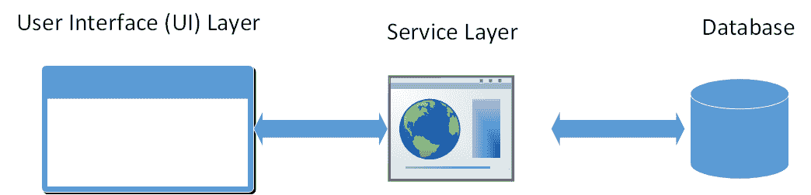

应用被部署为一个单一的单一应用，我们可以在负载均衡器后面运行多个应用实例以进行扩展和改进可用性。

随着时间推移，应用的用户数量增加，以及应用中新增的功能增强，代码库以极快的速度增长，这使得理解和修改代码变得困难。因此，开发者的生产力下降，尤其是新开发者。由于理解和修改代码库复杂，应用中的错误数量增加，从而降低了应用的质量。随着代码库的增长，集成开发环境（如 Visual Studio）变得过载，因此运行速度变慢，导致开发者生产力下降。一个大的单一应用也是持续部署的障碍。为了更新/部署一个组件，整个应用都需要部署，这导致停机时间。单一应用也是扩展开发的障碍。一旦应用达到一定规模，将工程组织划分为专注于特定功能区域的团队是有用的。单一应用的麻烦在于它阻碍了团队独立工作，因为代码和功能耦合在一个单一的整体中。单一架构迫使我们与一个技术栈绑定。所以如果我们使用了 Java 栈，那么在应用的生命周期内，即使其他栈有更好的工具和技术创新，我们也需要与 Java 绑定。

电子商务网站的单一架构在此展示：

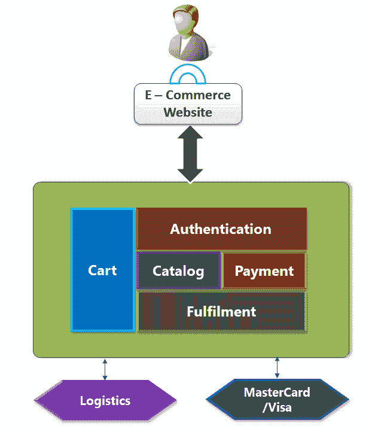

由于这些限制，存在已久的单体架构在近年来开始失去人气。数据会说话。因此，如果我们查看过去五年 SOA 的 Google 趋势报告，它是一个随着时间的推移逐渐失去兴趣的图表。它可以在[`trends.google.com/trends/explore?date=today%205-y&q=SOA`](https://trends.google.com/trends/explore?date=today%205-y&q=SOA)看到。


不幸但真实的是，正如在其他地方发生的那样，一个的损失对另一个来说就是收益。SOA 的衰落看到了微服务的兴起。如果我们查看过去五年同一时期的微服务 Google 趋势报告，我们会看到随着时间的推移兴趣逐渐增加，如图所示。这可以在[`trends.google.com/trends/explore?date=today%205-y&q=Microservice`](https://trends.google.com/trends/explore?date=today%205-y&q=Microservice)看到。


这不仅仅是因为它正流行，还因为像 Netflix、Amazon、eBay 等主要大型企业都谈论了他们如何使用微服务架构来扩展和简化服务的持续交付方式，因此微服务架构设计似乎不是一个可以忽视的炒作。这种架构框架是新兴初创公司，如 Docker 的核心卖点之一，而 Docker 在撰写本文时估值约为 10 亿美元，尽管仍在融资阶段。

让我们来看看微服务。

# 微服务

**微服务**，也称为**微服务架构**，是一种将应用程序构建为一系列松散耦合的独立服务集合的架构风格，这些服务实现了业务能力。微服务架构使得大型、复杂应用程序的持续交付和部署成为可能。它还使组织能够演进其技术堆栈。微服务架构基本上是 SOA 的改进版本，因此它共享 SOA 的所有关键特性，如可伸缩性、可重用性、接口标准化合约以实现向后兼容性，以及我们之前讨论的无状态服务理念。微服务能力通过面向业务的 API 形式化表达。简而言之，微服务架构风格定义了一种设置，其中应用程序组件是它们自己的独立应用程序。这些独立的应用程序组件通过**远程方法调用**（**RMI**）、RESTful Web 服务或推送消息相互通信。每个微服务都拥有其相关的领域数据模型和领域逻辑，基于不同的数据存储技术和不同的编程语言。

由于名称，你可能想知道微服务的大小应该是多少。在开发微服务时，大小不是需要考虑的关键因素。关键是要创建松散耦合的服务，以便我们拥有开发、部署和每个服务的扩展的自主权。显然，我们应该努力使它们尽可能小，只要我们不依赖于其他微服务的直接依赖过多。

以下图像展示了一个电子商务网站典型的微服务架构：

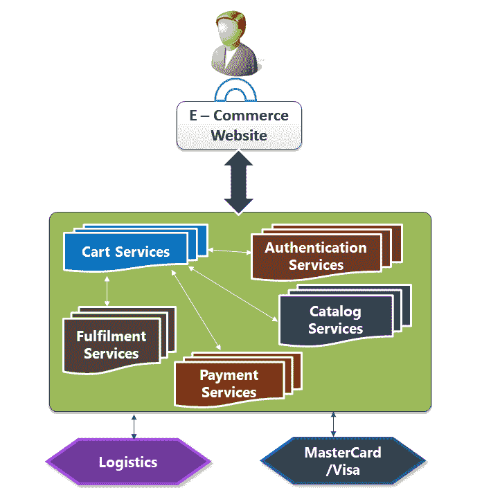

我们可以看到，与单体架构相比，这具有更多的模块化和自主性，并且服务与其他微服务进行通信。想象一下，由于某些不可避免的问题，**支付服务**出现故障，可能是由于检查了糟糕的代码。网站的访客仍然可以查看和更新购物车。只有支付功能会中断，其余的服务将继续为用户服务。现在，考虑一下没有模块独立性的单体架构，并且这种糟糕的代码问题发生了。在这种情况下，失败的几率会更高，我们甚至可能遇到由于依赖关系而导致许多功能停止工作的情况。

以下图像展示了单体架构和微服务架构之间良好的比较：

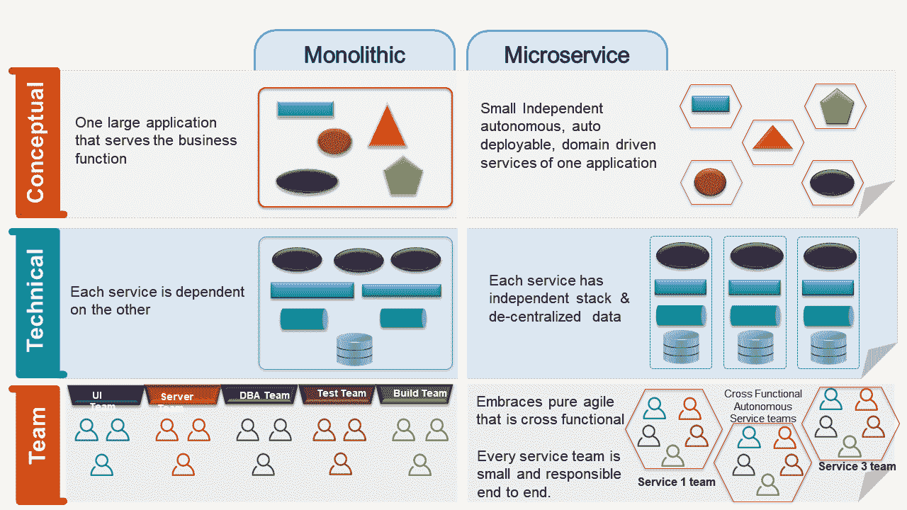

微软为使用 ASP.NET Core 的微服务提供了示例参考应用和架构指导。该示例可在 GitHub 上找到，链接为 [`github.com/dotnet-architecture/eShopOnContainers`](https://github.com/dotnet-architecture/eShopOnContainers)。

为了对微服务开发有一个合理的理解和实践经验，建议读者仔细查看仓库。我们讨论的只是冰山一角，只是微服务的一个简介。我们将通过以下微服务的参考链接来结束这次讨论，以便热心的读者可以更深入地了解这一新范式：

+   **.NET 应用架构**：[`www.microsoft.com/net/learn/architecture`](https://www.microsoft.com/net/learn/architecture)

+   **.NET 架构新闻**：[`github.com/dotnet-architecture/News`](https://github.com/dotnet-architecture/News)

+   **马丁·福勒关于微服务的观点**：[`martinfowler.com/articles/microservices.html`](http://martinfowler.com/articles/microservices.html)

+   **微服务架构模式**：[`microservices.io/patterns/microservices.html`](http://microservices.io/patterns/microservices.html)

在下一节中，我们将讨论我在开发、调试和监控 ASP.NET Core 2.0 网络应用时发现的一些非常有用的技巧和窍门。

# 有用的知识

我们需要理解，ASP.NET 和 ASP.NET Core 之间存在根本的架构差异。以下列出了一些重要的差异：

+   ASP.NET 和 ASP.NET Core 之间的重要差异之一是，与 ASP.NET 不同，ASP.NET Core 没有请求队列。位于 `System.Web` 命名空间中的 `RequestQueue` 类旨在防止 ASP.NET 中的线程池饥饿。在 ASP.NET Core 中，这种情况不再存在，因此正如你可以正确猜到的，如果我们不编写适当的代码，就可能出现线程池饥饿。为了确保我们处于同一页面上，饥饿描述的是线程无法获得对共享资源的常规访问，并且无法取得进展的情况。这通常发生在贪婪的长运行线程长时间使共享资源不可用的情况下。例如，假设一个对象提供了一个通常需要很长时间才能返回的同步方法。如果一个线程频繁调用此方法，其他也需要频繁同步访问同一对象的线程通常会受阻。

+   `AppDomain` 是 ASP.NET Core 与 ASP.NET 在另一个不同之处。运行许多 `AppDomain` 实例需要运行时支持，并且通常相当昂贵。ASP.NET Core 不使用 `AppDomain`。有一个单一的过程和一个单一的 `AppDomain`，如果这有助于理解的话。

+   ASP.NET Core 没有使用 `SyncronizationContext`。如果你不知道 `SyncronizationContext`，不要担心。我们正在讨论它。C# 5 带来了两个新的关键字，`async` 和 `await`，它们提供了一种新的、更简单的异步编程体验。使用方法是简单的。在方法定义中包含 `async` 关键字。如果方法不返回任何内容（我不建议使用 `void`，除非它是一个事件处理程序方法），则将方法的返回类型从 `T` 更改为 `Task<T>` 或 `Task`。在方法名称中使用 `async` 后缀也是一个好习惯，这样就可以很容易地识别出方法是异步的。你还需要在方法中使用至少一个 `await` 语句。在底层，编译器将 `async` 方法转换为状态机，并将其虚拟地转换为在方法调用时被多次调用的方法，一次是在包含 `await` 关键字的语句中，然后返回。当执行包含 `await` 关键字的语句时，方法再次从那里被调用，并按相同的方式执行剩余的语句。以下代码列出了一个利用 `async` 和 `await` 关键字的示例 `async` 方法：

```cs
public async Task<Stream> GetFileContentAsync()
{
    using(var httpClient = new HttpClient())
    {
        var stream = await 
        httpClient.GetStreamAsync(
        "http://localhost:9596/api/Files/1");
        return stream;
    }
}
```

`async` 和 `await` 关键字的一个重要特性是对 `SyncronizationContext` 的支持。`SyncronizationContext` 自 .NET 2.0 以来就存在于框架中，并不是新添加到框架中的东西。正如之前讨论的，当我们在一个 `async` 方法上 `await` 时，编译器会连接到后续操作，如果有的话，并且生成的代码会意识到上下文。所以，如果 `SyncronizationContext` 可用，`await` 表达式会捕获它并使用它来调用后续操作，这与在 **任务并行库**（**TPL**）中提供的 `ContinueWith` 方法非常相似。`SyncronizationContext` 应该非常小心地使用，如果我们以阻塞的方式使用该方法，可能会导致死锁。例如，在一个非 ASP.NET Core 环境中，如果我们使用 `Wait` 方法或使用 `Result` 属性等待一个 `Task`，我们会阻塞主线程。当任务在那个方法中的线程池内最终完成时，它将调用后续操作以将回帖发送到主线程。但由于我们已经阻塞了主线程，而任务正在等待主线程，我们将遇到死锁。作为预防措施，建议库编写者在调用 `async` API 时使用 `ConfigureAwait(false)`，以避免死锁。现在我们知道了 `SyncronizationContext`，请记住 ASP.NET Core 没有它！所以 `ConfigureAwait(false)` 在 ASP.NET Core 中不起作用。但这并不意味着线程不能在 ASP.NET Core 中阻塞。糟糕的代码仍然可以造成奇迹。

+   虽然 ASP.NET 在 `System.Web` 之上运行，与 **Internet Information Server**（**IIS**）有相当紧密的集成，并在 IIS 进程（`w3wp.exe`）内运行，但 ASP.NET Core 在 IIS 进程之外运行。**ASP.NET Core 模块**（**ANCM**）使得 ASP.NET Core 应用可以在反向代理配置下在 IIS 后运行，这在前面章节中已经提到。为了刷新我们的记忆，代理或正向代理的工作是代表客户端向服务器发送请求，而反向代理的工作是代表服务器接收请求。以下图像是 ASP.NET Core 的高级架构。请注意，包含 ANCM 的中心框是唯一在 `w3wp.exe` 内运行的模块。**Kestrel** 服务器和 **应用代码**在 `dotnet.exe` 内运行。与传统 ASP.NET 相比，后者在 `w3wp.exe` 内运行：

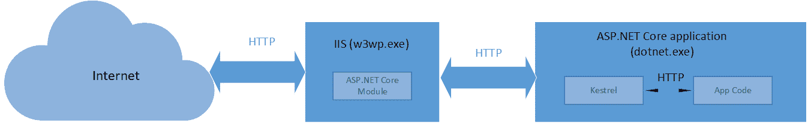

# 通用技巧

现在我们知道了这些差异，让我们继续探讨一些基于这些架构差异以及更多内容的技巧和窍门：

+   最近，我正在优化 ASP.NET Core 应用程序的性能。我们使用了内存缓存，缓存获取超时设置为五秒。你可能会预期从内存缓存中检索数据只需毫秒级，因为这是一个进程内缓存，这通常是正确的。然而，在负载下，我们发现数据没有被从缓存中检索出来。一旦我们添加了日志记录，我们就发现缓存的`Get`操作超时了。是的，即使有五秒的值，我们在从缓存中获取数据时也遇到了超时。经过调查，我们发现应用程序中存在线程饥饿问题。如前所述，ASP.NET Core 中没有`RequestQueue`类来避免这种情况，因此以下是一些避免线程饥饿的建议：

    +   总是优先使用全程`async`，即所有 API 都必须是`async`。

    +   尽可能避免在 ASP.NET Core 应用程序中使用阻塞 API。所以，**不要使用**：

        +   `Task.Wait()`

        +   `Task.Result`

        +   `Thread.Sleep`

        +   `GetAwaiter().GetResult()`.

    +   避免在`async`中使用`sync`，因为它们本质上会阻塞`async`方法。

    +   避免在`sync`中使用`async`，因为它们存在可扩展性问题。

    +   在应用程序代码中记录线程池统计信息。这有助于识别线程饥饿。以下是可以用于记录线程统计信息的示例代码。它为`iopc`和`worker`线程提供了统计信息：

```cs
        private static int GetThreadPoolStats(out string iocp, out 
        string worker)
        {
            int maxIoThreads, maxWorkerThreads;
            ThreadPool.GetMaxThreads(out maxWorkerThreads, out 
            maxIoThreads);

            int freeIoThreads, freeWorkerThreads;
            ThreadPool.GetAvailableThreads(out freeWorkerThreads, 
            out freeIoThreads);

            int minIoThreads, minWorkerThreads;
            ThreadPool.GetMinThreads(out minWorkerThreads, out 
            minIoThreads);

            int busyIoThreads = maxIoThreads - freeIoThreads;
            int busyWorkerThreads = maxWorkerThreads - 
            freeWorkerThreads;
            iocp = $"(Busy={busyIoThreads},
            Free={freeIoThreads},Min=
            {minIoThreads},Max={maxIoThreads})";
            worker = $"(Busy={busyWorkerThreads},Free=
            {freeWorkerThreads},Min={minWorkerThreads},Max=
            {maxWorkerThreads})";
            return busyWorkerThreads;
        }
```

+   +   使用诸如[`github.com/benaadams/Ben.BlockingDetector`](https://github.com/benaadams/Ben.BlockingDetector)之类的工具来诊断阻塞。

    +   使用`ThreadPool.SetMinThreads`设置最小线程数，以防止你遭受饥饿。最小线程数取决于你的应用程序做什么，你可能需要根据你的测试结果进行微调。请注意，`ThreadPool`可以快速（即瞬间）扩展到指定的最小线程池线程数。之后，如果需要更多线程，它们将被限制在 500 毫秒内，这可能导致服务中的延迟或超时，这在生产环境中很难理解。

    +   你也可以在这里了解这个问题：[`github.com/aspnet/KestrelHttpServer/issues/2104`](https://github.com/aspnet/KestrelHttpServer/issues/2104).

+   `AppDomain`的概念在 ASP.NET Core 中不再存在，因此为了代码隔离，Microsoft 建议使用进程和/或容器。对于动态加载程序集，建议使用`AssemblyLoadContext`类。

+   由于 ASP.NET Core 中没有`SyncronizationContext`，幸运的是，如果你通过`Task.Wait`或`Task.Result`阻塞任务，ASP.NET Core 中不应该有任何死锁。然而，这不应被视为使用阻塞的许可证。我们必须始终努力实现全程`async`。

+   如前所述，`ConfigureAwait (false)`在 ASP.NET Core 中没有效果，因此以下两个代码片段以相同的方式工作：

```cs
var stream = await   
httpClient.GetStreamAsync("http://localhost:9596/api/Files/1");
var stream = await 
httpClient.GetStreamAsync("http://localhost:9596/api/Files/1").ConfigureAwait(false);
```

+   在 ASP.NET Core 中，任务延续被排队到 `ThreadPool`，因此可以并行运行。如果在 ASP.NET Core 中您的 `task.ContinueWith(x=>SomeFunction())` 停止工作，请不要感到惊讶。

+   `HttpContext` 不是线程安全的。并行访问它可能会导致不可靠的数据和问题。

+   使用 Swagger 进行 API 测试和文档。Swagger 使得记录和测试您的 API 变得非常简单。我强烈建议您使用 Swagger 来记录 API 的文档。还有其他工具，如 Postman 和 Fiddler，也可以用于测试 API，但 Swagger 在此方面也做得很好。执行基本的 API 测试就像阅读这个链接一样简单：[`swagger.io/blog/how-to-perform-a-basic-api-test/`](https://swagger.io/blog/how-to-perform-a-basic-api-test/)。阅读使用 Swagger 生成文档的步骤，请参阅[`docs.microsoft.com/en-us/aspnet/core/tutorials/web-api-help-pages-using-swagger?tabs=visual-studio`](https://docs.microsoft.com/en-us/aspnet/core/tutorials/web-api-help-pages-using-swagger?tabs=visual-studio)。

+   Ef Core 的 `InMemory` 提供者当您想要使用近似连接到真实数据库的方式来测试组件时非常有用，而不需要实际数据库操作的开销。请参阅此链接以获取逐步方法：[`docs.microsoft.com/en-us/ef/core/miscellaneous/testing/in-memory`](https://docs.microsoft.com/en-us/ef/core/miscellaneous/testing/in-memory)。

+   ANCM 被设计成这样的方式，如果您的第一个请求花费了很长时间，它将会断开客户端并关闭进程。

+   安全性是开发 Web 应用程序中最重要但经常被忽视的方面之一。安全性是一个涵盖范围很广的话题，超出了本书的范围，但我强烈建议开发者们彻底阅读 ASP.NET Core 的安全文档[`docs.microsoft.com/en-us/aspnet/core/security/`](https://docs.microsoft.com/en-us/aspnet/core/security/)，并将所学知识融入日常开发活动中。

+   有时，即使是在启动应用程序时，也可能因为代码错误而出现问题。尽管控制台日志记录器会在启动时短暂出现在控制台窗口中记录输出，但一旦控制台消失（这发生得相当快），我们就无法知道发生了什么，或者是什么阻止了应用程序的启动。在这种情况下，通常 ASP.NET Core 模块配置可以帮助我们找到问题的根本原因。配置是在`web.config`文件中`system.webserver`节点下的`aspNetCore`部分完成的，该文件位于 Web 应用程序的根目录。我们可以启用输出日志并指定日志文件路径。因此，在这种情况下，详细的错误消息将被记录，我们将能够确定问题的原因。以下是从`web.config`中摘录的示例：

```cs
<aspNetCore processPath=".\PacktLetsChat.exe"                 stdoutLogEnabled="true"                 stdoutLogFile=".\logs" />   </system.webServer>
```

当应用程序部署到 Azure 时，`stdoutLogFile`路径被修改，以将应用程序指向应用程序的`LogFiles`文件夹。

在本节中，我们讨论了一些与 ASP.NET Core 使用相关的问题。在下一节中，我们将讨论一些关于性能的技巧。

# 性能技巧

根据基准测试，ASP.NET Core 是建立在 Web 请求路由基础上的最快平台之一。请阅读完整的故事[`www.techempower.com/blog/2016/11/16/framework-benchmarks-round-13/`](https://www.techempower.com/blog/2016/11/16/framework-benchmarks-round-13/)。在本节中，我们将讨论我们可以用来在我们的 ASP.NET Core 应用程序中实现更好性能的要点：

+   虽然可能听起来有些重复，但请始终使用`async`。这是 ASP.NET Core 应用程序性能的关键。

+   测试，测试，再测试！尽早并经常对您的应用程序进行负载测试，以在开发早期发现问题。实际上，我们的团队提出了一种激进的想法来识别性能瓶颈。这个想法是编写中间件，计算 API 的响应时间，如果响应时间高于阈值，则抛出异常，这样开发者就必须修复它。我不建议采取这种极端的做法，但目的是在早期阶段识别性能问题。如果您的应用程序部署在 Azure 上，您可以在 Azure 门户本身中进行性能测试，按照以下简单步骤（这里我假设不需要认证头，否则我们也可以编写 Visual Studio 性能测试）：

    1.  在 Azure 门户中，导航到我们想要进行性能测试的应用程序服务。

    1.  在应用程序服务的左侧面板中，有一个名为性能测试的项目。点击它。它将打开性能测试面板。

    1.  输入用户负载和持续时间的所需字段。每个字段都有一个帮助工具提示，因此应该很容易识别每个字段的用途。

    1.  配置测试以使用手动 URL 或 Visual Studio Web 测试。如果你选择手动测试，你需要指定需要负载测试的 URL。如果是 Visual Studio Web 测试，你需要上传 Visual Studio Web 测试文件。

    1.  点击**完成**，然后点击**运行测试**。

    1.  性能测试将运行并显示运行统计信息，例如成功请求、失败请求的错误、内存和 CPU 使用情况等等：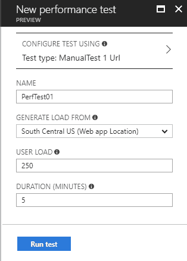

+   使用缓存来存储静态的、变化频率较低且频繁访问的数据。如果你正在构建企业应用程序，考虑利用 Azure Redis 缓存以实现快速数据访问。

+   使用服务器垃圾回收模式中的垃圾回收器。这将确保你的内存占用不会随着时间的推移而增加。这可以通过以下`web.config`文件中的配置来完成，或者添加一个包含以下代码的`app.config`文件：

```cs
<configuration> 
   <runtime> 
      <gcServer enabled="true"/> 
   </runtime> 
</configuration>
```

你可以在[`docs.microsoft.com/en-us/dotnet/framework/configure-apps/file-schema/runtime/gcserver-element`](https://docs.microsoft.com/en-us/dotnet/framework/configure-apps/file-schema/runtime/gcserver-element)上了解更多关于`gcServer`元素的信息。

+   如果你在应用程序中使用 Web API，请使用`HttpClient`来执行 API 调用。请记住只创建一次`HttpClient`实例并多次重用它，也就是说，创建一个`HttpClient`的单例实例，而不是每次都创建它。在依赖注入方面，将其用作单例而不是瞬态或作用域。

+   在开发 API 时，遵循以下规则：

    +   **只携带你需要的数据**：为了代码的可重用性，我见过一些团队使用一个返回大量数据的单个 API，尽管只需要其中的一部分。对于少量用户，这可能表现不佳，但随着用户负载的增加，这将会开始造成性能瓶颈，所以对你的服务返回的数据要非常节俭。

    +   **序列化器选择**：服务 API 在序列化数据并发送响应的过程中花费了相当多的时间。客户端随后接收到响应并反序列化它，这同样需要时间。投资于一个能更快完成工作的序列化器，以提供更好的响应时间性能是值得的。开发者有多个序列化器可供选择，例如 JSON、BSON、MessagePack、Protocol Buffers 等等。我们最近将 JSON 改为 MessagePack，并发现了巨大的性能提升，因为 MessagePack 的有效负载大约是 JSON 的 66%，并且大约快三倍。

    +   **压缩**：考虑压缩从服务 API 发送到客户端的数据。这对移动用户以及可能在使用您应用的波动和低带宽网络上的人来说都是有益的，因为减少要加载的数据量会使应用运行得更快。此外，通过压缩有效载荷，我们使我们的应用程序可扩展，因为我们可用的带宽是有限的。有许多方法可以实现这一点。当然，`HttpClient` 支持 `GZip` 压缩，因此我们可以利用它。同样重要的是，我们可以选择要序列化的属性。所以，如果您的实体有十个属性，而您只需要两个属性，那么只序列化这两个属性并忽略剩余的八个属性是完全合理的，以减少有效载荷。这在 JSON 中得到了很好的支持，我们广泛地使用了它，并且在少数情况下将数据从 32 MB 减少到不到 1 MB。想象一下，如果这个 API 被数百个用户调用！

+   请充分利用捆绑和最小化，正如前面章节中讨论的那样。

+   响应缓存减少了客户端或代理对 Web 服务器的请求数量。响应缓存还减少了 Web 服务器生成响应所需的工作量，从而提高了性能。请注意，响应缓存不支持 ASP.NET Core Razor 页面，但预计将在 ASP.NET Core 2.1 中提供支持。

+   在使用并行或多个线程写入数据时，请使用并发集合。实际上，如果您认为可能有多个线程修改一个集合，使用并发集合总是安全的，而且开销很小。

+   避免在循环内部进行 API 或数据库调用。对于 API，尝试创建一个接受集合作为输入并处理以返回所需数据的精简集合的 API。对于数据库，创建一个存储过程，该存储过程接受用户定义的表作为参数，并一次性返回数据。这将使应用程序的交互更少。

+   不要在循环内部执行字符串连接操作。如果您需要在循环内部连接字符串，请使用 `StringBuilder`。

+   Visual Studio 对应用程序的剖析支持非常好，可以帮助您识别高 CPU 问题，因此在开发阶段请务必充分利用 Visual Studio 的剖析器。使用起来非常简单，如下步骤所示：

    1.  确保您希望剖析的应用程序在机器上运行并处于活动状态。

    1.  打开 Visual Studio，在快速启动中搜索“性能资源管理器”。或者，您可以通过 Debug | Profiler | Performance Explorer | Attach/Detach 导航，如下所示：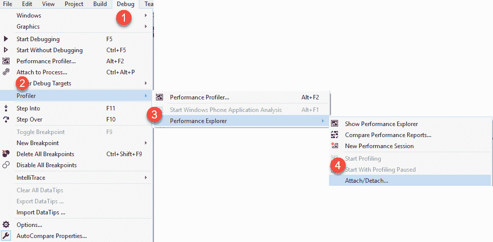

    1.  它将打开一个对话框，显示正在运行的进程列表。选择您希望剖析的进程，然后点击“附加”。

    1.  分析将开始。现在是重现您的 CPU 高负载问题的时机，一旦重现，请停止分析。它将生成一个详细的分析报告。我们将在稍后讨论 Azure 中的分析时，看看分析报告的样子。

+   分析您的内存以确定是否存在内存泄漏。请始终记住，如果您的内存百分比保持恒定或在一段时间内持续增加，那么可能存在内存泄漏。内存泄漏可以描述为程序即使该内存被丢弃且不再需要时仍然保留内存的情况。由于不良的编码，开发者的代码可能阻止 **垃圾回收器** (**GC**) 回收内存，因此，使用的内存会随着时间的推移而不断增加，导致性能问题或失败。除了 Visual Studio 之外，还有许多优秀的分析工具可以使用，例如 dotTrace、MemProfiler、ANTS Memory Profiler、PerfView 等。我在遇到的 ASP.NET Core 应用程序中，内存泄漏的一个常见原因是错误的依赖注入。因此，如果一个对象需要作用域或瞬态，而你将其注册为单例，那么如果它不是单例，我们可能会注入内存泄漏。静态对象和字典也是内存泄漏的另一个常见原因，所以在将对象标记为静态之前请三思。

+   ASP.NET Core 支持分析器。正如其名，代码分析是对代码的分析，以识别潜在的代码问题，例如不当编码、不符合标准、安全违规和设计问题。代码分析可以是静态的或动态的。在静态分析中，分析是在不实际运行代码的情况下进行的。StyleCop、FxCop 是最知名且最常使用的代码分析器之一。利用分析器来尽早识别代码问题。其中一些优秀的分析器包括 `Microsoft.CodeAnalysis`、`SonarAnalyzer.Csharp`、`FxCop analyzer`、`Roslynator.Analyzers` 和 `Stylecop analyzer` 等。这些分析器使用起来也很简单——在项目上右键单击并选择 Nuget 包管理器。搜索您选择的分析器并安装它。构建您的项目并观察错误窗口中的警告和错误。这将帮助您解决各种问题，例如可能的性能瓶颈、安全漏洞以及不遵循最佳实践。

阅读这篇关于 ASP.NET Core 性能改进的优秀 MSDN 博客文章：[`blogs.msdn.microsoft.com/dotnet/2017/06/07/performance-improvements-in-net-core/`](https://blogs.msdn.microsoft.com/dotnet/2017/06/07/performance-improvements-in-net-core/).

还请阅读 ASP.NET Core 的官方性能文档：[`docs.microsoft.com/en-us/aspnet/core/performance/`](https://docs.microsoft.com/en-us/aspnet/core/performance/).

接下来，我们将探讨一些 Azure 的酷炫且实用的功能，这些功能可以帮助我们提高生产力。

# Azure 小贴士

Azure 拥有众多功能，尽管它们非常实用且具有价值，但许多开发者却未探索或使用它们。我在这里列出了一些重要的功能：

+   **口袋里的 Azure**：我们将从一个俗套的话题开始。是的，口袋里的 Azure。现在 Azure 已经作为移动应用提供，您可以随时随地携带您的 Azure 订阅。您可以在路上跟踪您的 Azure 资源，并保持连接——随时随地。以下图片展示了 Azure 移动应用的一瞥 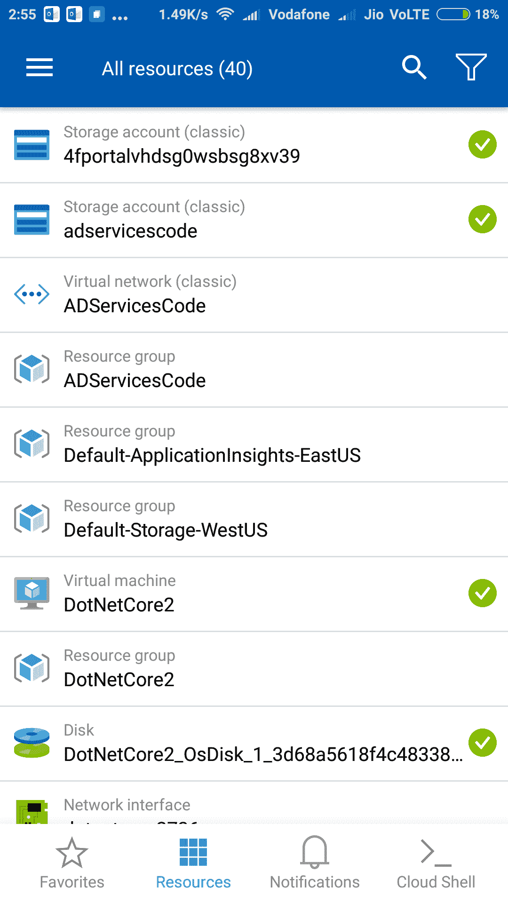

+   **顾问**：在 Azure 门户的左侧面板中，有一个名为“顾问”的项目。尽管它是免费的，但它是 Azure 相对较少使用和讨论的功能之一。它是完全免费的，并且根据资源的实际使用情况提供实时咨询服务。只需点击顾问，它就会提供安全、性能、成本和可用性建议。建议也可以下载为 CSV 或 PDF 格式。以下是 Azure 顾问的预告片：

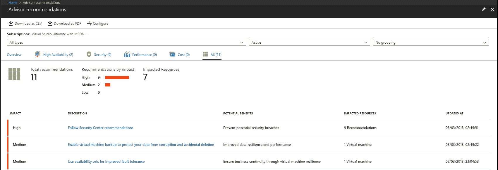

+   **安全中心**：与顾问类似，在左侧面板中还有一个安全中心选项。这是 Azure 的一个非常棒且免费的特性。它检测您订阅中所有 Azure 资源的威胁，并提供针对性的建议。它还会通知您资源发生的任何安全事件和威胁评估报告。有一个付费计划提供了高级威胁检测，但免费选项是一个很好的起点。以下图片显示了安全中心：

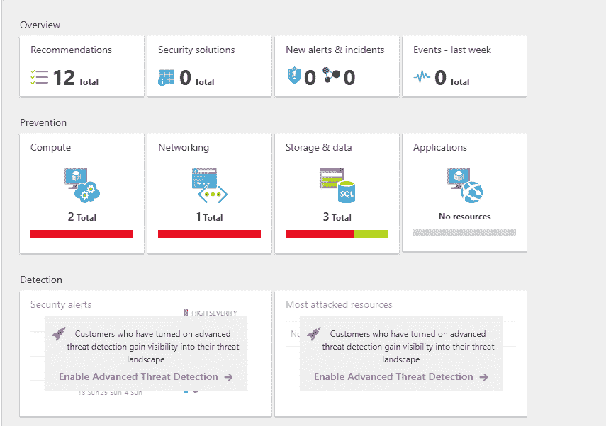

+   **活动日志**：当我在一个正在开发 Azure 的团队工作时，曾经遇到过这样的情况：我在处理 Web 应用时，某个团队成员不小心更改了配置，或者可能是重启或删除了资源，而我对此一无所知。我自己也曾是罪魁祸首，在性能测试运行时修改了配置，导致 Web 应用重启。Azure 也有针对这类情况的解决方案。用户所做的每一个动作都会记录在您正在操作的资源活动日志中。所以，下次您遇到类似情况时，只需查看活动日志，如图所示。在 Azure 门户中，转到您想查看活动日志的资源。在资源的左侧面板中，点击活动日志。您还可以应用过滤器并选择您想查看活动日志的时间范围：

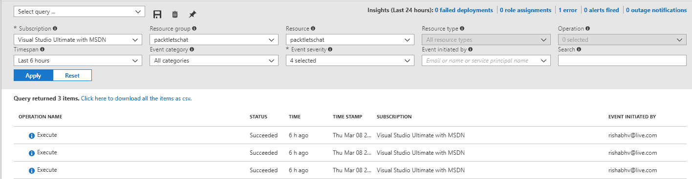

+   **诊断日志**：如果你在 Azure 中部署的应用遇到问题，而不知道发生了什么，请在你的应用中启用日志记录和 Application Insights。我们之前已经讨论了 Application Insights。日志记录可以提供诸如失败的请求跟踪和详细的错误日志等详细信息。你将看到两个应用程序日志选项——Blob 和文件系统。正如其名所示，日志存储在 Blob 和文件系统中。文件系统日志仅启用 12 小时，因为存在日志消耗内存的风险。以下图片显示了诊断日志配置：

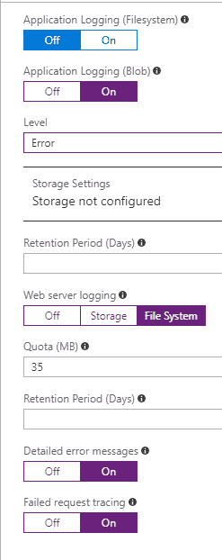

+   **诊断和解决问题**：这是 Azure 中另一个酷炫的功能。如果你遇到问题或者怀疑你的 App Service 中出了问题，Azure 提供了非常好的诊断和问题修复功能。它能够清楚地识别问题是由平台或应用代码问题引起的。它可以诊断各种问题类别，如网站应用宕机、慢速网站应用、高 CPU 使用率、高内存使用率、网站应用重启、TCP 连接等。它有一个聊天界面，使得使用更加方便。只需点击一个问题类别，它就会对过去 24 小时内的应用进行分析，并分享图表和发现，这使得识别问题变得极其简单。如果需要扩展你的应用，它还会给出建议。此外，你可以按需对资源进行健康检查，这提供了一个单一视图来查看应用错误、性能、CPU 和内存使用情况。这绝对是一个用于诊断的非常实用的工具。以下是诊断和解决问题的截图：

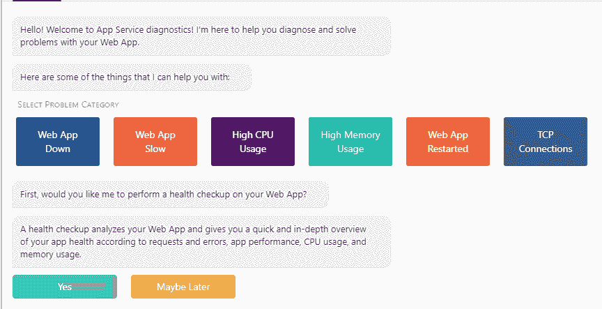

+   **诊断即服务（DaaS）**：对于开发者来说，DaaS 是另一个出色的故障排除工具。当你打开 App Service 的诊断和解决问题选项卡时，右侧会显示一个面板，展示多个链接：

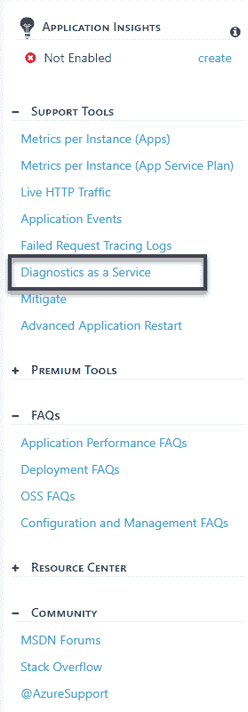

每个都是本身就是一个出色的诊断和支持工具，但我们将重点关注 DaaS。我强烈建议你探索每个链接。回到 DaaS，它看起来是这样的：

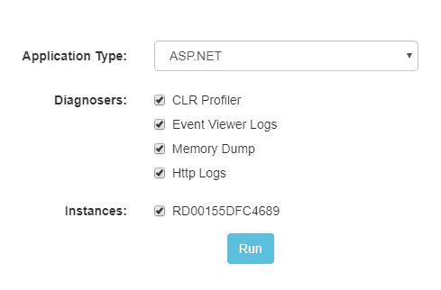

它支持 ASP.NET、PHP 和 Java 应用程序。我们将选择 ASP.NET 作为我们的应用程序类型，当我们这样做时，我们将看到 ASP.NET 特定的诊断器，例如 CLR 性能分析器、事件查看器日志、内存转储和 HTTP 日志。根据我们需要进行的诊断，我们可以选择合适的选项。我通常在诊断时检查所有内容。内存转储分析可以很好地识别内存泄漏，但需要在您观察到内存使用量持续高或增加时进行转储。那么，如何进行呢？嗯，很简单，您可以在门户中 App Service 的概览选项卡中查看您的 App Service 的内存和 CPU 使用情况。请注意，您至少需要两个内存转储来确认内存泄漏。同样，CLR 性能分析器可以用来找出在性能分析期间您的代码的哪个部分正在做最多工作，因此当您的 App Service 中出现时间问题时进行性能分析很重要。选择选项后，点击运行。

Azure 将捕获数据，然后进行分析，并分享分析报告，您下载并据此采取行动，如下面的截图所示：

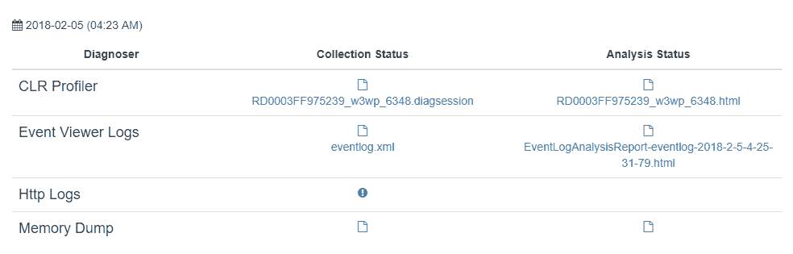

可以通过点击收集状态列下显示的 `.diagsession` 文件来下载 CLR 性能分析器 `.diagsession` 文件，并在 Visual Studio 中打开。它将给出热点路径以及性能分析会话期间执行最多工作的代码块和方法。内存转储也可以下载，您可以使用 Windbg 或 DebugDiag 在本地进行内存转储分析，根据需要。Azure 提供了 DebugDiag 分析报告，可以直接下载。

+   **Azure 服务性能分析器**：使用 Azure 服务性能分析器来识别高 CPU 问题。它对 ASP.NET Core 2.0 提供了很好的支持。设置细节和它提供的价值可以在 [`www.azureserviceprofiler.com/`](https://www.azureserviceprofiler.com/) 上查看。在您的 Web 应用程序上安装此分析器后，它将以 Web 作业的形式运行，并通过识别热点路径来诊断问题。它还总结性能数据以查找长尾性能问题。

+   **分析应用以检测高 CPU 使用情况**：借助 Azure 提供的 CPU 和内存详细指标，我们可以轻松地识别 App Service 是否正在使用高 CPU。如果是的话，我们如何找出导致应用使用高 CPU 的原因呢？是的，进行性能分析。在 Visual Studio 和 Azure 中进行性能分析都很简单。尽管 DaaS 进行了性能分析，但我总是看到 `w3wp.exe` 被分析，而不是我们实际构建的应用程序 `.exe`。为了分析我们的应用程序代码，我们可以执行以下简单的步骤：

    1.  在 Azure 门户中，选择您希望分析性能的 App Service（搜索 App Service 并点击它）。

    1.  在应用服务的左侧面板中，点击“高级工具”。这将打开高级工具面板。在此面板中点击“转到”按钮。这将带您到您的应用服务的 Kudu 站点。这里有一个快捷方式可以到达这里。如果您的应用服务 URL 是[`myappservice.azurewebsites.net`](http://myappservice.azurewebsites.net)，那么相应的 Kudu 站点将是[`myappservice.**scm**.azurewebsites.net`](http://myappservice.scm.azurewebsites.net)。注意`scm`位于`myappservice`和`azurewebsites.net`之间。您必须有权访问 Kudu 站点，因此并非每个人都可以访问任何网站的 Kudu 站点：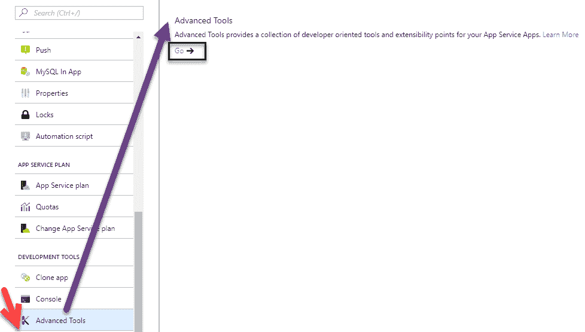

    1.  在顶部栏中，选择进程资源管理器。这将打开进程资源管理器，如图所示：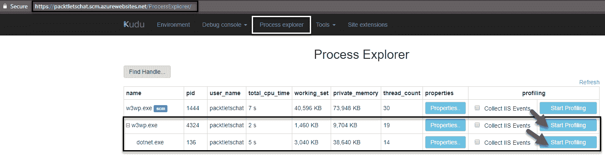

    1.  当您观察到应用中的 CPU 使用率较高时，点击您的应用程序`.exe`的“开始分析”按钮。开始分析需要一段时间。一旦分析完成，点击“停止分析”。这将开始生成诊断信息并生成`.diagsession`文件，您将被提示下载该文件。

    1.  下载文件后，使用 Visual Studio 打开它。它将显示 CPU 图表。将有一个名为“创建详细报告”的按钮。点击它，它将打开一个包含热点路径、摘要并引导您到导致高 CPU 使用的代码的漂亮报告，如图所示：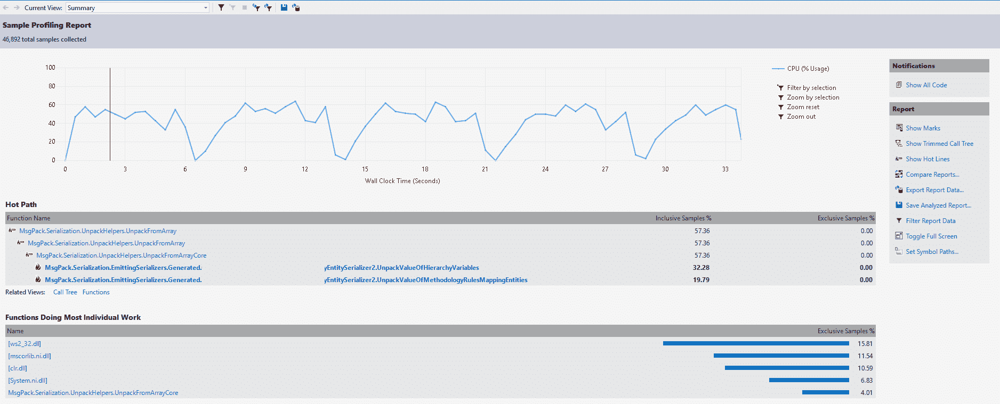

+   **支持**：既然我们已经知道了 Kudu 站点，另一个可能有用的诊断工具是 Azure 应用服务支持，这可以通过在 Kudu 站点 URL 中附加`/support`来浏览。对于前面的示例，支持站点将是[`myappservice.scm.azurewebsites.net/support`](http://myappservice.scm.azurewebsites.net/support)。截至撰写本章时，它处于预览状态。我们可以从这里观察、分析和缓解问题，如图下所示。观察部分可以用来查看每秒请求数和每秒错误数等统计数据。分析部分可以用来查看 FREB（**F**ailed **R**equest **E**rror **B**uffering）日志、事件查看器日志和运行诊断以确定 CPU 和内存问题。缓解部分有一个自动修复应用的开关。大多数内存和 CPU 问题在重启后都会得到解决，这就是自动修复功能发挥作用的地方。如果您有一个需要在应用服务后自动回收的场景，比如在*Y*时间内处理了*X*数量的请求，您可以考虑将自动修复作为一个选项——*X*和*Y*可以通过以下规则进行配置：

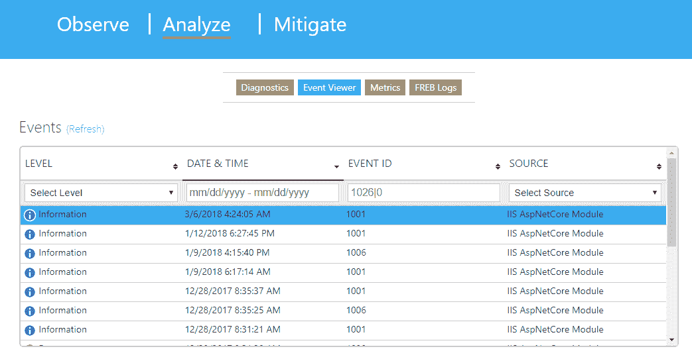

+   **新建支持请求**：如果这些选项似乎都没有帮助您识别问题，这在操作得当的情况下不应该经常发生，您可以通过在您的应用服务左侧面板中创建一个新的支持请求来利用 Azure 支持的专业知识来帮助您解决问题，如图所示：

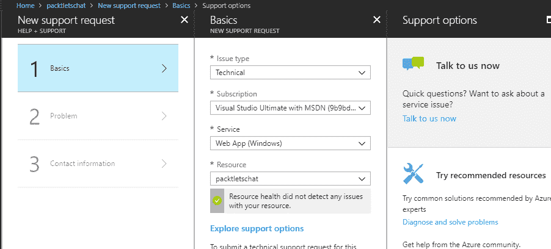

接下来，让我们快速了解一下 ASP.NET 团队的一个新实验性项目，名为 Blazor。

# 介绍 Blazor

Blazor 是 ASP.NET 团队的一个新实验。Blazor 的名字来源于两个词，Browser 和 Razor。

Blazor 是一个使用 C#、Razor 和 HTML 的实验性 Web UI 框架，通过 WebAssembly 在浏览器中运行。

什么是 WebAssembly？**WebAssembly** 或 **wasm** 是一种开放的新时代格式标准，其初始版本据报道已达到跨浏览器的共识。它被描述为**一种新的便携式、大小和加载时间高效的格式，适合编译到 Web 中**。WebAssembly 是一种可以在现代网络浏览器中运行的新类型代码。它是一种类似于汇编的低级语言，具有紧凑的二进制格式，以接近原生的性能运行，并为 C/C++ 等语言提供编译目标，以便它们可以在 Web 上运行。它还设计为与 JavaScript 一起运行，允许两者协同工作。它是一种浏览器改进。由于它是一种二进制格式，我们将能够编译比文本 JavaScript 更小的二进制包。更小的负载意味着更快的交付，因此它可能比 JavaScript 运行得更快。

Blazor 通过一个名为 **DotNetAnywhere** （**DNA**）的小型、便携式 .NET 运行时在浏览器中运行 .NET 代码，该运行时被编译为 WebAssembly。本质上，Blazor 让像我这样的开发者（不擅长 JavaScript）的生活变得更简单、更快乐。您可以使用 C#、Razor 和 HTML 编写整个应用程序，它将在浏览器内部运行，无需编写任何 JavaScript 代码，并且它的工作方式就像任何 **单页应用程序** （**SPA**） 一样。它提供了丰富和现代平台的所有好处，同时让我们能够端到端地使用 .NET。

Blazor 是由 ASP.NET 团队的 Steve Sanderson 开发的个人项目，他是 ASP.NET 团队的一员，在英国工作。他有一个详细的博客，其中讨论了它的工作原理。可以在 [`blog.stevensanderson.com/2018/02/06/blazor-intro/`](http://blog.stevensanderson.com/2018/02/06/blazor-intro/) 上阅读。[`blog.stevensanderson.com/2018/02/06/blazor-intro/`](http://blog.stevensanderson.com/2018/02/06/blazor-intro/)

其他提供关于 Blazor 深刻见解的博客可以在 [`visualstudiomagazine.com`](https://visualstudiomagazine.com/articles/2017/08/09/blazor.aspx) 和 [`blogs.msdn.microsoft.com/webdev/2018/02/06/blazor-experimental-project/`](https://blogs.msdn.microsoft.com/webdev/2018/02/06/blazor-experimental-project/) 上阅读。[`blogs.msdn.microsoft.com/webdev/2018/02/06/blazor-experimental-project/`](https://blogs.msdn.microsoft.com/webdev/2018/02/06/blazor-experimental-project/)

Blazor 的演示可以在 [`blazor-demo.github.io/`](https://blazor-demo.github.io/) 上看到。[`blazor-demo.github.io/`](https://blazor-demo.github.io/)

如果这听起来很令人兴奋，那么在即将到来的 ASP.NET Core 2.1 版本中还有更多令人兴奋的内容。让我们先睹为快。

# .NET Core 2.1 即将推出

.NET Core 2.1 的预览版本于 2018 年 2 月 27 日发布。我们可以开始使用 Visual Studio 2017 15.6 Preview 6 或更高版本以及 Visual Studio Code 来开发.NET Core 2.1 应用程序。让我们看看.NET Core 2.1 中新增了哪些内容。

+   **构建性能**：在.NET Core 2.1 中，构建时间性能得到了提升。CLI 工具和 MSBuild 得到了改进，比之前快得多。

+   **次要版本滚动前进**：我们可以将.NET Core X.x 应用程序运行在相同主版本范围内的后续次要版本上，例如.NET Core 2.1 应用程序在.NET Core 2.6 上。此滚动前进功能仅适用于次要版本，因此 2.1 不能自动滚动到.NET Core 3.0 或任何其他主版本。滚动前进行为仅在预期的.NET Core 版本不在给定环境中时才相关。我们可以使用以下方式禁用此功能：

    +   **环境变量**：`DOTNET_ROLL_FORWARD_ON_NO_CANDIDATE_FX=0`

    +   **runtimeconfig.json**：`rollForwardOnNoCandidateFx=0`

    +   **CLI**：`roll-forward-on-no-candidate-fx=0`

+   **套接字性能和 HTTP 管理处理程序：** 作为新版本的一部分，套接字性能得到了提升。套接字是出站和入站网络通信的基础。在.NET Core 2.0 ASP.NET 中，Kestrel 网络服务器和`HttpClient`使用原生`Socket`而不是.NET 的`Socket`类。套接字将有三项重要的性能改进。它支持`Span<T>`和`Memory<T>`在`Socket`和`NetworkStream`中。`SocketHttpHandler`性能得到了提升。一些好处包括：

    +   平台依赖性已在 libcurl（linux）和 WinHTTP（Windows）上消除——这简化了开发、部署和服务

    +   在所有平台和平台/依赖版本之间的一致行为

    +   我们可以通过以下方式之一在 Preview 1 中启用使用`SocketHTTPHandler`：

        +   **环境变量**：`COMPlus_UseManagedHttpClientHandler=true`

        +   **AppContext**：`System.Net.Http.UseManagedHttpClientHandler=true`

+   **Span<T>**，**Memory<T>**：引入了新的类型来使用数组和其他类型的内存，这既高效又提高了性能。使用`Span`，我们可以传递数组的子集，例如一个 100 元素数组中的 5 个元素，我们可以创建一个`Span<T>`，它提供了该数组的虚拟表示，而不需要时间和空间成本。现在，不需要复制这五个数组。这也是`struct`，所以没有分配成本。通过切片功能，它消除了在许多情况下进行昂贵复制和分配的需要，例如字符串操作缓冲区管理等等。以下是从数组创建`Span<T>`的示例：

```cs
var arrayExample= new byte[10];
Span<byte> bytes = arrayExample; // Implicit cast from T[] to Span<T>
```

从那里，我们可以轻松高效地创建一个`Span`来表示/指向这个数组的子集，利用 span 的`Slice`方法的重载。从那里，你可以索引到结果 span，在原始数组的相应部分写入和读取数据：

```cs
Span<byte> slicedBytes = bytes.Slice(start: 5, length: 2);
slicedBytes[0] = 42;
slicedBytes[1] = 43;
Assert.Equal(42, slicedBytes[0]);
Assert.Equal(43, slicedBytes[1]);
Assert.Equal(arrayExample [5], slicedBytes[0]);
Assert.Equal(arrayExample [6], slicedBytes[1]);
slicedBytes[2] = 44; // Throws IndexOutOfRangeException
bytes[2] = 45; // OK
Assert.Equal(arrayExample [2], bytes[2]);
Assert.Equal(45, arr[2]);

```

+   **Windows 兼容包**：当我们从 .NET Framework 将现有代码移植到 .NET Core 时，我们可以使用 [新的 Windows 兼容包](https://blogs.msdn.microsoft.com/dotnet/2017/11/16/announcing-the-windows-compatibility-pack-for-net-core/)。它提供了额外的 20,000 个 API，比 .NET Core 中可用的 API 更多。这包括 `System.Drawing`、EventLog、WMI、性能计数器和 Windows 服务。以下示例展示了如何使用 Windows 兼容包提供的 API 访问窗口注册表。该示例从 `CurrentUser` 注册表分页中获取书籍 `NetCore2ByExample` 的 `TechnicalEditor` 的值：

```cs
using (var userHiveRegKey = Registry.CurrentUser.OpenSubKey(@"Software\Packt\Books\NetCore2ByExample"))
        {
           var value = userHiveRegKey?.GetValue("TechnicalEditor");
        }
```

想要了解更多关于 .NET Core 2.1 特性的信息，请访问以下资源：

+   [`blogs.msdn.microsoft.com/webdev/2018/02/02/asp-net-core-2-1-roadmap/`](https://blogs.msdn.microsoft.com/webdev/2018/02/02/asp-net-core-2-1-roadmap/)

+   [`github.com/dotnet/core/blob/master/roadmap.md`](https://github.com/dotnet/core/blob/master/roadmap.md)

由此，我们结束了本章的内容。

# 摘要

在本章中，我们概述了微服务架构，它如何是 SOA 的扩展并克服了传统单体应用的局限性。我们还学习了 ASP.NET 和 ASP.NET Core 之间的重要架构差异。由于架构差异，我们讨论了一些在开发 ASP.NET Core 2.0 应用时需要记住的技巧。然后我们讨论了一些提高 ASP.NET Core 应用性能的实用技巧。我们还讨论了关于 Azure 的几个技巧，然后转向 ASP.NET Core 团队的新实验性项目，称为 Blazor。我们通过讨论即将在 ASP.NET Core 2.1 中出现的功能来结束本章。在本书的下一章和最后一章中，我们将讨论使用 F# 的函数式编程。
