# 使用 F# 进行函数式编程

在本章中，我们将学习如何使用 F# 构建函数式程序，并利用 .NET Core。我们还将掌握为使用 SQL Server vNext 数据库的微服务实现数据访问层。

本章将涵盖以下主题：

+   函数式编程简介

+   F# 简介

+   使用 F# 的数据访问层

+   使用 F# 查询 SQL vNext

# 函数式编程简介

我们在第一章“入门”中简要介绍了函数式编程和 F#。在 F# 入门部分，我们说函数式编程将程序视为数学表达式并评估表达式。它侧重于函数和常量，它们不会像变量和状态那样改变。函数式编程用简单的代码解决复杂问题；它是编写无错误应用程序的非常高效的编程技术；例如，可以使用这种技术避免空指针异常。

函数式编程是语言无关的，这意味着它与语言无关。函数式编程侧重于结构化方法；它没有多个入口和出口点。它没有 goto 语句，因此很容易创建小模块，并使用小块结构化代码（或者说子模块）创建大模块，这增加了代码的可重用性。一个函数可以作为另一个函数的输入，而那个函数可以输出一个新的函数。

这里有一些规则，使我们更容易理解函数式编程：

+   在函数式编程中，一个函数的输出永远不会受到外部代码更改的影响，并且对于相同的参数，函数总是给出相同的结果。这让我们对函数的行为有信心，即它在所有场景中都会给出预期的结果，这对多线程或并行编程很有帮助。

+   在函数式编程中，变量是不可变的，这意味着一旦初始化了变量，我们就不能修改它，因此在程序运行时可以很容易地确定变量在任何给定点的值。

+   函数式编程基于引用透明性，这意味着它不会在函数中使用赋值语句。例如，如果一个函数正在将新值赋给一个变量，如下所示：

```cs
Public int sum(x)
{
x = x + 20 ;
return x;
}
```

这是在改变 `x` 的值，但如果我们像这样写：

```cs
Public int sum(x)
{
return x + 20 ;
}
```

这并不是改变变量值，函数返回相同的结果。

+   函数式编程使用递归进行循环。递归函数调用自身，直到满足条件。

# 函数式编程特性

让我们讨论一些函数式编程特性：

+   高阶函数

+   纯度

+   递归

+   柯里化

+   闭包

+   函数组合

# 高阶函数 (HOF)

一个函数可以将另一个函数作为输入参数，并且它可以返回一个函数。这起源于微积分，并且在函数式编程中被广泛使用。顺序可以通过域和范围来确定，例如，顺序 `0` 没有函数数据，顺序 `1` 有顺序 `0` 的域和范围，如果顺序高于 `1`，则称为高阶函数。例如，`ComplexCalc` 函数接受另一个函数作为输入，并返回一个不同的函数作为输出：

```cs
open System
let sum y = x+x
let divide y = x/x
Let ComplexCalc func = (func 2)
Printfn(ComplexCalc sum) // 4
Printfn(ComplexCalc divide) //1
```

在前面的示例中，我们创建了两个函数，`sum` 和 `divide`。我们将这两个函数作为参数传递给 `ComplexCalc` 函数，它分别返回 `4` 和 `1`。

# 纯度

在函数式编程中，如果一个函数的所有输入参数都是已知的，并且所有输出结果也是明确声明和已知的；或者我们可以这样说，输入和输出结果没有副作用，那么这个函数被称为纯函数。现在，你可能很好奇副作用可能是什么，让我们来讨论一下。

让我们看看以下示例：

```cs
Public int sum(int x)
{
return x+x; 
}
```

在前面的示例中，函数 `sum` 接受一个整数输入并返回一个整数值和预定义的结果。这类函数被称为纯函数。让我们调查以下示例：

```cs
Public void verifyData()
{
  Employee emp = OrgQueue.getEmp();
  If(emp != null)
  {
    ProcessForm(emp);
  }
}
```

在前面的示例中，`verifyData()` 函数不接受任何输入参数，也不返回任何内容，但这个函数在内部调用 `getEmp()` 函数，所以 `verifyData()` 依赖于 `getEmp()` 函数。如果 `getEmp()` 的输出不为空，它将调用另一个函数，称为 `ProcessForm()`，我们将 `getEmp()` 函数的输出作为 `ProcessForm(emp)` 的输入。在这个例子中，这两个函数，`getEmp()` 和 `ProcessForm()`，在 `verifyData()` 函数的调用级别是未知的，而且 `emp` 是一个隐藏值。这种具有隐藏输入和输出的程序被视为程序的副作用。我们无法理解这些函数在做什么。这与封装不同；封装隐藏了复杂性，但在这样的函数中，功能不明确，输入和输出不可靠。这类函数被称为不纯函数。

让我们看看纯函数的主要概念：

+   **不可变数据**：函数式编程在不可变数据上工作，它消除了变量状态变化的副作用，并保证了预期的结果。

+   **引用透明性**：大型模块可以被小的代码块替换，并可以重用任何现有的模块。例如，如果 `a = b*c` 和 `d = b*c*e`，那么 `d` 的值可以写成 `d = a*e`。

+   **惰性评估**：引用透明性和不可变数据给了我们灵活性，可以在任何给定的时间点计算函数，并且我们会得到相同的结果，因为变量在任何时候都不会改变其状态。

# 递归

在函数式编程中，循环是通过递归函数来执行的。在 F#中，要使函数递归，我们需要使用`rec`关键字。默认情况下，F#中的函数不是递归的，我们必须显式地使用`rec`关键字来纠正这一点。让我们举一个例子：

```cs
let rec summation x = if x = 0 then 0 else x + summation(x-1)
printfn "The summation of first 10 integers is- %A" (summation 10)
```

在此代码中，我们使用关键字`rec`表示递归函数，如果传入的值是`0`，则总和将是`0`；否则，它将添加`x + summation(x-1)`，例如`1+0`然后`2+1`等等。我们应该小心使用递归，因为它可能会大量消耗内存。

# 柯里化

这将一个具有多个输入参数的函数转换为一次只接受一个参数的函数，或者说，它将函数分解成多个函数，每个函数一次只接受一个参数。以下是一个例子：

```cs
int sum = (a,b) => a+b
int sumcurry = (a) =>(b) => a+b
sumcurry(5)(6) // 11
int sum8 = sumcurry(8) // b=> 8+b
sum8(5) // 13
```

# 闭包

闭包是一种特性，它允许我们访问不在当前模块作用域内的变量。这是一种实现词法作用域命名绑定的方法，例如：

```cs
int add = x=> y=> x+y
int addTen = add(10)
addTen(5) // this will return 15

```

在这个例子中，`add()`函数是由`addTen()`函数内部调用的。在一个理想的世界里，当`add()`函数执行完毕时，变量`x`和`y`不应该被访问，但当我们调用函数`addTen()`时，它返回`15`。所以，尽管代码执行已经完成，函数`add()`的状态仍然被保存，否则就没有办法知道`add(10)`的值，其中`x = 10`。我们能够找到`x`的值是因为词法作用域，这被称为闭包。

# 函数组合

如我们之前讨论的 HOF（高阶函数），函数组合意味着将两个函数组合在一起创建一个新的第三个函数，其中一个函数的输出是另一个函数的输入。

有*n*个函数式编程特性。函数式编程是一种以高效方式解决问题和编写代码的技术。它不是特定于语言的，但许多语言支持函数式编程。我们也可以使用非函数式语言（如 C#）以函数式方式编写程序。F#是微软的一种编程语言，用于简洁和声明性语法。我们将在下一节中了解更多关于 F#的内容。

# F#简介

在第一章“入门”中，我们讨论了 F#语言及其函数式编程特性、基本关键字、运算符和变量声明。我们还探讨了 F#与 C#、函数以及基本输入输出语法的区别。在本节中，我们将更详细地讨论 F#。

# 类的基本概念

类是包含函数、属性和事件的类型。F#类必须有一个参数和一个附加的函数，就像一个成员。属性和函数都可以使用`member`关键字。以下是类定义的语法：

```cs
type [access-modifier] type-name [type-params] [access-modifier] (parameter-list) [ as identifier ] =
[ class ]
[ inherit base-type-name(base-constructor-args) ]
[ let-bindings ]
[ do-bindings ]
member-list
 [ end ]

// Mutually recursive class definitions:

type [access-modifier] type-name1 ...
and [access-modifier] type-name2 ...
```

让我们讨论一下类声明的先前语法：

+   `type`：在 F#语言中，类定义以`type`关键字开始。

+   `access-modifier`: F#语言支持三种访问修饰符—`public`、`private`和`internal`。默认情况下，如果没有提供其他访问修饰符，它将考虑`public`修饰符。在 F#语言中不使用`Protected`关键字，原因是它将变成面向对象而不是函数式编程。例如，F#通常使用 lambda 表达式调用成员，如果我们使成员类型为受保护的，并调用不同实例的对象，它将不起作用。

+   `type-name`: 它是之前提到的任何有效标识符；默认访问修饰符是`public`。

+   `type-params`: 它定义了可选的泛型类型参数。

+   `parameter-list`: 它定义了构造函数参数；主构造函数的默认访问修饰符是`public`。

+   `identifier`: 它与可选的`as`关键字一起使用，`as`关键字给一个实例变量命名，可以在类型定义中使用该名称来引用类型的实例。

+   `Inherit`: 这个关键字允许我们指定类的基类。

+   `let-bindings`: 这用于在类的上下文中声明字段或函数值。

+   `do-bindings`: 这对于执行代码以创建对象很有用。

+   `member-list`: `member-list`包括额外的构造函数、实例和静态方法声明、抽象绑定、接口声明以及事件和属性声明。

这里是一个类的例子：

```cs
type StudentName(firstName,lastName) = 
member this.FirstName = firstName
member this.LastName = lastName
```

在前面的例子中，我们没有定义参数类型。默认情况下，程序将其视为字符串值，但我们可以显式地定义数据类型，如下所示：

```cs
type StudentName(firstName:string,lastName:string) = 
member this.FirstName = firstName
member this.LastName = lastName
```

# 类的构造函数

在 F#中，构造函数的工作方式与任何其他.NET 语言都不同。构造函数创建类的实例。参数列表定义了主构造函数和类的参数。构造函数包含`let`和`do`绑定，我们将在下一节讨论。我们可以使用`new`关键字添加多个构造函数，除了主构造函数之外，并且它必须调用用类声明定义的主构造函数。定义新构造函数的语法如下所示：

```cs
new (argument-list) = constructor-body
```

这里有一个例子来解释这个概念。在下面的代码中，`StudentDetail`类有两个构造函数：一个接受两个参数的主构造函数，另一个不接受任何参数的构造函数：

```cs
type StudentDetail(x: int, y: int) =
do printfn "%d %d" x y
new() = StudentDetail(0, 0)
```

# `let`和`do`绑定

`let`和`do`绑定创建类的构造函数，并在创建类的实例时运行。

如果一个函数有一个`let`绑定，它就会被编译成一个成员。如果`let`绑定是一个在任何函数或成员中都没有使用的值，那么它会被编译成构造函数的局部变量；否则，它会被编译成类的字段。

`do`表达式执行初始化代码。由于任何额外的构造函数总是调用主构造函数，所以`let`和`do`绑定总是执行，无论调用哪个构造函数。

通过`let`绑定创建的字段可以通过类的方法和属性访问，尽管它们不能从静态方法中访问，即使静态方法以实例变量作为参数：

```cs
type Student(name) as self =
    let data = name
    do
        self.PrintMessage()
        member this.PrintMessage() = printf " Student name is %s" data
```

# 泛型类型参数

F# 也支持泛型参数类型。我们可以通过逗号分隔来指定多个泛型类型参数。泛型参数声明的语法如下：

```cs
type MyGenericClassExample<'a> (x: 'a) =
   do printfn "%A" x
```

参数的类型决定了它的使用位置。在下面的代码中，我们调用了`MyGenericClassExample`方法并传递了一个元组的序列，因此这里的参数类型变成了元组的序列：

```cs
let g1 = MyGenericClassExample( seq { for i in 1 .. 10 -> (i, i*i) } )
```

# 属性

与对象相关的值通过属性表示。在面向对象编程中，属性表示与对象实例相关联的数据。以下代码片段显示了两种属性语法：

```cs
// Property that has both get and set defined.

[ attributes ]
[ static ] member [accessibility-modifier] [self-  identifier.]PropertyName
    with [accessibility-modifier] get() =
    get-function-body
    and [accessibility-modifier] set parameter =
    set-function-body

// Alternative syntax for a property that has get and set.

[ attributes-for-get ]
[ static ] member [accessibility-modifier-for-get] [self-identifier.]PropertyName =
    get-function-body
    [ attributes-for-set ]
    [ static ] member [accessibility-modifier-for-set] [self-   
    identifier.]PropertyName
    with set parameter =
    set-function-body

```

属性声明有两种类型：

+   **显式指定值**：如果属性有非平凡的实现，我们应该使用显式方式来实现属性。我们应该为显式属性声明使用成员关键字。

+   **自动生成值**：当属性只是一个简单的值包装器时，我们应该使用这种方法。

根据需要，有许多实现显式属性语法的途径：

+   **只读**：只有`get()`方法

+   **只写**：只有`set()`方法

+   **读写**：`get()`和`set()`方法

以下是一个示例：

```cs
// A read-only property.
member this.MyReadOnlyProperty = myInternalValue
// A write-only property.
member this.MyWriteOnlyProperty with set (value) = myInternalValue <- value
// A read-write property.
member this.MyReadWriteProperty
    with get () = myInternalValue
    and set (value) = myInternalValue <- value
```

后备存储是包含属性数据的私有值。关键字`member val`指示编译器自动创建后备存储，并给出一个表达式来初始化属性。F# 语言支持不可变类型，但如果我们想使属性可变，我们应该使用`get`和`set`。以下示例中的`MyClassExample`类有两个属性：`propExample1`是只读的，并初始化为主构造函数提供的参数，而`propExample2`是一个可设置的属性，初始化为字符串值`".Net Core 2.0"`：

```cs
type MyClassExample(propExample1 : int) =
member val propExample1 = property1
member val propExample2 = ".Net Core 2.0" with get, set
```

自动实现的属性与某些库（例如 Entity Framework）不高效。在这些情况下，我们应该使用显式属性。

# 静态和实例属性

属性可以进一步分类为静态或实例属性。正如其名所示，静态属性可以在没有任何实例的情况下调用。`static`属性忽略了自标识符，而对于实例属性来说这是必要的。以下是一个`static`属性的示例：

```cs
static member MyStaticProperty
    with get() = myStaticValue
    and set(value) = myStaticValue <- value
```

# 抽象属性

抽象属性没有实现，是完全抽象的。它们可以是虚拟的。它们不应该声明为`private`，如果有一个访问器是`abstract`，则所有其他访问器也必须是`abstract`。以下是一个`abstract`属性的示例以及如何使用它：

```cs
// Abstract property in abstract class.
// The property is an int type that has a get and
// set method
[<AbstractClass>]
type AbstractBase() =
   abstract Property1 : int with get, set

// Implementation of the abstract property
type Derived1() =
   inherit AbstractBase()
   let mutable value = 10
   override this.Property1 with get() = value and set(v : int) = value 
   <- v

// A type with a "virtual" property.
type Base1() =
   let mutable value = 10
   abstract Property1 : int with get, set
   default this.Property1 with get() = value and set(v : int) = value 
   <- v

// A derived type that overrides the virtual property
type Derived2() =
   inherit Base1()
   let mutable value2 = 11
   override this.Property1 with get() = value2 and set(v) = value2 <- v
```

# 继承和类型转换

在 F# 中，使用`inherit`关键字声明类。以下是其语法：

```cs
type MyDerived(...) = inherit MyBase(...) 
```

在派生类中，我们可以访问基类的所有方法和成员，但不应该是私有成员。要在 F#语言中引用基类实例，使用`base`关键字。

# 虚方法和重写

在 F#中，使用`abstract`关键字来声明虚拟成员。因此，在这里我们可以像使用`abstract`关键字声明虚拟成员一样，写出`member`的完整定义。F#与其他.NET 语言不同。让我们看看以下例子：

```cs
type MyClassExampleBase() =
   let mutable x = 0
   abstract member virtualMethodExample : int -> int
   default u. virtualMethodExample (a : int) = x <- x + a; x

type MyClassExampleDerived() =
   inherit MyClassExampleBase ()
   override u. virtualMethodExample (a: int) = a + 1
```

在前面的例子中，我们在基类`MyClassExampleBase`中声明了一个虚方法`virtualMethodExample`，并在派生类`MyClassExampleDerived`中重写了它。

# 构造函数和继承

在派生类中必须调用继承的类构造函数。如果基类构造函数包含一些参数，那么它将派生类的参数作为输入。在下面的例子中，我们将看到派生类参数是如何在继承的基类构造函数中传递的：

```cs
type MyClassBase2(x: int) =
   let mutable z = x * x
   do for i in 1..z do printf "%d " i

type MyClassDerived2(y: int) =
   inherit MyClassBase2(y * 2)
   do for i in 1..y do printf "%d " i
```

如果一个类有多个构造函数，例如`new(str)`或`new()`，并且这个类在派生类中被继承，我们可以使用基类构造函数来赋值。例如，继承自`BaseClass`的`DerivedClass`有`new(str1,str2)`，在第一个字符串的位置，我们传递`inherit BaseClass(str1)`。同样，对于空值，我们写`inherit BaseClass()`。让我们通过以下例子来了解更多细节：

```cs
type BaseClass =
    val string1 : string
    new (str) = { string1 = str }
    new () = { string1 = "" }

type DerivedClass =
    inherit BaseClass

    val string2 : string
    new (str1, str2) = { inherit BaseClass(str1); string2 = str2 }
    new (str2) = { inherit BaseClass(); string2 = str2 }

let obj1 = DerivedClass("A", "B")
let obj2 = DerivedClass("A")
```

# 函数和 Lambda 表达式

Lambda 表达式是一种匿名函数，这意味着它没有与之关联的名称。但如果我们想创建一个可以被调用的函数，我们可以使用`fun`关键字与 Lambda 表达式一起使用。我们可以在使用`fun`关键字创建的 Lambda 函数中传递输入参数。这个函数与正常的 F#函数非常相似。让我们看看一个正常的 F#函数和一个 Lambda 函数：

```cs
// Normal F# function
let addNumbers a b = a+b
// Evaluating values
let sumResult = addNumbers 5 6 
// Lambda function and evaluating values
let sumResult = (fun (a:int) (b:int) -> a+b) 5 6
// Both the function will return value sumResult = 11
```

# 处理数据 - 元组、列表、记录类型和数据操作

F#支持许多数据类型，例如：

+   **原始类型**：`bool`、`int`、`float`、`string`值。

+   **聚合类型**：`class`、`struct`、`union`、`record`和`enum`

+   **数组**：`int[]`、`int[ , ]`和`float[ , , ]`

+   **元组**：`type1 * type2 *` 类型的（如 `a,1,2,true`）类型是 `char * int * int * bool`

+   **泛型**：`list<’x>`、`dictionary <’key, ’value>`

在 F#函数中，我们可以传递一个元组而不是多个不同类型的参数。`tuple`的声明非常简单，我们可以将`tuple`的值分配给不同的变量，例如：

```cs
let tuple1 = 1,2,3

// assigning values to variables , v1=1, v2= 2, v3=3

let v1,v2,v3 = tuple1

// if we want to assign only two values out of three, use “_” to skip the value. Assigned values: v1=1, //v3=3

let v1,_,v3 = tuple
```

在前面的例子中，我们看到`tuple`支持模式匹配。这些是可选类型，F#中的可选类型支持在运行时值可能存在或不存在这一概念。

# 列表

列表是一种泛型类型实现。F#列表类似于任何其他函数式语言中的链表实现。它有一个特殊的开闭括号结构，这是标准空列表（`[ ]`）语法的简写形式：

```cs
let empty = [] // This is an empty list of untyped type or we can say     //generic type. Here type is: 'a list
let intList = [10;20;30;40] // this is an integer type list
```

`cons` 操作符用于使用双冒号 `cons(prepend,::)` 将项目添加到列表的开头。要将另一个列表追加到列表中，我们使用追加操作符—`@`：

```cs
// prepend item x into a list
let addItem xs x = x :: xs 
let newIntList = addItem intList 50 // add item 50 in above list //“intlist”, final result would be- [50;10;20;30;40]

// using @ to append two list
printfn "%A" (["hi"; "team"] @ ["how";"are";"you"])
// result – ["hi"; "team"; "how";"are";"you"]
```

列表可以通过模式匹配分解为一个头和一个尾部分，其中头是列表中的第一个项目，尾部分是剩余的列表，例如：

```cs
printfn "%A" newIntList.Head
printfn "%A" newIntList.Tail
printfn "%A" newIntList.Tail.Tail.Head
let rec listLength (l: 'a list) =
    if l.IsEmpty then 0
        else 1 + (listLength l.Tail)
printfn "%d" (listLength newIntList)
```

# 记录类型

`class`、`struct`、`union`、`record` 和 `enum` 类型属于聚合类型。记录类型是其中之一，它可以有任意数量的成员，这些成员可以是任何单个类型。记录类型的成员默认是不可变的，但我们可以使它们可变。通常，记录类型使用成员作为不可变的数据类型。在实例化过程中无法执行逻辑，因为记录类型没有构造函数。记录类型还支持匹配表达式，根据记录内部值的不同，它们还可以再次分解这些值以进行单独处理，例如：

```cs
type Box = {width: float ; height:int }
let giftbox = {width = 6.2 ; height = 3 }
```

在前面的例子中，我们声明了一个具有 `float` 值 `width` 和整数 `height` 的 `Box`。当我们声明 `giftbox` 时，编译器会自动通过匹配值类型将其类型检测为 `Box`。我们也可以这样指定类型：

```cs
let giftbox = {Box.width = 6.2 ; Box.height = 3 }
```

或

```cs
let giftbox : Box = {width = 6.2 ; height = 3 }
```

这种类型声明用于当我们有多个类型中声明了相同类型的字段或字段类型时。这种声明被称为记录表达式。

# F# 中的面向对象编程

F# 还支持实现继承、对象的创建和接口实例的创建。在 F# 中，构造类型与 .NET 类完全兼容，这些类支持一个或多个构造函数。我们可以实现一个带有代码逻辑的 `do` 块，该块可以在类实例创建时运行。构造类型支持继承以创建类层次结构。我们使用 `inherit` 关键字来继承一个类。如果成员没有实现，我们可以使用 `abstract` 关键字进行声明。我们需要在类上使用 `abstractClass` 属性来通知编译器它是抽象的。如果没有使用 `abstractClass` 属性，并且 `type` 具有所有抽象成员，F# 编译器会自动创建一个 `interface` 类型。接口会自动由编译器推断，如下面的截图所示：

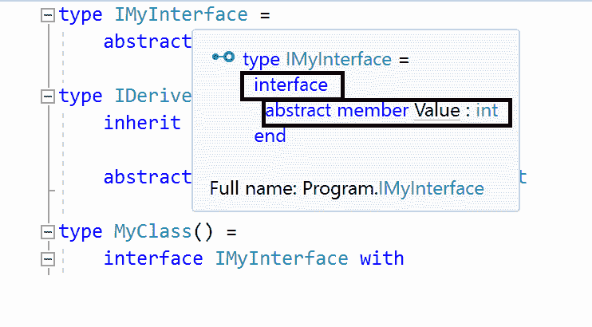

`override` 关键字用于覆盖基类的实现；要使用相同成员的基类实现，我们使用 `base` 关键字。

在 F# 中，接口可以继承自另一个接口。在一个类中，如果我们使用接口构造，我们必须在该类中实现接口的所有成员。通常，不可能在类实例外部使用接口成员，除非我们将实例类型向上转换为所需的接口类型。

要创建类或接口的实例，使用对象表达式语法。如果我们创建类实例并需要接口实例化的成员实现，则需要重写虚拟成员：

```cs
type IExampleInterface = 
    abstract member IntValue: int with get
    abstract member HelloString: unit -> string

type PrintValues() = 
    interface IExampleInterface with
        member x.IntValue = 15
        member x.HelloString() = sprintf "Hello friends %d" (x :> 
        IExampleInterface).IntValue

let example = 
    let varValue = PrintValues() :> IExampleInterface
    { new IExampleInterface with
        member x.IntValue = varValue.IntValue
        member x.HelloString() = sprintf "<b>%s</b>" 
        (varValue.HelloString()) }

printfn "%A" (example.HelloString())
```

# 异常处理

在 F#中，使用`exception`关键字创建自定义异常；这些异常遵循 Microsoft 最佳实践，例如提供的构造函数、序列化支持等。关键字`raise`用于抛出异常。除此之外，F#还有一些辅助函数，如`failwith`，它在 F#运行时抛出失败异常，以及`invalidop`、`invalidarg`，分别抛出.NET Framework 标准类型无效操作和无效参数异常。

`try`/`with`用于捕获异常；如果表达式或评估值时发生异常，则可以在值评估的右侧使用`try`/`with`表达式，并将值赋回某个其他值。`try`/`with`还支持模式匹配以检查单个异常类型并从中提取项。`try`/`finally`表达式处理取决于实际的代码块。让我们用一个声明和使用自定义异常的例子来说明：

```cs
exception MyCustomExceptionExample of int * string
   raise (MyCustomExceptionExample(10, "Error!"))
```

在之前的示例中，我们使用`exception`关键字创建了一个名为`MyCustomExceptionExample`的自定义异常，传递了我们想要传递的值字段。然后我们使用`raise`关键字来引发异常，传递我们希望在应用程序运行或抛出异常时显示的值。然而，如图所示，在运行此代码时，我们没有在我们的自定义消息中看到错误值，而是显示了标准的异常消息：

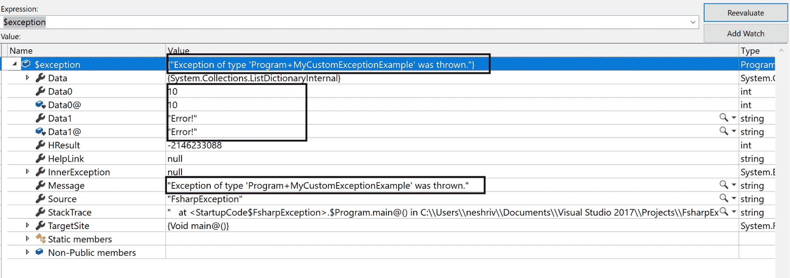

我们可以在之前的屏幕截图中看到异常消息不包含我们传递的消息。为了显示我们的自定义错误消息，我们需要在异常类型上重写标准消息属性。我们将使用模式匹配赋值来获取两个值并将实际类型向上转换，这是由于异常对象的内部表示。

如果我们再次运行此程序，我们将在异常中看到自定义消息：

```cs
exception MyCustomExceptionExample of int * string
 with
        override x.Message = 
            let (MyCustomExceptionExample(i, s)) = upcast x
            sprintf "Int: %d Str: %s" i s

 raise (MyCustomExceptionExample(20, "MyCustomErrorMessage!"))
```

现在，我们将得到以下错误信息：

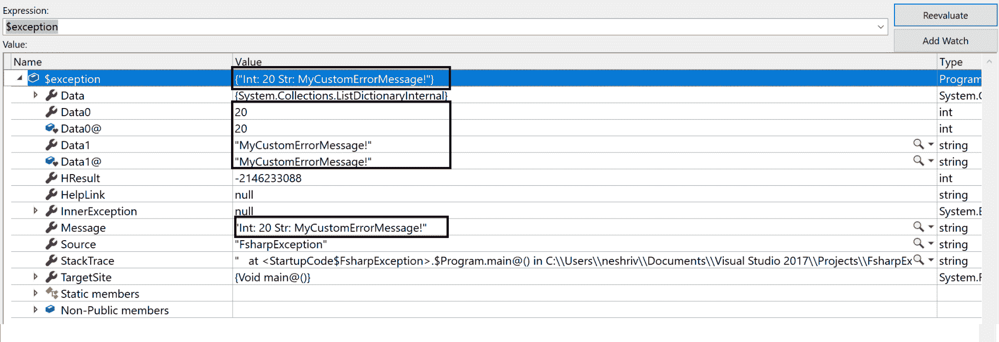

在之前的屏幕截图中，我们可以看到输出中包含了整数和字符串值的自定义消息。我们还可以使用辅助函数`failwith`来引发失败异常，因为它将我们的消息作为错误消息包含在内，如下所示：

```cs
failwith "An error has occurred"
```

之前错误信息可以在以下屏幕截图中看到：

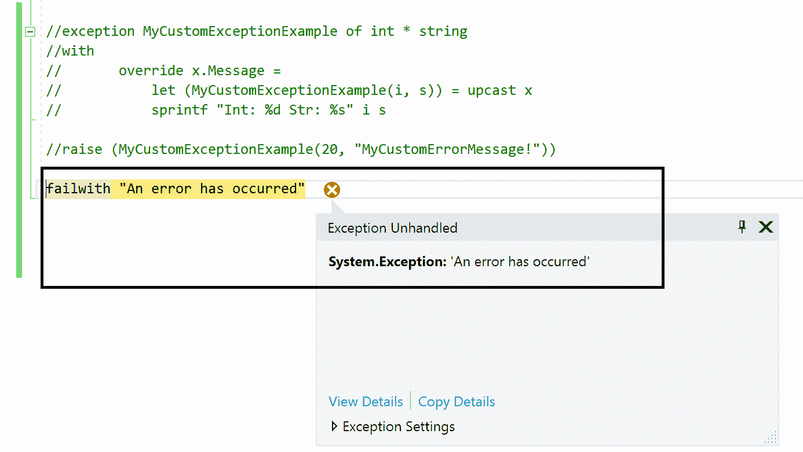

这里是一个详细的异常屏幕截图：

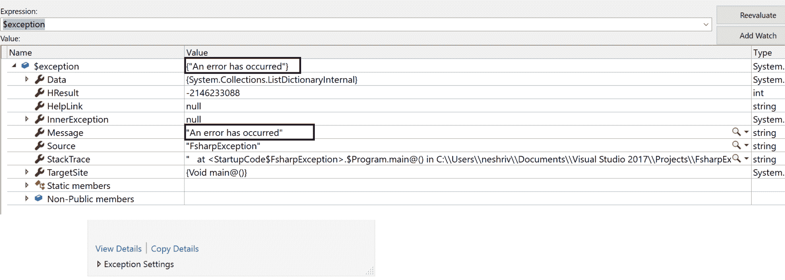

下面是`invalidarg`辅助函数的一个例子。在这个阶乘函数中，我们检查`x`的值是否大于零。对于`x`小于`0`的情况，我们调用`invalidarg`，将`x`作为无效的参数名称传递，然后传递一些错误信息，说明值应该大于 0。`invalidarg`辅助函数从.NET 标准系统命名空间抛出一个无效参数异常：

```cs
let rec factorial x = 
    if x < 0 then invalidArg "x" "Value should be greater than zero"
    match x with 
    | 0 -> 1
    | _ -> x * (factorial (x - 1))
```

# 使用 F#的数据访问层

F#类型提供者功能提供了访问不同类型数据的灵活性，例如数据库、结构化类型（即 JSON、XML、CSV、HTML）和 Web 规模数据。

首先，让我们看看数据访问资源。

# CSV、HTML、JSON 和 XML 数据

在 F#应用程序和脚本中，`FSharp.Data.dll`用于实现访问数据的功能。它也适用于结构化文件格式，如 JSON、XML，以及消费 freebase 服务。使用样本文档结构进行类型安全的文档访问；它作为一个类型提供者，就像 CSV 类型提供者一样，接受 CSV 样本作为输入并为此样本创建列格式数据。

# 提供者

F#支持不同类型的提供者，例如：

+   `HtmlProvider<>`

+   `JsonProvider<>`

+   `XmlProvider<>`

+   `WorldBankDataProvider<>`

+   `CsvProvider<>`

让我们讨论其中之一，例如，CSV 类型提供者。`FSharp.Data` NuGet 包包含`CsvProvider`。我们可以传递一个`.csv`文件并读取其他`.csv`文件；例如，我们创建了一个`.csv`文件如下：

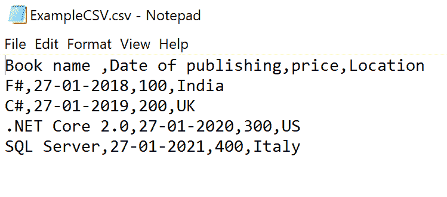

现在，我们有一个我们想要读取的另一个`.csv`文件：

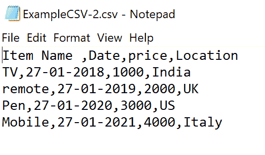

这里是一个代码片段：

```cs
open FSharp.Data

  type Books = CsvProvider<"..\ExampleCSV.csv">
  let Saleitems = Books.Load("..\ExampleCSV-2.csv")
  let firstRow = Saleitems.Rows |> Seq.head
```

让我们看看 F#编译器为`Salesitem`计算了哪些值，因为传递了`ExampleCSV`文件，例如：

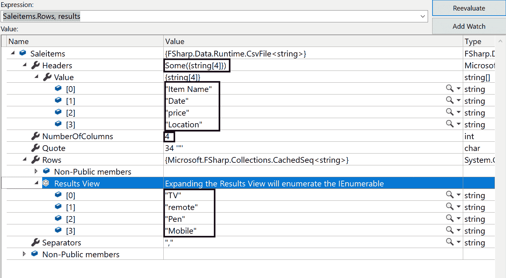

在这里，我们可以看到编译器能够检测到标题名称，并从第二个`.csv`文件中获取它。我们可以通过使用`CsvProvider`的`InferRows`静态参数自定义列类型。要使用整个文件，我们可以传递`0`。如果文件的第一行不是标题，则我们可以将`HasHeaders`静态参数值传递给`false`，例如：

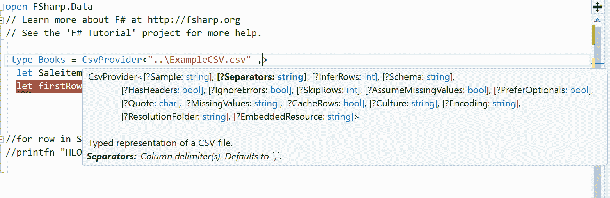

`FSharp.Data`库还包含解析 JSON、HTML 文件和发送 HTTP 请求的辅助函数。它在 NuGet 上可用，名称为`FSharp.Data`。

JSON.NET 是.NET 的 JSON 框架。它完全支持 F#从 JSON 进行序列化和反序列化。我们可以通过使用 NuGet 命令安装：

```cs
Install -Package Newtonsoft.Json
```

# 数据访问工具

我们之前讨论了数据类型提供者。F#还支持动态 API，以实现更快和动态的数据检索。它包含 CSV、HTML、JSON 解析器，以及 HTTP 请求解析的工具。让我们简要地讨论每个：

+   **CSV 解析器**：为了动态访问数据，我们可以使用 CSV 解析器。前面提到的 CSV 提供程序是在 F# CSV 解析器之上构建的。`FSharp.Data`命名空间中的`CsvFile`类型提供了两种加载数据的方法：`Parse`方法用于字符串数据，`Load`方法用于从文件或任何网络源（例如：`CsvFIle.Load(<file path>)`）读取数据。

+   **HTML 解析器**：它将 HTML 文档解析成 DOM。当它被解析成 DOM 时，F#支持许多针对 HTML DOM 元素的扩展函数，以从网页中提取信息。让我们看一个例子，我们将搜索 Google 中的`.NET Core`并解析第一个搜索结果页面，获取所有 URL 和超链接：

```cs
open FSharp.Data
let resultsDocument = HtmlDocument.Load("http://www.google.co.in/search?q=.NET Core")
```

在前面的代码中，使用`HtmlDocument.Load()`，我们将网页解析成 DOM。`resultsDocument`包含页面上的所有数据，因为这个方法将进行同步网络调用。我们也可以使用该方法进行异步调用，即`HtmlDocument.AsyncLoad()`。要从结果文档中提取数据，我们首先找到所有 HTML 锚标签，然后找到所有`href`标签以获取链接及其文本：

```cs
let x =
    resultsDocument.Descendants ["a"]
    |> Seq.choose (fun x ->
           x.TryGetAttribute("href")
           |> Option.map (fun a -> x.InnerText(), a.Value())
    )
let Z =
    x
    |> Seq.filter (fun (name, url) -> 
                    name <> "Cached" && name <> "Similar" &&  
                    url.StartsWith("/url?"))
    |> Seq.map (fun (name, url) -> name, url.Substring(0, 
    url.IndexOf("&sa=")).Replace("/url?q=", ""))
    |> Seq.toArray
```

输出将显示 Google 中`.NET Core`的第一页搜索结果。结果看起来像这样：

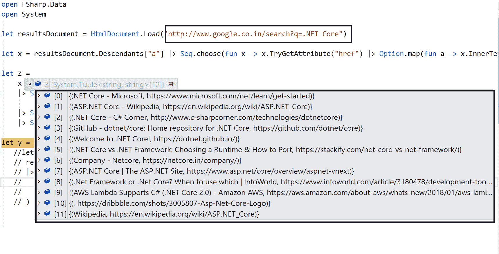

+   **JSON 解析器**：与 CSV 提供程序相同，JSON 提供程序是在 JSON 解析器之上构建的。我们需要为所有解析器使用相同的库：`FSharp.Data.dll`。它有`JsonValue`类型用于解析。以下是一个例子：

```cs
open FSharp.Data
let empInfo =
  JsonValue.Parse(""" 
    { "name": "Neha", "Company": "Microsoft","Projects": [ "Proj1",    
    "Proj2" ] } """)
```

`FSharp.Data.Extensions`支持许多扩展方法，如`value.Properties()`，并提供记录节点属性列表。

+   **HTTP 工具**：在`FSharp.Data`命名空间中，我们有 HTTP 工具，它们用于 HTTP 请求、发送数据或获取状态码等响应，既简单又快捷。HTTP 有几个重载方法，`requestString`和`AsyncRequest`或`AsyncRequestString`和`AsyncRequest`；这些可以分别同步或异步地创建简单请求。以下是一个例子：

```cs
open FSharp.Data
Http.RequestString("http://rishabhverma.net ")

// Download web site asynchronously
async { let! html = Http.AsyncRequestString("http://rishabhverma.net ")
        printfn "%d" html.Length }
        |> Async.Start

// Verifying the response:
let response = Http.Request("http://rishabhverma.net/algorithmics-science-and-art/", silentHttpErrors = true)

// Examine information about the response
response.Headers
response.Cookies
response.ResponseUrl
response.StatusCode
```

这里是结果：

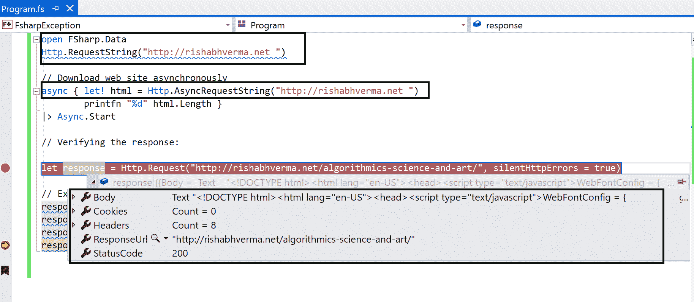

# SQL 数据访问

在 F#中，有多个用于 SQL 数据访问的库。我们可以在 NuGet 中浏览它们；以下将讨论其中的一些：

+   `FSharp.Data.SqlClient`：这个库提供了`SqlCommandProvider`，它提供了对事务 SQL 语言的类型安全访问。`SqlProgrammabilityProvider`提供了对 SQL 服务器**存储过程**（**SP**）、表和函数的快速访问，而`SqlEnumProvider`基于来自 ADO.NET 兼容源静态查找数据生成一个`enum`类型。

    要从 NuGet 安装`FSharp.Data.SqlClient`库，请使用以下命令：

```cs
PM> Install-Package FSharp.Data.SqlClient
```

+   `FSharp.Data.SQLProvider`: `SQLProvider` 是一个通用的 .NET/Mono SQL 数据库提供程序。这个库支持自动约束导航、具有身份支持的 CRUD 操作、异步操作、LINQ 查询、函数、存储过程支持、记录类型映射、.NET Core/.NET Standard 等。`SQLProvider` 对 SQL Server、SQLite、Oracle、MySQL、MSAccess、Firebird 等都有明确的实现。SQL Server 和 MS Access 不需要第三方 ADO.NET 连接器对象，其余的都需要这个。

    要从 NuGet 安装 `FSharp.Data.SqlProvider` 库，请使用以下命令：

```cs
PM> Install-Package SQLProvider
```

+   `SqlDataConnection`: `SqlDataConnection` 类型提供程序生成类型，用于在实时连接的 SQL 数据库中的数据。它是用于通过 LINQ 查询访问 SQL 的。它需要一个 Microsoft SQL 服务器。在 F# 项目中我们需要三个引用—`FSharp.Data.TypeProviders`, `System.Data`, 和 `System.Data.Linq`。以下是一个示例：

```cs
type dbSchemaExample = SqlDataConnection<"Data Source=SERVER\INSTANCENAME;Initial Catalog=MyDatabase;Integrated Security=SSPI;">

let db = dbSchemaExample.GetDataContext()
```

+   `SqlEntityConnection`: `SqlEntityConnection` 类型提供程序用于通过 LINQ 查询和 Entity Framework 访问 SQL。它与许多数据库兼容。我们需要 `System.Data.Linq`, `System.Data.Entity`, 和 `Microsoft.FSharp.Data.TypeProviders` 引用。以下是一个示例：

```cs
type private EntityConnectionExample = SqlEntityConnection<ConnectionString="Server=SERVER\InstanceName;Initial Catalog=microsoft;Integrated Security=SSPI;MultipleActiveResultSets=true",Pluralize = true>
```

+   **ADO.NET**: 它提供数据访问服务和用于编写托管代码的功能，以及为 SQL Server 和通过 OLEDB 或 XML 暴露的数据源提供一致的数据源访问。客户可以使用 ADO.NET 连接到任何数据源以检索、操作和更新数据。它可以执行所有 CRUD 操作。ADO.NET 还支持前端数据库创建、应用、工具或浏览器的中间层对象。

# 网络数据访问

`FSharp.Data` 库提供了许多类型提供程序，在 F# 中，将这些数据存储集成到编程中非常容易。可以通过 F# 的 JSON、XML 和 CSV 格式支持访问额外的网络数据存储。

# 使用 F# 查询 SQL vNext

SQL vNext 是微软针对 SQL 开源和平台无关数据库的主要发布版本。它将关系数据库的主要功能引入了 Linux：内存 OLTP、内存列存储、透明数据加密、始终加密和行级安全，使 SQL Server 成为跨操作系统的首选平台。它为我们提供了开发语言选择、本地或云选项以及操作系统选项，如 Linux（Red Hat、SUSE 和 Ubuntu）、基于 Linux 的 Docker 容器或 Windows、自适应查询处理、SQL 图、分析服务、报告服务和集成服务的改进。

它具有新的功能，如集成服务；到目前为止，SQL Server 2016 SSIS 包执行仅限于一台机器，但现在集成服务通过在多台机器上分配执行（类似于在不同服务器上的并行执行）提供了高性能的包执行。它包括：

+   **SSIS Scale Out Master**: 它用于扩展管理，并从用户那里接收包执行请求

+   **SSIS Scale Out Worker**：它从扩展的 master 中提取执行任务并在包执行上工作

在 F# 程序中，我们可以通过编写 F# 语言或使用 ADO.NET 类（如 `SqlCommand`）来使用 LINQ 查询读取数据。通常在需要简单的查询调用时使用 ADO.NET 类，但在调用存储过程时，我们必须使用 `SqlParameter` 添加多个参数。我们可以在 F# 中使用动态操作符进行动态调用。正如我们所见，提供者有辅助函数，这些函数被使用，但每个都有许多缺点。让我们讨论如何定义查询并使用参数创建辅助函数。以下是一些示例代码，用于说明：

```cs
open FSharp.Data
open System.Data.SqlClient

type SqlQueryExample =
    {
        Query : string
        Parameters : (string * obj) list
    }
```

要获取 `SqlConnection` 和其他 ADO.NET 方法，请安装 `System.Data.SqlClient` 的 NuGet 包。在前面的代码中，我们定义了一个类型 `SqlQueryExample`，其中 `Query` 是一个字符串，`Parameters` 是元组类型。我们创建了一个模块 `QueryHelpersForFsharp`，在其中我们定义了 `param`，它接受两个值，`name` 和 `value`，以及一个函数 `sqlFunction`，它接受两个参数，`query` 和 `parameters`；我们正在分配这些值：

```cs
module QueryHelpersForFsharp =

    let param name value =
        ( name, value )

    let sqlFunction query parameters =
        {
            Query = query
            Parameters = parameters
        }
```

我们可以使用前面的模块并使用 `sqlFunction` 和 `param` 参数来运行一个 `query`。`sqlFunction.query<type>` 函数将运行查询，并将每一行数据转换为指定的类型对象。`Query` 不是在执行查询代码的地方创建的，它是一段独立的代码：

```cs
open QueryHelpersForFsharp

let employeeDetail empId empName =
    sqlFunction
        """
        SELECT empId, empName
          FROM Employee
        OFFSET @EmpId ROWS
         FETCH
          NEXT @EmpName ROWS ONLY
        ;
        """
        [
            param "EmpId" empId
            param "EmpName" empName

type employeeDetail =
    {
        EmpId : int
        EmpName : string
    }

let query = employeeDetail request.EmpId request.EmpName
let EmployeeAsync = Sql.query<employeeDetail> connectString query
```

让我们通过使用 ADO.NET 函数 `FsSql` 的一个示例来查看数据插入的过程。我们将创建一个实体，它是表中的一行，并将其插入到数据库中：

```cs
open FSharp.Data
open System.Data.SqlClient
open System

type Employee() =
    member val Id = 0 with get,set

    member val EmpId = Guid.Empty with get,set
    member val JoiningDate = DateTimeOffset.MinValue with get,set
    member val LeftOrganizationOn = DateTimeOffset.MinValue with  
    get,set
    member val Name = string with get,set
    member val ReportingTo = string with get,set
    member val Salary = 0.0m with get,set
```

要插入记录，我们创建了一个类型 `changeQueryObject`，它具有字符串类型的 `query` 和 `SqlParameter` 类型的 `parameters` 列表。我们创建了一个 `private insert ()` 方法，它接受 `Employee` 数据作为输入，在这里 `query` 包含 `insert sql query` 字符串，而 `parameter` 包含 `SqlParameters` 的列表：

```cs
type changeQueryObject =
{
    query : string;
    parameters : Sql.Parameter list;
}
let private insert (employee : Employee ) =
{
    query = "INSERT INTO \"intersect\".\"Employee\"(
                         empId, joiningDate, leftOrganizationOn, name,   
                         reportingTo, salary)
             VALUES (@empId, @joiningDate, @leftOrganizationOn, @name,     
             @reportingTo, @salary);
             RETURNING id;";
    parameters = [
                 P("@empId", employee.EmpId);
                 P("@joiningDate", employee.JoiningDate);
                 P("@leftOrganizationOn", employee.LeftOrganizationOn);
                 P("@name", employee.Name);
                 P("@reportingTo", employee.ReportingTo);
                 P("@salary", employee.Salary);
             ]
}
```

要执行此操作，请编写以下代码：

```cs
let executeScalar (queryObj : changeQueryObject) = sql.ExecScalar queryObj.query queryObj.parameters
```

# 摘要

在本章中，我们讨论了函数式编程及其特性，如高阶函数、纯度、惰性求值、柯里化等。我们学习了 F# 的基础知识，如类、`let` 和 `do` 绑定、泛型类型参数、F# 中的属性、如何在 F# 中编写函数和 lambda 表达式、异常处理等。我们还看到了 F# 中的不同类型的数据提供者以及不同类型的数据解析器的工作方式。我们还学习了如何使用 F# 查询 SQL vNext。这使我们接近本书的结尾，但我们的学习之旅才刚刚开始。
