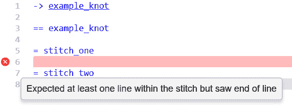
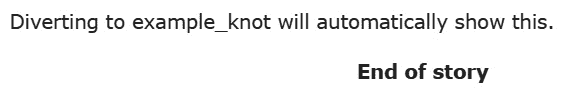
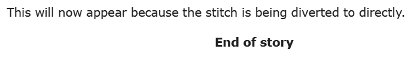
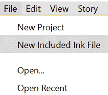
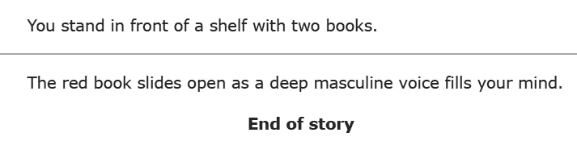
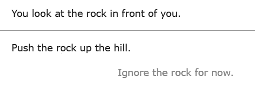
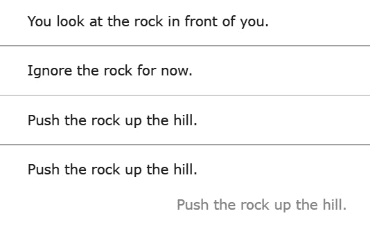
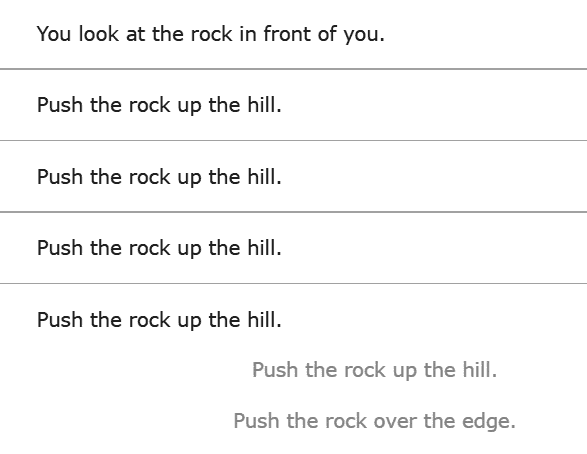

# 第二章：*第二章*: 节点、转向和循环模式

本章介绍了节点的概念，即墨水故事的章节，以及转向，这是在它们之间移动的功能。然后我们将进入定义和移动到节点以创建简单的循环模式。通过结合选择（在*第一章*，*文本、流程、选择和编织*中介绍），我们将看到您如何开始体验由选择选项、故事在节点之间移动以及使用循环模式从墨水中的简单规则构建复杂交互的叙事。

本章将涵盖以下主要主题：

+   将流程打结

+   在部分之间移动

+   循环节点

+   检测和更改选项

# 技术要求

本章中使用的示例，在`*.ink`文件中，可以在 GitHub 上找到，网址为[`github.com/PacktPublishing/Dynamic-Story-Scripting-with-the-ink-Scripting-Language/tree/main/Chapter2`](https://github.com/PacktPublishing/Dynamic-Story-Scripting-with-the-ink-Scripting-Language/tree/main/Chapter2)。

# 将流程打结

在*第一章*，*文本、流程、选择和编织*中，选择被解释为能够将故事分支到不同的部分。展示了简单的分支结构，但故事中的移动是从一个编织到另一个的流动。当在墨水中给部分命名时，它成为其核心概念之一：一个`==`)和节点名称的单行。在此定义之后，直到遇到下一个节点之前的每一行都成为原始节点的一部分。通过给部分命名，它们可以在墨水中导航，为读者创造更复杂的叙事体验。

## 创建节点

物理书籍通常分为章节。使用节点，数字墨水故事也可以分为不同的部分。虽然小说或教科书可能根据单词*章节*来命名部分，但数字故事可以超越这些限制，使用地点、角色或其他更抽象的故事划分。

例如，基于侦探与犯罪的不同嫌疑人交谈的墨水故事可能会根据其角色将其分成不同的节点，如下面的代码片段所示：

```cs
The detective considered the suspects in front of her.

== lady_taylor

== lord_davies

== sir_jones

== lady_turner
```

墨水中的节点名称必须遵循以下三个具体规则，如下所述：

+   它们可以包含数字。

+   它们可以包含大写和小写字母。

+   允许的唯一特殊符号是下划线。

节点名称中不能使用空格。没有空格来分隔单词，节点名称通常使用小写字母书写，名称、单词或其他重要细节之间用下划线分隔。

## 在节点之间转向

创建节点本身如果没有一种方法在它们之间移动，就几乎没有用处。在 ink 中，在节点之间移动被称为 `-`) 和一个大于号 (`>`)。这个组合 `->` 指示流程将移动到下一个节点，如下面的代码片段所示：

```cs
-> example_knot

== example_knot
Some content.
```

一旦定义，节点就可以被同一故事中的任何其他代码访问。在采用节点的 ink 故事中，代码的第一行是转换操作并不罕见。

## 使用 DONE 和 END

在 *第一章* 中关于“*流程*”概念介绍的 *《文本、流程、选择和交织》* 一文中，提到了所有三个之前章节中的代码示例共有的一个特定错误。因为在不同节点之间转换引入了创建复杂叙事的可能性，墨水需要知道故事至少有一个结局才能停止故事 *继续进行*。为了帮助墨水在故事即将结束时发出信号，所有故事都内置了两个名为 `DONE` 和 `END` 的节点。与使用小写字母和——经常——下划线的其他节点不同，这些节点使用大写字母编写。

`DONE` 和 `END` 之间的区别在于它们的用法。当故事转换到 `DONE` (`-> DONE`) 时，它表示当前流程的结束，但不是故事的结束。然而，`END` 表示所有可能流程的结束，并完全结束一个故事。使用 `DONE` 允许创建新的流程结构。`END` 停止故事，不允许发生其他任何事情。

任何转换到非 `DONE` 或 `END` 节点的 ink 故事，都必须在某个时刻转换到其中一个节点，否则故事将无法使用。回到本章前面提到的 `example_knot` 的使用，一个可用的代码形式会是这样的：

示例 1

```cs
-> example_knot
== example_knot
Some content.
-> DONE
```

在 Inky 中，每条输出末尾显示的短语`End of story`是使用特殊的节点 `END`。如果没有内容显示，故事已经结束。在 ink 的术语中，它已经转换到了 `END`。以下是显示这一点的屏幕截图：

![Figure 2.1 – End of story![Figure 2.1 – End of story 图 2.1 – 故事结束# 在部分之间移动节点允许作者将 ink 故事划分为他们可以命名的部分。转换操作允许在这些节点之间移动。在 *第一章* 的 *《文本、流程、选择和交织》* 中，使用星号 (`*`) 和分支故事的能力引入了选择。将转换作为选择的结果允许作者制作一个交织，一组选择，其中每个选择都可以转换到不同的节点。例如，回到本章前面提到的侦探示例，一个带有选择的更新版本，每个选择都会转换到角色的节点，看起来会是这样：示例 2```csThe detective considered the suspects in front of her.* Lady Taylor    -> lady_taylor* Lord Davies    -> lord_davies* Sir Jones    -> sir_jones* Lady Turner    -> lady_turner== lady_taylorStanding off to the side of the gathered crowd and looking out the window was Lady Taylor. She was elegantly dressed in a cream evening gown and the light from the storm outside was a stark contrast to the flowing dress and quiet form of the woman.The detective made her way over to question her.-> DONE== lord_davies"Ah! Detective!" barked the commanding voice of Lord Davies. With a drink in his hand and the red evidence of practiced drinking on his face, he began again. "Over here! I know you will want to hear what happened from me."The detective considered the man and then turned to face him.-> DONE== sir_jonesThe detective turned to the fireplace. Leaning against it was "Sir Jones." The detective knew this was a nickname for the person in front of her. They were neither of the rank "sir" in this area nor was their name "Jones." They had appeared about six months ago at parties like this one and was quite a fixture at this point. No one knew much about them other than that they went by the name "Sir Jones" now.The detective regarded them for a moment and headed over.-> DONE == lady_turnerLady Turner had been crying. The evidence of sorrow was etched into the drying black edges of her makeup at the bottom of her eyes as she tried to clean up her face. As the detective looked over, Lady Turner caught her eye and seemed to communicate how much she did not like to show the evidence of crying on her face and was trying to clear it quickly.The detective walked to her and sat down.-> DONE```在更新版本中，增加了一个*编织*。其中每个选择都会立即转向与一个字符匹配的结点。在结点内部，使用内置的 `DONE` 结点来让墨水知道在结点内容之后应该停止流程。在新代码中，仅使用选择、转向和结点的三个概念就创建了一个更复杂的故事。## 结点和针脚结点允许墨水故事被分成不同的部分。在结点内部，可以添加额外的子部分，称为 `=`) 和其名称。针脚遵循与结点相同的命名规则：它们可以包含数字、字母和下划线，但不能使用任何其他特殊字符。针脚也仅可以出现在现有的结点内部。返回到 `example_knot` 代码，可以添加两个针脚，如下所示：```cs-> example_knot== example_knot= stitch_one= stitch_two```流程在结点处“跑出”的常见错误也适用于针脚。作为故事的一部分，它们也必须转向另一个结点或针脚，或者使用内置的结点来停止流程或故事。在下面的屏幕截图中，你可以看到一个在针脚中流程跑出的例子：

图 2.2 – 示例针脚中流程跑出的错误

结点中的第一个针脚是此错误的例外。故事将自动从结点流向第一个针脚。以下给出了一个修正后的示例，考虑到流向第一个针脚并包括额外的转向：

示例 3

```cs
-> example_knot
== example_knot
= stitch_one
Diverting to example_knot will automatically show this.
-> DONE
= stitch_two
-> DONE
```

这将是输出：



图 2.3 – 从 example_knot 转向的 Inky 输出

作为墨水故事的自身子部分，针脚也可以直接访问。转向结点内部的针脚遵循 `.`)，它用于转向名称和其中针脚之间的名称。

直接转向前一个代码顶部中的 `stitch_two` 会产生以下代码：

示例 4

```cs
-> example_knot.stitch_two
== example_knot
= stitch_one
Diverting to example_knot will automatically show this.
-> DONE
= stitch_two
This will now appear because the stitch is being diverted to directly.
-> DONE
```

这将是输出：



图 2.4 – 从 example_knot.stitch_two 针脚转向的墨水输出

## 在不同文件间划分故事

当将新的结点和针脚添加到单个文件中时，它们可以迅速变得非常长。为了帮助解决这个问题，墨水有一个用于组合文件的关键字：`INCLUDE`。当与墨水代码一起使用时，`INCLUDE` 关键字根据其文件名包含另一个文件。

使用 `INCLUDE` 关键字有以下两个规则：

+   它应仅用于文件顶部。

+   它不能在结点内部使用。

在 Inky 中，可以通过使用**新包含墨水文件**菜单选项向现有项目添加额外的文件，如图所示，并命名新文件：



图 2.5 – Inky 的新包含墨水文件菜单选项

使用此功能与主 ink 文件选项一起还会在现有的 ink 文件中添加一个单独的新行，如果它存在的话。例如，创建一个 `additionalFile.ink` 文件将生成一行额外的代码：`INCLUDE additionalFile.ink`。

警告

Inky 在创建包含的 ink 文件时不会自动将 `.ink` 添加到文件名中。强烈建议在使用此功能时始终添加文件类型。

每次使用 `INCLUDE` 都会将文件添加到当前项目中。这意味着这些包含文件中的任何节点和针都可以被其他任何文件访问。因为文件可以根据故事中的位置、角色或其他抽象命名，这允许作者将故事分成不同的文件，每个文件都有自己的节点和针，如下面的代码示例所示：

示例 5

```cs
INCLUDE books.ink
You stand in front of a shelf with two books.
* [Red Book]
    -> books.red_book
* [Blue Book]
    -> books.blue_book
```

在新示例中，每个选择项都会导向另一个文件中的一个针。因为 Inky 使用 `INCLUDE` 将文件组合成一个单一的项目，所以 `books.ink` 文件中的节点和针可以像所有代码都是同一个文件的一部分一样访问，如下面的代码示例所示：

示例 5 (books.ink)

```cs
== books
= red_book
The red book slides open as a deep, masculine voice fills your mind.
-> DONE
= blue_book
The blue book slowly flips open as a reluctant, feminine voice creeps into your thoughts.
-> DONE
```

在 ink 中，流程从上到下运行。从第一个文件开始，流程会显示两个选择项的交织。然后选择 `Red Book` 选项会导向另一个文件中的针，最终导向 `DONE` 特殊节点中的 `divert`，如下面的截图所示：




图 2.6 – 示例 5 中红皮书选择项的合并输出

# 循环节点

一个节点可以导向自身。这个基本概念是 ink 中高级对话和叙事结构的一个重要部分。然而，当节点导向自身或形成循环模式时，必须小心。很容易创建 **无限循环**，代码会无限循环而不会停止。为了防止这种错误，始终包含至少一个选择项的内容结束故事或打破循环是一个好主意。

通过结合选择项、分支和节点，可以创建循环结构。在这些结构中，粘性选择对于在每次循环中为读者提供一致的选择选项变得很重要。

## 循环结构

最基本的循环结构有两个选择项。第一个继续循环，第二个必须以某种方式结束故事，如下面的代码示例所示：

示例 6

```cs
You look at the rock in front of you.
-> rock
== rock
* Push the rock up the hill.
    -> rock
* Ignore the rock for now.
    -> DONE
```

选择项，那些带有星号（`*`）的，在整个故事中只能使用一次。在先前的例子中，如果选择了第一个选项，循环会重复，但第二个选项随后就会作为唯一的选择出现，如下面的截图所示：




图 2.7 – 循环一次后的 6 个选择示例

在某些故事中，随着读者在故事中的移动减少选项可能效果很好，但对于每个循环都需要相同选项的情况，则需要不同类型的选择：**粘性选择**。

## 重新访问粘性选择

在*第一章*中，介绍了*文本、流程、选择和编织*。粘性选择作为从上到下的流程的一部分展示，且不重复任何部分，当时似乎并不太有用。然而，在循环模式中使用转向和结时，粘性选择通常是最佳选择类型，如下面的代码示例所示：

示例 7

```cs
You look at the rock in front of you.
-> rock
== rock
+ Push the rock up the hill.
    -> rock
+ Ignore the rock for now.
    -> rock
```

在更新的代码中，两个选项都是粘性选择。这种新代码允许重复模式和一致的编织选项，无论循环次数如何，如下面的屏幕截图所示：



图 2.8 – 示例 7 多次循环的 Inky 输出

# 检测和更改选项

结和针不是唯一能够循环的墨水概念——选项也可以这样做。它们还具有独特的检测它们是否是循环结构一部分的能力。这些特殊类型的选项被称为**标记选项**。它们创建了一个能力，可以为选项提供一个*标签*并跟踪它是否在故事中之前出现过。标签也是**变量**的一个例子：代码作为故事的一部分改变其值。

标记选项的使用使我们能够使用第二种类型的选项：`true`，如果选项显示，则该选项可见。如果不显示，则该选项被隐藏。

## 标记和条件选项

使用括号（`(` 和 `)`）包围一个名称，并在选择符号（一个加号 `+` 或星号 `*`）之后，以及选择本身的文本来创建标记选项。标记选项遵循与结和针名称相同的规则：它们可以包含数字、大写和小写字母以及下划线。它们不能包含空格或其他特殊符号。以下代码片段展示了这一点：

```cs
You look at the rock in front of you.
-> rock
== rock
+ (push) Push the rock up the hill.
    -> rock
* Push the rock over the edge.
    -> DONE
```

在新的示例代码中，为第一个选项添加了一个名为`push`的标签，并在故事中作为一个变量存在。因为它本身是选项的一部分，所以每次在故事中重新访问该选项时，其值都会增加。这允许作者测试玩家是否多次选择了相同的选项。以下代码示例说明了这一点：

示例 8

```cs
You look at the rock in front of you.
-> rock
== rock
+ (push) Push the rock up the hill.
    -> rock
* {push >= 4} Push the rock over the edge.
    -> DONE
```

在最新的更改中，还添加了一个条件选项，使用大括号（`{` 和 `}`）包围变量和值之间的比较。在新代码中，当故事开始时，读者可以选择`推石头上山`选项。当他们这样做时，该选项标签的值也会增加。一旦其值至少为`4`，第二个选项就会变得可用，读者可以将石头推到边缘，如下面的屏幕截图所示：



图 2.9 – 在示例 8 中选择四次将石头推上山的情形

条件和标记选项也可以结合使用。然而，它们出现的顺序很重要。标记必须出现在条件选项之前。它们不能以其他顺序出现，如下面的代码示例所示：

示例 9

```cs
You look at the rock in front of you.
-> rock
== rock
+ (push) {push < 6} Push the rock up the hill.
    -> rock
* {push >= 6} Push the rock over the edge.
    -> DONE
```

在新的示例代码中，当故事开始时，读者只能看到一个选项。他们必须做出相同的选项六次，然后第一个选项才会被移除，第二个选项才会变得可用。一旦读者选择了这个选项，故事最终结束。

## 构建动态编织

粘性选择使得选项能够在通过转向相同节点创建的循环中保持。标记和条件选项允许在故事中满足某些条件后跟踪和显示某些选项。使用所有这些概念，动态编织成为可能，如下面的代码示例所示：

示例 10

```cs
You pause to double-check check the folder again. Yes, you have all the evidence here.
You nod at your partner and he enters the other room. You take a breath and open the door.
The suspect sits in front of you. As you take a seat, she turns to look at you.
-> interrogation
== interrogation
+ (knife) {knife < 1} [Ask about the knife]
    The suspect shakes their head. "I don't know nothing!"
    -> interrogation
+ (knife_again) {knife == 1 && knife_again < 1} [Ask about the     knife again.]
    You take a picture of the knife out of the folder and put       it down on the table without saying another word.
    -> interrogation
+ (knife_once_again) {knife_again == 1 && knife_once_again < 1} [Ask about the knife one more time.]
    "Yes. Fine. It's mine," the suspect replies and crosses       her arms. Looking at them, you notice the slight cuts on        the underside of her arm.
    -> interrogation
+ (cuts) {knife_once_again == 1 && cuts < 1} [Ask about the   cuts on her arm.]
    You point to the cuts on her arms. 
    She shrugs. "It was an accident."
    You frown and point at the knife.
    "It's my knife, yes," she says, looking away.
    -> interrogation
+ {cuts == 1} [Take out the picture of the gun next.]
    "This is not yours, though," you say, taking out the       picture.
    She does not look back.
    "He attacked you. And not for the first time," you say       and point to the older scars still visible. "You finally         had enough. You shot him."
    She still looks away, but you can see her shoulders slump.       She knows that you know. 
    -> DONE
```

在新代码中，使用复杂的标记和条件选项组合来跟踪在审问嫌疑人时的信息。做出一个选择会按顺序解锁下一个，因为流程会循环回相同的节点，随着信息的逐渐解锁，读者通过每次做出一个选择来学习更多。

注意

*示例 10* 中的一些条件选项使用两个和号 `&&`。这被称为 `true`，它检查下一个。如果两者都为真，整个组合就为真。

在下一章中，我们将介绍创建信息序列的更简单的方法，以及介绍将随机性引入创建文本和选项。与使用转向和节点不同，墨水提供了更简单的功能来完成相同的一般操作，并且每次使用节点时都明确地构建重复。

# 摘要

本章向您介绍了节点，故事的部分，以及转向，这些是它们之间移动的方式。我们探讨了使用 `DONE` 和 `END` 作为内置节点来结束流程（`DONE`）和完全停止故事（`END`）的用法。然后讨论了缝合，节点的子部分，以将故事分解成更多的部分。我们了解到可以使用 `INCLUDE` 关键字将故事分解成单独的文件，并将其作为同一项目的一部分 *包含*。

节点可以转向自身。正如我们所看到的，这是创建循环结构的关键，在这种结构中，可以使用其他概念，如标记和条件选项，并将它们结合起来。标记允许我们创建变量来跟踪一个选项被显示的次数。然后，标记选项进一步发展到使用条件选项，测试在循环结构中使用时一个选项被选择的次数。最后，我们通过使用循环结构，其中每个选择都改变了标签的值并按顺序解锁每个选择，来制作动态编织。

在下一章中，我们将基于结和分叉的概念进行构建。通过导航到故事的不同部分，可以展示不同的文本，或者在多个循环中，一个 ink 概念，使得在故事中或因为多个循环，不同的选择成为可能。这允许 ink 对读者重新访问结和选项做出反应，以展示不同的内容。

# 问题

1.  什么是结？

1.  `DONE`和`END`之间的区别是什么？

1.  缝合是什么？

1.  如何在 ink 中使用`INCLUDE`？

1.  标记选项和条件选项之间的区别是什么？
