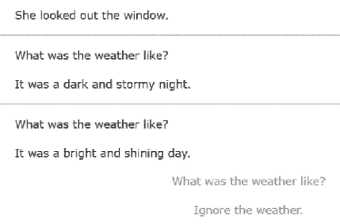
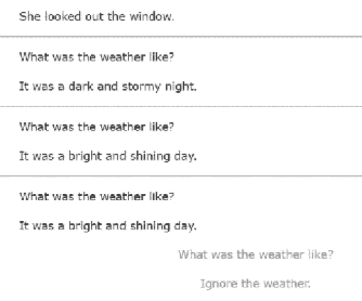
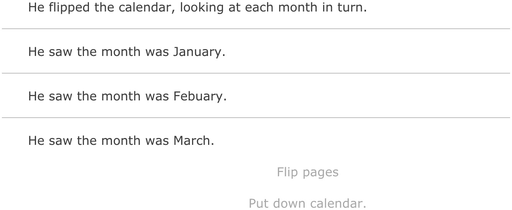
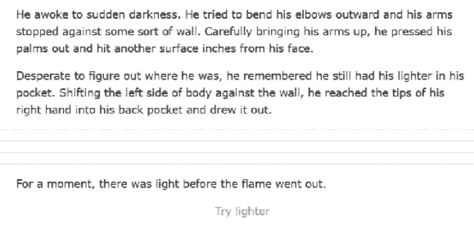
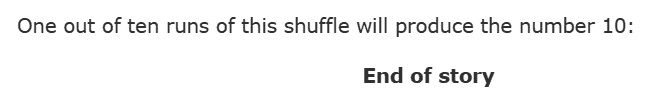
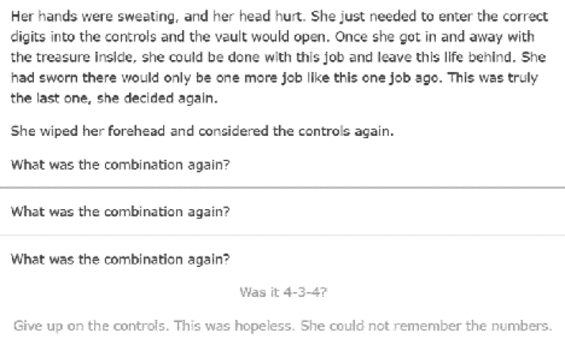
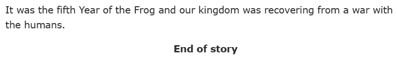

# *第三章*：序列、循环和文本洗牌

本章介绍了**替代方案**的概念，这是引入额外文本的可编程方式，以及可以响应循环的高级代码。我们将依次介绍每种替代方案类型（**序列**、**循环**和**洗牌**），并探讨它们如何在 ink 中的循环结构中结合使用。接下来，我们将检查**多行替代方案**，这是基于创建它们的替代方案类型定义更复杂结构的功能。最后，我们将以**嵌套替代方案**结束本章，这是在彼此内部使用一个或多个替代方案。

在本章中，我们将涵盖以下主要主题：

+   使用替代方案

+   创建多行替代方案

+   嵌套替代方案

# 技术要求

本章中使用的示例，在`*.ink`文件中，可以在 GitHub 上找到：[`github.com/PacktPublishing/Dynamic-Story-Scripting-with-the-ink-Scripting-Language/tree/main/Chapter3`](https://github.com/PacktPublishing/Dynamic-Story-Scripting-with-the-ink-Scripting-Language/tree/main/Chapter3)。

# 使用替代方案

在**第二章**（B17597_02_Final_PG_ePub.xhtml#_idTextAnchor031）中，*结点、转向和循环模式*，使用开括号`{`和闭括号`}`表示条件选项的使用。在标签和条件之间，选项可以变得动态，并能够根据读者的选择在循环之间做出反应。然而，大括号不仅用于条件选项。在 ink 中，它们还表示任何**代码**的使用，而最常见的一种代码形式是使用`|`。根据使用的替代方案类型，可以产生不同的文本效果。

## 序列

第一个和默认的替代方案是一个**序列**。正如其名称可能暗示的那样，序列是一系列值。它们根据其名称，*按顺序*访问：

示例 1：

```cs
It was a {dark and stormy night|bright and shining day}.
```

在**示例 1**中，使用了一个序列。它有两个元素，`dark and stormy night`和`bright and shining day`，它们之间有一个垂直条。首次运行时，序列将生成以下输出：

```cs
It was a dark and stormy night.
```

在序列中，任何第一个元素之后的元素只有在序列运行多次时才会显示。换句话说，包含多个元素的序列最好在循环结构中使用：

示例 2：

```cs
She looked out the window.
-> weather
== weather
+ What was the weather like?
    It was a {dark and stormy night|bright and shining day}.
    -> weather
* Ignore the weather.
    -> DONE
```

通过回到结点，`weather`，创建了一个循环。这允许序列的第二元素在第二个循环中显示：




图 3.1 – Inky 屏幕截图，显示示例 2 中的两个元素

如果序列中包含新元素，则序列会继续。一旦序列到达其末尾，它将停止在最后一个元素上。在**示例 2**中，选择`bright and shining day`选项将再次显示：




图 3.2 – Inky 屏幕截图显示示例 2 中的重复元素

重要提示

*示例 2* 遵循在 *第二章**，节点、分支和循环模式* 中建立的模式，有两个选择。第一个循环结构，第二个打破它。创建循环时始终使用选择，以避免创建无法结束的循环！

序列最好用于用户可能会耗尽一系列元素并最终停留在最后一个元素的情况。当需要重复序列时，使用不同的概念：**循环**。

## 循环

如同序列，`&` 在集合的第一个元素之前。这告诉 ink *循环* 元素，并在最后一个元素之后返回到第一个：

示例 3：

```cs
He flipped the calendar, looking at each month in turn.
-> calendar
== calendar
+ [Flip pages]
    He saw the month was {&January|February|March|April|May|      June|July|August|September|October|November|December}.
    -> calendar
* Put down calendar.
    -> DONE
```

在 *示例 3* 中，循环结构重新运行周期，遍历所有月份然后 *循环* 回到第一个元素：



图 3.3 – Inky 屏幕截图显示示例 3 循环中的所有元素

所有替代方案都可以包含空元素。对于循环，任何空白元素都计入总数。可以创建一个循环，只有在经过一定次数的循环后才会显示元素：

示例 4：

```cs
He awoke to the sudden darkness. He tried to bend his elbows outward and his arms stopped against some sort of wall. Carefully bringing his arms up, he pressed his palms out and hit another surface inches from his face.
Desperate to figure out where he was, he remembered he still had his lighter in his pocket. Shifting the left side of his body against the wall, he reached the tips of his right hand into his back pocket and drew it out.
-> lighter
== lighter
+ [Try lighter]
    {&|||For a moment, there was light before the flame went out.}
    -> lighter
```

使用循环与空元素结合可以非常有效地创建一种情况，即读者必须多次采取行动后才能发生结果。在 *示例 4* 中，循环由多个空元素通过竖线分隔。最后一个元素，`For a moment, there was light before the flame went out.`, 只有在读者选择 **尝试更轻的火柴** 四次之后才会显示：



图 3.4 – Inky 屏幕截图显示示例 4 使用空元素的情况

## 洗牌

`~` 出现在集合的第一个元素之前：

示例 5：

```cs
The lucky number for today is {~1|2|3|4|5|6|7|8|9|10}.
```

与序列和循环不同，洗牌不按顺序显示其元素。结合之前循环中显示的空元素，选择元素的几率始终与元素总数一致。这意味着要创建一个其中某个元素在 10 次运行中显示 1 次的洗牌，代码如下：

示例 6：

```cs
One out of ten runs of this shuffle will produce the number 10: {~|||||||||10}
```

在 *示例 6* 中，元素 `10` 有 10% 的出现概率。大多数运行（90%）不会看到它，为那些在故事内容叙述体验中遇到此事件的用户创造一个独特的时刻：



图 3.5 – Inky 屏幕截图显示示例 6 中不包含元素 10 的输出

# 创建多行替代方案

序列、循环和洗牌可以使用一行代码来编写。然而，所有这些替代方案也可以使用它们的多行形式来编写。对于这些中的每一个，仍然使用大括号，但每个元素都在它自己的行上，前面有一个连字符，`-`。

## 多行循环

要创建多行循环，使用关键字 `cycle` 并带有冒号，`:`，并且每个元素都在它自己的行上：

示例 7:

```cs
He flipped the calendar, looking at each month in turn.
-> calendar
== calendar
+ [Flip pages]
    He saw the month was <>{cycle:
    - January
    - February
    - March
    - April
    - May
    - June
    - July
    - August
    - September
    - October
    - November
    - December
    }<>.
    -> calendar
* Put down calendar.
    -> DONE
```

任何使用多行替代方案的情况也会引入一个新的问题。因为每个元素都在它自己的行上，所以每个元素也被 ink 视为一个*行*。这意味着其输出会在行之间引入额外的间距。为了帮助解决这个问题，可以在多行替代方案和下一个文本内容之间使用**粘合剂**。

提醒

*第一章**，文本、流程、选择和交织*，介绍了**粘合剂**的概念，即使用小于和大于符号。这个概念*粘合*了一行到前一行末尾。在多行替代方案中，使用粘合剂消除了其输出与下一行内容之间的额外空间。

## 多行序列

多行循环使用关键字 `cycle`，多行洗牌使用关键字 `shuffle`。然而，多行序列使用关键字 `stopping`：

示例 8:

```cs
She looked out the window.
-> weather
== weather
+ What was the weather like?
    It was a <>{stopping:
    - dark and stormy night
    - bright and shining day
    }<>.
    -> weather
* Ignore the weather.
    -> DONE
```

多行序列也引入了它们与其单行形式之间的重要区别：可读性。多行替代方案中的每个元素都由一个新行分隔。在单行形式中，具有特别长的文本元素的序列很难区分其结束和下一个元素在替代方案中的开始：

```cs
{This is one really long line that keeps going and going just to make sure that it wraps to a new line.|This is more content as part of this second element.}
```

将代码拆分成新行，可以使代码更容易编辑和理解：

示例 9:

```cs
{stopping:
- This is one really long line that keeps going and going to make sure that it wraps to a new line.
- This is more content as part of this second element.
}
```

# 嵌套替代

序列、循环和洗牌都可以嵌套在彼此*内部*。当这种情况发生时，组合形式就是所谓的**嵌套替代**，其中一个替代方案作为另一个替代方案的元素。

## 结合循环和洗牌

在循环结构内部，循环可以在经过一定数量的循环后重复内容非常有用。当与洗牌结合使用时，可以从洗牌中随机选择内容，然后在更大的循环中重复。例如，为了在每次循环中生成一个新的随机数，使用单个元素和多次洗牌的循环可以通过一行代码产生这种效果：

示例 10:

```cs
Her hands were sweating, and her head hurt. She just needed to enter the correct digits into the controls and the vault would open. Once she got in and away with the treasure inside, she could be done with this job and leave this life behind. She had sworn there would only be one more job like this one job ago. This was truly the last one, she decided again.
She wiped her forehead and considered the controls again.
-> combination
== combination
What was the combination again?
+ [Was it {&{~1|2|3|4|5}-{~1|2|3|4|5}-{~1|2|3|4|5}}?]
    -> combination
* Give up on the controls. This was hopeless. She could not    remember the numbers.
    -> DONE
```

*示例 10* 使用了一个循环和三次洗牌。每次循环运行时，循环会重新运行。只有一个元素时，它会再次*循环*并重新运行洗牌，每次洗牌都会从一到五中随机选择一个数字。这会产生在每个循环中为每个循环生成一个新的三位数的效果：



图 3.6 – 显示示例 10 中循环的随机三位数的 Inky 截图

*示例 10*中的代码还演示了关于 ink 中可选方案工作方式的一个以前未明确说明的问题。可选方案元素通常具有文本内容，选项是从选择文本中创建的。这意味着可选方案可以与选择一起使用来生成动态选项。这也意味着转向可以是可选方案的元素。

例如，可以使用一组转向操作与洗牌结合，根据读者选择的选项随机地将读者移动到不同的位置：

示例 11:

```cs
They stood before the doorway at the end of the hallway. Without knowing where it would go, they reached out.
* [Open door]
    {~-> treasure|-> back_in_hallway}
== treasure
Yes! The room was full of treasure.
-> DONE
== back_in_hallway
As the door opened, there was a flash, and they blinked several times before realizing what had happened. They were back in front of the door. No!
-> DONE
```

当运行时，*示例 11*中转向和洗牌的组合将随机选择两个可能的分支之一。读者将被转向到`treasure`或`back_in_hallway`节点。

## 洗牌洗牌

在*示例 10*和*示例 11*中，一种类型的可选方案与另一种类型结合使用。也可以嵌套相同类型的可选方案。洗牌可以嵌套在其他洗牌中，以生成高级组合结果。例如，可以通过定义可能的年份和事件来生成一个幻想王国的快速历史，然后在多行洗牌中使用单行洗牌来构建描述王国的句子：

示例 12:

```cs
It was the 
<> {shuffle:
- year {~1|2|3|4|5|6|7|8|9}{~1|2|3|4|5|6|7|8|9} of the New
    Era
- {~second|third|fourth|fifth|sixth|seventh} {~Year of the
    Frog|Year of the Snake}
   }
<> and our kingdom 
<> {shuffle:
- {~was doing well|was facing a crisis}
- {~was at war|was recovering from a war} with {~the
    giants|the elves|the humans}
   }
<>.
```

在*示例 12*中，单行洗牌的使用创建了王国的所有小细节。然后，它们被用于更大的多行洗牌中，用于主要事件。它们基于不同的元素*洗牌*在一起构建历史：



图 3.7 – Inky 展示的 Example 12 的许多可能输出之一

可选方案及其多行形式可以通过使用序列和循环来显示新内容或更改旧内容，从而非常有用，以便检测和执行循环。具有在故事中引入随机性的能力，洗牌是一种简单的方法，可以在故事中生成动态文本，如*示例 12*所示。

当结合不同类型的可选方案，例如*示例 10*中使用的那些，这些*嵌套*的可选方案可以根据每种类型单独工作的方式生成复杂的内容。然而，下一章中未涉及并介绍的是保存由可选方案生成的内容并比较值的方法。与*示例 10*中使用的叙事一样，生成一个随机的三位数是有用的，但保存并记住它更好。第四章*，*变量、列表和函数*介绍了如何保留由可选方案生成并在用户与 ink 交互时更改的值。

# 摘要

在本章中，我们探讨了看似简单的替代方案概念。在 ink 中，三种类型的替代方案是序列、循环和洗牌。每种都提供了访问其元素的不同方式。序列按顺序显示每个元素，直到最后一个。循环重复其元素，在遇到末尾后返回到第一个元素。洗牌每次运行时都会从其集合中选择一个随机元素，从而为故事引入随机性。

替代方案也可以用单行和多行形式表达。当以较长的多行形式书写时，替代方案使用一个关键字来表示其类型，并且每个元素都在单独的一行上。虽然对于作者来说更容易阅读，但我们回顾了如何注意将粘合剂融入其中，因为墨水如何解释故事中每一行的文本。

最后，我们了解到替代方案可以以嵌套形式结合。替代方案的一个元素可以是另一个替代方案。当它们一起使用时，这展示了例如循环和洗牌如何结合，每次运行时从多个洗牌中重新生成随机选择。我们还看到了如何使用替代方案中元素的文本与选择一起使用，甚至如何使转向成为替代方案的元素。

在下一章中，我们将看到如何在 ink 中创建和访问变量的值。

# Q&A

1.  ink 中有哪三种类型的替代方案？

1.  在单行形式中，元素之间使用什么特殊符号？

1.  在集合中的第一个元素之前使用什么特殊符号来创建一个循环？

1.  序列和循环之间的区别是什么？

1.  洗牌有什么独特之处？

1.  用于创建多行序列的关键字是什么？
