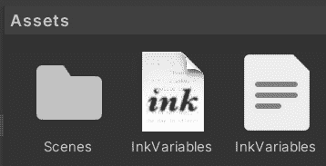
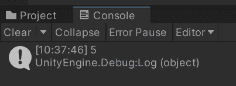
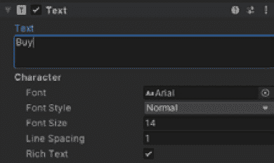
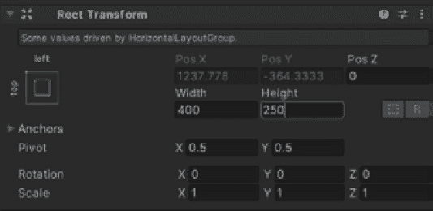
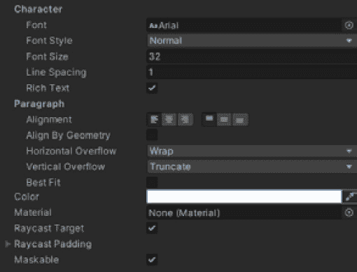

# 第八章：*第八章*：故事 API – 访问墨水变量和函数

在本章中，我们将讨论如何使用 ink Unity API 来处理变量和函数。ink 中定义的任何变量或函数都可以从其代码的任何位置访问。ink-Unity 集成插件提供的 API 通过其`variablesState`属性提供了一个接口，用于访问任何定义的变量。这也适用于由`EvaluateFunction()` API 提供的方法，它可以访问 ink 代码中定义的任何函数。理解这一功能是使用 ink-Unity 集成插件作为 ink 故事和 Unity 代码之间桥梁来创建更复杂项目的关键。

在本章中，我们将涵盖以下主要主题：

+   在故事之外更改墨水变量

+   外部调用墨水函数

+   通过变量和函数控制故事

# 技术要求

本章中使用的示例，在`*.cs`和`*.ink`文件中，可以在 GitHub 上找到：[`github.com/PacktPublishing/Dynamic-Story-Scripting-with-the-ink-Scripting-Language/tree/main/Chapter8`](https://github.com/PacktPublishing/Dynamic-Story-Scripting-with-the-ink-Scripting-Language/tree/main/Chapter8)。

# 在故事之外更改墨水变量

`VAR`关键字和初始值。在整个故事中，变量的值可以被更改。通过比较它们的值，变量也可以影响故事的流程。

在 ink 中，变量是*全局的*。一旦创建，它们可以被同一故事内的代码的任何其他部分访问。此功能也通过 ink-Unity 集成插件的一部分名为`variablesState`的命名属性传递，该插件称为`variablesState`。Ink 故事中定义的每个变量都可以通过其名称访问。

在这个主题中，我们将探讨如何使用这个属性来访问和更改运行中的 ink 故事的值。我们将首先查看如何使用`variablesState`属性，并在 ink 中比较值以控制其故事外的流程。

## 访问墨水变量

Unity 中的故事 API 提供了对 ink 变量的访问。在本节中，我们将探讨`variablesState`属性以及如何通过名称访问 ink 变量。执行以下步骤：

1.  首先在 Unity 中基于 2D 内置模板创建一个新项目。

1.  导入 ink-Unity 集成插件。

1.  添加一个新的 ink 文件，并将其重命名为`InkVariables.ink`。

    创建的文件将包含 ink 源代码。因为 ink-Unity 集成插件运行编译后的 ink 故事，所以必须在 API 可以使用之前存在故事的源代码：

    

    图 8.1 – 显示 InkVariables.ink 文件的工程窗口

1.  在 Inky 中打开`InkVariables.ink`文件进行编辑。

1.  将内容更改为`Example 1 (InkVariables.ink)`文件。

1.  保存文件并返回 Unity。

    提醒

    可以通过访问 **项目设置** 窗口来更改 ink 源文件的自动重新编译。您可以通过点击 **编辑** 然后点击 **项目设置** 来完成此操作。点击 **Ink** 然后更改 **自动编译所有 Ink** 设置可以更新此值。如果启用，插件将自动创建一个 JSON 文件。

1.  创建一个新的空游戏对象，并将其命名为 `InkStory`。

1.  在 `InkStory` 游戏对象中创建一个新的 `Script` 组件，并将新的 C# 文件命名为 `InkStoryScript.cs`。

1.  在 Visual Studio 中打开 `InkStoryScript.cs` 文件进行编辑。

1.  将 `InkStoryScript.cs` 文件更新为 `示例` `1` `(InkStoryScript.cs)`。

    更新后的代码使用 `GetVariableWithName()` 方法作为 `VariablesState` 对象的一部分。`variablesState` 属性与 ink 中的变量名称 `number_example` 一起使用，作为 `GetVariableWithName()` 方法的一部分。此外，`Debug.Log()` 方法用于在 Unity 中运行时在 **控制台** 窗口中显示变量的值。

1.  将文件与代码关联起来。您可以使用 `Script` 组件中的 `Ink JSON File` 属性来完成此操作。

1.  在 Unity 中运行项目。

    一旦项目开始运行，打开 **控制台** 窗口。将添加一条新消息：

    

    图 8.2 – 显示 ink 变量值的控制台窗口

1.  在 Unity 中停止运行的项目。

如果在 ink 的第一个文本内容之前定义了变量，它们也会在内容之前被加载。在 *示例 1* 中，正如 *步骤 8* 所示，变量的初始值可以在加载 ink 故事后立即访问。访问变量的功能与加载和显示文本内容的功能是分开的。

任何可以访问的 ink 变量也可以被更改。在下一节中，我们将发现这种功能如何是使用 Ink API 中的 `variablesState` 属性的关键，以及它如何允许你在使用 ink-Unity Integration 插件时在 Unity 中创建更复杂的项目。

## 更改 ink 变量的值

英语单词 "variable" 的意思是 *可以更改的*。一旦创建，所有 ink 变量都可以在任何时候更改。`variablesState` 属性遵循相同的模式。如果一个变量可以被访问，它的值可以被更改。

`VariablesState` 类包含多个方法，可以用来访问和更改 ink 故事中变量的值。然而，它还包含一个使用方括号和变量名称的引号表示法的简写访问运算符。通常，这种简写比直接使用方法名称来更改 `variablesState` 属性中变量的值更常用。

现在，返回到我们在 *访问 Ink 变量* 部分使用过的项目。执行以下步骤：

1.  在 Visual Studio 中打开 `InkStoryScript.cs` 文件进行编辑。

1.  将现有的代码更改为 `示例 2 (InkStoryScript.cs)`。

1.  保存文件并返回 Unity。

1.  运行项目。

    `variablesState` 属性。对这些值的任何更改都会反映在下次使用 `Continue()` 或 `ContinueMaximally()` 方法时。

1.  在 Unity 中停止运行的项目。

变量不是可以从 ink 故事外部访问的唯一值。ink-Unity Integration 插件还增加了从 Unity 调用 ink 中函数的能力。虽然访问和更改变量的值可能很有帮助，但直接在 ink 中调用函数并将值从 Unity 传递给它们通常是处理 Unity 和 ink 之间数据交换的首选方法。在下一节中，我们将回顾为什么使用函数通常是处理复杂数据或当您希望在 ink 中作为同一任务的一部分处理多个值时的更好选择。

# 外部调用 ink 函数

与变量一样，ink 中的函数也是全局的。这意味着它们可以作为同一故事中 ink 代码的一部分被访问。作为 `Story` 类提供的 Unity API 的一部分，`EvaluateFunction()` 方法根据传递给它的名称在 ink 代码中调用函数。由于 ink 中的函数是全局的，因此可以从故事外部调用它们。然而，与仅访问单个值的 `variablesState` 属性不同，一次可以向 ink 函数传递多个值。此外，`EvaluateFunction()` 方法还可以配置为在 ink 函数内部返回文本输出或任何返回的数据。

在本节中，我们将首先使用 `HasFunction()` 方法测试 ink 函数是否存在。接下来，我们将探讨 `EvaluateFunction()` 方法为何是 Unity 和 ink 之间通信时处理复杂数据或多个数据值的优选选项。最后，我们将回顾如何在 Unity 代码中使用 ink 函数的文本结果和返回数据。

## 验证和评估 ink 函数

当在 ink 中使用函数时，`HasFunction()` 方法会验证 ink 函数是否存在。请注意，在处理 ink 函数之前始终应使用它，以防止出现任何问题：

1.  在 Unity 中基于内置的 2D 模板创建一个新的项目。

1.  导入 ink-Unity Integration 插件。

1.  创建一个新的空游戏对象，命名为 `InkStory`。

1.  将 `Script` 组件添加到 `InkStory` 游戏对象中，并将墨迹文件命名为 `InkStoryFunctions.cs`。

1.  添加一个新的墨迹文件，并将其重命名为 `InkFunctions.ink`。

1.  在 Inky 中打开 `InkFunctions.ink` 文件，并将其内容更改为 `示例 4 (InkFunctions.ink)`。

1.  在 Visual Studio 中打开 `InkStoryFunctions.cs` 进行编辑。

1.  将 `InkStoryFunctions.cs` 文件更新为 `示例 4 (InkStoryFunctions.cs)`。

1.  保存 `InkStoryFunctions.cs` 文件。

1.  在 Unity 中，将 `InkFunctions.ink` 文件的编译 JSON 文件与 `InkStory` 游戏对象的 `Script` 组件中的 `Ink JSON File` 属性关联起来。

1.  运行项目。

    由于调用了两个方法`HasFunction()`和`EvaluateFunction()`，`relationship` ink 变量已被更改。`Story`类的`HasFunction()`方法返回一个布尔值。它还保证了在使用之前函数存在。

1.  停止项目。

在验证函数存在后，可以对其进行评估。`InkStoryFunctions.cs`文件中的代码使用两个方法：`HasFunction()`和`EvaluateFunction()`。在 ink API 中，术语`EvaluateFunction()`方法。

在使用`EvaluateFunction()`方法时，第一个参数是 ink 中函数的名称。任何其他参数都直接传递给 ink 函数。在作为`InkStoryFunctions.cs`文件一部分使用的代码中，`EvaluateFunction()`方法的用法包括两个参数：`increase()` ink 函数的名称以及 ink 中要增加的值量。

当使用 ink-Unity 集成插件时，从 Unity 调用墨水功能来更改值是一种非常常见的模式。在这种情况下，ink 中的`increase()`函数更新 ink 内部的`relationship`值。这允许 ink 值通过 ink 函数进行调整。在 Unity 中工作时，可以根据为这些任务定义的 ink 函数，将值传递给 ink 以执行多个任务，而无需在 Unity 侧添加额外代码。

ink 函数是故事的特殊部分。这意味着它们还可以与其他与代码相关的操作一起产生文本输出。但是，要使用`EvaluateFunction()`方法获取 ink 函数的文本输出，需要在 C#中使用一个特殊的关键字：`out`。我们将在下一节中了解更多关于这个关键字的信息。

## 获取 ink 函数文本输出

C#编程语言允许您定义一个变量，然后将其传递给一个方法。在方法内部，预期变量的值将发生变化。请注意，这不会是传递给方法的值的变化，而是变量本身包含的值的变化。更普遍地说，在编程中，这被称为通过引用传递。不是将一些数据传递给方法，而是传递一个引用（即找到变量以存储值的位置）。

在 C#中，可以使用`out`关键字与方法的参数一起使用，以指定变量（而不是其值）应该通过引用传递。这意味着当方法完成其操作后，传递给方法的变量中的值将发生变化。在 C#中，使用`out`关键字允许开发人员指定他们想要从方法中获取值并将其放入特定变量中。

当使用 ink-Unity 集成插件提供的`EvaluateFunction()`方法时，如果第二个参数使用`out`关键字，该方法知道在评估过程中产生的任何文本都应该传递*出*方法并返回到变量。执行以下步骤：

1.  返回到*验证和评估 ink 函数*部分中使用的代码。

1.  将`InkStoryFunctions.cs`文件中的代码更新为`示例 5 (InkStoryFunctions.cs)`。

1.  保存更改后的`InkStoryFunctions.cs`文件。

1.  返回 Unity。

1.  播放项目。

1.  停止项目。

使用`out`关键字将`functionOut`变量作为`EvaluateFunction()`方法的参数，让 C#知道将任何文本*输出*到方法之外。因为`relationship`值是通过从 Unity 调用 ink 中的`increase()`函数内部更新的，所以它的值在 C#中的`functionOut`变量中显示为`51`。这允许它然后将值传递给`Debug.Log()`方法，并最终在**控制台**窗口中显示更新后的值。

当以这种方式使用`out`关键字与`EvaluateFunction()`方法时，任何从函数输出的文本都可以被捕获并从 ink 传递回 Unity。结合创建 ink 函数来更新 ink 值，这种对*验证和评估 ink 函数*部分中显示模式的额外更改允许你调用 ink 函数来执行 ink 相关任务。这允许 ink 关注点与 Unity 中的关注点分离。

在 ink 中，故事可以通过不同的值来控制。使用条件选项和选择性输出，可以选择显示选择文本或跟随分支。因为可以通过`variablesState`属性和`EvaluateFunction()`方法调用的函数直接访问变量值，这意味着 ink 故事可以从 Unity 中控制。在下一节中，我们将学习如何将 Unity 中的用户界面元素与 ink 变量和函数连接起来。

# 通过变量和函数控制故事

`variablesState`属性和`EvaluateFunction()`方法为开发者提供了两种访问 ink 故事中值的方式。通过使用这两种方法，故事可以通过向玩家展示的选项之外的更多方式来控制。Unity 中的用户界面元素可以附加到可以更改 ink 值的方法。

在本节中，我们将连接 ink 到 Unity。通过使用`variablesState`属性和`EvaluateFunction()`方法，我们将回顾一个代码模式，其中 Unity 提供用户界面并与 ink 函数通信，以在运行时调整和响应值。

在本主题的三个部分中，首先，我们将通过创建必要的游戏对象来准备一个 Unity 项目。接下来，我们将添加代码来控制用户界面。最后，我们将调整用户界面的展示并运行项目。

## 准备用户界面

要开始使用 Unity 按钮，需要一个新项目。为了简单起见，建议使用 2D 项目。这将允许你轻松地与界面一起工作，而无需担心透视。执行以下步骤：

1.  使用内置的 2D 模板在 Unity 中创建一个新项目，并将此项目命名为`购物之旅`。

1.  导入 ink-Unity 集成插件。

1.  创建一个名为`InkStory`的新空游戏对象。

1.  在`InkStory`游戏对象内部创建一个新的`Script`组件。将创建的 C# 文件命名为`InkStoryShopping.cs`。

1.  创建一个名为`InkShopping.ink`的新墨水文件。

1.  在 Inky 中打开`InkShopping.ink`文件进行编辑，并将其内容更改为`示例 6 (InkShopping.ink)`。

    在 Unity 中创建一个新的`Button`游戏对象。选择 Unity 中自动创建的`Canvas`游戏对象并创建第二个`Button`游戏对象，以便两个按钮都是`Canvas`游戏对象的子对象：

    ![图 8.4 – 在 Unity 中创建的按钮

    ![图 8.4_B17597.jpg]

    图 8.4 – 在 Unity 中创建的按钮

1.  再次选择`Canvas`游戏对象并创建一个`Text`游戏对象。两个按钮以及新创建的`Text`游戏对象都应该是`Canvas`游戏对象的子对象。

作为*步骤 6*部分创建的墨水文件建立了未来从 Unity 代码中调用的墨水功能。这两个按钮将作为买卖被墨水代码跟踪的库存的接口。在下一节中，我们将从设置好一切过渡到编写 Unity 代码以在接口和墨水之间创建桥梁。这将跟踪两个值：`money`和`inventory`。

## 脚本化用户界面对象

在上一节中，我们完成了创建新的 Unity 2D 项目和创建必要的游戏对象的步骤。在本节中，我们将学习如何通过在 Unity 侧添加代码将用户操作（即点击）与用户界面连接起来。然后，我们将使用 Unity 中的`EvaluateFunction()`方法与运行中的故事中的墨水功能进行通信以控制其进度：

1.  在 Visual Studio 中打开`InkStoryShopping.cs`文件进行编辑。

1.  将其内容更改为`示例 6 (InkStoryShopping.cs)`。

    在新代码中，Unity 代码中已添加了三个新方法。我们已经直接将 Unity 方法映射到墨水功能。例如，Unity 中`Sell()`方法的名称几乎与墨水功能的`sell()`名称匹配。大小写差异仅是因为每个编程环境中推荐的命名约定。

1.  将编译后的 ink JSON 文件与新的公共属性关联。将`Text`游戏对象与`Text Status`属性关联：![图 8.5 – 将 Text GameObject 与 Text Status 属性关联

    ![图 8.5 – Figure_8.5_B17597.jpg]

    图 8.5 – 将 Text GameObject 与 Text Status 属性关联

    建议

    由于两个现有的`Button`游戏对象有子`Text`游戏对象，建议您使用拖放方法将游戏对象与属性关联。这将防止关联错误的`Text`游戏对象。

1.  在 Unity 中选择`Canvas`游戏对象中的`水平布局组`组件。

1.  将`水平布局组`组件从默认的`水平布局组`组件更改为，为`Canvas`游戏对象添加布局结构。调整**子对齐**属性会改变所有子对象的起始位置，使其位于可用屏幕空间的绝对中心位置。

1.  选择`Canvas`游戏对象的子游戏对象中的第一个`按钮`游戏对象，在`按钮`游戏对象中可以关联一个或多个与它的`OnClick`用户事件相关的监听函数。当用户点击`按钮`游戏对象时，这些函数将按照它们在列表中出现的顺序被调用。

    因为`按钮`是一个`GameObject`，它只能与其他游戏对象通信。这是 Unity 理解游戏对象和它们组件之间差异的重要方面。一个`GameObject`是其他组件的*容器*，包括任何`脚本`组件。这意味着要将`按钮`游戏对象的`OnClick`用户事件连接到某个`脚本`组件中找到的代码，必须使用与该`脚本`组件关联的`GameObject`。对我们来说，这意味着`InkStory`游戏对象。

1.  将`InkStory`游戏对象与第一个`按钮`游戏对象的`On Click ()`组件关联起来。这可以通过将`InkStory`游戏对象拖放到属性上完成：

    图 8.8 – 关联 InkStory GameObject 与 On Click () 组件

    一旦一个`GameObject`与`On Click ()`组件列表中的条目关联，**无函数**下拉菜单将被启用。在此关联之后，Unity 将处理游戏对象并查找可能使用的每个可能的方法或函数。

1.  使用`InkStoryShopping.Buy`。

1.  选择`Canvas`游戏对象的子对象中的第二个`按钮`游戏对象，在`On Click ()`组件中。

1.  按照*步骤 7*和*步骤 8*将`InkStory`游戏对象与`On Click``()`组件关联起来。对于*步骤 8*，而不是使用`Buy``()`方法，选择`Sell``()`方法：

图 8.9 – 关联 InkStoryShopping.Sell() 方法

在*步骤 10*结束时，第一个`按钮`游戏对象关联到`Buy()`方法，第二个关联到`Sell()`方法。内部，这些方法正在与它们对应的墨迹函数进行通信。正如你很快会发现的那样，点击按钮将调用 Unity 方法，而这些方法反过来又会调用墨迹函数。

## 调整展示值

在本节的最后，我们将更改之前创建的用户界面游戏对象的默认值。调整这些值将帮助我们更好地理解游戏对象之间的关系，并改善与屏幕按钮交互的体验：

1.  选择`Text`游戏对象中的第一个`Button`游戏对象。

1.  将`Text`属性值从默认设置`Button`更改为`Buy`：

    图 8.10 – 更改 Text 属性

1.  选择展示的`Text`游戏对象中的第二个`Button`游戏对象。

1.  将第二个`Button`游戏对象的默认文本从`Button`更改为`Sell`。

1.  选择`Canvas`游戏对象的第三个子游戏对象，即`Text`游戏对象。确保不要选择之前步骤中更新的前两个`Text`游戏对象。

1.  将`Text`游戏对象的宽度和高度更改为`400`和`250`：

    图 8.11 – 调整 Text 游戏对象的宽度和高度

1.  将`Text`游戏对象的字体大小从默认值更改为`32`。

1.  将`Text`游戏对象的颜色从默认设置更改为白色或接近白色的颜色：

    图 8.12 – 更新 Text 游戏对象的颜色

1.  播放项目。

    播放时，最左侧将显示墨迹中`money`和`inventory`变量的更新状态。点击按钮将调用 Unity 方法，这些方法反过来将评估墨迹函数并更改运行中的墨迹故事中的值。这是一个如何通过变量和函数*控制*墨迹故事的完整示例。

1.  停止项目。

虽然创建用户界面元素和更改其属性值涉及多个步骤，但代码相对简单。在墨迹中创建了函数来调整墨迹值。在 Unity 中，创建了与墨迹函数名称匹配的方法。

本节演示了如何在墨迹中创建一个简单的购物场景，并从 Unity 中进行操作。通过了解墨迹函数的名称，Unity 中的 C#方法可以评估它们以调整值，或者在`status()`墨迹函数的情况下，检索文本输出。这还演示了如何将用户界面编程与与故事相关的代码分离。它们相互通信，但它们是在不同的上下文中编写的。

在下一章中，我们将探讨在故事中处理变量和函数的不同方法，同时继续我们分离叙事和游戏代码的趋势。然而，我们不会在 Unity 中点击按钮来触发 ink 中的函数，而是探索相反的方法。事件将在 ink 中发生并触发 Unity 中的变化。本章重点介绍了如何从 Unity 控制 ink。下一章将演示如何从运行中的 ink 故事中的事件控制 Unity 的某些部分。

# 摘要

在本章中，我们首先演示了如何通过`GetVariableWithName()`方法使用名称访问变量以及使用方括号提供的简写语法。为了完整性，解释了`variablesState`属性。然而，在大多数情况下，ink 函数应该改变 ink 的值。这有助于保持任何与这些值一起工作的代码存在于 ink 故事中，并且随着时间的推移更容易维护，我们以这个主题结束了本章。此外，我们还探讨了 Unity 中的按钮如何调用它们的方法，然后调用 ink 函数。通过使用`EvaluateFunction()`方法，我们可以访问 Unity 中的 ink 函数，要么将数据传递到项目中，要么使用 C#中的`out`关键字检索可能的文本输出。

在*第九章*“Story API – 观察和响应故事事件”中，我们将通过检查 Unity 和 ink 之间关系的一种不同方法来强调 ink-Unity 集成插件及其 API。我们不会使用 Unity 方法来调用 ink 函数，而是检查一些从 ink 控制 Unity 部分的模式。我们不需要在 Unity 中点击按钮来更改值，ink 将导致变化，然后将在 Unity 中注册。对于需要从 ink 获得更多实时反馈的项目，这些模式将是本章中所示使用`variablesState`属性和`EvaluateFunction()`方法所示方法的优选方法。

# 问题

1.  ink 中的变量是否是全局的？

1.  函数全局化对它们在 ink 中如何访问有什么影响？

1.  `Continue()`和`ContinueMaximally()`方法是否会影响 ink 中变量的值？

1.  `VariablesState`类提供了什么简写语法来根据名称访问变量？

1.  在尝试访问之前，是否应该使用 ink 函数的名称来测试它是否存在？

1.  在使用 ink-Unity 集成插件时，`out` C#关键字是如何与`EvaluateFunction()`方法一起作为 Story API 的一部分使用的？
