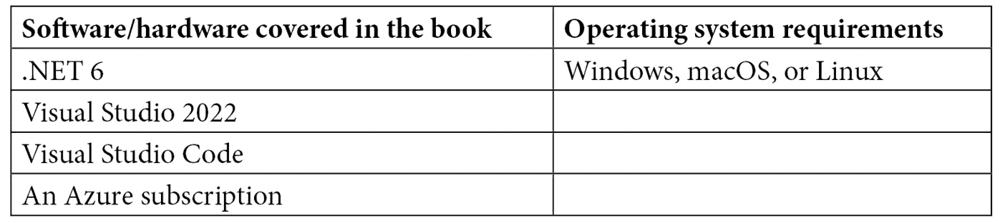

# 前言

.NET 6 是一个开源、免费的全栈框架，用于编写针对任何平台的应用程序。该框架为你提供了轻松编写应用程序的机会，包括云应用。作为软件开发者，我们肩负着构建复杂企业应用程序的责任。在这本书中，我们将学习使用 C# 10 和.NET 6 构建企业应用程序的各种高级架构和概念。

这本书可以作为在.NET 6 中构建企业应用程序时的参考。它包含了对基本概念的逐步解释、实际示例和自我评估问题，你将深入了解并接触到构建专业企业应用程序所需的.NET 6 的每一个重要组件。

# 这本书面向的对象

这本书面向的是已经熟悉.NET 经典或.NET Core 和 C#的中级到高级开发者。

# 这本书涵盖的内容

*第一章*，*设计和架构企业应用程序*，首先讨论了常用的企业架构和设计模式，然后介绍如何将企业应用程序设计为包含 UI 层、服务层和数据库的三层应用程序。

*第二章*，*介绍.NET 6 Core 和 Standard*，讨论了与.NET 6 一起发布的 C# 10 的新特性。

*第三章*，*介绍 C# 10*，从我们的认知出发，运行时是代码运行的地方。在本章中，你将了解.NET 6 运行时组件的核心和高级概念。

*第四章*，*线程和异步操作*，帮助你详细了解线程、线程池、任务以及 async/await，以及.NET 如何让你构建异步应用程序。

*第五章*，*.NET 6 中的依赖注入*，帮助我们理解依赖注入是什么以及为什么每个开发者都在涌向它。我们将学习.NET 6 中依赖注入的工作方式，并列出其他可用的选项。

*第六章*，*.NET 6 中的配置*，教你如何配置.NET 6 并在你的应用程序中使用配置和设置。你还将学习如何扩展.NET 6 配置以定义自己的部分、处理程序、提供者等。

*第七章*，*.NET 6 中的日志记录*，讨论了.NET 6 中的事件和日志 API。我们还将深入了解使用 Azure 和 Azure 组件进行日志记录，并学习如何进行结构化日志记录。

*第八章*，*关于缓存的全部知识*，讨论了.NET 6 中可用的缓存组件以及最佳行业模式和惯例。

*第九章*，*在.NET 6 中使用数据*，讨论了两种可能的数据提供程序：SQL 和关系数据库管理系统（RDBMS）等数据库。我们还将从高层次上讨论如何使用.NET 6 来存储和处理 NoSQL 数据库。本章将讨论.NET Core 与文件、文件夹、驱动器、数据库和内存的接口。

*第十章*，*创建 ASP.NET Core 6 Web API*，通过使用 ASP.NET 6 Web API 模板来开发我们的企业应用程序的服务层。

*第十一章*，*创建 ASP.NET Core 6 Web 应用程序*，通过使用 ASP.NET 6 MVC Web 应用程序模板和 Blazor 来开发我们的企业应用程序的 Web 层。

*第十二章*，*理解身份验证*，讨论了行业中最常见的身份验证模式以及您如何使用.NET 6 来实现它们。我们还将介绍如何实现自定义身份验证。

*第十三章*，*在.NET 6 中实现授权*，讨论了不同的授权方法以及 ASP.NET 6 如何让您处理它。

*第十四章*，*健康和诊断*，讨论了监控应用程序健康的重要性，为.NET 应用程序构建`HealthCheck` API，以及 Azure 应用程序用于捕获遥测信息和诊断问题。

*第十五章*，*测试*，讨论了测试的重要性。测试是开发的重要组成部分，没有适当的测试，任何应用程序都不能发布，因此我们还将讨论如何对我们的代码进行单元测试。我们还将学习如何衡量应用程序的性能。

*第十六章*，*在 Azure 中部署应用程序*，讨论了在 Azure 中部署应用程序。我们将把我们的代码提交到我们选择的源代码控制，然后 CI/CD 管道将启动并在 Azure 中部署应用程序。

# 为了充分利用这本书

您需要在您的系统上安装.NET 6 SDK；所有代码示例都已在 Windows 操作系统上的 Visual Studio 2022/Visual Studio Code 上进行了测试。建议您拥有一个活动的 Azure 订阅，以便进一步部署企业应用程序。您可以在[`azure.microsoft.com/en-in/free/`](https://azure.microsoft.com/en-in/free/)创建一个免费账户。



**如果您使用的是这本书的数字版，我们建议您亲自输入代码或从书的 GitHub 仓库（下一节中有一个链接）获取代码。这样做将帮助您避免与代码复制和粘贴相关的任何潜在错误。**

# 下载示例代码文件

您可以从 GitHub 下载本书的示例代码文件[`github.com/PacktPublishing/Enterprise-Application-Development-with-C-10-and-.NET-6-Second-Edition`](https://github.com/PacktPublishing/Enterprise-Application-Development-with-C-10-and-.NET-6-Second-Edition)。如果代码有更新，它将在 GitHub 仓库中更新。

我们还有其他来自我们丰富的图书和视频目录的代码包可供在[`github.com/PacktPublishing/`](https://github.com/PacktPublishing/)找到。查看它们吧！

# 下载彩色图像

我们还提供了一份包含本书中使用的截图和图表的彩色图像的 PDF 文件。您可以从这里下载：[`static.packt-cdn.com/downloads/9781803232973_ColorImages.pdf`](https://static.packt-cdn.com/downloads/9781803232973_ColorImages.pdf)。

# 使用的约定

本书使用了多种文本约定。

`文本中的代码`: 表示文本中的代码单词、数据库表名、文件夹名、文件名、文件扩展名、路径名、虚拟 URL、用户输入和 Twitter 昵称。以下是一个示例："`WriteMinimalPlainText`将仅输出健康检查服务的总体状态。"

代码块按以下方式设置：

```cs
app.UseEndpoints(endpoints =>
```

```cs
{
```

```cs
   endpoints.MapControllerRoute(
```

```cs
        name: "default",
```

```cs
        pattern: "{controller=Products}/{action=Index}/{id?}");
```

当我们希望您注意代码块中的特定部分时，相关的行或项目将以粗体显示：

```cs
app.UseEndpoints(endpoints =>
```

```cs
{
```

```cs
        "{controller=Products}/{action=Index}/{id?}");
```

```cs
    endpoints.MapHealthChecks("/health");
```

```cs
});
```

任何命令行输入或输出都按以下方式编写：

```cs
dotnet new classlib -o MyLibrary
```

**粗体**: 表示新术语、重要单词或您在屏幕上看到的单词。例如，菜单或对话框中的单词以**粗体**显示。以下是一个示例：“让我们在用户点击**产品详情**页面上的**添加到购物车**按钮时添加自定义事件跟踪。”

小贴士或重要提示

看起来像这样。

# 联系我们

欢迎读者反馈

**一般反馈**: 如果您对本书的任何方面有疑问，请通过 mailto:customercare@packtpub.com 给我们发邮件，并在邮件主题中提及书名。

**勘误**: 尽管我们已经尽最大努力确保内容的准确性，但错误仍然可能发生。如果您在这本书中发现了错误，如果您能向我们报告，我们将不胜感激。请访问 [www.packtpub.com/support/errata](http://www.packtpub.com/support/errata) 并填写表格。

**盗版**: 如果您在互联网上以任何形式发现了我们作品的非法副本，如果您能提供位置地址或网站名称，我们将不胜感激。请通过 mailto:copyright@packt.com 与我们联系，并提供材料的链接。

**如果您想成为作者**: 如果您在某个主题上具有专业知识，并且您有兴趣撰写或为书籍做出贡献，请访问[authors.packtpub.com](http://authors.packtpub.com)。

# 分享您的想法

一旦您阅读了《使用 C# 10 和 .NET 6 开发企业级应用程序》，我们非常期待听到您的想法！请[点击此处直接访问此书的亚马逊评论页面](https://packt.link/r/1-803-23297-8)并分享您的反馈。

您的评论对我们和科技社区都非常重要，并将帮助我们确保我们提供高质量的内容。
