# 第一章：*第一章*：设计和架构企业应用程序

企业应用程序是为解决企业组织的大规模和复杂问题而设计的软件解决方案。它们为 IT、政府、教育和公共部门的企业客户提供从订单到履行的能力。它们使企业能够通过产品采购、支付处理、自动计费和客户管理等功能，以数字化方式转型其业务。在企业应用程序方面，集成数量相当高，用户数量也非常高，因为通常这些应用程序针对的是全球受众。

为了确保企业系统保持高度可靠、高度可用和高度性能，正确的设计和架构至关重要。设计和架构是任何优秀软件的基础。它们构成了软件开发生命周期的基石；因此，首先获得正确的设计，以避免后续的任何返工，这一点非常重要，因为根据所需的变化，返工可能会非常昂贵。所以，你需要一个灵活、可扩展、可扩展和可维护的设计和架构。

在本章中，我们将涵盖以下主题：

+   常见设计原则和模式的入门指南

+   理解常见的企业架构

+   识别企业应用程序需求（业务和技术）

+   架构企业应用程序

+   企业应用程序的解决方案结构

到本章结束时，你将能够开始设计和架构企业应用程序。

# 常见设计原则和模式的入门指南

世界上每一块软件都至少解决了一个现实世界的问题。随着时间的推移，事物会发生变化，包括我们对任何特定软件的期望。为了管理这种变化并处理软件的各个方面，工程师们已经开发了几种编程范式、框架、工具、技术、流程和原则。这些经过时间考验的原则和模式已成为工程师构建高质量软件的指南星。

原则是设计时遵循的高级抽象指南。它们适用于使用的任何编程语言。它们不提供实现指南。

模式是针对重复出现的问题的经过验证、可重用的解决方案的低级具体实现指南。首先，让我们从设计原则开始。

## 设计原则

如果技术被广泛接受、实践并被证明在任何行业中都有用，那么它们就会成为原则。这些原则成为使软件设计更易于理解、灵活和可维护的解决方案。在本节中，我们将介绍 SOLID、KISS 和 DRY 设计原则。

### SOLID

SOLID 原则是美国软件工程师和讲师罗伯特·C·马丁（Robert C. Martin）推广的许多原则的一个子集。这些原则已经成为面向对象（OOP）世界中的事实标准原则，并已成为其他方法和范式的核心哲学的一部分。

SOLID 是以下五个原则的缩写：

1.  **单一职责原则**（**SRP**）：实体或软件模块应该只有一个职责。你应该避免将多个职责赋予一个实体。

图 1.1 – SRP

1.  **开闭原则**（**OCP**）：实体应该设计成这样，即它们对扩展是开放的，但对修改是封闭的。这意味着可以避免现有行为的回归测试；只需测试扩展即可。

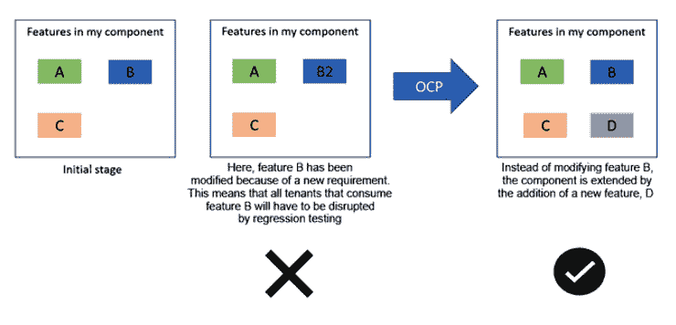

图 1.2 – OCP

1.  **里氏替换原则**（**LSP**）：父类或基类实例应该可以用其派生类或子类型实例替换，而不会改变程序的合理性。

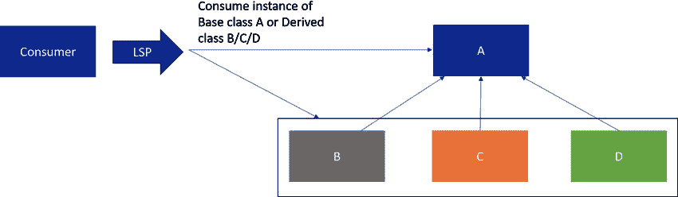

图 1.3 – LSP

1.  **接口隔离原则**（**ISP**）：而不是一个通用的一个大接口，你应该计划多个、场景特定的接口，以实现更好的解耦和变更管理：

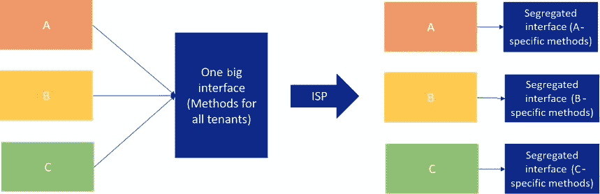

图 1.4 – ISP

1.  **依赖倒置原则**（**DIP**）：你应该避免对具体实现有任何直接依赖。高层模块和低层模块不应直接相互依赖。相反，两者应尽可能依赖于抽象。抽象不应依赖于细节，细节应依赖于抽象。

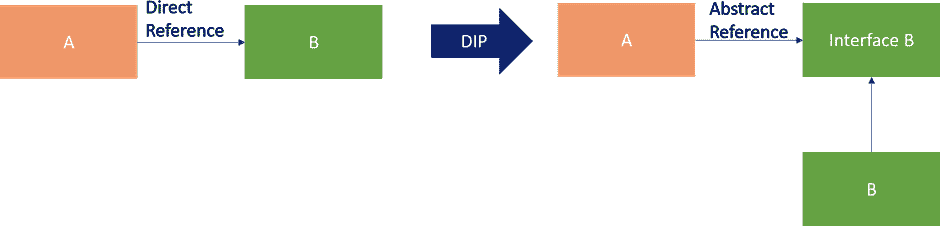

图 1.5 – DIP

### 不要重复自己（DRY）

使用 DRY 原则，系统应该设计成这样，即一个功能或模式的实现不应该在多个地方重复。这会导致维护开销，因为需求的变化会导致多个地方需要修改。如果你不小心在一个地方没有进行必要的更新，系统的行为将变得不一致。相反，该功能应该被封装成一个包，并在所有地方重用。在数据库的情况下，你应该考虑使用数据规范化来减少冗余。

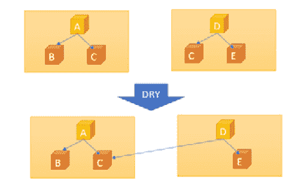

图 1.6 – DRY

这种策略有助于减少冗余并促进重用。这个原则也有助于组织文化，鼓励更多的协作。

### 简单就是最好（KISS）

使用 KISS 原则，系统应该尽可能简单地进行设计，避免复杂的设计、算法、新技术以及更多。你应该专注于利用正确的面向对象概念和重用经过验证的模式和原则。只有当它是必要的并且增加了实现的价值时，才包括新或不简单的事物。

当你保持简单时，你将能够更好地做到以下事情：

+   在设计/开发过程中避免错误。

+   保持列车运行（总有一个团队负责维护系统，即使他们最初并没有开发系统）。

+   阅读并理解你的系统代码（你的系统代码需要对新来的人或未来将使用它的人可理解）。

+   做得更好，减少错误的风险进行变更管理。

通过这些，我们完成了对常见设计原则的入门介绍；我们学习了 SOLID、DRY 和 KISS。在下一节中，我们将通过现实世界的例子来探讨一些常见的设计模式，以帮助您理解原则和模式之间的区别以及何时使用哪种模式——这是良好设计和架构所必需的技能。

## 设计模式

在遵循面向对象（OOP）范式的设计原则时，你可能会看到相同的结构和模式反复出现。这些重复的结构和技术是解决常见问题的既定解决方案，被称为**设计模式**。经过验证的设计模式易于重用、实现、更改和测试。著名的书籍《设计模式：可重用面向对象软件的元素》，包含了被称为**四人帮**（**GOF**）的设计模式，被认为是模式的圣经。

我们可以将 GOF 模式分类如下：

+   **创造**：有助于创建对象

+   **结构**：有助于处理对象的组成

+   **行为**：有助于定义对象之间的交互和分配责任

让我们通过一些现实生活中的例子来看看这些模式。

### 创建型设计模式

让我们来看看以下表格中的一些创建型设计模式及其相关示例：

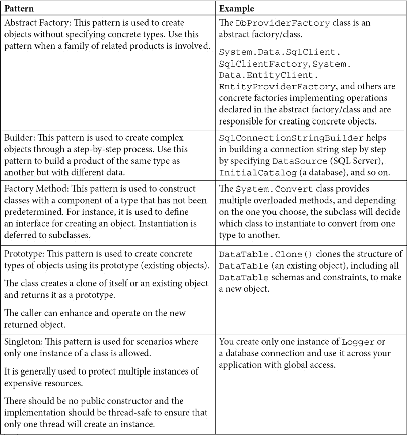

表 1.1 – 创建型设计模式

### 结构设计模式

以下表格包含了一些结构设计模式的示例：

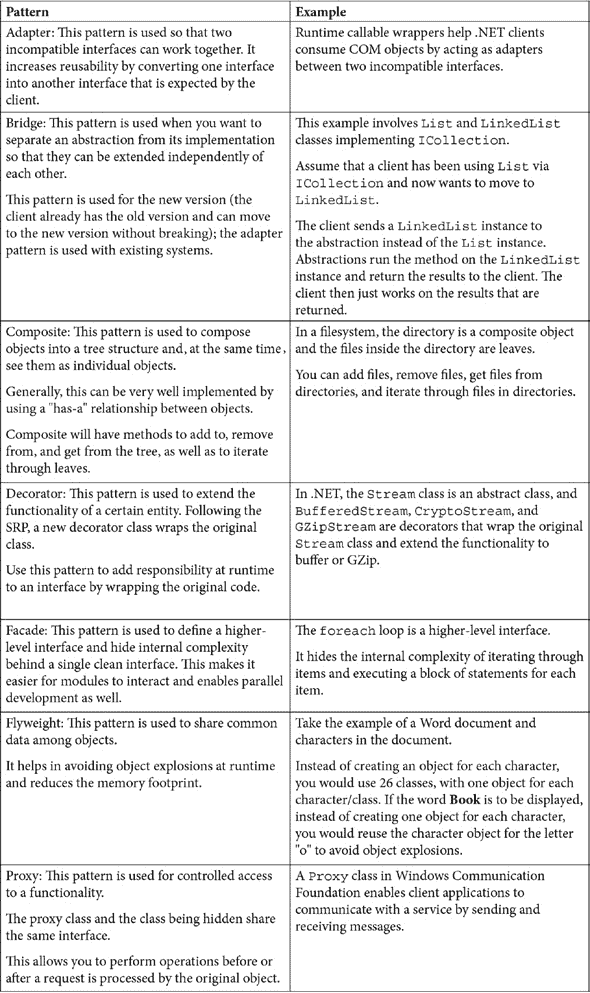

表 1.2 – 结构设计模式

### 行为设计模式

以下表格包含了一些行为设计模式的示例：

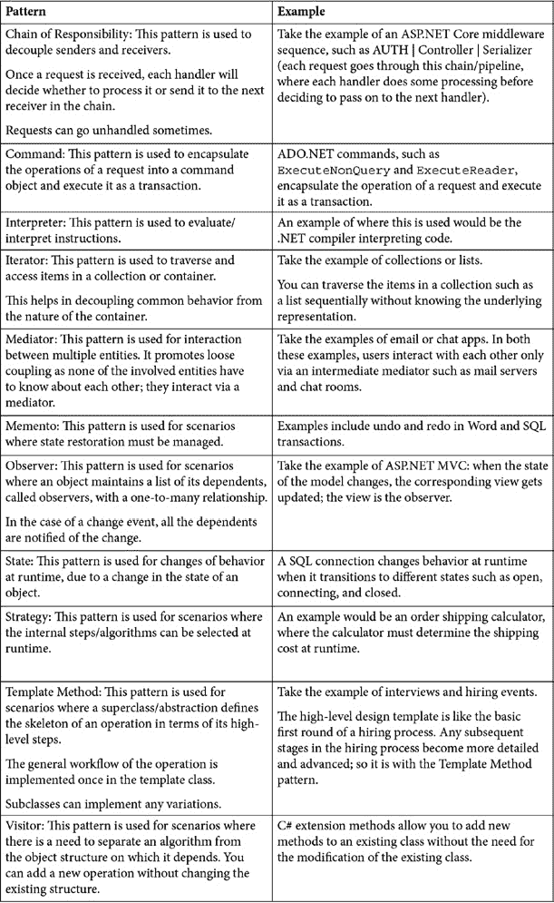

表 1.3 – 行为设计模式

有时候，你可能会被所有这些模式在表格中的内容所淹没。但事实上，任何设计只要不违反基本原理，都是好的设计。我们可以使用的一个经验法则是**回归基本**，在设计上，原则是基础。

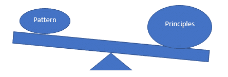

图 1.7 – 模式与原则

通过这一点，我们完成了对常见设计原则和模式的入门介绍。到现在，你应该对不同的原则和模式、它们的使用场景以及构建优秀解决方案所需的内容有了很好的理解。现在，让我们花些时间来了解常见的企业架构。

# 理解常见的企业架构

在设计企业应用程序时，通常遵循一些原则和架构。首先，任何架构的目标都是以尽可能低的成本支持业务需求（成本是时间和资源）。企业希望软件能够使其业务更高效，而不是成为瓶颈。在当今世界，可用性、可靠性和性能是任何系统的三个关键绩效指标。

在本节中，首先，我们将探讨单体架构的问题，然后我们将看到如何通过使用广泛采用和经过验证的企业应用程序开发架构来避免这些问题。

考虑一个经典的单体电子商务网站应用，如下面的图所示，所有业务提供者和功能都在一个应用程序中，数据存储在传统的 SQL 数据库中：

图 1.8 – 单体应用

单体架构在 15-20 年前被广泛采用，但随着系统增长和业务需求随时间扩展，软件工程团队出现了许多问题。让我们看看这种方法的常见问题。

## 单体应用的常见问题

让我们来看看扩展性问题：

+   在单体应用中，横向扩展的唯一方式是通过向系统中添加更多计算资源。这导致更高的运营成本和未优化的资源利用率。有时，由于资源需求冲突，扩展变得不可能。

+   由于所有功能大多使用单一存储，存在锁导致高延迟的可能性，同时也会存在单一存储实例可扩展的物理限制。

这里列出了一些与可用性、可靠性和性能相关的问题：

+   任何系统中的更改都要求重新部署所有组件，导致停机时间和低可用性。

+   任何非持久状态，如存储在 Web 应用程序中的会话，在每次部署后都会丢失。这将导致所有由用户触发的流程被放弃。

+   任何模块中的错误，如内存泄漏或安全漏洞，都会使所有模块变得脆弱，并有可能影响整个系统。

+   由于模块内部高度耦合和资源共享的特性，资源总会存在未被优化的使用，导致系统中的高延迟。

最后，让我们看看这对业务和工程团队的影响：

+   变化的影响难以量化，需要广泛的测试。因此，它减缓了向生产交付的速度。即使是微小的变化，也需要重新部署整个系统。

+   在一个高度耦合的系统中，跨团队交付任何功能都会有物理限制。

+   新场景，如移动应用、聊天机器人和分析引擎，需要更多的努力，因为没有独立的可重用组件或服务。

+   持续部署几乎是不可能的。

## 让我们通过采用一些经过验证的原则/架构来尝试解决这些常见问题。

## 关注点分离/单一职责架构

软件应根据其执行的工作类型划分为组件或模块，其中每个模块或组件都拥有整个软件的单一职责。组件之间的交互通过接口或消息系统进行。让我们看看 n 层架构和微服务架构以及如何处理关注点分离。

### N 层架构

N 层架构将系统的应用划分为三个（或 n）层：

+   **表示**（称为 UX 层、UI 层或工作表面）

+   **业务**（称为业务规则层或服务层）

+   **数据**（称为数据存储和访问层）

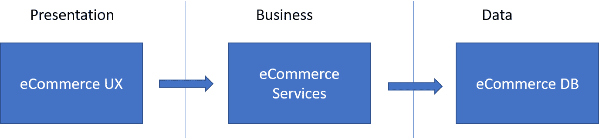

图 1.9 – N 层架构

这些层可以分别拥有/管理/部署。例如，多个表示层，如网页、移动和机器人层，可以利用相同的企业和数据层。

### 微服务架构

微服务架构由小型、松散耦合、独立和自治的服务组成。让我们看看它们的优点：

+   服务可以独立部署和扩展。一个服务的问题只会产生局部影响，只需部署受影响的服务即可修复。没有共享技术或框架的强制要求。

+   服务通过定义良好的 API 或如 Azure 服务总线之类的消息系统相互通信。

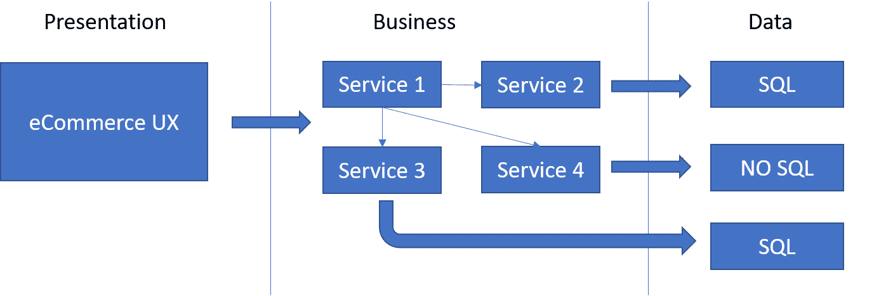

图 1.10 – 微服务架构

如前图所示，一个服务可以由独立的团队拥有并拥有自己的周期。服务负责管理自己的数据存储。对于需要较低延迟的场景，可以通过引入缓存或高性能 NoSQL 存储进行优化。

## 无状态服务架构

服务不应有任何状态。状态和数据应独立于服务进行管理，即通过外部数据存储，如分布式缓存或数据库。通过将状态委托给外部，服务将拥有资源以高可靠性服务更多请求。以下图示展示了左侧的状态服务示例。在这里，状态通过内存缓存或会话提供者在每个服务中维护，而右侧所示的无状态服务则在外部管理状态和数据。

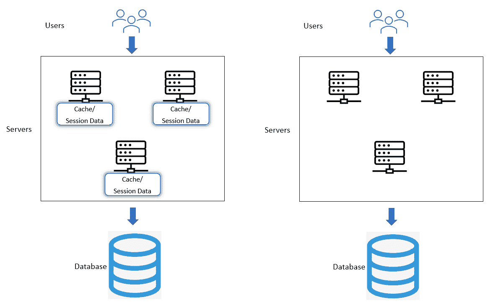

图 1.11 – 有状态（左侧）与无状态（右侧）

不应启用会话亲和性，因为它会导致会话粘性问题，并阻止您获得负载均衡、可扩展性和流量分布的好处。

## 事件驱动架构

事件驱动架构的主要特点如下：

+   在事件驱动架构中，模块之间的通信，通常称为**发布者-订阅者通信**，主要是异步的，并通过事件实现。生产者和消费者彼此完全解耦。事件的结构是他们之间交换的唯一合约。

+   同一个事件可以有多个消费者负责它们特定的操作；理想情况下，它们甚至不会意识到彼此的存在。生产者可以持续推送事件，无需担心消费者的可用性。

+   发布者通过消息基础设施，如队列或服务总线，发布事件。一旦事件被发布，消息基础设施就负责将事件发送给合格的订阅者。

图 1.12 – 事件驱动架构

这种架构最适合本质上是异步的场景。例如，长时间运行的操作可以排队处理。客户端可能会轮询状态，甚至充当事件的订阅者。

## 弹性架构

随着组件之间通信的增加，故障的可能性也会增加。系统应该设计成能够从任何类型的故障中恢复。我们将介绍一些构建容错系统的方法，该系统在出现故障时可以自我修复。

如果你熟悉 Azure，你会知道应用程序、服务和数据应该在全球至少两个 Azure 区域中进行复制，以应对计划内的停机时间和计划外瞬态或永久性故障，如下面的截图所示。在这些场景中，选择 Azure App Service 托管 Web 应用程序、使用 REST API 以及选择全球分布式数据库服务，如 Azure Cosmos DB，是明智的。选择 Azure 配对区域将有助于**业务连续性和灾难恢复**（**BCDR**），因为如果多个区域出现故障，至少每个配对中的一个区域将优先用于恢复。

![图 1.13 – 弹性架构

![img/Figure_1.13_B18507.jpg]

图 1.13 – 弹性架构

现在，让我们看看如何处理不同类型的故障。

瞬态故障可能发生在任何类型的通信或服务中。你需要有一个从瞬态故障中恢复的策略，如下所示：

+   识别操作和瞬态故障的类型。然后，确定适当的重试次数和间隔。

+   避免如有限重试次数的无限重试机制或断路器等反模式。

如果故障不是瞬态的，你应该通过选择以下一些选项来优雅地响应故障：

+   故障转移

+   补偿任何失败的操作

+   限制/阻止不良客户端/参与者

+   在出现故障的情况下，使用领导者选举来选择领导者

在这里，遥测发挥着重要作用；你应该有自定义指标来监控任何组件的健康状况。当发生自定义事件或特定指标达到某个阈值时，可以发出警报。

通过这样，我们完成了对常见企业架构的覆盖。接下来，我们将通过之前学到的设计原则和常见架构的视角，探讨企业应用程序的需求及其不同的架构。

# 识别企业应用程序需求（商业和技术）

在接下来的几章中，我们将构建一个可工作的电子商务应用程序。它将是一个三层应用程序，包括 UI 层、服务层和数据库。让我们看看这个电子商务应用程序的需求。

解决方案需求是在产品中实现并提供的功能，以解决一个问题或实现一个目标。

商业需求仅仅是最终客户的需求。在 IT 领域，*商业通常指的是客户*。这些需求从各个利益相关者那里收集，并作为每个人偏好的单一真实来源进行记录。最终，这成为待完成的工作的待办事项和范围。

技术需求是一个系统应该实施的技术相关方面，例如可靠性、可用性、性能和 BCDR。这些也被称为**服务质量**（**QoS**）需求。

让我们将电子商务应用程序的典型业务需求分解为以下类别：**史诗**、**功能**和**用户故事**。

## 应用程序的业务需求

以下是从 Azure DevOps 中获取的屏幕截图，显示了业务需求待办事项的摘要。您可以看到我们应用程序中预期的不同功能以及用户故事。

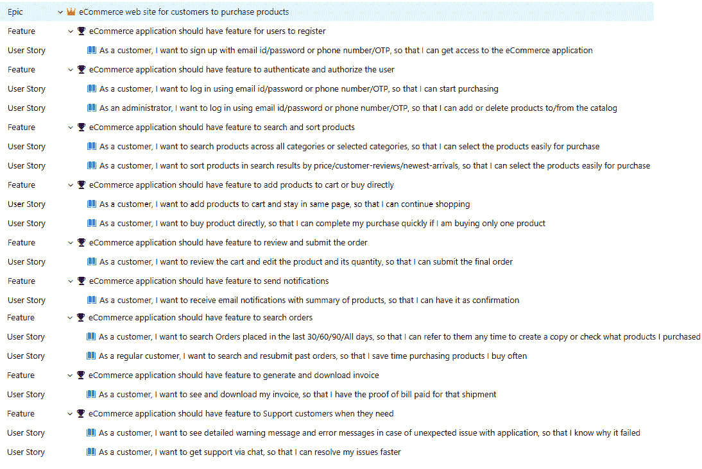

图 1.14 – 来自 Azure DevOps 的需求待办事项

## 应用程序的技术需求

在了解了业务需求后，现在让我们来探讨技术需求：

+   电子商务应用程序应具有**高可用性**，即在任何 24 小时周期内，99.99% 的时间内可用。

+   电子商务应用程序应具有**高可靠性**，即在任何 24 小时周期内，99.99% 的时间内是可靠的。

+   电子商务应用程序应具有**高度性能**，即在任何 24 小时周期内，95% 的操作应少于或等于 3 秒。

+   电子商务应用程序应具有**高度可扩展性**：它应根据不同的负载自动进行扩展/缩减。

+   电子商务应用程序应具有**监控和警报**：在发生任何系统故障的情况下，应向支持工程师发送警报。

以下是已识别的电子商务应用程序的**技术方面**和需求：

### 前端

+   使用 ASP.Net 6.0 的 Web 应用程序（电子商务）

### 核心组件

+   C# 10.0 和 .Net 6.0 中的日志记录/缓存/配置

### 中间层

+   Azure API 网关用于实现身份验证

+   通过 ASP.NET 6.0 Web API 实现的用户管理服务以添加/删除用户

+   通过 ASP.NET 6.0 Web API 实现的产品和定价服务，从数据存储中获取产品

+   通过 ASP.NET 6.0 Web API 实现的领域数据服务，以获取领域数据，例如国家数据

+   通过 ASP.NET 6.0 Web API 实现的支付服务以完成支付

+   通过 ASP.NET 6.0 Web API 实现的订单处理服务，用于提交和搜索订单

+   通过 ASP.NET 6.0 Web API 实现的发票处理服务以生成发票

+   通过 ASP.NET 6.0 Web API 实现的通知服务，用于发送电子邮件等通知

### 数据层

+   通过 ASP.NET 6.0 Web API 实现的数据访问服务，用于与 Azure Cosmos DB 通信以读取/写入数据

+   Entity Framework Core 用于访问数据

### Azure Stack

+   Azure Cosmos DB 作为后端数据存储

+   Azure Service Bus 用于异步消息处理

+   Azure App Service 用于托管 Web 应用程序和 Web API

+   Azure Traffic Manager 用于高可用性和响应性

+   Azure Application Insights 用于诊断和遥测

+   Azure 配对区域以提高容错能力

+   Azure 资源组用于创建 **Azure 资源管理器**（**ARM**）模板并将它们部署到 Azure 订阅

+   Azure Pipelines 用于**持续集成和持续部署**（**CI/CD**）

我们现在已经完成了企业应用的需求。接下来，我们将探讨如何架构一个企业应用。

# 架构企业应用

以下架构图展示了我们将要构建的内容。在架构和开发应用时，我们需要牢记我们在本章中看到的所有的设计原则、模式和需求。以下图显示了我们的电子商务企业应用的建议架构：

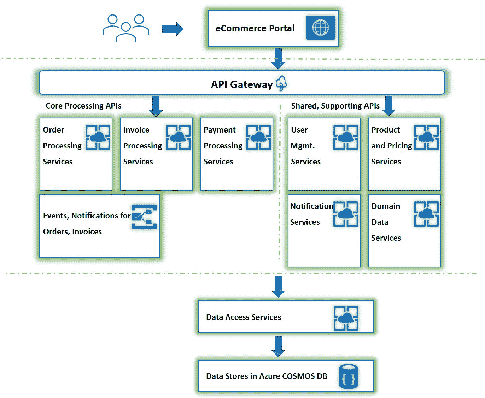

图 1.15 – 电子商务应用的三层架构

**关注点分离/单一职责原则**在每个层级都得到了妥善处理。包含用户界面的表示层与包含业务逻辑的服务层分离。这又与包含数据存储的数据访问层分离。

高级组件对它们所消耗的低级组件不知情。数据访问层对消耗它的服务不知情，而服务对消耗它们的 UX 层也不知情。

每个服务都是根据其应执行的业务逻辑和功能进行分离的。

**封装**在架构层面得到了妥善处理，并且在开发过程中也应该得到妥善处理。架构中的每个组件将通过定义良好的接口和合同与其他组件进行交互。我们应该能够替换图中的任何组件，而无需担心其内部实现以及它是否遵守合同。

这里的松散耦合架构也有助于加快开发速度和更快地将产品部署到市场。多个团队可以并行工作，独立地开发各自的组件。他们在开始时共享集成测试的合同和进度表，一旦内部实现和单元测试完成，他们就可以开始集成测试。

参考以下图：

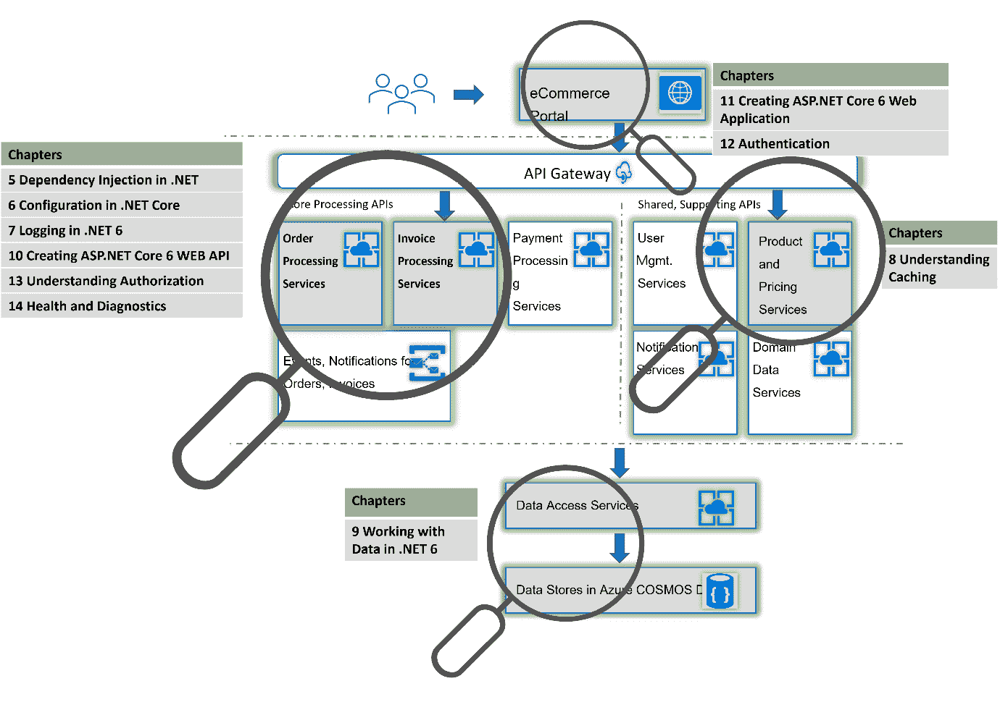

图 1.16 – 电子商务应用的三层架构，突出显示的章节

从前面的图中，我们可以识别出我们将要构建的电子商务应用的不同部分将在哪些章节中介绍。它们可以解释如下：

+   创建 ASP.NET 网络应用（我们的电子商务门户）将在*第十一章* *创建 ASP.NET Core 6 网络应用* 中介绍。

+   认证将在*第十二章* *理解认证* 中介绍。

+   订单处理服务和发票处理服务是生成订单和开票的两个核心服务。它们将是电子商务应用的核心，因为它们负责收入。在*第十章*“创建 ASP.NET Core 6 Web API”中，我们将介绍如何创建 ASP.NET Core web API，而跨切面关注点将在*第五章*“.NET 6 中的依赖注入”、*第六章*“.NET 6 中的配置”和*第七章*“.NET 6 中的日志记录”中分别介绍。通过重用核心组件和跨切面关注点而不是重复实现，我们将遵循 DRY 原则。

+   缓存作为产品定价服务的一部分将在*第八章*“所有关于缓存的知识”中进行介绍。缓存将帮助我们提高系统的性能和可扩展性，因为频繁访问的数据可以在内存中提供临时副本。

+   数据存储、访问和提供者的数量将在*第九章*“在 .NET 6 中处理数据”的数据访问层部分进行介绍。我们采用的架构，其中数据和对其的访问与应用程序的其余部分分离，使我们能够更好地维护。我们选择 Azure Cosmos DB 来弹性地、独立地扩展任何数量的 Azure 区域的全局吞吐量和存储。此外，它默认安全且适用于企业。

这就结束了我们对构建企业应用程序的讨论。接下来，我们将查看企业应用程序的解决方案结构。

# 应用程序的解决方案结构

为了保持简单，我们将为所有项目使用单个解决方案，如下面的截图所示。当解决方案中的项目数量激增并导致维护问题时，也可以考虑为 UI、共享组件和 Web API 使用单独的解决方案的方法。下面的截图显示了我们的应用程序的解决方案结构：

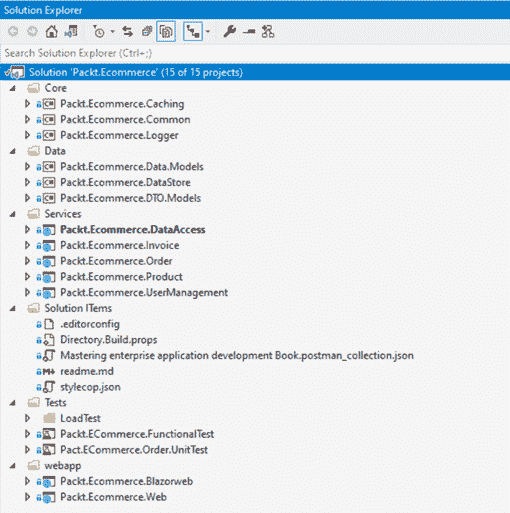

Figure 1.17 – 电子商务应用程序的解决方案结构

在这里，我们通过为 UX、服务、数据、核心和测试分别设置单独的文件夹结构和项目来实现关注点的分离。

# 摘要

在本章中，我们学习了常见的原则，如 SOLID、DRY 和 KISS。我们还通过实际案例研究了各种设计模式。然后，我们探讨了不同的企业架构，确定了我们将要构建的电子商务应用程序的需求，并将所学知识应用于我们的电子商务应用程序的架构。现在，当你设计任何应用程序时，你可以应用在这里学到的知识。

在下一章中，我们将学习.NET 6 Core 和标准。

# 问题

1.  什么是 LSP？

a. 基类实例应该可以替换为派生类实例。

b. 派生类实例应该可以替换为基类实例。

c. 为通用泛型设计，使其能够与任何数据类型一起工作。

**答案：a**

1.  什么是 SRP？

a. 而不是使用一个通用的庞大接口，应该计划多个针对特定场景的接口，以实现更好的解耦和变更管理。

b. 你应该避免直接依赖具体实现。相反，你应该尽可能依赖抽象。

c. 实体应该只有一个责任。你应该避免赋予一个实体多个责任。

d. 实体应该以这种方式设计，以便它们易于扩展但难以修改。

**答案：c**

1.  什么是 OCP？

a. 实体应该易于修改但难以扩展。

b. 实体应该易于扩展但难以修改。

c. 实体应该易于组合但难以扩展。

d. 实体应该易于抽象但难以继承。

**答案：b**

1.  哪个模式用于使两个不兼容的接口协同工作？

a. 代理模式

b. 桥接模式

c. 迭代器模式

d. 适配器模式

**答案：d**

1.  哪个原则确保服务可以独立部署和扩展，并且一个服务的问题将产生局部影响，这可以通过仅重新部署受影响的服务来解决？

a. 领域驱动设计原则

b. 单一职责原则

c. 无状态服务原则

d. 弹性原则

**答案：b**
