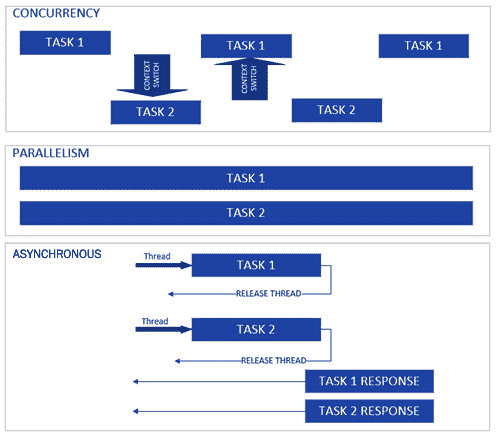
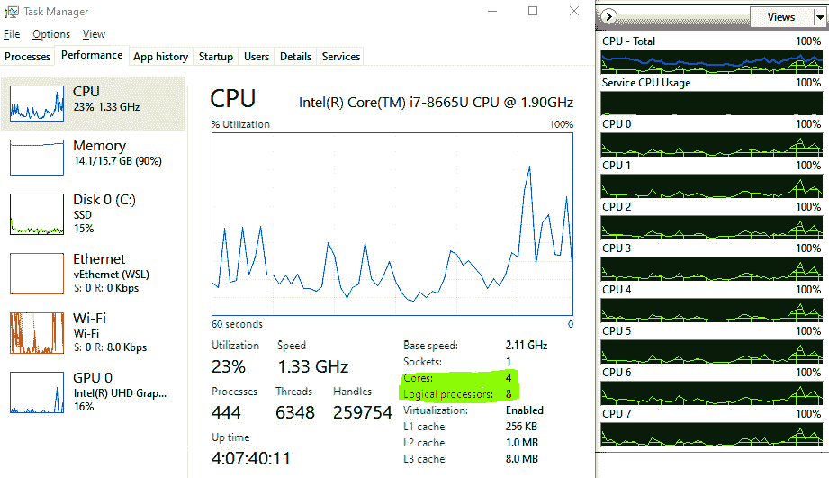
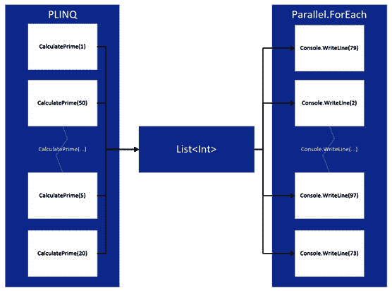
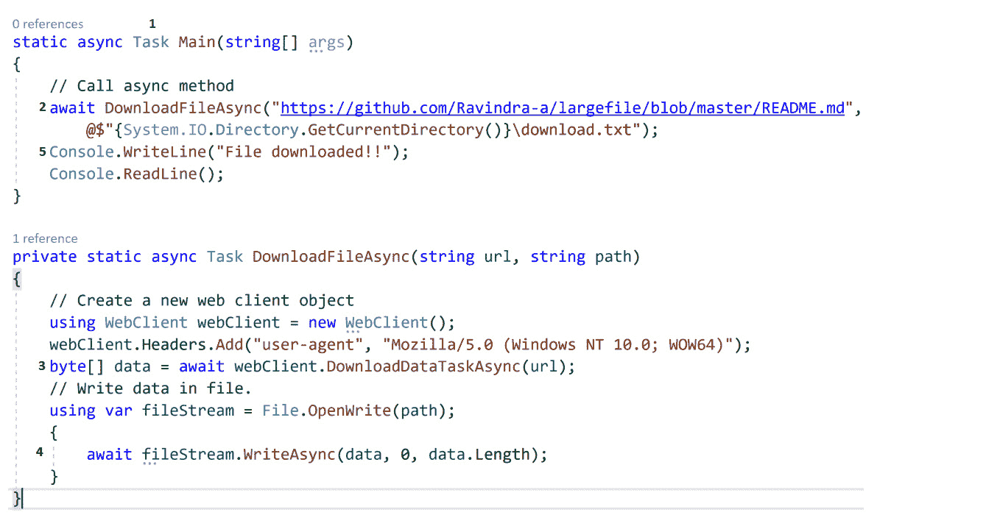
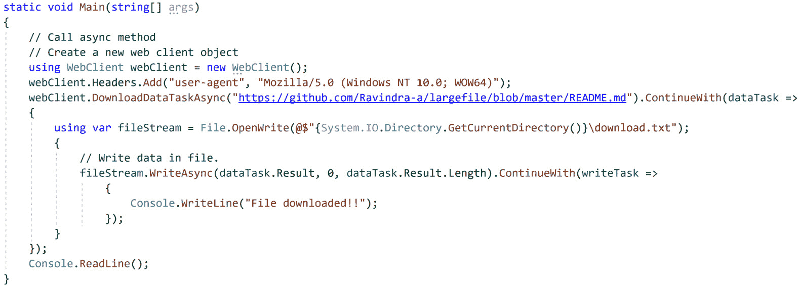
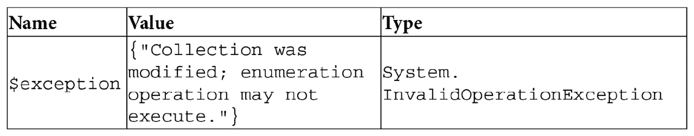
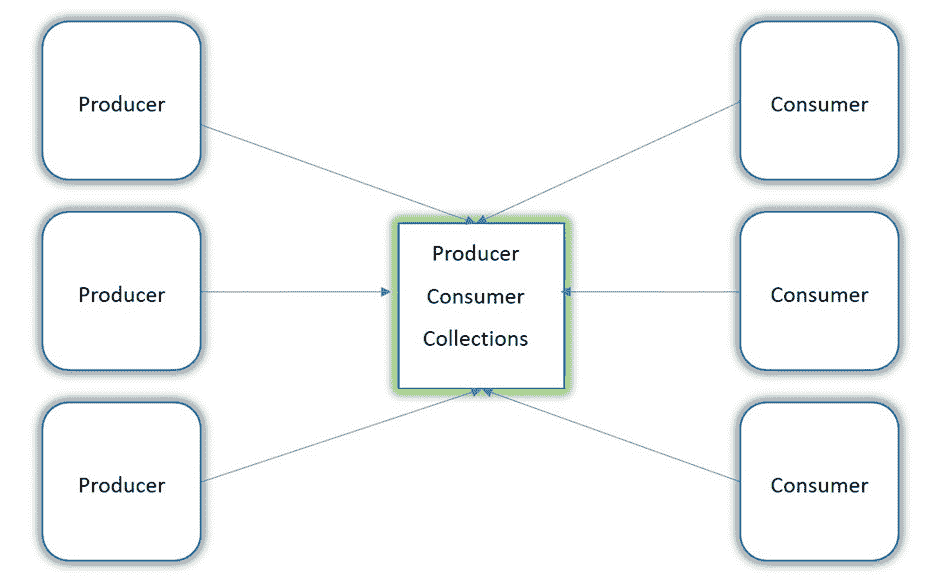

# 第四章：*第四章*：线程和异步操作

到目前为止，我们已经探讨了各种设计原则、模式、.NET 6 的新特性以及我们将在这本书中使用的架构指南。在本章中，我们将看到如何在构建企业应用时利用异步编程。

对于任何 Web 应用来说，关键指标之一是 *可伸缩性* —— 即通过扩展来减少处理请求所需的时间，增加服务器可以处理的请求数量，以及在不增加加载时间的情况下，应用程序可以同时服务的用户数量。对于移动/桌面应用，扩展可以提高应用的响应速度，使用户能够在不冻结屏幕的情况下执行各种操作。

正确使用异步编程技术和并行结构可以在提高这些指标方面产生奇迹，而在 C#中，最好的方法是**任务并行库**（**TPL**）、async-await 的简化语法，通过它可以编写干净的异步代码。

在本章中，我们将涵盖以下主题：

+   理解术语

+   阐明线程、延迟初始化和 `ThreadPool`

+   理解锁、信号量和 `SemaphoreSlim`

+   介绍任务和并行

+   介绍 async-await

+   使用并发集合实现并行处理

# 技术要求

您需要了解.NET Core、C#和 LINQ 的基础知识。本章的代码示例可以在此处找到：[`github.com/PacktPublishing/Enterprise-Application-Development-with-C-10-and-.NET-6-Second-Edition/tree/main/Chapter04`](https://github.com/PacktPublishing/Enterprise-Application-Development-with-C-10-and-.NET-6-Second-Edition/tree/main/Chapter04)。

有关代码的几个说明可以在此处找到：[`github.com/PacktPublishing/Enterprise-Application-Development-with-C-10-and-.NET-6-Second-Edition/tree/main/Enterprise%20Application`](https://github.com/PacktPublishing/Enterprise-Application-Development-with-C-10-and-.NET-6-Second-Edition/tree/main/Enterprise%20Application)。

# 理解术语

在我们深入探讨线程和异步操作的技术细节之前，让我们用一个现实世界的例子来构建一个类比，将现实生活中的多任务处理与并行编程联系起来。想象一下，你在餐厅排队等待点餐，在排队等待的时候回复了一封电子邮件。然后，在点餐后等待食物送达的时候，你接了一个电话。在餐厅里，有多个柜台在接收订单，厨师在订单被接收的同时准备食物。

当你在排队等待时，你并发地回复了电子邮件。同样，当你下单时，餐厅在许多其他柜台并行地接收订单。厨师在接收订单的同时并行地烹饪。此外，你被给了个凭证去取餐柜台；然而，根据你食物的准备时间，在你之后的订单可能会在你之前到达取餐柜台。

当谈到并行编程时，一些关键术语会多次出现。这些术语在以下图中表示：



Figure 4.1 – 并发与并行与异步

让我们逐一解释每个术语：

+   **并行性**：这涉及到同时独立执行多个任务，例如在多个餐厅柜台同时下单的例子中。在企业应用中，并行性意味着在多核 CPU 中同时执行多个线程/任务。然而，单核 CPU 也通过超线程支持并行性，这通常涉及将单个核心逻辑上划分为多个核心，例如启用超线程的双核 CPU，它表现得像一个四核——也就是说，四个核心。

+   **并发性**：这涉及到同时执行许多任务，例如在我们之前的例子中，在排队等待餐厅柜台的同时回复电子邮件，或者厨师为一道菜调味并加热另一道菜的锅。在企业应用中，并发性涉及多个线程共享一个核心，并且根据它们的时间片，执行任务和进行上下文切换。

+   **异步性**：异步编程是一种依赖于异步执行任务的技术，而不是在等待时阻塞当前线程。在我们的例子中，异步性是等待你的凭证被叫到你去取餐柜台，而厨师正在准备你的食物。但是当你等待的时候，你已经离开了点餐柜台，从而允许其他订单被下单。这就像一个异步执行的任务，在等待 I/O 任务（例如，等待数据库调用的数据）时释放资源。异步性的美妙之处在于，任务要么并行执行，要么并发执行，这完全由框架抽象化，从开发者那里屏蔽了。这使得开发者可以将他们的开发努力集中在应用程序的业务逻辑上，而不是管理任务。我们将在“任务与并行”部分看到这一点。

+   `CLR ThreadPool`。在多核/多处理器系统中，多线程有助于通过在不同的核心中执行新创建的线程来实现并行性。

现在我们已经了解了并行编程中的关键术语，让我们继续探讨如何在 .NET Core 中创建线程以及 `ThreadPool` 的作用。

# 消除线程、懒加载初始化和 ThreadPool 的神秘感

线程是操作系统中最小的单位，它在处理器中执行指令。进程是一个更大的执行容器，进程内的线程是使用处理器时间和执行指令的最小单位。要记住的关键点是，每当你的代码需要在进程中执行时，它应该被分配到一个线程上。每个处理器一次只能执行一条指令；这就是为什么在单核系统中，在任何时刻，只有一个线程正在执行。有一些调度算法用于将处理器时间分配给线程。线程通常有一个堆栈（用于跟踪执行历史），一些寄存器用于存储各种变量，以及计数器用于保存需要执行的指令。

快速查看**任务管理器**将提供有关物理和逻辑核心数量的详细信息，导航到**资源监视器**将告诉我们每个核心的 CPU 使用情况。以下图显示了启用超线程的四核 CPU 的详细信息，该 CPU 在任何时刻可以并行执行八个线程：



![Figure 4.2 – 任务管理器和资源监视器

.NET Core 的典型应用程序在启动时只有一个线程，可以通过手动创建来添加更多线程。以下几节将简要介绍如何进行此操作。

## 使用 System.Threading.Thread

我们可以通过创建`System.Threading.Thread`的实例并传递一个方法委托来创建新的线程。以下是一个简单的示例，模拟从 API 检索数据并从磁盘加载文件：

```cs
Thread loadFileFromDisk = new Thread(LoadFileFromDisk);
```

```cs
void LoadFileFromDisk(object? obj)
```

```cs
{
```

```cs
    Thread.Sleep(2000);
```

```cs
    Console.WriteLine("data returned from API");
```

```cs
}
```

```cs
loadFileFromDisk.Start();
```

```cs
Thread fetchDataFromAPI = new Thread(FetchDataFromAPI);
```

```cs
void FetchDataFromAPI(object? obj)
```

```cs
{
```

```cs
    Thread.Sleep(2000);
```

```cs
    Console.WriteLine("File loaded from disk");
```

```cs
}
```

```cs
fetchDataFromAPI.Start("https://dummy/v1/api"); //Parameterized method
```

```cs
Console.ReadLine();
```

在前面的代码中，`FetchDataFromAPI`和`LoadFileFromDisk`是将在新线程上运行的方法。

提示

在任何时刻，每个核心上只会有一个线程在执行——也就是说，只有一个线程被分配了 CPU 时间。因此，为了实现并发，当被分配 CPU 时间的线程空闲或队列中出现高优先级线程时（也可能有其他原因，例如线程正在等待同步对象或达到分配的 CPU 时间），操作系统会进行上下文切换。

由于被切换出的线程尚未完成其工作，在某个时刻，它将再次被分配 CPU 时间。因此，操作系统需要保存线程的状态（其堆栈、寄存器等），并在线程被分配 CPU 时间时再次检索它。上下文切换通常非常昂贵，是性能改进的关键领域之一。

可以在[`docs.microsoft.com/en-us/dotnet/api/system.threading.thread?view=net-6.0`](https://docs.microsoft.com/en-us/dotnet/api/system.threading.thread?view=net-6.0)进一步查看`Thread`类的所有属性和方法。

尽管管理线程带来了对执行方式的更多控制优势，但也伴随着以下开销：

+   管理线程的生命周期，例如创建线程、回收它们和上下文切换。

+   实现线程执行的进度跟踪/报告等概念。此外，取消操作相当复杂，并且支持有限。

+   需要适当地处理线程上的异常；否则，它们可能导致应用程序崩溃。

+   调试、测试和代码维护可能会变得有些复杂，并且如果不正确处理，有时会导致性能问题。

这就是`ThreadPool`发挥作用的地方，将在下一节中进行讨论。

## ThreadPool

可以通过使用由.NET Core 管理的线程池来创建线程，这更广为人知的是 CLR `ThreadPool`。CLR `ThreadPool`是一组工作线程，它们与 CLR 一起加载到您的应用程序中，并负责线程生命周期，包括回收线程、创建线程和支持更好的上下文切换。`System.Threading.ThreadPool`类中的各种 API 可以消费 CLR `ThreadPool`。具体来说，对于在某个线程上调度操作，有`QueueUserWorkItem`方法，它接受需要调度的方法的委托。在之前的代码中，让我们将创建新线程的代码替换为以下代码，这意味着应用程序将使用`ThreadPool`：

```cs
ThreadPool.QueueUserWorkItem(FetchDataFromAPI);
```

如其名所示，`ThreadPool`类的`QueueUserWorkItem`确实使用了队列，任何应该在`ThreadPool`线程上执行的计算代码都会被排队，然后出队——即以**先进先出**（**FIFO**）的方式分配给工作线程。

`ThreadPool`的设计方式是它有一个全局队列，我们在执行以下操作时将项目排队到其中：

+   使用不属于`ThreadPool`线程的线程调用`QueueUserWorkItem`或`ThreadPool`类的类似方法

+   通过 TPL 进行调用

当在`ThreadPool`中创建新线程时，它维护自己的本地队列，该队列检查全局队列并以 FIFO（先进先出）的方式出队工作项；然而，如果在此线程上执行的代码创建了另一个线程，例如子线程，那么它将被排队到本地队列而不是全局队列。

工作线程本地队列中操作的执行顺序始终是`ThreadPool`，其中*n*是`ThreadPool`中的线程数——即*n*个本地队列——而*1*指的是全局队列。

以下图中展示了`ThreadPool`的高级表示：

![Figure 4.3 – ThreadPool high-level representation]

![img/Figure_4.3_B18507.jpg]

图 4.3 – `ThreadPool`的高级表示

除了`QueueUserWorkItem`之外，`ThreadPool`类还有许多其他属性/方法可用，例如这些：

+   `SetMinThreads`: 用于设置程序启动时`ThreadPool`将拥有的最小工作线程和异步 I/O 线程数

+   `SetMaxThreads`: 用于设置`ThreadPool`将拥有的最大工作线程和异步 I/O 线程数，之后，新的请求将被排队

可以进一步查看`ThreadPool`类的所有属性和方法，请参阅[`docs.microsoft.com/en-us/dotnet/api/system.threading.threadpool?view=net-6.0`](https://docs.microsoft.com/en-us/dotnet/api/system.threading.threadpool?view=net-6.0)。

虽然通过`ThreadPool`线程的`QueueUserWorkItem`编写多线程代码简化了线程的生命周期管理，但它也有自己的局限性：

+   我们无法从在`ThreadPool`线程上安排的工作中获得响应，因此代理的返回类型是 void。

+   跟踪在`ThreadPool`线程上安排的工作的进度并不容易，因此像进度报告这样的功能并不容易实现。

+   它并不适合长时间运行请求。

+   `ThreadPool`线程始终是后台线程；因此，与前台线程不同，如果进程关闭，它不会等待`ThreadPool`线程完成其工作。

由于`QueueUserWorkItem`存在局限性，`ThreadPool`线程也可以通过 TPL（我们将用于我们的企业应用程序，并在本章后面介绍）来消耗。在.NET Core 中，TPL 是实现并发/并行化的首选方法，因为它克服了我们迄今为止看到的所有局限性，并最终有助于实现允许您的应用程序扩展和响应的目标。

## 懒加载

类的懒加载是一种模式，其中对象的创建被推迟到第一次使用时。这种模式基于以下前提：只要类的属性没有被使用，初始化对象就没有优势。因此，这延迟了对象的创建，并最终减少了应用程序的内存占用，提高了性能。一个例子是在即将从数据库检索数据时创建数据库连接对象。懒加载非常适合持有大量数据且创建成本可能很高的类。例如，一个用于加载电子商务应用程序中所有产品的类可以在需要列出产品时进行懒加载。

如下所示，此类的一个典型实现限制了在构造函数中初始化属性，并且有一个或多个填充类属性的方法：

```cs
        public class ImageFile
```

```cs
        {
```

```cs
            string fileName;
```

```cs
            object loadImage;
```

```cs
            public ImageFile(string fileName)
```

```cs
            {
```

```cs
                this.fileName = fileName;
```

```cs
            }
```

```cs
            public object GetImage()
```

```cs
            {
```

```cs
                if (loadImage == null)
```

```cs
                {
```

```cs
                    loadImage = File.ReadAllText(fileName);
```

```cs
                }
```

```cs
                return loadImage;
```

```cs
            }
```

```cs
        }
```

假设这是一个用于从磁盘加载图像的类，在构造函数中加载图像是没有用的，因为只有在调用`GetImage`方法之前无法使用它。因此，懒初始化模式建议，而不是在构造函数中初始化`loadImage`对象，它应该在`GetImage`中初始化，这意味着图像只有在需要时才被加载到内存中。这也可以通过属性来实现，如下所示：

```cs
        object loadImage;
```

```cs
        public object LoadImage
```

```cs
        {
```

```cs
            get
```

```cs
            {
```

```cs
                if (loadImage == null)
```

```cs
                {
```

```cs
                    loadImage = File.ReadAllText(fileName);
```

```cs
                }
```

```cs
                return loadImage;
```

```cs
            }
```

```cs
        }
```

正如你所见，这通常是通过缓存对象来完成的，也被称为`LoadImage`方法或属性，它会导致多次调用磁盘。因此，这里需要通过锁或其他机制进行同步，这显然会增加维护开销，并且类的实现可能会变得更加复杂。

因此，尽管我们可以实现自己的懒加载模式，但在 C#中，我们有`System.Lazy`类来处理这种实现。使用`System.Lazy`类的一个关键优点是它是线程安全的。

`System.Lazy`类提供了多个构造函数来实现懒初始化。以下是我们可以使用的两种最常见方式：

+   将类围绕`Lazy`包装，并使用该对象的`Value`方法来检索数据。这通常用于在构造函数中有初始化逻辑的类。以下是一些示例代码：

    ```cs
            public class ImageFile
            {
                string fileName;
                public object LoadImage { get; set; }
                public ImageFile(string fileName)
                {
                    this.fileName = fileName;
                    this.LoadImage = $"File {fileName}
                     loaded from disk";
                }
            }
    ```

在初始化这个类时，我们将使用`System.Lazy`类的泛型类型，并将`ImageFile`类作为其类型，以及`ImageFile`对象作为委托：

```cs
        Lazy<ImageFile> imageFile = new
         Lazy<ImageFile>(() => new ImageFile("test"));
        var image = imageFile.Value.LoadImage;
```

在这里，如果你在`ImageFile`类的构造函数中设置断点，它只有在调用`System.Lazy`类的`Value`方法时才会被触发。

+   对于具有加载各种参数的方法的类，我们可以将方法传递给`Lazy`类作为委托。以下是将之前示例代码中的文件检索逻辑移动到单独方法的示例：

    ```cs
            public class ImageFile
            {
                string fileName;
                public object LoadImage { get; set; }
                public ImageFile(string fileName)
                {
                    this.fileName = fileName;
                }
                public object LoadImageFromDisk()
                {
                    this.LoadImage = $"File
                     {this.fileName} loaded from disk";
                    return LoadImage;
                }
            }
    ```

在初始化这个类时，我们将一个 Lambda 传递给泛型委托，然后将该泛型委托传递给初始化`System.Lazy`类的对象，如下面的代码所示：

```cs
        Func<object> imageFile = new Func<object>(()
         => { var obj = new ImageFile("test");
        return obj.LoadImageFromDisk(); });
        Lazy<object> lazyImage = new
         Lazy<object>(imageFile);
        var image = lazyImage.Value;
```

注意

C#中的 func 是一种委托类型，它接受零个或多个参数并返回一个值。更多详细信息可以在这里找到：[`docs.microsoft.com/en-us/dotnet/api/system.func-1?view=net-6.0`](https://docs.microsoft.com/en-us/dotnet/api/system.func-1?view=net-6.0)。

这两种方式都会延迟对象的初始化，直到调用`Value`方法时。

注意

我们需要注意的一个重要事项是，尽管`Lazy`对象是线程安全的，但通过值创建的对象并不是线程安全的。因此，在这种情况下，`lazyImage`是线程安全的，但`image`不是。因此，在多线程环境中，它需要被同步。

通常，懒初始化非常适合缓存类和单例类，并且可以进一步扩展用于初始化成本高昂的对象。

可以在[`docs.microsoft.com/en-us/dotnet/api/system.lazy-1?view=net-6.0`](https://docs.microsoft.com/en-us/dotnet/api/system.lazy-1?view=net-6.0)进一步查看`Lazy`类的所有属性。

虽然可以通过将底层对象包装在`System.Lazy`类中来实现懒加载，但在.NET 中也有`LazyInitializer`静态类可用，可以通过其`EnsureInitialized`方法进行懒加载。

如 MSDN 文档中提到的，它有几个构造函数[`docs.microsoft.com/en-us/dotnet/api/system.threading.lazyinitializer.ensureinitialized?view=net-6.0`](https://docs.microsoft.com/en-us/dotnet/api/system.threading.lazyinitializer.ensureinitialized?view=net-6.0)。

然而，其理念是相同的，即它期望一个对象和一个函数来填充该对象。以之前的例子来说，如果我们必须使用`LazyInitializer.EnsureInitialized`进行懒加载，我们需要将对象的实例和创建实际对象的 Lambda 表达式传递给`LazyInitializer.EnsureInitialized`，如下面的代码所示：

```cs
        object image = null;
```

```cs
        LazyInitializer.EnsureInitialized(ref image, () =>
```

```cs
            {
```

```cs
                var obj = new ImageFile("test");
```

```cs
                return obj.LoadImageFromDisk();
```

```cs
            });
```

在这里，我们传递了两个参数——一个是持有`image`类属性值的对象，另一个是创建`image`类对象并返回图像的函数。因此，这就像调用`System.Lazy`属性的`Value`属性一样简单，而不需要初始化对象的额外开销。

显然，使用`LazyInitializer`进行懒加载的一个小优势是，没有创建额外的对象，这意味着更小的内存占用。另一方面，`System.Lazy`提供了更易读的代码。因此，如果有明确的*空间优化*，请选择`LazyInitializer`；否则，为了获得更干净、更易读的代码，请使用`System.Lazy`。

# 理解锁、信号量和 SemaphoreSlim

在前面的章节中，我们看到了如何使用.NET 中的各种 API 来实现并行性。然而，当我们这样做时，我们需要对共享变量进行额外的注意。让我们考虑本书中构建的企业电子商务应用程序。想想购买商品的流程。比如说有两个用户计划购买一个产品，但只有一个商品可用。假设两个用户都将商品添加到购物车，第一个用户下订单，而订单正在通过支付网关处理时，第二个用户也尝试下订单。

在这种情况下，第二级应该失败（假设第一级成功），因为书的数量现在是零；这只会发生在对线程间的数量应用了适当的同步时。此外，如果第一级在支付网关失败或第一个用户取消他们的交易，第二级应该通过。所以，我们在这里说的是，数量应该在处理第一级时锁定，并且只有在订单完成后（成功或失败）才释放。在我们深入了解处理机制之前，让我们快速回顾一下什么是临界区。

## 临界区和线程安全

临界区是应用程序中读取/写入由多个线程使用的变量的部分。我们可以把它们看作是跨应用程序使用的全局变量，在不同的地方或同一时间被修改。在多线程场景中，在任何给定时间点，只应允许一个线程修改这样的变量，并且只应允许一个线程进入临界区。

如果你的应用程序中没有这样的变量/部分，它可以被认为是线程安全的。因此，始终建议识别应用程序中不是线程安全的变量，并相应地处理它们。为了保护临界区免受非线程安全变量的访问，有各种称为**同步原语**或**同步构造**的结构可用，它们主要分为两大类：

+   **锁定构造**：这些允许一个线程进入临界区以保护对共享资源的访问，其他所有线程都等待获取锁的线程释放锁。

+   **信号构造**：这些允许一个线程通过信号资源可用性来进入临界区，例如在生产者-消费者模型中，生产者锁定资源，而消费者等待信号而不是轮询。

让我们在下一节讨论几个同步原语。

## 介绍锁

**锁**是一个基本类，它允许你在多线程代码中实现同步，其中锁块内的任何变量只能由一个线程访问。在锁中，获取锁的线程需要释放锁，直到那时，任何其他尝试进入锁的线程都将进入等待状态。一个简单的锁可以像以下代码所示那样创建：

```cs
            object locker = new object();
```

```cs
            lock (locker)
```

```cs
            {
```

```cs
                quantity--;
```

```cs
            }
```

首先执行此代码的线程将获取锁，并在代码块完成后释放它。锁也可以使用`Monitor.Enter`和`Monitor.Exit`来获取，实际上，使用锁的编译器内部将线程转换为`Monitor.Enter`和`Monitor.Exit`。以下是一些关于锁的重要点：

+   由于它们的线程亲和性，它们应该始终用于引用类型。

+   它们在性能上非常昂贵，因为它们在允许线程进入临界区之前会暂停想要进入的线程，这会增加一些延迟。

+   在获取锁时进行双重检查也是一种良好的实践，类似于在单例实现中执行的方式。

锁确实存在一些问题：

+   你需要在修改或枚举共享数据/对象的地方加锁。在应用程序中很容易错过临界区，因为**临界区**更是一个逻辑术语。编译器不会标记它，如果临界区周围没有锁的话。

+   如果处理不当，可能会导致死锁。

+   可扩展性是一个问题，因为一次只有一个线程可以访问锁，而其他所有线程必须等待。

    注意

    另一个重要的概念称为**原子性**。一个操作只有在没有方法读取变量的中间状态或向变量写入中间状态的情况下才是原子的。例如，如果一个整数的值正在从二修改为六，那么任何读取这个整数值的线程只会看到二或六；没有任何线程会看到整数只部分更新的线程的中间状态。任何线程安全的代码自动保证原子性。

    使用稍后章节中描述的并发集合，而不是锁，因为并发集合内部处理锁定临界区。

## 互斥锁（仅限 Windows）

`System.Threading.Mutex` 类，任何想要进入临界区的线程都需要调用 `WaitOne` 方法。释放互斥锁通过 `ReleaseMutex` 方法实现；因此，我们基本上创建一个 `System.Threading.Mutex` 类的实例，并分别调用 `WaitOne`/`ReleaseMutex` 来进入/退出临界区。关于互斥锁的几个重要点如下：

+   互斥锁具有线程亲和性，因此调用 `WaitOne` 的线程需要调用 `ReleaseMutex`。

+   `System.Threading.Mutex` 类有一个构造函数，它接受互斥锁的名称，这允许通过传递给构造函数的名称在进程间共享。

## 介绍信号量和 SemaphoreSlim

**信号量**是一种非独占锁，它通过允许多个线程进入临界区来支持同步。然而，与独占锁不同，信号量用于需要限制对资源池访问的场景——例如，允许应用程序和数据库之间固定数量连接的数据库连接池。

回到我们在电子商务应用程序中购买产品的例子，如果产品的可用数量是 10，这意味着 10 个人可以将此商品添加到他们的购物车并下订单。如果有 11 个并发订单，应该允许 10 个用户下订单，而第 11 个用户应该被挂起，直到前 10 个订单完成。

在 .NET 中，可以通过创建 `System.Threading.Semaphore` 类的实例并传递两个参数来创建信号量：

+   激活请求的初始数量

+   允许并发请求的总数

这是一个简单的代码片段，用于创建信号量：

```cs
Semaphore quantity = new Semaphore(0, 10);
```

在这种情况下，`0` 表示没有请求获取共享资源，并且允许最多 10 个并发请求。要获取共享资源，我们需要调用 `WaitOne()`，要释放资源，我们需要调用 `Release()` 方法。

要创建信号量，.NET 中还有一个轻量级的类可用，那就是 `SemaphoreSlim`，这是精简版，它通常依赖于一个称为 `SemaphoreSlim` 的概念，它使用一个运行几微秒的小循环，这样就不必经历阻塞、上下文切换和内部内核转换（信号量使用 Windows 内核信号量来锁定资源）的高成本过程。最终，如果共享资源仍然需要被锁定，`SemaphoreSlim` 会回退到锁定。

创建 `SemaphoreSlim` 实例几乎与信号量相同；唯一的区别是对于锁定，它有 `WaitAsync` 而不是 `WaitOne`。还有一个 `CurrentCount` 可用，它告诉我们获取了多少个锁。

关于信号量和 `SemaphoreSlim` 的以下关键事实：

+   由于信号量用于访问资源池，因此信号量和 `SemaphoreSlim` 没有线程亲和性，任何线程都可以释放资源。

+   .NET Core 中的 `Semaphore` 类支持命名信号量。命名信号量可以用于跨进程锁定资源；然而，`SemaphoreSlim` 类不支持命名信号量。

+   与 `Semaphore` 不同，`SemaphoreSlim` 类支持异步方法和取消，这意味着它可以很好地与 async-await 方法一起使用。async-await 关键字有助于编写非阻塞的异步方法，并在本章的 *介绍 async-await* 部分中进行了介绍。

## 选择合适的同步构造

还有其他信号构造需要覆盖；以下表格提供了它们的使用的高级视图以及它们的实际应用示例：

![Table_4.1 – 同步构造比较

![Table_4.1_a.jpg]![Table_4.1 – 同步构造比较

![Table_4.1_b.jpg]

表 4.1 – 同步构造比较

到目前为止，我们已经涵盖了以下内容：

+   使用 `Thread` 和 `ThreadPool` 类及其限制的多线程方式

+   懒初始化的重要性以及它在多线程环境中的帮助

+   .NET 中可用的各种同步构造

当我们创建一些横切组件时，我们将在后面的章节中使用这些概念。

在下一节中，我们将看到如何通过任务和 TPL 的使用来克服 `Thread` 和 `ThreadPool` 的限制。

# 介绍任务和并行

我们知道异步编程有助于我们的应用程序扩展并更好地响应，因此实现异步应用程序不应给开发者带来额外的开销。`Thread` 和 `ThreadPool` 虽然有助于实现异步性，但增加了许多开销，并带来了限制。

因此，Microsoft 提出了任务，这使得开发异步应用程序变得更加容易。事实上，.NET 6 中大多数新的 API 只支持异步编程方式——例如，**通用 Windows 平台**（**UWP**）甚至没有提供创建线程的任务 API。因此，理解任务和 TPL 对于能够使用 C# 编写异步程序至关重要。

在本节中，我们将深入探讨这些主题，稍后我们将看到如何将 C# 的 async-await 关键字与 TPL 结合起来简化异步编程。

## Task 和 TPL 简介

异步编程背后的思想是，没有任何线程应该等待一个操作——也就是说，框架应该具有将操作包装到某种抽象中的能力，然后在操作完成后恢复，而不阻塞任何线程。这种抽象就是 `Task` 类，它通过 `System.Threading.Tasks` 暴露出来，并有助于在 .NET 中编写异步代码。

`Task` 类简化了任何等待操作的包装，无论是从数据库检索的数据、从磁盘加载到内存中的文件，还是任何高度 CPU 密集型操作，并且如果需要，它简化了在单独的线程上运行的操作。它具有以下重要特性：

+   `Task` 通过其泛型类型 `Task<T>` 支持在操作完成后从操作中返回值。

+   `Task` 负责在 `ThreadPool` 上调度线程、划分操作，并相应地调度来自 `ThreadPool` 的多个线程，同时抽象出执行这些操作的复杂性。

+   完成报告支持通过 `CancellationToken` 取消操作，并通过 `IProgress` 报告进度。

+   `Task` 支持创建子任务并管理子任务与父任务之间的关系。

+   异常会传播到调用应用程序，即使是多级父/子任务也是如此。

+   最重要的是，`Task` 支持异步-等待（async-await），这有助于在任务中的操作完成后，在调用应用程序/方法中恢复处理。

TPL 是由 .NET 在 `System.Threading.Tasks` 和 `System.Threading` 中提供的一组 API，它提供了创建和管理任务的方法。可以通过创建 `System.Threading.Tasks.Task` 类的实例并传递需要在任务上执行的一块代码来创建任务。我们可以以多种方式创建任务：

+   您可以创建 `Task` 类的实例并传递一个 Lambda 表达式。在此方法中，它需要显式启动，如下面的代码所示：

    ```cs
                Task dataTask = new Task(() =>
                 FetchDataFromAPI("https://foo.com/api"));
                dataTask.Start();
    ```

+   任务也可以使用`Task.Run`创建，如下面的代码所示，它支持创建和启动任务而不需要显式调用`Start()`：

    ```cs
    Task dataTask = Task.Run(() => FetchDataFromAPI ("https://foo.com/api"));
    ```

+   创建任务的另一种方式是使用`Task.Factory.StartNew`：

    ```cs
    Task dataTask = Task.Factory.StartNew(() => FetchDataFromAPI("https://foo.com/api"));
    ```

在所有这些方法中，都使用`ThreadPool`线程来运行`FetchDataFromAPI`方法，并通过返回给调用者的`dataTask`对象进行引用，以跟踪操作的完成或异常。

由于这个任务将在`ThreadPool`线程上异步执行，并且所有`ThreadPool`线程都是后台线程，应用程序不会等待`FetchDataFromAPI`方法完成。TPL 提供了一个`Wait`方法来等待任务的完成，例如`dataTask.Wait()`。以下是一个使用任务的简单控制台应用程序的代码片段：

```cs
Task t = Task.Factory.StartNew(() =>
```

```cs
             FetchDataFromAPI("https://foo.com"));
```

```cs
t.Wait();
```

```cs
void FetchDataFromAPI(string apiURL)
```

```cs
{
```

```cs
     Thread.Sleep(2000);
```

```cs
     Console.WriteLine("data returned from API");
```

```cs
}
```

在这个代码片段中，我们使用了 Lambda 表达式。然而，它也可以是一个委托或无参数方法的动作委托，因此以下内容也可以用来创建任务：

```cs
Task t = Task.Factory.StartNew(delegate { FetchDataFromAPI("https://foo.com");});
```

无论哪种方式，你都会收到`Task`对象的引用并相应地处理它。如果一个方法返回一个值，那么我们可以使用`Task`类的泛型版本，并使用`Result`方法从`Task`中检索数据。例如，如果`FetchDataFromAPI`返回一个字符串，我们可以使用`Task<String>`，如下面的代码片段所示：

```cs
            Task<string> t =
```

```cs
             Task.Factory.StartNew<string>(()
```

```cs
             => FetchDataFromAPI(""));
```

```cs
            t.Wait();
```

```cs
            Console.WriteLine(t.Result);
```

这些方法中的每一个都接受各种附加参数，以下是一些重要的参数：

+   使用`CancellationToken`类的对象进行取消，该对象是通过`CancellationTokenSource`类生成的。

+   通过`TaskCreationOptions`枚举控制任务创建和执行的行为。

+   自定义实现`TaskScheduler`以控制任务的排队方式。

`TaskCreationOptions`是 TPL 中的一个枚举，它告诉`TaskScheduler`我们正在创建什么类型的任务。例如，我们可以创建一个长时间运行的任务，如下所示：

```cs
Task<string> t = Task.Factory.StartNew<string>(() => FetchDataFromAPI(""), TaskCreationOptions.LongRunning);
```

尽管这并不能保证输出更快，但它更像是对调度器的一种提示，使其进行自我优化。例如，如果调度器看到有长时间运行的任务正在被调度，它可以启动更多的线程。这个枚举的所有选项都可以在[`docs.microsoft.com/en-us/dotnet/api/system.threading.tasks.taskcreationoptions?view=net-6.0`](https://docs.microsoft.com/en-us/dotnet/api/system.threading.tasks.taskcreationoptions?view=net-6.0)找到。

`Task`还支持通过创建和传递所有任务作为参数到以下方法的同时等待多个任务：

+   `WaitAll`：等待所有任务的完成并阻塞当前线程。不推荐用于应用程序开发。

+   `WhenAll`：等待所有任务的完成而不阻塞当前线程。通常与`async-await`一起使用。推荐用于应用程序开发。

+   `WaitAny`：等待其中一个任务的完成并阻塞当前线程直到完成。不推荐用于应用程序开发。

+   `WhenAny`：等待其中一个任务的完成，而不阻塞当前线程。通常与 async-await 一起使用。不建议用于应用程序开发。

与线程不同，任务具有全面的异常处理支持。让我们在下一节中看看这一点。

## 处理任务异常

在任务中的异常处理就像在任务周围写一个 `try` 块，然后捕获异常，这些异常通常被封装在 `AggregateException` 中，如下面的代码片段所示：

```cs
            try
```

```cs
            {
```

```cs
                Task<string> t =
```

```cs
                 Task.Factory.StartNew<string>(()
```

```cs
                 => FetchDataFromAPI(""));
```

```cs
                t.Wait();
```

```cs
            }
```

```cs
            catch (AggregateException agex)
```

```cs
            {
```

```cs
                //Handle exception
```

```cs
                Console.WriteLine(
```

```cs
                  agex.InnerException.Message);
```

```cs
            }
```

在前面的代码中，`agex.InnerException` 将给出实际的异常，因为我们正在等待单个任务。然而，如果我们正在等待多个任务，那么将是 `InnerExceptions` 集合，我们可以遍历它。此外，它还包含一个 `Handle` 回调方法，可以在 `catch` 块中订阅，一旦触发，回调将包含有关异常的信息。

如前所述的代码所示，为了使任务传播异常，我们需要调用 `Wait` 方法或其他一些阻塞构造，如 `WhenAll` 来触发 `catch` 块。然而，在底层，任何对 `Task` 的异常实际上都保存在 `Task` 类的 `Exception` 属性中，它是 `AggregateException` 类型，可以观察任务中的任何底层异常。

此外，如果一个任务是附加子任务或嵌套任务的父任务，或者如果你正在等待多个任务，可能会抛出多个异常。为了将所有异常传播回调用线程，`Task` 基础设施将它们封装在 `AggregateException` 实例中。

更多关于异常处理的详细信息可以在 [`docs.microsoft.com/en-us/dotnet/standard/parallel-programming/exception-handling-task-parallel-library`](https://docs.microsoft.com/en-us/dotnet/standard/parallel-programming/exception-handling-task-parallel-library) 找到。

## 实现任务取消

.NET 提供了两个主要的类来支持任务的取消：

+   `CancellationTokenSource`：一个创建取消令牌并支持通过 `Cancel` 方法取消令牌的类

+   `CancellationToken`：一个监听取消的结构，如果任务被取消，则触发通知

对于取消任务，有两种类型的取消：

+   另一个情况是任务被错误地执行并需要立即取消

+   另一个情况是任务已经开始，但需要在中途停止（中止）

对于前者，我们可以创建一个支持取消的任务。我们使用 TPL API 并将取消令牌传递给构造函数，如果任务需要取消，就调用 `CancellationTokenSource` 类的 `Cancel` 方法，如下面的代码片段所示：

```cs
            cts = new CancellationTokenSource();
```

```cs
            CancellationToken token = cts.Token;
```

```cs
            Task dataFromAPI = Task.Factory.StartNew(()
```

```cs
             => FetchDataFromAPI(new List<string> {
```

```cs
                "https://foo.com",
```

```cs
                "https://foo1.com",}), token);
```

```cs
            cts.Cancel();
```

所有支持异步调用的 .NET Core API，如 `HttpClient` 类的 `GetAsync` 和 `PostAsync`，都有接受取消令牌的重载。对于后一种情况（中止任务），决策基于将要运行的操作是否支持取消。假设它支持取消，我们可以将取消令牌传递给方法，并在方法调用内部检查取消令牌的 `IsCancellationRequested` 属性，并相应地处理它。

让我们创建一个简单的控制台应用程序，创建一个支持取消的任务。在这里，我们创建了一个 `FetchDataFromAPI` 方法，该方法接受一个 URL 列表并从这些 URL 获取数据。此方法还支持使用 `CancellationToken` 进行取消。在实现中，我们遍历 URL 列表，直到请求取消或循环完成所有迭代：

```cs
        static string FetchDataFromAPI(List<string>
```

```cs
         apiURL, CancellationToken token)
```

```cs
        {
```

```cs
            Console.WriteLine("Task started");
```

```cs
            int counter = 0;
```

```cs
            foreach (string url in apiURL)
```

```cs
            {
```

```cs
                if (token.IsCancellationRequested)
```

```cs
                {
```

```cs
                    throw new TaskCanceledException($"data
```

```cs
                     from API returned up to iteration
```

```cs
                       {counter}");
```

```cs
                    //throw new 
```

```cs
                    //OperationCanceledException($"data 
```

```cs
                    //from API returned up to iteration 
```

```cs
                    //{counter}"); 
```

```cs
                    // Alternate exception with same result
```

```cs
                    //break; // To handle manually
```

```cs
                }
```

```cs
                Thread.Sleep(1000);
```

```cs
                Console.WriteLine($"data retrieved from
```

```cs
                 {url} for iteration {counter}");
```

```cs
                counter++;
```

```cs
            }
```

```cs
            return $"data from API returned up to iteration
```

```cs
             {counter}";
```

```cs
        }
```

现在，从主方法中调用 `FetchDataFromAPI`，使用四个 URL 的列表，如下所示。在这里，我们使用 `CancellationTokenSource` 类的 `Token` 属性创建 `CancellationToken`，并将其传递给 `FetchDataFromAPI` 方法。我们模拟了 3 秒后的取消，以便在获取第四个 URL 之前取消 `FetchDataFromAPI`：

```cs
CancellationTokenSource cts = new CancellationTokenSource();
```

```cs
CancellationToken token = cts.Token;
```

```cs
Task<string> dataFromAPI;
```

```cs
try
```

```cs
{
```

```cs
    dataFromAPI = Task.Factory.StartNew<string>(() =>
```

```cs
     FetchDataFromAPI(new List<string> {
```

```cs
    "https://foo.com","https://foo1.com","https://foo2.com"
```

```cs
      ,"https://foo3.com", "https://foo4.com", }, token));
```

```cs
    Thread.Sleep(3000);
```

```cs
    cts.Cancel(); //Trigger cancel notification to 
```

```cs
                  //cancellation token
```

```cs
    dataFromAPI.Wait(); // Wait for task completion
```

```cs
    Console.WriteLine(dataFromAPI.Result); // If task is 
```

```cs
      //completed display message accordingly
```

```cs
}
```

```cs
catch (AggregateException agex)
```

```cs
{// Handle exception}
```

一旦运行此代码，我们可以看到三个 URL 的输出，然后是一个异常/中断（基于 `FetchDataFromAPI` 方法中注释掉的哪一行）。

在前面的示例中，我们使用 `for` 循环和 `Thread.Sleep` 模拟了长时间运行的代码块，取消了任务，并相应地处理了代码。然而，可能存在一种情况，长时间运行的代码块可能不支持取消。

在那些情况下，我们必须编写一个接受取消令牌的包装方法，并在包装器内部调用长时间运行的操作；然后在主方法中，我们调用包装器代码。以下代码片段显示了一个使用 `TaskCompletionSource` 的包装方法，这是 TPL 中的另一个类。它用于通过类中可用的 `Task` 属性将非任务异步方法（包括基于异步方法的那些）转换为任务。在这种情况下，我们将取消令牌传递给 `TaskCompletionSource`，以便其 `Task` 得到相应的更新：

```cs
        static Task<string>
```

```cs
         FetchDataFromAPIWithCancellation(List<string>
```

```cs
         apiURL, CancellationToken cancellationToken)
```

```cs
        {
```

```cs
            var tcs = new TaskCompletionSource<string>();
```

```cs
            tcs.TrySetCanceled(cancellationToken);
```

```cs
            // calling overload of long running operation 
```

```cs
            // that doesn't support cancellation token
```

```cs
            var dataFromAPI = Task.Factory.StartNew(() =>
```

```cs
             FetchDataFromAPI(apiURL));
```

```cs
            // Wait for the first task to complete
```

```cs
            var outputTask = Task.WhenAny(dataFromAPI,
```

```cs
             tcs.Task);
```

```cs
            return outputTask.Result;
```

```cs
        }
```

在这种情况下，`CancellationToken` 通过 `TaskCompletionSource` 的 `Task` 属性进行跟踪，我们创建了另一个任务来调用我们的长时间运行的操作（不支持取消令牌支持的操作），并且哪个任务先完成，我们就返回哪个任务。

当然，`Main` 方法需要更新为调用包装器，如下所示（其余代码保持不变）：

```cs
            dataFromAPI = Task.Factory.StartNew(() =>
```

```cs
             FetchDataFromAPIWithCancellation(new
```

```cs
             List<string>
```

```cs
                {
```

```cs
                        "https://foo.com",
```

```cs
                        "https://foo1.com",
```

```cs
                        "https://foo2.com",
```

```cs
                        "https://foo3.com",
```

```cs
                        "https://foo4.com",
```

```cs
                    }, token)).Result;
```

这不会取消底层方法，但仍然允许应用程序在底层操作完成之前退出。

任务取消是一种非常有用的机制，有助于减少不必要的处理，无论是尚未开始的任务还是已经开始但需要停止/中止的任务。因此，.NET 中的所有异步 API 都支持取消。

## 实现延续

在企业应用程序中，大多数情况下，需要创建多个任务，构建任务层次结构，创建依赖任务，或创建任务之间的子/父关系。任务延续可以用来定义这样的子任务/子任务。它就像 JavaScript 的承诺一样工作，并支持将任务链式连接到多个级别。就像承诺一样，层次结构中的后续任务在第一个任务之后执行，并且这可以进一步链式连接到多个级别。

实现任务延续有多种方法，但最常见的方法是使用`Task`类的`ContinueWith`方法，如下面的示例所示：

```cs
Task.Factory.StartNew(() => Task1(1)) // 1+2 = 3
```

```cs
                .ContinueWith(a => Task2(a.Result)) // 3*2 = 6
```

```cs
                    .ContinueWith(b => Task3(b.Result))// 6-2=4
```

```cs
                        .ContinueWith(c => Console.WriteLine(c.Result));
```

```cs
Console.ReadLine();
```

```cs
static int Task1(int a) => a + 2;
```

```cs
static int Task2(int a) => a * 2;
```

```cs
static int Task3(int a) => a - 2;
```

如您所猜测的，这里的输出将是`4`，并且每个任务都在前一个任务的执行完成后执行。

`ContinueWith`接受一个重要的枚举`TaskContinuationOptions`，它支持不同条件下的延续。例如，我们可以将`TaskContinuationOptions.OnlyOnFaulted`作为参数传递，以创建一个在前面任务中发生异常时执行的延续任务，或者传递`TaskContinuationOptions.AttachedToParent`以创建一个强制父-子关系的延续任务，并强制父任务仅在子任务完成后才完成执行。

与`WhenAll`和`WhenAny`类似，`ContinueWith`也有类似的兄弟方法，如下所示：

+   `Task.Factory.ContinueWhenAll`：这个方法接受多个任务引用作为参数，并在所有任务完成时创建一个延续。

+   `Task.Factory.ContinueWhenAny`：这个方法接受多个任务引用作为参数，并在其中一个引用的任务完成时创建一个延续。

理解任务延续对于理解 async-await 的底层工作原理至关重要，我们将在本章后面讨论这一点。

## 同步上下文

`SynchronizationContext`是`System.Threading`中可用的一个抽象类，它有助于线程之间的通信。例如，从并行任务更新 UI 元素需要线程重新加入 UI 线程并继续执行。`SynchronizationContext`主要通过这个类的`Post`方法提供这种抽象，该方法接受一个在稍后阶段执行的委托。因此，在前面的示例中，如果需要更新 UI 元素，就需要获取 UI 线程的`SynchronizationContext`，调用其`Post`方法，并传递必要的更新 UI 元素的数据。

由于`SynchronizationContext`是一个抽象类，因此有各种派生类型——例如，Windows Forms 有`WindowsFormsSynchronizationContext`，而 WPF 有`DispatcherSynchronizationContext`。

`SynchronizationContext`的主要优势在于它是一个抽象，这有助于无论`Post`方法的重写实现如何，都可以排队一个委托。

## TaskScheduler

当我们使用前面描述的各种方法创建任务时，我们看到了任务会在`ThreadPool`线程上被*调度*，但问题是谁或什么负责调度。`System.Threading.Tasks.TaskScheduler`是 TPL 中可用的类，负责在`ThreadPool`线程上排队和执行任务委托。

当然，这是一个抽象类，框架提供了两个派生类：

+   `ThreadPoolTaskScheduler`

+   `SynchronizationContextScheduler`

`TaskScheduler`公开了一个`Default`属性，默认设置为`ThreadPoolTaskScheduler`。因此，默认情况下，所有任务都安排到`ThreadPool`线程上；然而，GUI 应用程序通常使用`SynchronizationContextScheduler`，以便任务可以成功返回并更新 UI 元素。

.NET Core 提供了`TaskScheduler`和`SynchronizationContext`类的复杂派生类型。然而，它们在 async-await 中扮演着重要角色，并有助于快速调试任何与死锁相关的问题。

注意，查看`TaskScheduler`和`SynchronizationContext`的内部工作原理超出了本书的范围，留作练习探索。

## 实现数据并行化

数据并行化主要涉及将源集合分割成多个并行可执行的任务，这些任务并行执行相同的操作。使用 TPL（Task Parallel Library），这可以通过`Parallel`静态类来实现，该类公开了`For`和`ForEach`等方法，并具有多个重载以处理此类执行。

假设你有一个包含一百万个数字的集合，你需要找出其中的素数。数据并行化在这里可以派上用场，因为集合可以被分割成范围，并评估其中的素数。通常的并行`for`循环可以写成如下片段：

```cs
            List<int> numbers = Enumerable.Range(1,
```

```cs
             100000).ToList();
```

```cs
            Parallel.For(numbers.First(), numbers.Last(), x
```

```cs
             => CalculatePrime(x));
```

然而，一个更现实的例子可能是一个图像处理应用程序，它需要处理图像中的每个像素，并将每个像素的亮度降低五点。此类操作可以从数据并行化中受益匪浅，因为每个像素与其他像素独立，因此可以并行处理。

类似地，`Parallel`静态类中有一个`ForEach`方法，可以如下使用：

```cs
Parallel.ForEach(numbers, x => CalculatePrime(x));
```

使用`Parallel.For`和`Parallel.ForEach`实现数据并行化的关键优势如下列出：

+   适用于取消循环；它们在常规的`for`循环中的`break`操作类似。在`Parallel.For`中，这是通过将`ParallelStateOptions`传递给委托并调用`ParallelStateOptions.Break`来支持的。当某个任务遇到`Break`时，`ParallelStateOptions`类的`LowestBreakIteration`属性被设置，所有并行任务将迭代直到达到这个数字。`ParallelLoopResult`是`Parallel.For`和`Parallel.ForEach`的返回类型，它有一个`IsCompleted`属性，表示循环是否提前执行。

+   它们还支持通过`ParallelStateOptions.Stop`立即停止循环。此外，`Parallel.For`和`Parallel.ForEach`的一些构造函数接受取消令牌，也可以用来模拟`ParallelStateOptions.Stop`；然而，循环应该被包裹在一个`try…catch`块中，因为会抛出`OperationCanceledException`。

+   如果某个任务抛出异常，所有任务将完成它们的当前迭代，然后停止处理。与任务类似，会抛出`AggregateException`。

+   通过传递`ParallelOptions`并设置`MaxDegreeOfParallelism`来支持并行度，这将控制任务可以并行执行的核心数。

+   支持通过范围分区或块分区对源集合进行自定义分区。

+   支持作用域为线程或分区的线程安全局部变量。

+   支持嵌套的`Parallel.For`循环，它们的同步会自动处理，而不会引入任何手动同步。

+   如果每个迭代使用一个共享变量，则需要显式实现同步。因此，为了最大限度地利用数据并行性，应将其用于每个迭代可以独立执行且不依赖于共享资源的操作。

    小贴士

    数据并行性应谨慎使用，因为有时会被误用。这就像把 40 个任务分给 4 个人。如果组织这项工作（分割和合并）给 4 个人做比完成 40 个任务的整体工作还要多，那么数据并行性不是正确的选择。有关进一步阅读，请参阅[`docs.microsoft.com/en-us/dotnet/standard/parallel-programming/data-parallelism-task-parallel-library`](https://docs.microsoft.com/en-us/dotnet/standard/parallel-programming/data-parallelism-task-parallel-library)。

## 使用 Parallel LINQ (PLINQ)

PLINQ 是 LINQ 的并行实现；这是一组在`ParallelEnumerable`类中可用的 API，它使 LINQ 查询的并行执行成为可能。使 LINQ 查询并行运行的最简单方法是在 LINQ 查询中嵌入`AsParallel`方法。请参见以下代码片段，它调用一个计算 1 到 1,000 之间素数的方法：

```cs
List<int> numbers = Enumerable.Range(1, 1000).ToList();
```

```cs
var resultList = numbers.AsParallel().Where(I => CalculatePrime
```

```cs
(i)).ToList();
```

使用 LINQ 查询语法，这将是如下所示：

```cs
var primeNumbers = (from i in numbers.AsParallel()where CalculatePrime(i) select i).ToList();
```

内部，此查询被分割成多个更小的查询，这些查询在每个处理器上并行执行，从而加快了查询速度。分区源需要合并回主线程，以便结果（输出集合）可以遍历以进行进一步的处理/显示。

让我们创建一个控制台应用程序，使用 PLINQ 和 `Parallel.For` 打印给定范围内的所有素数。添加以下方法，该方法接受一个数字，如果它是素数则返回 `true`，否则返回 `false`：

```cs
bool CalculatePrime(int num)
```

```cs
{
```

```cs
    bool isDivisible = false;
```

```cs
    for (int i = 2; i <= num / 2; i++)
```

```cs
    {
```

```cs
        if (num % i == 0)
```

```cs
        {
```

```cs
            isDivisible = true;
```

```cs
            break;
```

```cs
        }
```

```cs
    }
```

```cs
    if (!isDivisible && num != 1)
```

```cs
        return true;
```

```cs
    else
```

```cs
        return false;
```

```cs
}
```

现在，在主方法中，添加以下代码，它创建了一个列表，包含我们将使用 PLINQ 遍历的前 100 个数字，然后将其传递给 `CalculatePrime` 方法；然后，我们将最终使用 `Parallel.ForEach` 显示素数列表：

```cs
List<int> numbers = Enumerable.Range(1, 100).ToList();
```

```cs
try
```

```cs
{
```

```cs
       var primeNumbers = (from number in 
```

```cs
       numbers.AsParallel() where CalculatePrime(number) == 
```

```cs
       true select number).ToList();
```

```cs
  Parallel.ForEach(primeNumbers, (primeNumber) =>
```

```cs
  {
```

```cs
    Console.WriteLine(primeNumber);
```

```cs
  });
```

```cs
}
```

```cs
catch (AggregateException ex)
```

```cs
{
```

```cs
  Console.WriteLine(ex.InnerException.Message);
```

```cs
}
```

此示例的输出将是一个素数列表；然而，你可以看到输出将不会是按升序排列的素数，而是随机顺序，因为 `CalculatePrime` 方法是并行调用多个数字的。

下面的代码内部工作原理图如下：



图 4.4 – PLINQ 和 Parallel.ForEach

PLINQ 还提供了一个方法，用于处理每个分区/线程的结果，而无需使用 `ForAll` 将结果合并到调用线程中，前面的代码可以进一步优化如下：

```cs
            (from i in numbers.AsParallel()
```

```cs
             where CalculatePrime(i) == true
```

```cs
             select i).ForAll((primeNumber) =>
```

```cs
               Console.WriteLine(primeNumber));
```

提示

在 LINQ/PLINQ 中进行实验的最佳工具之一是 LINQPad；我建议您从 [`www.linqpad.net/Download.aspx`](https://www.linqpad.net/Download.aspx) 下载它。

对于 PLINQ，以下是一些重要事项需要记住：

+   可以通过使用 `WithMergeOption` 方法并传递 `ParallelMergeOperation` 枚举的适当值来配置将结果合并到主线程。

+   与其他并行扩展一样，任何异常都作为 `AggregateException` 返回，并且所有迭代的执行会立即停止。当然，如果异常在委托内部被吞没而没有抛出，则执行可以继续。

+   还有各种其他扩展方法，例如 `AsSequential` 和 `AsOrdered`，这些可以在单个 LINQ 查询中组合使用。例如，基于此，`AsSequential` 可以与 `AsParallel` 结合使用，以便某些分区可以顺序执行，而其他分区可以并行执行。

+   支持使用 `WithCancellation` 方法进行取消。

+   通过 `WithDegreeOfParallelism` 支持并行度。

数据并行和 PLINQ 提供了许多 API，可以用来快速启用代码的并行执行，而无需向应用程序逻辑添加任何额外的开销。然而，它们之间有一个细微的差别，如前所述，因此应根据不同情况进行不同的使用。

提示

PLINQ 和 TPL 一起构成了并行扩展。

在本节中，我们在许多地方使用了 `Thread.Sleep`，但这主要是为了模拟长时间运行的操作；然而，在产品环境中使用此方法是不推荐的。

在下一节中，我们将看到如何将任务与 async-await 结合使用，并在企业应用程序中使用 async-await。

# 介绍 async-await

到目前为止，我们已经讨论了使用任务编写异步代码以及 TPL 如何简化任务创建和管理。然而，任务主要依赖于延续、回调或事件在任务完成后继续执行。

在企业应用程序中，管理此类代码会非常困难；如果任务链太多，任何运行时异常都很难调试。这就是 C# 的 async-await 发挥作用的地方，它是 C# 5.0 中引入的一种语言特性，简化了异步代码的编写，使其更易于阅读和维护，改进了异常处理，并使调试变得容易。因此，让我们深入了解 async-await。

`async` 是 C# 中的一个关键字，用作修饰符，当它附加到任何方法（或 Lambda）之前时，会将该方法转换为状态机，使方法能够在其主体中使用 `await` 关键字。

`await` 是 C# 中的一个关键字，用作运算符，其后跟一个返回可等待对象的表达式（通常是任务）。`await` 只能在具有 `async` 修饰符的方法内部使用，一旦调用者遇到 `await` 语句，控制权就会返回，并且操作会继续；在 `await` 之后，任务通过延续来完成。

## 基于任务的异步模式

使用 `async` 修饰符，然后在任务（或任何公开 `GetAwaiter()` 的自定义可等待类型）包装的异步操作上使用 `await`。简单来说，这种模式涉及使用单个具有 `async` 修饰符并返回任务的方法来表示异步操作；任何异步操作都进一步使用 `await` 进行等待。以下是一个示例代码片段，它异步地下载文件，这是使用 TAP 实现的：



图 4.5 – 使用 async-await 的异步方法示例

在前面的图中，控制流如下（使用图中的数字标签）：

1.  应用程序从 `Main` 方法开始执行。由于 `Main` 前缀为 `async` 方法，它被转换为一个实现状态机的类型。执行会继续，直到在 `await DownloadFileAsync` 处遇到 `await`，然后线程返回给调用者。

1.  在返回调用者之前，对 `DownloadFileAsync` 方法的调用被存储在一个 `Task` 对象中，并且 `Task` 对象的引用也被保留。`Main` 方法的剩余代码被包装在这个任务的延续中。

1.  `ThreadPool`线程将开始执行`DownloadFileAsync`方法，并重复相同的步骤——即，将方法转换为实现状态机的类型，直到遇到`await`，然后返回引用的任务；剩余的代码将移动到该任务的后续操作中。

1.  当`DownloadDataTaskAsync`方法完成时，任务后续操作被触发，并将执行剩余的代码。

1.  该过程会重复进行，直到具有`DownloadFileAsync`引用的任务完成并执行其后续操作，在这种情况下，后续操作是`Console.WriteLine("File downloaded!!")`，然后应用程序退出。

在一个大致的高级层面上，代码将转换为如下所示：



图 4.6 – 转换后的示例异步方法

虽然这只是一个对异步/await 底层工作原理的过度简化，但我们可以看到编译器做了大量的工作，包括生成一个实现状态机的类型，并使用回调的状态继续执行。

我们已经看到编写异步方法是多么简单，我们将在本书的整个过程中在我们的企业应用程序中编写许多这样的方法。然而，async-await 并非万能药；它不是每个应用程序问题的答案。我们需要验证某些因素才能使用 async-await。让我们看看使用 async-await 的原则是什么。

注意

如果存在`SynchronizationContext`，前面的代码会有所不同。例如，在 Windows Forms 或 WPF 应用程序中，使用`SynchronizationContext`的`Post`方法或`TaskScheduler.FromCurrentSynchronizationContext`将后续操作发布到当前`SynchronizationContext`。根据标准命名约定，为了可读性，异步方法后缀为`async`，但从语法上讲，这不是必需的。

## 使用 async-await 的原则

随着我们开始使用 async-await，有一些推荐的做法可以使应用程序充分利用异步原则。例如，对于嵌套调用，我们应该一直使用 async-await；不要使用`.Result`等。以下是一些有助于有效使用 async-await 的指导原则。

### 一直使用 async-await

使用 async-await 实现的异步方法应该从 async-await 方法中触发，以便正确地等待。如果我们尝试使用任务的`Result`方法或`Wait`方法从同步方法中调用异步方法，可能会导致死锁。

让我们看看以下来自 WPF 应用程序的代码片段，该应用程序在按钮点击时从网络上下载文件。然而，我们不是等待异步方法的调用，而是使用`Task`的`Result`方法：

```cs
        private void Button_Click(object sender,
```

```cs
         RoutedEventArgs e)
```

```cs
        {
```

```cs
            var task = 
```

```cs
            DownloadFileAsync("https://github.com/Ravindra-
```

```cs
            a/largefile/blob/master/README.md", @$"{System.IO.Directory.GetCurrentDirectory()}\download.txt");
```

```cs
            bool fileDownload = task.Result; // Or 
```

```cs
                            //task.GetAwaiter().GetResult()
```

```cs
            if (fileDownload)
```

```cs
            {
```

```cs
                MessageBox.Show("file downloaded");
```

```cs
            }
```

```cs
        }
```

```cs
        private async Task<bool> DownloadFileAsync(string
```

```cs
         url, string path)
```

```cs
        {
```

```cs
            // Create a new web client object
```

```cs
            using WebClient webClient = new WebClient();
```

```cs
            // Add user-agent header to avoid forbidden 
```

```cs
            // errors.
```

```cs
            webClient.Headers.Add("user-agent",
```

```cs
              "Mozilla/5.0 (Windows NT 10.0; WOW64)");
```

```cs
            byte[] data = await
```

```cs
              webClient.DownloadDataTaskAsync(url);
```

```cs
            // Write data in file.
```

```cs
            Using var fileStream = File.OpenWrite(path);
```

```cs
            {
```

```cs
                await fileStream.WriteAsync(data, 0,
```

```cs
                 data.Length);
```

```cs
            }
```

```cs
            return true;
```

```cs
        }
```

在此方法中，`await` `webClient.DownloadDataTaskAsync(url);` 之后的代码永远不会执行，原因如下：

+   一旦遇到 `await`，`Task` 引用对象将通过 `GetAwaiter` 方法捕获 `SynchronizationContext` 在 `TaskAwaitable` 中。

+   一旦 `async` 操作完成，该 `await` 的后续操作需要在 `SynchronizationContext` 上执行（通过 `SynchronizationContext.Post`）。

+   然而，`SynchronizationContext` 已经被阻塞，因为按钮点击时对 `task.Result` 的调用是在同一个 `SynchronizationContext` 上，并且正在等待 `DownloadDataTaskAsync` 完成，因此它导致了死锁。

因此，永远不要阻塞 `async` 方法；最佳实践是将 `async` 完全实现。所以，在先前的代码中，你需要将调用 `await` `DownloadFileAsync`（以及按钮点击时的 `async void` – `await` 需要一个带有 `async` 修饰符的方法）进行更改。

注意

在 ASP.NET Core 6 应用程序中，相同的代码运行良好，不会导致死锁，因为 ASP.NET Core 6 没有使用 `SynchronizationContext`，并且后续操作在 `ThreadPool` 线程上执行，而不涉及任何请求上下文；然而，即使在 ASP.NET Core 6 中，也不建议阻塞异步调用。

### ConfigureAwait

在先前的讨论中，由于我们有端到端的应用程序代码，因此更容易找到死锁的原因。然而，如果我们正在开发一个库，该库包含可以在 WPF、ASP.NET Core 6 或 .NET Framework 应用程序中使用的异步方法，我们需要确保库中的异步代码不会导致死锁，即使调用者可能通过同步方法（`GetAwaiter().GetResult()`）消费库方法。

在这种情况下，`Task` 提供了一个名为 `ConfigureAwait` 的方法，它接受一个布尔值，当为 `true` 时，将使用调用者的原始上下文，当为 `false` 时，将在 `await` 之后继续操作，而不依赖于原始上下文。用通俗易懂的话来说，`await` 之后的任何代码都将独立执行，不受发起请求的上下文状态的约束。

使用 `ConfigureAwait(false)`，特别是如果你正在实现库方法，因为它将避免在原始上下文中运行后续操作。对于库方法，必须使用 `ConfigureAwait(false)`，因为它们不应该依赖于调用者/原始上下文来执行后续操作。例如，以下代码不会导致死锁：

```cs
        private void Button_Click(object sender, RoutedEventArgs e)
```

```cs
        {
```

```cs
            string output = GetAsync().Result; //Blocking 
```

```cs
              //code, ideally should cause deadlock.
```

```cs
            MessageBox.Show(output);
```

```cs
        }
```

```cs
        //  Library code        
```

```cs
        public async Task<string> GetAsync()
```

```cs
        {
```

```cs
            var uri = new Uri("http://www.google.com");
```

```cs
            return await new HttpClient().
```

```cs
             GetStringAsync(uri).ConfigureAwait(false);
```

```cs
        }
```

默认情况下，每个 `await` 表达式都有 `ConfigureAwait(true)`，因此建议尽可能显式地调用 `ConfigureAwait(false)`。除了避免死锁之外，`ConfigureAwait(false)` 还可以提高性能，因为没有对原始上下文的序列化。

这引出了一个问题，即是否存在需要使用 `ConfigureAwait(true)` 的场景。答案是，确实存在一些场景，其中正在构建一个自定义的 `SynchronizationContext`，该上下文需要被回调使用，这时建议使用 `ConfigureAwait(true)`，或者至少不要使用 `ConfigureAwait(false)`，因为任何任务的默认行为都是与 `ConfigureAwait(true)` 相同的。

### CPU 密集型与 I/O 密集型

总是使用 async-await 来处理 I/O 密集型工作，使用 TPL 来处理 CPU 密集型工作以实现异步。例如，数据库调用、网络调用和文件系统调用等 I/O 操作可以封装在 async-await 异步方法中。然而，像计算 π 这样的 CPU 密集型操作最好使用 TPL 来处理。

回到我们之前的讨论，异步编程的想法是释放 `ThreadPool` 线程而不是等待操作的完成。当我们将出站调用表示为任务并使用 async-await 时，这可以非常容易地实现。

然而，对于 CPU 密集型操作，`ThreadPool` 线程将继续在工作者线程上执行指令（因为它是一个 CPU 密集型操作，需要 CPU 时间），显然不能释放该线程。这意味着将 CPU 密集型操作封装在 async-await 中不会带来任何好处，并且与同步运行相同。因此，处理 CPU 密集型操作的一个更好的方法是使用 TPL。

这并不意味着我们遇到 CPU 密集型方法时就会停止使用 async-await。推荐的方式是仍然使用 async-await 来管理 CPU 密集型操作，同时使用 TPL，并且不要打破我们使用 async-await 的第一条原则。

这里是一个使用 async-await 来管理 CPU 密集型工作的简单代码片段：

```cs
        private async Task CPUIOResult()
```

```cs
        {
```

```cs
            var doExpensiveCalculationTask = Task.Run(() => 
```

```cs
              DoExpensiveCalculation()); //Call a method 
```

```cs
              //that does CPU intense operation        
```

```cs
           var downloadFileAsyncTask = DownloadFileAsync();
```

```cs
            await Task.WhenAll(doExpensiveCalculationTask,
```

```cs
             downloadFileAsyncTask);
```

```cs
        }
```

```cs
private async Task DownloadFileAsync(string url, string path)
```

```cs
        {
```

```cs
            // Implementation
```

```cs
        }
```

```cs
        private float DoExpensiveCalculation()
```

```cs
        {
```

```cs
            //Implementation
```

```cs
        }
```

如前述代码所示，仍然可以使用 async-await 和 TPL 的组合来管理 CPU 密集型工作；这取决于开发者评估所有可能的选项并相应地编写代码。

### 避免使用 async void

总是确保使用 `Task` 或 `Task<T>` 作为使用 async-await 实现的异步方法的返回类型，而不是 `void`，如果方法预期不会返回任何内容。原因是 `Task` 是一个复杂的抽象，为我们处理了许多事情，例如异常处理和任务完成状态。然而，如果一个异步方法有 `async` `void` 返回类型，它就像是一个“点火后忘掉”的方法，任何调用此方法的调用者都无法知道操作的状态，即使有异常发生。

这是因为在 `async` `void` 方法内部，一旦遇到 `await` 表达式，调用就会返回给调用者，没有任何关于 `Task` 的引用，因此没有引用可以抛出异常。对于像 WPF 这样的 UI 应用程序，`async` `void` 方法上的任何异常都会导致应用程序崩溃；然而，对于 `async` `void` 事件处理器来说，这是一个例外。

`async` `void` 方法的另一个缺点是无法编写单元测试并正确断言。因此，始终建议使用 `async Task` 异常作为顶级事件处理器（顶级事件在这里是关键），因为顶级事件，如按钮点击或鼠标点击，更多的是单向信号，并且在异步代码中与它们的同步对应物没有不同的使用方式。

在 `async` Lambda 的情况下，也需要考虑相同的因素，我们需要避免将它们作为参数传递给接受 `Action` 类型的参数的方法。以下是一个示例：

```cs
long elapsedTime = AsyncLambda(async() =>
```

```cs
{
```

```cs
    await Task.Delay(1000);
```

```cs
});
```

```cs
Console.WriteLine(elapsedTime);
```

```cs
Console.ReadLine();
```

```cs
static long AsyncLambda(Action a)
```

```cs
{
```

```cs
    Stopwatch sw = new Stopwatch();
```

```cs
    sw.Start();
```

```cs
    for (int i = 0; i < 10; i++)
```

```cs
    {
```

```cs
        a();
```

```cs
    }
```

```cs
    return sw.ElapsedMilliseconds;
```

```cs
}
```

在这里，预期 `elapsedTime` 的值将在 10,000 左右。然而，它接近 100 的原因相同——那就是，由于 `Action` 是 `void` 返回类型的委托，对 `AsyncLambda` 的调用会立即返回到 `Main` 方法（就像任何 `async` `void` 方法一样）。这可以通过如下修改 `AsyncLambda` 来修复（或者只需将参数更改为 `Func<Task>` 并相应地处理 `a()` 的等待），然后强制调用者一路使用 `async`：

```cs
        async static Task<long> AsyncLambda(Func<Task> a)
```

```cs
        {
```

```cs
            Stopwatch sw = new Stopwatch();
```

```cs
            sw.Start();
```

```cs
            for (int i = 0; i < 10; i++)
```

```cs
            {
```

```cs
                await a();
```

```cs
            }
```

```cs
            return sw.ElapsedMilliseconds;
```

```cs
        }
```

注意——如果你的应用程序中有接受 `Action` 类型参数的方法，建议你有一个接受 `Func<Task>` 或 `Func<Task<T>>` 的重载。幸运的是，C# 编译器自动处理这一点，并且始终调用带有 `Func<Task>` 参数的重载。

小贴士

使用 Visual Studio 2022 异常助手功能来调试框架代码重新抛出的 `async` 异常。

## 使用 IAsyncEnumerable 的异步流

我们都知道 `foreach` 用于遍历 `IEnumerable<T>` 或 `IEnumerator<T>`。让我们看看以下代码，其中我们从数据库中检索所有员工 ID 并遍历每个员工以打印他们的 ID：

```cs
        static async Task Main(string[] args)
```

```cs
        {
```

```cs
            var employeeTotal = await
```

```cs
             GetEmployeeIDAsync(5);
```

```cs
            foreach (int i in employeeTotal)
```

```cs
            {
```

```cs
                Console.WriteLine(i);
```

```cs
            }
```

```cs
        }
```

`GetEmployeeIDAsync` 的实现如下：

```cs
        static async Task<IEnumerable<int>>
```

```cs
         GetEmployeeIDAsync(int input)
```

```cs
        {
```

```cs
            int id = 0;
```

```cs
            List<int> tempID = new List<int>();
```

```cs
            for (int i = 0; i < input; i++) //Some async DB 
```

```cs
              //iterator method like ReadNextAsync
```

```cs
            {
```

```cs
                await Task.Delay(1000); // simulate async
```

```cs
                id += i; // Hypothetically calculation
```

```cs
                tempID.Add(id);
```

```cs
            }
```

```cs
            return tempID;
```

```cs
        }
```

在这里，你可以看到我们必须使用一个临时列表，直到我们从数据库中接收到所有记录，然后最终返回这个列表。然而，如果我们的方法中有一个迭代器，C# 中的 `yield` 就是一个明显的选择，因为它有助于立即返回结果并避免使用临时变量。现在，假设你使用了 `yield`，如下面的代码所示：

```cs
yield return id;
```

编译时你会收到以下错误：

```cs
The body of 'Program.GetEmployeeIDAsync(int)' cannot be an iterator block because 'Task<IEnumerable<int>>' is not an iterator interface type
```

因此，需要能够使用 `yield` 与 `async` 方法一起，并且循环遍历集合以异步调用应用程序。这就是 C# 8.0 通过 `IAsyncEnumerable` 提出异步流的原因，它主要允许你立即返回数据并异步消费集合。因此，前面的代码可以修改如下：

```cs
await foreach (int i in GetEmployeeIDAsync(5))
```

```cs
    {
```

```cs
        Console.WriteLine(i);
```

```cs
    }       
```

```cs
static async IAsyncEnumerable<int>
```

```cs
 GetEmployeeIDAsync(int input)
```

```cs
{
```

```cs
    int id = 0;
```

```cs
    List<int> tempID = new List<int>();
```

```cs
    for (int i = 0; i < input; i++)
```

```cs
    {
```

```cs
        await Task.Delay(1000);
```

```cs
        id += i; // Hypothetically calculation
```

```cs
        yield return id;
```

```cs
    }
```

```cs
}
```

因此，在这里你可以看到一旦一个方法开始返回，`IAsyncEnumerable` 循环可以异步迭代，这在许多情况下有助于编写更干净的代码。

## 线程池饥饿

假设你有一个包含异步代码的应用程序。然而，你注意到在高负载期间，请求的响应时间会急剧增加。你进一步研究这个问题，但你的服务器的 CPU 并没有完全利用，你的进程的内存也没有很高，而且这也不是数据库成为瓶颈的情况。在这种情况下，你的应用程序可能正在导致所谓的`ThreadPool`饥饿。

`ThreadPool`饥饿是一种状态，其中新线程不断被添加以服务并发请求，最终达到一个点，`ThreadPool`无法添加更多线程，请求开始看到延迟的响应时间，在最坏的情况下甚至开始失败。即使`ThreadPool`可以以每秒一两个线程的速度添加线程，新的请求也可能以更高的速率到来（例如，在假日季节网络应用程序的突发负载期间）。因此，响应时间显著增加。这种情况发生的原因有很多，这里列出了一些：

+   消耗更多线程以加快长时间运行的 CPU 密集型工作

+   在`sync`方法中使用`GetAwaiter().GetResult()`调用`async`方法

+   错误使用同步原语，例如一个线程长时间持有锁，而其他线程等待获取它

在所有前面的点中，共同点是阻塞代码；因此，即使是短暂的阻塞代码，如`Thread.Sleep`，或者像`GetAwaiter().GetResult()`这样的操作，或者尝试为 CPU 密集型项分配更多线程，都会增加`ThreadPool`中的线程数量，并最终导致饥饿。

可以使用**PerfView**等工具进一步诊断`ThreadPool`饥饿，例如捕获 200 秒的跟踪，并验证你进程中线程的增长情况。如果在高峰负载期间看到你的线程以快速的速度增长，那么可能存在饥饿的情况。

防止`ThreadPool`饥饿的最佳方法是在整个应用程序中使用`async-await`，并且永远不要阻塞任何`async`调用。此外，限制新创建的操作的节流也可以帮助，因为它限制了一次可以排队多少项。

在本节中，我们讨论了两个重要的结构，`async-await`和 TPL，当它们结合使用时，可以简化异步代码的编写。在下一节中，我们将学习.NET 6 中可用的各种数据结构，这些数据结构可以支持同步/线程安全，而无需编写任何额外的代码。

# 使用并发集合实现并行化

集合类是最常用的类型之一，用于封装、检索和修改相关数据的枚举集合。`Dictionary`、`list`、`queue`和`array`是一些常用的集合类型，但它们不是线程安全的。如果你一次只从一个线程访问它们，这些集合是好的。

在现实世界中，环境将是多线程的，为了使其线程安全，你必须实现各种同步构造，如前文所述。为了解决这个问题，Microsoft 提出了并发集合类，例如 `ConcurrentQueue`、`ConcurrentBag`、`ConcurrentDictionary` 和 `ConcurrentStack`，它们是线程安全的，因为它们内部实现了同步。让我们在以下章节中详细探讨它们。

## ConcurrentDictionary

让我们使用字典来模拟一个多线程环境。将 `t1` 任务视为一个客户端向字典添加操作的第一个操作，将 `t2` 任务视为另一个客户端从字典读取的第二个操作。

我们在每个任务中添加 `Thread.Sleep` 来模拟现实场景，确保在这个例子中一个任务不会在另一个任务完成之前完成。让我们考虑一个具有以下代码片段的示例控制台应用程序：

```cs
// Task t1 as one operation from a client who is adding to the dictionary.
```

```cs
Dictionary<int, string> employeeDictionary = new Dictionary<int, string>();            
```

```cs
            Task t1 = Task.Factory.StartNew(() =>
```

```cs
            {
```

```cs
                for (int i = 0; i < 100; ++i)
```

```cs
                {
```

```cs
                    employeeDictionary.TryAdd(i, "Employee"
```

```cs
                     + i.ToString());
```

```cs
                    Thread.Sleep(100);
```

```cs
                }
```

```cs
            });
```

这是从另一个客户端读取字典的第二个操作 `Task t2`：

```cs
            Task t2 = Task.Factory.StartNew(() =>
```

```cs
            {
```

```cs
                Thread.Sleep(500);
```

```cs
                foreach (var item in employeeDictionary)
```

```cs
                {
```

```cs
                    Console.WriteLine(item.Key + "-" +
```

```cs
                      item.Value);
```

```cs
                    Thread.Sleep(100);
```

```cs
                }
```

```cs
            });
```

现在，两个任务同时执行，如下所示：

```cs
try
```

```cs
            {
```

```cs
                Task.WaitAll(t1, t2); // Not recommended to 
```

```cs
                  //use in production application.
```

```cs
            }
```

```cs
            catch (AggregateException ex)
```

```cs
            {
```

```cs
                Console.WriteLine(ex.Flatten().Message);
```

```cs
            }
```

```cs
            Console.ReadLine();
```

当你运行这个程序时，你会得到以下异常，指出你不能同时修改和枚举集合：



表 4.2 – ConcurrentDictionary 示例输出

你现在可能认为我们可以添加一个锁来管理线程同步，以避免在多线程场景中发生这种异常。我在代码中修改和枚举字典的地方添加了一个锁来同步线程。以下是更新的代码片段：

1.  首先，我们有 `Task` `t1` 作为向字典添加操作的客户端的一个操作：

    ```cs
    Dictionary<int, string> employeeDictionary = new Dictionary<int, string>();            
                Task t1 = Task.Factory.StartNew(() =>
                {
                    for (int i = 0; i < 100; ++i)
                    {
                        //Lock the shared data
                        lock (syncObject)
                        {
                            employeeDictionary.TryAdd(i,
                              "Employee" + i.ToString());
                        }
                        Thread.Sleep(100);

                    }
                });
    ```

1.  然后，我们有 `Task` `t2` 作为另一个客户端从字典读取的第二个操作：

    ```cs
                Task t2 = Task.Factory.StartNew(() =>
                {
                    Thread.Sleep(500);
                    //Lock the shared data
                    lock (syncObject)
                    {
                        foreach (var item in
                         employeeDictionary)
                        {
                            Console.WriteLine(item.Key + 
                              "-" + item.Value);
                            Thread.Sleep(100);
                        }
                    }
                });
    ```

1.  现在，我们同时执行了两个任务：

    ```cs
    try
                {
                    Task.WaitAll(t1, t2); // Not 
                      //recommended to use in production 
                      //application.
                }
                catch (AggregateException ex)
                {
                    Console.WriteLine(ex.Flatten()
                      .Message);
                }
                Console.ReadLine();
    ```

当你运行这段代码时，你不会看到任何异常。然而，正如之前提到的，锁有一些问题，因此这段代码可以使用并发集合重写。它们内部使用多线程同步技术，有助于扩展，防止数据损坏，并避免所有与锁相关的问题。

我们可以使用 `ConcurrentDictionary` 重写我们的代码，它位于 `System.Collections.Concurrent` 命名空间中。在示例代码中将 `Dictionary` 替换为 `ConcurrentDictionary`。你也可以删除对 `System.Collections.Generic` 命名空间的引用，因为现在不再使用 `Dictionary`。此外，删除所有锁。更新的代码如下，其中我们将 `Dictionary` 替换为 `ConcurrentDictionary` 并删除锁：

我们有 `Task t1` 作为向字典添加操作的客户端的一个操作，并且与并发集合一起不需要显式的锁：

```cs
ConcurrentDictionary<int, string> employeeDictionary = new ConcurrentDictionary<int, string>();
            Task t1 = Task.Factory.StartNew(() =>
            {
                for (int i = 0; i < 100; ++i)
                {
                    employeeDictionary.TryAdd(i, 
                      "Employee"
                      + i.ToString());
                    Thread.Sleep(100);

                }
            });
```

1.  然后，我们还有`Task t2`作为来自另一个客户端的第二个操作，该客户端正在从字典中读取，并且在使用并发集合时不需要显式锁：

    ```cs
                Task t2 = Task.Factory.StartNew(() =>
                {
                    Thread.Sleep(500);
                    foreach (var item in 
                      employeeDictionary)
                    {
                        Console.WriteLine(item.Key + "-" +
                           item.Value);
                        Thread.Sleep(100);
                    }
                });
    ```

1.  现在，这两个任务同时执行：

    ```cs
    try
                {
                    Task.WaitAll(t1, t2);
                }
                catch (AggregateException ex) // You will 
                  //not get Exception
                {
                    Console.WriteLine(ex.Flatten()
                      .Message);
                }
                Console.ReadLine();
    ```

当你现在运行程序时，你将不会遇到任何异常，因为所有操作在`ConcurrentDictionary`中都是线程安全且原子的。随着项目的扩大，开发者无需为实现锁和维持锁而承担任何开销。以下是一些关于如`ConcurrentDictionary`之类的并发集合的注意事项，你需要牢记：

+   如果两个线程调用`AddOrUpdate`，无法保证哪个工厂委托将被调用，甚至无法保证如果工厂委托生成了一个项，该项是否会被存储在字典中。

+   通过`GetEnumerator`调用获得的枚举器不是一个快照，枚举过程中可能会对其进行修改（这不会引发任何异常）。

+   键和值属性是对应集合的快照，可能不对应实际的字典状态。

我们已经详细地研究了`ConcurrentDictionary`；让我们在下一节中看看其他并发集合。

## 生产者-消费者并发集合

在生产者-消费者并发集合中，一个或多个线程可以生产任务（例如，向队列、栈或包中添加），一个或多个其他线程可以从同一个集合（队列、栈或包）中消费任务。

我们在上一个章节中看到的`ConcurrentDictionary`是一个通用集合类，你可以添加你想要的项并指定你想要读取的项。其他并发集合是为特定问题设计的：

+   `ConcurrentQueue`适用于需要 FIFO（先进先出）的场景。

+   `ConcurrentStack`适用于需要 LIFO（后进先出）的场景。

+   `ConcurrentBag`适用于需要同一线程生产并消费存储在包中的数据，且顺序不重要的场景。

这三个集合也被称为**生产者-消费者集合**，其中一个或多个线程可以生产任务并从同一个集合中消费任务，如下面的图所示：



图 4.7 – 生产者-消费者并发集合

所有这三个集合都实现了`IProducerConsumerCollection<T>`接口，最重要的方法是`TryAdd`和`TryTake`，如下所示：

```cs
// Returns: true if the object was added successfully; otherwise, false.        
```

```cs
bool TryAdd(T item);
```

```cs
// Returns true if an object was removed and returned successfully; otherwise, false.
```

```cs
bool TryTake([MaybeNullWhen(false)] out T item);
```

让我们以一个生产者-消费者为例，并使用`ConcurrentQueue`来模拟它：

+   **生产者**：向网络服务发送请求的客户端和将请求存储在队列中的服务器。

+   **消费者**：一个工作线程从队列中拉取请求并处理它。

实现如下所示：

```cs
//Producer: Client sending request to web service and server storing the request in queue.
```

```cs
ConcurrentQueue<string> concurrentQueue = new ConcurrentQueue<string>();            
```

```cs
            Task t1 = Task.Factory.StartNew(() =>
```

```cs
            {
```

```cs
                for (int i = 0; i < 10; ++i)
```

```cs
                {
```

```cs
                    concurrentQueue.Enqueue("Web request " 
```

```cs
                      + i);
```

```cs
                    Console.WriteLine("Sending "+ "Web 
```

```cs
                      request " + i);
```

```cs
                    Thread.Sleep(100);
```

```cs
                }
```

```cs
            });
```

现在，我们有`Consumer`，其中`Worker`线程从队列中拉取请求并处理它：

```cs
            Task t2 = Task.Factory.StartNew(() =>
```

```cs
            {
```

```cs
                while (true)
```

```cs
                {
```

```cs
                    if (concurrentQueue.TryDequeue(out
```

```cs
                     string request))
```

```cs
                    {
```

```cs
                        Console.WriteLine("Processing "+
```

```cs
                         request);
```

```cs
                    }
```

```cs
                    else
```

```cs
                    {
```

```cs
                        Console.WriteLine("No request");
```

```cs
                    }
```

```cs
                }
```

```cs
            });
```

生产者和消费者任务同时成功执行。等待所有提供的任务在指定的毫秒数内完成执行。请参考以下代码片段：

```cs
try
```

```cs
            {                
```

```cs
                Task.WaitAll(new Task[] { t1, t2 }, 1000);
```

```cs
            }
```

```cs
            catch (AggregateException ex) // No exception
```

```cs
            {
```

```cs
                Console.WriteLine(ex.Flatten().Message);
```

```cs
            }
```

这是根据微软的方法定义：

+   `concurrentqueue.Enqueue`：这会将一个对象添加到 `ConcurrentQueue<T>` 的末尾。

+   `concurrentqueue.TryDequeue`：这尝试从 `ConcurrentQueue` 的开头移除并返回对象。

当你运行程序时，你可以看到 `task` `t1` 正在生成请求，而 `task` `t2` 正在轮询然后消费请求。我们将在稍后深入了解。我们还提到，这些类实现了 `IProducerConsumerCollection<T>`，因此我们将对之前的代码进行三项更改：

+   将 `ConcurrentQueue<string>` 替换为 `IProducerConsumerCollection<string>`。

+   将 `concurrentqueue.Enqueue` 替换为 `concurrentqueue.TryAdd`。

+   将 `concurrentQueue.TryDequeue` 替换为 `concurrentQueue.TryTake`。

这就是代码现在的样子：

```cs
IProducerConsumerCollection<string> concurrentQueue = new ConcurrentQueue<string>();
```

```cs
//Removed code for brevity.
```

```cs
Task t1 = Task.Factory.StartNew(() =>
```

```cs
            {
```

```cs
                for (int i = 0; i < 10; ++i)
```

```cs
                {
```

```cs
                    concurrentQueue.TryAdd("Web request " + 
```

```cs
                      i);
```

```cs
//Removed code for brevity.
```

```cs
Task t2 = Task.Factory.StartNew(() =>
```

```cs
            {
```

```cs
                while (true)
```

```cs
                {
```

```cs
                    if (concurrentQueue.TryTake(out string
```

```cs
                     request))
```

```cs
//Removed code for brevity.
```

现在，继续运行程序。你可以看到 `task` `t1` 正在生成请求，而 `task` `t2` 正在轮询然后消费请求。你可以看到 `task` `t1` 生成的所有 10 个请求都被 `task` `t2` 消费。但是有两个问题：

+   生产者以自己的速率生产，消费者以自己的速率消费，并且没有同步。

+   在 `task` `t2` 中，消费者进行了连续的不定轮询，这对性能和 CPU 使用率不利，正如我们通过 `concurrentqueue.TryTake` 看到的。

这就是 `BlockingCollection<T>` 发挥作用的地方。

## `BlockingCollection<T>` 类

`BlockingCollection<T>` 支持边界和阻塞。边界允许你为集合指定一个最大容量。控制集合的最大大小有助于防止生产线程比消费线程提前太多。多个生产线程可以并发地向 `BlockingCollection<T>` 添加项目，直到集合达到其最大大小，之后它们将被阻塞，直到消费者移除一个项目。

类似地，多个消费线程可以并发地从阻塞集合中移除项目，直到集合变为空，之后它们将被阻塞，直到生产者添加一个项目。当没有更多项目添加时，生产线程可以调用 `CompleteAdding` 方法，并指示它已完成添加。这将帮助消费者监控 `IsCompleted` 属性，以了解当集合为空时不再添加更多项目。

当你创建一个 `BlockingCollection<T>` 类时，除了边界容量外，你还可以根据场景指定要使用的并发集合类型。默认情况下，当你不指定类型时，`BlockingCollection<T>` 的集合类型是 `ConcurrentQueue<T>`。

这里是一个示例代码片段：

```cs
BlockingCollection<string> blockingCollection = new BlockingCollection<string>(new ConcurrentQueue<string>(),5);    
```

```cs
            Task t1 = Task.Factory.StartNew(() =>
```

```cs
            {
```

```cs
                for (int i = 0; i < 10; ++i)
```

```cs
                {
```

```cs
                    blockingCollection.TryAdd("Web request
```

```cs
                     " + i);
```

```cs
                    Console.WriteLine("Sending " + "Web
```

```cs
                      request " + i);
```

```cs
                    Thread.Sleep(100);
```

```cs
                }
```

```cs
                blockingCollection.CompleteAdding();
```

```cs
            });
```

然后，具有 `Worker` 线程的消费线程从队列中拉取项目并处理它：

```cs
            Task t2 = Task.Factory.StartNew(() =>
```

```cs
            {
```

```cs
                while (!blockingCollection.IsCompleted)
```

```cs
                {
```

```cs
                    if (blockingCollection.TryTake(out
```

```cs
                     string request,100))
```

```cs
                    {
```

```cs
                        Console.WriteLine("Processing " +
```

```cs
                         request);
```

```cs
                    }
```

```cs
                    else
```

```cs
                    {
```

```cs
                        Console.WriteLine("No request");
```

```cs
                    }
```

```cs
                }
```

```cs
            });
```

现在，生产者和消费者线程可以并发访问。

在代码中需要考虑以下几点：

+   指定的边界为 `5`：`BlockingCollection<string> blockingCollection = new BlockingCollection<string>(new ConcurrentQueue<string>(),5);`。

+   当不再添加更多项目时，生产者线程调用 `CompleteAdding` 方法以指示它已完成添加：`blockingCollection.CompleteAdding();`。

+   消费者监控 `IsCompleted` 属性以确定当集合为空时不再添加更多项目：`while (!blockingCollection.IsCompleted)`。

+   尝试在指定时间内从 `BlockingCollection<T>` 中移除一个项目——例如，我选择了 100 毫秒：`if (blockingCollection.TryTake(out string request, 100))`。

这就是阻塞集合的力量。生产者和消费者都是解耦的，它们可以由不同的团队独立编码，在运行时，它们使用阻塞并发集合相互共享数据。此外，同时，通过边界容量控制流量，以确保生产者不会比消费者领先太多。

注意

除了我们看到的 `TryTake` 方法之外，你还可以使用 `foreach` 循环从阻塞集合中移除项目。你可以在这里了解相关信息：

[`docs.microsoft.com/en-us/dotnet/standard/collections/thread-safe/how-to-use-foreach-to-remove`](https://docs.microsoft.com/en-us/dotnet/standard/collections/thread-safe/how-to-use-foreach-to-remove)

在阻塞集合中，可能会出现消费者需要与多个集合一起工作并取或添加项目的情况。`TakeFromAny` 和 `AddToAny` 方法将帮助你在这种情况下。你可以在这里进一步了解这两个方法：

[`docs.microsoft.com/en-us/dotnet/api/system.collections.concurrent.blockingcollection-1.takefromany?view=net-6.0`](https://docs.microsoft.com/en-us/dotnet/api/system.collections.concurrent.blockingcollection-1.takefromany?view=net-6.0)

[`docs.microsoft.com/en-us/dotnet/api/system.collections.concurrent.blockingcollection-1.addtoany?view=net-6.0`](https://docs.microsoft.com/en-us/dotnet/api/system.collections.concurrent.blockingcollection-1.addtoany?view=net-6.0)

# 摘要

总结来说，编写和维护干净的异步代码是困难的。然而，随着 .NET 和 C# 中可用的各种构造，开发者现在可以以更少的框架开销编写异步代码，并更多地关注业务需求。

在本章中，我们介绍了使用 TPL、async-await 和并发集合编写可扩展异步代码的各种方法，我们还介绍了 .NET 中线程和 `ThreadPool` 的基础知识，以了解框架内部结构并为企业应用程序编写更干净的代码。现在，我们对多线程以及如何在多线程环境中保护共享数据有了更深入的了解。我们学习了如何创建任务和实现使用 async-await 的异步函数，最后，我们学习了 .NET Core 中可用的并发集合及其在各种并发场景中的应用。

在下一章中，我们将探讨 .NET 6 中的依赖注入及其在松耦合企业应用程序中的各种底层类中发挥的重要作用。

# 问题

1.  在多线程环境中，以下哪个数据结构应该用来保护数据不被覆盖/损坏？

a. `async`-`await`.

b. 任务。

c. 同步结构，如锁。

d. 数据永远不会损坏。

**答案：a**

1.  如果你有一个从 REST API 获取数据的 WPF 应用程序，以下哪个应该实现以获得更好的响应性？

a. 并发集合

b. `Parallel.For`

c. `async`-`await` 用于 REST API 调用

**答案：c**

1.  以下哪个应该传递以取消任务？

a. `CancellationToken`

b. `ConcurrentDictionary`

c. `SemaphoreSlim`

**答案：a**

1.  以下哪个是使用 async-await 且不返回任何内容的异步方法的推荐返回类型？

a. `async void`

b. `async Task`

c. `async book`

d. `async Task<bool>`

**答案：b**

# 进一步阅读

+   [`www.packtpub.com/product/hands-on-parallel-programming-with-c-8-and-net-core-3/9781789132410`](https://www.packtpub.com/product/hands-on-parallel-programming-with-c-8-and-net-core-3/9781789132410)

+   [`devblogs.microsoft.com/dotnet/configureawait-faq/`](https://devblogs.microsoft.com/dotnet/configureawait-faq/)

+   [`www.albahari.com/threading/`](http://www.albahari.com/threading/)

+   *数据流（任务并行库）| Microsoft Docs*：[`docs.microsoft.com/en-us/dotnet/standard/parallel-programming/dataflow-task-parallel-library`](https://docs.microsoft.com/en-us/dotnet/standard/parallel-programming/dataflow-task-parallel-library)
