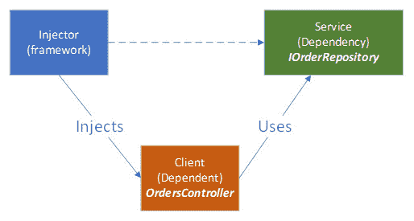
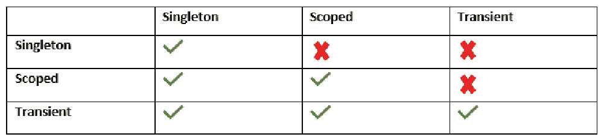
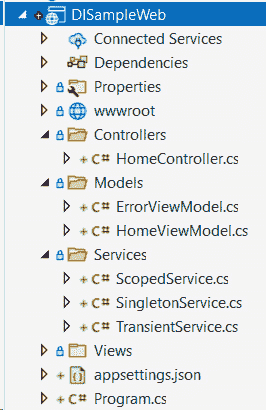
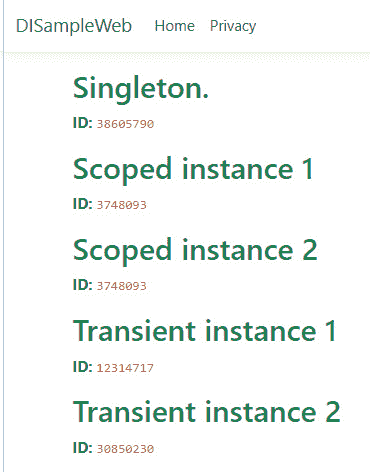
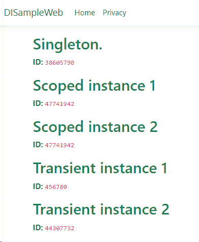
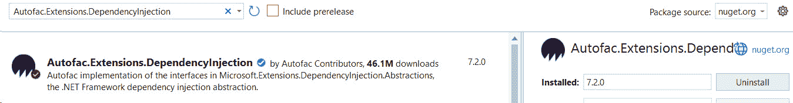
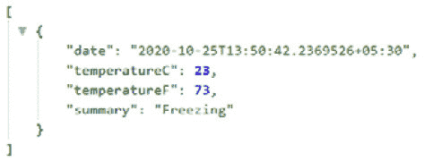

# *第五章*：.NET 6 中的依赖注入

企业应用程序可能面临的一个大问题是将不同元素连接起来并管理它们的生命周期的复杂性。为了解决这个问题，我们使用 **控制反转**（**IoC**）原则，该原则建议移除对象之间的依赖关系。通过委派控制流，IoC 使程序可扩展并增加了模块化。事件、回调委托、观察者模式和 **依赖注入**（**DI**）是实现 IoC 的几种方法。

在本章中，我们将学习以下内容：

+   什么是 DI？

+   ASP.NET Core 6 中的 DI

+   管理应用程序服务

+   使用第三方容器

到本章结束时，你将很好地了解 DI 以及它在 .NET 6 应用程序中的利用方式，ASP.NET Core 6 中提供的范围类型，以及如何在项目中利用它们。

# 技术要求

本章使用的代码可以在以下位置找到：[`github.com/PacktPublishing/Enterprise-Application-Development-with-C-10-and-.NET-6-Second-Edition/tree/main/Chapter05`](https://github.com/PacktPublishing/Enterprise-Application-Development-with-C-10-and-.NET-6-Second-Edition/tree/main/Chapter05)。

# 什么是 DI？

DI 是一种技术，其中对象接收它所依赖的对象。DI 模式实现了作为 **单一职责原则、开闭原则、里氏替换原则、接口隔离原则和依赖倒置原则**（**SOLID**）设计原则一部分的 DI 原则，如 *第一章*，*设计和架构企业应用程序* 中所述。使用 DI，代码将更易于维护、阅读、测试和扩展。

DI 是帮助实现更易于维护代码的最知名方法之一。DI 涉及三个实体，如下面的图所示：



图 5.1 – DI 关系

`IOrderRepository` 负责处理 `Order` 实体。.NET IoC 容器（`IOrderRepository` (`OrderController`（客户端））。

**IoC 容器**（也称为 **DI 容器**）是一个用于实现自动 DI 的框架。在 *图 5.1* 中，这被称为 **注入器**。它负责创建或引用依赖关系并将其注入到 **客户端**。

现在我们已经了解了什么是 DI，让我们来了解 DI 的类型。

## DI 类型

服务可以以多种方式注入到依赖项中。根据服务注入客户端对象的方式，DI 被分为三种类型，如下所述：

+   `IWeatherProvider` 依赖项通过构造函数参数注入：

    ```cs
        public class WeatherService
        {
            private readonly IweatherProvider
                weatherProvider;
            public WeatherService(IWeatherProvider
                weatherProvider)
                    => this.weatherProvider =
                        weatherProvider;
            public WeatherForecast GetForecast(string
                location) =>
                this.weatherProvider.
                    GetForecastOfLocation (location);   
        }
    ```

在前面的示例中，`WeatherService` 依赖于 `IWeatherProvider`，它通过构造函数参数注入。

注意

对于 `WeatherProvider` 服务的实现，请参考 GitHub 上的示例代码，该代码可在以下链接找到：[`github.com/PacktPublishing/Enterprise-Application-Development-with-C-10-and-.NET-6-Second-Edition/blob/main/Chapter05/DITypes/Service/WeatherProvider.cs`](https://github.com/PacktPublishing/Enterprise-Application-Development-with-C-10-and-.NET-6-Second-Edition/blob/main/Chapter05/DITypes/Service/WeatherProvider.cs)。

在初始化 `WeatherService2` 时，`IWeatherProvider` 依赖项未设置。它是在对象初始化后通过 `WeatherProvider` 属性设置的：

```cs
    public class WeatherService2
    {
        private IWeatherProvider _weatherProvider;
        public IWeatherProvider WeatherProvider
        {
            get => _weatherProvider == null ?
                        throw new
                            InvalidOperationException(
                            "WeatherService is not
                            initialized")
                    : _weatherProvider;
            set => _weatherProvider = value;
        }
        public WeatherForecast GetForecast(string
            location) =>
            this.WeatherProvider.
                GetForecastOfLocation(location);
    }
```

+   `IWeatherProvider` 依赖项作为所需的方法参数进行注入。

在以下代码片段中，`IWeatherProvider` 服务通过 `GetForecast` 方法注入到 `WeatherService` 中：

```cs
    public class WeatherService
    {
       public WeatherForecast GetForecast(
           string location, IWeatherProvider
           weatherProvider)
        {
            if(weatherProvider == null)
            {
                throw new ArgumentNullException(
                    nameof(weatherProvider));
            }
            return weatherProvider.
                GetForecastOfLocation (location);
        }
    }
```

以下是一些建议，可以帮助选择依赖注入的类型：

+   当类有依赖项且没有这个依赖项功能无法工作时，请使用构造函数注入。

+   当依赖项在类的多个函数中使用时，请使用构造函数注入。

+   当依赖项在类实例化后可以更改时，请使用属性注入。

+   当依赖项的实现随着每次调用而改变时，请使用方法注入。

在大多数情况下，构造函数注入将被用于干净且解耦的代码，但根据需要，我们还将利用方法和属性注入技术。

我们现在已经学习了依赖注入的概念。让我们深入了解 .NET 6 提供的依赖注入实现。

# ASP.NET Core 6 中的依赖注入

.NET 6 内置了 IoC 容器框架，这简化了依赖注入。这包括 `Microsoft.Extensions.DependencyInjection` NuGet 包和 ASP.NET Core 6 框架本身严重依赖于它。为了支持依赖注入，容器需要对对象/服务支持三个基本操作，如下所述：

+   **注册**：容器应提供注册依赖项的机制。这将有助于将正确的类型映射到类，以便它可以创建正确的依赖项实例。

+   **解析**：容器应通过创建依赖对象并将其注入到依赖实例中来解析依赖项。IoC 容器通过传递所有必需的依赖项来管理已注册对象的形成。

+   **释放**：容器负责管理通过它创建的依赖项的生命周期。

在 .NET 6 中，以下术语被使用：

+   **服务**：指由容器管理的依赖项

+   `IConfiguration`、`ILoggerFactory`、`IWebHostEnvironment` 等

+   我们在上一节中使用的 `IWeatherProvider` 服务

为了使应用程序启动，ASP.NET Core 6 框架注入了一些依赖项，这些依赖项被称为 `WebApplicationBuilder` 注入所需的框架服务，如 `IConfiguration` 和 `IWebHostEnvironment`。当您尝试打印已注册的服务时，如下代码片段所示（参考 [`github.com/PacktPublishing/Enterprise-Application-Development-with-C-10-and-.NET-6-Second-Edition/blob/main/Chapter05/DITypes/Program.cs#L16`](https://github.com/PacktPublishing/Enterprise-Application-Development-with-C-10-and-.NET-6-Second-Edition/blob/main/Chapter05/DITypes/Program.cs#L16) 中的代码），我们可以列出已注册的框架服务：

```cs
foreach(var i in builder.Services.AsEnumerable())
```

```cs
{
```

```cs
    Console.WriteLine($"{i.Lifetime} - {i.ServiceType.ToString()}");
```

```cs
}
```

在 ASP.NET Core 6.0 中，`IWebHostEnvironment` 框架服务可通过 `builder.Environment` 属性获取。同样，配置可通过 `builder.Configuration` 属性获取。

ASP.NET Core 6 运行时实例化所有必需的框架服务并将它们注册到 IoC 容器中。从 ASP.NET Core 6 开始，它们可通过 `Program.cs` 中的 `WebApplication` 和 `WebApplicationBuilder` 的属性访问。这些框架服务可以通过我们在上一节中讨论的任何 DI 类型注入到控制器和其他服务中。

应用程序服务是由开发人员注入到容器中的服务。这些服务将使用 `WebApplicationBuilder` 的 `Services` 属性进行注册。以下代码片段展示了如何将 `IWeatherProvider` 应用程序服务注册到容器中：

```cs
builder.Services.AddScoped<IWeatherProvider, WeatherProvider>();
```

在下一节中，我们将了解这些服务的生命周期以及它们是如何被管理的。

注意

请参阅*第十章*，*创建 ASP.NET Core 6 Web API*，了解 `Program.cs` 文件中的代码。

## 理解服务生命周期

当您使用指定的生命周期注册服务时，容器将根据指定的生命周期自动销毁对象。在 Microsoft DI 容器中，可以使用以下三种类型的生命周期：

+   `AddTransient` 扩展方法用于注册此生命周期，如下代码片段所示：

    ```cs
    public static IServiceCollection AddTransient(this
     IServiceCollection services, Type serviceType);
    ```

    注意

    临时生命周期通常用于无状态、轻量级的服务。

+   `ServiceProvider` 在应用程序关闭时被销毁。使用 `AddSingleton` 扩展方法注册此生命周期，如下代码片段所示：

    ```cs
    public static IServiceCollection AddSingleton(this
     IServiceCollection services, Type serviceType);
    ```

+   `DbContext` 使用作用域生命周期进行注册。使用 `AddScoped` 扩展方法注册到作用域生命周期范围，如下代码片段所示：

    ```cs
    public static IServiceCollection AddScoped(this
     IServiceCollection services, Type serviceType);
    ```

在应用程序开发中，需要明智地选择生命周期类型。一个服务不应依赖于生命周期比其短的服务；例如，注册为单例的服务不应依赖于注册为瞬时的服务。以下表格显示了哪些生命周期可以安全地依赖于哪些其他生命周期范围：




表 5.1 – 生命周期依赖

作为开发者，你不需要担心范围验证。内置的范围验证在 ASP.NET Core 6 中完成，当环境设置为 `InvalidOperationException` 时抛出。这可以通过在注册 `ServiceProvider` 时为所有环境配置启用 `ValidateScopes` 选项来显式打开。在此代码片段中，当创建主机构建器时，`ValidateScopes` 设置为 `true` 以打开范围验证：

```cs
builder.Host.UseDefaultServiceProvider(opt => { opt.ValidateScopes = true; }); 
```

让我们创建一个 ASP.NET Core 6 Web 应用程序来了解服务生命周期。我们将创建不同的服务并将它们注册为单例、作用域和瞬态生命周期范围，并观察它们的行为。按照以下步骤进行：

1.  创建一个新的 ASP.NET Core Web 应用程序（`DISampleWeb`）。

1.  创建一个名为 `Services` 的新项目文件夹，并添加三个类：`ScopedService`、`SingletonService` 和 `TransientService`。添加以下代码（所有这些服务都将相同，其中没有任何实际代码；我们只是根据它们的名称将它们注册为不同的生命周期范围）：（所有这些服务都将相同，其中没有任何实际代码；我们只是根据它们的名称将它们注册为不同的生命周期范围）

    ```cs
    public interface IScopedService {     }
    public class ScopedService : IScopedService {    }
    ```

1.  `SingletonService.cs`：此类将使用单例生命周期范围进行注册，如下代码片段所示：

    ```cs
    public interface ISingletonService   {    }
    public class SingletonService : ISingletonService {  }
    ```

1.  `TransientService.cs`：此类将使用瞬态生命周期范围进行注册，如下代码片段所示：

    ```cs
    public interface ITransientService   {    }
    public class TransientService : ITransientService{   }
    ```

1.  现在，在 `Program.cs` 中使用 `IServiceCollection` 注册这些服务，如下所示：

    ```cs
    //Register as Scoped
    builder.Services.AddScoped<IScopedService,ScopedService>();
    //Register as Singleton
    builder.Services.AddSingleton<ISingletonService,SingletonService>();
    //Register as Transient
    builder.Services.AddTransient<ITransientService,TransientService>();
    ```

服务描述符集合 `IServiceCollection` 通过 `WebApplicationBuilder` 的 `Services` 属性公开。

1.  现在，在 `Models` 文件夹下添加 `HomeViewModel` 模型类，该类将用于显示从先前注册的服务检索到的数据。以下代码片段说明了如何进行此操作：

    ```cs
    public class HomeViewModel
    {
            public int Singleton { get; set; }
            public int Scoped { get; set; }
            public int Scoped2 { get; internal set; }
            public int Transient { get; set; }
            public int Transient2 { get; internal set; }
    }
    ```

由于我们已使用 ASP.NET Core 6 IoC 容器注册了 `ScopedService`、`SingletonService` 和 `TransientService`，我们将通过构造函数注入获取这些服务。

1.  现在，我们将添加代码以在 `HomeController` 和 `Views` 中获取这些服务，以在主页上显示从这些对象检索到的数据。修改主页控制器以获取两个 `ScopedService` 和 `TransientService` 的实例，并使用服务对象的哈希码设置 `ViewModel`。解决方案结构如下截图所示：




图 5.2 – 解决方案结构

注意

`GetHashCode` 方法返回对象的哈希码。这将根据实例而变化。

1.  修改`HomeController`的构造函数以接受已注册的服务，并定义私有字段以引用服务实例，如下所示：

    ```cs
    private readonly ILogger<HomeController> _logger;
    private readonly IScopedService scopedService;
    private readonly IScopedService scopedService2;
    private readonly ISingletonService singletonService;
    private readonly ITransientService transientService;
    private readonly ITransientService transientService2;
    public HomeController(ILogger<HomeController> logger,
    IScopedService scopedService,
    IScopedService scopedService2,
    ISingletonService singletonService,
    ITransientService transientService,
    ITransientService transientService2)
    {
         this._logger = logger;
         this.scopedService = scopedService;
         this.scopedService2 = scopedService2;
         this.singletonService = singletonService;
         this.transientService = transientService;
         this.transientService2 = transientService2;
    }
    ```

1.  现在，修改`HomeController`下的`Index`方法，设置`HomeViewModel`，如下所示：

    ```cs
    public IActionResult Index()
    {
          var viewModel = new HomeViewModel
         {
             Scoped = scopedService.GetHashCode(),
             Scoped2 = scopedService2.GetHashCode(),
             Singleton = singletonService.GetHashCode(),
             Transient = transientService.GetHashCode(),
             Transient2 = transientService2.GetHashCode(),
          };
          return View(viewModel);
    }
    ```

1.  接下来，修改`~/Views/Home`文件夹下的`Index.cshtml`，以在页面上显示`HomeViewModel`，如下所示：

    ```cs
    @model HomeViewModel
    @{
        ViewData["Title"] = "Home Page";
    }
    <h2 class="text-success">Singleton.</h2>
    <p>
            <strong>ID:</strong> <code>@Model.Singleton
    </code>
    </p>
    <h2 class="text-success">Scoped instance 1</h2>
    <p>
            <strong>ID:</strong> <code>@Model.Scoped</code>
    </p>
    <h2 class="text-success">Scoped instance 2</h2>
    <p>
            <strong>ID:</strong> <code>@Model.Scoped2</code>
    </p>
    <h2 class="text-success">Transient instance 1</h2>
    <p>
            <strong>ID:</strong> <code>@Model.Transient</code>
    </p>
    <h2 class="text-success">Transient instance 2</h2>
    <p>
            <strong>ID:</strong> <code>@Model.Transient2</code>
    </p>
    ```

1.  现在，运行应用程序。你会看到如下输出：



图 5.3 – 第一次运行的示例输出

如果我们观察输出，`ScopedService`是相同的。这是因为对于每个请求作用域，只为`IScopedService`创建一个对象。请注意，当你运行代码时，ID 可能不同，因为它们是在运行时生成的。

临时服务的 ID 对于两个服务都是不同的。正如我们所学的，这是因为每次对 IoC 容器的请求都会创建一个新的实例。

1.  现在，再次刷新页面。你会看到类似如下输出：



图 5.4 – 第二次运行的示例输出

如果我们比较图 5.3 和图 5.4 中的输出，我们会注意到`SingletonService`的 ID 没有改变——这是因为应用程序的生命周期中，对于单例对象只创建一个对象。到目前为止，我们已经看到了如何根据注册来管理服务生命周期。了解何时销毁对象也同样重要。在下一节中，我们将学习关于服务销毁的内容。

### 服务销毁

如我们在本章前面所学，对象的销毁是 IoC 容器框架的责任。容器会调用实现`IDisposable`接口的服务的`Dispose`方法。由容器创建的服务不应被开发者显式销毁。同样，开发者负责销毁他们创建的实例。

考虑以下代码片段，其中`SingletonService`实例以单例作用域注册：

```cs
var _disposableSingletonService= new DisposableSingletonService();
```

```cs
// Registering an instance of a class with singleton lifetime
```

```cs
builder.Services.AddSingleton<IDisposableSingletonService>(_disposableSingletonService);
```

注意

对于`DisposableSingletonService`的简单实现，请参考以下链接中的代码：[`github.com/PacktPublishing/Enterprise-Application-Development-with-C-10-and-.NET-6-Second-Edition/blob/main/Chapter05/DISampleWeb/Services/DisposableSingletonService.cs`](https://github.com/PacktPublishing/Enterprise-Application-Development-with-C-10-and-.NET-6-Second-Edition/blob/main/Chapter05/DISampleWeb/Services/DisposableSingletonService.cs)。

在前面的代码片段中，我们创建了一个 `DisposableSingletonService` 的对象，并将其注册到 IoC 容器中。服务实例不是由容器创建的。在这种情况下，IoC 容器不会释放该对象；开发者有责任释放它。我们可以在 `IHostApplicationLifetime` 的 `ApplicationStopping` 事件触发时释放对象，该事件通过 `WebApplication` 的 `Lifetime` 属性公开，如下面的代码片段所示：

```cs
app.Lifetime.ApplicationStopping.Register(() => {
```

```cs
    _disposableSingletonService.Dispose();
```

```cs
});
```

在前面的代码片段中，`IHostApplicationLifetime` 由运行时注入到 `WebApplication` 中。此接口允许消费者接收 `ApplicationStarted`、`ApplicationStopped` 和 `ApplicationStopping` 应用程序生命周期事件的通知。为了释放单例对象，我们将通过注册到 `ApplicationStopping` 生命周期事件来调用 Dispose() 方法。

.NET 6 中 DI 的新增功能是对作用域的 `IAsyncDisposable` 支持。在 `IServiceProvider` 中添加了一个新的 `CreateAsyncScope` 扩展方法来支持异步服务作用域的创建，并添加了一个 `AsyncServiceScope` 包装器，它实现了 `IAsyncDisposable`。以下代码展示了如何异步地释放作用域：

```cs
// Refer AsyncDisposableScope sample code for the implementation
```

```cs
await using (var scope = provider.CreateAsyncScope())
```

```cs
{
```

```cs
    var foo = scope.ServiceProvider.GetRequiredService<IWeatherProviderAsync>();
```

```cs
} 
```

从现在开始，如果你在手动创建作用域的地方使用依赖 `CreateAsyncScope`。

注意

请参考以下 Microsoft 文档以了解更多关于 DI 指南的信息：

[`docs.microsoft.com/en-us/dotnet/core/extensions/dependency-injection-guidelines`](https://docs.microsoft.com/en-us/dotnet/core/extensions/dependency-injection-guidelines)

到目前为止，我们已经探讨了服务生命周期以及它们在 .NET 6 中的释放方式。在下一节中，我们将学习如何管理应用程序服务。

## 管理应用程序服务

在 ASP.NET Core 6 中，当请求被 `MvcMiddleware` 接收到时，会使用路由来选择控制器和操作方法。`IControllerActivator` 会创建控制器的实例，并从依赖注入容器中加载构造函数参数。

在 *理解服务生命周期* 部分，我们看到了应用程序服务是如何注册的以及它们的生命周期是如何管理的。在示例中，服务是通过构造函数注入的，这被称为构造函数注入。在本节中，我们将了解如何实现方法注入，并探讨在 ASP.NET Core 6 的 IoC 容器中应用程序服务可以如何注册和访问。

### 通过方法注入访问已注册的服务

在前面的章节中，我们看到了依赖服务是如何注入到控制器构造函数中，并且引用被存储在一个局部字段中，用于调用依赖的**方法**/**应用程序编程接口**（**API**）。

有时，我们不想在控制器的所有操作中都有依赖服务可用。在这种情况下，可以通过方法注入来注入服务。这通过创建一个带有`[FromServices]`属性的参数来完成，如下面的示例所示：

```cs
public IActionResult Index([FromServices] ISingletonService singletonService2)
```

```cs
{
```

```cs
}
```

ASP.NET Core 6 中引入的最小 API 允许我们在路由处理程序中请求 DI 服务，而无需显式使用`[FromServices]`属性，如下所示：

```cs
app.MapGet("/", (ISingletonService service) => service.DoAction());
```

你可能想知道运行时如何区分注入的服务和其他参数。为了实现这一点，.NET6 引入了一个新的`IServiceProviderIsService`接口，它有助于识别给定的服务类型已注册在 DI 容器中，而不需要创建其实例。

在下一节中，我们将看到同一服务类型的多个实例的注册以及如何访问它们。

### 注册多个实例

对于给定的接口，我们可以使用 IoC 容器注册多个实现。

注意

如果为同一服务类型注册了多个实现，则最后一个注册将优先于所有之前的注册。

考虑以下服务注册，其中`IWeatherForecastService`服务注册了两个实现——`WeatherForecastService`和`WeatherForecastServiceV2`：

```cs
services.AddScoped<IWeatherForecastService, WeatherForecastService>();
```

```cs
services.AddScoped<IWeatherForecastService, WeatherForecastServiceV2>();
```

现在，当从控制器请求`IWeatherForecastService`的实例时，将提供`WeatherForecastServiceV2`的实例，如下面的代码片段所示：

```cs
private readonly IWeatherForecastService weatherForecastService;
```

```cs
public WeatherForecastController(ILogger<WeatherForecastController> logger, IWeatherForecastService weatherForecastService)
```

```cs
{
```

```cs
      _logger = logger;
```

```cs
      this.weatherForecastService = weatherForecastService;
```

```cs
}
```

在前面的示例中，可能看起来`WeatherForecastV2`的注册覆盖了`WeatherForecastService`的先前注册。然而，ASP.NET Core 6 的 IoC 容器将包含所有`IWeatherForecastService`的注册。要获取所有注册，请按如下方式获取服务作为`IEnumerable`：

```cs
private readonly IEnumerable<IWeatherForecastService> weatherForecastServices;
```

```cs
public WeatherForecastController(
```

```cs
ILogger<WeatherForecastController> logger, IEnumerable<IWeatherForecastService> weatherForecastServices)
```

```cs
{
```

```cs
   _logger = logger;
```

```cs
   this.weatherForecastServices = weatherForecastServices;
```

```cs
}
```

这在执行`WebApplicationBuilder`的`Services`属性等场景中可能很有用。因此，在未来，当添加或删除现有规则时，更改将仅限于向`Services`属性注入新的服务。

### 使用 TryAdd

在本节中，我们将了解如何避免意外覆盖已注册的服务。

`TryAdd`扩展方法仅在不存在相同服务的注册时注册服务。`TryAdd`扩展方法对所有生命周期范围（`TryAddScoped`、`TryAddSingleton`和`TryAddTransient`）都可用。

如以下代码片段所示，使用服务注册时，当请求`IWeatherForecastService`时，IoC 容器提供`WeatherForecastService`，而不是`WeatherForecastServiceV2`：

```cs
services.AddScoped<IWeatherForecastService, WeatherForecastService>();
```

```cs
services.TryAddScoped<IWeatherForecastService, WeatherForecastServiceV2>();
```

为了克服可能因重复注册而产生的副作用，始终建议使用`TryAdd`扩展方法来注册服务。

现在，让我们看看如何替换已注册的服务。

### 替换现有注册

ASP.NET Core 6 IoC 容器提供了一种替换现有注册的方法。在下面的示例中，`IWeatherForecastService` 首先使用 `WeatherForecastService` 进行注册。然后它被替换为 `WeatherForecastServiceV2`：

```cs
builder.Services.TryAddScoped<IWeatherForecastService, WeatherForecastService>();
```

```cs
builder.Services.Replace(ServiceDescriptor.Scoped<IWeatherForecastService, WeatherForecastServiceV2>());
```

与 `WeatherForecastServiceV2` 的 `Replace` 实例一样，一个实现被提供给 `WeatherForecastController` 构造函数。在下面的代码片段中，与 *注册多个实例* 部分不同，我们将在 `weatherForecastService` 构造函数变量中只看到一个对象：

```cs
public WeatherForecastController(ILogger<WeatherForecastController> logger, IEnumerable<IWeatherForecastService> weatherForecastService)
```

```cs
{
```

```cs
      _logger = logger;
```

```cs
      this.weatherForecastService = weatherForecastService;
```

```cs
}
```

到目前为止，在本节中，我们已经学习了如何使用 IoC 容器注册和替换服务。有时我们可能需要删除当前的注册。考虑这样一个场景，你希望利用库中的服务和注册，但你没有访问其源代码的权限。如果你重新实现了该库的一些接口并将它们重新注册到容器中，你可能会看到一些意外的行为。在下一节中，我们将了解如何删除已注册的服务。

### 删除现有注册

要删除现有注册，ASP.Net Core 6 IoC 容器提供了 `Remove` 扩展方法。你可以使用 `RemoveAll` 方法删除与某个服务相关的所有注册，如下面的代码片段所示：

```cs
services.RemoveAll<IWeatherForecastService>();
```

在下面的代码片段中，`Remove` 方法从容器中移除了 `WeatherForecastService` 实现的注册：

```cs
//Removes the first registration of IWeatherForecastService           
```

```cs
Builder.Services.Remove(ServiceDescriptor.Scoped<IWeatherForecastService, WeatherForecastService>());
```

到目前为止，我们已经看到了如何处理复杂的服务，但当涉及到泛型开放类型时，注册每个构造的泛型类型将会变得困难。在下一节中，我们将学习如何处理泛型开放类型服务。

注意

要了解更多关于泛型类型的信息，你可以参考以下网站：[`docs.microsoft.com/en-us/dotnet/csharp/language-reference/language-specification/types`](https://docs.microsoft.com/en-us/dotnet/csharp/language-reference/language-specification/types)。

### 注册泛型

本节将介绍如何使用依赖注入处理泛型类型服务。

对于泛型类型，为每种正在使用的实现类型注册服务是没有意义的。ASP.NET Core 6 IoC 容器提供了一种简化泛型类型注册的方法。框架本身已经提供的一个此类类型是 `ILogger`，如下面的代码片段所示：

```cs
Builder.Services.TryAdd(ServiceDescriptor.Singleton(typeof(ILogger<>), typeof(Logger<>))); 
```

注意

为了方便参考，你可以访问以下链接：[`github.com/dotnet/runtime/blob/main/src/libraries/Microsoft.Extensions.Logging/src/LoggingBuilderExtensions.cs`](https://github.com/dotnet/runtime/blob/main/src/libraries/Microsoft.Extensions.Logging/src/LoggingBuilderExtensions.cs)。

泛型的一个用例是与数据访问层一起使用的泛型仓储模式。

在我们拥有的所有注册信息中，`ConfigureServices` 方法可能会变得很大，以至于不再可读。下一节将帮助你了解如何解决这个问题。

### 代码可读性的扩展方法

ASP.NET Core 6 框架遵循的使代码看起来更易读的模式是创建一个具有逻辑分组的服务注册扩展方法。以下代码尝试使用扩展方法对通知相关服务进行分组和注册。一般做法是使用 `Microsoft.Extensions.DependencyInjection` 命名空间来定义服务注册扩展方法。这将使开发者只需使用 `Microsoft.Extensions.DependencyInjection` 命名空间就能使用所有与依赖注入相关的功能。

在下面的代码片段中，使用 `AddNotificationServices` 注册了与通知相关的服务：

```cs
namespace Microsoft.Extensions.DependencyInjection
```

```cs
{
```

```cs
public static class NotificationServicesServiceCollectionExtension
```

```cs
{
```

```cs
   public static IServiceCollection AddNotificationServices(this IServiceCollection services)
```

```cs
  {
```

```cs
       services.TryAddScoped<INotificationService, EmailNotificationService>();
```

```cs
       services.TryAddScoped<INotificationService, SMSNotificationService>();
```

```cs
        return services;
```

```cs
   }
```

```cs
}
```

现在扩展方法已经创建，我们可以使用 `AddNotificationServices` 方法在 `ConfigureServices` 下注册通知服务。这将使 `ConfigureServices` 更易于阅读。代码如下所示：

```cs
builder.Services.AddNotificationServices();
```

我们已经看到了如何将服务注入到控制器和其他类中。在下一节中，我们将学习如何将服务注入到视图中。

## Razor Pages 中的依赖注入

MVC 中视图的目的是显示数据。大多数情况下，在视图中显示的数据是从控制器传递过来的。考虑到 **关注点分离**（**SoC**）原则，建议从控制器传递所有必要的数据，但可能存在我们想要从诸如本地化和遥测服务之类的页面查看特定服务的情况。使用由 Razor 视图支持的依赖注入，我们可以将这些服务注入到视图中。

要了解如何将服务注入到视图中，让我们修改在前几章中创建的 `DISampleWeb` 应用程序。我们将修改 `DISampleWeb` 应用程序，以便在设置飞行标志的情况下在主页上显示额外内容。将 `isFlightOn` 配置添加到 `appsettings.json` 中，如下面的代码片段所示：

```cs
{
```

```cs
  "AllowedHosts": "*",
```

```cs
  "isFlightOn": "true"
```

```cs
}
```

现在，修改 `Home` 下的索引视图以显示 `Flight` 下的内容，如下面的代码片段所示：

```cs
@using Microsoft.Extensions.Configuration
```

```cs
@inject Iconfiguration Configuration
```

```cs
@{
```

```cs
   string isFlightOn = Configuration["isFlightOn"];
```

```cs
   if (string.Equals(isFlightOn, "true", StringComparison.OrdinalIgnoreCase))
```

```cs
   {
```

```cs
       <h1>
```

```cs
        <strong>Flight content</strong>
```

```cs
       </h1>
```

```cs
   }
```

```cs
}
```

在这里，提供读取配置文件功能的 `IConfiguration` 服务通过 `@inject` 关键字注入到 Razor 视图中。注入的配置服务用于获取配置并基于设置显示额外内容。我们可以使用 `@inject` 关键字将任何已注册到 `IServiceCollection` 的服务注入到 Razor 视图中。

到目前为止，我们已经看到了如何利用 .NET 6 内置的 IoC 容器。在下一节中，我们将学习如何利用第三方容器。

# 使用第三方容器

虽然内置容器对于大多数场景来说已经足够，但 .NET 6 提供了一种与第三方容器集成的途径，如果需要的话可以加以利用。

让我们更详细地看看框架是如何连接服务的。当 `Startup` 类在 `Program.cs` 中与 `HostBuilder` 注册时，.NET 框架使用反射来识别并调用 `Configure` 和 `ConfigureServices` 方法。

下面是从 ASP.NET Core 6 的`StartupLoader`类的`LoadMethods`方法中摘录的一段代码（请参阅[`github.com/dotnet/aspnetcore/blob/main/src/Hosting/Hosting/src/Internal/StartupLoader.cs`](https://github.com/dotnet/aspnetcore/blob/main/src/Hosting/Hosting/src/Internal/StartupLoader.cs)中的代码）：

```cs
public static StartupMethods LoadMethods(IServiceProvider hostingServiceProvider, [DynamicallyAccessedMembers(StartupLinkerOptions.Accessibility)] Type startupType, string environmentName, object? instance = null)
```

```cs
{ 
```

```cs
    var configureMethod = FindConfigureDelegate(startupType, environmentName);
```

```cs
    var servicesMethod = FindConfigureServicesDelegate(startupType, environmentName);
```

```cs
    var configureContainerMethod = FindConfigureContainerDelegate(startupType, environmentName);
```

```cs
     -----------------------
```

```cs
}
```

从前面的代码片段中，我们可以看到前两个方法，`FindConfigureDelegate`和`FindConfigureServicesDelegate`，是为了找到`Configure`和`ConfigureServices`方法。

最后一行是用于`ConfigureContainer`的。我们可以在`Startup`类中定义一个`ConfigureContainer`方法来配置服务到第三方容器中。

下面是可用于 ASP.NET Core 6 的一些流行的 DI 框架：

+   **Unity**: Unity 最初由微软构建，目前是开源的。这是.NET 中最古老的 DI 容器之一。文档可在以下链接找到：[`unitycontainer.org/`](http://unitycontainer.org/).

+   **Autofac**: 这是最受欢迎的 DI 容器之一。它提供了全面的文档，可在以下链接找到：[`autofaccn.readthedocs.io/en/latest/index.html`](https://autofaccn.readthedocs.io/en/latest/index.html).

+   **Simple Injector**: 这是列表中较晚出现的一个。文档可在以下链接找到：[`simpleinjector.readthedocs.io/en/latest/index.html`](https://simpleinjector.readthedocs.io/en/latest/index.html).

+   **Castle Windsor**: 这是.NET 中可用的最古老的 DI 框架之一。可在以下链接查看其文档：[`www.castleproject.org/projects/windsor/`](http://www.castleproject.org/projects/windsor/).

虽然这些框架之间存在一些差异，但通常功能是相同的。大多数情况下，开发者的体验决定了框架的选择。

在下一节中，我们将看看如何利用 Autofac 第三方 IoC 容器。

### Autofac IoC 容器

Autofac 是开发者社区中最受欢迎的 IoC 容器之一。与其他任何 IoC 容器一样，它管理类之间的依赖关系，以便随着应用程序复杂性和规模的增加，应用程序仍然易于更改。让我们学习如何使用 Autofac 注册我们在本章前面使用过的相同`WeatherProvider`服务。按照以下步骤进行：

1.  使用 ASP.NET Core Web API 模板创建一个新的项目，并将其命名为`AutofacSample`。

1.  将`Autofac.Extensions.DependencyInjection` NuGet 包引用添加到`AutofacSample`项目中，如图所示：



Figure 5.5 – 添加 Autofac.Extensions.DependencyInjection NuGet 包

1.  我们需要将`AutofacServiceProviderFactory`与`ConfigureHostBuilder`注册，以便运行时使用 Autofac IoC 容器。在`Program.cs`中，注册 Autofac SP 工厂，如下面的代码片段所示：

    ```cs
    builder.Host.UseServiceProviderFactory(new AutofacServiceProviderFactory());
    ```

1.  现在，让我们将我们在*DI 类型*部分使用的`IWeatherProvider`服务注册到 Autofac 容器中。在`Program.cs`中，通过`WebApplicationBuilder`的`ConfigureHostBuilder`属性的`ConfigureContainer`方法将`IWeatherProvider`与`WeatherProvider`实现注册，如下所示：

    ```cs
    builder.Host.ConfigureContainer<ContainerBuilder>(builder =>
    {
        builder.RegisterType<WeatherProvider>()
                        .As<IWeatherProvider>();
    });
    ```

1.  与默认.NET IoC 容器类似，我们将`IWeatherForecast`服务注入到`WeatherForecastController`控制器中，如下面的代码片段所示：

    ```cs
    public class WeatherForecastController : ControllerBase
    {
            private readonly ILogger<WeatherForecastController> _logger;
            private readonly IWeatherProvider weatherProvider;
            public WeatherForecastController( ILogger<WeatherForecastController> logger,
    IWeatherProvider weatherProvider)
            {
                _logger = logger;
                this.weatherProvider = weatherProvider;
            }
            [HttpGet]
            public IEnumerable<WeatherForecast> Get()
            {
                return weatherProvider.GetForecast();
            }
    }
    ```

现在，当你运行项目并导航到`https://localhost:7184/WeatherForecast` **统一资源标识符** (**URI**)时，你将在浏览器中看到以下输出：



图 5.6 – 容器的最终输出

在上一个示例中，我们看到了使用第三方 Autofac IoC 容器代替.NET 6 提供的默认容器。

# 摘要

本章向您介绍了 DI 的概念，这有助于编写松散耦合、更易于测试和更易于阅读的代码。本章涵盖了 DI 的类型以及它们如何在 ASP.NET Core 6 中得到支持。我们还看到了如何使用不同类型的注册来管理对象的生命周期。本章还向您介绍了一些流行的第三方 IoC 容器，以进一步探索。我们将使用本章学到的概念来构建我们的电子商务应用程序。在*第十五章*的*测试*中，我们还将看到 DI 如何帮助提高可测试性。

如*第一章*中建议的，在*关注点分离/单一责任架构*部分，我们总是尝试通过接口注册服务。这将有助于在任何时候更改具体实现，而不会更改客户端实现。

在下一章中，我们将学习如何配置.NET 6 并了解不同的配置，同时学习如何构建自定义配置。

# 问题

1.  以下哪个不是框架服务？

a. `IConfiguration`

b. `IApplicationBuilder`

c. `IWeatherService`

d. `IWebHostEnvironment`

**答案：c**

1.  真或假：DI 是实现 IoC 的一种机制。

a. 真的

b. 假的

**答案：a**

1.  真或假：注入的服务可以依赖于生命周期比其短的服务。

a. 真的

b. 假的

**答案：b**

1.  以下哪个不是 ASP.NET Core 6 IoC 容器的有效生命周期范围？

a. 作用域

b. 单例

c. 持久

d. 动态

**答案：d**
